# Workshop Company Brain - 2a serata: Il Metodo

> Documento generato automaticamente: trascrizione e screenshot sincronizzati del video-corso.

## [00:00:00] Schermata 0 _(start)_

> Sottotitoli e revisione a cura di QTSS Sottotitoli e revisione a cura di QTSS

## [00:01:00] Schermata 1 _(periodic)_

**Testo a schermo (OCR):** Com pany Brain | SERATA 2° Martedì 21 Luglio - ore 20:30

> Sottotitoli e revisione a cura di QTSS Sottotitoli e revisione a cura di QTSS

## [00:02:00] Schermata 2 _(periodic)_

**Testo a schermo (OCR):** Com pany Brain | SERATA 2° Martedì 21 Luglio - ore 20:30

> Sottotitoli e revisione a cura di QTSS Sottotitoli e revisione a cura di QTSS

## [00:03:00] Schermata 3 _(periodic)_

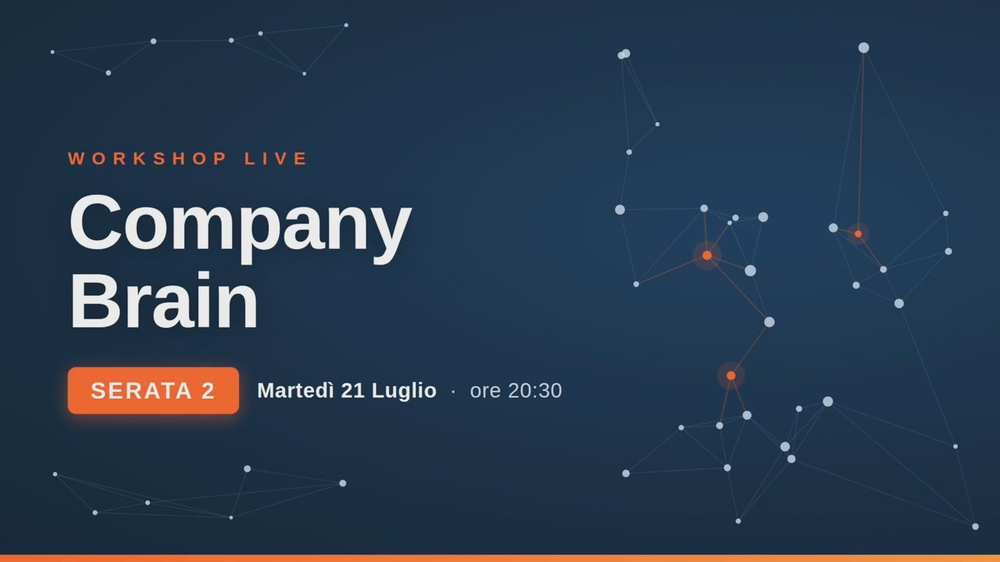

**Testo a schermo (OCR):** Com pany Brain | SERATA 2° Martedì 21 Luglio - ore 20:30

> Sottotitoli e revisione a cura di QTSS Sottotitoli e revisione a cura di QTSS

## [00:04:00] Schermata 4 _(periodic)_

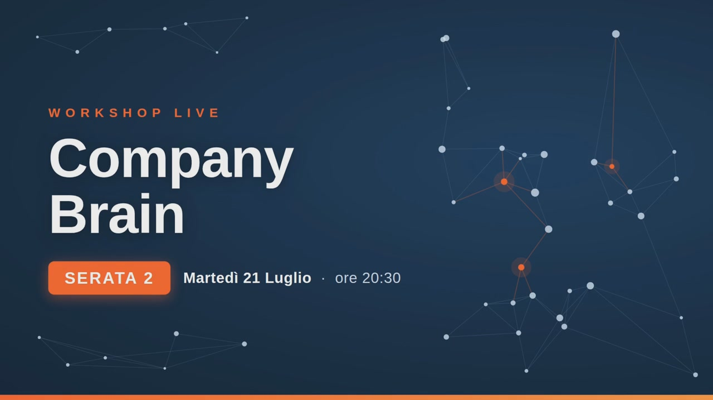

**Testo a schermo (OCR):** Com pany Brain | SERATA 2° Martedì 21 Luglio - ore 20:30

> Sottotitoli e revisione a cura di QTSS Sottotitoli e revisione a cura di QTSS

## [00:05:00] Schermata 5 _(periodic)_

> Sottotitoli e revisione a cura di QTSS

## [00:05:06] Schermata 6 _(scene)_

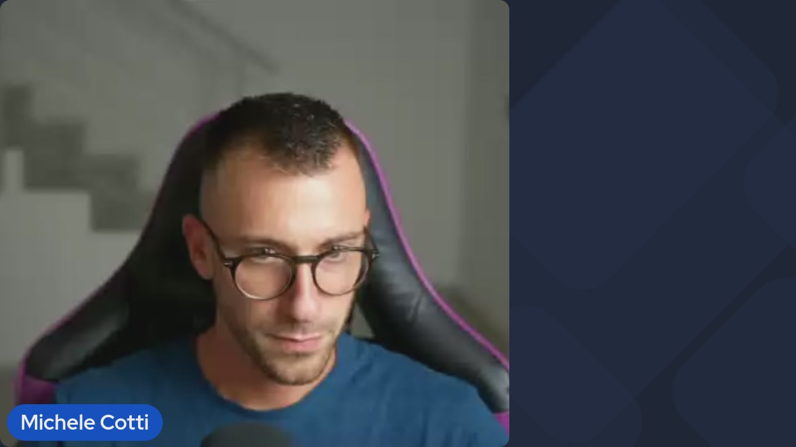

> Sottotitoli e revisione a cura di QTSS Sottotitoli e revisione a cura di QTSS Sottotitoli e revisione a cura di QTSS Sottotitoli e revisione a cura di QTSS

## [00:06:06] Schermata 7 _(periodic)_

> Sottotitoli e revisione a cura di QTSS Sottotitoli e revisione a cura di QTSS Sottotitoli e revisione a cura di QTSS Sottotitoli e revisione a cura di QTSS Sottotitoli e revisione a cura di QTSS Sottotitoli e revisione a cura di QTSS

## [00:07:06] Schermata 8 _(periodic)_

> Sottotitoli e revisione a cura di QTSS Sottotitoli e revisione a cura di QTSS Sottotitoli e revisione a cura di QTSS Sottotitoli e revisione a cura di QTSS Sottotitoli e revisione a cura di QTSS Sottotitoli e revisione a cura di QTSS

## [00:08:06] Schermata 9 _(periodic)_

**Testo a schermo (OCR):** Michele Cotti

> Sottotitoli e revisione a cura di QTSS Sottotitoli e revisione a cura di QTSS

## [00:08:23] Schermata 10 _(scene)_

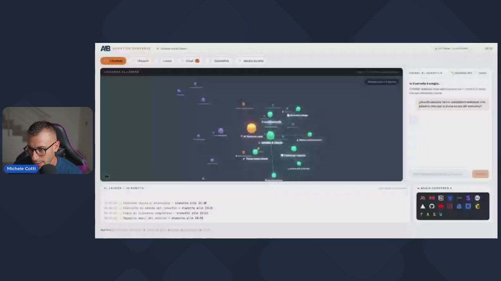

> Sottotitoli e revisione a cura di QTSS Sottotitoli e revisione a cura di QTSS Sottotitoli e revisione a cura di QTSS Sottotitoli e revisione a cura di QTSS

## [00:09:09] Schermata 11 _(scene)_

> Sottotitoli e revisione a cura di QTSS Sottotitoli e revisione a cura di QTSS Sottotitoli e revisione a cura di QTSS Sottotitoli e revisione a cura di QTSS Sottotitoli e revisione a cura di QTSS Sottotitoli e revisione a cura di QTSS

## [00:10:09] Schermata 12 _(periodic)_

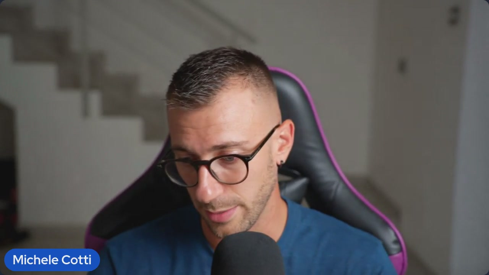

**Testo a schermo (OCR):** Michele Cotti 4

> Sottotitoli e revisione a cura di QTSS Sottotitoli e revisione a cura di QTSS Sottotitoli e revisione a cura di QTSS Sottotitoli e revisione a cura di QTSS Sottotitoli e revisione a cura di QTSS Sottotitoli e revisione a cura di QTSS

## [00:11:09] Schermata 13 _(periodic)_

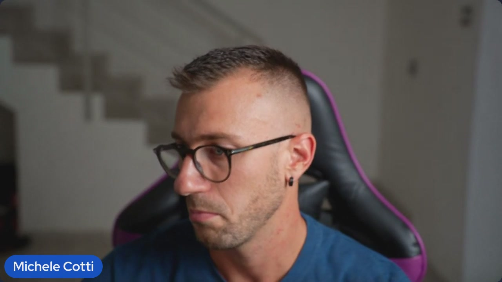

**Testo a schermo (OCR):** Michele Cotti

> Sottotitoli e revisione a cura di QTSS Sottotitoli e revisione a cura di QTSS Sottotitoli e revisione a cura di QTSS Sottotitoli e revisione a cura di QTSS Sottotitoli e revisione a cura di QTSS Sottotitoli e revisione a cura di QTSS

## [00:12:09] Schermata 14 _(periodic)_

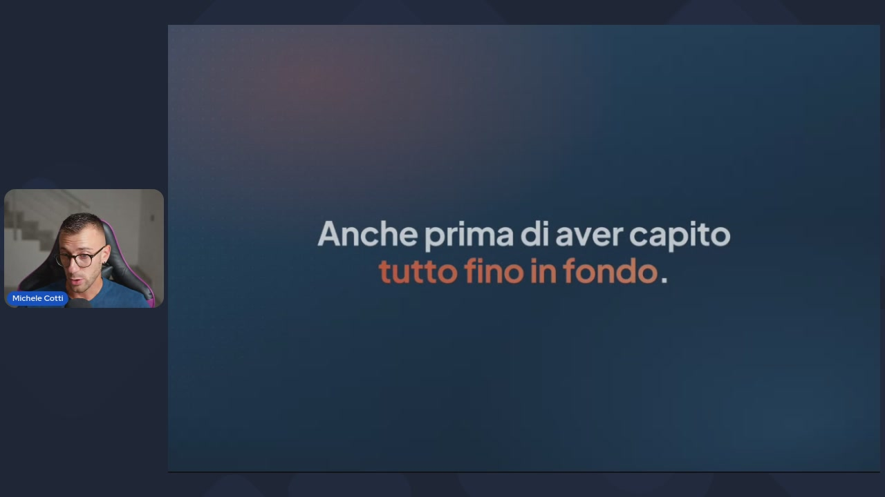

**Testo a schermo (OCR):** Anche prima di aver capito tutto fino in fondo.

> Sottotitoli e revisione a cura di QTSS Sottotitoli e revisione a cura di QTSS Sottotitoli e revisione a cura di QTSS Sottotitoli e revisione a cura di QTSS Sottotitoli e revisione a cura di QTSS Sottotitoli e revisione a cura di QTSS

## [00:13:09] Schermata 15 _(periodic)_

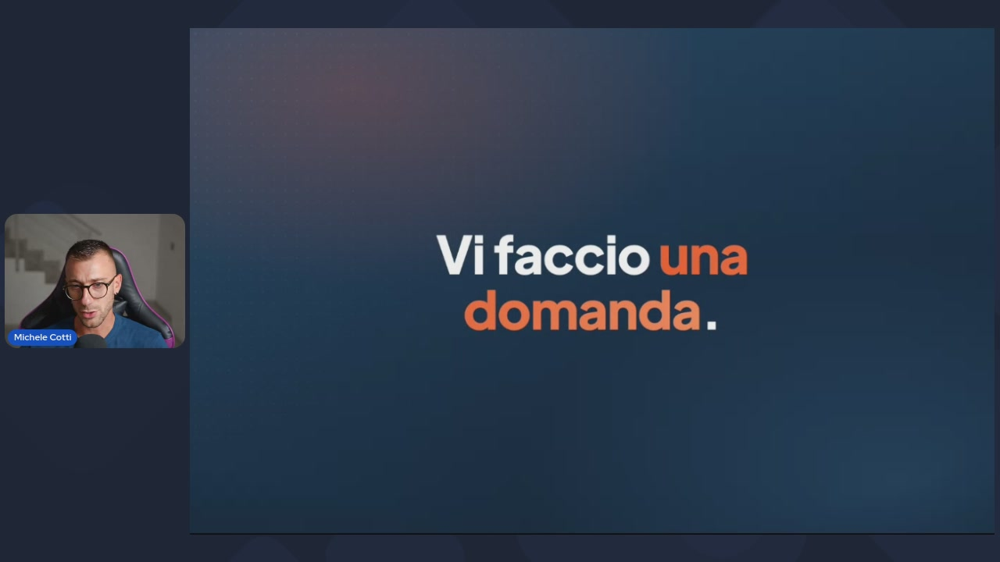

**Testo a schermo (OCR):** Le Vi facci Sl ifaccio Una domanda.

> Sottotitoli e revisione a cura di QTSS Sottotitoli e revisione a cura di QTSS Sottotitoli e revisione a cura di QTSS Sottotitoli e revisione a cura di QTSS Sottotitoli e revisione a cura di QTSS Sottotitoli e revisione a cura di QTSS

## [00:14:09] Schermata 16 _(periodic)_

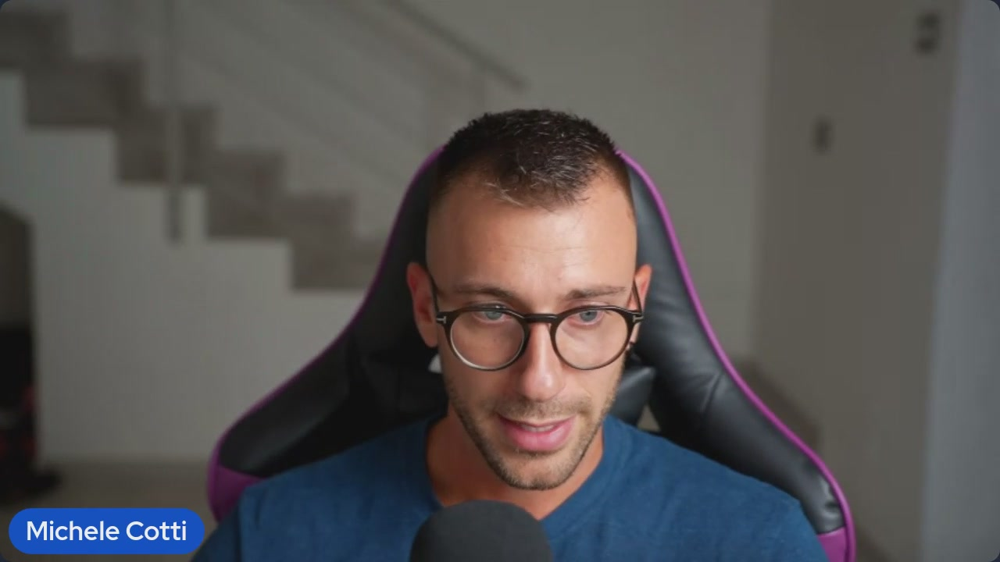

> Sottotitoli e revisione a cura di QTSS Sottotitoli e revisione a cura di QTSS Sottotitoli e revisione a cura di QTSS

## [00:14:39] Schermata 17 _(scene)_

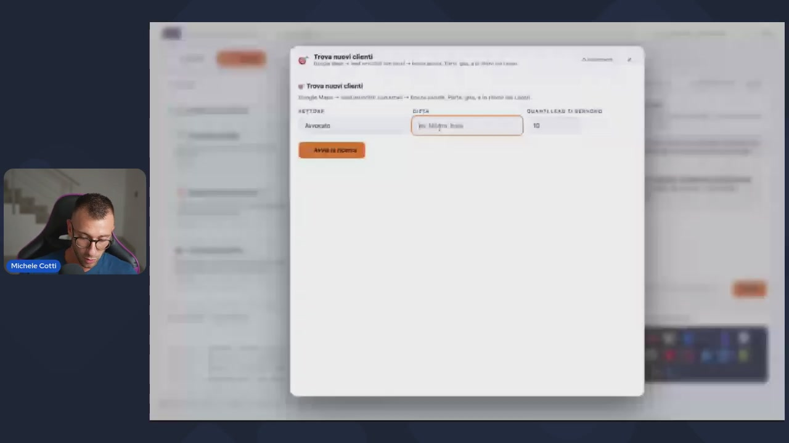

**Testo a schermo (OCR):** Trova muovi clienti rave nuovi certi Michele Cotti

> Sottotitoli e revisione a cura di QTSS Sottotitoli e revisione a cura di QTSS Ce l'hanno, va, arricchisce, ok, quel contatto guardando il sito web, quindi analizza il sito web, capisce sulla base di quella che è la nostra offerta, di quello che è il nostro cliente, se è in target oppure no, e poi vedrete come mi farà tutta una lista, insomma, di tutti i lead pronti per essere contattati, su cui poi, non vi spoiler troppo, andremo poi a generare anche bozze e quant'altro. Quindi adesso avviamo la ricerca, lo lasciamo andare, vediamo nel frattempo che nella parte aziendale si illumina in modo carino la parte di trovare nuovi clienti

## [00:15:29] Schermata 18 _(scene)_

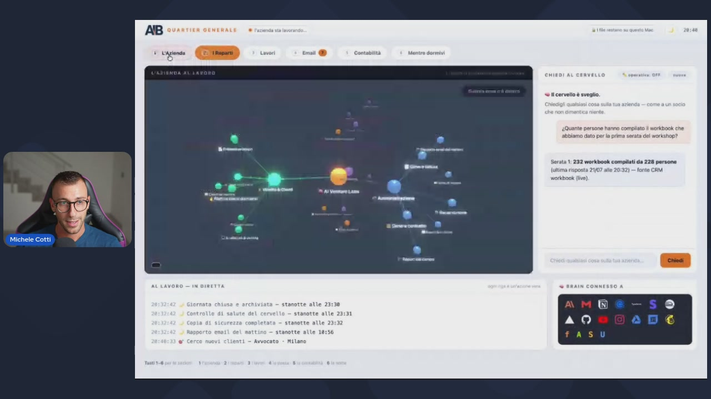

> e nella parte dei lavori lui sta andando.

## [00:15:34] Schermata 19 _(scene)_

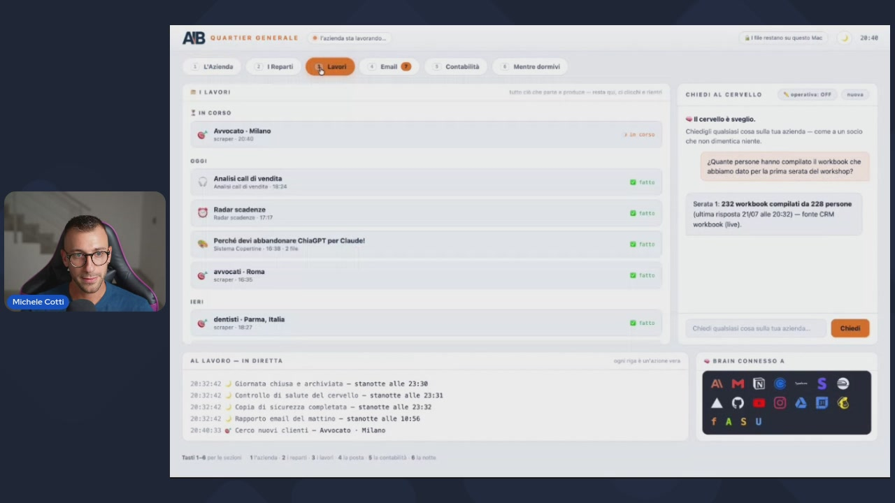

**Testo a schermo (OCR):** tr cervett è sveglio. Avvocato Milano Analisi cli di vendita Serata 1232 workbook compilati da 228 persone 3 Radar scadenze lag Perché devi abbandonare Chia0PT per Claude! Michele Cotti

> Adesso voglio farvi vedere un'altra cosa che secondo me è una bomba e ve la faccio vedere direttamente in live, poi ripartiamo, andiamo proprio nel fulcro della serata per vedere effettivamente poi come questo si costruisce, ok? Però voglio farvi vedere nella parte di marketing

## [00:15:51] Schermata 20 _(scene)_

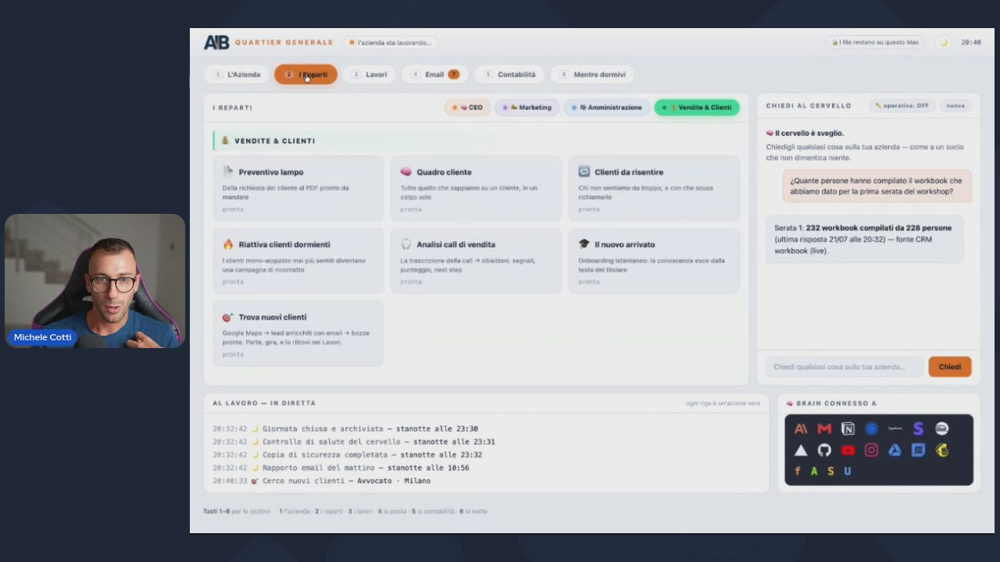

**Testo a schermo (OCR):** < icervetto è sveglio & venpire a cuIENTI + Preventivo lampo è Quadro cliente © cienti ca risentire aria 1232 workbok compaia 28 persone } trova nuovi clienti Michele Cotti n

> perché da poco abbiamo integrato la parte di un clone, quindi chiaramente i video e le cose che avete visto in questi giorni sono io, ok? Sono io, ero io che registravo, non era un mio clone, ma abbiamo da poco integrato anche la possibilità di generare dei video partendo da un'immagine. Quindi io adesso, qua con voi, dato che mi piace farvi vedere le cose in modo realistico, mi faccio una foto, carichiamo una mia foto direttamente qui, ok? Si carica una foto, decidiamo un copy da recitare e io ho praticamente già clonato la mia voce. Per clonare la propria voce basta andare su Eleven Loves, è un tool, si clona la propria voce, ok? Io qui ho già clonato la mia voce, poi ce ne sarebbero anche tante altre già pronte italiane. Ho clonato la mia voce e gli facciamo, partendo dalla mia immagine, vedrete come andrà a ricrearmi un clone di me che parla partendo dalla mia voce, dalla mia foto, con la mia voce, con quello che andremo a scrivere noi qua stasera. Quindi per farvi vedere che è una cosa che lo facciamo direttamente in diretta,

## [00:16:51] Schermata 21 _(periodic)_

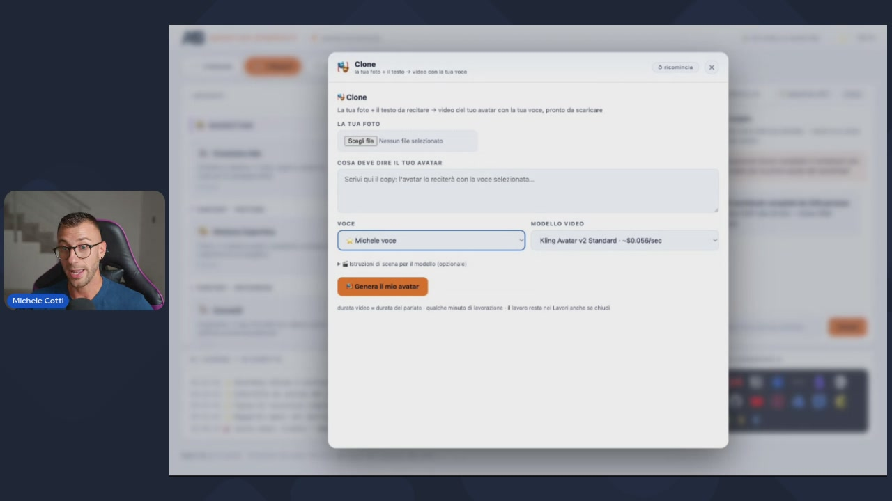

> mi faccio una foto al volo, la mando al computer, così ve lo faccio vedere effettivamente in modo realistico, ok? Poi ovviamente, ragazzi, questa cosa magari non, come vedete, magari non sarà perfetta, ok? Non sarà perfetta, perfetta anche perché adesso le voci stanno migliorando tanto, la parte di generazione sta migliorando tanto, ok? Adesso lasciatemi convertire l'immagine in JPEG, così gliela possiamo caricare, ok? Foto che mi sono fatto adesso. Scriviamo un copy al volo, una roba del tipo, ciao, questo è un test da mostrare in live durante il workshop. Ovviamente non sono perfetto, ma va bene così. Ok, e poi diamo una buona serata a tutti. Ok, facciamo così con il nostro punto esclamativo, impostiamo la mia voce e impostiamo il modello poi di generazione del video, ok?

## [00:17:51] Schermata 22 _(periodic)_

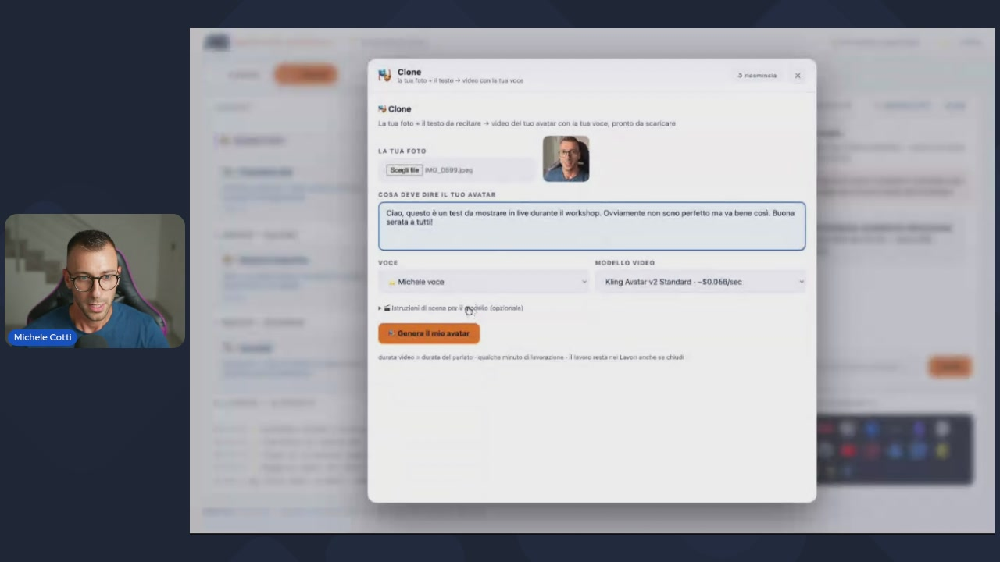

**Testo a schermo (OCR):** Michele Cotti

> Quindi facciamo generare il mio avatar. Quindi adesso lo lasciamo lavorare e poi vediamo quando poi ci ritorniamo tra un attimo. Anche qua è partita, ok?

## [00:18:05] Schermata 23 _(scene)_

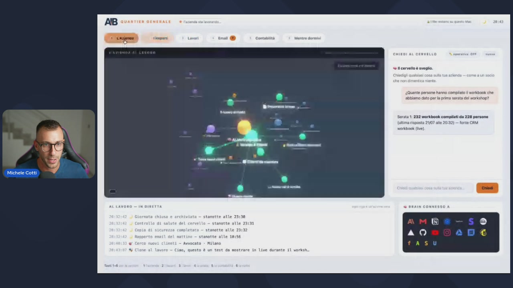

**Testo a schermo (OCR):** sure < tcerveno è sveglio. Quante persone haano compilato norkbaok ehe aevam

> Sta andando ancora la parte di nuovi clienti e sta andando anche la parte del clone, ok? Ora, ritorniamo a noi e torniamo alla nostra presentazione, ok?

## [00:18:10] Schermata 24 _(scene)_

> Ovviamente questo, tanti di voi magari non gli serve un clone, ok? Non gli serve un clone che parla come lui o quant'altro, però voglio farvelo vedere perché questo si applica a tantissime cose. Potreste farlo con un vostro collaboratore per vostre cose aziendali, poi se non usate voi ma usate cloni che già ci sono o generati direttamente funziona anche meglio, ci sono voci che sono ancora migliori, lo potete fare con i prodotti, ok? Ci sono veramente tanti, tanti esempi. Se avete un'azienda di prodotti, mettete il prodotto, vi genera decine di ads, ok? Veramente molto, molto bello. Quindi adesso l'abbiamo fatto partire, dopo vedrete il risultato, ma è una bomba, ragazzi. Cioè a me gaza tantissimo perché è la facilità con cui si riesce a creare questa roba. Ora, ripartiamo. Quindi, mentre lui lavora, veniamo finalmente al cuore di stasera. Stasera vi spiego com'è fatto dentro il Company Brain e soprattutto in che ordine si deve andare a costruire. Perché è lì, nell'ordine che si gioca praticamente tutto.

## [00:19:10] Schermata 25 _(periodic)_

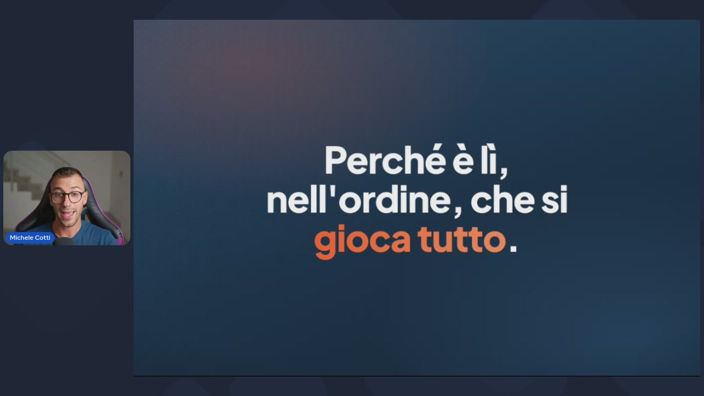

**Testo a schermo (OCR):** > Perché é lì, % 3° nell'ordine, che si Gun “iii gioca tutto.

> Ve lo spiego per bene, con calma. Perché voglio che stasera usciate da qui sapendo davvero effettivamente come funziona. Non quella solita, magari, mezza idea che vi lascia più confusi di prima, anche perché probabilmente di video magari ne avete anche già visti. Quindi, sono sei strati in tutto, ve l'abbiamo già anticipato. E li dividiamo in due parti. I primi tre sono il cervello vero e proprio. Quindi la parte che probabilmente a tanti di voi, se non a tutti, manca. Gli altri tre invece sono dove il cervello si mette a lavorare. Partiamo dai primi tre, dalle fondamenta praticamente. Il primo raccogli, il primo strato. Vi ricordate il problema di ieri? Quello di cercare un documento e non trovarlo mai? Perso magari tra l'email, il drive, le cartelle, la vostra testa, ok? Tanti hanno anche molti più posti. Il primo strato risolve esattamente quello.

## [00:20:10] Schermata 26 _(periodic)_

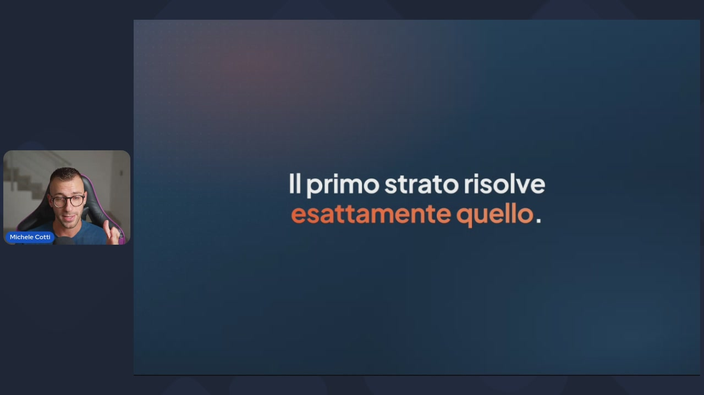

**Testo a schermo (OCR):** Il primo strato risolve esattamente quello.

> Quindi lasciatemelo dire subito perché è molto molto importante. Questa è la base su cui si fonda tutto. Gli altri cinque strati che vi spiego stasera stanno in piedi solo se prima c'è questo. Senza la raccolta delle informazioni non c'è cervello. E è come voler tirare su una casa senza avere i mattoni. Si prende tutto quello che la vostra azienda sa, ok? E che oggi è sparso in 5, 6, 7, 10 posti diversi e si mette in un posto solo. E qui c'è la cosa che nessuno vi dice. Quella che vi toglie il peso più grande. Non dovete mettere in ordine niente a mano. Zero, ok? Non dovete star lì a riorganizzare tutto voi. È questo che di solito blocca tutti. Il pensiero è ma prima dovrei sistemare 20 anni di roba, 30 anni di roba, 10 anni di roba. Ok, non funziona così. No, non è così. I vostri documenti disordinati li buttate dentro così come sono. Vecchi preventivi, mail, documenti, appunti sparsi. E ci pensa l'AI, l'intelligenza artificiale, a leggerli, a capirli e metterli in ordine da sola.

## [00:21:10] Schermata 27 _(periodic)_

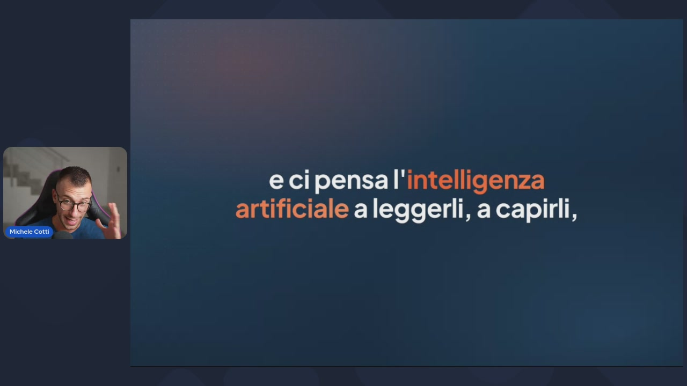

**Testo a schermo (OCR):** i È ecipensal'intelligenza > i Ò artificiale a leggerli, a capirli,

> Seguendo delle regole. Prende quello che avevate in 6 posti diversi, compresa la vostra testa, e ve lo sistema. Il contesto, i clienti, i processi, le offerte, ognuno al proprio posto, ok? Ognuno al proprio posto. Quello che a mano sarebbero settimane di lavoro. Lei lo fa in poche ore. Dipende sempre dalla quantità di roba che è. Potrebbero esserci pochi minuti, poche ore, una mezza giornata intera. E attenzione perché questa è la parte che fa davvero la differenza. Non è una cosa che fate una volta e poi è finita. Il cervello continua ad alimentarsi. Ogni mail nuova, ogni cliente nuovo, ogni preventivo che fate da domani in poi, lui se lo prende e lo aggiunge da solo. Più tempo passa, più diventa ricco, più vi conosce. Il brain continua a crescere, continua a migliorarsi. Non invecchia come un'automazione di quelle che dopo due mesi vanno rifatte da capo. Cresce, ok? Continua ad alimentarsi.

## [00:22:10] Schermata 28 _(periodic)_

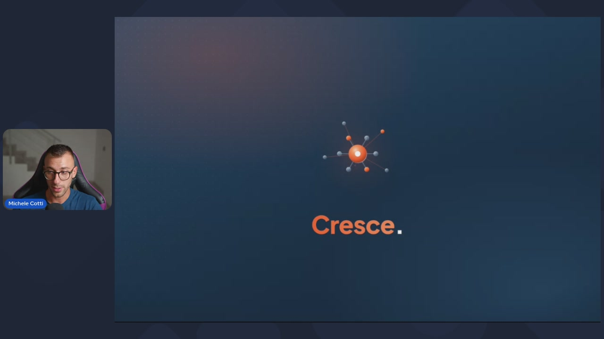

> Cresce. E questo è molto importante. Ogni giorno su un pezzo in più, sa un pezzo in più della vostra azienda. E cosa cambia per voi nella pratica? Cambia che quando vi serve qualcosa, non la cercate più, ok? Ricordate la scena di ieri? I 20 minuti a caccia magari di quel documento che stavamo cercando? Da lì in poi chiedete e in due secondi ce l'avete. L'esempio che vi ho fatto vedere prima. Quante persone hanno compilato il workbook? Preso, andato, se l'hai preso e mi hai ritornato. Senza che io stessi lì a guardare nel documento dove era e quant'altro, ok? Dammi l'ultimo preventivo che ho fatto a quel cliente e ve lo tira fuori. Come avevamo gestito quel reclamo l'anno scorso? E lui se lo ricorda anche quando voi l'avete scordato magari da un pezzo, ok? E c'è anche un'ultima cosa, forse la più importante di tutte. Oggi quello che sa solo la vostra testa esce dall'azienda il giorno che uscite voi. Ve lo portate a casa la sera, ve lo portate in ferie e ve lo portate via del tutto se un giorno mollate. Da qui in poi, no, questa cosa finisce di esistere.

## [00:23:10] Schermata 29 _(periodic)_

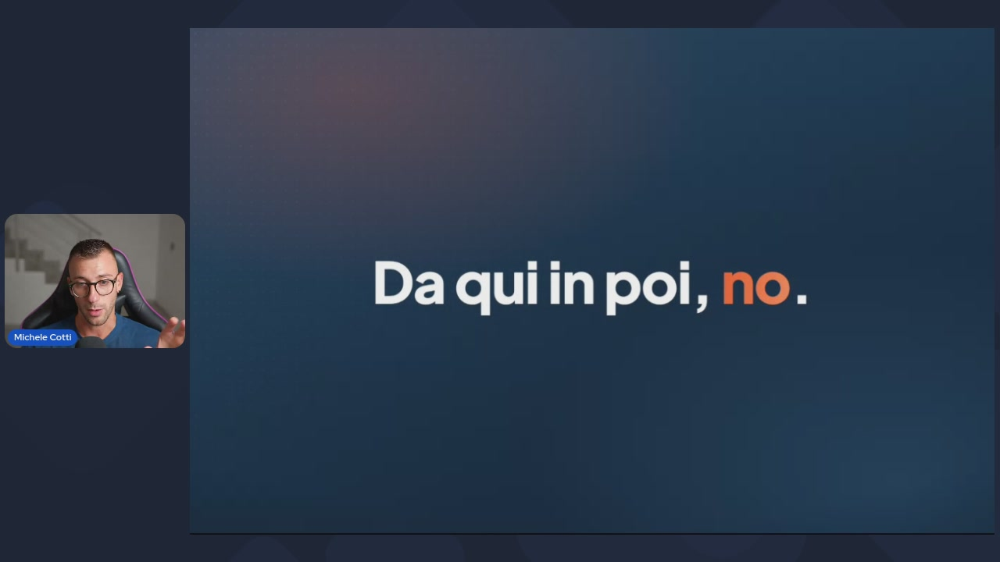

**Testo a schermo (OCR):** Da qui in poi, no.

> Resta scritto in un posto solo anche il giorno che voi non ci siete. Il sapere della vostra azienda smette di vivere nella vostra testa e in dieci cartelle diverse e comincia a vivere in un posto solo. Dove voi e il vostro team lo trovate sempre. Al primo colpo, questo posto solo non è una scatola magica chiusa, ok? Nel modo in cui lo costruiamo noi è un archivio di file di testo normali che l'AI è in grado di leggere e navigare con facilità. I semplicissimi file markdown, file di testo che praticamente tanti di voi conoscono se non tutti, ok? Vuol dire una cosa molto importante. Tutti i dati sono vostri, rimangono sul vostro computer e non vengono condivisi con nessuno. Non è vincolata dentro l'abbonamento di qualcun altro che magari il giorno che chiude se le porta via, ok? Rimangono vostri. L'AI lì dentro ci inserisce di tutto. Legge i PDF, si trascrive da sola i vocali che vi mandate in macchina, guarda la foto di un foglio scritto a mano e tira fuori il testo pulito.

## [00:24:10] Schermata 30 _(periodic)_

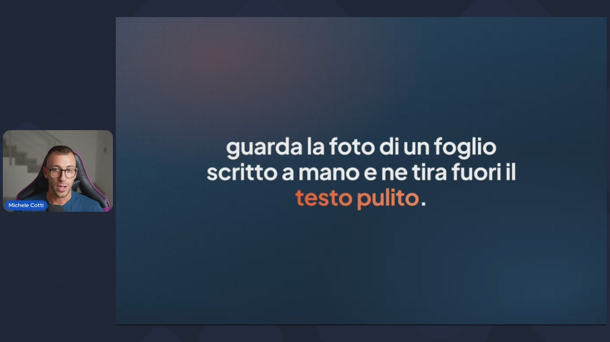

**Testo a schermo (OCR):** guarda la foto di un foglio scritto amano e ne tira fuori il testo pulito.

> Potete fargli fare qualsiasi cosa, ok? Si prende in input davvero, qualsiasi cosa. Secondo strato, ok? Dal momento che abbiamo preso tutte le informazioni, ok, e le abbiamo fatte riorganizzare all'AI, c'è il secondo strato, ossia il contesto. E questo è il pezzo che risolve la risposta fredda di cui parlavamo ieri. Quindi, ve lo ricordavate il gentile cliente da call center dell'esempio che abbiamo fatto ieri sera? E vi ricordate come l'ho chiamato ieri? L'AI lasciata da sola? Un genio senza memoria. Un consulente bravissimo che ogni mattina si sveglia e ha dimenticato praticamente tutto di voi e della vostra azienda. Ieri, con l'impronta, se l'avete applicata, avete iniziato a scrivergli era voi quella memoria, ok? Con l'impronta avete iniziato a scrivergli quella parte di contesto. Il primo pezzo, quello di base, chi siete? Ecco, questo strato è quel pezzo lì portato fino in fondo. Il contesto è tutto quello che rende l'intelligenza artificiale capace di parlare come voi.

## [00:25:10] Schermata 31 _(periodic)_

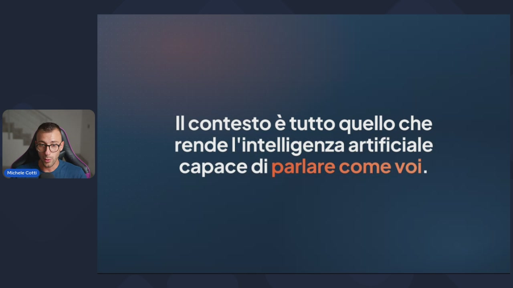

**Testo a schermo (OCR):** Il contesto è tutto quello che rende l'intelligenza artificiale capace di parlare come voi.

> Chi siete? Cosa vendete? A chi? Come ragionate sui prezzi? Che tono usate coi clienti? Qualsiasi cosa, ok? È la differenza esatta tra un'offerta che sembra scritta da un robot e una che invece è scritta da voi, di vostro pugno. Vi faccio capire cosa c'è dentro di preciso, così non resta una parola astratta. Immaginate un foglio, il documento di contesto della mia azienda. Dentro c'è scritto, nero su bianco, cose che potrebbero essere come questa. Coi clienti diamo del tu, mai del lei. Sotto un certo margine non si scende mai, nemmeno per chiudere in fretta. Il nostro punto di forza è l'assistenza ed è quello che va messo sempre in evidenza. Il tono è diretto, niente paroloni, niente giri di parole, ok? Potrebbero essere tante altre, ok? Tante altre. Tutte queste cose, ok? Tutte queste cose che di solito vivono solo nella vostra testa. Quando voi scrivete un e-mail, quelle robe lì ce le avete in testa, ma non le avete messe all'interno, ok? Sono solo nella vostra testa

## [00:26:10] Schermata 32 _(periodic)_

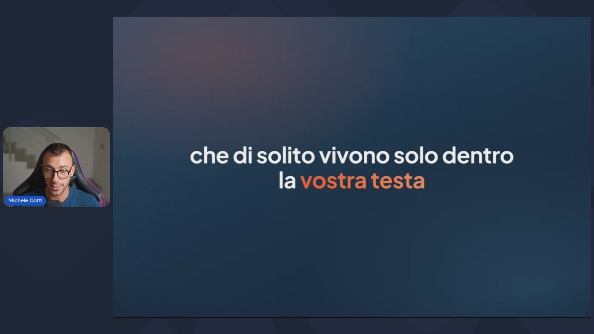

**Testo a schermo (OCR):** che di solito vivono solo dentro la vostra testa

> e che dovete magari ripetere a ogni collaboratore nuovo e ogni chat che aprite e che fate con Cloud, cioè GPT, quello che sia. Qui sono scritte una volta sola, ok? E da quel momento l'AI le sa già. Non glielo dovete ripetere ogni volta come un disco rotto. E adesso vi dico la cosa che cambia tutto. Quella per cui il cervello non è semplicemente una chat un po' più furba. State attenti a questa perché di base è il cuore poi di stasera. Quando voi aprite una chat normale, cioè GPT, quello che volete, e le date un'informazione, quell'informazione resta lì da sola dentro quella chat. Chiudete la chat e di base sparisce. E soprattutto quella chat non comunica con nessun'altra chat. Alcuni adesso l'hanno integrato, sì, ma non è mai completo. E ogni cosa che sa la sa a compartimenti stagni, ok? Chiusa nel suo cassetto, staccata da tutto il resto. Il cervello no. Nel cervello tutto è collegato con tutto. Questa è la cosa fondamentale, ok?

## [00:27:10] Schermata 33 _(periodic)_

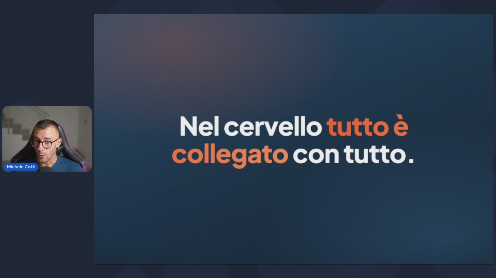

**Testo a schermo (OCR):** % \ Nel cervello tutto è D3 À collegato con tutto.

> Perché? Perché tutti i vostri documenti sono interconnessi. I processi, i clienti, il vostro tono di voce. Qualsiasi cosa è interconnessa una con l'altra e non riparte sempre da zero, ok? Non riparte sempre da zero. Il cliente è collegato ai preventivi che gli avete fatto, che sono collegati alle email che vi siete scambiati, che sono collegati al vostro modo di parlare, al vostro tono di voce, che è collegato ai vostri margini, che sono collegati a quella volta che con quel cliente lì due anni fa avete avuto un problema, ok? Tutto viene tenuto insieme. Si crea tutta una fitta rete di collegamenti. Non sono foglietti sparsi buttati lì in cassetti diversi. È una ragnatela, ok? Dove ogni filo tira gli altri. E sapete cosa succede quando le cose sono collegate in questo modo? Succede che il cervello comincia a ragionare. Come lo riesce a fare? Nessuna chat praticamente. Nessuna chat ragiona, ok? Perché mette insieme i puntini. Inizia a vedere collegamenti che a voi sfuggivano magari. Vi faccio l'esempio, così almeno vi è un attimo più concreta come cosa.

## [00:28:10] Schermata 34 _(periodic)_

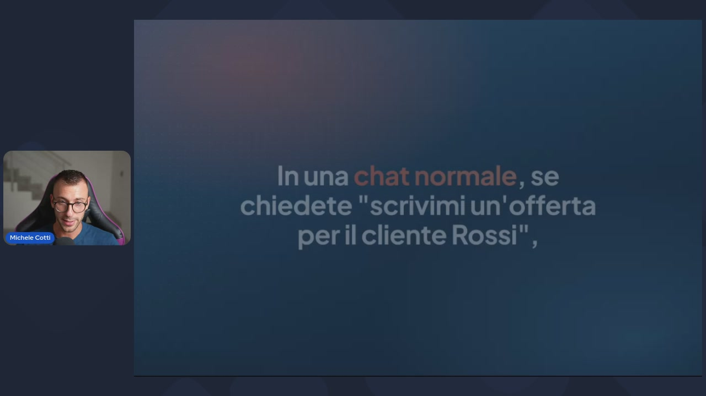

**Testo a schermo (OCR):** Inuna chat normale, se chiedete "scrivimi un'offerta peril cliente Rossi",

> In una chat normale, se chiedete scrivimi un'offerta per il signor Rossi, ad esempio. Lei vi scrive un'offerta per il cliente Rossi. Punto, ok? Fa esattamente quello che le avete detto. Niente di più. Una semplicissima chat come un'altra. Perché non sa nient'altro, ok? Perché non sa nient'altro. Nel cervello invece, quando chiedete la stessa identica cosa, lui prima va a vedere chi è Rossi, cosa ha comprato, quanto paga di solito, che margine ci fate solitamente, che l'ultima volta si era lamentato per un ritardo, che è uno che tira sempre sul prezzo. E ci ragiona sopra tutte quelle informazioni, tutte quelle cose che ha all'interno del cervello. E magari vi ferma e vi dice, guarda, questo ha ancora due fetture aperte. Io l'offerta gliela manderei solo dopo che ha saldato, ok? Quindi vede anche cose, vi dice cose che voi non gli avevate chiesto, ok? Una cosa che ha capito da solo mettendo insieme pezzi che stavano in posti diversi, che una normalissima chat non vi avrebbe mai detto, vi avrebbe scritta l'offerta e basta. Ecco, questa è la differenza vera.

## [00:29:10] Schermata 35 _(periodic)_

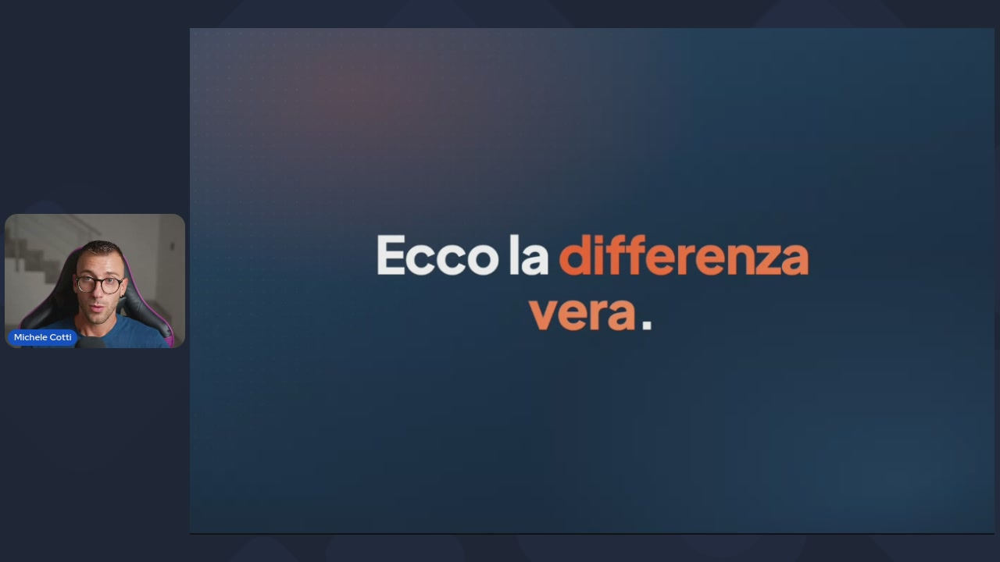

**Testo a schermo (OCR):** SÉ Eccola differenza vera.

> Quindi la chat vi risponde da chat, il cervello è connesso a tutto il resto di documenti e quant'altro, e quindi prima va, si guarda un documento, si vede la cosa collegato, e quant'altro vi dà una risposta completamente diversa. Una chat esegue quello che le dite, il cervello capisce la situazione e ci ragiona sopra. Perché ha davanti il quadro intero, tutto collegato e non un foglietto per volta, ok? Allora pensate cosa cambia nel concreto. Arriva la richiesta di un cliente per un lavoro, senza contesto, e l'AI vi scrive un'offerta piatta, con un prezzo a caso e un tono da ufficio postale. Con il contesto invece vi tira fuori un'offerta che parte dal prezzo giusto per quel tipo di cliente, che mette in evidenza l'assistenza perché sa che è il vostro punto di forza, perché voi gliel'avete detto, e che è scritta col vostro modo di parlare, perché ha magari in pasto centinaia di email. Voi l'aprite, la leggete e nella maggior parte dei casi la mandate così com'è. Non dovete stare a revisionarla, a guardarla mille volte. Prima ci mettevate mezz'ora a scriverla da zero, adesso due minuti a controllarla.

## [00:30:10] Schermata 36 _(periodic)_

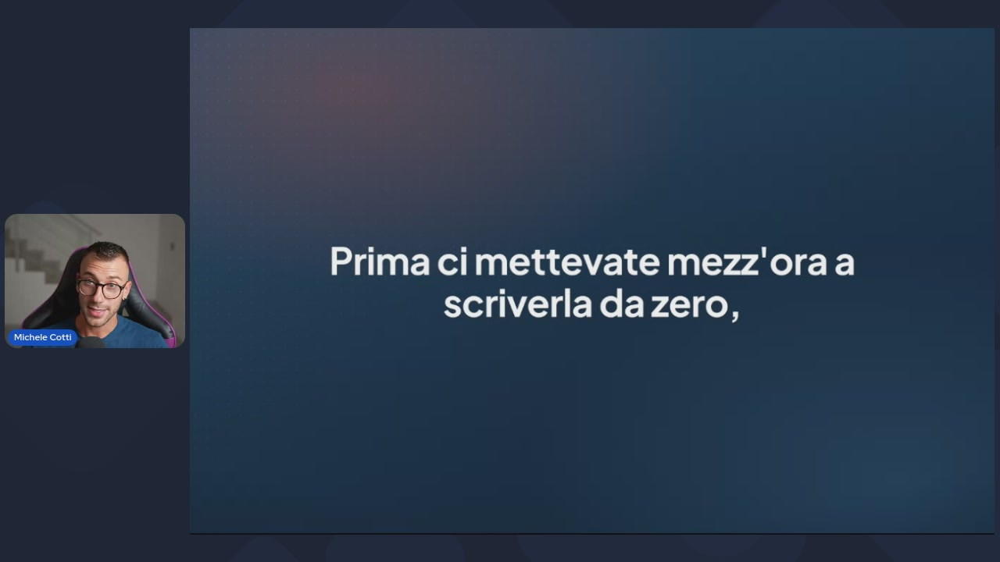

**Testo a schermo (OCR):** Prima cimettevate mezz'ora a scriverla da zero,

> E quel cliente non si accorge di niente. Legge una cosa che sembra scritta praticamente da voi. Ora, la parte tre, ok? Questa era due parti molto, molto importanti. La parte del contesto e la parte, chiaramente prima si raccoglie tutto e poi si va a fare il contesto. Che ragazzi, è ben diverso prendere il contesto, buttarlo in una chat e parlarci e avere tutto interconnesso, ok? È una cosa ben diversa. Passiamo allo strato numero tre. Le procedure. E questo risolve il faccio tutto io. Quello che vi accomuna, insomma. Quante volte al mese rispiegate le stesse cose a un collaboratore nuovo? O a uno che c'è da un anno ma quella cosa lì se la dimentica sempre? Le procedure sono il vostro come si fa, ok? Scritto una volta sola. Come si prepara un preventivo giusto. Come si gestisce un cliente arrabbiato senza perderlo. Come si evade un ordine.

## [00:31:10] Schermata 37 _(periodic)_

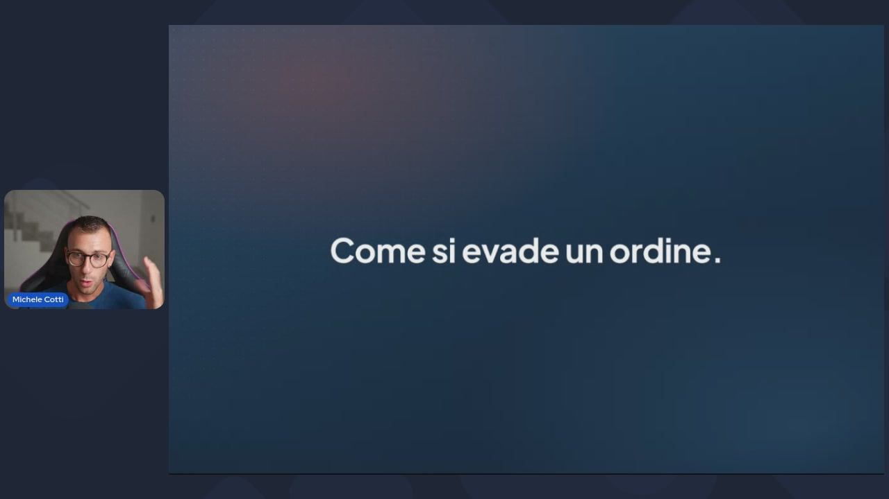

**Testo a schermo (OCR):** Come si evade un ordine.

> Scritto una volta e da lì in poi le IAI e chiunque del vostro team che sia connesso al vostro brain lo segue senza venire a bussare alla vostra porta. Il vostro sapere esce finalmente dalla vostra testa e resta in azienda. Anche il giorno che voi non ci siete. E pensate a cosa vuol dire davvero nel concreto una cosa di questo tipo. Oggi quando entra una persona nuova immagino ci perdiate settimane a formarla magari, ok? A ripetere le stesse cose, a correggere i stessi errori. Con le procedure scritte nel cervello la persona nuova arriva e invece di venire a chiedere a voi mille volte al giorno chiede al cervello. Come si fa un preventivo qua da noi? E lui glielo spiega esattamente come glielo spieghereste voi. Voi vi liberate e soprattutto l'azienda smette di dipendere dalla vostra pazienza. Di rispiegare le stesse cose per la centesima volta. Ma adesso vi dico la cosa che quasi nessuno coglie. Ed è la più importante di tutte. Il tempo che risparmiate a non rispiegare le cose a un dipendente. Quello è solo un regalo piccolo.

## [00:32:10] Schermata 38 _(periodic)_

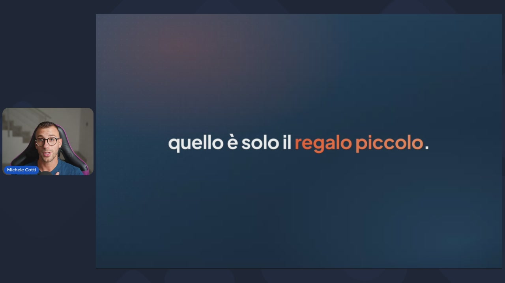

**Testo a schermo (OCR):** Sil quello è solo ilregalo piccolo.

> È solo una piccola parte. Il vero motivo per cui le procedure valgono oro è un altro. E ve lo dico adesso perché tra poco lo vedete tornare come ragionamento. Una procedura scritta nel cervello non serve solo alle persone. Serve alle automazioni, agli agenti che ci lavorano. Perché quando più avanti allo strato 5 diremo una cosa fatti da sola, quella cosa lì non parte dal nulla. Parte dalla procedura. Legge il vostro come si fa e lo esegue esattamente come lo fareste voi. Quindi pensateci un attimo. Ragionateci un attimo questa cosa. Un'automazione di solito è stupida. Fai il suo compitino e basta. Sempre uguale e non sa niente della vostra azienda. Ma un'automazione che si appoggia su una procedura vostra, quella sa già come lavorate. Sa che da voi prima si controlla il margine e poi si fa il prezzo. Sa che a quel tipo di cliente si risponde in un certo modo. Sa che quel documento va sempre fatto in quell'ordine lì.

## [00:33:10] Schermata 39 _(periodic)_

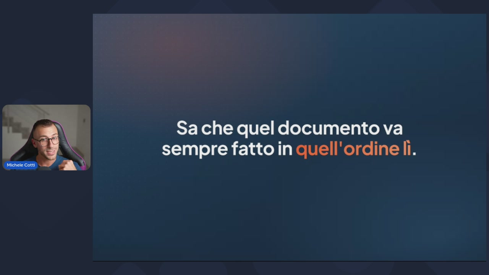

**Testo a schermo (OCR):** Sa che quel documento va sempre fatto in quell'ordine lì.

> E non perché glielo dite voi ogni volta. Non perché glielo dite voi ogni volta, ma perché sta scritto nella procedura. Una volta sola e lei la segue. Ecco perché nel cervello è tutto collegato. La procedura di oggi è il binario su cui domani correrà l'automazione, correrà il determinato agente. Voi adesso scrivete come si fa un preventivo qui da noi e vi sembra solo di formare un dipendente. In realtà state posando la rotaia su cui tra poco quel preventivo si farà di base da solo. Ed è per questo che prima si scrivono le procedure e poi si automatizza e non si fa al contrario. Mai al contrario. Perché chi automatizza senza le procedure sotto, automatizza solo il caso. E per concludere ecco come funziona in due parole. La procedura la scrivete una volta, in un foglio, a parole vostre, come una ricetta. Poi, quando la automatizzate, il pezzo che gira non si tiene la logica chiusa dentro come un programma rigido.

## [00:34:10] Schermata 40 _(periodic)_

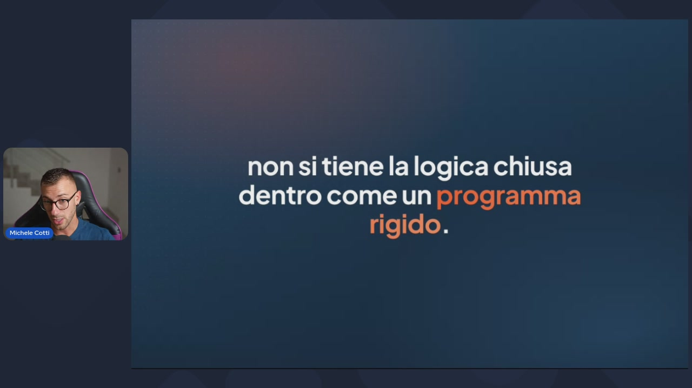

**Testo a schermo (OCR):** iù nonsi tiene la logica chiusa dentro come un programma rigido.

> Va a leggere quel foglio lì, la vostra procedura, e la esegue passo passo. Vuol dire che il giorno che cambiate qualcosa, cambiate una riga scritta a parole vostre e l'automazione si aggiorna da sola. Non dovete richiamare il tecnico a rimetterci le mani ogni volta. Faccio un esempio. L'automazione che ho fatto partire prima la gente di prima dei lead che ricerca lead da Google Maps. Lui prima di arricchirli si prende e si legge qual è il mio cliente ideale. Si legge il mio cliente ideale. E poi mi dice, li prende, prende quelli in target e mi dice perché sono in target. Se io domani cambio il mio cliente ideale, l'automazione della gente va avanti lo stesso perché si legge con lo stesso foglio che è cambiato. È cambiato il cliente e si cercherà una roba diversa. Questo è il ragionamento. Il cervello e la procedura restano una cosa sola. Tocchi uno, si muove l'altro. Ecco, fin qui avete il cervello. La vostra azienda scritta, in ordine, collegata, in un posto solo. E lasciatemelo dire, già solo questo, questi primi tre strati praticamente,

## [00:35:10] Schermata 41 _(periodic)_

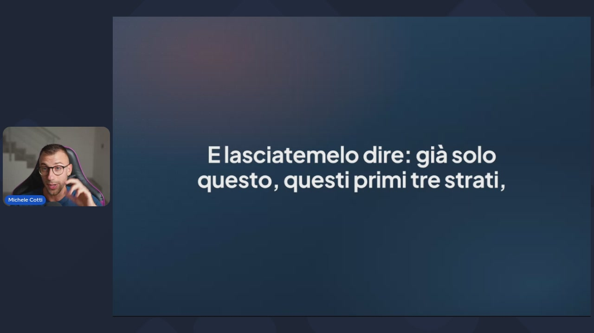

**Testo a schermo (OCR):** Va Elasciatemelo dire: già solo 3% \ questo, questi primi tre strati, Lcd

> per la maggior parte di voi probabilmente cambierebbero la giornata. Ok, da soli. Ditemi un attimo se già in azienda avete una roba del genere. Apriamo giusto due minuti da chat a vedere se mi state seguendo, ok? Perché non c'è nulla di così assurdo. Assurdo è prendere tutta la documentazione, far elaborare la I, farla smistare, inserirla e avere le procedure, avere un'interconnessione tra dati, ok? Interconnessione da dati. Ok? Vedo, no, no, no, ma mi piacerebbe. Niente di tutto questo, no, per nulla. Mi cambierebbe la dita. Eh, immagino, immagino. Ho me stesso e basta. Eh, esatto. Magari averla in parte. Ottimo, ottimo. Ok. Ok. Ma un software gestionale come lo collego? Dopo ci arriviamo, stai tranquillo. Ok. Sembra un sogno, speriamo che funzioni. Beh, guarda, te l'ho già fatto vedere anche prima, poi lo vedremo ancora.

## [00:36:10] Schermata 42 _(periodic)_

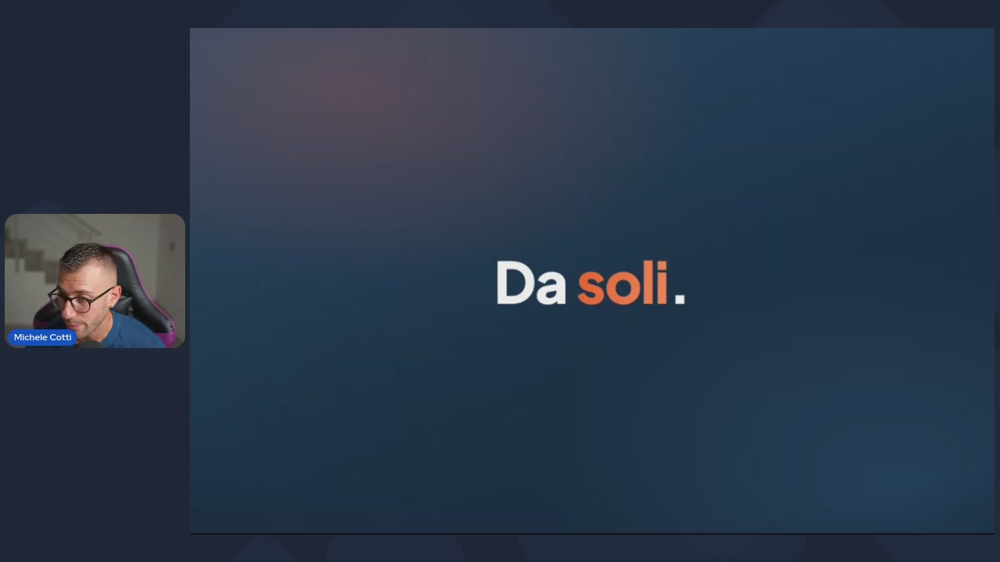

**Testo a schermo (OCR):** Da soli.

> E poi, in realtà, ho anche una sorpresa, vi porterò anche delle persone con cui l'abbiamo già fatto e lo vedrete anche direttamente da loro. Ok? Quindi, di base è questo. Ora, blocchiamo ancora la chat, ok? E andiamo avanti. Andiamo all'altra parte. Perché questo, il cervello, con questa cosa qui, praticamente l'avete costruito, ok? L'avete costruito. Ora, non ci fermiamo qui perché adesso questo cervello lo mettiamo a lavorare davvero, come già qualcuno scriveva in chat. E qui arrivano gli altri tre strati. Gli strumenti, proprio quello che si diceva adesso nei commenti, che dicevano, eh, ma io come ce lo attacco, il gestionale? Scusate che bevo, che ho bisogno anch'io. Gli strumenti, quindi, il quarto strato, come ce lo attacco il gestionale? Fin qui il cervello sa, ok? Sa il nostro contesto e quant'altro. Adesso lo colleghiamo a quello che usate ogni giorno. L'email, il calendario, il drive, il gestionale.

## [00:37:10] Schermata 43 _(periodic)_

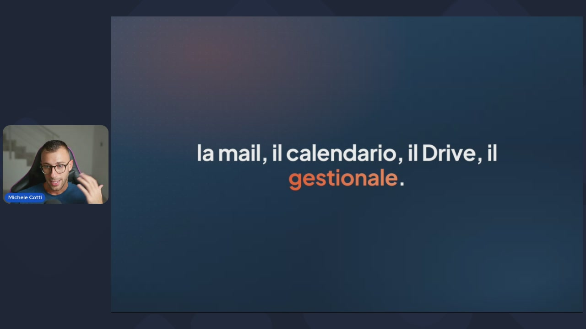

**Testo a schermo (OCR):** Î la mail, ilcalendario, il Drive, il > A gestionale.

> E da questo momento, quella roba cambia natura. Non sa soltanto, può iniziare a fare. Può leggere le vostre email, guardare il vostro calendario, prendere i numeri dal gestionale, scrivere un documento e salvarlo, come dite voi. E qui si apre un mondo, ok? Si apre un mondo, perché gli strumenti che gli collegate sono tutti quelli che usate ogni giorno, ok? Ognuno di voi ha gli strumenti che usa. In Gmail, con dentro anni di conversazioni con i clienti. Il CRM, il gestionale, dove tenete i clienti, gli ordini, i pagamenti, lo storico di tutto. Il calendario con i vostri appuntamenti. Il drive con i documenti. O qualsiasi software o tool che stiate utilizzando in azienda. Praticamente ormai tutti i tool hanno un collegamento e dove non ce lo possiamo andare a creare. Uno alla volta li attaccate al cervello. Che erano anche quelli che ieri vi facevo vedere che in basso a destra gli ho attaccato decine di strumenti. Li attaccate al cervello. E da quel momento lui non li guarda da fuori. Ci entra dentro e ci lavora.

## [00:38:10] Schermata 44 _(periodic)_

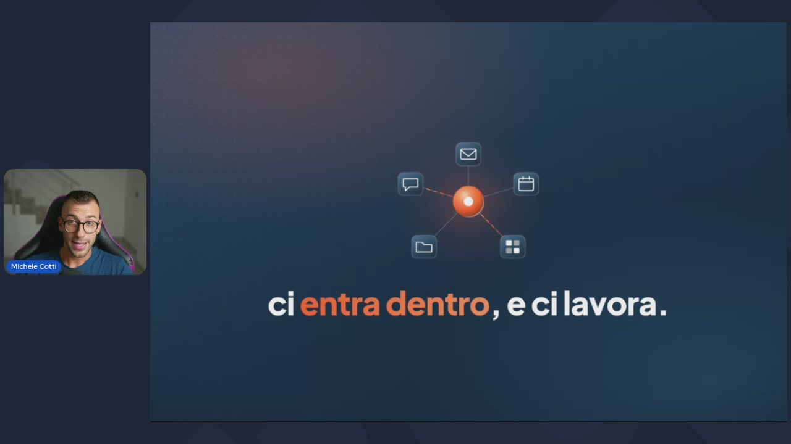

**Testo a schermo (OCR):** ©_ IC) LA Ss È cientra dentro, ecilavora.

> E adesso arriva la parte che una persona non potrà mai fare. Voi, un collaboratore, chiunque, riuscite a guardare una sola cosa per volta. Siamo umani, ok? Aprite l'email, la chiudete, aprite il gestionale, lo chiudete, aprite il drive, eccetera, eccetera, eccetera. Un cassetto alla volta, in fila. Il cervello no. Li tiene aperti tutti insieme. Mentre legge la mail di un cliente sta già guardando nel gestionale quanto vi deve. Nel calendario quando lo incontrate. Nel drive l'ultimo contratto che gli avete fatto. Tutto nello stesso momento. Pesca dieci posti diversi, una volta sola, e li incrocia. E vi dà la risposta già completa. Senza che voi apriate niente. E non lavora su una cosa per volta, ok? Mentre vi impara un contratto, può rispondere a tre mail, controllare chi è in ritardo con i pagamenti, e mettervi insieme al riassunto della call di domani. Tutto in parallelo. Una persona fa le cose in fila. Prima questo, poi quello, poi quell'altro. Lui fa dieci cose insieme e non si stanca. Non perde il filo. Non si dimentica niente a metà strada. Pensateci un attimo alla differenza che questa cosa può fare.

## [00:39:10] Schermata 45 _(periodic)_

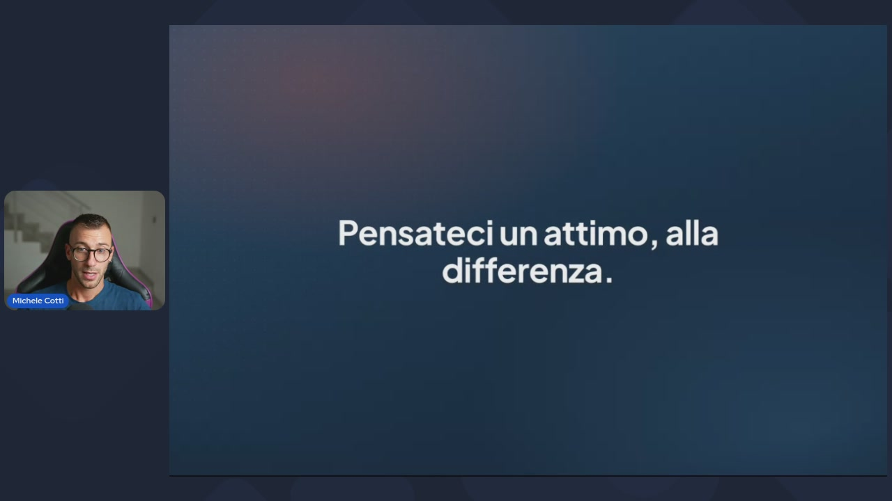

**Testo a schermo (OCR):** Pensateci un attimo, alla differenza.

> Prima avevate un cervello che conosceva la vostra azienda, ma stava chiuso in una stanza. Poteva solo darvi consigli di base. Adesso vi aprite la porta e gli mettete in mano tutti gli attrezzi. Può andare a prendere le informazioni dove stanno per davvero. E può produrre cose vere. Non solo parlarne. Il contratto per un cliente nuovo, la scheda prodotto, il report, le bozze di risposta alla mail arrivate stamattina. Tutte cose che oggi vi mangiano le ore, ok? E che da qui in poi il cervello prepara al posto vostro. Con i vostri dati veri. Lasciandovi solo il controllo finale. Tra poco, a fine serata, ve ne faccio vedere anche un altro paio dal vivo, ok? Oltre alle due che abbiamo avviato, ve ne faccio vedere anche altre, ok? Così le toccate con mano invece di credermi sulla parola. Perché quello che vi sto mostrando è cosa che noi utilizziamo tutti i giorni e che abbiamo e che funzionano, ok? Il modo in cui il cervello si aggancia ai vostri strumenti ha un nome, si chiama MCP, ok? Si chiama MCP.

## [00:40:10] Schermata 46 _(periodic)_

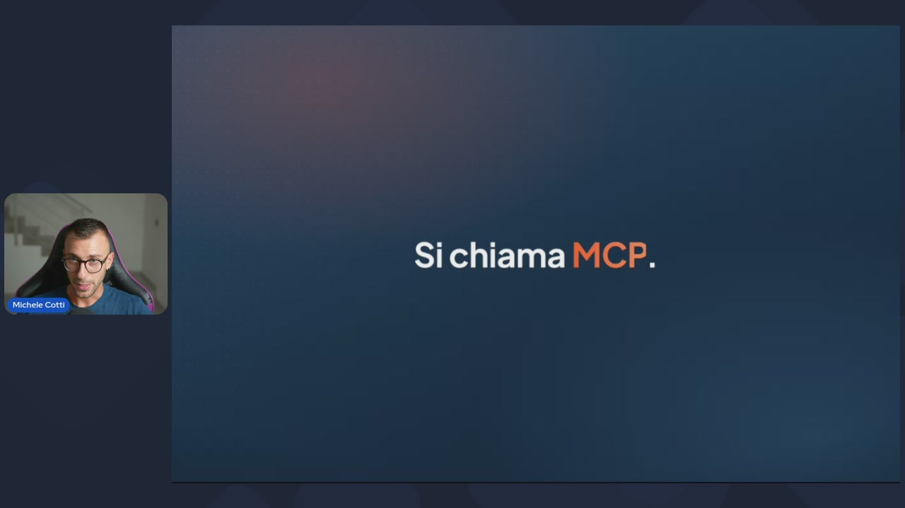

**Testo a schermo (OCR):** Si chiama MCP.

> Magari tanti di voi conoscono la parola, tanti di voi no, non c'è problema, ok? Ed è diventato lo standard con cui l'AI si collega a Gmail, al calendario, al CRM, al gestionale. Il posto da cui pilotate tutto può essere Cloud, ok? Può essere Cloud, può essere qualsiasi altro AI. Il modello poi lo si sceglie. Oppure una dashboard, come quella che vi farò vedere stasera. Come quella che vi ho già fatto vedere più volte, ok? Perché? Perché poi decidete voi. Potete prenderlo e utilizzarlo da Cloud in modo conversazionale oppure potete farci una dashboard un pochettino più carina, un po' più user friendly. Ma la dashboard, come vi dicevo anche ieri, è solo la parte visuale, è quello che ci sta dentro, la cosa importante. Senza mai scrivere una riga di codice. Non bisogna essere programmatore, non bisogna essere degli informatici. Vi faccio l'esempio del gestionale, che è quello che vi tocca magari più da vicino. Una volta collegato, il cervello non lo guarda e basta. Gli dite, tirami fuori tutte le fatture scadute da più di 30 giorni. Incrocele coi clienti che ho scritto questa settimana e preparami il sollecito per ognuno col tono giusto. E lui entra nel gestionale, si prende i numeri veri, li incrocia e ve li porta pronti.

## [00:41:10] Schermata 47 _(periodic)_

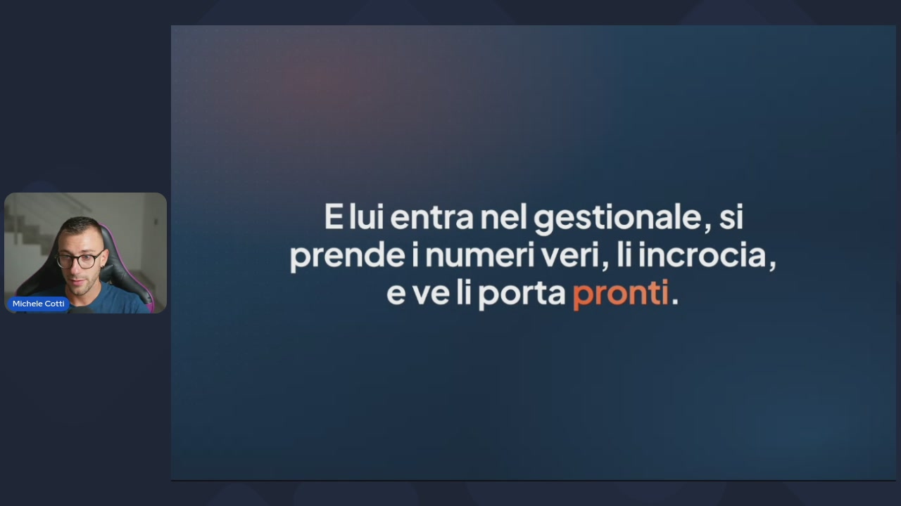

**Testo a schermo (OCR):** E lui entra nel gestionale, si prende i numeri veri, liincrocia, e velliporta pronti.

> Oppure, aggiornami la scheda di questo cliente con quello che ci siamo detti oggi in call. E lui magari, avete, non lo so, il vostro trascrittore vocale, vi prende la chiamata, se l'analizza, entra nel CRM e l'aggiorna, ok? L'aggiorna lui dentro il gestionale. Anche qua, dipende sempre dai permessi che gli date. Volete che legga solo, potete solo farlo leggere. Volete che scriva anche, si può anche farlo scrivere e fargli modificare le cose. Legge, incrocia e scrive lui nei vostri strumenti. Non è più un consiglio a voce, è lavoro fatto sui vostri dati reali. Fino a qui abbiamo costruito un cervello che sa tutto della vostra azienda e che sa fare le cose, quando gliele chiedete voi. Adesso facciamo l'ultimo salto, ok? Facciamo l'ultimo salto. Le automazioni. Il quinto strato. Adesso che il cervello sa e può fare, gli diciamo di fare da solo le cose che rifate identiche ogni settimana, senza che glielo chiedate. Ma prima di farvi vedere cosa succede,

## [00:42:10] Schermata 48 _(periodic)_

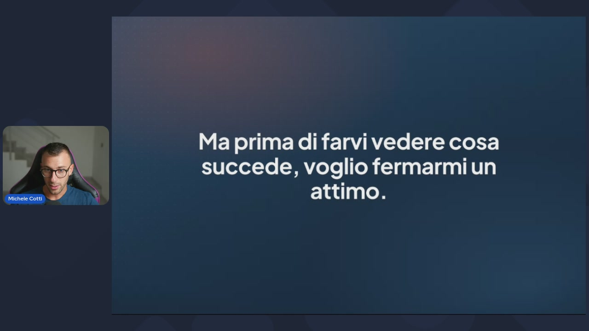

**Testo a schermo (OCR):** Ma prima di farvi vedere cosa . $ succede, voglio fermarmi un CA ) attimo.

> voglio fermarvi un secondo, perché voglio parlarvi della vostra settimana, quella vera, quella di adesso. Pensate magari al lunedì mattina. Aprite il computer e parte la lista. Il report della settimana da mettere insieme, con i numeri da tirar fuori da magari tre posti diversi, i clienti che non hanno ancora pagato, da sollecitare uno per uno, quel preventivo mandato dieci giorni fa a cui magari nessuno ha mai risposto, e qualcuno si dovrebbe ricordare di richiamare, le stesse quattro email di benvenuto da mandare al cliente nuovo, la preparazione prima della call del pomeriggio, i messaggi su WhatsApp che chiedono le stesse identiche cose di sempre, e questo magari è solo lunedì. Quanti di voi si possono rivedere in una settimana di questo tipo? Ragionateci. Il punto è questo. Nessuna di queste cose è difficile, ok? Non è lavoro difficile. È lavoro che però non finisce mai. Sono cose che non hanno bisogno di voi.

## [00:43:10] Schermata 49 _(periodic)_

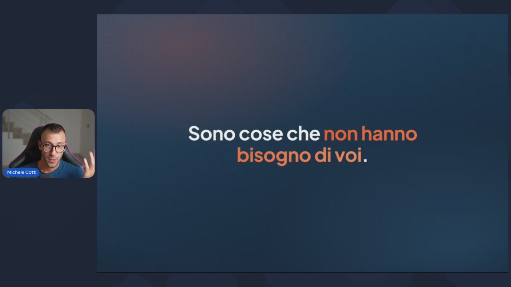

**Testo a schermo (OCR):** ME Sono cose che non hanno % aa bisogno di voi. “Michele Cotti)

> Non serve il vostro cervello, non serve la vostra esperienza, non serve che siete voi lì il titolare, ok? Lo fate solo perché non le fa nessun altro probabilmente. E allora le fate, dovete farle. La sera quando gli altri hanno chiuso, la domenica sul divano col telefono in mano magari, mentre fate finta di guardare il film in realtà state rispondendo alle mail. A mezzanotte perché durante il giorno non c'è stato un secondo e c'era da fare altro. E sapete qual è la cosa peggiore? Che ogni tanto qualcuna ve la dimenticate pure. Il sollecito che non parte e il cliente che vi paga con due mesi di ritardo perché nessuno magari gliel'ha ricordato. Il follow up che non fate e il preventivo da migliaia di euro che si perde dal nulla. Non perché il cliente magari ha detto di no, ok? Ma perché nessuno l'ha richiamato. Nessuno si è ricordato magari di inviare quella email. Quindi quei soldi lì li avete già persi. E non ve ne siete nemmeno accorti. Io ci sono stato dentro per anni in questa roba e ve lo dico con sincerità.

## [00:44:10] Schermata 50 _(periodic)_

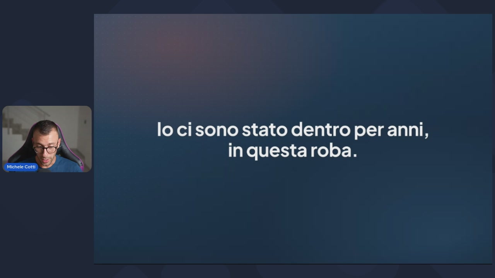

**Testo a schermo (OCR):** TS »° lo cisono stato dentro per anni, A 3 N in questa roba. | Michele Cotti

> Ero l'imprenditore che si sentiva un impiegato della sua stessa azienda, ve l'ho anche detto ieri sera. Tutto passava da me, se mi fermavo io si fermava tutto. Non riuscivo a prendermi un giorno libero perché il giorno dopo ne trovavo poi il doppio. E la cosa che mi faceva più rabbia non era la fatica, era rendermi conto che con tutte quelle ore non stavo facendo crescere niente. Stavo solo tenendo in piedi la baracca. Un'ora dopo l'altra a fare cose che una macchina avrebbe fatto probabilmente meglio di me. E senza lamentarsi. Ecco, lo stato 5 è esattamente questo. È il momento in cui a tutte quelle cose lì dite, fatevi da sole. Il report del lunedì mattina, i solleciti a chi non vi ha ancora pagato, il follow up al cliente che non ha risposto al preventivo, la preparazione prima di una call. Cose che già... Non da sole, in automatico, anche di notte mentre voi dormite, ok? Voi vi svegliate e un pezzo della giornata è già fatto. Non l'avete preparato voi, è già lì, pronto.

## [00:45:10] Schermata 51 _(periodic)_

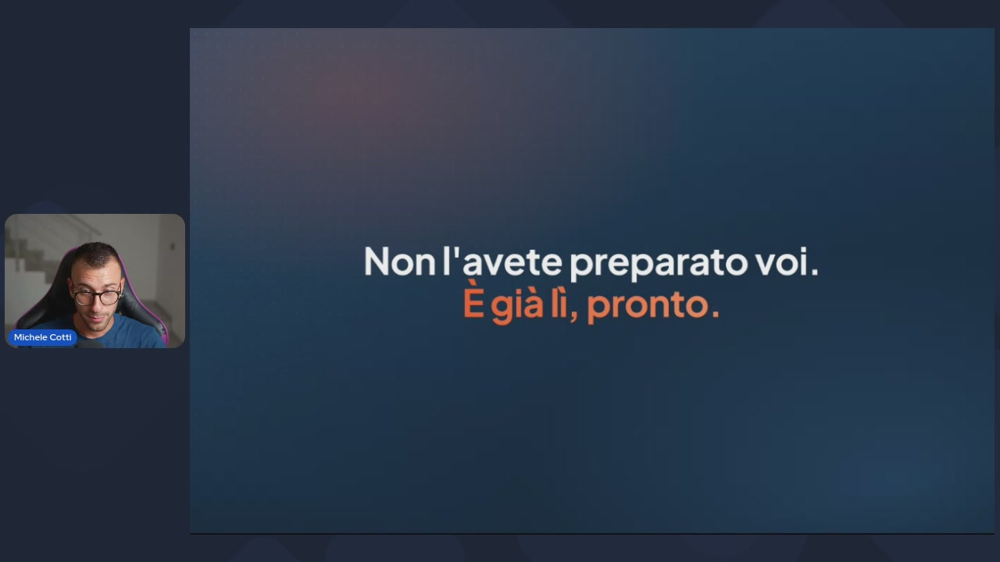

**Testo a schermo (OCR):** Nonl'avete preparato voi. E già lì, pronto.

> È una sensazione strana, credetemi, la prima volta e ve lo dico perché l'ho provata su me stesso. La mattina apri il computer, aspettandoti la solita montagna di cose da fare e invece trovi già metà del lavoro fatto, ok, mentre tu dormivi. Il report del lunedì c'è, i solleciti sono partiti, il follow up ai clienti è andato, tu non hai mosso un dito e l'azienda comunque ha lavorato lo stesso. Tutta la notte, ok, tutta la notte. E la prima volta che vi capita vi fermate un secondo, credetemi, perché vi rendete conto che per la prima volta da anni l'azienda ha fatto qualcosa senza di voi. E ha funzionato lo stesso e magari ha funzionato anche meglio, ok? E qui arriviamo all'ultimo strato, il più potente di tutti, il sesto, gli agenti, ok, gli agenti. Il sesto strato. Un agente è un collaboratore digitale che lavora anche quando voi non ci siete. Non aspetta gli ordini quando arriva un'email, la legge e la smista e prepara magari già la bozza di risposta. Quando arriva una richiesta dal sito, prepara l'offerta.

## [00:46:10] Schermata 52 _(periodic)_

**Testo a schermo (OCR):** Quando arriva una richiesta dal sito, prepara l'offerta.

> E se gli chiedete come stiamo andando questo mese, vi risponde ragionando sui vostri numeri. Non a caso. È come avere una persona in più nel team, ok, che però non dorme, non si ammala mai e che l'azienda la conosce a memoria meglio di chiunque altro. E adesso la cosa più importante di tutta la serata, quella per cui vale la pena essere arrivati fin qua. L'ordine, ok, l'ordine delle cose, perché l'ordine di questi sei strati non è un dettaglio da nerd, ok? È tutto. Fa tutto l'ordine. Guardate cosa succede se lo sbagliate. Ed è l'errore preciso che fa il 90% delle persone. Prendono lo strato 5, l'automazione, ve lo dicevo anche ieri, quella cosa figa che gira da sola, ok, e la costruiscono senza i primi tre, senza il cervello, senza il cervello sotto che gira. E il risultato qual è? L'automazione gira, sì, ma svolge cose generiche. Sbagliate. Perché non sa niente della vostra azienda, non ha le procedure, non sa effettivamente

## [00:47:10] Schermata 53 _(periodic)_

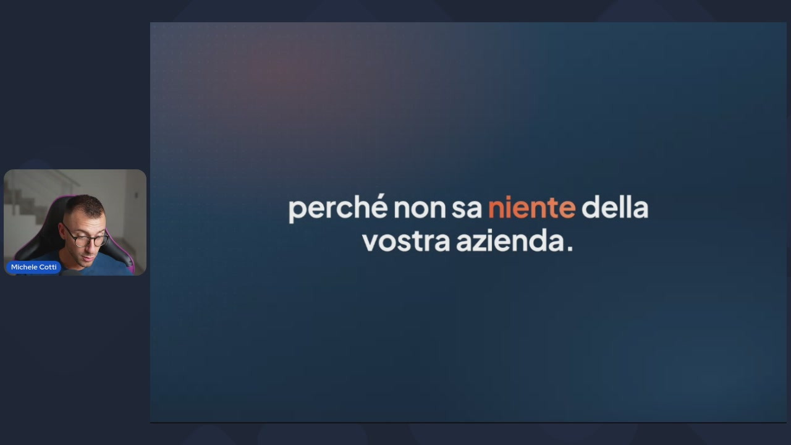

**Testo a schermo (OCR):** perché non sa niente della vostra azienda.

> come devono essere fatte quelle determinate cose e ogni piccolo cambiamento va rifatto da capo. Non è come prima che si modifica il file del cervello e allora l'automazione va da lì e si aggiorna in automatico. No, va rifatto da capo. E il secchio bucato di ieri, tanta fatica e l'acqua che scappa, ok? Prima va fatto il cervello, poi c'è tutto il resto. Sempre in quest'ordine, molto molto importante. E adesso, prima di andare avanti, non voglio che mi crediate solo perché ve lo dico io, ok, perché è poi facile, no, credere solo perché lo sto dicendo. Voglio invece farvi sentire una persona, in realtà saranno due che entreranno insieme, che è partita, sono partite esattamente da dove probabilmente siete voi oggi, ok? Adesso sono contento e non vedo l'ora di far salire qua adesso sul palco Christian e Irina, ok, che sono due persone che stiamo seguendo adesso con la creazione del Company Brain.

## [00:48:10] Schermata 54 _(periodic)_

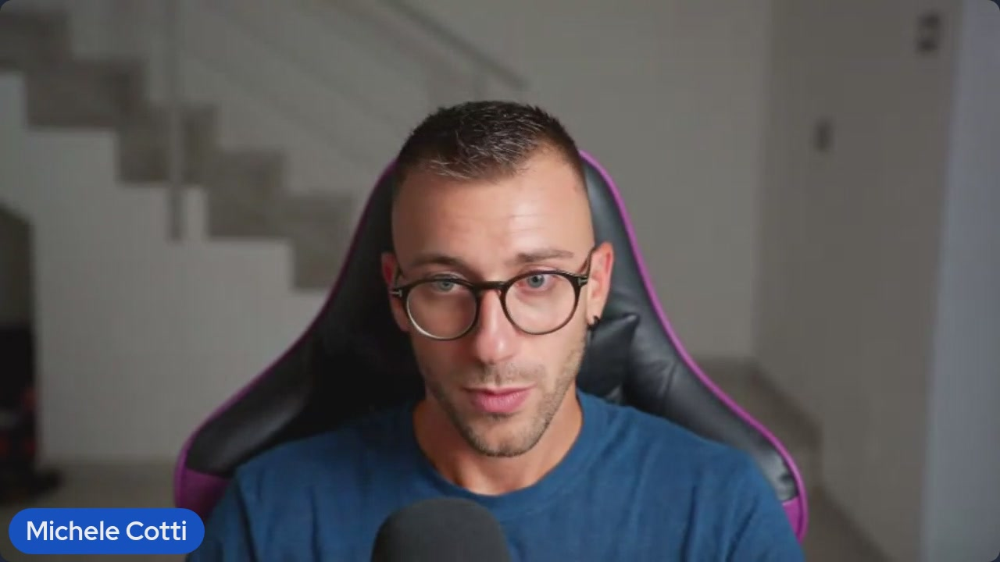

> Abbiamo già costruito un bel po' del Company Brain, adesso vi lascerò direttamente raccontare da loro, quindi adesso aggiungo Christian sul palco e anche Irina.

## [00:48:25] Schermata 55 _(scene)_

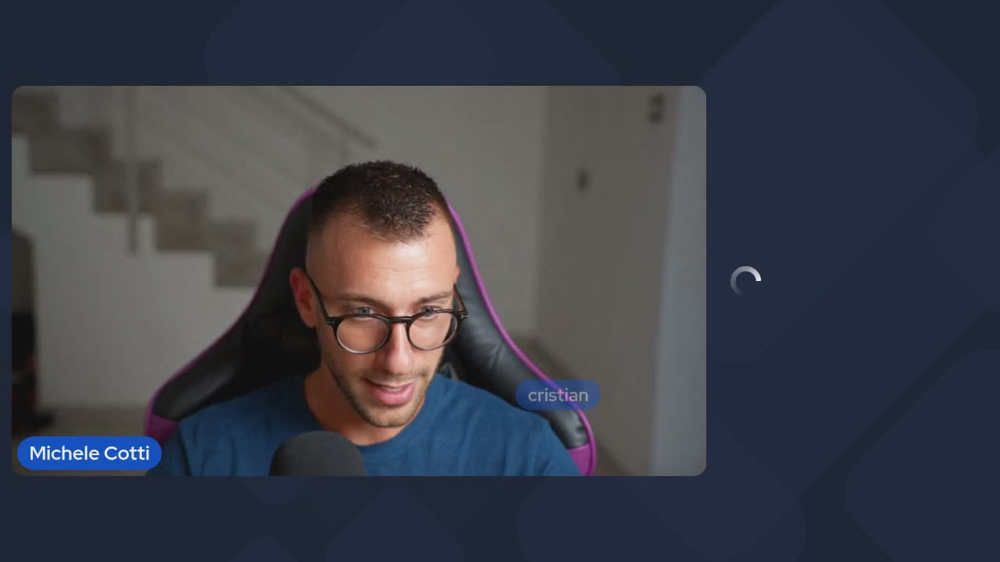

> Ok, ciao Christian, ciao Irina. Ciao, bene grazie, tutto bene, tutto bene, grazie, grazie per essere qui. Allora, io direi, presentatevi pure voi, lascio a voi la parola, quindi in pochi secondi chi siete, cosa fate, lato azienda? Beh, noi siamo attivi nell'ambito vinicolo, siamo un gruppo di aziende che coprono dalla produzione in vigna fino alla vinificazione, all'imbottigliamento e poi l'uscita nel mercato, sia grande distribuzione, sia importatori, sia anche nel caso dei negozi presso le nostre aziende agricole, oppure curiamo in alcuni casi la distribuzione come negli Stati Uniti, dove abbiamo una società di distribuzione. Questo è proprio in tre parole da dove partiamo, da dove arriviamo. Assolutamente, grazie, è una bella azienda strutturata comunque, una bella azienda strutturata.

## [00:49:25] Schermata 56 _(periodic)_

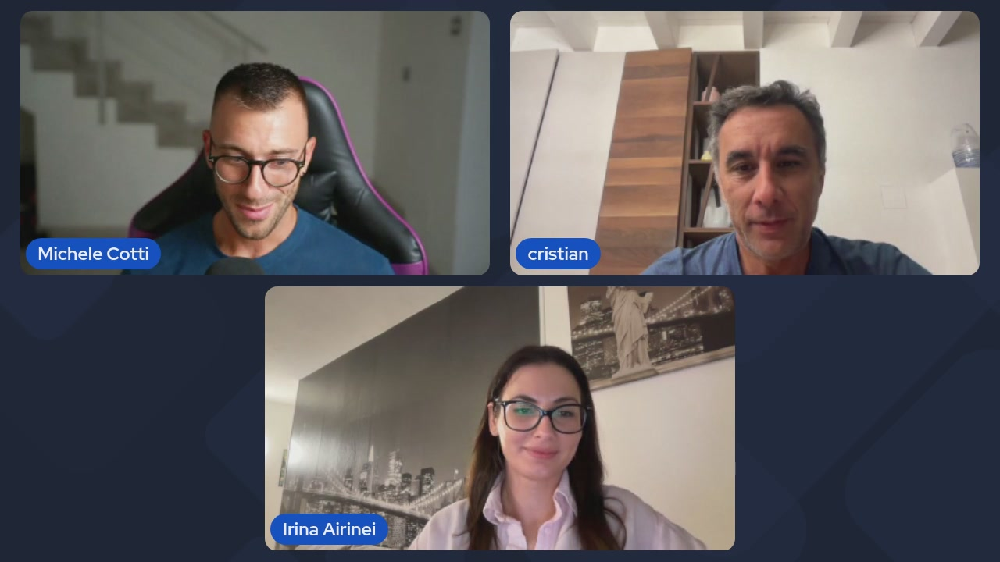

> E prima di andare a costruire quello che è stato poi il Company Brain, voi avevate provato altro, nel senso avete provato altro, lato AI, un po' anche delle cose che magari abbiamo visto in queste serate fino ad oggi. Vi contestualizzo anche Irina in realtà, perché Cristian è l'imprenditore, però poi io mi sono sempre anche interfacciato con Irina, perché è poi lei che ha messo le mani davvero dentro il Company Brain dell'azienda, quindi... Allora, sì, diciamo che comunque l'intelligenza artificiale non era una cosa nuova per noi. Lavorando con il pacchetto Google Business, avevamo Gemini integrato e alcuni di noi, magari anche l'auto marketing, utilizzava già anche CiaoCPT. Però ci siamo accorti che comunque, come dicevi anche tu, l'intelligenza artificiale purtroppo

## [00:50:25] Schermata 57 _(periodic)_

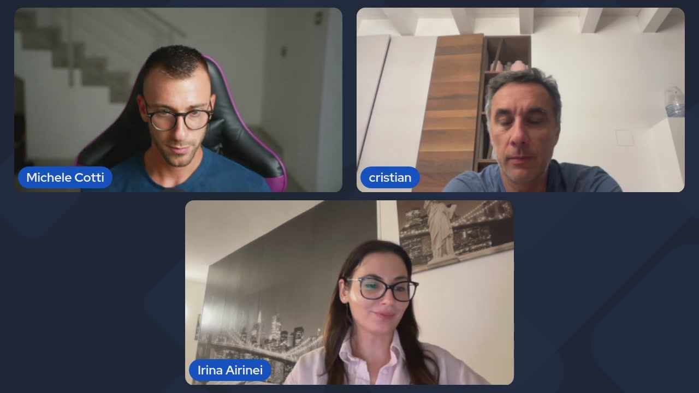

> non ha una memoria. Quindi, più Cristian che mai, devo essere onesta, è andato alla ricerca di una soluzione e, seguendo vari video su YouTube, ha sentito parlare del Company Brain. La prima volta che me l'ha proposto ti ho detto che è un po' impazzito, sicuramente, è una cosa impossibile. Però poi, sì, guardando un po' di tutorial in collaborazione con te, abbiamo costruito prima quelli che sono i second brain individuali, quindi ogni operatore ha il suo. E dopo abbiamo costruito il Company Brain che è sincronizzato con i second brain di ogni persona e quindi c'è un flusso diretto di informazioni che dai singoli utenti vanno a alimentare il Company Brain con

## [00:51:25] Schermata 58 _(periodic)_

> le proprie conoscenze e, al contrario, il Company Brain può essere interrogato in qualsiasi momento da chiunque di noi. Quindi tutta l'azienda ha a disposizione il Company Brain. Sì, poi il Company Brain l'abbiamo collegato a tutti i nostri strumenti, perché anche noi abbiamo i vari gestionali, Google Drive, le mail, insomma, con tutti i connettori e, nel caso del gestionale, avendo una versione un po' più vecchia, non avendo un API, un MCP suo, come hai detto te anche prima, l'abbiamo costruito da zero. Assolutamente. E ad oggi, dopo aver fatto anche percorsi insieme, stiamo lavorando ancora, ovviamente ci sono ancora cose da fare, però ad oggi, se guardassi indietro, qual è il vantaggio, il valore aggiunto che ad oggi il Company Brain in azienda vi sta dando? Magari sia dal tuo lato Irina e sia dal tuo lato Cristian, insomma.

## [00:52:25] Schermata 59 _(periodic)_

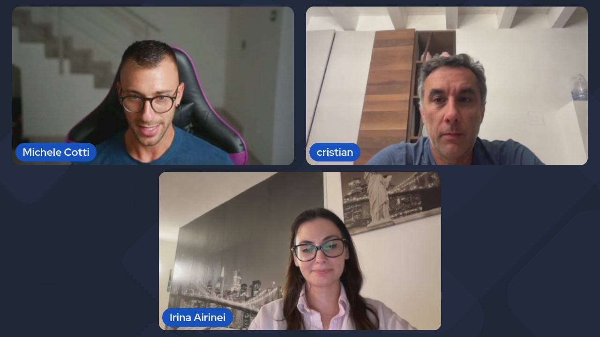

> Allora, faccio parlare Cristian che è quello più... Io ho almeno 30-40% di risparmio delle mie ore lavoro. Riesco a avere dati che prima dovevo correre nei vari uffici per avere in maniera quasi istantanea e tante volte addirittura mi stupiscio sui dati che riesce a darmi e riesce a tirarmi fuori. Funziona veramente bene, siamo ancora all'inizio, abbiamo ancora un po' di strada a fare, cose da inserire, però già ora è strabiliante. Sottoscrivo tutto quello che hai detto questa sera fino a prima. Ti ringrazio. Anche perché un 30-40% in meno di tempo di lavoro direi che non è affatto male. Ma sai, devi rispondere a una mail, ti manca un dato, ti manca uno storico, ti manca un costo, ti manca anche una situazione del cliente sta pagando o non sta pagando e quindi un po' te lo

## [00:53:25] Schermata 60 _(periodic)_

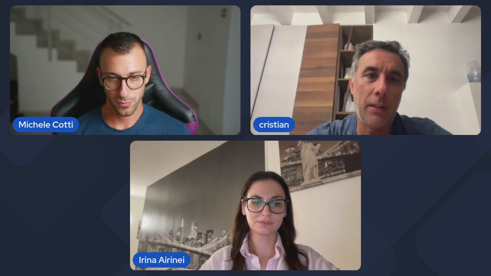

> cerchi tu, un po' cominci a girare la contabilità, il commerciale, la produzione, ora che ti arrivano tutti i dati e quando invece puoi averli in meno di un minuto solo chiedendoli è un'altra cosa. Anzi ti fa anche la mail, non devi neanche scriverla. Esatto, esatto. Sì, è come avere praticamente tutta l'azienda in un computer, cioè veramente, anzi in una chat, c'è un assistente, è quello per cui Cristiano ogni tanto mi prende in giro, che secondo me col company brain l'azienda acquisisce una personalità, cioè diventa proprio la persona che ti risponde. È vero, bisogna dargli un nome, bisogna dargli un nome. Ci penseremo. Assolutamente. Vi faccio un'ultima domanda e poi vi lascio andare, quindi voi lo consigliereste alle persone di crearsi un company brain a un imprenditore che comunque ha un'azienda? Posso dirti, mi chiedo come abbiamo fatto senza. Io lo sto consigliando a tutti, però non tutti mi capiscono, mi guardano

## [00:54:25] Schermata 61 _(periodic)_

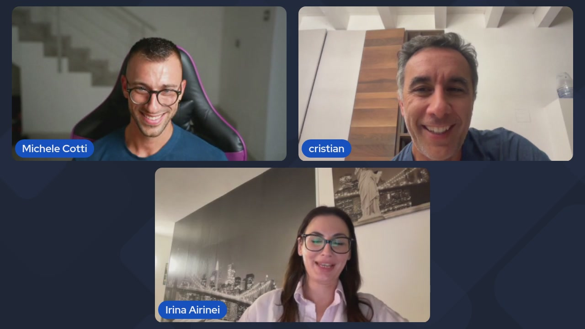

> in modo strano, però a quelli che posso lo consiglio. Tempo al tempo, anche perché ormai la direzione è quella, ci sono delle idee che poi chi non lo implementerà rimarrà indietro, quindi questo è. Bene, io starei qua ancora a parlare con voi, ma abbiamo ancora un po' di cose da vedere, quindi Cristian e Irina, grazie mille, è stato un piacere portarvi qua in live. Noi poi ci sentiamo a brevissimo che abbiamo una call poi nei prossimi giorni, insomma. Ciao, grazie a te. Ciao, grazie a voi, buona serata. Ok, avete visto ragazzi in realtà come può fare davvero la differenza un company brain, che l'avete

## [00:54:58] Schermata 62 _(scene)_

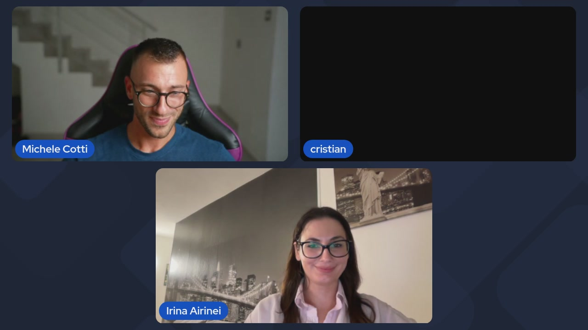

> sentito da due persone, ok? C'era Cristian che era l'imprenditore, Irina che è parte dell'azienda. Capite cosa può fare, ok? Capite cosa può fare. Cristian ha detto un 30-40% in meno di tempo di lavoro. Pensate quanto vale il 30-40% in meno di tempo di lavoro di un imprenditore, ok? Di un imprenditore. Ora, torniamo a noi, perché volevo farvi sentire anche persone con cui già stiamo seguendo, ok, nella creazione del tutto, per avere anche un loro punto di vista, perché è facile sentirlo da me, ma è più bello sentirlo anche da altre persone che lo stanno già anche applicando in azienda tutti i giorni. Ora, adesso al momento che aspettavo io, e credo pure voi, vi ricordate il lavoro che abbiamo lanciato

## [00:55:58] Schermata 63 _(periodic)_

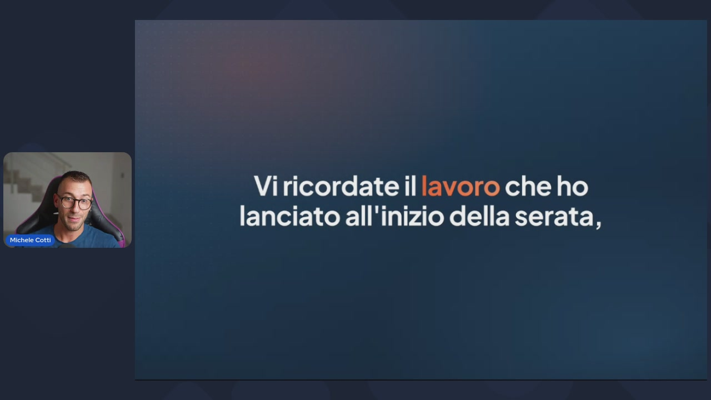

**Testo a schermo (OCR):** Vi ricordate illavoro che ho lanciato all'inizio della serata,

> all'inizio della serata, ok? Quello che abbiamo... In realtà due lavori abbiamo lanciato. Abbiamo lanciato il fatto di trovarci dei clienti e un clone, che è assurdo. Quello di trovarmi clienti nuovi e che ho lasciato lì a lavorare da solo per tutto questo tempo, ok? Adesso andiamo a vedere effettivamente cosa ha combinato. Andiamo a vedere cosa ha combinato. Ora, andiamo, mi prendo, mi vado in condivisione e vi condivido tutta la finestra, così almeno, tac tac tac, ok. Vi condivido anche l'audio, così magari riuscite a sentire anche quello, ok. Perfetto, aggiungiamo al palco, perfetto, si vede. Allora, qua sta finito di lavorare, andiamo nella parte dei lavori e abbiamo avvocati di Milano e

## [00:56:47] Schermata 64 _(scene)_

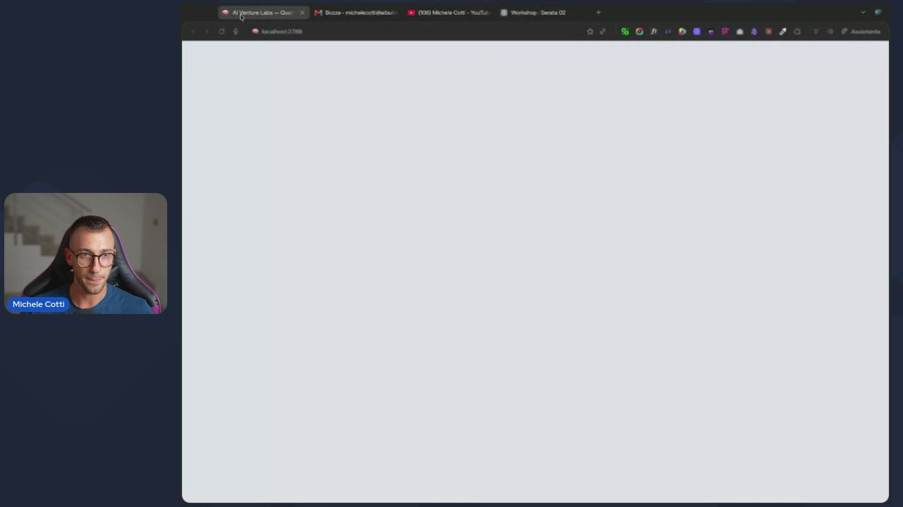

## [00:56:51] Schermata 65 _(scene)_

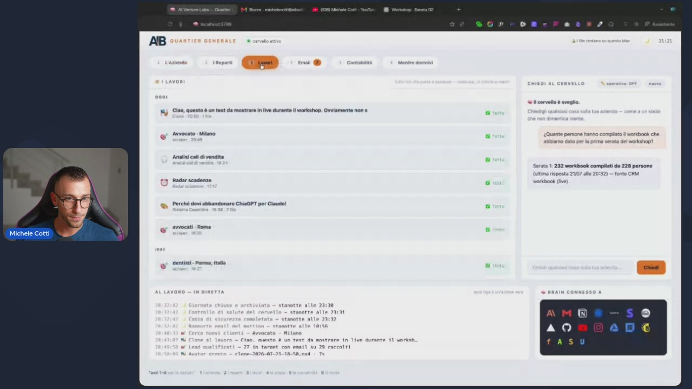

**Testo a schermo (OCR):** inlive durante workshop, Ovviamente non s Analisi cati di vendita 3 Radar scadenze svocati cene i cerveio è evegto 232 merkibock complai ds 228 persone

> questo. Prima di aprirli, però, voglio lanciare altri due lavori, dato che ci tengono un attimo, almeno lì lanciamo. E vi faccio vedere, stasera volevo focalizzare un attimo più anche sulla parte di marketing, ok? Quindi, di base, cose che tante persone in azienda potrebbero avere. Quindi io vi ho fatto vedere il clone, adesso vediamo cosa ha prodotto in realtà, però potrebbe essere lato ads, ok? Tipo noi in azienda abbiamo la parte del sistema delle copertine, perché? Perché andando a fare in più video su YouTube, come vi dicevo, vado a generare delle copertine. Quindi io adesso faccio partire anche una roba di questo tipo, possiamo dargli una roba da creare, tipo 5, possiamo fare 5 skill di cloud che devi assolutamente avere, questa era una che avevo già fatto, possiamo anche fare 5 comandi di cloud che, sì, 5 comandi di cloud che devi avere, ok? Oppure si può fare

## [00:57:51] Schermata 66 _(periodic)_

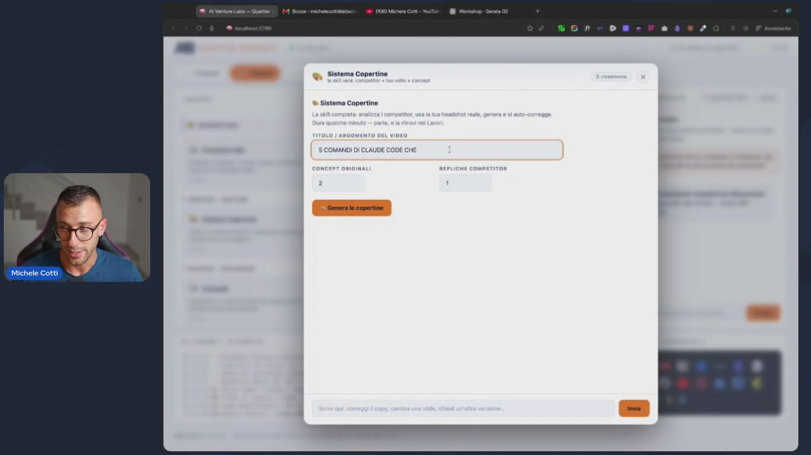

**Testo a schermo (OCR):** Sistema Copertine Sistema Copertine COMANDI DI CLAUDE CODE CHE Michele Cotti

> anche altro in realtà, eh? E qualcosa che mi fa scegliere, mi fa scegliere concept originale, quindi studiati direttamente da lui, oppure repliche di competitor, ovviamente competitor americani, perché questo non è una cosa che prendo, io lancio e mi genero una copertina alla cazzo, ok? Dal nulla. Questa è una cosa che, cos'è che fa? Lui prende sulla base del mio titolo, ok? Sulla base del mio titolo, prende, va online, ricerca tutti i video di competitor americani, guarda i video che sono andati meglio, scarica le copertine di queste persone che sono andate meglio, le confronta, le tiene in questo caso le due migliori e le replica per me nel mercato italiano. Mentre concept originale parte dal titolo e sulla base di tutte le copertine che abbiamo fatto fino ad oggi, ed ovviamente è collegato a YouTube, è collegato ai dati e quant'altro, sa le copertine che sono andate meglio, sa le copertine che sono andate peggio, in automatico vai e si crea un concept sulla base di quello che è andato meglio, ok? Quindi non è

## [00:58:51] Schermata 67 _(periodic)_

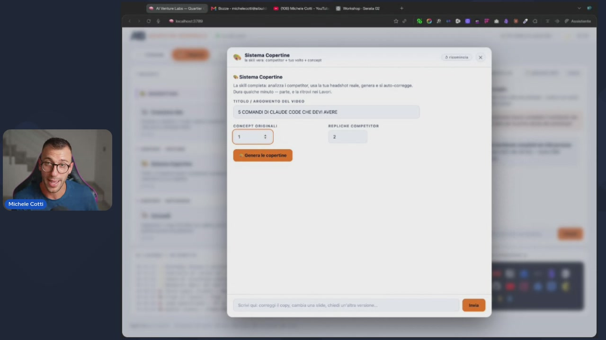

**Testo a schermo (OCR):** Sistema Copertine MANDI DI CLAUDE CODE CHE DE Michele Cotti

> un cosa stupida, oh, gli do la copertina di un mio competitor e me la replica, poi lo sono capaci tutti. No, questo è una cosa molto diversa. C'è dietro un ragionamento, ha dietro i dati, come vi dicevo, il cervello ha dietro i dati del mio canale YouTube, ha dietro le cose che, le copertine che sono andate meglio. Ogni video che esce, lui una volta a settimana tira giù tutto da YouTube, prende, se lo rielabora e mi aggiorna questa cosa, ok? Quindi in questo caso io lanciamo, genera le copertine, ok? Adesso lo lasciamo lavorare, poi vediamo cosa va a creare. Intanto vedete come sta andando la parte di copertina, ok? Ve ne faccio anche un altro,

## [00:59:25] Schermata 68 _(scene)_

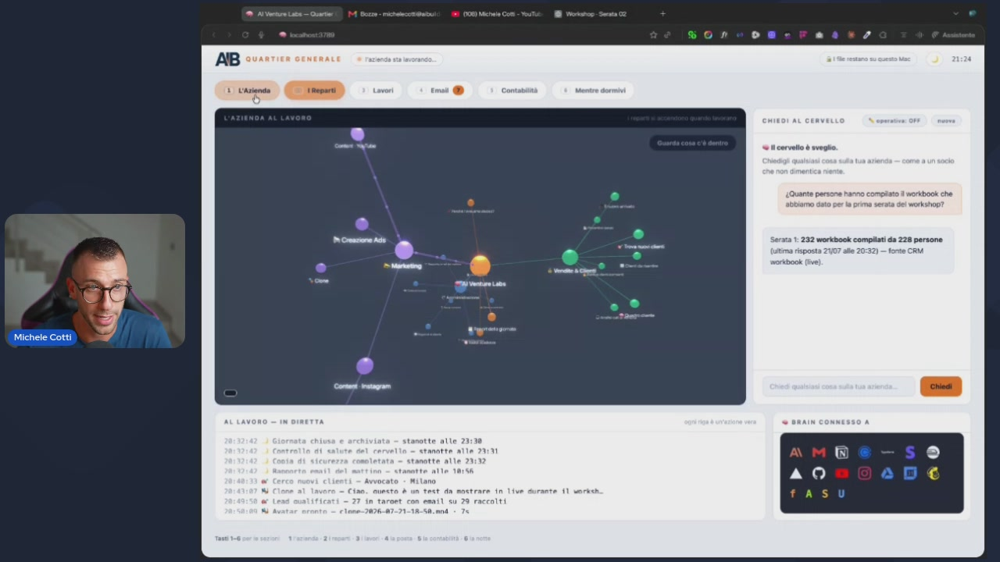

> sempre lato marketing, ossia quello dei caroselli, dato che tanti di voi magari hanno, hanno caroselli,

## [00:59:31] Schermata 69 _(scene)_

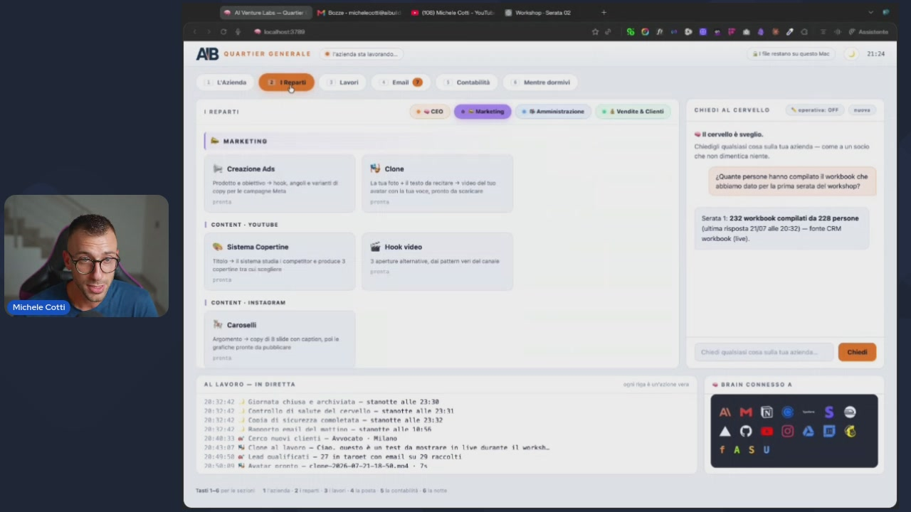

**Testo a schermo (OCR):** id Hook video Michele Cotti & 7 Caroselt

> fanno caroselli, se devono pubblicare, ok, sui social contenuti che siano post, qualcosa di questo tipo, insomma tutti quelli che hanno un'azienda di base, che siano prodotti o altro, solitamente ad oggi un profilo Instagram c'è. Io quello che uso, perché mi è comodo, è partire da un video YouTube, quindi di base io qua, dal mio canale, posso prendere un video del tipo

## [00:59:53] Schermata 70 _(scene)_

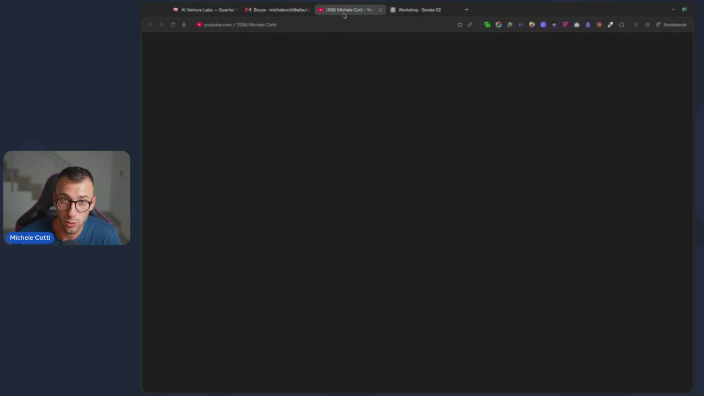

**Testo a schermo (OCR):** #0 GOA O FARAI 19 e

> Claudio il Limitato, 5 nuovi trucchi per uscire. Cosa può succedere se non si può usare Cloud senza esatto tipo questo che eh si presta bene, ok? Cloud continua a lanciare. Mi blocco. Si presta bene ad un carosello. Io lo prendo,

## [01:00:11] Schermata 71 _(scene)_

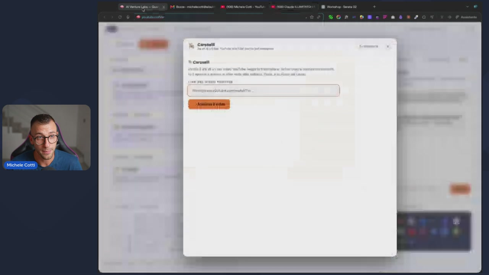

**Testo a schermo (OCR):** Michele Cotti

> ok? Entro, metto il video YouTube e lo faccio partire. Lui cosa fa? Lui prende, mi analizza, si scarica tutto il transcript, tutta la trascrizione del mio video YouTube, mi andrà a proporre quattro, cinque concept, ok? O meglio le le slide che andrà a creare del carosello, mi proporrà cosa vuole mettere dentro, mi proporrà la caption, poi io lo faccio partire e in automatico lui va e genera il carosello. E non è la cosa che vedete fare un po' da tutti in giro attaccato magari ad Ikesfield con abbonamenti da pagare. No, qua c'è dietro un modello di generazione d'immagine molto bravo a cui ha delle reference, da cui prende spunto come stile del carosello e poi va e scrive il carosello con il mio tono, come io vado a pubblicare su Instagram. Questo voi vedete come adesso mi ha fatto. Slide uno, cover. Quello ti blocca sempre sul più bello, cinque trucchi per non fermarti mai. Slide due, questa. Slide tre, io se voglio posso cambiare. Diciamo che per questo esempio

## [01:01:11] Schermata 72 _(periodic)_

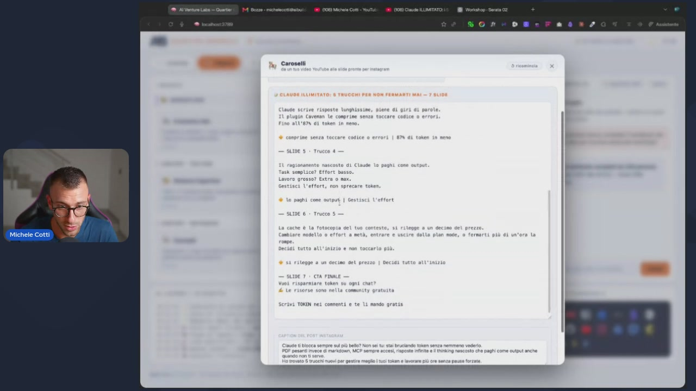

**Testo a schermo (OCR):** Caroselli Michele Cotti

> lo lasciamo così che va bene. E qua mi ha fatto anche la caption del post Instagram. Conferma e genera slide. Bene, lasciamolo andare, ok? Lasciamolo andare. Nel frattempo qui nei lavori vediamo come stanno andando in corso ancora la parte di sistema delle

## [01:01:21] Schermata 73 _(scene)_

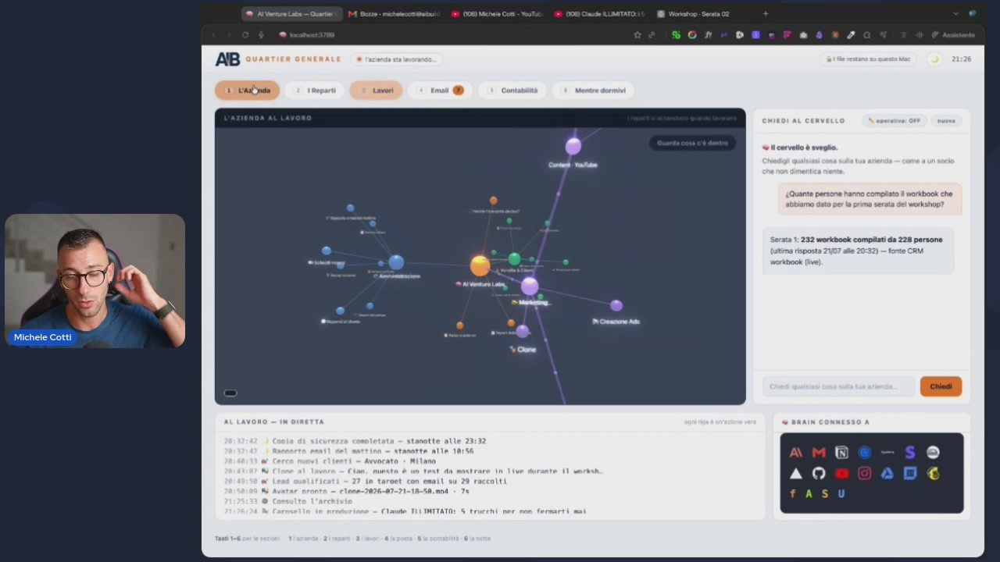

> copertine e i caroselli, ok? Questo, come ripeto, ogni azienda potrebbe averlo. Io parto da un video YouTube, ma perché mi è comodo, io non so, mi è comodo partire dal video YouTube, ma se tu dici io voglio che mi parla quando esce la nuova news, oppure che quando io pubblico un vlog sul mio sito web, in automatico mi crei un carosello e poi me lo pubblichi, tutto si può fare, ok? Tutto sta alla base, tutto sta alle procedure. Perché tutte quelle cose qua belle che vedete, eh, ok? Qua è semplicemente mostrato a livello grafico, ma dietro ci sta tutto il motore che vi ho fatto vedere come costruire stasera. Quindi si parte dal raccoglimento delle informazioni, al contesto e a tutto il resto. Ora andiamo a vedere i lavori che ci ha combinato. E io partirei da quello che è il clone e vediamo

## [01:02:05] Schermata 74 _(scene)_

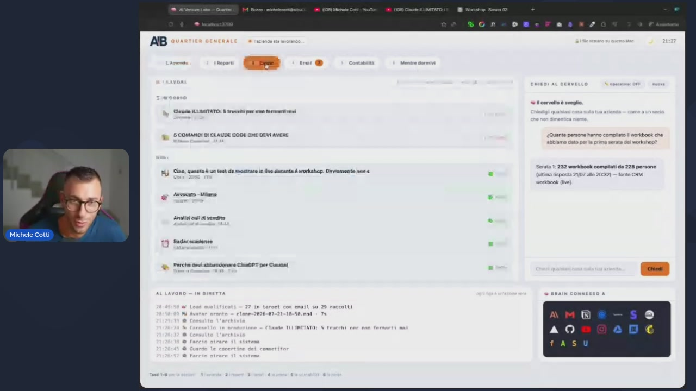

**Testo a schermo (OCR):** i cerveio è evgto COMANO DI CL AUDE CODE CHE DEVI AVERE Cino, questa è un test cerare i ve quante i vorkshop Ovviamente non 3 Ne ea n Anali cat veto Michele Cotti rinciae scnsenze

> cos'è saltato fuori. Magari non è perfetto. Ok. Ragazzi, guardiamo. Ciao, questo è un

## [01:02:11] Schermata 75 _(scene)_

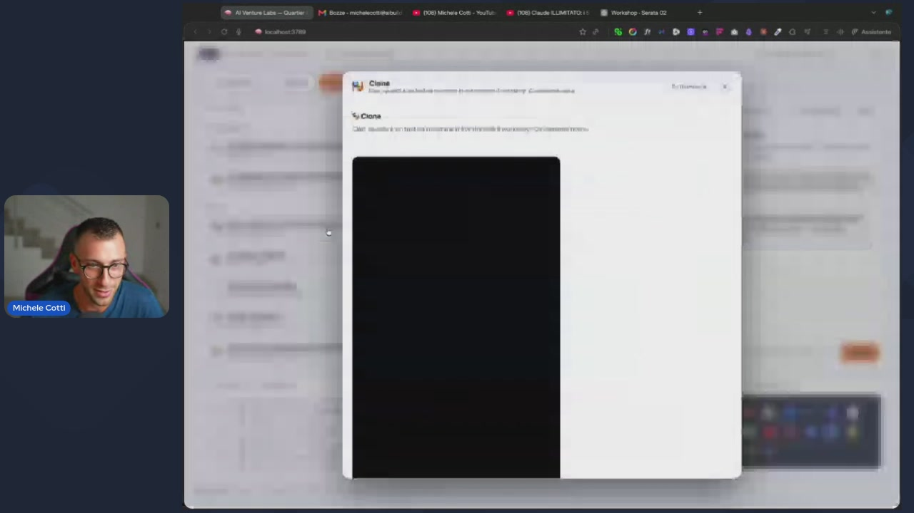

**Testo a schermo (OCR):** Michele Cotti

> test da mostrare in live durante il workshop. Ovviamente non sono perfetto, ma va bene così. Buona serata a tutti. Ovvio, non è perfetto, ok? Si vede. Però ragazzi, cioè, è sono io che parlo, partendo da un video. Se vogliamo aprire un attimo la chat, voglio avere un feedback da parte vostra. Ovvio, si vede che non sono io la voce, non è neancora perfetta, ok? Ma partendo da una mia immagine caricata qui stasera, che avete visto, me l'avete vista fare, e un mio testo, anche la voce, quanto è similare, ok? Quanto è similare, ok? Ok. Assurdo. Assurdo. Ora, ricerca ad esempio Avvocato Milano. Guarda un po' cosa

## [01:02:51] Schermata 76 _(scene)_

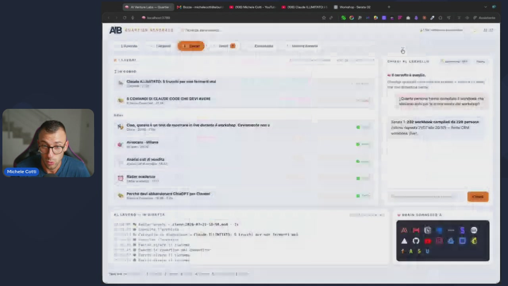

**Testo a schermo (OCR):** COMANO DI CLAUDE CODE CHE Cino, questa è un test de moesrare i ve cune i workshop: Orvemente nem 3 Anais ca vita Michele Cotti Patch onvi atamgonere ChaDPT per Ciani

> mi ha fatto. 27 Leading target con email su 29 raccolti. L'obiettivo era 20. Quindi cos'è che è andato a fare? È andato a fare praticamente, queste sono tutte aziende vere, potete provare a cercarle, ok? Si è trovato l'azienda con anche quante recensizioni su Google Maps. La categoria Avvocato divorzista, Avvocato esperto in diritto di famiglia, Avvocato eccetera. Città di Milano, che gliel'abbiamo impostato a noi. Numero di telefono, email, e poi mi dice questo divorzista con 15 recensioni, sito attivo, form e WhatsApp presenti. Consulenze preventivi gestite via forma WhatsApp manuale, nessun booking preventivo online, ok? Carenza, perché noi come aziende di automazione possiamo andare a sopperire, ok? Quindi cosa facciamo? Io da qua faccio, creami una bozza e vedrete come poi mi troverò la bozza direttamente nella mia casella di email già scritta con il mio tono di voce personalizzata sull'arricchimento che ha fatto il lead, ok? Ok? Sull'arricchimento che ha fatto il lead. E qui vedete quanti

## [01:03:51] Schermata 77 _(periodic)_

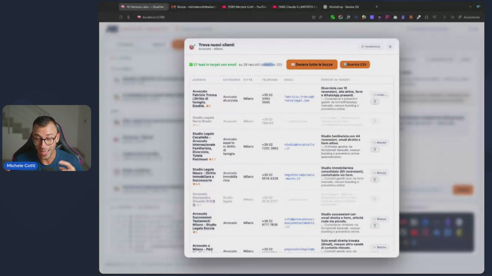

**Testo a schermo (OCR):** Michele Cotti Trova nuovi cilenti

> me ne ha trovati, ok? Anche questo, studio successioni con un email diretta form e qua io posso o generare tutte le bozze di blocco, quindi me le trovo tutte in email pronte da inviare, oppure scaricare un CSV, ok? Scaricare un file CSV dove poi ce le ho e posso nel caso mettere su altri tool o metterli direttamente io sull'email. Però qui ho generato direttamente la bozza. Adesso qua mi fa in Gmail, ok? Prendiamone un altro, a caso, nel frattempo vi faccio vedere in Gmail che se io vado, ok? Era vuota la mia casella, ha creato, preventivo, buongiorno Avvocato Tronca, io sono Tronca Liga, lo studio Tronca Liga che lavora bene recensioni solide su un sito attivo sul diritto famiglia. Mi ha creato l'email, ok? Adesso poi la vediamo anche direttamente dal nostro company, ok? Però è pazzesco, ok? È pazzesco quella roba qua. Possiamo scaricare tutto il CSV, possiamo farci generare tutte le bozze. Se io faccio questo, facciamo un'altra bozza, facciamo un'altra bozza e le facciamo creare, ok? Quindi in automatico andiamo a fare scraping. Ovviamente qua tu dici, eh ma i miei clienti

## [01:04:51] Schermata 78 _(periodic)_

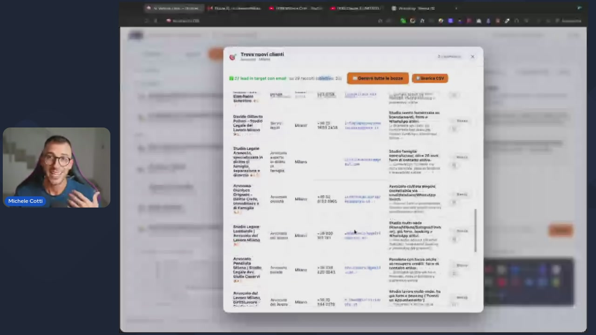

**Testo a schermo (OCR):** Trova nuovi clienti Michele Cotti

> non sono su Google Maps. Va benissimo, ognuno si deve creare poi, dal momento che si ha il company brain, si crea le proprie cose. Ovviamente tipo Christian e Irina di prima, che loro hanno un'azienda vinicola. Non è che si trovano magari il cliente su Google Maps che compra il vino. Magari sì, si trovano un ristoratore a cui proporre le robe, magari vengono all'ingrosso, li trovano da un'altra parte. Magari da LinkedIn. Si fa la cosa che va a ricercare i lead su LinkedIn, ok? Collegato magari con l'email in automatico. I tuoi lead stanno da un'altra parte? Si va a creare un qualcosa di conseguenza che sta dove vivono i tuoi lead, ok? E qua adesso ha generato le varie bozze in Gmail, ok? Quindi qua andiamo a vedere sempre dentro, se io ricarico, mi ha creato le altre due bozze. Preventivi via booking ancora a mano? Bene. Potremmo collegare un sistema che dopo la promozione prepara il preventivo da solo e manda i primi memori. Levasse le mani a due righe su come lo imposteremo per lo studio? A presto, Michele. Ovviamente qui personalizzato su quello che dovresti

## [01:05:51] Schermata 79 _(periodic)_

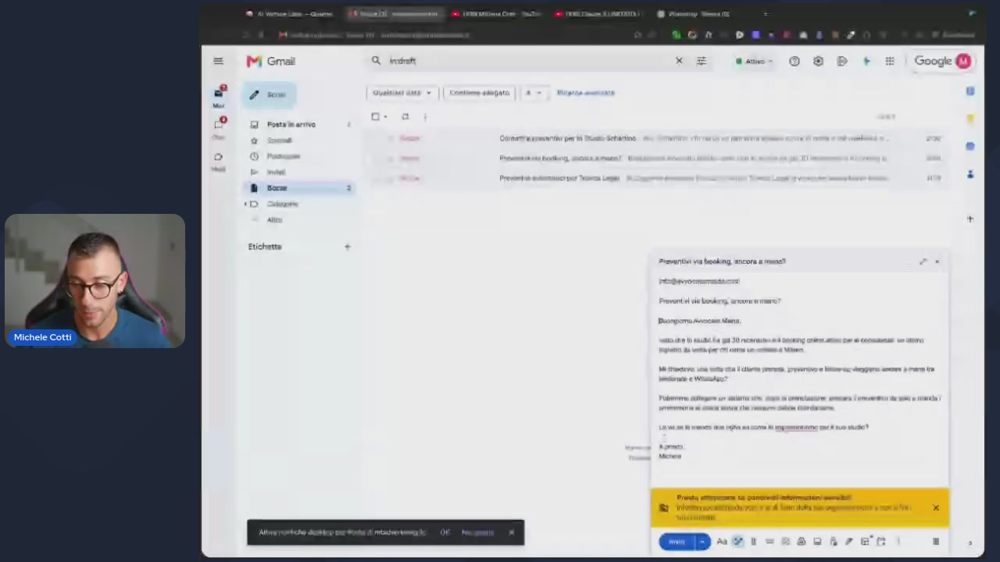

**Testo a schermo (OCR):** | Graî 4 3 Michele Cotti

> andare a fare voi, di quello che fa la vostra azienda e quant'altro, ok? E io posso vederlo anche direttamente da qua nelle email. Quindi se vado sulla bozza, posso vederlo tranquillamente qui e da qua potrei fare invia adesso, me la invierebbe, oppure direttamente eliminarla. Però questo per farvi capire effettivamente quanta roba si può fare, ok? Io da qua adesso potrei leggermi tutte le email, però volevo tenervela poi per stasera anche la parte domani sera, dato che comunque vi sto già facendo vedere un bel po' di roba. Abbiamo visto il crono, abbiamo visto la ricerca automatica, adesso è partito anche i caroselli. Guardiamo un po' cosa si è fermato. Il best 2 in generazione, ok, ha avuto un problemino, ci sta, può capitare, ok? Può capitare, ha dato un errore, va bene. Lasciamo lavorare quello delle copertine, ok? Possiamo anche farlo ripartire, se vogliamo, ok, il limitato, ci sta, anche perché sta girando

## [01:06:51] Schermata 80 _(scene)_

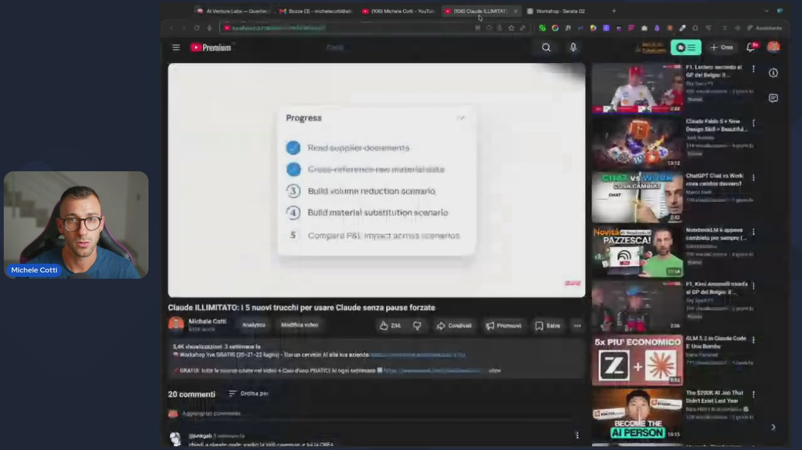

**Testo a schermo (OCR):** une). ni GOMME VC LET 1 viciator cena 209 dei Bg Claude ILLIMITATO: 1 5 nuovi trucchi per usare Claude senza pause forzate B) Mictuecort ssaa ia Bas 4 Coni liv [jim md . 404 iii 3 cem perc “= iahop tv GRATE 2-2 ag 20 commenti =" crinase 4 pose 3 == "| È ne ERSO

> lo stesso motore, sia di creazione delle copertine, sia delle creazioni dei caroselli, ok? Quindi di conseguenza può essere che a volte si rompa, va bene, ok? Può capitare, è bello anche della live. L'importante però è capire come ognuno di voi poi potrà andare a creare, ok, cose che riguardano la propria azienda, cose che possono funzionare davvero. Come vi dicevo, io poi abbiamo anche la parte di preventivi, la parte di contrattualistica, la parte automatica che se chiedo un cliente com'è, lui mi va, mi dice il cliente cosa abbiamo fatto, che c'è magari il preventivo da risalire o meglio da inviare perché è in attesa, in automatico me lo prende, si legge tutte quelle cose che abbiamo viste prima, mi genera il preventivo e poi me lo permette di mettere direttamente in bozza con allegato il preventivo, ok? Rilanciamogli la generazione, ok? Può capitare che è andato un attimo in blocco perché sta andando anche lato copertine. In più c'era anche la parte del video

## [01:07:51] Schermata 81 _(periodic)_

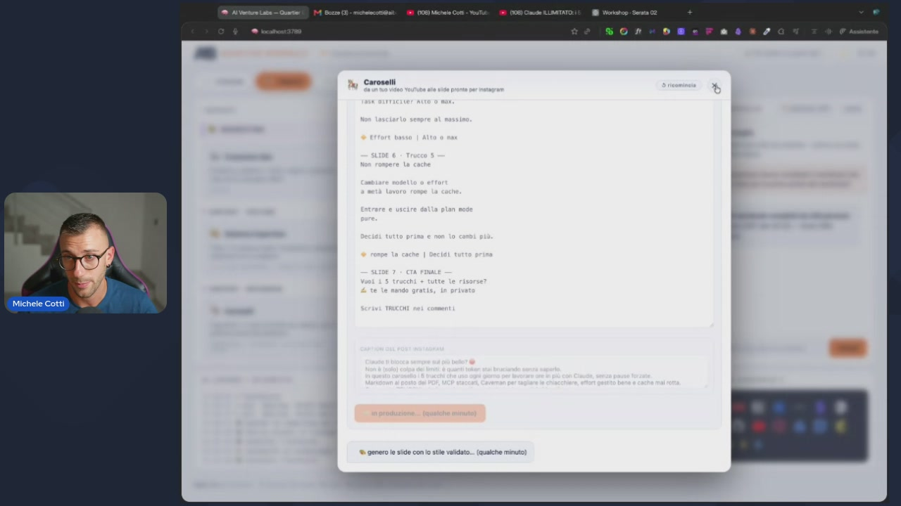

**Testo a schermo (OCR):** Michele Cotti rr __.ÉÉÉÉ

> del clone che stava che stava girando, ok? Stanno ancora girando. Magari poi ve lo condivido poi a fine, se continuiamo quella serata, poi vi condivido magari a fine serata perché questi sono lavori, come ripeto, anche quello delle copertine non è un prendo, butto una copertina di un altro me la replica, no? Quella roba lì va benissimo, te lo fa ogni motore, no? Questo parte dal titolo, prende, va e quant'altro. Voi dovete sempre pensare a ciò che sono le procedure della vostra azienda, cioè anche lì vi arriva un'email con una richiesta, ok? Bene. Com'è che funziona quella richiesta che vi arriva? Allora la gente deve leggerla, deve creare il preventivo in automatico dove ve lo mette in bozza, va bene, quello sta a voi. Dovete, tipo noi, abbiamo nella parte di vendita c'è la parte dell'analisi delle call di vendita, oppure come ripeto la parte dei preventivi, oppure il quadro del cliente che chiaramente noi tutti i lavori che facciamo anche da qua vi si possono chiedere direttamente anche a voce, ok? Qui vedete come è connesso a

## [01:08:51] Schermata 82 _(periodic)_

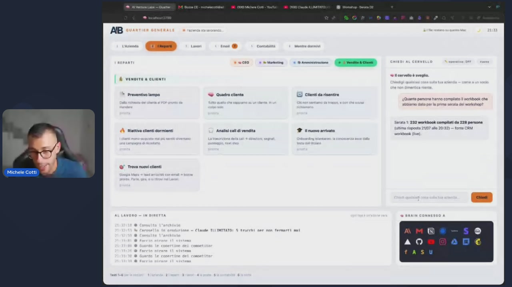

**Testo a schermo (OCR):** » Preventivo lampo y° trova nuovi cllenti Michele Cotti © Quadro cliente Analisi all i vendita

> tutti gli strumenti, che sia Notion, Gmail, il Calendly, il Typeform, Stripe, YouTube, Instagram, davvero qualsiasi cosa, ok? Chiaramente qua sta a voi, ok? I collegamenti che avranno ad esempio Cristian, che vi ho portato il live prima, saranno diversi da quelli che ho io. Magari sei nella produzione, hai qualcos'altro. Se è un'agenzia marketing che produce contenuti per clienti, la roba dei caroselli ti può servire, potrebbe essere una figata. C'è un'azienda che invece non ha una pagina Instagram, non ti serve niente, non te lo costruisci, ok? Tutte quelle robe vanno a crearsi custom, ok? Di base, ed è una procedura, ok? È una procedura. Lo fai, lo fai una volta, funziona bene, si automigliora e lo inserisci, ok? E lo inserisci. Ok, ora, ancora sta lavorando. Sta ancora lavorando, anche qui. Ok, questo sta ancora lavorando, con lo stile validato. Lasciamolo lavorare, ok? Adesso, volevo giusto farvi vedere un po', e apriamo un attimo la chat. Nel senso, come vi sembra tutta sta roba? Cioè, in azienda vi

## [01:09:51] Schermata 83 _(periodic)_

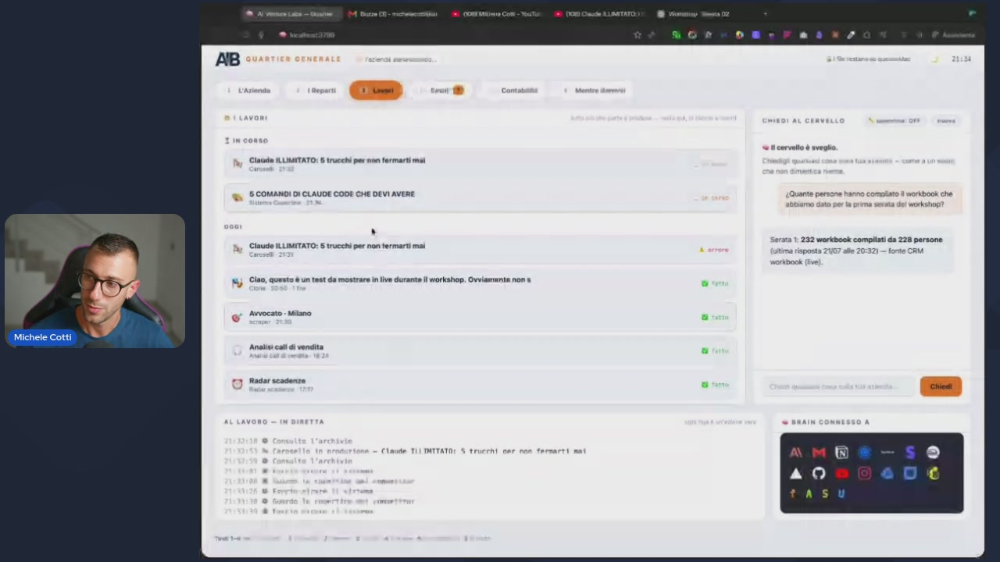

**Testo a schermo (OCR):** Michele Cotti IS e ILLITATO: trwchi per mon formarti mati 5 COMANO! DI CLALDE CODE CHE DEVI AVERE x da mostrare in ve durante i workshop. Ovviamr Anal cal vena ti cervello è vega 232 merkibock complsti da 228 persone

> servirebbe una roba di questo tipo? Pensate davvero a quante cose potete automatizzare, ok? Dalla richiesta a richiedere dei clienti. Alcune cose ve le faccio vedere domani sera, ok? Non voglio farvi vedere tutto stasera. La parte dei preventivi, la parte di, come ripeto, la parte di generazione contratto, la parte di recap del cliente, delle email, ve lo faccio vedere domani sera, ok? Wow, un bel po' di consumo di API. No, in realtà, ti dirò, tutto questo gira con il mio abbonamento CloudMax, perché è in locale, ok? Ma questa interfaccia come è stata realizzata? Sempre con Cloud, ok? Sempre direttamente con l'AI. Lavora col piano, dato che me lo state chiedendo. Lavora col piano. Ovviamente, dipende sempre dove viene messo. Cioè, voi lo potete far lavorare in locale, lo potete far lavorare su una VPS, può essere collegato all'API. Ovviamente, le API consumano di più, se andate a credito, ok? Più che altro eliminano posti di lavoro,

## [01:10:51] Schermata 84 _(periodic)_

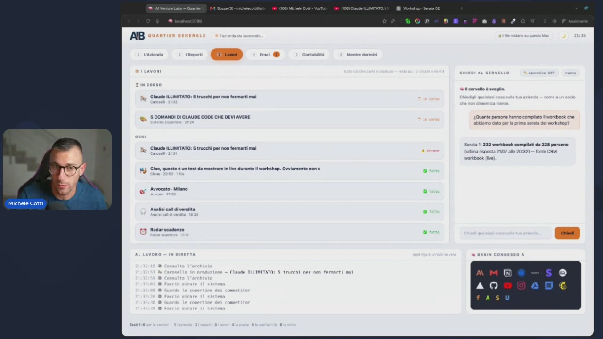

**Testo a schermo (OCR):** 5 COMANDI DI CLAUDE CODE CHE DEVI AVERE quant 01 werkbooki che rat 1 232 workbook compilati da 228 persone Claude ILLIMITATO: 5 trucchi per non fermarti mai alias da mostrare in ivo durante ll workshop. Ovviamente non s Michele Cotti Analisi cat di vendi

> segreti, grafici e marketer. Mi dispiace, si dovrà fare altro. Si cambia, ok? Ci fai vedere come creare la dashboard? Quella, la dashboard, ragazzi, è la cosa in realtà un pochettino più semplice, ok? È quello che ci sta dietro, quello che poi vi ho spiegato stasera, ok? Serve come il pane, serve certo, ci sono rischi di allucinazione in tutto il sistema. Ovviamente, no, le allucinazioni vengono chiaramente di base ridotte completamente dal contesto e da tutto quello che ci sta dietro, ok? E gli si dà delle regole precise. Chiaramente il sistema può sbagliare, ok? E se sbaglia, chiaramente noi lo correggiamo in modo tale che non commetta più quell'errore la volta dopo, ok? Chiaramente, come sbagliamo noi, è comunque un sistema che ha margine di errore. Però prima si testano le cose, prima di mandarle live, è sempre quello il processo, ok? Si può usare come

## [01:11:51] Schermata 85 _(periodic)_

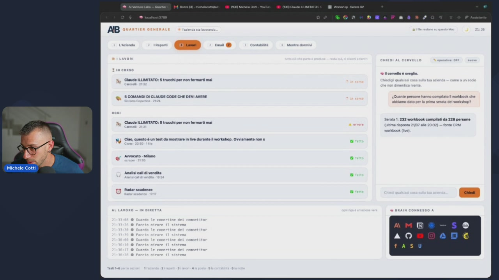

**Testo a schermo (OCR):** teervelo è evego Claude ILLIMITATO: 5 trucchi per non formarti mali 5 COMANDI DI CLAUDE CODE CHE DEVI AVERE Claude ILLIMITATO: 5 trucchi per non fermarti mai

> tutto scolastico, aiuto studio, anche. Il pronome basterebbe? Dipende da quello che lo usi a fare, ok? Dipende da quello che lo usi a fare. Io vi sto, ok. Ok, ok, ok. Ottimo, ottimo, ottimo, ottimo. Bene, lasciamolo lavorare, stanno ancora lavorando, quindi io direi, dato che comunque sono cose un pochettino più lunghe, tornerei alla presentazione, nel caso poi ve lo ricondivido ancora a fine serata. Però le cose che poi volevo farvi vedere, che era più lo scraping dei clienti e lato bozze che si generano e poi domani vedremo anche la parte di proprio recap di tutte le mail che mi arrivano con scrematura che tanti di voi hanno detto. Il problema principale è email e preventivazione. Vi faccio vedere come direttamente da qua si può fare sia una che l'altra cosa, veramente in un clic, ok? In un clic. Nel frattempo, guardate qua sotto come dice, eh guardo le copertine dei competitor, sceglie e poi si sta facendo tutto il lavoro duro. Vediamo

## [01:12:51] Schermata 86 _(periodic)_

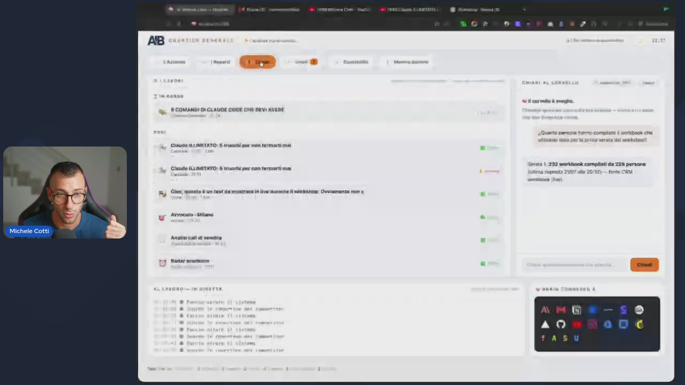

**Testo a schermo (OCR):** COMANDI DI CLALOE COGI CHE DEVI AVERE Arvezio: dita Michele

> qua se l'ha fatto, ok? Si è fatto il carosello, andiamo a vedere. Guardate che bomba, ok? Cloti

## [01:12:54] Schermata 87 _(scene)_

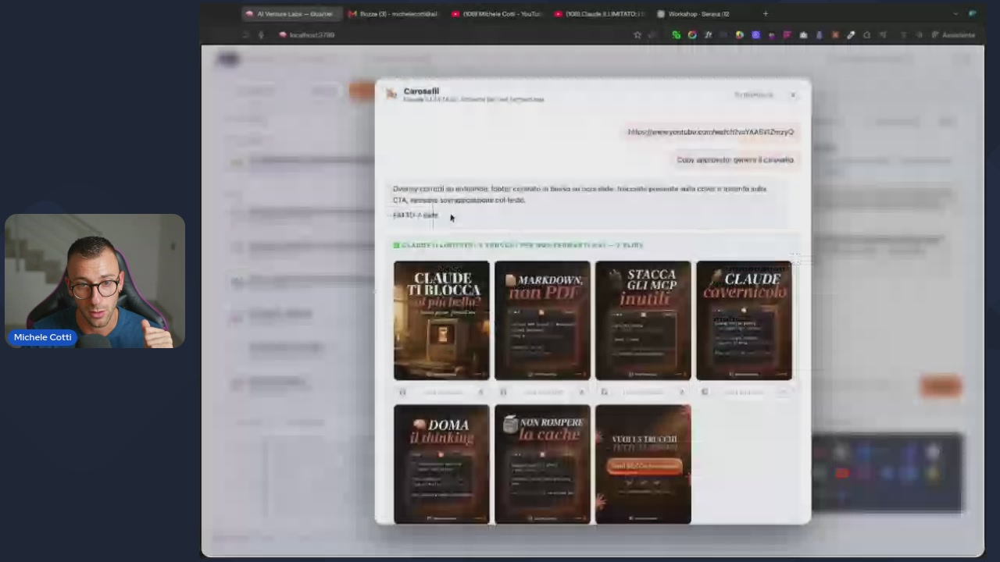

**Testo a schermo (OCR):** & Michele Cotti $ = STACCA CLAUDE Coe. || covernicolo imutili G vox sonore la cache

> blocca sul più bello? Cinque trucchi. Markdown non PDF. Stacca tutti gli NCP inutili. Claude Cavernicolo. Domile Thinking. Non romper la cash? Vuoi tutti i trucchi? Con il mio tag sotto, ok? Con la CTA. Posso scaricarmi il file zip, ok? Posso scaricarmi il file zip e lo si vede. Ho tutti i miei cinque, le mie sei slide. Oppure me lo pubblico direttamente su Instagram con questa caption, ok? Quanto è potente quella roba qua. Questo è un generatore di immagini, ok? E mi ha creato partendo dal video YouTube, ok? Vediamo che ho visto che ha fatto anche la parte delle

## [01:13:34] Schermata 88 _(scene)_

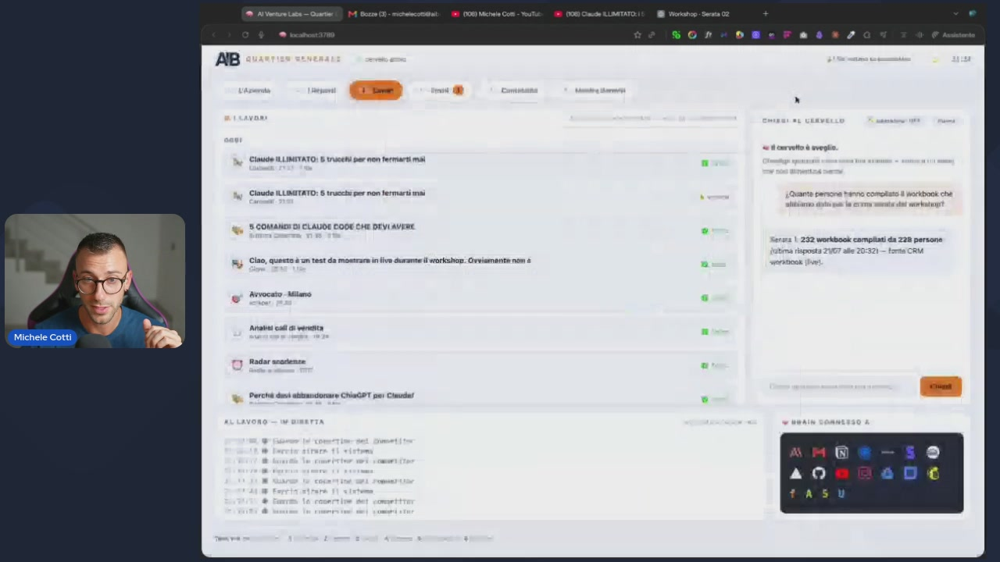

**Testo a schermo (OCR):** Michele Cotti Ciaudo ILLIMITATO: B Visone men Ciau ILLIMITATO: 6 trasc r mom Srmarti mai 5 COMANEE DI CLALOE CODE CHE DEVI AVERE ino, questo è um test da mamrara va ara dl vorkahop. Crviamente nem è da abitano CNICPT pei Cima!

> copertine, se non mi sbaglio. Cinque comandi con Claude che devi avere. Perfetto. Ok, guardiamo un attimo. Sblocca tutto, ok? Copertina generata. Claude, slash commands, clear, rewind. Bellissime. Dovrei pagare un grafico per far sta roba. Claude, cinque comandi. Ok, poi sono quattro. Però qua quante sono belle, ok? Quanto sono belle quella roba qua. Dovresti pagare un grafico, ok? Per farti fare robe di questo tipo. E invece prende, ha delle mie reference foto che passa. Questo è un sistema che ci vuole un attimo costruire, ma dal momento che ce l'hai lo integri. Ed è una figata. Io qua se lo volessi me la scarico, oppure posso fargliela cambiare, me la rigenera e quant'altro. Io le ho già pronte per fare il video da pubblicare sul canale, ok? Veramente secondo me è un qualcosa di incredibile. Adesso torniamo a, spero che questa dimostrazione vi sia piaciuta perché è

## [01:14:25] Schermata 89 _(scene)_

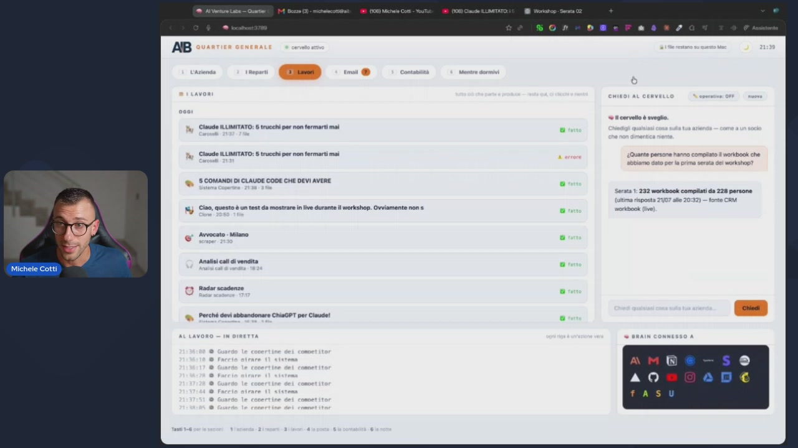

**Testo a schermo (OCR):** Claude ILLIMITATO: 5 trucchi per non fermarti mi A aaa 5 COMANDI DI CLAUDE CODE CHE DEVI AVERE sara 1 232 workibock compilati da 228 persone Ciao, questo è un test da mostrare in live durante il workahop. Ovviamente non = serbo lv Cotti Perché devi abbandonare Ca0PT per Claude!

> veramente qualcosa di molto molto forte dal mio punto di vista. Ora torniamo a quella che è la

## [01:14:34] Schermata 90 _(scene)_

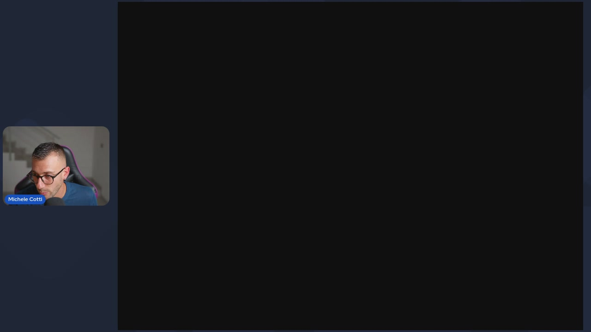

> nostra presentazione, ok? Che ormai stiamo andando verso la fine della serata. Ok, ora fermatevi un attimo a pensare cosa vuol dire tutto questo, ok? Cosa significa per voi tutto questo applicato alla vostra azienda? Immaginatevi aprire il computer ogni Prima di iniziare la mattina e trovare già lì venti contatti nuovi magari con i messaggi pronti come avete visto adesso da me. I contratti fatti, le mail scritte da controllare e basta. Voi dovete solo decidere e premere invio. Come avete visto? Mi ha generato anche la bozza per il lead arricchito preso dal suo sito web. E io devo cliccare invio inviaglie. Ok? Non è fantascienza, non è un sogno che io vi sto vendendo, ok? L'avete appena visto succedere davanti a voi. Mentre parlavamo d'altro. E qui prima di iniziare, vi faccio dire un po' sul valore. Perché è giusto che ve ne rendiate conto fino in

## [01:15:34] Schermata 91 _(periodic)_

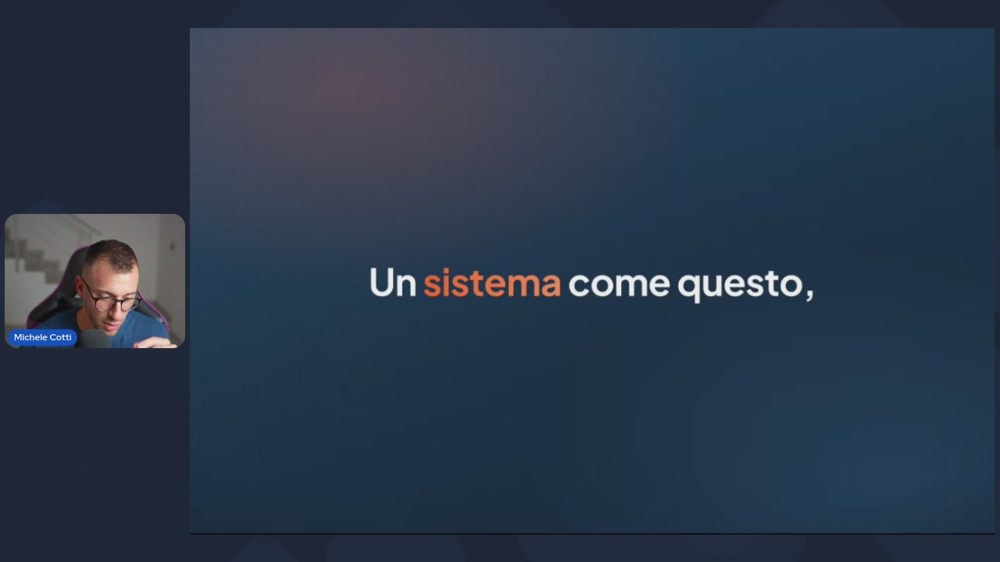

**Testo a schermo (OCR):** Un sistema come questo,

> fondo. Un sistema come quello che vi sto mostrando io adesso. Che vi trova i clienti, che vi scrive le offerte col vostro tono, che vi tiene in ordine tutta l'azienda, che eh vi fa le copertine, che vi fa i caroselli per pubblicare su Instagram. Io l'ho visto vendere con i miei occhi, ci sono agenzie che lo vendono alle aziende e lo fanno pagare decine di migliaia di euro. Un sistema del genere. Fanno pagare decine di migliaia di euro. E se pensate che la roba avete davanti in queste serate, quanto valore ha tutto questo? Il valore che vi sto dando qui dentro gratis in queste tre serate è enorme dal mio punto di vista. È enorme. Perché trovate in giro sistemi di questo tipo. Ok? Sistemi che funzionano davvero, che vanno e siamo solo alla seconda serata. Con questo cervello, come avete visto con i vostri occhi, potete trovarvi i clienti da soli, costruirevi un funnel di marketing tutto intero senza nessuno. Organizzare le mail, i preventivi, i contratti, le presentazioni. Tutta questa presentazione è stata fatta direttamente dal nostro company

## [01:16:34] Schermata 92 _(periodic)_

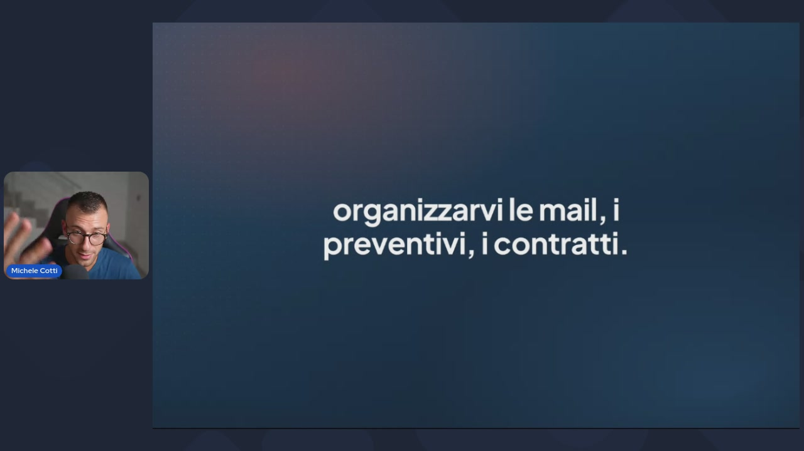

**Testo a schermo (OCR):** Ki organizzarvi le mail, i preventivi, icontratti.

> brain. E c'è ancora dell'altro. Molto altro che, come vi ripeto, vi mostro domani sera. Ma adesso lasciate che vi dico una cosa onesta, guardandovi eh direttamente in faccia. Perché è giusto così. Tutto quello che vi ho fatto vedere stasera in teoria potete farlo da soli. Ok? Ve l'ho spiegato, vi ho detto l'ordine. È vero. E non vi prendo in giro. L'avete visto? Il codice lo scrive l'AI. Non serve essere dei programmatori. E gli strati ve li ho spiegati uno per uno. Quindi perché non vi dico semplicemente bravi, arrangiatevi? Perché so come va a finire. Ok? E lo so non perché sono più furbo di voi, ma perché l'ho vissuto sulla mia pelle. Ve lo ho raccontato io ieri. La maggior parte delle persone, quelle in gamba come voi, ci prova, compra il corso, guarda i video, si si mette lì, prova a costruire, all'inizio magari funziona, ci prende pure gusto, poi arriva il primo intoppo, una cosa che magari non torna, un collegamento che non parte, un pezzo che non si capisce magari al primo colpo, e

## [01:17:34] Schermata 93 _(periodic)_

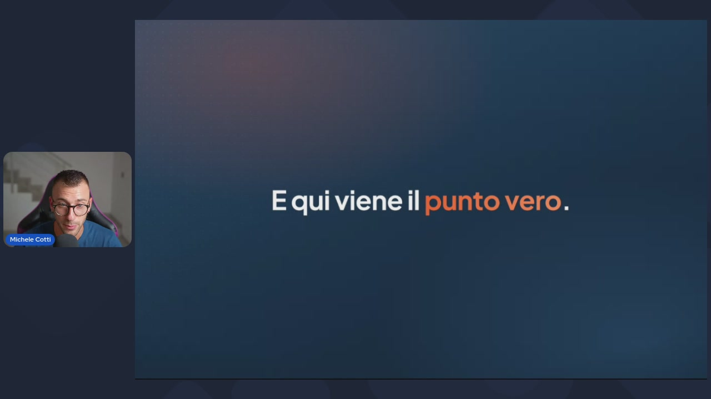

**Testo a schermo (OCR):** E qui viene ilpunto vero.

> qui viene il punto vero. Quando arriva, quell'intoppo, arriva magari alle undici di sera, dopo una giornata di lavoro. Quando siete stanchi morti avete ancora mille pensieri per la testa. E in quel momento lì, davanti al muro, cosa fate? Chiudete il computer. La cosa più semplice. Ok? Vabbè, tanto ci penso domani. E domani c'è un'altra emergenza e quella cosa lì resta lì, a metà. Non finisce mai. E rimane lì per sempre. E l'ho visto succedere a decine di persone davvero molto in gamba. Gente più sveglia di me, che aveva comprato tutto quello che serviva per farcela. Ma si sono fermate lì, al primo intoppo, di sera, da sole. E non perché non erano capaci, ok? Ma perché nessuno in quel momento preciso gli ha detto la cosa giusta al momento giusto. E il giorno dopo la vita se l'è ripresa. Ok? Non è che siete meno svegli degli altri. Bastatevelo dire, non siete meno svegli degli altri. Non è pigrizia, ok? È che siete da soli, nel momento sbagliato. Non è la testa che vi manca e che nell'esatto punto in cui vi bloccate non avete nessuno accanto che vi dica, tranquillo,

## [01:18:34] Schermata 94 _(periodic)_

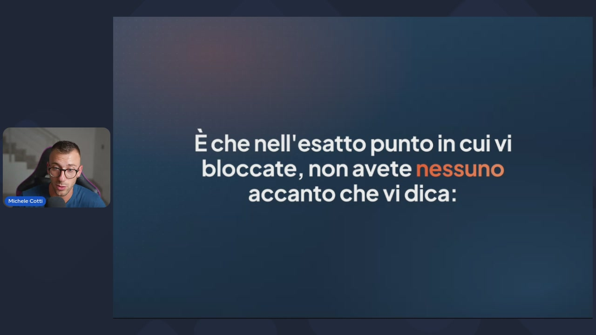

**Testo a schermo (OCR):** i E che nell'esatto punto in cui vi 3 bloccate, non avete nessuno accanto che vi dica:

> è normale, si fa così, vai avanti oppure farlo in quest'altro modo, ok? E quella frase lì, detta al momento giusto da chi c'è già passato, è tutta la differenza tra chi ce la fa e chi tra sei mesi è ancora identico a stasera. Ed è esattamente per questo che domani è la sorata più importante delle tre. Perché stasera vi ho dato il metodo, i strati, il come e una parte. Come vi ho detto, potete già cominciare a metterla in pratica, con quello che vi portate a casa, perché abbiamo dato davvero tanto tanto valore. Ma domani vi faccio vedere l'ultima cosa, quella che chiude il cerchio. Come questo cervello entra davvero nella vostra azienda, sulla vostra attività specifica, senza che dobbiate diventare dei programmatori e senza svatterci la testa da soli per mesi al primo topo. Vi mostro un caso che non avete ne ancora visto, ok? Altre applicazioni veramente molto molto interessanti. Vi faccio conoscere una persona che c'è già passata, come vi ho fatto conoscere anche Christian e Irina stasera. E

## [01:19:34] Schermata 95 _(periodic)_

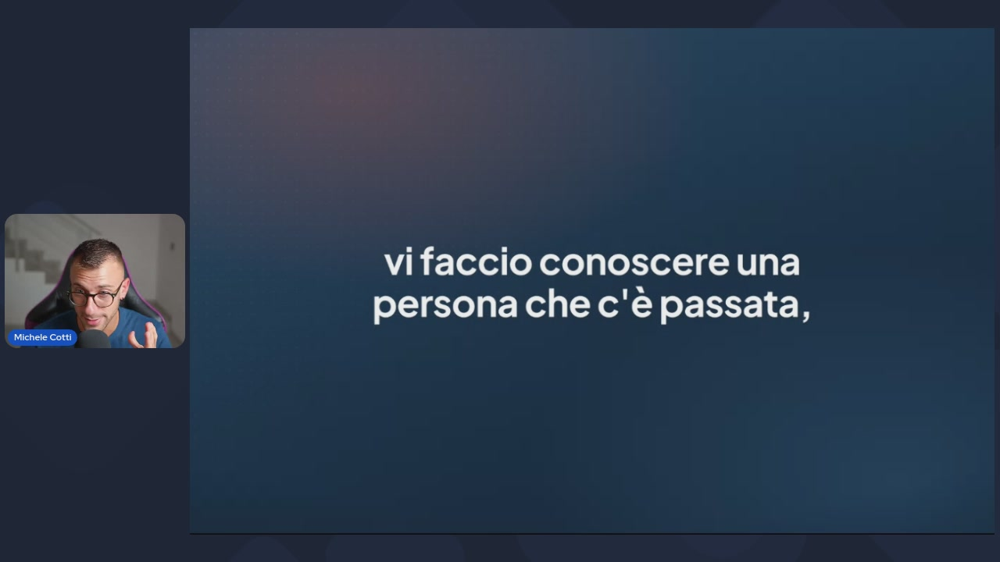

**Testo a schermo (OCR):** vi faccio conoscere una persona che c'è passata,

> mettiamo insieme tutto il piano, dall'inizio alla fine. Quindi domani venite e venite con le domande pronte, perché è la serata giusta per farle. E un' ultimissima cosa, se in azienda le decisioni importanti le prendete in due, con un socio, con vostra moglie, con chi decide con voi, quello che è, domani fatevi trovare in due, ok? Perché è molto importante. Ora siamo alla fine anche di questa serata e anche stasera c'è il vostro regalo. Ovviamente non vi lascio a mani vuote. Ancora più concreto di quello di ieri. Ieri vi ho dato l'impronta, lo strumento che scrive chi siete, il vostro contesto. Stasera vi do quello del passo successivo, ok? Si chiama la mappa del tesoro. E il nome non è messo lì a caso. Perché stasera vi ho fatto vedere i sei strati, il metodo, l'ordine, ma adesso viene la domanda vera, quella pratica, ok? Sì, ok, ma nella mia azienda io, da dov'è che parto con tutta la roba che devo fare? Come faccio lavorare da solo? Come faccio lavorare da solo? Per primo, cos'è che faccio

## [01:20:34] Schermata 96 _(periodic)_

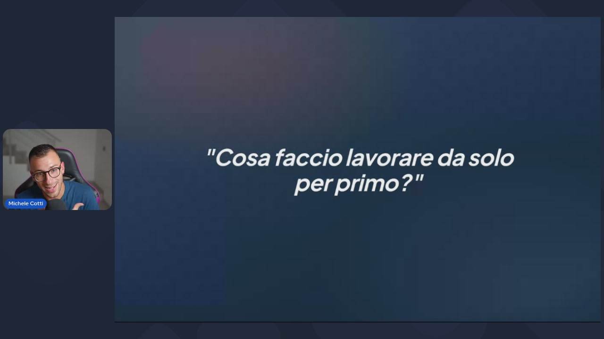

**Testo a schermo (OCR):** è, "Cosa faccio lavorare da solo pi }; perprimo?" GEE ‘n

> lavorare da solo? Ecco, la mappa del tesoro risponde esattamente a questo. La aprite in una chat come l'altra, senza installare niente. Lo fate come prompt, oppure installate la script, la stessa cosa, insomma. E lei si mette a scavare con voi dentro le vostre giornate. Quindi tira fuori tutte le cose ripetitive che fate. Quelle che vi mangiano le ore. Una per una. E poi non si ferma lì. Le prende e le spezza in pezzi più piccoli, ok? Quei micro lavori che il cervello può prendersi in carico da solo. E ve li mette in fila, in ordine, dal primo all'ultimo punto. E alla fine vi ritrovate in mano una cosa che non avete mai avuto. La lista. Nero su bianco di tutto quello che nella vostra azienda può girare senza di voi. E non è un'idea vaga in testa, è una mappa scritta. Con scritto pure da dove conviene iniziare. Ve la manderà il tutor adesso con le istruzioni insieme anche al vostro workbook della serata due, che mi raccomando va compilato, ok? Come ieri ed è solo per chi è arrivato fino in

## [01:21:34] Schermata 97 _(periodic)_

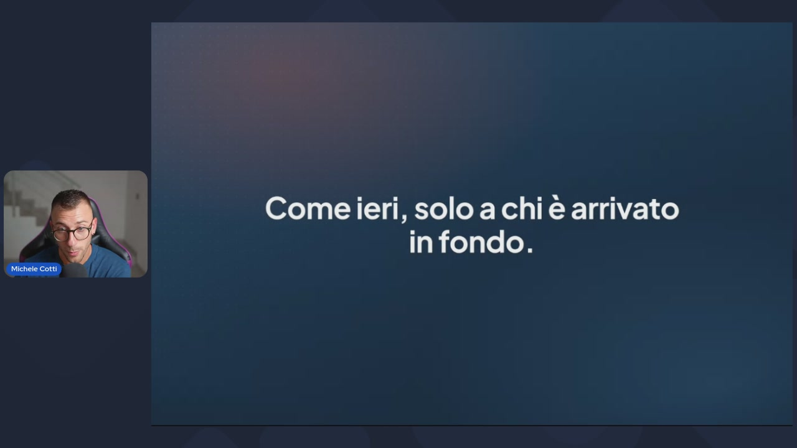

**Testo a schermo (OCR):** | ff Come ieri, solo a chi è arrivato 5 x in fondo.

> fondo, ok? E tenetevela stretta perché domani sera è esattamente quello che ci serve. Domani si passa dal cosa costruire a come lo costruiamo sulla vostra azienda. Davvero. E chi arriva con la sua mappa già pronta? Domani parte chiaramente avvantaggiato. Quindi ci vediamo domani alle ore venti e trenta. Noi vi lasciamo comunque qua, ok? Direttamente qui in nella chat della live il link per scaricare il workbook di stasera, ok? Scaricare il workbook di stasera e anche la skill della mappa del tesoro perché vi va a mappare tutto, ok? Vi va a mappare tutto. Perché? Perché quello che avete visto anche da me prima, quindi sia la ricerca di nuovi clienti che poi si genera la bozza oppure lo sta inviando Gaia, ok? Lo vedete direttamente qui. Adesso da qua non si clicca ma lo vedete direttamente in chat, ok? Perfetto. Perché tutte quelle micro task che lui vi tirerà fuori saranno tutto la composizione di tutte quelle

## [01:22:34] Schermata 98 _(periodic)_

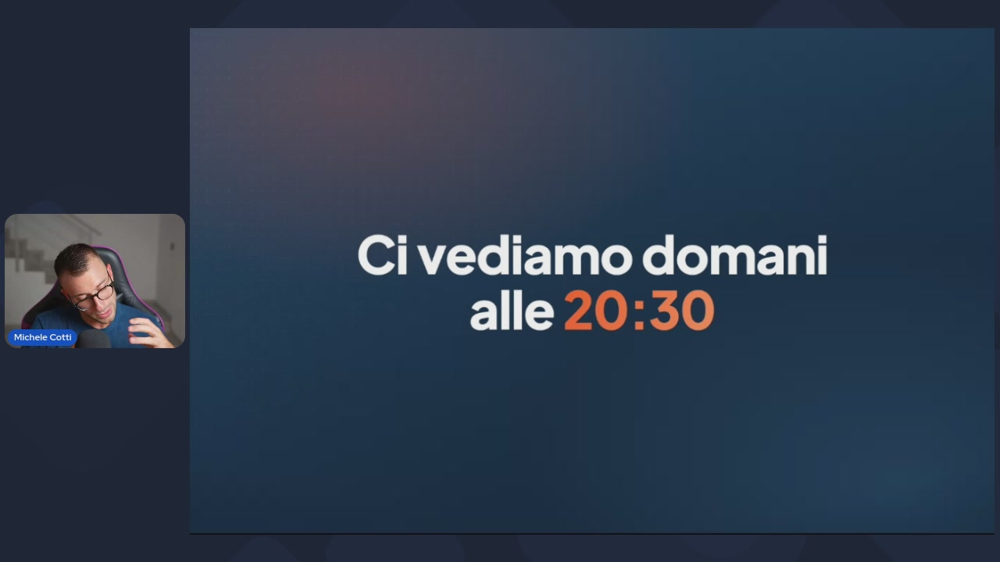

**Testo a schermo (OCR):** pa Ci vediamo domani pal alle 20:30

> robe che avete visto anche da me stasera. Cioè la ricerca di nuovi leader non è trovami il cliente e lui parte e trova il cliente. Non funziona così, ok? Trovami il cliente cos'è? Vai su Google Maps, prendi quelli che ti dico io, poi li prendi, vai sul sito web, li arricchisci prendendo tutto quello che ci serve al sito web, esci e poi li prendi, mi trovi l'email, me li metti in un file Excel, mi dici, me li confronti con il mio cliente tipo, mi dici sei in target o no, a quel punto mi generi la bozza, quindi magari sono sei step, sette step e quella roba lì, ok? Quella roba lì cioè serve farla, ok? Sono quelle micro azioni che compongono l'azione più grande, la procedura, è come dire in azienda voi cos'è che fate? Cioè com'è che producete una determinata, non lo so, un esempio, il commercialista, com'è che fa il contratto? Dite facciamo il contratto dal nulla? No, magari deve prima prendere quello che il cliente ha fatto, poi prendersi la regolina, la

## [01:23:34] Schermata 99 _(periodic)_

**Testo a schermo (OCR):** wr. Ci vediamo domani pai alle 20:30

> procedurina, poi deve prendere la determinata legge, confrontarla su un contratto che magari ha già fatto, tutti i micro step che poi arrivano alla compilazione del contratto, ecco stessa stessa cosa, ok? Quindi ragazzi l'idea è che è stata una bella serata, siamo ormai ad un'ora e mezza, ditemi un po' com'è andata? No, il workbook è diverso, ok? Dato che ho già visto alcune cose, il workbook è diverso, è un altro workbook, un workbook nuovo, io vi consiglio assolutamente di farlo come l'avete fatto ieri sera, perché? Ma iuta, vi rimane a voi, ok? Sì, se fai il contratto di commercialisti, ma sì, è la prima cosa che mi è venuta, ok? Però potete anche dirmi, provate, se mi dite una cosa della vostra azienda, no? Pensate ad una procedura che avete, ok? Poi si può automatizzare, io vi dico, il 90% dei casi sì, ok? Perché? Perché si può fare ormai qualsiasi cosa, cioè mi avete visto fare che si è fatto il mio clone, che va bene, non è perfetto, ok? Non è perfetto,

## [01:24:34] Schermata 100 _(periodic)_

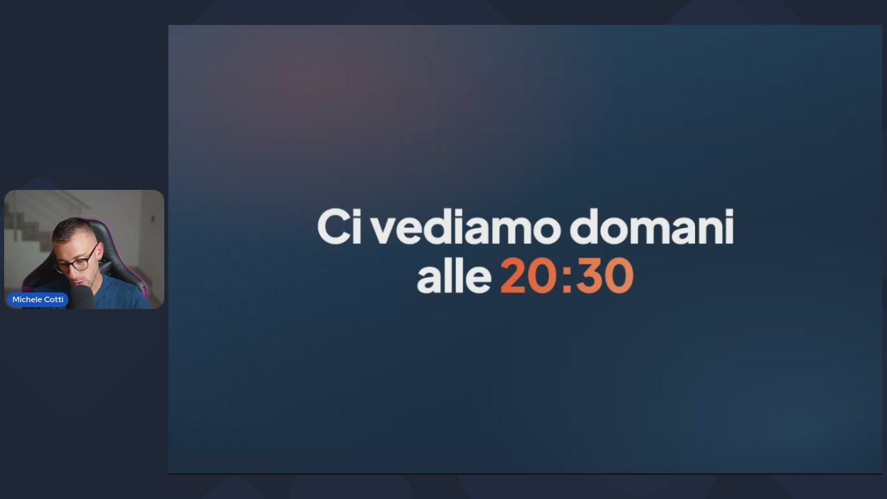

**Testo a schermo (OCR):** av Civediamo domani % N alle 20:30

> però mi ha fatto il clone parlando della mia immagine e la mia voce era veramente molto simile, ragazzi, ok? E non era nella versione nemmeno massima, perché adesso la clonazione della voce non è nella versione migliore del tool che fa le clonazioni, ok? Però davvero tanta tanta roba secondo me, ok? Datemi un feedback, vi è piaciuta la serata di stasera? Tutto che siamo ancora in tanti e siamo rimasti eh ormai cinquecento per tutta la per tutta la serata? Datemi un feedback, com'è com'è andata? Com'è andata? Vi è piaciuta la serata? Da Bresciano mangiamoci il futuro, grande, grande, grande, grande. Ottimo, assolutamente sì, ottimo, ottimo, bella serata, molto interessante, mi fa piacere, grazie, grazie ragazzi, ottimo, ottimo, ottimo, ottimo. Ospitativa alle stelle, benissimo. Beh, già tante robe le abbiamo viste, eh? Ottima serata. Ma domani entriamo nella cosa più importante, ok? Venite che vi faccio vedere anche tutte le parti preventivi, contrattualistica e quant'altro,

## [01:25:34] Schermata 101 _(periodic)_

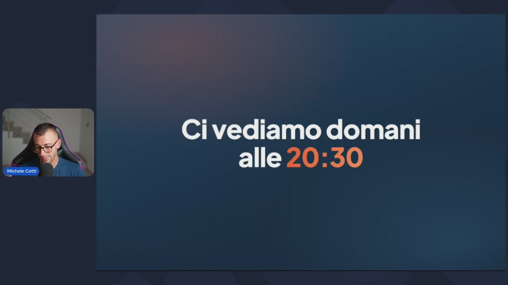

**Testo a schermo (OCR):** SI \ Civediamo domani 4 $ N alle 20:30

> ok? Piacita? Ma non parli di sistema, molto teoria. Serata intensa, interessante, bene, bene, bene, bella davvero, figata, grazie, valida, ottimo, mi fa piacere ragazzi, grazie, grazie, grazie, grazie e grazie a voi per essere rimasti qui fino alle ormai sono le dieci, manca dieci alle dieci eh per tutta questa serata siamo eh ormai ancora quattro e ottanta, ok? Stanno iniziando a lasciare adesso ehm i primi, ok? Tema privacy, cosa intendi con tema privacy? Nel senso eh dipende sempre cosa in quanto si vuole entrare nel dettaglio, comunque live non è una cosa tecnica, ok? Chiaramente dipende perché eh ci sono anche lato privacy cose da eh affrontare, assolutamente, dipende che livello di privacy stai parlando, se tu dici dei tuoi documenti, tutta la roba rimarrà sempre sul tuo computer, ok? Le hai che ci gira dentro, ci sono sistemi chiaramente per eh tutelarsi anche lato privacy sotto quel punto di vista lì, ok? Quindi eh sì, assolutamente. Grazie, grazie, bene, bene, bene, bene. Ottimo,

## [01:26:34] Schermata 102 _(periodic)_

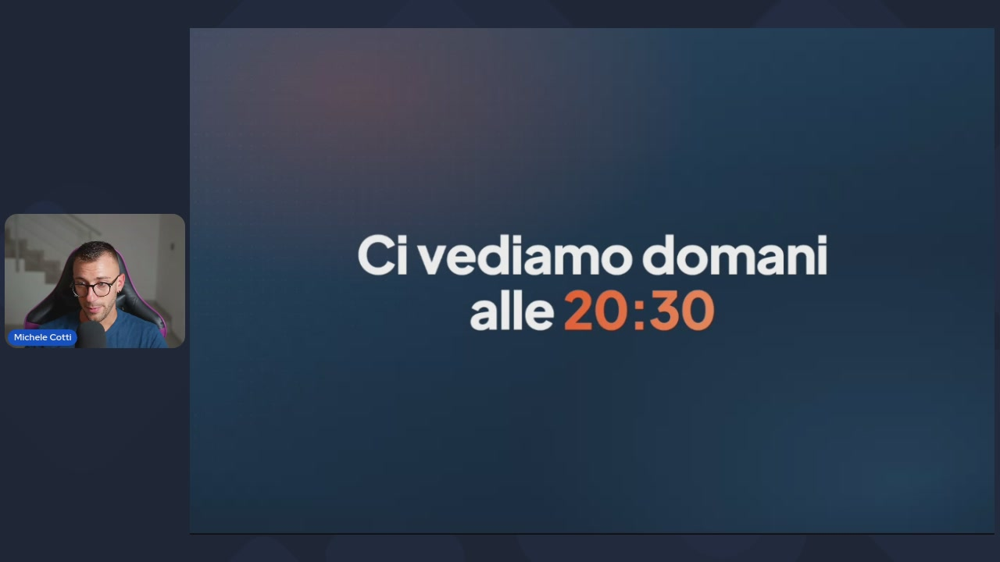

**Testo a schermo (OCR):** | Ci vediamo domani Z È; alle 20:30

> ottimo, ottimo, ottimo. Bene. Ragazzi io direi che ci siamo, sono anch'io bello stanco ormai sono un'ora e mezza di live. Grazie ancora a tutti per aver partecipato, mi raccomando compilate il workbook, prendete velo direttamente da qua la chat, lo sta ehm lo sta inviando Gaia, ok? Quindi ricordatevi di salvarvi. Guardate che c'è qua il la parte di Gaia, ok? Fissa adesso ve lo ve lo fisso qua in alto, ok? Ve lo fisso qua in alto. Ok. Avete la parte del workbook, ok? Se cliccate vi apre il vostro workbook. E poi avete il link per scrivere al tutor se ancora non ve l'avete. Comunque il workbook ve lo invierà comunque anche il vostro tutor, ma se riuscite già prendetelo, ok? Prendetelo qua e compilatelo ragazzi perché bravi che ieri l'avete fatto in duecento e qualcosa erano, ok? Duecentotrenta mi pare, adesso non mi ricordo il numero esatto, su cinquecento

## [01:27:34] Schermata 103 _(periodic)_

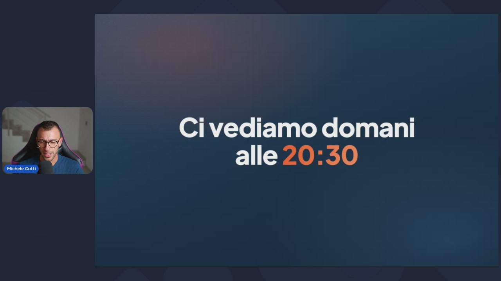

**Testo a schermo (OCR):** A\ Civediamo domani d 3 S alle 20:30

> circa la metà. Vediamo di farlo in di più, ok? Perché è molto molto importante. Più fate il workbook, più poi utilizzate la mappa del tesoro, chiaramente meglio è per voi, ok? Io direi che eh direi che ci siamo, ok? Io vi mando un grande abbraccio e ci sentiamo domani, ok? Ci sentiamo domani, belli carichi, mi raccomando, partecipare, ci siete stati la prima serata, ci siete stati la seconda, venite alla terza, belli carichi, ok? Che è la serata più importante. Ci vediamo domani sera ragazzi, un abbraccio, a domani, ciao ciao.
