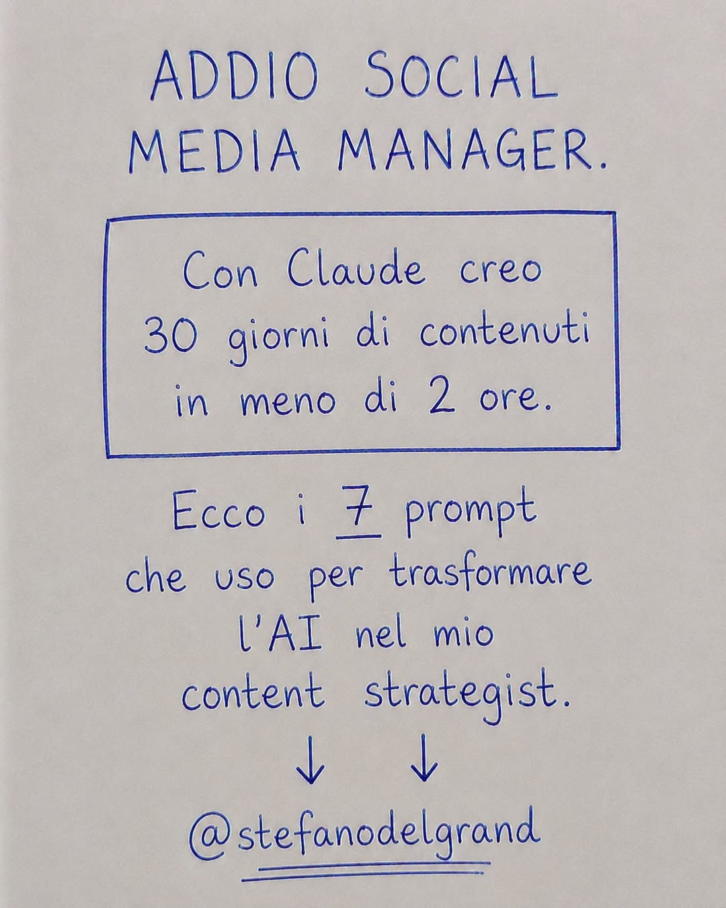

# Addio Social Media Manager — 7 prompt per trasformare Claude nel tuo content strategist

> Post Facebook di **Stefano Del Grande** (9 luglio 2026). Il post promette: "Con Claude creo 30 giorni di contenuti in meno di 2 ore". I 7 prompt sono stati pubblicati dall'autore nei commenti del post.

## I 7 prompt

### 1. Assegna un ruolo al tuo content strategist
> "Ora sei il mio content strategist personale per Facebook. Mi chiamo [nome]. Il mio settore è [settore]. Il mio pubblico è [pubblico]. La mia offerta è [offerta]. Il mio stile di comunicazione è questo: [incolla 3 esempi]. Ogni contenuto che crei deve rispecchiare il mio stile, portare a una vendita e dare l'impressione di una conversazione tra amici. Non devi mai avere un tono aziendale. Non devi mai sembrare un'intelligenza artificiale."

### 2. Pianifica il tuo mese
> "Dammi un calendario editoriale di Facebook di 30 giorni. Pubblico [X] volte al giorno. Ogni settimana, varia i seguenti tipi di contenuto: 1 post autorevole, 1 storia personale, 1 post educativo, 1 post di vendita e 1 domanda di interazione. Indicami l'idea di base e il tipo di post per ogni singolo giorno. Assicurati che ogni idea sia ben visibile e impossibile da ignorare."

### 3. Scrivi i tuoi migliori agganci
> "Datemi 30 agganci per Facebook che catturino l'attenzione per questo mese. Mescolate questi stili: affermazioni audaci, introduzioni con storie personali, numeri scioccanti, opinioni controverse e lacune che suscitino curiosità. Ogni aggancio deve essere al di sotto delle 15 parole. Deve far fermare chi lo legge e pensare: 'Aspetta... COSA?'."

### 4. Scrivi i tuoi post di vendita
> "Scrivimi 5 post su Facebook che promuovano la mia [offerta] senza sembrare invadente. Inizia ognuno con un problema comune che il mio pubblico affronta quotidianamente. Crea un legame emotivo nella parte centrale. Concludi con un'offerta che sembri ovvia. Usa il mio stile. Mantieni un tono semplice e cordiale."

### 5. Scrivi i tuoi post di storie
> "Scrivimi 4 post di storie personali per questo mese. Usa questi spunti: la mia storia, un momento in cui stavo per mollare, un successo di uno studente e un momento di fede. Ognuno dovrebbe suscitare un'emozione e concludersi con una lezione che si possa applicare alla propria vita. Non è necessaria alcuna call to action. Lascia che sia la storia a parlare."

### 6. Scrivi i tuoi post per coinvolgere il pubblico
> "Datemi 10 domande per coinvolgere il pubblico su Facebook questo mese. Devono essere facili da rispondere, coinvolgenti e invogliare le persone a commentare immediatamente. Mescolate domande sulla mentalità finanziaria, ipotesi divertenti, riflessioni personali e scenari in cui il pubblico possa immedesimarsi. Ogni domanda non deve superare le 30 parole."

### 7. Riadatta i tuoi contenuti di successo
> "Ecco i miei 5 post con le migliori prestazioni di questo mese: [incollali]. Analizza perché ognuno ha funzionato. Poi proponimi 3 nuove varianti per ognuno, con spunti e angolazioni diverse. Voglio sfruttare al massimo la portata di ciò che ha già dimostrato di essere efficace. Stesso messaggio, confezione nuova."

---

**Fonte:** [post originale](https://www.facebook.com/share/p/1GeDhyRF23/) · Estratto automaticamente il 14 luglio 2026. Il testo grezzo completo (con i commenti) è in `post_raw.txt`.
