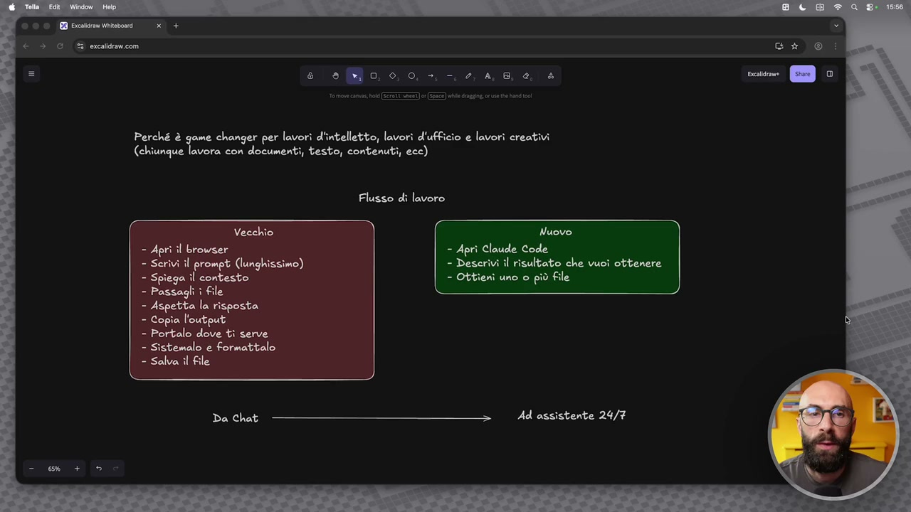
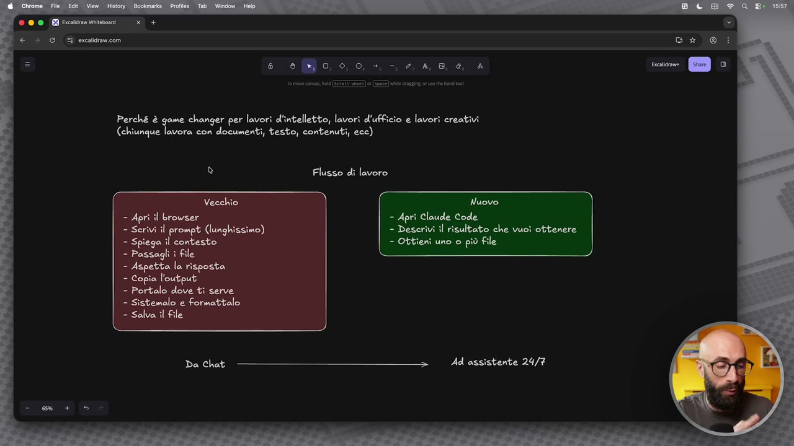
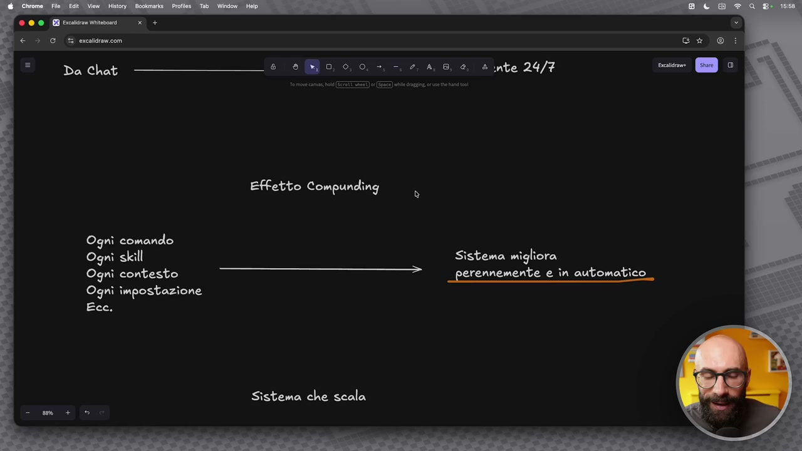
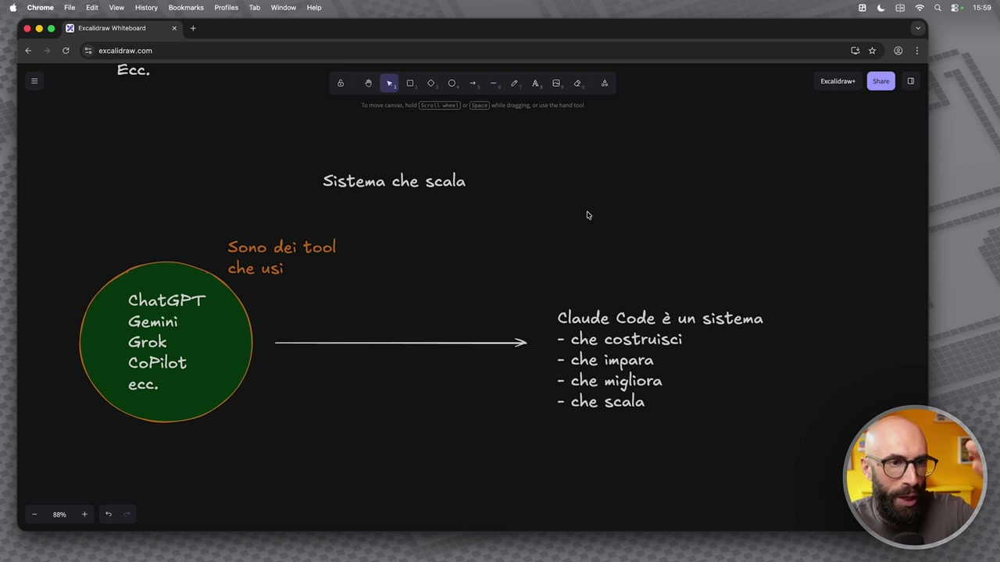

# Perché è incredibile per chi fa lavori d'intelletto, creativi e d'ufficio

> Documento generato automaticamente: trascrizione e screenshot sincronizzati del video-corso.

## [00:00:00] Schermata 0 _(start)_

**Testo a schermo (OCR):** Perché è game changer per lavori d'intelletto, lavori d'ufficio e lavori creativi (chiunque lavora con documenti, testo, contenuti, ecc) Flusso di lavoro Vecchio Nuovo. = Aprì il browser = Aprì Claude Code - Serivi il prompt (lunghissimo) - Deserivi il risultato che vuoi ottenere - Spiega îl contesto - Ottieni uno o più file - Passagli ì file - Aspetta la risposta - Copia l'output - Portalo dove ti serve - Sistemalo e formattalo = Salva il file Ad assistente 24/7

> C'è un'altra cosa importante su questo che voglio aggiungere e che voglio far capire perché questo è uno strumento, strumento è la parola giusta, è un sistema, è un ambiente che è game changer per chi fa lavori di intelletto, per chi fa lavori d'ufficio, per chi fa lavori creativi. Nasce come qualcosa pensato per i programmatori ma oggi è utilizzabile anche da noi e porta un grande valore anche a noi. Qua ho detto in generale chiunque lavora con documenti, con testo, con contenuti, perché magari dire lavori di intelletto sembra riduttivo, no? Invece è veramente molto molto utile se voi lavorate con tanti documenti, con tanto output, con tanti artefatti. Perché? Qua ho segnato tre cose. Innanzitutto cambia il flusso di lavoro. Il vecchio flusso di lavoro è quando andavamo dentro una chat, apre il browser, scrive il prompt e come abbiamo visto prima il prompt era lunghissimo, dettagliato, dovevamo aggiungere informazioni tutte le volte, dobbiamo spiegargli il contesto, dobbiamo

## [00:01:00] Schermata 1 _(periodic)_

**Testo a schermo (OCR):** Perché è game changer per lavori d'intelletto, lavori d'ufficio e lavori creativi (chiunque lavora con documenti, testo, contenuti, ecc) Flusso di lavoro Vecchio Nuovo = Aprì il browser = Aprì Claude Code - Scrivi il prompt (lunghissimo) -D risultato che vuoì ottenere - Spiega il contesto - Otitieni uno o più file = Passagli i file - Aspetta la risposta - Copia l'output - Portalo dove ti serve - Sistemalo e formattalo = Salva il file Ad assistente 24/7

> caricargli tutti i file perché magari vogliamo dirgli, no? Di fare delle cose su quei file, prendere delle informazioni da quei file e tra l'altro a volte su quei file c'era anche proprio una limitazione, il numero di file, la grandezza di quei file e così via. Diamo il nostro prompt, andiamo in via, aspettiamo la risposta, copiamo quell'output e ce lo portiamo fuori dentro Word, PowerPoint e così via. Ce lo sistemiamo, ce lo formattiamo, ci salviamo il file, otteniamo il risultato finale. Quando siamo dentro Cloud Code, apriamo Cloud Code, descriviamo il risultato, non è manco più nell'ottica di scrivere il prompt, ma descrivo quello che voglio ottenere, vi faccio vedere anche poi una tecnica particolare che uso io e otteniamo il risultato finale, il file oppure più dei file che vogliamo. Il passaggio mentale che dobbiamo fare è che passiamo da quello che prima era una chat a quello che invece adesso è una sorta di assistente 24 ore su 24, 7 giorni su 7. Seconda cosa importante è un po' questo effetto compounding, come esiste in finanza, in

## [00:02:00] Schermata 2 _(periodic)_

**Testo a schermo (OCR):** © © © EB Prcaicram Witabonrd x + ic > GU erceldramcom Da chit ————@î 9Mo 00-48 4 ante 24/7 Effetto Compunding Ogni comando Ogni skill Sistema migliora Ogni contesto —-—wé.ei: perennemente e în automatico Ogni impostazione Ecc. Sistema che scala

> economia, in altri contesti. Quando utilizziamo Cloud Code tutto quello che facciamo è un investimento che si accumula e che ci consente di avere un sistema che migliora e funziona sempre meglio. Quindi ogni comando che stiamo dando, ogni skill che stiamo creando, ogni file di contesto che andiamo a realizzare, ogni impostazione che settiamo, perché vedremo anche come si possono mettere delle preferenze e così via, tutto quello che facciamo dentro Cloud Code, Cloud Code lo utilizza per lavorare meglio, quindi il decimo giorno funzionerà meglio del primo, il centesimo giorno funzionerà meglio del decimo e qua ho detto è una sorta di sistema che migliora perennemente in automatico. Ma soprattutto la cosa che voglio farvi capire è che mentre in passato quelle che utilizzavamo erano dei tool e quindi anche dei tool molto potenti, alcuni di questi io continuo a utilizzarli per dei casi molto specifici, quindi Gemini, Grok, Copilot, CGPT e così via, era un'app uguale a tante altre app che possiamo utilizzare. Facciamo un'attività e finisce su

## [00:03:00] Schermata 3 _(periodic)_

**Testo a schermo (OCR):** e so 0,0, - 4,8, 4, è Sistema che scala Sono deì tool che usì © ChatGPT o Claude Code è un sistema - che costruisci - che impara - che migliora - che scala

> quell'attività. Quello che facciamo con Cloud invece andiamo a costruirci un vero e proprio sistema. Qua la parolina chiave è sistema. Questa è la cosa che secondo me dobbiamo capire. Aspettate che questo lo voglio sottolineare. Proprio sistema è la parola fondamentale. Vi state costruendo un sistema. Ve lo costruite voi un blocchettino per volta e ve lo potete modificare nel tempo in base a quanto diventate più confidenti con Cloud Code, nuove funzionalità che vengono aggiunte e così via. Impara in base alle cose che gli dite voi. Migliora perché vi date gli output sempre meglio, proprio perché impara. E soprattutto scala. E questo è fondamentale. Dentro le chat dopo un po' c'hai i limiti di quanta roba posso mettere in memoria, quanto file posso caricare, quante possono essere grosse questi file e così via. Cloud lavorando in locale sul vostro computer. Se voi avete una cartella con dentro 100 file, lavorate su 100 file. Se ce l'avete da 20 file, lavorate su 20 file e così via. Queste cose sono fondamentali secondo me.
