# Orientarsi in Claude Code e creazione primo file

> Documento generato automaticamente: trascrizione e screenshot sincronizzati del video-corso.

## [00:00:00] Schermata 0 _(start)_

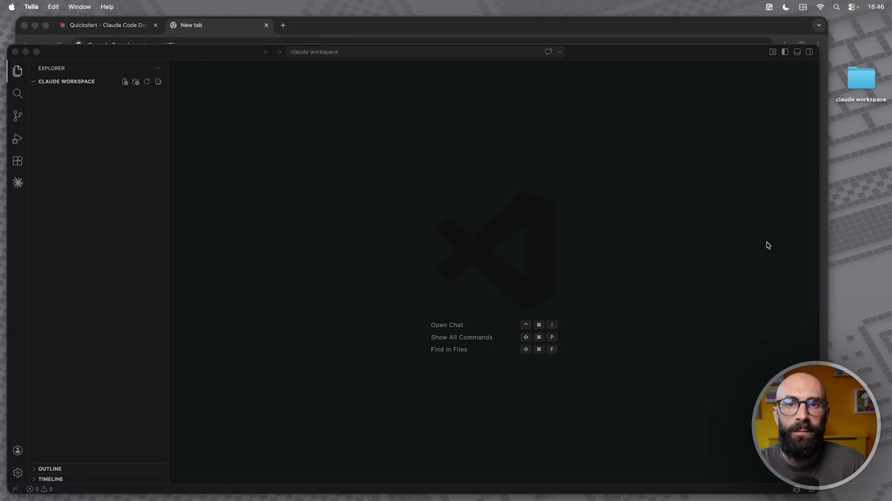

**Testo a schermo (OCR):** Show Al Command

> Bene, l'installazione è finita. Non dobbiamo installare nient'altro. Da questo momento in poi si inizia a lavorare. Abbiamo installato due cose fondamentalmente. Cloud Code, che è lo strumento base di questo corso sul quale faremo tutto. Anzi, chiamarlo strumento abbiamo visto è riduttivo, no? Perché diciamo è questo sistema avanzato che dentro ha vari strumenti. E normalmente si usa dal terminale. Abbiamo visto che però il terminale è un po' ostico da utilizzare, soprattutto perché noi non siamo programmatori e non vogliamo scriverci codici. Allora abbiamo installato un ambiente all'interno del quale lo utilizzeremo. E questo ambiente si chiama VS Code. Avendolo installato, qua abbiamo questa iconcina che ci apre Cloud Code direttamente qua dentro. Che succede quando la clicchiamo? Quindi adesso diciamo in questa lezione prendiamo un attimo confidenza con l'ambiente che andremo ad utilizzare. Ci dice questa è Cloud Code e quello che puoi fare puoi avviare una nuova sessione. Guardate qua nella sinistra cosa c'è come sessione. Mi dice guarda che tu hai già una sessione vecchia che si chiama Cosa puoi fare per me? Vi ricordate questo cos'è? È quello che abbiamo fatto in precedenza dal terminale. Adesso l'ho chiuso quindi non è più nel terminale qua dentro a schermo.

## [00:01:00] Schermata 1 _(periodic)_

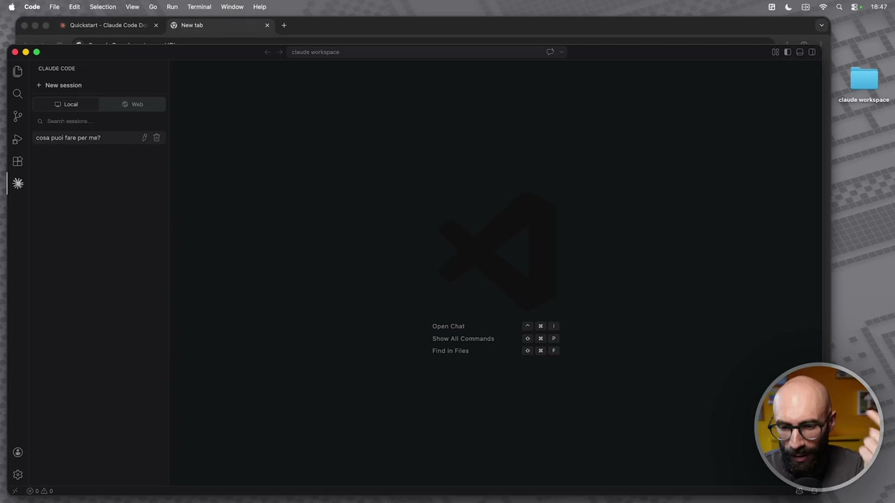

**Testo a schermo (OCR):** O ties cosa puoi faro per me? Show All Command Find n Fils

> Però vi ricordate l'abbiamo fatto in precedenza nel terminale. Quindi qua abbiamo anche le sessioni precedenti di Cloud Code che abbiamo iniziato. Se vogliamo aprire una nuova sessione, ora non passeremo più dal terminale. Clicchiamo semplicemente new session e si apre questa bellissima schermata che già ci fa meno paura del terminale. In realtà questa se la vedete adesso è come una chat. Questa è come una chat. Questa è come un po' quando andiamo su, che ne so, apriamo Cloud dal sito web per far vedere Cloud ma anche c'è GPT e così via. Ecco qua questa è la schermata di Cloud quando andiamo dal sito e adesso invece dentro il nostro VS Code abbiamo questa qua molto simile. Qua in basso ci dice, ok, dici a Cloud cosa vuoi fare. La cosa bella però qual è? Che noi qua dentro in realtà volendo possiamo utilizzare anche il terminale ma lo faremmo se, diciamo, nel caso in cui qualcuno lo volesse utilizzare e in alcuni casi ci potrebbe servire,

## [00:02:00] Schermata 2 _(periodic)_

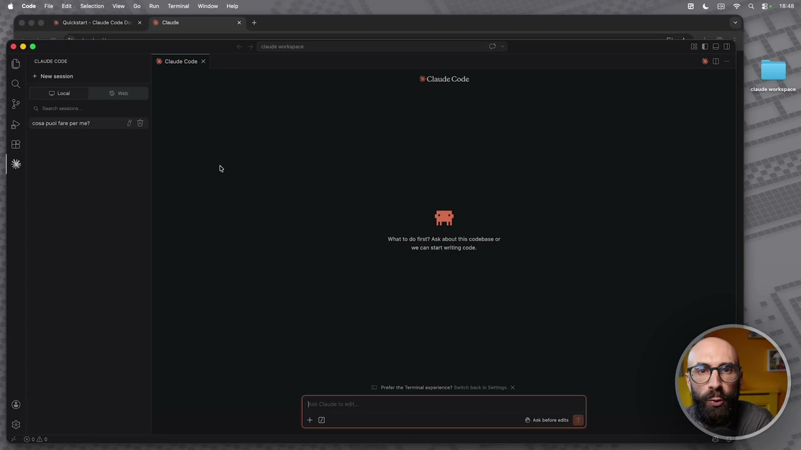

**Testo a schermo (OCR):** D tons cosa puol faro per me? E Ciad Code x 44 Claude Code What to do fit? Ask about the codebasa or e can star ting code.

> ci basta andare sul terminale e fare new terminal e qua dentro possiamo anche aprirci il terminale. Ok? Questa è la stessa cosa che aprire, diciamo, questo terminale qua di Mac. Perché ho detto in alcuni casi potrebbe potrebbe servire. Adesso qua lo chiudo così nessuno si spaventa. Noi la maggior parte delle cose le faremo da qui, quindi dalla chat di Cloud Code, da questa interfaccia che hanno creato per VS Code molto semplice e molto potente. Però alcune cosine sono un pochino più avanzate e non ci sono le impostazioni qua dentro e quindi in alcuni casi si dovrà passare al terminale. Adesso qua noi stiamo lavorando dentro il nostro Cloud Code, rimettiamo, diciamo, la cartella così vi faccio vedere pure dove siamo. Da qua passate, qua vedete la cartella, queste le vedremo dopo perché non ci servono in questo momento, qua passiamo nelle sessioni di Cloud Code, ok? Non vi spaventate, è molto simile ai pulsanti che tenete qua normalmente quando siete qua dentro oppure quando siete su chat GPT, su Gemini e così via.

## [00:03:00] Schermata 3 _(periodic)_

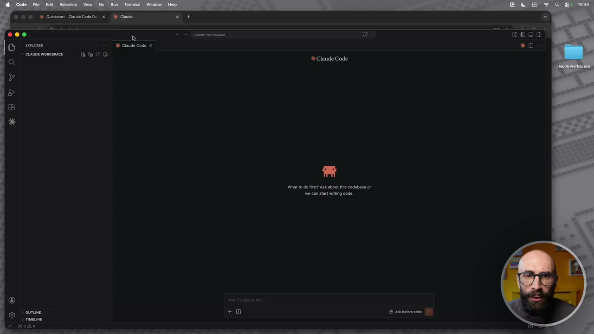

**Testo a schermo (OCR):** € Claude Code ihr to o ft? Ask about this codbase or a can tatti code.

> Ah, tra l'altro Cloud Code, vi faccio vedere, lo potete utilizzare adesso da vari luoghi perché ce l'avete qua dentro, quindi dentro VS Code, ce l'avete qua perché cliccando su Cloud Code si apre la versione web di Cloud Code. E uno potrebbe dirmi Raph, scusami, allora perché non ci hai fatto vedere come usare la versione web? Perché ci sono una serie di limitazioni, ok? Non può lavorare sul vostro computer, tutto quello che abbiamo detto prima che invece a noi ci serve perché è molto potente. E poi possiamo utilizzarlo dal terminale, quindi possiamo usare il comando Cloud qua dentro e vi dirò di più, si può utilizzare anche dal cellulare, da mobile. Più avanti, quando andremo nei moduli un pochino più avanzati, vi faccio vedere anche come utilizzare Cloud Code dal vostro cellulare. Quindi adesso io qua gli posso fare ragazzi una domanda, non diciamo di nuovo cosa vuoi fare per me, altrimenti ci confondiamo con la sessione precedente.

## [00:04:00] Schermata 4 _(periodic)_

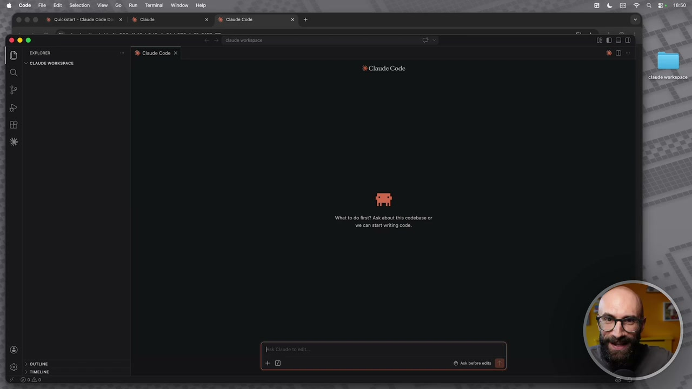

**Testo a schermo (OCR):** ®© ©» Qucisie-Cude Code De x | Clause E Clause code x € Claude Code Wihat to do fit? Ask about ts codebasa or a can start ting code.

> Diciamogli un attimo cosa c'è nella mia cartella di lavoro. Questa è la cartella Workspace, la apro qua per farvela vedere, ok? Questa è una cartella completamente vuota in questo momento, ok? Quindi la chiudiamo, mi dice la tua cartella di lavoro Cloud Workspace è vuota, non contiene alcun file, vuoi creare qualcosa e iniziare un nuovo progetto? Vi faccio vedere, creiamo un file, vi faccio un esempio proprio, creiamo un file. Creami un file md, sono dei file di testo, tra un attimo vedremo cosa sono questi file md. Creami un file md dove mi fai un elenco delle cose che puoi fare per me. Considera che non sono un programmatore e non userò Cloud Work per programmare, ma più per attività d'ufficio, creative e d'intelletto.

## [00:05:00] Schermata 5 _(periodic)_

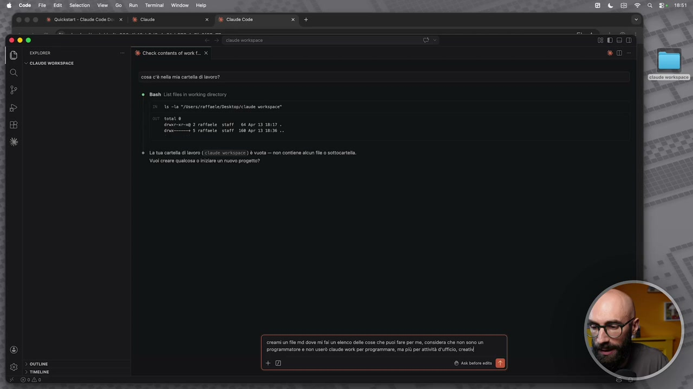

**Testo a schermo (OCR):** © © ©» Qucist- Claude Code Do x | 4 Cinto x Claude Code cine onpace 36 Check content of work. x cosa cè na mia cartello di lavoro? Ban List les in vrking director Mi A ia "qusra/rattaete/Desktop/elne verace’ vee rota 2 raftoe. stoffe Ape 10 1127 rm" 5 raffaele staff 100 Apr 19 1816 £, ® ta tua cartella di lavoro (Ela Ver shica) è vuota — on contiene alcun le o sottcatalia. Vuoi creare qualcosa 0 iniziare un nuovo progetto? creami un fl md dove mi fl un aenco dell cose che puoi fare per me, considera che non sono un programmatore e non userò claude work per programmare, ma più pe attività d'ufici,crath +0 © Arto et a

> Vedete la differenza diciamo rispetto a quello che facciamo normalmente? Qua si lavora sempre subito con i file, dopo vedremo anche delle lezioni specifiche proprio sui prompt, perché qua diciamo il concetto di prompt a cui siamo abituati con Gemini, con ggpt e così via, va quasi a scomparire, ok? Perché qua ragioniamo molto più sull'output che vogliamo ottenere, quindi voglio questa cosa, fammi un file con questa cosa. E qua per farvi vedere che lui adesso lavora sui file, gli ho detto subito di fare un file. Allora, la prima cosa che succede, vedete che non abbiamo il terminale, abbiamo questa bella interfaccia grafica, possiamo usare pure il mouse per cliccare sulle cose, siamo tutti felici. Poi ovviamente se vi date confidenza col terminale, queste cose fatele dal terminale, l'avete capito che sto scherzando su questa cosa. Mi dice, vuoi che io scriva un file? Questa è una cosa importante, Cloud c'ha varie modalità di utilizzo. Possiamo dirgli che ci deve chiedere il permesso tutte le volte, possiamo dirgli che non deve chiederci mai il permesso, oppure possiamo dirgli che gli diamo il permesso per questa sessione, ok?

## [00:06:00] Schermata 6 _(periodic)_

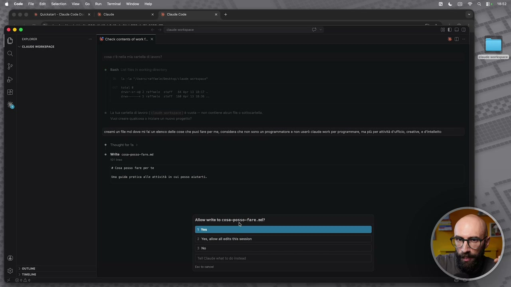

**Testo a schermo (OCR):** AF Check contents of work. creami un fl md dove mi fun aenco dell cose che puoi fara per me, considera che non sono un programmatore non userò ciau work pe programmare, ma più prati uffici, creative, 'inetetto ® Write cosa-posso-fare.mi 0 cosa posso fare per te Una guida pratica alle attivit in cut posso atutti. Allow write to cosa-posso-fare. nd? 2 Yes, low all eis the session ao

> Quindi vedete qua mi dice sì, ti autorizzo, no non ti autorizzo, oppure dammi un comando diverso, quindi qua potete scrivere quello che volete voi nella quarta voce, oppure gli dice sì, ti autorizzo per questa sessione. Questa cosa qua è un'altra cosa che spaventa parecchio le persone, perché ovviamente uno dice ma come scrive nel mio computer, quindi può fare dei danni, mi può cancellare dei file, mi può sovrascrivere dei file e così via. Quindi io vi consiglio questa cosa. All'inizio dategli volta per volta il consiglio singolo, scusatemi, l'autorizzazione singola, quindi sì, ti autorizzo, fai questa cosa, sì, ti autorizzo, fai quest'altra cosa. Dopo un po' vedrete che è molto lento se gli dovete dare sì tutte le volte, quindi potete passare a sì, ti autorizzo per questa sessione e poi proprio se diventate gli utilizzatori avanzati potete non far chiedere più l'autorizzazione, ma questo non ve lo faccio vedere adesso, ve lo faccio vedere più avanti nel corso perché altrimenti rischiate di fare qualche guaio.

## [00:07:00] Schermata 7 _(periodic)_

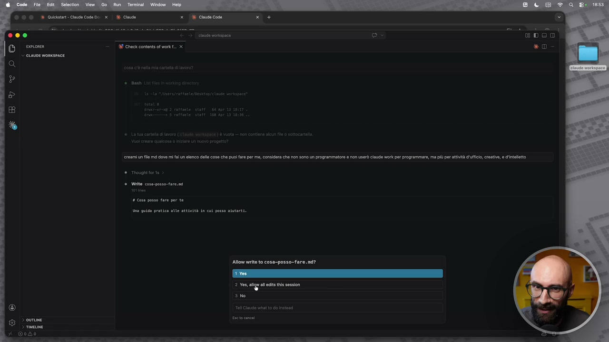

**Testo a schermo (OCR):** AE Check contents of work. creami un fl md dove mi fun aenco dell cose che puoi fare per me, considera che non sono n programmatore e non userò ciau work pe programmare, ma più per atrità d'ufficio, creativo, d'inteltto ® Write coss-posso-ta 0 cosa posso fare per te (na gui pratica ale attività in cut posso atutti. Allow write to cosa-posso-fare. nd? 2 Yen agli eta ia session ao

> Quindi io qua adesso darò una volta l'autorizzazione, dirò sì, ti autorizzo a scrivere questo file. E lui si mette a lavorare su questo file. Cosa vediamo qua? Cosa è successo nella cartellina? C'è un file. Cosa posso fare? Punto MD. Cioè se io adesso mi apro questa roba qua, vedete? Qua dentro adesso io c'ho dentro questa cartella, c'ho il file. C'ho il file. Cosa posso fare? MD. E questo è un file di testo, i file MD sono dei file markdown, diciamo sono dei file di testo, ok? Quindi vedete, fisicamente creado un file sul nostro computer. Abbiamo creato il primo file di questo corso. L'abbiamo fatto in maniera molto semplice ovviamente, quindi diciamo vedremo dopo che si possono fare cose molto più avanzate, però in pochi secondi già abbiamo creato il nostro primo file. Se in questo file io lo clicco, la cosa bella diciamo di stare dentro VS Code è che possiamo aprire pure i file. Vi ricordate questa cosa? Torniamo un attimo qua che questa cosa ve l'avevo mostrata.

## [00:08:00] Schermata 8 _(periodic)_

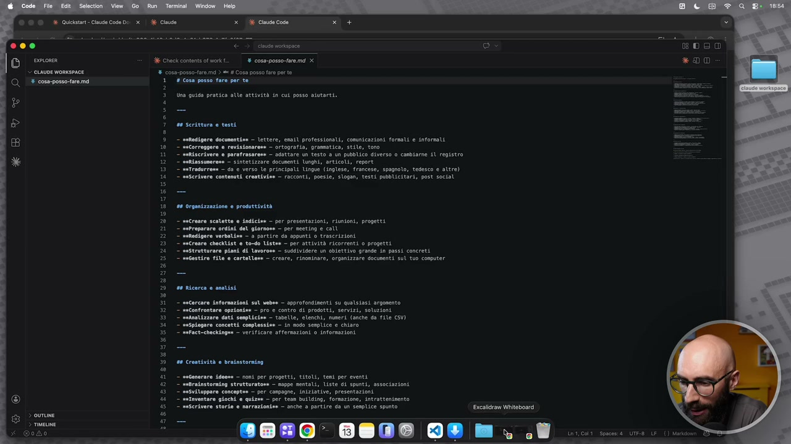

**Testo a schermo (OCR):** A Ciau cade 36 Chick contente of work coss-posso-fre ma X coss-posso-re md > = # Cosa posso fare perte # Cosa posso fare per te Una guida pratica alle attività in cut posso aiutarti. n0 scrittura e testi - etedigare docmentisa — lettere, esatl professionali, comunicazioni formali e informali — iacorreggere e revisionarese — ortografia, gramotico, stile, toro — segiscrivere @ perafrasarese — adattare un testo a un pubblico diverso 0 cambiarne SU registro — sefiastumereve — sintetizzare documenti lunghi, articoli, report — setradurrens — da e verso le principali Lingue (inglese, francese, spagnolo, tedesco e altre) — Scrivere contenuti. creativise — racconti, poesie, slogan, testi pubblicitari, post social 28 Organizzazione @ proguttività — ancroaro scalette e indicisa - per presentazioni, riunioni, progetti - sefrparare ordini del giornose — per neeting e call — vefudipere verbaliee — a partire da appunti © trascrizioni — saCronre checklist @ to-do Ustus — per attività ricorrenti o progetti sestruttorare piani di Uvorove — suddividere un obiettivo grande in passi concreti — sucestire file e cartelleve — creare, rinoninare, organizzare documenti Sul tuo computer 28 Ricerca e analisi profondinenti su qualsiasi argomento — secontrentare opzionisa — pro € contro di prodotti, servizi, soluzioni - suhnalizzare dati sespliciso — tabelle, elenchi, numeri (anche da rile (SI) — seSpiegare concetti complessie — in nodo sesplice e chiaro — sefact-checkingee — verificare affermazioni © informazioni 00 Creatività è bratastorsing svcenerara ideare — posi per progetti, titoli, teni per eventi sntrainstoralng strutturatora — noppe mentali, liste i spunti, associazioni sesulluppore conceptee — per campagne, iniziative, presentazioni setnventare giochi e quizia — per tesa Bu!lsing, formazione, Intrattenimento mScrivere storie e norrazionise - anche 0 partire do un seoplice spunto Escalidram Wiiteboard 8820: 0898 0® mn. .ù

> Ho detto VS Code è bello perché in un unico posto ho la chat, ho il terminale, ho il file aperto, ho le mie cartelle. E quello che sta succedendo? Io adesso in un unico luogo, aspettate che mi abbasso pure questo. Io adesso in un unico luogo ho le mie cartelle aperte qua a sinistra. Qua diciamo ho la chat, qua ho tra virgolette il terminale, anche se è un terminale un po' semplificato, è anche un po' meno avanzato, però è comunque a tutti gli effetti un po' un terminale. E qua ho anche i miei file. Qua c'è questo file, vedete, molto lungo, dove mi dice ecco le cose che posso fare per te. Posso redigere documenti, come lettere, email professionali, posso tradurre, riassumere, posso aiutarti con la produttività, quindi creare delle scalette, degli indici, delle checklist, delle to-do list. Posso fare delle ricerche, cercare informazioni sul web, fare fact checking, fare brainstorming e così via. Quindi io gli ho detto di scrivere un file. Questa roba normalmente se fossimo stati in chat gpt o in cloud tradizionale o in gemina l'avremmo fatto nella chat.

## [00:09:00] Schermata 9 _(periodic)_

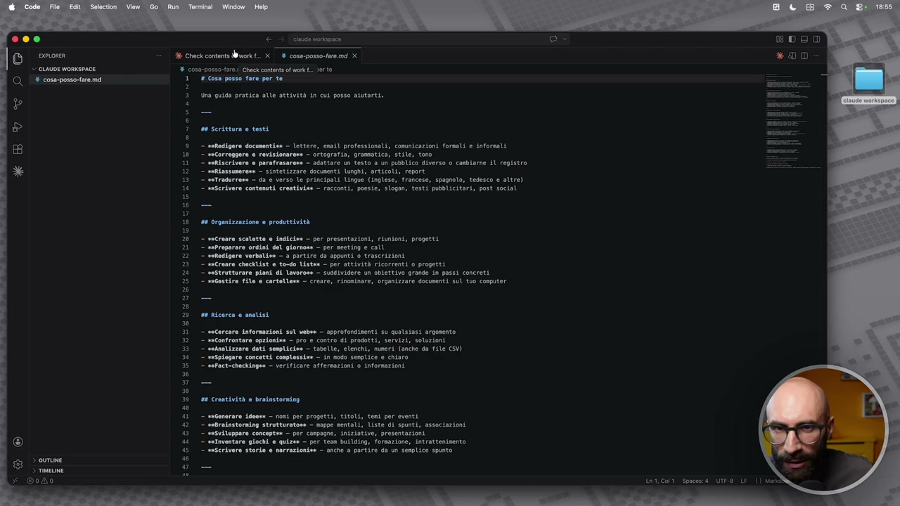

**Testo a schermo (OCR):** ine orispace X check contents work 1.. x 8 coss-posso-taremd x cosa-posso-fre; Ciak contenti ol work. verte # Cosa posso fare per te Una guido pratica alle attività in cut posso aiutarti. 00 scrittura e testi 1 2 5 È = n 8 — sofidigere documentiso — lettere, esail professionali, comnicazioni formali e informati - saCorreggere e revisionaresa — ortografia, gramatica, stile, tono — setiscrivere @ parafrasareee — adattare un testo a un pubblico diverso 0 cambiarne iL registro 7 Eifiasiumerese = sintetzz9re socumenti lunghi, articoli, report — eetradurrose — da © verso le principali Lingue (inglese, francese, spagnolo, tedesco e altre) — saScrivere contenuti crestivime — racconti, poesie, Slogan, testi pubblicitari, post social 28 organizzazione è produttività - secreare scalette e indicio» - per presentazioni, riunioni, progetti — sefreparare ordini del giarnose - per meeting e call — setiedipere verbalio = 3 partire da appunti © trascrizioni — setreare checkList è to-do Usteo — per attività ricorrenti o progetti 7 strutturare piani di lavorose — sugelvidere un obiettivo grande in passi concreti — sntestire file e cartellone — creare, rinoninare, organizzare documenti sul tuo computer profondinenti su qualsiasi argomento - secofrontare opionisa — pro © contro di prodotti, servizi, soluzioni - manlizzare doti semplicio» - tabelle, elenchi, numeri (anche do file CSV) - sispiegare concetti complessie — in nodo sesplice e chiaro — tifact-checkingee — verificare offermazioni 0 informazioni n0 creatività è brainstorniog - snfenerara ideose - cosi per progetti, titoli, teni per eventi. — sebralastoraing strutturatove — soppe mentali, Liste di spunti, associazioni — sesviloppare conceptea — per campagne, iniziative, presentazioni 7 Sataventare giochi e quizie — per tesa Buslsing, formazione, intratteninento _ siScrdvere storie e narrazionise - anche a partire da un seplice spunto

> Quello che vedrete nel corso di questo corso, devo trovare un'alternativa perché continua a dire corso di questo corso ed è terribile come espressione, è che invece lavoreremo molto sui file. Le chat sono semplicemente dei momenti di scambio dove noi diamo istruzioni per poi lavorare sui file. Leggi da file, scrivi da file, leggi da file, scrivi da file, sarà tutto il tempo così. Vi faccio vedere anche un'altra cosa, sempre per prendere confidenza con l'ambiente. Quando abbiamo dei file possiamo andare qua sopra e cliccare questo pulsantino che ce li fa vedere in modalità diciamo formattata. E quindi questo markdown che a voi sembrava un file strano e qualcuno potrebbe già dire ma cos'è questa cosa, è codice? No, è semplicemente un file formattato. È come se stessimo vedendo dietro un file word cosa c'è, ok? Semplicemente questo file qua, vedete? Quindi ci sono grassetti, titoli, sottotitoli, ci sono elenchi puntati, ci sono sezioni e così via. Questa roba qua è semplicemente il modo con il quale le macchine lo scrivono.

## [00:10:00] Schermata 10 _(periodic)_

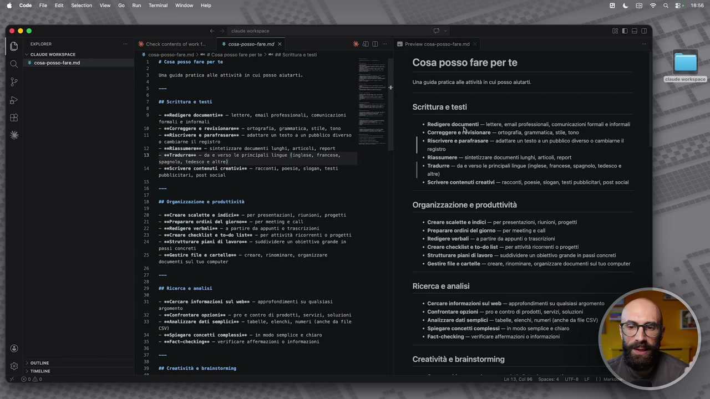

**Testo a schermo (OCR):** te oisooce Ci + coss-posso fre md x *20 ‘ cosa-posso-fre,mé > = Cosa posso are per te) = #8 Scrittura e est 36 Check content of work I Previen cosa-posso are ma # cosa posso fare per te Una guido pratica alle attività in cut posso asutarti. 00 scrittura 0 testi — sofidigera documentive — lettere, esail professionali, comunicazioni formats e Informati — secorreggere @ revisionarese — ortograria, gramatica, stile, tono — safiscrivere e parafrasarese — adattare un testo 2 ua pubblico diverso ‘© cambiarne sl registro, mAiazzonerena — sintetizzare docunenti lunghi, articoli, report — setradurrone — da © verso le principati Lingue (inglese, francese; 5pagnolo, tedesco e altre) — seserlvere contenuti crentivieo — racconti, poesie, slogan, testi pubblicitari, post social 00 organizzazione @ produttività - secreare scalette e Indicio» — per presentazioni, riunioni, progetti - sefreparare ordini del giornose = per meeting e cotl — setedigere verbalieo — a partire da appunti © trascrizioni — setrenre checklist è to-do Ustee — per attività ricorrenti 0 progetti = seStrutturare piani di lavorose — suddividere un obiettivo grande in 90ss1 concreti " ecestire file e cortellone - creare, rinoninare, orgentzzare documenti sul tuo computer 00 Ricerca è analisi mecercare informazioni sul vabbe — approfondimenti su qualsiasi argosento — setontrontara opzioniss — pro e contro di prodotti, servizi, soluzioni - manalizzare dati semplici - tabelle, elenchi, numeri (anche so file O) — sespiegare concetti complessi — in nodo sesplice e chiaro — tafact-checkingee — verificare affermazioni 0 informazioni n0 crestività è bratastorning Cosa posso fare per te Una guida pratica alle attività n cui posso aiutarti. Scrittura e testi * Redigoro —Jttoo, ema professional, comunicazioni formali informali * Correggere e; -— ortografia, grammatica, stile, tono * Riscrivre e parafrasare — adattare un testo a Un pubblico diverso 0 cambiarne il registro *. Riassumere — sintetizzare documenti lunghi, rioli, report * Tradurre — da 0 verso le principali ingue (inglese, francese, spagnolo, tedesco e altre) * Scrivere contenuti creativi — acconti, poesie, slogan, test pubbleitari, post social Organizzazione e produttività * Creare scalette e indici — per presentazioni, riunioni, progetti * Preparare ordini del giorno — per meeting e call * Rodigere verbali — a patire da appunti trascrizioni * Creare checklist e to-do lst — per attività ricorrenti o progetti * Strutturare pian di lavoro — suddividere un obiettivo grande in passi concreti * Gestire file e cartllo — creare, rinominare, organizzare documenti ul tuo computer Ricerca e analisi Cercare informazioni sul web — approfondimenti su qualsiasi argomento Confrontare opzioni — pro e contro di prodotti, servizi, soluzioni Analizare dati semplici — tabelle, elenchi, numeri (anche da flo CSV) Spiegare concetti complessi — in modo sempie e chiaro Fact-checking — verificare affermazioni 0 Informazioni Creatività e brainstorming

> Vi faccio vedere subito un file markdown perché si usano tanto i file markdown quando usiamo Cloud Code. In generale quando utilizzate queste modalità un pochino più agentiche si usano tanto i file markdown. Ma ripeto, non bisogna essere esperti di codice, non dovete nemmeno essere esperti di markdown, ok? Non sto qui a dirvi per fare il grassetto devi mettere il doppio asterisco, no. Non ci interessa questa cosa qua perché tanto lo farà sempre Cloud Code. Vi voglio far solo vedere che questa cosa che sembrava strana, ok, è semplicemente questa roba qua, tutto qua. Io posso chiudermela e non la guardo nemmeno, guardo solo questa versione formattata, ok? Quindi abbiamo appena creato il nostro primo file, ok, e abbiamo preso anche un po' di confidenza con l'ambiente di VS Code. Ricapitolando, cosa abbiamo? Abbiamo la nostra cartella di lavoro con dentro tutta una serie di file, abbiamo la nostra chat, abbiamo il nostro terminale, abbiamo i nostri file aperti.

## [00:11:00] Schermata 11 _(periodic)_

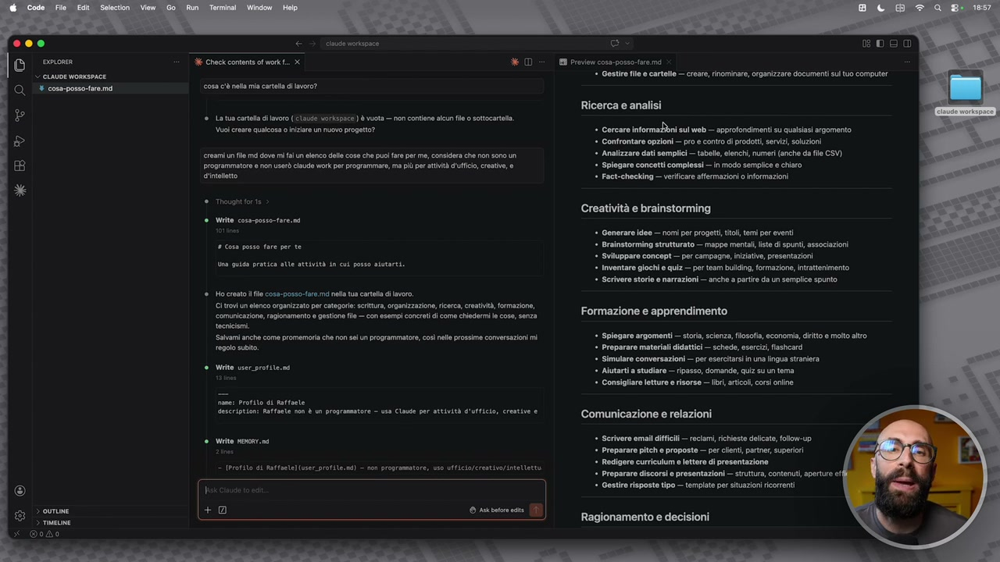

**Testo a schermo (OCR):** 36 Check contents of wo. x cosa cè na mia carta di iavoro? ® Lat cati i avro (side VrkSba<#) è vuota — non contiene alcun fl o sottcatalia. Vuoi crero qualcosa 0 Iniziare un nuovo progetto? ereami un fl md dove mi fl un elenco delle cose che pui fre per me, considera che non sono un programmatore non usò claud work er programmare, ma più per attivit d'ufficio, crstv, giotto è Vito cosa-posso fare. tività in cut posso atutti. Ho crono fl cosa-poss.fare me nella tu cartella lavoro Clrovi un lenco organizzato pe catagore: scrittura, organizzazione, cerca, creativi, formazione, omunicazione, agionamento e gestione fio — con esempi concreti come chiedermi le coso, senza tocnciami. Salvami anche come promemoria che non sel un programmatore, così nlle prossime convereazini mi regoo subito. Write user prtite.ne rio di Rattote ‘Raffaele non è un programantore — usa Cine per attività d'ufficio, ereive e Write. — Potito di Rrtantel (user_profile.nd) — non programmatore, uso Utficia/erentive/intllettu SS Boe I Previen coss-posso- fara ma * Gestire file e cartello — creare, rinominare, organizzare documenti ulivo computer Ricerca e analisi * cercare informazbni sul wob — approfondimenti su qualsiasi argomento * Confrontare opzioni — pro e contro di prodotti, servizi, soluzioni Analizzare dati semplici — tabel, elenchi, numeri (anche da file CSV) Spiegare concetti complessi — in modo semplice e chiaro Fact-checking — verificare affermazioni 0 Informazioni Creatività e brainstorming *. Generare idee — nomi per progetti, titoli, temi per eventi * Brainstorming strutturato — mappe mentali sto dî spunti, associazioni * Sviluppare concept — per campagne, iniziative, presentazioni * inventare giochi quiz — per team bulding, formazione, Intrattenimento * Scrivere storie e narrazioni — anche a parte da un semplice spunto Formazione e apprendimento * Spiegare argomenti — storia, scienza, flosolia, economi, diritto e molto altro * Preparare materiali didattici — schede, esercizi, iashcard * Simulare conversazioni — per esercitarsi i una lingua straniera Aiutarti a studiare — ripasso, domande, quiz su un tema * Consigliare ltture e risorse — Ibi, articoli corsi online Comunicazione e relazioni * Scrivere email difficili — reclami, richieste dliato, follow-up * Preparare pitch e proposte — per centi, partner, superiori * Redigere curriculum lettere di presentazione * Preparare discorsi e presentazioni — struttura, contenuti, aperture ef * Gestire risposte tipo — tempiate per situazioni ricorrenti Ragionamento e decisioni

> E di file aperti ne possiamo tenere anche più di uno, ovviamente.
