# 2.1 Come parlare a Claude Code (Hotmart)

> Documento generato automaticamente: trascrizione e screenshot sincronizzati del video-corso.

## [00:00:00] Schermata 0 _(start)_

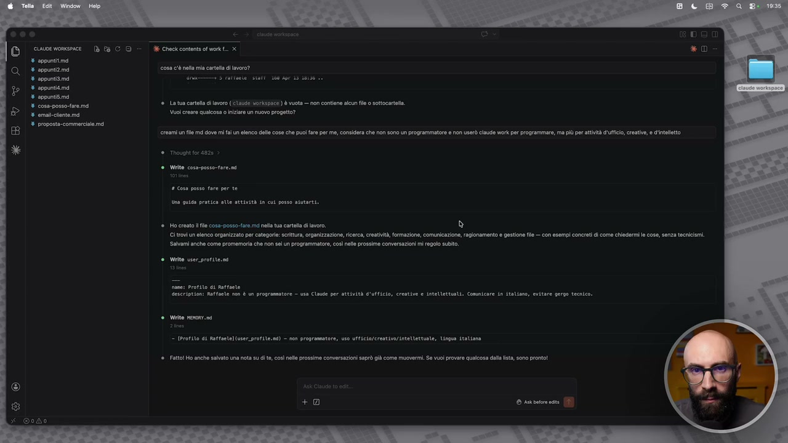

**Testo a schermo (OCR):** cime momence Db fa CO * appunti % appunti + sppuntiamd * appuntiaim 4 appunti 4 coss-posso-aremi % emal-ctente md ‘ proposta-commercae md E Check contents of wo. x cosa na mia cartella di iavoro? ® La tu catia i lavoro (Ellie \efSbc&) è vuota — non conene alcun flo o sottcatalia. Vuoi crero qualcosa 0 iniziare un nuovo progetto? ereami ul e dove 1 i un elenco delle cose che puoi fare per me, considera che non sono un programmatore e non userò claude work per programmare, ma più per atttà d'ufficio, creative, e 'ineletto ® Thought for die è Write cosnposso fare. (na quia pratica alle attività in cui posso atutti. Ho creato i fila cosa-posso-fare. me nella tua cartlla di lavoro. ® Cltrvi un lenco organizzato pr categorie: srttura, organizzazione, ricerca, creativi, formazione, comunicazione, ragionamento e gestione fl — con esempi conrti i come chiedermi l cose, senza tecnici. Salvami anche come promemoria che non sel un programmatore, così nell prossime conversazioni mì rogo subito. Write user_prtite.ne fine: Profilo di Ratfacte aeseription: Raffoele non è un pregramatore — usa Cine per ttività d'ufficio, crestive e intellettuali. Commicare in italiano, evitare gergo tecnico. Write nonr.ni — Proto dl Ratfaete) user. profile.) — nen programatore, uso uffici/erentiv/ iteltettule, Lingua italiana Fatto Ho nche savto una nota sù dt, cos nel prossime conversazioni saprò già come muovermi. S uo provare qualcosa dala eta, ono pronto © nate

> Adesso facciamo subito qualche esempio pratico per vedere com'è questa cosa che abbiamo visto. Possiamo usarla un po' più in dettaglio. Lo farò spesso nel corso di queste lezioni. Cioè mi fermo un attimo, non vado avanti diciamo col contenuto, ma provo a fare qualche esempio pratico di come possiamo applicare quello che abbiamo visto. Ovviamente quando si fanno gli esempi dovete sempre capire che sono degli esempi e che io non posso coprire tutte le casistiche che ci sono lì fuori. Ecco perché dovete fare voi un lavoro di pensiero concettuale. Quindi astraete quello che vi faccio vedere. Dite ok questa cosa ecco come la posso usare io nel mio lavoro. Allora quello che è successo in precedenza. Io ho chiuso a un certo punto la registrazione ma voglio far vedere che in autonomia Cloud Code ha fatto anche due cose. È vero che mi ha caricato quel file. Vi ricordate cosa posso fare .Md? Tra l'altro qua ci sono altri file perché servono per gli esempi di adesso. Ma in autonomia si è anche andato a creare due file. User profile, quindi il profilo di Raffaele. Clicchiamoci sopra. Cosa ha scritto? Profilo di Raffaele.

## [00:01:00] Schermata 1 _(periodic)_

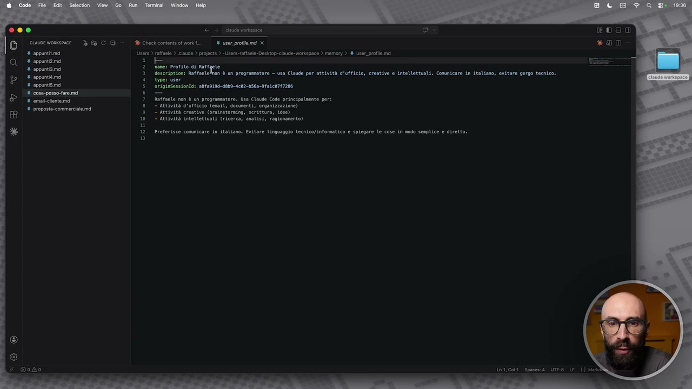

**Testo a schermo (OCR):** O00 cine oispace © soon È CO diciotto | + iii I, trito ci nr i Masiona TICINESE: tipe: user * sppuntsima orsginsessionid: 30129194-0M29-1c02-b560-9191c0717206 % cosa-posso-fare md _ Ver seni Raffaele non è un programmatore. Uta Claude Code principainente per dI — Attività d'ufficio (email, docusenti, organizzazione) SiPreposte cammei ne — Attività creative (brainstorming, scrittura, idee) Attsvità intellettuali (ricerca, analisi, ragionamento) Preferisce comunicare in italiano. Evitare Linguaggio tecnico/informatico e spiegare le cose in nodo semplice

> Raffaele non è un programmatore. Usa Cloud per attività d'ufficio, creative, intellettuali. Comunica in italiano. Evitare gergo tecnico. Queste cose non glielo ho detto io. Le ha dedotto da quello che stavamo scrivendo prima. Ok vedete si è fatto una serie di cose. Raffaele ci fa attività d'ufficio. Per esempio email, documento, organizzazione, attività creativa, brainstorming, scrittura idee, attività intellettuale, ricerca, analisi, ragionamento. Quando parlo del fatto che Cloud Code inizia a costruirsi un contesto intendo proprio questo. E tra l'altro il contesto adesso lo sta facendo anche in automatico. Dopo invece vedremo come farlo in maniera guidata. Perché adesso le cose se le sta un po', non inventando, ma le sta deducendo da quello che gli abbiamo detto. Dopo ci sarà un modulo invece dove in maniera specifica gli faremo creare il contesto super dettagliato. Poi ha creato anche questo file memory.Md che sono diciamo delle impostazioni che lui si salva. Impostazioni molto brevi. Qua per esempio ha assegnato non programmatore, uso ufficio creativo intellettuale, lingua italiana.

## [00:02:00] Schermata 2 _(periodic)_

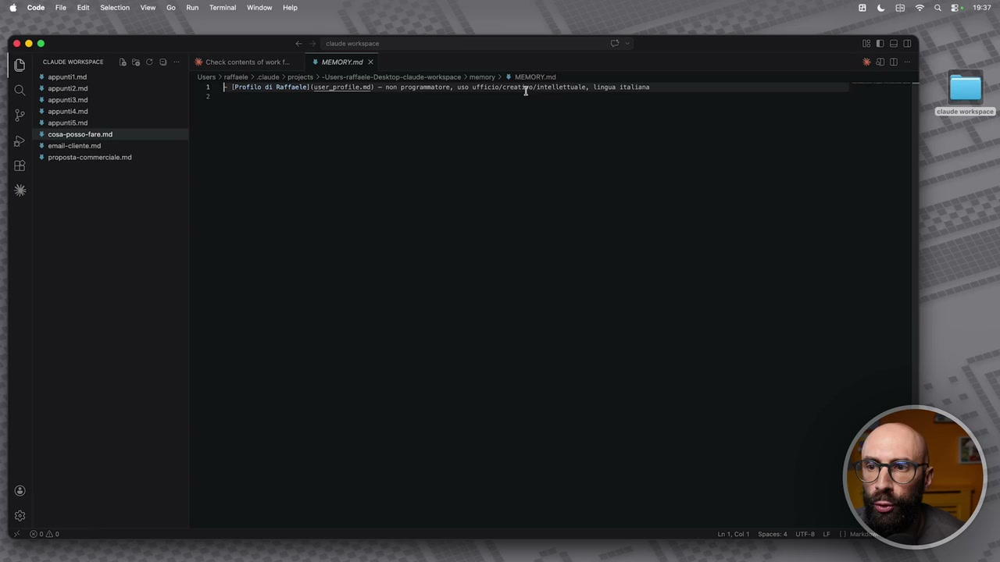

**Testo a schermo (OCR):** 000 cla orispace © Sovvomene Da CO - i chekcontnisoi ki 8 MEMORIA X 8 appunti Uras rale > io > project Usor-ait- Desktop -claude-wotspace > memory > MEMORT:n Qu + sopunizna 1° {Profito i Raffaele) (use. profile:=) — pon programator, Uso fficio/erestio/intellettate, Lina itatina + sopuntiimi È + appunta apporta + cosa-possotramd % emal-cbentamd 3 proposta commerciale

> In queste memorie lui ogni tanto va a mettersi delle cose perché si vuole ricordare delle cose che noi gli abbiamo detto. Magari di fare le cose sempre in un certo modo e così via. Immaginate un po' quello che magari faremmo dentro uno strumento di chat tradizionale. Però qua è dentro i file, viene caricato in automatico, è stendibile, personalizzabile e così via. Allora io qua ho caricato un po' di cose. Voglio farvi vedere degli esempi. Per esempio diciamo che c'è questa email che ho scritto per un cliente. Sono tutte cose inventate queste mi raccomando. Ciao Marco, grazie per la call di ieri, molto interessante, mi ha fatto piacere capire meglio la situazione del tuo team di Alphadex. Tutto inventato. Questa è la proposta che ti vorrei fare. Immaginate quindi che abbiamo fatto una call con un cliente, che è questo Marco che lavora per Alphadex. Noi ci chiamiamo Laura. Abbiamo buttato giù questa cosa al volo. Quello che vogliamo fare è fargli fare un lavoro magari di riscrittura. Perché vorremmo un pochino più formale.

## [00:03:00] Schermata 3 _(periodic)_

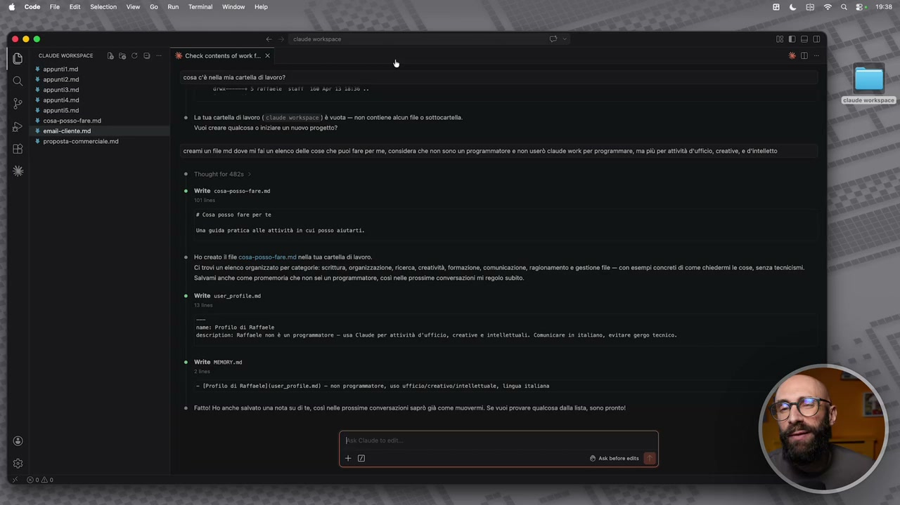

**Testo a schermo (OCR):** € E Check content of work. x cosa è na mia carta divora? ® Lat cata i lavoro (Ela WétASG<#) è vota — non conene alcun flo o sottcatalia. Vuoi cresro qualcosa 0 iniziare un nuovo progetto? ereami un fl md dove ji al un elenco delle cose che puo fre per me, considera che non s0n0 un programmatore e non userò cine work per programmare, ma più per ttt d'ufficio, creative, d'iteletto # Thought for 2 è Write conosco fare. (na quia pratica ale attività in cut porso atutorti. Ho crato i fl cosa-poss.tare md alla tua arto di voro Cltrvi un alenco organizzato per atagorie: scrittura, organizzazione, ricerca, creativi, formazione, comunicazione, ragionamento e gestione fl — cn esempi concreti di come chiedermi l cose, senz tecnici. Salvami anche come promemoria che nor sel un programmatore, così nell prossime conversazioni mi rogolo subito. Write ser_prtite.ne sto ai Rattete "eneription: Raffaele nun è en pregramatore — usa Claude per attività d'ufficio, crestive e intellettuali. Comicare in italtno, evitare Write nonr.ni — IPotilo di Rartante) (user_profile.nd) — no propramatore, use utficio/erestiva/intel ettunte, Unguo italiana CO e cai

> Magari non abbiamo confidenza con questa persona, con questo Marco. Quello che avremmo fatto normalmente in CGPT era scrivere tutto il testo della mail oppure caricare il file dentro. Scrivere il nostro prompt, dare il contesto, poi copiare il risultato, metterlo dentro un altro file e così via. Invece qua quello che possiamo fare è una cosa del genere. Nella cartella troverai una mail che ho scritto al volo per un cliente. Riscrivila in versione più formale dando delay perché non lo conosco così bene. Anche se diciamo che è un potenziale cliente. E qua facciamo salvalo in un file separato. Gli diamo invio e adesso lui parte a fare il suo lavoro. Innanzitutto io non gli ho detto della mail.

## [00:04:00] Schermata 4 _(periodic)_

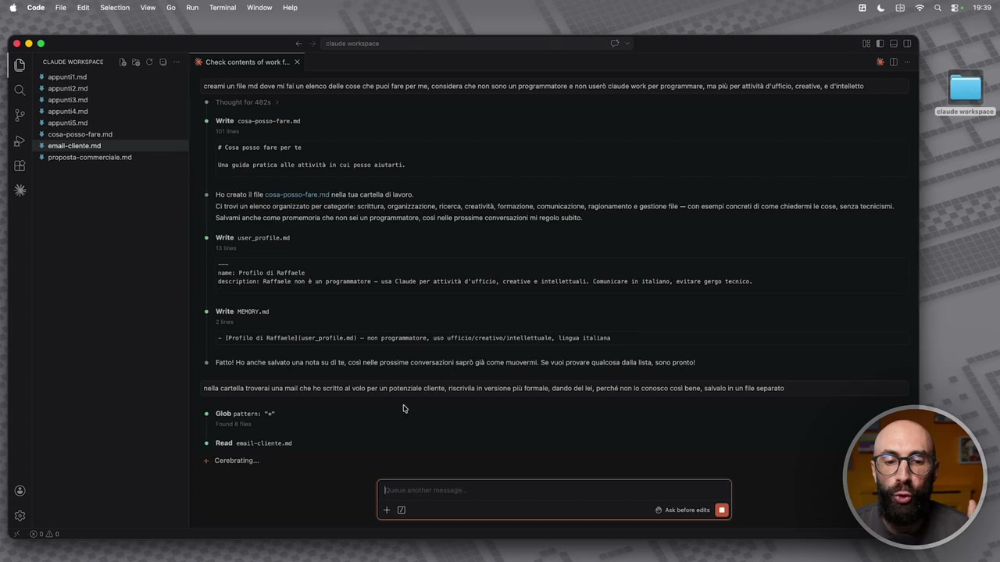

**Testo a schermo (OCR):** |o cioe womence (0 CO * appuntiimd % appunti % appunta md % appunta % appunta % cosa-posso-faremd % mal clonte md % proposta commerciale md E Check contents of won. x creami un fl md dove mi fl un alenco dell cose che puoi fre per me, considera che noo sono i programmatore è non userò ciau work pe programmare, ma più per attività d'ufficio, creato, d'inteletto e Tnaught for 822 > è Write cosa-posso-f Una guisa pretica alle attività in cut posso atutrti. Mo creto fl cos-poso.fre md nella tua carta di voro. Citrovi un lenco organizzato pe catagorie: rta, organizzazione, cera, creatività, formazione, comunicazione, ragionamento e getine fil — on esempi concrti i come chedermi le cose, senza tecnici. Salvami anche come promemeria che non sol un programmatore, così ll prossime conversazioni mi rgolo subito. Wii usercrotite.ni 10 di puttoete Geseription: Raffsele non è un pregramatore = usa Clude per attività d'ufficio, crestive e intellettuali. Commicare in talimo, evitare gergo tecnico. Write neon. — trotito di naffante] (user_profile.nd) = na propramatore, uso ufficio/erestiva/intellertunte, lingua italiana ‘®. Fatto Ho anche salvato una nta sù dt, così nel prossime conversazioni saprò già come muovermi. S vuol provare qualcosa alla eta, sono pronto eta carta troverai una mal che ho scritto al volo par un potenziale cente, scriva in versione più formale, dando delle, perché non lo conosco cos bene, saval n un fl separato Li ® Glob pater

> Lui sta cercando e ha trovato questa che si chiama email cliente. Adesso qua lo spazio di lavoro è molto semplice. Dopo ci sarà una serie di lezioni dove vedremo come organizzare lo spazio di lavoro. Mi dice mi autorizzi a scrivere la mail? Quindi devo fare questo file? Sì, ti autorizzo. Eccola qua. Email cliente formale. Quindi la apriamo. Gentile dottor Marco, desidero innanzitutto ringraziarla per il colloquio di ieri che ho trovato estremamente interessante. Ha fatto questo lavoro di trasformazione. Partiamo con un esempio molto semplice volutamente. Per far vedere che questa è una chat, non è una cosa stranissima. E che abbiamo fatto delle operazioni che normalmente siamo abituati a fare in un modo. Adesso le facciamo in modo molto più diretto. I prompt sono molto più brevi. Ragioniamo molto su qual è l'output che vogliamo ottenere. Ricordatevi, quando iniziate a lavorare con questi strumenti, questi ambienti tipo cloud co-work, queste modalità più agentiche e così via. Smettiamo di ragionare tanto sul prompt.

## [00:05:00] Schermata 5 _(periodic)_

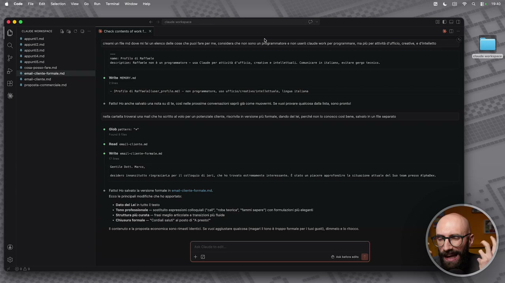

**Testo a schermo (OCR):** »Deu E Check contents of wo. x *D rt ile dove i fa lenza dl os che pus are par me, cose che no sno Up Rgrammatee e 0 er cus Wok per ragammar, ma più pr stà uti, rst, ntettto Tune: Potito gi Ratraete Geseription: Raffaele non è n regramatore = usa Cluée per attività d'utficio, erestive e intellettui. Comnicare in italo, evitare gergo tecnico. Write onini — Proto dl Rattatel user. prfile.d) = no propramtore, uso uffiiareretivo/inteltettune, Lnquo italiana ® att! Ho anche slinto un nota su di e, os nell prossime conversazioni saprò lì come muzirmi. e uol provare qualcosa dala sta, sono pro alla carte trovera una mali che ho sito al volo pr un potenziale lente, seri in versione più forma, dand dll perché non lo conosco cosi ban, salvalo un fl separato © Rondi mast-cLiente.nt è Write matl-cliente-tormte. desidero imanzituto rinpraziota per IU cottoqto di deri, che ho trovato ettresnente interessante. È stato wi piacere sorofondire la situazione attuate del Suo tes presso Alpine, Fatto! Ho sabato la versione formale in emal-lnte formal md. Eccola principal modifiche che ho apportato: - Dato del Lelin tuto testo ‘+ Tono professionale — sostituito espressioni colquali ‘cal “roba teoria”, “fammi sapere") con formulazioni pù leganti * Struttura più curata — frasi mglo articolate e transizioni pù ide * Chiusura formale — “Cordis al posto di “A presto!" lontano ela proposta economica sono rimasti denti. Se vuol aggiustare qualcosa (magari tono è troppo formale er toi gus, dimmelo e lo tocco. Ss

> E ragioniamo molto più su quello che vogliamo ottenere come risultato finale. Quindi descriviamo quasi sempre l'output che vogliamo. Cambia proprio il tipo di conversazione. Questo era un esempio molto semplice. Proviamo a farne uno un pochino più avanzato dove colleghiamo delle cose. Diciamo che qua c'è un template che ho chiamato proposta commerciale. Qua ve lo faccio vedere vuoto. Ve lo faccio vedere formattato. Diciamo che io ho questo template che poi adatto caso per caso. Quindi c'è ad esempio azienda, referente, ruolo, settore, dimensione e così via. Vedete? Quindi ci sono degli spazi da riempire. E poi io faccio queste proposte commerciali e le mando alle persone. Quello che posso fare, visto che quello è un template, ok? Quindi è un file da andare a riempire. Posso dirgli qualcosa tipo perfetto, la mail va bene. Ora prendi il template della proposta commerciale. Riempilo con, che ne so, i dati dalla mail, ok?

## [00:06:00] Schermata 6 _(periodic)_

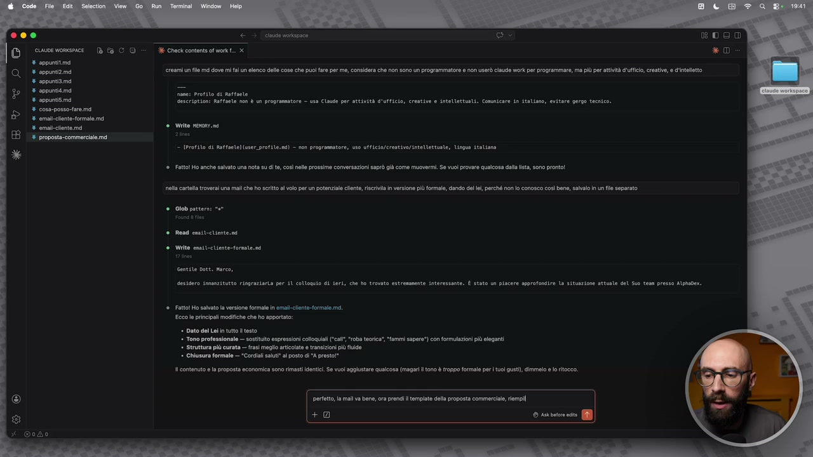

**Testo a schermo (OCR):** jo cisvoewoasace ME CD + appunti + appunti md % appuntita % appunta * appuntiima % cosa-posso-tare me % emali-cbente-fomale md 8 oma-ctonte md % proposta-commerciale md E Check content of work. x ereami un il md dove mi fun alenco dell cose che puoi fre per me, considera che nco sono un programmatore è non userò ciau work pe programmare, ma più per attività d'ufficio, creste, d'inteletto Time: Protito gi Ragraete description: Raffsle non è n propramatore = usa Clude per attività d'Urficio, crestive e intellettuali. Comnicare in italimo, evitare gergo tecnico. — Profilo di nattant) (user_profile.nd) = na propramatore, uso ufficio/erestiva/inellettunte, Lingua italiana ‘® Fatto Ho anche savato una nota sù dt, cos ele prossime conversazioni saprò già come muovermi. Se vio provare qualcosa dala eta, son pronto! ola carte troverai una mal che ho scritto al volo par un potenziale cente, scriva in versione più formale, dando dl e, perché non lo conosco co bene, sal in un fl separato © Rondi east-cLtente.nt è Write eatl-cliente-formate. desidero imamitutto rimpraziorta per IU coltoqto di dei, che ho trovato ertresnente interessante. È stato wi piacere sprofondire la situazione attue del Suo tes prezso Alpine Fatto! Ho sabato la versione formale i email Ecco le principal modiche che ho apportato: + Dato del Lelin tuto testo ‘Tono professionale — sostituto espressioni colquili ‘cal “roba teoria” “fammi sapere") con formulazioni più eleganti * Struttura più curata — frasi meglo articolate e transizioni pl (hide * Chiusura formale — "Codilislu' al posto di “A presto!" I ontenuto ela proposta economica sono rimasi denti. Se vuol aggiustare qualcosa (magari tono è troppo formale per tl quat, dimmelo e io tocco. perfetto la malva ben, ora prendi emato della proposta commercial, imp +0 © sit

> Poi gli dico chiedimi i dati che ti mancano per il template. E quando la proposta commerciale è pronta, salvala in un file separato. Anzi, facciamogli fare pure una cosa un po' più complicata. Crea una cartella per le proposte commerciali. E qua gli dico pure il nome del file. Il nome del file deve avere la data di oggi e il nome dell'azienda. Invio. Stiamo ragionando sull'output. Stiamo ragionando su quello che vogliamo ottenere sul computer. Io mi apro la cartellina Cloud Workspace. Vedete? Qua ci sono gli stessi file che trovate qua sulla sinistra, ok? Ecco perché stiamo usando VS Code, vi ricordate? Per avere tutto in un unico luogo. Invece di avere i file di qua, li trascino dentro. No, li apro, li guardo in anteprima e così via.

## [00:07:00] Schermata 7 _(periodic)_

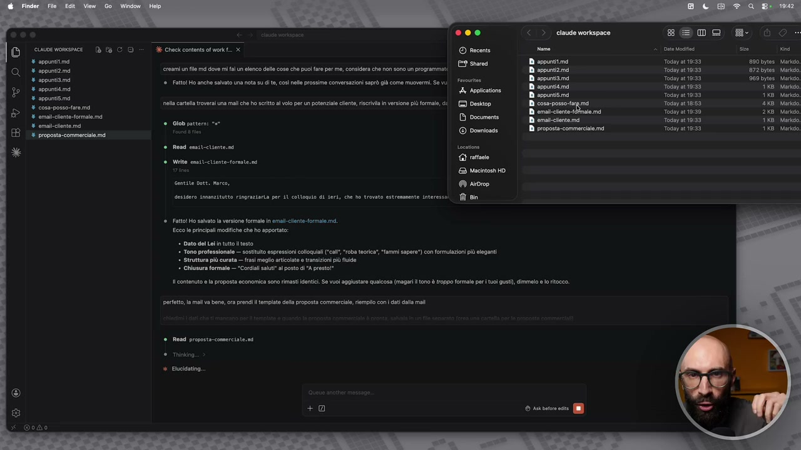

**Testo a schermo (OCR):** 8Ee 0a E O suorvomine 1 CO + M creccememeatvoni. x © rcont 2 oneri son vin % opponitma Etna Too a 1939 aoDimne» ro Q + sopito remi ul md dov mi lena dle cono che us ae per mo, consider ch non sono un prcgrammati dat 1039 720108 Mario E eppuntit md #* Fatto Ho Luna nota su di te, così nelle jme conversazioni sag come muovermi. Se vul | Fevourites iii LL (2 ato to anche sto te cose pros son sarò % a co dp So: A Applications + spponime day 1039 Te Marco ì acri ori ina mai ch ho srt al volo eri prezio clet, cda n vere pù tal, (2) Desktop odo 89 a ro cosnposso remi pi 2, S Toy 108 28 Vario re Tann cup Today 1039 16 Mio Qi puetrmene te Sa Today 109 TRA Marica 3 proposte commerce * è road mite tecni è Write cnttctente tornei CI rie vi @ ricci o centi pet. nec, @ 4000 desidero inanzitutto ringrazia per il colloquio di ieri, he Ro trovato estremamente interessa! Bin .Faol Ho sabato 1 versione formale in emallnteoralo md. cole principali modiche che ho apportato: Dato dll Lin tutt testo ‘+ Tono professionale — sostituito espressioni colguil "al “roba teoria”, “fammi sapere") co formulazioni pù eleganti * Struttura più curata — frasi mogli arcoat ransizioni iù fido * chiusura formale — "Cordiali shut al posto di A presto!" contenuto le proposta economica sono rimasti dont. e vuoi aggiustare qualcosa (magari tono è trappo formale per tuoi gus, dimmelo 0 tocco. eretto, la mal va ben, ora prendi tampato dll proposta commercial, riempio con dati alla mal Rand proposta-comerciate.nd

> Dice, ho letto il template. Questo mettiamocelo qua dietro. Ho letto il template. Dalla mail riesco a trovare parecchie cose, eccetera, eccetera. Però mi servono alcune informazioni. Te le chiedo. Qual è il cognome di Marco e il suo ruolo in Alphadex? Quindi sta dicendo che cos'è? È il CEO, è il responsabile manager, è char formazione. Oppure qua posso scrivere altre cose se voglio. Faccio other e poi ci metto la cosa. Questa modalità la posso utilizzare anche con la tastiera. Vedete? Mi posso muovere tra queste risposte. Questo noi lo potremmo fare anche nel famoso terminale. Ormai ve ne siete già dimenticati. Ma tutto è iniziato con un terminale stranissimo e scurissimo nel quale davamo dei comandi. Questo VS Code non fa nient'altro che prenderci quella roba che nel terminale sembra complicatissima e ce la fa graficamente più accattivante. E quindi io qua col mouse vado a dire Marco è l'amministratore delegato, ok?

## [00:08:00] Schermata 8 _(periodic)_

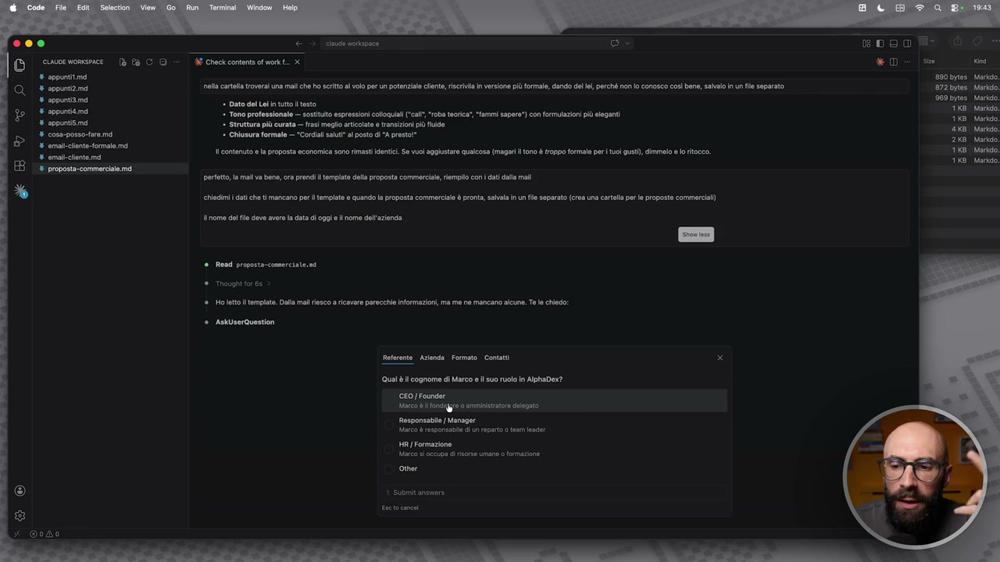

**Testo a schermo (OCR):** ® ciavoe woraspace -— ® fa CD f Check contents of work f.. x * © Se opt cn Qin Tr‘ EEeeeeG|ÙÌÙinliwWi(w(£(:(5(« Pete E ie ci. fo treniama * Tono professionale — sostituto espressioni oloquali call, “roba teca, lam saper”) co formulazioni più leganti dr a EEE ma O) RR im fi edo Ro CEI ES Horo Penta as e, CICLI iI % STEN ONE OATene] tomo dl fl ove avere a data di oggi nome del'azienda ® Read proposta-comerciate.n e Tough or se ‘®. Holetto ll template. Dalla ma esco a ricavare parecchi informazioni, ma me ne mancano alcune. e le chiedo: è Askuserquestion Referente. Azlenda Formato: Conti x Qual cognome di Marco elsuo ruolo in AlphaDer? cE0/ Founder arco ondagge o arminisatore epato Responsabilo [Manager Maro è responsa iu apart 0 tem ndr HR] Formazione other ® Sun anse

> E gli do questa cosa. Poi va alla seconda domanda. Vedete? Qua mi sta facendo una serie di domande ma me le sta mostrando in un modo graficamente facile da rispondere. In che settore opera Alphadex? E quante persone ci sono nel team? Qua magari se le sta inventando queste cose. Quindi gli dico altro e gli diciamo che è un'azienda di... Non lo so, che vogliamo dire? Che cosa fanno loro? Borracce per sportivi. Quante persone ci sono nel team? Qua involta nella formazione, virgola, nella formazione saranno in 13. Vedete? Quindi qua è proprio come se stessi dando dei comandi in chat ma lo faccio dentro questa schermata molto facile da usare. La formazione sarà in presenza, da remoto e in modalità ibrida. Vedete qual è la potenza di usare questi strumenti? Proprio come impostiamo una conversazione diversa e così via. Gli diciamo che sarà in presenza. E poi ultima cosa. Quali sono i dati di contatto di Laura da inserire nella proposta? Cognome, email, telefono.

## [00:09:00] Schermata 9 _(periodic)_

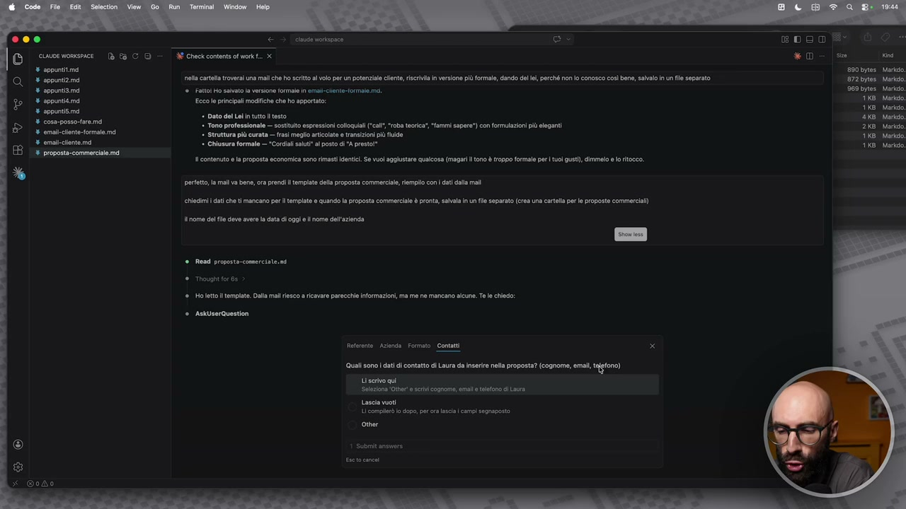

**Testo a schermo (OCR):** cisuoe nomsnice | [è fa C © + Checkcontentsof wont. x ®# DD - | st % appunti md ela carta troverai una mallche ho scrito al volo pe un potenziale cilete, seria n versione più formale, dando del el, perché non | conosco cos ene, sal in un fl separato 872bt6s. Marcio % appunta md + Fatto o sanao la versione forma macerie ormai a. 969 bytes. Marko. % appunta Ecco le principali modiche che ho apporta dana x 5 1x8. Mario, Sne Dato dl Lin tutto testo AXB. Marko * Tono professionale — sostituto espressioni colouiai ca roba tera", “fammi saper") con formulazioni più eleganti 2K8. Marko % emai-ente-formalemd + Struttura più curata — frasi meglio aricolat transizioni iù fuide 108. Mario, omai-chonte md * Chiusura formale — "Cordl slut* l posto ci “A presto!" 1K8. Mario lconte la proposta economica sono rimasti denti. e vuoi aggiustare qualcosa (magari tono è troppo formale per toi gus, dimmelo ritocco. perfetto, la malva ben, ora prendi tempiato della proposta commercial, riempi con dai da mali ehi dati het mancano pr empiae e quando la proposta conmercae è pronta, salva i un fl separato (ere un cartela pr proposte commer) tomo dl fl dee avere a data di oggi nome dell'azienda è Read proposta-comerciate.nd © Tough or 86 ®. Holettol template. Dall mal iesco a ricavare parecchie Informazioni, ma me ne mancano alcune. e le chie: » Askiserquestion Referente Azinda Formato Cont Quali sono ati di contatti Laura d inter nella proposta (cognome, ema tefgfono) iero qui Selezione ihr" seri cognoa mal telefono di Lara Lascia voti LI compeò lo dopo, per a lai smi segnaposto otte O) Sant an

> Allora qua facciamo other Laura Gaito. Non esiste, me lo sto inventando. La mail è laurachiocciolagaito.Info e poi il telefono è 333-123-4567-89. Spero che nessuno abbia questo numero di telefono. Invio. Inviamo la risposta. Adesso ha tutte le informazioni. Da queste informazioni che ha preso dalla mail. Capite cosa stiamo facendo adesso? Lui sta facendo un pezzo l'ha preso da me. Oh il cognome di Marco, mi avevo dimenticato. Marco Marchetto. Ok. Sta facendo legge delle cose dal computer. Quindi è andato dentro la mail e si è andato a prendere le informazioni che gli servivano. E' andato nella proposta commerciale e si è scaricato il template. Poi si è accorto che mancavano delle cose e le ha date a me. Le ha chieste a me. E adesso con questo va a lavorare.

## [00:10:00] Schermata 10 _(periodic)_

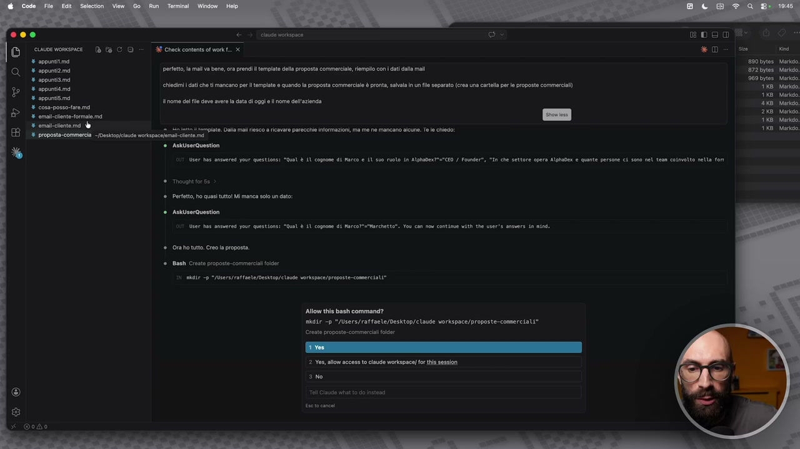

**Testo a schermo (OCR):** @ Susvomene o CO - A checkcontneoli. x *D- (st $ appunttima ‘890 bytes. Marito. Q * appunta eretto, la malva ben, ora prendi template dll proposta commercial, iemplo con dti alla mal 872bytes. Mario % appunta md ‘960 bytes. Marko. H A chiedimi dati che ti mancano pr template quando la proposta commerciale è ronta, salva n n fl separato (crea una cart pere proposte commercial) TG Marko Llano Ti Mero nome dl fl oe avere a data di oggi nome dell'azienda ‘4x8 Marko % cosa-posso-fare.md IS = 2K8. Marko amal-cent-forma ses Mereto ta “ bn ava sample, Dl ma €80 a ricavare perche informazioni, ma me ne mancano cune. el chiedo dana EB è proposta-commercia -pesitop]ciurte noriapaciemai cherte.na a *% * Askiserquestion User has answer your questions: “Qui è IU copnose di Marco e Il sbo ruolo in Alphber1*"CEI / Fouder®, “In che settore opera Alphavex e quante persone ci sano nel tesa colvolto nella fon è Tnouohi forse ®. Perfetto, ho quasi tutto! Mi manca solo un dato: » Askuserauestion User has answer your questions: “Qual è 10 cogne di marce ora ho tuto. Creo la proposta. è Bash Create propostecommerciai fider ndr 9 */05es/ raffaele Deshtap/claude vorkspce/proposte=comereiati* Allow this bash command? mkdir -p "/Users/raffaele/Desktop/claude vorkspace/proposte-comerciai* Create proposte: commercial oder 2 Yes, allow access to claude workspace] for hs session ano ®

> Qua mi dice, aspetta un attimo. Devo creare una cartella. Mi autorizzi a creare la cartella proposte commerciali? Qua gli posso dire sì, no, sì. Fallo sempre in questa sessione. Vi ricordate? Per adesso gli dico di sì. Sto facendo ancora che lo autorizzo volta per volta. Vediamo che succede di qua. Vedete? Si è creata questa cartella proposte commerciali. Adesso questa cartella è vuota. Ma la apro. Così mentre in sottofondo vediamo, diciamo, Cloud Code lavorare, vediamo anche il file comparire qua. Mi autorizzi a creare questa cartella 20260413 alphadex? Sì. No, non cartella, scusatemi. Questo è il file. Eccolo qua. Ha creato il nostro file di preventivo. Torniamo un attimo qua. Vedete che tra l'altro le cose qua sono sempre cliccabili, no? Quindi molto molto comodo. Dici qua ho fatto. Ti ho creato la cartella, ho salvato la proposta come 20260413 alphadex eccetera eccetera. Ecco cosa ho messo. I dati sono questi.

## [00:11:00] Schermata 11 _(periodic)_

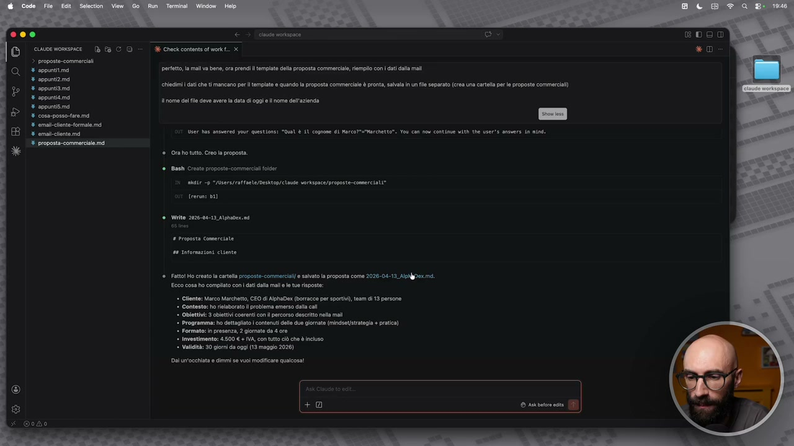

**Testo a schermo (OCR):** € Pa © © + checkcontentsofmork1.. x eretto, la malva ben, ora prendi tempiato dll proposta commercial, iempo con dti alla mal chlecimi dati che ti mancano perl tempiae e quando la proposta commerciale è ronta, salva n le separato (crea una carta perl proposte commercial) User has answer your questions: "Qual È SU coquone di Maret*aMarchetto”: few can pi contine viti th user's answers in ind. lt ore del fl ve avere a data di oggi nome dell'azienda ra ho tutta. reo la proposta. Bash Crete propostecommerciali folder kde -p “r0sers/affaete/Besktop/clnue vorkspace/proposte-comerciti* rerum 61 Write 2026-04-1) phadexid preposta Comerciate Fatto Ho creto la cartella proposte Commercial Savato a proposta come 2028-04-15. Apajpex.md. Ecco cosa o complato cn dati al mal e tue risposte: - Cilento: Marco Marchetto, CEO di phaDex (Borracce pe sport), team di 13 persone * Contesto: ho rielaborato l problema emerso dla cal “Obiettivi: 3 cbetivi coerenti on percorso deseito nel mali * Programma: ho dettgiato | contenuti el ue giornate (mindsatistrategia + pratica] * Formato: i rosenza, 2 giornata da 4 ore ‘Investimento: 500 € + IVA, con tutto cià che è inckuso * Valità: 30 giorn da ogg (13 maggio 2028) Dai unvocchiata e dimmi se vuoi modificare qualcosa!

> Clicchiamo questo preventivo e andiamocelo a vedere. Vedete? Questa è sempre la versione in formato Markdown. Diciamo, lo possiamo fare così per vederlo bene. Quindi questa è l'azienda Alphadex, Marco Marchetto, 13 persone. A seguito del colloquio, vedete? Ha preso le informazioni. Questo l'ha preso dal fatto, diciamo, il giorno in cui sto registrando. Non glielo ho detto io. Cosa avrebbe messo nel programma. Qua c'è il famoso costo di 4500. Qua ci sono i dati. La proposta ha messo anche la data in automatico. La data, vi ricordo questo, che nel template di proposta commerciale c'è scritto proposta valida fino al metti la data di oggi e aggiungi 30 giorni. Questa cosa l'ha fatta in automatico. Quindi ha preso la data di oggi. Scusate, questo è il template della proposta commerciale. Voglio far vedere quello compilato. Ha preso la data di oggi e ci ha messo i 30 giorni e ha detto il 13 maggio del 2026. Ok? E mi ha fatto il preventivo. Vedete? Adesso siamo già un pochino ad una cosa un po' più avanzata.

## [00:12:00] Schermata 12 _(periodic)_

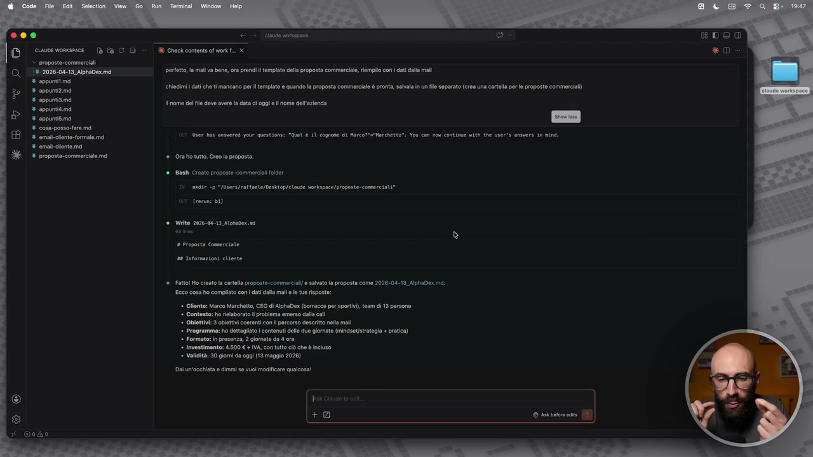

**Testo a schermo (OCR):** © csoe morse fa CO © proposte:commerci 1% 2026-08-12 Apradorid + appunti + appuntzand * appari % appa + appunti + cosspossore mi .a-cbent- formal md % emal-cbenta md % proposta commerci € E Check contents of work. x eretto, la mali va ben, ora prendi ampiato dll proposta commercial, iemplo con dati ala mall chiedimi dti che ti mancano pr template quando la proposta commerciale è ronta, salva in n fl separato (era na carta perle proposte commercial) User has nere your question: "Qual è SU cognome di Marc?*a"Marchetta”. few can pin contine vit) the user" anvers in snd. loro dl fl ove avre a data di oggi nome dell'azienda ra ho tutta. Creo la proposta. Gant Crete proposte commerciali folder kde -p “/Users/raffaate/Besktop/claue vorkspoc/proposte-comerciati* rerum 61 Write 2026-04-1 Aprabox 1 Proposta Comerciate Fato! Ho creto la cartella proposte Commercial sanata proposta Come 2026-04-15_AptaDex.md. Ecco cosa o complato con dati al mal tue rispose: Gilnte: arco Marchetto, CEO di AlphaDex orracce per sport), team 13 persone Contesto: ho elaborato problema emerso dla cal Obiettivi: obiettivi coerenti co percorso descritto nella mali Programma: ho dettagliato | contenuti ele due giomate (mindsetsratega + pratica) Formato: prasenza, 2 gionato da 4 re Investimento: 4500 €+ IVA, con tutto cià che è inciso Validità: 0 gori da ogg (13 maggio 2026) Dai unvocchiata e dimmi se vuo modificare qualcosa!

> La prima sembrava sempliciotta. Sembrava beh, rough, carino, ma niente di che. La seconda già interessante. Perché ci ha creato una cartella. Ha capito la struttura di come ci deve organizzare i preventivi. Significa che da questo momento in poi tutti i preventivi che voi farete avranno questa struttura. Io gli posso dire una cosa del genere, per esempio. Gli posso dire, fammi, creati un file dove ti metti, anzi, facciamo così. Facciamo così, diversamente. Che informazioni hai capito sui nomi dei preventivi? Vediamo, questo è una cosa extra che sto facendo. Voglio farvi vedere che lui adesso ha capito che i nomi dei preventivi devono essere fatti in un certo modo. E adesso gli dirò di conservarseli. Guarda, da quello che mi ha detto oggi devo seguire questo formato. Data di oggi, trattino nome dell'azienda. Oggi, per esempio, era 2026-04-013.

## [00:13:00] Schermata 13 _(periodic)_

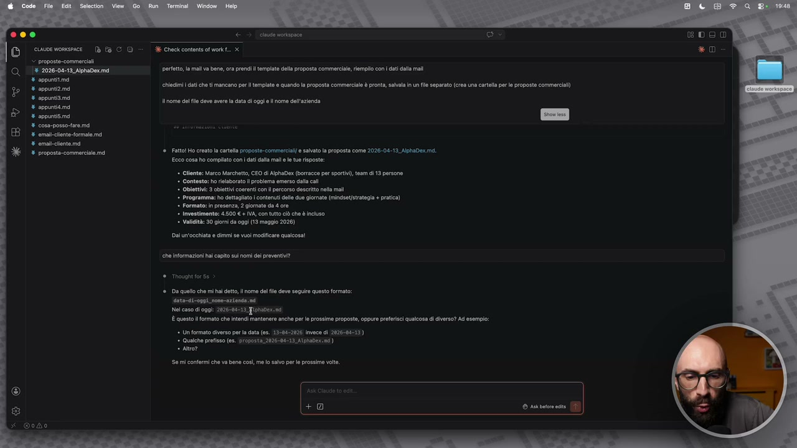

**Testo a schermo (OCR):** cioe womsnice | [è Ea CD E Check contents of work. x eretto, la mali va ben, ora prendi empiato dll proposta commercial, iemplo con dti ala all chlecimi dati che ti mancano perl template e quando la proposta commerciale è ronta, salva in n le separato (era na cartela pere proposte commercial) li nome del fl eve avere a data di oggi nome dell'azienda _AphaDec im ‘Ecco cosa ho complato cn dati al mal e tue risposte: Cliente: Marco Marchetto, CEO di AphaDex (orrcco per sport), iam 1 persone Contesto: ho elaborato I problema emerso dll c Obiettivi: obiettivi coerenti co l percorso deserto nella mai Programma: ho dettagliato | contenuti ele due giornate (rndeet{sratega + pratica] Formato: n presenza, 2 gione da 4 re Investimento: 4.500 € +IVA, con tutto cò che è incluso Validità: 30 gioni da oggi 18 maggio 2028) Dal unvocehita e dimmi se usi mogiicae qualcosa che intormazioni hi capito sui nomi de prevent? © Tnought forse ® De quelo che mi ha etto nome dl fl deve seguire questo formato: sta-di-oggi nomeazionda Nel caso di ogg: 2026-34-13. Fiobitexini È questo formato che intendi mantenere anche pere prossime proposte, oppure preferisci qualcosa di diverso? Ad esempio: Un formato diverso per dota (e. 13:04:2126 iveco al 2016-01-13) Qualche preso (es. raposta_ 2026-04-13 Alphadex:ss) «Alt? Se mi confermi he va bene cos, mo o slvo pere prossimo vole

> Tra l'altro l'ha messo pure nel formato quello facilmente leggibile, no? Anno, mese, giorno. Io gli dico, se mi confermi che va bene così me lo salvo per le prossime volte. A questo volevo farvi arrivare. Ora gli dico, questa informazione te la devi ricordare per sempre, sì? Ricordalo per sempre. Perché? Perché significa che io adesso ho tutti i preventivi che farò. Non gli dovrò dire le prossime volte allora, metti il nome della data poi metti trattino, metti il nome dell'azienda. Questa cosa lui se la salverà adesso in un file e questo file è il file che andrà a utilizzare, ok? Quindi prenderà questa informazione. Vedete? Dentro la memoria. Vi ricordate il famoso file della memoria? Ora nella memoria lui si ricorda questa cosa qua. Adesso lo stiamo facendo in modo molto casuale, anche un po' disordinato ma solo per farvi capire. Poi dopo questa cosa la organizziamo, ok? I miei corsi sapete come sono fatti ci arriviamo un po' alla volta altrimenti vi sopraccarico di informazioni. Questo è per farvi capire come lui lavora.

## [00:14:00] Schermata 14 _(periodic)_

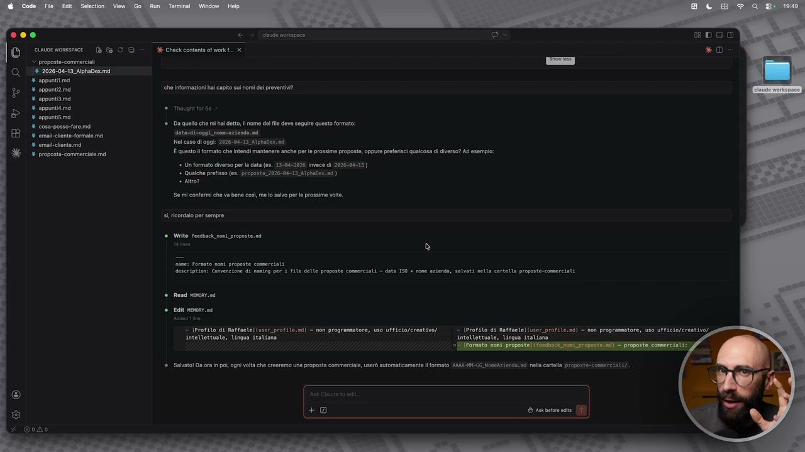

**Testo a schermo (OCR):** DOO O cuci BaCcO: * proposte:commerci 1% 2026-08-12 Aprapotind + sopuntiima * appunti * appiniina 4 appunta + mougn forse % appuniima + cosspossotre mi amai-cbent- formale md emal-ebenta md + proposta commercia che informazioni hai capito sui noi de preventivi. ® Da quelo che mi ha etto nome dl fl deve seguire questo formato: nta-di-oggi_none-azionda. n Nel caso di ogg: 2026-04-13. Alpbadex.nd È quoto formato che intendi mantenero anche per e prossimo proposta, oppure preferisci qualcosa di diverso? Ad esempio: Un formato diverso perla ata (s. 13:94-2026 invece di 2026-04-13) Qualche preso (es. rposta. 2026-44-13. AlpbaDex.id ) + Altro? ‘Se mi confermi he va bene cod, me o salvo per ie prossimo \o 15, ficordao per sempre ®. Writa rechaeiponi_proposte. ni fame; Forato pen proposte comerciati ‘eseription: Convenzione di nanna per 1 file delle proposte comurcioli — dita 1SO + none azienda, salvati nella cartella proposte-comerelali — IPrOMITO di Ratfsete] (user profile.n6) = non programatore, uso ufticio/erestivo/ | © [Profilo di Raffaele) (uier profile.sd) = non programatore, uso ufticio/crestivo/ intellettuale, lingua italiana intellettuale, Lingua italiana ‘Salvato Da ora poi, ogni ache creeremo una proposta commerciale, userò automaticamente formato AAA-HHE-GG NGneXt en: nola carta pestare). si

> Significa che se io adesso gli dico ora nella stessa cartella copia, che ne so, cinque volte il preventivo e non cambiare nulla nulla se non la data metti i prossimi cinque giorni e il nome dell'azienda inventali tu. Questa cosa non ha senso, ok? Mi sto inventando cinque preventivi è solo per farvi vedere come adesso che ha capito quella regola in un modo super veloce possiamo fare delle cose avanzatissime. Qua gli dico sì, procedi, yes. E quindi adesso se io mi apro la cartellina qua e sono in proposte commerciali, vedete? Vabbè, anzi vediamo la regola.

## [00:15:00] Schermata 15 _(periodic)_

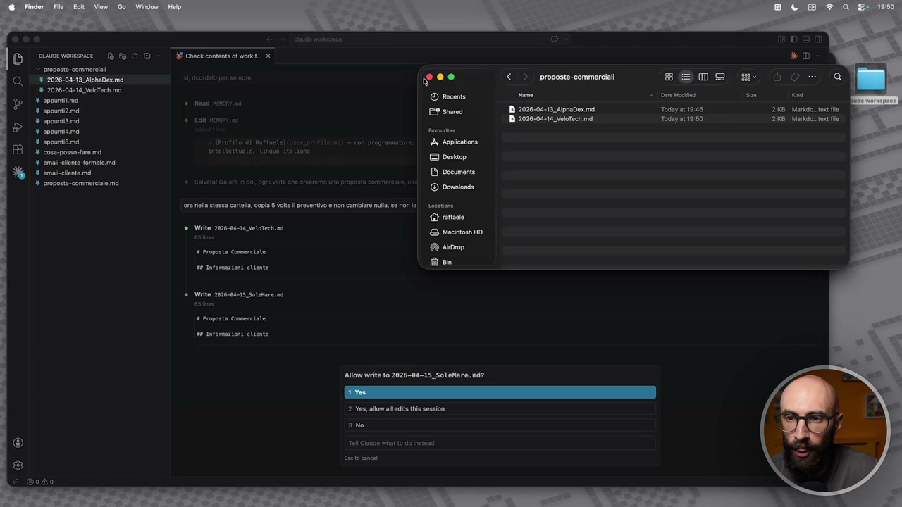

**Testo a schermo (OCR):** cune momsnice | [è fa C © E Checkcontentsof wonkf. x Lione seri - 1 2026-04-13 AphaDex md 9 8 2020-06-14 Velotta # appuntit.md ss + opinion 208 Marotto + sopinitime 206. Mako fl % appriimi % appnima + corposo re è erede rm mi è crei cenni % proposte commercia ora nella stessa cata, copia 5 ole l preventivo e non cambiare nua, se non io è Write 2026-06-1 Vetotechini 00 totorazioni cente ® Write 2026-06-15 sotetare. nd 16 tntormoztoni cliente Allow writ to 2026-04-15_Soleltare. nd? 2 Vos, allow all its this session ano

> Vediamole qua sulla sinistra. Gli dico yes. Le vedete qua che si stanno creando qua qua dentro. Yes. Lo sta autorizzando. Vedete già mi sono scocciato di dare yes tutte le volte. Quindi quando prendete confidenze potete dire sì, vai, fallo per tutte le sessioni. Yes. Se li sta inventando questi nomi, ok? Quindi ci ha messi i vari giorni. 13, 14, 15, 16, 17, 18. Belotech, Solemare, Nordvento, Briva, Group, Zeta, Lab. Questa roba non serve. È solo per farvi capire che adesso conosce quella regola, ha quelle informazioni di contesto e lo farà per sempre così. Immaginate questa cosa nel vostro caso reale, ok? Io ho fatto per i preventivi. Immaginate che questo è, che ne so, le minute di una sessione. Immaginate che sono delle presentazioni per i clienti, delle proposte commerciali, delle idee sulle quali state lavorando. Quello che volete voi, ok? Vi faccio dire un altro caso, e poi finiamo con questo modulo che altrimenti è troppo lungo. Sono, immaginiamo questa casistica. Sono andato ad una conferenza, a questa

## [00:16:00] Schermata 16 _(periodic)_

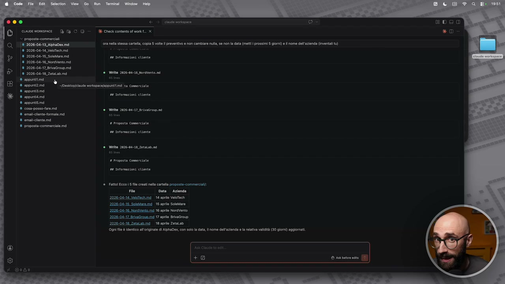

**Testo a schermo (OCR):** 00 E @ Guoevomine @ f C O + M crecceomamsat voti. x * propost-commerhi 1% 2026-08-12 Aptaporind na stessa carta copi vlt prevent e non cambiar ul, 5 non li ta (et rossi im) loi alzi vert 1) 1% 2020-08-14 vote = | 2025-00-18 sota md 8 2026-08-48, Nanto md |% 2026-04-17 BrivaGraup.md |# 2026-04-18, Zetatab.md. ® Write 2026-04-16 Nordvent Vampintimi g tone + appuntizina | ® pescoiiae mtc ta Comerciate * appunta 2 appunti ma © appunta gia) Write 2ezo-06-17.rivacroo.nd 1 ma-ceteSomale md È © email % proposta commerciale md 00 interazioni cliente 16 tatormazioni cente Prep Comerciate 18 informazioni cltente Writo 2026-00-28 eta. 2 Proposta Comerciate Fato! Esco 5 fl creati ela carta propostecommercial: Fio Data | Azienda 2026-04-14 Valafechimd 14 pilo Valotech 2026-04-15. Solare mé 15 pre Sere ‘2028-04-18. NordVento md 16 apil NoraVento ‘2026-04:17 Bruno mg 17 apre BrtaGrovp 2026-04-18 Zotalabimd 18 pile Zotatab gni fl è identico al'aiginal di phaDex, con slo la data, nome dell'azienda e la relativa valità (30 gio) aggiornati.

> conferenza ho preso degli appunti, ok? Ho seguito vari interventi, ho messo appunti numero uno, talk di apertura, il marketing nel 2026, e ho segnato solo un po' di note. Così, il marketing non è più solo comunicazione e esperienza. Nota mia, questo lo posso usare con il cliente di Milano. Vedete, sono proprio cose inventate. Ho fatto un esempio di Patagonia, proprio quello che succede in una conferenza. Appunti due, sono andato a vedere un evento dove parlava HubSpot sulla content strategy, ok? Poi appunti tre, c'è stato un workshop nel pomeriggio sulla marketing automation, ha parlato MailChimp. Appunti quattro, era un panel, c'era Nike, c'era Banila, c'era una banca che non ricordo il nome, hanno dato delle cose. Appunti cinque, sono io che scrivo a un altro evento dove sono andato, in questa conferenza c'era uno di DeepMind, mi sono insegnato un po' di cose nella relazione tra intelligenza artificiale e marketing. Questi file sono tutti inventati, ok? Questa cosa sia chiara. Sto facendo un altro esempio per farvi vedere, guardate adesso cosa mi invento. Cioè, ero a questa conferenza,

## [00:17:00] Schermata 17 _(periodic)_

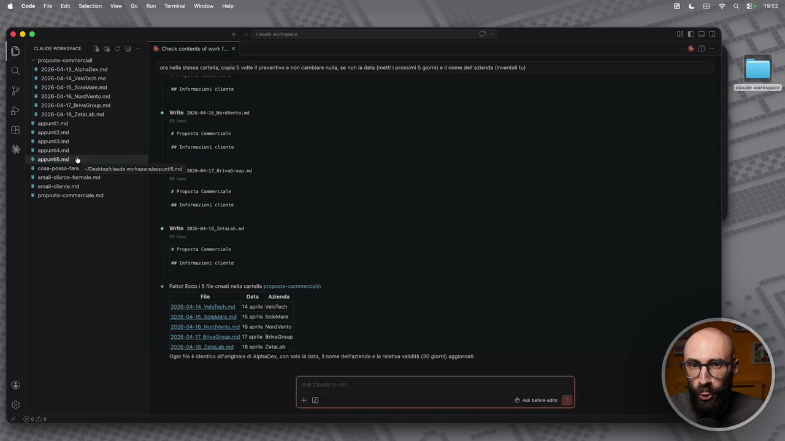

**Testo a schermo (OCR):** 000 G O guorvomane DC E Check contents of work. x > proposte commerciali ‘8 2026-04-13 AphaDecimd ora nella stessa cata, copia ole l preventivo e nco cambiare nua, e non la data (mett | prossimi ion) I ome dall'azienda (venta tu) # 2026-04-14 Veitechmmd Ù % 2026-04-16. SoloMore md 00 informazioni cente + 2026-04-10. NoreVento.md % 2026-04-17 BrvaGroup.md 8 2020-04-18. Zetalabimd Wi 2026-06-16 Narva. nd % sppuntitimd ci % appunta ma 2 Proposta Comerciate * appuniima % sppuntit.md + appuntiima di % coss-posso-fara. -.Deskogielude werkspaceleppunSimd 026-017. 0r1vGrosp. ni "6 omai clont formale md x % omalietonte ma % proposta commerciale md 18 informazioni cliente 2 Proposta Comerciate 10 informazioni elle Wi 2026-06-28 eta. Proposta Comereiate Fato Ecco 5 flo creati ela cartella proposte commercial: CI Data | azienda 2028-04-14 Valofechmd_14 pile Valotech 2026-04-15. Solare mé 15 pre Solero 2026-04-16 NoVanto.nd 16 apri Nordvento ‘2026-04-17 BrynGroup ma 17 apre BriaGroup 2026-06-18 ZetaLabemd 18 apro Zotalab gni fl è dentioaloiginal di haDes, con slo a data, I nom dell'azienda e la relativa valità (50 gii) aggiornati.

> ho preso degli appunti, ok? Ho scritto delle cose così sgrammaticate al volo. Gli dico, durante una conferenza di marketing ho preso un po' di appunti e li ho buttati nel workspace. Non gli dico niente, non gli dico come si chiamano i file, che sono cinque, lo dedurrei in automatico perché vede appunti uno, appunti due, appunti tre, poi dopo in realtà ci organizziamo bene con le cartelle perché nessuno lavora in modo così disorganizzato. Gli dico, siccome sono tutti disorganizzati, ok? Disorganizzati, voglio che tu mi faccia un unico file con un riassunto dei punti principali, ok? E poi gli diciamo pure una cosa del genere, facciamo pure così, nello stesso file mettimi una sezione finale con i to do, quindi le attività da fare, ok?

## [00:18:00] Schermata 18 _(periodic)_

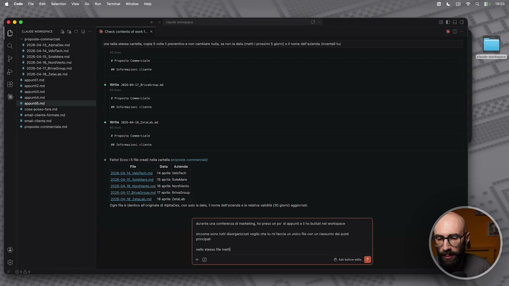

**Testo a schermo (OCR):** © guorvonenc Db fa CO - dk chectcomensotmonti. x proposto. commercai 8 2026-04-13. AphaDecimd ora nella stessa cata, copia ole l preventivo e non cambiare nua, e non la data (mett | prossimi gio) Il ome dell'azienda (aventi t) % 2026-04-14 Velotechmmé % 2026-08-16 Solero md + 2026-04-16. NoraVento.md # Propsta Comerciate + 2026-04-17 BrvaGroupimd 00 infornzioni cltnte % 2026-04-18 Zotatab md # appuntiima % appunta md Write 2026-04-17 rivarop * appuntiime sin % appunta 8 Propesta Comerelate % appunti % cosa-posso-fare me % emali-clonte-formale md Vira Writo 2026-06-10 Zetata.nd 3 proposta commerciale md ia 2 eropesta Comerciate Fatto Ecco | fl creati ela cata proposte commercial: CS Data | Azienda 2028-04-14 ValaTechimd 14 pile Valotech 2026-04-15. Scierire. md 15 apre Soeare ‘2028-04-18. Nord Vnto md 16 apile NordVento 2026-04-17 Briva Grow md 17 apre BrvaGroup ‘2026-04-18 Zetalab. md 18 pre Zettab gni fil identico al'oiginal di haDex, 00 slo a data, nom dell'azienda la relativa vlità (30 gii) aggiornati. durante una conferenza di mrkatin, ho preso un po d sppunti e lo buttati ne workspace some sono tutt disorganizzati voglio che tu mì facca un nico le con un riassunto dl punti principali net stesso le met +0 © at)

> Quindi attività da fare e step successivi. Invio. Nient'altro. Cosa facciamo? Questo non è più un prompt inteso nel vecchio modo, ma gli diciamo quello che vogliamo ottenere. Riaggioniamo già in termini di file, ok? Quindi lui adesso va, si legge questi cinque file di appunti, e io qua sto facendo degli esempi con numeri di file molto piccoli, cioè voi immaginate che non avete cinque file di appunti, ma immaginate che avete una cartella con 100 presentazioni che avete fatto nella vostra vita. Cioè capite quella roba che valore ha? Immaginate che avete una cartella con 15 numeri della vostra newsletter che avete inviato e volete utilizzarle per farci qualcosa. Immaginate che, che ne so, scrivete dei libri, no? Qualsiasi cosa avete diventa una base sulla quale lavorare. Gli dico sì, scrivimi questo file, conferenza marketing riepilogo. Vedete me

## [00:19:00] Schermata 19 _(periodic)_

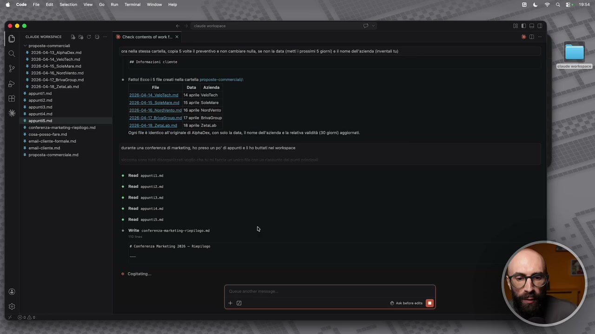

**Testo a schermo (OCR):** # 2026-04-13 AphaDecmd % 2026-04-14 Veltechmma % 2026-08-16, SoloMare md + 2026-04-16 NoraVento.md % 2026-04-17 BrvGroup.md % 2026-04-10 Zotatab md # appuntiima % appunti md # appuntiime % sppuntitmd % appuntita conferenza. merkating.replogo ma % cose-posso-faremd % omai cent-formale md % oma-esonto me * propost-commerciaie md E Check contents of work. x ora nella stessa cata, cop volte preventivo e nc cambare nua, e non la data (mt prossimi ion) l ome dal'aienda inventa tu) Fato Esco 5 fe creati nola cartella roposto«commerciali Fio Data | Azienda ‘2026-04-14 VeloTech md 14 aprile Vlotech 2026-04-15. Solare. 15 pre SoeMare 2026-04-16 NordVento.m 16 apre NordVento ‘2026-04-17 Bra Groum.mA 17 apre BraGroup ‘2006-04-18 ZotaLabimd 16 pie ZetLab gni fl è identico al'oiginal di phaDex cn slo a data, nome dell'azienda e la relativa vlità (30 gii) aggiornati. urante una conferenza di mrkatin. ho preso un po' dî sppunt e l ho buttati ne workapace Rend anpntii.ni Rendi sopunti2ini Rendi sppntizini Read sopntitini Read appntisind Wta conferenzsarbeting-riepilog0. 1 Conferenza marketing 2026 — Riepiloyo

> l'ha creato qua dentro perché adesso abbiamo una sola cartella, non stiamo lavorando con le sottocartelle e così via. Ci clicchiamo sopra, dice guarda te l'ho organizzato, te l'ho organizzato in sezioni, ecco qua, vediamolo sempre nella modalità anteprima che è molto più pulita, quindi mi ha fatto delle macro categorie, ok? Quindi ha unito bene le cose che erano sparpagliate nei cinque file. Vedete qua me l'ha separato i dati, vediamo la sezione qua, la to do finale, eccolo qua. I prossimi passi. Perché? Perché io magari negli appunti avevo scritto devo scrivere a Sara per questa cosa, devo preparare un pitch per il cliente di Milano. Vi ricordate perché nel file numero 1 dopo tutto questo delirio c'era scritto nota mia, questo lo posso usare con il cliente di Milano. Allora lui nelle attività di to do, dove sta, eccolo qua scusatemi, in questo quadro è il riepilogo, nell'attività delle cose da fare mi ha scritto anche fare questa presentazione per il cliente di Milano. Questa roba è potentissima. Di nuovo fate un lavoro di astrazione, sono esempi

## [00:20:00] Schermata 20 _(periodic)_

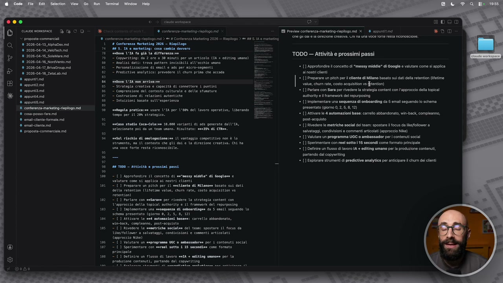

**Testo a schermo (OCR):** proposto. commerciali Y 2026-04-18 AphaDecmd % 2026-04-14 Veltechmmd % 2026-04-16 Solero md % 2026-08-16, Norsvento me + 2026-04-17 BrvGroupimd % 2026-08-18 Zetatabmd % sppuntitimd % appunti md * appuntiime % appunta seco ciau orse * ‘ conferenza. martacing-riepioga md 8 conferenza marketng-epiogo md > = & Contaranza Market 2026 — Riplogo > SS. A e marketing ‘# Contarenza Narketing 2026 — Riapilogo #8 5. 1A è marketing: cosa canbia davvero sedove L'IA fa giù la difterenzazse — Coppuriting: da 2 ore a 38 minuti per un articolo (IA + editing unono) — Analisi dati: trova pattern invisibili all'occhio umano — Personatizzazione di enail e ads per micro-segnenti — Predict.ive analytics: prevedere 1ì chum prina che accada sido L'TA non arrivaiee iva e Capacità di connettere 1 puntini Lì contesto culturale e celle sfumature © costruzione gi relazioni autentiche — intuizioni basate sull'esperienza sotgola proticasee usare L'TA per l'8ON del lavoro operativo, Uberando tenpo per il 20% strategico. vecaso studio Coca-Colarsa 10,090 varianti di ads generate dall'1A, Selezionate poi d3 un teaa umano. Risultato: am35% di wa, veSit rischio di onstogazione:se il vantaggio competitivo non è le Strumento, na {1 contesto che gli dal e la direzione creativa. (hi ho na voce forte resta riconoscibile. 20 000 — Attività e prossini possi — TI Approfondire Îl concetto di sa'messy miste” di Googlese è Valutare cone si applica al nostri clienti — 1) Preparare un pitch per SU eeeliente di Nilanoes basato sui doti delta retention (Lifetime value, chum rate, costo acquisition vs retention) 0) Partore con sesarana per rivedere la strategia content con l'approccio della topical suthority e il framework dell repurposing - {1 Trotenentare ua sssequenza di onboardingee do 5 coril seguendo lo schema presentato (giorno è, 2, 3, 8, 12) 11 Attivare le sed automazioni basemm: carrello abbandonato, Minback, conpleamo, post-acquisto — {} Rivedere le semetriche sociale del tean: spostare il focus do Likesfoliower a salvataggi, condivisioni e comenti articolati Capproceso Nike) =) Vatutare un seprogramna USC 0 anbassadore» per i contenuti sociat - 1} Sperinentare con surmet sotto f 15 secondise come forsato principate 21) Definire un flusso di lavoro sta + editing unanome per lo Produzione contenuti, partendo dal coppuritina I Provi conferenza markating-ioplogo ma x # sppontitma ‘ne gu ur e 1 irezione creta. Uni na una voce Torte resta nconoscioie. TODO — Attività e prossimi passi * {1 Approfondire il concetto di mesey ide” di Google e valutare come si appica ai osti centi {) Proparae un pitch per cllnte di Milano basato su dai ela retention (fotina val, ch rat, costo acquisto vs ention) * {] Partre con Sara pr rivedere a stratgia content on l'aprocio dll topica autor I camemork del epurposina + {) Implementare una sequenza di onboarding da 5 ema seguendo l schema presentato (giorno 0,25, 8,12) + LI Attore le 4 automazioni base: corre abbandonato, win-back, compleanno, postacquisto {Rider e metriche social dl tam: spostare locus o aiolower a salvataggi consoni e commenti tolti approccio Nike) * {] Vatutare un programma UOC 0 ambassador peri contenu socia * {] Sperimentaro con roi sotto 15 secondi come formato principle {1 Defire un fuso lavoro IA + editing umano pera produzione content partendo dl copyiritina * {)Espiorar strumenti i predietive anlis er anicipare l chum ei centi

> inventati, immaginate com'è questo, potete applicarlo nel vostro lavoro.
