# Usare il terminale senza paura

> Documento generato automaticamente: trascrizione e screenshot sincronizzati del video-corso.

## [00:00:00] Schermata 0 _(start)_

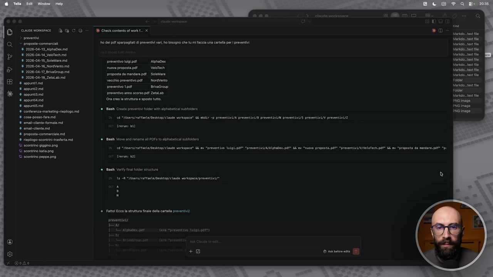

**Testo a schermo (OCR):** cisterna ce nomsnice | [fa C © > E Check contents of work. x > proventi > proposte-commeriali % 2026-04-18 Aptadecmd 8 2026-08-14 Valtechmd % 2026-04-16 Solaro md ‘preventivo higipaf - Aphadex + 2026-04-16. NoraVento md Fossa nai 4 2026-04-17 BraGroupimé AT SETTI ss > Vasca preventivo 1904 Brvagroup * appuntiaimd preventivo anno scorso pf ZetaLab Y appunta Ora creola sutura e sposto tutto. % appunti conferenza: marketing riepilogo. md + cosa-posso-taremd CA "Iisers/raffnete/Deshtop/clade vorkspace” La ndr -p preventivi/a preventivi/B preventivi/i prevetivi/s preventivi/ preventivi/E 8 emaiclent- formale % amante md % proposta-commercile. md % rieplogo.scontii-vasterta ma ant Move and rename al PDFS to abhabetica subtlders ho el pal aparpagiti i preventivi vari, ho bisogno che ti mi faccia una carte pr prevent Bash Crsate proventi fldr with alphabetical suore rerum: 61 © scontrino giagino. png 8 "Aisrs/aftsete/Dasktop/ claude vorkapaca” Gn “preventivo ubgi.ps “prevent vi/A/A\piaex.pef® i me “nuova proposta. pale “preventivL/V/Velorech.pot® Gi mv “proposta da mndare.pet* "pr & ona tool once DI prat pl DI n ‘© scontrino peppe ng rerum 82) Bash Vari fa flsr struct 1 A Abba) aftaete/Desktop/ claude varkspoce/preventiv/® Fatto Eccola struttura finale del carte proventi preventsety wu 1 ES Atheist e pres LL)

> Adesso che abbiamo visto anche come lavorare con i file, voglio far vedere un po' di cosine interessanti per muovervi meglio dentro questa interfaccia. Abbiamo già visto all'inizio come è strutturato VS Code, però voglio far vedere un altro paio di cose che potrebbero essere utili. Ovviamente qua abbiamo tutti i nostri file sulla sinistra. Questa è la sessione nella quale stiamo lavorando. In qualsiasi momento, in questa sessione, possiamo chiuderla. Questo è un consiglio che io vi ho sempre dato, anche quando si utilizzano strumenti più semplici come c'è GPT, Gemina, iCloud e così via, cioè di non portare avanti le chat per troppo tempo, soprattutto se dentro la stessa chat iniziamo a mischiare gli argomenti. Ovviamente fino ad ora sono degli esempi molto semplici, quindi non succede niente di male. Però, per farne l'utilizzo fatto molto molto bene, chiudiamo la sessione quando abbiamo finito di lavorare su qualcosa. Se vogliamo aprire un'altra, c'è il pulsantino che abbiamo qua sulla sinistra, che vi ricordo, oppure c'è anche il pulsante sulla destra, in alto, qua sopra, tutte le volte che c'è un file aperto. Per esempio, se adesso chiudo questa sessione qua, guardate, la chiudo un attimo,

## [00:01:00] Schermata 1 _(periodic)_

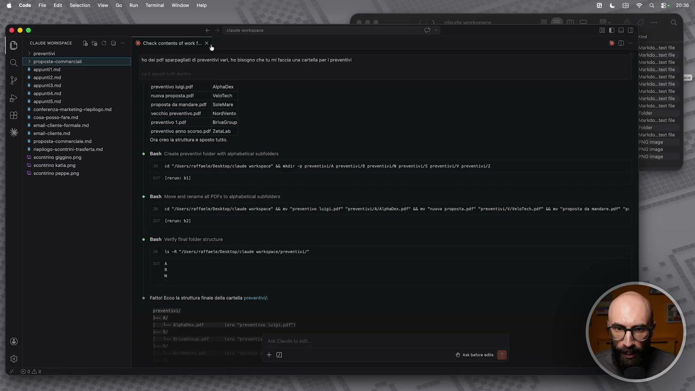

**Testo a schermo (OCR):** 005 E cuor nonsmiee Tè fo O © > 3 Cickcemeniotmont. XL ini TIZI]. ho get pet sparpagati di preventivi var ho bisogno che tu mì faccia un crtell per raven % appuntamd % sppuntiamd preventivo higipai -— | Nphadex % spunti nova proposta di VeloTech ; henso s5, proposta da mandare pa | SoleMare SEEN vecchi preventivo. pd NordVento È preventivo 1901 BrvaGreup 8 rnali-cbente-fomale ma % emadcente ma Preventivo anno scorso pf ZetaLab % proposta commercial md Ora evo struttura e sposto ttt. ‘ ripiogo.scontii-tasterta ma ‘ scontrino piagino. png "scontrino ati.png 9 "qusrs/rattnete/Desktop/claude vorkspce” Li mai -p prevntivi/a preventiv/B preventivi/i preventivi/s preventivi/i preventivi/Z © sconino peppe png Bash Create preventivi fldr with alphabetial subtoiere rerum: 51 ast Move and roname al DFS to aphabeticai subtlders 8 “Asrs/ratfnee/Deshtop/ claude vorksace” Gn “preventivo \uipl.pd* “preventivi/A/Alphaben.pd® Gi mi “niva propostapdl° “preventivi/v/Velotech.pa* di mi “proposta da nndare.pdt* “pi rerum 2) ant Vai na flor structure 16 A “vdsers/raftaete/oesktop/ claude vorkspace/preventivi/® Fatto Eccola struttra fiale cell carta proventi; preventivi w | CIS ALBA PITTT e rsi

> qua ovviamente mi scompare il pulsantino, però mi basta cliccare su un file qualsiasi e mi compare il pulsantino per avviare una sessione di Cloud Code. E qua c'è la sessione di Cloud Code. Dentro VS Code potete strutturarvi come volete voi le sezioni. Vedete, mi posso dividere per esempio l'interfaccia in due, mi prendo questo e me lo sposto di qua, e quindi c'ho il file aperto da un lato e la chat aperta dall'altra. Oppure posso tenere nello stesso pezzo, ma sono due schede separate. Questo in base a come vi piace lavorare. Ve lo mettete uno sopra l'altro, diciamo in orizzontale e in verticale, in base a quello che preferite voi. Altra cosa interessante qual è? Qua noi abbiamo la chat nella quale stiamo scrivendo. Ma ci avete fatto caso che la chat però ha un po' di pulsantini? Allora, vediamo cosa sono questi pulsanti. Questo in basso a destra ci dice la modalità nella quale stiamo lavorando. E cioè, qua vi farà tre tipi di modalità.

## [00:02:00] Schermata 2 _(periodic)_

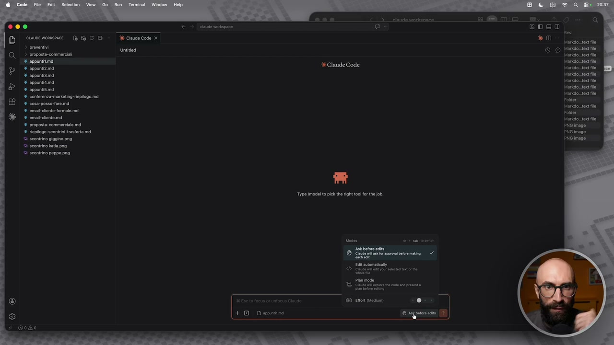

**Testo a schermo (OCR):** D00 cioe wonsnice | [Ea CD E Cinuse code x > proventi di > proposte commerciali 8 appontimd % appunta md % sppuniamd % appunti % appunta ‘8 conferenza markating.replogo md + coss-posso-fare.md 8 emal-clnte formale md amante mi ‘4 proposta-commerciale md .iepogo-scontintrasferta md ‘8 scontrino piggino. png "scontrino katia ong © sconwino peppe png Type fmodel o pick the right ol or the ob. Asker et 5; rente E tomaia Pin mos Sii in et Etort (Medium) ® © igpuiice 0

> Chiedi, sempre, quando devi fare una modifica. No, avete visto, posso modificare questo file, posso scrivere questo file, posso cancellare questa cartella e così via. File e modifiche in automatico, ok? Quindi quando vi sentite abbastanza sicuri da farlo procedere in automatico. E poi c'è questa modalità, modalità pianificazione. Questa è una delle cose più interessanti di Cloud. Cioè Cloud ha anche una modalità pianificazione. Prima di fare le cose, gli potete dire di pianificarle. Quindi fammi un piano, mostrami il piano, io te la provo e tu lavori. Ok? Quindi è una terza strada rispetto a modifica tutto, chiedimi sempre di modificare. Però questa modalità di pianificazione è pensata soprattutto per il codice. E dopo vi faccio vedere un modo con il quale invece ci facciamo una nostra modalità di pianificazione. Pensata non per il codice, ma per chi appunto fa lavori d'ufficio, lavori di intelletto, lavoro creativo e così via. Quindi qua fondamentalmente possiamo scegliere questa modalità. Poi c'è anche l'effort, ma l'effort ve lo faccio vedere perché sta pure di qua.

## [00:03:00] Schermata 3 _(periodic)_

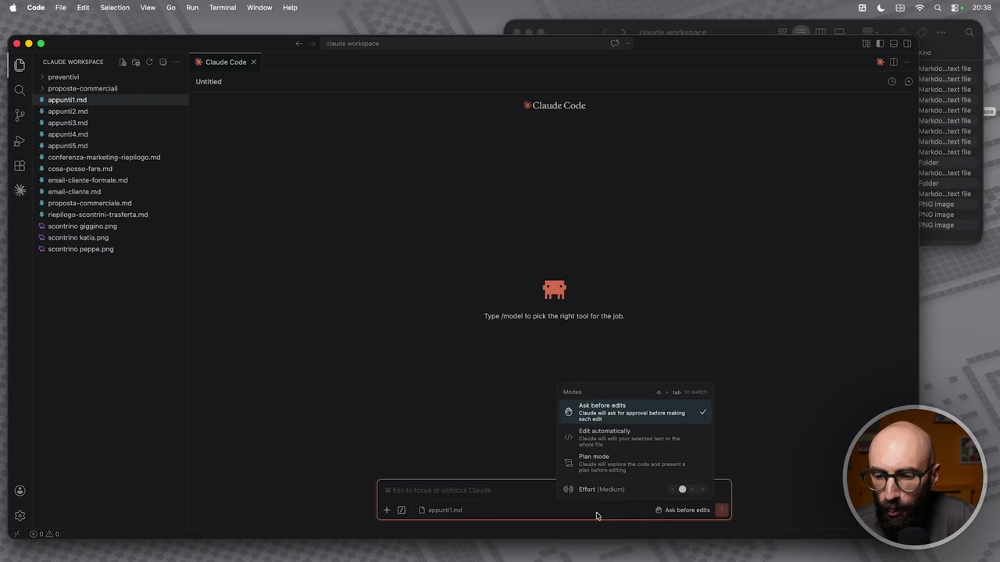

**Testo a schermo (OCR):** 000 cvoe momsmice | [a Ea CD E Claude Code x > proventi rasa > proposte-commercili % appunti * appuntzina % sppuniamd % appunti * appuntiime ‘4 conferenza markating:replgo md % cosa-posso-tae.md 8 emal-lenteSormale md 8 maia md ‘4 proposta-commerciale. md . epiogo-scontintrasferta md "scontrino piagino. png "scontrino ati.png scontrino peppe prg Type [model o pick the right oo] o the ob Asker et Sine nt agri tr mano Et tomaia Pinmode Sinti nin temete “tori (Medium) . i) S DISSST)

> Poi abbiamo qua i file caricati nel contesto. Quindi in questo momento, siccome abbiamo aperto il file appunti 1, ve lo ricordate? Io gli posso dire se questo file lo voglio utilizzare o meno. Quindi ci clicco sopra e gli dico per esempio, vedete qua c'è l'occhio barrato, gli dico non usare questo file. Oppure diciamo lo ha build e gli dico questo file è il file sul quale devi lavorare. Quindi diciamo è quello che in questo momento è il file, ma semplicemente perché ce l'ho selezionato qua. Qua abbiamo il pulsantino più che mi dice fondamentalmente carica un file dal computer, vedete? Quindi qua ci sono dei file, che ne so, questo è uno degli scontrini dell'esempio di primo. E gli dico semplicemente, che roba è sto file? Ovviamente questo non è un esempio particolarmente wow, perché è una cosa che facciamo anche con chat gpt diciamo ormai da diverso tempo. Quindi diciamo non è niente di particolare, però per farvi vedere che possiamo caricare i file. Ci dice guarda è uno scontrino fiscale del ristorante al Colosseo, bla bla bla.

## [00:04:00] Schermata 4 _(periodic)_

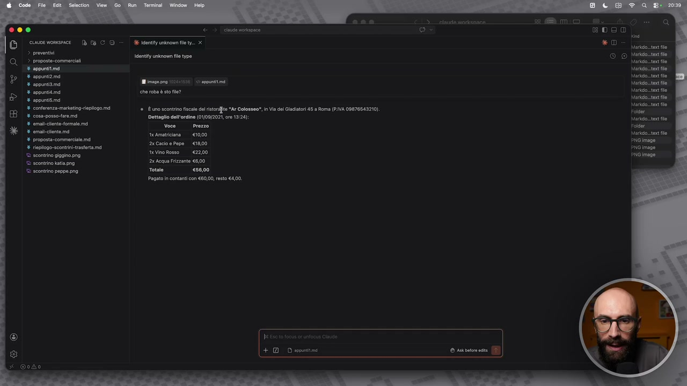

**Testo a schermo (OCR):** 0005 IO cura Baco- x msreironien x > proventi 2 rasi ent union file type % appunti + sppintzima sa ri) Fei % appunti che roba è sto e? % appunta . conferenza-markating:replogo md ®. È uno scontrino fiscal del stria "Ar Colosseo", in Via oi Gladiator 5 3 Roma (PIVA 09878543210) % coss-posso-tara.mi Dettaglio dell'ordine (0109/2021, ore 13:24); 8 emal-tente formale md SS i Coni send x Amatriciama | €10,00. pre Se 2a Cacio e Pope _ €18,00 Pine rear teVino Rosso €200 Fremtilogue 2x Acqua Frizanto €600 © scontrino peppe png te [eso Pagato in contanti con 80,00, resto €400. he + DO Depia

> Quindi diciamo questa la chiudiamo, riapro un attimo una sessione di Cloud Code per farvi vedere. Poi abbiamo la possibilità di prendere file dal contesto e quindi mi dice prendi una cartella o più cartelle o dei file dalla conversazione per metterne nel contesto, vedete? Quindi qua abbiamo tutte le cose che sono qua sulla sinistra e quindi gli posso dire che io voglio in particolar modo lavorare sul file appunti 4. E qua gli dico che contiene sto file. È un po' come se avessi fatto la stessa cosa caricando un file dal computer. Ovviamente ne posso selezionare anche più di uno. Mi dice guarda il file contiene degli appunti su un panel con queste tre aziende, Nike, Barilla e una banca non specificata. Quindi là diciamo abbiamo caricato un file nel contesto. Poi possiamo dirgli di cercare su internet. Questa è una cosa che fino ad ora non abbiamo visto perché non è servita, ma io posso abilitare browser, browse the web e gli posso fare una ricerca online se dovesse servire.

## [00:05:00] Schermata 5 _(periodic)_

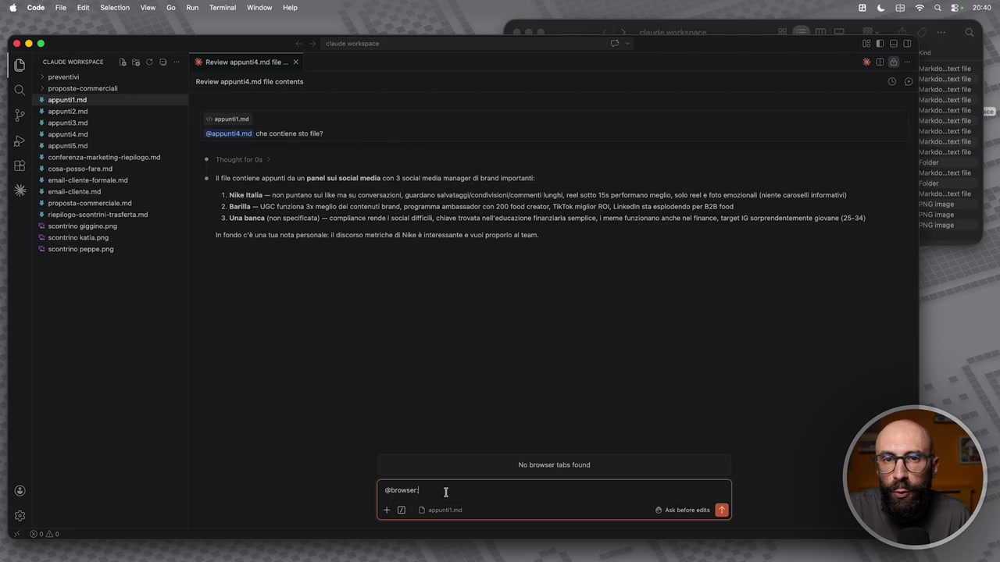

**Testo a schermo (OCR):** D00) IO creme deco > preventivi > proposte-commerciali ® appunti # appunti md % appunti md SER, * appuntiimd Gappuntiaimd! che contiene sto fe? % appuntiimd % conferenza» markating-rieplogo md ‘© Thought foro. * cosa-posso-fare. md ‘11 filo contiene appunti da un panel sui social media con 3 social media manager di brand importanti % emal-lenta formale md omai-cionte md 4 Mk talia — on puntano su ka ma su conversazioni guardano saatagglcondiiiari/comment lungi, el sotto 15 peformano meglio, slo ee foto emazionali niente caroseliintormati) % proposta commerilemd 2. Barlla —UGC funziona dx meglio del contenuti brand, programma ambassador con 200 food creta, TIKT& miglior ROL, Linka sta espodndo per B28 {od 3. Una banca (non specificata) — complance rende oca fi, chiave trovata nell'educazione finanziaria semplice, meme funzionano anch ne finance, target 16 sorprendentemnte giovane (25-34) ieiogo-scontintrsterta md scontrino giagino. png rsa infondo e una tua nota personale: discorso metriche di Nike è interessante e vuol proporlo l team © scontrino peppe png. ebromeri I + DO Dorina

> E poi c'è questa parte qua che è una parte estremamente interessante, ma forse è meglio farla in un modulo separato. Vediamo anche come si usa la ricerca web, altrimenti ve l'ho detto ma non ve l'ho fatto vedere. Abilito browse the web e poi scrivo il prompt come lo facciamo ormai sui chatbot. Quindi gli posso dire che tempo farà a Londra nella prossima settimana. Ovviamente anche qua esempio molto semplice solo per far vedere che si collega internet e che può fare la ricerca. Poi dopo invece quando inizieremo ad utilizzarlo in modo più avanzato vedremo come la ricerca poi ci aiuta. Perché magari stiamo preparando del materiale per una presentazione, perché magari stiamo preparando una ricerca per dei contenuti che dobbiamo pubblicare online. Perché magari dobbiamo fare, non lo so, stiamo scrivendo un report e così via. In questo caso ha fatto semplicemente una ricerca su quello che abbiamo detto noi, quindi quella sul metro.

## [00:06:00] Schermata 6 _(periodic)_

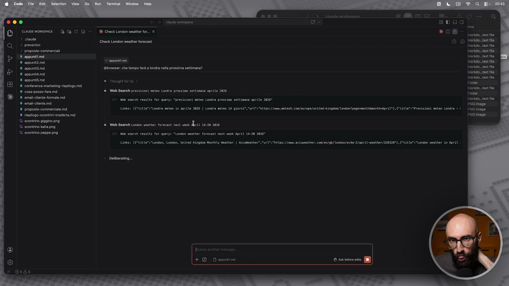

**Testo a schermo (OCR):** 000 cinte orisoace O crcrcma Becco DES > prevent > proposte.commeriali È sppuntitim * sppuntizima ia) % appunta Ebronser: che tempo frà londra na prossima settimana? % appunti * appuntima ® Tnougnt for os % conferenza markating:replgo mi % cosa-posso-fare md Find ee ueà search results for queryi "previsioni meteo Londra prossia settimana aprile 202° % omai-chente ma a era Links: (CVitle Londra pete in aprile 2026 | Londra meteo 14 giomi*, url" :"hEts:/Aetons.coeurope/uniteshingson/londen?pogemonebanontmtori1*, Cite ‘ teplogo-scontrii-trastrta md © scontrino gigino.png È scontrino tipo © scontrino peppe png net peer esulta fr quei "London vesther forecast next vck April 14-20 2026" Mob Search previsioni neteo Londra prossin settisana sprite 202 e Web Search Lonsen vester forecast next vek rit 10-20 2026 Links: IE tAL1O": "London, London, United Kinpdon Nonthly xenther | Accmesther,"ri* ad ncceatber. cofano \ondon/ect2/9pr1\-ventber/328325) - Oeiberating.. î = + DD sonia

> E adesso mi darà i risultati nella chat perché noi gli ho detto manco di creare dei file. Quindi questa è una modalità molto tradizionale, passatemi il termine, solo per far vedere che funziona la ricerca online. Ecco tutto qua. Mi chiudo questa finestra qua, me la riapro, cioè me ne apro una nuova. E vi faccio vedere anche questo comandino qua, che è il menu dei comandi, diciamo lo chiama. Allora che cos'è il menu dei comandi? Quando clicco qua sopra si aprono una serie di cose. Questo qua del contesto l'abbiamo già visto, perché è quello che si può fare anche col pulsante più a fianco. Sul modello è interessante perché possiamo cambiare il modello. Ma tu cosa vuoi utilizzare? Haiku, Sonnet oppure vuoi utilizzare Opus? Quindi c'è quello più semplice, che è più veloce, c'è quello più avanzato, che però è più complesso e così via. Diventa quello che voi state andando a utilizzare, ovviamente. Per delle cose molto veloci potete mettere Haiku, spendete di meno, diciamo vi finiscono prima se state utilizzando le API, ovviamente vi costa di meno e così via.

## [00:07:00] Schermata 7 _(periodic)_

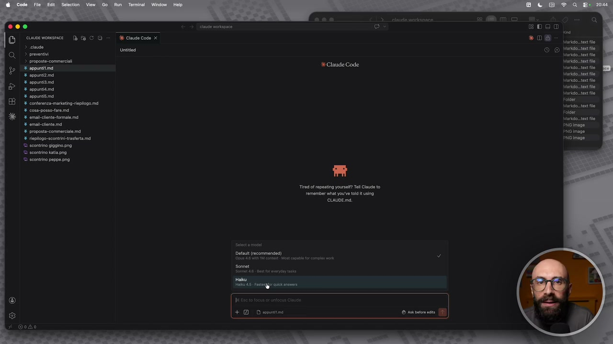

**Testo a schermo (OCR):** 000 @ cuoeronsnce Db 19 CO» cose cose x > clude dono, > proven > proposte.commerciali appuntita % appunti md % appunta md % appunti % appunti % conferenza markating:replogo md % cosa-posso-fare md 2. emadlnt-forma md % mao md % proposta commerciale md ‘ tieplogo-scontri-trasterta md "8 scontrino pigino png © sconrino katia png "scontrino peppe png Detaut (recommended) "ORO A cu Mot cal tt col Sonnet Ha Ma. tergo auci ans + epr

> Per le vie di mezzo mettete Sonnet, altrimenti per le cose avanzate mettete Opus. Qua potete scegliere quale modalità volete. Lasciamo un attimo questa qua di default per il momento. Poi cos'altro? Potete scegliere l'effort, quindi quanto ci deve mettere, quanto si deve impegnare il modello che avete scelto. Anche questo impatta sui consumi, questo semplicemente la spostate come rotellina e la mettete minimo, la mettete medio, la mettete alto, la mettete altissimo. Anche qua dipende da quello che state facendo, non andate a mettere cose alte, a consumare inutilmente l'allowance che vi dà Antropic. Poi abbiamo il thinking mode, quindi se vogliamo che pensa prima di rispondere sulle cose semplici che abbiamo fatto fino ad ora non vi servirà mai. Quindi rinominare un file, leggere un'immagine, guardare un documento PDF e così via.

## [00:08:00] Schermata 8 _(periodic)_

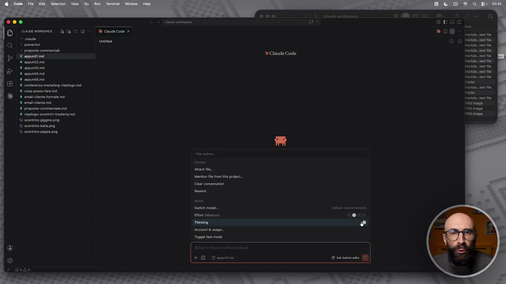

**Testo a schermo (OCR):** Attach flo. Menton fl from the project. Clear conversation Rendi Seitehimodel.. tot (edu) Thinking Account & usage. Toggle ast mode

> Per queste cosine qua potete usare anche modelli molto economici, molto semplici, molto veloci e non abilitare il pensiero. Sulle cose avanzate invece abilitatelo sempre, quando ci dovete fare cose di lavoro serie, soprattutto se state facendo per esempio del brainstorming, è fondamentale abilitarlo, vedete proprio la differenza di qualità che vi dà. Poi avete il fast mode, se mettete fast mode ovviamente vi va in questa modalità più veloce, anche più economica. Qua è partito il terminale, ve lo volevo far vedere tra un attimo, però ci ho cliccato sopra e vi ho fatto vedere che si apre il terminale. Lo chiudo adesso, fate finta di nulla, lo chiudo e dopo vi faccio vedere che qua dentro possiamo aprire anche il terminale. Poi abbiamo anche questo qua, account e usage, che ci fa una sorta di riassunto di quanto stiamo consumando in questo momento. Quindi per registrare questo corso, quanto ci sto mettendo, quanto sto consumando di quello settimanale e così via. Questo potete tenere sotto controllo, se magari lo usate tanto per vedere quanto spentete, se vale la pena passare ad un abbonamento più grande,

## [00:09:00] Schermata 9 _(periodic)_

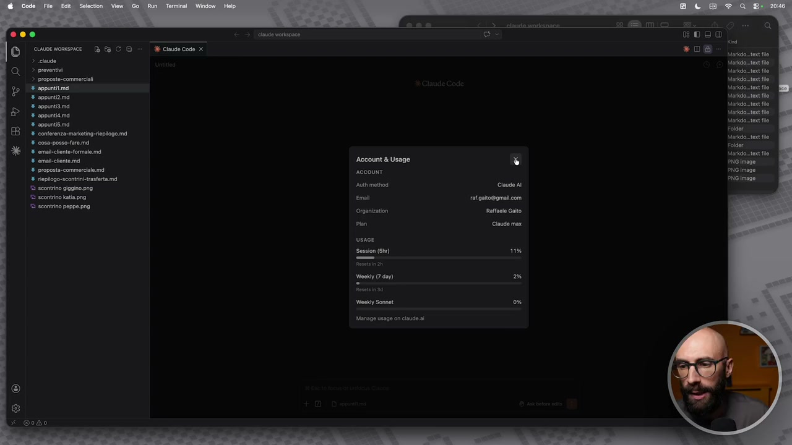

**Testo a schermo (OCR):** ‘Account & Usage account mad Organization

> se vale la pena passare ad utilizzare le API e così via. E ovviamente quello che vi ho fatto vedere, che già vi ho anticipato perché ci ho cliccato sopra, è che questo qua non è il vero e proprio terminale. Come vi ho detto prima, è una sorta di versione un po' più semplificata del terminal di Cloud, che alla fine è un'interfaccia grafica, no? Sembra una chat, perciò vi ho detto noi non lo useremo quasi mai dal terminale, lo useremo da una chat, perché stiamo usando la chat di VS Code. Però in realtà noi possiamo da qua dentro stesso anche avere il terminale, sia andando nel menu di VS Code e lanciando un nuovo terminale. Vedete qua si apre proprio un terminale, tutti gli effetti. Questo è identico al terminale che io aprirei così su Mac, per capirci, oppure quello che aprite su Windows. Ma per alcune cose, quando voi siete qua dentro, per alcune funzionalità, se voi continuate a scendere, adesso qua non ve le faccio vedere tutte queste qua, non in questa fase del corso, ma quando voi, diciamo, avete, volete aprire una di queste opzioni, vi dice che per alcune di esse non le può fare direttamente qua dentro, ok?

## [00:10:00] Schermata 10 _(periodic)_

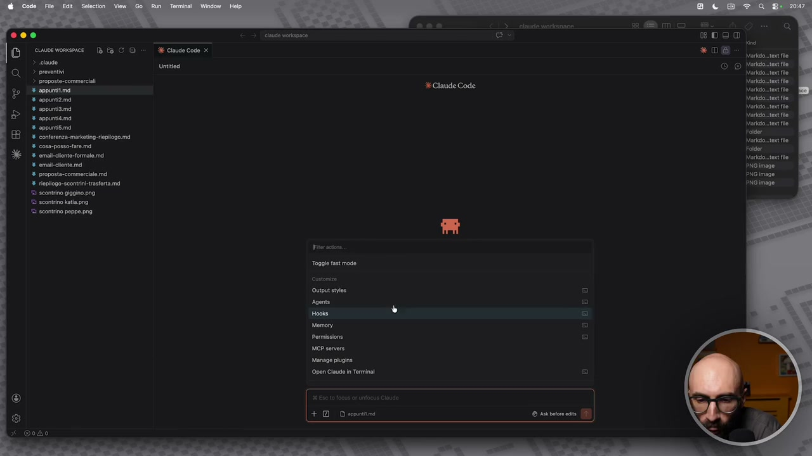

**Testo a schermo (OCR):** 000 © sovvomene Bra CO - | cidecode x > claude Uncisea > proventi > proposte commerciali appuntita % appunta % appunta % appunta % appunti conferenza markatineplogo mi % coss-posso-aremd % emadclnt-formale md % omaictento md # proposta commerciale md % rieplogo-sconrin-trastrta md "scontrino pigina png "© scontrino katia. scontrino peppe png res Toggle ast mode

> Per esempio i plug-in sì, se voglio installare un plug-in, che vedremo più avanti, lo clicco e mi parte la gestione dei plug-in. Però se voglio fare una cosa un pochino più avanzata, che ne so, la gestione degli agenti, mi dice no, questo per farlo ti lancerò il terminale, ok? E vedete che c'è anche proprio una voce, semplicemente, che si chiama lanciami il terminale. Io lo clicco e lui mi fa apri cloud nel terminale. Quindi ha aperto in automatico un terminale, ha dato il comando cloud, vedete questo non l'ho dato, io l'ho dato in automatico, e mi ha aperto adesso cloud nel terminale. Vi ricordate? Questa è la stessa identica cosa di fare questo, ok? Cloud, invio. Ah no, scusatemi, perché sono nella cartella Raffaele, quindi adesso non gli voglio dare il permesso. Però avete capito, no? È la stessa cosa di dare l'accesso, diciamo, tramite terminale. Chiudiamo questo qua. Adesso io qua dentro sono dentro cloud. Sono dentro cloud code, però aperto nel terminale, quindi non sto nella chat qua, vedete?

## [00:11:00] Schermata 11 _(periodic)_

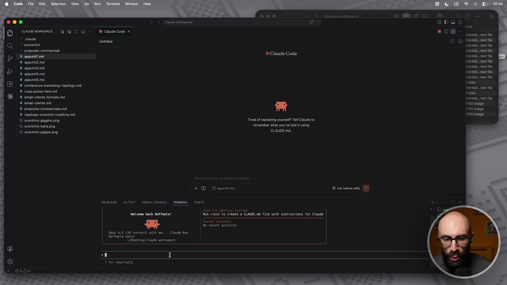

**Testo a schermo (OCR):** 005 O core Bia co- a cudecie Untitied % conferenza markating: riepilogo md # cosa-posso-fara md 8 omadctlnt- formal md pento) A Lai pene Procrnsta tra pro er ji ie "arena ia e dn © scontrino katia png "5 scontrino peppe png. GNDETE: + DI Despina Run Jindt to create o CLAUDE.md file with instructions for Claude Ao recent activity Quo 4-6 (an conte) th me. Claut x "pesktop/elaude vorkspace 50 7 197 sporto

> Quindi qua gli posso dire in che cartella siamo, perché questo è dentro cloud workspace, è quello che io normalmente avrei scritto qua sopra. Adesso vi faccio vedere, siamo in user Raffaele desktop cloud workspace. Per caso ci sono degli scontrini. Adesso è le stesse cose che stiamo facendo qua, vedete come adesso spaventano un po' di meno? Perché quando le davamo qua sembrava meno strano. Aspettate, questo me lo alzo un pochino, giusto per farvi vedere. Quando lo diamo nel terminale, il terminale c'ha un po' più di roba, scrive in maniera un po' più verbosa. Dice sì, guarda, ci sono tre immagini, scontrino Gigino, scontrino Katia, scontrino Peppe, poi c'è anche un riepilogo. Io mi dico, dimmi un attimo il riepilogo, quanto sono costate le bibite. Ovviamente sono esempi molto stupidi, solo per farvi vedere che sto usando il terminale.

## [00:12:00] Schermata 12 _(periodic)_

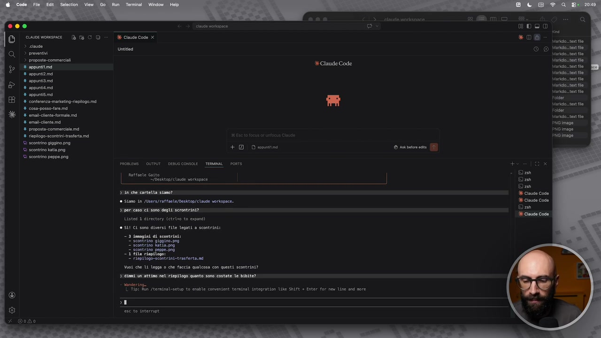

**Testo a schermo (OCR):** 5) cine momenice Da fa CO > claude > proventi > proposte commerciali % appuntita % appunta % appuntamd % appuntiima % appuntsma conferenza merkating:replgo md % coss-posso-are md 6 emallnt-formala md % emai-chente mi % proposta commerciale md 8 riopliogo-scontin-trsferta md "scontrino gigi. png © scontrino ati. rst "® scontrino peppe png Raffaele Gasto "Afbesxtoprerause vorkspace 3-10 ehe cartetta stano? Siamo in /Users/ affaele/Desktog/claude vorkapace. 3 per caso ci cono degli scrontrint? Listed 1 directory (etelso t0 expand) SAI CA sono diversi file legati a scontrini: sese: 1 Finpilogo=scantrini.erasterto.n Vuoi che Li legga 0 che faccia qualcosa con questi scontrini? dini un attino nel riepilogo quanto sono costate le bibite? vendering Tipi Rim /terninat-setup to enable convenient terminal integration Like SHIP + Enter for pes line and more

> Cioè quello che vi voglio dire fondamentalmente, non abbiate paura del terminale, ecco. Questo è un po' il senso di questa cosa che vi sto dicendo. Perché questi sono comandi che noi avremmo dato qua sopra nella chat, adesso li stiamo dando sul terminale, ok? Che sembra un po' più oscuro, perché è un'interfaccia meno gradevole, me ne rendo conto ovviamente, ma in alcuni casi ci servirà. Adesso lo chiudo, questo era solo un passaggio veloce per dirvi di non spaventarvi, lo chiudo perché tutto il resto continueremo a farlo, diciamo, chiudiamolo qua. Continueremo a farlo da questa interfaccia di Cloud Code, che è una sorta di terminale un pochino semplificato. Se qualche volta servirà aprire il terminale, ve lo dico, per fare questa roba è un po' più avanzata, qua dentro non ce lo fa fare, apriamo un attimo il terminale.
