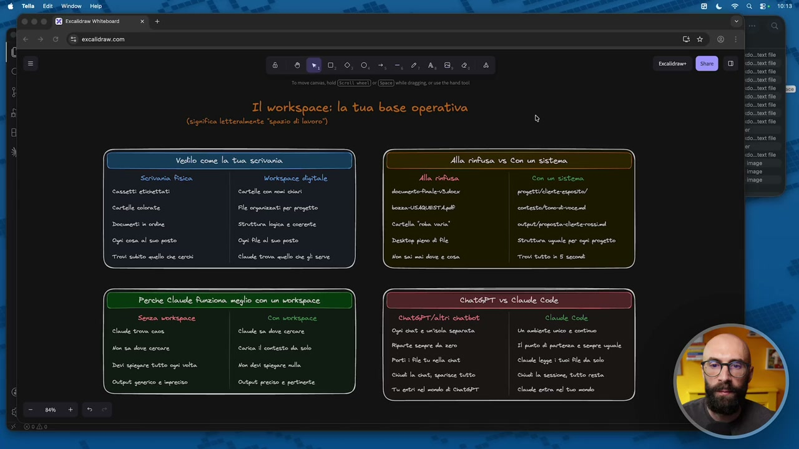
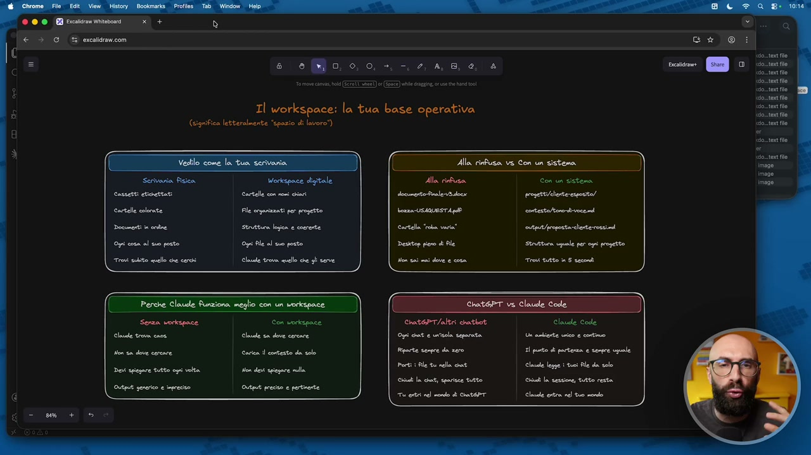
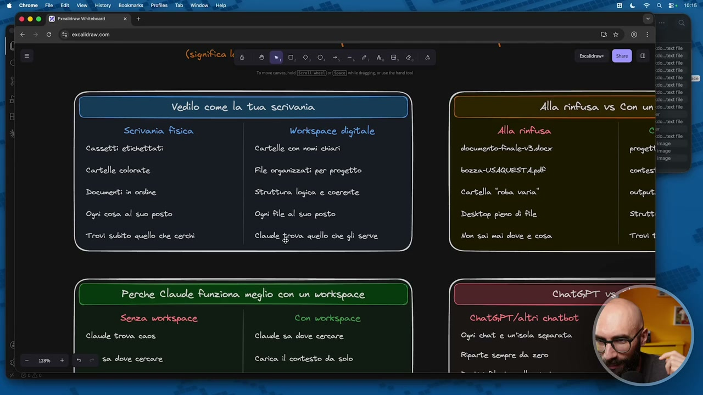
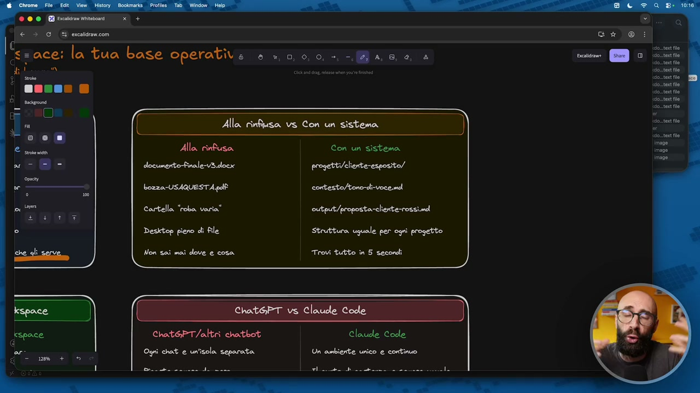
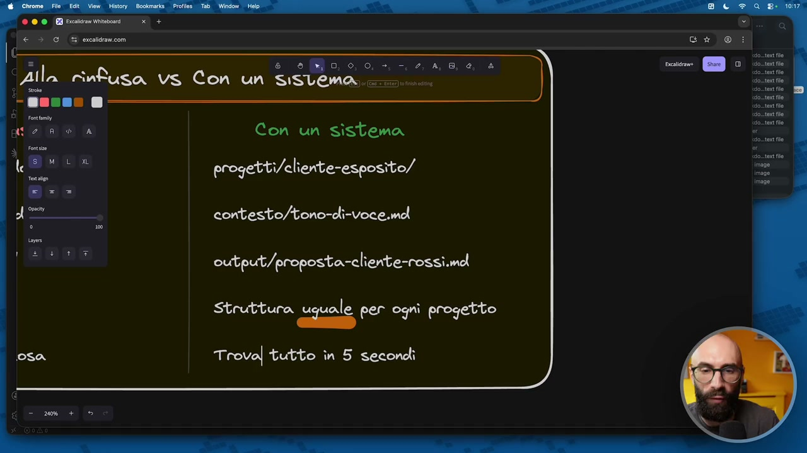
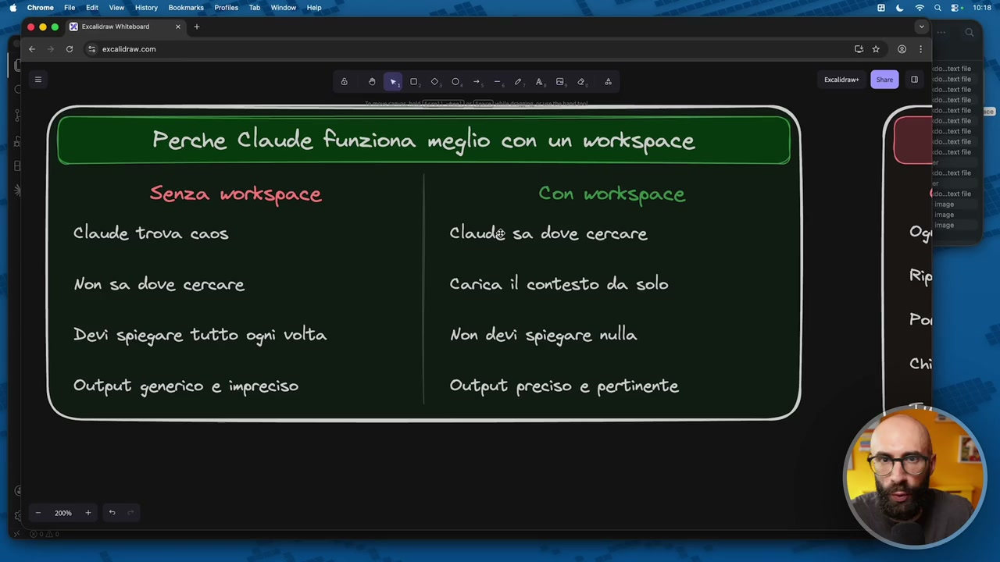
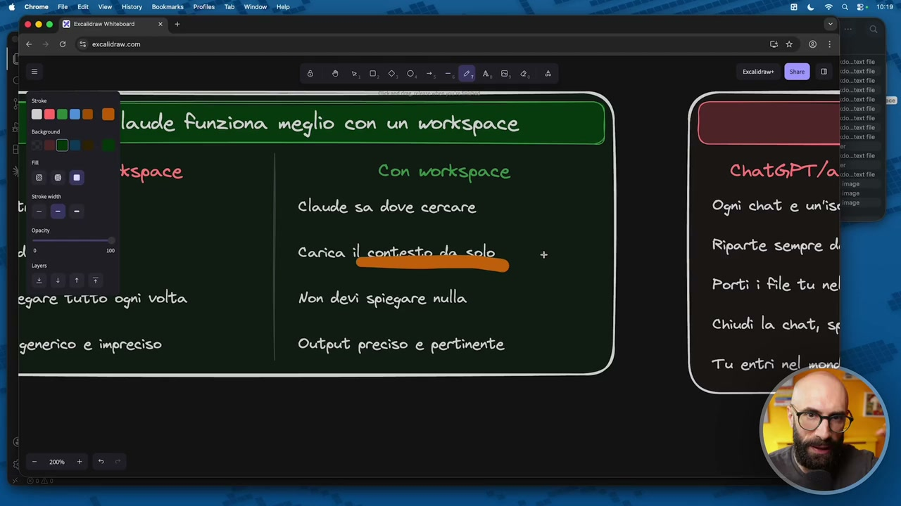
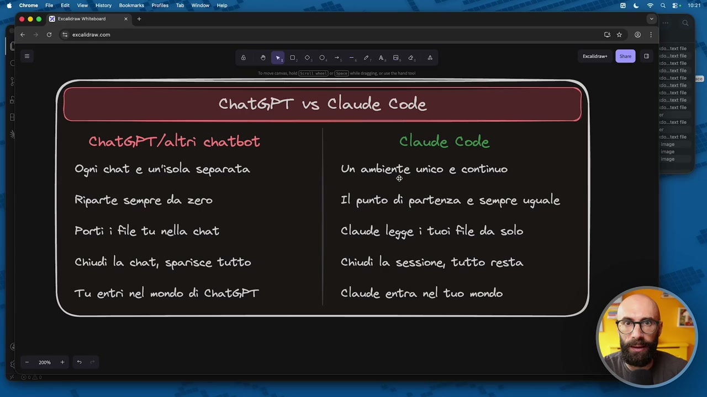
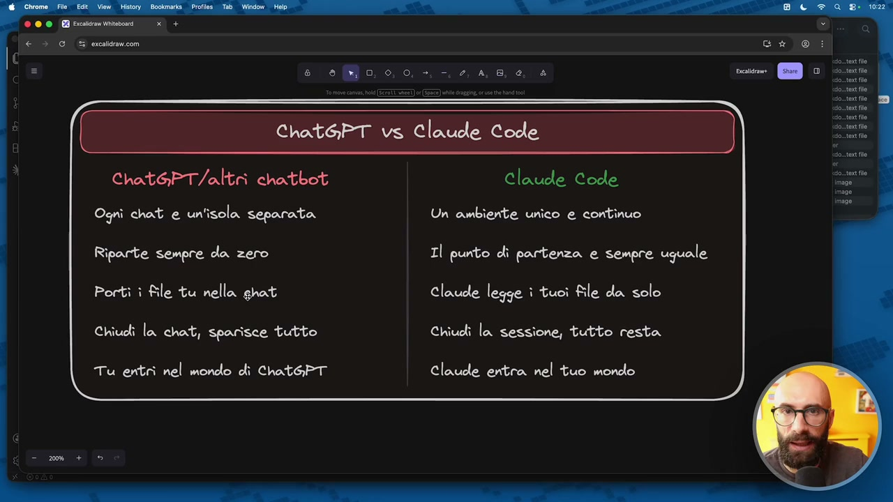
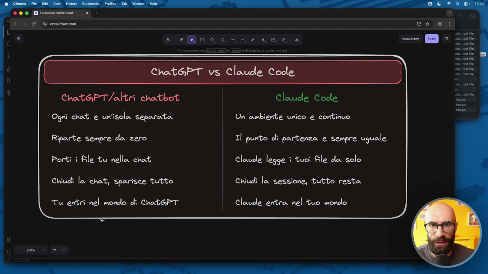

# Cose è un workspace e perché è importante

> Documento generato automaticamente: trascrizione e screenshot sincronizzati del video-corso.

## [00:00:00] Schermata 0 _(start)_

**Testo a schermo (OCR):** Il workspace: la tua base operativa (significa letteralmente “spazio di lavoro*) Alla rinfusa vs Con un sistema Alla fusa Con un sistema documento rale preettderte esposto) torna USAQUESTA NR cortesto/tone drive astpat/rpestaccente scia / ChatePT/altri ratbot Ori cat e utola separetta Riparte Gonpre da nero Porti i Ale tu rlla cat. Chili la citi sprite tutto. Tu eri vel mondo di CMatePT.

> Siamo arrivati a parlare di workspace, che secondo me è uno dei punti più importanti. È una di quelle cose che quando le capisci, proprio qualcosa fa clic nella testa e ti fa dire, ok, ora sto capendo perché questo strumento, questo approccio, questo ecosistema è molto potente. Allora, il workspace lo possiamo chiamare pure spazio di lavoro, perché lo so che ogni volta che c'è un termine in inglese qualcuno si spaventa un pochino, ma immaginatelo proprio come la base operativa. Cioè, lo spazio di lavoro è quello all'interno del quale voi vi muoverete tutto il tempo. Per capirci, negli esempi che stiamo facendo fino ad ora, molto semplici, questo qui era il workspace, ma era estremamente sporco, incasinato, volutamente, perché non vi ho ancora spiegato che cos'è un workspace e come si organizza, ma era questa roba qua. Quindi una serie di cartelle, sottocartelle, dei file, ma soprattutto una struttura logica precisa. No, immaginate, per esempio, sul vostro computer avete la cartella documenti, dentro documenti

## [00:01:00] Schermata 1 _(periodic)_

**Testo a schermo (OCR):** Il workspace: la tua base operativa (Significa letteralmente “spazio di lavoro") Alla rinfusa vs Con un sistema Workspace digitale Alla info Con un sistema cartele cor reni i decente rale progett/aiente espto/ le organizzati por pragetto torna OSAQUESTA cortesto/toe dice Stovitura lojea e coorte atitleorostacciottereizind Cri Re al tuo posto Clucde tro mulo ce gi cove ChatePT/altri catbot Ori cat e uitola tepereta Riparte sonpre da nero Porti i Ale tu rella cut. Chili la int; sprite tutto. TU entri rel nodo di CoatePT.

> c'è la cartella preventivi, poi la cartella presentazioni, poi la cartella foto, poi la cartella pdf e così via. Qua vi voglio fare diverse riflessioni su questa cosa. Prima di metterci, diciamo poi, con le mani a lavorare direttamente sul workspace, voglio farvi capire bene un paio di cose. Allora, se manteniamo un attimo questo parallelismo con la scrivania, che poi perciò si chiama desktop quando lavoriamo al computer, così come nella scriveria ci abbiamo i cassetti, le cartelle, i documenti, no, quindi abbiamo un modo di organizzare precisamente le cose, i file, la stessa cosa succede nel nostro workspace appena lo creeremo. Quindi abbiamo delle cartelle con dei nomi chiari, abbiamo i file organizzati bene per progetto e tra l'altro vediamo pure che cosa sono i progetti, abbiamo una struttura logica e coerente. Questa cosa perché è potente? Non è perché siamo fissati con l'organizzazione, perché a noi di quell'organizzazione ci interessa poco, quello che vedremo è questo, cioè Claude trova tutto quello che gli serve.

## [00:02:00] Schermata 2 _(periodic)_

**Testo a schermo (OCR):** (significa lis o 0, 0, 0, +, —, a Gt @ i re Sr i ml Lun -_n SR Workspace digitale Cassetti etichettati Cartelle con nomi chiari cartelle colorate File organizzati per progetto Documesti în ordine Struttura logica e coerente Ogni cosa al suo posto Ogni ile al suo posto Trovi subìto quello che cerchi Claude trova quello che gli serve oto flo sio. toxt lo Alla rinfusa vs Con unsere Alla rinfusa documento-Finale-v3.docx bozza-USAQUESTA pdf cartella “roba varia" Desktop pieno di file Non sai maì dove e cosa Perche Claude funziona meglio con un workspace [ ChathPT Senza workspace Con workspace Claude trova caos Claude sa dove cercare sa dove cercare Carica il contesto da solo ChathPT/altri chatbot Ognì chot e un'isola separata Riparte sempre da zero

> Qua è una di quelle cose che voglio sottolineare, Claude trova tutto quello che gli serve. L'ho sottolineato malissimo, perdonatemi. Claude trova tutto quello che gli serve e qua la cosa importante è che lo fa in automatico. Quando abbiamo creato il workspace, quindi il nostro spazio di lavoro, gli diciamo semplicemente che stiamo lavorando su un determinato cliente, su un determinato progetto, su una certa attività e Claude sa già dove andare a guardare. Avviene quasi per magia, tra un attimo vi faccio vedere in che modo. Rimaniamo su questo, perché questa cosa è importante? Se uno viene dall'approccio tradizionale, diciamo, dei chatbot, quindi c'è gpt, cloudchat, gemina, ecowork e così via, è abituato a lavorare un po' alla rinfusa. Qua, diciamo, in realtà ci sono un po' di modi per organizzare, perché ci sono i progetti, ci sono, diciamo, alcuni di questi chatbot ovviamente poi hanno delle cosine per organizzare un po'. Sono delle cartelle, più che altro, poi non è che si può fare più di tanto, però quello

## [00:03:00] Schermata 3 _(periodic)_

**Testo a schermo (OCR):** ED cadi Vibo + 7 (4 € 3 G % ercaldrancom ssace; la tua base operative è 3000 - Ma Alla rinfusa vs Con un sistema Alla rinfusa Con un sistema documerto-Finale-v3.docx progetti/clente-esposito/ bozza -USAQUESTA, pel contesto/tono-di-voce. md cortella “roba varia" output/proposta-cliente-rossì,ml Desktop pieno di file Struttura uguale per ogni progetto Non saì mai dove e cosa Trovi tutto in 5 secondi Chat6PT vs Claude Code chatSPT/altri chatbot Claude Code Ognì hat e un'isola separata Un ambiente unico e continuo E | rr

> che facciamo normalmente è questa situazione qua, quindi abbiamo documenti con i nomi assurdi, immagino capite pure a voi, documento finale, documento finale, versione 2, versione 3 e così via, cartelle con scritto varie, altro, tutto il resto, eccetera, il desktop pieno di file, questo diciamo è sintomo di caos, e non sappiamo dove trovare le cose. Nel momento in cui invece non abbiamo un sistema, questo è quello che otteniamo, cioè quello che voglio far capire è che abbiamo una struttura chiara, quindi c'è una cartella progetti, sotto la cartella progetti ci sono i progetti organizzati, c'è una cartella per il contesto, una cartella per gli output che produrremo e così via, e creiamo una struttura uguale per ogni progetto, anche questo diciamo sottolineiamo questa idea di uguale, non lo facciamo per noi, ma perché Claude è in grado di trovare tutto in automatico, anzi qua diciamo fatemi cambiare questa frase qua, dove qua ho scritto trovi tutto in automatico, trova tutto in

## [00:04:00] Schermata 4 _(periodic)_

**Testo a schermo (OCR):** dd 0, ema Con un sistema progettti/cliente-esposito/ contesto/tono-di-voce.mol output/proposta-cliente-rossì.mol Struttura sasli per ogni progetto Trova) tutto in 5 secondi

> automatico, perché questa cosa la fa Claude, e questa è la cosa veramente potente, cioè in 5 secondi sa dove andare a pescare, perché se tu gli dici devo aggiornare il preventivo per esposito, lui sa che nella cartella progetti c'è una cartella che si chiama cliente esposito e sa che deve andare a lavorare sul file che dentro la cartella cliente esposito si chiama preventivo, e noi gli dobbiamo dire questa cosa, lo fa tutto in automatico, lo vedremo tra un attimo. Un altro paio di riflessioni interessanti, perché Claude riesce a fare questa cosa molto bene? Perché è strutturato al suo interno, abbiamo detto che Claude Code nasce come uno strumento per il codice, noi non lo useremo per il codice, ma siccome è pensato per aiutare i programmatori a gestire nel tempo, quindi a fare manutenzione del codice nel tempo, questa stessa cosa, diciamo questa funzionalità che hanno pensato i creatori di Claude Code, noi che non siamo programmatori, che non ci interessa mantenere il codice, la sfruttiamo per la parte invece di lavoro intellettuale che abbiamo detto fino ad ora,

## [00:05:00] Schermata 5 _(periodic)_

**Testo a schermo (OCR):** e 800, 0,0. - 4, 4,60 è Perche Claude funziona meglio con un workspace Senza workspace Claude trova caos Non sa dove cercare Devi spiegare tutto ogni volta Output generico e impreciso Con workspace Claude sa dove cercare Carica il contesto da solo Non devì spiegare nulla Output preciso e pertinente RS resine BO Se 2° a

> no? Quindi documenti, presentazioni, relazioni, report, non lo so, testi molto lunghi che scrivete, contenuti che dovete pubblicare, proposte che dovete fare, minuti di riunioni, tutto quello che potete pensare voi. Qui diciamo, se non avete il workspace, ovviamente c'è il delirio e Claude non sa dove andare a pescare queste cose, le dovete voi spiegare tutte le volte, esattamente come ho fatto adesso negli esempi qua, no? Avete visto, qua non c'era una struttura chiara, non c'era un workspace e quindi gli dovevo dire, allora, c'è una cartella con dei PDF, questi PDF sono dei preventivi, ti prego trasformami questi preventivi, bla bla bla. Io ho dovuto spiegare tutte le volte perché non avevamo creato un workspace. Nel momento in cui invece andiamo a farci il workspace, tutta sta cosa qua Claude la fa in automatico, Claude la fa in automatico. E qua, diciamo, la cosa più importante di quello che ho scritto qui è questa roba qua, cioè carica il contesto da solo. Poi tra un attimo arriviamo a vedere pure che cos'è il contesto perché è un

## [00:06:00] Schermata 6 _(periodic)_

**Testo a schermo (OCR):** Di 6 6 3,0, 0, 0, >, -.l@ a, 8, e. a gE sente sene è srcigrana laude funziona meglio con un workspace LESBO i De @ kspace Con workspace bi br) n Claude sa dove cercare orso |: carico leone z DE G egare Tutto ogni volta Non devi spiegare nulla generico e impreciso Output preciso e pertinente Ogni chat e un'isc® Portì ì file tu nel Chiudì la chat, sf Tu entri nel

> pezzo importante del workspace. Cioè, se io sto lavorando, diciamo che sono un consulente e ho dieci clienti, in questo momento della mia vita, della mia carriera professionale, non è che tutte le volte che apro Claude Code lui si carica tutta l'informazione di dieci miei clienti. In maniera intelligente e dinamica, dice, oggi stai lavorando su Esposito? Perfetto, mi carico solo quello che devo conoscere di Esposito. Domani stai lavorando su Mario Rossi? Perfetto, mi carico solo quello che devo fare su Mario Rossi. Infatti qua, diciamo, se vogliamo renderlo più completo, qua potrei dire carica il contesto da solo in automatico. Sta roba qua per me è incredibile, è una delle cose più potenti che si può fare quando utilizzate Claude Code. Proprio se venite da un'altra approccia nel quale invece dovete dargli le custom instruction, copiare prompt che sono infiniti, caricare una serie di file e così via. E per ultimo, diciamo, se avete, se venite da un approccio tradizionale, perdonatemi,

## [00:07:00] Schermata 7 _(periodic)_

**Testo a schermo (OCR):** e eo, 0,0, -, -. 2, 4,8, e, 4 Chat6PT vs Claude Code chat&PT/altri chatbot Claude Code Ognì chat e un'isola separata Un ambiente unico e continuo Riparte sempre dla zero Il punto di partenza e sempre uguale Portì ì file tu nella chat Claude legge ì tuoi file da solo Chiudi la chat, sparisce tutto Chiudi la sessione, tutto resta Tu entri nel mondo di Chat&PT Claude entra nel tuo mondo

> io qua continuo a scrivere CGPT contro Claude Code, qua ho scritto infatti CGPT e altri chatbot, cioè se uno non viene da CGPT ma viene da Gemini, viene da Claude Chat, viene da Cowork, viene da altre cose, cioè da, diciamo, da Copilot e altre cose, il ragionamento è lo stesso. Qua intendo i chatbot tradizionali. Nei chatbot tradizionali ogni chat è un'isola separata, vero, abbiamo la funzionità memoria in alcuni di questi prodotti che un po' ci fa condividere delle informazioni, però diciamo, quello che facciamo in una chat, no, rimane dentro quella chat in linea di massima. Invece Claude Code è un ambiente unico, cioè se io ho mille clienti, esagero, esagero volutamente, se io ho mille clienti, sto lavorando sul cliente esposito e gli dico, l'anno scorso ho fatto una proposta a Mario Rossi e gli è piaciuta un sacco, la prendi e la fai tale quale per esposito ci cambi soli dati aziendali. Lui sa che dentro la cartella dei

## [00:08:00] Schermata 8 _(periodic)_

**Testo a schermo (OCR):** e eo, 0,0, -, -. 2, 4,8, e, 4 Chat&PT vs Claude Code chat&PT/altri chatbot Claude Code Ognì chat e un'isola separata Un ambiente unico e continuo Riparte sempre da zero Il punto di partenza e sempre uguale Porti ì file tu nella chat Claude legge ì tuoi File da solo Chiudi la chat, sparisce tutto Chiudi la sessione, tutto resta Tu entri nel mondo di Chat&PT Claude entra nel tuo mondo

> clienti, dove ci sono mille sottocartelle, deve andare a trovare un cliente che si chiama Mario Rossi, là dentro si cerca un file di preventivo, lo prende, lo copia, toglie i riferimenti a Mario Rossi, ci mette i riferimenti al cliente esposito. Questo significa avere un ambiente unico e continuo. Poi lavoriamo con, diciamo, chatbot tradizionale riparte sempre da zero, qua se non vogliamo dire da zero dovremmo dire riparte sempre da uno, che potrebbero essere per esempio le istruzioni che avete messo, le custom instruction se le utilizzate, quello è il massimo che potete avere come punto di partenza. Invece Claude Code, diciamo, c'è un punto di partenza che è sempre uguale, il workspace, quindi ogni volta quando partite lui ha tutto di voi, il vostro storico, sa che avete 20 anni di carriera alle spalle, sa che nel team siete 15 persone, sa che il team marketing è un'agenzia in outsourcing, mentre il team commerciale è tutto interno, tutto quello che volete voi. Vabbè, qua dovete ovviamente portare voi i file nella chat, l'abbiamo detto,

## [00:09:00] Schermata 9 _(periodic)_

**Testo a schermo (OCR):** e eo, 0,0. -. 2, 4,6, 0, è Chat&PT vs Claude Code chat&PT/altri chatbot Claude Code Ognì chat e un'isola separata Un ambiente unico e continuo Riparte sempre da zero Il punto di partenza e sempre uguale Portì ì file tu nella ghat Claude legge ì tuoi file da solo Chiudi la chat, sparisce tutto Chiudi la sessione, tutto resta Tu entri nel mondo di Chat@PT Claude entra nel tuo mondo

> e quindi là, diciamo, c'è oltre alla scomodità di dover caricare i file, c'è il fatto che i file sono limitati, alcune piattaforme ne fanno caricare 20, qualcuno di più, qualcuno in meno, c'è un limite anche di spazio, quindi i file non possono essere più grandi di un tot. Claude invece, tutto in automatico, come ho detto prima, se vogli di te prendi tutte le presentazioni del 2025, che ne so, e copia me le pari pari nella cartella del 2026 perché devo partire da quelle, modificarle e riutilizzarle. Claude sa già che cos'è il 2025, che cos'è il 2026, che cosa sono le presentazioni, lo sa già. Vabbè, poi ovviamente quando chiudiamo la chat sparisce tutto, se una chat, diciamo, la chiudete, l'unico modo per riprendere quella roba è tornare in quella chat, se la cancellate quella roba è persa per sempre, con Claude invece tutto è conservato. Cioè Claude è un vostro assistente a tutti gli effetti, è un supporto extra, è una memoria in più, no? Che

## [00:10:00] Schermata 10 _(periodic)_

**Testo a schermo (OCR):** e eo, 0,0, -, -. 2, 4,8, e, 4 Chat&PT vs Claude Code chat&PT/altri chatbot Claude Code Ogni chat e un'isola separata Un ambiente unico e continuo Riparte sempre da zero Il punto di partenza e sempre uguale Porti ì file tu nella chat Claude legge ì tuoi file da solo Chiudi la chat, sparisce tutto Chiudi la sessione, tutto resta ® Tu entri nel mondo di Chat@PT Claude entra nel tuo mondo

> rimane a fianco a voi, quindi se gli avete spiegato delle cose, gli avete insegnato delle cose o lui le ha capite perché vedremo che molte le capisce in automatico, quella roba rimane con voi per sempre. E' uno di quegli strumenti che più lo utilizzate, più diventa utile, più diventa potente, perché ovviamente impara. E ultima cosa, questa diciamo, la uso spesso come frase, sembra un po' una frase così a chiappa click, ma rende bene l'idea, tu entri nel mondo di CGPT, perché abbiamo detto CGPT è uno strumento, ripeto, CGPT, ma vale per Gemini, vale per Grok, vale per Mistral, vale per qualsiasi cosa utilizzate. Dobbiamo noi entrare là dentro e adattarci, quindi le limitazioni dello strumento, le, diciamo, le modalità con cui si usa lo strumento e così via. Invece Claude no, è Claude che si adatta a te. Dice, vabbè, ma tu come le vuoi organizzare le cartelle? Fai tu. Come le vuoi organizzare le workspace? Fai tu. Come le vuoi chiamare queste cose? Fai tu. Non ti preoccupare, poi sono io che capisco dove andarmi a prendere le informazioni.

## [00:11:00] Schermata 11 _(periodic)_

**Testo a schermo (OCR):** dI RSSSSTIAc Chat6PT vs Claude Code chat&PT/altri chatbot Claude Code Ognì chat e un'isola separata Un ambiente unico e continuo Riparte sempre da zero Il punto di partenza e sempre uguale Portì ì file tu nella chat Claude legge ì tuoi file da solo Chiudi la chat, sparisce tutto Chiudi la sessione, tutto resta Tu entri nel mondo di Chat@PT Claude entra nel tuo mondo

> Questa cosa è incredibile perché ci permette di farlo crescere nel tempo, estendere nel tempo, scalare nel tempo e imparare con noi. Questa cosa non ha valore, secondo me, è incredibile.
