# Capire i diversi tipi di workspace

> Documento generato automaticamente: trascrizione e screenshot sincronizzati del video-corso.

## [00:00:00] Schermata 0 _(start)_

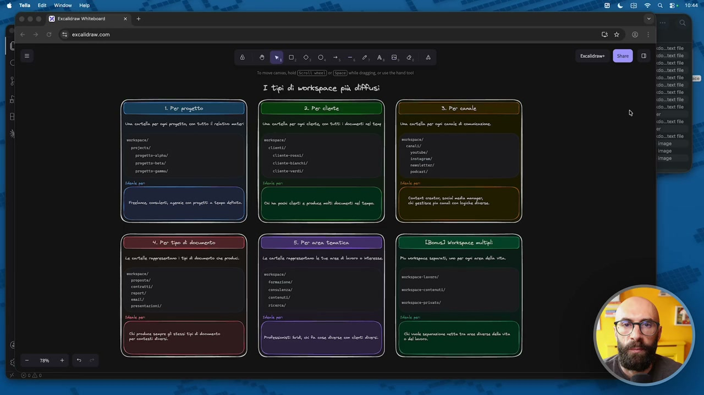

**Testo a schermo (OCR):** Gite rn) rie enni 27,

> E ora che abbiamo capito perché è importante il workspace, quindi lo spazio di lavoro all'interno del quale ci muoveremo e perché quello è fondamentale per Cloud, per trovare Cloud Code, per trovare le cose in autonomia, in modo dinamico ed espandibile, vi voglio far vedere quali sono le organizzazioni più diffuse. Perché una delle classiche problematiche, questo l'ho visto su di me, ma l'ho visto anche quando ho iniziato a lavorare diciamo con Cloud Code, con alcuni clienti, con alcuni amici anche, la prima domanda è ok ma allora come le organizzo le cartelle? Che poi è la domanda che spesso ci facciamo anche banalmente sul nostro computer. Una cosa che ho trovato molto utile è mostrare alle persone le varie alternative che ci sono. Vi faccio vedere diciamo le 5 più comuni, qua sono 6 perché ce n'è una bonus che però sconsiglio, diciamo vi faccio vedere quali sono le 5 più comuni e poi vi do qualche dritta su come poter scegliere la vostra, rimanendo però su, diciamo sottolineando alcune cose, cioè che 1, queste 5 modalità non sono le uniche 5 che si trovano

## [00:01:00] Schermata 1 _(periodic)_

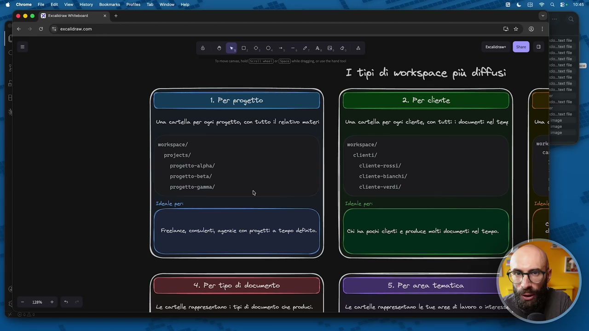

**Testo a schermo (OCR):** ca a siate la si go Le ì cli workspace più diffusi Una cartella per ogni progetto, con tutto il relativo materi morkspace/ projects/ progetto-atpha/ progetto-beta/ progetto-ganma// i Ideale per: 2. Per cliente 3) Una cartella per ogni cliente, con tutti i documenti nel ten workspace/ clienti/ cliente-rossi/ ciente-bianchi/ cliente-verdì/ Tdeale per: (e chi ha posi clienti e produce molti docunenti nel tempo. Ù er tipo di documento Le cartelle rappresentano i tipi di documento che produci. Le cartelle rappresentano le tue aree di lavoro 0 i sto. taxt ilo sso text Mo

> in giro, perché ve ne potete inventare una vostra che è semplicemente la più comoda per voi, non è che io ho la perfezione, no, queste sono le più comuni, quelle da cui probabilmente potrete partire con più facilità. E seconda cosa importante, se è una certa e vi rendete conto che è troppo limitante il metodo che avete scelto, passate ad un altro tipo di workspace. Allora, la prima è quella di lavorare per progetti, quindi che significa? Significa dove avete ogni cartella con il vostro progetto, con le introduzioni relative al materiale, quindi avete il workspace, qua vi ho fatto proprio diciamo una simulazione delle cartelline, ok? Avete il workspace, nel workspace c'è una cartella con i progetti, poi vedremo nel workspace ci sono vari cartelli, non solo i progetti, c'è una cartella con i progetti e dentro c'è progetto alfa, progetto beta, progetto gamma e così via. Significa che in questo caso volete ragionare per progetto, ho detto una roba del genere, per esempio è utile per freelance, consulenti, agenzie, chi lavora con progetti a tempo definito.

## [00:02:00] Schermata 2 _(periodic)_

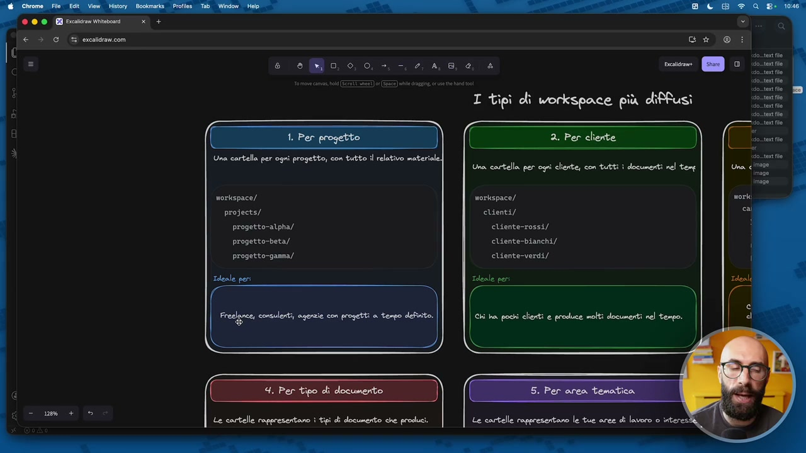

**Testo a schermo (OCR):** a ca ciotola mai o Le so. tert le ito taxt ile ì cli workspace più diffusi rei 2. Per cliente D) Una cartella per ogni cliente, con tutti i documenti nel ten Una cortella per ogni progetto, con tutto il relativo meteri morkspace/ workspace/ projects/ clienti/ progetto-alpha// cliente-rossi/ progetto-beta/ cliente-bianchi/ progetto-ganma/ cliente-verdi/ Ideale per: Ideale peri a EEE 4 ( er tipo di documento ) Le cartelle rappresentano i tipi ci documento che produci.

> Attenzione però, questo che quando io dico ideale per, non significa che se voi siete consulente dite ok, allora Raffaele ha detto questo, devo fare questo, questo, questo tipo di workspace qua, no, cioè scegliete comunque quello più comodo per voi e per darvi uno spunto. Se voi tendete a ragionare per progetti perché magari siete, che ne so, un imprenditore digitale come me, ok? Qua non l'ho messo per esempio, ma questo è il tipo di strutture che uso io, dove io ragiono per progetti e dico allora devo fare un corso su Cloud Code, per me quello è un nuovo progetto, quindi c'è la cartella Cloud Code, corso Cloud Code dentro la cartella dei progetti e poi sotto ci sono le sottocartelle con le varie cose relative a quel corso. Secondo approccio, qual è invece? Ragionare per cliente, ok, che può sembrare molto simile ma non lo è, perché ovviamente questa qui è una modalità che possono utilizzare anche quelli che non hanno clienti, quindi voi mi dite Raff, ma

## [00:03:00] Schermata 3 _(periodic)_

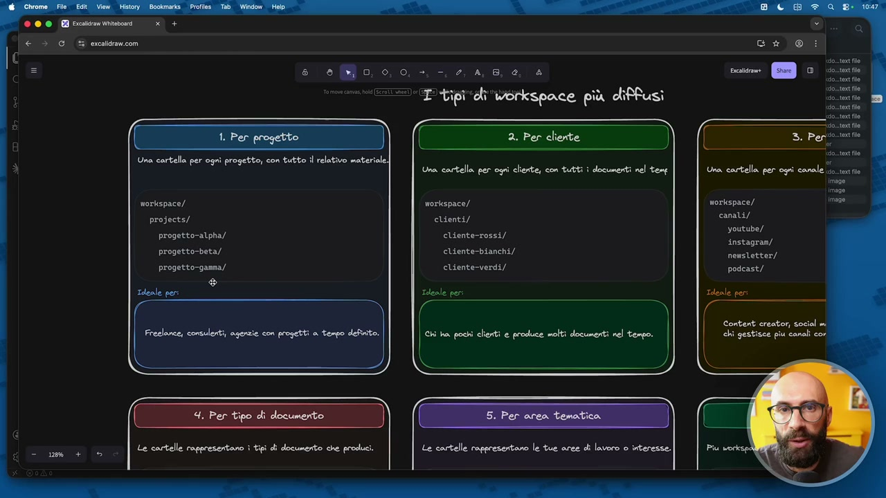

**Testo a schermo (OCR):** e eo 0,0, -, - R da É "> tipi dì werkspace più difPFusì - n 2. Per chente span Una cartella. per ogni cliente, con tutti i documenti nel temp Una: cartella per ogni conele iena iano morkspace/ morkspace/ workspace/ magi projects/ clienti/ canati/ youtube/ Anstagran/ nensletter/ progetto-ganma/ cliente-verdì/ podcast/ ® Ideale peri Ideale per Ideale per (a Content. creator, social m Freelance, consulenti, agenzie con progetti a tempo definito. Chi ha pochi cliertti e produce molti documenti nel tempo. chi gestisce piu canali con Una cartella per ognì progetto, con tutto il relativo mater progetto-alpha/ cliente-rossi/ progetto-beta/ cliente-bianchi/ Per tipo cli documento Lead opraoianiti i dio Serio Le cartelle rappresentano le tue arce di lavoro o interesse

> io non sono un freelance, cioè non sono un consulente, non sono un formatore, non sono un coach, no, magari faccio un lavoro più simile al tuo, non lo so, creo contenuti oppure vendo corsi, faccio infoprodotti, scrivo libri, sono uno speaker, eccetera eccetera, questo potrebbe avere senso. Per cliente invece è proprio chi lavora col cliente nel senso classico del termine, ok? Quindi voi dite no, io voglio che ci sia la cartella clienti, dentro la cartella clienti ci sia rossi, bianchi, verdi e quando vado dentro la cartella clienti rossi dentro trovo il preventivo che gli ho fatto nel 2024, il preventivo che gli ho fatto nel 2025, il preventivo che gli ho fatto nel 2026 e questi stanno sotto una cartella preventivo e poi trovo, che ne so, ci facciamo le call one to one e allora trovo le trascrizioni delle call di gennaio, di febbraio, di marzo, di aprile e così via, ok? È un'organizzazione logica diversa dove ragiono per cliente. Non vi preoccupate perché questa è solo un'organizzazione logica. Poi comunque le cose le trova tutto Cloud in automatico, ok? Serve solo a voi

## [00:04:00] Schermata 4 _(periodic)_

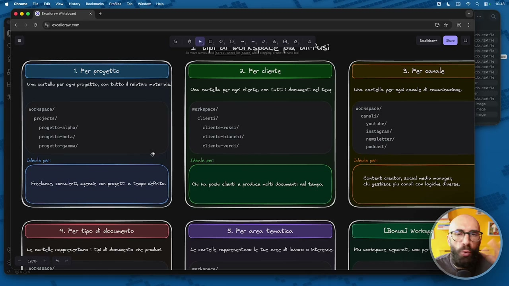

**Testo a schermo (OCR):** SIG [ICE TT.CTTe recite + Vipi i wuinapace piu un usì rice sontertita sotto ( 2. Per cliente do. tort lo | Le Se dote ile Una cartella per ogni progetti, con tutto il Una cartella per ogni cliente, con tutti i documenti nel temp Una cartella per ogni conale di comunicazione. perdo workspace/ morkspace/ workspace/ pes n Image mer clienti/ ca y youtube, progetto-alpha/” instagran/ nensletter/ podcast/ cliente-rossi/ progetto-beta/ cliente-bianchi/ progetto-ganna/ cliente-verdì/ Ideale per: Ideale peri Ideale per Content creator, social media manager, Freclonce, consulenti, agenzie con progetti a tenpo defito. (Frerdacei chi gestisce piu canali con logiche diverse. Si 4. Per tipo di documento Le cartelle rappresentano i tipi di documento che produci. Le cortelle rappresentano le tue aree ci lavoro 0 interesse. om + © I workspace/

> per capire dove state mettendo le cose. Poi per canale, questa per esempio lo dico a tutti gli amici creator che stanno guardando questo corso, sperando che ci siano anche dei creator perché è utile anche per voi, ma ho detto qua in realtà per i social media manager, cioè se voi di lavoro non create contenuti per voi, ma magari fate, lo fate per terzi perché fate i caroselli per Instagram, perché scrivete i testi per le newsletter, perché create le copertine per i canali YouTube e così via, allora voi potreste avere un'organizzazione del workspace che non è tanto per il cliente, ma volete proprio il tipo di output, ok? Quindi qua ho scritto il canale di comunicazione, per esempio c'è la cartella canali Instagram e dentro ci avete caroselli per Raffaele Gaito, caroselli per Pippo, caroselli per Pluto, caroselli per Paperino, ok? Perché dite ok, dentro Instagram c'è tutta la roba che sto facendo per Instagram, se lavorate per terzi, se invece lavorate per voi, semplicemente ci avrete, che ne so,

## [00:05:00] Schermata 5 _(periodic)_

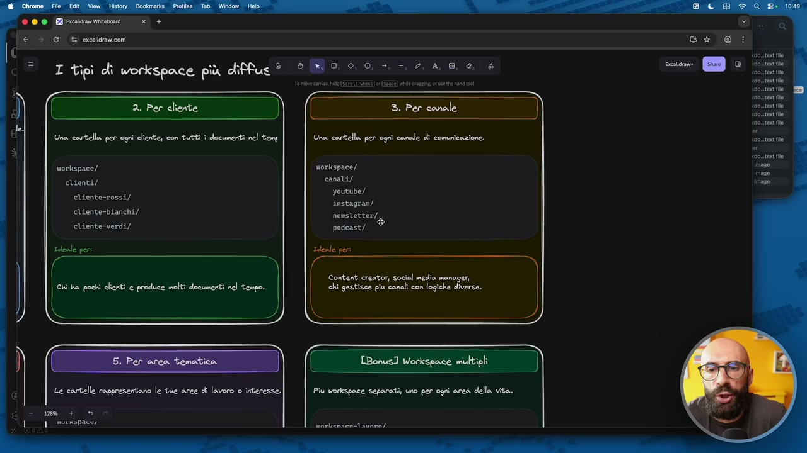

**Testo a schermo (OCR):** a co. «otel sot le site e sotto pasto i contee 2. Per cliente 3. Per canale ST pasta Una cartella per ogni cliente, con tutti ì documenti nel temp Una cartella per ogni canale di comunicazione. ryor dote le morkspace/ norkspace/ me es canali/ Image youtube/ instagran/ nensletter/, cliente-verdì/ podcast/ cliente-rossi/ cliente-bianchi/ Ideale per Content creator, social media manager, Chi ha pochi clienti e produce molti documenti nel tempo. chi gestisce piu canali con logiche diverse. fo TBonus] Workspace miltigi Le cartelle rappresentano le tue aree di lavoro 0 interesse. Piu morkapace separati, uno per ogni area della vita. mo + © mvinspare, sonlenara-lavnm/

> la cartella newsletter e dentro c'è newsletter di aprile, newsletter di maggio, newsletter di giugno, newsletter di luglio e così via. La quarta modalità qual è? È quella di lavorare invece per tipo di documenti, questo è diciamo una cosa che ho visto molto meno, le prime tre sono quelle più, le prime tre sono le più diffuse, le seconde tre sono le meno diffuse, però è una cosa che in alcuni casi potrebbe essere utile, perché ho visto che ci sono alcune persone che preferiscono tenere tutte le cose simili nello stesso luogo, cioè loro dicono se io ho dieci clienti e ho fatto dieci contratti, non voglio tenere contratto rossi, contratto verdi, contratto bianchi, voglio tenere la cartella contratti con tutti i contratti dentro, c'è chi lo fa. E quindi un altro approccio potrebbe essere avere un workspace organizzato per tipo di documenti, quindi c'è la cartella delle proposte, la cartella dei contratti, la cartella dei report, la cartella delle mail, delle presentazioni e così via. Quindi so che tutte le volte che voglio un preventivo vado dentro a proposte e troverò tutti i preventivi, ok? Anche quelli di dieci anni fa. Penultimo,

## [00:06:00] Schermata 6 _(periodic)_

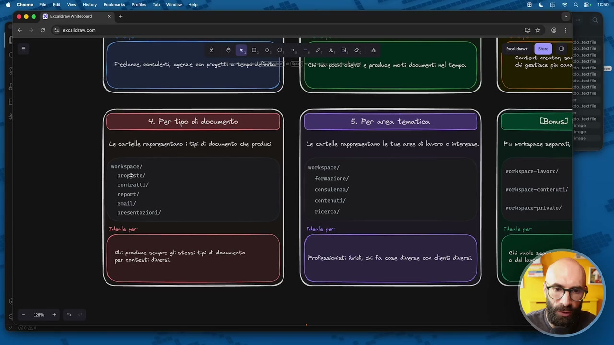

**Testo a schermo (OCR):** a ci es pp Cortert creato, cori Lie chi gestisce piu cana o (ri ue CR Le cartelle rappresentano i tipi di documento che produci. norkspace/ prosgste/ contratti/ report/ email/ presentazioni/ Ideale per: Chi produce sempre gli stessi per contesti diversi. Le cartelle rappresentano le tue ance di lavoro 0 interesse. workspace/ formazione/ consutenza/ contenuti/ ricerca/ Tdeale peri image. mag Piu vorkspace separati, morkspace-lavoro// morkspace-contenuti/ morkspace-privato/ Professionisti ibrish, chi fa cose diverse con clienti diversi.

> per area tematica, ripeto queste tre sono quelle meno frequenti, ma anche questa è una cosa che ho visto fare e che quindi vi propongo, perché magari a qualcuno di voi può essere utile, lavorare per aree di competenza, cioè dice io sono un professionista ibrido che faccio un po' di formazione, un po' di consulenza, un po' di public speaking, non voglio tenere le cartelle per i clienti, voglio lavorare per aree. Quindi dentro formazione ci avrò, che ne so, i corsi in presenza, i corsi online, i workshop, i seminari. Poi dentro consulenza ci avrò consulenza, che ne so, strategica, consulenza operativa, consulenza da remoto e così via. E questa potrebbe essere un'altra struttura. Io personalmente una struttura del genere non riuscirei a utilizzarla, diciamo, se proprio volessi organizzare una cosa di questo tipo, andrei più verso una modalità del genere o una modalità del genere. Però, diciamo,

## [00:07:00] Schermata 7 _(periodic)_

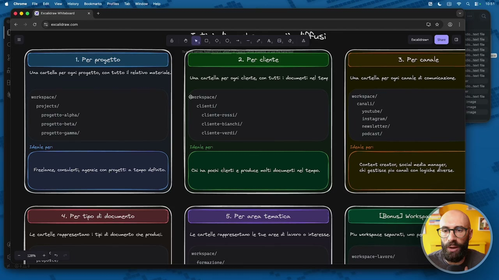

**Testo a schermo (OCR):** Una cartella per ogni progetto, con tutto il morkspace/ projects/ progetto-atpha// progetto-beta/ progetto-ganma/. Ideale per: 2. Per cliente Una cortella per ogni cliente, con tutti i documenti nel tent Grorkspace/ clienti/ cliente-rossi/ cliente-bianchi/ cliente-verdì/ norkspace/ canati/ youtube/ instagran/ nensletter/ podcast/ Ideale per Freelance, consulenti, agenzie con progetti a tempo definito. Chi ha pochi clienti e produce molti documenti nel tempo. Content creator; social medi Sent, serale opprcontaro | op doomerie se pod +55 pavpusie, Le cartelle rappresentano le tue aree di lavoro 0 interesse. morkspace/ formazione/. Piu morkspace Separati, uno norkspace-lavoro/

> questa è una scelta vostra. E l'ultima, perciò ho detto sono 5 più 1, questo lo ho scritto come bonus, per me questa è folle come cosa, però ho visto che ci sono alcune persone che lo fanno. Cioè creano proprio dei workspace separati. Io lo sconsiglio, perché quando vedrete come lavora Cloud Code avere tutto dentro lo stesso workspace è molto comodo. Quindi, diciamo, anche se queste qua sono aree di lavoro separate, io dentro una cosa che sto creando per la consulenza potrei dover pescare delle informazioni nella formazione. Per esempio, sono stato da Nike l'anno scorso, ho fatto due giorni di formazione, adesso mi hanno chiesto di fare la consulenza sulla stessa roba, aiutami a mettere in piedi il programma partendo dalle cose su cui abbiamo fatto formazione. Se sta nello stesso workspace Cloud Code va a prendersi, dice l'anno scorso hai fatto questo, questo e questo, perfetto, ora ti inizio ad aiutare a fare il programma di consulenza. Se abbiamo degli workspace separati

## [00:08:00] Schermata 8 _(periodic)_

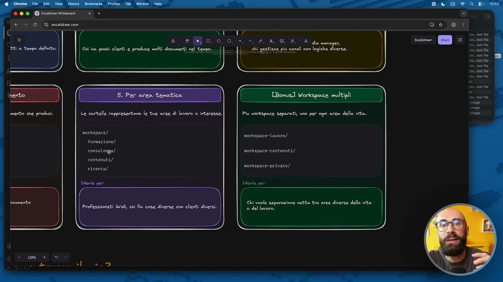

**Testo a schermo (OCR):** 2, A,8, 0, è q n chi gestisce piu canali con logiche diverse. Le cartelle rappresentano le tue aree di lavoro o interesse. morkspace/ formazione/ consulezga/ contenuti/ ricerca/ TBonus] Workspace multipli Piu vorkspace separati, uno per ogni anca della vita. morkspace-lavoro/ morkspace-contenuti/ morkspace-privato/ Ideale per: 7 | Chi vuole separazione netta tra aree diverse della vita sio. tor ila so. tex o cio.tert e ciotola ott No iso text le cio. tor Ile ott lo iso. text Me so. tar flo cio. tax flo image imogo

> questa cosa non si può fare. E infatti chi decide di fare i workspace separati lo fa proprio perché vuole questa separazione. Infatti qua ho scritto diverse aree della vita, ok? Perché ovviamente Cloud Code poi lo potete utilizzare anche per cose di vita privata, cioè non è che dovete utilizzarlo solo per cose di vita lavorativa, no? Ci potete organizzare le questioni familiari, ci potete organizzare la gestione della casa, ci potete organizzare, che ne so, quello che volete voi. Lavorate con la parrocchia di quartiere, avete un'associazione di volontariato, quello che volete voi. Quindi questo, nonostante per me sia, diciamo, complicato da accettare, mi rendo conto che in alcuni casi può essere utile e fatelo solo in questi casi, ok? Se quella separazione la volete e cercate proprio quella, altrimenti vi state perdendo il grande vantaggio di Cloud Code che fa tutti i collegamenti in automatico, in modo intelligente. Vista questa roba qua uno potrebbe dirmi Raph, eh, mo però c'è il dubbio, qual è quella più adatta a me? Non vi preoccupate perché

## [00:09:00] Schermata 9 _(periodic)_

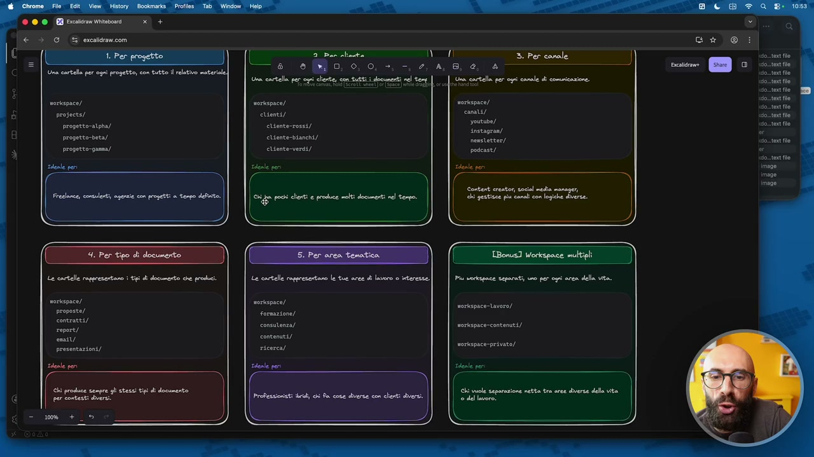

**Testo a schermo (OCR):** Una cartell per ogni progetto; con tutto il relativo materie] morkspace/ profects/ progetto-atpha/ progetto-beta/ I 3. Per canale chiesto TY sai Gra cartella por agi certe son tutti documenti el tent morkspace/ tenti) etente-rossi/ ctiente-bianchi/ ctiente-verdi/ OT Gra cartella per ogni conle di comuicazione. morkspace/ canati/ youtube/ snstagran/ nensretter/ podeast/ DIRE Sig posi crt e pece cati dci nel tento. o A Content creator, soci! media manager, chi gestita più conati con logiche diverse. | 2) I 7) Le cortelle rsperesentano i Epi di documento ce produci. morkspace/ proposte/ contraeti/ report/ emily presentazione, leale per Le cartelle rappresentano le tue arce dì lavoro © interesse | morkspace/ Formazione) consutenza/ contenu) ricerca) Pheale per TBonus] Workspace multigli Pal reciapece torni coi spi cr dl ie morkspace-avoro/ morkspace- contenuti / morkspice-privato/ dente pen Chi prodice sempre gli ctessi tipi di documento per contesti divers. Professionisti ii chi fa cose diverse con chenti diversi. È Ghi vuole separazione netta tra arse diverse dell ita ‘9 del levo. S A,

> l'ho pensato. Queste domande vi dovete fare. Quando avete la risposta a queste domande avete scelto qual è il, diciamo, il vostro, qua potete pure mettere in pausa il video. Lavori principalmente per clienti o per te stesso? Questo già fa la differenza, perché se tu mi dici sono un coach, c'ho 15 clienti, io ti dico guarda non ci devi proprio ragionare, questa è la numero due, vai su quella. Cioè stai perdendo tempo se ti organizzi in altro modo. Se invece lavori per te stesso e quindi imprenditore digitale, solopreneur pure si chiamano, start up di un singolo, le chiamano pure in vari modi, vendi corsi, info prodotti eccetera eccetera, allora probabilmente devi andare sulla modalità progetto, che è quella che uso io. Poi fai un solo tipo di lavoro o fai cose molto diverse tra di loro, perché qui potrebbe avere senso andare sulla modalità quella per aree, no? Quindi dici no, però io cerco di ragionare sempre con qui ci metto la formazione, qui ci metto i libri, qui ci metto la consulenza e così via. Questo sui

## [00:10:00] Schermata 10 _(periodic)_

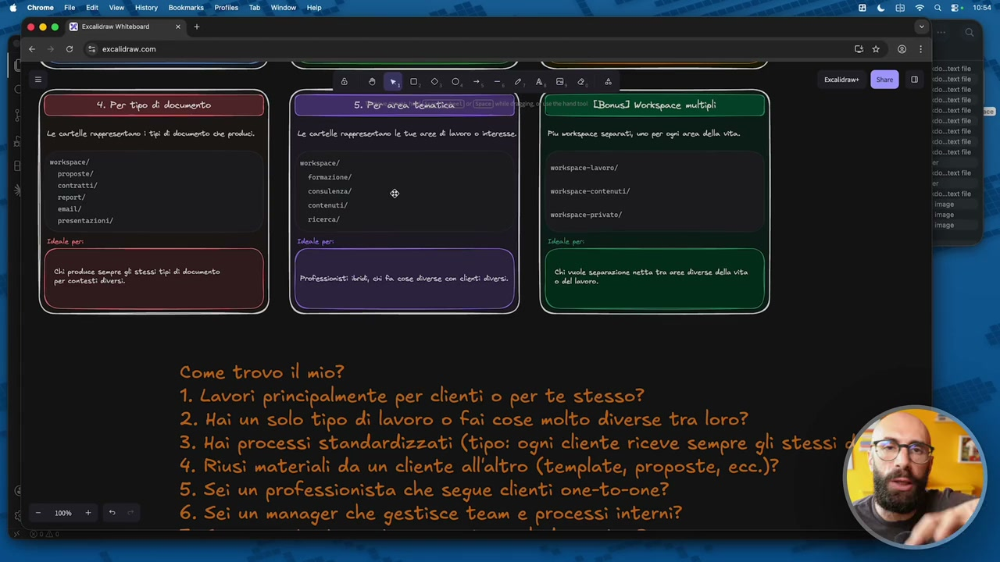

**Testo a schermo (OCR):** La cortelle reppresonteno 1 tei di documento de produ morkspace/ proposte/ contratti/ report) eni presentazioni/ Ideale per Le cortelle rppresentono le tue aree di lavoro 0 interesse. morlspace/ Formazione/ consutenza/ contenuti) nicerca/ ale peri e eo 00, +. -. 4, A, Piu rorkapace separati uno per ogni area della vita. morkspace-avoro/ morkspace-contenuti/ morkspace privato/ dente per hi produce cenpre gi stessi tp di documento per contesti divers. Professionisti let ci fa cose diverse con centi diversi. Chi vuole Separazione netta tra aree diverse dell ita 0 del lavoro. Come trovo il mio? 1. Lavorì principalmente per clienti o per te stesso? 2. Haî un solo tipo di lavoro o fai cose molto diverse tra loro? 3. Haì processi standardizzati (tipo: ogni cliente riceve sempre gli stessi dg 4. Riusì materiali da un cliente all'altro (template, proposte, ecc.)? 5. Seì un professionista che segue clienti one-to-one? 6. Sei un manager che gestisce team e processi interni?

> processi standardizzati è interessante, è utile. Cioè il tipo di documenti che crei, sono sempre gli stessi oppure no? Perché se tu fai sempre gli stessi documenti qualcuno potrebbe, diciamo, avere la tendenza ad andare verso la cartella che gestisce i documenti. Quindi tu dici sì Raff, guardi alla fine faccio sempre quello. Il mio tipo di lavoro, faccio un preventivo, faccio la collo conoscitiva, o meglio tutto il contrario, faccio la collo conoscitiva, faccio un preventivo e poi io faccio dei report, quindi poi il mio output è sempre un report. Allora in un processo di questo tipo ha senso questo, dove tu ti fai un workspace con queste cartelle, collo conoscitiva, con dentro tutte le trascrizioni, proposte preventivi, con dentro tutti i preventivi, tre report, finito. Cioè non ha senso andare in cose molto più complesse. Riuso i materiali di un cliente da un all'altro, questo in realtà più che per scegliere il tipo di workspace vedremo dentro, potete mettere due tre cartelline utili per riutilizzo dei materiali.

## [00:11:00] Schermata 11 _(periodic)_

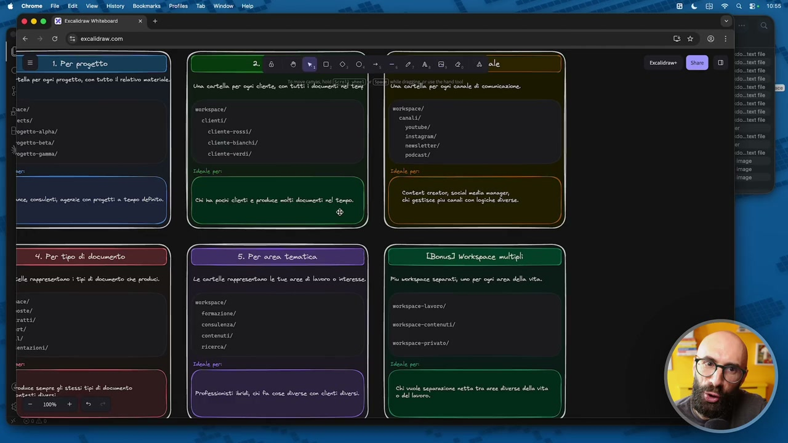

**Testo a schermo (OCR):** Jace/ ects/ tegetto-atpha/ dun crtala per api dota coli ELSE norkispace/ etienea/ eltente-rossi/ eltente-bianchi/ eUtente-verdi/ eat peri morkspace/ canati/ youtube) instagran/ enstetter/ podeast/ tleale per chi ha pool clesti e predice molti documenti nel tenpo. a Content creator secal media maneger Si peste pi a lega dere. oa ae à ” = 4. Per tipo di documento elle rappresentano i tipi di documento che prodici. ‘ace/ roste/ set sel uv rentazioni/ o————z;= ; ( stese __) = norkispace/ Formazione) consutenza/ contenuei/ ricerca/ Plenle per Piu reckspace teparat; uno per ogni area della vita. norkspace-tavoro/ norkepace-contenuti/ norkspace-privato/ leale per Codice sempre gli stessi tipi di documento patenti ere ito + © Chi vuole Separazione netta tra arce diverse della ita 0 del lavoro.

> Se un professionista che segue clienti one to one, quindi diciamo chi ha tutto il mondo coaching, formazione, consulenza eccetera, anche lì probabilmente la struttura clienti è quella preferibile per voi. Se un manager e invece gestisci team, dice uno sta guardando questo corso e dice Raff ma io in realtà lavoro per un'azienda, non lavoro per per terzi, nessun problema perché se lavori per un'azienda puoi comunque scegliere una di queste strutture. Sicuramente non avrai la struttura per cliente, è molto probabile che tu avrai la struttura per progetto e quindi dici io lavoro dentro Mercedes, curo il marketing di Mercedes e allora ogni volta che c'è un nuovo progetto io me lo gestisco così. Oppure con le aree tematiche e qui tu dici no io lavoro dentro il marketing di Mercedes e voglio tenere ben organizzata per delle aree le cose che facciamo all'interno del team di marketing. Content creator, segui più canali, abbiamo visto c'è proprio questa qua con i canali che è quella che vi consiglio, secondo me è quella migliore,

## [00:12:00] Schermata 12 _(periodic)_

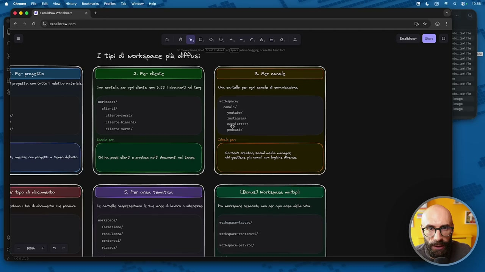

**Testo a schermo (OCR):** I tipi cli workspace più diffusi: (( 2. Per cliente D) Una cartella per ogni chente, con tutti i documenti nel teny morkepace/ mortspace/ elienti/ canati/ youtube) cliente-rossi/ dnstagran) Letteny podkast/ Content creator social eda noneger, chi gestisce pi canali con logiche diverse. La cartelle rappresentano le tue aree dì lavoro © interesse. Piu vorkipaze eperati uno per ogni area della ita. SEE nortispace-lavoro/ Formazione) consulenza/ norkspace-contenuti/ contenu) ateerea/ norkespace privato)

> al massimo qua poi uno si fa, che ne so, la cartella canali e poi dentro separa contenuti organici, contenuti sponsorizzati, per esempio no, per fare esempio perché magari è venuta un'azienda e vuole un video youtube sponsorizzato, allora quella cosa finisce una cartella ad hoc. Se un freelance che lavora su più progetti diversi per clienti diversi, anche qui, diciamo in questo caso, la modalità che io vi consiglio è questa qua dei clienti, quindi la numero due. E ultimo se un imprenditore con più aree di business, perché mi auguro che a vedere questo corso ci siano anche imprenditori, piccole startup, piccole pmi e così via, quindi anche questo potrebbe essere diciamo un corso un corso per voi. In questo caso sicuramente diciamo la cartella clienti è quello meno adatto, probabilmente voi lavorerete per progetto, ok? Oppure, ovviamente qua dipende dal tipo di imprenditore che siete, perché uno può dire pure Raffio io sono un imprenditore ma ho dei clienti e voglio organizzarmi per clienti, quindi ci sta, diciamo quindi la cosa migliore è organizzare per progetto o al massimo qualcuno lo fa per

## [00:13:00] Schermata 13 _(periodic)_

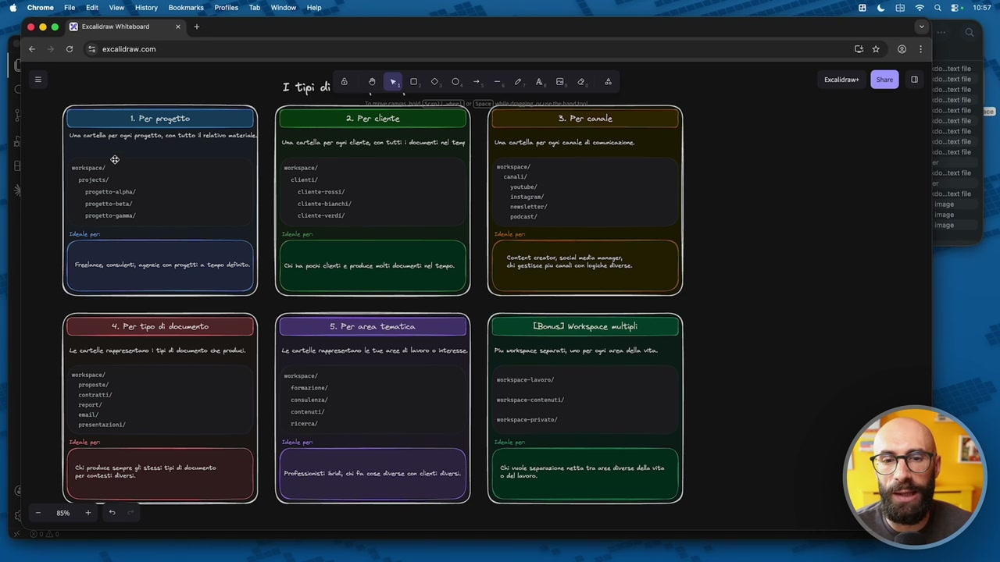

**Testo a schermo (OCR):** (ona rtl per ei pregato; cn tutto lati materie] merce) projects) pregressa) prepetto-beta/ prepeto-gama/ te pe merca) qnt adtenteres/ persi pacca) Freda, cme sonia cu rogiti tego detta _ 2, = Sorta creato sed vete Si pesta pa Le rtl repretertaro Kid deverta e prod mpica) report) muy be pn È te artlle rapretrtaro Le tue aree di avro 0 internt. i conitenza/ contenti le per ua tipe separati no por pi area del ita. morte avere) meriace contenati/ mertspce privato) ste en 3 produce tepre pl sta i di donante fe Cani re [ria ra 3 e aparione netta tr csi Besa del it fetpetay \S 23

> area tematica, ok? Quindi qua vi mettete pausa, vi leggete queste domande, poi scegliete il più adatto, ma ricordatevi che comunque, anche se l'avete scelto, in qualsiasi momento potete passare a un'altra modalità.
