# Creare il proprio workspace

> Documento generato automaticamente: trascrizione e screenshot sincronizzati del video-corso.

## [00:00:00] Schermata 0 _(start)_

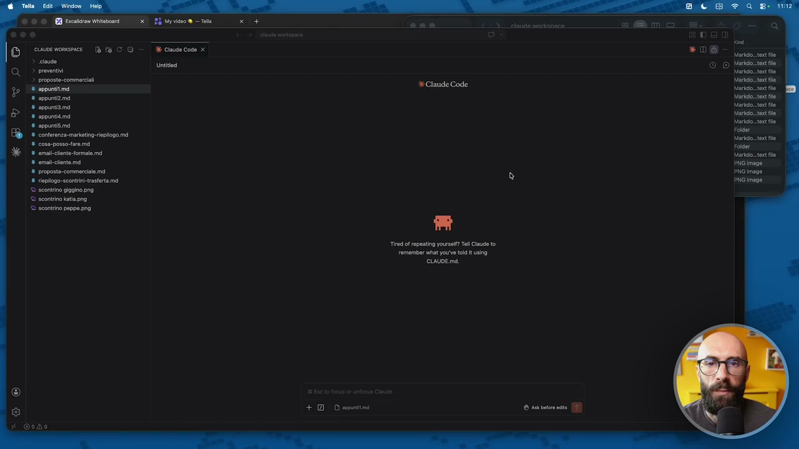

**Testo a schermo (OCR):** +2 Despina

> E ora passiamo a farlo in pratica. Quindi vediamo le cose che abbiamo imparato in termini di concetto, come le portiamo dentro Cloud Code. No, vi ricordate, questo è il nostro ambiente di lavoro. Qua abbiamo anche il workspace incasinatissimo, brutto, sporco. Quindi la prima cosa che facciamo, questa è la cartellina nella quale stiamo lavorando, ve la ricordate? Mi faccio un attimo una cartella su desktop e la chiamo monnets. Perché questa roba ci potrebbe servire dopo, non la voglio buttare. Eppiamo tutta questa roba qua e ce la spostiamo dentro monnets in modo tale che svuotiamo il nostro workspace. Quindi in questo momento il workspace è vuoto. Vedete, non c'è assolutamente niente. La creazione del workspace non la facciamo noi, la fa Cloud Code. Ma questo, vedrete, sarà la risposta che vi darò in tanti altri moduli di questo corso. Cioè, quando abbiamo delle cose grosse da fare, delle cose importanti da fare, non le facciamo mica noi a mano. D'altronde ci stiamo creando questo potente assistente AI che deve semplificarci la vita, che deve aiutarci nel nostro lavoro.

## [00:01:00] Schermata 1 _(periodic)_

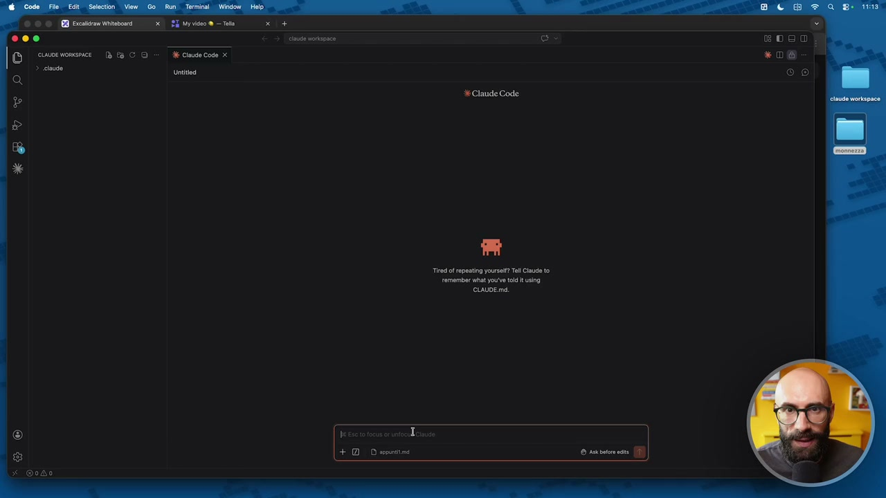

**Testo a schermo (OCR):** cine vomsrice | [è fa C © dk Clsecode x > alude Untitiea ka I + DO Depot

> Ci mancherebbe che metta a favore le cartelline a uno a uno. Quindi gli spieghiamo quello di cui abbiamo bisogno e Cloud lo fa per noi. Vi ricordate, ho detto, con Cloud Code ragioniamo sempre meno sul prompt. Infatti qua non mi metterò a darvi dei prompt che potete copiare e incollare. Lo gestiamo in maniera molto, molto, diciamo, discorsiva. Vi faccio vedere due approcci. Il primo, che è quello, diciamo, come lo farebbe una persona che ha poca esperienza con Cloud Code. Ok, quindi funziona, ci porta a casa il risultato, ma non è il metodo più potente. Allora, la cosa che gli dico qua è, sono un freelance che si occupa di formazione. Devo creare da zero il mio workspace in Cloud Code. Voglio che sia organizzato in base ai clienti con cui lavoro.

## [00:02:00] Schermata 2 _(periodic)_

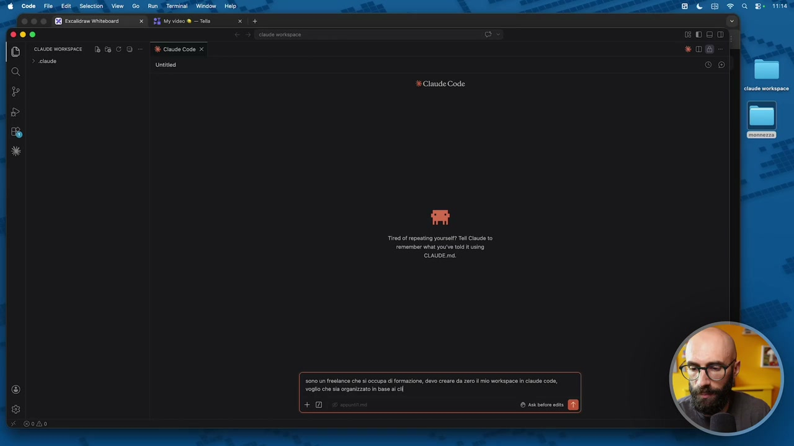

**Testo a schermo (OCR):** © © I Pucaid iieboard x SE eye ® — eta 000 cioe womsace | (B Ea CD Cig Code x > lu Untitea 50n0 n fresiance che si occupa di formazione, deo creare da ero mo werkspae in ciaudo code, voglio che sa organizzato i base ai i +0 © asc.

> E poi magari gli aggiungo una cosa extra, tipo, creami altre cartelle extra che pensi possano essermi utili per organizzare i file nel mio workspace. Ok, qua vi ricordate, abbiamo alcune cose che possiamo selezionare. Ask before edits, edit automatically. Per adesso lasciamo ask before edits. Ve l'ho detto, no? Qua se vogliamo dare l'autorizzazione volta per volta oppure no. Qua possiamo scegliere, diciamo, il tipo di modello che stiamo andando a utilizzare. Per una roba del genere non ha senso, diciamo, possiamo usare pure un modello un po' più leggero, mettiamo Sonnet. Mettiamo sempre la modalità thinking abilitata. Io, diciamo, lo lascio sempre ragionare anche su queste cose. Qualcuno dice di no, che per la gestione del workspace non è necessario, io preferisco di sì. E gli alzo anche un pochino l'effort, giusto per sicurezza, ma questi sono dettagli. Ok, vedete che quando cambiamo modello qua ce lo ricorda pure. Gli diamo invio. Adesso Cloud Code quello che farà è analizzerà la mia richiesta.

## [00:03:00] Schermata 3 _(periodic)_

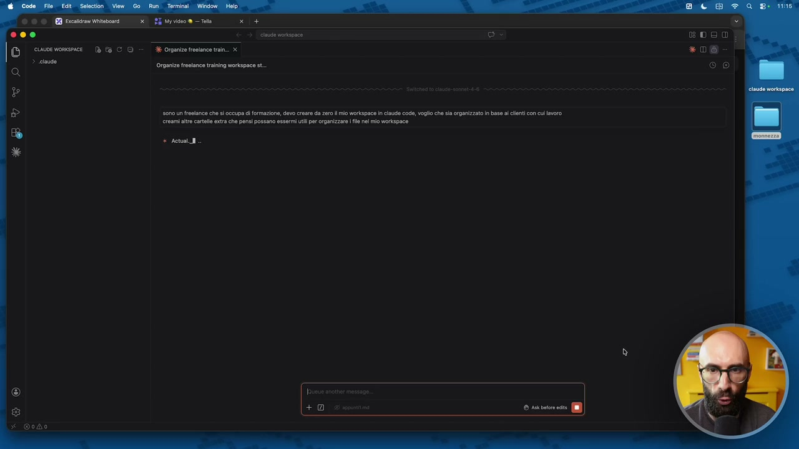

**Testo a schermo (OCR):** RucaidaiWitabonrd XS] Myvdeo® ta 000 csi nomsrice | (è fa C © - Orgonze freelance rain. X asa; Organizefraeanco training Workspace st... 50n0 un reslance che si occupa di formazione, devo crere da ero l mio Workspace in ciau cod, voglio ch sa organizzato in base al centi con cui voro creami altr carte extra che pens possano essermi tl pr organizzare | ne mio workspace + Reti

> Quindi dedurrà da quello che gli ho scritto quello che potrebbe essere utile. Qua sta andando a leggere il mio profilo in memoria, perché avevamo giustamente il profilo in memoria dai moduli precedenti. E mi dice, guarda, mi autorizzi a creare questa roba qua? Io faccio yes e lui sta creando. Ecco qua. Guardate cosa ha tirato fuori. Amministrazione, archivio, clienti, corse, materiali didattici, proposte commerciali, risorse e riferimenti, template. Cioè in un nanosecondo ha fatto il workspace. Ovviamente il workspace è vuoto adesso, perché non ci sono le cartelle dentro. Però come organizzazione mi dice, allora guarda cosa ho fatto per te. La cartella clienti, dove ho fatto una sottocartella per ogni cliente. Quando vado dentro clienti, qua ci sarà la cartella template clienti, dove dentro ci possiamo mettere pure dei template. Poi mi dice, ogni volta che vuoi ne puoi copiare uno qua dentro. Poi proposte commerciali, quindi qua dentro ci finiranno le proposte commerciali.

## [00:04:00] Schermata 4 _(periodic)_

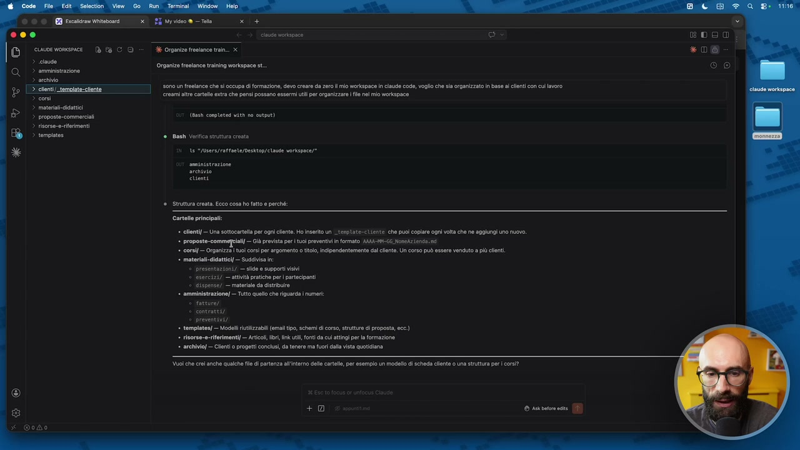

**Testo a schermo (OCR):** Organiz froeanco training workspaco s0n0 un relance che si occupa di formazione, devo crere da zero mio workapaa in ciaude cod, voglio che sia organizzato 1 base a lenti on cul avro creami air carte extra che pens possano essermi uil per organizzare | lo nel mio workspace (bash complete wita no output) e Gant Verifica tratt conto 19 /usars/ratfaete/mesitop/elause vrispace/* Struttura cresta. Ecco cosa ho fato e perché: Cartelle principali ‘ llen — na sotocartela per ogni cente. Ho Inserto un _teaplate-c}iente che puo copiare ogni vota che ne aggiungi uno nuovo a JM — Gà prevista per tol preventivi i ormato AKICAR-GG Nomen. * colf — Organizza tuo or per argomento tto, Inipendentemente dal lente. Un corso può assera venduto a più cent. materiali. didttiil— Suasa in: * presentazioni / — se e supporti vis © esercizi —attià pratiche per partecipanti dispense) — materia da leur * amministrazione] — Tutto quel che riguarda numer * fattore) * contratti/ © preventivi * templates] — Modo riuizzabii (emal tp, schemi i coso, siuiture di proposta ecc) * risorse-e-ifrimenti — Arco, Ibi, ut, fonti da cu atingi pera formazione * archivio] — Cln! progetti concusi, da tenere ma fori dall vista quotidiana Vil che cri anche qualche fl di partenza al'sterno dell carol, pr asempio un modello di chica ciente 0 un struttura peri cora?

> E dice, già prevista per i tuoi preventivi, informato, anno, mese, giorno, nome e azienda. Questa cosa qua da dove l'ha presa? L'ha presa dal fatto che si è salvato quella informazione in memoria. Vi ricordate? Quindi sa che io organizzo i preventivi in quel modo e così via. Corsi, organizzi dei tuoi corsi per argomento o titolo indipendentemente dal cliente. Un corso può essere venduto pure a più clienti. Quindi qua ci dice, se tu fai un corso, magari quel corso lo vuoi vendere a più di un cliente. E quindi ti faccio la cartella corsi separata. Poi materiali didattici, vediamo materiali didattici. Qui dentro c'è il fattore sotto cartelle, dispense, esercizi, presentazioni. Ovviamente sono vuote queste cartelle, però vedete, semplicemente gli abbiamo detto che facciamo formazione. Poi template, ci metti i modelli riutilizzabili. Questa è una cartella molto comoda che vi consiglio di creare. E-mail tipo, schemi di corse, strutture di proposte. Quindi se avete dei modelli che poi voi fate tutte le volte, no? Per esempio dite, ah io faccio sempre il preventivo in questo modo. Quindi parti da quello e poi ci cambi dentro sui dati dell'azienda.

## [00:05:00] Schermata 5 _(periodic)_

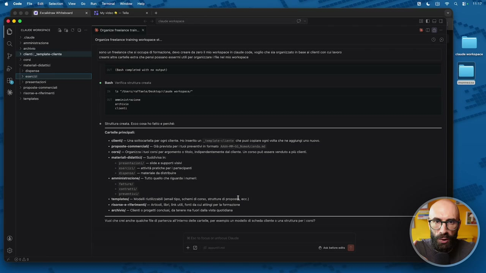

**Testo a schermo (OCR):** 00° [i + 00 ce oisoace cine womsice | Bf CO > elude > amiminitazone > archivio > clent/templae- ciente 3 cor > materiali Organizefroeanco training workspaco sono un relance che si occupa di formazione, devo creare da ero mio workapae incide code, voglio che sa organizzato in base al lenti on cu avoro croami lr carte extra che pens possano essermi uti pr organizzare | la nel mio workspace (tas complete ita no stout) 19 “/users/ratfaete/Desitop/elause vorispace/* Struttura creata. Ecco cos ho ato e perché: Cartello principali ‘lle — Una sotocartla pe ogni cente. Ho Inserto un _teaplate-eliente che puo copiare ogni vota che ne aggiungi uno nuovo - proposte-commercal — i prevista pr tuoi proventi in formato AXV-GG None endand + corsi — Organizza tuo or per argomento 0 tto, Inipendentemente dl lente. Un corso può essre venduto a più cent. materiali didattici — Sudavisa in: * presentazioni / — se e support vivi © esercizi — atti pratiche per partecipanti > spenze/ — matri a distribuire + amministrazione] — Tutto quelo che riguarda numer * contratti/ © preventivi * templates] — Model riutizzabii (ema tip, schemi i coso, siuiture di propo, ecc) * risorne-e-ifrimenti = Arco, bri link uti, fon da cu atngi era formazione * archivio] — Cln progetti concusi, da tenero ma fori dall vista quotidiana Vil che cri anche qualche fl di partenza alito dell carol, pr esempio un modello di schida ciente 0 ina sutura per | cora?

> Risorse e riferimenti, se ci vuoi mettere libri, link, articoli, fonti da cui attingere. Eppure questo è molto molto utile. E poi archivio, ci puoi mettere le cose vecchie, così te le togli dai piedi, non li vedi davanti agli occhi. Se a noi ci piace, siamo pronti per lavorare. Ovviamente manca ancora qualcosina, che è il contesto, che è la seconda parte importante, che vedremo tra un attimo. Ma in termini di workspace, noi siamo pronti per lavorare. Perché sappiamo che adesso dentro queste cartelle finiranno delle cose. E lo farà Cloud Code in automatico, non lo faremo noi. Però qua noi potremmo anche già intervenire e dire a Cloud che qualcosa non ci convince. Per esempio qua ci dice, guarda io ho fatto la cartella corsi separata. Perché dice così io organizzo i corsi per argomento o titolo indipendentemente dal cliente. Un corso può essere venduto a più clienti. Magari però noi non facciamo così, cioè non vendiamo corsi online. Noi facciamo formazione specifica su un cliente, non vogliamo la cartella corsi fuori. Quindi io gli dico la cosa dei corsi non mi piace, non faccio corsi generici vendibili a più clienti.

## [00:06:00] Schermata 6 _(periodic)_

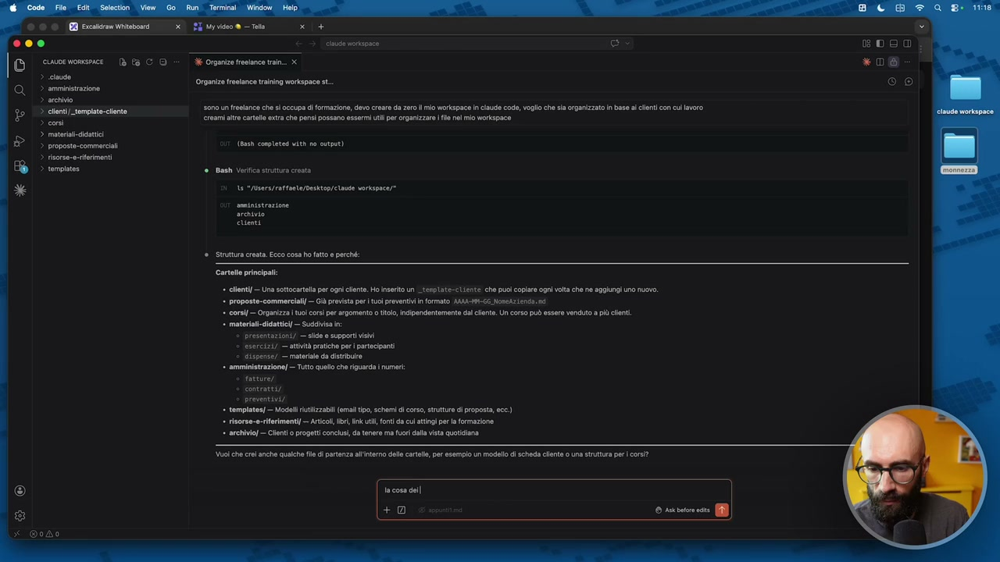

**Testo a schermo (OCR):** XE Organiz fresance train. x Organizofroeanco training workspaco sono un reslance che sl occupa di formazione, devo creare da ero mio workspae in ciude cod, voglio ch sa organizzato in base al centi on ui avoro croami air carte extra che pens possano essermi ili per organizzare | nel mio workspace (hash completed vità no tpat) 1 /users/ratfaete/Desitop/elause vorispace/* Struttura creata. Ecco cosa ho ato e perché: Cartello principali ‘lle — Una sotoartla per gni cente. Ho Inserto un _tesplate-eLiente che puo copiare ogni vota che ne aggiungi uno nuovo - proposte-commerclali — i prevista pr iui prevent in formato ANWM-GC Monet ended * corsi — Organizza tuo orsi per argomento too, Inipendentemente dl lente. Un corso può essere venuto a più cent. materiali didattici — Sudcivisa in: * presentazioni / — side supporti vs © esercizi —attià pratiche per partecipanti © dispense) — materiale da ietulre - amministrazione] — Tutto queto che riguarda numeri è fatture) è contratti/ © preventivi + templates] — Model iutlizzabii(emal o, schemi di corso stuture di proposta ecc * risorne-e-ifrimenti — Arco, bri ink ut fon da cul ting era formazione ‘> archvi/ — lenti proget conc, da tenere ma fuor dala vista quticiana Vil che cri anche qualche le di partenza all'interno del carol, pr esempio un modello di scheda ciente 0 un sutura peri corsi? ta cosa del +0

> Quindi gli possiamo dire semplicemente di togliere la cartella con i corsi. Quindi facciamo togli quella cartella. E poi magari gli diciamo che le proposte commerciali, quindi preventivi, non le vogliamo tenere separate. Perché visto che stiamo ragionando per clienti, noi vogliamo tenere i preventivi dentro la cartella dei clienti. E quindi gli dico inoltre, ah scusate non ho dato invio. Vabbè facciamoci fare questo qua che ci toglierà ovviamente la cartella. Perfetto gli dico inoltre voglio che i preventivi siano nelle relative cartelle dei clienti. Invio. Quindi questa qua con le proposte commerciali non la voglio come una cartella fuori. Perché se no mi incasino. Allora gli do la votarizzo anche qua. Vedete ci ha tolto pure questo.

## [00:07:00] Schermata 7 _(periodic)_

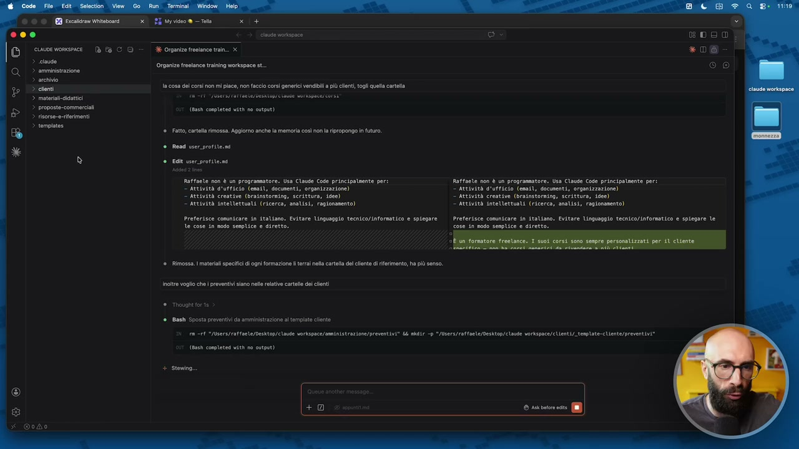

**Testo a schermo (OCR):** 6 organize fresance train. x Organizefalance training workspaco st... a cosa del corsi on mi piace, non acco corsi generici veni più cent togli quela cartela (tas completed with no tout) ® tto cera rimossa. ggiomno anche la memoria cas an la ripropongo in futuro. © Read user profit è Edit user protite.na Raffaele non è un programsatore. Usa Claude Code principalsente per Raffaele non è un programsatore, Usa Claude Cose principalsente peri — Attività d'ufficio (enail, documenti, organizzazione) — Attività d'ufficio (emsil, documenti, organizzazione) — Attività creative (brainstorming, scrittura, idee) — AttiVICÀ creative (brainstoraing, scrittura, idee) — Attività intellettuali (ricerca, anslisi, ragionasento) — Attività intellettuali (ricerco, analisi, ragionanento) Preferisce comunicare in italiano. Evitare Linguaggio tecnico/informatico è Preferisce comunicare in italiano. Evitare Linguaggio tecnico/informatico e spiegare te Le cose in nodo cesplice e diretto. cose in nodo senplice e diretto ‘». imoss. | matera specifici i ogni formazione l terr nel carte el cloni notre voglio che | prevent sian nlle relative carte del conti ©. Thought torta = Bash Sposta prevent da amminatrazone sl template ente rt =plsersAafiaele/desktap/clasde vorkspue/aministrezione/ preventivi” Li sale -p */lsers/raffurte/Desatap/cloue varkspoce/elient/_tnplate-Clente/preventivi* (bash completed with no output) + Stenino ce)

> Tra l'altro, mentre faccio queste cose, lui si va anche a aggiornare delle informazioni. Vedete mi dice, ah ok Raffaele è un formatore freelance, i suoi corsi sono sempre personalizzati. Vedete qua aggiunto anche una cosa rispetto a prima. Siccome gli ho detto questa cosa qua, che non faccio corsi generici da vendere così ma sono solo per ogni cliente. Lui nella memoria di user profile, quindi le informazioni su di me, in automatico si è messo questa roba qua. Questo vedremo, adesso lui lo sta facendo in automatico. Dopo lo faremo in maniera molto strutturata, anche molto più precisa rispetto a quello che sta facendo lui. Perché ovviamente alcune cose le deduce Cloud Code. Mentre noi lavoriamo lui si memorizza cose. Dice ok fammi ricordare questa cosa per la prossima volta. Però poi ci sono momenti nei quali invece noi gli vogliamo dire proprio in maniera precisa che deve fare delle cose per noi. E quindi qua diciamo in teoria noi siamo pronti con il nostro workspace. E questa era la versione diciamo più semplice con la quale la possiamo fare. Vediamo la versione invece quella che preferisco fare io.

## [00:08:00] Schermata 8 _(periodic)_

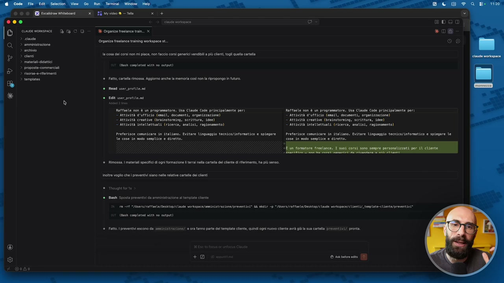

**Testo a schermo (OCR):** Organizefroeanco training workspaco a cosa del cora on mÌ piace, non faccio cor generi vendi più cileni, togli quell carta (bash completed vito no output) ‘® atto, carla rimossa, Agiomno anche la memoria cos on la riprapongo i futuro è. Rand secprotite;n è un programsatore. Usa Claude Code principalmente per: Raffaele non è un programatore. Usa Claude Code principatsente per: ‘ufficio (emsil, documenti, organizzazione) — Attività d'ufficio (emsil, documenti, organizzazione) — Attività creative (brainstoreim, scrittura, idee) " ARtIVICÀ crestive (brainstorming, scrittura, idee) — Attività intellettuali (ricerca, analisi, rogionanento) — Attività intellettuali (ricerca, analisi, ragionamento) Preferisce comunicare in italiano. Evitare linguaggio tecnico/informatico e spiegare | Preferisce comnicare in italiano. Evitare Linguaggio teenico/informatico e spiegare le Le cose in nodo semplice e diretto, cose in nodo semplice e ». Rimossa. | matera specifici i ogni formazione tri ela carte el clnte gl rilerimento ha più senso notre voglio che prevent siano nelle relative carte dei centi Than fre en rt MAUsers/atfaele/Desktap/clade verkspace/smministrzione/ preventivi” Li ahaLe 
 E non voglio fare nemmeno in un modulo separato, ve lo voglio far vedere nello stesso modo. Allora facciamo così, voglio ricominciare da capo a creare il workspace. Puliscimi tutto. Qua ovviamente avrei potuto fare pure io a mano. Andavo nella cartella qua, piego queste cartelle, le cancellavo fisicamente e così via. Ma voglio far vedere, lo faccio tramite Cloud Code per farvi vedere come è tutto conversazionale. Lavoro proprio sui file, sulle cartelle. Gli diciamo anche questa cosa, anzi facciamo così. Facciamo resetta anche memory e user profile. Che voglio ricominciare da capo. Questo non è il modo pulito per farlo. C'è un modo più pulito per farlo.

## [00:09:00] Schermata 9 _(periodic)_

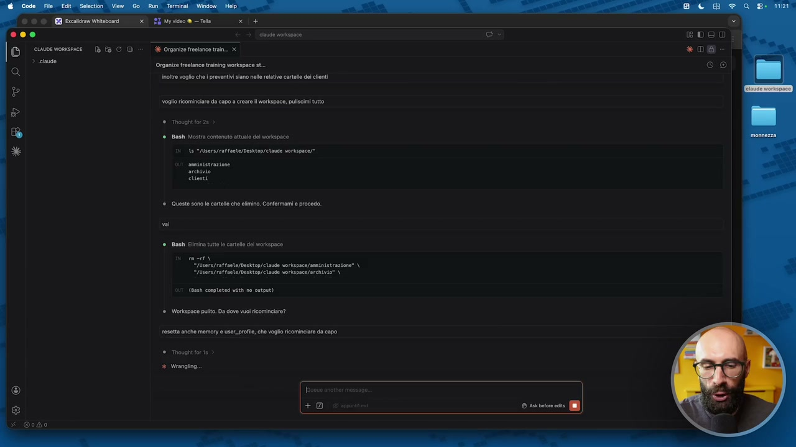

**Testo a schermo (OCR):** COTTE 000 © cuiorvonsice (Fa CO - de Omponie reiance min. x Rio) Organize freelance training workspaco st... note voglio che prevent siano nl eltiv carte dl centi voglio ricominciare da capo a creare Il workspace, pulscimi tutto ® Thought forze nah Mostra contnutoatuao del orksnaee DI 15 evasers/ratfante/Dshtop/clade vorkspcer® * Queste sono le canile che elimino. Confermami è proesdo. vi e Gant Elimina tuto o catllo del workapeco marti 051) aftante/dshaop/claude vorespoce/seministrazione \ = f0sera/ aftacle/besrtap/clade verispece/arenivi* \ (Bash completed with no utpat) ‘Workspace pulito. Da dove vuoi ricominciare? resetta anche memory e user_proti, che voglio icomcire da capo è Wranging.

> Ai fini di questo esempio lo facciamo perché ovviamente abbiamo delle informazioni che lui si è salvato. Che potrebbe andare a compromettere l'esempio che voglio farvi vedere adesso. Tutto qua, questo ultimo comando potete pure ignorarlo, voi non lo dovete fare. Voglio far vedere che abbiamo fatto un primo approccio alla creazione del workspace. Molto semplice, molto naive. Ed è quello che potrebbe fare una persona con zero esperienze in Cloud Code. Adesso invece vi faccio vedere come lo farei io. Come una persona che ha un po' più di esperienza con Cloud Code come farebbe questa cosa. Anzi qua fatemi aprire una nuova chat, la voglio proprio iniziare da zero. Gli dico, sto creando il mio workspace da zero in Cloud Code. Siamo un'agenzia di marketing che lavora su vari clienti.

## [00:10:00] Schermata 10 _(periodic)_

**Testo a schermo (OCR):** You come to th absolutely right piace!

> La cosa che facciamo adesso è noi gli diciamo quello che deve fare. Ma gli diciamo di raccogliere da noi le informazioni. Questa è una delle cose diciamo, uno dei cambiamenti più importanti quando iniziate a utilizzare Cloud Code. Avete visto uno dei primi è che smettiamo di scrivere i prompt nel senso classico. Un'altra cosa che farà la differenza è andiamo sempre in modalità domande. Diciamo nella documentazione ufficiale di Cloud, questa cosa la vediamo approfondita. Più avanti la chiamano l'approccio esplora, pianifica, esegui. Esplora, pianifica, esegui. E dopo vedremo bene che cos'è. Ma per farvi capire gli diciamo a Cloud di farci delle domande. Raccoglie da noi le informazioni quando ha tutto chiaro deve partire con il lavoro. Perché magari io adesso mi dimentico di dirgli qualcosa di importante e il workspace non viene come volevo io. Allora la cosa migliore è vedere Cloud di cosa ha bisogno per lavorare e io glielo dico. Quindi adesso gli dico fammi una serie di domande.

## [00:11:00] Schermata 11 _(periodic)_

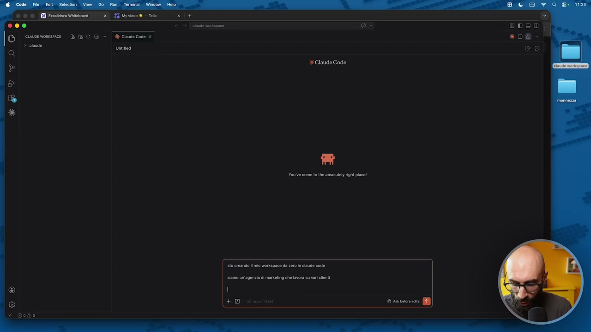

> Tutte quelle che ti servono per raccogliere le informazioni necessarie. Per creare una struttura di workspace ben organizzata per il nostro caso specifico. Ok gli dico fammi le domande una alla volta. Questo è importante perché altrimenti ci fa un elenco di 20 domande e diventa complicatissimo scrivere in chat. Quindi dite sempre fammi le domande una alla volta. Appena hai tutto ciò che ti serve. Noi gli facciamo creare le cartelle ma gli diciamo proponimi la struttura di workspace che vuoi creare e aspetta la mia approvazione.

## [00:12:00] Schermata 12 _(periodic)_

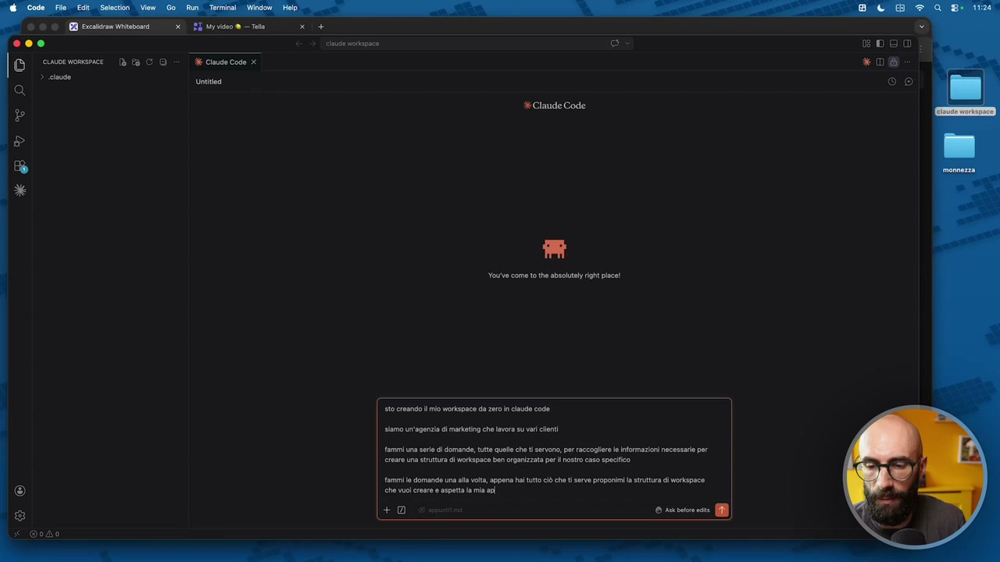

**Testo a schermo (OCR):** 20 RP reno itaca OECETES O00 ce wosce ta CO > elude de Clause code x Untitied 50 creando mio werkspace da zero in laude code: siamo un'agenzia di arkaing ch avra su vari centi ammi una seri i domande, tutte uelle ch servono, per raccogliere le Informazioni necessarie per creare una strutua i orkspaco ben organizata perl nostro caso specifico ammi o domande una al vota, appena hi tuto cò che ti serve proponi a struttura di workspace ‘he vuo creare e aspetta la mi gi +0 © sci (I

> Quando vi dicevo in Cloud si usa la modalità esplora pianifica e segui. Intendevo proprio questo. Cambiamo proprio il modo di lavorare. Noi gli diciamo tutte le cose in un solo colpo perché potremmo dimenticarci qualcosa di importante. Ma diciamo a Cloud di intervistarci, di interrogarci, di domandarci. Questo è un cambio importantissimo proprio di approccio su come usate questi strumenti. Quando Cloud ha tutto quello che gli serve e lui lo sa cosa gli serve non noi. Noi lo facciamo lavorare perché sta lavorando sui nostri file, sta lavorando sul nostro computer. Non ve la dimenticate mai questa cosa. Ma gli diciamo fammi vedere cosa stai per fare. Se mi piace te lo approvo. Se non stai a fare una cazzata te lo approvo. Altrimenti lo modifico un pochino. E questo non è nemmeno il modo più ottimizzato di farlo. Più avanti vedremo anche un modo più elegante di fare questa cosa. Ma per adesso diamo invio. Già qua state capendo quanto è potente questo strumento. Allora partiamo dalla base. Quanti clienti gestiti attualmente?

## [00:13:00] Schermata 13 _(periodic)_

**Testo a schermo (OCR):** 1 suono Mico è satupmanetng ager x > clude Setup markating agency workspace stru. st creando mio worksace da zero in laude code ©. Troughtor2s > Partiamo da base. Quanti lenti gestite attualmente, e come sono strutturati? es. ln piccoli con progetti ne-shet, centi grandi con einer mensile, mb del duo, oce)

> Come sono strutturati? Clienti piccoli con progetti one shot? Clienti grandi con cose mensili? Remix dei due? Eccetera eccetera. Gli dico abbiamo sempre più clienti in contemporanea. E a volte sono piccoli e a volte più grandi. Io non so perché mi ha fatto questa domanda. Lui la userà perché gli serve per organizzare le cartelle. Quali servizi offrite? Vedete adesso inizia a lavorare in termini di servizi. Bene. Qua potremmo dire che facciamo. Che ne so. Creazione contenuti video. Creazione contenuti testo. Me li sto inventando. Ovviamente non deve essere per forza così. Campagne social media. Non facciamo, non mettiamo troppe cose. Sennò poi diciamo diventa troppo lungo l'esempio. Però per far vedere che possiamo descrivere le cose che facciamo. Ovviamente io qua sto facendo un esempio. Se voi non siete una web agency fate il vostro di esempio.

## [00:14:00] Schermata 14 _(periodic)_

**Testo a schermo (OCR):** E Setup marketing agency X Setup marketing agency workspace stri. st creando mio workspace a zero in laude code ® Tmoughttorze ® Partiamo dalla base. Quanti lenti gestite attualmente, e come sono strutturati? es. ln piccoli con progetti ne-shot, ceti grandi con retainr mensile, mix dl due, occ.) abbiamo sempr più lenti n contemporanea e a voto son piccoli a ole più grand © Thoughttorie ®. Chiaro. Seconda domanda: Qual servizi oltrito? (ea social media management, SEO, campagne ads, content retin, emali marketing branding, it ob ecc. — elenca puro tutt quello che ate) reazione contnui idee, creazione contea testo, campagne sci! media +0 OST)

> Ma l'approccio è identico. L'importante è che capite cosa voglio trasmettere come approccio. Contenuti video. Contenuti testo. Campagne social media. Che ne so. Facciamo scatti fotografici professionali. E boh traduzioni. Va bene? Mi invento questi servizi qua. Un po' strano come agenzia. Però va bene così. Terza domanda. Com'è composto il team? Quante persone? Quali ruoli? Perfetto. Diciamo che non siamo molto grandi. Ok? Diciamo siamo dieci persone. Facciamo così. Facciamo, qua l'ho detto. Tre sui video. Uno sul testo. Uno sulle foto. Siamo a cinque. Poi diciamo tre social media. Due traduzioni.

## [00:15:00] Schermata 15 _(periodic)_

**Testo a schermo (OCR):** at ereando mio mrkapace da zero in claude code © Troughttorzs ®. Partiamo dll base. Quanti lenti gestite attualmente, o come sono strutturati? es. ln piccoli con progetti ne-she, centi grandi con etainr mensile, mix dl due, occ.) abbiamo sempre pù clnt n contemporanea e a vote sono piccoli a ole più grand ® Thought torte ®. Chiaro. Seconda domanda: Quali servizi ftrit? (es. social media management, SEO, campagne ads, content rain, emi marketing branding, st eb, ecc. — elenca pur uo quelo che fate) creazione contenuti viceo, creazione contenuti testo, campagne socia media, scatti fotografici rotessonali, traduzioni Thought or 08 = ottimo Terza domanda: Com'è composto team? (s. quante persone, con quali vol — copywriter, video editor account manager, ce) amo 10 persone: $ sui video 1 su testo, sulle oto, 3 soci medi, 2 traduzioni + Wa

> Anche qua sto inventando e sto semplificando. Voi se volete mettete le cose con più calma, con più dettagli e così via. O semplicemente gli dite che è irrilevante. Potreste dire no, no, guarda la composizione del team è irrilevante per la creazione del workspace. Come gestite attualmente i file e progetti? Usate Google Drive, Notion, server locale, cartelle su computer e così via. Gli posso dire Drive per file e cartelle e poi Trello per gestione progetti. Aspettiamo e vediamo qual è l'altra domanda. Vedete la differenza che vi dicevo rispetto a prima? Ci sta chiedendo lui le informazioni che ci servono. Per cosa volete usare Cloud Code specificamente? Generali test per i clienti, automatizzare report, creare script video, gestire brief, fare ricerca, tutto. Lo inseriremo in qualsiasi attività. Lui sta cercando di dedurre quali sono le cose che ci servono a noi e di conseguenza ci va a fare le cartelle.

## [00:16:00] Schermata 16 _(periodic)_

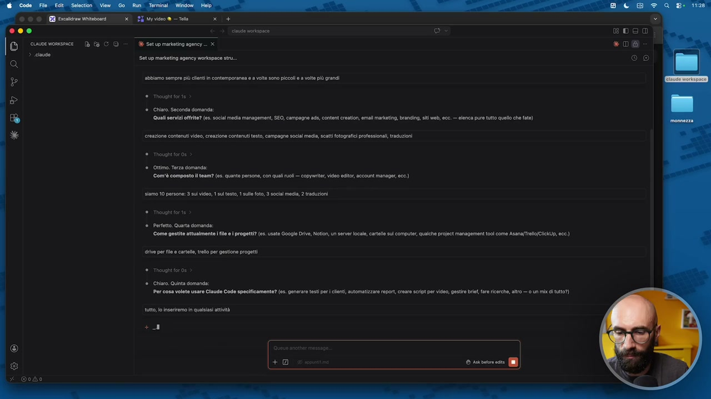

**Testo a schermo (OCR):** 6 Setup marketing agency —. x Setup markatig agency workspaca stru. abbiamo sempre pù lenti in contemporanea e a volto son piccoli a vote pù grandi hcognt fort ®. Chiaro. Seconda domanda: Quali servizi olfrit? (es. social media management, SEO, campagne ads, content retin, emi marketing branding, st ob, ecc. = elenca puro tuto quello che ft) creazione contenuti io, creazione contenuti testo, campagne social media, scatti fotografici roessionali traduzioni =. Thowght for 06 ottimo Terza doman: Com'è composto li team? (es. quant persone, con quali ruoli — copywriter, video edo sccount manager, ce) amo 10 persone: sui video su tsto, sulle oto, 3 social media, 2 traduzioni # ivoght fre ® Perfetto. Quarta domanda: Come gestite attualmente fila e progetti? (6. usate Google Divo, Noto, un server ica, cartello sul computar, qualche project management tool come Asana/Tralo/Ciekyp, ecc) ivo per le cartelle rl pe gestione progetti © Tnovgni or 06 ® Ghiara, Quinta domanda: Per cosa volete usare Claude Code specificamente? (cs. generar esi eri cen, automatizzare ropori, care script pr video, gesti ria, fare ricerche, altro — o un mix tuto?) tutto, lasrremo in quasiasi attività +4

> Quindi ci ha chiesto come comunicare con i clienti, email, whatsapp, call, portale. Settima domanda, come nasce tipicamente un processo? Arriva un brief da un cliente, viene assinato a qualcuno, si produce, diciamo così, ci contattano sul sito o sui social, facciamo una call conoscitiva, mandiamo un preventivo, alla firma si inizia a lavorare. Di solito è più complesso di così, ma ai fini dell'esempio semplifichiamo. Qua quello che vi voglio far vedere è il fatto che con Cloud Code ragioniamo insieme, ok? Ecco perché questo è un assistente AI full, che si infila in tutte le attività. In quale lingua lavoriamo? Solo italiano. Perché magari voleva farci delle cartelle per le altre lingue, non lo so. Non sappiamo perché ce l'ha chiesto, vedremo alla fine cosa ci propone.

## [00:17:00] Schermata 17 _(periodic)_

**Testo a schermo (OCR):** SEI 0 ® rta O00 © cuorvonsnce I Fa CD > Setup martina agency. x Cani Setup marketing agency workspaca stru. amo 10 persone: è sui video, 1 sultsto, sulle foto, 3 social medi, 2 traduzioni Come gestite attualmente file e progetti? (es. usate Google Divo, Noto, un server cal, cartello sul computer, ualch project management tool come Asana/Trale/CekUp, ec) ivo per le crtll, ro par gestione progetti Thought torce ®. Chiaro. Quinta domanda: Per cosa volete usare Claude Code specificamente? (es. generare testi per cen, automatizzare report, cara script per io, gesto brit, ar ricerche, altro — utt inseriremo in quasiasi tività Thought for os ® Sesta domanda Come comunieate coni clienti? (es. emal, YhatsApp, cal, n portale dedicato — e hi è I punto di contatto principal, un account manager 0 ogni specialist parla irettamente col lento?) cat Settima domanda: Come nasce tipicamente un progetto? (es. arriva un brit da lente è ine assegnato a qualcuno si produce siva per approvazione > sl pubblica — c'è un processo standard 0 ogni servizio ha ls lusso?) contattano sul sito 0 sul soci, fcelamo una cal conoscitiva, mandiamo un preventivo, alla fama linizia a avrare e Thovant for 06 ottava domandi: in quali ingue lavorate? (alano sicuramente, male traduzioni ln che direzione vanno — lenti sono prevalentemente alan anch strane?) sol +0 DIS)

> Perché la cosa importante, ricordatevi, è che gli abbiamo detto di mostrarci quella che è la proposta che lui vuole fare di workspace, non di andarla a creare. Perché magari vuole creare 50 cartelle e quando è partito, no, è troppo tardi, invece adesso voglio proprio vederlo. Eccolo qua, guardate che spettacolo. Guardate che spettacolo. Mi ha detto, ecco qua, io ti farei questa struttura. Allora, ignorate per un attimo questa roba qua, ok? Che questa è la cosa più importante di tutti, ma ci sarà un modulo tra poco, è il contesto diciamo sul quale lavoreremo. Guardiamo un attimo le cartelle. Allora lui ti dice, io farei la cartella clienti, torniamo qua, andiamola a vedere. Quindi sta lavorando in questo modo, vedete ha scelto la modalità numero due che io vi facevo vedere. Ti farei la cartella clienti, dentro template, così copi per ogni cliente poi ci metti dentro.

## [00:18:00] Schermata 18 _(periodic)_

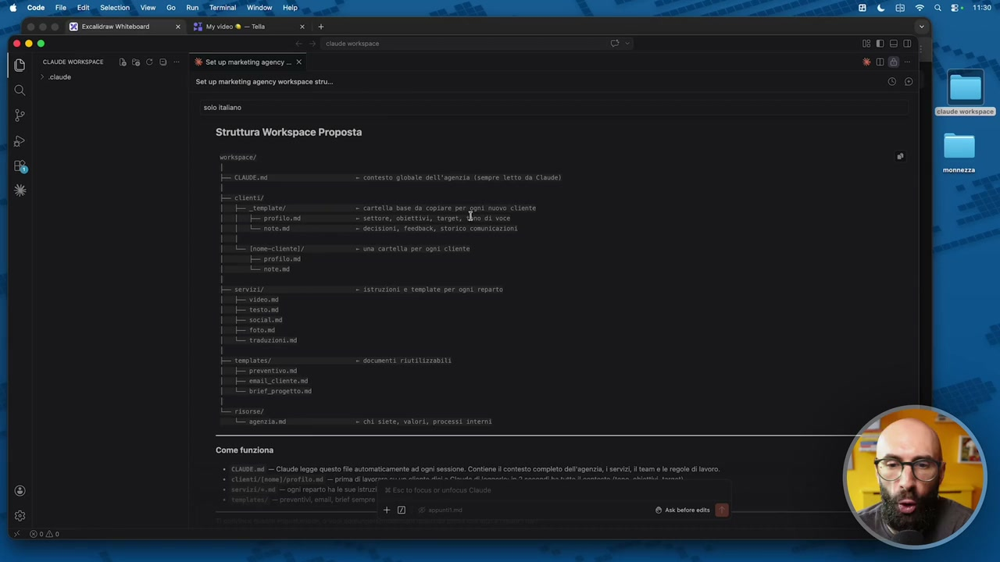

**Testo a schermo (OCR):** © Suorvonsice (Fa CD > Setupmartntng aper ages; Setup marketing agency Workspace stri. solo alano “Struttura Workspace Proposta I Pocwoeini = contesto globale dell'agenzia (sempre. letto a Claude) Ì 1 atene {= tevpiate/ artt e a cotare per gni pv tte |P profatoimi = settore, obiettivi, target, no di voce | I rote.no * decisioni, eedback; storico cosunicazioni i "= tnomectientel/ © na enrtela per: ani cliente 1 protitosa "note. servi = dstruzioni e renplate per: coni reparto Von testo,mi rociatina totosna eraduzioni:no tes © dite ALLA emallLeliente. se BrserLprogetto,n i I I I I I Ì Ì po i i I I | ta î I I rey agenzioine = ehi siete, valori; processi interni Come funziona GUAI — Claude legge quest 1 Alanti/{nose)/protito.xd — prima di aver red — ogni rgart ha ie su |

> Sotto c'è la cartella nome cliente, con dentro vedete il profilo del cliente, quindi là ci sta anche la parte di contesto specifico sul cliente. Quindi sto lavorando per il cliente X, perfetto. Che industria è Automotive? Che cos'è B2B o B2C? B2C. Quanto è grosso? Lavora anche all'estero? No, possiamo mettere delle caratteristiche del cliente. Servizi, qua ci sono le istruzioni e i template per ogni reparto, ok? Template con i documenti riutilizzabili e poi i risorse. Ci sono i valori dell'agenzia, chi siete e così via. Vi ricordate MD? Abbiamo detto non vi spaventate, sono semplicemente dei file di testo, ok? È il formato che usa Cloud Code, sono dei file di testo alla fine, non ci dobbiamo spaventare. Quindi diciamo i vari file MD poi saranno il contesto che Cloud andrà a utilizzare, ma sul contesto c'è un modulo a parte. Per il momento capiamo le cartelle, quindi clienti, poi dentro c'è la cosa dei clienti e così via. Perfetto, gli dico questa struttura mi piace, crea il workspace.

## [00:19:00] Schermata 19 _(periodic)_

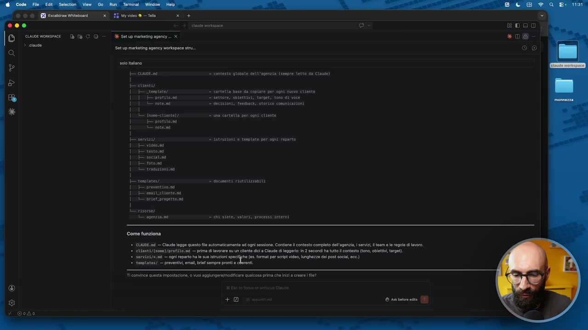

**Testo a schermo (OCR):** CRETE E Set up marketing agency x Zi Setup marketing agency workspaca stru. so alano cioe = contesto globale dell'agenzia; (sempre letto da Claude) Ì po eten 1 testate) = cartella base da copiare per cont iove cliente |P protito:n = dettore, obiettivi, target, tono di vece | 1 notes — decisioni; eadback, storico comunicazioni I I tnoseccLientel/ = una cartella peri sani cLiente 1 protito:sa = dstruzioni e tenlate per'sani reparto = chi sete; valori, processi interni CUNUOE,nd — Claude leggo questo fe automaticamente ad ogni session. Contiene l contesto completo dell'agenzia, sevizi team el rego di avro Eltanti/ none) profilo. 3 — prima di avorae su un cente ii a Cine i leggero: n secondi ha tutt contest (ton, oblett, target. servizi /a-nd — ogni reprto ha e su struioni specie es format pa script do, lunghezze dl ost social, ce) templates / — prevent, emal brief sempre pronte Si conince questa impostzion, 5 ol sgglingeraimadificae qualcosa prima ch nz a creare e? +

> In realtà dopo voglio fargli fare un'altra cosa, ma la voglio fare quando già il workspace è creato. Così vi faccio vedere come lavoriamo su un workspace già presente. Cioè, così come ha creato la cartella template, che è una cartella di cose extra, documenti riutilizzabili, in realtà nella modalità precedente, quella semplice, qua autorizziamo a creare le cartelle, nella versione 1, diciamo, di questo esempio che vi sto facendo vedere, aveva fatto la cartella, per esempio, dove dentro metterci le risorse, vi ricordate? Aveva fatto la cartella, l'ha fatta quale cartella risorse? Ah no, qua la cartella risorse, ma quella dell'agenzia. Io invece voglio metterci una dove possiamo mettere dentro documenti e così via. Allora, qua si è fatta la sua to-do list e qua sta andando a creare, ignorate questa roba qua, ok? Adesso io devo dirgli di sì, lui mi sta creando tutti i file md che sono fondamentali, sono il contesto,

## [00:20:00] Schermata 20 _(periodic)_

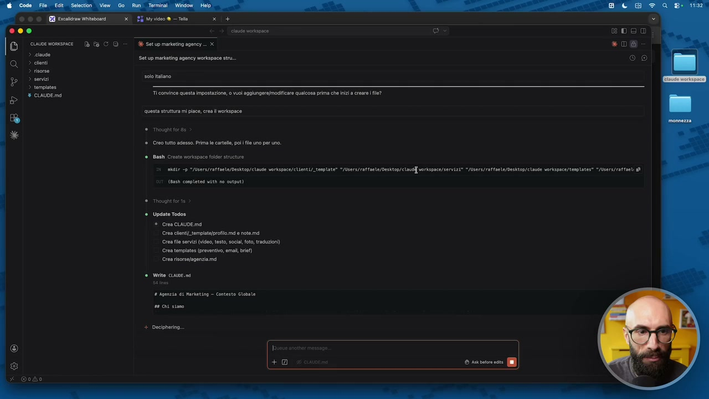

**Testo a schermo (OCR):** solo alano TI cotvince questa impostazione, 0 vuol aggngere/madiiae qualcosa prima che nz a creare le? ‘questa srttura mi piace, cea l worspaco ©. Thought fore ®._Creo tto adesso. rima lo carte, pol le uno per uno. nie -p “NUsers/raffaete/Desctop/clae vorkspace/cLent/. template */isrs/ratfaele/Desktop/clavef vorhspace/servi (bad compiere ito no output) Update Todos * crea CLAUDE md Crea clnti template md e note. md Crea fil servizi (eo, testo, social, foto, 1raduzion) Crea tempiats (preventivo, emal bre!) Crea ricorsagenzia mi Wirito clune.ss # Agenzia di narketing = Contesto Grotte Decihering.

> il contesto però lo vediamo tra un attimo. Contesto e workspace vanno a braccetto, ma se non vi ho fatto vedere il workspace non vi posso far vedere il contesto. Qua che lo voglio far vedere è che lui, diciamo, si è fatta la proposta che ci vuole fare, cioè ci ha mostrato la proposta che ci vuole fare, noi l'autorizziamo, si è fatto una to-do list, vedete, qua sta proprio, qua vedete che è uno strumento agentico, cioè è proprio un altro mondo rispetto a usare gpt, gemina e così via. Qua, diciamo, lui si è fatta la to-do list, sta andando a lavorare sulla to-do list e lo sta facendo in autonomia, questo significa che lavora su uno strumento agentico. Tra l'altro, cosa importante, noi in qualsiasi momento possiamo aprire più istanze di Cloud Code e lavorare in parallelo, proprio perché non sono delle chat, ma è uno strumento agentico. Quindi io qua posso dare un comando mentre lui sta facendo queste cose qua, ok? Cioè io potrei dirgli qua dentro, che ne so, la cartella clienti, ah no, rinomina le cartelle del workspace in inglese, invio.

## [00:21:00] Schermata 21 _(periodic)_

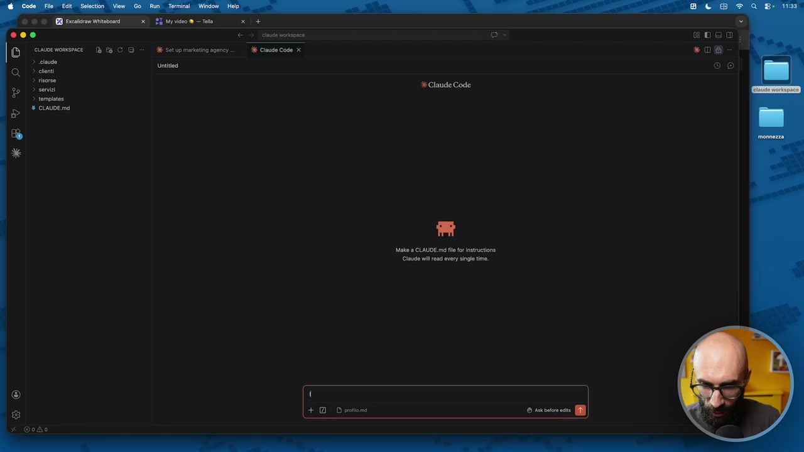

**Testo a schermo (OCR):** cune womsrice (è 9 C © - WE setupmarietingagenoy > alude Ur > lenti > risorse > servizi > tempites % ciAUDEmd Make a CLAUDE id fl for Istueions Claude wil rad every anglo time.

> Perché magari non voglio tenere clienti, risorse, servizi, ma voglio tenere clients, services, no, perché templates per esempio ce l'ha messa con la s finale. Le cartelle da rinominare sono clienti, inclients, perfetto, do invio e vedete ce l'ha rinominata. Mentre questo sta ancora creando le cartelle, ok? Non penso che ci voglia un modulo dedicato solo per far vedere che si possono fare le cose in parallelo, magari in più moduli lo rifaccio così ve lo ricordate. Cioè io qua posso aprire 4 istanze, 5 istanze di Cloud Code, c'è tanta roba ragazzi. Avete già capito da questo quanto è potente questo strumento e perché non stiamo, diciamo, in una semplice chat.

## [00:22:00] Schermata 22 _(periodic)_

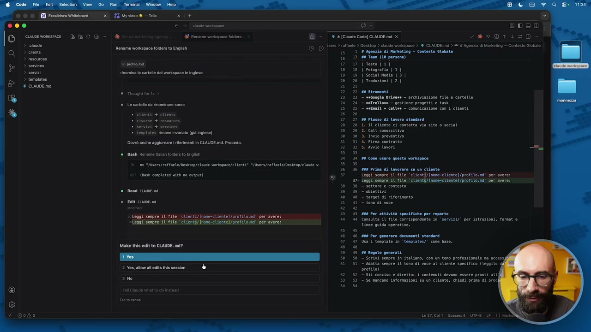

**Testo a schermo (OCR):** + ca oiseace Ce ®Doa cioe worse | fa CO 28 Rena worse for. I “+ (cause Code] CLAUDE md x vasi > cile Sw (5 ner ratto > Desktop > lau monaca > 8 CLAUDE md > # Agenzia di Markating Comesto Cobol > lenta ionici n O OT 1 # Agenzia di Marketing — Contesto Gobete ie 15 ee Tesa Cl persone © pitt Dv |tesjii 10 10 | Fotografia | 1 rinomina le cartelle del workspace in inglese. TRE [in 2020 | rroduztoni | 2 22 22. 0 Strumenti 223. - sedoogle Drivesa — archiviazione file e cortelle ZAC 24 - setrltese — gestione progetti € task 25-25, — refmail è colle — comunicazione con 1 clienti + Alen > cliente » » * risorse > resources 37.27 ee Fausso di Lavoro stanare ‘anse di 2020 1. I Cliente ci contatta vio sito 0 social + tenplates rimane mart Già inglese) S SO Dovrò anche ggicnare fermani n CLAUDE md. Procede. di 31 4 Fino contratto 3232 5: Ario lavori v » 3A 36 #0 Come usare questo vorkspoce n SAUSGFS/ TAM {ac le/Deshtop/ claude vrkspace/elienti* */users/raffarle/Desktop/clade v ss 36.36 see Prima di lavorare su un cliente (Bash completed with no output) 37." Leggi senpre il file *clienti/[none-cLiente]/profilo.n3° per avere: Leggi sempre 1 tile ‘clienti (none-cliente) /profil0.nd' per avere 38° 33 - settore e contesto Read cUDE.si 3939 - obfettivi 4040 - torget di riferimento it cune.ni #1 41 - tono di voce so Leggi sempre IL file Verlenti/ [none-chiente]/oròtilo1md) per avere: DD re ARI Me EI o rmere o Laggi.semprelALIMile clienti? [none-cl{entel/profst0:nd": per avere: Rasa gici paraciin si “ 4646 se Per generare documenti standard 4747 Usa i tenplate in ‘tesplates/* cone base. Mako this edit to CLAUDE. nd? ds 40.49. 0 Rogote generati [(( \ VWwuWuv«o—_«—«—cLrcdcv<vo—=<czszc—-—-»-»e‘ se si al eltente specifico (leggilo 2 Yes, allow al edits this session » sar mou forte Le cart da inominare sono: Ban Rame lla cer to Eng s ano Sì 53 - se mancano Informazioni su un cliente, chiedi prina di proc

> Ovviamente qua adesso mi vuole andare a aggiornare pure i file di contesto, chiudo questa roba qua per non incasinarvi, diciamo aspettiamo che finisce lui di lavorare qua. Quindi vedete ha fatto le, sta andando avanti nel todo, adesso sta nella cartella template, deve fare la cartella risorse e poi ha finito. E come vi dicevo noi possiamo lavorarci dentro questo workspace, continuare a fargli fare delle cose. Per esempio io una cartella che trovo molto comoda è una cartella temp, dove ci metto i file temporanei per esempio e quindi c'è una roba che non mi voglio conservare, ma ti devo far vedere una presentazione da un PDF da 50 pagine, perché su quello poi lo devi utilizzare per fare tu qualcosa, allora lo metto un attimo nella cartellina temporanea, lui la legge e poi dopo quel file lo cancello semplicemente. Quindi cosa gli potrei andare a dire? Gli potrei dire spesso noi utilizziamo, no spesso noi abbiamo materiale esterno,

## [00:23:00] Schermata 23 _(periodic)_

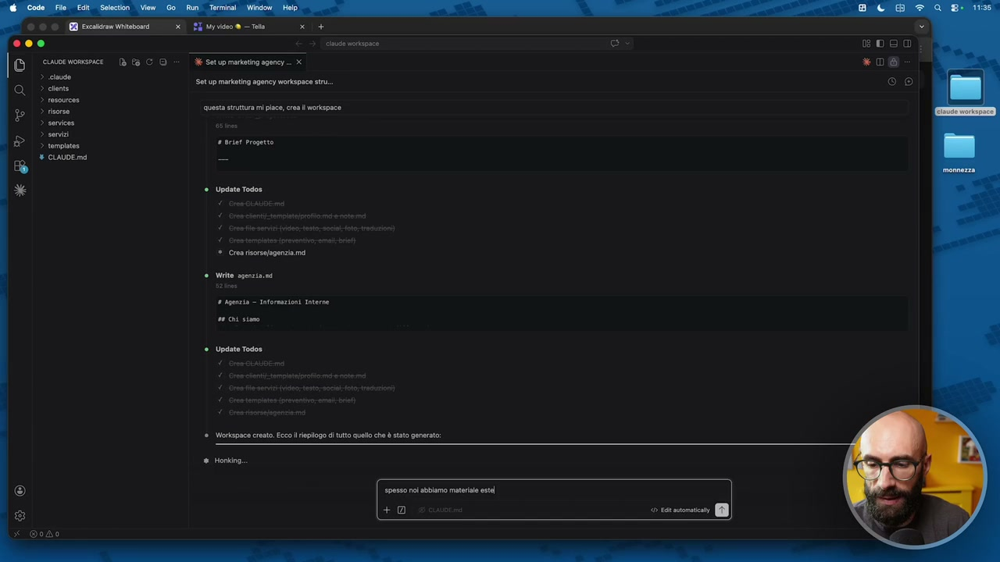

**Testo a schermo (OCR):** |@ ciauor womsice DÒ fa C © + Setup marketing agency. x > into Setup marketing agency workspace stri. ‘questa struttura mi piace, cea morkspace e cit Progetto

> che ne so link, articoli, PDF, presentazioni e altro, che ci serve per diciamo per lavorare sui progetti dei clienti. Ma siccome sono file temporanei non vorrei metterli nelle cartelle dei clienti. Cosa facciamo qua? Chiediamo a Cloud qual è il modo migliore per organizzare questa cosa. Questo fatelo sempre. Cioè tutte le volte che state andando a lavorare sul vostro workspace e aggiungere cose, non date per scontato come vi ho detto adesso, no allora ci vuole la cartella temp come ce l'ha Raffaele Gaito, no perché magari nel vostro caso per la struttura che avete, il tipo di lavoro che avete è più adatto a fare un'altra cosa. Quindi io qua gli ho spiegato l'esigenza, cioè guarda periodicamente guardi questo materiale esterno, è materiale che magari usiamo per qualche giorno poi lo cancelliamo.

## [00:24:00] Schermata 24 _(periodic)_

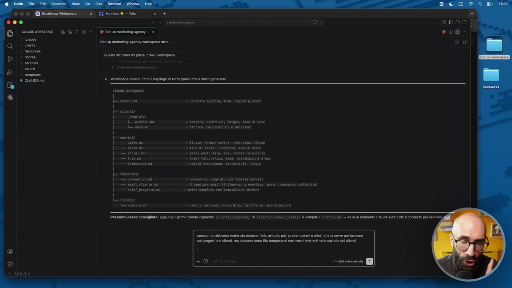

**Testo a schermo (OCR):** ciswoe omerici | [è fa C © - Setupmaretigagency > claudio > cente > sorvicoe > serva > tempites * CLAVDEmI Setup marketing agency Workspace stru. questa struttura mi pico, cea morispace =. Workspace cento. Ecco ieplogo di tutto quelo che è tato generato Î Fr coem 2 contesto: aponzla ten regole otobati i pr eten I renptate/ È protito:so 2 settore, obiettivi, target, tono di voce iaty vii 12 Musso; Fora serapti istruzioni claude testo,na 2 RIDI dI tasto; lunghezze; regole stite © brket fotografico, nosd, destinazioni d'uso eraduziont.nd ‘regole traduzione; sottotitoli, Lingue TTTTT R i tatesy ‘nas Uente. sd ‘75 template enail {JoWlowup, preventivo; mivio; insegna; sotiecito) Drier.progetto:nd 2 brdatconpleto con ampistiche interne FTT I I I i = I I I I I I = I I i I “e vatorii processi oboarding;; tariffario; archiviazione Prossimo passo consigliato: sgiungll primo cento copando € iet/_tenplate/ In cLienti/nase-clUtnte]/ e compl profilo, — da quel momento Claude auà tuto il contesto per avra, spesso nol abbiamo material esterno (ink arco, pdl, prasentazioni ato) che ci serve per lavorare su proget dl cen. ma siccome sono fl temporanei pon vor meter ele carte el centi ì +0 ee)

> Tu che consigli dove lo mettiamo? Quindi io gli dico proprio questo, non sono sicuro di come inserire questa parte nel workspace, se servono nuove cartelle e quali. Qua gli dico proponimi tu alcune alternative organizzative con i pro e i contro e poi io ti dico quale voglio usare. Di nuovo trattiamo Cloud Code come un assistente, quindi ci stiamo proprio ragionando. Lui sa qual è la nostra esigenza, adesso lo sa bene perché si è creato pure il file di contesto diciamo, è partito ha preso diciamo la tangente. Però io ho questa esigenza, immaginate che voi state lavorando da un anno dentro questo workspace, cambia qualcosa e voi dite ah cazzarola, però un anno fa quando ho fatto il workspace non c'era sta roba,

## [00:25:00] Schermata 25 _(periodic)_

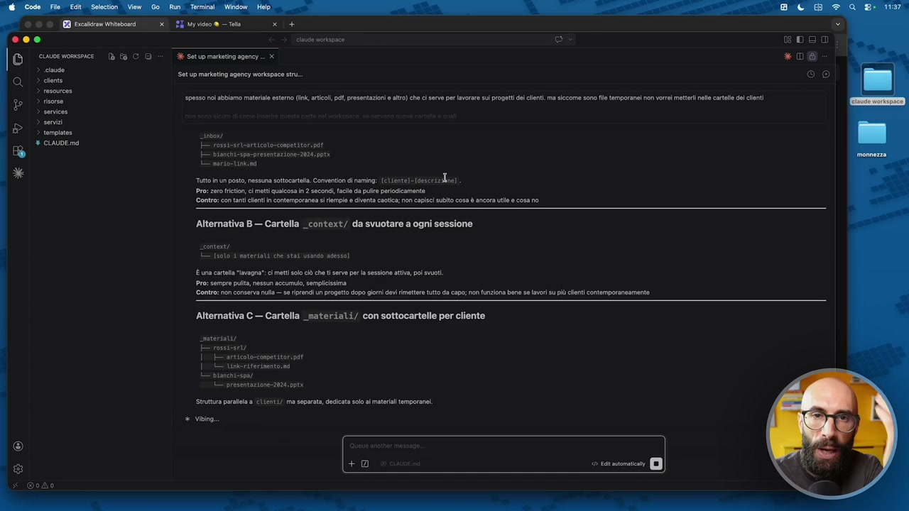

**Testo a schermo (OCR):** CISSE: cine orione XK Setup marketing agency — x Setup markating agency workspaca stru. spesso nol abbiamo materiale esterno (ink aricol, pd, presentazioni e ao) che c serve per ivorare su progetti del lent. ma siccome sono fl temporanl non vorrei metti nelle carte del ceti nani È rossicoricarttcoro-connetitori per 1 btenchi-spa-presentazione-2824:potx cLAUDE md ut in post, nessuna sottcartta. Convention di naming: cliente) testa dm Pro: 20 frico, i metti qualcosa in 2 secondi, foce da pure peioiamene Contro: con ani lenti in contemporanea s empl diventa cao; non capisci subito cosa è ancora lle e cosa no Alternativa B— Cartella _context/ da svuotare a ogni sessione seontenty Tirolo d materiali che stat usando adesso) E una carte lnvagn”i i mett solo ciò che serve pera sessione atta, poi svut Pro: sempre pult, nessun accumulo, semplicissima Contro non conserva nulla — se prendi un progetto dopo gioni devi rimettere tutto da spo; non funziona bene e lavori su più lenti contemporanesmente Alternativa C — Cartella _nateriali/ con sottocartelle per cliente natanti 1 rossicsriy | (PP artieoto-eompetitoripsi i _1= Unerifersmento:n Stuttr paalela a liit1/ ma separata, dedicata sol al materiali temporanei. * vino

> mo come faccio a mettere questo senza sputtanare tutto l'ordine delle cartelle? Lo chiediamo a Cloud, mi dice allora ecco alcune proposte che ti faccio, ti fai una cartella inbox, dove dentro ci metti i file, quindi diciamo questa è una cartella proprio temporanea, ci metti due secondi, la pulisci periodicamente, oppure fai una cartella contesto, che la usi solo nelle chat, quindi la devi svuotare a fine di ogni sessione, oppure una cartella C, ti faccio una cartella che si chiama materiali e dentro ci facciamo le sottocartelle per i vari clienti, questa diciamo durerebbe un po' più nel tempo, a parte che questa rischia di essere un po' ridondante con la cartella clienti, a me personalmente piace questa qua, è quella che uso io, quindi dico procedi con la A, invio e lui va a fare quello che adesso deve fare, cioè la cartellina inbox che faremo,

## [00:26:00] Schermata 26 _(periodic)_

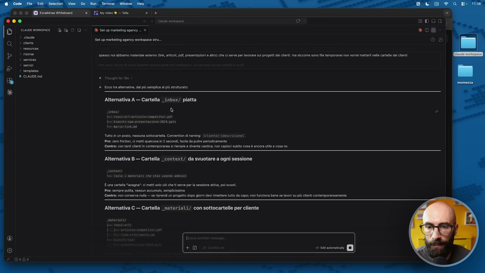

**Testo a schermo (OCR):** Hi Mise nta x + E Setup marketing agency — Setup marketing agency workspace stu. spesso nol abbiamo materiale estmo (ink arcol, pd, presentazioni e ao) che c save per ivorare su progetti del lenta siccome sono fl temporanei non vorrei metti elle carte del centi ©. Thought fore » Ecco tre altematie, da più semplce al più strutturato: Alternativa A — Cartella _inbox/ piatta inox ® | rossiconcariteoto-ctepetitor.pd? = dianchi-spa-presentazione-28 ‘Tutto n un posto, nessuna sotocartel Convention i naming: [cliente] [descrizione] Pro: zo fin, ci mett qualcosa in 2 secon, sce da pulr paioicamente Contro: on tanti lenti in contemporanea i iempl diventa caotica: non capisci subito cosa è ancor tl cosa no Alternativa B— Cartella _context/ da svuotare a ogni sessione Î_ solo 1 materiali che stal usando adesso) È una carta lavagna”: i mett olo ciò che serve pera sessione atta, poi svuo. Pro: sampr pult, nessun accumulo, semplicissima Contro: non conserva nulla — se iprendi n progetto dopo giomi evi rimettere tutto da capo; non funziona bene s aor su pi lenti contemporaneamente Alternativa C — Cartella _materiali/ con sottocartelle per cliente Cestina 1 rossion/

> diciamo che useremo quella temporanea, ci buttiamo la roba dentro, il cliente non lo so Tesla ci ha mandato il brief, lo poggio un attimo dentro questa cartella, poi dopo lo cancello, magari il brief no, perché me lo terrei nella cartella dei clienti, però diciamo vedete qua ci ha creato la cartella inbox, tra l'altro è comodo perché ce l'ha messa pure con l'underscore, quindi si trova pure in alto, ci fa capire che è una cartella con roba temporanea, dentro ci ha creato anche il file come usare MD, e vedete cosa ha fatto in automatico, questo è un accenno, poi dopo ci andiamo dopo nel contesto, qui vanno tutti i materiali esterni, link, articoli, pdf, presentazioni, usate come riferimento per i progetti, non sono file ufficiali dei clienti, sono supporto di lavoro temporaneo, si è segnato pure un po' di convenzioni, tra un attimo vedremo perché questa cosa è potentissima, ma adesso sapete come creare il vostro workspace, usate la seconda modalità, perché è molto più potente della prima, lavorate con le domande,

## [00:27:00] Schermata 27 _(periodic)_

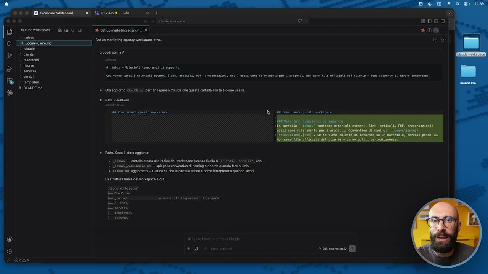

**Testo a schermo (OCR):** # index —Nateriali temporanei di sopperto presentazioni, ec) usati cone riferimento per i progetti. Nn sono file ufficiali del cUnte = sone supporto di lavoro teparane. qui vano tutti A averiati esterni (Link, artico, por, Ora aggiorno GLAIDE.nd per ar sapere a Claude che questa catll esiste e come usar. #8 Come usare questo verkspace DÒ se come usare questo vorispsce fatto. Cosa stato aggiunto: + _inbox/ — cateto crosta all radice del vorispace (stesso velo di Clienti], eriizi/, ecc) + Linbos/cone-usara. nd — spiega la convention di Raming e ricorda quando fare pulizia » TAAiDE,nd aggiornato — Claudio a che ia cartla sito © come itepratara quando lavori La strutura finale de workapace è ora: case vorace” cioe = ino = materiali tenporaneli di supporto += cutentiz E servizi 1 tenotatesy I rdtorse/

> fatevi fare le domande da cloud code, poi vi fate proporre quella che la struttura gliela ha approvata e ve la fate creare, e ricordatevi che potete estenderla all'infinita, avete visto come ho rinominato tutte le cartelle in un solo colpo, avete visto come gli ho fatto fare una cartella inbox in un solo colpo, e così via, quindi state tranquilli perché è flessibile e adattabile, ecco questa è la cosa più importante.
