# I diversi modi di organizzare il contesto

> Documento generato automaticamente: trascrizione e screenshot sincronizzati del video-corso.

## [00:00:00] Schermata 0 _(start)_

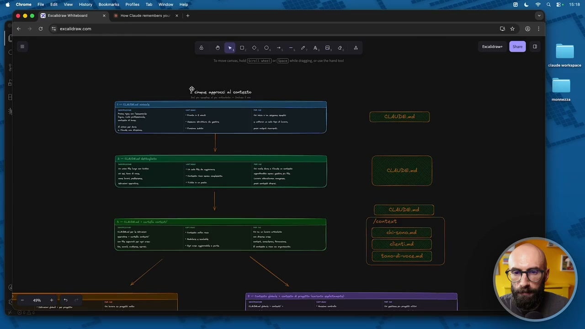

**Testo a schermo (OCR):** LAUDE ad IE SO, tono-di-vote. md \ Di) eee e" esere ==T=""

> Così come ho fatto per il workspace, per lo spazio di lavoro, voglio farvi vedere anche per il contesto che abbiamo vari modi di organizzarlo. Ok, adesso avete capito che cos'è il contesto e dove Cloud ha memorizzato, accumulato nel tempo tutte le informazioni necessarie per lavorare. Qua vi ho messo cinque approcci, come ho fatto nel modulo precedente, dove abbiamo parlato dello spazio di lavoro. Ovviamente non esistono solo questi cinque approcci, questi sono quelli più frequenti, che un po' ho visto usare da persone, un po' ho letto in rete, un po' ci ho smanettato io. E li ho messi anche qui, diciamo, dal più semplice al più complesso. In particolar modo, poi vi ho messo anche proprio quello che uso io, che ovviamente è quello che vi consiglio ed è quello un po' particolare, diciamo è un ibrido. Allora, l'approccio più semplice è fare solo un file, Cloud MD. Allora, voi avete tutto il contesto, avete un poco di contesto dentro Cloud MD, tra l'altro se volete vi lascio anche proprio il link ufficiale della documentazione sul sito di Cloud Code, su come Cloud gestisce questa cosa.

## [00:01:00] Schermata 1 _(periodic)_

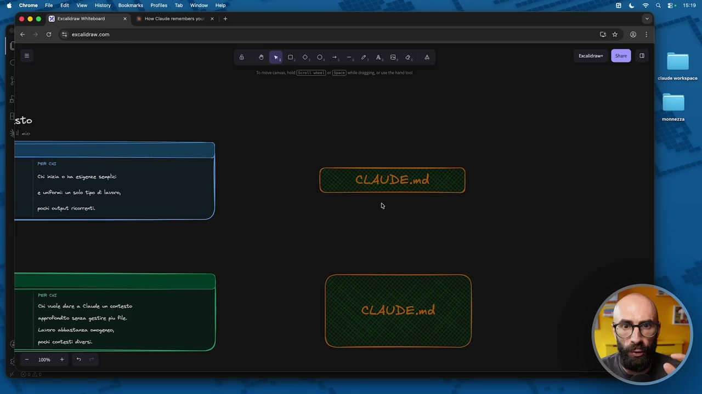

**Testo a schermo (OCR):** x RE How Cisude remember you: x | + (05 eicaracon e eo, 0,0, -, -. 2, 4,8, e, 4 aim cav (ETTI (GEE) ble gi. ct ad i a CLAUDE.md

> Mi raccomando, quando leggete questa documentazione ricordatevi che è pensata per programmatori, ok? E invece noi non siamo programmatori, la adattiamo, la utilizziamo, diciamo, per farci altre cose. Quindi significa fare un solo file, molto piccolo, perché nel contesto ci mettiamo veramente il minimo, nel file Cloud MD non deve essere molto carico, perché quello viene, diciamo, caricato in automatico tutte le volte che voi utilizzate Cloud Code. Perché, diciamo, in che consiste? Quindi poche righe, ho messo cose tipo il ruolo professionale, la lingua, il contesto di base, sempre giusto per dare una direzione a Cloud. Quali sono i vantaggi? Lo fate super velocemente, ok? Non c'avete nessuna struttura da gestire, funziona subito. Quindi partite, lo create, siete pronti per lavorare. Questo lo consiglio solo a chi veramente vuole andare super leggero, a chi vuole utilizzare Cloud Code magari per fare una sola cosa, e quindi dice Raph, però io non me la sento di metterci subito dentro tutto il mio lavoro.

## [00:02:00] Schermata 2 _(periodic)_

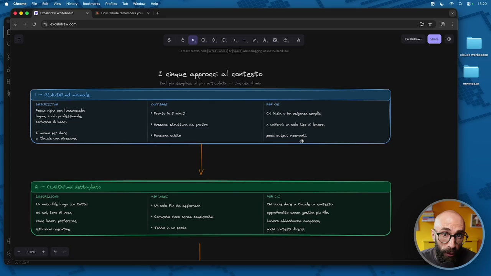

**Testo a schermo (OCR):** RE How Cade member asi e] + e eo, 0,0, -, -. 2, 4,8, e, 4 mo cm e (ET) ES) le dini, and I cinque approccì al contesto Dal piu serplice al piu articolato — Incluso il mio ori Chi vuole dare a Claude un contesto appeofoniito senza gestire piu Ale. Lavoro albasterza omogeneo, pochi contesti diversi.

> Facciamo che per il prossimo progetto inizia a usare Cloud Code, così per sperimentare un pochino. Ecco, in casi come questi va bene allora usare l'approccio numero uno. L'approccio numero due, questo è un obbrobrio, lo sconsiglio fortemente. Cioè, fare il contesto bello grosso, diciamo quindi con tanta ciccia, ma in un file Cloud gigante. Quindi qua diciamo graficamente l'ho rappresentato solo con un rettangolo un po' più grande. Quindi c'è chi dice, no no, io voglio tutto, voglio metterci tono di voce, i miei servizi che vendo, i clienti con cui lavoro, le istruzioni operative, i miei valori, la mia visione, e così via. Ma tutto in un unico lungo file. E ricordatevi il Cloud MD è un file obbligatorio. Vedete, ce l'ha creato anche prima quando abbiamo creato il contesto. È un file obbligatorio che serve a Cloud per lavorare. Diciamo, qua c'è un solo file, è tutto in un unico posto, perché io la sconsiglio questa cosa, anche se l'ho vista fare, perché dobbiamo ragionare in modo modulare.

## [00:03:00] Schermata 3 _(periodic)_

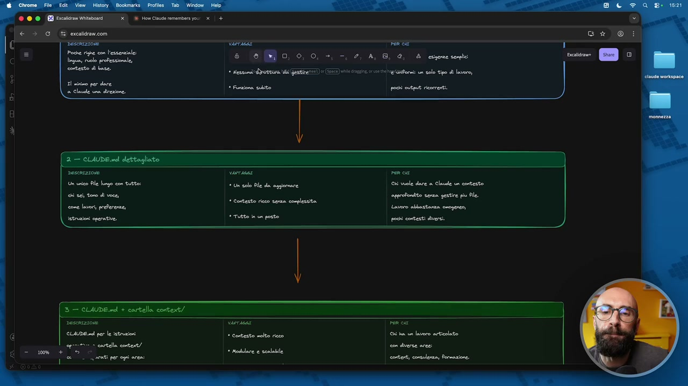

**Testo a schermo (OCR):** Verriasi la dr e eo, 0,0, +, -, 2, A, 8, e, A crrecione Mei i Ge) EI) le dn cv n solo po di Lav * Finziona bito pochi output icomenti. chi tele dre a Clale un contesto approfondito senza gestire piu Ale. Lavoro albestanza omogeneo pochi contesti diversi.

> Quello che ci porta a fare Cloud Code è ragionare in modo modulare. Spezzettare le cose, perché così è più facile gestirle, perché così è più facile farle crescere nel tempo, perché così è più facile aggiornare solo il pezzo che ci serve, e così via. Più facile trovare le informazioni, gestisce meglio Cloud la memoria in maniera dinamica, perché il file Cloud MD molto lungo dopo un po' gli crea problemi. Invece è meglio averne uno breve con altri file di contesto specializzati. Secondo me è anche proprio concettualmente più pulito, meglio lavorare in questo modo. Il terzo, il secondo ve lo sconsiglio, il primo va bene solo in alcuni casi. Il terzo già inizia ad essere decente, è quello con cui ero partito io all'inizio e poi sono passato al quinto. Il terzo è facciamo il file Cloud MD, quindi con le istruzioni principali di contesto, e poi la cartella Context.

## [00:04:00] Schermata 4 _(periodic)_

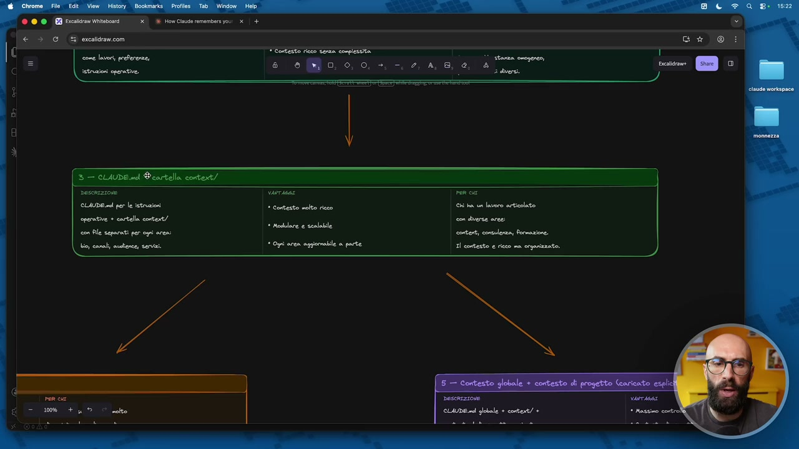

> Dentro la cartella Context cosa ci mette? Ci mette dei file piccolini separati dove ci sono dei pezzettini di contesto aggiuntivo. Quindi graficamente lo immagino una cosa del genere. C'è il file principale Cloud MD che fa un po' da direttore d'orchestra. Quindi dice ok, queste sono le informazioni principali che devi sapere su Laura, su Claudio, su azienda Pincopallino. E poi dentro il contesto c'è un file con il chi sono, un file con i clienti, un file con il tono di voce, un file con i servizi, un file con i prodotti e così via. È organizzato bene, vedete, potrebbe essere molto simile a questo ma organizzato meglio. Proprio per una pulizia mentale. Quali sono i vantaggi? Potete avere un contesto molto più strutturale, ce l'avete scalabile, modulare, ogni area si può aggiornare a parte.

## [00:05:00] Schermata 5 _(periodic)_

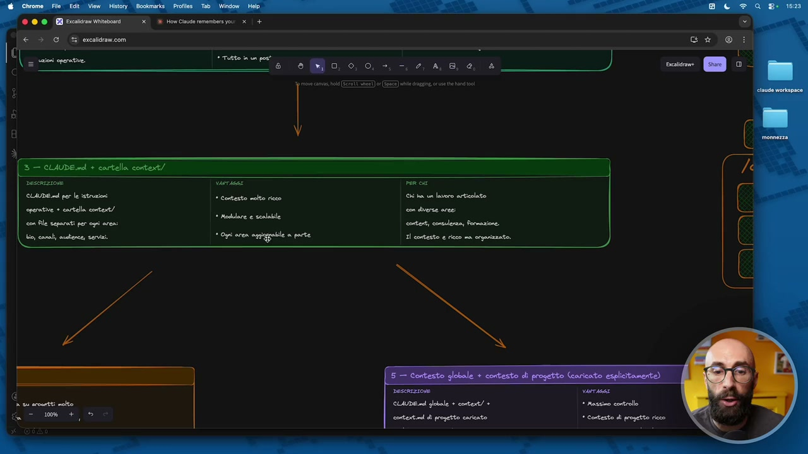

**Testo a schermo (OCR):** Chi ha ua lavoro articolato. con diverse aree: El contesto e ritto na organizzato.

> Se io voglio fare una modifica solo ai clienti non devo andare a modificare sempre solo il file Cloud MD, è solo il file clienti che viene aggiornato. Dico guarda, guarda, quest'anno non ho rinnovato con il cliente, non lo so, Alfa Romeo, quindi toglimi tutto il box Alfa Romeo da dentro il contesto dei clienti e basta. A chi lo consiglio, questo qua, tutti quelli che non rientrano nel caso 1. Quindi tutti quelli che vogliono iniziare a utilizzare seriamente Cloud Code, secondo me devono fare almeno questa soluzione. Quindi file Cloud.Md con la cartella di contesto. Non vi preoccupate perché tra un attimo tutte queste cose le vediamo praticamente. Ci tengo a far vedere sempre la struttura concettuale perché altrimenti siamo solo degli smanettoni. E invece sapete cosa penso? Penso che è importante la pratica ma deve essere affiancata dalla teoria per conoscere i concetti sui quali lavoriamo. Perché così se una settimana dopo che io ho registrato questo corso esce un sesto modo di gestire il contesto, voi l'avete capito e lo potete utilizzare.

## [00:06:00] Schermata 6 _(periodic)_

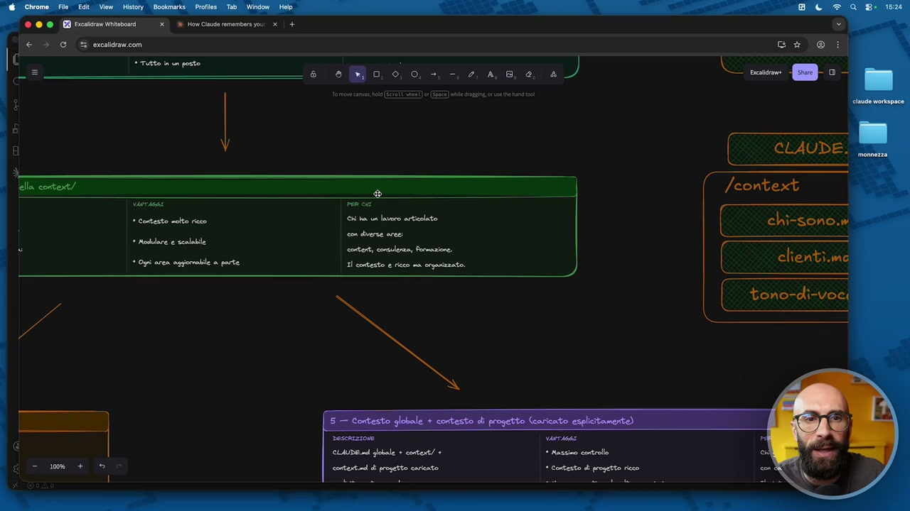

**Testo a schermo (OCR):** clientì.mo tono-diì-voc;

> Potete dirmi, ah Raffaele ma fate questa tecnica ma in realtà ne è uscita un'altra che è meglio ancora. Invece se voi fate solo gli smanettoni, eseguite solo quello che vi dico, non state capendo perché le cose funzionano in un certo modo. E qua ho fatto una diramazione, mi sono concesso questo, diciamo, questo momento, questa libertà. Perché il passaggio logico dopo questo, diciamo, per andare su qualcosa di un pochino più complesso è fare questo. Quindi avere diversi file CloudMD, perché Cloud nativamente offre anche questa opzione. Cioè Cloud dice, io riconosco automaticamente ogni volta che trovo un file che si chiama Cloud.Md, proprio scritto così con Cloud in maiuscolo, capisco che quello è un file di contesto. Quindi non ti preoccupare, quando lo trovo io lo leggo, lo carico, perché quello è contesto. E quindi cosa fanno tanti? Fanno il file CloudMD principale, vedete?

## [00:07:00] Schermata 7 _(periodic)_

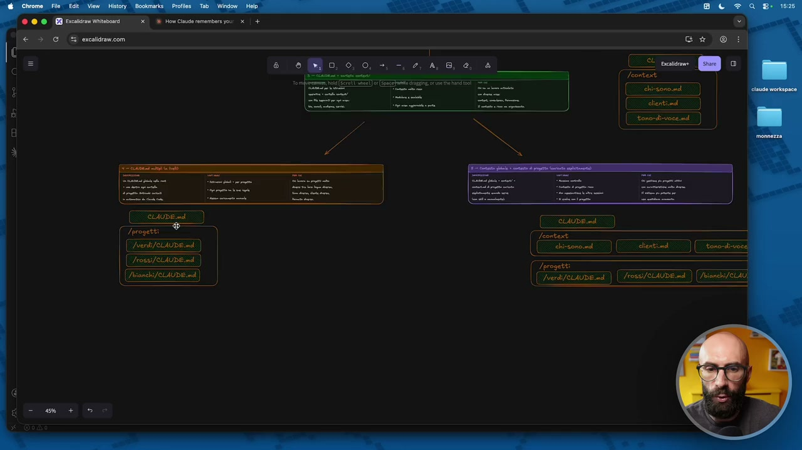

**Testo a schermo (OCR):** on i How Claude remember you: x | + de cena mo (Feontoa [reina ) Ù 7 È dd) (td VESIREESZZ]I = ([Eanh/eione nd | Voss EEE 3) ([aerai/erone nd) ([/ress/eLAUDE nd ) (Jranchi/elt

> Quindi diciamo una struttura che ricorda un po' questa qua. E poi dentro ogni progetto, oppure dentro ogni cliente, ora qua diciamo non dovete spaventarvi perché sapete cosa sono i progetti, i clienti, no? L'abbiamo visto, sono le cartelle che stanno qua, ok? Quindi questo adesso l'ho scontato, altrimenti fermatevi e andate a vedere le lezioni precedenti. Dentro i vari progetti, o i vari clienti, o i vari canali, quindi diciamo indipendentemente dalla struttura che avete scelto, no? Mettiamo che avete scelto questa struttura qua, con i canali, è la stessa cosa. Qua dentro potrei metterci i file di contesto relativi a ogni singolo canale. Quindi torno un attimo qua. Cosa fanno alcune persone? Dicono vabbè allora io sfrutto questa funzionalità di Cloud e metto i file CloudMD per ogni progetto. Questo ci permette di avere delle istruzioni globali più un contesto di progetto e viene fatto automaticamente gestito da Cloud questa cosa, ok? Questa diciamo come soluzione è una soluzione ottima, io la faccio leggermente diversa e quindi vi faccio vedere la quinta strada.

## [00:08:00] Schermata 8 _(periodic)_

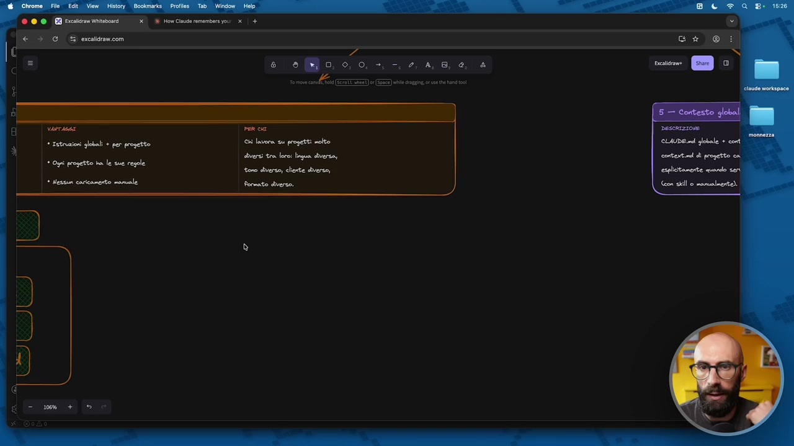

> Ripeto, qua scegliete quello che volete voi, anche se ovviamente diciamo io la faccio vedere perché la ritengo migliore questa qua. Cosa faccio io? Uso il CloudMD, quindi uso il modello questo qua, diciamo, uso un ibrido del 3 e il 4. Uso questo modello qua con il file CloudMD con le istruzioni di contesto principale e queste vengono caricate ad ogni chat. Poi ho la cartella con il contesto, con dei micro file piccolini piccolini, con un po' di contesto su chi sono, un po' di contesto sui miei clienti, un po' di contesto sul tono di voce, sui miei servizi, sui miei prodotti, sulla mia visione, sui miei valori, ci potete mettere quello che volete voi nel vostro file di contesto. E poi metto anche questa cosa qua, diciamo, dei progetti, quindi perciò dicevo un ibrido del 3 e il 5, ma con una differenza. Questa non l'ho segnata ma è meglio che la scriviamo, anzi la scrivo in questo momento così diciamo ribadendolo in tempo reale, secondo me si capisce meglio. Facciamo così, vi faccio capire che questo è caricato sempre, ok?

## [00:09:00] Schermata 9 _(periodic)_

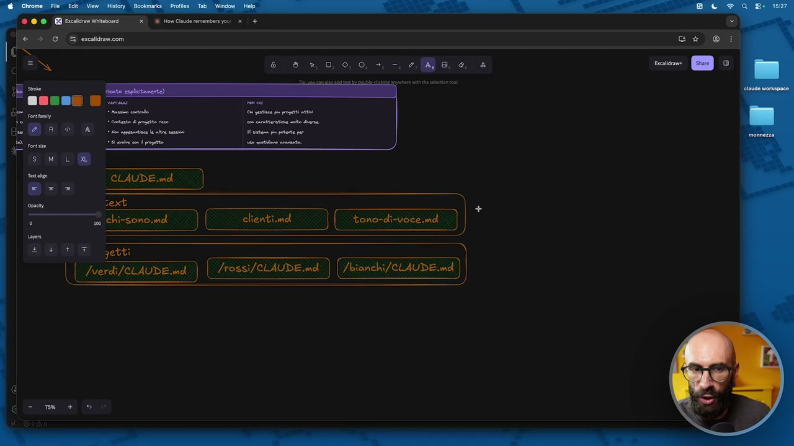

**Testo a schermo (OCR):** 3 x ® HoeCiauderemembersyou: x | + CLAUDE.md sext — d dissnad) ( clienti.ma ) (| teno-dizvoce.md E getti | [ /verdi/el4UDE.md ) | lrossi/cL4UDE.md ) reaenose sd) |

> Quindi quale? Questa parte qua, ok? Ecco qua. Questa parte qua è caricata sempre, il file CloudMD e tutta la cartella contesto vengono caricate ogni volta che io sto lavorando dentro Cloud. Questo pezzettino qua invece, caricato manualmente, no qua manualmente, automaticamente, dipende diciamo, manualmente, automaticamente, quando serve, ok? Questa, questo pezzo qua per capirci, mamma mia, grandi doti. Qua diciamo nel copia e incolla ho fatto, diciamo, io non li chiamo così, li chiamo ContextMD ma perché non voglio la funzionalità di loading automatico. Però diciamo il nome del file qua è veramente un dettaglio.

## [00:10:00] Schermata 10 _(periodic)_

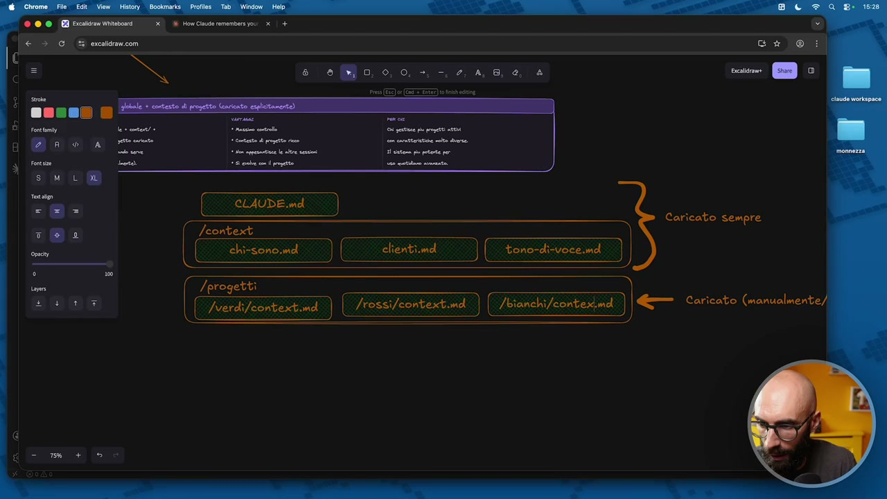

**Testo a schermo (OCR):** e 0, 0, 0, +. -. 2, 4,8, 0, è res EE) (ETIRI 1 in Jeontext | chi-sono.md I clientimd )( tono-di-voce.md ) Caricato sempre Î /progetti Nerdifeontextma ) (| /ross/context.md ) (/bianchi/eontedind | Caricato (manualmente)

> Però io in ogni progetto c'è un file contesto, contesto, contesto e non faccio che tutte le volte che apro Cloud Code carico tutto perché come vedete il contesto a me inizia a diventare grandicello. Qua magari ci sono 5-6 file, poi magari uno ha 10 progetti o 10 clienti e così via. Non voglio che Cloud ogni volta che ne apro un'istanza mi vada a caricare il CloudMD che deve caricare obbligatoriamente tutta la cartella contesto e poi tutti i singoli progetti. No, sto lavorando sul cliente Verdi, mi carico un attimo il contesto di cliente Verdi. Se dentro mentre sto lavorando mi serve qualcosa che ho fatto col cliente Bianchi, gli dico di caricarlo un attimo ma solo perché mi serve e allora lo uso. Mentre in questo caso diciamo quello che abbiamo è, questo lo mettiamo così, diciamo ve lo metto pure qua, questo è caricato sempre, ok? Quindi avete chiara la differenza. Usando questo approccio invece è caricato sempre e in realtà anche questo approccio qua. Ve lo scrivo pure qua così questo si carica, cioè si capisce.

## [00:11:00] Schermata 11 _(periodic)_

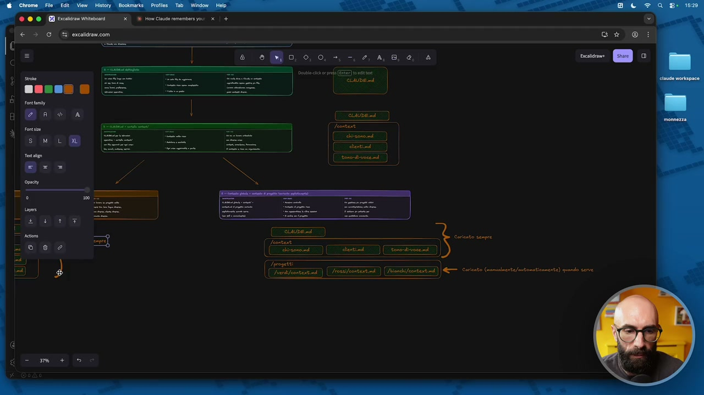

**Testo a schermo (OCR):** iii rd (ET) in CLAUDEI cr] (Ferene_ fa) e) (

> A questo punto abbiamo fatto 30, facciamo 31. Questo pure è caricato sempre e questo pure è caricato sempre, ok? Questi sono un po' i 5 approcci. Allora, l'approccio 2 è quello secondo me peggiore dal punto di vista proprio logico, ve lo sconsiglio. Se volete partire semplice andate con l'approccio 1, ok? Se volete fare qualcosa di più strutturato l'approccio 3 è quello, diciamo, prima di arrivare a qualcosa di complesso è una buona via di mezzo. Io uso l'approccio 5. Ho il massimo controllo, ho tutta la ricchezza di contesto che posso avere, si evolve con il progetto ma soprattutto questo è il motivo perché io faccio questa cosa. Per non appesantire le altre sessioni. Come avete visto noi dentro Cloud ce ne possiamo aprire pure n in contemporanea. Cioè immaginate che voi avete, che ne so, bam, bam, bam, bam, 5 sessioni di Cloud Code in parallelo sulle quali state lavorando.

## [00:12:00] Schermata 12 _(periodic)_

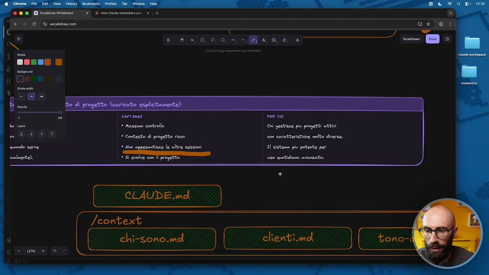

**Testo a schermo (OCR):** x 63,0, 00,3, Masa CLAUDE.m /context ( chi-sono.md ) ( clienti.imd

> Io non voglio che si carica 19 file diversi di contesto perché magari in una sessione sto lavorando su verdi, in una sessione sto lavorando su rossi, in una sessione sto lavorando su bianchi. Ma voglio che si carichi sempre il tono di voce perché il mio tono di voce è sempre lo stesso indipendentemente dal cliente con il quale sto lavorando. Questo concettualmente è importante come cosa? Non vi preoccupate se vi sembrano concetti astratti perché adesso li vediamo subito concretamente in pratica.
