# Creare il proprio contesto

> Documento generato automaticamente: trascrizione e screenshot sincronizzati del video-corso.

## [00:00:00] Schermata 0 _(start)_

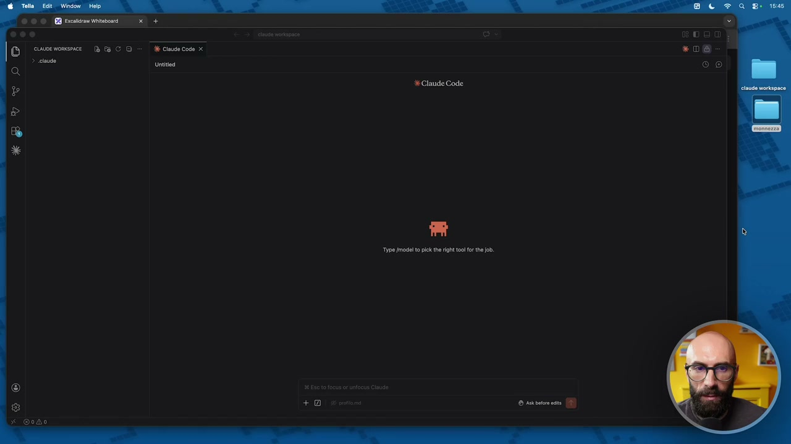

**Testo a schermo (OCR):** O cuorvonsme DECO > ole Type [model to pick the right 10 or the ob.

> E adesso finalmente è il momento nel quale ci mettiamo a creare il nostro bel contesto. Vi ho fatto vedere prima, diciamo, cinque modi di creare e organizzare le informazioni del contesto. Adesso le vediamo praticamente. E il modo migliore per farvele vedere, invece di fare cinque esempi separati, visto che qua li ho messi logicamente, come questo è il più semplice, poi questo è un po' più avanzato, poi questo è un po' più avanzato, ve li faccio vedere come se fosse un'evoluzione. Perché? Perché è quello che potrebbe succedere ad alcuni di voi, che partono col modo 1, come vi dicevo, e poi finiscono al 3, poi finiscono al 5, e che poi è quello che è successo anche a me. Che quando ho iniziato ho detto, vabbè, ma non mi serve questa struttura così avanzata che vedo in giro, e poi alla fine dopo un po' mi sono accorto che mi serviva. Quindi facciamolo proprio da zero. Ho svuotato il workspace, per sicurezza, per non avere, diciamo, pezzi di memoria, di altre cose, pezzi di contesto precedente e così via, e adesso non abbiamo nemmeno il workspace. Quindi gli dico, voglio settare il mio Cloud Code per il mio lavoro.

## [00:01:00] Schermata 1 _(periodic)_

**Testo a schermo (OCR):** |o cave worssace è 6 CO Ciaude Code x > lude Untitiea Type [model to pick te right tool or th ob.

> Quindi aiutami a creare un workspace molto semplice e un file di contesto cloud.Md molto semplice. Vado volutamente molto semplice. Prima abbiamo visto che in realtà poi il contesto lo dobbiamo strutturare bene, con le cartelle, sotto cartelle, e qua concentriamoci un attimo su, non tanto sulle cartelle, ma cosa ci mettiamo nel file di contesto. Quindi qua gli dico veramente due cosine. Gli dico, mi chiamo Giggino Giggetto, sono un business coach, mi sto inventando un caso diverso, farò sempre casi diversi ovviamente, sia per darvi spunti diversi, ma ricordatevi che poi ovviamente dovete adattarlo al vostro caso, mi raccomando, questa cosa non mi stancherò mai, mai, mai, di dirvela, perché c'è sempre qualcuno che mi dice, ah ma io non sono un business coach, quindi questa cosa non la posso fare, me lo sto inventando. Ok? Voi descrivete il vostro caso.

## [00:02:00] Schermata 2 _(periodic)_

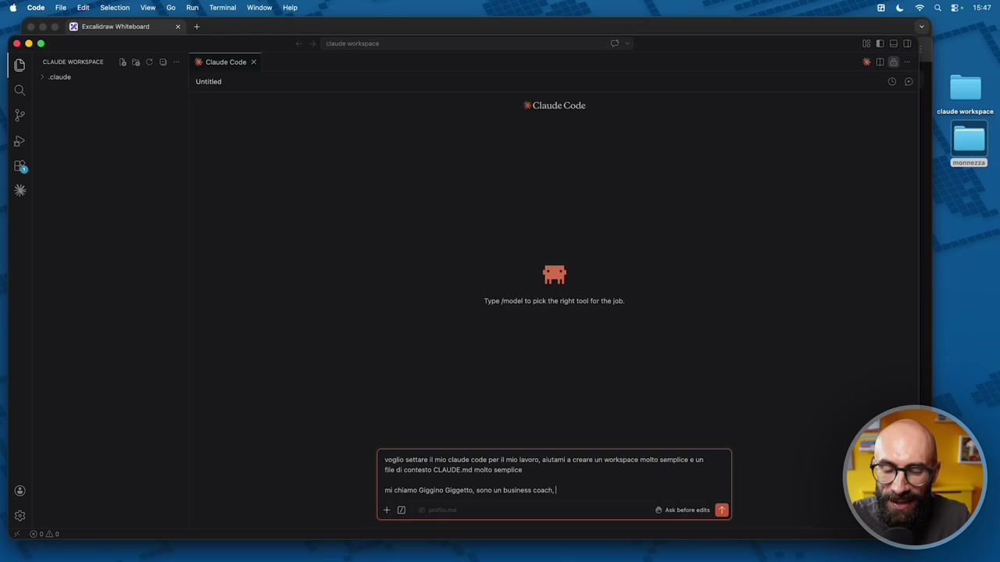

**Testo a schermo (OCR):** Type [modi o pick the right too or the ob. voglio ettaro mio claude cod per mio avro, ami a crase un orkspace moto sempe un o di contesto CLAUDE md molto semplice mi hamo Cigno Cipgett, sono un business cose toleme © nations (I)

> Qua c'ho pure un po' di appunti. Quindi sono un business coach, lavoro con un approccio molto pratico e diretto, lavoro solo in lingua italiana e solo per clienti diciamo PMI. Ok? Invio. E vediamo se Cloud Code ha tutto quello che gli serve. Non gli ho dato richieste particolari, specifiche. Ovviamente qua mi chiede l'autorizzazione, se può lavorare nei file, eccetera, eccetera. Gli dico di sì, perché deve scrivere fisicamente dei file sul nostro computer. Quindi sta andando a lavorare il Cloud MD, vedete? Quindi sì, gli diamo l'autorizzazione. Ha fatto il file Cloud MD, tra un attimo lo apriamo pure. Vediamo anche se crea il workspace, se mi mette qualche cartellina per i clienti oppure no, perché ovviamente gli ho dato il focus sul, diciamo, sul file di contesto, quindi può essere pure che non lo fa.

## [00:03:00] Schermata 3 _(periodic)_

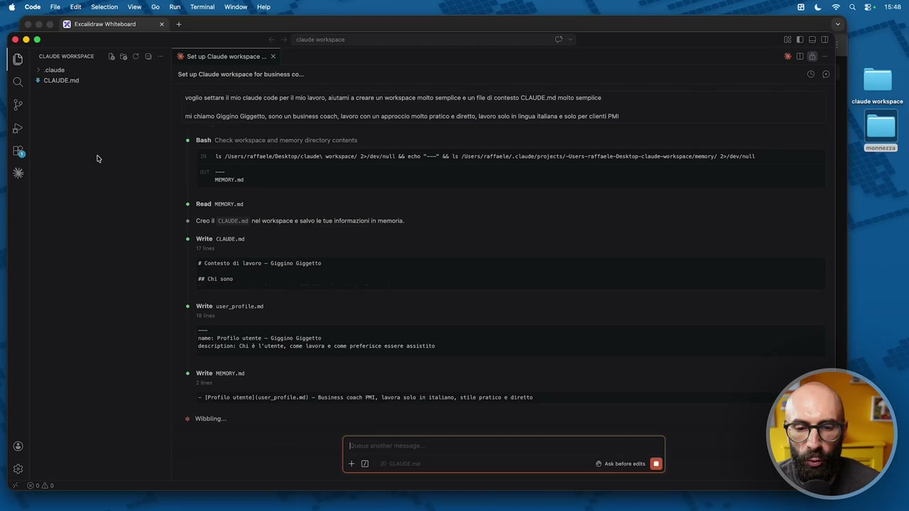

**Testo a schermo (OCR):** © Sosvonee Da CO = dk srt cao opaco x BETS aa Setup Claude workapace for business co... voglio ettr mio claude code per mio avro lai a craare un Workspace molto sempe e un fl di contesto CLAUDE md molto semplice mi chiamo Ciggno Giggett, sono un busines cosc, lavoro con un approclo mlt prato e diretto, voro slo n Ingua Ia e solo per cileni PMI ast Check ockepace and memory directory contents DI CS Soserarfrante/Desktop/ claude verkspace/ 2>/00v/D Ha echo =" His /Users/raffanle/ clauae/projocts/-Users-raffaele-Dshtep-clasd-morkspuce/meory/ 2>/60v/00tL Rend nora reo i CLAE, ne werkapsce salvo e te Informazioni i memoria. Write UD. # Contesto di avro — Giogo Giopetto Wi user_prtite.mi Time: Profilo utente — Giopino ciapetto GeseripHin: ChLÈ l'utente, cone lora e cone preferisce essere assistito — iotito utente] (aser.profile.0d) — Business cosch PI, lavora glo in italiana, stile pratico e diretto vbbino.

> E tra l'altro, vedete, sta scrivendo anche nel file di memoria. Il file di memoria ve l'ho fatto vedere in precedenza. Diciamo che il file di memoria, qua non lo vedete, ma è qualcosa che va a fianco, no? Lo metto qua, mettiamola così. Il file di memoria è questo qua, diciamo, è come se fosse qui, ok? È un file, è un file molto molto molto piccolo, che viene caricato all'inizio, sempre insieme a Cloud MD. E nel file di memoria lui mette delle cose in automatico. Si salva delle cose in automatico. Questo, vedete, ci va a mettere delle microinformazioni dentro. Vediamo adesso, per esempio, qua cosa ci ha scritto. Business coach PMI, lavoro solo in italiano, stile pratico e diretto. Si salva delle informazioni, delle preferenze che noi abbiamo nel tempo. Allora, ha fatto il nostro file di contesto. Ce lo apriamo. Come vi ho fatto vedere prima, i file MD sono dei file di testo, quindi anche se sembrano strani, basta che cliccate qua sul pulsante di un'anteprima e li vediamo formattati. Quindi questo è il contesto di lavoro. Giggino, Giggetto, chi sono?

## [00:04:00] Schermata 4 _(periodic)_

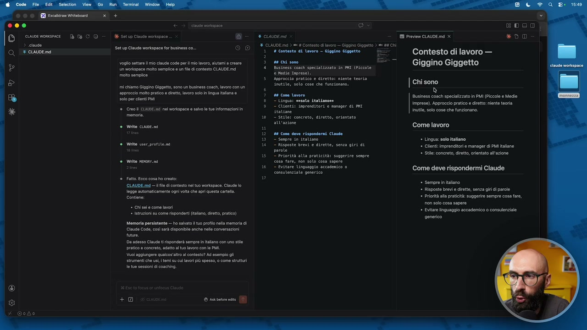

**Testo a schermo (OCR):** E Setup Ciau worispace Setup Clsude workapace for business co. (CH(c] voglio ettari mio claude code peri mio avro lutami a creare (n workspace moto semplice a un fl di contesto CLAUDE md moto semplice mi chiamo GiggnoGiggett, sono un business cosch, lavoro comun approccio molto pratico e dtt, lavoro sol in ngua talana e 50 per clenti PMI ». reali CIA: nel norkspace e save tue informazioni i memoria. Write cup. Write usercpretite.no Write nen. Fatto. Ecco cosa ho creto: CLAUDE md — le di contesto nl tuo Workspace. Claude Jo legge automaticamente ogni oa che apri questa crtel. Contiene: + Chi sele come ivo * Istruzioni su come rispondrti (alano, detto, pratico) Memoria persistnte — ho salvato to profilo nea memoria di Claude Code, così sarà disponibile anche nello conversazioni future. Da adesso Cause ti risponderà sempre in alano con uno ile pratico concreto, adatto a tu avro con le PM. Vuoi aggiungere qulco'atro l cotsto? Ad esempio gli strumenti che us temi su cui lavori più speso, o come tuttii e tue sessioni di coaching Gi + ciavDEmd # CLAUDE a > = Contesto di avro — Gggino Gigetto > = #9 Chi # Contesto di lavoro — Gipgino Gipgetto 20 chi sono Business conch speciaLizzato in PNT (Piccole Approccio pratico e diretto: niente teoria Inutile, solo cose che funzionano. Inprenditori è manager di PIT — stile: concreto, diretto, orientato atl'azione 08 Cose deve rispondermi Claude — Sempre in italiano — Risposte brevi e dirette, senza giri di parete "Priorità alla praticità: suggerire sempre cosa fare, nen solo cosa sapere - Evitare. Unguapgio accadenico 0 consulenziale generico EI Previem CLAUDE md X Contesto di lavoro — Giggino Giggetto | chisono N Business conc spcialzato I PMI (Piccole e Medie Imprese). Approccio pratico retto: niente teoria inutile, olo cose che funzionano Come lavoro ‘Lingua: sol italiano. + Cln: imprenditori e manager di PMI talane + Sti: concreto, diretto, orientato all'azione. Come deve rispondermi Claude * Sempre in italiano * Risposte brevi e dirette, senza gl di parole ‘ Prirt lla praticità: suggerire sempre cosa fare, non solo cosa sapere ‘» Evitare linguaggio accademico 0 consulenziale generico

> Quindi ha fatto proprio la sezione chi sono. Business coach, specializzato in PMI, piccole e medie imprese, approccio pratico e diretto, e niente ulteriori di utile, solo cose che funzionano. Vedete, questo l'ha scritto lui, ha capito questa cosa e l'ha scritto. Come lavoro? Lingua, solo italiano, clienti, imprenditori e manager di PMI, stile concreto, diretto, orientato all'azione. Come deve rispondermi Claude? Sempre in italiano, risposte breve e dirette, senza giri di parole, priorità alla pratica, suggerire sempre cosa fare, non solo cosa sapere, evitare linguaggio accademico o consulenziale generico. Questa roba qua, diciamo, non gliel'ho detto io, no, che Claude mi deve rispondere in questo modo, l'ha dedotto da quello che gli ho dato io come informazione. E diciamo che per una persona che ha appena iniziato, questa roba qua potrebbe bastare, no? Cioè abbiamo il primo nostro file di contesto. Diciamo che siamo nell'approccio 1, ok? Io qua non voglio dire manco livello 1, perché mentalmente mi viene sempre da dire siamo a livello 1, a livello 2, perché non sono dei livelli, forse sono dei livelli di difficoltà, no, di complessità. Però diciamo che questo è l'approccio 1. E come dicevo, per alcuni di voi può bastare questa roba.

## [00:05:00] Schermata 5 _(periodic)_

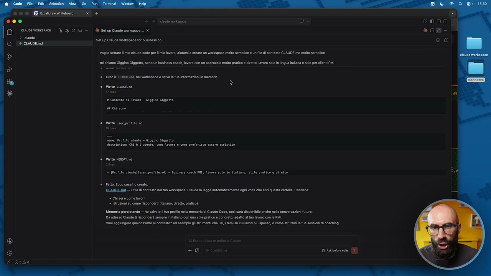

**Testo a schermo (OCR):** E Setup Ciude workapace —. x Setup Claude workapace for business co... voglio ettaro mio claude code per mio lavoro lutami a creare un Workspace molto sempice e un fl di contesto CLAUDE md molto semplice mi chiamo Ciggno Giggetto, sono un business coach, lavoro con un approclo malto prato e diretto, lavoro slo n Ingua lana e solo per cileni PMI 1 contesto di avro — Gigpio Gippetto CITES Wie userretite.ne fame: Profilo utente — Giopino Giopetto tion: CAL è utente, cose mora e come preferisca essere assistito — Irotito utente] (aser.profi en) — Business anch PI, 1avora slo in italiano, stile pratico e diretto Fatto Ecco cosa ho creato: SLAUDE md — fl di contesto nl tu Workspace. Claude legge autmaticamenta ogni vlt che apri questa catia. Contne: Chi see omo lavori * trazioni come risponderti alano, detto, ratio) Memoria persistente — ho sato tu proflonela memoria di Caud Code, così sarà disponibil anche nell conversazioni ur Da adesso Claude ti risponderà sempre in alano con no te pratico e Conret, adatto to lavoro con le PMI. Vi gglungere qulco'atr l contesto? AG esempio gli strumenti che us emi su cul lavori iù spess, 0 come strutture tue sessioni i conching.

> Quindi diciamo voi andate avanti, no? Anzi, teniamocelo qua aperto in parallelo. Voi iniziate a lavorarci con Claude, passe il tempo, mettete più cose e così via. A un certo punto, che ne so, non piate più solo le PMI, ma anche le startup. Da oggi lavoro anche con le startup, oltre che le PMI. Aggiorna il file di contesto, ok? Quindi c'è sta questa novità. Quindi sono passati, diamo invio, sono passati delle settimane, dei mesi, quello che è. Sto aggiornando il mio file di contesto. Nel file di contesto adesso c'ho anche questa nuova informazione. Quindi imprenditore e manager di PMI italiane e startup. Qua potremmo anche dirgli adesso di iniziare a creare, per esempio, delle cartelle. Gli posso dire creami anche una struttura semplice di cartelle per il mio workspace.

## [00:06:00] Schermata 6 _(periodic)_

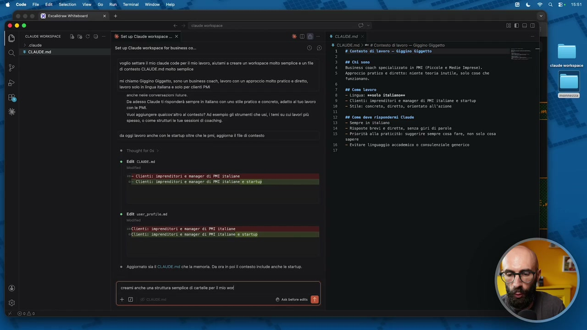

**Testo a schermo (OCR):** 000 È © cuorvonsice (è fa CO» Setup Ciude mrkapoce x + ciavvemd Setup Claude workapac for business co... (ORO) voglio ettari mio claude code perl mio lavoro lai a creare un Workspace molto sempe un le ‘contesto CLAUDE md molto sempe mi chiamo Giggno Giggetto, sono un business coach, lavoro con un approccio molto ratio e diet, aver slo in ingua ialana slo per cleti PMI Da adesso Claude i risponderà sempre in alano con uno ile pratico e concreto, atto al to lavoro oa le PM Vuoi aggiungere qulco'atro al contesto? Ad esempio gli strumenti che us, temi su cu lari più spesso, 0 come stru le tue sassoni di cosching. ‘4 oggiavor anche con startup ore che l pmi, aggio ilo di contesto Thoun for e > ie coem con Clienti: imprenditori e manager di PI italiane 02 Cldenest Saprengitori e manager di PAT italiane) SEGRE Edit user prote. O CLteneti taprenaitori e manager di Pur italiane ‘Aggiornato sla i CLAUDE mu che ia memoria Da ra in poll contesto include anche e startup. ereami anche una struttura sempe di cartelle pr mio od +0 IS ) % CLAUDE ma > n 8 Contest i avaro — Giggino Giagetto # contesto di lavoro — Giggino Giopetto 10 chi oso Business conch specializzato in MI (Piccole e Nedie Taprese). Approccio pratico e diretto: niente teoria inutile, solo cose che funzionano. imprenditori e manager di PMI italiane e startup concreto, diretto, orientato all'azione s0 cono deve risponderni Claude = sepre in statiano — Risposte brevi e dirette, sen - Priorità alla praticità: suggerire sempre cosa fore, non solo cosa sapere — Evitare Linguaggio accadenico 0 consulenziale generico

> Non voglio mischiare due cose, perché il workspace ne abbiamo già parlato. Però magari vedendo tutto vuoto qua vi può sembrare strano. Quindi mettiamoci le due cartelline anche vuote, solo per farvi capire. Vedete, tra l'altro non gliel'ho detto io, mi ha iniziato lui a fare delle domande. Gli dico, che ne so, trascrizioni delle sessioni. Preventivi, report, post, consulenza. Ok, mi sto inventando. Mi ha chiesto che tipo di file utilizzo io. Vedete come in modo proattivo mi ha fatto delle domande. Perché per quello che aveva come informazione forse non gli bastava per creare un workspace. Adesso qua gli do l'accesso e mi ha creato, vedete, archivio, clienti, template. Adesso se vado in archivio, qua in clienti c'ho preventivi, report, trascrizioni. Qua template ovviamente sono vuote. Queste qua sono le cose che poi ci andrebbero a finire dentro. Così abbiamo un minimo di cartelle per vedere quello che stiamo facendo.

## [00:07:00] Schermata 7 _(periodic)_

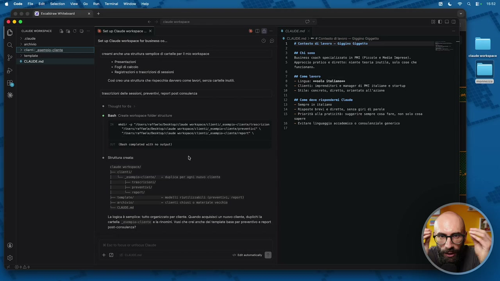

**Testo a schermo (OCR):** Setup Claude workspace for business co... (00) creami anche una struttura semplice di carte per mio workspace + Presentazioni * Fogli cacolo * Registrazioni o trascrizioni di sessioni (Conero un sruitura che rspecha davvero come lavori, senza cartelle miti. tracrizioni delle sessioni, prevent, report post consulenza ©. Thought orse ©. Gant Create vorkspace (oder structure bd -p “/0sers/rafaete/Desktop/ claude vorkspace/elienti/esenpio-cliene/traserizion e rabers/attoete/besktop/ claude vorkspace/elient/_esenpio-eliente/preventivi* \ eater, rt facte/besstop/ claude Varkspac/elHenti/ asmpio-cliente/repore® \ (bash completed with no output) ® Struttura crosta: lai varkspace/ Pr eentiy | I _esempiocetente/ Ue dipLica per gni fivo) cliente IP traserizioniz 1 P preventivi lt repore) + tenpiate/ = iarcnivio/ 1 cioe. © model river zz (preventivi, report) = eldenti enusi 0 materiale Vecchio La logica è semplice: tuto organizzato per cene. Quando acquisisci n nuovo cent; dupich a carola _esnegso-cliente e a rinomin. Vuoi che rel che del tempinte baa per preventivo e report post-consuenza? + ciuvvemd % CLAUDE ma ? n 8 Contesto di avaro — Giggino Giggetto # contesto di lavoro — Giggino Giopetto n0 chi sovo Business conch specializzato in PMI (Piccole e Nedie Teprese). Approccio pratico e diretto: ntente troria inutile, solo cose che funzionano. 06 cose ravoro — Lingua: esolo itatinone — Clienti: imprenditori e manager di PMI italiane e startup — Stile: concreto, diretto, orientato all'azione #9 cono deve rispondersi Claude — Senpre in statiano — Risposte brevi e dirette, senza giri di parole — Priorità alla praticità: suggerire sempre cosa fare, non solo co sapere — Evitare Linguaggio accadenico 0 consulenziale generico

> Che succede? Passa il tempo, mi rendo conto che questo modello 1 inizia a diventare limitante. Ci sono tante informazioni che voglio mettere dentro. In questo file CloudMD ci voglio mettere tante altre cose. Allora diciamo che, che ne so, voglio aggiungere al file di contesto un po' di dettagli sul mio stile consulenziale e sul mio tono di voce. Quando dobbiamo aggiornare il file CloudMD la cosa migliore da fare, vi ricordate l'abbiamo già vista in precedenza, ve lo farò vedere sempre questo approccio, è sempre chiedere di farci delle domande. Quindi fammi tu una serie di domande su questi due temi però, sullo stile e sul tono, su questi due temi. Raccogli le informazioni che ti servono e vai ad aggiornare il file Cloud.MD.

## [00:08:00] Schermata 8 _(periodic)_

**Testo a schermo (OCR):** 000 G Ce @ suoenonsrice (fo CO de Setup Cie merkapoce . x + ciuvvemd RS a © © *fAUDEI me Cons air — gno sto rese e ci vo E - sorte 06 cone ravoro i, da trascrizioni dell sessioni, prevent, report post consulen = Lingiai cessa iiatimero — Clienti: imprenditori e manager di PAI italiane e startup Thought for 8e È stile: concreto, diretto, orientato all'azione Bash Creato veorkapace foder strutira #4 cone deve rispondersi Claude — senpre in statiano Di hdi -p “/Users/rafate/beskto/claude vorisaca/clienti/_esepio-cLiente/trascrizion " Rifposte brevi e dirette, senza giri di parole lb) raffaele /bestop/clade vorkopoe/ellenti/ esempio-cUente/preventivi* \ — Priorità alla praticità: suggerire sespre cosa fare, non solo cosa "06, tace Peshtop/ claude Vorkspoce/eltenti/ esempio Cltenterrepore® \ Sapere — Evitare Linguaggio accadenico 0 consulenziale generico tas completed with no output) è struttura crosta: eta vorace” Fo ettentiy | I _esempiocetiente/ = dipLica per ogni nuovo cliente li PP traserizionio RP preventiviy | i report) + tesptate = modelli riuestizzobili (preventivi, report) E arenivio/ © Manti chiusi 0 materiate vecchio I cioe. La logia è semplice: tuto organizzato per cente. Quando acquisisci un nuovo cent, dupich a carte esenpio-eliente ea rinomini. Vuoi ch cre anche del template bas per preventivo report post-consuenza? voglio aggiungere al fl di contesto Un po'di dettagli sl mio st consuensile e sui mio tono di emi t na sere di domande su queti uo temi, accoglie informazioni che ti +0 cea

> Qua non so perché gliele avevo tolto, gliele rimettiamo. Ehm, quindi non è che adesso gli vado a dire il mio tono di voce è informale, bubu, babà, eccetera eccetera. Glielo devo, voglio che lui me lo chieda. Cosa interessante, questo è il bello della diretta però ci dà uno spunto super interessante, mi ha fatto tutte le domande insieme, invece io voglio che le domande me le debba fare sempre una alla volta. L'avevamo detto in un precedente workspace che poi l'ho svuotato, quindi questa informazione non ce l'ho più. Quando ti chiedo di farmi delle domande devi farmele sempre una alla volta e non in elenco come ora. Conservati questa informazione per il futuro e fammi sempre le domande una per volta. Ehm, quindi adesso gli ho dato, come dire, una,

## [00:09:00] Schermata 9 _(periodic)_

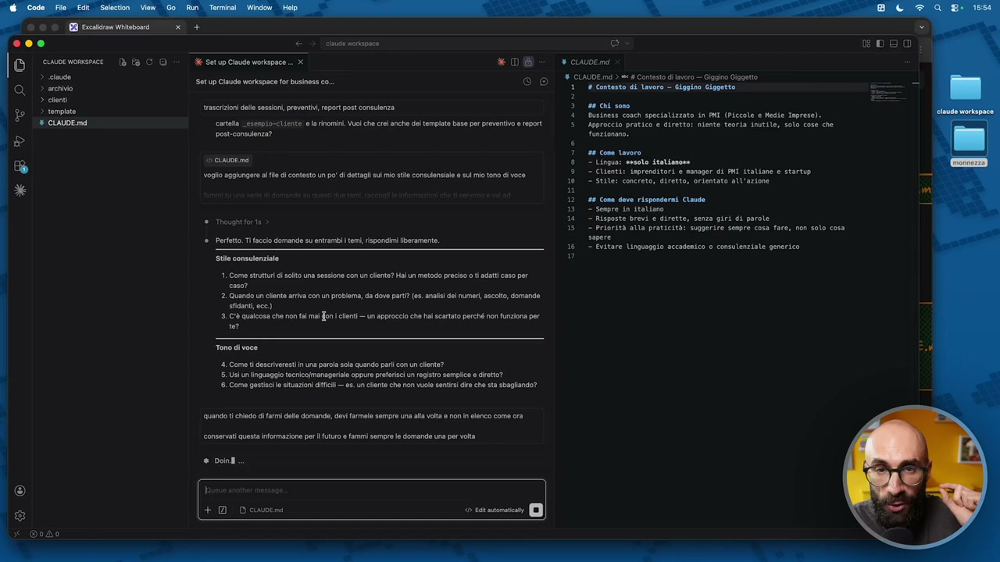

**Testo a schermo (OCR):** È Setup Cinude werkapace —. x Setup Clnude warkapac for business co. © © trascrizioni delle sessioni, prevent, report post consulenza cantata _esanpio-eliente ea rinomin. Vuol cho rel anche dl tempie bas per preventivo e report post-consuenza? voglio aggiungerle di contesto un po i dtt si mio st consulen e sui mio tono di voce ® Tncughttorte ». Perfetto. i acco domanda su entrambi temi rispondi ierament, St consulenziale 1. Came struttu i solo una sessione con un elnte? Hal un metodo preci datti caso per so? 2. Quando un clnte arriva con un problema, da dove prt? (es. anali de numeri sscot, domande sfidanti ecc) 2. C'è qulcosa che no al mal fo centi un approccio che hai scartato perché non funziona per ter Tono di voce 4. Come i escrveresti in una parola sola quando parl con un cente? 5. Usl Inguaggio tecrio/managerile oppure preferisci un registro semplice e tto? 6. Come gestisci le stazioni dici es. un clente che non vuole senti ie che sta sbaglando? ‘uan ti chie di farmi dele domando, dev farmalo sempre una al vota © non i lenco come ora conservati questa infrazione perl futuo e fammi sempre l domande una per volta * con Gi + ciuvvemd % CLAUDE ma > 8 Contest i lavoro — Giggino Giggetto 1 contesto di lavoro — Giggino Giopetto 10 chi soso Business conch specializzato in IMI (Piccole e Medie Taprese). oproccio pratico e diretto: niente teoria inutile, solo cose che funzionino. 06 cose ravoro imprenditori e manager di PMI italiane e startup concreto, diretto, orientato all'azione #4 cono deve risponderai Claude — Senpre in statino — Risposte brevi — Priorità alla praticità: suggerire sempre cosa fare, non solo co sapere — Evitare Linguaggio accadenico 0 consulenziale generico

> lui ha fatto un errore, nemmeno un errore, lui ha fatto una scelta. Questa scelta non è, non mi piace, ok? Quindi la voglio modificare. È una preferenza, ok? Questa non è nemmeno contesto, è una preferenza quella che adesso gli stiamo dando. Lui cosa ha fatto? È andato nel file memory e nel file memory si è messa questa informazione, ho detto non lo faccio più, se l'è presa. Quindi adesso nel file memory c'è questa informazione, ok? Vedete è slegato da Cloud. Quindi mentre questo, ritorniamo qua, mentre questa roba qua è il contesto, potremmo dire che il file memory, qua ci mettiamo una bella freccettina di quelle che so disegnare bene io, queste qua diciamo sono delle preferenze, ok? Anche questo viene caricato, diciamo, come queste due vengono caricate sempre, anche memory viene caricato sempre. Cioè se io adesso mi apro una nuova chat, questa chat caricherà anche il file memory, ok? Quindi avrà sempre questa informazione.

## [00:10:00] Schermata 10 _(periodic)_

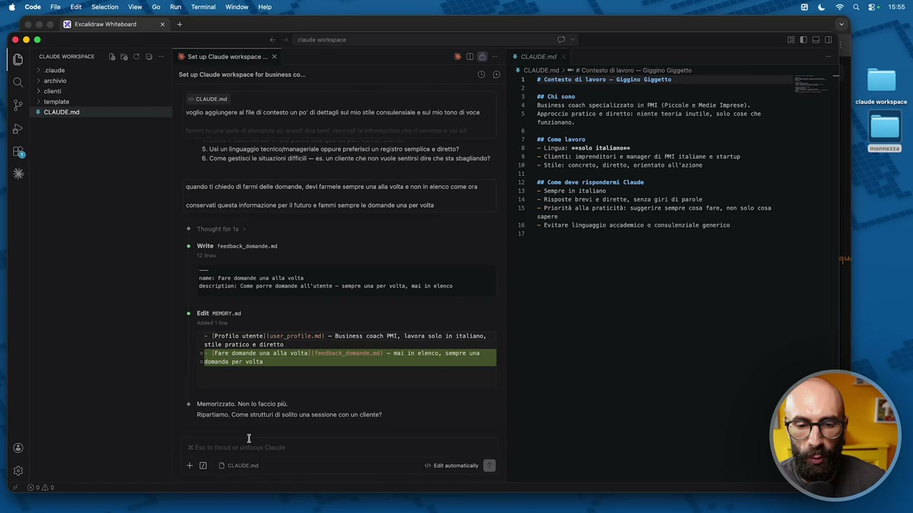

**Testo a schermo (OCR):** © > ue morispnce Ca E Setup Ciude werkapace —. x + ciuvvemd % CLAUDE md } = Contesto dliavoro — Giggno getto Set up Claude workspace for business co... (CHO) posteri Vea n0 chi soso Business cosch specializzato in IMI (Piccole e Medie Teprese). voglio sggungere al fl cl contesto un po i dettagli sul mio sth consuleniale e su mio ono di voce Boproccio pratico e diretto: niente teoria inutile, solo cose che funzionano. 8. Usl un inguaggio tecnico]managerial oppure preersci un rgltro semplca e detto? ‘8. Come gestisci e situazioni iii e. un cente che non vuol sent ie che sta sbaglando? Asorenitori e oper di MI italiane © start 29 cono deve risponderni Claude quando ti chico dl farmi dele domande, devi farmale sempre una ala vota e non I elenco come ora bpasalona conservati questa informazione perl futuro e fammi sempre lo domande una per vota — Priorità alla praticità: suggerire senpre cosa fare, non solo co sapere ta — Evitare Linguaggio accadenico 0 consulenziale generico ® Writo Feitack donde. deseription: Come porre donde all'utente = sempre una per volta, noi in elenco — [PrORINO utente) (user_profie.nd) — Business cosch PI, Lavora soto in italiano, Memorizato. Non o foci pù. Ripariamo. Come strut di olto una sessione con un clente?

> Ripartiamo. Come strutture di solito una sessione con un cliente. Vi ricordate abbiamo fatto una richiesta che deve aggiornare il file Cloud MD. Allora mi arriva un contatto dal sito o dai social. Poi faccio una call conoscitiva di 30 minuti gratis su Zoom. Qua metto le faccio solo il venerdì. Metto delle informazioni extra che mi sto inventando, solo per farvi capire come lui adesso si organizzerà tutte queste informazioni. Poi dopo la call mando un preventivo e una proposta. Qua scrivo due file separati. Vedete che sto mettendo informazioni solo per fare vedere che dopo Cloud userà tutta questa roba. Se il cliente accetta il preventivo ha accesso a un calendly

## [00:11:00] Schermata 11 _(periodic)_

**Testo a schermo (OCR):** G Ca E Setup Cinude werkapace —. x + ciuvoemd ARS PEETZI © © * SIDE) = eine divo _ gore Goro © cAvDE 10 chi gono Business cosch specializzato in PMI (Piccole e Nedie Teprese). voglio aggungere lil di contesto un po i dettagli mio sth consuensiale e si mio tono di voce Approccio pratico e diretto: ntente teoria inutile, solo cose ehe funzionano. — Clienti: imprenditori e manager di PAL italiane e startup quando ti chie di fermi dee domande, dev farmale sempre una al vota e non n elenco como ora ‘diretto, orientato all'azione conservati questa informazione perl futuro e fammi sempre le domande una per volta farisei — Risposte brevi e dirette, sen Thavght forte — Priorità alla praticità: suggerire senpre cosa fare, non solo co sapere Write Festack domande. — Evitare Linguaggio accadenico 0 consulenziale generico GRsErIStini Cone porre dosande all'utente = sempre una per volta, ma in sterco — [PrOFitO utente) (user profile. nd) — Business cosch PI, lavora solo in italiano, stile pratico e giretto ii ara un contatto dl sito 0 al social faccio un call conoscitiva di 30 minuti gratis su 00m (le faccio ol i venerdi; dopo la call mando un preventivo e una proposta (2 la sapart); 0 lente nd + QI Deo 0 sms (DI

> dove può prenotarsi le call settimanali. Qua dico massimo due ore a settimana, ok? Voi metteteci tutte le vostre informazioni. Sono un'agenzia di marketing, sono un content creator, sono un manager, sono un public speaker, sono un autore di libri. Potete farlo per quello che volete voi. Chiaro, tutto molto per deprecia. Quando un cliente arriva con un problema concreto, da dove parti? Ascolti, fai domande, guardi i numeri. Durante la call faccio delle domande e raccolgo le informazioni del cliente. Uso un approccio molto socratico. Qua esagero, ma per dare informazioni ex e per far vedere poi come le va. Diciamo proprio mi ispiro alla maieutica.

## [00:12:00] Schermata 12 _(periodic)_

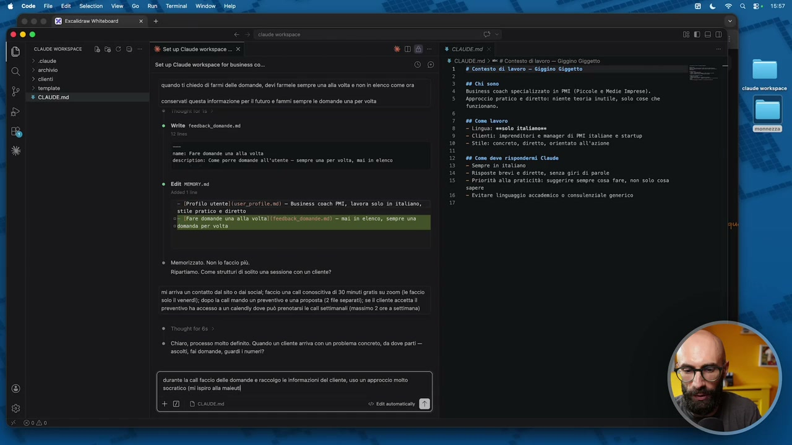

**Testo a schermo (OCR):** O uovo BE CO > ue 3 archivio > ln È E Setup Ciude werkapace x Setup Claude warkapace for business co. o) quando ti chie dl farmi dele domande, devi farmae sempre una ala vota e non n elenco come ora conservati questa informazione por futuro e fammi sempre l domandi una pe vita ®. Write. Fectaciionande. nd description: Cone porre donde all'utente sempre una per volta, noi in elenco — [Profilo utente] (user profie.nd) — Business conch PRI, Livora solo in italiano, stste pratico e diretto ®. Memorizzato. Non o facci più Ripariamo. Come stutur di olto una sessione con un ciente? i ra un contatto dl sito 0 dal sola; facci un cali onoscitva di 30 minuti gratis sù om (le faccio solo ener); dopo la cai mando un preventivo e una proposta 2 fl separate l lente accetta ll proventivo ha sccosso a un caendi dove può prenotarsi le ca settimanali (massimo 2 ore a settimana) ® Tiought or 66 ‘®. Chiaro, processo molto definito. Quando un cente arva con un problema concreto da dove pati — ascot, fa domande, quardi numer? Surano la alal dll domando e raccolgo i formazioni dl lente, uso un approccio moto socratico (mi ispio alla mau + DI Dowvena e) ce + ciuvvemd % CLAUDE ma ? = Contest i lavoro — Giggino Giggetto # contesto di lavoro = Giggino Giopetto 10 chi ovo Business conch specializzato in MMI (Piccole e Medie Teprese). Approccio pratico e diretto: niente teoria inutile, solo cose che funzionano. 06 cose Lavoro — Lingua: sesolo itatimone — Clienti: imprenditori e manager di PAI italiane e startup — Stile: concreto, diretto, orientato all'azione #0 cone deve risponderni Claude = Senpre in statiano © Ritposte brevi e dirette, senza gici di parole — Priorità alla praticità: suggerire sempre cosa fare, non solo co sapere — Evitare Linguaggio accadenico 0 consulenziale generico

> Tengo tutte le sessioni registrate e quindi ho accesso ai transcript. Vediamo cos'altro mi chiede come domanda. Quindi capite cosa stiamo facendo? Adesso stiamo facendo il lavoro, il passaggio tra virgolette all'approccio 2. Quindi sta crescendo il nostro file CloudMD. Interessante, c'è qualcosa che non fai mai con i clienti, qualcosa che hai scartato perché non fa per te. Qua posso dire per esempio non faccio consulenza operativa. Sono un business coach e mi concentro su quello. La mettiamo come informazione così extra. Vediamo cos'altro ci chiede. È interessante questa cosa, è fondamentale questa cosa. Il fatto che stiamo lavorando con le domande,

## [00:13:00] Schermata 13 _(periodic)_

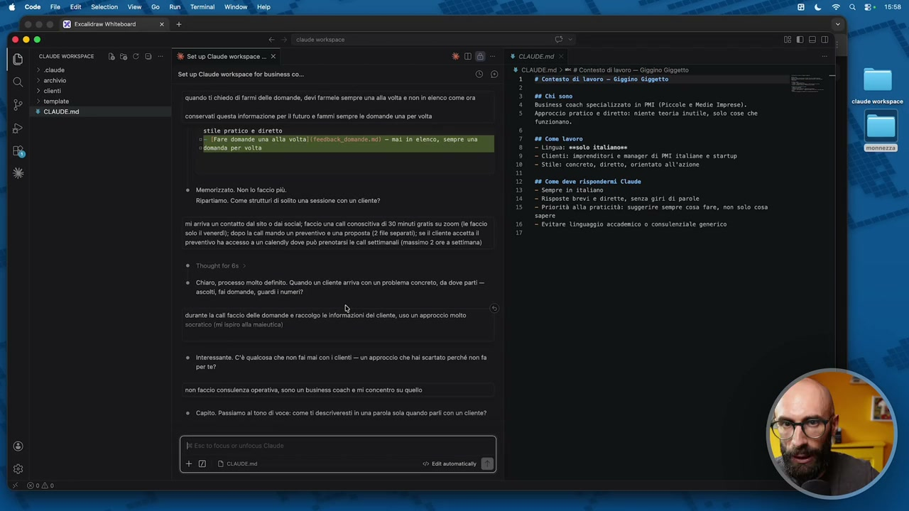

**Testo a schermo (OCR):** O custa GECO È > elsa oispnce E Setup Cinude workapace —. x «06 Setup Claude workapac for business co... (ORO) quando ti chie darmi dele domando, di farmale sempre una ala vota e non i elenco come ora conservati questa informazione perl futuro e fammi sempre le domande una per vita sette ico € giretto ‘®. Momorizzato Nn o feci più Ripartamo. Come strut di olio una sessione con un cent? mara un contatto dl sito 0 dal soia; facci un call conoscitiva di 30 muti gratis su zoom (le facio sol ener); dopo a cal mando un preventivo una proposta (2 fe separate l lento accetta ll proventio ha accesso a un caendi dove può prenotarsi e call settimanali (massimo 2 ore a settimana) ®. Thought for es ‘Chiaro, processo molto dfn. Quand un lente ava con un problema concreto da dove pati — ascolti, a domande, guardi numer? ine act ci gole omne ecco Ionica ino un ppc moto ». interssante. C'è qualcosa che no fl mai co centi — un ppracio che hai scartato perché non fa perte? non acco consulenza operativa, ono un business coach mì concentro su quelo ‘®. Capito. Paslamo al ton di voce: come i descriveresti n una parla sla quando pal con un lente? EeST) + ciavoemd CLAUDE ma 3 n Const i lavaro — Giggino Gigpetto # Contesto di Lavora — Giggino Giogetto n0 chi sovo Business conch specializzato in IMI (Piccole e Nedie Teprese). Approccio pratico e diretto: niente teoria inutile, solo cose ehe funzionano. imprenditori e manager di PMI italiane e startup concreto, diretto, orientato all'azione #0 cone deve risponderai Claude " Senpre in statino — Priorità alla praticità: suggerire sespre cosa fore, non solo cosa sapere — Evitare Linguaggio accadenico 0 consulenziale generico

> questa fa tutta la differenza del mondo. Per il dettaglio a cui arriviamo, perché ci sono informazioni che a volte ci sfuggono se noi dobbiamo descrivere in un prompt. Come ti descriveresti in una parola sola quando parli con un cliente? Schietto senza peli sulla lingua. Sto inventando, qua metteteci le vostre informazioni ovviamente. Magari a voi il tono di voce non serve. E quando un cliente non vuole sentirsi dire che sta sbagliando, come ti comporti? Diciamo che lo porto per mano a capirlo da solo. Che sta sbagliando, sperando che non si incazzi. Perfetto, tutto quello che mi serve. Aggiorno il file cloud.Md. Noi lo teniamo bello aperto qua, così l'aggiornamento lo vediamo in tempo reale. Quando Cloud gli vedete scrivere queste cose, marinating, wandering, sono parole che lui si inventa, sta cazzeggiando, deciphering. Fondamentalmente è lui che sta lavorando in sottofondo e ti dice, sto ragionando, sto spippolando.

## [00:14:00] Schermata 14 _(periodic)_

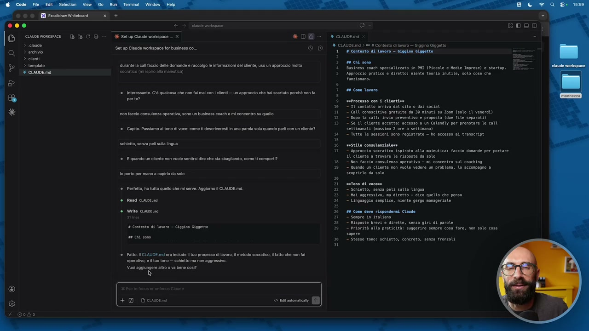

**Testo a schermo (OCR):** cioe omence [© CO > aida > ario > tnt > template * ciauDEmd G E Setup Ciude werkapace —. x Setup Claude workapac for business co. (00) rante la cal facio dele domande raccolgo informazioni del kent, uso un approccio moto socratico (mi pio ala malte) ‘». interessante. C'ò qualcosa che no fl mai con | elet — un approccio che hal scartato perché non fa perte? non faccio consulenza oparatva, ono un business cosche mi sonentro sù quelo =. Cpt, asslamo alto di voce om i deserte una parl ola quando pai con un cento? schietto, senza peli sla Ingua E quando un ento non vol seni che sta sbando, como ti comporti? o porto pr mano a capro da olo Perfetto, ho tuto quell che mi serve. giorno ll CLAUDE md. Rosa IDE. Write cune. 1 Contesto di Lavero — Giapino ciapetto Fatto l CLAUDE im ra incide i tuo processo di ivoro, i metodo socratico, ftt che no fl ‘operativo, a ltuo tono — schietto ma non aggressivo. Vil aggiungere atro 0 va bene cos? Ge + ciuvvemd % CLAUDE ma > Conssto diavoro— Giggino Gigoeto 1 2 3 s # Contesto di lavoro — Gipgino Giopetto 20 chi sovo Ruziness cosch specializzato in IMI (Piccole e egie Taprese) e startup. Approccio pratico e diretto: niente teoria inutile, solo cose che funzionano. 06 cone Lavoro suprocesso con i eLientisa TTI contatto arriva dal sito 0 dat social — CAUI conoscitiva gratuita da 30 minuti su Zooe (solo il venerati) — dopo la call: invio preventivo e proposta (due file separati) 7 se Sl cliente accetta: accesso è un Calendiy per prenotare le call Settinanali (nssino 2 ore a settinono) — Tutte le sessioni sono registrate — ho accesso al transcript vestito consutenziatese — Approccio socratico Ispirato alla maieitica: faccio donande per portare il cente a trovare le risposte da sato — noe facclo consulenza operativa — ni concentro sul coaching - quanso un cliente non vuole vedere un problesa, l0 acconpagno a Scoprirto da solo setono di voce " Senlerto, senza peli sutta Lingua — H01 aggressivo, na diretto — dico quello che penso — Linguaggio senglice, niente gergo sonageriale 20 Cone deve risponderai Claude — Sespre in italiano " Risposte brevi e dirette, senza giri di parole - Priorità alla praticità: suggerire senpre cosa fore, non solo coso sapere — Stesso tono: schietto, concreto, senza fronzoli

> No, in italiano sarebbe una roba del genere. Mi faccio due conti e in realtà sta lavorando in sottofondo. Vedete adesso c'è l'aggiornato. Chi sono, come lavoro, processo con il cliente, stile consulenziale, tono di voce, come deve rispondermi Cloud che c'era già prima. Quindi questi pezzi qua sono i pezzi che ha messo adesso nuovo. Il file cloud.Md sta diventando sempre più strutturato. Immaginiamo che c'è una cosa nuova che vogliamo aggiungere. Diciamo che nel file cloud.Md voglio aggiungere tutta una sezione sui tipi di clienti che prendo e che non prendo. Fammi tu le domande necessarie come hai fatto prima. Io questa cosa la sto facendo una dietro l'altro. Questo magari succede nel tempo, ok? Al secondo giorno d'utilizzo, al terzo, al decimo e così via, chiaro? Che tipo di cliente è quello ideale?

## [00:15:00] Schermata 15 _(periodic)_

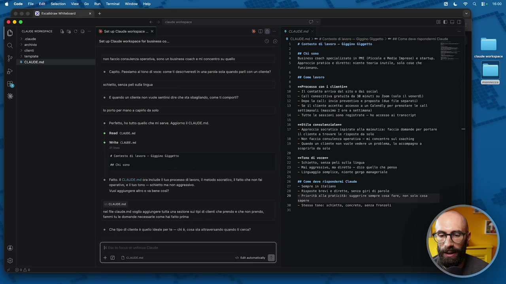

**Testo a schermo (OCR):** cioe womsnice Bla CO 3 de > ario > ln > template * ciauDEmd È E Setup Cud werkapace —. x Setup Claude warkapac for business co. (N00) on facce consulenza operativa, ono un business coach ii concentro su quelo ‘». Capito. Passiamo al ton di voce: come i dsciveresti n una parola sla quando parl con un clnte? schietto, senza pel sula ingua E quando un cent no viole senti cir che sta sbagliando, come ti comporti? o porto par man a capro da seo Perfetto, o tutto quello che mi serve. Aggiorno i CLAUDE md. Rand CUUDE.ni 1 Contesto di avro — Giopino Giggetto CITES Fatto 1 CLAUDE im ora inchude to processo di voro, metodo socratic, fatto che no a ‘operativo, ll tuo tono — schietto ma non aggressivo. Vuoi aggiungere atro 0 va bene cos? i ciAvDE na net i laude md voglio sgglungere tuta una sezione su tl di lenti che prendo e che non prendo, fammi tl domando nocessrie come hai ato prima ‘». he tipo dl elente è quell ideale pe te_— chi è, cos sta attraversando quando i cerca? Ca + ciuvvemd % CLAUDE md > = Contesto di avoro — Giggino Giggetto > =< #8 Come deve rispondermi Claude # Contesto di lavoro - Giggino Giogetto —c n0 chi soso Rusiness conch specializzato in MI (Piccole e Mesie Taprese) e startup. Approccio pratico e diretto: niente teoria inutile, solo cose che funzionano. 16 cone Lavoro seprocesso con i eLientise Dist contatto arriva dal sito 0 asi sociat — CALI conoscitiva gratuita da 30 nimuti su Zoom (solo 11 venerdl) — dopo la call: invio preventivo e proposta (due file separati) 7 se Sl cliente accetta: accesso è un Catendty per prenotare le call Settinanali (nassino 2 ore 2 settinono) — Tutte le sessioni sono registrate — ho accesso ai transcript vestito consulenziatese — Aoproccio socratico Ispirato alla mieutica: faccio dosande per portare il cUente a trovare le risposte da solo — Noe faccio consulenza operativa — ni concentro sul coaching — Quando un cliente non vuole vedere un problesa, l0 accompagno a scoprirlo da solo setono di voce " sehetto, senza pelli sutta Lingua — H01 aggressivo, na diretto — dico quello che penso — Linguaggio senplice, niente gergo sonageriale 00 Cone deve risponderai Claude — sempre in italiano " Risposte brevi e dirette, senza giri di parole - Priorità alla praticità: suggerire senpre cosa fare, nen solo coso sapere “— Stesso tono: schietto, concreto, senza fronzoli

> Chi è? Cosa sta attraversando quando ti cerca? Quindi diciamo manager o imprenditore di una PMI o una startup. È nuovo del business coaching ma ne ha capito l'importanza. Oppure l'ha già fatto in passato ma non si è trovato bene con altri coach. Se questa roba a voi non serve, mettete altre cose nel file di contesto. Invece chi non vuoi come clienti, chi è che si scarta dopo la conoscitiva? Quelli che cercano consulenti. Facciamo così, quelli che invece di un coach hanno bisogno di consulenti, mentor o advisor ma non l'hanno capito.

## [00:16:00] Schermata 16 _(periodic)_

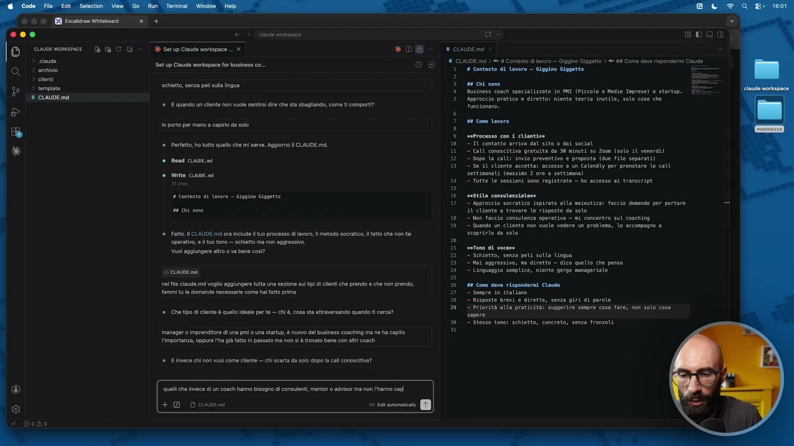

**Testo a schermo (OCR):** ce womsnce Bf CO è de > arno > tnt > template * CAVOE mA G E Setup Ciude werkapace —. x Setup Cinude workapace for business co... (N00) sceto, senza pel sula lingua = E uan un cent non vuole sentir cir che sta sbagliando, come ti comporti? o porto per mano a capro d sol Perfetto, ho tutto quell che mì serve. Aggiono li CLAUDE ma. Resa CUBE. Write coume.ss # Contesto di Lavoro — Giagino iagetto ne cri gono Fatto. l CLAUDE mora incide to processo davero, metodo socratico, i fatt che n a ‘perativ, al tuo tono — schietto ma non sgressvo. Vuoi aggiungere ato 0 va bene cos? CALO me ne fil laude md voglio aggiungere tutta una sezione su ii di centi che prendo e che non prendo, fammi tl domando necessario come hi ato prima ®. he tipo dl clente è quelo ideal per e — ch è, cosa sta attraversando quando tì cerca? manager o imprenditore di una pm una startup è nuovo del business cosching ma ne ha capito importanza, oppure l'hag fatt n passato ma non i è trovato bene co at coach E iva chi on vol come lente — ch carta da olo dopo la al conoscitiva? quell che invece di un coach hanno bisogno di consulenti, mento o advisor ma no l'anno carl + DD euwvend 34) Sw ®Deg + ciuvoemd % CLAUDE md > = Contesto diavoro — Giggino Giggeto > =< #8 Come deve rispondermi Claude # contesto di lavoro — Giggino Giogetto n0 chi soso Business conch specializzato in MI (Piccole e Medie Teprese) e startup. Approccio pratico e diretto: niente teoria inutile, solo cose che funzionano. 06 cose ravoro meprocesso con i clientisa D'ni contatto areisa dat sito 0 ari sociat — CAUI conoscitiva gratuita da 30 minuti su Zoom (solo il venerdì) — dopo la call: invio preventivo e proposta (due file separati) - Se 11 cliente accetta: accesso a un Calemily per prenotare le call Settinanati (nassino 2 ore a settinona) - Tutte le sessioni sono registrate — ho accesso al transcript vestito consutenziatese — Approccio socratico Ispirato alla mieutica: faccio dosande per portare Îl cente a trovare le risposte da sato — Noe facelo consulenza operativa — ni concentro sul coaching - quando un cliente non vuole vedere un problesa, l0 accompagno a scoprirlo da solo setono di voce — sehlerto, senza peli sutta Lingua — t01 aggressivo, na diretto — dico quello che penso = Linguaggio senplice, niente gergo nanageriale 20 Cone deve risponderni Claude — Senpre in italiano " Risposte brevi e dirette, senza giri di parote - Priorità alla praticità: suggerire sempre cosa fare, non solo cosa sapere — Stesso tono: schietto, concreto, senza fronzoli

> Inoltre ci sono alcune industrie con cui non lavoro. Vediamo se me lo chiede lui, volutamente non gli ho detto quali sono le industrie con cui non lavoro. Qua me le invento, diciamo gambling, tabacco, alcool. Ci vogliamo mantenere questa informazione, diciamo che nel nostro lavoro abbiamo scelto di non lavorare. C'è qualcos'altro che ti fa scartare un cliente, un atteggiamento? Clienti che vogliono sconti assurdi, che non vogliono pagare in anticipo. I miei pacchetti di ore di coaching si comprano sempre in anticipo. Vediamo se magari ci chiede pure qualche informazione sul prezzo. Se ce la vogliamo mettere, poi la mettiamo noi manualmente. Ricordatevi, questi sono dei file di testo, quindi oltre a tutto quello che stiamo facendo in chat,

## [00:17:00] Schermata 17 _(periodic)_

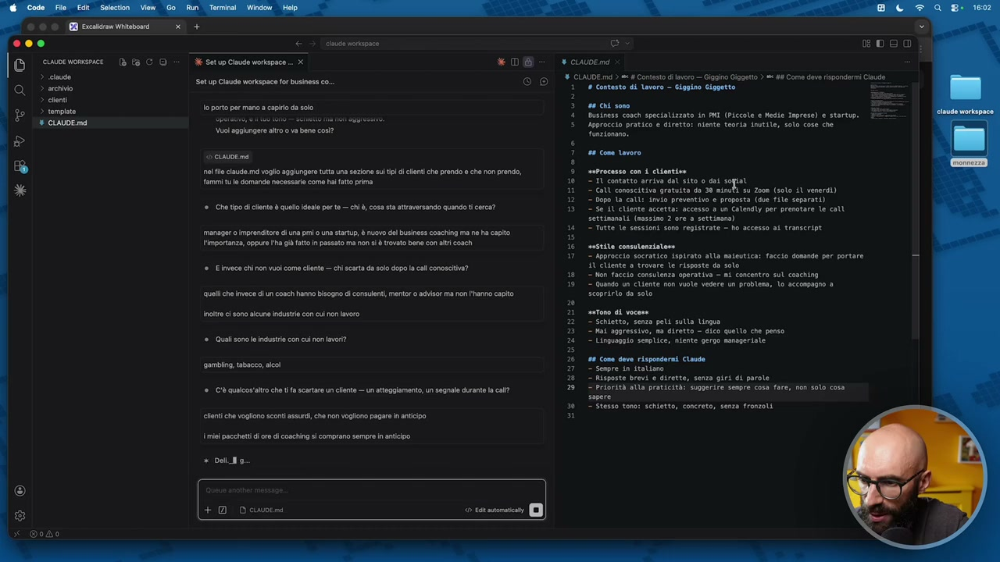

**Testo a schermo (OCR):** O00 O cuorvonine DECO > claude 3 ario > ln implto E Setup Ciude werkspace —. x Setup Claude workspace for busines co... o porto per mano a cairo da solo Vuoi aggiungere ato 0 va bene cos? nel fl claude nd vogio aggiungere tuta una sezione su tipi di lenti che prendo e che non prendo, ammi tu la Comandi necessarie come hi ato prima ‘®. Ch tpo i ciente è quelo ideale per e — chè, cosa sta attraversando quando ti cerca? manager o imprenditore di una pm una startup è nuovo del business conching ma ne ha capito importanza, oppure a giù ftt passato ma no si è vato ben con alti coach ». Eivece chi non ol com clente — chi carta da olo dopo la ali onesta? quellch iece di un cosch hanno bisogno di consent, menor 0 advisor ma non l'hanno capito inoltre ci ono alcun industrie con ui non lavoro ‘Quai sono le industria con cu non levo? gambling; tabacco, alcol ® C'è qualcosa che fa scartare un cllnto — un attegiamento, n segnalo durante a cal? lenti che vogino sconti assurdi, che non vogiono pagre in anticipo ei pacchetti oe di cosching si comprano semore in anticipo = DelRo: (0) SE EDO + ciuvoemd % CLAUDE md > = Contesto di avoro — Giggino Giggetto > =< 8 Come deve rispondermi Claude ‘ contesto di lavoro — Gipgino Giogetto 10 chi sovo Business conch specializzato in PMI (Piccole e Medie Taprese) e startup. Approccio pratico e diretto: niente teoria inutile, solo cose che funzionano. 06 cone Lavoro seprocasso con eLientise Dist contatto arriva dal sito 0 asi sogiat " cati conoscitiva gratuita da 30 ninufi su zooe (soto 11 venerdi) — dopo la call: invio preventivo e proposta (due file separati) "se Il cliente accetto: accesso è un Calendly per prenotare le coll Settinanali (nssino 2 ore a settinono) — Tutte le sessioni sono registrate — ho accesso ai transcript vestito consutenziatese — Approccio socratico ispirato alla maieutica: faccio donande per portare il eUente a trovare le risposte da soto — Noe facclo consulenza operativa — ni concentro sul coaching " Quando un cliente non vuole vedere un problesa, lo acconpagno a Scoprilo da solo setono di voce — senletto, senza pelli sutta Lingua — HO1 aggressivo, na diretto — dico quelo che penso È Linguaggio seeplice, niente gergo nanageriste 20 Cone deve rispondersi Claude — Senpre in statiano " Risposte brevi e dirette, senza gir di parole = Priorità alta praticità: ‘suggerire senpre cosa fore; non solo coss opere = Stesso tono: sentetto, concreto, senza fronzoli

> io posso andare qua dentro e scriverlo proprio a mano. Anzi, mo lo facciamo, un pezzettino lo metto anche a mano. Se no uno dice Raff, ma come, ma allora tutta sta roba devo fare forza in chat. Vedete, quando sta diventando lungo, adesso siamo a 40 righe. Cliente ideale, non lavoro con chi. E qua facciamo così, mettiamo una sezione che ci inventiamo noi. Vado qua e lo faccio io manualmente, giusto per far vedere che questo è un file di testo. Facciamo così, servizi, e ci metto pacchetti di ore da remoto. E ci metto call singola, pacchetto da 5 ore, pacchetto da 10 ore, pacchetto da 20 ore. Questo per voi potrebbe essere più veloce di farlo in chat, lo potete fare così.

## [00:18:00] Schermata 18 _(periodic)_

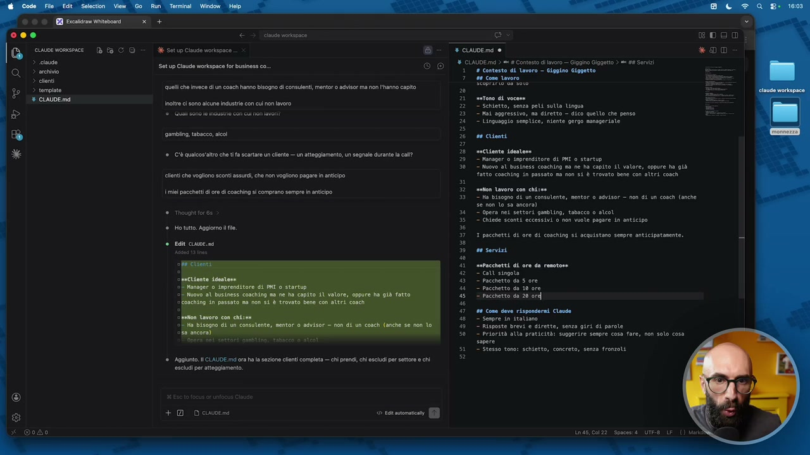

**Testo a schermo (OCR):** 00 CE Cp Frororna de O | festino + cuauDEmI ® > luo 8 CLAUDE md ) e Contesto lavoro — gino Giggoto > = Servizi rà Sat p Claude nrkapae for business co. 0 ira a 756 Cine voro SES quell che invece di un cosch hanno bisogno di consent, mentor 0 advisor mann l'hanno capito ne + ciavdEmd onto di voce IR iena Ioia Soana on pui ade persto — Schietto, senza peli sulla Lingua © Ca sono e ui cu on levo Tal spgresive, no diretto — dico quetto che penso Î Lingusgolo senpLice, niente gergo snageiate ‘gambling, tabacco, sco n6 citonti veciionto idestere — tonager 0 inprenditore di MMI 0 startup _ huovo sl business conching ma ne ha capito il valore, oppure ha già CECI SITESS tatto cosching in passato ma non si è trovato bene con altri cosch ® Cè qualcosa ch i fa scartare un lento — un attagglamento, un segnale durante a cal? sein Lavoro con chissa tri tre di coaching si comprano sempre in — HO bisogno di un consulente, mentor 0 advisor = non di un cosch (anche se non lo 5a ancora) e. Thug or 6a — opera nei settori gambling, tabacco 0 atcot È chfede sconti eccessivi 0 non wole pagare in anticioo ®. Ho tutto. Aggiomno lf. 1 pacchetti di ore di cosching SI acquistano sempre anticipatamente. it cupe pren 10 servizi svtacchetti di ore da renotore Test siogoto © Pacchetto da 5 ore pochetto a 10.ore " paccheto da 28 or 20 Cone deve risponderai Claude — Sespre in italiano " Risposte brevi e dirette, senza giri di parole - Priorità alla praticità: suggerire senpre cosa fore, non solo cosa sapere — Stesso tono: schietto, concreto, senza fronzoli

> E poi mi faccio pacchetti di ore in presenza, e qua magari ci facciamo solo ora singola, mezza giornata, full immersion di una giornata. Ok, vediamo l'anteprima, giusto per far vedere che è sempre un file di testo e non vi dovete spaventare. Ora abbiamo il nostro file CloudMD che è lunghissimo. Siamo ufficialmente nel caso 2. Quando arrivate a un file CloudMD molto molto lungo, che inizia a diventare un po' complicatello, cosa consiglio di fare io? Consiglio di passare al metodo numero 3, approccio numero 3. Cioè separare quello che deve stare nel file CloudMD con altre cose che è meglio che vadano nel contesto, in una cartella di contesto. Quindi possiamo dire questo. Mi sono accorto che il file Cloud.Md sta diventando troppo lungo.

## [00:19:00] Schermata 19 _(periodic)_

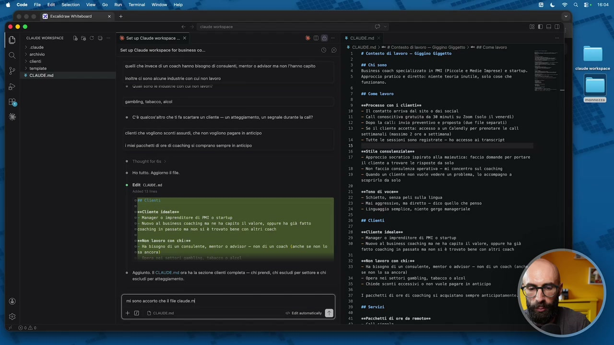

**Testo a schermo (OCR):** È > el noispnce CE | Setup Cid workapace —. x + cuauDe me si i "a © © * AMADEI) ne Cons air — gno eta) x 6 Come iv quell che invece di un cosch hanno bisogno di consent, menor 0 advisor mann l'hanno capito 20 chi sovo Business conch specializzato in MI (Piccole e Medie Taprese) e startup. re gare mere ta sir Approccio pratico e diretto: niente teoria inutile, solo cose che ©. Gu sono cus co 06 levi fonzionene. 00 cone Lavoro Crm seprocasso con eLientise Tri contatto arriva dal sito 0 dat social ® C'è qualcosa ch i fa scartare un clente — un atiaglamento, un segnale curante a cal? - CALI conoscitiva gratuita da 30 minuti su Zooe (solo 11 venerdi) — dopo la call: invio preventivo e proposta (due file separati) 7 se Sl cliente accetta: accesso un Calengly per prenotare le coll lenti che vogliono sco assurdi, che non vogliono pagare in anticipo settinanali (assi 2 ore 2 settinono) — Tutte le sessioni sono registrate — ho accesso ai transcript misi pacchetti oe di coaching sì comprano sempre in anticipo sestile consutenziatese — Approccio socratico Ispirato alla naieutica: faccio domande per portare Thought fo e Il Eltente a trovare le risposte da solo — Noo faccio consulenza operativa — ni concentro sul coaching Ho tutto. Aggiomno li fl. — Quanso un cliente non vuole vedere un problesa, l0 acconpagno a Scoprilo da solo it cune. pueia setono di voce — Sehletto, senza pelli sutta Unguo — H01 aggressivo, na diretto — dico quello che penso Linguaggio sseglice, niente gergo manageriale no ciienei socitente identone — Nanager 0 isprenditore di ji 0 startup " huovo al business conching ma ne ha capito il valore, oppure ha giò fotto coaching in passato ma non si è trovato bene con altri. cosch uetio Lavoro con ehiise "ha bisogno di un consulente, mentor 0 advisor = non di un coseh (one ® Aggiunto. l CLAUDE md ora ha a sezione clienti completa — chi prand, chi escludi per settore echi se non lo so ancora) ascluiper atteggiamento. — Opera nei settori ganbling, tabacco 0 alcol — Chiede sconti eccessivi 0 non vole pagare in anticipo 1 pacchetti di ore di cosching si acquistano senpre anticipatamente ii sono accorto chel ile cid. ne servizi + Devon © esa romics sopacchatti di ore da remoto

> Voglio usare una cartella context con dentro dei micro file md con le singole istruzioni di una sola area. Per esempio qua che gli possiamo mettere? Gli diciamo come lavoro, clienti, servizi, eccetera. La cosa che facciamo sempre qual è? Vi ricordate? Esplora, pianifica, esegui. Quindi adesso qua non gli faccio fare direttamente le modifiche perché qua diventa un po' più sostanzioso. Gli dico proponimi una struttura aggiornata e aspetta il mio ok per procedere. Quindi adesso cosa mi aspetto? Che lui mi dica, vado intuito, ti faccio una cartella context md. In questa cartella ci metto un file piccolino che si chiama come lavoro.

## [00:20:00] Schermata 20 _(periodic)_

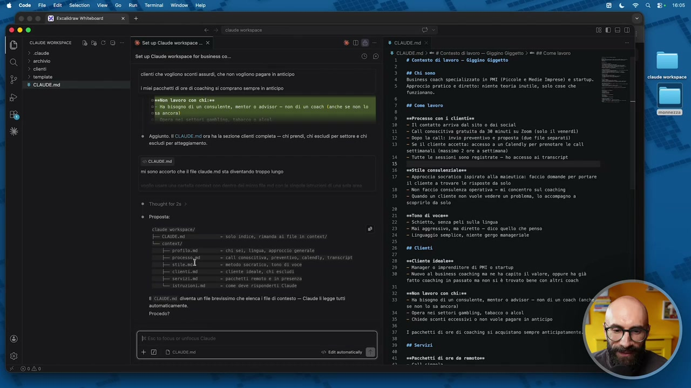

**Testo a schermo (OCR):** È E Setup Ciau workapace —. x + cuavve me RE Ra DO e cteo di vere = cis digno” lente voglono sconti sud che non vogiono pagare in anticipo 20 chi sovo Business conch specializzato in MI (Piccole e Medie Taprese) e startup. lire pacchetti ore di oschiny sl compera sempre li eni Aonoca pratico e diretto nente teoria Inti, sto cose che 06 cone Lavoro ina setrocasso con i cLientise Dist contatto areisa dat sito 0 ari sociat — CALI conoscitiva gratuita da 30 minuti su Zoom (solo L1 venerati) ®. Aggiunto. Il CLALDE md ora ha la sezione clienti completa — chi prin! hi escludi per settore e chi — dopo la call: invio preventivo e proposta (due file separati) ascii per atteggiamento. — Se 1 cliente accetta: accesso un Calenaly per prenotare le call Settinanali (nassino 2 ore a settinona) — Tutte le sessioni sono registrate — ho accesso ai transcript i ciALDE md im sono accorto che 1 o cade ma sta diventando voppo lungo mestito consutenziatoe Approccio socratico Ispirato alla sateutica: faccio domande per portare Th cente » trovare le risposte do soto — Non faccio consulenza operativa = ni concentro sul cosching © quando un cliente non wuole vedere un problena, lo accompagno & 0. mraupit tore scoprirlo da solo è Proposte: sotono di voce sthetto, senza pei sutta Lingua audi E Ha$ appresivo, na giretto — cico quetto che penso 1 cine GL nic, rin ai Li content) Z Unguagoto seaplice, niente gergo manageriale = preti hi gt Una proce aenrate E processo A conci, preventivo, cotengy; transcrpt E tiri Taro? 0 Imprerstoe di i @ start» citt cente dae; chi esci È Mir 1 bun cosching n ne ha pito LU seore copre ho gi | servizione poctnti remo 0. presenza fotto coaching in passato me non si È trovato bene con altri. cosch I dstruzioni;ndi |: come deve risponderti Clause ne cent socitente identose meio Lavoro con chissa Ul CLAUDELR diventa un file brevissimo che elenca | fl i contesto — Caudo legge tuti "ho bisogno di un consulente, mentor 0 advisor — non di un coseh (an ‘automaticamente se non lo sa ancore) Procsso? — opera nei settori gambling, tabacco 0 alcol — Chiede sconti eccessivi 0 non vole pagare in anticipo 1 pacchetti di ore di coaching si acquistano seepre anticipatasente ne servizi sopacchetti di ore da ramotome

> Lo stavo spiegando, ce l'abbiamo a schermo. Lo leggiamo che facciamo prima. Ti dice ecco qua la proposta che ti faccio. Il file Cloud.Md è un indice e questa è la figata. Perciò andiamo almeno nel modello 3. Poi vediamo col 5 che diventa ancora più figo. Cioè questo diventa un indice. Ci mettiamo giusto due cosine 2 e poi il grosso va a finire qua nei singoli file. Lui mi dice ti faccio un file col profilo, un file col processo, un file con lo stile, un file con i clienti, un file con i servizi e un file con le istruzioni. Questa cosa è perfetta. E tra l'altro, anzi diamogli prima lo ok, vai procedi. Volevo fare una riflessione ma voglio avere prima i file pronti e poi ve lo faccio vedere. Apriamoci qua perché sennò adesso non si vede che crea la nuova cartella. Adesso quindi qua si aggiungerà una nuova cartella che si chiamerà context. E adesso dentro questa cartella si creeranno i vari file. Vedete profilo.Md. Ricordo sono dei semplici file di testo. Processo.Md.

## [00:21:00] Schermata 21 _(periodic)_

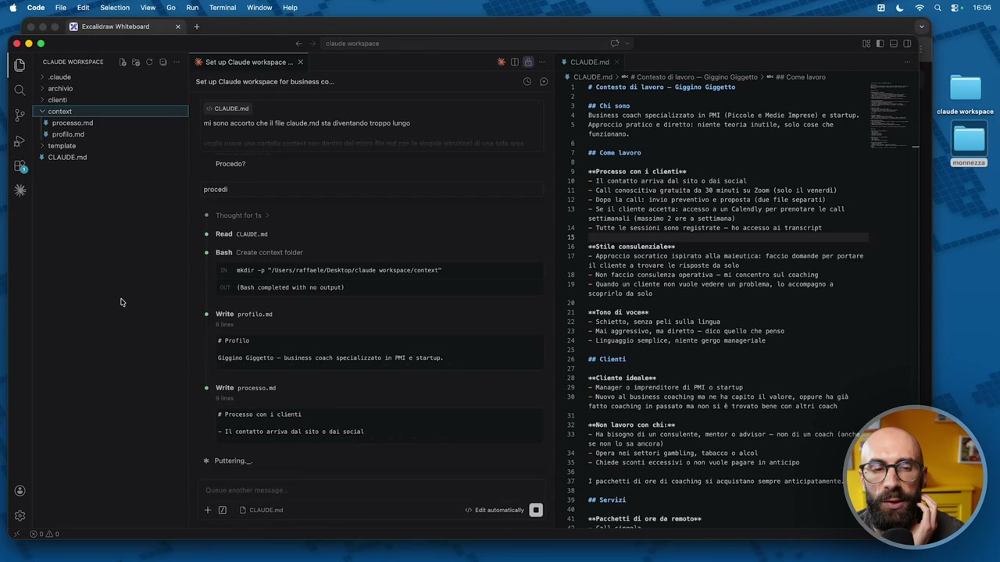

**Testo a schermo (OCR):** E DE E Setup Cid werkapace —. Xx + cuavDe me © © * CUDEMI) me Consi dio — Giggno Cgonto > = Come ino Setup Claude workspace for business co... ‘® contesto di lavoro — Giggino Giogetto 00 chi sovo Business conch specializzato in PMI (Piccole e Medie Taprese) e startup. Approccio pratico e diretto: niente teoria inutile, solo cose che funzionano. 06 cone Lavoro Procsdo? seprocasso cond eLientise Tini contatto arriva dat sito 0 ani sociat procedi — CAUI conoscitiva gratuita da 30 nimuti su Zoom (solo 11 veneral) — dopo la call: invio preventivo e proposta (due file separati) — Se 1 cliente accetta: accesso a un Calendly per prenotare le call Settinanali (nassino 2 ore a settinono) — Tutte le sessioni sono registrate — ho accesso ai transcript 3. Thoupittor i vestito consutenzialese — Aoproccio socratico Ispirato alla moieutica: faccio donande per portare il cliente a trovare le risposte da solo — Non faccio consulenza operativa — ni concentro sul coaching = ssh Create context folder mbe -p "/Users/catfasle/Desktop/ close vorkspoce/contert* TRON capii ad i) — Quando un cliente non vuole vedere un problesa, 10 acconpagno a Scoprilo da solo è tto profit setono di voce e T'sehietto, senza pei sutta Lingua E HaS appressvo, na retto — cico quetto che penso a protsto E Unguaggio scaglie, niente gergo manageriale Glgpino Glagetto — business conch specializzato in ME e strtu no cienei socitente idestore — Nanager 0 imprenditore di fi 0 startup " iuovo al business cosching ma ne ha capito Sl valore, oppure ha giò fotto cosching in passato sa non si È trovato bene con eltri cosch 1 Procenso con 1 cltenti metio Lavoro con ehiiee "ho bisogno di un consulente, mentor 0 advisor — non di un cosch (an se non lo 5a ancore) — Opera nei settori ganbling, tabacco 0 atcot ® Pattini, — Chiede sconti eccessivi o non vuole pagare in anticipo 1 pacchetti di ore di cosching si acquistano sempre anticipatamente ne servizi sepacchatti di ore da ramotore

> Sta facendo questa suddivisione qua. E quello che succederà adesso è che questo file, cloud.Md, che è quello lungo, sarà accorciato perché le cose verranno spostate nei file lì dentro. Il che significa che, come dicevamo prima, torniamo un attimo qua velocemente, è modulare, è scalabile. Ogni area è aggiornata a parte. Cioè se io domani ho anche dei prodotti oltre che dei servizi, aggiungo solo il file prodotti.Md e dentro dico anche ora come business coach faccio anche questo, questo e questo e quest'altro. Vedete che succede? Che adesso il file cloud.Md, ve lo faccio vedere così in anteprima, è cambiato perché è diventato un indice e dice i file di contesto sono nella cartella context. Quindi il file cloud.Md contiene le istruzioni per cloud, per fargli capire dove deve andare a prendere le cose. No, è come se avessimo creato dei link. Vedete, questi sono tutti effetti dei link. Ci clicco sopra e mi ha aperto proprio il link del profilo.

## [00:22:00] Schermata 22 _(periodic)_

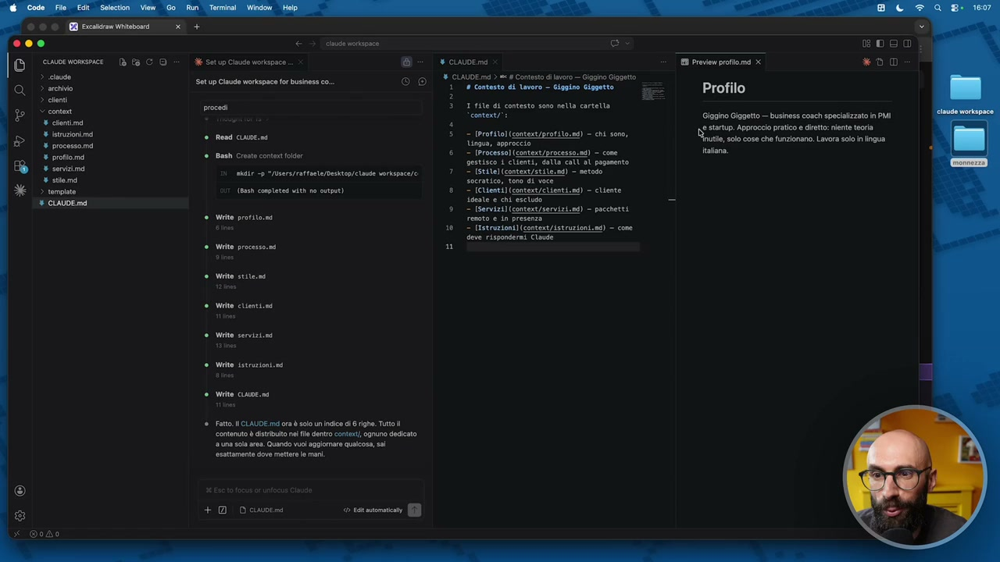

**Testo a schermo (OCR):** O00 pe © cuorvonence DI fa CO > d setupciudeworpace + ciaUDEmd I Previen prtioma x CA FS] ©) * CIAUDEMI > = Comesto diro — Giggino iggtto è Rena cUDE.si ® ssh Creato context folder nidi -p Sbsers/raftaeta/Desktp/claute vrrsprce/e (bash complete with no toi) Write protito.ni Write processo. Wi tieni Wii cisenti.nd Write seriziini Write strazione Write cune. Fatto 1 CLAUDE mi ra è sol unindice di righe. Tutto l Sootenuto è strut el file dentro cone, ognuno dedicato ‘na sla area. Quando vuol agiornar qualcosa al ‘satamente dove mettre mai. 1 # Contesto di lavoro — Gipgino Gipgetto Ed 1 dite di contesto sono nella cartetta content - [Profilo] (context/protilo:s4) = chi sono, Lingua, approccio — Processo] (contest /processo.m4) — cose gestisco i clienti, dalla call al pagamento — [Stile] (context/stile.m9) — metodo Socratico, tono di voce ideste e chi escluso — Servizi] (context/servizi.n) — pacchetti. — lUstruzioni) (context/ istruzioni nd) — cone devo risponderai Claude Profilo Giggino Giggetto — business conch specializzato in PMI startup. Approccio pratico e diretto: nente teoria solo cose che funzionano. Lavora sol n lingua aliena.

> Quindi mi dice, ti ho messo il profilo, il processo, lo stile, i clienti, i servizi, le istruzioni. Facciamo un esempio. Se io mi apro, cos'è che avevo messo io a mano? Servizi, questo l'avevo fatto io a mano, eccolo qua. Pacchetti da remoto, pacchetti in presenza. Se io adesso dico, voglio mettere i prezzi dei servizi nel contesto, così da automatizzare, automatizzare la creazione di preventivi. Guidami tu passo passo. Quindi non sto andando a modificarlo io a mano. Ovviamente a mano subito faremmo. No, vado qua dentro e scrivo 100 euro, 200 euro. Invece adesso me lo fa lui. Quanto costa la call singola? 100 Euro. Sto inventando, eh. Qua mettete i vostri valori. Il pacchetto da 5 ore, diciamo che invece di costare 500, costa 450. C'è un piccolo sconto. Però voglio far vedere che adesso si piglia le informazioni, mi aggiorna questa roba qua.

## [00:23:00] Schermata 23 _(periodic)_

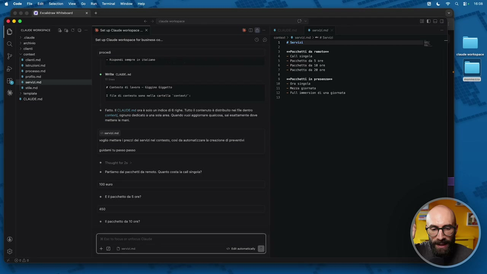

**Testo a schermo (OCR):** O00 © 3 [Gud ana GE @ cuinenomence Gf CO RE Soru Cine nre x . 8 servizi 3 lado content 8 senizimd > n Servi 3 archivio DE° è servizi Li setachettà da remoto ai posstersta 8 cloni — nio sore ia iti Toccnetto e $ D fochetto da 18 ore TFochetto sa 20 ore Setup Claude workspace fr business co... è Write cune.na fil sofacchetti in presenzone l'ora singora 1 Contesto di Lavoro — Gigpino Gigpetto "rezza giornata 1 gite di contesto sono nella cortelta ‘content? nata des are Fatto l CLAUDE im ra è sol un Indico righe. Tutto contenuto è ditbuto nl fl dentro ente, ognuno dedicato una soa area. Quando vuol aggiornare qualcosa, sl esatamante dove metter e ran. Siri voglio mettre prezzi dl sevizi nel conteso, csì da automatizzare la cazione di preventivi guicami tu passo passo © Thought fore > ». Partiamo dl pacchetti da remoto. Quanto costa a cal singola? 100 euro ® Elipacchetto da 5 ore?

> Il pacchetto da 10 ore, 900. Il pacchetto da 20 ore, a sto punto deve costare, ci deve essere un grande sconto. Invece di 2.000 Non può essere 9.900, Diciamo che sta a 1.700. E poi facciamo in presenza, ora singola, mezzogiorno. Quando costa l'ora singola? Allora in presenza diciamo che costa 300. La mezzagiornata costa 500, che tanto me lo chiederà già. La mezzagiornata 500, la giornata intera 800. E vi faccio vedere che adesso lui va a fare questo lavoro di aggiornamento, ok? In modo tale che dopo io, diciamo, quando sto più avanti, se gli dico sto facendo un preventivo per Pippo e si è preso un pacchetto da mezzogiornata, lui va direttamente e sa che la mezzogiornata costa 500. Lo sa in automatico, ok? Ora vuoi che crei anche un template per il preventivo nella cartella template così Claude può generare direttamente partendo da questi dati. Questo non è legato al contesto, ma gli dico di sì solo per farvi vedere quanto è figa sta cosa.

## [00:24:00] Schermata 24 _(periodic)_

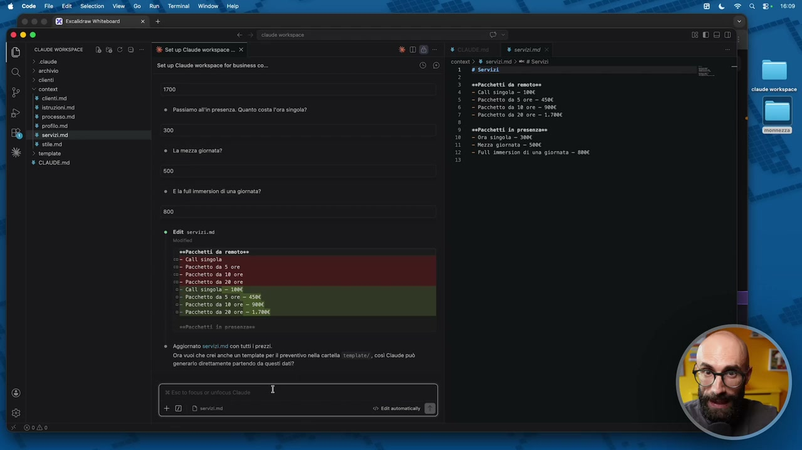

**Testo a schermo (OCR):** Ce È 8 seine *0@- » context) W servizi > mc a Seni 3 Setup Cine woriopace. x CAO è servi cioe womsnice Bla CD Setup Claude workapace for business co. > ele > aretivio > ln © conte 00 4 conti 1 istrzionimi + procosso,ma 4 protiomi 18 senizime 8 stimo — Wezza giornata — s60€ > tempiate "Full imersion di una giornata — 900€ 4 ciAUDEmd e ER serviziini vetacchetti da resotore. 11 GLI singota 102 Pacchetto da 5 ore 10- Pacchetto da 10 ore ‘Aggiomato servi id con tu prezzi. ra vol che crl anche un tanpata pr preventivo nella crtla espe], così Ciaudo può ‘genera direttamente partendo da quest da? cn

> Questo è Claude che inizia a capire il nostro lavoro. Inizia a fare le cose in automatico. Non vi preoccupate perché poi torniamo sul nostro processo. Eh, questa lezione sta venendo un po' più lunga, ma ci vuole perché questa è una delle lezioni chiave del corso. Perché dovete capire come fare questa cosa bene. Come vuoi che sia strutturato il preventivo? Ah vabbè no, sta perdendo tempo. Lasciamo stare. Lo faccio dopo. Pensavo che era veloce, rimaniamo sulla lezione che è importante. E adesso siamo nella fase 3, ok? La fase 4 diciamo non ve la faccio vedere perché è quella, diciamo a sto punto se dovete usare la 4 usate la 5 che è quella che vi consiglio io perché secondo me è molto più elegante, molto più pulita, organizzata meglio. Cosa facciamo? Io gli dico di fare questa cosa adesso. Gli dico che è arrivato un cliente, ok? Quindi abbiamo questa cartella clienti qua dentro e voglio mettere delle informazioni di contesto specifico per un cliente.

## [00:25:00] Schermata 25 _(periodic)_

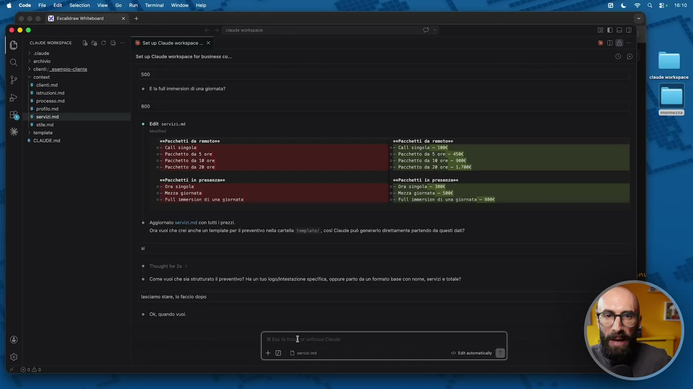

**Testo a schermo (OCR):** © sovvomee Ba CO = di srt cade orione x > le Setup Claude workapac for business co... Q > ario > een selce _ Pine ninni È (4 processo 8 profilo.md e Bò x serizime 8 alma e ia rin * Lrana sci % CLALDE md mtacchetti da remotose STILE siogota 2- Pacchetto da 5 ore. 2- Pacchetto d 10 0 Aggiomato servizi con tuti prezzi. ra voi che cri anche un templato pr preventivo nella crtla, tesplate Os Claudio può genera direttamente partendo da quest di? Though for 25 Come vuol che ia strutturato preventivo? Ha un to lgofntestazione spetfica, oppure pato da un formato ba con nome, servizi e totale? tasca stare 1 foco dopo Ok quando vuo.

> Quindi dico ho preso un cliente, il CEO dell'azienda Alfa 33. Spero che non esista questa cosa, non sapevo cos'altro inventarmi. Ho preso un cliente, il CEO dell'azienda Alfa 33, crea la cartella apposita e il file context.Md nel quale metterò le informazioni di contesto su questo cliente. Fammi tu una serie di domande sul cliente e poi aggiorna il file di contesto. E dopo gli dico anche, dopo aggiorna cloud.Md per dirgli che nelle cartelle dei clienti ci sono altri file di contesto.

## [00:26:00] Schermata 26 _(periodic)_

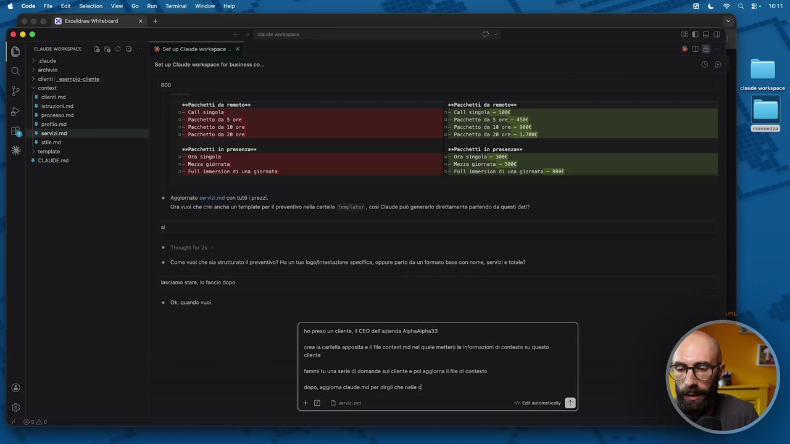

**Testo a schermo (OCR):** 000 © cuiorvonsnc DB fa CO - Setup Ciuse voriapace. x x E ‘Set up Claude workspace for business co... > clent)esemol-cente © conto Lai + ciontima 4 istruzioni Cra no CALL sigot lesson 0- Pacchetto da 3 # protiome 0 Pacchetto da 1 (8 servizi. o- Pacchetto da 28 1 8 stlema sotacchetti in presenzane > tempiate 8° ora singota. % ciAUDEmd = Mezza giornate. 3 FULL Samersion di una giornata. Aggiomato servizi con tt prezzi. Ora vuoi che crl anche un tamplata pr preventivo ell crtla teste, 0sì Ciaud può generari direttamente partendo da quest at? Thoogn for 2 Come vioi ch sa strutturato preventivo? Ha un tuo logfntestazione specifica, oppure pato da un formato base con nome, servizi tte? tasca stare, 1 faccio dopo ®. Ok, quando uo. ho preso un lente, l CEO dell'zinda AphaAipna33 rea a carta apposita lle contet md nei quale metter e informazioni di contesto su questo ciente fammi tv a ere dl domande sui lente e pol aggiorna file i contesto ‘4000, aggiorna claude md per digli che nell di + DD Denim

> Così cloud sa che un pezzo di contesto è qua, un pezzo di contesto è qua e poi il resto è nelle cartelle specifiche dei clienti. Quindi se adesso apro clienti, ecco qua vedete, c'è la cartella Alfa Alfa 33, dentro me ha creato già preventivi, report, trascrizioni, perché conosce quella struttura, perché gliel'avevamo detto. E adesso c'è il file di contesto. Di cosa si occupa Alfa Alfa 33? Qua invento eh, non lo so, diciamo si occupa di automotive. Non so perché ho pensato ad Alfa Romeo. Poca fantasia in questo momento. Però gli voglio dare alcune informazioni per farvi vedere adesso cosa andrà a fare. Cioè creerà il file di contesto. Quindi mi ha chiesto di cosa si occupa automotive. Quante persone ha l'azienda? 150, Piccolina questa azienda automotive, ma non fa niente, tanto ce le stiamo inventando queste cose. Anzi teniamoci aperti il file di contesto qua sulla destra, così lo vedete dopo che si aggiorna.

## [00:27:00] Schermata 27 _(periodic)_

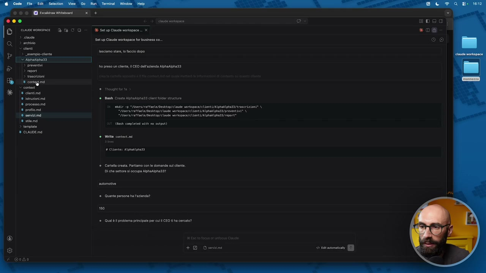

**Testo a schermo (OCR):** E Setup Cinuce workapace —. x Setup Claude workapace for business co... lasciamo stare, faccio dopo ho preso un ente, CEO dell'azione Alhadpha33 Tough for 8 Bash Crete AphaA|phs33 cent folder stivetro nAdhe -p “Aisers/ratfaete/Desktg/claute orkspace/cLinti/Atphatpia3O/trascrizioni* \ = pases/ rafael /besktop/ claude vorkspace/elienti/Alphatpa3/preventivi* \ = 066/af aelePshtop/elude Voraspoe/elLenti/Alaa pra report VT Cash complete vità na cuor) Write converti 4 Catentes Atpharipaza sso ‘». Quali roblema principale per cui EO i a cercato? + DI Oreto

> Qual è il problema principale per cui il CEO ti ha cercato? Diciamo che vuole fare, che ne so. C'è un momento importante di passaggio di consegne tra il padre e il figlio. Inventiamoci questa cosa, però classico diciamo di alcune aziende. Il CEO è il padre e il figlio, giusto Ben? Vedete perché è importante che ci faccia le domande? Ma me lo sta inventando, quindi ovviamente è divertente. Però quella cosa magari me l'ha sfuggita. Il figlio è in azienda o non è in azienda? Ed è il direttore commerciale. Sto facendo proprio comunque un caso da manuale e queste sono cose proprio che succedono, soprattutto nelle PMI italiane. C'è già una data, una scadenza per il passaggio di consegno? No, la definiremo insieme. Vedete si sta creando il contesto, cioè vuole capire bene che pacchetto ha acquistato.

## [00:28:00] Schermata 28 _(periodic)_

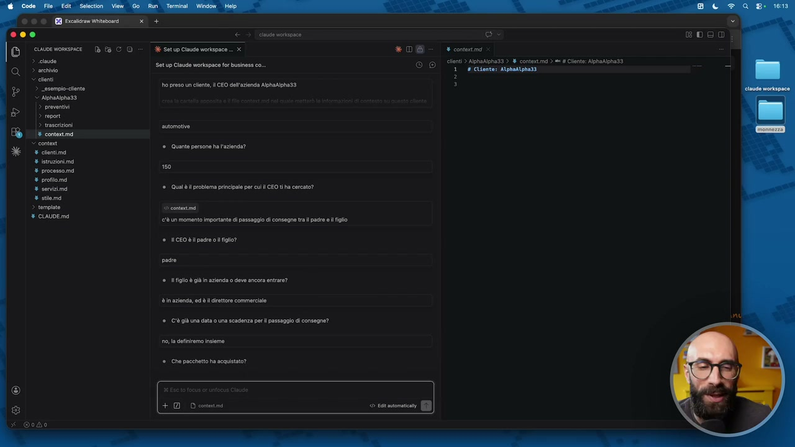

**Testo a schermo (OCR):** È Co 000 © suiorvonsnce DB fa CO > A Setup Cite oripace. x + contesta 3 lado centi AphaApha33 > cometnd n Cent: Apratpna33 2 Sat p Claude mrkapae for business co. lle < eten ? > _esempio-certa > Aphadpnass > prevent > report > vasco 18 contesima < cont + ctentim vini ma processo ma + protoni servizi 4 atte > tempiste $i valina è un momento importante dî passaggi di consegne rl padre eil figo ho preso un lente, CEO dell'azienda AlhaAipna33 sso Quali robiema principale per cui i EO i ha creato? 2 1CEO 81 padre ol faio? pedro = ig è gi imazionsa 0 eve ancora errare? din aziona, ed retro commerciale = Cè luna dita o una scadenza peri pssagl di consgne? n, a afro insieme ‘Che pacchetto ha acquistato?

> Giusto perché gli abbiamo detto il pacchetto, quindi gli abbiamo detto 5 giornate in presenza più 20 ore da remoto. Sto inventando. Però vedete come sta facendo i collegamenti? Sa come è fatto il mio lavoro, sa che lavoro per pacchetti, mi ha chiesto che pacchetti ha acquistato. Vediamo se gli serve qualche altra cosa. Ovviamente se lui poi ci fa una serie di domande ma mancano ancora delle cose le mettiamo noi. Voglio dire se voi avete delle informazioni importanti per il contesto le mettete. Ecco qua. Ci ha creato il nostro file di contesto. Ce lo guardiamo sempre con la modalità anteprima. L'azienda si chiama Alfalfa 33, automotivi, 150 dipendenti, il CEO, il fondatore, il padre, situazione, passaggio di consegno al figlio, attuale direttore commerciale. Il figlio è già in azienda, la data del passaggio è da definire insieme nel percorso. Pacchetto ha acquistato, 5 giornate in presenza, 20 ore da remoto. Immaginate cosa potremmo fare adesso che abbiamo questa informazione. Siamo nel caso 5 che quindi ci dà una flessibilità incredibile.

## [00:29:00] Schermata 29 _(periodic)_

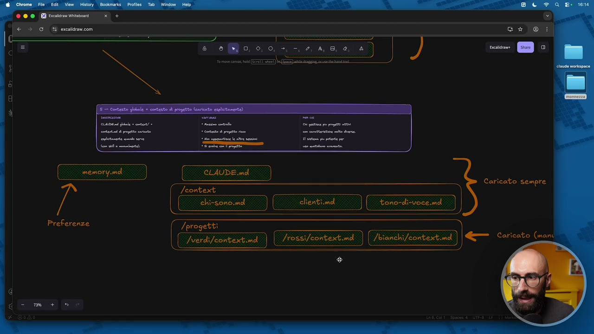

**Testo a schermo (OCR):** Ga /context \( chi-sono.md — )[ clienti.md )(-tono-divoce.md ] Caricato sempre Preferenze Tani | Nverdi/conterxtimd ) | /rossi/contert.nd ) (Zeianchi/eontextimd) | CK Caricato ®

> Mettiamo che sono passate due settimane. Vogliamo tenere magari conto di quanto hanno consumato, quanta roba del pacchetto hanno consumato. Quindi potremmo dire sono passate due settimane. Abbiamo fatto una giornata in presenza e già tre ore da remoto. Aggiorna il file di contesto con quello consumato dai pacchetti e quello che rimane. Ovviamente questa cosa succede nel tempo, però dopo la call io potrei andare a mettere il transcript e dire ho appena finito la call con il CEO, è durata un'ora, ecco il transcript. Lui va e mi fa anche l'aggiornamento. Diciamo ok, allora se hai fatto un'ora, teniamo conto.

## [00:30:00] Schermata 30 _(periodic)_

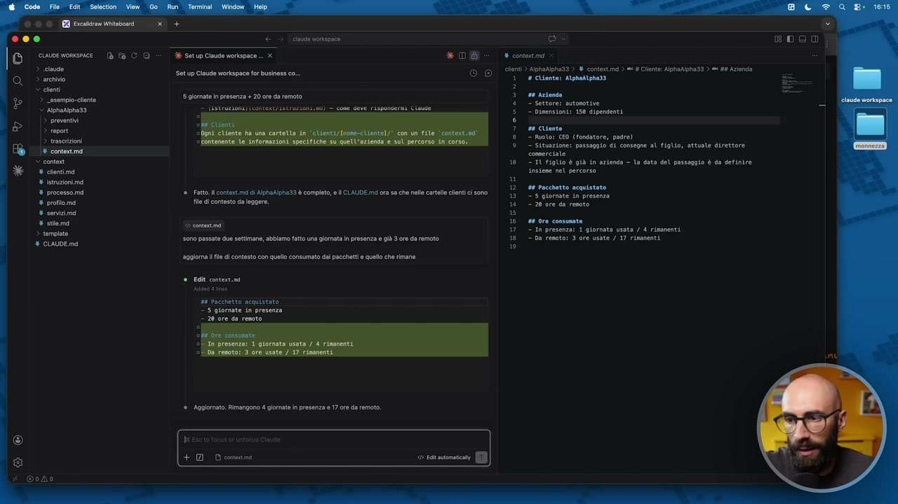

**Testo a schermo (OCR):** Ce + content © © Sieni> Apiadiphasà > Y contesti > = Cento: Nphatpha33) = #9 Azinda # Cliente: AtphaAtphaz3 00 Azienda — settore: autonotive — istruzioni context/ istruzioni 07 — come deve rasponsermi Ciouse © Gisensionii 156 dipendenti n0 Ciionte = Ruolo: CEO (fondatore, padre) — Situazione: passaggio di consegne al figlio, attuale direttore comerciate TTI figlio è giù in azienda — ta data del passaggio è da definire insieme nel percorso ati. ont dl prati compie LAUDE: or che le cana cin sono Tec il di contesto da laggere. 7 20° ore do remoto — tn presenza: 1 giornata usata / 4 risonenti. sono passato due settimane, abbiamo fato una giornata In presenza e giù 3 ore da remoto = Da remoto: 3 ore usote / 17 risonenti nagloma fl di contesto con quell consumato dal pacchetti quell che rimane e tt contenti n Pacchetto scquistato "3 giorate in presenza — 20°0re da remoto

> Oggi parliamo di business online, prodotti digitali e mindset. Oggi parliamo di business online, prodotti digitali e mindset.
