# Popolare velocemente il proprio contesto

> Documento generato automaticamente: trascrizione e screenshot sincronizzati del video-corso.

## [00:00:00] Schermata 0 _(start)_

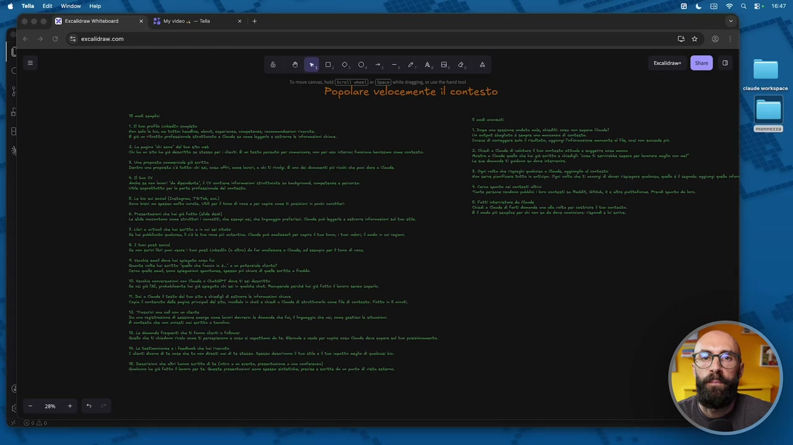

**Testo a schermo (OCR):** 0° Bani 1» — 0) e 00,00, +. Gean. ‘al omnia GETZ Geena Popolare velocemente il contesto dine Rat pete cio REESE O ere cirie ve teresa carie epi cE Lise dice ore cre oneri CPPS ati dA nn ca Li i pi dei pl i e pri de a le PrcOqo A MEA NSIZIISTA [UDO RI ORGNNO SINIS SION Iso DOprSS CRIARI pr ti dee poripine tarata pa II putti pedi to 4 Pierini i i e il de) TL rt at) di i pg e. a pt pl sr ni 1 tt RA LTT DEI ria cdi a tp ap e ui cado rp a LIM ni i dui post Lt e lr) da fa ca Cl, a api pe n div RL vt Li sett ele e fcose mi pet desta CRA oa 2 gt rie page I quali cer: Rune pri Ki gi ato daro tan sapa. RIE LE i AL A rl prc ER I i ZA Sl a iii no di ftt PI Ti iui dvi dd pg de cn pe i OLI TT re CT petto de ta Se e per pe ce ld dv dope ll pinto. PART TIA 1 su dre fl tte ed ln smise eo DEAR RAS NE A dard ale esa Priano prozac VER TA a e Ip OO A CE COL pa pe rr co CO a Opi vt degli lt [inioleo eee POT So anni a AK € e para. Psi punto i lr RE e angle pe 3 es e da dev ia vaganti E

> Proprio perché la parte di contesto è una delle più importanti, voglio fare un'altra aggiunta, un'altra lezione specifica per provare a rispondere a una domanda che potrebbe sorgere da alcuni di voi e che spesso mi viene fatta. Più che una domanda, a volte è un po' una paura per dire, Raph, porca miseria, ma allora prima di riuscire a utilizzare veramente bene Cloud Code devo passare un sacco di tempo a popolare questo contesto? Innanzitutto la risposta è no, non devi passare un sacco di tempo perché come abbiamo visto qua lo devi fare piano piano, ok? Nel tempo, quindi tu parti con un contesto semplice e poi lo popoli. Ma quello che voglio farvi vedere in questo video specifico è il fatto che non dovete partire da zero, perché le avete già queste informazioni, questa è una cosa che ribadisco sempre a tutti quelli che si spaventano, le avete già queste informazioni, solo che o non lo sapete o non avete capito che le potete facilmente trasportare dentro il contesto. Ecco, ho messo 15 modi semplici e 5 modi avanzati, quindi adesso ce li vediamo insieme.

## [00:01:00] Schermata 1 _(periodic)_

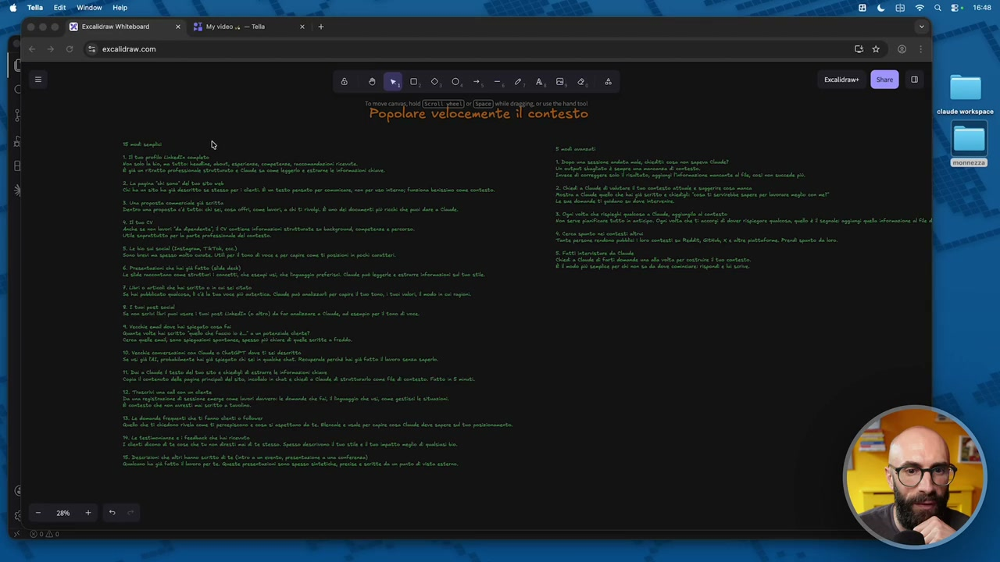

**Testo a schermo (OCR):** 8 arme camel (EEE SO (EE) e Popolare Velocemente dini IS FE I a sr te rr RA E rete ii oe P ITER Tee ini dine RIM. Mt peri et tte pato pr cm e pf ar nin ic cn cat. Ben Leti i TL ta cn i hi i dl dti ci pui dr è Cln DAI dre Vita ani ita e Laird pine è pci CL e ite ent) LITRO Liana niiplicn 4 tria he i pi Ft id de) SII at ch ini he aa pori Ce può ag tri rn a Sa e a tt che pds pr pt fi tl vpi TLT eri i pui a (e) ef en cla did Re e ci ci use e dala et fl TNT I pr LIE ile ped i ta e i par Be de tt dl ii cia ri di ep E pi tp e I LETALE Sdi soci ld ct ta Pe ion ca ui dvi ii e pih n ut ii 8 dadi rutena RIA LE pr cp dite Bi li per pi ca Cd di o lu pri PI iti rl ch ba to PALE e i e ate te darne n e tu pt ngi di lin RT Re E Gli AO CAI FT dee dea pe di te nt e Ra, 0, 0, +, -, 2, A, 8, è, î ‘ai contesto demi api te i ip ape ET eg ie tl i) ep I fine e tea te il pri e i i re ETNO pr na Opi e gigli lee id [ipepoie nerone MAT ALL cnr a Ri, MK lt porn. Prendi quit da e RO spl persi need e ci ponti LI e Ti ne ia peter pid

> Questa parte qua, diciamo, è una di quelle dove potete scegliere quelle che volete voi, ne ho messe tante perché potete scegliere quelle che volete voi. La prima, super intuitiva, il profilo LinkedIn. Il profilo LinkedIn contiene già molte delle informazioni. Pigliate il link, lo buttate in chat, oppure copiate proprio il testo, lo date in chat e gli dite di trasformarlo nel contesto. Quindi attenzione, questa cosa è importante, pigliate il link o copiate, ma dite a Claude, questo è il mio profilo LinkedIn, aggiorna il contesto con le informazioni mancanti, in modo tale che Claude sa dove andare a mettere le cose. Allora, Raffaele ha lavorato in questa azienda, Claudia fa da freelance e lavora in questo settore, Giulia ha queste competenze, no? Fa questa divisione, che poi è il lavoro che deve fare Claude Code. Secondo, se avete un sito web, la pagina ChiSono, che è quello da cui sono partito io. Io sono andato sul mio sito web, ve lo faccio vedere proprio, raffaelegaito.Com, nel mio sito web ho preso proprio la pagina ChiSono,

## [00:01:58] Schermata 2 _(scene)_

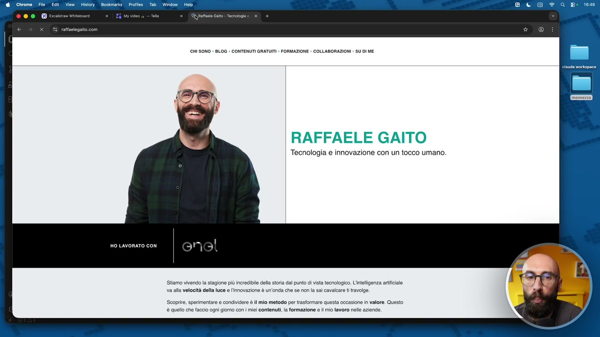

**Testo a schermo (OCR):** @ Chrome File Edit View History Bookmarks Profiles. Tab Win e x raffalegsito.com CHI SONO | BLOG : CONTENUTI GRATUMI : FORMAZIONE + COLLABORAZIONI : SU DI ME RAFFAELE GAITO Tecnologia e innovazione con un tocco umano, HO LAVORATO CON Stiamo vivendo la stagione più Incredible della storia dal punto di vista tecnologico. L'intelligenza artificiale va alla velocità della luce e l'innovazione è un'onda che se non la sai cavalcare t travolge. Scoprire, sperimentare e condividere è il mio metodo per trasformare questa occasione in valore. Quosto è quello che faccio ogni giorno con | miei contenuti, la formazione e il mio lavoro nelle aziende.

> l'ho data in pasto a

## [00:02:02] Schermata 3 _(scene)_

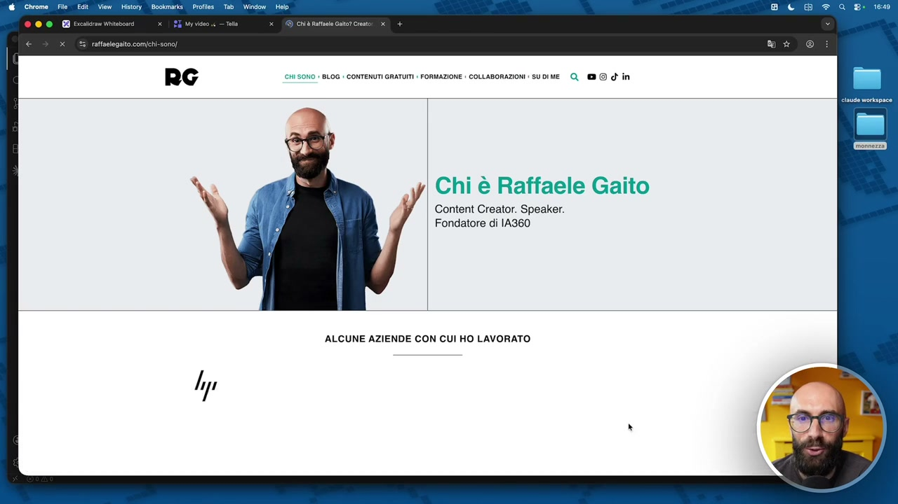

**Testo a schermo (OCR):** @ Chrome File Edit View History | Bookmarks Tab Window | Help 000 Brioni x ide 4 — el x (0) chiù atnla Gai? Crest CHI SONO | BLOG : CONTENUTI GRATUNI | FORMAZIONE | COLLABORAZIONI | UDIME O, @@ d'în > Chi è Raffaele Gaito Content Creator. Speaker. Fondatore di IA360 ALCUNE AZIENDE CON CUI HO LAVORATO

> Claude Code, e siccome qua c'è un sacco di roba, vedete c'è in breve, bla bla bla bla bla, ci sono un bel po' di cose, e poi diciamo ci sono, dicono di me e così via, ho preso questa informazione, ho detto parti da queste, e inizia a popolare il contesto. Poi, proposta commerciale già scritta,

## [00:02:13] Schermata 4 _(scene)_

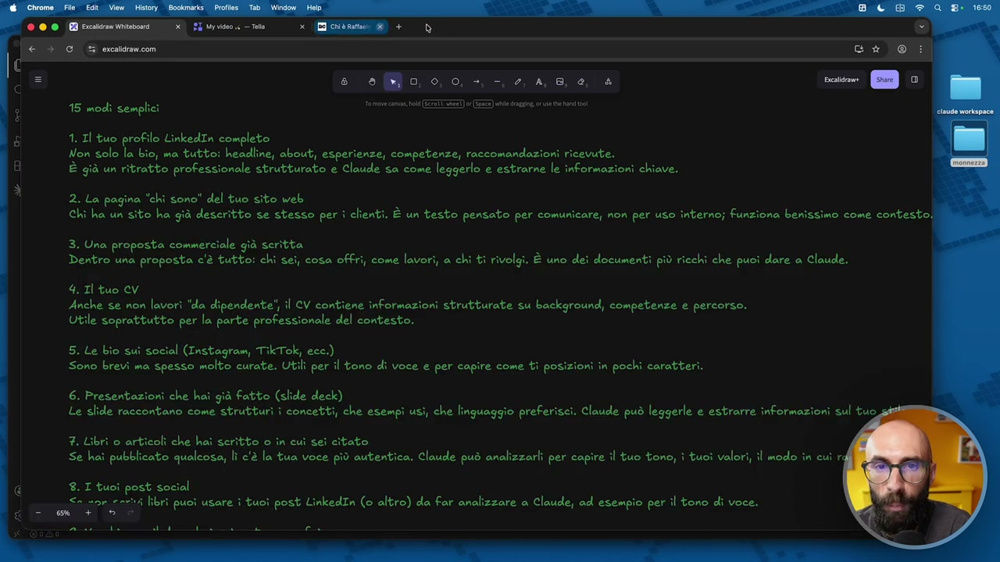

**Testo a schermo (OCR):** 4 0, 0, 0, +, -, 2, 4,8, e, è = Ea) re i 15 modi semplici 1. Il tuo profilo LinkedIn completo Mon solo la bio, ma tutto: headline, about, esperienze, competenze; raccomandazioni ricevute. È già un ritratto professionale strutturato e Claude sa come leggerlo e estrarne le informazioni chiave. 2. La pagina “chi sono" del tuo sito web. Chi ha un sito ha già descritto se stesso per ì clientì. È un testo pensato per comunicare, non per uso interno; funziona benissimo come contesto! 3. Una proposta commerciale già scritta Dentro una proposta c'è tutto: chi sei, cosa offri, come lavori, a chi ti rivolgi. È uno dei documenti più ricchi che puoi dare a Claude. 4. Il tuo Cv Anche se non lavori “da dipendente! il CV contiene informazioni strutturate su background, competenze e percorso. Utile soprattutto per la parte professionale del contesto. 5. Le bio suì social (Instagram, TikTok, ecc.) Sono brevi ma spesso molto curate. Utili per il tono di voce e per capire come ti posizioni in pochi caratteri. 6. Presentazioni che hai già fatto (slide deck) Le slide raccontano come strutturì î concetti, che esempi usi, che linguaggio preferisci. Claude può leggerle e estrarre informazioni sul tuo, #. Libri o articoli che hai seritto o în cui seî citato Se hai pubblicato qualcosa, lì c'è la tua voce più autentica. Claude può analizzarli per capire il tuo tono, ì tuoî valori, il modo in cui rd 8. I tuoì post social i puoi usare î tuoì post LinkedIn (o altro) da far analizzare a Claude, ad esempio per il tono di voce.

> cioè se voi avete già, se voi lavorate, e avete già proprio dei file, avete un primo preventivo, una prima proposta, apriate quella, la date in posto a Claude e dite questa, è una proposta commerciale. Estrai le informazioni per popolare il contesto, e là ci va un po' di tono di voce, un po' di servizi, un po' anche magari il template di come strutturate le proposte commerciali e così via, perciò non dovete ricominciare da zero. Importate cose che si trovano già altrove, ed è facilissimo farlo, tra l'altro. Il cv, il cv, ovviamente, chi ce l'ha, chi non ce l'ha, chi ce l'ha aggiornato, chi non ce l'ha aggiornato, chi ce l'ha da dipendente, no, chi ce l'ha di un altro tipo, ma quello è un ottimo passaggio, perché dentro ci sono dove avete studiato, qual è il vostro background, quali sono le vostre competenze, qual è il vostro percorso, piate quella roba, e la date a Claude e gli dite di utilizzarla come, come, come contesto. Bio sui social, questa l'ho messo perché ho detto,

## [00:03:13] Schermata 5 _(periodic)_

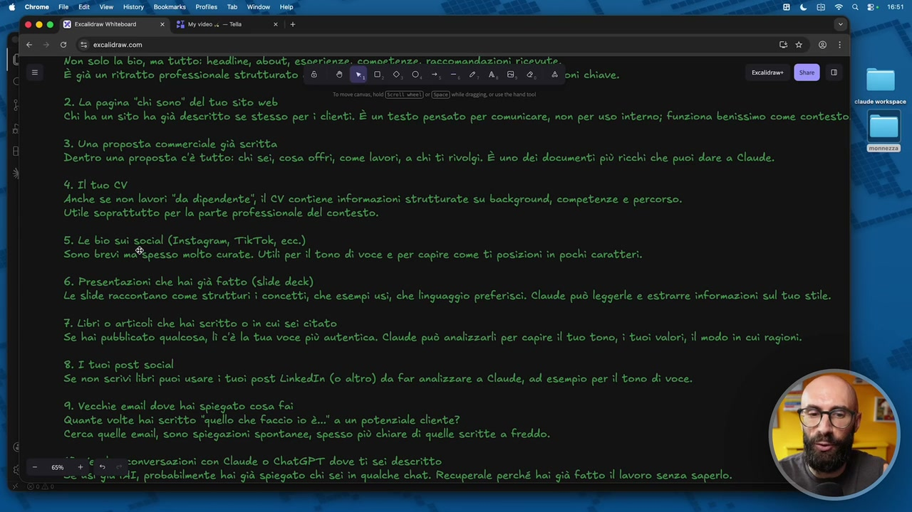

**Testo a schermo (OCR):** Fucina Viabonni x SE Mv Tela °) @ % excalidrawcom Ck @ i Non solo la Lio, ma tutto: headline, about, esoerienze. comoetenze. raccomandazioni ricevute. È già un ritratto professionale strutturato & ® 0, 6, 0, +, =, 2, A, 8, @, & onì chiave. renti [se] Di 2. La pagina "chi sono" del tuo sito web Chi ha un sito ha già descritto se stesso per i clienti. È un testo pensato per comunicare, non per uso înterno; funziona benissimo come contesto. 3. Una proposta commerciale già seritta Dentro una proposta c'è tutto: chi sei, cosa offri, come lavori, a chi ti rivolgi. È uno dei documenti più ricchi che puoi dare a Claude. 4. Il tuo CV Anche se non lavori ‘da dipendente”, il CV contiene informazioni strutturate su background, competenze e percorso. Utile soprattutto per la parte professionale del contesto. 5. Le bio suì social (Instagram, TikTok, ecc.) Sono brevi me®4pesso molto curate. Utili per il tono di voce e per capire come ti posizioni in pochi caratteri. 6. Presentazioni che hai già fatto (slide deck) Le slide raccontano come strutturi i concetti, che esempi usi, che linguaggio preferisci. Claude può leggerle e estrarre informazioni sul tuo stile. #. Librì o articoli che hai seritto o in cui citato Se hai pubblicato qualcosa, lì c'è la tua voce più autentica. Claude può analizzarli per capire il tuo tono, i tuoi valori, il modo in cui ragioni. 8. I tuoì post social Se non scrivi libri puoi usare i tuoi post LinkedIn (o altro) da far analizzare a Claude, ad esempio per il tono di voce. A. Vecchie email dove hai spiegato cosa fai Quante volte hai scritto “quello che Faccio io è..." a un potenziale cliente? Cerca quelle email, sono spiegazioni spontanee, spesso più chiare di quelle scritte a freddo. _ egli €15). sonversazioni con Claude o ChatGPT dove ti sei descritto 'e'si gu (AT, probabilmente hai già spiegato chi seî in qualche chat. Recuperale perché hai già Fatto il lavoro senza saperlo.

> è una cosa che sicuramente hanno tutti quanti. Ovviamente non è che dalla bio sui social posso capire chissà che, sono quattro righe, cinque righe, però magari c'è quella ironia, c'è quello stile, c'è quel tono di voce, prendete pure quello. Le presentazioni, questo è un po' come il tre, no, le presentazioni, se voi avete fatto già delle slide, perché, che ne so, perché siete uno speaker a una conferenza, perché fate dei report, perché scrivete dei whitepaper, perché avete fatto delle slide per della formazione e così via, là dentro c'è un botto di roba che Claude può prendere. Se poi, diciamo, come me avete la fortuna di pubblicare libri, oppure ebook, oppure di nuovo whitepaper o altra roba là, pure quello. Pigliate quei file e gli dite analizza questo ebook che ho scritto, e strapola il mio tono di voce, il mio stile, il modo con il quale strutturo i documenti, le parole che uso più frequentemente, le espressioni che sono tipiche mie e così via.

## [00:04:13] Schermata 6 _(periodic)_

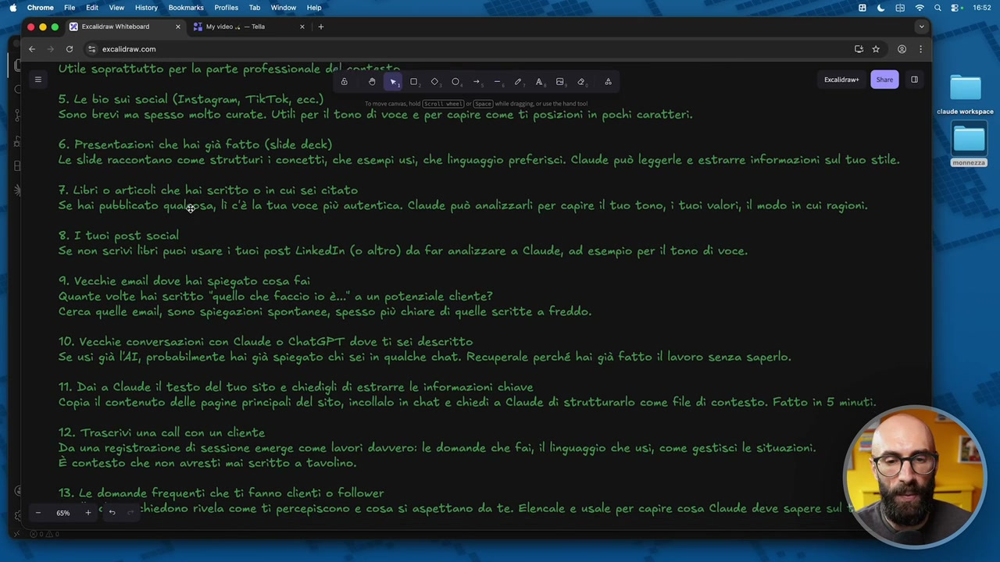

**Testo a schermo (OCR):** (EB Paco Wiiebonid (x SI Myvideo a — Tela € > GE crcalciancon Utile soprattutto per la parte professionale del anstacta () ® 0, 9, 0, +, 2, AB e A 5. Le bio suì social (Instagram, TikTok, ecc.) to mor cain EER) we ngi. ore nd come ti posizioni in pochi caratteri. Le slide raccontano come strutturì i concetti, che esempi usi, che linguaggio preferisci. Claude può leggerle e estrarre informazioni sul tuo stile. 3. Librì o articoli che hai scritto o in cui seî citato Se hai pubblicato qualgpsa, lì c'è la tua voce più autentica. Claude può analizzarli per capire il tuo tono, i tuoi valori, il modo in cui ragioni. £.I tuoì post social Se non scrivi librì puoi usare i tuoi post LinkedIn (o altro) da Far analizzare a Claude, ad esempio per il tono di voce. A. Vecchie email dove hai to cosa fai Quante volte hai seritto “uelo che Faccio îo è..." a un potenziale cliente? Cerca quelle email, sono spiegazioni spontanee, spesso più chiare di quelle scritte a freddo. 10. Vecchie conversazioni con Claude o ChatGPT dove ti sei descritto Se usi già l'A—, probabilmente hai già spiegato chi sei în qualche chat. Recuperale perché hai già fatto il lavoro senza saperlo. 11. Dai a Claude il testo del tuo sito e chiedigli di estrarre le informazioni chiave Copia il contenuto delle pagine principali del sito, incollalo în chat e chiedi a Claude di strutturarlo come file di contesto. Fatto in 5 minuti. 112. Trascrivi una call con un cliente Da una registrazione di sessione emerge come lavori davvero: le domande che Fai, il linguaggio che usi, come gestisci le situazioni. È contesto che non avresti mai scritto a tavolino. 13. Le domande frequenti che ti Fanno clienti o Follower em + 5 :hiedono rivela come ti percepiscono e cosa sì aspettano da te. Elencale e usale per capire cosa Claude deve sapere sul

> Stessa cosa sui post social, questo l'ho messo sempre per chi non ha quello solo, perché qualcuno potrebbe dire, vabbè Raff, ma è facile per te che scrivi libri, no, e così via, ma magari voi scrivete su LinkedIn, no, una volta al mese, una volta a settimana, una volta al giorno, spero, frequentemente. Pigliate i vostri post LinkedIn e li fate analizzare a Claude, da quello che Claude può capire i vostri interessi, le vostre passioni, di nuovo, il tono di voce, lo stile, le vostre competenze, quello in cui siete ferrati, eccetera. Oppure se avete delle mail, magari avete delle mail che avete mandato a qualcuno che vi ha chiesto, senti Giulio, ti ho conosciuto a questo evento, vorrei sapere di più sui servizi della tua agenzia, ma di cosa vi occupate, e tu magari hai scritto 40 righe, piglia quella roba e dà la Claude. Oppure, visto che magari molti di voi vengono da ChargPT, da Gemini, da Claude, e così via, prendete quella roba là, cioè l'avete scritto già in una chat, prendetelo, lo copiate, lo incollate e lo fate, lo date in pasta a Claude, ma sempre con la cosa di dirgli questo è, diciamo, una conversazione che ho avuto con ChargPT a proposito di X,

## [00:05:13] Schermata 7 _(periodic)_

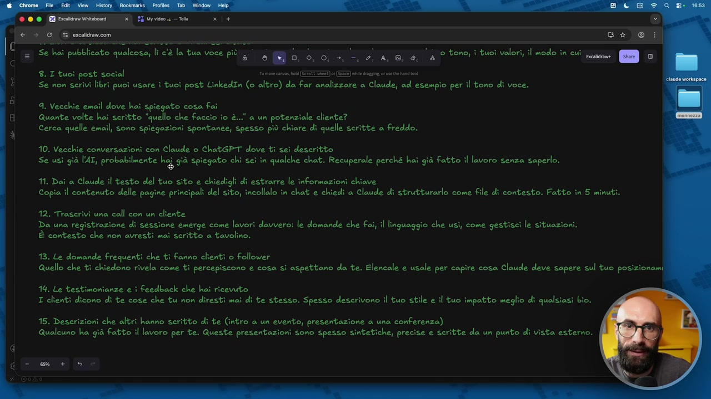

**Testo a schermo (OCR):** o tono, i tuoi valori, il modo în cuì. pesi [s..] ‘a 2, A, 8, & è 8. I tuoì post social 7 1) e (EE) le dig: rit aio libri puoi usare ì tuoi post LinkedIn (o altro) da Far analizzare a Claude, ad esempio per il tono di voce. a. Vecchie email dove hai spiegato cosa fi Quante volte hai seritto "quello che Faccio io è...' a un potenziale cliente? Cerca quelle email, sono spiegazioni spontanee, spesso più chiare di quelle scritte a Freddo. 10. Vecchie conversazioni con Claude o ChatGPT dove ti sei descritto Se usì già l'AI, probabilmente Disù spiegato chi sei în qualche chat. Recuperale perché hai già fatto il lavoro senza saperlo. 11. Dai a Claude il testo del tuo sito e chiedigli di estrarre le informazioni chiave Copia il contenuto delle pagine principali del sito, incollalo in chat e chiedi a Claude dì strutturarlo come file di contesto. Fatto în 5 minuti. 12. Trascrivi una call con un cliente Da una registrazione di sessione emerge come lavori davvero: le domande che Fai, il linguaggio che usì, come gestisci le situazioni. È contesto che non avresti mai serìtto a tavolino. 13. Le domande Frequenti che ti fanno clienti 0 Follower Quello che ti chiedono rivela come tì percepiscono e cosa sì aspettano da te. Elencale e usale per capire cosa Claude deve sapere sul tuo posizionami 14. Le testimonianze e i feedback che hai ricevuto I clienti dicono di te cose che tu non diresti mai di te stesso. Spesso descrivono il tuo stile e il tuo impatto meglio di qualsiasi bio. 15. Descrizioni che altri hanno scritto di te (intro a un evento, presentazione a una conferenza) Qualcuno ha già fatto il lavoro per te. Queste presentazioni sono spesso sintetiche, precise e scritte da un punto di vista esterno.

> recupera da qua dentro le informazioni importanti e trasformalo in elementi di contesto. Oppure, il sito, perché magari non ci avete, che ne so, avete un... L'agenzia è un ottimo esempio, avete l'agenzia e l'agenzia ha le varie pagine con i servizi, no? E così via, fate questa roba qua. Avete, non lo so, fate... Formazione, stessa cosa, dentro c'avete i pacchetti, i pacchetti li vedi dal sito web, e così via. Se fate quello con i clienti, la trascrizione, la trascrizione, perché dentro prende delle cose che voi non avreste magari preso, non avreste ricordato. Invece Claude dice, ah, mi piace che quando il cliente ti ha messo in difficoltà con quella domanda, tu te ne sei uscito con quella riflessione, e via, quella roba la può mettere nel contesto. Se avete, diciamo, delle cose frequenti che vi chiedono le persone, le potete mettere. No, le FAQ, le domande frequenti, quelle sono utilissime,

## [00:06:13] Schermata 8 _(periodic)_

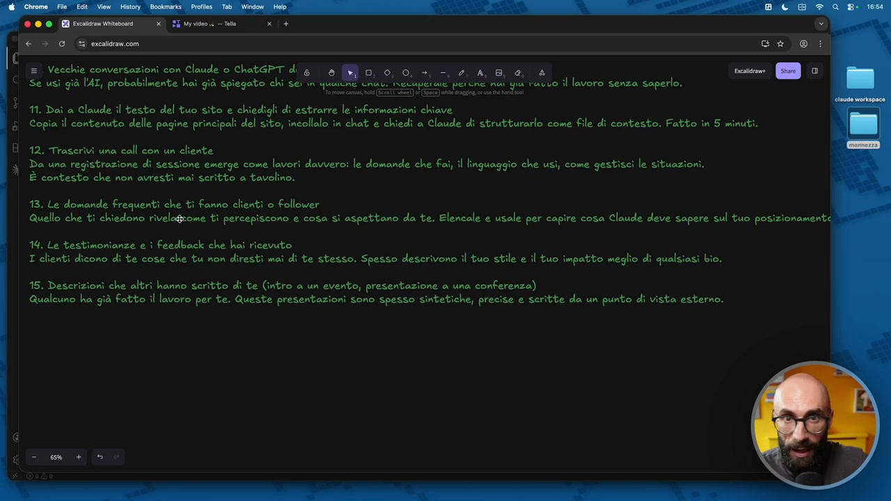

**Testo a schermo (OCR):** Vecchie conversazioni con Claude o ChatGPT dig & O, 6, 0, +, -, 2, A, 8, @; È già l'AI, probabilmente hai già spiegato chi sei in quaitne cnai peraie percne nai giu ravio il lavoro senza saperlo. a mi cam i ) 0 e ming cre ans 11. Dai a Claude il testo del tuo sito e chiedigli di estrarre le informazioni chiave Copia il contenuto delle pagine principali del sito, incollalo în chat e chiedi a Claude di strutturarlo come file di contesto. Fatto in 5 minuti. 12. Trascrivi una call con un cliente Da una registrazione di sessione emerge come lavori davvero: le domande che Fai, il linguaggio che usì, come gestisci le situazioni. È contesto che non avresti maì scritto a tavolino. 13. Le domande frequenti che ti Fanno clienti o Follower Quello che ti chiedono rivelagrome ti percepiscono e cosa si aspettano da te. Elencale e usale per capire cosa Claude deve sapere sul tuo posizionamenti 14. Le testimonianze e ì feedback che hai ricevuto I clienti dicono di te cose che tu non diresti mai di te stesso. Spesso descrivono il tuo stile e il tuo impatto meglio di qualsiasi bio. 115. Deseri; che altrì hanno scritto di te (intro a un evento, presentazione a una conferenza) Qualcuno ha già fatto il lavoro per te. Queste presentazioni sono spesso sintetiche, precise e scritte da un punto di vista esterno.

> quindi come ti percepiscono, cosa si aspettano da te. Stessa cosa per le testimonianze, i feedback, cioè se avete, che ne so, vi hanno lasciato sul sito delle recensioni, i clienti dicono di me, e così via, pure quella roba. Quindi vedi un occhio esterno, no? L'ultimo tre è tutto su un occhio esterno, pure questo qua, descrizioni che altri hanno scritto di te. Se tu sei andato a una conferenza e presentavi, come t'hanno presentato? Cosa hanno scritto di te? Prendi quel blocchettino, lo dai in passato a Claude e dici, ecco come mi hanno presentato a questa conferenza sul, non lo so, sul design minimalista e aggiorna il mio contesto. Queste sono facilissime da fare, ci mettete veramente un attimo, non avete scuse. Ve ne faccio vedere pure cinque avanzate, che ovviamente sono quelle che preferisco e che vi suggerisco. Uno, tutte le volte che una sessione va male, chiedetevi cosa non sapeva Claude. Questo è l'unico modo con il quale lo fate evolvere nel tempo.

## [00:07:13] Schermata 9 _(periodic)_

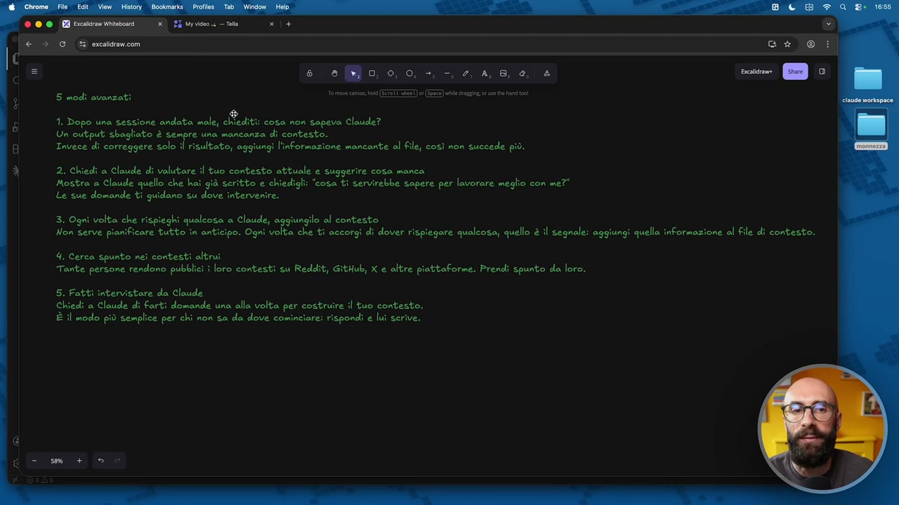

**Testo a schermo (OCR):** 8 0,0, 0, +, -. 2, 4,8, 0, è Cesana ana cab (EF TI (EE) e gi. a a i 1. Dopo una sessione andata male, Av cosa ron ‘sapeva Claude? Un output sbagliato è sempre una mancanza di contesto. Invece di correggere solo il risultato, aggiungi l'informazione mancante al file, così non succede più. 2. Chiedi a Claude di valutare il tuo contesto attuale e suggerire cosa manca Mostra a Claude quello che hai già scritto e chiedigli: "cosa ti servirebbe sapere per lavorare meglio con me?" Le sue domande ti guidano su dove intervenire. 3. Ogni volta che rispieghi qualcosa a Claude, aggiungilo al contesto Non Serve pianificare tutto în anticipo. Ogni volta che ti accorgi di dover rispiegare qualcosa, quello è il segnale: aggiu 4. Cerca spunto nei contesti altrui Tante persone rendono pubblici î loro contesti su Redeit, GitHub, X e altre piattaforme. Prendi spunto da loro. 5. Fatti intervistare da Claude Chiedi a Claude di farti domande una alla volta per costi il tuo contesto. È il modo più semplice per chi non sa da dove cominciare: rispondi e luì scrive. i quella informazione al file di contesto.

> E soprattutto entrate in quell'ottica di, vi spaventate meno del fatto, madonna mia, ma mo' quindi devo passare due settimane ad aggiornare il contesto? No, ve l'ho detto io, ci ho messo una mezza giornata, mi sembra. Ma sapete che ogni volta fate una piccola modifica, una piccola aggiunta, no? E migliora nel tempo. Quindi, avete fatto una sessione, in quella sessione qualcosa è andato storto e gli avete dato un'istruzione, vi ricordate in una delle lezioni precedenti abbiamo visto, non mi fare domande tutte insieme, fammele sempre una alla volta. Quella cosa Claude se l'è memorizzata per sempre. Secondo, chiede a Claude di valutare il tuo contesto attuale e dire cosa manca. Questa è potentissima. Avete capito che quando usiamo Cloud Code stiamo lavorando proprio in un altro modo? Non è più il chatbot, è un assistente potentissimo che capisce chi siamo e cosa facciamo. Quindi, ci facciamo aiutare anche nel gestire bene l'ambiente di lavoro. Anzi, questo ve lo faccio vedere, aspettate, questo ve lo faccio vedere perché secondo me è importante. Facciamo così, analizza in dettaglio il mio contesto, sia il file principale che la cartella, e dimmi cosa manca.

## [00:08:13] Schermata 10 _(periodic)_

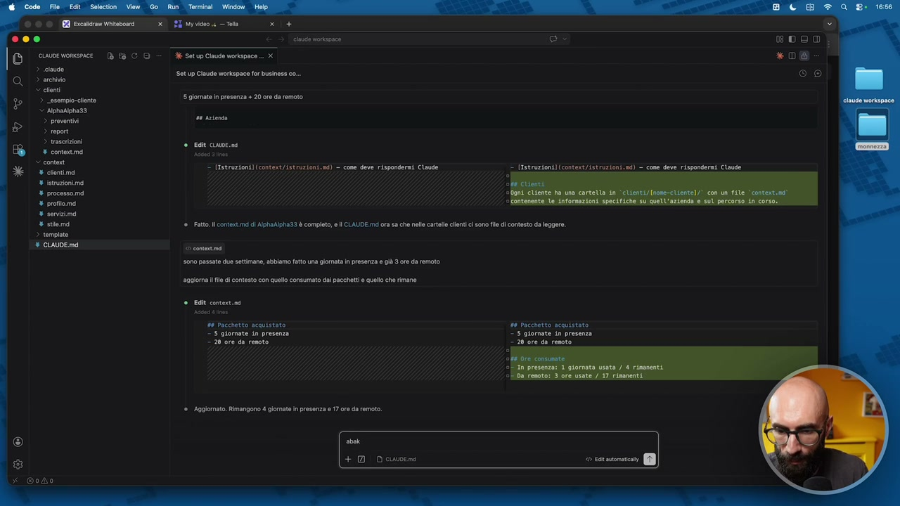

**Testo a schermo (OCR):** O cuotvonine dC O > suda > archivio © eni > _esempio-ciente > NphaWphaza > preventivi > report > trascrizioni * coneseme % ciontimd % isruzionimi % processomd + protiome è re cuuprns — tIStrUZIONII (Contest/istruzloni. nd) - come deve risponderai Claude — Uiseruzioni](context/ ist uz ioni nd) — cone deve risponderai Claude ‘® tto il contori.md di phaAjphasa è compito, CLAUDE mora sa che nale catalle cileni sono fle di contesto da leggere. 1 conte ma sono pasto due settimane, abbiamo fato una giomata in presenza e giù 3 re da remoto nagiona lf di contesto con quello consumato dal pacchetti quelo che rimane è tal contenti n8 Pacchetto scauistato n8 Pacchetto acquistato, 23 giornate in presenza — 3 giornate in presenza - 20/0re da remoto ab + DO cuvenì

> Quando hai trovato i punti mancanti fammi un elenco, poi io ti approvo le parti che voglio aggiornare e su quello mi farai delle domande. Solo alla fine delle domande, aggiorna i file di contesto. Vedete cosa stiamo facendo? Stiamo dicendo a Claude, in realtà questo è un mix di due e di cinque, ma cinque l'abbiamo già visto, cosa ti manca? Cioè, quali sono quelle informazioni che effettivamente a te in questo momento mancano? Vedete Claude che sta facendo?

## [00:09:13] Schermata 11 _(periodic)_

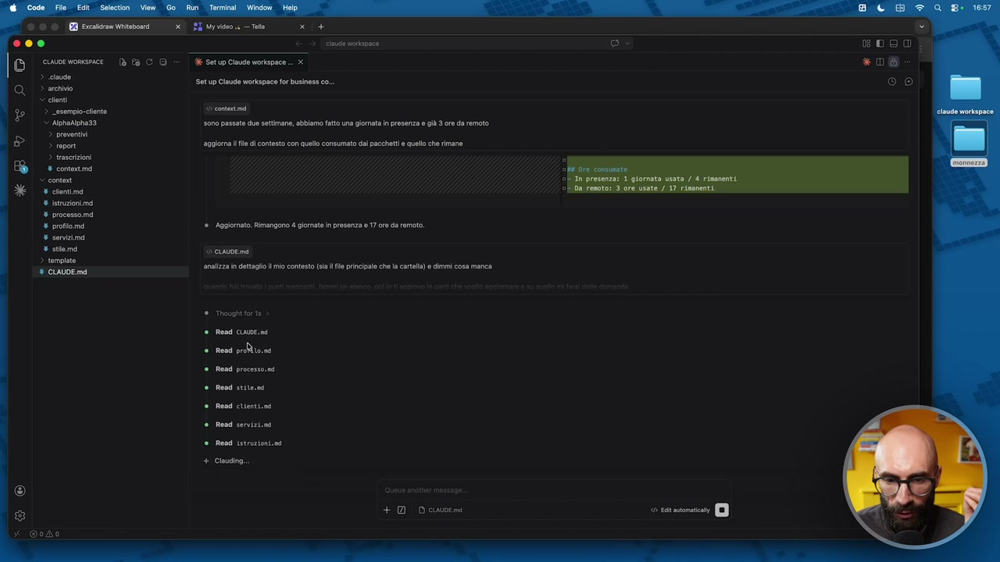

**Testo a schermo (OCR):** 50n0 passate due settimane, abbiamo fato una giomata n presenza e già 3 re da remoto nagiona fl i contesto con uello consumato dal pacchetti quelo che rimane ®. Aagiormato. Rimangono 4 giomata in presenza 17 re da remo. ALE anatza n ettg mio contesto (sal principale chela crt) e dimmi cosa manca © Thought forte © Rena CDC. è mesdi prin ® Read processo. è Read seit Rendi cisenti Rondi servizioni Rand itrazioni.ni + Claudia + Ocuwveni

> Sta leggendo tutti i file di contesto, tutti gli MD, vi ricordate? Perché abbiamo Claude.Md e poi abbiamo, fatemi chiudere questa dei clienti che se no ci distraiamo, poi abbiamo Context con dentro tutti i file singoli. Mi dici, ecco i punti che mi mancano. Profilo, vorrei sapere qualcosa su di te, quindi gli anni di esperienza, il background, le certificazioni. Il processo, durata media di un percorso, cosa succede a fine percorso, come gestisci fatturazione, lo stile, hai dei framework, dei modelli che usi, come gestisci le sessioni e così via. I servizi, cosa include esattamente una giornata in presenza, quante ore, dove, fai coaching di gruppo, oltre a one on one. Magari diciamo, mo non ci abbiamo tempo di fare tutto, ma diciamo che voglio aggiornare il 4. Aggiorniamo il 4 per il momento, però periodicamente fate questa cosa, una volta ogni mese, una volta ogni due mesi, lo fate crescere e gli dite, arrivate a questo punto, visto che lavoriamo insieme da due mesi, cosa ti manca per lavorare meglio con me?

## [00:10:13] Schermata 12 _(periodic)_

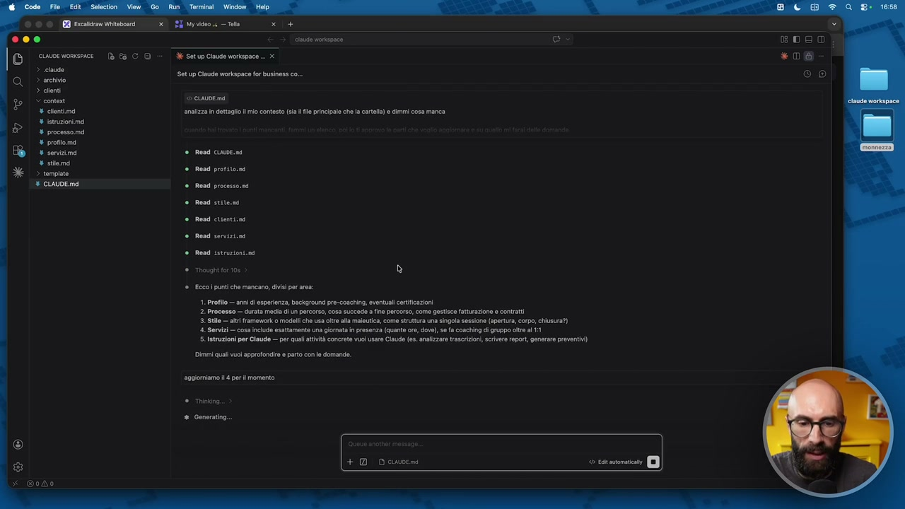

**Testo a schermo (OCR):** analizza dettaglio limi contesto (sal fl principale che la cartla) e demi cosa manca Rosd cLOE.na Read protoni Rend processo. Rosa sini Rend cite. Road servizini Resd sstrazioni.ni Though for 105 coi punti che mancano, dii par res: 1. Profilo — ann di esperienza, background pre-coacing eventual certicazioni 2. Processo — data media dun percorso, cosa succeda fine percorso, come gestisce fatturazione o contratti 5. Stile — it framework 0 modelî che usa otre alla malutica, come struttura una singola sessione (apertura, corpo, chiusa?) ‘. Servizi — cos include esattamente una giomata in presonza (quante or, dov), se a coaching di gruppo olr al 11 ‘5. Istruzioni per Claude — per qual atità concrete vu usare Caude (es. analizzare trascrizioni, crivor rpor, generare proventi) Dimm quali vuoi approfondire parto on la domande: sagiorniamo i 4 perl momento # Generato

> Fammi le domande, no, e aggiorni il contesto di differenza. Quante ore dura una giornata in presenza? 6 Con un'ora di pausa. Adesso ci farà delle domande, ovviamente, no, è sempre una simulazione. Le giornate in presenza le fai dal cliente o in una tua sede? Sempre dal cliente. Se non ha una sede, fitto una sala in un co-working o in un hotel. Ce le stiamo inventando, è giusto per far vedere il processo mentale che c'è dietro. Fai anche coaching di gruppo o solo one to one? Faccio coaching di gruppo in rari casi, ma sì, sono disponibile a farlo. Così lui adesso sta aggiornando il file con i servizi, anzi ce lo apriamo, no? Così capiamo magari che qua dentro ci sono delle cose in più, anzi non so se questo le mette in servizio o in processo, forse le metterà in processo, non lo so.

## [00:11:13] Schermata 13 _(periodic)_

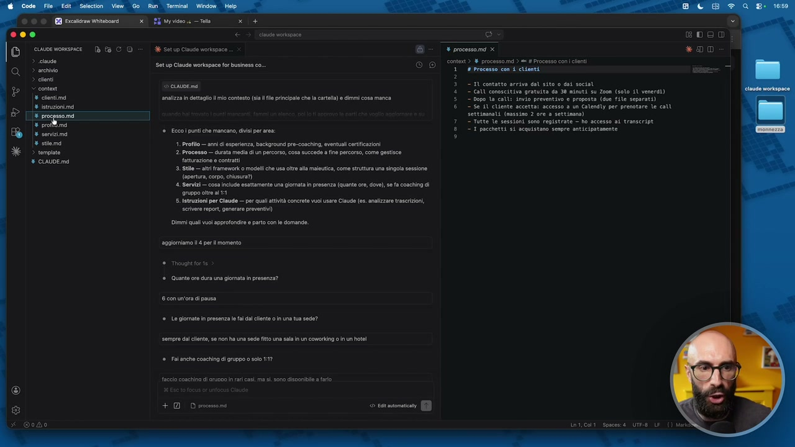

**Testo a schermo (OCR):** SIM eo — rta Ce cioe nomsnice [è fa C © “A Setup Cinuseworkspace * processamd x > cid © archivio > lenti % clontima aneizza n ettgo lm contest sa fl principale chela cart) e dimmi cosa manca 8 isrzionimà Setup Ciaoda reiopaza fx iena ci © © sete) W acmsemi> cern coi cei 1 2 3° — 10 contatto arriva dal sito 0 doi social A - CALI conoscitiva gratuita da 30 minuti su Zooa (solo il veneraì) 3° — Dopo la calli invio preventivo e proposta (due file separati) 6 - se Il cliente accetta: accesso a un Colendly per prenotare le call Di Gettinanati (nnssino 2 ore a settinono) ue - Tutte le sessioni sono registrate — ho accesso a transcript . mancano, aos: 1 pacchetti si acquistano sempre anticipatamente fee Ecco puniche visi por si + cilena 1. Profilo — ann esperienza, background pre-cosching, eventuali certificazioni > tempiate 2. Processo — durata media dun percorso, cosa succeda fn percorso, com gestsce % ciauDemd attrazione contrat 3. Stile — ati framework o modelli che usa le ala maleutica, come struttura una singola sessione apertura corpo, chiusura) Servizi — cosa Include esattamente una giornata n presenza (quanta ore, dove) sa fa coaching di ‘gruppo otre i 1 5. Istruzioni per Claude — per qual tività concrte vuol usare Claude (es. analizzare trascrizioni, server report, generare proventi) imam qual vuoi approfondire e parto cn ie domande. aggiorniamo i perl momento Tncugit forte ® Quanto or dura una giomata n presenza? Son ra dipasa Lo giomat in prosena le a dal lente i na tua sede? sempre al lnt, se non ha una sede ito una sala n un coworkin in un otel al anehe cosching di gruppo 0 solo 1? faccio coactina di aruono n rar cas mas sono ciscond + DD Dposmeni

> Per il coaching di gruppo è un prezzo diverso? No, uguale, diciamo che è lo stesso prezzo. E vediamo adesso quale file ci vado ad aggiornare. Ripeto, è una simulazione, però per farvi capire che facciamo periodicamente questo lavoro di audit, lo facciamo insieme a Cloud, facciamo sempre tutto insieme a Cloud. Servizi, infatti stavo nel file giusto. Ti ho aggiornato servizi, ecco qua. Ha messo questa cosa qua, ha messo le note, vedete? Ha aggiornato il file. Qua ci ha messo che sono sei ore in totale, una di pausa inclusa. Torniamo nella nostra bella lista qua. Il tre, ogni volta che spiego qualcosa è Cloud aggiungere al contesto. Quindi, se voi siete spaventati all'inizio del dire, madonna mi, ma io faccio, nella mia, che ne so, sono un manager, col mio team stiamo lavorando su cinque progetti, adesso devo fare il contesto di tutti e cinque progetti? No! Cosa devi fare domani? Stai lavorando sul progetto X? Inizia a lavorare su quel contesto. Basta. Se fra due settimane col tuo team dovete lavorare sul progetto Y, solo in quel momento inizia a lavorare sul contesto del progetto Y, ok?

## [00:12:13] Schermata 14 _(periodic)_

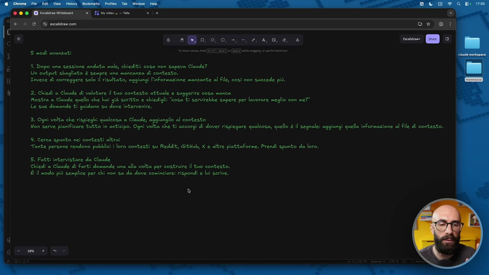

**Testo a schermo (OCR):** 8 0,0, 0, +, -. 2, 4,8, 0, a 5 modi avanzati EST) (ESE) ld ata nd 1. Dopo una sessione andata male, chiediti: cosa non sapeva Claude? Un output sbagliato è sempre una mancanza di contesto. Invece di correggere solo il risultato, aggiungi l'informazione mancante al file, così non succede più. 2. Chiedi a Claude di valutare il tuo contesto attuale e suggerire cosa manca Mostra a Claude quello che hai già scritto e chiedigli: "cosa ti servirebbe sapere per lavorare meglio con me?" Le sue domande ti guidano su dove intervenire. 3. Ogni volta che rispieghi qualcosa a Claude, aggiungilo al contesto Non serve pianificare tutto în anticipo. Ogni volta che ti accorgi di dover rispiegare qualcosa; quello è il segnale: aggiu 4. Cerca spunto nei contesti altrui Tante persone rendono pubblici î loro contesti su Redeit, GitHub, X e altre piattaforme. Prendi spunto da loro. 5. Fatti intervistare da Claude Chiedi a Claude di farti domande una alla volta per costruire il tuo contesto. È il modo più semplice per chi non sa da dove cominciare: rispondi e lui serive. ® i quella informazione al file di contesto.

> Quando ti serve, aggiorni. Così non vi fate piare dall'ansia. Questa è la cosa migliore, questo è un trucco proprio operativo, questa è la cosa più importante che vi dirò in questo corso. Ve la dovete tatuare. Poi, quattro, questo non lo fa nessuno, cerca spunto nei contesti altrui. Non so perché, ma c'è la moda, ultimamente, di mettere sta roba open online. Anche gente famosa mette su Reddit, su GitHub, su X, sui loro blog, su Substack, io me le vado a guardare tutti. Cioè, molte delle tecniche che vi faccio vedere, non è che me le sono inventate io, per esempio questa qua, vi faccio vedere questa tecnica qua, questo ibrido della tecnica 5 qua, io l'ho vista, o su Substack o su Reddit, l'ho vista da uno, comunque, mi piaceva, io utilizzavo la 3 e ho fatto la 5. L'ho modificato un po' rispetto a come l'ho vista, ovviamente, però voglio dire, sono sempre cose che prendiamo spunti da altri.

## [00:13:13] Schermata 15 _(periodic)_

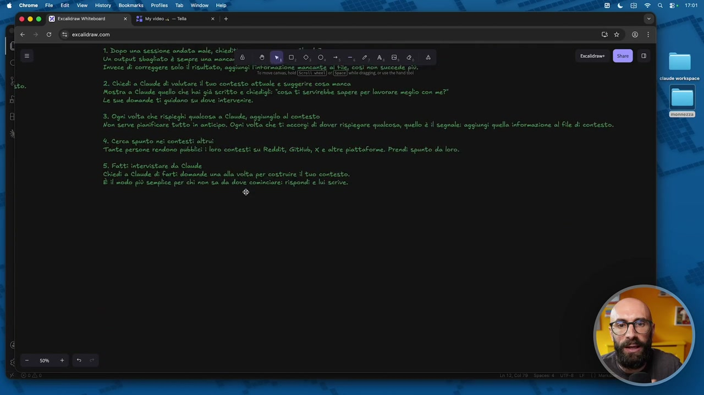

**Testo a schermo (OCR):** 1. Dopo una sessione andata male, chiedit: brnliz Un'output sbaglicto è Sexpre Una mancori O NNFO NINE I IO TT Trvece di correggere solo risultato, aggiungi l'svornazione mancante al tile cod non succede più. 2. Chiedi a Claude di valutare il tuo contesto attuale e suggerire cosa manca Mostra a Claude quello che hai già seritto e chiedigli; “cosa ti servirebbe sapere per lavorare meglio con me?" 3. Ogni volta che rispieghi qualcosa a Claude; aggiungilo al contesto Non serve pianificare tutto în anticipo. Ogni volta che ti accorgi di dover rispiegare qualcosa, quello è il segnale: aggiungi quella informazione al file di contesto. 4 Cerca spunto nei contesti altrui Tante persone rendono pubblici loro contesti su Reddit, Github, X e altre piattaforme. Prendi spunto da loro. 5. Fatti intervistare da Claude chiedi a Claude di farti domande una alla volta per costruire il tuo contesto. È il modo più semplice per chi non sa da dove cominciare: rispondi e lui serive. ®

> Quindi andate a vedere gli altri cosa mettono nei loro contesti e vedete che magari dite, ah cavolo, non ce l'avevo pensato. Hai visto? Questo ha fatto un file con, che ne so, i suoi valori. Bello, lo voglio mettere pure io, così magari quando faccio un preventivo, una proposta, dentro questa cosa emerge. Quando devo scrivere, che ne so, un report, questa cosa emerge, no? Perché magari per voi quella roba è importante. E poi la quinta, che è quella, diciamo, che io ho usato in tutta questa parte, no, del corso, ho fatto intervistare da Claude. Chiede a Claude di farti le domande, con le domande che lui ti fa si prende le informazioni che gli servono e le mette nel contesto. Questa cosa è semplicissima, ma è sempre la chiave. Esagero, vi dico, nel 99%, 90%, vabbè fatemi esagerare un attimo troppo, nel 90% delle volte in cui vi trovate in difficoltà, mentre state lavorando con Claude Code, la cosa che dovete farvi è fermarvi, chiedere a Claude di farvi delle domande e aiutarvi a utilizzarlo meglio. Questa è la soluzione, nella maggior parte dei casi.

## [00:14:13] Schermata 16 _(periodic)_

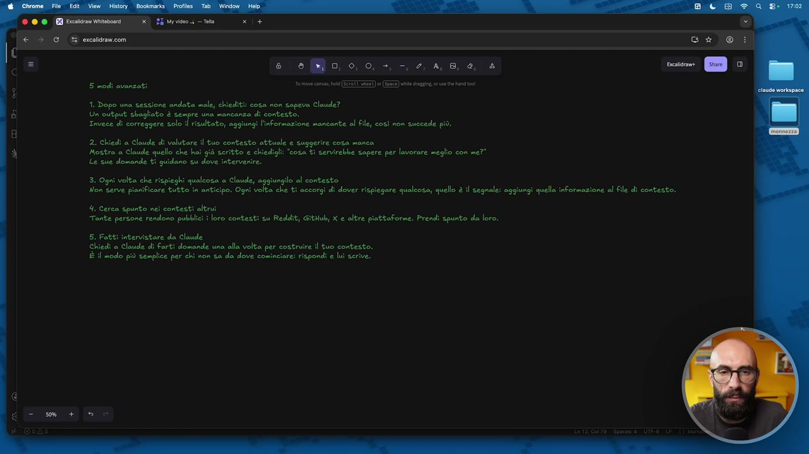

**Testo a schermo (OCR):** @ © (EB pci itato (Gi ercaicencom s eo, 0,0, +, -. 2, 4, 8, e, 4 5 modi avanzati ora cai el ST) (E) ble digg, ca bn 1. Dopo una sessione andata male, chiediti: cosa non sapeva Claude? Un output sbagliato è sempre una mancanza di contesto. Invece di correggere solo il risultato, aggiungi l'informazione mancante al file, così non succede più. 2. Chiedi a Claude di valutare il tuo contesto attuale e suggerire cosa manca Mostra a Claude quello che haî già seritto e chiedigli: “cosa ti servirebbe sapere per lavorare meglio con me?" Le sue domande ti quidano su dove intervenire. 3. Ogni volta che rispieghi qualcosa a Claude, lo al contesto Non Serve pianificare tutto în anticipo. Ogni volta che ti accorgi di dover rispiegare qualcosa, quello è il segnale: aggiungi quella informazione al Fle di contesto. 4. Cerca spunto nei contesti altrui Tante persone rendono pubblic loro contesti su Reddit, Gitdub, X e altre piattoforme. Prendi spunto da loro. 5. Fatti intervistare da Claude Chiedi a Claude di farti domande una alla volta per costruire il tuo contesto. È il modo più semplice per chi non sa da dove cominciare: rispondi e lui serve.
