# Una sbirciatina al mio contesto

> Documento generato automaticamente: trascrizione e screenshot sincronizzati del video-corso.

## [00:00:00] Schermata 0 _(start)_

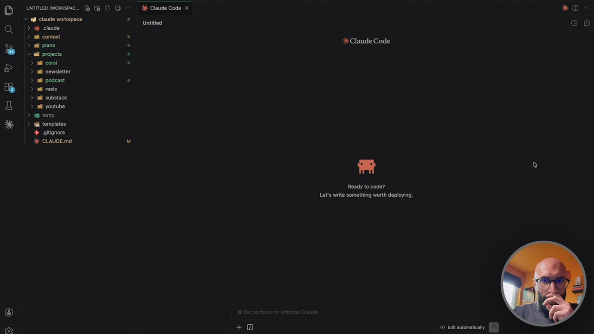

**Testo a schermo (OCR):** * ue VE 29 O) UNTITLED (WORKSPAC.. È «fi claude workspace > i claude > nl context > ail plans V ell projects. > ail corsi > ail newsletter > ail podcast > ail reeis > ail substack > si youtube > 6 temp > Wii templates + .gitignore % CLAUDE.md IMICHISAIE] % Claude Code x Untitiedi + Claude Code Ready to code? Let's write something worth deploying.. < Edit automatica * D (Oc)

> Anche a sto giro sulla questione del contesto, voglio farvi dare una sbirciatina al mio. Dopo che abbiamo visto la teoria, la pratica su come crearlo, vi faccio vedere anche un contesto già vero, reale, sul quale io lavoro tutti i giorni, ormai da tantissimo tempo. Siamo, come sempre, dentro il mio VS Code, quindi diciamo il mio ambiente, questo è Cloud Code. Si parte con il file cloud.Md. Il file cloud.Md ha una parte molto semplice. Vi ricordate, cloud.Md lasciateci la parte semplice e poi mettiamo il resto in dei file separati. Quindi un piccolo chi sono, i canali sui quali sono attivi, le attività principali che faccio. Poi spiega come è organizzato il workspace. Perché si fa questa cosa nel file cloud.Md? Siccome cloud.Md viene caricato sempre, in tutte le chat, viene caricato all'inizio di ogni chat, chat è la parola giusta in questo caso, all'inizio di ogni sessione,

## [00:01:00] Schermata 1 _(periodic)_

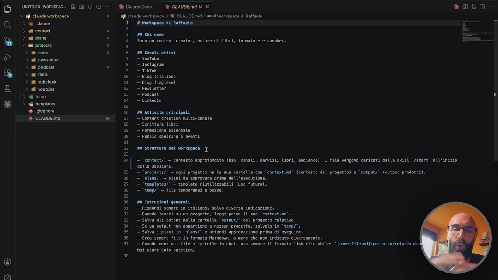

**Testo a schermo (OCR):** amen one 90) Di >: | Bf Clause Code | #6 GLAUDEmd M x *DLYO S «fl claude workspace ® 1 ciaude workspace > é CLAUDE.md > e # Workspace di Raffa > RI claude 1 # Workspace di Raffaele > nd context i sa tr a PATO ® 4 Sono un content creator, autore di Ubri, formatore e spesker. Missa v af projects . 5 > si così e 6 se conetiottivi © || 5 neriater 7 - Youtube ®© tastegraa $ Pea da 9 — TikTok > ni reels 10 - Blog (italiano) > mill substack 11 - Blog (inglese) Da 12“ Newsletter 13 = Podcast Roia 14 - LinkedIn Xe > ii templates 15 + gitignore 16 ## Attivita principali M CLAUDE.md M 17 - Content creation multi-canale 18 © scrittura bri 0 ATE 20° PublSC spending a eventi a 22 se Struttura det vortapace ] S 24] - ‘context/* - contesto approfondito (bio, canali, servizi, Lbri, audience). I file vengono coricati datla skill ‘/start* all'inizio detta sessione. 25 - ‘projects/° — ogni progetto ha la sua cartella con ‘context.md* (contesto del progetto) e ‘output/’ (output prodotti). 26 - ‘plans/° — piani da approvare prima dell'esecuzione. 27 - ‘templates/’ — template riutilizzabili (uso futuro). 28 = ‘tenp/* — file tenporane! e bozze. % 30 #8 Istruzioni generali i" Rispondi Sempre ia itatiano, calvo eiversal indicazione; 32." Quando lavori su un progetto, leggi prima il suo “context.sd’. 23.“ salva gli output nella cartella ‘output/” del progetto relativo. $ Cee RSS, 35.“ salva i piani in “plans/* e attendi approvazione prima di eseguire. 36.“ crea senpre file in formato Narkdow, 3 meno che non indicato diversamente. 37. = guando menzioni file o cartelle in chat, usa senpre il formato Unk cliccabile: ‘ [nome-file.mi] (percorso/relat.vo/n Nai usare solo backtick, 5) O)

> dargli le istruzioni su come è fatto il workspace, cloud sa dove andare a prendere le cose. Quindi in contesto troverai questo, quindi ci sono i file di contesto aggiuntivi. In project troverai i progetti, con dentro la cartella, con il proprio contesto e così via. E qua sono un po' di istruzioni generali, diciamo, che io ho dato a cloud di cose che deve fare. Cose che non voglio che siano in memoria, ma che voglio che siano nel contesto. Ho la cartella context, che vi ho fatto vedere anche in precedenza, se non sbaglio, e qua dentro ci sono cinque file di contesto, uno sulla audience, quindi diciamo chi è il mio pubblico proprio. Vedete? Quindi questo è il mio target, una piccola descrizione e poi ho fatto questa cosa delle buyer persona. Ovviamente questo è un po' più tecnico, non è un corso di marketing, però se non sapete che cosa sono le buyer persona, è una semplificazione, una rappresentazione di un utente tipo, quindi l'imprenditore che guarda i miei video, il manager che guarda i miei video, il libero professionista che guarda i miei video.

## [00:02:00] Schermata 2 _(periodic)_

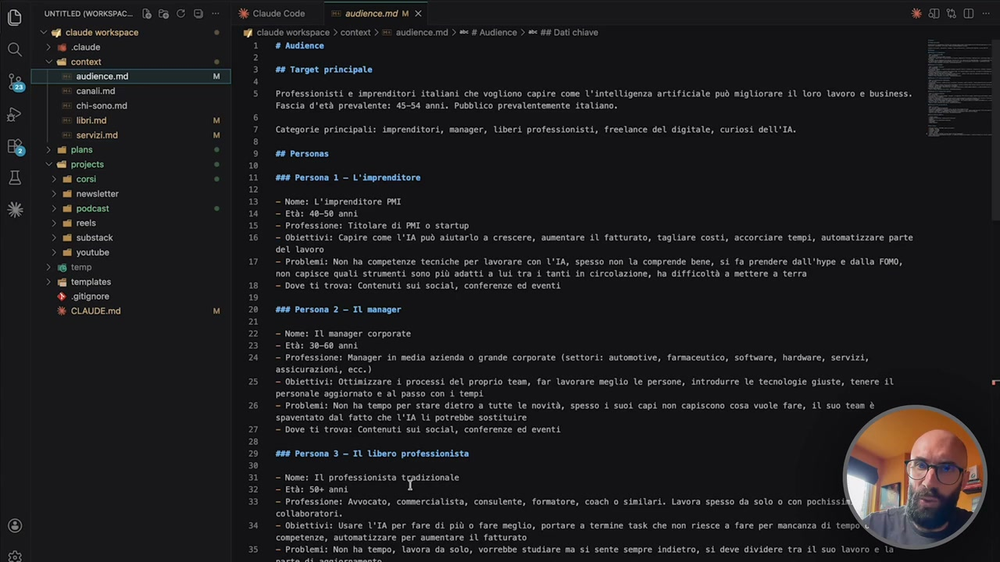

**Testo a schermo (OCR):** ID meinen ® fa 0) = | dl Cause code | rt auaience.md M x * DRD 91 claude workspace . Ni claude workspace > context > &i audience.md > = # Audience > s® ## Dati chiave > 1 caude 1° # Audience = Sed context . 2 e nol 03 Target priscipate sg O age 1 Ip ia ‘canali.md 5 Professionisti e imprenditori italiani che vogliono capire come l'intelligenza artificiale può migliorare il loro lavoro e business, = a chi-sonoimd FASCIA d'età prevalente! 45:54 arni. Pusb ico prevalentemente italiano: È ibrima mis C pa MO 7 Categorie principali: isprenitori, manager, Lberi professionisti, freelance del digitale, curiosi dell'IA. == % 8 DÒ > pine Odore al projects < > ni corsi . 11 #88 Persona 1 — L'imprenditore dirle 13. Wonci L'imprenitore ME Dl podcast: ® 14 — Età: 40-50 anni ? ni reels 15 - Professione: Titolare di PMI o startup > il substack 8! S OBIAILIVIS Capire cova VITA pod alitarlo a crescere, mmertare LÌ fatturato, togliare costi, accorciare topi, ovtonstizaare parte Salso det lavoro NES 17. — Problemi: Non ha competenze tecniche per lavorare con IA, spesso non la comprende bene, si fa prendere dall'iype e dalla FORO, non capisce quali strumenti sono più adatti a lui tra i tanti in circolazione, ha difficoltà a mettere a terra > 6 templates 18“ bove ti trova: Contenuti sui social, conferenze ed eventi + cgitignore 19 6 CLAUDE.mdi M 20 #88 Persona 2 — Il manager a È enaemano 23° — Età: 30-60 anni 24. - Professione: Manager in media azienda 0 grande corporate (settori: autosotive; farmaceutico, software, hardvare, servizi, anziani eo) 25. - Obiettivi: Ottiaizzare i processi del proprio tesa, fari lavorare meglio le persone, introdurre le tecnologie giuste; tenere il Persona la) aggiornato G1a1 passo con i tespi 26" Problemi: Non ha tenpo per stare dietro a tutte le novità, spesso i suoi capi non capiscono cosa vuole fare, il suo team è spaventato dal fatto che l'TA li potrebbe sostituire 27 = bove ti trovar Contenuti sui sociat, conferenze cd eventi 2 29. #68 Persona 3- TI Ubero professionista 5) 31. - Nose: T1 professionista tradizionale 32 — Età: Ste anni 33. — Professione: Avvocato, comercialista, consulente; formatore, coach 0 similari. Lavora spesso da solo 0 con pochissi collaboratori. o) GAL obiettivi: Usare! 1I1A per fare ci più c fore meglio, portara.a ternine task che non riesce è fare per mancanza di tespo conpetenze, automatizzare per aunentare il fatturato pa 35 - Probleni: Non ha tempo, lavora da solo, Vorrebbe studiare ma si sente sempre indietro, si deve dividere tra il suo lavoro e la

> Questa è una cosa molto utile, che consiglio anche a voi di fare. Ovviamente dipende dal tipo di lavoro che fate, cioè se siete manager non ha senso lavorare sulle buyer persona, se siete freelance ha più senso farlo. Poi i canali, dove c'è una brevissima spiegazione dei post dove sono attivo, con i link, perché così se io gli dico vai sul mio canale YouTube e prendi l'ultimo video, lui sa dove andarlo a prendere. Qua voi per esempio avete un e-commerce, ci mettete il vostro e-commerce. Avete un blog, ci mettete il vostro blog. Avete una newsletter, ci mettete la vostra newsletter. Avete un sito web, ci mettete quello. Avete più di un sito web, ci mettete i vari siti web che avete a disposizione. Io qui ho scritto cosa pubblico, di cosa parlo, con che frequenza pubblico, e così via. E qua vedete c'è anche qualche nota breve. Poi c'è una pagina chi sono, questa l'ho fatta con un misto di quello che ho sul mio blog, quindi diciamo quello che c'è nel mio chi sono, e altre cose che tenevo in giro, tipo presentazioni che avevo fatta agli eventi, e così via.

## [00:03:00] Schermata 3 _(periodic)_

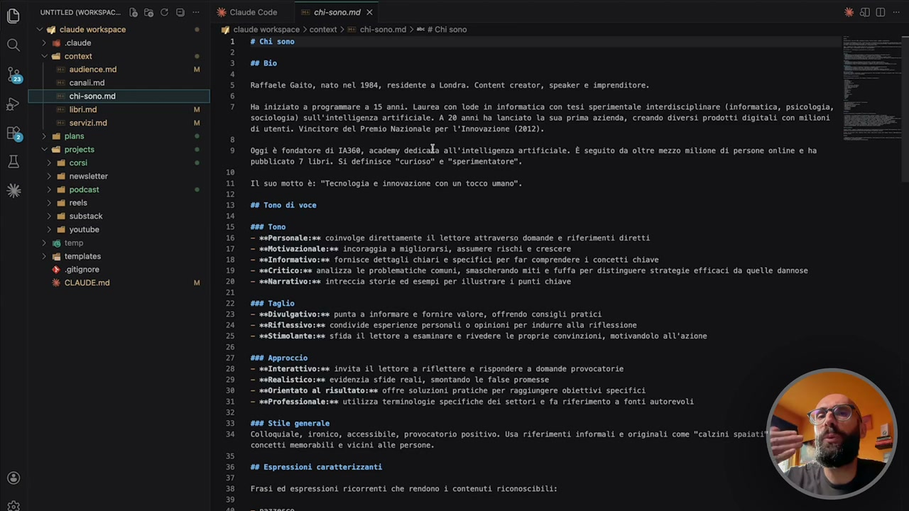

**Testo a schermo (OCR):** O) unriTLED Workspac.. (è Pa CD + ogîtignore ® CLAUDE.md % Claude Code =‘ chi-sono.md X WI ciaude Workspace ) context > 5 chi-sono.md > = # Chi sono 1° # Chi sono 2 3 sento 4 5 Raffaele Gaito, nato nel 1984, residente a Londra. Content creator, speaker e imprenditore. E 6 È 7 Na iniziato a programmare a 15 anni. Laurea con lode in informatica con tesi sperimentale interdisciplinare (informatica, psicologia, sociologia) sull'intelligenza artificiale. A 20 anni ha lanciato lo sua prima azienda, creando diversi prodotti digitali con milioni di utenti. Vincitore del Prenio Nazionale per l'Innovazione (2012). 3 = 9 Oggi è fondatore di 14360, acadeny dedicala all'intelligenza artificiale. È seguito da oltre mezzo milione di persone online e ha pubblicato 7 libri. Si definisce "curioso" e "sperimentatore" 10 11 TI suo motto è: "Tecnologia e innovazione con un tocco umano". 12 13. #6 Tono di voce 1a 15.899 Tono 16 - mePersonale:se coinvolge direttamente il lettore attraverso domande e riferimenti diretti 17 - smmotivazionale:se incoraggia a migliorarsi, assumere rischi e crescere 19 - seInformativo:sa fornisce dettagli chiari e specifici per far comprendere i concetti chiave 19 - secriticorse analizza le problematiche Comuni, ssascherando niti e fuffa per distinguere strategie efficaci da quelle dannose 20 - setlarrativosse intreccia storie ed esespi per illustrare i punti chiave n 22. 669 Teglio 23 - sebivulgativo;ss punta a informare e fornire valore, offrendo consigli pratici 24 - meliflessivo:ee condivide esperienze personali 0 opinioni per indurre alla riflessione 25. - sestimolante:se sfida il lettore a esaminare e rivedere le proprie convinzioni, motivandoto all'azione 26 27 #08 Approccio 28 - selnterattivo:sa invita il lettore a riflettere e rispondere a domande provocatorie 29 - meftenlistico:sa evidenzia sfide reali, snontando le false promesse 30 - sedrientato al risultato:me offre soluzioni pratiche per raggiungere obiettivi specifici 31 - seProfessionale:ss utilizza terminologie specifiche dei settori e fa riferimento a fonti autorevoli 2 33. 499 Stile generate 34 Colloquiale, ironico, accessibile, provocatorio positivo, Usa riferimenti informali e originali cose "calzini spaiati concetti mesorabili € vicini alle persone. ss 36 #4 Espressioni caratterizzanti ” 38 Frasi ed espressioni ricorrenti che rendono i contenuti riconoscibili: 5)

> Più mi sono fatto fare come sempre l'intervista da Claude per andare a prendere velocemente le informazioni che gli servivano. Ho messo il mio motto, vedete c'è l'approccio, il taglio, il tono, quindi il tono motivazionale, informativo, critico, narrativo, lo stile che cerco di essere provocatorio ma positivo, eccetera eccetera. Poi ce n'è uno sui miei libri, quindi qua ho fatto semplicemente l'elenco di tutti i libri che ho pubblicato. Il titolo, quando è uscito, con chi l'ho pubblicato, di cosa parla e il link. Anche qua, perché così ha velocemente dei riferimenti. Cioè se io sto facendo una cosa con un cliente dove a un certo punto voglio far riferimento al mio ultimo libro, quello sull'intelligenza artificiale, in cosa possa esserti utile, semplicemente io cito il mio libro e Claude sa com'è il titolo, che è uscito con Mondadori, che parla di intelligenza artificiale e qual è il link, no? E lo aggiungo automaticamente nel documento, ecco perché gli ho dato quel riferimento.

## [00:04:00] Schermata 4 _(periodic)_

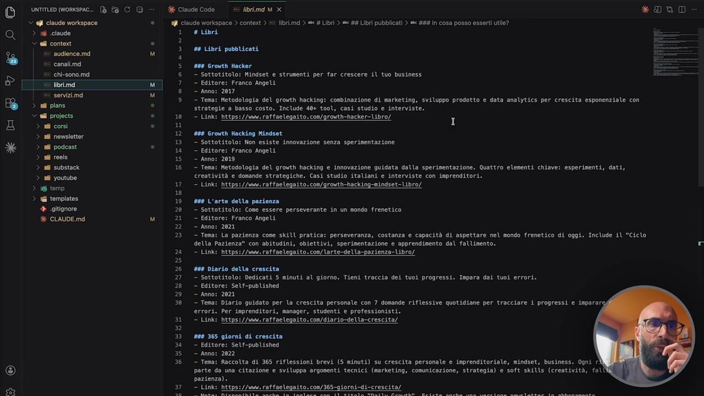

**Testo a schermo (OCR):** UNTITLED (WoRKSPAC.. [è Pa C QD » 6 Claude Code = librimd M_X *DUYO MY ciaude workspace ® n ciaudo workspace > content > = libr.md ) sc # Libri > sc #4 Libri pubblicati > = #84 In cosa posso esserti utile? Q > 1 claude 1 subi V all context . È % i n | 3 CRCarsea ‘canalina 5. #99 Growth Hacker x chi-sono.md 6 - Sottotitolo: Mindset e strumenti per far crescere il tuo business = ? tibrimd i] 7 - Editore: Franco Angeli nti M 8 - Anno: 2017 % 9 - Tena: Metodologia del growth hacking: combinazione di marketing, sviluppo prodotto e data analytics per crescita esponenziale con gaia pare $ strategie a basso costo. Include 40+ tool, casi studio e interviste. Valli projects ® 10 - Link: https://www.raffaelegaito, con/growth-hacker-bro/ E > afcorsi sil cu I ciale 12. #9 Growth Hacking Mindset 13. — sottotitolo: Non esiste innovazione senza sperimentazione ili i ® a - Editore: Franco Angelt > uf reels 15 - Anno: 2019 > nl substack 16 — Tena: Metodologia del growth hacking e innovazione guidata dalla sperimentazione. Quattro elementi chiave: esperimenti, dati, 3 all youtube creatività e donande strategiche. Casi studio italiani e interviste con imprenditori. xa di ERE TAI 2/2 ternpiatee 19 #28 L'arte della pazienza + otignore 20 - Sottotitolo: Come essere perseverante in un mondo frenetico è CLAUDE.md M 21 - Editore: Franco Angeli 22 - Anno: 2021 23. - Tema: La pazienza come skill pratica: perseveranza, costanza e capacità di aspettare nel mondo frenetico di oggi. Include il "Ciclo della Pazienza" con abitudini, obiettivi, sperimentazione e apprendimento dal fallimento. 24 - Link: https://www. raffaelegaito. con/larte-della-pazienza-libro/ 25 26 #88 Diario della crescita 2] - Sottotitolo: Dedicati 5 minuti al giorno. Tieni traccia dei tuoi progressi. Im 28 — Editore: Self-published 29 — Anno: 2021 30 - Tema: Diario guidato per la crescita personale con 7 domande riflessive quotidiane per tracciare 4 progressi e inparari errori. Per imprenditori, manager, studenti e professionisti. 31 - Link: https://ww. raffaelegaito. con/diario-della-crescita/ n 33 #88 365 giorni di crescita 34 — Editore: Self-published 35. — Anno: 2022 S RANGE nec © ERESIA AO ORA, a» 3 https://s. raffaelegaito. con/365-giorni-di-crescita/

> E poi c'è un piccolo servizi, le cose di cui mi occupo, alla fine faccio formazione, diciamo io le cose principali di cui faccio formazione, public speaking, perché parlo alle conferenze, parlo agli eventi aziendali e così via, e contenuti sponsorizzati, quindi sul mio canale YouTube, eccetera eccetera. C'è un'academy, ci sono i corsi e così via, no? Anche qui, sta roba è tutta sul mio sito web, quindi sono andato sul sito web nella sezione corsi, gli ho dato i link e ho detto pia questa roba è trasformata in contesto, cioè non è che me lo so inventato io, tutte le volte ho questo qua, i libri, queste pagine sono sul mio sito, gli ho preso queste pagine e gli ho detto apriti le sette pagine dei sette libri, estrapola le informazioni principali e buttatele qua dentro. Però se vi ricordate, non è finita qua, perché c'è questo contesto che è context, e questo viene caricato a ogni sessione, ma io poi ho i mini contesti relativi ai progetti. Quindi se io per esempio vado nella cartella progetti, apro podcast, qua ci sarà, vedete, context.Md,

## [00:05:00] Schermata 5 _(periodic)_

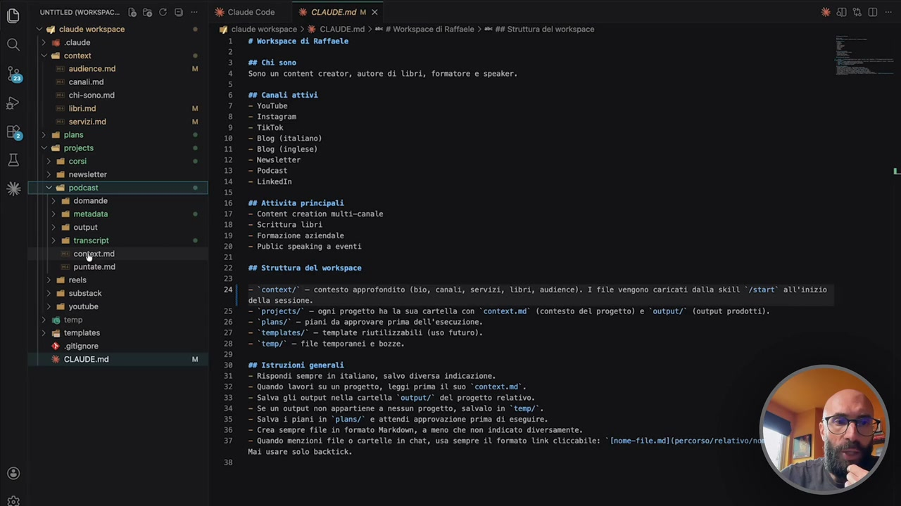

**Testo a schermo (OCR):** Duma orse ® fa 0) Di dk Claude Code | #6 GLAUDEmd M x *D8 O Yi claude workspace ® 19 claude workspace > # CLAUDE.md > «4 Workspace di Raffaele > « ## Struttura del workspace Q |? claude 1 # Workspace di Raffaele È . 2 irlozicni 3° #8 Chi sono » Rodence ni Lì 4 Sono un content creator, autore di Ubri, formatore e speaker. ER ; Css So oe cani mai P es ea 8 > sapuno * 10. “iiop litatian) “#8 projects . 11 - Blog (inglese) > mi domande 16 #8 Attivita principali > si ovna 18 2 Seritture bri MOLISE À 20 - Public speaking a eventi Bacon) 2 2 pena 22 ce srettre det voriopece > ni reels 2 25. - °projects/° — ogni progetto ha la sua cartella con ‘context.md* (contesto del progetto) e ‘output/* (output prodotti). > temp 26 - ‘plans/' — piani da approvare prima dell'esecuzione. > ri templates 27 - ‘tenplates/’ — tenplate riutilizzabili (uso futuro). + gitignore 28 - ‘temp/’ — file temporanei e bozze. 5 BISCRODETTE: ta 30 #8 Istruzioni generali fi ese poca 33" Sito gti vt sete cariltà orti” del progetto relativo. o enne sa, bal are solo ncitiet » O)

> che è il contesto specifico del podcast. Quindi qua dentro ci sono le informazioni solo sul podcast, quindi come è strutturato, dove devo andare a prendere le informazioni, vedete qua ci sono le puntate, qua ci sono le domande, qua ci sono i transcript, questa è la convenzione che utilizzo per i nomi, come mi devi organizzare le puntate, eccetera eccetera. Questa roba è di una comodità pazzesca e lo faccio separato per i singoli progetti. La cosa importante qual è? Questa separazione che io faccio in modo, allora Cloud, come vi ho detto, carica in automatico il file CloudMD quando parte. Quindi io adesso, vedete, questa è una sessione vuota, non ho fatto niente, se io gli chiedo quali file di contesto hai caricato, giusto per far vedere come funziona CloudCode dietro,

## [00:06:00] Schermata 6 _(periodic)_

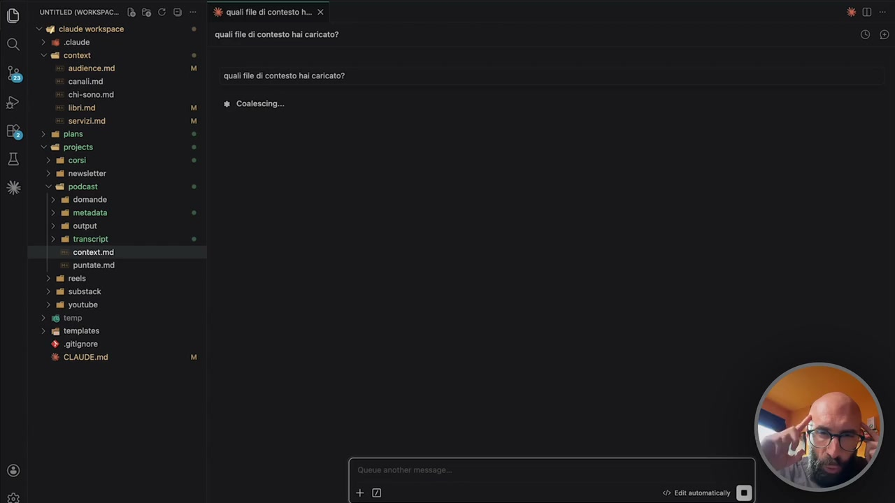

**Testo a schermo (OCR):** UNTITLED (WORKSPAC.. claude workspace > N claude Sell conte x: audience.md x» canali.md #: chi-sono.md libri.md tì servizimd > adi plans Vel projects > ali corsì > ail nowsletter Yell podcast. adi domande adi metadata sii output ni transcript > contextimd si puntate.md > ail reels > ali substack > al youtube > 16 temp > rl templates + sitignore % CLAUDE.md *n@evE LO > > > > O) MICHISAE] X quali file di contesto h... x ‘quali file di contesto hai caricato? quali file di contesto hai caricato? * Coalescing... * D (CO)

> lui adesso mi dirà, ho caricato CloudMD e memory, ovviamente. Ok? Quindi adesso lui sta parlando di questa cosa, Start ve la spiegherà in un attimo. Quindi dico, cosa sai su di me? Sa le cose che sono dentro il file CloudMD. Vedete? Mi sta dicendo le cose che sono dentro il file CloudMD. Io quello che faccio in realtà, che tutte le volte che apro una nuova sessione, lancio un comando. Questo comando si chiama Start. Ve lo faccio vedere. Proprio, vedete, slash Start, invio. Questo comando Start cosa fa? Carica il contesto dettagliato. Quindi questo qua più specifico, vedete, sto leggendo chi sono, sto leggendo canali, sto leggendo odienze e così via. Ora, se io gli richiedo ora, cosa sai di me? Siccome ho caricato il contesto, quello un pochino più avanzato, lui mi dice ora ho un quadro completo e mi farà un piccolo riassunto.

## [00:07:00] Schermata 7 _(periodic)_

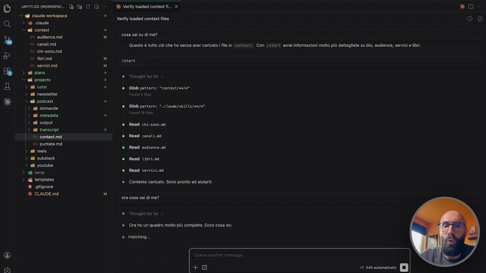

**Testo a schermo (OCR):** *XcEevVKEL O O) untmeD worsec ® fa C © © qfi claude workspace > i claude © ell conte ‘audience. md canali.md #: chi-sono.md libri.md e servizind > ati plans V ell projects. > ail corsi > ail newsletter > ell podcast. ni domande ii metadata sii output adi transcript > context.md puntate.md > ali roels > ail substack > al youtube > 16 temp > il templates + ogîtignore % CLAUDE.md > > > > X Verity loaded context fi... X Verify loaded context files cosa sal su di me? Questo è tutto ciò che ho senza aver caricato | file in context/.. Con /start avrei informazioni molto più dettagliate su bio, audience, servizi e libr. Istart ® Thought for0s ® Glob pattern: "context/ea/a" ‘@ Glob patter ".claude/skills/we/e è Read chi-sono.md è Road canslt.nd ® Read audtence.mi è Read Ubri.nd è Read servizi.n ® Contesto caricato. Sono pronto ad alutarti. ora cosa sai di me? ® Thought for 0s ® Ora ho un quadro molto più completo. Ecco cosa so: + Hatching.... * D Te)

> Chi sei, i miei numeri, adesso metterà forse qualcosa sui libri, ecco qua i libri, il tono di voce, l'odienza e così via. Perché questa informazione l'ha presa qua. Che cosa è questo comando Start? È una skill. E tra un attimo ci arriviamo. Quindi questo è un ottimo passaggio anche per introdurre il mondo delle skill. Quindi io apro CloudCode e dando il comando Start mi faccio caricare queste cose. Questa è una scelta mia, voi potete pure non farla questa cosa. Come dicevamo voi potete mettere i file CloudMD, potete avere tutto in un file molto lungo, potete dirgli che deve solo caricare dinamicamente i contesti del progetto quando serve, ma io mi sono fatto anche un'altra skill. Cioè faccio questo, faccio Load Project, Podcast. Con questo comando gli faccio caricare solo il contesto del podcast. Quindi io so che in questa sessione lavorerò sul podcast. Gli dico, che ne so, citami tre ospiti a caso del mio podcast.

## [00:08:00] Schermata 8 _(periodic)_

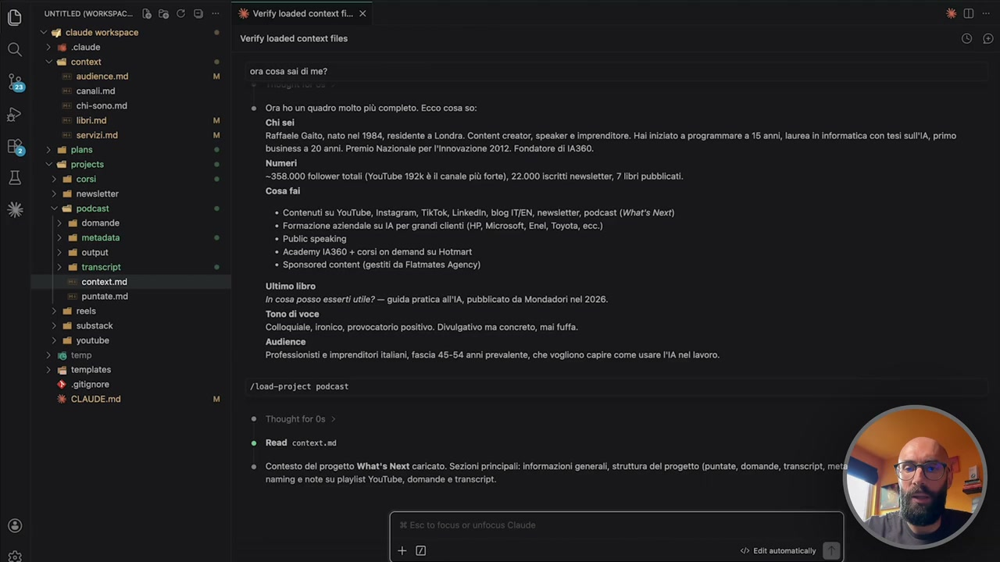

**Testo a schermo (OCR):** (lì) *XUEvVE O O) untmeD worisec- ® fa CO © ef claude workspace > i claude Sell contort si audience. md canallmd chi-sono. md ni domande ii metadata ni output nf transcript > contextimd puntate.md > ail reels > ail substack > ail youtube > 16 temp > nl templates + itignore % CLAUDE.md X Verify loaded context fi. x Verify loaded context files ora cosa sai di me? @ Ora ho un quadro molto più completo. Ecco cosa so: Chisei Raffaele Gaito, nato nel 1984, resident business a 20 anni. Premlo Nazionale per l'Innovazione 2012. Fondatore di IA360. Numeri -358.000 follower totali (YouTube 192 è il canale più forte), 22.000 iscritti newsletter, 7 libri pubblicati. Cosa fai » Contenuti su YouTube, Instagram, TIKTOk, Linkedin, blog IT/EN, newsletter, podcast (What's Next) * Formazione aziendale su IA per grandi clienti (HP, Microsoft, Enel, Toyota, ecc.) * Public speaking * Academy IA360 + corsi on demand su Hotmart * Sponsored content (gestiti da Fiatmates Agency) Ultimo libro in cosa posso esserti utile? — guida pratica all\A, pubblicato da Mondadori nel 2026. Tono di voce Colloquiale, ironico, provocatorio positivo. Divulgativo ma concreto, mai futfa. Audience Professionisti e imprenditori italiani, fascia 45-54 enni prevalente, che vogliono capire come usare I'lA nel lavoro. /Noad-project podcast ® Thought for0s ® Read contert.nd ® Contesto del progetto What's Next caricato. Sezioni principali: informazioni generali, struttura del progetto (puntate, domande, naming e note su playlist YouTube, domande e transcript. < Ealt automatica Londra. Content creator, speaker e imprenditore. Hal iniziato a programmare a 15 anni, laurea in informatica con tesi sullA, primo

> No, citami, dammi tre nomi di ospiti a caso del mio podcast. Giusto per farvi vedere che adesso va a pescare là dentro e si pia con l'informazione. Legge il file puntate e ha scelto Luciano Floridi, Emiliano Colangeli, Giovanna Panucci. Perché ha quell'informazione, ha letto quel contesto. E anche questa è una skill, ok? Anche questa è una skill. Tutte le volte che vedete fare slash questa cosa qua, vedete? Ho scritto start, invio, sta partendo una skill. Load Project sta partendo una skill. Questa è una scelta mia. È quella famosa configurazione che vi ho fatto dire, il numero 5. È quella, adesso appena andiamo nelle skill che vi faccio vedere anche a voi, perché io la trovo potentissima questa cosa. Ci dà quella flessibilità di dire, io posso aprire una sessione e lavorare in una di tre modalità. Posso avere una sessione, se io clicco così, bam, nuova sessione.

## [00:09:00] Schermata 9 _(periodic)_

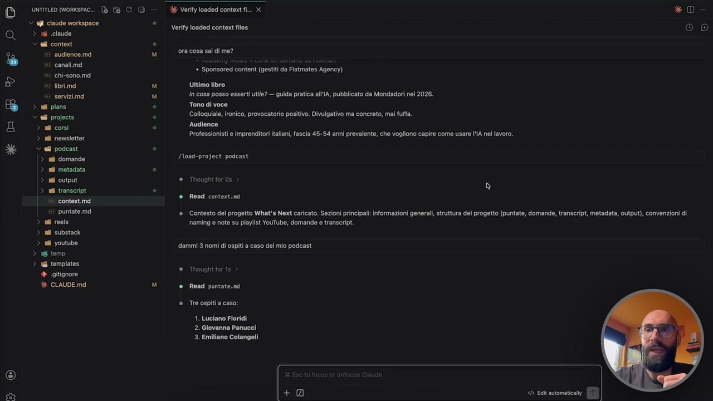

**Testo a schermo (OCR):** O Q » > O) unrmeD worsesc ® fa C © © fi claude workspace > i claude > ell conto audience. md canallmd x: chi-sono. md > ail substack > ail youtube > 16 temp > rl templates + gîtignore % CLAUDE.md È Verity loaded context fi... x Verify loaded context files ora cosa sai di me? * Sponsored content (gestiti da Flatmates Agency) Ultimo libro In cosa posso esserti utile? — guida pratica all'\A, pubblicato da Mondadori nel 2026. Tono di voce Colloquiale, ironico, provocatorio positivo. Divulgativo ma concreto, mai fuffa. Audience Professionisti e imprenditori ital fascia 45-54 anni prevalente, che vogliono capire come usare I'l4 nel lavoro. /Noad-project podcast. Thought for 0s Read context.md * D (0) ® Contesto del progetto What's Next caricato. Sezioni principali; informazioni generali, struttura del progetto (puntate, domande, transcript, metadata, output), convenzioni di naming e note su playlist YouTube, domande e transcript dammi 3 nomi di ospiti a caso del mio podcast Thought for 1s Read puntate. nd Tre ospiti a caso: 1. Luciano Floridi 2. Giovanna Panucci 3. Emiliano Colangeli (0)

> Qua ho caricato solo Cloud. Quindi è una sessione super snella, con la memoria veramente leggerissima, dove c'è veramente il minimo indispensabile per lavorare. Se io do, apro sessione, faccio slash start, ho caricato invece tutto il mio contesto, tutto il mio storico, ma non ho messo nessun progetto in memoria. Quindi tengo la memoria ancora molto leggera, ma sa tutto di me. Perché magari è un brainstorming e non è relativo a nessun progetto. Non voglio lavorare su un cliente, non voglio lavorare su un canale, non voglio lavorare su un contenuto, non voglio lavorare su niente, ok? Sto facendo delle attività che sono slegate da progetti. Se invece io sono al terzo livello di lavoro, quindi apro e lui ha caricato CloudMD, faccio start e lui ha caricato il contesto generale, poi faccio load project e gli passo il nome di un progetto, lui capisce la sessione su cui lavoreremo è podcast. Ma non ti dico di caricare tutta sta roba, perché ho un contesto enorme per i corsi, per la newsletter, per i deal, per sub, stack, eccetera, eccetera,

## [00:10:00] Schermata 10 _(periodic)_

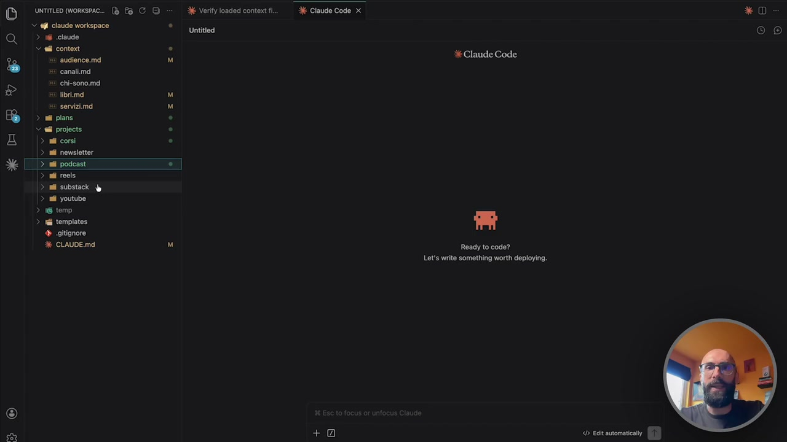

**Testo a schermo (OCR):** Do srmemonse ® 6 CO © ell claude workapace Q > 56 claude > ell content è x audience. md x: canalimd + chi-sono.md nd tria si servizimd DB >» gres Yell projects E CLAUDE.mdi O) sm Mm Bk Verify loaded context fi Untitiedi E Claude Code x Claude Code Ready to code? Let's write something worth deploying. +0 < Eclt automatica * D (Oc)

> ma ti dico ora in memoria mettiti CloudMD, il contesto generale e il contesto del podcast e lui è pronto a lavorare sul podcast. Questa tecnica è potentissima e tra un attimo infatti vedremo anche in dettaglio quelle due skill. Vi consiglio di usarla anche nel vostro caso, anche se vi sembra un po' avanzata, non lo è, è di una semplicità devastante, vi permette di avere quella flessibilità che vi ho appena spiegato, di tenere la memoria sempre molto snella e di caricare solo i progetti che vi servono. Perché ricordatevi questa cosa, se voi aprite tre sessioni in parallelo, voi potete lanciare tre istanze di Cloud Code, perché non è una chat, è un prodotto agentico quello che stiamo utilizzando, quindi mi potrei caricare nella prima contesto del cliente X, nella seconda contesto del cliente Y, nella terza contesto del cliente Z e lavoro in parallelo e le tre cose non si danno fastidio. Ed è una cosa spettacolare, se siete un manager la stessa cosa, avete, che ne so, il vostro team dovete fare la review di fine anno,

## [00:11:00] Schermata 11 _(periodic)_

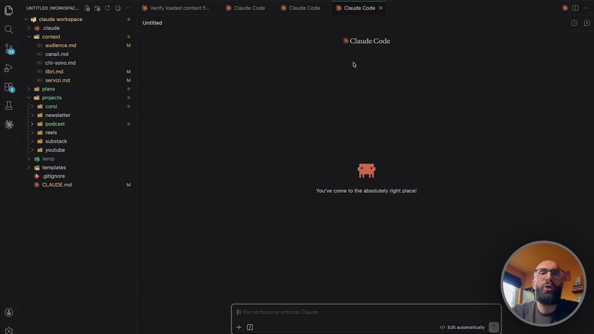

**Testo a schermo (OCR):** *xcEevE Lo O) UNTITLED (WORKSPAC.. È @fi claude workspace > i claude Sell conte n audience.md + canalimd #: chi-sono.md x libri.md x servizimd > al plans all projects > ail corsi > ail newsletter > all podcast > ail reeis > ail substack > sii youtube > 6 temp > ui templates + sgitignore % CLAUDE.mdi INEOICAIC] sor Ke Verify loaded context fi Untitiedi È Claude Code. Claude Code 3 Claude Code x Claude Code You've come to the absolutely right place!. +0 < Echt automatically * D (Oc)

> vi aprite tre sessioni e dentro fate tre lavori diversi con tre dipendenti, tre persone del vostro team, no? Per dare un'idea. Stessa cosa se siete un'agenzia e state lavorando su tre clienti diversi oppure su tre progetti diversi, eccetera eccetera. Questa flessibilità è incredibile. Ma adesso avete visto un vero contesto all'opera e come avete visto è semplice, semplice, semplice. Ricordatevi perché tutto quello che stiamo dicendo alla fine sono dei file di testo. Questa è la cosa potente di tutto questo, non è niente di complicato, sono dei semplici file di testo. È quello che facciamo in chat, non sono neanche più dei prompt avanzati, ma sono delle richieste in linguaggio naturale molto semplici, spesso addirittura delle interviste e otteniamo quello che ci serve.
