# Cosa sono le skill e perché sono fondamentali

> Documento generato automaticamente: trascrizione e screenshot sincronizzati del video-corso.

## [00:00:00] Schermata 0 _(start)_

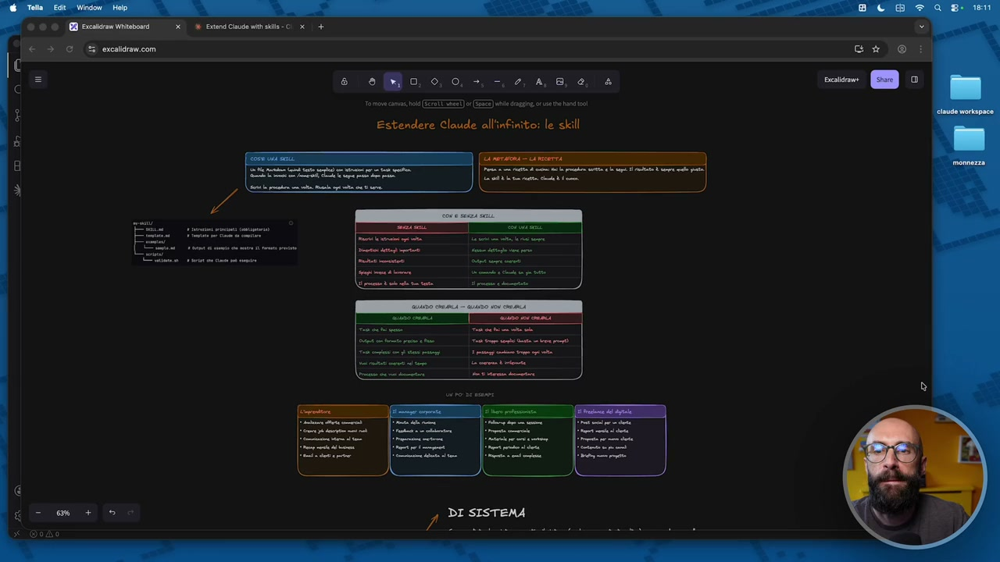

**Testo a schermo (OCR):** d x ® FicensCine meo 0 x + 6 00,00 -. -. ,4,8, 4, Estendere Claude all'infinito: le skill Ft

> E stiamo a parlare di skill che sono un po' la terza categoria, funzionalità, cosa fondamentale da capire di Cloud. Non esagero se dico che una volta che avete capito il workspace, quindi lo spazio di lavoro, l'organizzazione delle cartelle, il contesto, dove mettere le informazioni e le skill, avete coperto la maggior parte delle cose che vi servono per lavorare bene con Cloud Code. Poi tutto il resto è fare il salto di qualità e andare a fare un utilizzo diciamo da avanzato, ok? Che però potrebbe anche non esservi necessario. Parliamo delle skill. L'avete visto già? Qualche volta dentro la chat io mentre stavo così ho cliccato questo pulsantino qua e si sono aperte delle cose, oppure ho dato il comando slash e si sono aperte delle cose. Perché è la stessa cosa, no? Questo è proprio il comando slash. Per esempio, che ne so, cliccamone una a caso che funziona anche senza terminale, se io clicco, vediamone una che vi possa far vedere qualcosa, se io clicco contesto,

## [00:01:00] Schermata 1 _(periodic)_

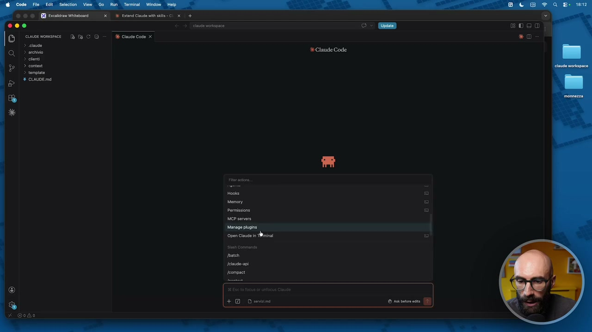

**Testo a schermo (OCR):** 3 Eaceng Cine wise © x + > ela opaca © euiorvonsnce Di fa CO dk ciudecoge x 3 lude > are > ln > content > tempiato % ciAUDEmd MCP seen di n Open lau in mina ate +2 Drntimi

> questa qua ci fa vedere il contesto caricato in memoria in questo momento, ok? Quando abbiamo fatto questa cosa abbiamo utilizzato una skill e questa ci dà delle informazioni su quello che sta succedendo nel contesto. Che cos'è una skill? Allora, la skill dal punto di vista proprio di contenuto non è nient'altro che un file di testo. È un file di testo, è un file markdown, però abbiamo capito che il markdown è testo, con dentro delle istruzioni per un task specifico. Come la chiamiamo? Scrivendo slash nome della skill, per esempio vi ho fatto vedere nel mio workspace faccio start, oppure load project, oppure poco fa ho fatto context, e Cloud la esegue, ok? Quindi noi scriviamo una sola volta questa procedura, ce l'abbiamo all'infinito, la riusiamo tutte le volte che ci serve. Non dobbiamo, perciò vi dicevo, la cosa di andare a scrivere quei prompt giganti

## [00:02:00] Schermata 2 _(periodic)_

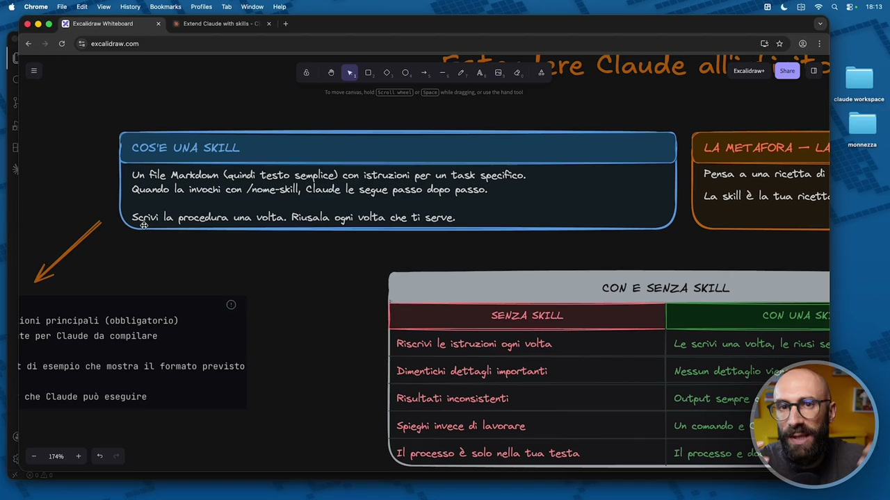

**Testo a schermo (OCR):** Un file Markdonm (quindi testo lice) con istruzioni per un task specifico. Quando la invochi con /nome-skill, Claude le segue passo dopo passo. ivi la procedura una, volta. Riusala ogni volta che tì serve. ioni principali (obbligatorio) ci» Ron a re Claude alli ws La skill è la tua ricette CON E SENZA SKILL CON UNA SKi ite per Claude da compilare Riscrivi le istruzioni ogni volta È di esempio che mostra il formato previsto SR È che Claude può eseguire Risultati inconsisterti Spieghi invece di lavorare Il processo è solo nello tua testa Le serivi una volta, le riusì se

> scompare proprio, perché quel prompt può diventare una skill. Tra l'altro, diciamo, la possiamo invocare con slash nome skill, ma Cloud Code è un sistema molto intelligente che, anche se scriviamo proprio in linguaggio naturale che abbiamo bisogno di una cosa, lui capirà che quella cosa è collegata a una skill e la invoca comunque. Questo è preso, diciamo, dalla documentazione ufficiale di Antropic, che ci fa vedere come è fatta una skill. C'è una cartella che è il nome della skill, c'è un file dentro che si chiama skill.Md, dove ci sono le istruzioni. Questo è l'unico file obbligatorio, quindi la maggior parte delle skill sono una cartella con dentro un file skill.Md. Finito! Non c'è nient'altro. Se volete potete mettere dei template, se volete potete mettere degli esempi su come si deve comportare la skill. Se volete, e questa qua è utile, potete mettere dei pezzi di codice. Cioè alcune skill devono fare a volte delle cose un po' più complicate, per cui devono eseguire del codice, allora dentro ci può essere del codice di supporto. La skill dice

## [00:03:00] Schermata 3 _(periodic)_

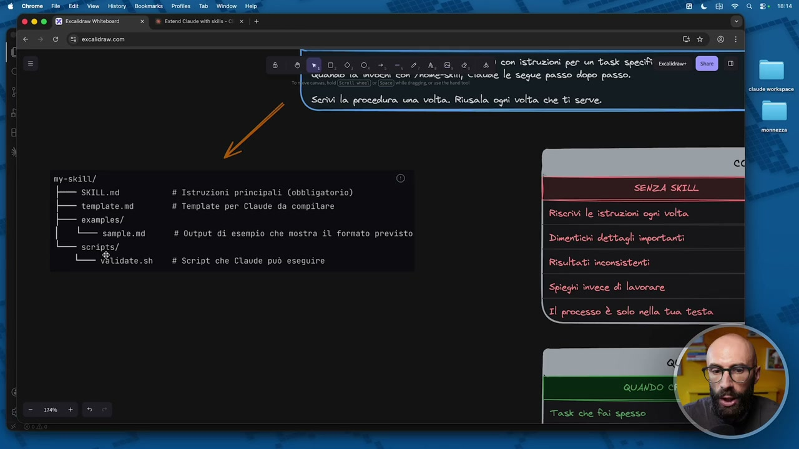

**Testo a schermo (OCR):** 2 AB a, a! con istruzioni per un task specifi scio» MD © Tare le segue posso dopo posso. my-skill/ — swtt.md # Istruzioni principali (obbligatorio) — temprate.nd # Tenplate per Claude da compilare Riserivi le istruzioni ogni volta | examples/ ai L_ sampre.ma # Output di esempio che mostra il formato previsto Dimentichi dettagli importanti L_ scripts/ LI S$ridate.sh # Script che Claude può eseguire Risultati inconsistenti Spieghi invece di lavorare Il processo è solo nella tua testa

> ok, per poter completare questa cosa ho bisogno di codice di supporto, ok? Questa è la skill. Ma non vi preoccupate, perché anche se questa cosa vi sembra complessa, non la dovete fare a mano voi, perché avete già capito che la CreaCloud. Il workspace lo dovevate solo capire, ma poi l'ha creato Cloud. Il contesto lo dovevate solo capire, ma poi l'ha creato Cloud. Le skill le dovete solo capire, ma poi le CreaCloud. State tranquilli, ok? Ci arriviamo. Qua ho esagerato, ho fatto pure la metafora della ricetta, questo è proprio da manuale diciamo di informatica, al giorno 1, è un po' come una ricetta. Cioè la ricetta, la pasta al pomodoro è sempre gli stessi step, no? Sappiamo le fasi da eseguire, la skill è quello, è una ricetta. Poi Cloud la prende, è un po' il cuoco, ho detto qua, la esegue e ottiene quel risultato. Stop. Questa è la skill, è una ricetta, ok? Una serie di passi che deve fare. Qua ho fatto un po' la solita tabella con

## [00:04:00] Schermata 4 _(periodic)_

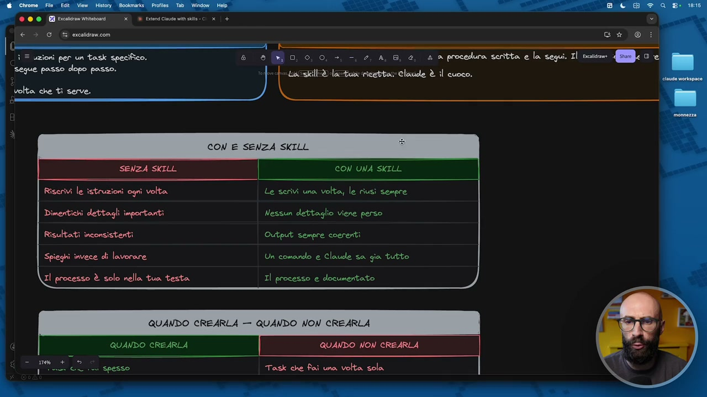

**Testo a schermo (OCR):** COT=">"<WwWC-<"% € > 0 ecaldrancon —lBBBE-/*“;! VP III uzioni per un task specifico. e 8 [Mm 0, 0, 0, -, -, 2, A, 8, e, 4 a procedura seritta e la se la ese È »Lacskildlastuo ricetta; claude è il cuoco. volta che ti serve. CON UNA SKILL Riserivi le istruzioni ogni volta Le serivi una volta, le riusì sempre Dimentichi dettagli importanti Nessun dettaglio viene perso Risultati inconsistenti Output sempre coerenti Spieghi invece di lavorare Un comando e Claude sa gia tutto Il processo è solo nella tua testa Il processo e documentato QUANDO CREARLA — QUANDO NON CREARLA QUANDO CREARLA QUANDO NON CREARLA SPE spesso Task che fai una volta sola

> e senza skill, no? Qual è il vantaggio di andare a lavorare con le skill? Perché sono fondamentali? Allora, quando non abbiamo le skill, noi riscriviamo le istruzioni tutte le volte ed è quello che ci siamo abituati per anni a fare nei chatbot, no? A fare questi prompt giganti. Poi ovviamente Cloud ha introdotto le skill che non sono solo in Cloud Work, sono anche in Cloud Chat, in Cowork, quindi qualcuno di voi potrebbe anche già averle viste le skill e lo conosce già come concetto, però magari qualcuno le sente per la prima volta. Quindi devi riscrivere tutte le volte le istruzioni. Invece qua li scrivi una sola volta, le riutilizzi per sempre. Fai semplicemente slash in chat, nome della skill, invio. Quindi c'è la skill che ti crea il preventivo. Crea preventivo, invio, brum, e lui fa il preventivo. Non devi scrivere tutte le volte come vuoi il preventivo. Quando fai i megaprompt spesso dimentichiamo i dettagli e quindi ci sono tutti i trucchetti su Terfugge. La gente si fa le note, se li mette nei file Word, se li salva su Notion, ci sono questi database, questi archivi con i prompt. Qua abbiamo la skill che non si perde

## [00:05:00] Schermata 5 _(periodic)_

**Testo a schermo (OCR):** CON E SENZA SKILL SENZA SKILL CON UNA SKILL Riscrivi le istruzioni ogni volta Le scrivi una volta, le riusì sempre Dimeritichi dettagli importanti Nessun dettaglio viene perso Risultati inconsistenti Output sempre ererti Spieghi invece di lavorare Un comando e Claude sa gia tutto Il processo è solo nella tua testa Il processo e documentato QUANDO CREARLA — QUANDO NON CREARLA QUANDO CREARLA Task che Fai spesso Ù

> nessun dettaglio. Soprattutto la possiamo mantenere nel tempo, perché se l'esigenza nostra è cambiata dopo un mese o dopo un anno, andiamo nella skill, modifichiamo quella piccola parte e continuiamo a dare lo stesso comando e la skill farà le nuove istruzioni. Spesso i risultati qua sono inconsistenti, invece qua l'output è sempre lo stesso. Cioè se io ho la skill che mi fa la pasta al pomodoro, farà sempre la pasta al pomodoro. Non succede che un giorno mi fa la pasta al pesto. Senza skill dobbiamo spiegare tutto il tempo. Quando lavoriamo con le skill, come vi ho detto, si perde quella cosa di scrivere i prompt, ma siamo molto operativi, andiamo molto sui comandi. Quindi gli diciamo mi serve il preventivo per Mario Rossi, invio. Lui dice, ah, Raffaela ha chiesto un preventivo, c'è una skill che serve per il preventivo, fammela invocare. Ah, ha chiesto Mario Rossi, nel contesto ci sono le istruzioni di Mario Rossi, metti insieme queste due cose e ti produce il preventivo. Quindi mentre qua il processo è nella nostra testa, il processo qua l'abbiamo documentato. Perché? Perché abbiamo la nostra bella ricettina,

## [00:06:00] Schermata 6 _(periodic)_

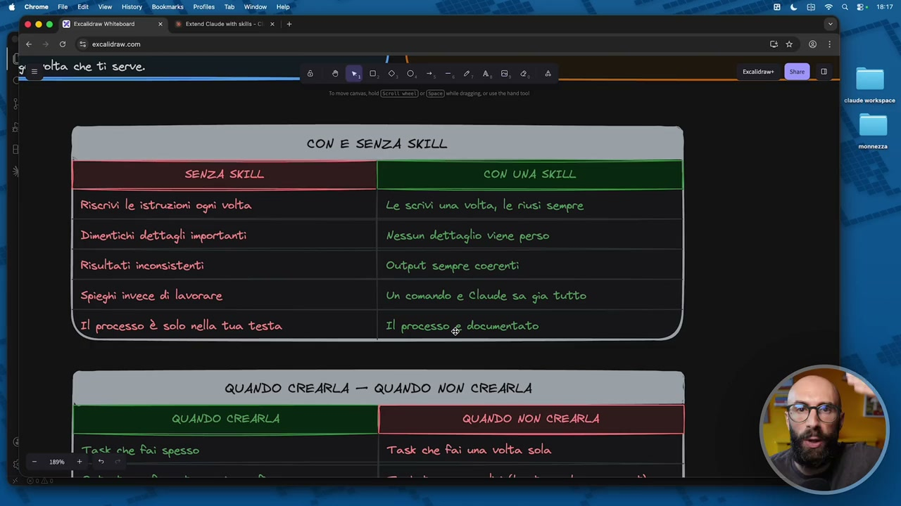

**Testo a schermo (OCR):** CON E SENZA SKILL SENZA SKILL CON UNA SKILL Riscrivi le istruzioni ogni volta Le serivi una volta, le riusì sempre Dimeritichi dettagli importanti Nessun dettaglio viene perso Risultati inconsistenti Output sempre coerenti Spieghi invece di lavorare Un comando e Claude sa gia tutto Il processo è solo nella tua testa Il processo £ documentato QUANDO CREARLA — QUANDO NON CREARLA QUANDO CREARLA QUANDO NON CREARLA Ta<k che fai spesso Task che fai una volta sola s

> anzi ricetta fatemelo proprio sottolineare. Eccolo qua. Abbiamo la nostra bella ricetta, l'abbiamo documentato. Questo è fondamentale. Ci sono dei casi nei quali vale la pena crearla, non vale la pena crearla, no? Quando dobbiamo regolarci. Allora, quasi sempre conviene creare una skill, ok? Non si crea la skill quando non abbiamo un'attività ripetitiva da fare. Quindi, se fai un task spesso hai bisogno di una skill, ok? Se tu periodicamente invii preventivi, quella cosa deve diventare una skill. Se tu periodicamente devi trasformare le… I file audio di una riunione fatto col tuo team perché ti serve la minuta della riunione, che è di persona oppure su Zoom, su Meet, eccetera eccetera, se lo fai una volta al giorno, una volta a settimana, per quello ti serve una skill. Se hai fatto una call con un cliente americano e ti serve la traduzione dall'inglese perché non mastichi bene l'inglese, quella cosa

## [00:07:00] Schermata 7 _(periodic)_

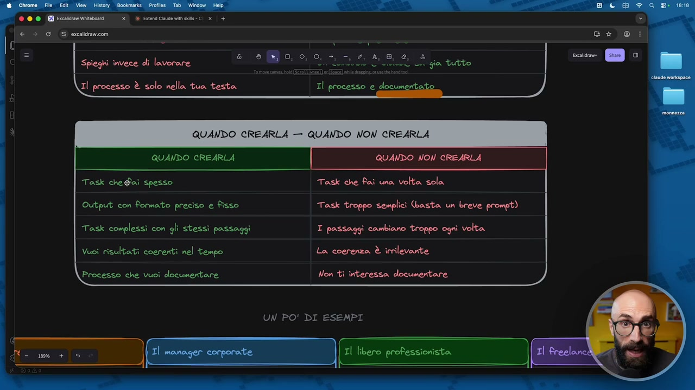

**Testo a schermo (OCR):** XE tend Cinudo manie © x | + Spieghi invece di lavorare Il processo È solo nella tua testa QUANDO CREARLA Task che@ai spesso Output con Formato preciso e fisso Task complessi con gli stessi passaggi Vuoi risultati coerenti nel tempo Processo che vuoi documentare Task che fai una volta sola Task troppo semplici (basta un breve prompt) I passaggi cambiano troppo ogni volta La. coerenza È irrilevante Non tì interessa documentare UN PO' DI ESEMPI

> è una skill, ok? Tutte le cose che sono ripetitive devono diventare delle skill. Se hai un particolare template che usi per rispondere alle mail dei clienti che chiedono il rimborso di un prodotto, quella cosa diventa una skill. Invece se sono task che fai una sola volta non ti serve la skill. Scrivi il prompt quella volta, magari il prompt è pure piccolo, e allora sti cazzi. Ti serve una skill ogni volta che hai un output preciso, quindi per esempio ho fatto l'esempio del preventivo, l'esempio della mail, l'esempio della traduzione, tu sai che voi ottenete sempre quella cosa, allora quella è una skill. Tu la documenti e dici ok, questo è quello che voglio ottenere. Invece quando sono troppo semplici non lo fai questa cosa qua. Se i passaggi sono sempre gli stessi, ti serve una skill. Se i passaggi cambiano tutte le volte, è difficile fare la skill. Cioè se tu dici il preventivo è sempre lo stesso, deve solo prendere il nome dell'azienda e l'indirizzo dell'azienda, il pacchetto che ha comprato, quella cosa è perfetta.

## [00:08:00] Schermata 8 _(periodic)_

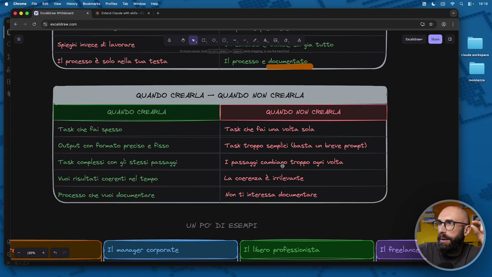

**Testo a schermo (OCR):** Spieghi invece di lavorare Il processo È solo nella tua testa Task che Fai spesso Task che Rai una volta sola Output con formato preciso e fisso Task troppo semplici (basta un breve prompt) Task complessi con gli stessi passaggi I passaggi cambiago troppo ogni volta Vuoi risultati coerenti nel tempo La. coerenza È irrilevante Processo che vuoì documentare Non ti interessa documentare UN PO' DI ESEMPI e}

> Se tu mi dici no Raph, no no, i preventivi, io per i preventivi no, li scrivo tutte le volte a mano, sono diversi, non c'è un template di riferimento, allora ti dico no, non la fai la skill in quel caso. Sto facendo l'esempio del preventivo perché è facile, ma ne ho fatti mille, la call one to one, la traduzione, la mail, la risposta ai ticket. Io per esempio ho una skill potentissima che mi va su un mio video su YouTube e mi scarica il transcript. Oppure se il video non ce l'ho su YouTube ma se ce l'ho sul desktop, prende un video e mi fa la trascrizione. Immaginate, nel mio caso è un video YouTube, ma nel vostro caso che magari non fate YouTube, quel file là, per esempio, è la riunione che avete fatto col vostro team, no, su Zoom, un'ora e mezza di riunione e dite madonna mia ma quali erano le cose da fare, ma chi le doveva fare, ma quali sono le scadenze, ma l'abbiamo mandato il preventivo al cliente, vi fate una skill che prende un file video o un file audio e vi fa questa cosa, riassunto, vi estrapola i punti

## [00:09:00] Schermata 9 _(periodic)_

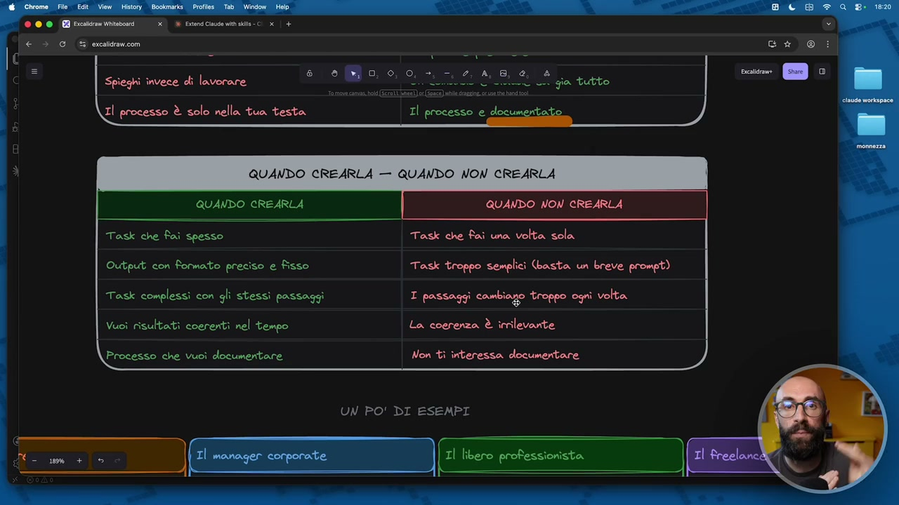

**Testo a schermo (OCR):** dA Etna Cha waste x Spieghi invece di lavorare ” Li gia tutto Il processo È solo nella tua testa Task che fai spesso Task che fai una volta sola Output con formato preciso e fisso Task troppo semplici (basta un breve prompt) Task complessi con gli stessi passaggi I passaggi cambiago troppo ogni volta Vuoì risultati coerenti nel tempo La coerenza È irrilevante Processo che vuoî documentare Non tì interessa documentare UN PO' DI ESEMPI

> principali, i task e così via. Se vi serve la coerenza dovete fare una skill, se la coerenza è rilevante non è necessaria la skill, se volete documentare il processo vi serve una skill perché a tutti gli effetti è una ricetta, se non ti interessa documentare perché dice no vabbè questa cosa la faccio mo poi non mi servirà mai più, allora sticazzi della skill, ok? Quindi serve quasi sempre la skill, potremmo dire, tranne nei casi in cui avete delle cose che fate una sola volta o sono molto diverse nel tempo, ok? Se vogliamo semplificare tanto. Poi qua io ho messo un po' di esempi, però se esempi, vi dico la verità, sono sempre dubbioso sul metterli perché ovviamente ne faccio uno e poi c'è un altro che diciamo non hai fatto il mio esempio, vabbè ho fatto l'imprenditore, il manager, il libero professionista, giusto per darvi qualche spunto, poi dopo ci mettiamo a lavorare praticamente, quindi diciamo ne vediamo qualcuna di concreta, però per accendervi qualche lampadina, darvi qualche idea. Allora, l'imprenditore per esempio,

## [00:10:00] Schermata 10 _(periodic)_

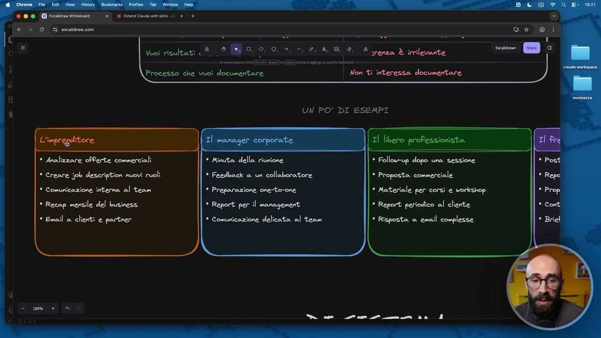

**Testo a schermo (OCR):** ® * renza È irrilevante Non tì interessa documertare UN PO' DI ESEMPI * Analizzare offerte commerciali * Minuta. della riunione * Follow-up dopo una sessione * Creare job description nuovi ruoli * Feedback a un collaboratore * Proposta commerciale * Comunicazione intera al team * Preparazione one-to-one * Materiale per corsì e workshop * Recap mensile del business * Report per il management * Report periodico al cliente * Email a clienti e partner * Comunicazione delicata al team * Risposta a email complesse n 0 - n dr 1

> analisi di offerte commerciali, mi arrivano delle mail, mi arrivano dei pdf, eccetera, bam, le butto dentro, la skill mi fa l'analisi, i pro, i contro, no, mi tira fuori le cose da approfondire, le red flag e così via. Devo assumere spesso, metto spesso degli annunci, delle job description, mi faccio un sistema che mi crea in automatico delle job description per il mio team. Comunicazione interna al team, perché magari facciamo degli appuntamenti periodici, perché magari abbiamo delle mail periodiche che vengono mandate e così via. Recap mensile, quindi un recap può essere, che ne so, dei risultati che abbiamo ottenuto questo mese, quindi potrebbe essere più sui aspetti economici, potrebbe essere delle metriche importanti, no, che vado a prendere magari nel sistema di analytics, nel crm e così via. Oppure email, tantissimo per email, email a clienti, partner, stakeholder, eccetera. Il manager, classica riunione, mi serve fare la minuta, sono stato due ore in riunione, dopo esco fuso, ho una skill che in automatico mi tira fuori tutte le cose importanti. Oppure un feedback

## [00:11:00] Schermata 11 _(periodic)_

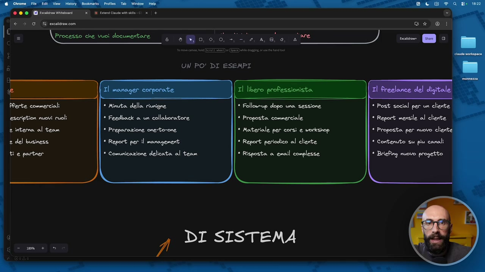

**Testo a schermo (OCR):** * Minuto della riunigne * Feedback a un collaboratore * Preparazione one-torone * Report per il management * Comunicazione delicata al team * Follow-up dopo una sessione * Proposta commerciale * Materiale per corsì e workshop * Report periodico al cliente * Risposta a email complesse * Post social per un cliente * Report mensile al cliente * Proposta per nuovo cliente * Contenuto su piu conali * Briefing nuovo progetto

> a un collaboratore, vi dicevo prima, no, se avete da fare al fine mese la, che ne so, la, la, il one to one, perfetto, lancio la skill, preparare one to one per Raffaele, preparare one to one per Giulia, preparare one to one per Carla, preparare one to one per Francesco e così via. E infatti ho detto già pure il terzo, preparazione one to one, report, se fate spesso reportistica, quindi ho delle cose, devo mettere dentro un unico file e prepararmi una reportistica, questa è una bomba. Oppure comunicazione interna al team, anche questo. Professionista, mail di follow up dopo una sessione, quindi per esempio faccio coaching, ho finito l'ora di coaching e voglio mandare alla persona con cui ho fatto coaching una piccola mail di recap o un piccolo report. No, questa cosa la può fare in automatico dalla sessione di coaching che abbiamo appena fatto. Preparare un preventivo, preparare materiali per corsi, per workshop, devo mettere in piedi

## [00:12:00] Schermata 12 _(periodic)_

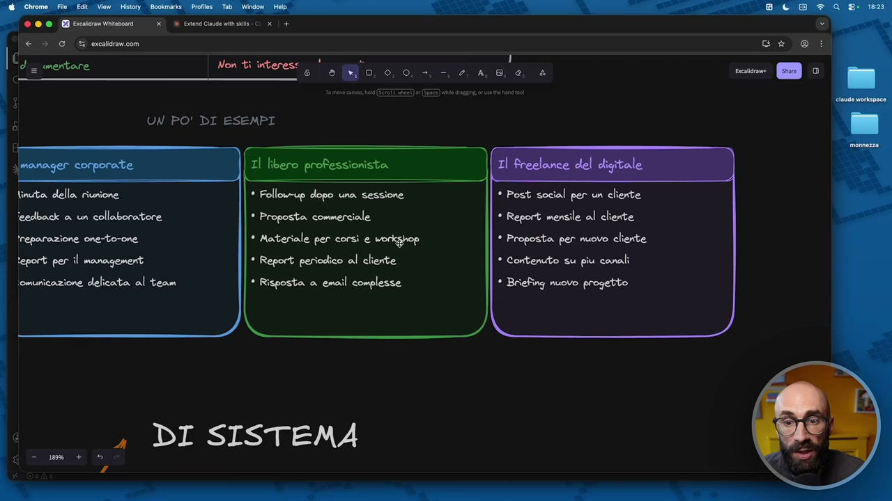

**Testo a schermo (OCR):** UN PO' DI ESEMPI linuta della riunione eedback a un collaboratore * Follow-up dopo una sessione * Proposta commerciale treparazione one-to-one * Materiale per corsi e workghop teport per il management * Report periodico al cliente ‘omunicazione delicata al team * Risposta a email complesse iper esen perlinalione * Report mensile al cliente * Proposta per nuovo cliente * Contenuto su piu canali * Briefing nuovo progetto

> degli esempi, per esempio, no, mi serve impostare uno schema, una struttura di qualche tipo, faccio dei report periodici al cliente, anche qui risposta alle mail, che possono essere mail di persone che sono già clienti, di potenziali clienti e così via. E poi, diciamo, magari lavoro nel digitale, lavorare sui post social, quindi traduzioni, scrittura copy, idee, brainstorming, no, proporre idee. Mi faccio una, per esempio, una skill che mi dice, che ne so, cinque idee per LinkedIn e poi una skill che mi dà invece solo le idee per i caroselli per Instagram e così via. No, sono singole funzionalità. Ragionate sempre su questa singola funzionalità. Io sono molto favorevole alle skill molto snelle, non mi piacciono le skill molto complicate, ok? Per esempio, poi ovviamente ognuno se le organizza come vuole, perché qua poi entriamo nelle preferenze personali,

## [00:13:00] Schermata 13 _(periodic)_

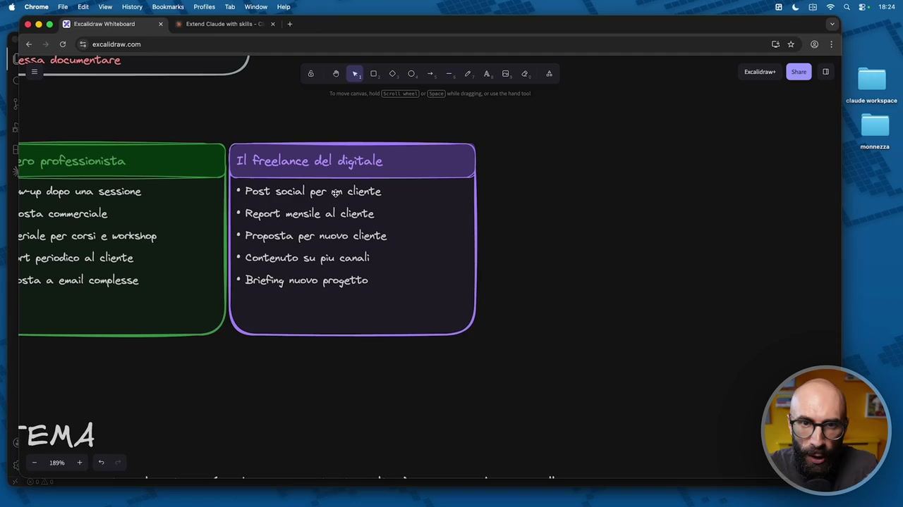

**Testo a schermo (OCR):** * Post social per un cliente osta commerciale * Report mensile al cliente griale per corsi e workshop * Proposta. per nuovo cliente et periodico al cliente * Contenuto su piu canali asta a email complesse * Briefing nuovo progetto

> però io non mi farei una skill calendario editoriale, che dentro mi fa LinkedIn, mi fa Instagram, mi fa newsletter, mi fa blog, la vedo complessa da gestire nel tempo. Ragionate sempre in ottica modulare, è un sistema modulare, Cloud Code, è molto facile avere dei piccoli moduli, sono più facili da gestire. Io, per esempio, mi farei una skill che mi fa, mi dà i suggerimenti per degli argomenti da trattare su LinkedIn, mi dà delle idee per i caroselli che posso fare su Instagram. Sono delle skill separate. Io ragionerei in questo modo, poi ognuno se le organizza come vuole. Contenuti su più canali, quindi magari mi aiuta a fare il cross-posting, ti do in pasto un articolo di blog, mi aiuti a trasformarlo in un carosello, per esempio. Oppure un briefing per un nuovo progetto. Qua ho aggiunto questa piccola cosa che non l'ho trovata mai da nessuna parte e nessuna me l'ha mai spiegato in maniera esplicita. Secondo me è utile che ve la dica questa cosa. Le skill alcune volte sono di sistema, quindi sono un po' di back-end, alcune volte sono di

## [00:14:00] Schermata 14 _(periodic)_

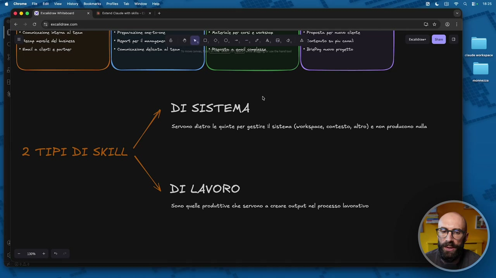

**Testo a schermo (OCR):** Il + Materiale per corsì e vorkshop — Il + Proposta per nuovo cliente «Report perl mnegener & 18 (A O, 0, 0. +. —, 2, A, 8, @, & contenuto su piu coni * Comiienzione delta al tene none 2TIPIDIISKEEL DI SISTEMA Servono dietro le quinte per gestire il sistema (workspace, contesto, altro) e non producono nulla DI LAVORO Sono quelle produttive che servono a creare output. nel processo lavorativo

> lavoro, sono di front-end. Cioè quando voi mi avete visto fare per esempio slash start e ho caricato il contesto, quella è una skill, ma non è una skill operativa, cioè non mi produce un output per il mio lavoro, no? Da content creator. Mentre la skill che mi crea i metadati per i video YouTube, quella è di lavoro, cioè mi crea del materiale, dell'output, ok? Per esempio qua vi ho fatto vedere che prima ho lanciato la skill slash context, questa è una skill di sistema, cioè mi aiuta a fare il lavoro di dietro le quinte, no? Qua dico a gestire il sistema, per esempio il workspace, il contesto, no? La memoria, i plug-in, bla bla bla, le mille cose di Cloud Code. Non produce nulla, non è qualcosa che serve nel mio lavoro questa cosa qua, mi serve nella manutenzione di Cloud Code. Mentre quelle là che sono di lavoro sono le skill che invece io invoco e che mi aiutano a fare il lavoro di dietro le quinte, non è qualcosa che serve nel mio lavoro.

## [00:15:00] Schermata 15 _(periodic)_

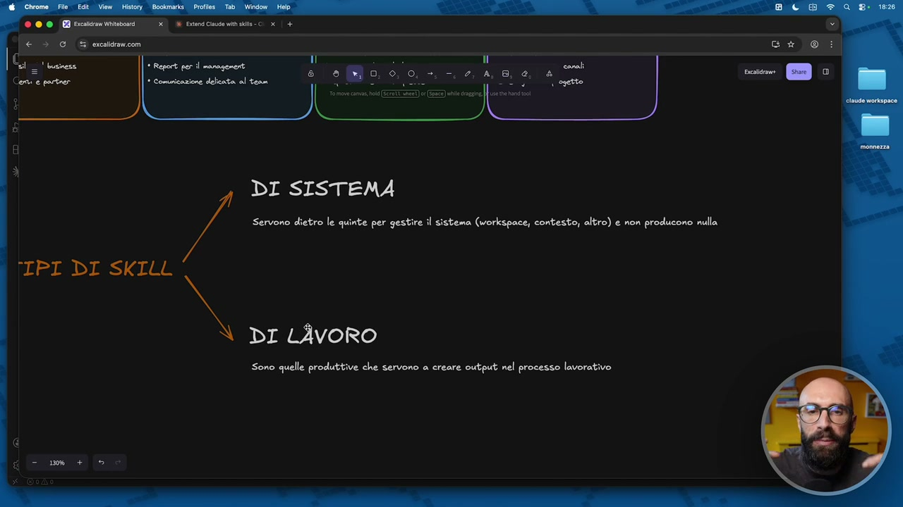

**Testo a schermo (OCR):** DI SISTEMA Servono dietro le quinte per gestire il sistema (workspace, contesto, altro) e non producono nulla TIPI DI SKILL DI LÀvORO Sono quelle produttive che servono a creare output: nel processo lavorativo

> Quindi potrebbe essere mi fa la traduzione, mi fa il pdf, mi aiuta a fare il brainstorming, no? E così via. Quindi adesso che abbiamo chiaro questa cosa, sapete cosa sono le skills. Questo è il concetto principale. Voglio tornare qua e un attimo sottolineare questa cosa. È testo semplice, quindi non vi dovete assolutamente preoccupare perché sono facilissime da fare. E ovviamente le farà Claude, non le faremo noi. Grazie.
