# Creiamo una skill semplice

> Documento generato automaticamente: trascrizione e screenshot sincronizzati del video-corso.

## [00:00:00] Schermata 0 _(start)_

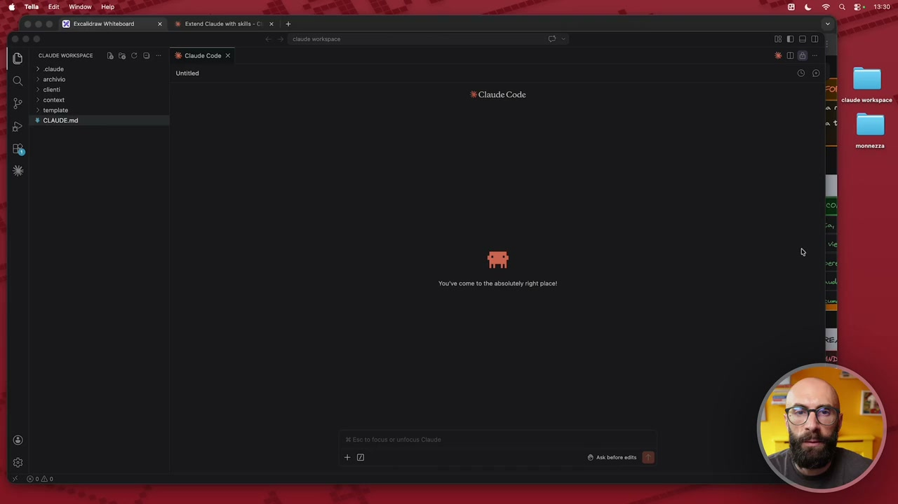

**Testo a schermo (OCR):** E Escaira iiabosrd > sue > clienti > template ® CIAVDE md X Claude Code Youve come to th absolutely right piace!

> Bene, ora siamo pronti per crearci la nostra prima skill. Partiamo con una skill molto semplice e poi dopo proviamo a crearne di più complesse. Se vi ricordate abbiamo detto che fondamentalmente la skill è una cartellina che ha un nome e questo è il nome con il quale chiameremo quella skill, quindi invocheremo quella funzionalità. E dentro c'è un file che si chiama skill.Md, si chiama sempre uguale questo file, che ha le istruzioni della skill. Poi c'è anche altra roba, ma a noi non servono in questo momento perché le nostre skill saranno molto semplici. Se voi andate sulla documentazione ufficiale di Cloud Code, che ovviamente vi lascio il link qua sotto, vi fa vedere che poi il contenuto di questo file skill.Md è un contenuto semplicissimo perché è puro testo. C'è una riga con il nome e quindi il nome della skill, come la chiameremo, proprio il comando come si chiama, una descrizione e la descrizione, attenzione, non è che serve a noi per ricordarci cosa fa la skill, la descrizione la utilizzerà Cloud Code per capire quando deve intervenire o meno. Quindi dice, ah, Raffaele ha chiesto questa cosa, quindi forse devo invocare questa skill perché è quello che gli serve.

## [00:01:00] Schermata 1 _(periodic)_

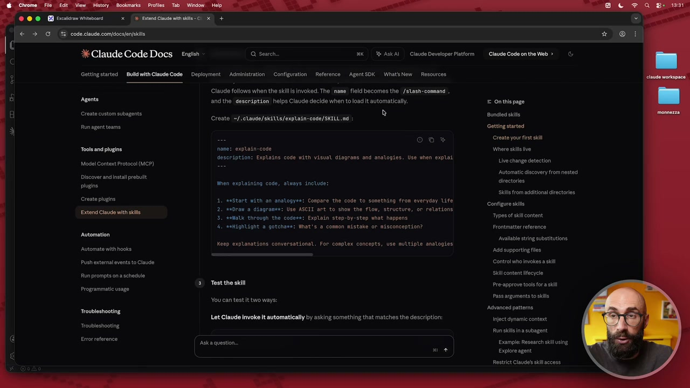

**Testo a schermo (OCR):** © © © EB eucaisimitaboara x R Extend Cda wie O + | € > @ codecisudecom[docsfen/skils S€Claude Code Docs Engl @ Search. XK 39 ASKAI | Claude Developer Platform Getting started Bulkdwith Claude Code Deployment | Administration Configuration | Reference | AgentSDK | WhatksNew Resource Claude follows when the skills invoked. The: nane fleld becomes the /stash- command Agente and the. description. helps Claude decide when to load It automatically = Onthispage Create custom subagenta è Bondi kia i cosi Create -/.claude/skills/explain-code/SKILL.md Runagent tesma Getting started = o Creato your first sli Tools and plugins none: explain-code Where sile ve description: Explains code with visual. diagri ve change detection Mo) ve change detect Automatic discovery fromnested Discover an Install prebul airectories nen explaining code, always include plugins Skls from adeltion lrectorles Create plugins saStart mith an analogyes: Conpare the code to something fron everyday Life ‘Draw a diagranea: Use ASCII art to show the flow, structure, or relations ER TVpes ol sk content. . safalk through the codes: Explain step-by-step what happens Configure ski seitighitight a gotchava: What's a conson nistake or misconception? Frontmatter reference atti Avallble string substitutione. Keep explanations conversational. For conplex concepts, use multiple anatogies Automate with hooks Add supporting files Pusiiexteralevents to Claude Control who invokes a skii Run rompts on a schedule Ski content Iecycle 3° Testtheskil Pre-approve tools fora sl Programmati usage Passarguments to kl You can testit two ways E Advanced patterns. Troubleshosting Let Claude invoke it automatically by asking something that matches the description: ‘nioci drei contri Troubleshooting Runskilc ina subagent Error reference ska question. Example: Research sil using Explore agent Restrit Clude sll access

> E poi sotto c'è il funzionamento e il funzionamento è scritto in linguaggio naturale, qua in inglese, ma vedremo che lo possiamo scrivere pure in italiano. Quindi fondamentalmente la skill è un file di testo, in inglese o in italiano, con dentro le istruzioni di quello che deve fare. È una roba di una semplicità devastante. Ma noi non la creiamo a mano, volendo lo possiamo fare, ma lo faremo tramite Cloud Code, vi faccio vedere come lo può fare direttamente Cloud Code. Ma ricordandoci che è un file di testo, volendo poi dopo la possiamo modificare a mano. Dove vanno queste skill? Possono essere in vari luoghi, ok? Si possono mettere in vari luoghi, anzi la documentazione qua lo fa vedere anche, dice fondamentalmente esistono tre luoghi dove le puoi installare, eccetera. Noi per semplicità ce le installeremo dentro il nostro workspace dove stiamo lavorando, in modo tale che se ce lo spostiamo, perché andiamo su un altro computer, no? Perché lo dobbiamo passare al team e così via, le skill vengono con noi. Questa è solo una cosa che per comodità faccio io, ok? Si possono installare dentro il workspace oppure a livello di sistema, ok?

## [00:02:00] Schermata 2 _(periodic)_

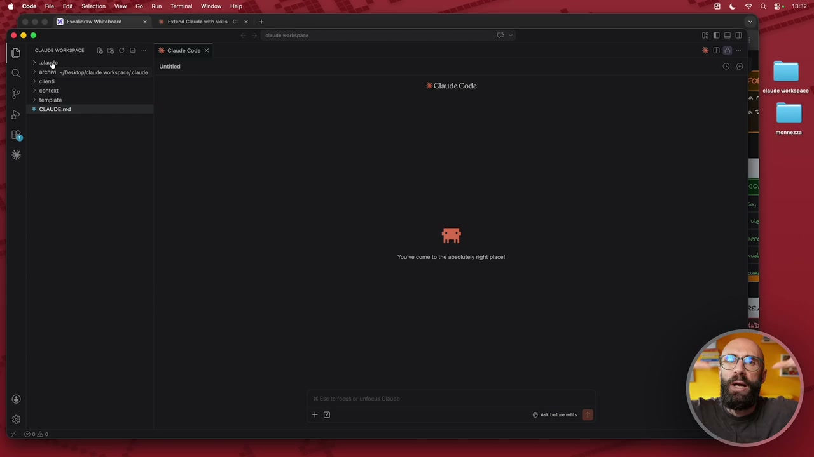

**Testo a schermo (OCR):** E Ercalirna Wisbonrd D00 cla gna ce womsnice | (è Ea C © de Clo Code x > ag ) archi Duskonciaud workpaca] cioe > chien Untied % Claude Code > tempiato % CIAUDEmd ouve coma to th absolutely ih pace!

> Però per comodità vi faccio vedere dentro il workspace. Quindi qua dentro, sotto diciamo la cartella .Cloud che è una cartella speciale, quando hai delle cartelle che iniziano col punto sono delle cartelle speciali, ok? Che usa Cloud Code. Come facciamo a creare una skill usando Cloud Code? Dobbiamo installare prima una skill speciale. Cioè c'è bisogno di una skill che ci fa creare le skill, ma questa è ufficiale di Cloud Code. Andiamo qua nel menu, quello diciamo slash, andiamo nella voce plugins. I plugin sono, li potremmo chiamare come dei pacchetti di skill, ok? È un po' più complesso perché dentro contengono anche altra roba, ma immaginate come dei pacchetti di skill. Quindi qua c'è una lista enorme di cose che possiamo installare gratis di Cloud Code. E qua cerchiamo skill creator. Ops, scusatemi. Perdonatemi, ho chiuso per sbaglio la schermata. Eccola qua. Noi mettiamo la skill che si chiama skill creator.

## [00:03:00] Schermata 3 _(periodic)_

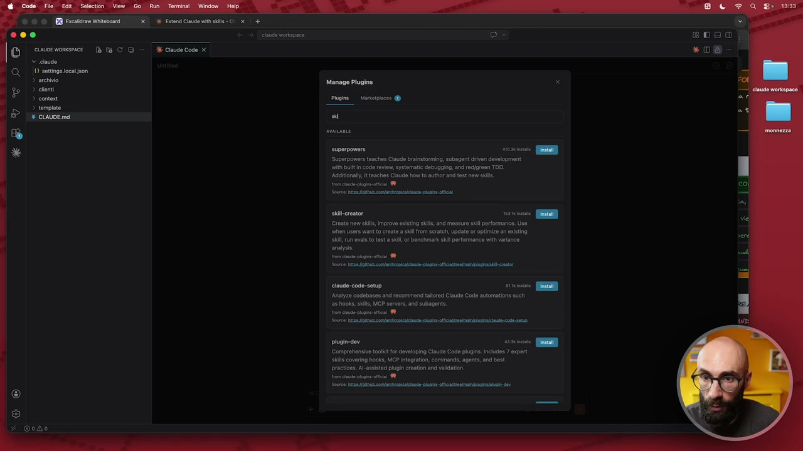

**Testo a schermo (OCR):** (0 settings scaljson > archivio > cileni > template è ciAUDEmd + cita voice suporponere svi Superpowers tasche Cie brainstorming, suiagent rive development it uit n odo resin, systamatie debugging, and redigraen TOO. dio f taehis Cau how 0 author and ost wi si e ne pica ailcretor 60 eat si, improve existing kl, and mensu skll poformanca. Use ‘in sere want to croste a kl rom scratch, uplto o aptimize an visting 6, ru val 0 test a 3, o benchmark performance mt variance anabae E] gooce Rca tua cortei i cirie cltude-code-setup " Anabyia codebases and recommend tlored Claude Code automation sui ‘as hooks, kl, MCP servers, and subagonts. inse pigri, sore Masa comit sie acne plugin dev dazi Compraensie toi fr developing Claude Co plugin. incius 7 expert as conering hook, MCP intogratin, commands, agata, and best pratico». Al-assstd pigin creation and vali.

> Eccola qua. Che dice questa skill ti permette di creare skill, migliorarle, eccetera eccetera. Facciamo installa. Dice oh, sei sicuro? Ti fidi? Stai installando una cosa? Chi è il creatore di questa skill? Ovviamente questa è una skill ufficiale di Antropic, quindi siamo tranquilli. Però siccome le skill si trovano pure gratis in rete, io ve ne lascio qualcuna anche mia dopo da poter scaricare. Ma le trovate gratis in rete, no? Che la gente le regala, ci sono questi pacchetti con centinaia di skill gratuite. Attenzione quando installate la roba di terze parti perché potrebbe contenere del codice pericoloso. Quindi qua dice dove la vogliamo mettere? La vogliamo mettere in tutti i progetti, vedete? Quindi locally. Noi mettiamola localmente. La vogliamo specifica che si crei qua dentro, ok? Quindi facciamo locally e mi dice devi riavviare Cloud Code per farla funzionare. Faccio restart e posso semplicemente, vedete, aprirmi una nuova istanza e chiudere questa istanza qua. Cloud in questo momento è in grado di creare delle skill.

## [00:04:00] Schermata 4 _(periodic)_

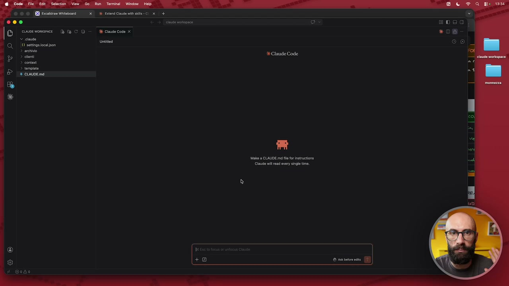

**Testo a schermo (OCR):** (6) 6? ? do) * < claude (0 settings socaljeon > archivio > centi > tempito % CIAVDEMd E Clause code x Untited + % Claude Code Make CLAUDE ml fo instructions Cla wi red every single time.

> Io gli posso chiedere questa cosa qua. Quali skill hai installato al momento? Ce ne saranno, diciamo, alcune di sistema, ok? Che sono sempre presenti dentro Cloud. E poi mi dirà sicuramente che c'è la skill creator. Eccola qua. Vedete quindi queste qua sono skill di sistema che sono dentro di default. A noi non ci interessano adesso ma adesso c'è questa skill creator che è quella che ci permette di creare delle skill. Allora proviamo a creare la nostra prima skill. Facciamo una cosa molto semplice. Diciamo che vogliamo questo comando che noi lanciamo per esempio tutte le mattine che mi deve dare le ultime news sull'intelligenza artificiale. Ok, partiamo con una cosa poco banalissima. Proviamo a migliorarla. Allora, creami una semplice skill che mi fa una ricerca e mi dà le ultime news sull'intelligenza artificiale. La skill si deve chiamare news-ai.

## [00:05:00] Schermata 5 _(periodic)_

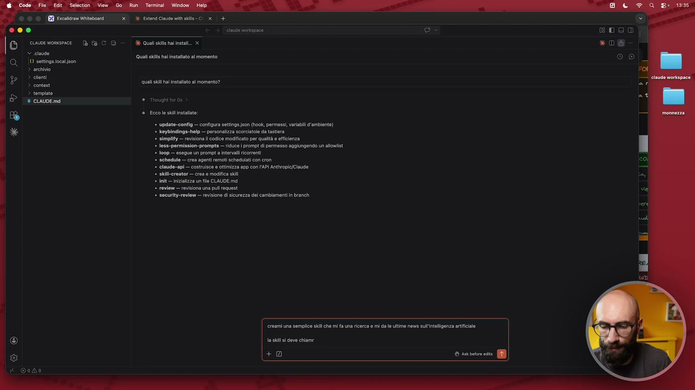

**Testo a schermo (OCR):** 3 Quali ste na ita. x Quali its ha installato al momento (0 setta socaljeon > arenivio > clnti > template % CALDE md ©. Thought for ua sh a istat al momento? » Ecco le sl instalte: * update-config — configura settings json (nok, permessi, vrab d'ambiente) * Koybindings-hep — personalizza scorciatle da tastiera * simplify— revision lì codice modificato per quaità e eficienza * less-permission-prompts — riduce | prompt di permesso aggiungendo un ali * Hoop — esegue un prompt a intervalli icorrenti * schedule — craa agenti remoti sehadulti con cron * elaude-api— costisce è ottimizza app con l'API Antivpie/Ciaude * akii-crentor— crea e modifica skill It — Inizilzza un le CLAUDE mi * review — cevisiona una pu reques * secuity-review — ovsione di sicurezza del cambiamenti branch crtami una semplice sil che mi fa una ricerca e mì da e utime news ull'inelignza artificiale 1a sl lieve chie

> Qua ci mettete quello che volete voi. Creala in locale dentro questo workspace. Questo glielo dico per sicurezza perché altrimenti va a fine che lui diciamo me la crea a livello di sistema. Invece la voglio qua dentro così la possiamo anche vedere insieme. Poi gli dico pure se non trovi la cartella skills dentro .Cloud creala tu. La potremmo creare in un attimo al mano. Però diciamo lo faccio per semplicità. Questa prima versione è molto semplice. Mi serve solo la skill senza i test o le valutazioni. Ok, qua andiamo un po' più veloce. Gli dico vai modifica automaticamente. Allora perché io ho messo pure quella cosa finale? Siccome ricordatevi questo è uno strumento che nasce per il codice. A volte il tool di creazione delle skill si mette e fa un lavoro incredibile.

## [00:06:00] Schermata 6 _(periodic)_

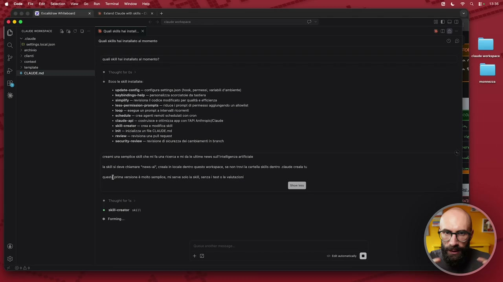

**Testo a schermo (OCR):** S claudo (0 setingaJocaljson > arenivio > centi > template % CALDE + de Quali site na ita. x Quali its ha installato al momento ati st ha istalto al momento? » Ecco le slitte: * update-config — configura settings json (ok, permessi, varab 'ambiente) * Kaybindings-help — personalizza scorcitle da tastiera * almpliy — revision i codice modificato per quà a eficenza * less-permission- prompts — riduce | prompt di permesso aggiungendo un list * 1oop — esegue un prompt 3 intervalli iorrenti * schedule — ras agenti remoti sehadulti con cron * elaude-api— costisce e ttiiza app con API Antivpie/Ciaude * skii-crento — rese modifica ski "il — inizia un file CIAUDE md * review — revisiona un pu reques * secuity-review — ovsione di icuezza del cambiamenti branch ertami una semplice sil che mi fa una ricerca mid e ultime new ullinelignza artificiale 1a ail sì deve chiamare “nows-a creaa n locale dentro questo workspace, so non tia cartalla sis dentro claudio crea tu questa versione è moto semplice, mi serve slo la I, senza est stazioni è skicerentor suit # Forino

> Dopo aver creato la skill mi fa anche i test. Aspettate che qua gli diamo l'autorizzazione a creare la cartella. Quindi crea anche dei test. Cioè lui vi crea la skill e poi si mette anche a testarla. Però siccome questa è una skill molto semplice a noi non serve questa cosa. Perciò io ho detto questa roba qua. Mi serve solo la skill senza i test e le valutazioni. A volte aiuta. Altrimenti si mette lì e si mette a fare 200 file. Si mette a fare le ricerche da solo per vedere se trovi i risultati giusti eccetera eccetera. Invece avete visto ci abbiamo messo 10 secondi. Allora si è creata la cartellina skill e qua dentro abbiamo la cartella news.Ai. Nella cartella news.Ai abbiamo il file skill.Md. Apriamo questo file skill.Md perché questa è la nostra prima skill. Ci abbiamo messo 10 secondi. Le skill iniziano tutte quante così. Con questo blocco. Quindi tre trattini. E' chiuso da tre trattini.

## [00:07:00] Schermata 7 _(periodic)_

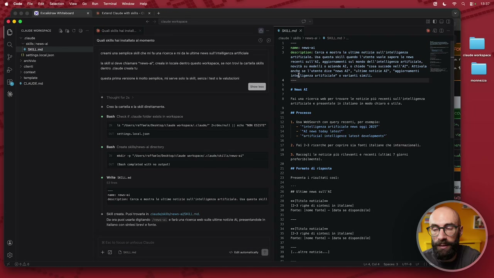

**Testo a schermo (OCR):** EI Escair tabonrd + 000 cuoeronene 66 CD 6 qualsiasi > claude > all nov + Kina (0 settings ocatjcon > archivio > enti > template + ciauDEmd Quali sis ha installato al momento creami una semplice SK che mi fa una ricerca e mid e utime news sul'inelgnza artificiale a sal sl deve chiamare “news-al creaa in Jocale dentro questo wrkspace, se non toi la cartello sis entro claude creata tu questa prima versione è molto semplice, mi serve solo a Sl, senza test valutazioni root cartella kl rettamente Basti Check cinude fd st in orkspace cauta vorispace/ sele) 2/ Sei] || 00 "NO ESISTE settinga. 0a. json Bash Crete sitnemii dectony mie /Users/rtaela/Desktop/ cla vorbepace/ claute/ skills /nesa!* (tas completed with no output) Write tion description: Cerca e mostra le ultime notizie sull'intelligenza artificiale, Usa questa suit ‘Sl reta. Puo trovra in claud/sl/nems-aSKLL mo. De ora puo usata digitando /nic-ai e far una ricerca web sull ultime notizie A, presentano in tano con sintesi beve fonte. + stalla x luo) sd > pesi > & SL md > 1 2 3 none: nevinsi description: Cerca e nostra le ultime notizie sull'intetligenza artificiale, Usa questa SkIUL quando l'utente vuole sapere le pes recenti SULL'AL, aggiornamenti sul mondo dell'intelligenza artificia novità su modelli o aziende AT, o chiede “cosa succede nell'AI'. Attivata anche se l'utente dice "news AI", "ultime notizie Al", "aggiornamenti intel igenza artificiale” 0 varianti sintli. e ren dt Fai una ricerca ueb per trovare le notizie più recenti sull'intelligenza artificiale e presentale in italiano in modo chiaro e utile, n0 processo 1. Usa WebSearch con query recenti, per esempio: — ‘intelligenza artificiale nevs oggi 2025*" 2 seAt ness tosay latest" — SVAFEIFICIOI intellpence latest developmente* 2. Fal 2-3 ricerche per coprire sia fonti italiane che internazionali. 3. Raccogli le notizie più rilevanti e recenti (ultimi 7 giorni preferibilmente) n0 Formato di risposta Presento 1 risuttoti così: 20 Uttine news sUTUAT metritoto notizialee 2-3 righe gi sintesi in itattano) Fonte: [nose fonte] — [data se disponibile) mefritoto notizialee 2-3 righe di sintesi in itattano) Fonte: (none fonte] — [Soto se disponibile] Trccattre notizie...1

> Sembra uno scioglilingua. Tre trattini. Come 33 trentini. Nome. Quindi name. Due punti news e a. Questo non è banale perché questo è il comando che noi useremo per lanciarlo diciamo da qua. Da dentro la chat. La descrizione. Quindi proprio la descrizione vi ho detto è fondamentale perché la userà Cloud Code per capire quando far partire questa skill. Dice. Cerca e mostra le ultime notizie sull'intelligenza artificiale. Usa questa skill quando l'utente vuole sapere le news recenti sull'IA. Aggiornamenti sul mondo dell'intelligenza artificiale. Novità su modelli e aziende. E o chiede cose. Cosa succede nella I? Attivala anche se l'utente dice news e ai. Oppure ultime notizie e ai. Oppure aggiornamenti a intelligenza artificiale. Cioè significa. Che io non solo posso chiamare questa skill. Nella chat. Scrivendo slash news e ai. Ma se io in una frase. Scrivo. Dammi le novità sull'intelligenza artificiale. Siccome. In questa descrizione. C'è scritto. Lui capisce. Che quella cosa.

## [00:08:00] Schermata 8 _(periodic)_

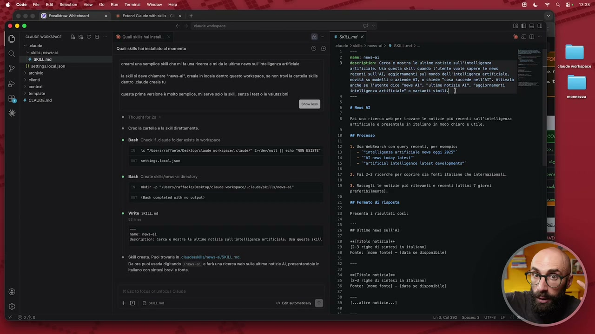

**Testo a schermo (OCR):** < claude gle news + SKitimd (0 settigs.ocatjson > ln > template + cLAWDEI © x Qofo + 3 Cai so na ita Quali sis ha installato al momento creami una semplice sl che mi fa una ricerca © mid e time news sulenza artificiale a sil i deve chiamare “news-a ceaa in locale dentro questo wrkspace, so non toi a carta ski entro claude creata tu ‘questa prima versione è molto semplice, mi serve solo a sl, senza | test valutazioni Creo ta carte ol kl rttamente Bash Check cinudefoide st in orkspace 18 Users /rtfeete/Desktog/claase vorkspnce/ clause/* 2/dev mlt || cho "NO ESISTE settige. 0. json Bash Crono sitzenni diectony mite = Mbsers/rffaele/Desktop/ cla vorkapre/ claute/ skills /nea!® (tas complete with no tout) Write Stino description: Cerca e mostra le ultime potizie sull'inelLipenza artificiale, Usa questa siti Sl creata. Puo trovara i clade/sli/news-a/SKILL me. De ora puo usata digitando /nis-a! 0 far una ricerca web sull ite nz A, presentano in tano con sintesi beve fonte. EDO *20 lugo) sile > pesi > & SL md > none: nevi-si description: Cerca e mostra le ultime notizie sull'intettigenza artificiate. Usa questa shiUL quando l'utente vuole sapere le ness recenti SULL AL, aggiornamenti sul mondo dell intelligenza artificiale, novità su modelli o aziende AT, o chiede “cosa succede nell'Ar'. Attivata anche se l'utente dice "news AÎS, "ultime notizie Al", "aggiornamenti intelligenza artificiale” o varianti sinii.] DINI Fai una ricerca veb per trovare le notizie più recenti sull'intellipenza artificiale e presentale in italiano in modo chiaro e utile, n0 processo 1. Usa WebSearch con query recenti, per esempio: — ‘intelligenza artificiale nevs oggi 2025" 2 svAt ness tosay latest" — ‘Vartificial intelligence latest developnente* 2. Fal 2-3 ricerche per coprire sia fonti italiane che internazionali. 3. Raccogli le notizie più rilevanti è recenti (ultimi 7 gior preferibitnente) n0 tornato di risposta Presenta i risultati così: 20 Utine news sottiAT metritoto notizialee 2-3 righe di sintesi in italiano) ronte: [nose fonte] — [data se disponibile) mefritoto notizialee Î2-3 righe di sintesi in itettano! rante: [nose fonte] — [date se dispontbite) Tccattre notizie...1

> La deve fare questa skill specifica. Sta roba è di una potenza devastante. Avete capito cosa vi ho detto? Ora immaginate questo. Sto facendo news e ai. Ma se voi vi occupate di. Non lo so. Di formula 1. Gli dite. Le ultime news sulla formula 1. E potete creare una skill. Che c'ha dei comandi diversi. Per esempio. Dammi le news. Politica. Ma le voglio solo politica internazionale. Solo politica italiana. Solo politica europea. Le voglio solo dell'ultima settimana. Solo dell'ultimo giorno. E così via. Vi occupate di finanza. Stessa cosa. Quello che è successo di importanti. Oggi. In borsa. E così via. Cioè ve le potete stendere come volete. E qua sotto. C'è il funzionamento. Cioè mi dice. Fai una ricerca web. Per trovare le notizie più recenti. Sull'intelligenza artificiale. Presenta le. In italiano. In modo chiare e utile. Usa web search. E fai queste query. Per esempio. Per esempio. Intelligenza artificiale. Oggi. 2025. Vedete. Questo è un errore. No. Io lo tolgo. Questo qua.

## [00:09:00] Schermata 9 _(periodic)_

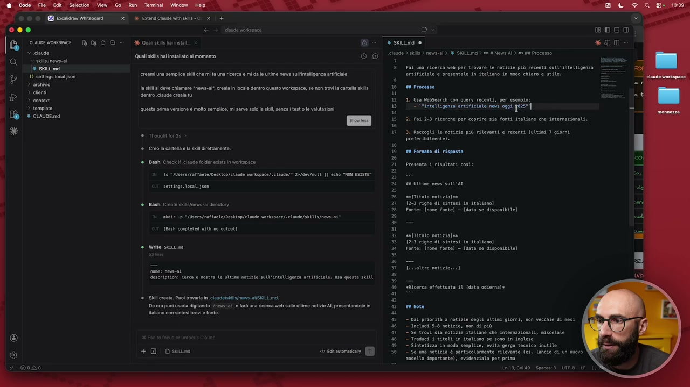

**Testo a schermo (OCR):** > template + CLAUDEmÀ + ca voga 3 cai so na it Quali ks hai instaato al momento creami una semplice sil che mi fa una ricerca e mid e utime news sul'inelignza article a sl sl deve chiamare “news-a' ceaa in localo dentro questo wrkspace, so non tv] a carta kl entro claude creata tu questa prima versione è molto semplice, mi serve olo a Sl, senza | test valutazioni Creo la cartella sk rttamente. Basti Check cinude fido st in morkspace 18 MSers/rffaete/Desktog/clause vorkspnce/ cluute/* 2/dev mlt || echo "NO ESISTE settige. 0 json Bash Crete stem directory mite = /0sers/rafaete/Desktop/claute vorkopoe/ claute/skiUs/nea!* (bash conpintes with no tp) Writo Stttond a e vitine notizie sull'intelligenza Sl reata. Puo trovarla i ciao/sil/news-a/SKILL me. 0a ora puo usata digtando /ness-a! © far na ricerca web sulle itime notizie A, presentano in tano con sintesi bre e fonte E + skiLma ud > a > nea > 8 SKILL md > nc New Al > = 9 Processo © Fai una ricerca ved per trovare le notizie più recenti sull'intelligenza artificiale e presentate in Staiano in nodo chiaro e utile. 9 10 #6 Processo 12.1, Us vebSeareh con query recenti, per esenpio: 13 || — ‘*intettigenza artificiote ness oggi 025" 38° 2, Fab 2-3 ricerche per coprire sia fonti italiane che internazionali. 173. Raccogli le notizie più rilevanti & recenti (ultimi 7 giorni preferibitnente) 39° #0 Formato di risposta 21° Presento 1 risultati così: 2A 90 Ultime neve soML'AL 26. seltitoto notiziale» 27. 2-3 righe di sintesi in italiano! 28° Fonte: [none fonte] — [data se disponibile) 32 seftitolo notiziale» 33. 2-3 righe di sintesi in italiano] BA Fonte [none fonte] — [data se disponibile) do saicerea effettuata Il (data odiernale CISS - Dal priorità a notizie degli ultini giorni, non vecchie di mesi " mnelgi 5-0 notizie, non di più = se trovi sia notizie italiano che internazioneli, niscetate " iraguci £ titoli in Italiano se sono in inglese — Sintetizza in nodo semplice, evita gergo tecnico inutile 7 se una notizia è particolarmente rilevante (es. lancio di un nuovo modello Iaportante), evidenziola per prima in ia. Colep Spose. UTRE

> Quindi non è. Intelligenza artificiale. News. 2025. Ma scrivo. Intelligenza artificiale. News. Anzi. Facciamo così. Novità. Fai due. Tre ricerche. Per coprire. Sia fonti italiane. Che internazionali. Raccoglie notizie più rilevanti. E recenti. Ultimi sette giorni. Preferibilmente. Formato di risposta. Poi. Titolo della notizia. Due. Tre righe di sintesi in italiano. E la fonte. Eccetera. Eccetera. Poi. Note. Dai priorità a notizie degli ultimi giorni. Non vecchie di mesi. Includi cinque. Otto notizie. Non di più. Se trovi sia notizie in italiano. Che internazionali. Miscela le. Traduce in italiano. Se solo in inglese. Sintetizza in modo semplice. Se la notizia è particolarmente rilevante. Evidenziala per prima. Se a noi ci piace. Salviamo. E noi abbiamo la nostra prima skill. Questa skill. Quando faccio il comando slash. Adesso. Qua. Non mi compare. Perché devo riavviare cloud code. Vedete qua. Quando faccio slash. Posso chiamare le skill. Adesso. Se io. Mi apro una nuova chat.

## [00:10:00] Schermata 10 _(periodic)_

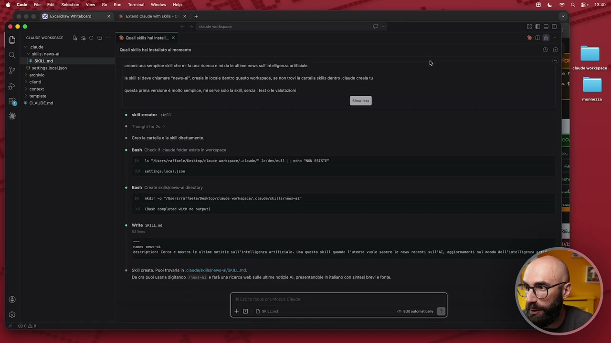

**Testo a schermo (OCR):** EI Ercalra iabonrd + D00 cine gare cioe womsnce | (è Pa 3 quali sto ha istat. x > laude è sqm (0 settigs.ocatison > archivio > cllenti 3 cone ne ni > tei de EE akioreator suit Quali tha installato al momento creami una semplice sil che mi fa una ricerca e mid e time news sul'inelignza artificiale 1a sil si deve chiamare “news-a creaa i Jcale dentro questo workspace, se non ti la cartella sklls dentro. cloud creo tu Creo ta carte 01 i rettamente. nni Check ciau folder set workapace 18 “MUsara/ratfete/Desktop/clause voriopac/ claute/* 2/dee/mll || cero "NO ESISTE Bandi Greta sl a dici ne MUsars/rafste/Desktop/clause vorkspae/ claite/skits/neo0* (hash complete with no tt) rito SciLion scriptHon: Cerca e mostra le ultine notizie sull'intelligenza artificiale. Usa questa shiUI quando l'utente vuole sapere le news recenti SuLL'AT, aggiornamenti sul mondo dell'intet genza Skilireaa. Puo trovarla i cia) sil /news-a/SKILL mò. Da ora puo usai digitando /iess-èL e fard una ricerca web sulle ultimo notizie A, presentano i iano con siti brevi font ®© 8 +0 Omm Tana

> Di cloud code. Perché in questa. Diciamo. Va riavviato. Quindi. Chiudiamo questa qui. In una nuova chat. Faccio slash. E scrivo news. E hai. Eccola qua. Abbiamo la skill news e hai. Quindi in qualsiasi momento. Apro cloud. Scrivo news e hai. Do semplicemente invio. Capisce. Che questa è una skill. Perché si chiamano così le skill. Facendo. Slash. E il nome della skill. Sta facendo partire. La. La. La skill. Quindi la skill. Cosa deve fare. La ricerca. Vedete. Ricordatevi proprio il processo. Che abbiamo descritto. Fai la ricerca. Raccogli le notizie più rilevanti. Degli ultimi sette giorni. Formattali in questo modo. Quindi mettimi. Ultime news. Poi titolo notizia. Riassunto fonte. Titolo notizia. Riassunto fonte. E così via. Ora. Noi quello che ci aspettiamo. Sta già succedendo. Senza che ve lo descrivo. Perché adesso lo vedete. Ovviamente nel momento in cui sto registrando. E poi magari voi quando le vedete queste news sono superate. Però diciamo. Il senso è esattamente questo. Noi abbiamo ufficialmente fatto la nostra prima skill.

## [00:11:00] Schermata 11 _(periodic)_

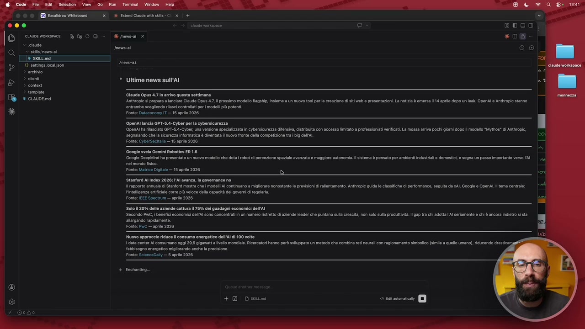

**Testo a schermo (OCR):** @ cuorromnee V laude è SKtL md (0 settings ocatjson > elenti > template Bò + ciuvoemd * È * Ultime news sull'AI laude Opus 47 in arrivo questa settimana Antivoie si prepara a lanciare Claude Opus 47 prossimo modello lagshp, insieme a Un nuovo tol pr la creazione di st eb e presentazioni. La ntza è emersa 14 apre dopo un ek. OpanA o Anthopi stanno ‘ntrambe sceglenco rilasci controllati per! modeli più potenti Fonte: Oataconom IT 5 apre 2026 pena lancia OPT-5.4-Cyber per la cybersicurezza Opendi ha riascito GPT-54-Cyber, na versione speciazata in cybersicurezza difensiva, distribuita con acceso limitato professionisti verificati. La mossa aria pochi giorni dopo modello "ithos* i Anto, ‘segnalando chel sicurezza informatica è diventata nuovo fonte della compettzione ts bg ell’ Fonte: CyberSecitaia = 1 apr 2028 Google svela Gemini Robotics ER 1.6 Google Deepwind ha presentato un nuovo modello che dta robot di percezione spaziale avanzata e maggiore autonomia. sitema è pensato per ambienti industrie Somestic, 0 segna un passo imporianto verso FA Fonte: Matrice Digitale — 15 arl 2026 D Stanford Al index 2026: l'A avanza, la governance no Aitapporto ennio di Stanford mostra che i modeli A continuano a migliorare nonostanto le previsioni dl abetamento. Antvopie quia o classifiche di performance, seguita da xl, Googl a Operai tema centrale: P'tligenza article core più veloce dll capacità de govermi di regolari. Fonte: (EE Spectrum — apre 2026. Solo 20% delle aziende cattura ll 78% dei guadagni economici dell'A ‘Secondo PuC, | banii economici dell’ sono concentrati in un numero ristretto di aziende lexder che puntano sula crescita, non ol sula produttività. opta chi dott I srismente e ch ancora indietro si sta atargando rapidamente, Fonte: Pa — apre 2026 Nuovo approccio ridi consumo energetico dell'A i 100 vote data centr Al consumano oggi 2.6 gigavatt vello mondiale. Ricercatori hanno però sviluppato un metodo che combina reti neurali on ragionamento simbolo (sie a quell umano, riducano rasticara fabbisogno energetico migliorando anche a proisicne. Fonte: SclenceDady — 5 aprile 2028. Enchantin.

> Ci abbiamo messo dieci secondi. Avete l'idea in testa. La trasformate in una skill. La skill può essere complessa quanto volete voi. I più sbanettoni possono andare qua nella documentazione e possono vedere che le skill hanno i parametri. Per esempio. Le skill possono avere dei funzionamenti particolari. Possono essere vietate in alcuni casi. Utilizzate solo con un certo formato. Noi non entreremo in questo livello di dettaglio. Ma se qualcuno di voi è un po' più sbanettone. Poi quella roba veramente ve le fa personalizzare tantissimo. Ma diciamo che vogliamo migliorarle. Questa skill che abbiamo appena creato. Facciamogli qualche miglioria. Facciamo un secondo passaggio. Gli diciamo. Migliorami. La skill. E qua ci mettiamo il nome. Come si chiama? News. Facendo queste modifiche. E qua gli dico. Cerca solo fonti internazionali. Internazionali. Niente fonti italiane. Qua gli dico. Mostrami a schermo solo 3 news.

## [00:12:00] Schermata 12 _(periodic)_

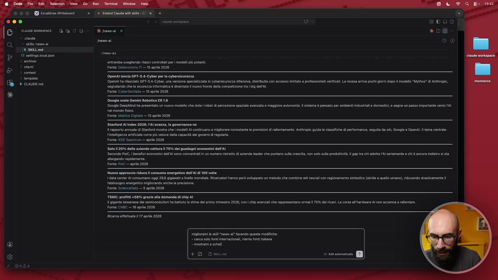

**Testo a schermo (OCR):** EB Encacia istobcri cioe vomsnce (a 9 CD Mi pnemsi x V claude + SqtLma (0 settingsiocatison > archivio entrambe scegiando rase controati pr | model più potenti > centi Fonte: Dataconomy IT 6 arie 2026 > template + CLAUDE Md ev VITESI pena lancia OPT-5.4-Cyber perla cyborsicurezza pena ha rascito GPT-54-Cybe, ua versione specitzata n cybersicuezzadieniva, distribuita con acceso limitato professionisti vrifati. La mossa aria pochi gen dopo modelo "Myhos* i nto, segnalando che la sicurezza Informatica è diventata l nuowo fonte dll competzone ta big ell’ Fonte: CyberSsetalia — 15 ep 2028 ‘Google svela Gemini Robotics ER 1.6. Google Deepiind ha presentato un nuovo modello che data robot i percezione spaziale avanza e maggiore autonomia. sistema è pensato pa ambienti incustriai e Some, segna un paso importante verso TA ‘nei mongo fisico. Fonte: Matrice Digitale — 15 arl 2026 Stanford Al index 2026; 'Al avanza, la governance no rapporto annual di Stanford mostra che | modali A coninano a migliorate nonostante lo previsioni di rabentamento Anthvpie quia lo ciasifich di performance, seguita da xl, Googl 0 Opel tema centrale: intligenza ariciale core pù veloce dll capacità de governi di regolari. Fonte (EE Spectrum — apre 2028, Solo 20% dll aziende cattura ll 75% di guadagni economici dell'A ‘Secondo PUC, | benlici economici el’ sono concentrati in un numero ristretto d aziende leader che puntano sula crescita, nn solo sula produttivi. gap tra hi adotta Al seriamente atargando rapidamente. Fonte: PC — pre 2028 Nuovo approccio riduce consumo energetico dell'A! di 00 volte ata centr AI consumano ogg 296 gigawatt Ivell mondiale. Ricercato hanno però sviluppato un metodo che combina rei neurali on ragionamento simbolico sile a quell umano, riducendo drasticamente ll fabbisogno energetico migliorando anche la precisione. Fonte: SclenceDaly — 5 apri 2026) ‘TSMC: profitti +58% grzi lla domanda di chip AI gigante taiwanese di semiconduttori ha battute timo del primo trimestre 2028, cn chip avanzati che rappresentano ormai 76% del ica. a corsa allardware AI non accenna a rallentare. Fonte: CBC — 16 apri 2026 Ricerca etetusa 17 pri 2026. giri la sl ‘news -a* facendo queste mogfich: — cara sol fon internazionali nente fot alano “mostrami a sche + Osa

> E poi cos'altro gli potrei dire? Il riassunto in italiano già ce l'ha fatto. La fonte già me l'ha messa. Quindi già mi piace come cosa. Vabbè lasciamogli questa qua. Solo fonti internazionali. Niente fonti internazionali. Mostrami a schermo solo 3 news. Vai. Diamogli invio. Adesso. Utilizzando sempre Cloud Code. Quindi non sono andato io manualmente nel file a fare le modifiche. Ho descritto. Quindi ho immaginato. Avevo in testa l'idea giusta. Ho immaginato quello che voglio. Glielo descrivo e lui lo fa. Adesso mi dice. Guarda. Sto per fare queste modifiche. Qua vi fa vedere anche come cambia il testo. Ok? Questa cosa che è molto interessante. Qua vi fa vedere anche come cambia il testo. Ok? Questa cosa che vedete un po' strana qua. Se non siete abituati. E' semplicemente che vi fa vedere la differenza tra prima e dopo. Ok? Lo diciamo. Gli diamo di sì. Quindi gli confermiamo che può fare questa modifica. Aspettiamo qualche secondo che finisca di scrivere. Qua vediamo la vecchia versione e la nuova versione. Ok? Infatti vedete la vecchia versione diceva.

## [00:13:00] Schermata 13 _(periodic)_

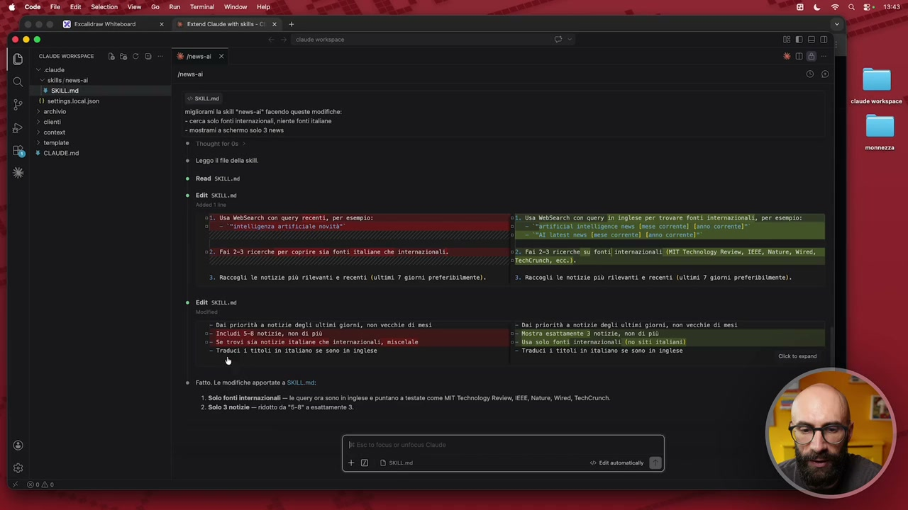

**Testo a schermo (OCR):** S ciaudo gle new + Sqttima (0 settima .ocatjson > archivio > clnti > template + cuAUDEmA © to] x Qodo + % Irons x nona girai asl ‘new facendo queste modifiche — cara sol fon intorazionl pento fot talane — mostrami schermo solo 3 new ® Logo ife dell si. è Feng Stio EEE EJ ein per: esempio? 08, Fa 25 ricerche per coprire sia font tane che internazionali. sa arch fi Aron ENO RICE MG PRI naccogi le notizie più ritevnti e recenti (uttini 7 gii preeribitente) 3. Rccogli e notizie più rilevanti è recenti (tini 7 gioni proferibitante). è Eat Sci dai priorità a notizie degli ultini giorni, non vecchie di sest — dai priorità a notizie degli ultini giorni, nen vecchie di nest ca notizie, non di più «fi notizie, non di più di: Internazionali; miscelato sd interazioni 7 indu tito in italiano se sono in lngtese È fradoei 1 titoti in Itatino se sono i ingese. % ‘Fato. Le modifiche apportate a SKILL 1 olo font internazionali — i query ra sono i Ingiese e puntano a testate come MT Technology Review EEE, Natur, Wired, TeehCrunch 2 Solo 3 notizie — ridoto da 5-8" a esattamente 3.

> Includi 5-8 notizie. Non di più. La nuova versione dice. Mostra esattamente 3 notizie. Non di più. La vecchia versione diceva. Se trovi sia notizie italiane che internazionali miscelale. La nuova dice. Usa solo fonti internazionali. No siti italiani. Ok? Quindi per esempio ce la riapriamo. E vediamo com'è cambiato. Tattattattattatà. Innanzitutto è cambiato che le ricerche me le fa in inglese. Vedete? Prima invece ce l'ha scritto in italiano. Poi ci ha messo mese corrente, anno corrente. Per renderlo ancora più attuale. Ha messo dentro le fonti, alcune fonti di esempio. Meet, Nature, Wild, TechCrunch, un po' di fonti importanti. Ah, potremmo fare questa modifica per esempio a mano. Potremmo dire raccogli le notizie più rilevanti e recenti. Ultimi 7 giorni. Diciamo no. Vogliamo ultimi 3 giorni. Le vogliamo super recenti. Ok? Salvo. E adesso mi riapre una nuova chat. In qualsiasi momento io posso chiamare la skill, facendo così, avete visto no? News-AI.

## [00:14:00] Schermata 14 _(periodic)_

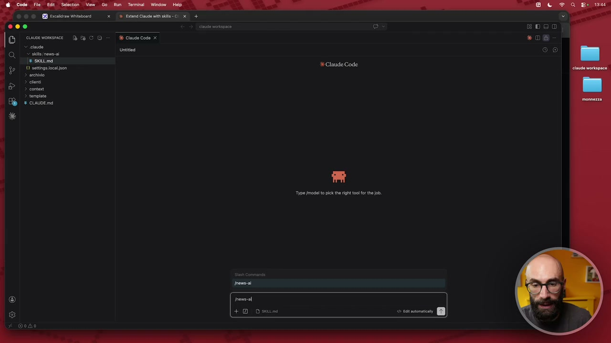

**Testo a schermo (OCR):** 000 O susevonme V claude [news è SKttma fo U'setngasoaison > enti > contea molto B$ + cuuvemd x 4 Claude Code Type model to pick the right olor the ob Inevsal + Ogm

> Ma vi ricordate che io posso semplicemente anche descrivere questa cosa? Quindi dammi le ultime news sull'IA. Ho descritto una cosa di cui ho bisogno, lui ha capito che questa cosa è un task associato a News-AI e ha fatto partire la skill. Ora immaginate questa skill per esempio con creami il preventivo. Io scrivo in chat creami il preventivo per l'azienda Toyota. Bam, invio. Lui ha capito già che deve andare a chiamare la skill creami il preventivo. Manda la mail di conferma al cliente Raffaele Gaito. Bam, lui trova la skill della mail di conferma e lo fa. E così via. Cioè capite la potenza di questa roba qua? Ecco qua, sono 3, sono solo su fondi internazionali, ha fatto le modifiche che volevamo noi. Proviamo a fare un'altra modifica ancora. No, la rendiamo ancora un pochino più complessa, poi mi fermo, ne creiamo un'altra da zero. Però voglio far vedere come la possiamo fare evolvere. No, migliora.

## [00:15:00] Schermata 15 _(periodic)_

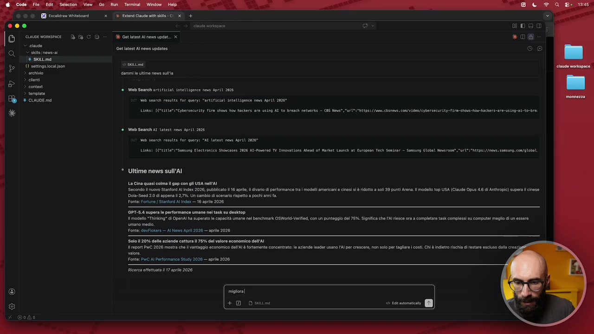

**Testo a schermo (OCR):** (6) < laude [news + Sqttma (0 settmgsocatjson > archivio > elenti > template + CLAVDEmd + E Gt test AI news upat. x Get tatast Al mews updates ri e lt e suli Wal Sesreh rtificiat intel Ligence neue Jprst 2026 ud sent resotta for queyi "artifici intelligence ne soril 2028" Lbnksi [(sElet2rOpersecuriby firm sha Dow Dackers are 0619 AL to Breschi neturis = CDS Mesa", "ui "httpa//nai china, con/vL6eo/bersecuity-fira-ohoa-hoc-Mackers-are-asinai-todre We Search AI Latest ns Aprit 2026 ud seed esatto for quer “AI latest ps Apri 2026% Links: [CViE1e" Sesia Electronics Shovases 2026 Al-Posereg TI Tmovations Ahead af Market Launch t Europea Tech Seminar — Samsung Global Messroca, "url": "https: //nees.sonsung. con/globai Ultime news sull'AI La Cina quasi colma gap con ll USA nel'Al ‘econo nuovo Stafor Al index 2026, pubblicato 16 apr divario di performance tra | modelli americani cinesi è ridotto ol 9 punti Arena l modelo top USA (Cada Opus 45 gi Antirope) super il cinese ‘Dola-Seed 20 di appena l 7%. Un cambio gi scenario rispetto a pochi an a. Fonte: Fortune / Stanford Al Inox — 16 april 2026 ‘OPT-8.4 supera performance umane ne task su desktop modello "Trnking* di Open ha superato e capacità umana nel benchmark OSrk-Veriad, con Un punteggio del T5. Significa che Al riesce ora completare task complessi su computer melo di un essre umano medi. Fonte devfiokers — Al News Aprl 2026 — ape 2028 Solo 20% delle aziende cattura Il 75% del valore economico dell'A Iirepor aC 2028 mostra chel vantaggio economico dell'A è fortemente concentrate aziende axder usano per crescere, non slo per agiar | cost. CN è nero ischia di estro escluso dala croazi alor. Fonte: PA Peiormance Study 2026 — aprile 2026 cerca affetta 117 apri 2028. migra + Ogm

> Facendo le seguenti modifiche. A sto giro ci mettiamo che voglio l'output. Non devi mostrarlo a schermo, ma salvarlo in un file che ha questo nome. Facciamo anno, mese, giorno. Cosa abbiamo qua? Archivio, clienti, context. Facciamo così, ci facciamo una cartella news. Metti l'output. Anzi facciamo così, la cartella news me la creo prima. Perchè così siamo sicuri che... Aspettate che la sposto fuori.

## [00:16:00] Schermata 16 _(periodic)_

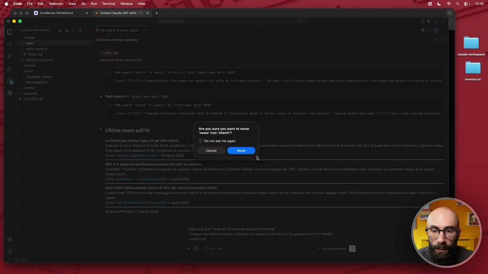

**Testo a schermo (OCR):** Ultime news si

> Non dentro clienti, perdonatemi. Ecco qua, quindi ho la cartella news. Metti l'output nella cartella news. Inizia a diventare interessante perchè ricordatevi che siccome Cloud lavora tutto in locale, più roba noi abbiamo nei file locali, meglio è. Non ha senso avere l'output nelle chat, perchè le perdiamo. Le chat non sono più importanti come lo erano quando venivamo da GPT, Gemini, Grok, da altri strumenti. Adesso è meglio avere i file e io mi posso salvare tutti i giorni le news che ci sono sulle AI. Immaginate dopo un anno, questi file possono diventare un archivio con il quale io poi lancio un altro comando e faccio un'altra roba. Quindi accumulare questa roba va a far crescere la nostra knowledge base. Questo è fondamentale, ricordate, stiamo lavorando sempre su questa roba di avere una knowledge base sempre più completa. Possono essere le news, ma possono essere andamenti di dati in borsa, se vi occupate di quello.

## [00:17:00] Schermata 17 _(periodic)_

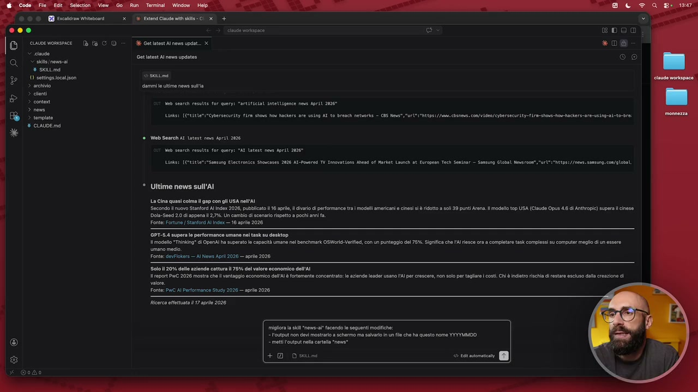

**Testo a schermo (OCR):** O) (0) # SKiLImo (0 settings .ocatjson lenti template CLAUDE ma + E Gt itest Al news upaat. x Get tatast Ales updatos armi e lt eve uti ue sese esatta for queryi "artificio intelipence nes sorit 2028" Links: [SEME POpersecoity Fira shoe how Rockers are 519 AL to bresch netorks = CIS News", turi": "https//nachsnea, con/viseocaersecuity-fira-inov-hnMacarstre Mel Search AT Latest osa Aprit 2826 ue send results for query "AL latest evo Apri 2026 Links: [(titte":"Samng Electronics Showcases 2026 l-Poversd TV Imovations Abesd of Market Launch at Europesn Tek Seminar — Santung Global Moaroon,"url* Ultime news sull'AI La Cina quasi colma il gap con gli USA nell'Al ‘econo uovo Stanford AI Index 2026, pubbleatol 6 spl, varo di performance tra | modelli americani cinesi sl ridotto ol 39 punti ren modello top USA (Cud Opus 4 i Anthope) super cinese [Doia-Seed 20 di appena 17%. Un cambio dl scenario rispetto a poch nn fa. Fonte Fortune / Stato Al Inca — 16 aprile 2026 ‘OPT-S.4 supera i performance umano ne task su desktop modello "Trnking* i Open ha superato e capacità umane nel benchmark OSWerk-Veried, con un punteggio del 75%. Sinica chel riesce ora completare task complessi su computer meglio di un essre umano medio. Fonte: dvflokrs — I News Api 2026 — aprle 2028 Solo 20% delle aziende cattura | 75% del valore economico dll’ Uiroport PC 2028 mostra chel vantaggio economico dell'A è fortemente concentrato: le aziende leader usano A er crescera, non sl pa age cost. hè Indietro rischia i estro escluso dala creazione di salore. Fonte: PC Al Performance Study 2026 — pre 2026 Ricerca etetuta 17 apri 2026. gira a sl ‘new -a* facenco e seguenti motfch: — output non ded mostra schermo ma savrio in un le che ha questo nome Y\YYYMMDD mea loutpur nel carte ‘ns +9 Denim VEST

> Possono essere, non lo so, io per esempio ho tutte le trascrizioni delle interviste che faccio nel podcast. Voi potreste avere le trascrizioni degli incontri che fate con i vostri clienti. No, quello che volete voi, però accumuliamo questi dati perchè poi dopo li possiamo riutilizzare per fare altro. Quindi gli dicevo, l'output non deve mostrare la scherma, salvarlo in un file con questo nome, metti l'output nella cartella news e basta. Facciamogli quest'ultima modifica qua. Ovviamente qua ci possiamo tenere sempre skill md aperto, ma ci dice me la leggo un attimo, adesso ci proporrà ovviamente a schermo le differenze. Quando lui va a modificare un file ci mostra sempre le differenze, ci dice ok questa era la vecchia, ecco come andrò a modificarla. In modo tale che voi capite se Cloud Code sta facendo qualche cazzata e dovete fermarlo in tempo. Per esempio qua vedete aggiunto adesso una nuova parte, formato di risposta, mettilo nei file, nella cartella news e così via.

## [00:18:00] Schermata 18 _(periodic)_

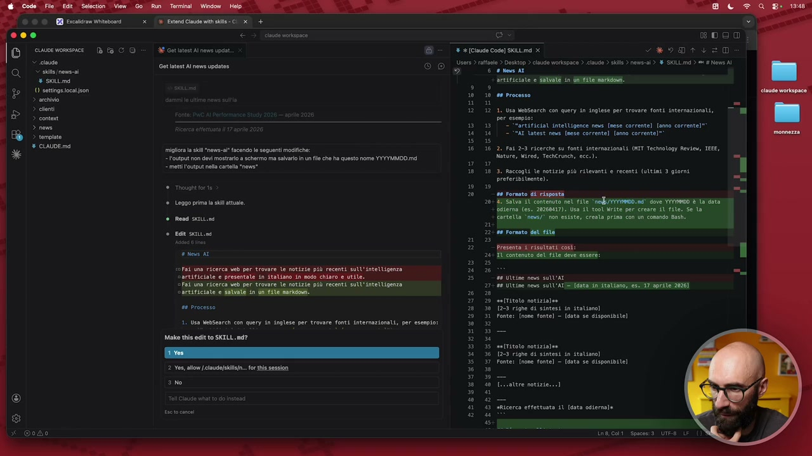

**Testo a schermo (OCR):** © © © EB Fcaldiam Witt x (Exte Claude mihi C x + 000 perno G Cei) eve womsnice (a fa DE Ge test Ines ups. # & [Claude Code] SKILL md x <*90r620 ile User fai Destioo claude ope ciau sii > nem 8 SK md i # em Al > gldlis/nows-ai Sal si ala) 9 69 News AL è stiLmd artificio e RANE in ILA 0 seta scan 16 se proce cio È cher . 3 1. Uso bebserch con query in inglese per trovar. fonti interazioni, | Tim conto per esente ce - ; sa aa DTEdFAffcir sntrtioenco pos (mese corrente amo correntel* =. HET SH vet n te corno Tao corrente CALDE iO 2. Fal 20 ricerche g fonti internazio. (TT Tcholopy favi, 168, stro, Wired, ecirne, ecc): - metti l'output nella cartella "news" LI 18 3. Raccogli le notizie più ilevnti e recenti (tini 3 giorni preferibieto). e Travo » ® Leggo prima asl tti. è Rena Stima e E GILL Fa una ricerca eb per troare le notizie più recenti sutl'intelligenz rtiticite © p i - ne time no salt “Pak un ricerca ue er trovare le notizie più recente su intetgenza 28 Uttine evo SuLl'ALTE ESA III] rescue e salle {n saftitoto otiziale 12-3 righe di sintesi in italiano! Fonte: [nose fonte] — [data se disponibile) 1. Usa Webisareh con query {n inglese per trovare fonti Internazionali, per esempi Mak th ect o SKILL. ce ttioto notizie» Fonte! hne fonte) = [dna se disponibil 2 fallo lan. orti in ano tere notizie... egicerca effettuato LU [ta ogiernale LO BC Spocenis_ UTO U

> Eccetera eccetera. Dopo aver salvato il file comunica all'utente solo il percorso del file, perfetto. Direi che ci piace. Gli diamo invio e aspettiamo che faccia questa modifica, quindi che semplicemente riscriva il file skill md. Mi dice perfetto, la skill md è aggiornata, ora salva l'input, possiamo fare subito una prova, lanciamola. News AI, adesso l'ho lanciata col comando ma io potrei pure scrivere dammi le ultime novità. Novità intelligenza artificiale, perché avete capito che lui la richiama in vari modi in base a come tu l'hai descritta nel file skill md. Siccome qua abbiamo detto che deve chiamarla anche quando vede queste cose in chat, questi sono una sorta di trigger. Sono le parole che lui va a tenere sotto controllo e dice ah se Raffaele ha usato queste parole allora voleva che io chiamassi questa skill. Questa è la cartella news che stiamo creando, me la apro perché a breve dovremmo vedere qua dentro il primo file che va a creare.

## [00:19:00] Schermata 19 _(periodic)_

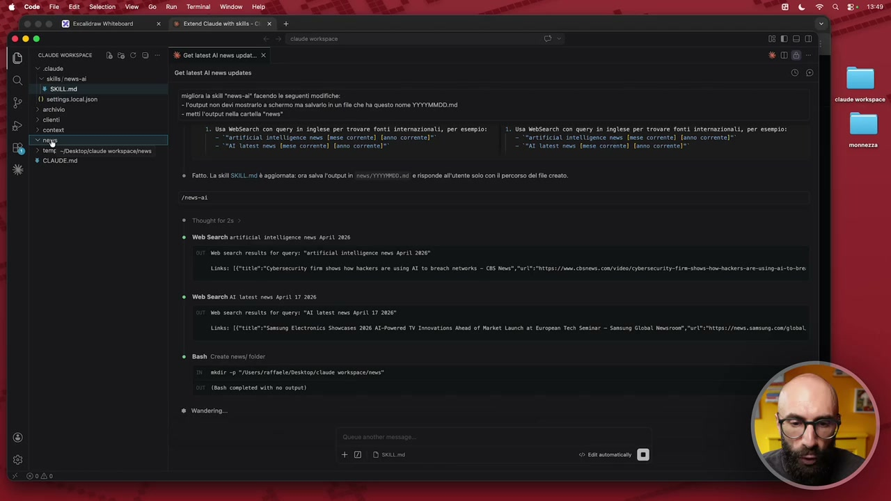

**Testo a schermo (OCR):** EB Encacia Wstebcrd + O suorvomme © t 36 Go iatost Al news updat.. x > laude QQ sissi + qttima fol etigsscaicon > elnti 2 > contea Usa Websearch con query in inglese per trovare fonti intemazionali, per esenpio: | 1. Uca WebSearch con query in inglese per trovare fonti internazionali, per esempio: wi — ‘fartificial intelligence nes [nese corrente). [anna corrente] — tvartsficiat intelligence news [nese corrente). [anno corrente) es - AI Latest neve [nese corrente] [anno correntel*” 2 AI tatest nov [eese corrente) [anno correntel* tam Design morispaco/nee + CIAUDE md Get itast Almows updates migra a sl ‘newa-l" facendo le seguenti motfiche: l'output on dev mostri schermo ma salvro in n le che ha questo nome YYYYMMDD.md me loutpur nel carta “news” ‘Fato La sk ILL mo è ogglomate: ra salva l'output in 1/YNIPOO.A e risponde all'utente solo con l percorso del rest. tresca Mel Search artifici intetLigence nico gprit 2026 net perch esulta fr quei "artificial intelligence neve 4prit 2028" Ltaksr [tit let" Opersecurity firm show how Bockrs are uzig AT to bresch petvrko = CIS Newturi*:"http//um china, con/video/epbersecuritytra-stomi-bov-chera-ae-astno Web Search I latest news Agrit 17 226 net sere resotta for query “AI latest nos Mori 17 2028 Links: [EMAE1e Sosia Eleetronics Shoucases 2026 Al-posreg TV Imevotione Abend af Mrket Launch at Luropesa Th Seminar — Samsung Globo Mesa rom, "url": "ntt9s://nec.snnungcon/obal Gant Crete na folder utt = “/0sers/raffaete/Destop/claue vorkspace/noo* Wanderina: + Osdiumi

> Gli abbiamo detto anche che il formato del file deve essere esatto, vedete anno 2026, mese 04, giorno 17, che è il momento in cui sto registrando. Io ci posso cliccare sopra, eccolo qua. Ovviamente questo è sempre il formato md, quindi se volete questo file ve lo potete sempre vedere in anteprima e vi guardate come si vede formatato bene, però è un file di testo. Immaginate questa roba che l'ho fatta per un anno e io ho 365 file con tutte le news messe qua dentro e poi posso dopo dare un comando e dire qual è l'azienda che compare più spesso nell'ultimo anno di news, per dire la prima cosa che mi è venuta in mente. Oppure l'estate da quale novità è stata dominata in termini di news e così via. L'accumulare file, quindi knowledge base, ci permette di fare più cose dopo in avanti. Questa è la nostra prima skill, molto molto semplice.

## [00:20:00] Schermata 20 _(periodic)_

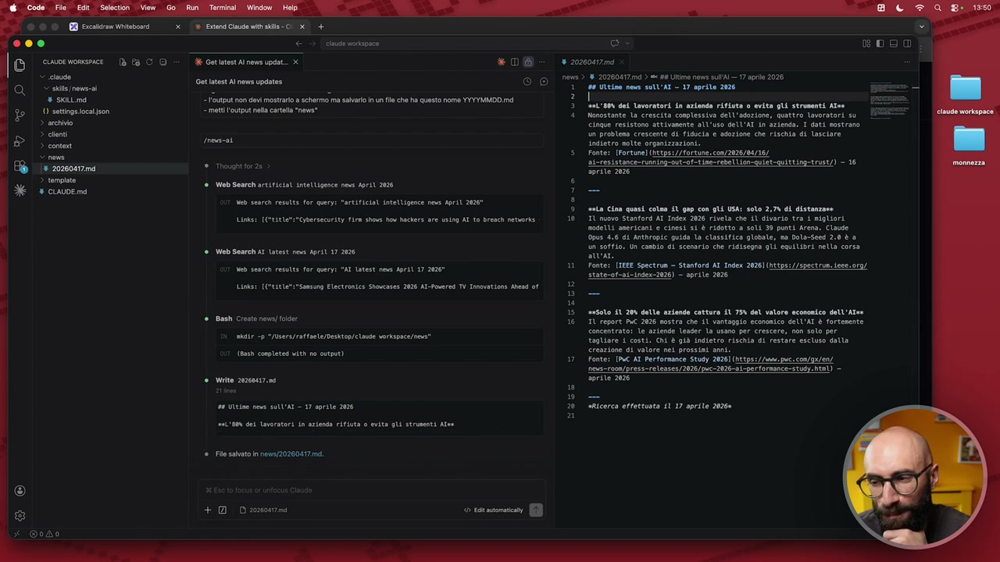

**Testo a schermo (OCR):** EI Cc toni + DOO € + (annoia Gi © cuiorronsice 1 fa CO A Gerin Arm upant. x i 8 2026047 > laude ©) news) 20260477 > = SW Ultime neve sull — 17 aprile 2026. + alli neve Sie 120 Ultino news SSLL'AI — 17 aprite 2026 qui. l'output non devi mostraio a schermo ma salvaro n un fle che ha questo nome YYYYMML ? ni [Spice mimmo 00m i—-—-rrc=5>s e Renn are sro i o (eta Cane indietro molte organizzazioni. + 20260817 sa aprite 6 > template # CIAVDEMI Mal Sanreh artificial intetLigece neue April 2026 pia nen nota Cina quasi colma Îl gap con gli USA: solo 2,74 di distanzave. Links: [Cit le" persecaity Fira show how Rockers are sig AT to bresch netoris T nuovo Stanford AI Index 2026 rivela che Il asvario tra 1 migliori modelli americani € cinesi si è ridotto a soli 39 punti Arena. Claude Opus 4.6 di Anthropie guida la classifica globale, na Dota-Sesd 2.0 è è Un cambio di scenario che ridisegna gli equilibri nella corsa Web Search I tatest ovs Apri 17 226 ue sent result for queyi “AI latest neve April 17 2026" Cinti [CRiLle*"Sasing Eletronics Shoucases 2026 Al-poweres TI Imovatione Anesd of ousolo 11 200 delle aziende cattura il 75% del valore econonico dell'Ale Bash Create new folder I report PRC 2026 nostra che Il vantaggio econonico dell'AL è fortesente concentrato: le aziende lesder la usano per crescere, non solo per tagliare i costi. (NI è già indietro risenia di restare escluso dallo creazione di valore nei prossimi anni. Fonte: [Pu AT Performance Study 2826] (bttpst//u ue. coa/gu/eny ness-roGa/press-releases/2026/puc-2026-01-perfornance- study. heat) - Write as2en4 aprile 2026 mbe <p *AUsers/raffete/Desktop/claae vorkspoce/ news 10 Vitis ness SUNLAT — 17 sprite 2026 nAicerca effettuata 11 17 aprile 20268 Fl sabnto n new/20260417.m O) a DI Disse x Goho
