# Creiamo una skill più complessa

> Documento generato automaticamente: trascrizione e screenshot sincronizzati del video-corso.

## [00:00:00] Schermata 0 _(start)_

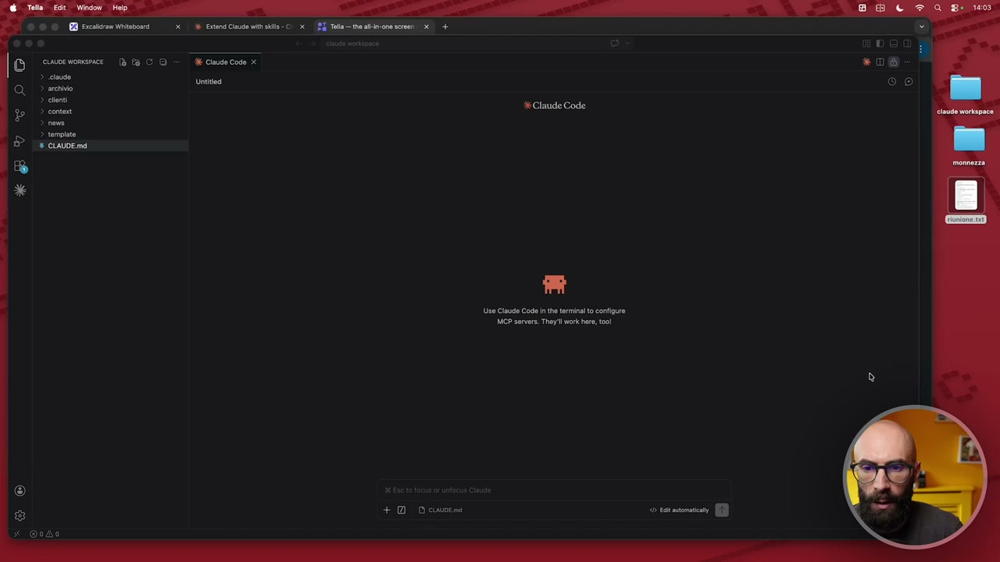

**Testo a schermo (OCR):** EB Encaicia Wttobcrd cuuvoe wossnice | DB fa C “ste > lenti > tamplto * CIALDE md +2 Dcuweni * Claude Code Use Ciaude Code in th termina to configure CP servers. Thyil work or, to! BEST)

> Ora vediamo come possiamo creare invece una skill un pochino più avanzata. Quindi cambiamo anche il caso d'uso. Per questo secondo esempio mi sono preparato qua, diciamo, uno script di una riunione. Cioè non uno script, scusatemi, un transcript di una riunione, no? Quindi ho fatto una videochiamata con una persona del mio team, lì, diciamo, c'è il transcript. Il transcript, diciamo, ci sono mille modi per ottenerlo, ormai lo fanno tutti i tool in automatico. Quindi diciamo che è un semplice file di testo. Situazione molto comune, perché potrebbe essere la riunione con una persona del vostro team, se magari siete manager, ma potrebbe essere il transcript di una chiamata con un cliente, magari perché fate assistenza, oppure vi occupate di sales, quindi con un potenziale cliente, oppure qualsiasi altra cosa, no? Magari siete consulenti, coach, formatore, quindi sono, diciamo, delle trascrizioni, delle call one-to-one e così via. Allora, facciamo subito, iniziamo subito a scrivere la nostra skill.

## [00:01:00] Schermata 1 _(periodic)_

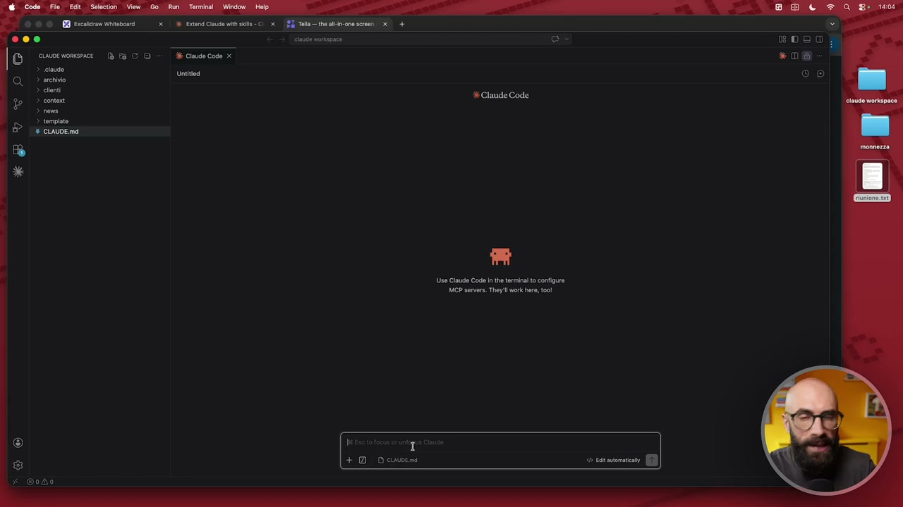

**Testo a schermo (OCR):** EB ercaiciam iieboord XD Etna Cino miao ©) x 000 cioe omerici | [è fa CD» d Ciaudecode x canoe Untived = x Clan Code valina Ut Cioude Code in th terminato conigure MCP servers. Thy] work or, to! I DSS SS)

> Vi ricordate come facciamo? È testo semplice e quindi gli dico, creami, anzi, aiutami a creare una skill che a partire da un file di testo che contiene la trascrizione di una riunione, mi genera, cosa vogliamo? Vogliamo una minuta? Facciamoci una minuta molto semplice, minuta, come lo vogliamo chiamare, riassunto e così via. Mi genere una minuta barra riassunto della riunione. Facciamo così. Nella prima versione, così poi, diciamo, la possiamo modificare, ci mettiamo solo questo. E facciamo anche che io adesso il file lo trascino dentro, semplicemente. Poi, il modo migliore per farlo, ovviamente, è che abbiamo una cartellina nella quale noi ci conserviamo tutte le, diciamo, le trascrizioni delle riunioni

## [00:02:00] Schermata 2 _(periodic)_

**Testo a schermo (OCR):** EB Encalciam Wtebord x ria ie trone seen 3 + D00 cla orge O sovvonee D to canoe Qu > ario fo > con 4 Claude Code > template % CIAVDE A È E°) * Usa Claude Coi i th terminato configure MCP servers. Thyil work her, to! aiutami a erearo una Sil che a pare da un fl di testo cha contiene a rasrizone di un union, mi genera una minutariassunto dela riunione

> in modo tale che possiamo andarla a prendere direttamente da là dentro. Quindi facciamo così. Il file, anzi no, la skill si chiama, perché ci deve creare la cartella, vi ricordate? Anzi, questa fatemela aprire qua, così la vediamo. Cloud, skills, per adesso abbiamo solo news e AI. Si chiama riassunto, riunione. I nomi delle skill, me le sto inventando, ognuno ha, diciamo, la sua tecnica, le sue modalità di nomenclatura. Io tendo a usare sempre nomi in inglese, diciamo, mi approccio in generale alle cose, voi chiamatele come volete voi. E io tendo anche a usare dei nomi, diciamo, ribaltati al contrario. Per esempio, invece di riassunto, riunione, io farei tipo riunione, trattino, riassunto, perché dopo mi posso fare pure riunione, trattino, che ne so, presentazione. Riunione, trattino, e quindi so che quelle sono tutte le skill relative alle riunioni.

## [00:03:00] Schermata 3 _(periodic)_

**Testo a schermo (OCR):** [I x CB Tola ibeationesemen X+ cioe womsence | (Ea > laude © glo) stimo (0 settings scatjson 4 Claude Code > enti template # CAVE md Ue Cine Coi i th terminato configure MCP servers. Thy] work her, to! aiutami rear una sli che a pare da un fl di testo che contee a rasrzone di un unione, mi Genera una minutariassunto dela riunione 1a sl sl ciama “riassunto runiond

> Però è un approccio mio, diciamo, io che ho un po' la testa così da malata da informatico, quindi mi piace organizzare le cose in questo modo. Però la chiamo riassunto-riunione perché mi rendo conto che magari è molto più facile per molti di voi. La skill si chiama riassunto-riunione, facciamo... Deve fare questa singola cosa e nient'altro. Nient'altro, mettila nella cartella skills già presente nel workspace. Cosa altro gli possiamo dire? Non creare file di test o di verifica, ma solo la skill semplice. Avete visto, questo ce l'ho messo prima, perché su queste skill molto semplice non ho bisogno di fare verifiche particolari. La lancio io a mano, controllo, no? E una verifica la facciamo molto velocemente ad occhio.

## [00:04:00] Schermata 4 _(periodic)_

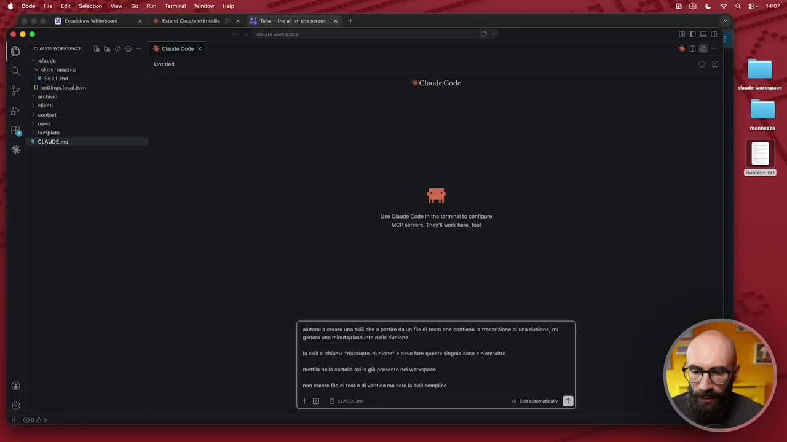

**Testo a schermo (OCR):** EB encalcram Wteboni 000 > claude © ole) i + xttme (0 settings .ocatjson > elnti template # CALDE md E rela ibeaitinone screen (x + % Claude Code Uta Cisude Code i th terminal to coigure MCP servers. Thi] work or, to! aiutami a rear una Gil che a pare da un fl di testo che contee a trascrizione di un unione, mì Genera una miutariassunto del riunione la sil sichama “iassunto-unione” & deve fare questa singola cos e nient'altro mettia nella catalla ski già presente ne workspece non creare fl i test i verifica ma slo la sli semplice + Deuwen

> Ah! Cosa importante, gli dobbiamo dire che il file lo passiamo in chat. Il file viene passato nella chat come contesto. Vediamo se Claude ha tutto quello che gli serve per creare una skill oppure se ci farà qualche domanda. Alcune volte quando le skill sono un po' complicate, o meglio complicate, quando ha qualche dubbio, quando qualcosa può essere interpretato in vari modi, ci dice questa cosa la preferisci così o la preferisci colì. Tanto però vi ricordate, le skill sono dei file di test, quindi adesso appena lui ce la crea noi la apriamo e andiamo subito a vedere cosa c'ha scritto, perché se qualcosa non ci convince lo modifichiamo un pochino. Autorizziamolo ovviamente a scrivere, diciamo perché deve creare fisicamente una nuova cartella. Quindi sotto skills adesso si creerà una cartella, come l'abbiamo chiamata, riassunto-riunione, quindi qua si creerà una nuova cartella riassunto-riunione con dentro un nuovo file skill.Md,

## [00:05:00] Schermata 5 _(periodic)_

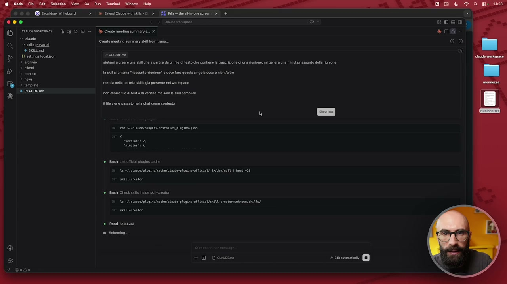

**Testo a schermo (OCR):** EB Ecate > claude © glo) 1 sKiLima (0 setta ocatison > elnti template ® CIAUDE md Etna Cine ws - 0) x ala ineaitinono screen x + 6 Create meeting summary s.. x Create meeting summary ll rom trans aiutami a eroare una sil che a arte da un fl di testo che contiene la rascizone di una riunione, mi genera una minutafiassunto dela riunione la sli chama “assunto. unone* a ve fare queta singola cosa e nient'altro metta nea cata sill iù presente ne workspece non rea file di test o di verifica ma soo la sil semplice Ml viene passato nel chat come contesto ct 04 cause) plugins /1nstat es plugins sen = Bash List lf plupine cache 19 24 au) plugins /caebe/claude-plugins-ofticla/ 2>/eev/nall | bess 20 Gant Check ia lado si-eestor 15 2/5 laud)plogtns/eoe/c lande plopins-oftLela/ SI crestor/ onu / # Scheming.

> che è il file dove c'è il funzionamento della skill vera e propria. Sta controllando ovviamente se c'era installato skill creator, l'ha trovato e quindi adesso lo va a realizzare. Cosa importante, come vi dicevo, adesso facciamo che il file glielo passiamo dentro la chat, quindi proprio io dopo piglio e lo trascino dentro. Ovviamente secondo me per lavorare bene con le skill dobbiamo sempre pensare coerenti con il resto del contesto che abbiamo fatto. Quindi se questa cosa noi la facciamo frequentemente e abbiamo sempre le trascrizioni delle riunioni, facciamo che finiscano sempre dentro certe cartelle e dentro queste cartelle ci mettiamo le nostre riunioni. Ha creato la cartella skills qua sotto, vabbè errore mio, probabilmente se non glielo dicevo era meglio. Vabbè non fa niente, adesso la spostiamo a mano. Questa cosa io le lascio, cioè volutamente non le tolgo perché non vorrei che questa cosa, se vi capita a voi e non sapete come gestirla,

## [00:06:00] Schermata 6 _(periodic)_

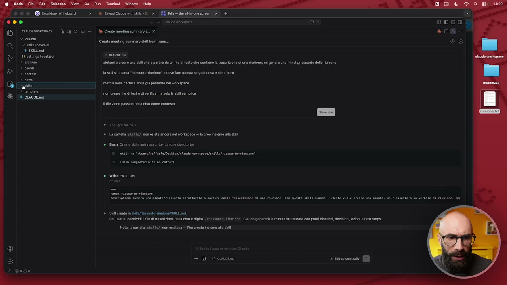

**Testo a schermo (OCR):** BB Foca Witabeard x Ertnd Cine mtb sile x (Sala ibeniinone sen x -+ D00 O cuioenonence X Create meeting summary. x V claude # SKLLma (0 settigaocaljson cento. > archivio > centi Create meeting summary kl rom tran autami a creare una sil che a paro da un ile di testo che contiene la rascizone di una riunione; mi genera una minutafiassunto dela riunione cd Dati morire e tr qu pi nr - tte i rst noe non ereae fl i test o i verifica ma solo la si sempice uf viene passato nel chat come contesto La carta sK41s/ non esist ancora nol workspace — la reo insieme al ki. Bandi Croato sis and rissuntortunine irctris Wi Sito description: Genere uns ninta/risssunto stretturato & partie dalla trascrizione di una riunione. Uts questa SKI quiado Utente vole creere una mint; un rinssnto 0 un ve Sl creata in sli fissunto.sunone/SKILL.md. Per usarla: condi flo di trascrizione net chat e digita /riassunti Nota: a carte KI) non esisteva — l'ho creata insieme

> semplicemente diciamo il comando l'ho scritto male, io quello che adesso mi faccio, anzi ve lo faccio vedere qua a livello proprio cartella, cloud workspace, vedete quindi ha creato questa cartellina skills qua che in realtà non è quello che volevamo noi, noi la volevamo sotto diciamo la cartella skill di sistema. Quindi io prendo questa roba qua, adesso le riunioni, me la sposto qua dentro, aspettate, eccola qua, me la metto dentro skill. Skills, vedete adesso ci abbiamo news AI e riassunto riunione, eccola qua, questa qui invece me la cancello. Per farvi vedere che tutte le cose che faccio le faccio da qua o le faccio da qua è la stessa identica cosa, avendole qua è molto più facile diciamo lavorarci dentro, ok? Perché abbiamo questa visione ad albero che possiamo aprire, chiudere, aprire più cartelle, fare la stessa cosa qua dentro è un pochino più complicato diciamo, è meno intuitivo, ecco tutto qua. È uno dei grandi vantaggi di usare VS Code che vi dicevo proprio all'inizio di questo corso.

## [00:07:00] Schermata 7 _(periodic)_

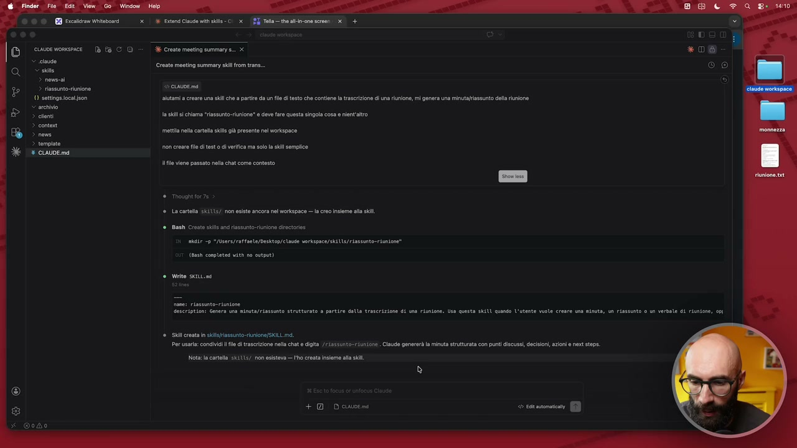

**Testo a schermo (OCR):** ge masi > riassuntounione 1) settings ocatjson archivio > lenti > template * CIAUDE MI 6 creste meeting summary. x Create meeting summary kl from ran. aiutami a eroare una sil che a parto da un fl di testo che contee la trascrizione di un riunione, mi genera una minutafiassuto del riunione a still chiama “assunto. runona* a eve fare queta singola cosa e nient'altro meta nel artallasll già presente ne workspoce non ereare file i test o di verifica ma solo la sh semplice fe viene passato nel cht come contesto La carta ski{1s/ non esisto ancora nel workspace — la creo insieme al kl. Wi Sito ‘ll creata ln sidi/issuniorunine/SKILLImÀ. Per usar: condividi le di trascrizione na chat e cita /riassunto-riunione . laude genererà la minuta stutuata con punt discussi decisioni Nota: cart ski15/ non esisteva — l'ho cresta inse al i. ® +0 Own DES

> Ok, adesso ci abbiamo questa prima skill, quello che facciamo è ci apriamo una sessione nuova, no? Perché cloud così può caricare le skill che c'è all'interno, e adesso se facciamo riassunto riunione vedete che abbiamo il comando, quindi faccio comando riassunto riunione e poi prendo il file riunione e lo trascino qua dentro. Aspettate fatemi togliere questo qua, ecco qua, prendo il file riunione e lo butto qua. Quindi adesso la skill, aspettate apriamocele perché non l'abbiamo aperta ancora. La skill cosa fa? Genera una minuta barra riassunto strutturata a partire dalla trascrizione di una riunione. Usa questa skill quando l'utente vuole creare una minuta, un riassunto o un verbal di una riunione. Vedete ha usato dei sinonimi, così se io scrivo fammi un verbale, lui comunque capisce e lancia la stessa skill. Oppure quando fornisce una trascrizione di meeting e chiede di organizzarla. Attivela anche se l'utente dice riassunto riunione, crea minuta, verbale, cosa è emersa dalla conle e così via. Riassunto riunione, l'utente ha condiviso in chat una trascrizione, il tuo compito è generare una minuta, perfetto.

## [00:08:00] Schermata 8 _(periodic)_

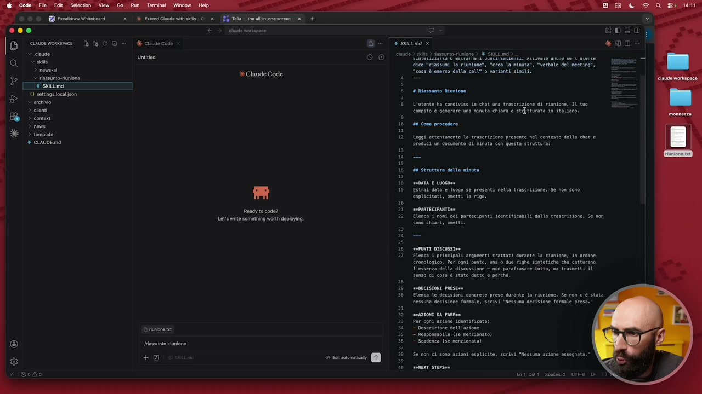

**Testo a schermo (OCR):** RD eacaiciomWtaboond (XV Exte Cine what - x (8 Tla— ibeaitinone soon x + D00 i rive e © sosevonee Da CO - de ciusecose + SlLmd x sole Untited SRO IINLITIA E RIINA PLTUONO pirate erre pine QU vr dice "riassoni o rianone, “crea lo nio”, "versste gel meeting; > nemesi Sesta È enerso delta cati 0 varianti sint. fe emenoiione - è Stima (0 settings socaijson è Riaasonto Rinione D canto L'utente ha consiiso in chat uno traserizione di riunione. TU to A ospito è generare une Rinuta chiare © Stijrturto {n italiano. > none 29 come procedere > tenvie 12. Leggi attentanente la trascrizione presente nel contesto della chat e + CIALDE md produci un ocunento Gi minuta con questa struttura: 00 Struttura detta ninota me0ATÀ E Lu0coe mm Estrat dato e luogo se presenti nella trascrizione. Se non sono esplicitati, csetti la rig Ready to code? sePaRTECIPATIOe Co Elenca i noni Gel partecipanti identificabili dalla trascrizione. Se non A RASOIO: sono chiari, ometti msp ptscussI Elenca principali argosenti trattati durante la riunione, in ordine cronologico. Per ogni punto, uns o due righe sintetiche che cotturano l'essenza della discussione = non parafrasare tutto, na trassetti il senso di cosa è stato detto e perché. medeCISIONI PRESESÌ Elenca le decisioni concrete prese durante la riunione. Se non c'è stata nessuno decisione formale, scrivi "Vessuna decisione formate presa. Per ogni azione identificata: — Descrizione dell'azione — Responsabile (se menzionato) scadenza (se menzionata) TESS) Se non ci sono azioni esplicite, scrivi “Nessina azione assegnati

> Leggi attentamente la trascrizione, produci un documento con questa struttura. Struttura della minuta, date luogo, se sono presenti nella trascrizione, se non sono esplicitati o aumenti la riga, nomi dei partecipanti, noi gli avevamo chiesto questa cosa, però diciamo la ce l'accettiamo. Ecco questa roba qua no, questa roba qua la voglio togliere perché voglio modificarla dopo la skill, cioè voglio far vedere come la evolviamo. Facciamo così, questo togliamolo, così la lasciamo molto semplice, la sto semplificando volutamente per far vedere sempre come le modifichiamo. Quindi le principali argomenti trattate in ordine cronologico, per ogni punto uno o due richiede che catturino l'essenza della discussione, non parafrasare tutto se trasmette il senso di cosa è stato detto. Scrivi in italiano, tollo professionale ma diretto, sì sintetico, se qualcosa non è chiaro interpreta ragionevolmente piuttosto che chiedevi chiaramente, non aggiungere informazioni che non sono nella trascrizione. Perfetto, ci teniamo questa versione qui molto semplificata, abbiamo caricato il file, gli diamo invio e la vediamo subito all'opera. Come vi dicevo, adesso siccome la skill non prende una cartella, che adesso però tra un attimo faremo,

## [00:09:00] Schermata 9 _(periodic)_

**Testo a schermo (OCR):** BB rca intona Estnd Cino mt sila C)_x BJ ala ibenitinone somen X + cioe womsnice | [è fa C © > 6 Meeting summary document. x > laude > risi © tiassuno-inione è Si (0 settings scatjson Fim < archivio Meeting summary documentation cent 7 nome * Flbbentigibeting.. tompite + CLAUDEMI

> e non scrive in una cartella, cosa che invece dobbiamo sempre fare, quello che fa ce lo mostra in chat. Quindi ci dice dobbiamo fare i clip per interviste, se devono fare i caroselli, se devono fare la landing page nuova. Qua sono tutte cose inventate, quindi diciamo tutte le persone citate, i clienti citati, è tutto inventato, non vi preoccupate, non sono cose private. Abbiamo adesso questa skill che io scrivo semplicemente riassunto riunione, ci butto il file dentro e mi fa il riassunto della riunione. Come dicevo però, facciamola coerente col contesto, perciò l'ho fatta diciamo, la prima versione l'ho fatta male, non male, ma l'ho fatta come la farebbe una persona con poca esperienza, in modo molto semplice. Adesso invece noi vogliamo che le riunioni vengano gestite, e quindi facciamo così, diciamogli aggiornami il file system, anzi no, non il file system, aggiornami il workspace, aggiornami il workspace e anche i file di contesto, perché ogni volta che facciamo una modifica al workspace dobbiamo dire a cloud di aggiornarsi tutti i file.

## [00:10:00] Schermata 10 _(periodic)_

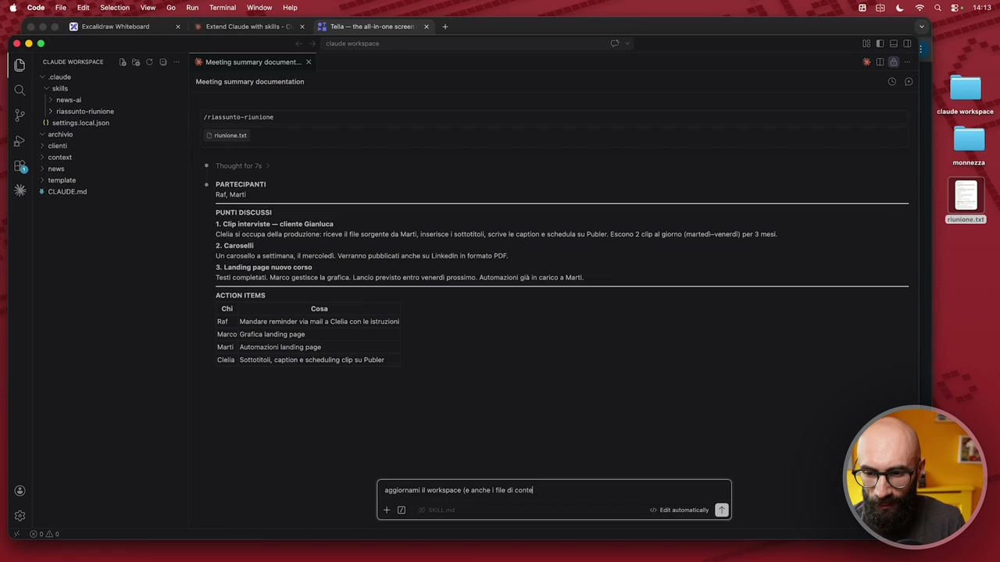

**Testo a schermo (OCR):** BB ercacram renna Etna Cino ws C x (BJ ala ibeaitinone seme (x + D00 claude vorigare O sosvone DC Mosting summary document. x + clnude Qu vate si fo 1) resmmoriione (0 setinsocatjson Meeting summary documentation Ursassunto=riuntone archivio Fin È > centi rc > manto Ye + ciwvEne Cri PUNTI DIscUSSI 1. lip interviste cente Glaniuca Clell si occupa dll produzione: core le sorgonto ca Mart, inserisce sottotitoli scrive e capo e sehedula su Publ. Escono 2 lp l giorno (martedi-veneri) per 3 mes 2. Caroseli Un caroslt a sttimana, l mercoledì. Vrranno pubblicati anche su Linka i formato POF: 3. Landing page nuovo corso “Test completati. Marco gestisco la raia. Lancio previsto antro venerdì prossimo. Atomazion gi i arco 3 Mar. ‘ACTION ITEMS chi cosa Mandare reminder va mala Ciel cn e istruzioni Marco Grafica landing page Marti Automazini landing page Clella Sotottl, captin e scheduling lp su Publr SRI +0 TEST)

> Aggiornami il workspace creando una cartella riunioni, con dentro due sottocartelle trascrizioni e riassunti. Nella cartella trascrizioni ci metterò dei file di testo con le trascrizioni complete delle riunioni. E nella cartella riassunti ci andranno i riassunti in markdown generati dall'apposita skill. Quindi adesso cosa facciamo? Diciamo che stiamo per fare la seconda versione della skill, e faccio queste cose passo passo per farvi capire come ragiono, come potete ragionare pure voi.

## [00:11:00] Schermata 11 _(periodic)_

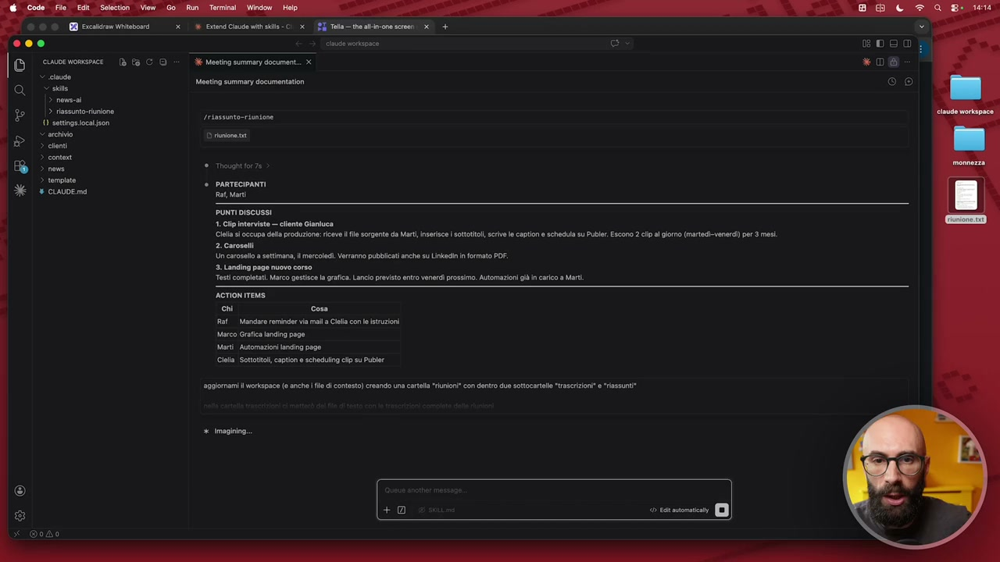

**Testo a schermo (OCR):** [I I D00 cla orge © cuoeronsnce Db î9 CO - Meet summary document. x > claude i > tiassuno-rinione () setingscalison x archivio (Fin > cllenti Meeting summary documentation Lrsassunto=riunsone > template PARTECIPANTI + CUAWDE MA Rat rt PunTIDiscuSSI 1. lip interviste — lente Glaniuca Clella si occupa dla produzione: ricove file sorgente da Mart, inserisce sottotitoli serv e capo e sehedula su Publ. Escono 2 lp l giorno (martedi-venerd) er 3 mes 2. Caroseli ‘Un caroslto a settimana, l mercoledì. Verranno pubblicati anche su Linka i formato PDF: 3. Landing page nuovo corso Test completati. Marco gestisco la grafica. Lanci previsto entro venerdì prossimo. Automazioni gin carico a Mar. ‘ACTION ITEMS chi cosa Mandare reminder via mala Cla cn e istruzioni Marco Grafica landing pege Marti Automazini landing page Ciel Sotto, captin e schedung tp su Pubier oienami i werkopace 0 anche odi contesto) creando una carte “unioni con dentro due sottoartte “tasrizini © (o)

> Per dire ok allora ho fatto questa prova, mi rendo conto che non l'ho ottimizzata bene, ho questa esigenza, lavoro sempre in ottica di evolvere il workspace, me lo miglioro in base alle mie esigenze. Ho modificato il file cloud.Md che ci andiamo ad aprire, e infatti adesso ci spiega anche che c'è la cartella riunioni, in riunioni c'è la trascrizione e poi ci sono i riassunti. I riassunti sono generati da riassunto riunioni, questo non glielo ho detto io, l'ha capito automaticamente. Mi dice guarda che c'è già una trascrizione, cioè tu hai fatto riunione.Txt e ti ho anche generato un riassunto poco fa, ma per caso vuoi che te lo metto già nelle cartelle? Queste sono quelle cose che vi fanno adorare cloud, che vi fa capire che sta iniziando a capire come lavorate. Certo, qua diamogli anche delle regole, cioè diciamogli che i file si devono chiamare con la data, così io velocemente posso andare a trovare per esempio una trascrizione che mi serve o un riassunto che mi serve.

## [00:12:00] Schermata 12 _(periodic)_

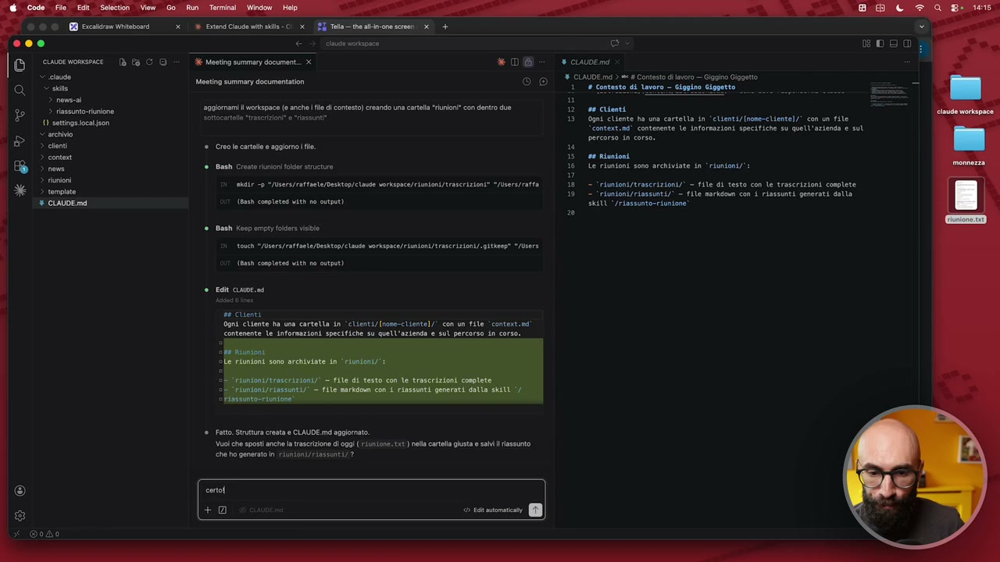

**Testo a schermo (OCR):** © © © EB Ercaldram Witobonri (x Fatnd Cino mita x (SE Tala the atione ere x -+ cusoe womsnice | [è fa CD € Meeting summary document. x + cAvDE md V iaudo 9 %. CLAUDE ma? n 8 Contesto i levoro — Giggino Gigpetto Sale it i © 1 # contesto di lavoro — Giggino Giggetto > nemesi n ate sagiomami I workspace (e anch ile di contesto) creando un carte uno” con dentro due 32 sa Clienti REL sottocatla"racrizion “assumi 13. Ogni cliente ha una cartella in “elienti/[none-elientel/* con un file “eontext.nd contenente le informazioni specifiche su quell'azienda e sul de sn i spe quett'azienda percorso in corso. > lenti ® Creole cartelle o aggio le. > contest 00 Rionioni > im = Bash Create riunioni for structure Le riunioni sono archiviate in ‘riunioni’: > riunioni > tempiate * ciAUDEmd (tas complete with no output) mite cp VUsars/rafaele/Desntop/classe vorkspac/riunioni/erasrizioni =Nusers/rata — ‘rduntoni/traserizioni/* — file di testo con le trascrizioni complete — *iluntoni/riassunti/* — file mrksom con i riassunti generati dalla FALLI */rtassunto-riunsone ©. Bash Kocp empty folders visible nou "/Users/atTante/Dsktop/ claude vorkspae/riuioni/trascrizion/.gitkep” "Jusers (tas completed with no tnt) es cene Ogni cliente ha una cartella in “elienti/nose-Clientel/Y con un file ‘context. contenente le informazioni specifiche su quell'azienda e sul percorso in corso. Fatto Struttura cresta e CLAUDE md sgiomato. Vuol che sposti anche la trascrizione di ogg riuniane.trt) nell rtl gusta e sab iassunto ch ho generato in riunioni/risssinti/? o ce

> Anche se ovviamente sulle trascrizioni uno non ci lavorerà più, guarderà sempre i riassunti perché sono più facili, ma non le buttiamo perché se trovo un'informazione che sfuggirà dal riassunto, c'ho sempre la fonte. I file devono avere come nome la data del giorno in formato, facciamo così, anno a quattro cifre, mese e giorno. Per il file di oggi usa la data di oggi. Ah, e poi facciamo e, metti questa informazione anche nel contesto, così cloud sa, adesso probabilmente lo scriverà qua dentro, oppure non lo so, si farà un altro file di contesto qua.

## [00:13:00] Schermata 13 _(periodic)_

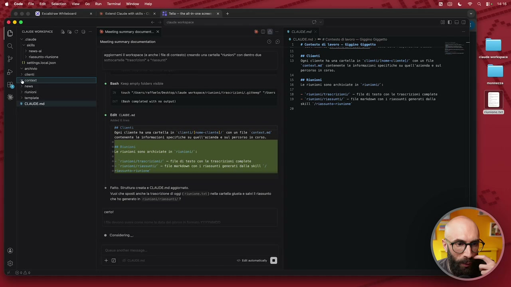

**Testo a schermo (OCR):** ® Etna Cino whit - 1 x | ala ibaaitinone seen (x + X Mosting summary document. x Meeting summary documentation ragiomami workspace (e anche ile di contesto) creando un cartella run” con dentro due lie ottocrtel trmsrizini a “riassunti” Serchio > tnt Bash Koep empty folders valle rouen "ZUbers/reftante/Desktop/claude vorkapace/riumioni/trascrizion/.gitkep* "Jusers e e clupe.ns Ogni cLiente ho una cartella in “elienti/Inose-elientel/' con un file ‘context.nd contenente le informazioni specifiche su quel'azienda e sul percorso in corso. ‘Fatto Struttura creata e CLAUDE md sggiomato. Vuoi che sposti anche la trascrizione di ogg ( riuniane.t:t) nella cartella gusta e salvi rissunto che ho generato In riunioni /riassints/ cero © (o) x odo * cavDE md . CLAUDE ma > 8 Contesto di lavoro — Giggino Giggetto 1 # contesto di lavoro - Giggino Giggetto 12 s0 Centi 13 Ogni cliente ha una cartella in “elienti/[none-elientel/* con un file Seontext.nd contenente le informazioni specifiche su quell'azienda e sul percorso in corso. 00 Rionioni Le riunioni sono archiviate dn ‘riunioni’: — ‘rtuntoni/traserizioni/* — file di testo con le trascrizioni complete — ‘iduntont/ riassunti”? — file marksom con i rinssunti generati dalla FALL */rtassunto-riunsone

> Ah no, ecco, adesso gli diciamo di metterlo nel file di contesto per le riunioni, così non allunghiamo troppo cloud md. Cioè è giusto che ci sia questo in cloud md, ma magari questa parte qua che è un po' dettagliata, diciamo, la facciamo mettere in un file a parte, ragionando sempre in quest'ottica. Ricordatevi, cloud md è una sorta di indice, anzi guardiamolo così in anteprima così si capisce meglio, una sorta di indice e poi ci sono i link alle cose dettagliate. Quindi in questo caso, siccome stiamo spiegando delle regole che vogliamo che vengano gestite solo per le riunioni, ce lo mettiamo dentro riunioni. Quindi vedete qua stiamo evolvendo la skill che evolve con il workspace, che evolve con il contesto. Lavorerete sempre così in cloud, ogni volta che c'è una novità, ogni volta che cambia qualcosa nel vostro metodo, nel vostro processo o che vi accorgete che c'è una nuova esigenza, si evolve tutto insieme.

## [00:14:00] Schermata 14 _(periodic)_

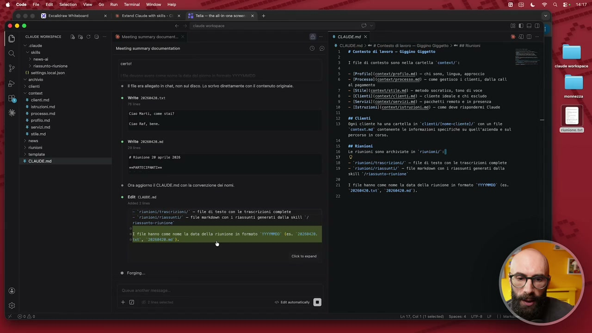

**Testo a schermo (OCR):** EB Poca Wniebonrd x 3 Ertnd Cine with sila 1 x (8 Tala ineaitinono screen x + DO © > | lu worimoze cune womsnice | (€ C © + 6 Morti summary document Vle + ai > ri > riassunto unione 1) sets ocaljson 3 archivio > clienti tf era allegato in chat, non si dico Lo scrivo direttamente con i contenuto originale. VaZir. Wii 2o2enso. tit Meeting summary documentation cero! 8 istruzioni + processo.mi Ciao orti, cone sta? 4 protiome $ servzine $ stilemi Ciao at, bere. rito aszenaz. ni ‘ra aggiorno il CLAUDE md con la convenzione del nomi ri riunions/traserizioni/* — file di testo con le trascrizioni complete riunions/riassunei/' — file markdonn con d riassunti generati dalla skitI ‘/ riassunto riunione ST + cIAWDEmd X ‘8 CLAUDE ma > Contesto ciavoro— Giggino Giggtto > = #4 Riunioni # contesto di lavoro - Giggino Giopetto 1 file gi contesto sono nella cartella “content/’ 1 — [PrOfil0] (context /protilo.n4) — chi sono, Lingua, approccio — Processo] (context /processo.nd) — come gestisco i Clienti, dalla coll 3% pagamento 1 (Stile) (context/stite. nd) - metodo socratico, tono di voce È (ciSents] (content/cUienti.n9) — cliente idente e chs escluso — [Servizi] (contert/servizi.na) — pacchetti resoto e in presenza — tistruzioni) (contest/iStruzioni.nd) — come deve rispondermi Claude n0 Ciienti qgni cliente ha una cartella in "eltenti/Inone-clientel/" con un file Scontext.ad' contenente Le Informazioni specifiche su quell'azienda e sul percorso in corso. 20 Riunioni Le riunioni sono archiviate sn ‘riunioni/':0 9 — ‘riunioni/trascrizionis* — file di testo con le trascrizioni complete — ‘rlunioni/riassunti/* — file markdom con riassunti generati dalla FALL */riassunto=riuntone 1 file hanno cone none la dita dell riunione in formato “rmmmoD' (es. 20260420. bx8, ‘20250420. 06).

> Ok, qua ci hanno messo le informazioni, io adesso gli dirò che queste informazioni sulle riunioni le voglio in un file a parte, però se noi andiamo dentro la cartella riunioni, c'è riassunti e c'è trascrizioni. Vedete qua c'è già il file con la trascrizione completa, che è quella che avevo usato io, e qua abbiamo anche quello col riassunto completo, il riassunto lo possiamo vedere anche così, bello formattato, vedete? Eccolo qua, lo chiudiamo, quindi diciamo adesso cosa gli dico? Gli dico piccola modifica, il contesto relativo alle riunioni spostalo da cloud.Md a un file ad hoc nella cartella context, così ce lo teniamo bello pulito. Quindi adesso quello che mi aspetto è che questa roba qua venga tolta tutta o in parte e qua venga creato un nuovo file, eccolo qua.

## [00:15:00] Schermata 15 _(periodic)_

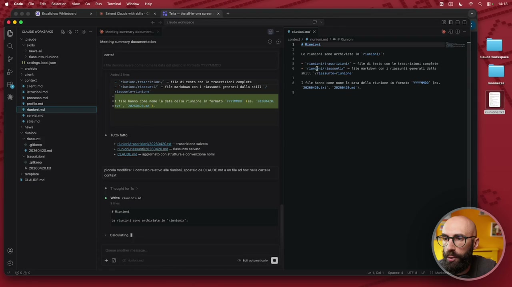

**Testo a schermo (OCR):** O © O EB Gaio ito (Etno Cei ila C_x BT ibeaiconesen D+ cioe womsnice (fa C © - 6 Meeting summary document. * rionima content riunioni ma > Riunioni suda Meeting summary documentation o) i + all > ai “pun cero! Le riunioni sono archiviate in *riuntoni/’: 1) sets ocaljson — ‘rfuntoni/trascrizioni/* — file di testo con le trascrizioni complete — ‘rsunifini/riassunti/' = file norkdom con_1 riassunti generati dalla > archivio FRAU" /Flassunto-riuntone > cllenti 7 x content — \rlunsoni/trascrizioni/i — file di testo con le trascrizioni complete 1 file hanpo cone none la dota della riunione in formato “rmmoo' (es. % conti — ‘riuntoni/riassunti/* = file markdom con i riassunti generati dalla shiUl '/ 2R2GRARO.t!, ‘20260420.00) 8 istruzioni Fiassunto-riunione” + processo.mi % protiome riunioni + serizine 8 atlema © fuioni + risssunti giceen + tinionrascizio/20260420.u — rascrizionesavata + 20260420 * cuncotiassn/20260420.md — riassunto savato Simei + CLAUDE md — pglonato con stutua e convenzione nomi gita» E 20260420118 cola magica: contesto relativo lle unioni, postal da CLAUDE md a un fl ad hoc ela care > template conte # CLAVDE mA Tuo fotto svgnttorta Write riunioni.n + Caleviting

> Oggi parliamo di business online, prodotti digitali e mindset. La skill, come si chiamava? Riassunto, riunione, riunione. Cosa gli facciamo fare? Gli facciamo fare con queste novità. Ah no, facciamo così. Può leggere. Anzi, facciamo così che è ancora più figa. Se il file di riunione gli viene passato in chat, me lo deve creare subito dentro trascrizioni.

## [00:16:00] Schermata 16 _(periodic)_

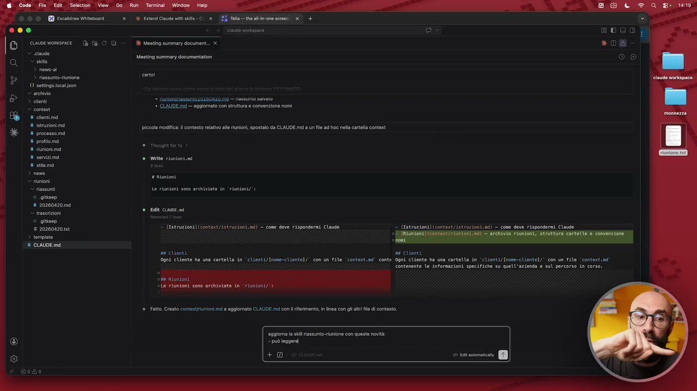

**Testo a schermo (OCR):** EB eocaiiamteboord x Frtnd Cine ws) x (Sala ibenilinono seen x + Tè € CD dk Meeting summary document. x ar Meeting summary documentation > ri > rissuntorunione cento (0 settings ocatjson 3 archivio > cileni + (nas A0 260420 109 — assunto sabato sd + CLAUDE id — aggiornato con stutura e convenzione nomi % conti irccaei picola modifica l contest rato al riunioni, postale da CLAUDE mu a un fl ad hoc nel catalla cont + processoma Plate ®. Trougnttor 8 riunioni pai $ serizina $ sile è Write riuniontini den Atentoni + risconti gtieep + 20260420 IRE3S e ei cuwoe.na gico E 2020042008 — trstruzioni] (context/istruzioni nd) — come deve rispondermi Claude — listruzioni] (contest/ istruzioni. nd) — come deve rispondermi Claude > template * cLAWDEmI ogni cliente ha una cortetta {n Eltenti/Inone-cllentel/' con un file contert.nd) conte Ogni cliente ha una cartella in ‘clienti Inone-eliente]/' con un file ‘contest. contenente le informazioni specifiche su quell'azienda e sul percorso in corso. ® fatto Croato contotnionim e aggometo CLAUDE m cn. riferimnto, in inea co gi tri le di contesto. gina la sl iesuntorunione con queste nità: può leggere

> Allora, se la trascrizione gli viene passata in chat come file o come testo incollato, mi deve creare subito un file txt nella cartella, come si chiama? Riunioni barra trascrizioni, slash trascrizioni. Riunioni, trascrizioni, ok? Se invece gli viene dato il nome di un file, lo deve cercare nella cartella. Ecco qua, riunioni, trascrizioni. Cioè, quello che faccio, adesso gli dico, guarda, se io vado veloce, perché diciamo sono pigro, e ti butto un file in chat, tu dopo che ci hai lavorato, va bene a metterlo pure qua dentro. Se invece sono uno super organizzato, che te l'ha già messo qua dentro,

## [00:17:00] Schermata 17 _(periodic)_

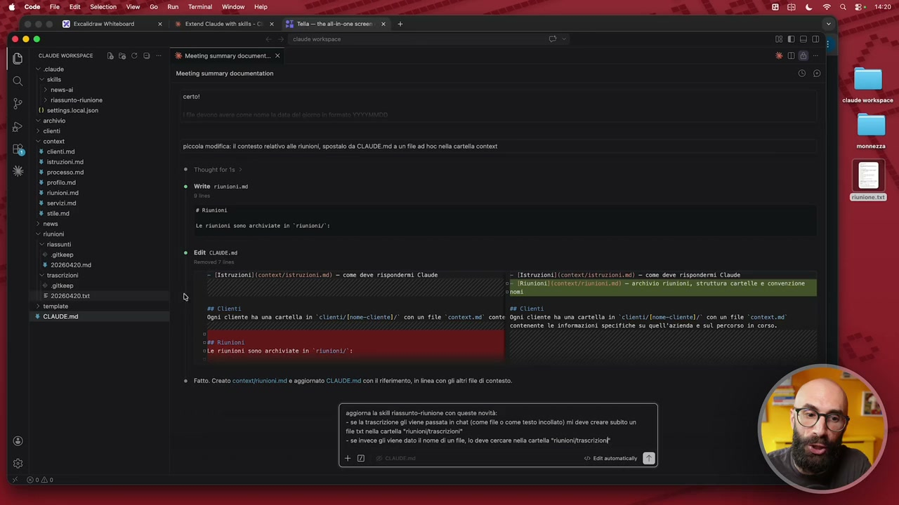

**Testo a schermo (OCR):** > rissuntounone () ‘setigsocaljson 3 archivio > lenti % cfontimd 8 istruzioni 4 processoma % proiome 8 riunioni 8 servizine + stile + riassunti geco # 20260420 > tmacrizion gico 5 20260820 bt > template + ciauDEmd Etna Cin wii sila x Tala — the alice sero % Motng summary document. X Meeting summary documentation cero! Piccola modifica contesto ratio al runoni, postale da CLAUDE ma a n fl ad hoc nella cartella contr e Write riunioni. OI — (istruzioni) (contest) istruzioni nd) — come deve risponderai Claude Ogni cliente ha una cortelta in ‘clienti/Inone-clientel/' con un file ‘context.’ conte Ogni ciente ha una cartella in 'clienti/Inone-clientel/ con un file “contestind contenente le informazioni specifiche su quell'azienda e sul percorso in corso. ® Fatto. Creato contxtunionimd e sggiomato CLAUDE.m con liferimanto, n nea con i ari le di contesto. aggiorna la sil issunto-runone con questa novit 5 a trascrizione gli ino passata n chat (como fl 0 come testo incolto) mi deve creare subito un fo tt nella cata “unionirascizini” so invece gli eno dato nome di un fl, o deve cercare nel crt “fiunioni@rasizoni +0 co

> e quindi ha già fatto il file trascrizioni, 2026, 04, 25, tu lo devi appliare da là. Quindi gestiamo tutte e due le casistiche. E se non lo trovi, avvisa che il file non è presente. Ok? In caso mai metto il nome di un file che non esiste. Poi cos'altro? La skill, oltre al riassunto, deve fare anche una lista di azioni, actionable. Solitamente si dice che sono gli actionable. Facciamo così, una lista di actionable con due punti. Attività da fare e facciamo anche persona che se ne deve occupare. Non mettiamo la data, però diciamo se ci fosse una scadenza ce la mettiamo. Se c'è una data di scadenza, indicare anche quella. Questa seconda versione è pronta.

## [00:18:00] Schermata 18 _(periodic)_

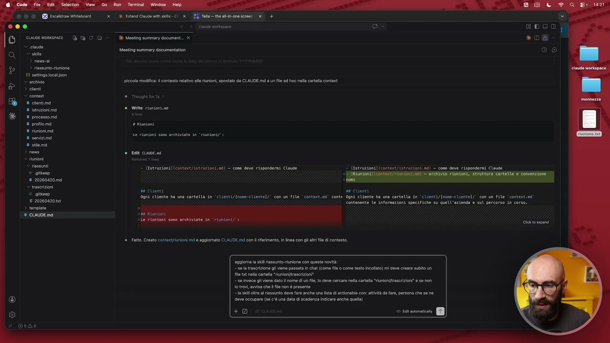

**Testo a schermo (OCR):** EB Foca Witeboond | x Ertend Cine ws - CO x Sala ibeallinone scmen X + 000 cai woigore @ cuorronnce X xicoiny summary document. x Value Qu ae > nisi fo rasmmoriione 1) settigsocalison 3 archivio > clienti % conti % istruzioni + processoma + proiome # Rtontoni % riunioni + servizine + atte > nome è Et cuni. dio quo Sini — istruzioni) (contest/ istruzioni nd) — come deve rispondermi Claude itieep 4 20260420 md Seoul ne chien 0 cisenti see Ogni cliente ha una cartella in 'elienti/Inone-cliente]/' con un file ‘context.n’ conte Ogni eLiente ha una cartella in ‘clienti/Inone-clientel/ con un file “contest. E 20260420.08 contenente le informazioni specifiche su qull'azienda e sul percorso in corso. > template * ciauDEmd Meeting summary documentation picola modifica l contesto rlativo al riunioni, posto da CLAUDE ma a un fl ad hoc nella cata conti è Write sunto (istruzioni) context) istruzioni nd) — cone deve rispondermi Claude ® Fatto. Creato contxtunionim e aggiomato CLAUDE mi on riferimnto, in inea con gli ari le di conteso. Sagiorna la sklrissunto-runione con queste novit: - se a trascrizione gli no passata n chat (como flo 0 come testo Incolato) mi deve creare subito un fo txt la cata “runionirascrizion se Invece li ene dato l nome i un fl, o deve cercare nea cartella "unionitrascrizion' a se non loto, avvisa che lle on è presente ia ll lo al assunto devo fare anche una sta i ationabio co: attività da fare, persona che se ne eve occupare (6 c'è una data i scadnza indicare anche quel) Ra ee)

> Diamo invio. Cioè è pronta. L'idea di quello che vogliamo nella seconda versione è pronta. Dice adesso sto leggendo la skill attuale. Quindi si è andata a prendere il file skill.Md. Riassunto riunione sta vedendo cosa c'è dentro. Capisce cosa c'è rispetto a quello che vogliamo noi. Adesso farà delle modifiche. Quindi aggiungerà, vedete, mi dice mi autorizza a fare queste modifiche. Quando vedete sempre quella roba in rosso e in verde. È Claude che ti sta facendo vedere le differenze. Quindi vi sta dicendo ecco cosa cancellerò, ecco cosa aggiungerò, ecco cosa modificherò. All'inizio fa un po' strano che non si capisce. Però se lo guardate bene quello in rosso è quello che viene tolto. Quello in verde è quello che viene aggiunto. Dice perfetto l'aggiornata. Vediamo il nome del file. Eccolo qua, riunioni, trascrizione, nome file, riunioni, trascrizioni. Diciamo anno, mese, giorno. Crea due sezioni, la minuta e poi i punti discussi. E fa gli action items. Perfetto.

## [00:19:00] Schermata 19 _(periodic)_

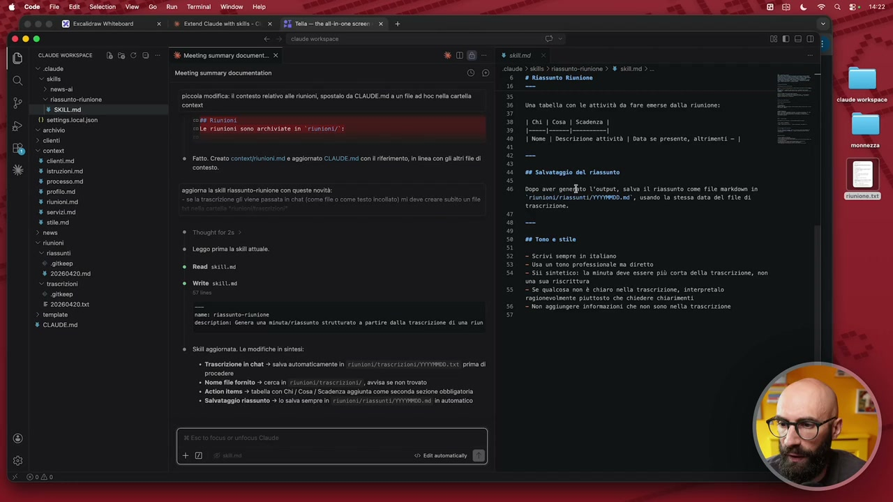

**Testo a schermo (OCR):** EB roccia Witeboard x Frtend Cine with sila x (Tala inenitinone sen x + D00 © > | lie ortgare cioe womspice | (BE C © - Meeting summary document. x # sind claude > alle > ri Speri Biccola modifica l contesto relativo al riunioni, spostalo da CLAUDE md a un fl ad hoc nel cartella ss does conto 38m taelta came atività gh fare qners dla riunione: (0 settings ocaljson 38 | Chi | Cosa | Scadenza | archivio 38 ESRI: i > clienti io | Wose | Descrizione attività | Data se presente, altrimenti — | < content n SS, + Fat. Creo comuni e agiata CLAUDE md con i ierimentoininea co lari tie di 12 tini ma Si dine Salvataggio del riassunto + processoma & % protto ms magia a sk issunto unione con queste novità 46. napo aver genefito l'output, salva IU risssunto cone file markoow in + servizi i + stema = ) © 040) sie riassunto runone > 8 siitimo stmmary documentation © © Meeting summary documentato ©) end sh ne oo è site fu Leggo prima asl attuato. sunt — serivi sempre in italiano see end sti 2 dsa va too professione a eiretto 1 2020042004 1 Sii sintetico; Multa devo essere più corta detta traserizion, non ig P'ad'oniciasta È alan retta trecrizione: stamrinto geo rogionevsisente piuttosto che chotere chiorieeti 5 2020020 = RCN aggimgere infornzioni che non seo ella trascrizione > tempio mei canone: cotone can SEIT esta a etica seta 1 prio ta resezione dl nn im ‘Sl aggiornata Le modifiche i sintesi “ Tracrizione in chat > salva automaticamente in riunioni /traszrizsoni/YYymeno.txe prima di procedera Nome file fornito > cora in riunioni/trascriz 1001), visa se non trovato * Acton ltems - tbel con Chi / Cose / Scadenza aggurta come seconda sezione obbigatria * Salvataggio rissunto > o salva sempre n Fiunioni/iassunt/YYY}MG0.n% in automatico Des

> Per esempio, adesso la proviamo subito. Diciamo che io in riassunti, vi ricordate? Qua in riassunti c'è il vecchio file. Diciamo che lo cancello. Faccio una cosa che non si dovrebbe fare. Lo cancello solo per far vedere che lo rigenero. Adesso gli do riassunto riunione. E poi gli dico il nome del file. 2026. Perché vi ricordate? Adesso se gli do il nome del file lui lo capisce. 0420. Lui cosa fa? Siccome gli ho dato il nome del file, va nella cartella trascrizioni. Trova questo file. Vedete? Eccolo qua. Lo sto leggendo. E mi genera in automatico il riassunto salvandomelo qua dentro. Dice ecco qua. Ti genero il riassunto e lo salvo. Ora me lo fa vedere a schermo ovviamente. Però se vogliamo gli diciamo non me lo far vedere mai a schermo. Salvalo solo. Adesso lui farà tutte e due le cose. Eccolo qua. L'ha generato. Ce lo apriamo. E lo guardiamo in anteprima. Punti discussi. Action items. Chi deve fare cosa? Eccolo qua.

## [00:20:00] Schermata 20 _(periodic)_

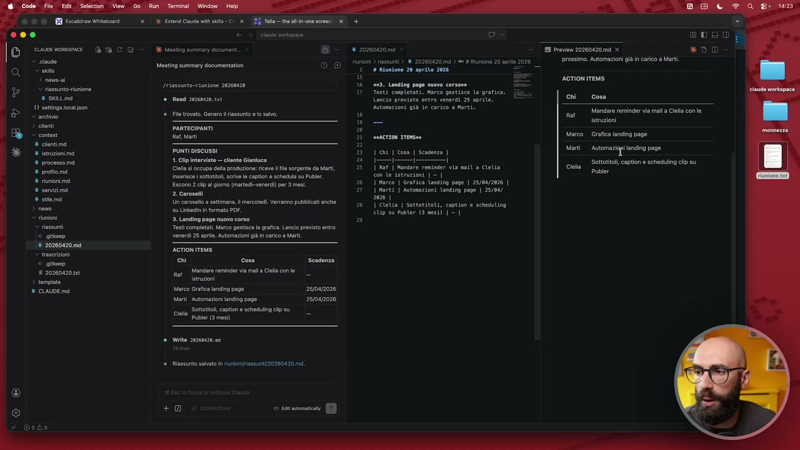

**Testo a schermo (OCR):** ® Etna Ciao wai Ci x Tala inealkicone seen (+ D00 cla orpare EDO ivoe womsmicE X Meeting summary Socument + 202604204 I Previem 20260420.md X *0 0 Sta urion > isunt > 420, 3 Riunione 20 apre 2 prossimo. Automazini già in carico Mart. saude es L4O % 20260420;md > Riunione 20 apri 2029. ae 1 # Riunione 20 aprile 2826 Salina 1 ACTION ITEMS Lrsassunto=riunsone 20260428 È sed. Landing page muovo corsose © fiassunoiunione 17 Testi completati. Marco gestisce La grafica + slm © Rena 2026008. Lancio previsto entro veneral 25 sprile. (0 settings ocatjson Automazioni giò in carico a Marti. i Fe troia, General ssinto 010 sato. Rat Mandare reminder via mai Ciel con le Istruzioni > clienti merce el a dec CECSEA + cin XE + sanziona Suitho] 4 Chi | Cosa | Scadenza | i ina 8 processi 1 Clip interviste — cliente Gianluca ini I e Cla stccupa del produzion: iceve 1 le sorgente da Mart, RAS | Mandare reminder via mail a letta ce inserisco sottili si o schecile si con le istruzioni | | URSEIa) sotto la capuon e schedua su Publ Escono 2 cl al giorno (martaai-venerd) per 3 mes. | Marco | Grafica landing page | 25/84/2026 | % serviine Sesia | arti | Autosazioni landing pane | 25/94/ 4 stima 2026 | Mr I NRE | Cletia | Sottotitoli, caption e scheduling gu Lidi in formato PDF cLip su Pubter (3 mess) | — | 3. Landing page nuovo corso Testi completati. Marco gestisce la grafica Lancio previsto entro venerdì 25 apri. Automazioi già in carico a Mart Chi Cosa Sottotitoli, caption e scheduling clp su Publer ‘action TEMS chi cosa gieep 5 2026082008 ‘a Mandare reminder ia mal Ciel cn le > template stazioni * CLAVDE Marco Grafica landing page 25/04/2028) Marti Automazioni landing page 25/04/2028) Clata Sotottt, canton e scheduing cp su Riassunto salato i inioniiassun/20250420.md. © 10 sim

> Con cosa deve fare. E questo ce lo possiamo chiudere. Questa è la nostra seconda versione della skill. Che potrebbe ancora evolvere. Potrebbe diventare. Aggiorna ulteriormente la skill. E mettiamoci una funzionalità. E aggiungi una. Facciamo così. Le persone che devono fare delle cose. Quindi qua per esempio ci sono dei task assegnati. Quindi che ne so. Raf deve mandare un reminder. Marco deve fare la grafica della landing page. Marti deve fare le automazioni. Clelia deve fare i sottotitoli. Facciamo che mi deve preparare anche delle mail. Quindi ho le mail pronte per tutte le persone che devono fare queste cose. Facciamo un altro esempio. E aggiungi una. Qua ovviamente gli potremmo dire che vogliamo tutto nel file di riassunto. Oppure potremmo fare una nuova cartella che si chiama email. Oppure se siamo un po' più smanettoni abbiamo collegato direttamente la nostra gmail. No possiamo fare mille cose. Facciamo la versione semplice. Aggiungi una nuova sezione.

## [00:21:00] Schermata 21 _(periodic)_

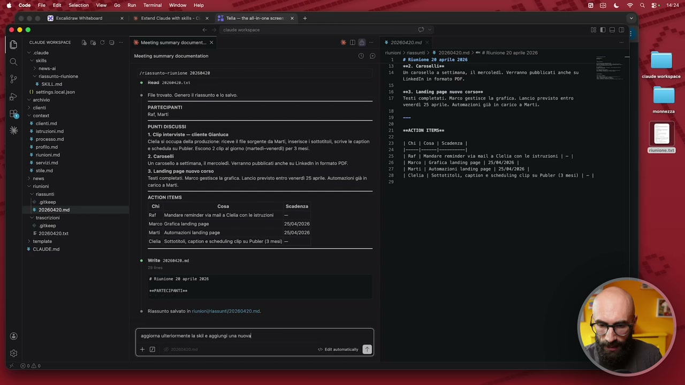

**Testo a schermo (OCR):** RD eacaiiom Wiebooni x (3 Frtnd Ciao with stita- x] Tala the alice creo @ cuoivomnce Dt % Mosting summary document. x # 20260420m4 > claude RIE @ riunioni) riassunti > 8 20260420 >= Riunione 20 sprle 2026. Qu ve inni DO 1° e Riunione 20 aprite 2026 Scan 33 sez. Coresettise Lesansunto=rsuntone 20260420 14 Un carosello a settimana, {l mercoledì. Verranno pubblicati anche su fo“ rsmmosiione USnkegin in formato POF. Epi Hana 20260020. 008 (0 settings ocatjson n ZA 203. Landing page nuovo corsore È | Sarciio 1 Rea: Ganare N feeunia ab so Testi completati. Marco gestisce La grafica. Lancio previsto entro Sissi aemEcIEANTI venerdì 25 aprile. Aitomazioni giò in carico a Morti. < content Rat rt dirne SE) sila rsa) nc rn 1.0 trito — ante cente Ti ci aa prin er 1 prada rt nre vo st li co PE Preso (Seni 1 reno 2 cern (enna e eine sein {CES ina pri Verano paia it i Ud hi ft PO Taro rac tantino pese ars Fica IRE 1 BOC | Atomi tin pe | sro es | Clelta | Sottotitoli, caption e scheduling clip su Publer (3 mesi) | = | leges OI % processoma * protiome = ACTION ITEMS ia ci cosa Scadenza sg Rat - Mandare reminder ia mal a Ciel cn i istruzioni ‘| — Sea Marco Grafica landing page 25/042028 5 2026082008 nari Aztomazini ancing page 25/04/2026 > template Clala Sottili captin e scheduling clp su Publr (3 mes) — # CLAVDE md Wii aezcnaz. i 8 Rtantone 20 aprite 2028 Riassunto salato i uniniiassun/20260420.md. spgionauteriomenta la i aggiungi un nuov

> Che si chiama email da mandare. Dove ci scrivi. Le email che devo preparare per le varie persone con i task a loro assegnati. E facciamo così. Tieni le mail semplici, brevi e informali. Ovviamente qua dipende da quello che volete voi. Potete dire le mail devono essere invece molto dettagliate. Devono essere in inglese perché parte del mio team si trova oltreoceano. Devono essere molto formali. Perché noi siamo formali quando scriviamo. Però vediamo adesso come sta lavorando la nostra skill. Ci apriamo sempre qua il file. Andiamo a vedere se l'ha fatto già. Ci dice ecco qua. Adesso c'è anche una terza sezione. Per ogni persona che ha action items scrivi una bozza di mail. Una mail per persona anche se ha più task. Questo l'ha dedotto in automatico. Però è la bellezza di cloud. Struttura della mail è A nome della persona.

## [00:22:00] Schermata 22 _(periodic)_

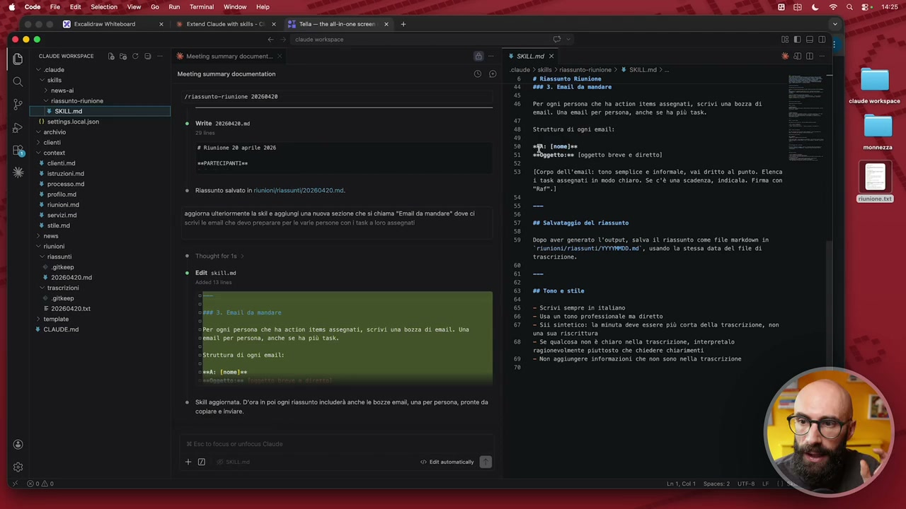

**Testo a schermo (OCR):** 3 xosting summary document. C) Meeting summary documentation (ORO) Lrsansunto=rsuntone 20260428 _0 settingsJocatjson archivio > cileni > content % cientima 8 istruzioni + processo.md 4 proiome riunioni 8 serviine 4 atlemd riunioni > riassunti giceep + 20260420. * wascrizioni © gite 5 20260820. > tempiato + ciAUDEmÀ è Write 226040. 1 Autre 20 apre 2026 = Riassunto salato i runinassunt}20260420.md. sagiona ulteriormente i sil è aggiungi una nuoia sezione che sl chiama “Ema da mandare" dove i nc o el ch devo papararo perle vari persone co task a oro assegna Though fo a =. kl aggiornata. D'ora po ogni assunto includerà anche e bozze ema una par person, pronte da copiare e inviare. e + squtmd x ‘sinuose rassunto-riunione > 8 SKILL ma > ss # Riassunto Riunione 08 3. Enail da mandare Per ogni persona che ha action itens assegnati, scrivi una bozza di esail. Una email per persona, anche se ha più task. Seruetura di ogni esili Rieti feta cere dieta Corpo dell'est: tono semplice e informale, vai dritto al punto. Elenca 1 task assegnati in nodo chiaro, Se c'è una Scadenza, indicata. Firma con smart.) 00 Sotvatoggio del riassunto 00p0 aver generato l'output, salva il riassunto come file merkdom in *eiunsoni/Flassunti/TIYMOO.ed', usando la stessa dota del file di rrascrizione. ne oro e stite — Scrivi sempre in itotiano — Usa va tono professionale na diretto — SÌi sintetico: la minuta deve essere più corta della trascrizione, non cina suo riscrsttura — Se qualcosa non È chiaro nella trascrizione, interpretato ragionevolmente piuttosto che chiedere Chiarimenti — Non aggiungere informazioni che non sono nella trascrizione UO CAI Sona UTEO

> Oggetto breve e diretto. Corpo della mail. Tono semplice e informale. Va dritto dal punto. Allenca i task da fare. Firmala con RAF. Questo l'ha capito in automatico ovviamente. Quindi la skill è aggiornata. Però il nostro file non è aggiornato. Vedete il file di riassunto che abbiamo. Gli manca la sezione. Quindi dico usa subito la skill aggiornata. Per aggiornarmi il file di riassunto creato poco fa. Quindi è come se stessi lanciando di nuovo la skill. Ma senza fare il comando slash riassunto riunione. Perché abbiamo detto che le skill le possiamo lanciare anche così. Scrivendo qualcosa che cloud capisce che la stiamo invocando. E adesso ho detto usa la skill. E lui ha capito che deve chiamarla. Vedete ha chiamato la skill riassunto riunione. Quindi adesso il file questo qua. Che aveva solo la sezione punti discorsi e action items. Avrà una terza parte. Che si chiama email da mandare.

## [00:23:00] Schermata 23 _(periodic)_

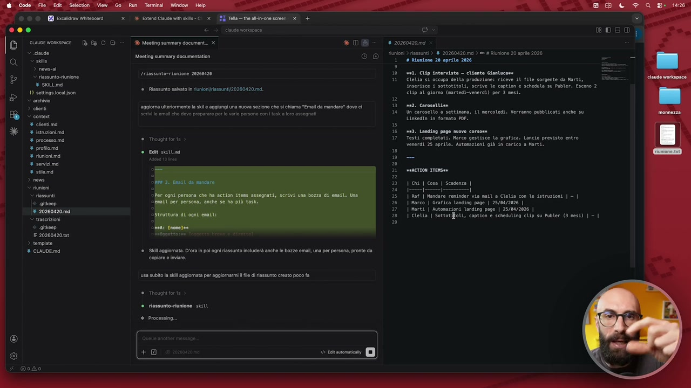

**Testo a schermo (OCR):** © © RD Pacs Witnboard “x | VE Exte Cine with silo- © x (8 Tia ieailinone screen (x + c00 © > ln ovispace & cioe wossnice | [a fa CD > 6 Meeting summary document. x # DB» 2026o4zama Salis Is e oo 1 # Riunione 20 aprile 2026. } === iero 1) settings Jocaljson sciatori pria clip al giorno (martedi-venerdì) per 3 mesi. dee = —==re ce cr DES Vione LinkedIn in formato POF. .—_- i Atmecozza Vreni CR % riunioimd > # serviine pece dette È menCTIO TESA > i © ressuntoriuione | chi] cosa | Scadenza | III: I | Raf | Mandare reminder via mail a Clelsa con le istruzioni | - | Morco | Grafica landing poge | 25/04/2026 | | Morti | Autonozioni landing page | 25/04/2026 | | Clelia | Sottotffoli, caption e scheduling cUp su Pubter (3 mesi) | = | E 2026042008 mttateo 1 > template + CADE md ® Sklleggornata D'ora in ol ogni assunto Included anche le bozzo ema una per persona, pronte da copiare 0 iva. (sa subito a sl aggiomata per sggiomnarmi | le di riassunto creato poco fa © Tnavgnt forte è. rissnunto-riunione sti * Processino sul

> Non mi ricordo se era email o email da mandare. E ci aggiungerà la mail per Marco, per Marte, per Clelia. Con le cose da fare. Guardiamolo in azione. Vedete alcune cose le ha capite in automatico. E ricordatevi che potete sempre andare a lavoro sulla skill. Quindi se non ci piace la apriamo. E diciamo no però non la voglio. Se non voglio la firma con Raph. Se deve firmare Raphael e Guy top. Potete fare quello che volete voi. Eccolo qua. Dovebbe averlo già modificato. Eccolo qua l'email. Ce l'abbiamo bella pronta. Ciao Clelia. Tema di dettagli per le varie clip. Interviste di Gianluca. Deriverà il file sorgente da me. Devi inserire il sottotitolo. Scrivere le captions. Schedularle su Publer. Fammi sapere se hai dubbi. Raph. Cioè capite quando sta roba inizia da usarla. Sui vostri file. Con il vostro team. Sui progetti veri. Quanto può essere integrata nei vostri processi. Ciao Marco. Abbiamo finito i test della landing page del nuovo corso. Ora tocco la grafica. E tempo fino a venerdì 25. Ciao Marte. Ti ricordo che mancano ancora le automazioni. Firmato Raph. E così via. Spettacolare.
