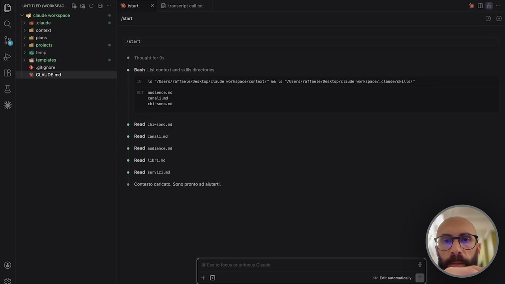
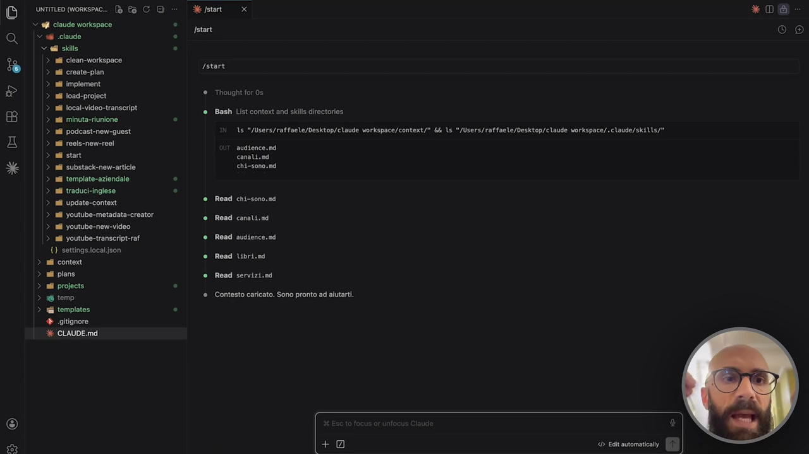
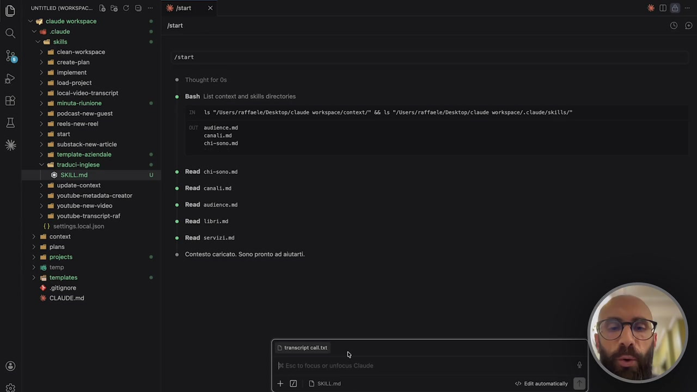
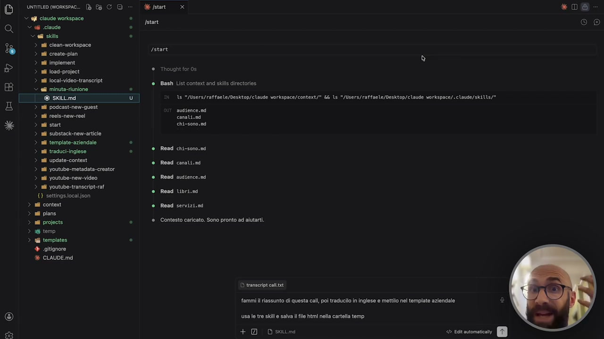
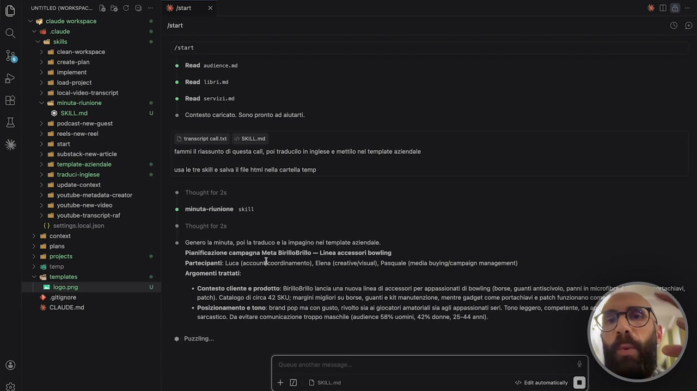
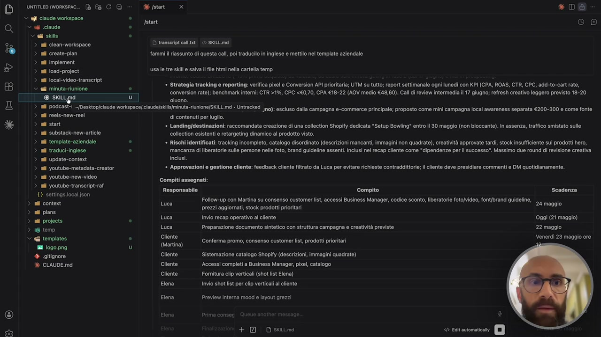
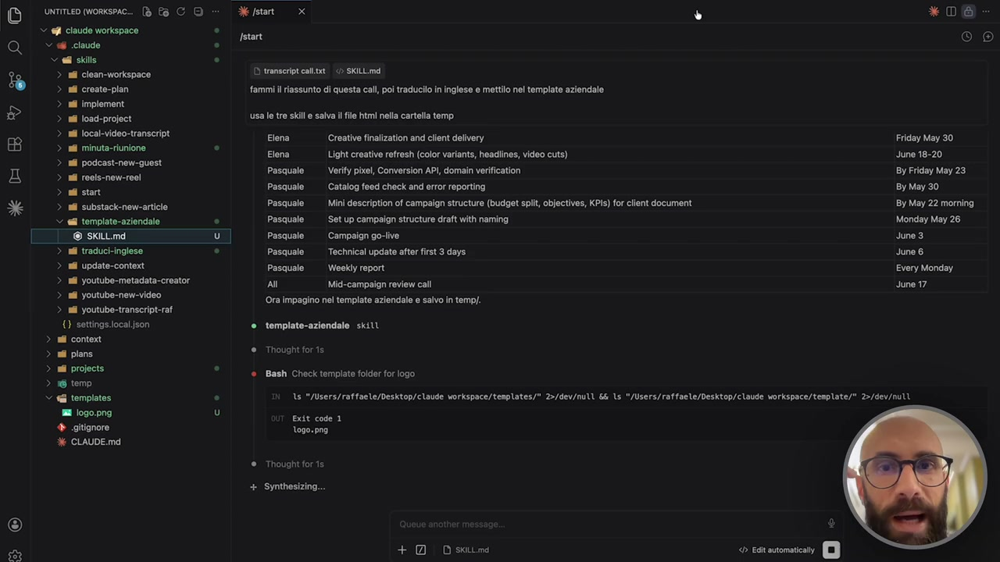
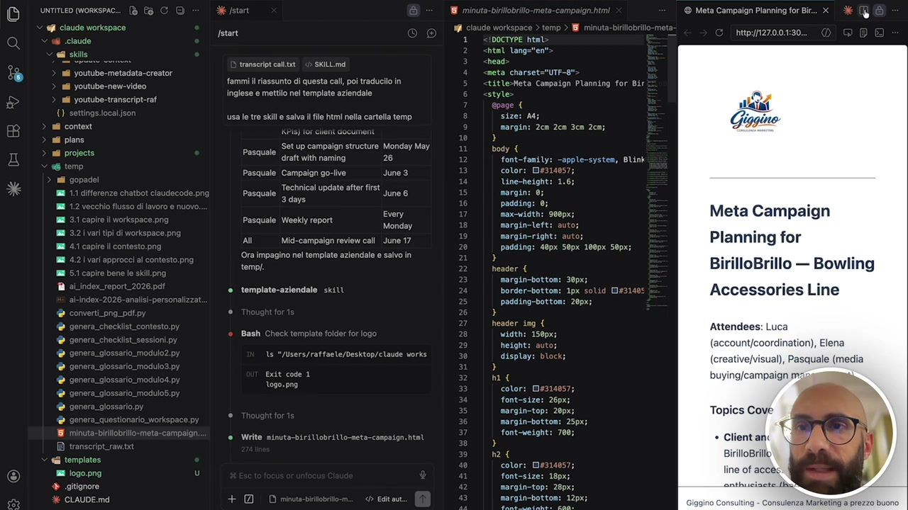
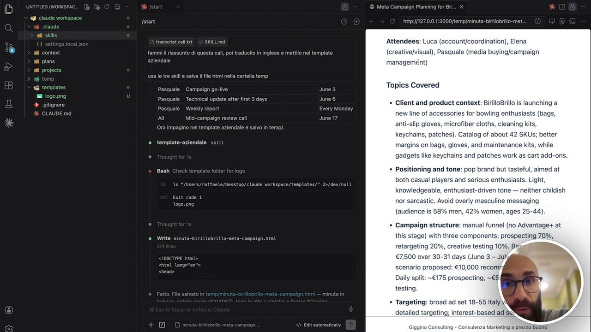

# La potenza di concatenare le skill

> Documento generato automaticamente: trascrizione e screenshot sincronizzati del video-corso.

## [00:00:00] Schermata 0 _(start)_

**Testo a schermo (OCR):** *K ER 9 0 O) unTitLED worispAc.. (è 6 CO = Selstat xD transoriptcalltat *0@ Veg ciaudo workepace . Jatare (CHO) > 86 claude . > all contest > all plans E L0 istart > 3 temp ina + * Thoughtforos SELE ® Bash List context and ski directories À CLAUDE.md ts "/users/raffarle/Desktop/claude vorkspace/context/" 65 ls !/Users/raffaele/Desktop/claude vorkspace/: claude/ski115/* augience.nd canatiood è Road chi-sono.s4 Read * Read conoti.nd * Read ausience,nd è Read Ubri.sg è Read servizi.ni ® Contesto caricato. Sono pronto ad aiutarti. < East automatica

> Passiamo dalla teoria della pratica e vediamo concretamente cosa significa poi poter concatenare le skill. Faccio proprio l'esempio che vi ho fatto vedere prima in teoria. Quindi partiamo dall'avere una la trascrizione di una call. Questa è una call tra tre persone che si chiamano Luca, Elen e Pasquale stanno discutendo di delle campagne per un cliente. Il cliente si chiama Birillo Brillo, tutto inventato ovviamente, è come sempre un cliente che si occupa di accessori per il mondo del bullying. Io qua ho le tre skill che prima abbiamo visto teoricamente. Ovviamente anche queste qua diciamo sono sono fatte per l'esempio. Quindi c'è una skill che si occupa di fare la minuta della riunione, che si chiama minuta riunione, che quindi io potrei invocare così. Minuta, vedete, trattino riunione. Poi c'è una skill che si chiama traduci inglese, che quindi potrei invocare con traduci inglese. E poi una skill che si chiama template aziendale, che potrei invocare con template trattino aziendale. Ripeto, le skill adesso qua sono per un esempio. Minuta riunione è una skill

## [00:01:00] Schermata 1 _(periodic)_

**Testo a schermo (OCR):** O) unTITLED (woRkspac.. ® Pa C Q S qgi claude workspace . Val claude . vali ski . > al ciean-workspace > ail create-plan > sl implement. > ii load-project > ail local-video-transcript > al minuta-riunione ° > ail podcast-new-guest > ail reels-new-roe! > nil start > al substack-new-articie > nl template-aziendale ° > ail raduci-inglese . > ail Update-context > ail youtube-metadata-creator > il youtube-new-video > all youtube-transcript-raf {) settings.local;json ui context ni plans i projects . 36 temp ii templates . + .gitignore E CLAUDE.md dept x start Istart ® Thought for 0s ® Bash List context and skills directories ls "/Users/raffaele/Desktop/claude workspace/context/" && ls "/Users/raffaele/Desktop/claude vorkspace/.claude/ski115/" audience.nd canali.ad chi-sono.md ® Read chi-sono.sd ® Read canali.n4 ® Road audience. nd ® Read Ubri.nd ® Read servizi.nd ® Contesto caricato. Sono pronto ad alutart. < EGit automatica Ùì * D@&

> molto utile, potrebbe essere utile veramente in un caso reale. Anche template aziendale, uno potrebbe dire che è raffa, però la traduzione in inglese la fa in automatico, no? Tutti gli strumenti Gemini, c'è RGPT, Cloud, e così a basso che è scritto traduce in inglese. Però io qua per esempio mi sono inventato che questa skill traduce in inglese però in un modo specifico, quindi utilizzando inglese americano, usando uno stile, un tono di voce non formale. Quindi immaginate questa skill fatta molto molto bene, potrebbe avere delle regole specifiche perché magari nel vostro settore certi termini si devono tradurre in un certo modo, c'è un dizionario, un vocabolario da rispettare, c'è, che ne so, uno stile particolare da seguire e così via. Quindi magari abbiamo l'esigenza di una skill che ci traduce in inglese ma seguendo delle regole precise. A questo punto cosa faccio? Diciamo faccio l'upload del file dal computer, quindi diciamo lo metto qua in chat come allegato perché è un file pesante, quindi diciamo non lo copio e incollo, però se fosse una riunione di dieci righe posso pure copiarlo e incollarlo. E poi, diciamo, scrivo a Cloud cosa deve fare. E vedete

## [00:02:00] Schermata 2 _(periodic)_

**Testo a schermo (OCR):** © ume orse. BC O Merstat x *D@ claude workspace Mii (Co) è rotore > > B PETE ATIAI ‘® Bash List context and skills directories Vi eo a la 16 */sers/raftaele/nesktop/claude vorkspace/context/ Ki 3 */isers/raffaele/nesktop/claue vorkspace/iclaue/skitis/* A ==> > ni start canali.nd SY > na substacicnon ciro nd > ul tempiao-aziend . ef racuciingeso : pope ul 2 MI Update conta ® Read canali.md > mil youtube-metadata-creator > sl yostube-new-video è Rod audtene.mi > mi youtube-transcript-raf è Read Ubri.nd {} settings.local.json ai context ® Read servizi.nd a plans na ica È ® Contesto caricato. Sono pronto ad aiutarti. 2 temp Ri templates . + .gitignore %* CLAUDE.md D transcripr callixt O)

> come faccio. Non faccio più slash e chiamo la skill perché sto facendo la concatenazione, quindi racconto, vi ricordate il risultato che voglio, in Cloud si ragiona in questo modo, fammi riassunto di questa call, questo chiamerà in automatico la skill che si chiama minuta riunione. Perché? Perché questa skill capisce, ve la faccio vedere, ve l'apro, perché questa skill capisce tutte queste cose, cioè tutte le volte che qualcuno scrive minuta riunione, verbale riunione, riassunto meeting, trascrizione meeting, sono tutti dei trigger, no? Sono delle parole chiave che Cloud capisce, dice oh, Raffaella ha scritto riunione, quindi devo fare quello. Non è che devo essere preciso, meeting, riunione, minuta, riassunto, no, sono tutte parole che io metto nella descrizione della skill in modo tale che Cloud le individua. Questa cosa è potentissima, cioè sapere che le skill non si invocano solo con slash, nome skill, ma vengono capite

## [00:03:00] Schermata 3 _(periodic)_

**Testo a schermo (OCR):** D smmeomonsie. BC Merstat x *D@ ‘fi claude workspace . start (Cc) 6 sins . Vadis . » a cean-mortapace (29 Fe pre > nil create-plan ® > Hi ingioment ale e rough oro» B ei loca Tanaro ® Bash List context and skills directories x e mint rione È [ © skilL.imd on ls "/Users/raffaele/Desktop/claude workspace/context/" && ls "/Users/raffaele/Desktop/claude vorkspace/. claude/sk!15/" DO > n poscest-renquest == 1 recon camici gl caz Gili 1 substacicnemrtce 14 empine aziendale . ni traduci-inglese . ui Update-context ii youtube-metadata-creator. nti youtube-new-video ® Read audience. nd uti youtube-transcript-raf {1 settings.local.son ai content ® Read servizi.nd ni plans fi projects 5 ® Contesto caricato. Sono pronto ad alutarti. 36 temp "ii templates . + .gitignore % CLAUDE.md Read ® Read conali.nd ® Read libri.nd D transcriptcallixt fammi il riassunto di questa call, poi traducilo in inglese e mettilo nel template aziendale 8 O) usa le tre skill e salva file html nella cartella temp

> dalla chat è una roba potentissima. Fammi riassunto di questa call, poi traducerlo in inglese e metterlo nel template aziendale. Vedete, ho proprio raccontato quello che voglio. Per essere molto esplicito ho scritto anche usa le tre skill, ok? Ma lo fa in automatico, però vi voglio far capire proprio quello che stiamo facendo. Salva il file html nella cartella temp, quindi qua c'è una cartella temporanea di cui abbiamo già discusso, e qua dentro mi farò mettere il file che salverà in output. Tra l'altro io ho preparato anche dentro la cartella template un logo, ho inventato così un logo al volo, diciamo, di questo freelance che si chiama Gigino, e adesso diamo invio. Abbiamo il file caricato qua dentro, diamo invio. Quello che vedremo è che nell'elaborazione, quindi quello che adesso Cloud Code farà, vedete ha chiamato la prima skill, vedete qua col pallino verde ha chiamato la skill che si chiama minuto regnone e sta partendo. E adesso qua ci inizia a mettere l'output in chat, perché? Perché questa skill fa questo, l'output lo mette in chat, non è una skill che

## [00:04:00] Schermata 4 _(periodic)_

**Testo a schermo (OCR):** © ® "S *X cea O) unTITLED (Workspac.. [è Pe C Q V gli claude workspace # claude Sell skills SASA > ail clean-workspace > ail create-plan > al implement. > all load-project > al local-video-transcript © al minuta-riunione ® sKiLL.md > ail podcast-new-guest > ail reels-new-reel > ni start > al substack-new-article > nil template-aziendale > af traduci-inglese > ail Update-context > ail youtube-metadata-creator > ai youtube-new-video > all youtube-transcript-raf {} settings.local.json ai content ai plans nf projects #6 temp i templates I iogo.png + ogitignore % CLAUDE.md Versa x start Istar @ Read audience.sd è Read Libri.mi ® Read servizi.nd ® Contesto caricato. Sono pronto ad alutarti. DD transeript cala. <> SKILL Md fammi l riassunto di questa call, poi traduci in inglese e mettilo nel tempia usa le tre ski e salva i file html nella cartella temp. ® Thought for2s @ minuta-riunione. skill ® Thought for 25 ® Genero la minuta, poi la traduco e la impagino nel template aziendale. Pianificazione campagna Meta BirilioBrillo — Linea accessori bowling Partecipanti: Luca (accounifcoordinamento), Elena (creative/visual), Pasquale (media buying/campaign management) Argomenti trattati: + Contesto cliente e prodotto: iriloBrilo lancia una nuove » Posizionamento e tono: brand pop ma con gusto, rivolto si * Puzziing... iea di accessori per appassionati di bowling (borse, guanti antiscivolo, panni in microfib patch). Catalogo di circa 42 SKU; margini migliori su borse, guanti e kit manutenzione, mentre gadget come portachiavi e patch funzionano cor i giocatori amatoriali sia agli appassionati seri. Tono leggero, competente, da sarcastico. Da evitare comunicazione troppo maschile (audience 58% uomini, 42% donne, 25-44 anni). DI skittimd * D & (0) ®

> salva su file, l'abbiamo progettata volutamente così perché magari la vogliamo utilizzare in vari modi. Ovviamente quando mi vado a progettare la skill, che ne so, qua dentro è minuto regnone, io posso mettere, in base a come il cliente la chiama, metti l'output in chat o metti l'output in un file. Quindi ve la potete personalizzare come come volete voi. Qua per semplificare l'ho messo a schermo così lo vedete che sta facendo. Adesso che ha finito, anzi non ha finito, sta facendo l'ultima parte della minuta, quindi vediamo cosa ha fatto. Ci ha fatto il titolo della minuta, i partecipanti, quindi c'è Luca, c'è Elena, c'è Pasquale, ha dedotto dalla trascrizione che uno è l'account, uno è il creativo, uno si occupa della campagna e così via. Gli argomenti che sono stati trattati sono questi e così via. Vedete adesso ci fa pure una tabellina perché dentro quel file io ho detto voglio la tabella con i compiti, ok? Quindi dopo la riunione voglio Raffaele deve fare questo, Pasquale deve fare questo, Elena deve fare questo, Francesca deve fare questo, glielo ho detto io nella skill e adesso che ha

## [00:05:00] Schermata 5 _(periodic)_

**Testo a schermo (OCR):** untimeD (workspac.. [è Pe C O Velstar x * D@ ‘efi claude workspace . V sl claude . ved skils . ii ciean-workspace D transeript callt. <> SKiLL.md start (Co) nti create-plan fammi riassunto di questa call, poi traducilo n inglese e mettilo nel template aziendale ai implement. nf l0sd-profect usa le tre skl e salva file html nella cartella temp nil local-video-transcript @ minuta-riunione . © ski god UI] VIRAANIRIS + Strategia tracking e reporting: verifica pixel e Conversion API prioritaria; UTM su tutto; report settimanale ogni lunedì con KPI (CPA, ROAS, CTR, CPC, add-to-cart rate, conversion rate); benchmark interni: CTR >1%, CPC <€0,70, CPA €18-22 (AOV medio €48,60). Call di review intermedia il 17 giugno; refresh creativo leggero previsto 18-20 aiuono. ? all podcast-i -/Desktop/claude workspace[.claude/skllis{minuta-riunione/SKILL md » Untracked jno): escluso dalla campagna e-commerce principale; proposto come mini campagna local awareness separata €200-300 e come fonte >| 10 (reela-new-re61 di contenuti per luglio. > a start ‘+ Landing/destinazioni: raccomandata creazione di una collection Shopify dedicata "Setup Bowling* entro il 30 maggio (non bloccante). In assenza, traffico smistato sulle > alli substack-new-articie collection esistenti e retargeting dinamico al prodotto visto. > ai template-aziendale . * Rischi identificati: tracking incompleto, catalogo disordinato (descrizioni mancanti, immagini non quadrate), creatività approvate tardi, stock insufficiente sui prodotti hero, > ail traduci-inglese . mancanza di liberatorie sulle persone nelle foto, brand guideline assenti. Inclusi nl recap cliente come "dipendenze per il successo". Massimo due round di revisione creativa > ail Update-contert inclusi. Diva be paia osso » Approvazioni e gestione cliente: feedback cilente filtrato da Luca per evitare richieste contraddittori; Il ciente deve presidiare commenti e DM quotidianamente > all youtube-new-video Copri secegne S v na ail youtube-transcript-raf = = > {} settings.local.ison Follow-up con Martina su consenso customer list, accessi Business Manager, codice sconto, liberatorie foto/video, font/brand guideline, pai tica relegati soc peso pic 24 mezzo Vi coca e Crao Conferma promo, consenso customer list, prodotti prioritari pz moore a ea a “eis # Silorna Salle Cliente Fornitura clip verticali (shot list Elena)

> fatto questa cosa parte la seconda skill, vedete? E parte la seconda skill traduce in inglese. Qua ve lo sto facendo in maniera proprio no, vi sto portando per mano. Ovviamente questa roba voi poi la vedete a schermo, non è che tutte le volte ve la mettete a legge, però per farvi capire quella concatenazione che prima abbiamo visto in teoria sta avvenendo adesso nella pratica. Quindi questo output è passato alla seconda skill che adesso mi sta facendo la traduzione in inglese. Quindi vedete, stessa identica roba che ce la traduce in inglese ci fa la tabella, questa roba adesso viene chiamata, viene passata alla terza e ultima skill. Quindi la skill che si chiama template aziendale, la faccio vedere ma giusto tanto sono cose molto semplici. Dentro, ho detto semplicemente, ti arriverà un testo, questo testo me lo deve mettere in HTML, ci deve mettere il logo, ci deve scrivere il piedipagina, quindi il footer, deve usare il colore del testo, io ho messo pure dei colori, quindi blu scuro, blu chiaro e così via. L'ho fatta sfiziosa che uno volendo può pure cambiare il colore del testo quando la

## [00:06:00] Schermata 6 _(periodic)_

**Testo a schermo (OCR):** © smeomonseo. Dt C @ claude workspace Vi claude Sed sile al Dee nd create-pian © > > al implement > > ui 10ad-project adi local-video-transcript 88 > ag minuta-runione > ill podcast-new-guost pa > ii rools-new-reel > ali start > nil traduci-inglese > ail Update-context > ill Youtube-metadata-creator. > all youtube-new-video > all youtube-transcript-raf {} settings.local.json adi context ui plans ail projects = temp Gi templates a logo.png + itignore % CLAUDE.md ra O) Versa x (CC DD transeript calli fammi l riassunto di questa call, poi traducilo n inglese e mettilo nel templa © SKILL md usa le tre skl e salva file htm] nella cartella temp Elena Elena Pasquale Pasquale Pasquale Pasquale Pasquale Pasquale Pasquale Al Ora impagino ne ‘Creative finalization and client delivery Light creative refresh (color variants, headline, video cuts) Verify pixel, Conversion API, domain veriication Catalog feed check and error reporting Mini description of campaign structure (budget split, objectives, KPIs) for client document ‘Set up campaign structure draft with naming Campaign go-live Technical update after first 3 days Weekly report Mid-campaign review cal lel template aziendale e salvo in temp/. ® template-aziendale skill ® Thought for Ts ® Bash Check template folder for logo * D@& (Co) Friday May 30. ‘Juno 18-20 By Friday May 23 By May 30 By May 22 morning Monday May 26 June 3 June 6 Every Monday June 17 ts "/Users/raffaele/Desktop/claude vorkspace/tenplates/" 2>/dev/null && ls "/Users/raffaele/Desktop/claude workspace/tenplate/" 2>/dev/null Exit code 1 logo.png ® Thought for is + Synthesizing... DI sxittima RSS =)

> la invoca. Ovviamente poi quando ve la fate voi, ve la fate per bene, ve la fate bella lunga, ve la fate con tutte le cose che vi servono e così via. E adesso sta facendo il file. Dice ho finito, ecco il file, si chiama minuta birillo brillo meta campaign punto html. Se adesso ci clicco sopra, ovviamente qua sto vedendo il codice ma ricordatevi che potete vedere sempre l'anteprima, eccola qua, vediamocela, ecco

## [00:06:19] Schermata 7 _(scene)_

**Testo a schermo (OCR):** (6) nc. ® La de WJi claude workspace Jatart sì claude transeript calltxt: <> SKILL md ni youtube-metadata-creator fammi riassunto di questa call, poi traducllo in sil youtube-new-video inglese e mettilo nel template aziendale il youtube-transcript-raf O usa le tre skill © salva file html nella cartella temp aid context Mr Pasauale Set UP campalan structure. Monday May sa poro ‘259U2Ie. draft with naming 26 “ Pasquale. Campaign go-live June 3 ia ian gi E Technical update after first = Pasquale a) 3 days = E ‘very Pasquale Weekly report i si Dir Monday = Al Mid-campalgn review call June 17 = ign review call Ji = Ora impagino nel template aziendale e salvo in 5 pr LI ® template-aziondale skilt è . ni è Bash è è Ls */Users/raffaele/Desktop/claude works ® x Exit code 1 è logo. png ® e è n @ Write ninuta neta-canpaign. htm templates. a iogopng ll & gitignore X CLAVI + Edita Ul DOCTYPE html ‘htm Lange"en". head: meta charset="UTF-e": titlesMeta Campaign Planning for Bir style page { size: AG; margin: 20m 2cm 3cn 208; ) body { font-family: -apple-system, Blink color: E5314057; Une-height: 1.65 margin: 0; padding: 0; maxwidth: 900px; margin-left: margin-right: auto padding: 40px 50px 100px S0px; } header { margin-bottom: 30px; border-bottom: 1px solid [Is3140 padding-bottom: 20px; } header ing { width: 150px height: auto; display: block; } hic color: Ee314057; font-size: 26px; margin-top: 20px; margin-bottom: 25px; font-weight: 700; } h2 4 cotor: De3 font-size: 18px; morgin-top: 28px; margin-bottom: 12px; ® Meta Campaign Planning forBir.. x - fg http:/127.0.0.130. alata Giggino Meta Campaign Planning for BirilloBrillo — Bowling Accessories Line Attendees: Luca (account/coordination), Elena (creative/visual), Pasquale (media buying/campaign mg Topics Cove BirilloBrillo line of accès anthuciaete Mau ulting - Consulenza Maatinga prezzo buono

> qua. Ci ha fatto il nostro bel file che io adesso piglio e passo al mio al mio capo. C'è tutte le caratteristiche che gli abbiamo detto, vi ricordate? C'è il logo qua in alta a sinistra, ha utilizzato quel blu scuro che è del nostro brand, ha mantenuto la formattazione originale, quindi i titoli diciamo le sezioni, vedete gli elenchi puntati, cos'altro gli avevamo detto di cose da fare? Ah, gli avevamo detto di mettere il footer qua in basso, Gigino consulting, consulenza marketing, apprezzo buono e così via. Ovviamente sono esempi molto molto semplici, però avete visto in azione la potenza di concatenare le skill. L'output del primo cos'era? Era un testo in italiano, è diventato l'output del secondo, che che doveva fare? Doveva semplicemente trasformare, tradurlo in inglese mantenendo tutto uguale, quindi non mi impattare diciamo su quello che vedo, formattazione, stile, struttura, colori e così via. L'output del secondo è diventato l'input del terzo, che semplicemente cosa fa? Lo

## [00:07:19] Schermata 8 _(periodic)_

**Testo a schermo (OCR):** è content plans ® .gitignore cLAVI E.md fstart fammi i riassunto di questa cal, poi traducilo in inglese e mettilo nel template aziendale usa le tre skill © salva i file html nella cartella temp Pasquale Technical update atter first 3 days June 6 Pasquale | Weekly report Every Monday A Mid-campaign review call June 17 Ora impagino nel template aziendale e salvo in temp/. ® templato-aziondale skill Bash @ Write sinuta-biriUobrit son. html <1DOCTYPE Campaign Planning for ttp://127.0.0.1:3000/temp/minuta-birillobrillo-met. Attendees: Luca (account/coordination), Elena (creative/visual), Pasquale (media buying/campaign managemdnt) Topics Covered + Client and product context: BirilloBrillo is launching a new line of accessories for bowling enthusiasts (bags, anti-slip gloves, microfiber cloths, cleaning kits, keychains, patches). Catalog of about 42 SKUS; better margins on bags, gloves, and maintenance kits gadgets like keychains and patches work as cart adi Positioning and tone: pop brand but tasteful, aimed at both casual players and serious enthusiasts. Light, digeable, enthusiast-driven tone — neither childish nor sarcastic. Avoid overly masculine messaging (audienci % women, ages 25-44). Campaign structure: manual funnel (no Advantage+ at this stage) with three components: prospecting 70%, rgeting 20%, creative testing 10%. Bi €7,500 over 30-31 days (June 3 — Jul cenario proposed: €10,00 recomi[ Daily split: -€175 prospecting, —€S( testing. Targeting: broad ad set 18-55 Italy\\ detailed targeting; interest-based ad èN .nza Marketing a prezzo Buona

> prende e lo impagina. Immaginate questa roba fatta veramente nel vostro lavoro, vi impaginate i documenti in un secondo. Non solo, se avete tanta roba vecchia, tanto storico, una cartella dentro con dentro 100 documenti e volete impaginarli, voi lanciate la skill e gli dite, oh vai in questa cartella che si chiama vecchi preventivi, impaginali tutti con il nuovo template che ti ho fatto, che ti ho preparato, col logo nuovo, i colori nuovi, l'impaginazione nuova, bam, invio, lui fa partire le chiamate, lavora in maniera agentica, le fa partire pure in parallelo e così via e in qualche secondo vi fa tutta questa roba in automatico. Questa funzionalità è potentissima, imparate a utilizzarla bene perché questa fa la differenza poi nell'uso quotidiano.
