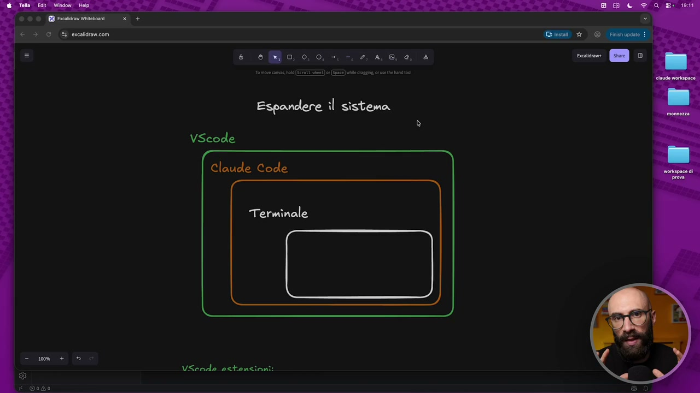
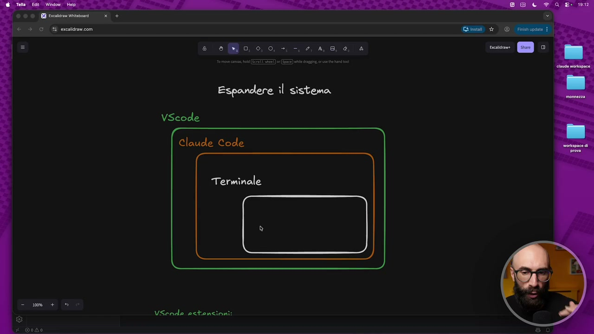
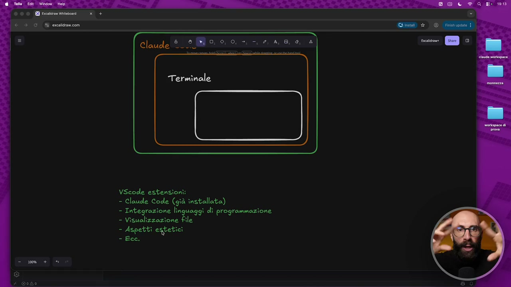
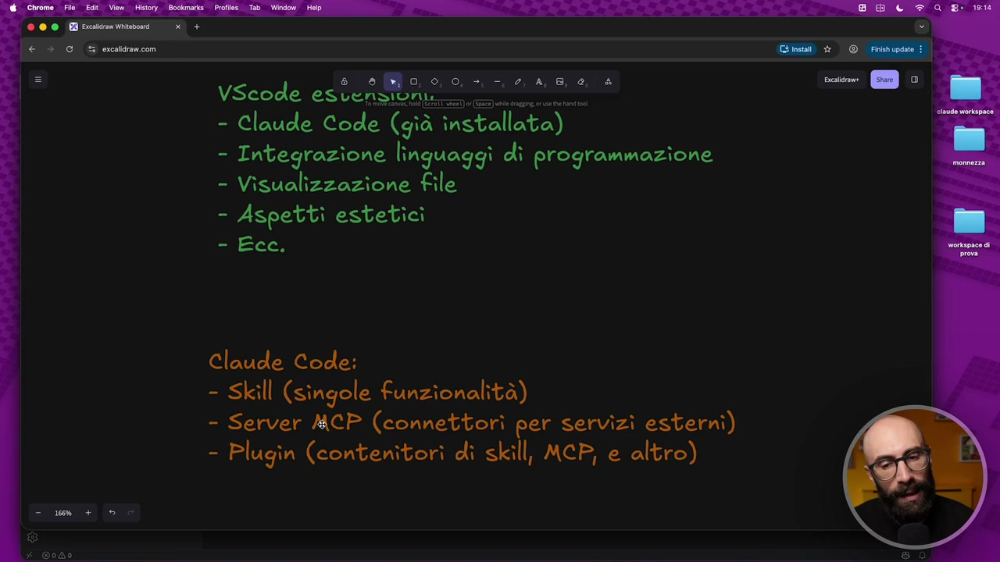
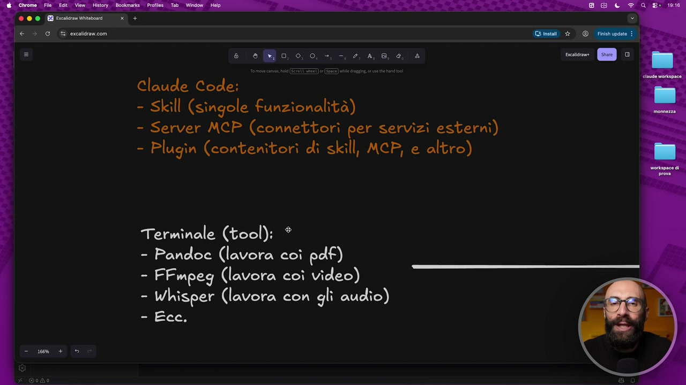

# I diversi livelli per estendere il sistema

> Documento generato automaticamente: trascrizione e screenshot sincronizzati del video-corso.

## [00:00:00] Schermata 0 _(start)_

**Testo a schermo (OCR):** Espandere il sistema VScode Claude Code Terminale VScnde ectanzioni:

> A mio avviso una delle cose più importanti da capire quando iniziamo a prendere confidenza con l'ecosistema Cloud Code e capire che abbiamo di fronte a noi una piattaforma, un'agente potente è il fatto che si può estendere all'infinito. Possiamo espandere questo sistema. Cosa intendo dire che si può espandere? Probabilmente l'avete già intuito nel corso di tutte le lezioni che abbiamo fatto fino ad ora e cioè che il punto di partenza dal quale siamo partiti è appunto un punto di partenza. Possiamo aggiungere nuove capacità e ci sono vari modi per farlo, o meglio non vari modi, è più corretto dire che ci sono vari livelli su cui questa cosa può succedere. Qua ho fatto come sempre un piccolo schemino riassuntivo per darvi anche un po' una passata veloce di teoria. Tra l'altro ho visto che state apprezzando molto questi schemini quindi anche questo potrete poi scaricarlo. Voglio farvi capire che quello che abbiamo noi adesso a disposizione è un sistema composto da vari

## [00:01:00] Schermata 1 _(periodic)_

**Testo a schermo (OCR):** Espandere îl sistema VScode Claude Code Terminale VSende astanzioni:

> elementi e ognuno di questi elementi può essere esteso, può avere delle nuove funzionalità. Allora questa cosa qua è una semplificazione grafica, non è esattamente così quello che sta succedendo. Qua si vede VS Code che contiene dentro Cloud Code che contiene dentro il terminale, non è proprio così, diciamo tecnicamente parlando. Però per farvi capire quello che sta succedendo, noi apriamo questa app che si chiama VS Code, che è facile da utilizzare, dentro utilizziamo Cloud Code. Cloud Code è potentissimo per chi ha accesso al terminale. Spero che arrivati a questo punto del corso avrete capito che forse una delle cose più potenti di Cloud Code rispetto alle chat tradizionali è l'accesso al terminale. Questa è la cosa che in tanti hanno difficoltà a capire, che quando siamo dentro chat GPT, Gemini, Copilot e così via, non possiamo invocare il terminale. Invece potendo chiamare il terminale, io posso fare qualsiasi cosa. Perché vi faccio vedere questo schermino? Per dirvi,

## [00:02:00] Schermata 2 _(periodic)_

**Testo a schermo (OCR):** Espandere il sistema VScode Claude Code Terminale VSende estenzioni:

> siccome abbiamo questi tre elementi, ognuno di questi elementi si può estendere. E infatti adesso vi farò vedere come li estendiamo. Prima teoricamente, poi lo facciamo concretamente. Quando parliamo di VS Code, lo facciamo attraverso le estensioni. E se ci pensate, questa cosa l'avete già visto all'inizio del corso, nel primissimo modulo. Perché? Perché per iniziare abbiamo installato l'estensione di Cloud Code che ci fa lavorare dentro VS Code. All'epoca voi non lo sapevate ancora che si chiamavano estensioni e non sapevate che era un modo per espandere VS Code. Ma questo software all'interno del quale noi lavoriamo si può estendere. Cosa possiamo fare, per esempio? Possiamo fare delle integrazioni con i linguaggi di programmazione. Questa è una cosa che a noi può servire fino ad un certo punto. Diciamo, se non scrivete codici, questo non mi interessa. Può aiutarci nella visualizzazione dei file. E questo lo vedremo tra un attimo, perché questa è una cosa molto importante sulla quale andremo a fare diverse installazioni. E a volte anche semplicemente degli aspetti estetici. Cioè, vogliamo aggiungere dei pulsantini, vogliamo cambiare dei menu, vogliamo delle icone, vogliamo

## [00:03:00] Schermata 3 _(periodic)_

**Testo a schermo (OCR):** Claude È Terminale - Integrazione linguaggi dî programmazione - Visualizzazione file - Aspetti estetici SAD,

> degli, diciamo, delle scorciatoie per fare delle cose più velocemente, eccetera, eccetera. Ce ne sono tantissime le estensioni di VS Code. Io qua vi do il concetto. Dopo ne vediamo pure qualcuna, praticamente. Ma poi sbizzarritevi, installatevi quello che vi è più utile a voi. Questo è il primo livello, ok? Scendiamo dentro. Ripeto, non è proprio così. Non sono, diciamo, non è una matrioska. Però, diciamo, capiamoci. Cloud Code. Anche qua l'abbiamo già visto come si può estendere. Perché? Perché abbiamo lavorato con le skill. Le skill sono l'estensione, diciamo, per eccellenza, diciamo, di questo agent che ci stiamo costruendo. Le skill, abbiamo visto, sono le singole funzionalità. Quindi aggiungo la skill che gli permette di fare gli assunti delle riunioni, aggiungo la skill che mi fa i preventivi, aggiungo la skill che mi cerca le news, aggiungo la skill che mi fa X. E quello è un modo per estenderlo. Ma non finisce lì. Perché ci sono anche i server

## [00:04:00] Schermata 4 _(periodic)_

**Testo a schermo (OCR):** a, 0, 0, VScode estati - Claude Code (già = - Integrazione linguaggi di programmazione - Visualizzazione file - Aspetti estetici =iEce: Claude Code: - Skill (STEGIO funzionalità) - Server MCP (connettori per servizi esterni) - Plugin (contenitori dì skill, MCP, e altro)

> MCP. Diciamo che in questo momento non vedremo, perché sono un pochino più avanzati. Quindi, se siete all'inizio di Cloud Code, questa roba potrebbe spaventarvi. Però, diciamo, ve la spiego semplice. I server MCP sono dei connettori per servizi esterni. Cioè, nel momento in cui voi volete, dentro Cloud Code, usare, per esempio, vedere il vostro Google Calendar, accedere ai file sul vostro Google Drive e così via, ok? Ho fatto un esempio. Avete bisogno di questi connettori. Ok? Sono semplicemente dei connettori che dicono, ora il tuo Cloud Code può comunicare con il tuo Notion. Ora può comunicare con il tuo Google Drive e così via. E poi ci sono anche i plugin. Cloud Code cambia spesso questi nomi. Quindi, magari, rivedendo questo video tra qualche mese, potrebbe avere dei nomi diversi. Però, poi, diciamo, ha anche questi pacchettini, ok? Che gli chiama plugin, che sono dei contenitori con dentro delle skill, degli MCP e altre cose. Quindi, diciamo, chi sviluppa a volte le istensioni per Cloud Code, cosa fa? Fa un plugin e dentro magari ci mette 10 skill diverse. E quindi ti

## [00:05:00] Schermata 5 _(periodic)_

**Testo a schermo (OCR):** 9, 0, 0, VScode es Da - Claude Code (già installata) - Visualizzazione file - Aspettì estetici =iEcc: Claude Code: è - Skill (STEGIO funzionalità) - Server MCP (connettori per servizi esterni) - Plugin (contenitori di skill, MCP, e altro)

> fa installare direttamente un plugin, no? Immaginate un plugin che serve, che ne so, per lavorare su i preventivi. Io potrei dire, ti faccio questo plugin e dentro il plugin c'è la skill per creare, diciamo, i preventivi. La skill per creare la fattura. La skill per creare la nota di credito. La skill per tradurre un preventivo in lingua inglese. La skill per X, Y e 0. Metto tutto questo dentro un pacchettino che chiamo plugin, ok? Una sorta di contenitore. E poi c'è, diciamo, il livello più importante. Questo è il livello più importante, cioè il terminale. Il terminale, diciamo, noi non è che andiamo a installare delle app dentro il terminale, ok? Pure questa cosa, diciamo, qua la devo semplificare tanto. Semplicemente installiamo dei tool a riga di comando. Quindi installiamo delle app che non si usano con un'interfaccia

## [00:06:00] Schermata 6 _(periodic)_

**Testo a schermo (OCR):** e eo, 0,0. +, -. 2, 4,6, e, è Claude Code: - Skill (STELIO funzionalità) - Server MCP (connettori per servizi esterni) - Plugin (contenitori di skill, MCP, e altro) Terminale (tool): * - Pandoe (lavora coì pdf) - FFmpeg (lavora coì video) - Whisper (lavora con gli audîo) Ecce.

> grafica, quindi con il mouse, ma si usano con la tastiera, ok? Quindi si lanciano da dentro il terminale. Qua ve ne ho fatto alcuni esempi, li vedremo tutti quanti. Per esempio, possiamo mettere un tool che lavora con i pdf. Fino ad ora non abbiamo visto, no, come creare pdf. Tra un attimo lo vedremo. Il nostro Cloud Code sarà in grado di creare pdf, oppure un tool che ci permette di lavorare con i video, oppure un tool che ci permette di lavorare con gli audio. Questo non l'abbiamo fatto. Immaginate che voi avete i file mp3 con i riassunti di tutti i meeting che fate con il vostro team. Fino ad ora non potevamo lavorarci. Adesso, quando installeremo uno strumentino che fa quello, che legge gli auto, potremo lavorare anche su quello. Questa è la parte più potente dell'estensione. Abbiamo visto che si aspetta un pochino più teorico. Adesso andiamo a farlo in pratica.
