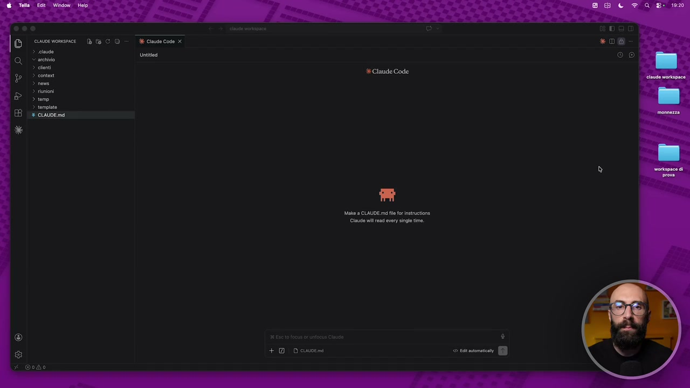
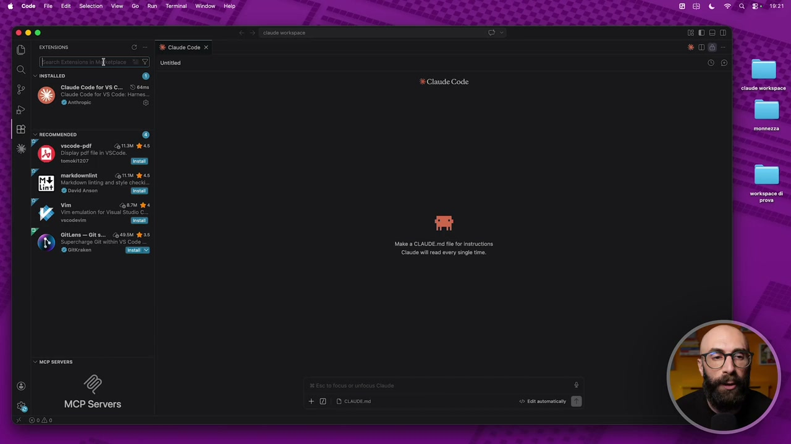
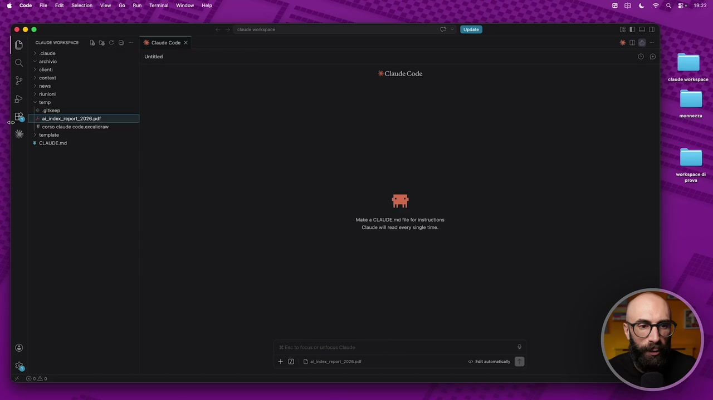
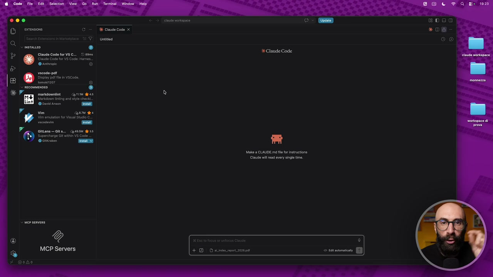
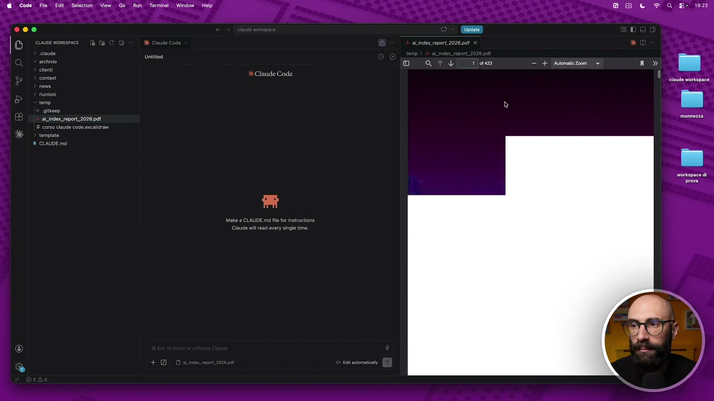
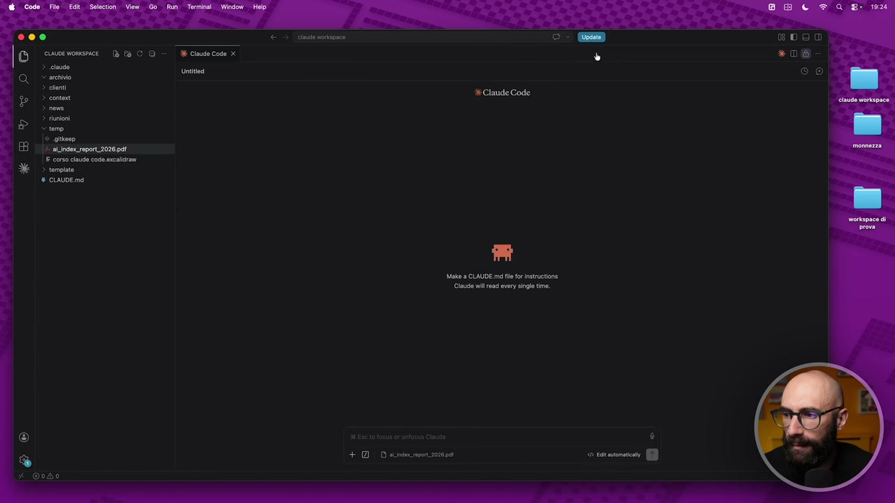
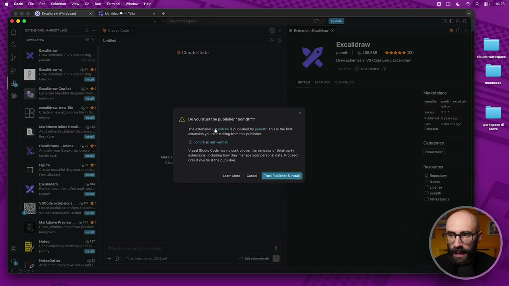
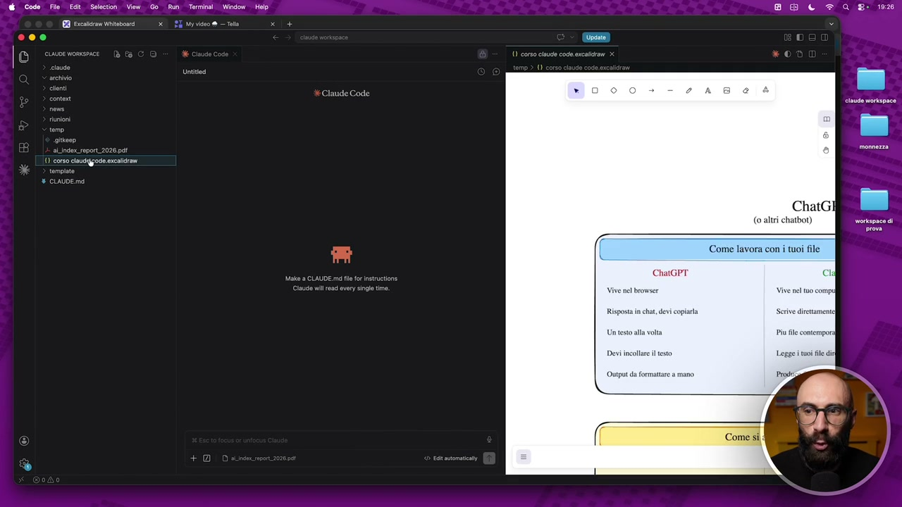
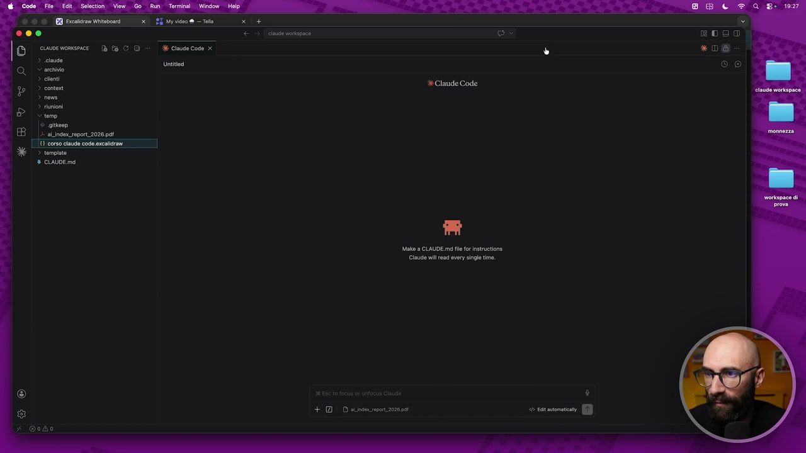
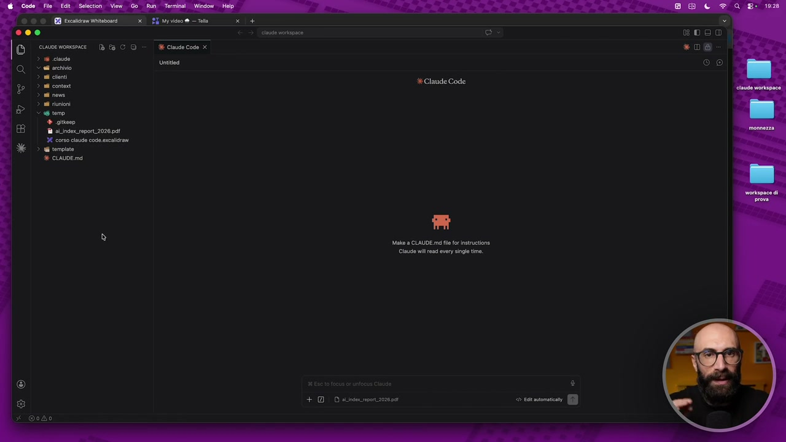

# Installare estensioni in VScode

> Documento generato automaticamente: trascrizione e screenshot sincronizzati del video-corso.

## [00:00:00] Schermata 0 _(start)_

**Testo a schermo (OCR):** Ba CO = dk Ciudecode x Untitodi Make a CLAUDE mo fl fr ietruetione Claude il rad very sing me + Descn

> Il primo livello di potenziamento, di estensione, che andiamo a vedere è quello del nostro VS Code. Vi ricordate? VS Code è, diciamo, l'app all'interno del quale noi usiamo Cloud Code. È molto comoda perché ci dà in un solo colpo il terminale, la chat, tutti i nostri file di lato. Ed essendo poi un'app, è a sua volta personalizzabile. E come si personalizza? Con quelle che vengono chiamate le estensioni. Le estensioni si installano da qua. Vedete queste iconcine qua sulla sinistra? Extension. E tra l'altro noi ne abbiamo già una installata. Cioè c'è questa estensione che si chiama Cloud Code. Noi siamo in grado di usare Cloud Code qua dentro perché in una delle prime lezioni abbiamo installato questa estensione. E ci sono migliaia e migliaia di estensioni disponibili gratuitamente. Vi basta cercarle qua dentro, all'interno del marketplace. Attenzione a quando installate le estensioni. Assicuratevi che sia una fonte fidata. Altrimenti, diciamo, è rischioso perché vi state installando qualcosa sul vostro computer di non fidato.

## [00:01:00] Schermata 1 _(periodic)_

**Testo a schermo (OCR):** n) ® Claude Code for VSC... Dem Claude Code for VS Code: Harnos 6 ® vacode-paf | Caria das Display pet fl in VSCOde, romolo? A markdomnine Corn das Marco ing and sie check. vin coon gra Vim emula fo Visun Stud C. + Dosen Make 9 CLAUDE md fl tr inatruetione Claude il rad very single time 000 «06 © 9

> Quali sono alcune estensioni che potrebbero esserci utili? Ve ne faccio vedere un paio che uso io, solo per farvi vedere come si installano. E poi in realtà vi lascio, come dire qua, totale libertà. Cercatevi le estensioni più utili a voi, per il vostro lavoro e le vostre esigenze e installatevele. La prima che capita sempre, con la quale ci scontriamo, sono i pdf. Io sono dentro qua, nel mio VS Code. Mi sono caricato nella cartella temporanea un report, per esempio, un report che stavo leggendo. Questo è un pdf. Che succede se io qua dentro clicco un pdf? Sapete perché? Sui file md, quindi diciamo i file markdown, li legge bene perché ovviamente sono i suoi tipi di file. Ma se io clicco un pdf, guardate che succede. Il pdf ce lo rovina tutto. Cioè ci fa vedere questa sorta di codice che è quello che c'è dietro il pdf, quindi non lo vediamo. Allora una prima estensione che io vi consiglio di installare è quella per vedere i pdf dentro il VS Code.

## [00:02:00] Schermata 2 _(periodic)_

**Testo a schermo (OCR):** EDO *D%@ (ONo] + DD sos rpont ione

> Quindi andiamo qua, qua diciamo in realtà è tra quelle raccomandate, quindi è una di quelle che installano tutti quanti subito. Però se non vi fosse comparsa qua, se non avete letto questa cosa da nessuna parte in giro, se siete arrivati fino a questo momento e non riuscite a leggere il pdf, la prima cosa è installare questa. Oppure semplicemente qua dentro andate nella barra di ricerca e cercate VS Code, trattino, pdf, ok? E ve la fa vedere. Questa qua è la più famosa, questa è di tomoki1207. C'ha 11 milioni di installazioni, è un'estensione molto utilizzata, molto seria. Faccio install, qua mi dice ti fidi di questa persona? Installiamola, ripeto lo faccio perché c'ha tantissime recensioni, tantissime installazioni, è molto utilizzata e così via. Quando ha finito l'installazione, diciamo se cancello un attimo qua, vi faccio vedere. Quando finisce l'installazione vi dice devi fare, devi riavviarla per farla funzionare, altrimenti non funziona subito. Quindi noi clicchiamo su Restart Extension e adesso in questo momento il nostro VS Code, il nostro ambiente è in grado di vedere i pdf.

## [00:03:00] Schermata 3 _(periodic)_

**Testo a schermo (OCR):** Claude Code for VSC... 5 ecm Claude Code for VS Code: Harnos Warren C) vicode-pd Display pel file in VSCOde. > necouuENDEO ® markaomnine orta ata Marida ning and sy check. vin ori gra Vi emula fo Visun Stu C. ctu rispose Claude Code Make a CLAUDE md le fr istruetione Cla il rad very single time + DD ainsi mpon 2026 pet BDeo *D@ © ©

> Come ce ne accorgiamo, torniamo nei file, clicchiamo qua ed ecco qua.

## [00:03:07] Schermata 4 _(scene)_

**Testo a schermo (OCR):** @ Code Filo Edit. Selection View Go Run Terminal | Window aLndex_raport2028 pat Help X Claude Code Bd e a eos d QI ie cea 5) SI o morkpace di

> Abbiamo adesso il nostro pdf che possiamo scrollare. Avete capito cosa significa che è estendibile all'infinito? E questo è solo il primo livello, quello più semplice, quello più banale, sono cose di superficie, tipo la lettura dei file, non è una cosa clamorosa. Però vi faccio vedere un'altra. Io per esempio lavoro tanto con questo, avete visto no?

## [00:03:24] Schermata 5 _(scene)_

**Testo a schermo (OCR):** Don cine mosca Td fa CD E Cln Code x «06 3 Un (IO) > cloni a Make a CLAUDE md fl fr instrutione Claude wil rad every single time. + 1 D as ipetzozesaì

> Ho tantissimo questa roba qua, questi schemi che faccio. Questi schemi si fanno con questo sito gratuito che si chiama Excalidro, che ci fa dei veri e propri file. Cioè questo per esempio, questo file qua, vedete, è il codice che c'è dietro quella lavagna che vi ho fatto vedere. Ma ancora una volta non lo riusciamo a vedere esteticamente, o meglio graficamente nel modo corretto. Perché? Perché stiamo vedendo il codice che c'è dietro, ok? Un po' come succedeva con il PDF. Quindi io personalmente nel mio ambiente cosa mi sono installato? L'estensione per vedere i file Excalidro. Quindi sono andato qua, qua e cerco Excalidro. Eccolo qua. E qua abbiamo l'estensione di Excalidro che permette di vedere questi file, graficamente parlando, all'interno di VS Code. 5 Stelline, 468 mila installazioni. Faccio install.

## [00:04:24] Schermata 6 _(periodic)_

**Testo a schermo (OCR):** vara Excalidraw Teoe + Claude Code pomdtr | < 468,886 | dra (39) ponti Draw schemas in VS Cod using Excaidrow scaltra CO Auto Update. Encalidram Coplot com dee Marketpl Genarata aut agro larketplace cacabiramenme-ile Gi des toe iano (oi [AN Do ya tesi te puotaber ‘pomusi Put 5 yer 00 da “Tha estensi Earl published by pome. Ts is the first lens astenson you stang from th publisher. © pome is ot veri 'Categanee Marksonm inline Exel 2 Ebcalitrame - nima... <a22 ES Apimate your Excaira dia Visual Studio Codo has no control over th behavior fidi party Vita deri entensione,incucing ho ey manage your personal da. Proceed cali you trust the publisher Resources Fia Pesci | © fosti Encatiati see VSCOda oxtension .. Cè IX Re Marion Preview... (0205 Noted 9

> Mi dice ancora una volta ti fidi di questa persona, eccetera eccetera. Faccio installa. E anche a sto giro la dovrò, diciamo, riavviare per farla funzionare, ok? Quindi qua ogni volta che la installate le vedete qua e vi dice che dovete riavviarle. Come ce ne accorgiamo se sta funzionando? Torno per esempio qua, clicco sullo stesso file e adesso questo file lo posso vedere graficamente.

## [00:04:45] Schermata 7 _(scene)_

**Testo a schermo (OCR):** 6 Code Fio Edit. Selection View. Go Run Terminal | Window Help mopace di ChaGPT SELE Li Vive nel browser Risposta in hat, devi copirla Scrive diretta Un testo all volta Piufile Output da formattare a mano

> Eccolo qua. Vi ricordate? Questo è quello che abbiamo visto proprio all'inizio, nelle primissime lezioni e così via. Quindi quel file che prima vedevo solo la parte di codice, adesso riesco a guardarlo. In realtà qua posso anche proprio modificarlo perché mi aggiunge tutte le funzionalità per la modifica e così via. Stiamo estendendo il nostro VS Code. Adesso è in grado di fare più cose e significa che possiamo lavorare meglio. Perché qua dentro posso aprire al volo i file PDF, i file Excalidro, tutto quello che serve a voi.

## [00:05:15] Schermata 8 _(scene)_

**Testo a schermo (OCR):** ® a CO = dk Ciudecode x Untited © archivio > ln > conto > riunioni temo © aitkeen 4 alindox_ report 2028 pa > tempinte Make a CLAUDE md le fr instrvtione Claude il rad every single time + DD ailrsec impor 20200at

> Ne faccio vedere un altro che è più una cosa simpatica, non è utilissima. Però io non posso fare a meno di questa estensione, guardo di qua perché ho il nome da quest'altro lato, che si chiama VS Code Icons. Cioè mi sono cambiato l'icone con cui lavora VS Code. Questo non è che dovete mettervelo per forza, però c'è 23 milioni e 8 di installazioni. Faccio install e gli do l'ok. Quando l'abbiamo finito di installare, adesso possiamo vedere, vedete qua ci sono le iconcine nuove che ci hanno messo. Questo lo chiudo, questo qua lo tolgo. E adesso se torno nei miei file, qua abbiamo tutti i file belli con le icone. Questa è una fissa mia perché sono abituato a lavorare e voglio vedere le cose bene. Quindi adesso abbiamo, vedete, l'icona della cartella. Questa è una cartella nascosta, quindi si vede in questo modo. Il file di Cloud c'è l'iconcina, i PDF c'erano la loro, gli Excalidro c'erano la loro. Sono tutte quelle cose che ci permettono di lavorare meglio.

## [00:06:15] Schermata 9 _(periodic)_

**Testo a schermo (OCR):** Ciau Code x Untitod + DD sile ron zena

> Con questo primo livello di personalizzazione non è che stiamo facendo delle cose clamorose. Come abbiamo detto, qua stiamo personalizzando l'ambiente di lavoro. Ce lo siamo resi un po' più comodo, mettiamola così. Questo è il primo livello. Negli altri due invece andiamo a fare delle cose un pochino più serie e un pochino più importanti.
