# Installare skill in Claude Code

> Documento generato automaticamente: trascrizione e screenshot sincronizzati del video-corso.

## [00:00:00] Schermata 0 _(start)_

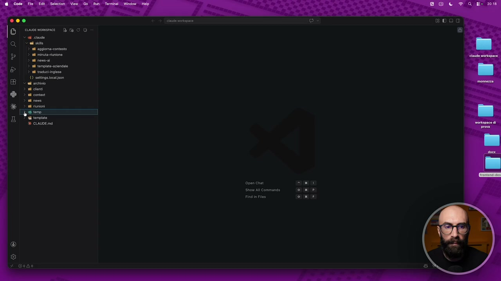

**Testo a schermo (OCR):** Open chat Show AI Command Find in Files

> Vediamo adesso invece il secondo livello di estensione del nostro sistema che ci stiamo creando E questo riguarda invece Cloud Code Abbiamo detto che il modo in cui lo estendiamo è attraverso le skill Fino ad ora noi le skill le abbiamo solo create Abbiamo visto un modulo intero su come creare le skill più semplici e le skill più avanzate Una skill che invece vogliamo installare, tra virgolette, anche se non è il termine corretto Come si fa? In maniera molto semplice Si copia e si incolla dentro la cartella skill Solitamente quando la scarichiamo è un file zip Quindi c'è una cartella, ad esempio qua ce n'è una sulla quale adesso farò una prova Questa qua si chiama front-end design Ed è una skill che ci permette di creare in maniera molto veloce dei semplici siti web, landing page e così via Quindi questa cartella qui, ve l'apro e vi faccio vedere Dentro c'è già la skill Vedete questo è il file skill.Md con dentro le istruzioni, come siamo abituati a vedere fino ad ora

## [00:01:00] Schermata 1 _(periodic)_

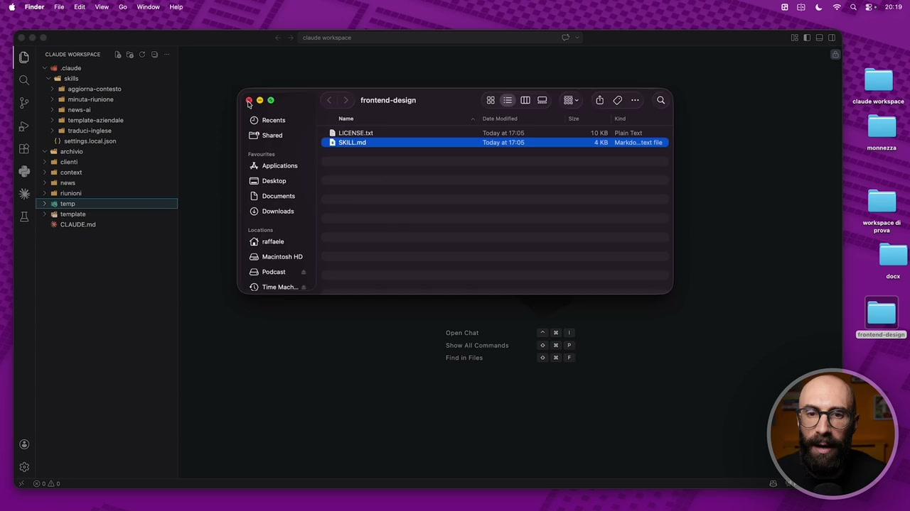

**Testo a schermo (OCR):** & cioe womesmace {è ta CO V cave Sei sie > ii aggioma-contesto > ul minutarinione 3 a ew © al tempiat-azindalo > ul tracoci-inglese 1) setings cca son < adl archivio sE09 Today at 17:05 Open chat Show AIl Command do 10K8_ Pian Tot Q

> Prendo questa cartellina, semplicemente la copio dentro skill E adesso qua abbiamo front-end design È finito Da questo momento Cloud Code è in grado di fare questa roba qua Quindi lavorare sul front-end Ventiamolo subito alla prova Ci apriamo subito una chat Mi chiudo questo E gli dico, usando l'apposita skill, crea una semplice landing page nella cartella temporanea Quindi lo facciamo salvare nella cartella temporanea Dove si promuove un corso per imparare a usare Cloud Code per i non programmatori Diciamo stile minimale Usa i colori tipici di Cloud Code Nero e arancione Ovviamente qua le istruzioni sono veramente date molto molto male

## [00:02:00] Schermata 2 _(periodic)_

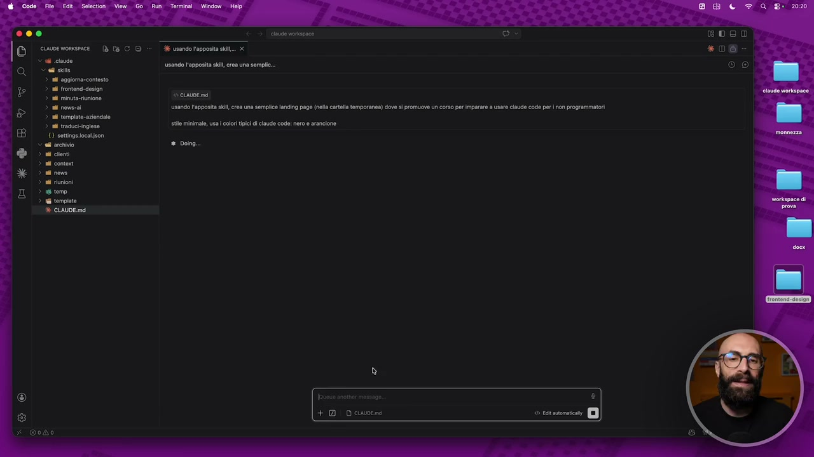

**Testo a schermo (OCR):** 36 usando apposita sil. x usando l'apposita kl, crea una sempli.. © cis usando l'apposita kl, cea una semplce landing page (nell rtl tamporanea) dove s promuove ur crso per Imparare a usare ciaude code per non programmatori ile minimal, us | colori tipi di caud code: ero e arancione # dong.. + Down

> Si fa in maniera diversa una landing page sul sito web È solo per far vedere che la skill che abbiamo appena installato Quindi quella che abbiamo copiato e incollato dal mio desktop La possiamo subito testare La mettiamo subito all'opera Ricordatevi una cosa Che quando mettete una nuova skill dovete aprire una nuova chat Altrimenti non funziona Ci accorgiamo che sta chiamando la skill Perché nel flusso di lavoro Dove c'è tutto il ragionamento Qua vediamo front-end design Skill invocata Quindi in questo momento lui sta lavorando con una skill Dice la sto progettando Qua ci apriamo pure la nostra cartellina temp Perché finirà qua dentro Cancelliamoci questo file qua Che adesso non ci serve E aspettiamo Perché adesso dentro la cartella temporanea Verrà creato questo file Diciamo HTML Probabilmente con questa semplice landing page Che stiamo andando a creare Dopo ve ne faccio vedere anche un secondo esempio Un pochino più complicato Perché qua mi sono già preparato una skill

## [00:03:00] Schermata 3 _(periodic)_

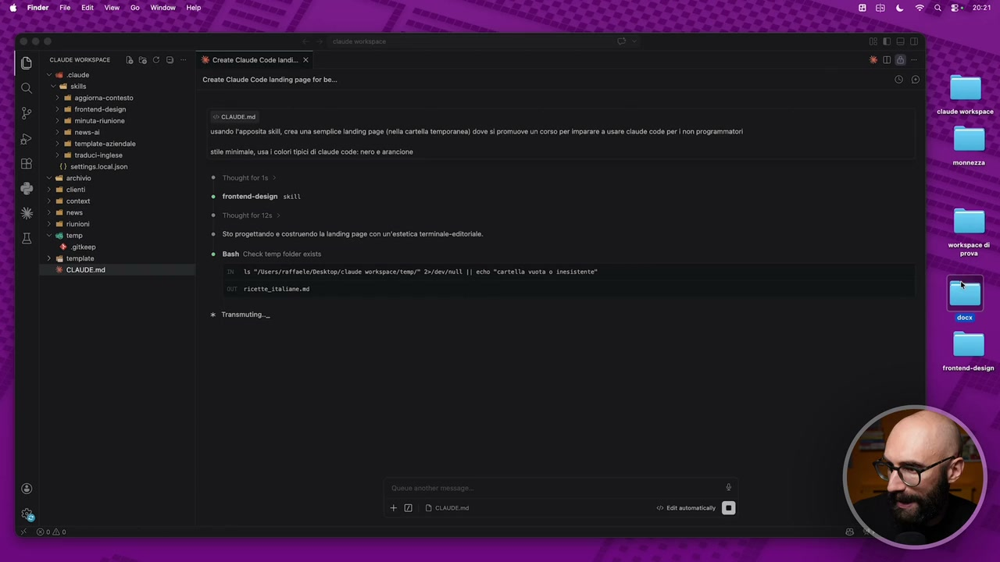

**Testo a schermo (OCR):** cuwve womsnice | (è Ea CD = Create Claude Code landi. x rst Ciad Code aci paga forte. SG ski ri n aggiona-contesto 1 frontend-desion i minuto runione PISSS usando l'apposita kl, crea una semplice landing page (nell cartela temporanea) dove sì promuove ur corso per Imparare a usare caude code per non programmatori n telate-aziendalo n traduci-nglese () sttngs oca fon Sl archivio Thought fore > al centi > al conte è cis se minimal, us i colori ii di claudio code: ero e arancione frontond- design sci 2 si rows Thovght fortas 3a riunioni < 6 temo ‘Sto progettando e costruendo la landing page con un'estetica terinao-editoriae. + gip > aG tempio © CLAUDE md 19 eMbsers/rataste/Destopr claude vorkspace/tanp/* 25/6e/moll 1 cche "crtella vota 0 inesistente Bash Check temp folder esisto Transmuting.. acoi ® + © Down 0 ta mon DI

> Che serve per creare i file word Vedete com'è Sta diventando sempre più potente Fino a poco fa Diciamo i file word per noi era una cosa inaccessibile Facevamo dei semplici file di testo Facevamo con il nostro markdown Invece tra un attimo facciamo pure i file word Finiamo che Aspettiamo che finisce di creare questa landing page E vi faccio vedere il risultato finale Ecco qua Dopo qualche altro minuto Ci dice che ha finito di fare la landing page Ovviamente qua non gli abbiamo detto niente Quindi se le sta inventando le cose su questo corso Però il file ce l'ha creato Eccolo qua Landing Cloud Code Punto HTML Ci clicco sopra Qua vediamo il codice Diciamo ma se faccio come sempre anteprima Ci possiamo vedere la landing page Che ovviamente Essendo fatta così diciamo con zero Con zero informazioni non è niente male Scrivi la lista d'attesa Scrivi di più Scrivi in italiano Lui esegue Ovviamente la landing page del corso Che sta eseguendo è molto più bella di questo Zero codice da eseguire Però molto Fatta molto bella Vedete ci ha messo le icone Ha fatto questa roba un po' matrix

## [00:04:00] Schermata 4 _(periodic)_

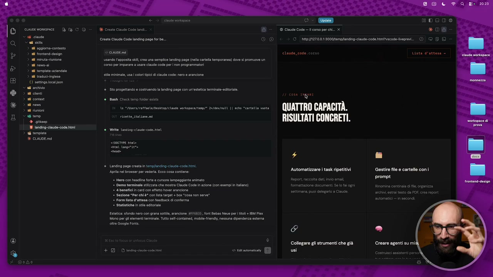

**Testo a schermo (OCR):** i terpiate-azendala > 1 traduek-ingieso (0) satinge oca son ad archivio nd cionti nd conto ni nove nd unioni toro % gite BI 1anding-ciaude-code htm i tempia % CALDE md 36 Creato Claude Cod ln Create Claude Code landing pago for be. 1 ciAvDE me usando l'apposita kl, crea una semplice landing page (nell cartla temporanea) dove si promuove un orso per Imparare a usare claude code peri non programmatori i minimal, us cori tipici di ciaudo code: ero e arancione. Sto progettando e costruendo la landing page con un'estetica termnae- editoria. è Gisah Check temp older iste 19 “vdsars/ratranle/Desktop/clae vorkspnce/tenp/* 2:/dev/mui || echo “crtetta vota Write ansiog-cleue-cose. ital Siti tangente Landing page creata in tempanding-ciaude-code Nim. Ape nel broser per vedra Ecco cosa conlne: + Horo con ade forte e cursore lampeggiante aimato Demo terminale stlzzata che mostra Ciaude Cod in zione con esempi in tano) © 4 bone n card con eto over arancione * Sezione "Per ehi è® cn sta target + box "cosa non serve” * Form ita d'attesa con foedback di conterma. + Statiticho in ste egtorale Estetica: sfondo nero con grana sot, arancione #FF483S ont Babas Nowo perl tl + 18M Plex Mono perl elementi terminale. Tuto sllcontined mobl- (end, nessuna dipendenza esterna tre Googa Fonts. + DD wosopeinie cosenmi cos gie: QUATTRO CAPACITÀ. RISULTATI CONCRETI. 4 Automatizzare i task ripetitivi Report raccolta dat invio email formattazione documenti So fa gni settimana puoi delegaio a Claude. È? Collegare gli strumenti che già TEO) *D® O GIG) Gestir file e cartelle con prompt. automatici —in secondi Creare agenti su mi Cosmuisci assistenti pe

> No un po' nerd Ma molto minimale E così via E quindi con questa skill Che abbiamo appena installato Adesso Il nostro Cloud Code È in grado Di lavorare pure Diciamo su piccoli sit web Semplici sit web Facciamone uno un pochino più avanzato Perché qua c'ho una skill Che invece permette di fare i file word Quindi la prendo La copio qua dentro E la porto dentro la cartellina skills Ok vedete adesso ci abbiamo DocX Mi apro una nuova chat Come sempre Altrimenti non funziona E facciamo Facciamogli creare un file word Come prima cosa Mi faccio un file markdown Un file di testo Gli dico Creami un file md Nella cartella temporanea Dove ci metti 10 ricette tipiche italiane Ok invio Perché sto facendo questa cosa Perché dopo io voglio far fare la conversione Cioè voglio avere qualcosa da cui partire Per poi trasformarlo in un file word

## [00:05:00] Schermata 5 _(periodic)_

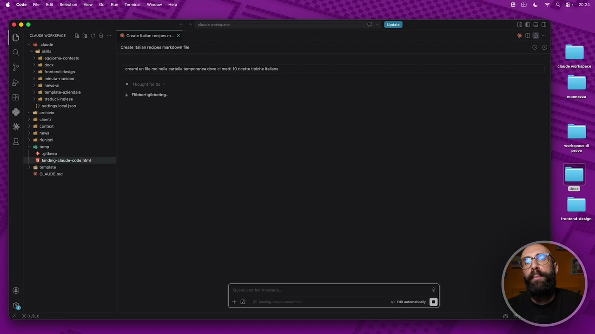

**Testo a schermo (OCR):** ce0 EDOo © coenomnee Dt CO > Create ecperm. x «06 ES cadi > n aggioma-contesto Create tallon recipes mark fe Pi ia reni uf md ell orta temporanea deve ci met 10 eta tpche alan N ‘iano È uan © Travprt for os 8 empiat aziendale BÈ > nd vraguciingiese €) settings ocatison <a archivio 3 a clent ® JE > i coni & + Fibbertiglbbetng... > ai nove > ad riunioni > 6 temo + giteep 8 tnding-caude-code himi > gi tompi è CALDE md

> Quindi il file md di partenza Più che altro è un pretesto Noi avere un po' di testo Che poi pigliamo E buttiamo dentro un file word Quindi adesso qua Ci dovrebbe creare Diciamo dove ha creato il nostro file html Ci dovrebbe creare pure il file md Con le 10 ricette italiane Ed ecco qua Dopo qualche secondo Ci ha creato il nostro bel file Lo apriamo La carbonara Il risotto alla milanese La pizza margherita Osso buco alla milanese E così via Adesso invece vogliamo trasformarlo In un file word Quindi facciamo Usando l'apposita L'apposita skill Questa cosa non serve Scriverla sempre Io lo faccio In modo esplicito Nel corso Solo per farvelo capire Però Cloud Code È abbastanza intelligente Che se voi gli dite Crea un file word Lui capisce Che ha una skill Per fare i file word E lo fa Usando l'apposita skill Trasforma questo file md In un file word Invio Perché ho detto Questo è leggermente

## [00:06:00] Schermata 6 _(periodic)_

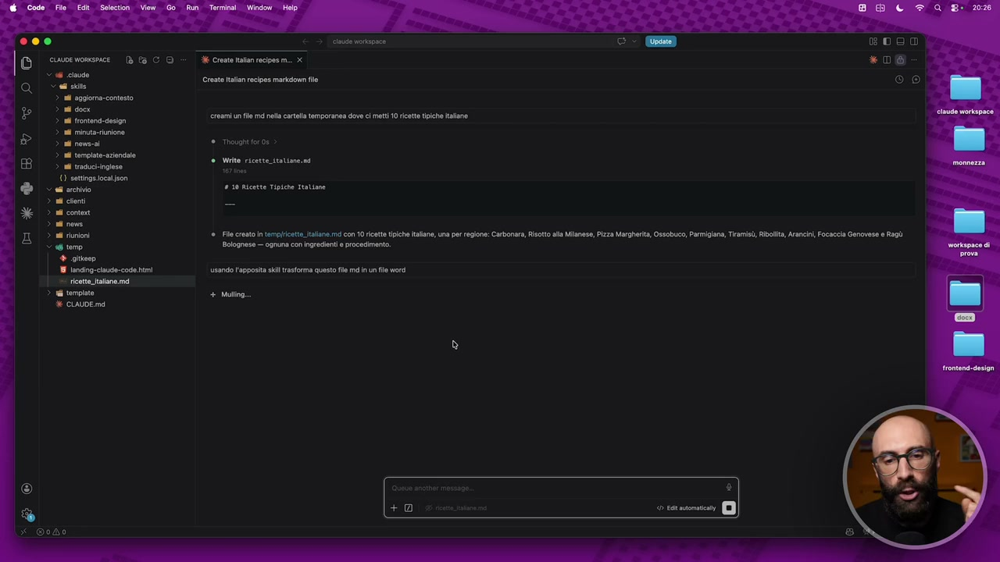

**Testo a schermo (OCR):** 00 | supvorne Bc - decremento m x Scade a Create tallon recipes mark fe > i aggioma-contesto > nl docs > nd frontend-design nl rinutarunione a ws tmp for 5 > al tomplato-azindolo > ud tacoci-ingieso () settings ocason dae 0 20 Ricette Tipiche Tratiase > al cileni = > al conti 3 ail nova > a riunioni File creto In templscttJallane md cOn 1 rette tipiche italane, una per regione: Carbonara, Riso Siglo Bolognese — ognuna con ingredienti procedimento + gitsep 18 (anding-cisude-code hi usando apposta kl trasforma questo le md n un fl word — ricttiallane md > Wi tempie + Muling CUAUDE md creami un fl md nella cartla temporanea dove ci mett 10 ricette tipiche ialone Write ricette itatiane.nd

> Più complesso di quello di prima Perché fino ad ora Sembra esattamente la stessa cosa In realtà Questa skill Per lavorare dentro Ha bisogno Di invocare un po' di codice Ok? Non riesce a farlo in autonomia Anche perché non è facile Creare un file word Quindi adesso Quello che succederà È che ci chiederà Di installare delle cose aggiuntive Cioè ci dirà Per poter Per permettermi A me skill Di funzionare Di creare un file word Devo installare delle cose E infatti Vedete? Ci dice Guarda mi devi permettere Di installare Questa libreria Questo comando NPM install Non vado nel tecnico Diciamo Perché è un modo Con il quale si installano Librerie Javascript In particolare Adesso deve avere accesso A questa libreria Come sempre Vedete? Non sono cose Che dobbiamo fare noi È cloud Che sa di cosa ha bisogno E se lo installa Qua lo autorizziamo A fare questa cosa E quindi diciamo Adesso sta installando Quello che gli serve Cioè questa skill Per poter funzionare

## [00:07:00] Schermata 7 _(periodic)_

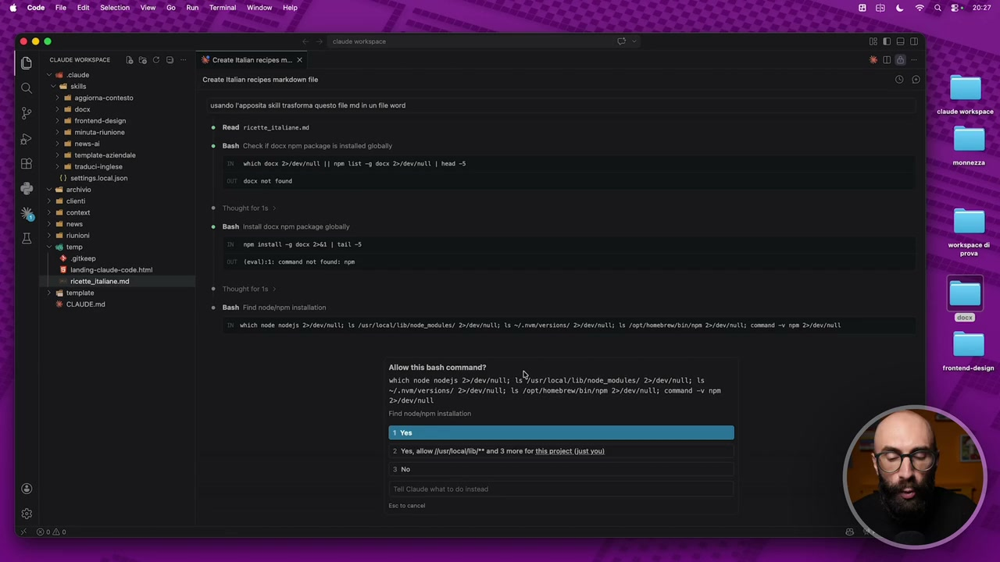

**Testo a schermo (OCR):** cuwsewomsnce {è E CD = è Cresenatan recipes m. X < 6 casse COS i aggiona-contesto PISS usano l'apposita il trasforma questo le md n un fl word Create tallon recipes mark file a frontend-desion liuto unione 18 nos © Bash Check i docx pm package is iste giobal > al tempiato.azindalo rei vatch oca 23/06/mutL |} np List = docx D/gev/muti | best 3 (0) sattingeocason doc not fond 04 archivio i ciont n conti Cia Bash instli docx npm package global ad unioni Peo, np instati = docx Del | att 5 © Read ricette ttotine.ni Tour fore giore: devat):1: command not found: npe Thoue for 16 Bash Find nodetmpm istlation vaseh noe nodeje 2/geu/nal1 18 /unr/10c0/ b/n modue/ 2>/00v/ Mi 13 S/.va/ version 2>/60V/0011 15 Jopt/fenebre/Bin/apa 2/dev/ n command oa 2o/60/ nat Allow this bash command? vich noge nodejs 2>/6ev/nlli ls Vuse/loca/Ub/node moss) 2>/dev/oott 1 “l.vn/versions/ 2>/dev/nut lo /opt/hosebrew/bin/npa 2>/6ev{ntl; command = pa Pidevimati Find node intalation 2 Yes, allow [\srhoclfib]* and 3 more fr ts project (ut you ae Toi Cine vato do Instond

> Ha bisogno di alcune cose Noi lo autorizziamo E adesso Quando avrà accesso A questa nuova libreria Che gli abbiamo dato La skill Docx Che abbiamo messo Sarà in grado Di fare questa conversione In word Anche qui ci chiede Di fare un'altra installazione Gli la autorizziamo E quando ha finito Vi faccio vedere Diciamo Il risultato finale Del file word Che ci ha creato Diamogli Anche qui L'autorizzazione Perché lo sta installando Anche a livello Python E poi Cosa è importante Ma questo ve lo faccio vedere Tra un attimo Qualcuno magari Si sta già chiedendo Scusami Raph Ma queste due skill Dove le hai prese? Perché vi ho detto Che le skill Le possiamo creare noi Si trovano pure in rete Queste sono skill ufficiali Di Anthropic Ok Ha installato tutto Quello che gli serve Quindi adesso Va a fare la generazione Del file word Vi dicevo Sono delle skill ufficiali Di Anthropic Vi faccio vedere Questo è il sito Diciamo Da quale si prendono Questo sito Ve lo lascio Tra le risorse aggiuntive Del corso Dove ci sono varie cose

## [00:08:00] Schermata 8 _(periodic)_

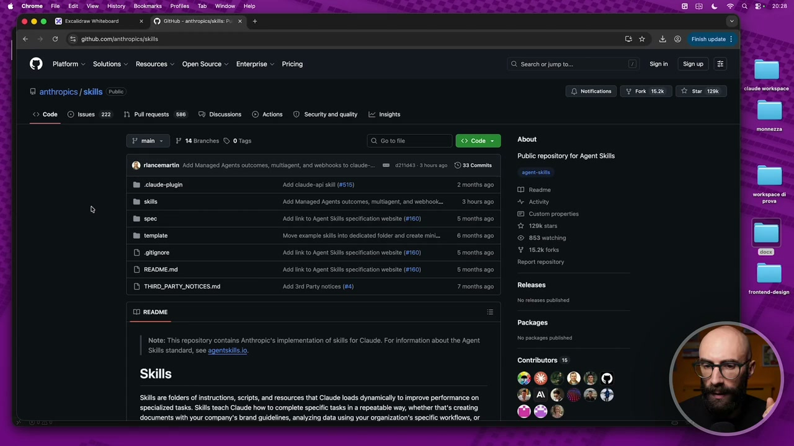

**Testo a schermo (OCR):** © ®© GE Scsicom intona © (x /(9 Gi iti + E > Gi gthubcomenihropic/skls © Piattom> Solutions Resources » Open Source > Enterprise >. Pricing @ anthropics / skills (Pie © Code © issues 272 1) Pullrequests (68) Discussions | © Actions | © Securtyand qualty _ < insight È mala > |P t@Branches © OTags ‘Q Gotofile (on) About Public repository for Agent Skils geni @ rincemantin Add Managed Agents outcome, muliagent, and webhooks 10 claude... 62149. ours 90 ©33 Comma Ra doude-pivgn Add clud-api il (9515) 2 months 200 riasie DEI Add Managed Agents outcome, mulagent, and webhook..-_—3hoursago activity Custom properies 1206 stare Ra spec ‘Ad ink to Agent Skls specification website (8160) 5 months ago Ra tempiato Move example sis ito dedicated folder and create min. -—G months ago ‘853 watching DI caiignore Ad e to Agent Sl speci website (F160) Smontns ago |- Y 1924101 Report epositoy DI READMEmd adi ink to Agent Sil specification website (4160) S months ago [) THIRD_PARTY_NOTICESIMA Add rd Party notices (#4) 7 monihs ago - Releases NO releases pubs 10 README Note: This repository contains Anthropic's implementation of skils for Claude. For information about the Agent Ski standard, see agentskil.io. Skills Skils are folders of instructions, scripts, and resources that Claude loads dmamically to improve performance on specialized tasks. Skils teach Claude how to complete specific tasks in a repeatable way, whether that's creating documents with your company's brand guidelines, analyzing data using your organizations specific workflows, or

> Che mette a disposizione Anthropic Ok Non ci sono solo delle skill Diciamo È un repository Con diverse cose Tra cui Appunto ci sono delle skill Entrate in questa cartellina E trovate varie cose Ok Per esempio Docx L'ho presa da qua Ho presa da qua Pure questa qua Del frontend design E così via Ce ne sono varie Attenzione In rete si trovano Tantissimi Diciamo Luoghi Contenitori Di skill Ufficiali Contenitori Di skill Gratuite Fate molta attenzione Queste ve le faccio vedere Vi consiglio anche Di installarle se le volete Perché sono di Anthropic Quindi sono ufficiali Nel corso Ce ne sono alcune mie Che potete scaricare Gratuitamente Se conoscete la fonte Andate tranquilli Pigliate e installate Altrimenti Fate molta attenzione Perché state comunque Installando una roba Dentro il vostro computer E questa cosa Diciamo Potrebbe essere Pericolosa No? Potrebbe essere utilizzata Per scopi malevoli Ecco Allora Lo script Ha finito di lavorare

## [00:09:00] Schermata 9 _(periodic)_

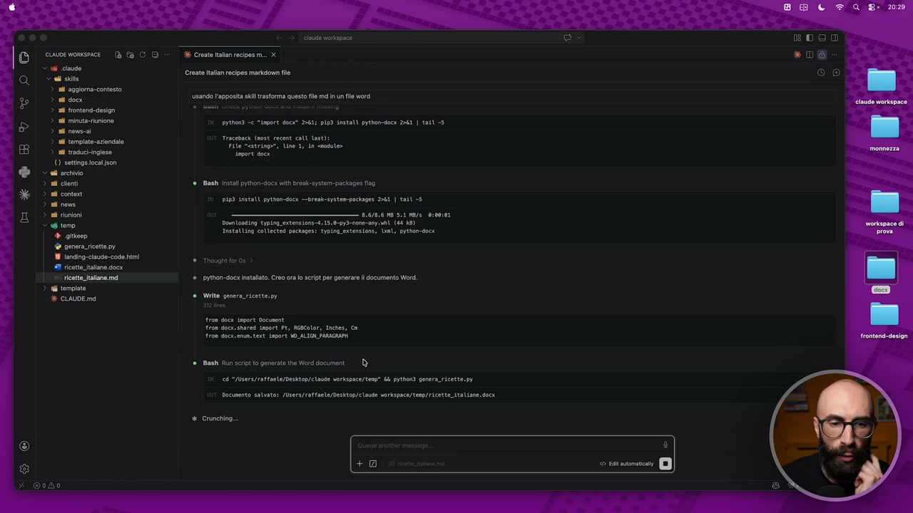

**Testo a schermo (OCR):** cuuwve wonesmace Dè fa CD Sd cave Sali vie > ii aggioma-contesto > rl docs > ad frontend-design 3 nl minuta-inione 0 rows > a template. azindale > nl acuck-ingieso (0) sattige ocason Si archivio nd ciont di content ni nos i iui ter + giteep © genera ict py 18 1onding-ciaude-code fmi #9 ricatt.talane docx 1 ricette talane md rd template È CLAUDE md su uortapoce e Create aan recipes mx Create tallon recipes markdiom fe usano l'apposita ii trasforma questo fe md n un fl word Prthend e "impre doce” 2061 pipD instatt prebon-doce 261 | tail -5 Traceback (most recent call ast) file “stringo, Une 1, in odio» Ihport dex ‘Best instal pyihon-doc: vlt break-ystem- packages iso PISD intatti prthodncx —brest-ayatenpaciages DIL | talt 5 aeneon sare e id Eypin estenia-4.15,0-93-nome-ty tl (4 8) Instartig collected packages: typing extension, unt, prein-docx Thought for 0s Prthon-docx istlto Creo or 0 scrit per generare l documento Word Write genera ricette.py ro@ doce iport Doconent fron doc share sport PE, AGBCoter, inches, ca rom doccienm. txt inprt WALT PARAGRAMI Mash Run seit 1 penoate th Word document Di 24 e qsers/catfnele/Dashtep/elade verkipca/tep” Li prenon genera ricette.py bacumento saluto; /Users/raffaele/Desktop/ claude vorkspace/tenp/ricent_ italiane docx Crunching.

> Cioè la skill Ha finito di lavorare E dentro Questa cartellina Tempo Adesso ci abbiamo Il file ricette italiane Ok? Adesso Ce lo apriamo Quindi andiamo nel nostro Workspace Scusate Questo è il vecchio Che abbiamo utilizzato Per un altro test Ce lo apriamo qua Abbiamo la cartella temporanea

## [00:09:17] Schermata 10 _(scene)_

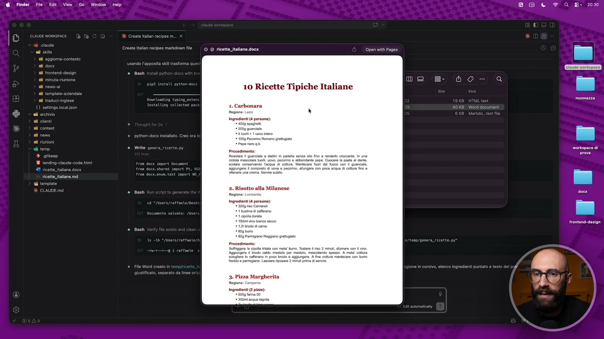

**Testo a schermo (OCR):** 6 Finder File Edit View. Go Window Help B D CF QQ 8 2090 x Q E do Si 10 Ricette Tipiche Italiane Fe 1. Carbonara î - monnezza. . è rit Lao x ' o si . Risotto -

> Questo è il nostro File world Proviamo a vedere Se si vede il file world Eccolo qua Dieci ricette tipiche italiane Carbonara Vedete Questa è l'installazione Di una skill Un po' più complessa Ultimo passaggio E poi finiamo questa lezione Se vi ricordate Vi ho detto anche Che Si possono installare I plugin I plugin Sono dei contenitori Sono tipo dei pacchetti Che dentro hanno Delle skill Degli mcp E altre cose I plugin Come si installano? Andiamo qua Diciamo in questo menu Scriviamo Plugin E ci esce questa voce Gestisci i plugin Quando la apriamo Qualcuno Si ricorderà Che un plugin Noi l'abbiamo già installato L'abbiamo installato Nel modulo Per creare le skill Perché senza Diciamo Questo plugin Claude Non poteva creare le skill Sembra un po' Un gioco di parole Non è niente di complesso Diciamo A Claude Abbiamo dato Tempo fa Una skill Per permettergli Di creare le skill Quindi abbiamo già Una cosa installata Vedete E qua ce ne sono altre

## [00:10:17] Schermata 11 _(periodic)_

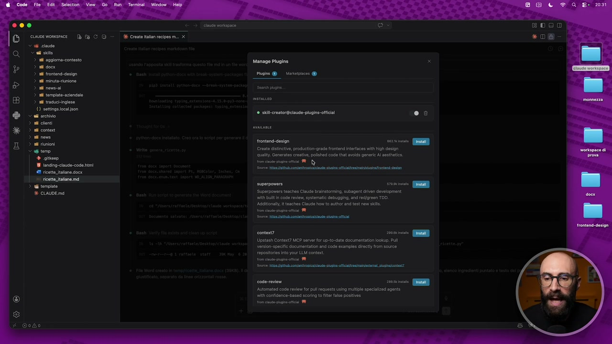

**Testo a schermo (OCR):** Manage Plugins Pigi @ _ Vareticee ® # cil-crotor@ciaude-plugins- oca! trontend design pese] Great distinctive, progutin- grade frontend itertaces with high design quali. Generaas creative, plshed code that avoid generic A sosthtics. mense conci PD Cocca Ninna conica an lirici se #1 ricatto alone docx 1 ricette talane md 3 ql tempie superpomere ras ao. è CLAUDE md ‘Suporpowers inches Cade brainstorming, subagent drive development with Bin cod eve, systematic debugging, and radeon TOO. Additional ft teaches Claude how tour and ast new sl ost ini Sire ii coin suc content? artt. QU Upstash Context? MCP server forup-t-date documentation iokup. Pull vesion-specile documentation and code erampls diecty from source roposiors Int your LLM conte. a to got Sorce itba A cenci ian dvn codoni osato. RE Altomated code eve fc pl requests using mltolo specizad agents lt cofience-base scoing o fit false posts triste gni

> Ce sono altre Tante altre skill Perché? Perché questo diciamo È il marketplace ufficiale Di Diciamo Di Antropic Nel quale trovate Veramente Un botto di roba Quindi Github Se siete Programmatori Vedete c'è un sacco di roba Per esempio Uno che vi consiglio di Installare Vedete Figma Per i designer Ce ne sono tantissime Telegram Per collegarlo con telegram Slack Per collegarlo con slack Questi sono ufficiali Antropic Quindi Andate tranquilli Uno che vi consiglio di installare Che uso anche io È questo qua Che vedete qua sotto Che si chiama Cloud MD Management Che ci permette Di fare Diciamo Delle migliorie Al nostro file Cloud MD Diciamo Periodicamente Non lo vediamo in azione Faccio solo vedere Un'installazione Semplicemente facciamo Install E ci dice Ti fidi? Conosci? Chi è questa fonte Di questo plugin? Assolutamente sì Perché diciamo Noi sappiamo che È Antropic Quindi diciamo Installalo qua

## [00:11:17] Schermata 12 _(periodic)_

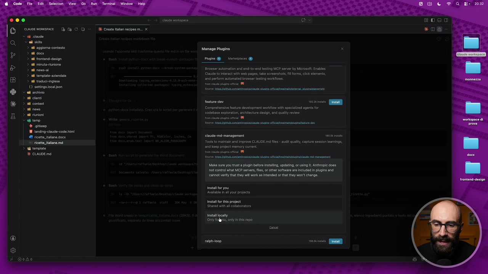

**Testo a schermo (OCR):** © cuoevomsce Dè CO > di Crest tata scie m. x claude i aggiona-contesto PISA i frontend-desion i iuta-riuniono i nos 28 tompiate-azindalo nd trscuci-ingleso () attinge ccason © el archivio > ad tnt > ad content è ad ross i iuioni < 6 temo | ® gie 18 1anding:claude-code hi #1 ricette alone doox |. ricette tano mi > 6 tempio % CALDE md Manage Plugins Prgine @ _ Vareiicee @ ‘rcmr astmatin and end: to-end testing MCP servr by Mirosolt Enable Claude 10 Interact th web pages, take screenshot, fl forms, click elements, and perform automatod browser testing wrkfions. rt gt soaturo=dor ozio. IT Comprenansive fatuo development workiow ithspocialiod agents fr codebaso exploration, architecture dig, and qulty review pome sg com management sepsi ite Too to mina and improve CLAUDE id fs ud qua cptue session oamings, and ep prec memory current. int conici Moke sure you trust piugn before Instaling, ping, o using Antivopie does Ot contro what MCP servers, les, or other Software are Included i pugins and “anno? veri at ny wl erk s Itended or that thy won't change. astalfor you Avalabi i your project nstalfortti project Shared with li colsbortor natali ocaliy ‘ny fu nt in the rpo,

> Localmente E adesso diciamo Ci installa Questa cosa in Inizio Per funzionare Devi riavviare Ok Riavviamo Apriamoci pure una nuova chat Per sicurezza E adesso se vado qua E faccio Plugin Tra i plugin installati Ne vedo due Perché ci abbiamo Lo Skill Creator E il Cloud MD Management Come faccio a vedere Effettivamente Che sta funzionando Perché se vado in chat E scrivo Cloud MD Management Vedete? Adesso Mi esce Tra le varie opzioni Che posso chiamare C'è queste due nuove cose Che si chiama Cloud MD Improvement Quindi migliorami Il mio file Cloud MD E Cloud MD Revise Quindi fai una revisione Del mio file Cloud MD Abbiamo anche installato Velocemente un plugin Sui plugin Non mi soffermo Perché là vi conviene Semplicemente scorrere la lista E trovare i plugin Più adatti al vostro caso In base a quello Di cui vi occupate Faccio design E mi metto i plugin Per design Faccio un'altra cosa E metto i plugin Per un'altra cosa Però avete capito Come estendere Diciamo

## [00:12:17] Schermata 13 _(periodic)_

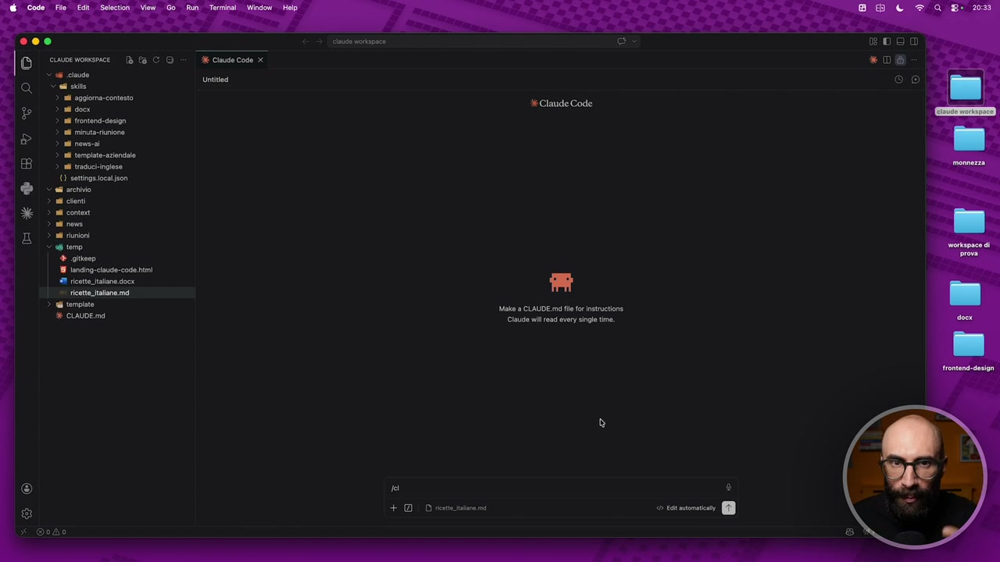

**Testo a schermo (OCR):** cadi ste > i aggioma-contesto > rl docs > ad frontend-design initaiunione > ud nona > a template. azindalo > ul tacock-ingiesa 0) sattngs cca json ved archivio > al cileni > all content > all news > al unioni > 6 tomo + gitsep 19 1anding:ciaude-code hi #1 rictt,talane docx etta taone md > ui tempiata È CLAVDE md Mak a CLAUDE md fl fr instruetione Claude il rad very single time

> Il secondo livello D'estensione Che è quello di Cloud Code E lo facciamo attraverso Le skill
