# Installare app col terminale

> Documento generato automaticamente: trascrizione e screenshot sincronizzati del video-corso.

## [00:00:00] Schermata 0 _(start)_

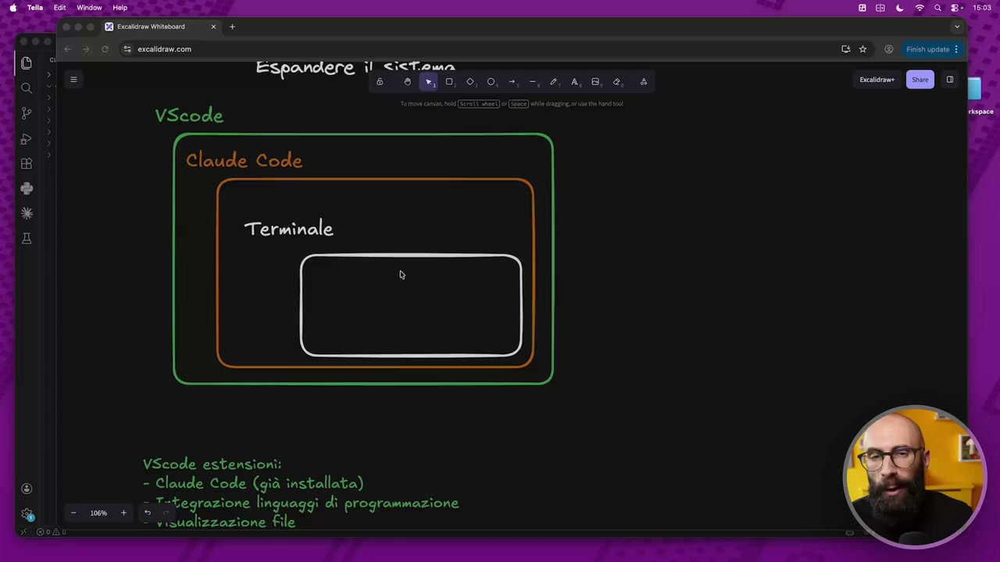

**Testo a schermo (OCR):** Espandere il <ictoma t) ® (Ri 0, 0, 0. +, -, 2, 4,8, e, & ve oo Claude Code Terminale dB ® * x VScode estensioni: - Claude Code (già installata) a Integrazione linguaggi di programmazione - nisualizzazione file

> E ora siamo al terzo livello di potenziamento, di estensione del nostro sistema che ci siamo creati. Abbiamo visto che nel primo installiamo delle estensioni dentro VS Code. Nel secondo livello mettiamo delle skill all'interno di Cloud Code. Il terzo è anche quello più potente. Quello che all'apparenza potrebbe sembrare un po' più ostico, ma come sempre vi guiderò passo passo perché in realtà è molto facile. E cioè andiamo a intervenire sul terminale. Tecnicamente non è che noi interveniamo sul terminale. Cosa facciamo diciamo in questo terzo step? Installiamo delle cose che il terminale può chiamare, delle app proprio a tutti gli effetti che il terminale può chiamare. Perché, ormai l'avrete capito a questo punto del corso, una grossa differenza di Cloud Code rispetto ai chatbot addizionali che utilizzavamo fino all'altro giorno è il fatto che può invocare il terminale, può chiamare il terminale. E il terminale è questo ambiente molto potente nel quale noi possiamo eseguire delle app a tutti gli effetti.

## [00:01:00] Schermata 1 _(periodic)_

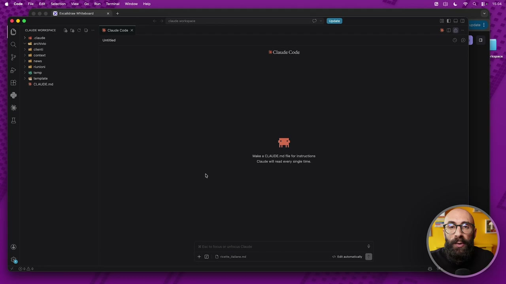

**Testo a schermo (OCR):** | cuuwoe wosessaCE > sd code © al archivio > al ont > al content > al ene > il riunioni > 36 temp template Be co Make a CLAUDE md fl fr instrutione Claude il rad very single me + DD veste tatonemi

> Solo che non sono app grafiche dove si clicca col mouse e diciamo e facciamo cose, ma si scrive. Perciò si chiama una riga di comando. Ed è una cosa molto facile perché Cloud funziona a riga di comando e quindi riesce a chiamare il terminale e fargli eseguire delle cose. Ok? Può sembrare molto complesso ma in realtà è facilissimo. Quindi cosa facciamo? Cosa vediamo in questo terzo livello di estensione? Vediamo come installare nel nostro sistema che ci siamo creati, questo sistema agentico potentissimo, delle cose che il terminale può invocare. Qua io ne avevo scritto anche qualcuno come esempio. Per esempio lo faremo, lo trasformeremo di essere in grado di lavorare con i pdf, di lavorare con i video, di lavorare con gli audio e così via. Come la facciamo questa cosa? Qua ho fatto un altro di questi schemini per cercare di farvi capire meglio. Abbiamo bisogno di un passaggio aggiuntivo, cioè di installare questo gestore di app che si chiama Homebrew.

## [00:02:00] Schermata 2 _(periodic)_

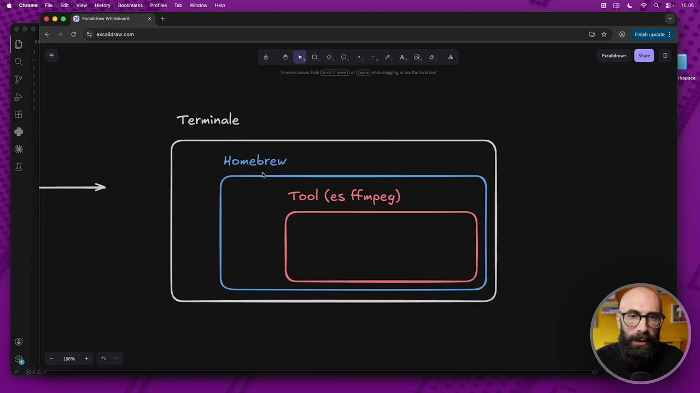

**Testo a schermo (OCR):** DOOIESSIS € > SG & ercalravcom Homebrew Tool (es ffmpeg)

> In particolar modo questo lo facciamo su Mac perché poi Linux c'è il suo e Windows c'ha il suo. Però abbiamo bisogno di questo livello intermedio. Questo non è nient'altro che un gestore di app. Quindi il posto nel quale si installano e si disinstallano le app. Graficamente è facile perché noi abbiamo un luogo nel quale disinstalliamo e installiamo le cose. Quelle a riga di comando hanno bisogno di questo gestore. Quindi adesso installiamo una cosa che si chiama Homebrew. Come lo facciamo? Andiamo online e cerchiamo Homebrew. Vi lascio poi il link qua sotto in descrizione. Ci dice guarda è facilissimo, l'unica cosa che devi fare è dare questo comando all'interno del terminale. Quindi copiamo questo comando, ci apriamo il nostro bel terminale, in questo caso siamo su Mac, incolliamo il nostro comando e dice guarda per poterlo fare devi mettere la password perché devi essere amministratore. Io metto la mia password e adesso sta facendo l'installazione di Homebrew.

## [00:03:00] Schermata 3 _(periodic)_

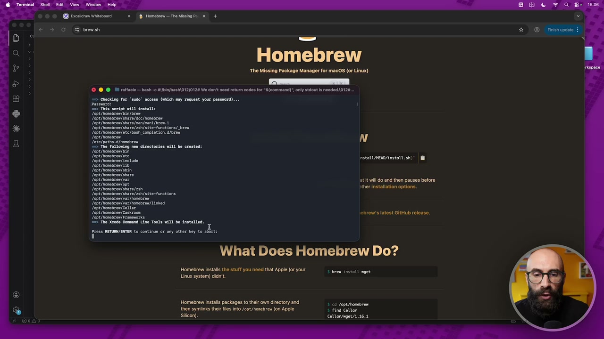

**Testo a schermo (OCR):** EB rca Vivo 3 055 brewsh —_ Homebrew ‘The Missing Package Manager for mac0S (or Linux) © @ @ Mi rattasio — bash e /bi/bash|01210124 We don't need otum codes for "3(command)", on stout is ndo 012... O Checking fer ‘sudo’ access (shich may request your password). apt namabea/ate/zanfsite-fanekions/_bren Tape nanabren/ete/osin copletion. /oren foot ranabres N Tete/patha.0/ronabcen => The folloring new directeries will be crested: perte = Ioni pote ne e foot ramabea/ neue tati Reni iasiati 280) opt nonabres/ ib opt romabres/sbin opt ronabren/sharo Pot aber ‘tt wil do and then pauses before /nennbre/opt ape ather installation options. opt nomabren/share/zsh/site-functions Lopt nomabren/ ar /nooabree opt ronabrea/ var nomabrea/ nd opt /nonabres/ Cellar opt nanabren/Caskrcon obrewss latest ltHub rolease. [opt /namabrea/ Framework 22 Tra Vendo Command Line Toole will be inetattod. frese neve o ocio a ttr ey to az: What Does Homebrew Do? Homebrew instlls the stu ou need that Apple (or your tren natali Linux system) didnt. toni Homebrew instlls packages to hei onm directory and! Peg then symiinks their files into /opt/hosebres (on Apple + find Cellor Silicon). Cettor/nget/1.16.1

> Homebrew è un passaggio necessario perché poi useremo questo gestore di pacchetti per poter installare tutte le app che andrà a chiamare il nostro terminale. Qua ovviamente ci metto un pochino quindi semplicemente taglio alcune di queste cose, sta facendo solo l'installazione. Qua vediamo l'installazione che sta andando avanti, ormai manca pochissimo. E nel momento in cui avrà finito questa installazione noi avremo un comando dentro questo terminale. Questo comando è brew, proprio diciamo per capirci la birra. Ecco qua il comando brew con il quale potremo installare cose. Ok, cosa installiamo? Andiamo a installare queste cose qua. Cose tipo pandoc, ffmpeg, whisper, qualcuno si starà già chiedendo scusa rap, ma io come faccio a sapere che questo serve per i video, questo serve per gli audio e così via. Non vi preoccupate perché ovviamente è qualcosa che faremo insieme a cloud, avete capito? Ormai è la risposta che vi do sempre in questi casi. Allora, qua ci dice che l'abbiamo fatto. Facciamo una prova, vediamo se il comando brew c'è nel nostro terminale.

## [00:04:00] Schermata 4 _(periodic)_

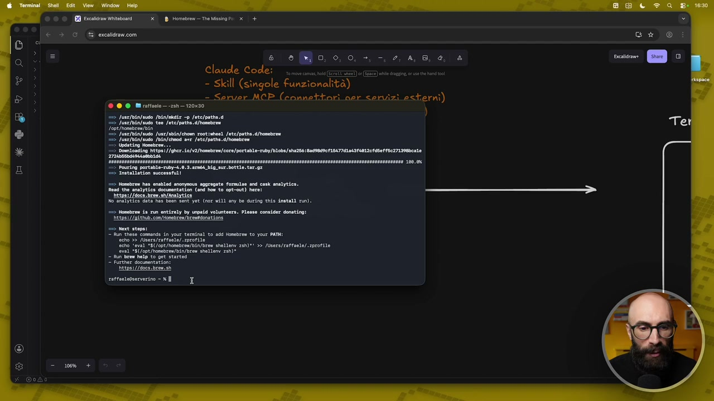

**Testo a schermo (OCR):** 8 2 è Claude Code: rnoran - Skill (singole funzionalità) = Server MCP (connettori ner servizi esterni) (è) a è LA tO) ® * E tpe://400s; born. metti No analytics deta has been Sent yet (nor will any bo during this dnstali rin); => Nosabrea is run entirely by unpeld volunteers. Please consider donating: Tittps://01thv;con/Vonabrem/breodonatione 20 est steps: 7 fun these commands in your terninal to 644 Homebrew to your PAT: ‘cho 5> Jiners/ratfaeia/aprotiie cho ‘eval *S(/opt/honebren]bin/brea shellen 24h)" >> /Usere/rat SII *8(/0pr/namabres/LiN/brew shellon 280)" — fu Brew alp to get startes 2 Furthar gocumentstion ittp://gocs.brew.sn rattaetagserverino = x E

> Qua ci dice che ovviamente per farlo funzionare dobbiamo aggiungerlo al path. Vi ricordate? Questa è una cosa che abbiamo visto anche all'inizio quando abbiamo installato cloud code. Quindi guarda per farlo, metti questo comando nel tuo terminale e poi dopo funzionerà. Quindi io piglio questo, lo copio, lo incollo qua dentro e do invio. A questo punto il comando brew funziona. Ecco qua. Possiamo dare per esempio brew help, ci dice, per vedere la documentazione. Eccolo qua, sta funzionando. Ci riguarda, puoi usare brew install per installare delle cose, brew update per aggiornarle, brew uninstall per cancellare e così via. Adesso la parte più difficile l'abbiamo superata. Perché? Perché da questo momento in poi, sapendo che tramite questo software che si chiama homebrew possiamo installare delle cose che funzionano con il terminale delle app, cosa facciamo?

## [00:05:00] Schermata 5 _(periodic)_

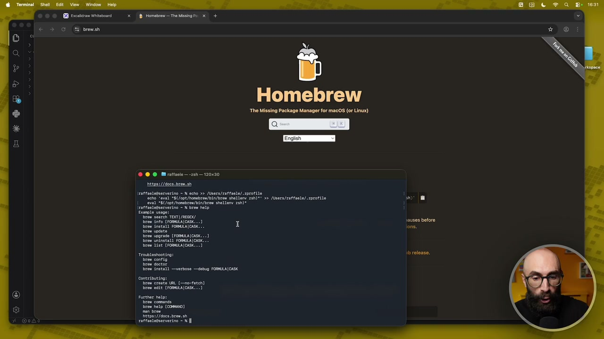

**Testo a schermo (OCR):** LD rca ite € 3 O tremano Homebrew The Missing Package Manager for macOS (or Linux) © @ © Mrattacie2sh 20x00 tipa: //0008orew.ah ratraetezserverino = % scho >> /Usera/raffaelo/ profile ‘echo ‘Oval “S(/0pt/honbren/bin/brea shellen 26h"! >> /Usore/raffeole/.zorofile ‘val “S(/0pt/nonebros/bin/brow shell. 6h)" ‘ratraelaeserverino = X brew help raffaelegserietino = % E

> Tutto quello di cui abbiamo bisogno lo andiamo a chiedere al nostro cloud code. Quindi facciamo un esempio, io apro una chat e gli dico vorrei creare una skill, anzi non parliamo nemmeno di skill, diciamogli così. Ho installato homebrew sul mio Mac e vorrei sapere cosa ti serve per poter generare dei file PDF. Che tool ti installo? Qua diciamo perché io ho l'esigenza del PDF, perché voglio fare l'esempio del PDF. Ed è cloud a guidarci e a dirci guarda a me per poter lavorare, per poterti generare dei PDF, mi serve che mi installe questa cosa. Molto probabilmente la cosa che adesso ci suggerirà, vedete ci sono vari, ci dice che un modo per farlo potrebbe essere utilizzando HTML2PDF oppure Pandoc, ce ne sono vari.

## [00:06:00] Schermata 6 _(periodic)_

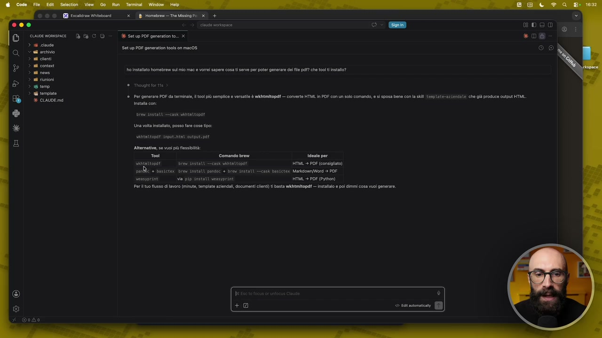

**Testo a schermo (OCR):** © © © RD esca todo cuuuve womesmace Dè a CO > 6 ciaoo © al archivio nd ciont ni contea ni neve n riunioni # temo tempie E CLAUDE md x 118 Homebce The Mis Pi D+ % Setup PDF generation to.. x Setup PDF generation tools on mac0S o inetalo homebrew su mio ma e vor saper cosa serv pa poter generare de la pa? che tool install? = Por gonerao POF da torminla lio] pù semplice o versate tnstta con dre Asta cash vANtnttosat Una volta instaliao, poso far cose tipo: viitopar input output: pat Alternativo, s vuo più fessiità: Tool Comandi breve vatigottopdf: i instati =cask besten pane + basictoi bre instati pansor + brov Instati seasyprine via Pip nstili vensyprine wkhtmitopdî — converte HTML. PDF con un solo comando, sì sposa bene con a i tp Litta che gi produce cutpu HTML. ideato per HTML > POF (onsiito) sh basictex Markdomn (Word > PDE HTML > POF (Python) Perito flusso di lavoro (ninut, tempia azindal, documenti lenti) i basta wkhtmitopdt — installo © pol dimmi cosa vuol generare.

> Io in realtà quello che uso io è Pandoc, quindi adesso qua vi consiglio di installare Pandoc. Diciamo che non sappiamo come farlo, anche se in realtà è facilissimo perché basta seguire la guida e la guida ci ha detto che dobbiamo fare brew install e poi il nome di quello che vogliamo installare. Gli dico voglio installare Pandoc, cosa devo scrivere nel terminale? Lo chiedo a Cloud Code, ma siccome Cloud Code è in grado di installare delle cose direttamente anche lui potrebbe addirittura farlo lui dentro la chat. In alcuni casi ci riesce, in alcuni casi ha bisogno di essere amministratore e quindi chiede a noi di farlo. Facciamo una prova, diciamoglielo sei in grado di installarlo direttamente tu? Quindi non lo faccio io aprendomi il terminale, andando qua dentro scrivendo brew install Pandoc, ma lui mi dice sì sì certo lo faccio io. Vedete adesso sta lanciando il comando e quindi ci chiede l'autorizzazione perché adesso lui per funzionare sta chiamando il terminale ogni volta che vedete questa roba qua sta chiamando il terminale.

## [00:07:00] Schermata 7 _(periodic)_

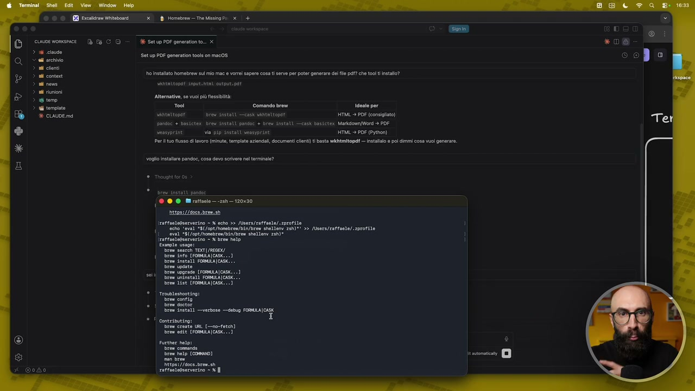

**Testo a schermo (OCR):** XKR vE OO © EB Ercaldram Witoboari (x Honebren— TheMissinge: x (+ cuwve womsnice {è Ea C © + SetupPDF generatonto.. x 2 cause «i archivio nd cloni > ho istalo homebrew su mio ma e vorei sapere cos i serve pe poter generare dei e pa? che tool install? Setup PDF generation tools on mac0S lizza Alternativo, se vuol pù fissità: Fi ivo, se es spade Tool Comando brew ideato per Viitnttopaf: = Brew install —cask unenttopor HTML» PDF (consiglio) pandoc + besictai bre install pandoc + br install —cask Bosictex MarkiomyMord + PDF seasyprint via pi install veasyprint HTML > POF (Pytion) Perito fusso i lavoro (minuto, tempio azindal, document lenti) basta wkhtmitopdt — nstaao © pol dimmi cosa vuoi generare. voglio Installa pandoc, cosa devo scrivere nol terminale? * ir tnstti parso {0 @ © Mirattaelo zi i20x20 ta: //00ca oren.ah \rattaelo@servarino = X echo >> /Usera/ratraele/ zprotil ‘cho ‘val ‘S(/gpt/honebren/bin/brea shellen, 25h)" >> /Usore/raffeole/.zorofile ‘val “S(/opt/nonobroa/bin/brow shellenv 26h)" Irattaologserverino = % bros help Etanole vespe: row List (FOMAIONS © | troublestooting: Tan config 1 7 hree fnetalì —vertose —debup FOMULA[CISK + conteiburing: ‘rem creste UAL {--no-feteh] Brew dit (FOBLATOAS 1

> Quindi dico sì ok vai fai questa cosa ti autorizzo a installare Pandoc. Vedete io quindi sapevo già che serviva Pandoc perché lo utilizzo, però se uno non lo sa gli chiede semplicemente Matteo per fare i pdf di cosa hai bisogno? Mi dice guarda Homebrew non è nel pad del mio ambiente cerco dove installarlo va bene. Ok diciamo deve trovare dove sta Homebrew dove l'abbiamo installato quindi adesso lo dovrebbe trovare appena l'ha trovato ci fa l'installazione eccolo qua adesso dice install Pandoc ci sta mettendo Pandoc. Che significa? Significa che a questo punto tutto quello che facciamo dentro Cloud Code possiamo anche trasformarlo in pdf. Fino ad ora non l'avevamo fatto abbiamo creato per esempio prima abbiamo visto in una precedente lezione abbiamo creato dei word perché avevamo la skill abbiamo creato degli html perché avevamo la skill adesso visto che abbiamo il diciamo il Pandoc installato possiamo fare anche pdf.

## [00:08:00] Schermata 8 _(periodic)_

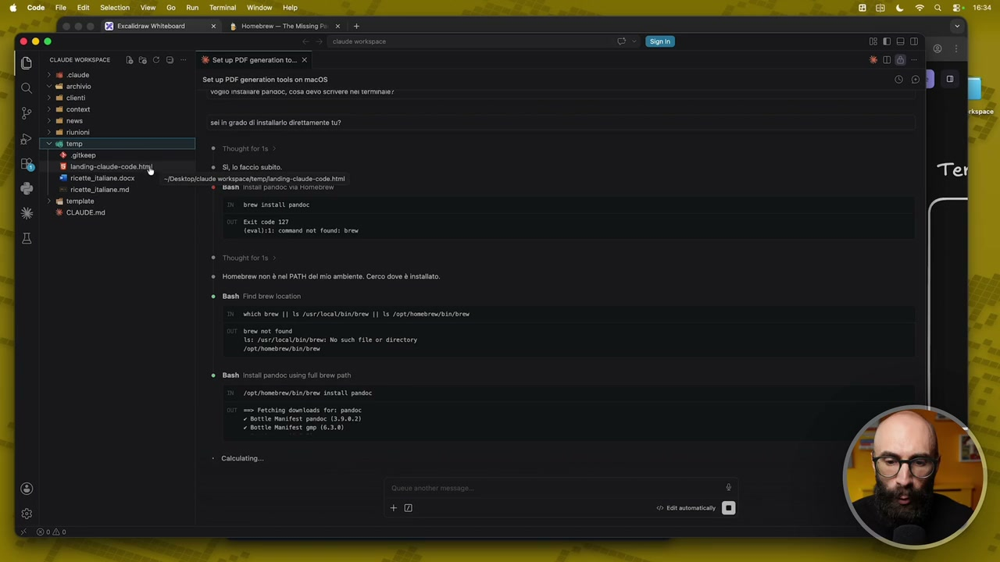

**Testo a schermo (OCR):** + giteeo 19 acini code dig #1 ricette, taane docx x ricette jane md > 6 tempia è CALDE md x Homebrem— The Missing Pe x 6 Setup PDF ganeraton to. x Setup PDE generation tools on mac0S ogno istanre panooe, cosa evo scvere nei trmnaie! oli grado lisa ietament 1? + Si Jo faccio subito. pastone worspscatemofandingclaie- code tim re istat pandoc use cose 277 Ceva )r2: comand not fond: bre Bash Fis bre iocation vate bre || 1 /usr/toea/binrarea 1 ls Jopt/rombreu/bi/aree as instal pendoc ln fl bow path Lot ronabreafoLa/Bres instati pandoe o tenta dovtondi fort pansce 7 hott hantfest pandec (.9.0.2) 7 notte nansfest uo (6.2.0) + Calevlatino

> Dice guarda che in realtà io mi serve anche Basic Test per poter generare pdf oppure per ora ti basta Pandoc. Quando vi trovate di fronte a domande del genere diciamo qua non voglio darvi la risposta voglio darvi il ragionamento che farei io. A cosa serve? Non mi basta Pandoc quindi proprio diciamo queste app che stiamo installando allora lui ce ne suggerisce varie per alcune cose e quindi qua potrebbe servire che magari Basic Test serve per altre cose però vediamo a cosa serve perché magari se ci serve lo installiamo se non ci serve non lo installiamo. Mi dice questo allora Pandoc da solo converte tra formati testuali tipo Markdown, Word, html eccetera ma per generare pdf ha bisogno di un motore esterno che stampi il file quindi senza questo non riusciresti a fare i pdf allora diciamo che va bene ok procedi con l'installazione. Quindi lui ha bisogno Pandoc funzioni insieme a questo Basic Test che insieme possono generare i pdf quindi legge qualsiasi input per esempio un file Word una cosa che avete messo in chat un file di Markdown e così via e lo va a installare.

## [00:09:00] Schermata 9 _(periodic)_

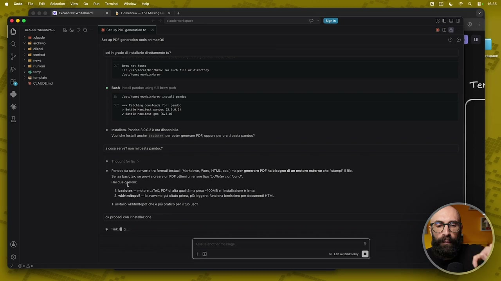

**Testo a schermo (OCR):** x {B Hometre— Tre Missing Pi x Setup PDF generation to. x Setup PDF generation tools on mac08 sin grado dl instalro direttamente tu? arse ot teen 185 /asr/M0eR/BLa/bresi Na such ie er directory Lost /nonbree/bi/ Brea e Bash instali pandoc using fl brew path Log ronbrea/bL/Bres install pandoe o Fetehtng dotando for: pansce 7 otte manifest pandoc (3.9,0.2) notte nanitest gup (6.3.8) è. instalto. Pandoc 39.02 è ora disponible Vuoi che install anche bissictex per poter generare PDF, oppure per ra ti basta pandoc? n cosa serve? non mi basta pandoc? ®.Pandoe da solo comerte tr format testuali (Markcoun, Word, HTML, occ) ma per generare PDF ha bisogno di un motore esterno che “stamp1" lle Senza basetex se prova creare un POF ottieni un errore tipo “plfaer not oune". Vi oi 1. basletex — motore LaT@X, PDF i ata qultà ma pesa -100M8 l'nstalzioe è enta 2. wkhtmitopgi — io avevamo già tato prima, pù leggero, funziona banesimo per document HTML Ti installo wkhtmitopd che è più pratico perl tuo uso? 9 procedi con linstaiazone. # Tico a

> Gli diamo l'autorizzazione come sempre perché deve fare l'installazione adesso non lo trova quindi diciamo deve cercarlo bene appena ha fatto questa cosa lui procederà con l'installazione. E' stato rimosso perché non è più mantenuto. Passiamo al Pano B. Pandoc il motore più affidabile l'alternativa è installare Wysiprint tramite pip python. Io qua non mi avevo accorto che prima sopra l'avevo autorizzato a installare questo qua in realtà volevamo installare Basic Test quindi diciamo diciamogli esplicitamente installa Basic Test. Quando qui ho detto vai procedi in realtà volevo intendere vai procedi con l'installazione del primo invece del secondo. Questa è una cosa importante che non taglio perché perché ci fa capire come è importante leggere quello che ci chiede a schermo. Io abituato a fare queste cose diciamo che le ho fatte mille volte queste configurazioni a volte faccio avanti avanti avanti però invece avete visto questo era un caso nel quale io volevo fare una cosa ma ho dato un comando e lui ne stava facendo un altro.

## [00:10:00] Schermata 10 _(periodic)_

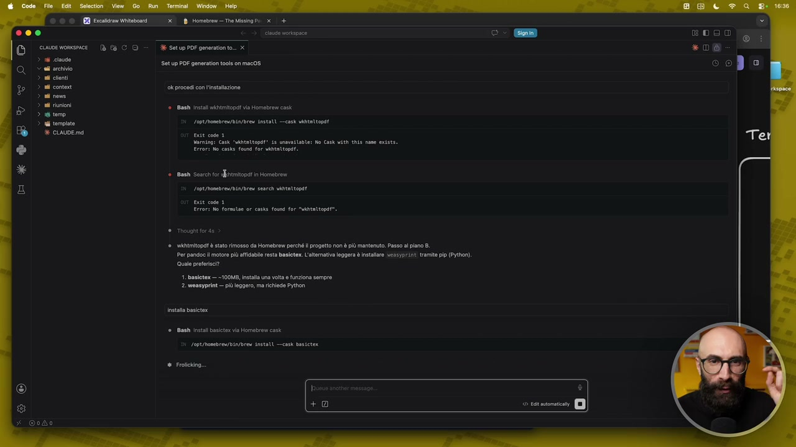

**Testo a schermo (OCR):** RO escaiciav Wiaboari (x Horebren— TremissingPa x 000 cuwve womesrice | (è Ea C © = | SetupPDF generatonto.. x > 16 cave © e archivio > al conti > al conte ‘ok procedi con instalzione 3 ai nen Setup PDE generation tools on mac0S n unioni temo Rissa Lopt ronde bia Brew INSEli cas ritto E CLAUDE md Bash instant ia Homebrew casi marmi: ask "attopd’ is immunlable; No Cask th this ame exists. Error: No caske found for vato. Bash Search for dfnunitoat in Homebren Logt bonbreu/bi/Bros sanre ventata Error No forms or case fund for “tnttop*. Tmovght for 4: tmitpdt è stato rimosso da Homebrew perché l progetto non più mantenuto. Passo al pan B. Per pandocil motore più affilblo resta basta. L'altomatia leggera è instlro vessyprint tram pip (Python) Quale pretese? 1. basctox — -100M8, install una vlt funziona sempre 2. weaeyprint— pi eggero, ma ichiede Python rosta basito © Bani instalibaictx via Homebrew cask LeptRonchreubi/Bres install casi Dstetox # Frotckino. FI © sro DI

> Fortunatamente questo progetto è un progetto vecchio che non esiste più quindi adesso ci installa Basic Test. Appena ha finito di fare questa cosa lo mettiamo subito all'opera. Cioè vediamo se con questi nuovi software che lui ha all'interno vedete torniamo qua adesso cosa possiamo fare diciamo il terminale abbiamo messo Homebrew che ci permette di installare delle cose qua ho messo un esempio FFmpeg in realtà abbiamo appena installato Pandoc e quell'altra estensione. Pandoc adesso sarà quello che lui chiamerà ogni volta che dobbiamo creare i PDF. Attenzione quella cosa importante qual è non è che lo fate voi cioè voi fate questa parte di installazione in realtà non la fate ma anche voi perché la fa lui semplicemente voi quando avete un'esigenza gli chiedete senti ma se io devo fare questa cosa ho questo task per esempio devo spesso generare dei PDF. Lui ti dice non ti preoccupare per i PDF puoi installare questa cosa qua voi la installate da quel momento lui ha quella capacità funziona da riga di comando qua ci sta mettendo qualche secondo ovviamente io qua taglio e vi faccio vedere quando già l'ha installato.

## [00:11:00] Schermata 11 _(periodic)_

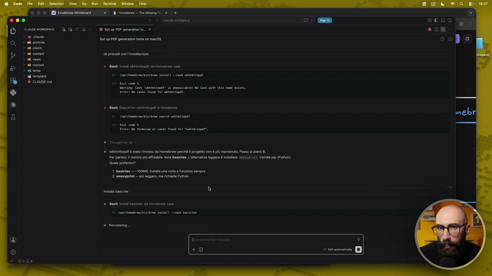

**Testo a schermo (OCR):** x Horebeem— The sing Pi x O00 eoo0 a © susoerovonce Di fa CO d setupPoÈgeneratonto. x *D% Set p PDF generation oca on mac0$ 5) tO <a acine ". Lat ni cloni ni contea ‘ok procedi con 'instalzione ni neve n riunioni Ban instali ihtmitopat ia Homebrew cask temo Pireo, Loperoneb re bL/Brew LNstali cas tatto E CLAUDE md aa vamniog: ask "taltopal’ is unmvllable; Ne Cask with this name exists. Error: No caste found for vnattos. Sane or khmitopat a Homebrew Lage ronda i/bro sanre vantettost Error No formilse or case fond for “intnttop*. Tmovght for 4: htmitopat è stato rimosso da Homabre perché l progetto non più mantenuto. Passo al pian Per pandocil motore più atfilabio resta basctox.L'altnatia leggera è instalaro vessyprint tramite pp (Python) Quale proteici? 1. basctox — -100M8, installa una volt funziona sempre 2. weseyprint— più egger, ma richiede Python instata basico © Banti instalibasictex via Homebrew cask Le0t/Rocbrewbin/bres Install —casx Bastet * Porcoating

> Ecco qua è importante che successa questa cosa perché succederà anche a voi a volte vi ho detto alcune cose in grado di installarle per esempio Pandoc l'ha fatta da solo mentre invece quando ha provato a installare BasicText ha detto guarda non lo posso fare perché c'è bisogno della password amministratore e lui Cloud Code non può farlo di default quindi mi dice fallo tu cioè mettilo tu nel terminale e diciamo lo fai installare tu metti la password da diciamo da amministratore. Io vi ricordo sempre una cosa il terminale non ce lo possiamo aprire anche qua cioè volendo lo teniamo direttamente dentro la stessa schermata ok è una delle cose molto comode di utilizzare diciamo via code in realtà io vi faccio vedere che me lo apro sempre quasi separato diciamo come app separata su su Mac solo perché così mentalmente vi faccio vedere che sto aprendo il terminale ok qua dentro magari qualcuno si potrebbe confondere però le stesse cose che faccio nel terminale le potremmo fare direttamente da qua ok anzi io ve lo consiglio perché ancora più

## [00:12:00] Schermata 12 _(periodic)_

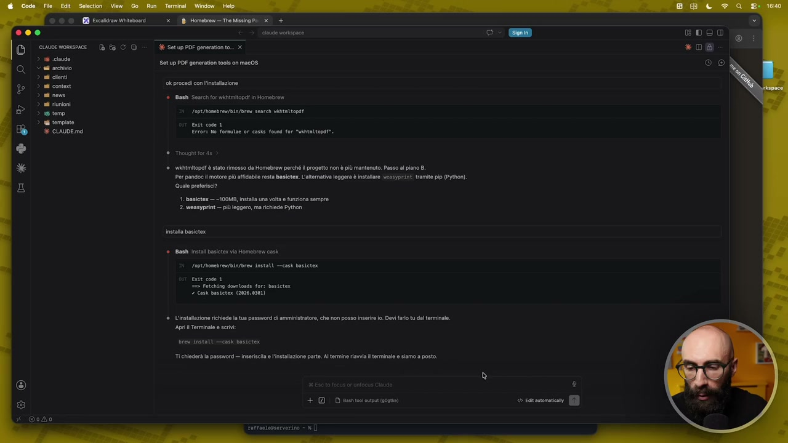

**Testo a schermo (OCR):** ®© © Ecetdran Witbosr O00 cuwve womsnice {è a C © = SetupPDF generatonto. x > sd caude < archivio nd conti E ok procedi con instalzione Setup PDE generation tools on mac0S © Bash Search for mimi in Homebrew n riunioni pets Lope ronbreu/bla/bres search vantnttopat i template ente cose 1 è CLAUDE md Error No formule or cass found for “tattos*: Thug fora Wtmitopat è stato rimosso da Homebrew perché l progtto non più mantenuto. Passo al pian Per pandocl motore più affabile resta bascte.L'atematia leggera è instalre vessyprint tram pp (Python) Quale prterisi? 1. basictex — -100M8, Install una volt funziona sempre 2. weasyprint— pi leggero, ma richiede Python rosta basito = Bani installi va Homebrew cas Logi fbonbrea/bia/bro install casa Bsteter = retehing dovnlosds for: bsicte 7 can siete (2026.0201) ®. L'instatazione richiede l tua passuord di amminstrator, che non posso inserirla. Devi ao tu dal terminale. Agri Terminale srt re Anita cash bastate TI chleerà la password — inserisca e l'installazione pare. Al termine rival terminale 0 siamo a posto + DD summit (0g)

> comodo quindi cosa dice dice ok apri il terminale metti questo ok prendiamo questa riga qua la copiamo la incolliamo diamo invio e adesso diciamo siccome avevamo già dato la password amministratore prima è partito in automatico se io non avessi dato la password amministratore prima qua mi avrebbe chiesto di mettere la password amministratore e poi procedere con l'installazione qua ci metterà qualche minuto quindi taglio vi faccio vedere quando ha finito l'installazione perfetto ha finito l'installazione come possiamo vedere cosa abbiamo installato noi con il nostro brew basta dare questo comando brew leaves come proprio foglie ok e vediamo la lista delle cose che abbiamo installato e qua dice perfetto c'ha installato Pandoc torniamo qua dentro e gli chiediamo adesso hai tutto allora installazione fatta controlla che hai tutto quello che ti serve per generare pdf lo chiediamo sempre a Claude ok è un assistente è in grado di rispondere a questa cosa quindi facciamolo

## [00:13:00] Schermata 13 _(periodic)_

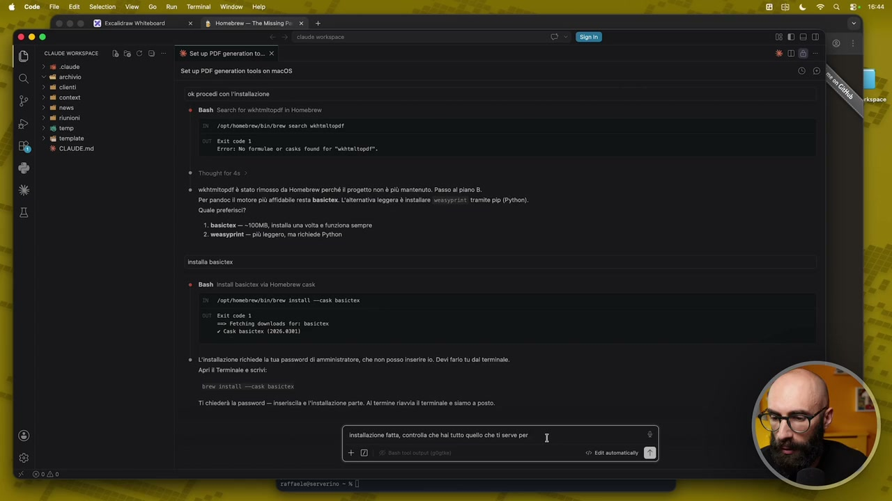

**Testo a schermo (OCR):** DO ce womsmce Dè fa CO > i cause © al archivio ni cloni nd cono si neve # temo % tempia ese works % Setup PE generatonto.. x Setup PDF generati tools on mac0S ok procedi con 'instalzione e Bash Search fo mimi in Homebrew Lage nonbreu/biarbrea sent vantettopat Errori No formilse or case found for "ntattop*. © Though orde *.Wktmitopdt è stato rimosso da Homebrew perché l progetto non è più mantenuto. Passo al pian B. Per pandocil moore più affiblo resta basctex.L'altematia leggera è instalare veseyprint tram ip (Python) Quale proteici? 1. basictex — -100M8, Install una volt e funziona sempre 2. weasyprint— più egger, ma richiede Python rnstata basito © Ban insta baictx va Homebrew cas Log bonbrea/Bi/bro stati —cask Bustetex = retchng dovlosds for: bstetex "cas siete (2026.0201) è. L'instlazione richiede l ua password i amministratore, cho non posso Inserire. Dvi aio tu dal terminale. Age Terminale srt res Anstat casi basteter TI hlderà la password —inserisla e l'installazione pare Al termine riavvia terminale e siamo a posto Instaazione ata, conto che hai tuto quelo che ti servo per +9 \

> non vi impanicate di fronte a casistiche che non sono emerse dentro questo video o un'altra lezione semplicemente lo chiedete a Claude e insieme arrivate alla alla soluzione anche perché lui sa cosa ha bisogno dicisi perfetto vedo Pandoc e vedo pdf latex installazione 2026 e così via posso già generare un pdf vuoi che faccia un testo con un documento di prova è certo che lo facciamo come lo facciamo qua dentro nella cartella temp diciamo dal precedente avevamo questa roba qua ricette italiane .Md doc e così via gli dico nella cartella temporanea troverai un file md con delle ricette trasformalo in un pdf perché adesso in questo momento il nostro cloud code è in grado anche di generare pdf ora state capendo quanto è potente quello che stiamo creando perché nel momento in cui installiamo

## [00:14:00] Schermata 14 _(periodic)_

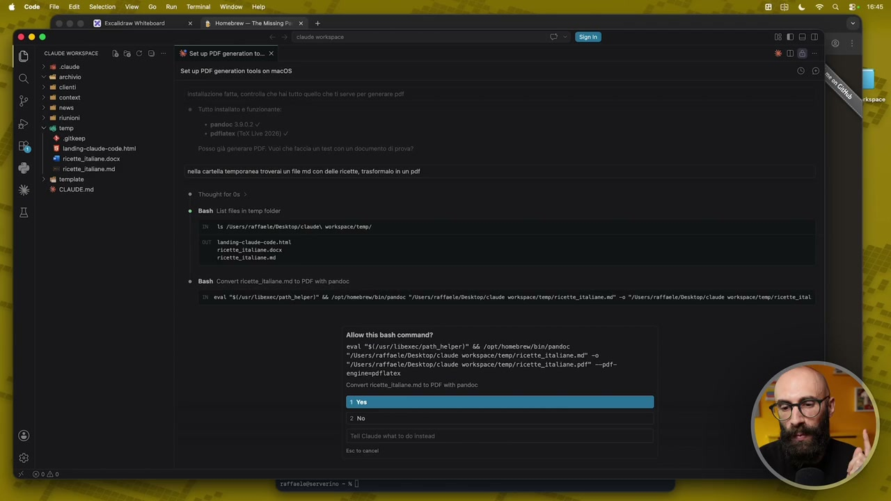

**Testo a schermo (OCR):** © © © GB Ercesdram Witbosr DO EDO cuuwoe womsnice {è Ea C © = SetupPDF generatonto.. x *D@ > 16 cause © a archivio > all ont > ad content > al em > il riunioni v 6 temo + giteeo 1 1anding:ciaudo-code himi ‘Posso li ener POE #1 ricette faane docx x ricette alone md ela catala temporana trovera un fil md con dello ricetto, tastormalo in un pet > 1 tempia Setup PDF generation tools on mac0S (CNo] ©. Beni List ie n tmp fol 15 /Users/ratfoete/Deskton/ ciau) vorkspace/teno/ anding- clan case. pt = Bash Convert icettitalane md to PDF wi pandoe eva "S(/057/Uibenecypati helper)" Li /opt/Mosebreu/Bla/pandoc "JUsers/ratfaele/Desktop/elaute vorispce/tem/ ricette italine n -o>/isers/ratfaele/Desktop/clause verkspace/temp/ricette_itat Allow this bash command? evall 5(/usr/Ubexec/path_helper)" && Jopt/honebrew/bin/pandoc "/Users/raffaele/Desktop/claude orkspace/tenp/ricette_italiane. nd" o "/Users/raffaele/Desktop/claude workspace/temp/ricette_italiane. pot" —pdi- engine=pafilatex Cover ricette iakane md to PDF with pandoe 10) x odo

> continuamente cose diciamo a riga di comando quindi nel terminale lo possiamo estendere all'infinito ci dice ecco fatto ricette italiane .Pdf nella cartella temporanea eccolo qua apriamolo e vediamolo un attimo aspettate non si apre forse non si vede l'anteprima lo provo ad aprire da qua ah eccolo qua stava solo caricando vabbè non ci serve la schermata laterale ricette tipiche italiane ci ha messo le pagine ci ha messo i numeri e così via abbiamo tutto quello che ci serve

## [00:14:20] Schermata 15 _(scene)_

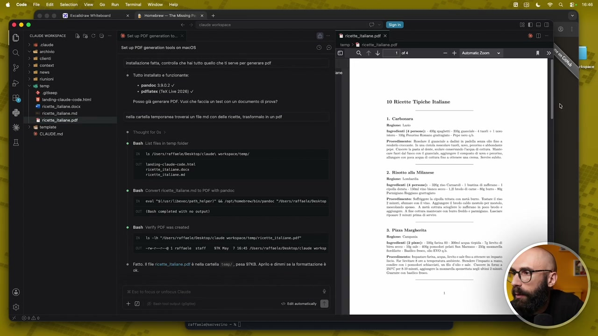

**Testo a schermo (OCR):** - pandoe

> questa roba qua è fondamentale fondamentale vi faccio un attimo rivedere questo schermino questa è la parte più diciamo scemotta perché le cose che installiamo in VS code come abbiamo detto sono più di abbellimento diciamo di UX e così via in cloud code inizia a diventare interessante perché con le skill gli aggiungiamo diciamo delle competenze nuove ma quando arriviamo nel terminale sono proprio cose che all'improvviso è in grado di fare

## [00:14:30] Schermata 16 _(scene)_

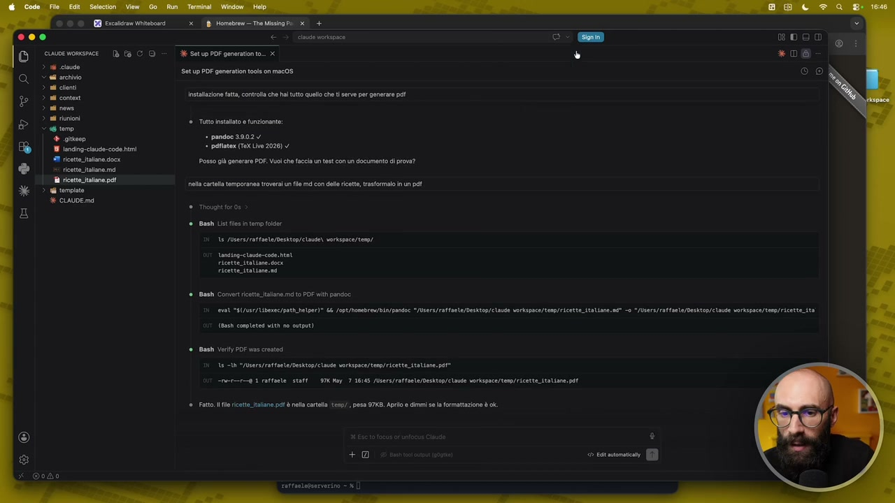

**Testo a schermo (OCR):** © OO E Fucsicram Witevosrd > Homebrew Tre Ming Pi 3 + 000 pera cuuoe womsmace (è Ea C © + SetupPOF generatonto.. x > i cave <a archivio nd cloni nd contea ni neve n riunioni temo 4 giusoo + pandoc 3902 4 19 1onding-ciaude-code fmi Cipe [an 11 ricatta faane docx Posso già generare POE. Vuoi che facia un test con un documento di prova? ricette talno md 11 ricette talamo pa ni ei corta temporanea trovera un fe md con elle ricetta, trastrmalo in un pat > Wi tempiato % CIAUDE md Setup PDF generati tools on mac0S Vosttazone fatta, contra che ha tutto quell che t serve per generare pet è tuto Istalto funzionante: ai List i o tmp or 15 /Users/rttaela/Destop/ claude) varkspae/teno/ andiog- classe cose. beni Bash Convert iott ital. mi t0 POF with pandoe rat 4 /use/Libeec/pathhelper)® Li opt/Mosebres/aLa/pondoc 5/Users/raffaele/Deshtop/claue vorkspoce/temp/ricetta_ italiane. ue = */isers/raffaete/Desktop/claue vorkspae/teno/ ricette ita Cbs completed with no output) Bash Very POF was creed 15 ih >yusrs/rattaele/Desktop/clade vorkspce/temp/ricette_ italiane. per ameerra 1 raffaele. staff. 9TX Hoy. 7 1615 /Users/raffanle/Desktop/ clave vorkspae/tenp/ricett_ italiane. pat Fatto le vicett Itala pol è nea cartella esp, pesa 97K8. Apro e dimmi se la formattazione è ok. +2

> In questo momento, da quando abbiamo installato Pandoc, è in grado di generare PDF. Con Homebrew possiamo installare centinaia e centinaia e centinaia di cose, quindi installatevi quello che vi serve e il vostro agente con Cloud Code sarà in grado di fare tutto quello di cui avete bisogno.
