# Installare app col terminale [su Windows]

> Documento generato automaticamente: trascrizione e screenshot sincronizzati del video-corso.

## [00:00:00] Schermata 0 _(start)_

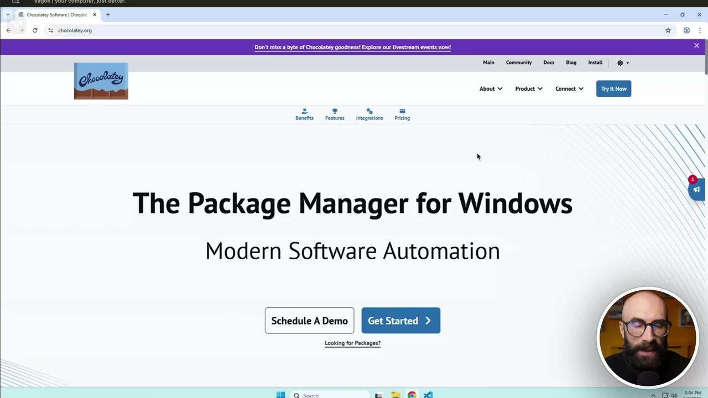

**Testo a schermo (OCR):** 2 ® * = Bonefto Festues | integmtione Pricing The Package Manager for Windows Modern Software Automation Schedule A Demo Looking for Packages? I assd ns 2 ff A

> Sicuramente qualcuno, guardando la lezione precedente, dove abbiamo visto come con Homebrew possiamo installare app che poi funzionano dal terminale, e abbiamo detto che quella roba funziona per Mac, anche per Linux, diciamo anche se poi su Linux ci sono altre alternative a Homebrew, si sarà chiesto, ma io che sto su Windows questa cosa non la posso fare, questo terzo livello di potenziamento non la posso fare. Certo che lo potete fare e fortunatamente c'è una lezione pure per voi. Lo facciamo attraverso Chocolaty, credo che si pronunci, che possiamo pensarlo proprio come un equivalente per Windows di Homebrew, ci sono delle differenze però diciamo concettualmente la stessa cosa, cioè è un gestore di pacchetti che però diciamo sono app che si usano dal terminale, quindi andremo a lanciare diciamo dalla PowerShell di Windows, in modo tale perché Cloud deve poterle chiamare. Ricordatevi che il motivo per cui facciamo questa cosa è perché noi vogliamo che Cloud, qua lo apriamo così ci ricordiamo che stiamo facendo questa cosa con Cloud Code, vogliamo

## [00:01:00] Schermata 1 _(periodic)_

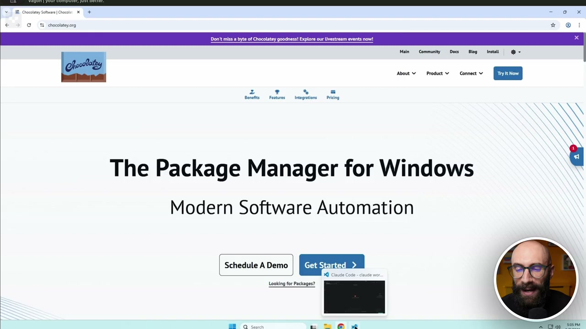

**Testo a schermo (OCR):** Bonefto © Feste: integmtione Pricing The Package Manager for Windows Modern Software Automation Schedule A Demo | Gets]

## [00:01:00] Schermata 2 _(scene)_

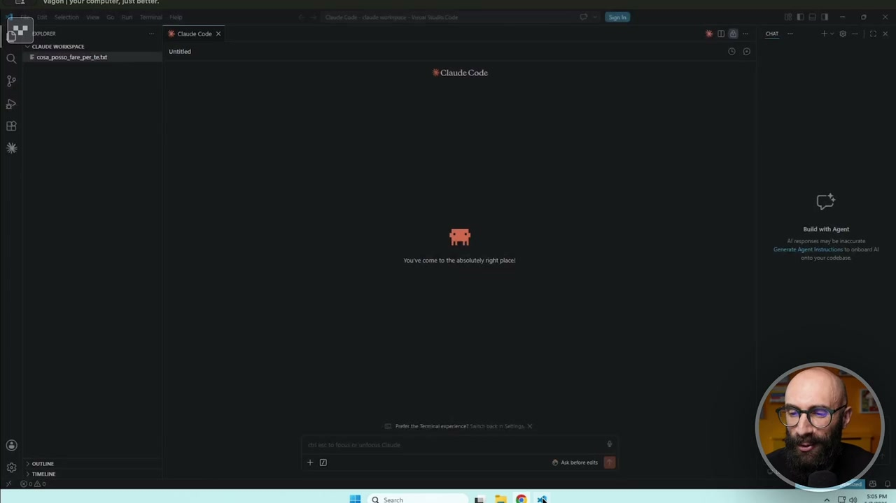

**Testo a schermo (OCR):** * % Claude Code % @ ® ne =

> che Cloud da qua dentro, quindi quando lavora, è in grado di chiamare delle app che si chiamano dal terminale, questo lo potenzia all'infinito. Allora cosa facciamo? Andate sul sito di Chocolaty, che vi lascio poi diciamo nelle risorse aggiuntive del corso,

## [00:01:13] Schermata 3 _(scene)_

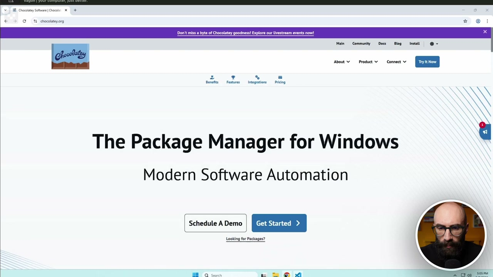

**Testo a schermo (OCR):** The Package Manager for Windows Modern Software Automation Schedule A Demo | RESSE.) Looking for Packages? ss Dè A

> qua sopra c'è un pulsante che si chiama install e ci dice cosa diciamo possiamo fare. Non vi preoccupate, ci sono vari modi per installarlo, la cosa migliore è poi scaricarlo, vedete, scegli come installarlo, come generico, come individuo e così via, a noi va bene come individuo, scrolliamo un pochino, non vi preoccupate, questa parte la vedete sempre un po' lenta perché come vi dicevo io sono in una macchina virtuale, a voi sarà molto più veloce. Quindi dice, prendi questo comando, lo copiamo proprio da qua e lancialo dentro la tua PowerShell, io sto usando sempre PowerShell, mi raccomando, quando fate questa roba su Windows lanciatelo sempre all'interno di PowerShell. Quindi ci apriamo PowerShell, che è l'equivalente del terminale, e qua facciamo incolla, che

## [00:02:02] Schermata 4 _(scene)_

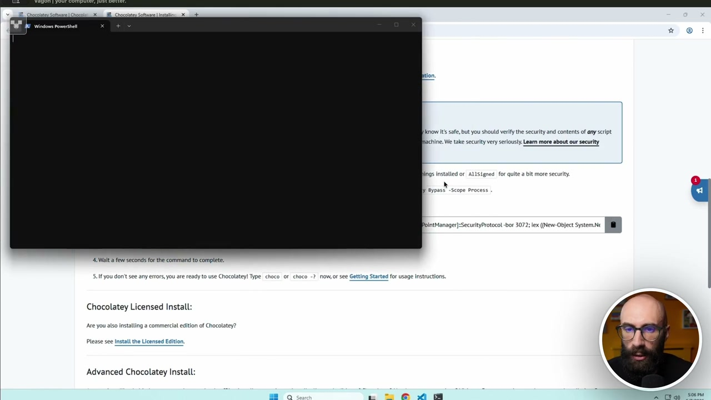

**Testo a schermo (OCR):** | pr know 115 safe, but you should verify the security and contents of any script chine. Me take security very serious. Leam more about our security ings installed or. AlSigned for quite a bit more security Pointanager)-SecurityProtocol bor 3072; lx (New- Object System.Ne ‘Malta few seconds for the command to complete. 5. you dont see any errors, you are ready to use Chocolateyi Type Low, or see Getting Started or usage instructions. Chocolatey Licensed Install: Are you also installing a commercial edition of Chocolatey? Advanced Chocolatey Install: a se 2 © A) A [ag 506

> è quella riga che abbiamo appena copiato dal sito ufficiale di Chocolaty, quindi gli diamo invio e adesso dovrebbe partire l'installazione, ok? Qua ci sta dicendo che lo sta de-zippando, ok, lo sta aprendo, dice che sta aggiungendo al path e così via, ok, dice dovrebbe essere finito, cosa facciamo quando abbiamo finito l'installazione? Chiudiamo la PowerShell, per sicurezza è sempre meglio chiudere e riaprire per fare

## [00:02:36] Schermata 5 _(scene)_

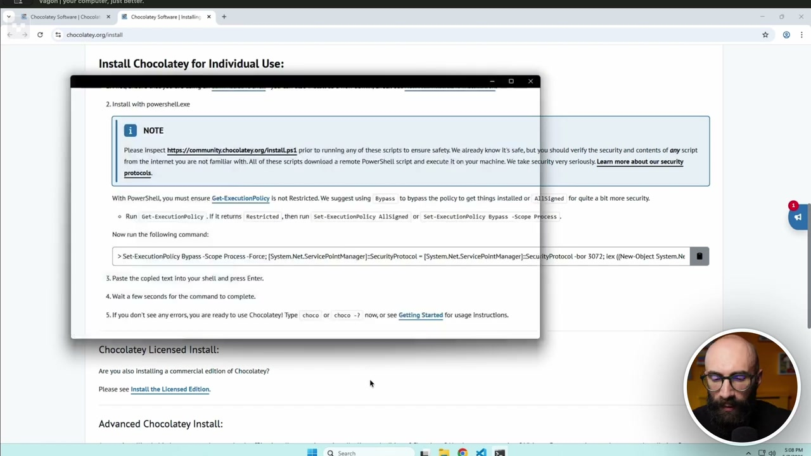

**Testo a schermo (OCR):** > E Croci Setare] Cocos I CiocsteySofore] O (5 chocolsteorg/niti * © Install Chocolatey for Individual Use: 2. Install with powershellexe ®© nore Please Inspect htps:/communitychocolateyorg/istalL.ps1 prior to running any of these scripts to ensure safety We already know its safe, but fu should verify the security and contents of any script from the internet you are not familiar with. AI of these scripts download a remote PowerShell script and execute it on your machine. We take seditty very serious. Lear more about our security With owerShell you must ensure Get-Sxecutionolcy Îs ot Restritec.We suggest using &ypase. to bypass the policy to gt things installed or Afisigne for quite bt more security » St Ecco Dias Scope Process For stemNet SevcePoln ang] SectyProtc [ontemNeServcrombanagr} Scott dor 072 1x (ew oc stem DÌ A ita fiv seconds for the command to complete. 5.Ifyou dont see any errors, you are ready to use Chocolateyi Type! choco or chaco -?_now.or see Getting Started for usage instructions Ave you also installing a commercial edition of Chocolatey? Please see Install the Licensed Edition. Advanced Chocolatey Install:

> in modo che si prenda le modifiche, riapriamoci di nuovo il nostro bel PowerShell, lo clicchiamo qua e adesso abbiamo il comando cioco, ok?

## [00:02:43] Schermata 6 _(scene)_

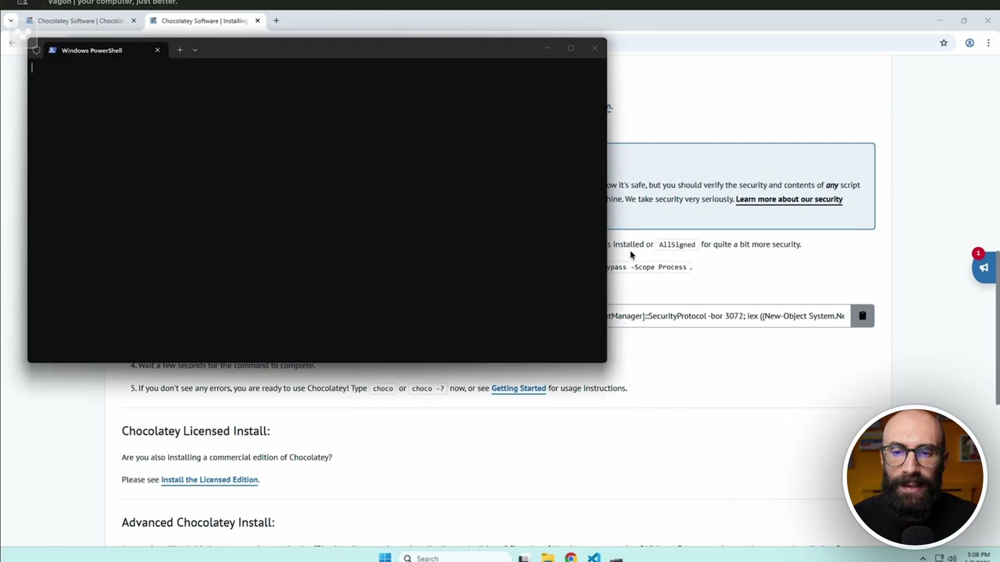

**Testo a schermo (OCR):** a) < E * 115 safe, but you should verify the security and contents of any script ine. We take security very serious. Leam more about our security Manager:Securtyrotocol bor 3072: ex (New Onjet System. I 5. you dont see any errors, you are ready to use Chocolateyi Type choco 01 choco -?_nowor see Getting Started fo usage instructions. Chocolatey Licensed Install: Are youal 0 installing a commercial edition of Chocolatey? Advanced Chocolatey Install: ss 4 ea A ag 500 o) :

> Il comando cioco, cioco invio, è l'equivalente del comando brew che diamo dentro macOS, non proprio l'equivalente, nel senso concettualmente è la stessa cosa, quindi su Mac facevamo brew, install e mettevamo il nome del pacchetto e qua facciamo cioco, install e il nome del pacchetto. Su Mac facevamo brew, uninstall per cancellare, per disinstallare, qua facciamo cioco, uninstall e così via. Ma come dicevamo prima, questa roba non la facciamo noi, diciamo, dal terminale, ci facciamo aiutare da Cloud Code, ok? Quindi se avete visto, diciamo, la lezione, quella su Mac, oppure magari l'avete esaltata direttamente, ve lo faccio vedere qua, quello che consiglio io è di fare sempre questa

## [00:03:26] Schermata 7 _(scene)_

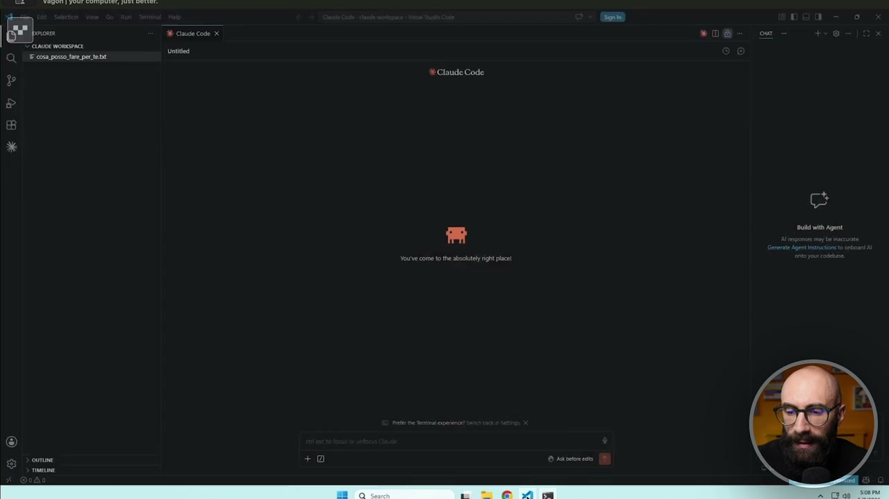

**Testo a schermo (OCR):** Same 1! princi rioni iirizona di Lissa ie EA Onttied Claude Code % > e come 10 he ac f ounne + DI D asi eceece. (I

> cosa qua. Sono su Windows e ho appena installato Ciocolatei per la gestione dei pacchetti e qua gli diciamo, per esempio, se lui è in grado di chiamarlo per installare delle cose, gli diciamo sei in grado di utilizzarlo direttamente tu per installare cose quando servono, invio. Questa era, diciamo, la cosa che vi consiglio sempre di fare, no? Ve l'ho detto diverse volte all'interno di questo corso, ovviamente ve lo ribadisco pure qua, abbiamo uno strumento così potente che ci spiega come dobbiamo fare le cose, ma soprattutto li può fare, ok? Quindi ci dice, guarda sì lo posso fare, però guarda che a volte potrebbe servire

## [00:04:26] Schermata 8 _(periodic)_

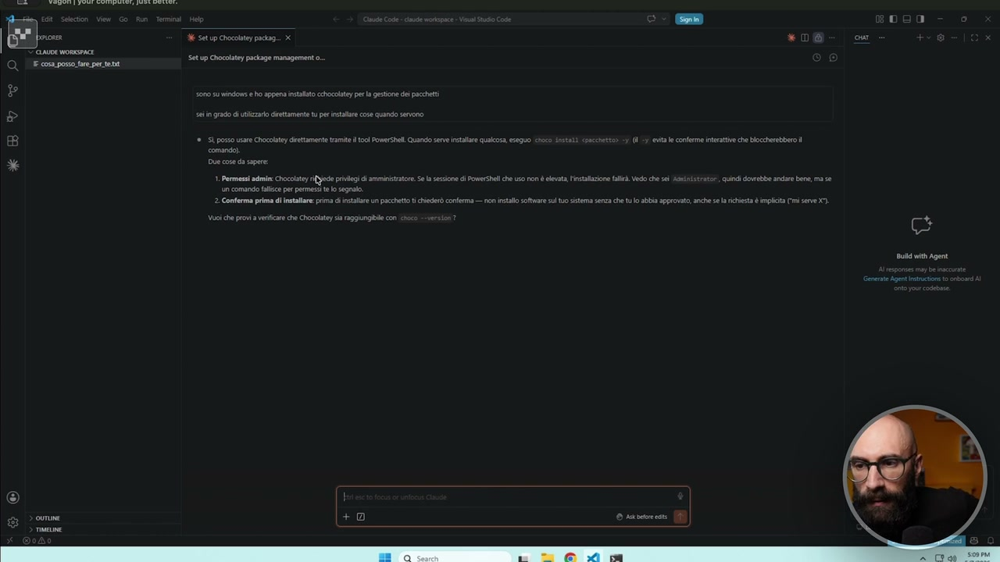

**Testo a schermo (OCR):** Smmdini i i riar tire Sn voo barone E setup Ciclo poca. Xx * init Set up Chocolate pacage management. BB © 54 posso usare Chocolate direttamente rami ol PowerShlL Quando serve installare qualcosa eseguo 4 ita e conferme interattive che Boccherebtero Due cose da sapere atte. e la sessione di Powersheli he uso non è elevata, instaazione fl do che se Permessi min Chocolate gie png i ami un comando flsce pr permesi 0 segnalo. 2. Conferma prima di italia: prima ist o pacchetto chiederò onerma — n stallo sota su tuo stema senza che ti o abbia apoovato, anche se la care che Chocolate sa raggiunge con i ti Agent

> il permesso di amministratore, in alcuni casi se non siete amministratore vi dice semplicemente questa cosa la devi fare tu dalla PowerShell, ok? Ho detto la stessa cosa anche nella lezione su Mac, quindi alcune cose Cloud Code è in grado di farne autonomia, per alcune altre invece vi dice, guarda, sta roba io non la posso fare da solo, devi essere tu amministratore, ok? Quindi per essere amministratore lo devi fare tu all'interno di PowerShell. Quindi gli dico, usiamo adesso Cioco per installare un pacchetto che ci permetta per esempio di creare dei PDF. Gli dico, se voglio creare dei PDF direttamente da Cloud Code, di cosa hai bisogno come tool da installare con Cioco? E lui adesso ci dirà delle proposte, ok? Ci sono delle app che lui installerà che gli servono per poter fare delle cose.

## [00:05:26] Schermata 9 _(periodic)_

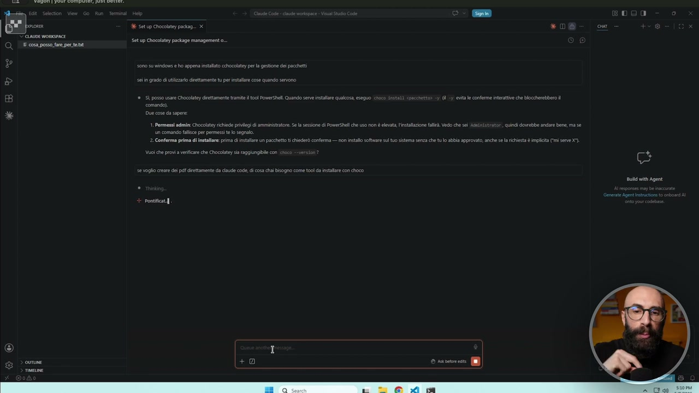

**Testo a schermo (OCR):** dacia Door reni sia 5 cosa posso fare perte bt 6 setup Croclte padag. x Set p Chocoatey package management. 2500 1 window e ho pena italia choc pera gestione dei pacchetti tool Powerhel.Quandio eve nstlre qulcosa eseguo @ © 5 posso usare Chocolite direttamente tram 1. armena: Chocolate cede privilegi di mniisiatore. Se la sezione di omershall che uo no è eat 1 2 Conferma prima dl inte: prima iste n pacchetto chiederò conferma — L ? e are di pal detamente i au code, di cosa chi bisogno come told istat con choco non stallo software so dstema senza che ta lo abbia ppt, anche se la chiesta è implct Vic che provi vricare che Chocoaey sia 299 i ti Agent

> Un esempio classico che faccio sempre è quello di appunto poter fare i PDF. Gli dice, guarda, l'alternativa qual è? È che io ti installo Pandoc e poi ti metto pure questo qua, Pandoc con Mixtext. In realtà andiamo già sulla seconda perché la prima abbiamo visto che non funziona, l'abbiamo vista nell'altro video. Se non l'avete vista non fa niente. Gli dico, procedi con la seconda. E vedi qua ci dice proprio il comando, ci dice io farò Cioco install Pandoc e Mixtext. Quindi vado a mettere queste due app, a tutti gli effetti, installo nel tuo sistema un'app che si chiama Pandoc e un'app che si chiama Mixtext che ti permetteranno di generare dei PDF. A questo punto Cloud Code gli abbiamo aggiunto una nuova capacità, cioè il fatto di poter generare PDF. Ecco perché dicevo lo estendiamo all'infinito perché quindi dopo potrà generare PDF, potrà se vi serve generare file, che ne so, PowerPoint, leggere dei file video, leggere dei file audio

## [00:06:26] Schermata 10 _(periodic)_

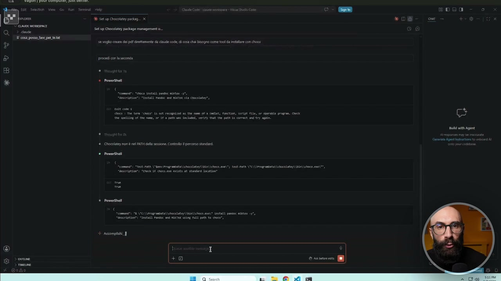

**Testo a schermo (OCR):** Sonnet Vitinia 1 cosa pento fare per te Set up Chocolatey package management. 2 voglio rare dei pf rettamente ca ine code di osa chi bcgno come co da mate con choco procedi con la secon esente progr. cnc È& 3 sei tw ui wi Agent

> e così via. Perciò le potenzialità sono infinite. Adesso vediamo un attimino l'installazione, quando ha finito di installarlo mettiamo subito anche alla prova. Ecco qua, l'installazione è finita, ci dice ho installato tutto, c'hai Pandoc e c'hai Mixtext. Quindi dice in questo momento io sono pronto a generare dei PDF. Facciamolo, cioè mettiamolo subito alla prova, vediamo se effettivamente può creare dei PDF. Vi ricordate che qua abbiamo un file txt di prova che avevamo generato in un'altra lezione dove ho usato Windows, diciamo Windows non lo uso mai quindi qua il workspace non è aggiornato, però avevamo questo file di prova che abbiamo generato tempo fa. Ecco, vediamo subito se è in grado di trasformarcelo in un file PDF. Gli dico nel workspace c'è un file txt, trasformalo, scusatemi, aspetta un attimo che torno indietro che qua ho sbagliato. Allora nel workspace ci sarà questo file txt e ce lo facciamo trasformare in un file

## [00:07:26] Schermata 11 _(periodic)_

**Testo a schermo (OCR):** cin uso E cosa posso ie pere procedi con seconda è PowerShot i DG * Rowersheli ut ti Agent + Pandoc 3.902 = MICTOX253 con n Sono pronto a generare PDF. Quando me o cheer (e fami un POF con quest ot.) userò fuso Marion = Pandoc = PD Nota sull prima esecuzione KTX carica pacchetti LUTEX on-demand a pma vlt che seno, quindi primo POF potrebbe metter 1-2 minuti

> PDF. Allora nel workspace hai un file txt, trasformalo in un PDF, invio e adesso lui userà questa roba che abbiamo appena installato e quindi Pandoc e Mixtext che sono delle app, ma lui è in grado di invocarle perché sono app che si possono chiamare dal terminale perché in teoria io potrei pure aprirmi la mia bella PowerShell qua e chiamare queste app da dentro la PowerShell. Noi semplicemente lo stiamo facendo fare a Claude perché Claude sa come farlo, sa come incastrarli, noi non vogliamo utilizzare il terminale o almeno alcuni di noi, alcuni di voi non vogliono usare il terminale. Gli diamo l'autorizzazione e adesso quello che succederà qua dentro è che nella nostra cartellina del workspace troveremo oltre al file txt che abbiamo creato in precedenza il file pdf diciamo di questa trasformazione.

## [00:08:26] Schermata 12 _(periodic)_

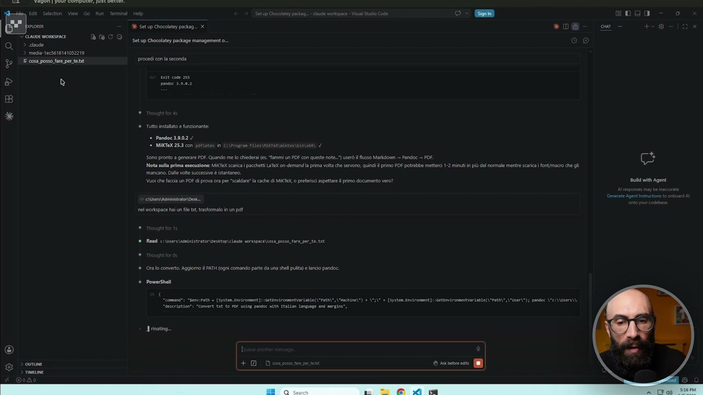

**Testo a schermo (OCR):** spit tree porone ME Setup Chocolitey pacag.. x * go E cosaposiotae perte Set up Chocolatey package management. + Pandoc 3.902 / è MTOX253 con E È ‘ Sono pronto generare PDF. Quando me o cheer e. fammi n POF con quest ot) userò lusso Marion = Pandax = PDF GC Nota sulla prima esecuzione MKTEX saio pacchetti LEX on demon a prima vota che servono, quindi primo POF potrebbe metter 1-2 minuti pù del nome matr scarica fonia che gi Vici che aci un PDF di prova ora per "scaldare cache ci NIKTEX 0 pre aspettare primo documento vc ud tn Agent e ripe hi un le bt tasca i un pe = ora comit. Aggioro l PATH (ogni comando parte da una sel ult) lanci pandoe » RowerSheli A atog

> Ecco qua, il nostro bel agente ha finito di creare il pdf, vediamo se effettivamente ce l'abbiamo, abbassiamo un attimo questa finestra qua così andiamo nel nostro desktop nella cartella dove abbiamo creato il nostro workspace, scusate c'è pure questa qua di cioccolate

## [00:08:40] Schermata 13 _(scene)_

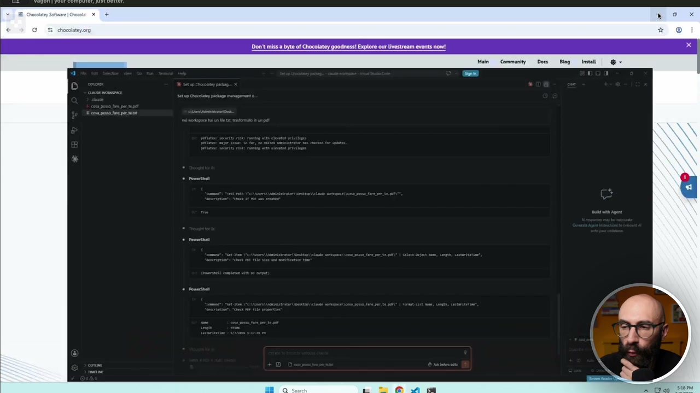

> in sottofondo, qua abbiamo Claude workspace, vi ricordate? Ecco qua, abbiamo il nostro bel file pdf, clicchiamo e vediamo come si vede e abbiamo creato il nostro primo pdf, vabbè qua adesso dice che non c'è installato niente, vabbè diamogli l'autorizzazione ad aprirlo con Chrome, non fate caso a questi errori e così via,

## [00:09:00] Schermata 14 _(scene)_

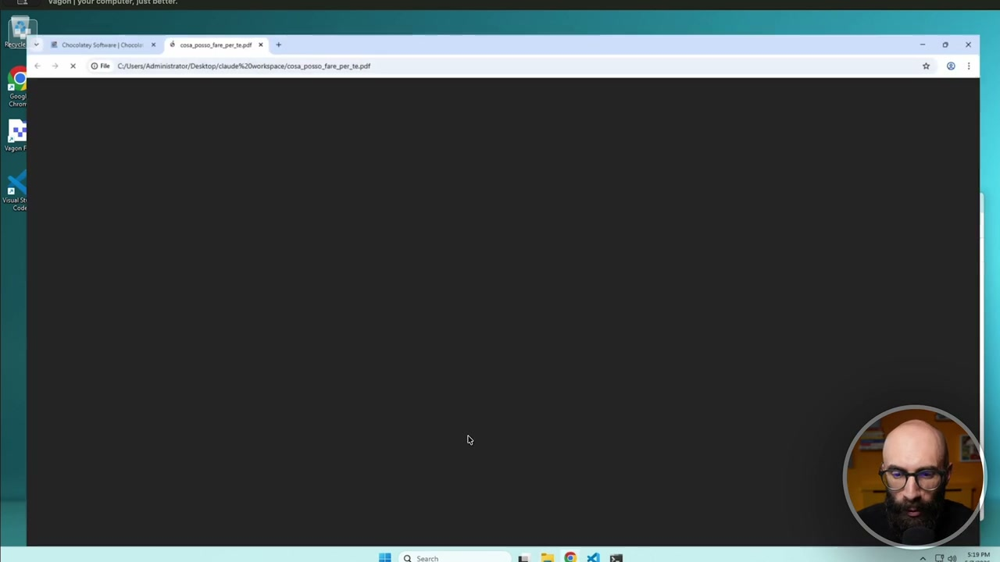

> ma abbiamo trasformato il file txt in un file pdf, capite perché questa cosa è potente? Perché adesso sapendo che cioccolate.I al suo interno può installare centinaia di cose

## [00:09:11] Schermata 15 _(scene)_

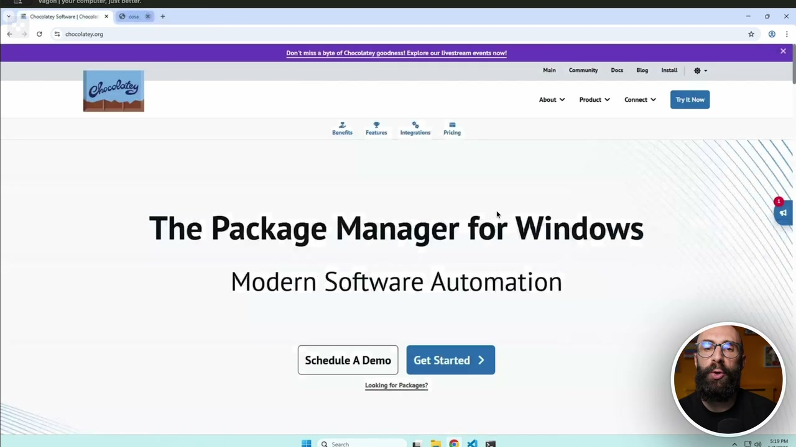

**Testo a schermo (OCR):** The Package Manager for Windows Modern Software Automation Schedule A Demo | RISE) Looking for Packages? 8 0% e 2 © AN

> diverse e quindi vi serve una cosa per lavorare con gli mp3, con gli mp4, con questo formato di file, con questo formato d'immagine e così via, basta che lo installiamo e il nostro sistema, il nostro agente che ci stiamo creando si può estendere all'infinito.
