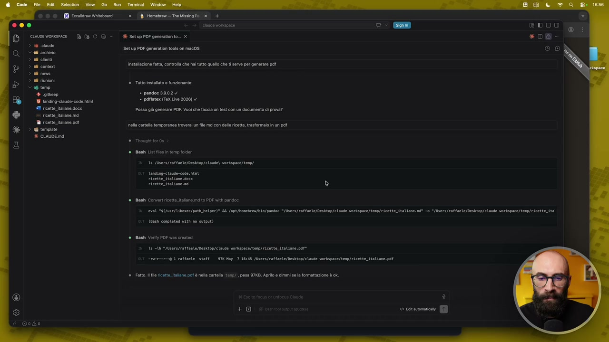
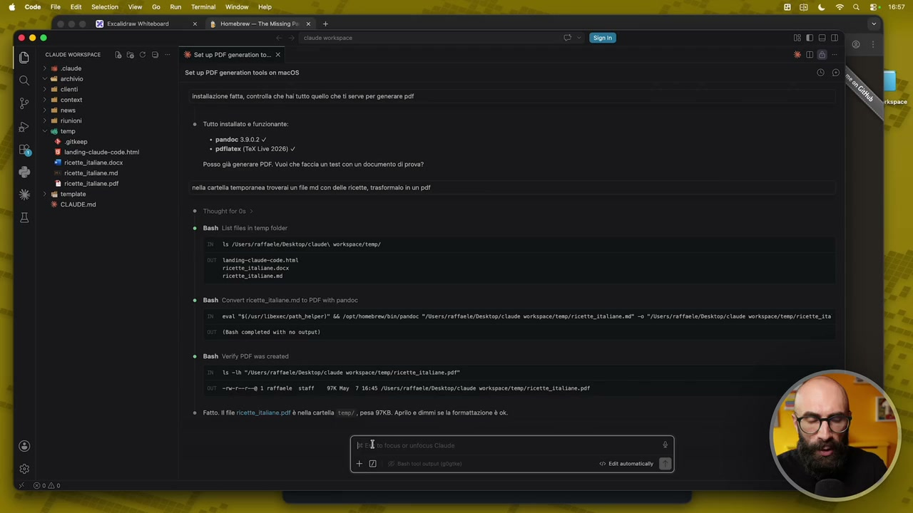
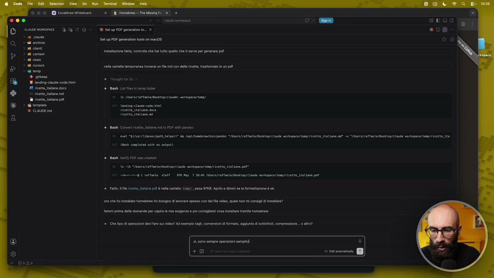
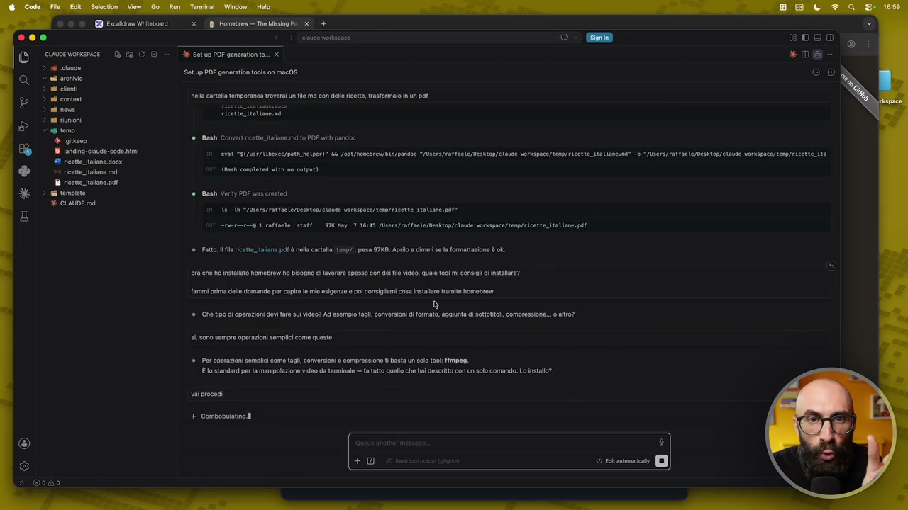
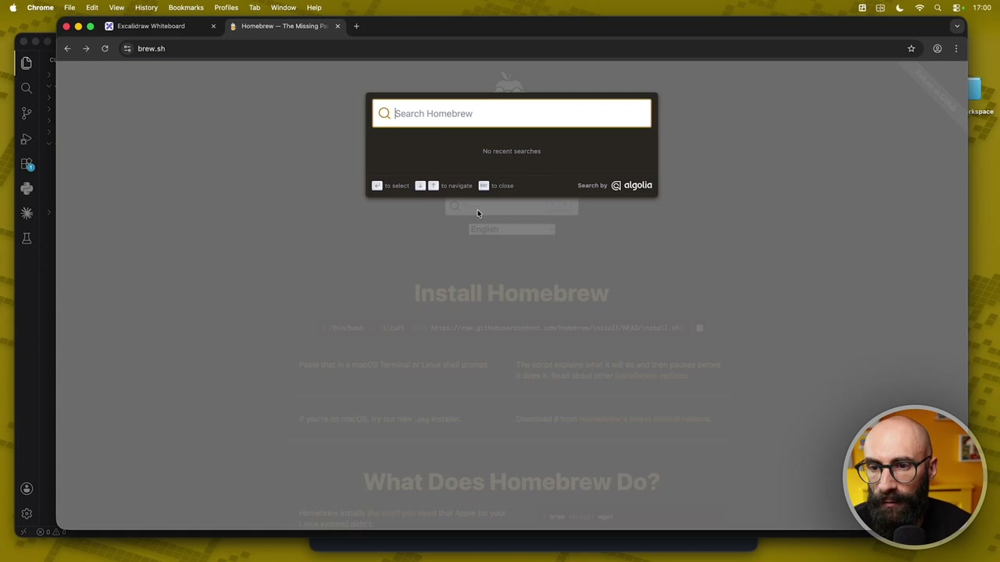
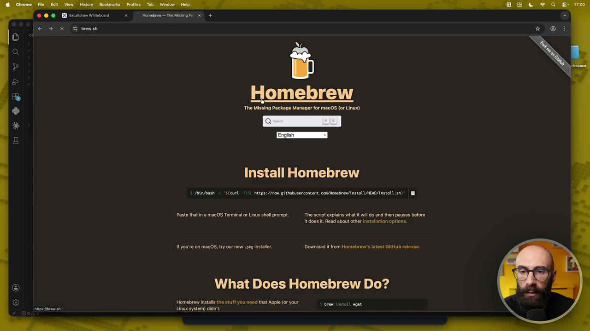
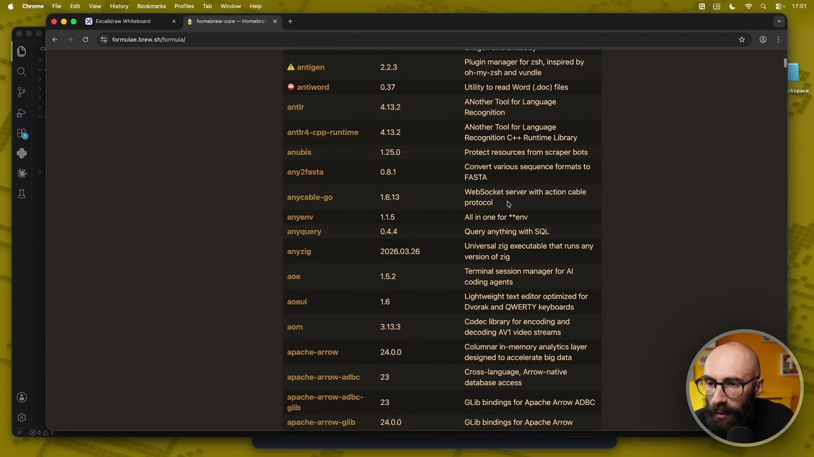
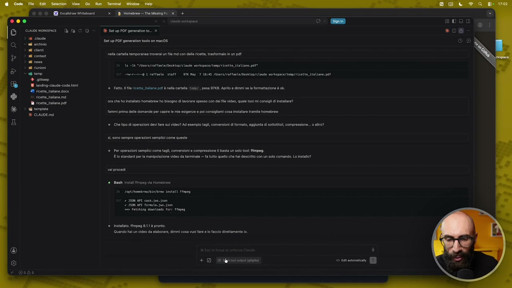
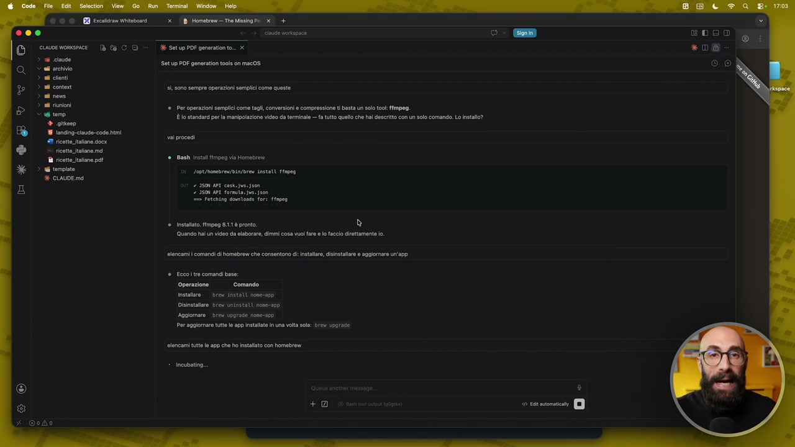

# Prendere confidenza col gestore dei pacchetti

> Documento generato automaticamente: trascrizione e screenshot sincronizzati del video-corso.

## [00:00:00] Schermata 0 _(start)_

**Testo a schermo (OCR):** MO OE Face Witbosrd x Homebrew The Missing Pa > + O00 eu oriapoce @ cuioevomsmce Dè © CO = dk setuppoÈ geneatonto. x > 16 cus © a archivio > al sont > 18 conta > al ene > il riunioni < @ temo "e gio pandoc 39024 È Sacra plate (Tx Lie 2028) #7 ricette faone docx Posso là generare PDF. Vuoi che faccia un test con un documento di prova? x ricette italone md i ricette talne pat i tompate E CIAUDE md Setup PDF generati tools on mac0S Vnsttazione ftt, controll che ha tutto quell che t serve per generare pe è Tutto istatato e funzionante: el corta temporanos trovera un fl md con ole ricetta, trasormalo in un et ai List i i tmp or 15 /Users/rttaele/Desiton/ claude) vorkspace/teno/ andina case pnt Bash Convert ricette tale. mo PDF wi pandoe erat S(/use/Libexec/path helper]® 5 opt /hosebres/aLa/pondoc >/Users/raffaele/Desktop/claue verkspace/temp/ricetta_ita Lane. ne" = */Users/raffoela/Desktp/ claude vorkspoce/tenp/ ricette ita Bash Very POF ao creed 18 1 "/usrs/rartaele/Desktop/elaude vorkspace/ten/ ricette italiane. pel* anderen 1 rffaote. staff STK My. 7 16145 /Usera/raffunte/Desktop/claue vorkapace/tonp/ricette_itaViane,pat Fatto fe icott talane po è nel carte np, pesa 7KB. Apro o dimmi se a formattazione è ok

> Lo so che qualcuno di voi magari ha ancora qualche dubbio, quindi fatemi fare un'altra lezione extra che non avevo pensato di fare, ma voglio dare qualche informazione aggiuntiva su questa cosa che abbiamo fatto e su come gestirla bene. Quello che abbiamo fatto è installare un gestore di pacchetti, ok? Homebrew fa questo, non voglio andare nel tecnico, ma è uno strumento che ci permette di installare delle app che funzionano a riga di comando, e quindi funzionano dentro il terminale. Come dicevo, questa cosa per voi è completamente trasparente, perché tanto voi la maggior parte delle cose le fate e passano direttamente da Cloud Code. E al massimo in alcuni casi vi dirà, per fare questa cosa ho bisogno di permessi di amministratore, quindi fallo tu nel terminale. Voglio farvi vedere un paio di cose. Uno, approfondiamo bene la cosa di dove trovo le app da installare. Prima l'ho detto velocemente in un passaggio, abbiamo visto che abbiamo installato Pandoc per lavorare con i PDF, ma se oltre ai PDF io ho bisogno di fare altre cose, cosa possiamo fare?

## [00:01:00] Schermata 1 _(periodic)_

**Testo a schermo (OCR):** 18 1onsing-cisuso-code hi I ricatta alone docx x ricette alone md ricette talane pat ui template E CLAUDE md 218 Homebcem = The Mising Pa D+ % Setup PDF generation to.. x Setup PDF generati tools on mac0S Insttazone fatta, controlla che ha tutto quell che t serve per generare pt è tuto istalto e funzionante: + pandoc 3902 Y platee (TX Live 2026) V Posso giù generare POF. Vu che faccia un test con un documento di prova? ea catala temporanea trovera un fl md con ol ricetta, trasermalo in un et Ban Lit le tmp or 14 /Users/rtaete/Desitop/ claude) vorkspace/teno/ anding- classe cose. pen Bash Convert ricette talane.m to PDF th pandoe erat 6 (/use/Libeec/path helper)® Li opt /hesebres/aLa/pondoc >/Users/raffaele/Desktop/claut verkspace/tenp/ricetta_ italiane. ni - */isars/raffaela/Desktop/ classe vorkspoe/tenp/ ricette ita Bash Veri POF was crenidi 15 iN "/users/rartaele/Deskrop/claue vorkspace/ten/ ricette italiane. per* meet 1 Ptfaete. staff GTX Ny_7 16145 /lsers/raffante/Desktop/ clave vorkspace/tenp/ricett_ita Lane. pat Fatto le icetteitalane po è nel cate sp7, pesa 7KB. Arlo 0 dimmi se a formattazione è o

> Le strade che abbiamo a disposizione sono queste. La prima cosa lo chiedo a Cloud, quindi gli dico, ora che ho installato Homebrew, ho bisogno di lavorare spesso con dei file video. Quale tool mi consigli di installare? Se proprio volete esagerare, perché avete capito che si usa Cloud Code bene facendovi fare delle domande, possiamo dirgli fammi prima delle domande per capire le mie esigenze e poi consigliami cosa installare tramite Homebrew. Quindi adesso lui ci dirà, ma tu con i video cosa devi fare? Devi fare montaggi, devi fare tagli? Gli dici che tipo di tagli devi fare, con versioni di formato, aggiunto e sottotitoli? Sì, sono sempre operazioni semplici come questa.

## [00:02:00] Schermata 2 _(periodic)_

**Testo a schermo (OCR):** SO © E Pucsicrae Witosrd x (Homebrew Tre Ming Pi > + DO aa rice cuwoemomsnice (è Ea C © = I SetupPDF generatonto.. x > 16 code © a archivio ni cloni nd conto ni neve 28 riunioni eta carta temporanea troverai un fl md con ele ricetta, trasfermalo in un pet temo + giteep 18 1ansing-ciauso-code hi #1 ricette aane docx asti List es in tmp older x ricotta alone md ricette talne pat rd template randig- cla code, bt E CLAUDE md I Setup PDE generati tools on mac0S Instalazone fatt, contra che ha tutto qull che 5 serve per generare pt Thoughe for 0 16 /users/rattaete/Desktop/ clan) vorkspace/teno/ ant Convert ricette talane md o POF wi pandoe eno "1/use/Liberec/path_helper)® 6 /opt/homebres/bin/pondoc */Users/rafTaele/eshtop/ claude verkspace/tenp/ricetta_itatiane.n0* -o*/iser/raffante/Desktop/claue vorkspoe/temp/ricette_ita bah completed with ne sutpit) Bash Very POF Was created 18 ih ©/Usera/raffacle/Deshtop/c laude vorkapce/tem/ricetteitatine.pot® Svern 1 raffaele. staff STX My 7 16145 /Users/raffarle/Desktop/claue vorkapace/timp/ricette_ italiane. pat Fatto. fl cotte italiane pal è nella catell esp, posa 97KG. Apro e dimmi sla formattazione è ok ora che ho instalao homebrew o bisogno di avoraro spasso con elle video, quale 10| mi consigli di instalare? ammi prima dlle domande per capre le mi esigenze e poi consgiami osa instaare tramite homebrew ®. he tipo i operazioni dev fre si video? Ad esempio tag, conversioni d formato, agglunta di sottotitoli compression. 0 ato? 4, sono sempre operazioni semplici Li ia © srsonzc

> Per esempio a me mi capita spesso di dover fare queste cose. Ovviamente i video è un esempio, voi fate il vostro esempio. Vedete, già fatto, già fatto. Cioè già mi ha detto, ok, allora se devi fare questo non devo fare tante domande. Ti basta un solo tool, FFmpeg, che è potentissimo, completamente gratuito. Si usa da riga di comando. Per qualcuno di voi questa cosa potrà sembrare clamorosa, ma il terminale è un mondo a sé. Cioè con il terminale voi potete fare quasi tutte le cose che potete fare dalle app dove si deve cliccare sull'interfaccia. Tipo FFmpeg permette di lavorare con i video e lo fate dal terminale. Ripeto, FFmpeg è un'app nel terminale che vi fa tagliare video, convertire il formato, mettere in muto, diminuire la qualità, cambiare la risoluzione e così via. Quindi, diciamo, questo è il modo con il quale scopriamo le app da installare. Lui ci dice, lo posso installare io direttamente da qua. Io dico, vai, procedi, procedi. Lui adesso cosa farà? Farà una chiamata al terminale.

## [00:03:00] Schermata 3 _(periodic)_

**Testo a schermo (OCR):** © © O EB Boca mitobonei x | Homebrem= The Mising Pa D+ 000 eau rispoce @ cuisvomsce Db © CO = dk satuppoÈ geneatonto. x > 18 cave © a archivio > al nti He, ela cata temporanea trovera un fl md con dell ricette, tratormalo in un pet Setup PDE generati tools on mac0S ni riunioni < @ temo lè gu = Bash Convert ricette tale. mo PDF th pandoc 19 1onding-ciaude-code fmi #1 ricatta aone docx x ricetta alone md Cbs completed with no utput) ricettine pa rd troia è Boat Vary POF vas cr val S(/usr/Vibexc/path helper]® &k Jopt/nosebres/ain/pondoc "/Users/reffaele/eshtop/clavde vorkspace/tenp/ ricetta italiane. nd" -o */lsers/raffacte/Desktop/ claude orispace/temo/ricetteita 19 1h >/Usrs/raffaele/Deskrop/elause vorkspace/tem/ricette_ italiane pel SETTI raffaele. staff OP My 7 1614 /isers/raffacle/Desktap/ claude vorkspoe/tenp/ ricette. ita Line. pat ‘Fatto. flo ott. itlane. pl è ela cata usp/, posa 97KB. Apro e dimmi sa formattazione è ok. ora che ho istlto homebrew ho bisogno di lavora spesso con delle video, qule tool mi consigli instalro?. ammi prima dlle domande per cap le mi esigenze e poi consglami osa installare tramito Pomabrew ® =. Che tipo l operazioni dev fare sl do? Ad esempio tag, conversioni formato, aggunta di sottili compresione.. o ato?! 5 50n0 sempre operazioni sempli come queste ®. Per operazioni semplici come tag, converseni compressione ti basta un slo to: ffmpeg. È o standar pe a manipolazione video da terminale — a tutto quello che hal descritto con slo comando. Lo nstal? val procedi + Combobulating ni SI +)

> Quindi vedete ha fatto brew install FFmpeg, che è quello che noi avremmo fatto direttamente qua dentro nel terminale. Se a voi spaventa lo fate fare direttamente a Cloud Code, diciamo, dalla sua chat. Come vi dicevo, ricordatevi che in alcuni casi, ovviamente per riuscire a farlo, lui dice ho bisogno dei permessi di amministratore, quindi devi farlo per forza tu all'interno del terminale, devi mettere la password. Quindi un modo qual è? Un modo è questo, andare dentro Cloud Code e chiedegli esplicitamente, senti ho bisogno di fare questa cosa, che mi consigli di installare. Adesso lui ci mette l'installazione, ci metterò un pochino. Il secondo modo, qual è? Come vi dicevo, abbiamo qua la ricerca di Homebrew. Quindi vado qua dentro e cerco la cosa che devo fare.

## [00:03:42] Schermata 4 _(scene)_

**Testo a schermo (OCR):** © © © EA Prcascian todo € > GS brewsh Me BR Me

> Per esempio, lavorate spesso con i file Word, quindi scrivo docx e mi escono alcune cose che servono per docx. Quindi clicco per esempio su questo e vado a vedermi che cos'è.

## [00:03:54] Schermata 5 _(scene)_

**Testo a schermo (OCR):** RD Faccine toe € 3 XS bremsh Homebrew The Missing Package Manager for macOS (or Linux) Install Homebrew 1 Aoto/bash 1 "SCcurl -13S1 hetps://ron.giubusercontent.con/iomebren/instat /NEAD/instatt.sh)" | Paste that in a macOS Terminal or Linux shell prompt. The script expains what ill do and then pauses before it does i. Read about other installation options. you're on macOS, ty our new pia Installer. Download rom Homebrew's latest Gittub release. What Does Homebrew Do? Homebrew install tha stu ou need that Apple (or your 4 rm instati Liu syto) die. sE

> E mi dice guarda questo per esempio consente di convertire i file in Microsoft Office in documenti di testo. Se a voi questa funzionalità vi serve, vi installate docx2txt. Semplicemente con questo comando. Oppure lo chiedete a Cloud di farlo. E' così che io scopro le cose. O lo chiedo a Cloud o vado qua nella lista, nella ricerca. Terza strada, c'è una lista. Se voi scrollate qui in fondo e andate nel Homebrew Packages, c'è proprio la lista di tutti i pacchetti presenti. Cliccate qua e vedete qua quanti sono? Sono centinaia. Centinaia, centinaia e centinaia. Mi fermo così a caso per dirvi. Vedete per esempio questo qua. Questo è per lavorare in Angular. Un modo con il quale si programma. Un framework con il quale si programma. Cose che magari non conosco proprio.

## [00:04:54] Schermata 6 _(periodic)_

**Testo a schermo (OCR):** @ antiword antir antir4-cpp-runtime anubis ‘any2fasta anycable-go anyenv anyquery anyzio apache-arrow apache-arrow-adbe- apache-arrow-adbc- glib apache-arrow-glib Plugin manager for zsh, inspired by oh-my-zsh and vundle Utility to read Word (doc) files. ‘ANother Tool for Language Recognition ANother Tool for Language Recognition C++ Runtime Library Protect resources from scraper bots Convert various sequence formats to FASTA WebSocket server with action cable protocol All in one for **env Query anything with SOL Universal zig executable that runs any version of zig Terminal session manager for AI coding agents Lightweight text editor optimized for Dvorak and QWERTY keyboards Codec library for encoding and decoding AVI video streams Columnar in-memory analytics layer designed to accelerate big data Cross-language, Arrow-native database access

> Websocket, SQL, questo è un codec video. Vedete quanta roba potete installare. Sono veramente centinaia, centinaia, centinaia. Avete tre strade, scegliete voi quale è la strada che preferite. Qua dice che l'ha installato. Quindi abbiamo anche FFmpeg. Sono fondamentalmente poche le cose che dobbiamo ricordarci con Homebrew. Io ve le voglio comunque dire. Per installare le cose, il comando è brew install e il nome del pacchetto. Ma tanto basta che qua dentro gli dite installami FFmpeg. Però se volete saperlo si fa in questo modo. E poi le altre due cose che possono essere utili, quali sono? Disinstallare, e quindi fate brew uninstall e il nome del pacchetto. Oppure aggiornare, quindi brew upgrade e il nome del pacchetto. Quindi può aggiornare le app. Il fatto che vi dicevo è che lo fa automaticamente Cloud Code. Io ve lo dico solo per farvelo sapere. Ma la cosa migliore che potremmo fare è elencami i comandi di Homebrew.

## [00:05:54] Schermata 7 _(periodic)_

**Testo a schermo (OCR):** RE caio Wiinvonri DO cuwoe womsmice Dè fa CO > 16 cave © ei archivio > all nti ni conto ni neve n riunioni temo + gite 18 1onsing-cisuse-code hi 41 ricette iaane docx x) ricette italone md ricette italiane pa i template VE CIAUDE md xD Homebeem The Misna Pi D+ ea rispa % Setup PDF generation to. x Setup PDF generation tools on mac0S ela cartella temporanea troverai un fe md con el ricette, trasfermalo in un et 14 ih >/users/ratfaele/Deshtop/elade vorkspce/tem/ricette italiane. pel omverr@ 1 raffaele. staff GTX Hoy, 7 1615 /bsers/raffarle/Desktop/ clave vorkspae/tamp/ricette_ita\iane. pat ‘® Fatto fle iotttalane. pe è nella cata teso, pesa 97KB. Apro e dimmi sa formattazione è ck. ora che ho istalto homebrew ho bisogno di avra spesso con del le video, quale t0| mi consigli instalare? ami prima dlle domande per capre le mio esigenze e poi consigiami cosa instalare tramite hombre ®. Cho tipo i operazioni dev fare si deo? Ad semo tag, conversioni dl formato, aggunta di sotottl, compressione... altro? si sono sempre operazioni semplli come queste ©. Par operazioni semplici come tag, conversioni e compressione ti basta un solo to: ffmpeg. È lo standar pe a manipolazione vide da terminale — fa tutto quello che hal descritto con n slo comando. Lo stai? vai procedi e Giah insalifirpog via Homebrew Lopt ronbreu/bi/Bres install fapes 2 3508402 casta jon 7508401 forma. jus json 1 retentng comtonde for: fopeo è instalto. ffmpeg 8.11 pronto. Quan ha un video da elaborare, immi cosa vuo ae el aio arttamonte io. + D Bg

> Che consentono di installare, disinstallare e aggiornare un'app. E qua adesso ce li facciamo dire. Quello che vi ho fatto io a mano. Allora per installare devi fare brew install e il nome. Disinstallare brew uninstall e il nome. Aggiornare brew upgrade e il nome. E se volete sapere le cose che avete installato. Invece c'è questo comando che si chiama brew leaves. Come foglie. Quindi o lo diamo qua direttamente. Faccio brew leaves. Ecco qua mi dice adesso ho installato ffmpeg e pandoc. Oppure gli dico qua elencami tutte le cose, tutte le app che ho installato con Homebrew. Ripeto vi sto facendo vedere anche la versione da riga di comando. Diciamo da terminale. Ma voi potete anche non usarla mai. Quindi tutti gli esempi li faccio vedere due volte.

## [00:06:54] Schermata 8 _(periodic)_

**Testo a schermo (OCR):** © © © EB Prc todo O snme BECO > 1 cave © archivio > ul conti nd conto ni neve > il riunioni < @ temo + gite 19 1anding:ciaude-code fmi #1 rcatteitaone docx 5) ricetta alone md ricette italane pat tempie E CLAUDE md 2/18 Homebce The sing Pi DE + ctu oiapoce XE Setup PDF generatonto.. x Setup PDE generation tools on mac0S 5000 sempre operazioni sempli come queste ©. Pet operazioni semplici come tag, conversion e compressione ti basta un solo to: fimpeg. È o standar per a manipolazione video da terminale — fa tutto quello che hal descritto con n slo comando. Lo nstalo? voi procedi e Bash instalimpeg via Homebren Logeronbreu/bia/Bres 1nstati Hapeg 2 350 07 casso 750 J01 fornita. Do Ferentino dounaads ® Installato. mpeg 8.1 è pronto. ® Quando hl un video da elaborare, dimmi cosa vuo are 0 acco direttamente o. sencami i comandi Domabrew che consentano di: installa, isiastaliare 0 aggiornare un'anp = Ecco tre comandibase: Operazione —Comando nstlre — brev install noee-2pp Disinstallare bre uninstattnone-0 Aggiomare bre upgrade none-app Por aggiomnare tutto lo app Instle in una ola sola Biev parade oncami tutt o 290 che ho instatato con homebrew + incubating.. © ron DI

> Voi usate sempre quello dentro il VS Code. Perché è molto più facile e magari non vi spaventa. Se qualcuno di voi invece è un po' più smanettone. O semplicemente vuole testare le cose in maniera seria. Lo può fare da riga di comando. E si impara install, upgrade e così via. Ecco qua abbiamo installato pandoc, ffmpeg, basic test. Con questa lezioncina extra spero di avervi dato un po' di serenità in più. E farvi capire che abbiamo fatto una cosa molto molto semplice. E soprattutto che una volta che l'avete capita fate comunque fare tutto a Cloud Code. Semplicemente sapete che Cloud Code sta installando delle cose che funzionano nel terminale. In modo tale che lui sarà in grado di chiamarle per poi dopo fare delle attività.
