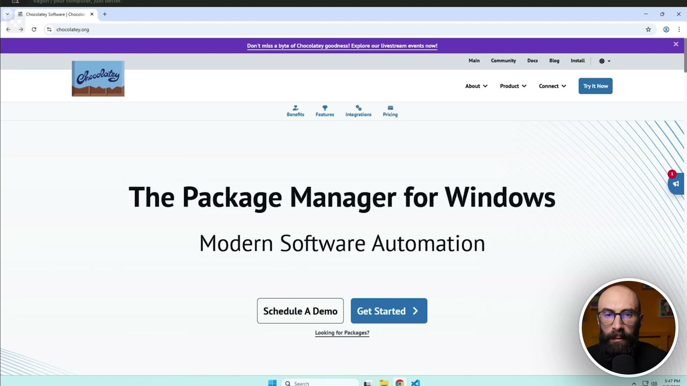
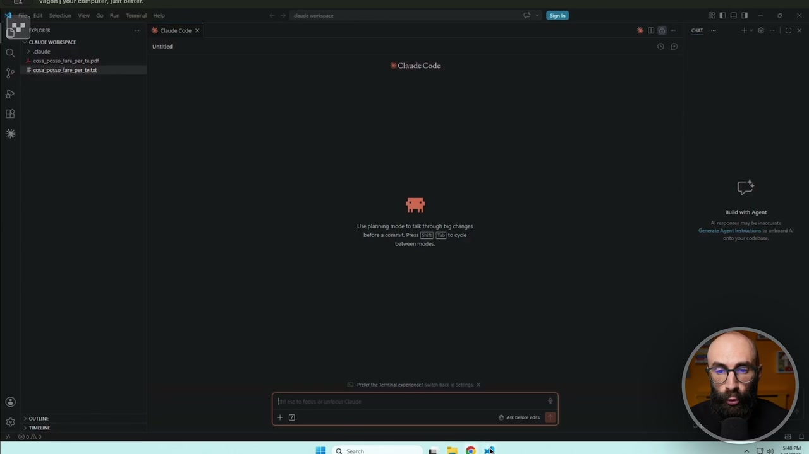
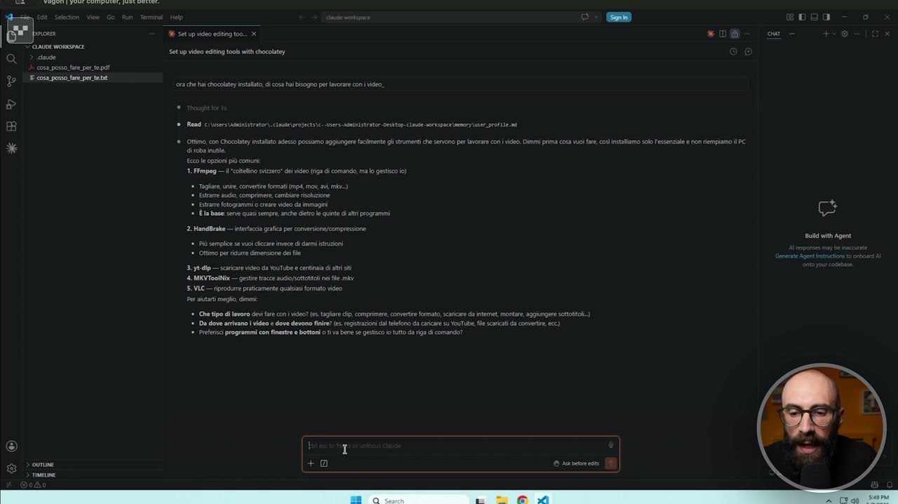
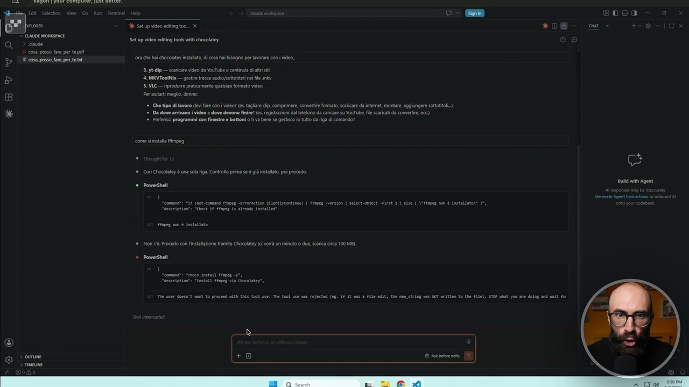
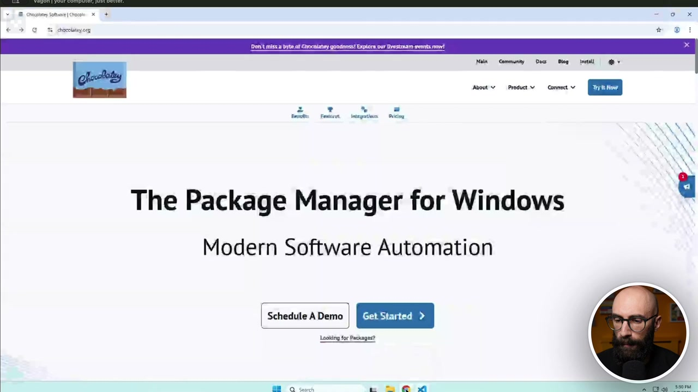
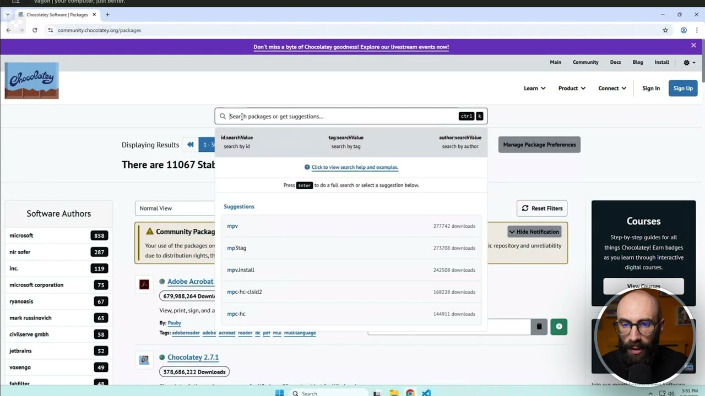

# Prendere confidenza col gestore dei pacchetti [su Windows]

> Documento generato automaticamente: trascrizione e screenshot sincronizzati del video-corso.

## [00:00:00] Schermata 0 _(start)_

**Testo a schermo (OCR):** 2 ta * DD Bonefto | Fester integmtione Pricing The Package Manager for Windows Modern Software Automation Schedule A Demo | RESSE: Looking for Packages? D n Rf A ù \ ù

> A questo punto uno potrebbe chiedersi, Raph, scusami, io fino a due minuti fa non sapevo nemmeno che esistessero le app che funzionano nel terminale, non sapevo che esisteva questo cioccolato per Windows. Come faccio a capire quali sono le potenzialità, diciamo, le direzioni in cui posso espandere il mio ambiente, il mio agente, il mio cloud code? Secondo me ci sono vari modi per fare questa cosa. L'ho fatto vedere anche, diciamo, nella lezione equivalente per Mac, perché il ragionamento è lo stesso, vi faccio solo vedere questa cosa, diciamo, fatta su Windows, su Chocolate. Allora, la prima cosa, la più facile, è sempre chiediamolo a, diciamo, a Cloud Code, perché Cloud Code sa di cosa ha bisogno per fare certe cose. E quindi

## [00:00:40] Schermata 1 _(scene)_

**Testo a schermo (OCR):** Claude Code

> io la cosa che farei qual è? Gli dico, ora che hai Chocolate installato, diciamo che dovete lavorare con i video. Di cosa hai bisogno per lavorare con i video? E quindi ci facciamo suggerire da Cloud Code che app andiamo a installare per lavorare con i video. Diciamo, vediamo cosa ci dice. Allora, con Chocolate posso fare varie cose, eccetera, eccetera. Dici, guarda, le opzioni più comune sono FFmpeg, Handbrake e così via, VLC, eccetera. Per esempio, io uso tantissimo FFmpeg, che è un programma, diciamo, un piccolo software che si usa dal terminale, che permette di convertire, tagliare, estrarre audio, cambiare, che ne so, formato, risoluzione, bitrate e così via. Quindi, se io adesso dovessi fare qualcosa con i video, gli direi come si installa FFmpeg. Diciamo, ho messo un F di troppo, perdonatemi. Come

## [00:01:40] Schermata 2 _(periodic)_

**Testo a schermo (OCR):** Sr edit tropici srt co posso fare pe fap do E cosa posi lare perte ME Set up io ting too. x Set up video editing ik with chcolatey a che hi chocolate stai, iosa hi bisogno pe care con video è Rand ieri ® ottimo, cn Chacalitey stlito adesso possiamo aggungeeacimente gli strumenti ch servono per cr cn deo. Dimmi pa osa vu ae, csi installamo slo essenze e nn nempiamo ì E 1. Frmpeg — i cotlimo izzro” de video (ia di comando, ma lo gesto i) © stare ud, comprimere, cambiare richuone 2 È la base serve quasi sempre, anche ito le quinte i ti programmi 2 Handake — trici rca per conveniane/compressione iù semplice se vi cicare invece ci dmistuzioni ep — scrcar vio ca ou 4 MVTOOINI SL VIE — riprodurre praticamente quali formato video (Ch tipo di fever dei fa o] deo (E taglie Ch, comprimere. cova (cia scared oieml morire, sggongie sota Da dove ariano video e dove devono finire? e. eitazini al leon da ciicare su Vutute, le cricca comerie, ecc) "prefer programen on finestre e Bottoni 0 tiva bene se gestisco 10 tutto na di comando È; tt tt Agent

> si installa FFmpeg? Vabbè, l'ha capito, adesso ci darà lui il comando. E a questo punto, le strade che abbiamo sono due. O prendo il comando, mi apro la mia bella, diciamo, PowerShell e lo lancio là dentro. Oppure gli dico, tu sei in grado, perché come abbiamo detto, a volte lui lo sa fare. Qua lo vuole lanciare subito. Controllo prima se è già installato. Vabbè, diciamo, qua non sta facendo l'installazione. Dice, FFmpeg non è installato. Dice, procedo con l'installazione. Qua no, lo fermiamo. Ma comunque il comando che avrebbe dato era, vedete, cioco install FFmpeg. Quindi o gli diciamo, dammi le istruzioni, me lo faccio io nel terminale, o gli lo facciamo installare. Fermiamolo, perché in questo caso non vogliamo installarlo. È da solo per darvi il concetto. Quindi apro Cloud Code, gli spiego cosa devo fare. Attenzione, parto dal problema, non dallo strumento, non dalla tecnologia, non dall'app, che è l'errore

## [00:02:40] Schermata 3 _(periodic)_

**Testo a schermo (OCR):** E Set up video editing took with chocolatey î cosa posso fare per_te pdf renna hs chocolate instlato, i cosa hi bisogno per lavorare coni video. By — scaricare video ca ouTube e centinaia di atri si 4 MEVTOoIIx— geste tacco audi 5. VILC— riprodurre praticamente quali formato video n Per tati meglio, dimm 2, Da dive co | eg È va dev fe? fi eg dl lfono di aire n) ViT le di come 0a i GE è. Con Chocoliey è una sl figa Controllo prima se il installo; pi procedo. a A è RowerShell cui * RowerShell © rareonest (|

> che fanno tutti. E quindi gli dice, Raph, ma tu hai installato, che ne so, Pandoc prima. No, io come faccio a sapere che mi serve Pandoc? Ma tu non devi sapere se ti serve Pandoc o FFmpeg. Tu devi sapere qual è il tuo problema. Voglio tagliare dei video. Lo sai fare, Cloud Code? E lui ti dirà, sì, ma ho bisogno di FFmpeg. Ho un sacco di file word che devo convertire, che ne so, 100 file word devo convertire velocemente in pdf. Lo sai fare? Sì, installami Pandoc. E così via, no? E questo è il tipo di rapporto che dovete creare. L'altra strada qual è? La seconda alternativa. Scegliete voi quella che preferite, anche se vi consiglio sempre di usare quella dentro Cloud Code. Andate sul sito di Cioccolati, che vi ho messo nelle risorse, diciamo, di questo

## [00:03:22] Schermata 4 _(scene)_

**Testo a schermo (OCR):** The Package Manager for Windows Modern Software Automation | Schedule A Demo Looking for Packages? T I è i A

> capitolo. E qua sulla home page c'è questo link che dice, vuoi vedere tutti i vari pacchetti? Voi ci cliccate sopra e vi apre questa lista infinita. In questo momento, cioè nel momento in cui sto registrando, ci sono 11.067 Cose che potete installare. Avete capito quanto potete espandere questo sistema all'infinito? Vedete, già qua si vede per esempio Adobe, Acrobat e così via. Se io per esempio qua sopra vado e scrivo FFmpeg, che è il pacchettino che abbiamo visto prima. Adesso qua nella lista, vedete? Qua sotto nella lista ci abbiamo FFmpeg. Ovviamente io qua posso anche scrivere un'altra cosa. Non è che forse devo conoscere FFmpeg. Potrei dire per esempio che voi lavorate tanto con, che ne so, i file mp3. Quindi cancello qua e scrivo mp3 e vedo cosa ci sono come alternative. Ok? Do invio e vedo cosa c'è come alternative all'interno. Oppure, che ne so, ancora meglio, invece di mp3 scrivo audio e vedo cosa sono i pacchetti legati all'audio. Me li

## [00:04:22] Schermata 5 _(periodic)_

**Testo a schermo (OCR):** WES W=TE: - 0 x ‘ Gt communiiehocelatezorg/psctagee a © tyta of Chocolatay goodness! Explore cur ivestream events now Main © Community = Doc Giog intatti | @- @ bearfh packages or get suggestions Io) size tagzencivat naboceaiae There are 11067 Stat © Cico view search help and erampie». res EB to 0a ul each sett a suggest beton I Reset Fiters Normat View sugge Software Authors Courses "= A community Packag ii rogna ui out use ofthe packages On | mpitag 5708 aonionde repository and unrllbiity things Chocolatey! Eam badge rr sof 8; eine 5 ou lam tough Interactive ine 119 mprinstali È tal course BI Sadodercobat mpc-hccisid2 168 (679,988,264 Downi Views printsInand A | mpcihe Tai O ie lee mark russinovich » 4 aviserve gmbh jetbrains I ®Chocolatey2.71 (G78,686,222 Downloads 3 i 100000G8880 = n 2 ©

> vado a vedere e dico, ah, questo pacchetto fa questa cosa qua. È proprio quello che mi serve a me. Per esempio questo autoconverter. Magari vi converte tra i formati e così via. Quindi le due strade sono o aprite CloudCode, chiedete di farvi guidare, quindi nella scelta dell'app da installare e poi nell'installazione che fate voi o fate fare CloudCode, oppure andate alla fonte, quindi nei pacchetti di cioccolate e in questo catalogo enorme, tipo vinili, vi mettete a scrollare fino a che non trovate cose interessanti. Ok? Può sembrare strano all'inizio. Basta prenderci un po' di confidenza, ma avete capito che potete installare migliaia di cose e quelle sono tutte capacità che state dando al vostro CloudCode.
