# Creare una skill avanzata

> Documento generato automaticamente: trascrizione e screenshot sincronizzati del video-corso.

## [00:00:00] Schermata 0 _(start)_

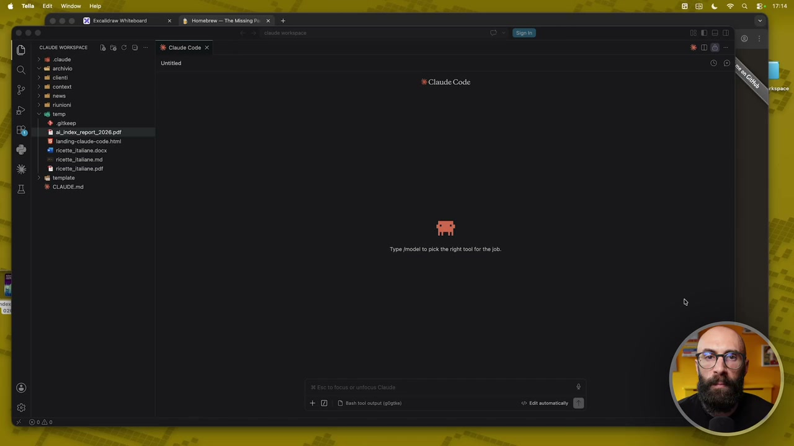

**Testo a schermo (OCR):** nd ciont ni conta ni neve ionici tro + gite Th siindex report 2026 pet landing-claude-code hi 41 ricotta jtalane docx ricette talia md ricettine pet tempia Type [model to pic te right tool for the Job. + 1 DI summit (og)

> Ora che abbiamo finito i tre livelli di estensione, o meglio non li abbiamo finiti, li abbiamo compresi perché poi non finiscono mai, potete estenderlo quanto volete voi, possiamo fare una cosa. Cioè creare una skill un pochino un po' più avanzata, un pochino più complessa. Non l'abbiamo fatto nel modulo sulle skills perché ovviamente ci mancavano ancora dei concetti. Secondo me è importante proseguire in maniera lineare e progressiva. Quindi adesso che abbiamo capito bene le skills, abbiamo capito bene l'estensione, abbiamo nuove funzionalità del nostro agente, proviamo a fare una nuova tipo di skill. Vi faccio un esempio, questa potrebbe essere una cosa che capita a qualcuno di voi. Io leggo tantissimi pdf, tantissimi report, white paper, ebook che scarico in rete e così via. Qua per esempio ce n'ho un aperto che vi ho fatto vedere, forse l'avete intravisto anche in qualche altra lezione.

## [00:00:47] Schermata 1 _(scene)_

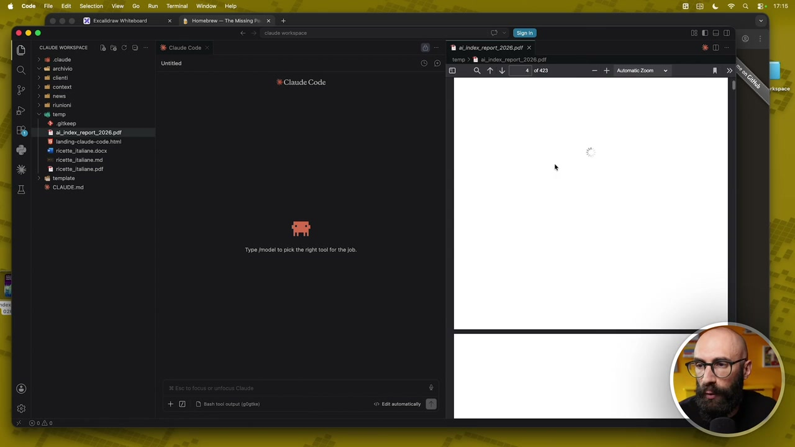

**Testo a schermo (OCR):** Claude Code ta aUndorseport 202891

> Voglio fare una skill che mi permetta velocemente di estrarre dei, diciamo, dei take away importanti da un pdf. Quindi gli dico questa cosa. Aiutami a creare una skill che legge un pdf, solitamente un report, un ebook, un white paper o altro, e mi estrae 5 take away importanti. La risposta deve essere sempre in italiano anche quando i documenti sono in lingua, sono in un'altra lingua. E qua gli possiamo dire che il pdf te lo posso dare come allegato della chat

## [00:01:47] Schermata 2 _(periodic)_

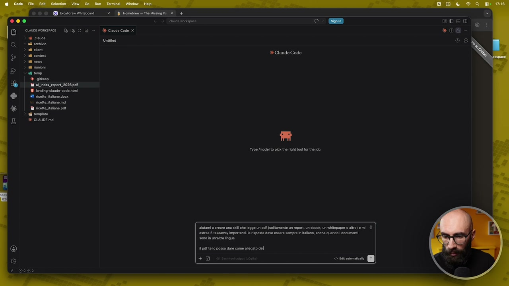

**Testo a schermo (OCR):** © © © GI Scassran Witebosr ce womsmce Dè fa CO > 16 cave © archivio > ul sont > ul content ricette talia md ® ricette italane pat Type modelo pick th right tolo e job. alutami a creare una sk che legge un pet (sltamente un reprt, un eBook, un witepaper 0 ato) mi ‘estrae 5 takaamay importanti. i risposta deve essre sempre i tano, anche quando i documenti sono n un'ala Ingua petto posso dare come alegato del ci) ricono

> oppure ti dico in che cartella trovarlo. Vi ricordate una cosa che abbiamo fatto sulle skill? Ci facciamo guidare, no? Quindi dico fammi tutte le domande necessarie prima di creare la skill, raccogli le informazioni che ti servono e poi creami la skill. Si deve chiamare, che ne so come la vogliamo chiamare, facciamo questo è report trattino riassunto. Il nome è terribile però giusto per dargli un nome. Invio. Adesso, se vi ricordate il procedimento per generare le skill, cosa farà Claude? Dirà ok ho capito cosa c'hai in mente, adesso ti guido piano piano. Nel frattempo apriamoci pure questa schermatina qua con l'elenco delle skill. Qua sono varie skill che abbiamo accumulato, diciamo, nei vari esempi che ho fatto all'interno di questo corso. Mi dice ok ogni take away deve essere solo un punto sintetico, una o due righe, oppure vuoi

## [00:02:47] Schermata 3 _(periodic)_

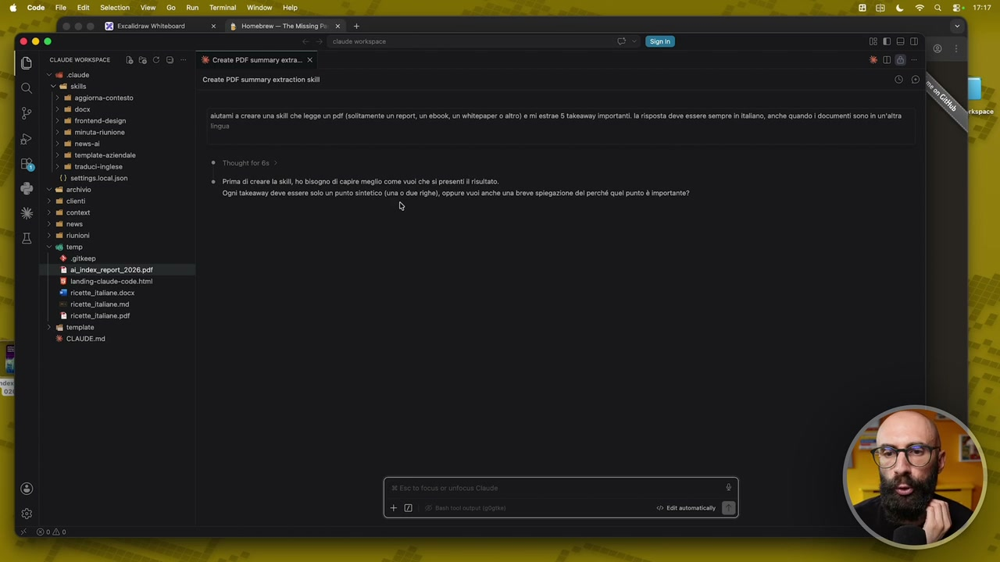

**Testo a schermo (OCR):** © © © GI Ecasdrom Witbosr cuwsewomsice (è a CO Cl corde CES > ii aggioma-contesto > all docs > ad frontend-design a rinuta-uniono > ul nova > al template. azindalo 3 nd taguck-ingeso (0) attinge ocason Val archivio > al cloni n contest ni nov ad unioni «temo + gico a si index report 2028 pd 19 anding-clude-code fmi I ricette. tane docx ricette talano ma i ricette talane pat i tempie % CIAUDE md XKR vVvE O aiutami a creare una sil che legge Un pat (solitamente un report, un ebook, n witapaper 0 tro) mi estro 5 aka Important. la risposta deve essere sempre i alan, anche quando | documenti ono i n'a ©. Traught forse Prima di creare la sl, ho bisogno di capire meglio come iuoi ch si presenti isuitto Ogni takeaway dee essre solo un punt sintetico (una 0 due righe), oppure Vuol anche una breve spiegazione del perché quel punto è importante? è

> anche una breve spiegazione del perché quel punto è importante. Facciamo che vogliamo solo il punto sintetico, solo punto sintetico, perché poi dopo la skill l'andiamo a migliorare. Vi ricordate, vi ho fatto sempre vedere, creiamo una versione base e poi la miglioriamo. Vuoi che prima dei cinque take away ci sia una breve introduzione del documento oppure andiamo dritto al punto? Aggiungiamola dopo questa cosa, facciamo dritto al punto, ok? Così vediamo come migliora. Facciamo la seconda versione e la facciamo molto più potente, molto più precisa. Li vuoi come lista numerata? Bullet point numerata, ok? Quindi take away 1, take away 2, take away 3 e così via. Vediamo cos'altro gli serve per poter generare questa skill e poi dopo la mettiamo subito alla prova su questo report che abbiamo qua. Ho tutto quello che mi serve, creo la skill adesso, ok? Qui adesso ci chiederei i permessi, fa partire skill creator, ok? Che è la skill che permette di creare le skill, vi ricordate? E adesso diciamo ci va a creare la skill. Ci troveremo tra un

## [00:03:47] Schermata 4 _(periodic)_

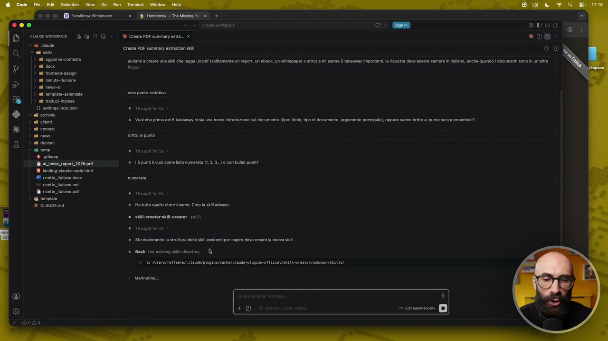

**Testo a schermo (OCR):** RD cain itato O sure BECCO 4 cile CES > ii aggioma-contesto > a docs > sl frontend-design 3. ul minutainione a ws > a tempat.azindalo > nd tacock-ingeso (0) satting ca son archivio nd conti nd contest n nova ad riunioni «temp + gine Ta al index seport2026 pdf 18 onsig-clauge-code hi ‘#1 retta taane docx ricette talano md a ricetta tatane pot i tempie È CLAUDE md x Homebrew — The Missing Pi x + Xe Create POF summary entra. x Create POF summary extratin ski a) ooo *D@ o) aiutami rear una sil che legge n pal (solamente un report un ebook, un witspapt 0 ao) e i estrae 5 takaaway importati. a risposta deve essere sempre in alano, anche quando documenti son im un'altra so punto sintetico © Thought foro» ©. Vuoi che prima di 5 skeavy sla una breve Introduzione su documento (tipo: tl, po dl documento, argomento principale), oppure vanno dito l punto senza preamboi? rito al punto e movont sorde 15 punti vuoi come sta numerata (, 2,3.) con bulet pont? nmersta Ho tutto quello che mi serve. Creo la sli adesso. akil-reatorski-crentor stili 500 esplorando la stutur delle Sl siste er capire dov creare a nuova si Bash List rising ski directory | È 151 MIsrs/tafaele/sclasde/pluglns/eace/clout-plogins-otticiai/akiU-erentor/unbnman/shis/ - Marinatino ®

> pochino una cartellina qua che si chiama report trattino riassunto che potremmo subito chiamare su questo file. Qua ci dice pure se vogliamo installare delle estensioni. Vedete a volte fa delle cose e ci chiede di installare delle estensioni. Per il momento stacchiamola, questa cosa non ci interessa. Però a volte vi propone di installare delle estensioni, come abbiamo visto all'inizio di questo modulo. Perfetto, vediamo cos'altro ha bisogno. Mi dice mi autorizzi, etc. Vai, diamogli l'ok. Adesso si sta leggendo le skill che abbiamo già a sistema, ok? Vi dicevo quello che faremo dopo appena sarà pronto, facciamo una seconda versione e la seconda versione la facciamo invece potenziata, no? Ci mettiamo per esempio anche le cose che ci ha suggerito e gli facciamo lavorare l'output in formato pdf, che è una cosa che fino a poco fa non poteva fare. Ok, dice che ha tutto quello che gli serve, creo la skill adesso. Ah, quando gli abbiamo detto che non doveva fare i test, quindi facciamo così. Diciamogli procedi, ma solo

## [00:04:47] Schermata 5 _(periodic)_

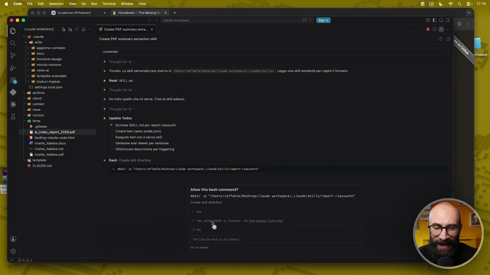

**Testo a schermo (OCR):** RI Pacaida Weta x B omebeen The misi Pi + DO eb cispoce cme womsnice 3 CD 8 Create POF summany xa. x < 4 cda Sad site > al aggioma:contosto > al docr mne Create POF summary extratin sli a frontend-deson dl inuta-uniono > ul nova Trovato Le sil personalizzate stanno i /Usara/raffaale/Deskton/ claude vorkapnce/.claute/skit13/. Leggo una ki esistente per capre formato > al tompiato.azindalo > nd tacoci-ingleso Read sitiiond (0) attinge ocason ved archivio ni cloni Ho tutto quello che mi serv. Creo la sl adesso ni conto ni nova tto for e si riunioni Pz Update Todos i, Scrivere SKILL md per aport- assunto Ta ai index report2026 pdl rear test cases (evaleJ:00) 19 anding-clude-code fmi Eseguire test cone senza sii #1 tictt tane docx Generare esa ener or revisione x ricetta Jane ma Ottimizzare descrizione per triagering ricette talane pa wi template Bash Croato sli dieci È CLAUDE md air -p "Adsers/ratfnele/Desktop/clasde vorkopace/ clnte/skiUl/report-rinsanto” Allow this bash command? mkdir -p */Users/raffaele/Desktop/ claude vorkspace/.claude/skilis/report-riassunto' Creato sli directory

> con la creazione della skill, non fare i test e tutto quello che viene dopo. Ok, quindi speriamo che adesso nella to-do list si salta questa cosa qua. Questa cosa ditegliela sempre, perché lui prova a fare i test, fa una roba lunghissima che non finisce più. Questo ve l'ho spiegato già, ve lo ribadisco, perché nasce come strumento per il programmatore e quindi ogni volta che modifica il codice fa anche dei test per andare a vedere che effettivamente quel codice è stato modificato bene e così via. Lo autorizziamo a creare la cartella e adesso qua ci comparirà la nostra bella cartellina con la skill. Mettiamo subito alla prova la skill e poi la potenziamo. Vediamo un attimo se la ha finita di creare. Perfetto, ha fatto la nostra skill, quindi adesso diciamo la mettiamo subito all'opera e gli dico testa subito la skill sul file pdf che trovi nella cartella temporanea, che si chiama AI index report 2026. Invio. Adesso invoca subito questa skill,

## [00:05:47] Schermata 6 _(periodic)_

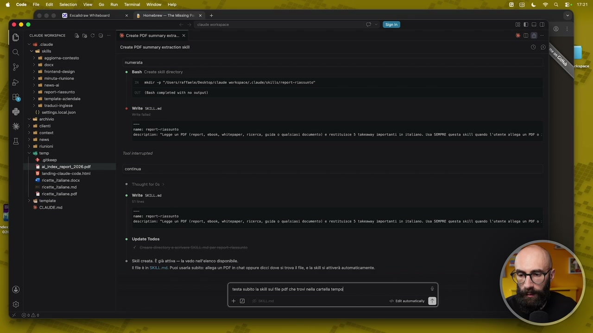

**Testo a schermo (OCR):** dB Homebenm— The sing Pd + XE Create PDF summary era. x Create POF summary extratin kl © Bash Crooto sl diet ALE 9 "/bsers/affante/Desktop/ clave vorkspace/.claue/ ski s/ report riassunto” Cda completed with ne output) è Write senti.ne Gestription: "Legge Un POF (report, ebok, uiitepaper, ricerca, quid o quilsiasi documento) e restituisce & tokemey impertanti in italimno, Usa SONE questa sbIML quando utent Tool interruptes continua ricette alano doce ia © Thougnt for e ricttettalane pet i tonni + CLAVDE md e Write settima description: “Legge un POF (report, ebeok, uiltesper, ricerca; guido è quliiasi documento) & restitusce 5 tolemay Iaportanti in italiano. Usa SIONE questa su quanso l'ente allega un POF 0 Update Todos ‘01 creta È gi attiva — la odo ell'lenco disponi. ti fo è in SKILL md. Puoi usar subito: alga un PDF In cha oppur dicci dove s trova fl, e la skill ttiverà automaticamente. testa subito la il su fl pa che rovi nea carta empd +

> la vedete qua, si chiama report riassunto. Dentro c'è la nostra bella skill. Vediamola subito all'opera. Sta cercando ovviamente il file perché lo deve trovare e altrimenti lo potevo copiare, mettere dentro la, diciamo, buttare come allegato nella chat, questa cosa potete fare sempre in vari modi. Eccola qua, la chiamata, lo vedete proprio perché c'è il pallino che ho scritto report riassunto che è una skill, quindi capite anche cosa sta facendo. Sta pigliando il file, questo è un file bello lungo quindi ci metterà un po', io taglio e vi faccio vedere direttamente quando l'ha letta. Ecco qua, ha letto il pdf e ci ha fatto il riassunto, diciamo, i cinque takeaway. Ovviamente questa skill è nella sua versione più, diciamo, semplice, banalotta. Quello che vogliamo fare adesso invece è potenziarla e quindi gli diciamo che questa roba

## [00:06:47] Schermata 7 _(periodic)_

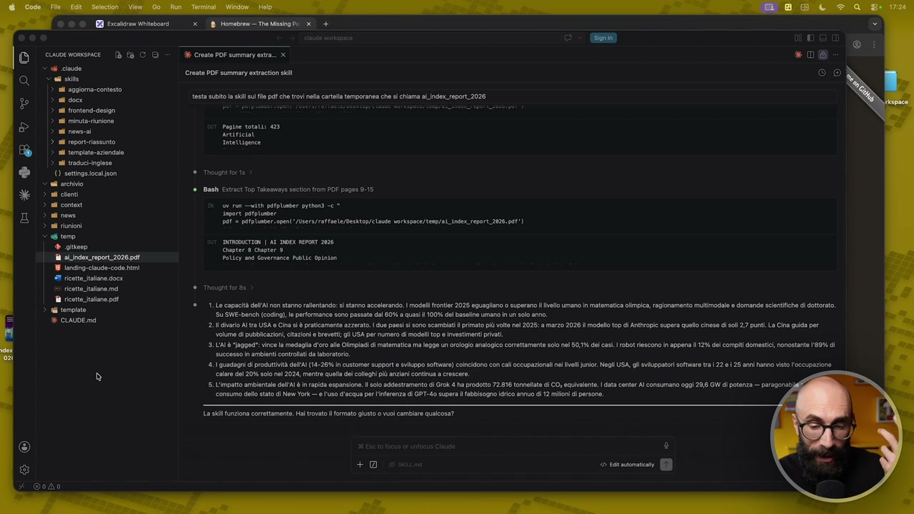

**Testo a schermo (OCR):** O E] ce womsmsce Dè fa CO < cave Cad sie > ii aggioma-contesto > rd dere > ad frontend-design i minutaunione > ul nova > al toport-assunto > ul tempat-azindalo > nd traduciingieso €) settings cca son © al archivio > il cileni > 1 conto > adi nov > al riuioni vero + giteep fa al.ingex report 2026 pd 18 1ancing-clue-code htmi #9 ricette Jalane docx ficett tano md ricette talane pet 3 i tompia 2/18 Homebrem The Misna D+ X Create POF summary era. x Creato PDF summary extrcton sli testa subito la si su fl pf che trovi ela carta temporanea che sl chiama aLindex_repot_2028 Puoi ttatt: 423 Arcitieta intettince è Bash Extract T0p Takemays secon from POF pages 0-15 i pui ulti plumber pren e * “aport pafprunter DAI = pdlLunter open /Users/affaele/Deshtop/ Claude vorkipsce/tenp/aLiner_report_2026.p0*) INTROGCTIDA | AL Ex REPORT 2026 Chapter 8 Chapter 3 Pol Ley nd Governance Publ Dpinten è. Trougnt fore ® 1. capacità dell'A non stanno rallentando; i stanno accelerando. | model fronte 2028 eguagiano 0 superano vel umano n matematica olimpica, ragionamento muimodale e domando scientiche di dttoat. ‘5 SIE-bench (coding), e performance sono passato cal 60% quasi 00% dl baseline umano nun olo ann. 2. divario Altra USA © Cina sl è praticamente azorato. | duo paos sono scambiati primato iù volto nel 2025: a marzo 2026 ll model top di Anthropc supera quell cinese i sol 27 punt. La Cina gui per volume di pubblicazioni citazioni brevetti gli USA per numero di mogli op e investimenti privati, 3.LALÀ “agged": vince la medaglia d'oro al Olimpiadi i matematica ma legge un rogo analogico correttamente slo na 0,1% dl cas. robt riescono in appena 12% i compiti domestik, nonostante 189% di uocesso in nenti contrat da laboratorio. ‘4.1 guadagni di produttività dell'A 14-26% in customer Support sviluppo soiare) coincidono con call occupazioni n vello Negli SA, gl sviluppatori otware tra 22 e 2 ann anno visto 'ccupazione ‘calare de 20% solo nel 2024, matr quela dei collegi pù anziani continua a crescere. 5 L'impatto ambientale dll’Al è in rapida espansione. solo addestramento di Grok: ha prodotto 72.16 tomnellat di CO, equivalente | data center Al consumano oggi 255 GW di potenza — paragonab) ‘ongumo del stato di New York l'uso d'acqua per l'feenza di GPT-40 super fabbisogno fico annuo ci 12 milioni di person. Las funzione correttamente. Hal rows i ormoto gusto o vuoi Sambiae qualcosa?

> non la vogliamo a schermo ma la vogliamo dentro un file pdf. Quindi diciamo, aggiorna la skill, come si chiamava, report trattino riassunto facendo le seguenti modifiche. L'output deve finire in un file pdf, ok? E gli possiamo dire che per il momento lo salviamo nella cartella temp, ok? Nella cartella temp. Poi in realtà se uno si è organizzato bene il workspace avrete magari una cartella che si chiama progetti e dentro, che ne so, ci stanno tutti i pdf che leggete oppure c'è una cartella che si chiama documenti e li mettete là dentro oppure riassunti e li mettete là dentro. Adesso per semplicità lo salviamo nella cartella temporanea. L'output deve finire in un file pdf nella cartella temp e poi cos'altro ci aveva chiesto prima, anche un titolo di quello che sto facendo. Nel documento ci deve essere anche un titolo che

## [00:07:47] Schermata 8 _(periodic)_

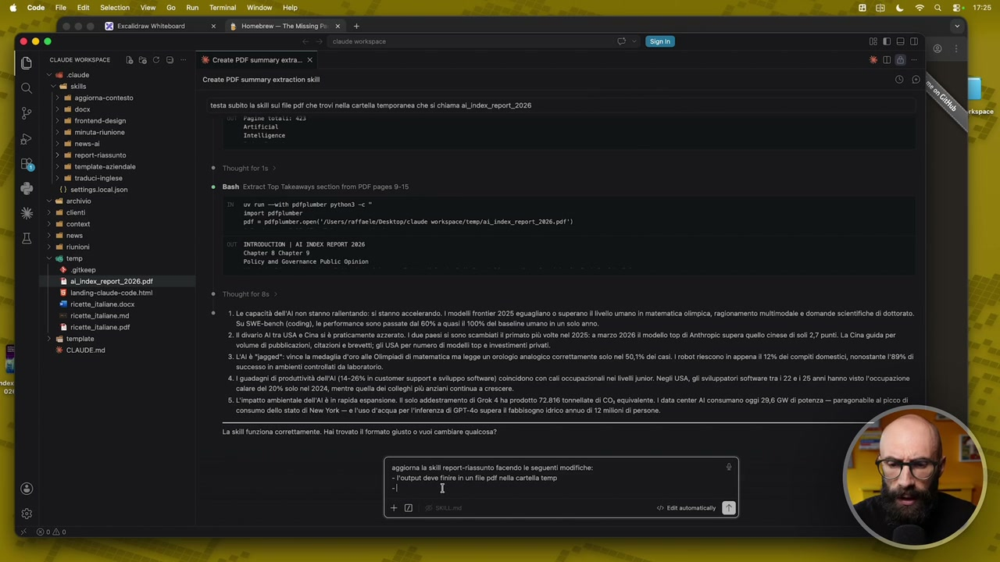

**Testo a schermo (OCR):** [II DO cioe womsmice Dè fa CO cave Ci sie > i aggioma-contesto > al dora > ad frontend-design a rinuta-uniono a nos > ul roport-assunto > al tompat-azindalo > nd traduckingieso (0) setings oca fon © fl archivio nd cloni ni cono si novo n riunioni ter + giteep i aLinsex_ropori2026 pdl 18 1anding-clude-code fmi #8 ricottJtalane docx fiett alano md TA ricttetalone pet i tenpate + CLAVDE md © (5) x Qoho 218 Homebrem— The Misna Pi D+ XE Create POF summary era. x Create PDF summary ertratin li testa subito la sk su fl pf he trovi ela carte temporanea che sì chiama alindex_report_2026 Artifiesat © Bash Extract Top Takasin secon from POF pages 0-15 i ru ulti petplunber prebons = * sapore paper DIE = pdllumer:openi/Users/affaele/Desktop/ Clase vorkipoce/tenp/al inter report. 2026.p4t*) INTOOOCTIDA | AL ex RePoT 2026 Gpter 8 Chapter 9 POLL nd Governance PubUC Opinion è Thought forse ® 1.0 capacità dell'A non stanno rallentando: sl stanno accelerando. | model fronte 2026 eguaglono 0 superano i livel umano n matematica olimpica, ragionamento mutimodale 0 domando sclentiihe di dttorat. ‘SU SIe-bench (coding), e performance sono passato cal 60% quos 100% del baseline umano in n slo anno. 2. divario Altra USA e Cina sl praticamant azzerato. | duo paesi sono scambiati primato più volto nel 2025: a marzo 2028 i modelo top dl Anhropc supera quelo cinese di so 7 unt. a Cina guia per volume di pubblicazioni citazioni breve gli USA per numero di modeli top e investimenti privati. 3.UALÒ “agged: vince la medaglia d'oro all Olimpiadi i matematica ma lgge un orologio analogico correttamente slo ne 0,1% dl asi robot riescono In appena 12% del comp domestic, nonostante 89% di successo in ambienti contrlai da lboratorio. 4. guadagni di produttività dell'A (14-26% in customer Support sviluppo soiare) coincidono con cai occupazioni n Ivell|unio Negli USA, l sviluppatori software tra 220 25 ann hanno visto l'occupazione alare de 20% coo nel 2024, metre quell el collegi pù anziani coninua a crescere. 5. impatto ambientale dll Al in rapida espansione. sol addestramento di Grok ha prodotto 72.816 tomnllat di CO, equivalente data conta Al consumano oggi 298 GW di potenza — paragonabi al picco di ongumo del stato di New York l'uso d'acqua per l'iferenza di GPT-40 supera labbisogno dico annuo di 12 mini di person, La sk funziona correttamente. Hal trovato i formato giusto vuol cambiare qulcosa? sggiona la sk report assunto facendo le seguenti modiche: output deva sr in n fl pdf nola carota temp +

> spiega che questi take away sono presi dal documento specifico, usare il nome del report originale, ok? Di nuovo anche qua fammi tutte le domande che ti servono, raccogli le informazioni necessarie e poi procedi a creare la skill. Diciamogli una cosa qua, crea solo la skill, non mi servono i test e tutto il resto dopo. Questa versione è la versione un pochino più avanzata. Quindi adesso cosa stiamo facendo? Abbiamo una skill che si piglia in pasto un pdf di qualsiasi lunghezza, questo qua è 423 pagine, se lo legge piglie i 5 punti più importanti e ci

## [00:08:47] Schermata 9 _(periodic)_

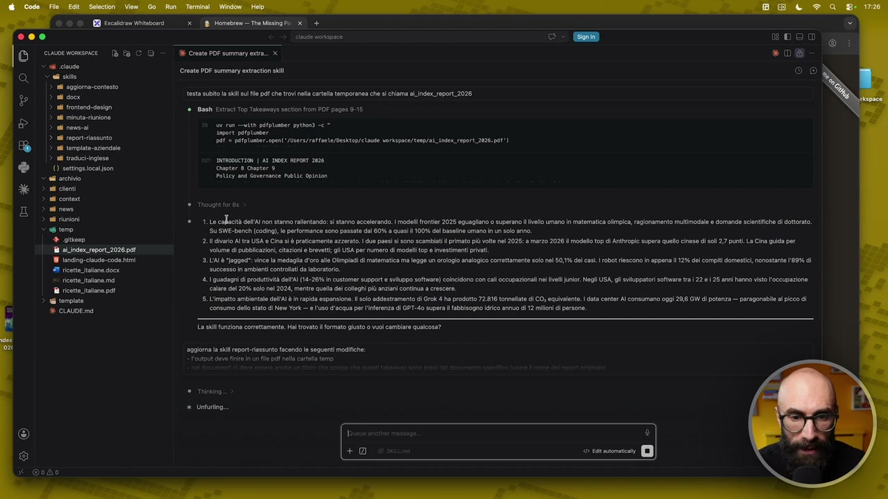

**Testo a schermo (OCR):** RR cain Wiitatonri DO ce womsmace Dè fa C O < 6 cave <a ste 4 cggiona-contesto CIS a rontend- design al rinuta-tuniono a none report siassunto i tempiato aziendale a taduchingieso () settogsicca son > al archivio > al cent ad contest si nov n riunioni ter + giteep a aLinsex ropori2028 pdl 28 1ancing-clude-code html #1 ricetta Jane docx ricette talamo md ricette taione pet i terna 2/18 Homebrem The Mis Pi D+ eta vsispoce eDao XE Create POF summary entra. x *D& Create PDF summa ertratin sli ® O testa subito la hl fl pf he trovi ela carta temporane che sl chiama aLindex_repot_2026 ©. Bash Extract Top Takaxways secon from POF pages 0-16 6 run utt plumber pytons = snport potplnber DAI peplum open ‘Jusers/atfaele/Desktop/elaute vorkapace/tenp/aL_index report? DTRODIETIA | AT DOEx REST 2026 Gapter 8 Chapter 9 Pot Ley and Governance Public opinten ® 1,10 caflacità dell'A on stanno rallentando: i stanno accelerando. model fronte 2025 eguaglano 0 superano livello umano n matematica olimpica, ragionamento muimodale e domande scientifiche di dttorat. ‘5 SWEbanch (coding), le performance sono passato cal 60% a quasi 100% dl baseline umano in un solo ann. 2.1 varo Altra USA © Cia lè praticamento azzerato. duo paosi sono scambiati primato iù volto nl 2025: a marzo 2028 Il modelo op dl Anhvopic supera quello cinese di oli 27 pun. La Cina guida per volume di pubblicazioni citzinl brevetti: gli USA per numero di modeli top e investimenti privati 3. LAT è “Jagged: vinco la medaglia d'oro al Olimpiadi i matematica ma legge un orologio analogico coretamene slo ne 0,1% dl ca. robat riescono ln appena 12% i compiti domestic, ponostante 89% di successo in ambienti contrlati da lboratoro. 4. guadagni i produttività dell {14-20% in customer support sviluppo soiare) coincidono con cali occupazioni nl Ivell uni Negli USA gl sviluppatori sotwara trai 22 e | 25 anni hanno visto occupazione calar dl 20% soo nel 2024, mentre quela ei collegi pù anziani continua e crescere. 5. L'impatto ambientale dell Al è i rapida espansione. 1 ol addestramento di Grok 4 ha prodotto 72.810 tomnllat i CO equiiente | data conta I consumano oggi 29, GW di potenza — paragonabili al picco di onsumo del stato di New York l’uso d'acqua per l'ferenza di GPT:4 super abbicogno fico annuo di 1 miloi di persone La si funziona corattament. Hal ovo formato giusto vuo cambiare qualcosa? aggiorna a sil rportiassuto facendo le seguenti modiche: out davo ir in un flo pet nea carta temo DETTI + Unturino. ==>

> crea un documento, ok? Quindi non è che ce lo dà in chat, ci crea un documento. Perché gli facciamo creare un documento? Perché così colleghiamo tutti i puntini. Allora prima domanda, come vuoi che chiami il pdf? Ad esempio take away è il nome originale oppure vuoi uno schema fisso come take away? Dico... Vabbè è la stessa cosa in realtà, mi sembrano identici le due cose. Vabbè la seconda. Quindi take away trattino il nome del documento originale, così diciamo li riusciamo sempre a identificare. Vediamo cos'altro ci chiede per procedere con la creazione della skill e poi finisco la riflessione che vi stavo facendo prima. Quale altra informazione ha bisogno? Credo che gli serve poco altro perché in realtà diciamo gli ho detto tutto. Ah come vuoi che sia formato il titolo del pdf? Ad esempio 5 take away da... Ok sì perfetto. Quindi il titolo mi va bene che lui ha preso il titolo del documento originale. Quindi questo qua come si chiama? Artificial

## [00:09:47] Schermata 10 _(periodic)_

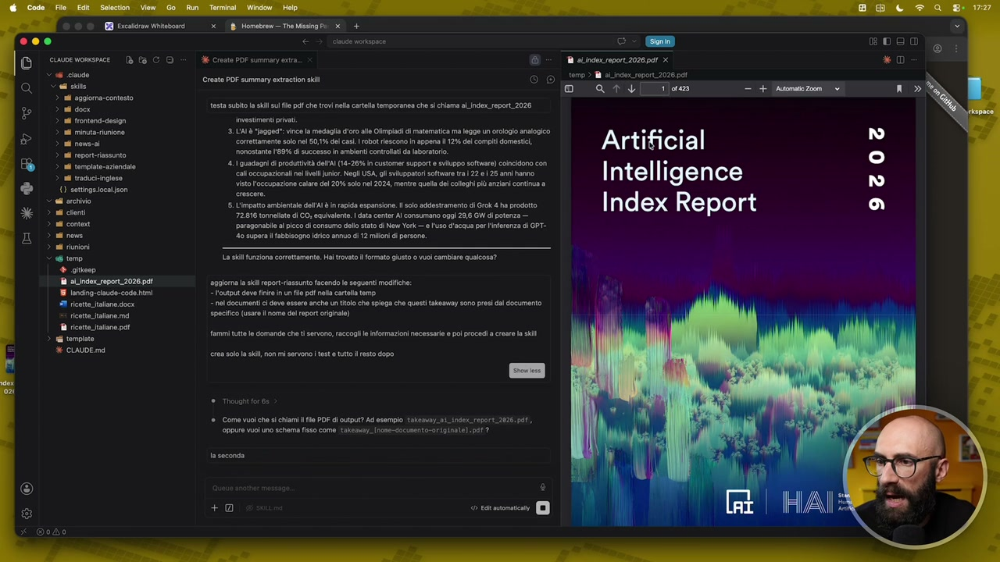

**Testo a schermo (OCR):** B*XbgVveILo al rinuta-tuniono > ul roms al report riassunto > al templat.azindalo > nd traduci-igieso €) settings cca son + al archivio nd conti > al conte > al nome > il riunioni > @ tro È sic a aLinsex report 2026 pdl 18 1ansing-ciauso-code emi 41 ricatta Jalane docx ricetta tano md ricette itlane pet i terni + CLADE md x Homebrew — The Missing Pi (x + % Crest POF summary str. Creato POF summary extracton sii testa subito la hl su fl pdf he trovi ela carte temporanea che sì chiama al Index_report_2026 3. L'ATÀ ‘Iagged: vinco la medaglia d'oro alle Olimpiadi i matematica ma legge un orologio analogico correttamente slo nel 5,1% cl cas. robot escono In appena 12% dl comit domest, nonostante ADS i succosso i ambienti control da invoratorio. 4, guadagni i produtività del [14-20% in customer support sviluppo software) coincidono con caloccupazional ne lvl uni. Negli USA, li svitippatori sofa ta 22 e 25 ann hanno visto l'occupazione calare del 20% solo nl 2024, mentre quell el colleghi più anziani continua a 5 L'impatto ambientale dll tè in aida espansione. solo agdestramento di Grok 4 ha prodotto 72.816 tonnellate di CO, equivalent. ata center Al consumano ogg 20,6 GW di potenza — paragonabile al picco di consumo cell tao cî New Yorke luo d'acqua pr l'nferenza di GPT- 40 supera i abbisogn io annuo di 1 mini di persone. La si fvziona correttamente. Hal trovato formato giusto vuoi cambiare qualcosa? vagina ls rport-rassuto facendo le seguenti modiche: — output deve fino i n le pdf lla cata temp e documenti i deve essre anche un tolo che spiega che questi taken sono presi d documento speci (usar nom cel raport originale) amm tuto le domande che ti srvono, raccogli e iformazioi necessari poi procedi a creare a sl rea slo sl on mÌ servono tot tutto rosto dopo ®. Come vuol che sl chiami ile POF di output? Ad esempio takessay_ni_index_ resort 20261, oppure vuol uno schema fisso come taken. {nose-daciwento-ariginate) af ? ta seconda e RISI. ] Artificial Intelligence Index Report

> Intelligence Index Report, ok? Quindi prende questa cosa qua e la usa come titolo. Vediamo cos'altro ci chiede e poi siamo pronti. Cioè dopo ci deve aggiornare la skill e la possiamo lanciare. Mi dice ho tutto, ecco cosa farò. Generazione del pdf nell'output in tempo. Il nome del file si chiamerà così, il titolo del documento si chiamerà così, mi autorizzi a scrivere la skill. Vai amico procedi pure. Quindi diciamo adesso per poter lavorare lui dice io ho dentro questa diciamo dentro questa skill mi sono fatto una cartellina script, vedete? E nella cartellina script si è fatto un file python. Questa cosa non l'avevamo mai vista fino ad ora e soprattutto non l'abbiamo fatto noi. Quindi qua adesso c'è del python, cioè c'è del codice. Qualcuno di voi si potrebbe spaventare, non vi preoccupate. Questo è il codice che ci permette di creare effettivamente il pdf, no? Di fare quel lavoro un po' più complicato. Ecco perché non la potevamo vedere questa cosa quando abbiamo studiato le skill per la prima volta. Perché ci mancavano dei pezzi. Ora

## [00:10:47] Schermata 11 _(periodic)_

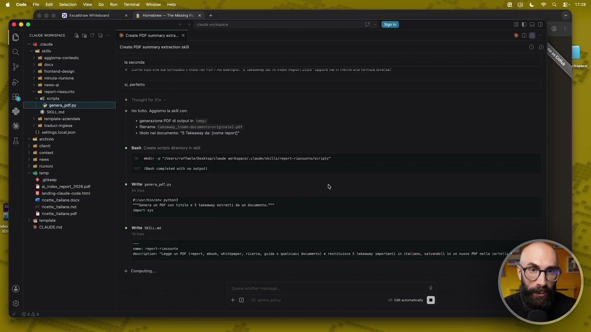

**Testo a schermo (OCR):** © © © I Fucsiciae Witevosrd (xD Homebren = Tre Ming Pi 3 + O00 cb votapoce © susoerovsnce Di fa CD > dk CrenerDe summanenra. x Create PDF summary extratin sli CES 3 1 aggira coten Lea es Pps 3 di neve pro Camion Bb casso — vanta ta Ho tutt. ggiomo la sl con: + geneazione PDF cupi int nd radueiingise * Rlenamo. taenay. (nne-docimento0r psn te.pe () etinga icaon ‘ itoo ne documento: "5 Takoaway da {nome por] Sad achivio > a conti 3 a conte Srna ni 5 /bsers/attaele/Desktop/ cli orkspce/.Clue/1k1UU/report=riasinto/script 14 riunioni <tr + gie i side seport 2026901 Vere rare) 18 1aningcidococe mi Ò #1 ricette talora docx atfsrttivone prideni e "Genera u POP. on titolo e 5 tatemey estratti da dscuento fa ficetttalane po nose ri terpate % ciAUDEma bash Creato scripts drctoy i sil Cda completed with no outpit) deseription: “Legge un POF (report, ebook, uiltepper, ricrea, quita 0 qualsiasi document) e restituisce $ talemay iaportanti in italiano, salvandoli in un novo POF setta corteti ® II .] dodo

> abbiamo tutte le informazioni, tutti i pezzi del puzzle e ci siamo creati questa skill un po' più avanzata. Ovviamente avanzata è un parolone, è avanzata rispetto alle skill che abbiamo visto fino ad ora. Immaginate, mi dice perfetto l'ho fatto eccetera. Ok allora mettiamolo subito all'opera. Diciamo subito lancia la skill sullo stesso documento di prima. Così vediamo subito se ci crea qua dentro adesso questo file pdf con i 5 take away, quindi questa sorta di riassunto del report che diciamo che abbiamo creato, che gli abbiamo dato. Questa cosa immaginatela sempre nelle vostre esigenze. Ora che sapete che può leggere file di qualsiasi tipo, creare file di qualsiasi tipo, immaginate che voi avete bisogno di fare file excel, presentazioni powerpoint, contenuti per i social, caroselli, rill, che più ne ha più ne metta, documenti word e così via. Potete fare un botto di roba. Perfetto, qua gli diamo procedi e adesso la vediamo all'opera perché

## [00:11:47] Schermata 12 _(periodic)_

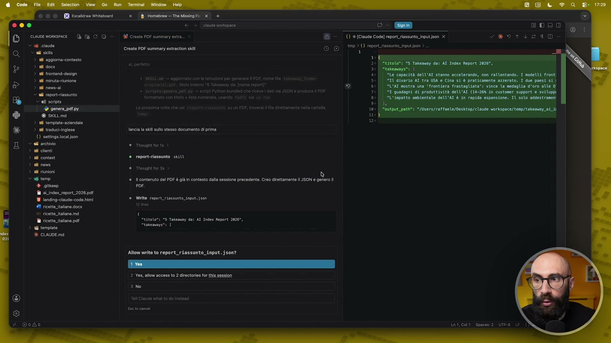

**Testo a schermo (OCR):** RO RI cain oso xD Homebram— Tre Miing Pa x + 000 € > elia noise e è» © ouoevomso Db E CO = AE Cresta or sommati È 0) + (Cau Code) report assunto. input on x < cid 9 © 1021) report asini. inutison e resto PO summary entrato sli on) > al aggioma-contosto > a doc > ad frontna-derion 3 i intrinine n roms Cal ropor-iasinto sort © genera pato Dette: > a template azionato > ad raduebinglese tania kl sullo stesso document di prima () settngssoason i cio ni ioni ni conn report-riassunto siti si non n ioni < tro cometa a OF è gli onesto ala sessione preedent. Co aretament + giteen sor at inder eport_2026 pa sese Mito rpore riassunto. input. 500 9 ricette alone docx = 10 fette tato mal ‘ TI ostia alana po titotri 5 Tatemoy dh AT Index feport 2026, Gi tenpito anemen: è CIAUDE ma Thought fo Though for 3 ‘Allow write to report_riassunto_input. json? 2 Yes, allo access to 2 directors fr ls pession ano UnT.CAli Soscer 2 Utr9 LE

> ci dovrebbe creare anche il file pdf qua dentro. Vi dicevo quindi le istenzioni sono infinite. Facendo anche questo piccolo esempio abbiamo visto che tutto quello che abbiamo fatto fino ad ora, torno un attimo in questo schema che non vediamo da un po', che tutto questo abbiamo fatto fino ad ora non era inutile. Ci è servito adesso perché abbiamo installato in VS Code la capacità di leggere pdf, in Cloud Code la capacità di creare la skill, in terminale la capacità di creare i pdf. Mettendo insieme queste cose ci siamo appena fatti una skill potentissima. Diciamo che legge pdf, ce li riassume e poi ci crea dei pdf. Ecco qua, la skill ha finito di lavorare, mi dice ok perfetto, ho fatto, pdf salvato qua, ce lo apriamo subito. Eccolo qui, questo è il segue e abbiamo il nostro

## [00:12:35] Schermata 13 _(scene)_

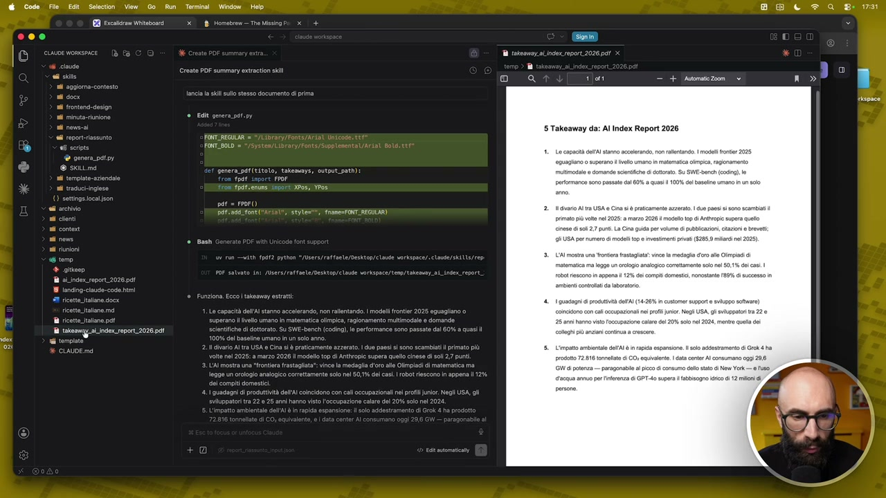

**Testo a schermo (OCR):** “ pae è 30 FONTIDOLO = Pi gl potsenune Lsport xPGS, POS 3 ing pepor2026 pet e i tto h - a ade a E ma

> bel pdf. Poi volendo potete migliorarlo ancora, gli dite mettimi i numeri di pagina, mettimi il logo, perché questo diventa il vostro strumento con il quale potete generare le fatture, generare i preventivi, fare delle proposte formali ai vostri clienti. Quello che volete voi. Adesso avete visto all'opera che significa avere un sistema che si estende potenzialmente all'infinito.
