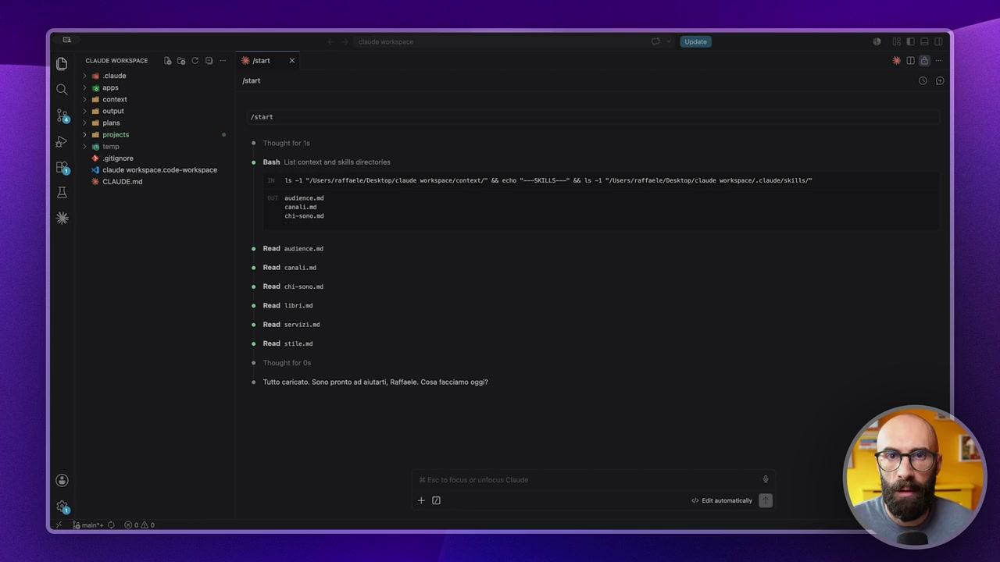
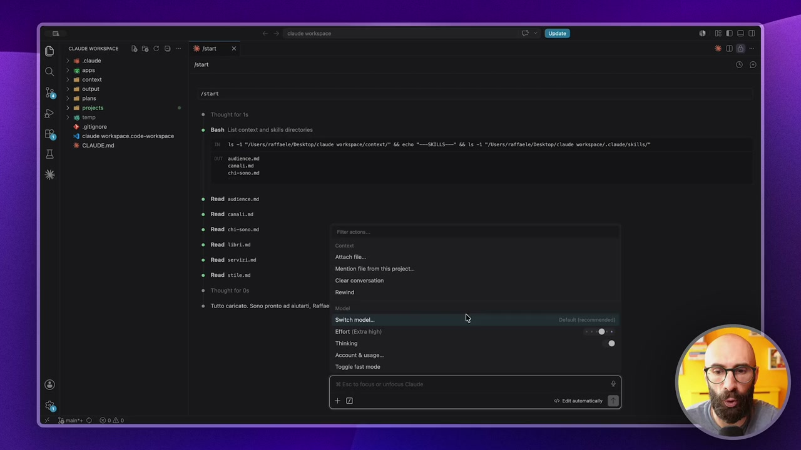
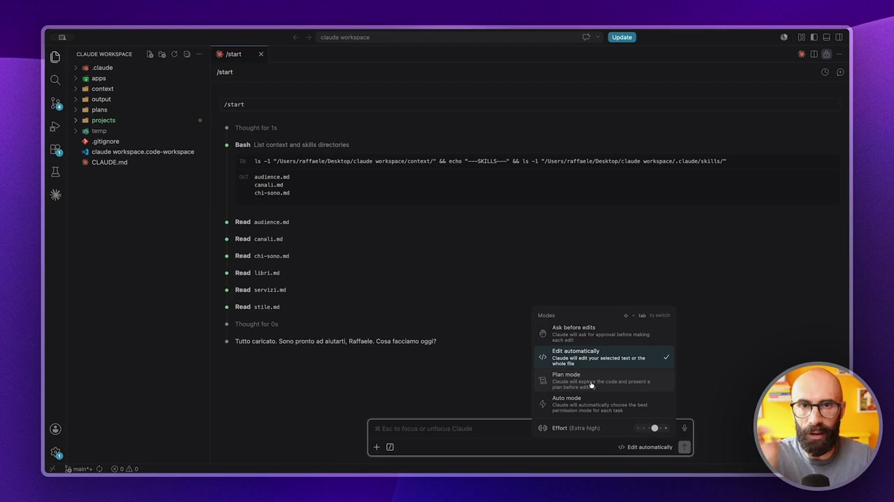
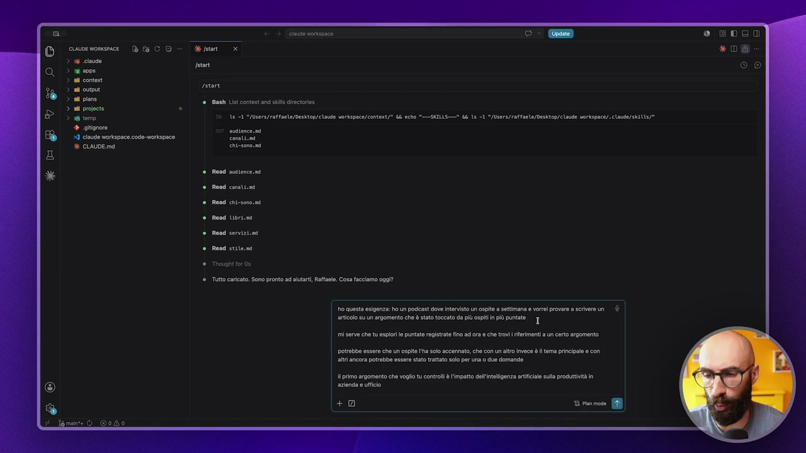
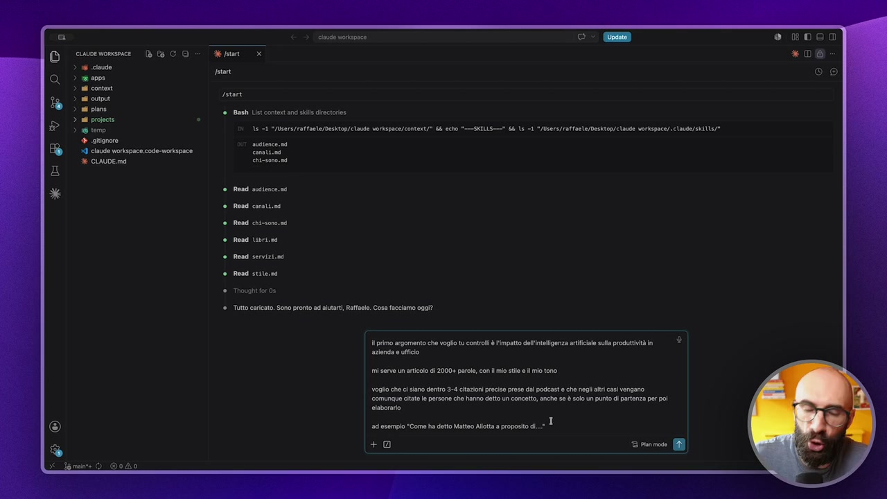
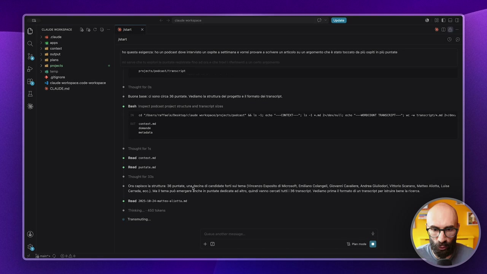
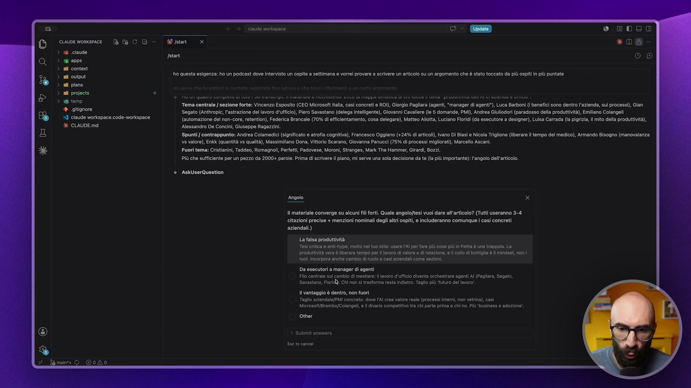
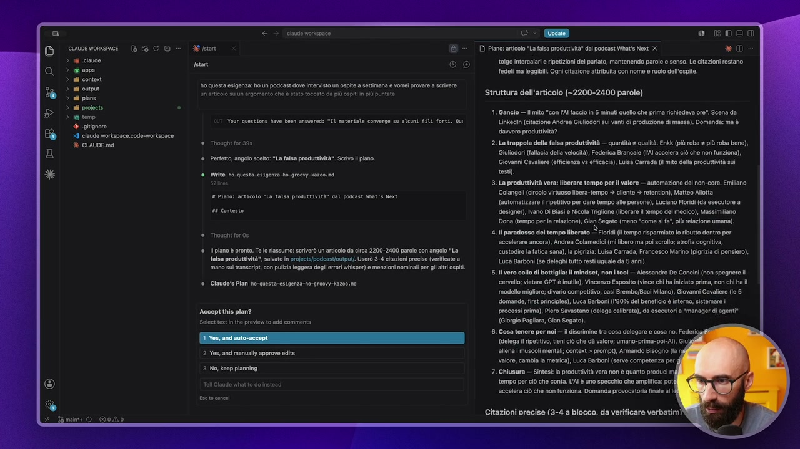

# Come usarlo in modo intermedio

> Documento generato automaticamente: trascrizione e screenshot sincronizzati del video-corso.

## [00:00:00] Schermata 0 _(start)_

**Testo a schermo (OCR):** cioe womsece DCO > 1 cisude > ri aope > adi conto > nd output > all pins > nd preci > 18 temo) 4 gignoro 29 claude Workspace code-morkspace E CLAUDE md 18 21 "MMsrs/rattaete/Desttop/elade vorkspace/context/” Li cho =_MILLS—* Li ls -1 */Users/rattaele/Desktop/cloute vorispace/.claude/seit1/* rn Bash List content and sk encore» augience. ns Entesonona Rend atene. Rondi conan Rend chi-sono. Read Libri Read servizi. Read stite.n Though for os ‘Tutto caricato. Sono pronto ad altari, Rafael. Cosa facciamo oggi?

> Ora che abbiamo visto come farlo in modo semplice, quindi senza nessuna particolare competenza, nessuna particolare tecnica, ma semplicemente dialogando con Cloud Code e facendogli capire che prima abbiamo fatto una ricerca, poi abbiamo fatto una pianificazione, poi abbiamo eseguito, vediamo invece lo step intermedio, prima di arrivare a quello finale che è l'approccio che uso io, perché magari potete scegliere voi di utilizzare uno diverso da quello che uso io. Qualcuno si potrebbe chiedere, soprattutto dopo aver visto la lezione precedente, bravo, ma se questa cosa è così importante, se questa cosa addirittura è consigliata nella documentazione di Cloud Code ufficiale, ma perché non c'è un modo standard di fare questa cosa? E in realtà un modo standard di farlo c'è. E come si fa? Si fa abilitando la modalità pianificazione. Vi ricordate che noi abbiamo visto in una delle primissime lezioni di questo corso che qua ci sono una serie di pulsantini qua sotto, ok? Questo ci permette di allegare file, questo ci permette di, diciamo, chiamare una serie di comandi,

## [00:01:00] Schermata 1 _(periodic)_

**Testo a schermo (OCR):** rsone Bash List content and site irectoris 18 21 MMlsers/rattaete/Desttop/elade vorkspace/context/ Li cche "MILLS" i ls -1 "/isers/raffaele/Desktop/clouse vorispace/.claide/stil1/* entesonosni Read ssience. mi Rond coni.nd Rendi chi-sono.nd Resa Libri Read serviziini Read stite.si Thowght for 05 si Tutto caricato. Sono pronto ad ltart Raffa! 11; RAI ott comodo Ettore (Era gh) ®- Trintina ® Account & usage. Toggle fast mode

> andare a cambiare il modello e così via. E qua avevamo i famosi permessi, quindi chiedimi le modifiche, modifichi automaticamente e così via. Ce n'è una, che è questa qua, che si chiama proprio Plan Mode, dove ci dice Cloud will explore the code and present a plan before editing. Quindi Cloud si guarderà il codice, ci propone un piano prima di procedere con l'editing. Allora, qua ho fatto una precisazione e adesso ve lo faccio vedere in azione, questo Plan Mode, vi faccio vedere cosa succede, ma vi dico perché non lo uso e perché mi sono fatto il mio Plan Mode. Quindi perché ho preso questo concetto, che quindi Cloud ha già interno, ma me lo sono cambiato leggermente. Perché? Perché questa funzionità è pensata in maniera specifica per il codice e funziona molto bene con il codice. Ho visto che scricchiola un pochino quando lo andiamo ad utilizzare in contesti non di codice. Quindi io adesso rifarò lo stesso esempio, in modo tale che i tre tipi di approcci che vi faccio vedere

## [00:02:00] Schermata 2 _(periodic)_

**Testo a schermo (OCR):** causa vorispace cuauve worxsrace = (CO e stan > sd ce ra 24 cont ni cup ni pon ni preci > iero 39 claude workspace code morkspace è CLAUDE ma 18 -i MAIsers/rattaete/Desktop/elose vorispace/context/* Li cho "MILLS" is -1 "/isers/raffaele/Desktop/claute sorispace/.claide/seil1/* tant rstane > entesono.na Read since. ni Rond conti. Rendi chi-sono.nd Rendi Libri. Read servizi.ni Read sites Though fer os ‘Tutto caricato, Sono pronto ad altari, Rafael. Csa facciamo oggi?

> sono sullo stesso task, in modo tale che possiamo vederlo proprio in azione. Quindi nel caso che sto analizzando io, ho un podcast, ho tanti transcript, da questi transcript voglio scrivere un articolo, quindi devi andare a spulciare e così via. E le situazioni vostre saranno simili, perché saranno situazioni, non ci sono dei file di codice, ma ci saranno documenti, presentazioni, preventivi, trascrizioni, report, white paper, ebook, libri e così via. Quindi non c'è il codice inteso proprio come lo intende CodeCode, quindi con pezzi di codice che si richiamano tra di loro, che hanno dipendenza tra di loro, linguaggi che si devono integrare e così via. Però vediamolo comunque all'opera. Abilito Plan Mode e gli do direttamente il prompt. Questa volta me lo sono scritto prima giusto per velocizzare un pochino. Gli dico, vedete questo è molto simile a quello di prima. Ho un'esigenza, un podcast dove intervisto un ospite a settimana, vorrei provare a scrivere un articolo su un argomento che è stato toccato da più ospiti in più puntate. Mi serve che tu esplori le puntate registrate fino ad ora

## [00:03:00] Schermata 3 _(periodic)_

**Testo a schermo (OCR):** cinuse voispace ) 18 claude > ii anos > adi conto > ad output nd pins ni project tere 28 -a MMera/raffaete/Desktop/ claude vorkapace/context/* i echo "—GKILLS—" GE a 1 "/lbera/raffaele/Desktop/claude vorkapce/.cisuae/seil/* 4 glignore ii 9 claude Workspace code-morkspace conoti.ni 6 CLAUDE ma chiesono nd rsvne @ Gineh List contest and kl irctoios Read sione. Red costi. Rendi chron. Read Libri. Rond servizi. Road sten Tutto carat. Sono pronto ad aiutati, Raffaele. Cosa facciamo oggi? ho questa esigenza: ho un podeast dove Intervisto un ospito a settimana e vorei provare a scrivere un È articolo su un argomento che è stato toccato da più ospitin più puntate. _[ mi serve che tu espior puntato registrato fino ad ra e che tod riferimenti a un certo argomento. potrebbe essere che un ospite l'ha solo accennato, che con un tro invece è l ema principal e con tr ancora potrebbe essere stato trattato slo per una 0 due domande Ul primo argomento che voglio ti controll l'impatto dell'tligenza artfile sula produttività i aziona e ufficio +0 Ta rom MB

> e che trovi i riferimenti a un certo argomento. Potrebbe essere che un ospite l'ha solo accennato, che con un altro invece il tema principale, con altri potrebbe essere stato trattato per una o due domande. Il primo argomento che voglio che tu controlli è l'impatto dell'intelligenza artificiale sulla produttività in azienda e in ufficio. E qua però gli do direttamente il task completo. Cioè, mentre prima ci siamo fermati, gli ho detto mi raccomando non scrivere l'articolo, fai solo la ricerca e poi dopo gli abbiamo detto adesso però fammi solo un piano. Invece qua gli dico tutto. Mi serve un articolo di duemila parole e più, con il mio stile e il mio tono, così se ne andrà a prendere diciamo nei file di contesto. Voglio che ci siano dentro tre, quattro citazioni precise prese dal podcast e che negli altri casi vengano comunque citate le persone che hanno detto un concetto. Anche se solo un punto di partenza per poi elaborarlo. Ad esempio, come ha detto Matteo Valiotta a proposito di x, y e z. Quindi questo è il compito finito, preciso, mentre prima invece l'abbiamo dovuto separare noi perché era la versione grezza dell'approccio pianifica, cioè dell'approccio esplora pianifica e segui. Invece

## [00:04:00] Schermata 4 _(periodic)_

**Testo a schermo (OCR):** i) tar > ai anos > adi conto svn ni up sa pre: è tineh List contest and kl irctoies ni projects DES 18 1 "MUters/raffante/Desktop/clase vorkapnce/context/* Ki cho "—GKILLS—* GE a -1 */ibera/ratfaele/Desktop/claude vorkapace/.claude/skil/* 4 glignore Ceca I laude workspace code-morkspace cannitond 6 CLAUDE md ent-sonond Read servizi.ni Rond stite.ni Thought or 0a Tutto carat. Sono pronto ad altari, Raffaele. Cosa facciamo oggi? primo argomento che voglio tu contri è impatto dllintligenza artificiale sua produttività in azienda e ufficio mi serve un articolo di 2000+ parole, con mi sile elmi tono. voglio che c siano dentro 3-4 citazioni precise prese cal podcast 0 che negli alri casi vengano. comungue citato le persone che hanno detto un concetto, anche se è solo un punto di partenza per poi otaboraro ‘ad esempio “Come ha detto Matteo Allotta a proposito di..* I +0 2 piece. (I

> qua adesso lo fa la funzionalità. Siccome siamo in plan mode gli dico tutto e quando do invio non sta andando a eseguire. Quindi se qua non fosse stato selezionato plan mode, lui probabilmente avrebbe subito iniziato a scrivere l'articolo. O meglio, avrebbe fatto la ricerca e poi avrebbe subito scritto l'articolo. Adesso invece cosa mi dice? Inizio esplorando la struttura del podcast per capire dove sono i transcript e quante puntate ci sono. Quindi adesso farà tutta la fase di ricerca iniziale che deve fare inevitabilmente e poi dopo mi inizierà a proporre un piano. Qua ci metterà un pochino perché c'è tutta la fase che deve leggere le puntate, quindi diciamo ve lo taglio e vi faccio vedere. Aspettate sta dicendo ci sono 36 puntate, vediamo la struttura del progetto, il formato dei transcript. Aspetto giusto qualche secondo, poi metto in pausa così vi faccio vedere direttamente cosa fa avanti. Vedete sta procedendo, mi dice ho capito la struttura, ci sono 36 puntate, una decina di candidati forti sul tema, quindi ho già trovato puntate che sono verticale sul tema, ma il tema può emergere anche in altre puntate. Qua l'ha capito dal titolo

## [00:05:00] Schermata 5 _(periodic)_

**Testo a schermo (OCR):** CUvDE WORISPACE OERETT: > i ciaude na > ri aops > adi contest > adi output > all pins > a prope > 18 temo) projects poscast/transcriot + atigrore I laude workspace.code-morkspace è CLAUDE md Tnavghi tor 0s Buona base: c sono circa 36 puntate. Vedlam la struttura del progetto el formato del ranseript. ho questa esigenza: ho un podeast dove ntenvisto un ospite a settimana vorei revae a serivere un articolo su un argoment che è stato toccato da più spit n più puntate Bash nspoct podeast proci structure and ranserit sizes 19 Mitra) at aete/Desktop/ claude vorkspnce/profects/poscast® 4 ts i Ta Li ind 2>/GEv/nu echo "VORICINT TRMISCRIFT"1 We e transeript/e.nd 2>/000) Trova Rena contert.nd Read puntate. ni Ora capisco la struttura 6 puntato, dl candidate fort ul tema (Vincenzo Esposito dî Microsoft, Emilano Colangeli Giovani Cavaliere, Andrea Giuldor, Vittorio Scarano, Matto Alta, Lisa Carrada, ecc). Ma l tema può omorgero nche in puntato dedicato ad ao, quindi vanno cercati ut 36 transrit Vediamo prima formato di un transcrip pr itrule bene la ricerca Road 2025-19-24-attes-aliotta.ni Thinking. - 450 tokene Transmuting

> semplicemente, quindi dal titolo ha capito delle cose. Poi dice guardi in alcuni casi ci sono i transcript, ho trovato che ci sono degli errori di trascrizione e questo è rilevante per le citazioni precise. Ora lancio la ricerca su tutti e 36 transcript divisi in tre gruppi paralleli, quindi anche in questo caso cosa sta facendo? Sta lanciando dei sub-agent, quindi divide la cosa, fa partire degli agenti, vedete agente A che fa cerca produttività AI in gruppo A, adesso partirà anche l'agente B e l'agente C, così andrà più veloce nel fare questa ricerca. Anche in questa modalità a un certo punto mi chiede delle domande, quindi diciamo qua ha finito la ricerca, mi dice ho un quadro completo di tutti i transcript, il materiale è ricchissimo, ecco chi lo usa come tema centrale, ecco chi lo da come spunto e così via, quindi mi dice a questo punto diciamo quale angolo vorresti dare all'articolo, la falsa produttività, esecutori a manager di agenti,

## [00:06:00] Schermata 6 _(periodic)_

**Testo a schermo (OCR):** deco cine vorispace 28 pon start hO questa esigenza: ho un podeast dove Intervsto un ospite a settimana e vorei provare a scrivere un articolo su un argomento che è tato vocato da più spit in più punt Toma centrale sezione forte: Vincenzo Esposito (CEO Microsoft Itala, cas conti a RON), Giorgi Pagliara (agenti, “manager di agent), Luca Barboni ( baneici sono dentro l'azienda, sui processi, Gian Segato (Antrole, lastrazione del avro d'ufico), Pero Savastano (delega intelligente), Giovanni Cavallero l 5 domande, PMI) Andrea Gluloderi (paradosso dll prouttività), Emiliano Colangeli (automazione del nn-core ratention, Faderia Brancale (70% di ffciontamento, cosa dolegae), Matte Alta, Lucano Fri (a osecuore a designer), Luca Carrda (a pigrizia il mit dll produttività), Nessandro De Concin, Guseppe Ragazzi. Spunti contrappunto: Andrea Colamadic (significato e atrofia cognitiva, Francesco Ogglano (+24% di articl), vano DI Basi Nicola Trgione (brare I tempo del medio), Armando Bisogno (manovalanza vs valor), Enkk (quantità vs qualità), Massimiano Dona, Vittorio Scarano, Giovanna Panucci 75% d processi miglrat), Marcelo Asca. Fuori tema: Cristanin, Taddeo, Romagnoli, Perfetti, Padovese, Morar, Stranges, Mark The Hammer, Girardi, Bozzi. Più che sufficiente per un pezzo da 2000+ pol. Prima di Scrivere piano, mì serve una col decisione da o (la più important); l'angolo dell'aricoo. * Askiserquestion pont tl materiale converge su alcuni il fort Quale angolo/tesi vuoi dar all'articolo? (Tutti useranno 3-4 tazioni precise + menzioni nominali degli tr ospiti, e Includeranno comunque i casì concreti aziendali) La falsa produttività Tera e ant-ypo, motto nto al: usar AI pr fre più cone pù n retta è ua nppoa La produtiità vera è Raro ‘empo perl Lavoro di Valore e di relazione lol di bottiglia è fida, non! 09 Incorpora anche cambio gi olo cani azien come sezioni. 0a esecutori a manager dl agenti Flo corale sl cambio di mestre: lavoro ufficio venta orcstrare agenti I (Pagliara, Segno, Sawastno, ic. Chi no i trasforma rest cito. Teglio più uu el avro i vantaggio è dentro, no fuori ‘Tago sendale/PMi concreto: dova Ares vale reale (process interi non vetrina}, ci Micro rembo]Caangl, el vaio compettv ra chi part prima © Chi no Pi ‘Buainoss e sdozi other

> il vantaggio è dentro non fuori, diciamo che mi piace il primo, anche qua la scelta è fatta abbastanza random, giusto per farvi vedere che vado avanti, però per farvi capire che anche in questo caso, quindi con questa modalità, quindi con il plan mode abilitato, senza che io gliela abbia detto, siccome il plan mode Cloud Code mi inizia a fare delle domande quando si trova di fronte a dei dubbi, quindi ci potrebbe essere un bivio, potrebbe andare in una direzione o un'altra, quindi anche qui ovviamente metto pausa, vi faccio direttamente le parti interessanti. Perfetto, dopo qualche altro secondo mi dice mi metto a lavorare sul piano, quindi ho scelto l'angolo che mi ha proposto, ti scrivo il piano, mi dice il piano è pronto, te lo riassumo così e me l'ha messo qui, vedete questo è proprio il piano, quindi ready for review e qua mi dice accetta il piano, accettalo ma fai delle modifiche oppure continuo a pianificare e qua diciamo mi ha proposto il piano che vorrebbe fare, ok? Quindi diciamo c'è l'articolo, ci sono le citazioni,

## [00:07:00] Schermata 7 _(periodic)_

**Testo a schermo (OCR):** 3 > cinudo vorkipnce ho questa esigenza: ho un podeast deve intervisto un ospite a settimana e verrei provare a scrivere Your questions have Been ansueredì "IL materiale converge su alcuni FI forti. Qu Thought for 20 Perfetto, angolo scelto: "La falsa produttività. Servo piano. Wi ho-questa-estpenza-bo-groovy-iazo0. nd Piano: articolo La falsa prosuttività dal podcast Mar's Next ti piano è pronto, Te o riassumo: scriverò un articolo da circa 2200-2400 parole con angolo "La falsa produttività”, sabato in projoets/pogcastoutout. User 3-4 citazioni precise (veri mano su transcrip, con pulzi leggera degli errori whisper) e menzioni nominati er li tri spit. Claude Plan ho-questa-esigenz-ho-groswy-kazo. nd Accept this plan? Selet txt in th provi 0 add commants e- a veg Piano: articolo "La falsa produttività dl podcast What's Next x *D tolgo intercalari ripetizioni del parato, mantenendo parole e senso. Le citazioni restano fedeli ma leggibili. Ogn citazione attribuita con nome e ruolo dell'ospite. Struttura dell'articolo (-2200-2400 parole) 1. Gancio — mito “con 'Al faccio in 5 minuti quello che prima richiedeva ore”. Scena da Unkacin (citazione Andrea Giulldori su anti di produzione di massa). Domanda: ma è davvero produttività? La trappola della falsa produttività — quantità qualità. n (pù roba # iù roba bene), Giuliodori (fallocia dell velocità, Foderica Brancale (Al accelra ciò che non funziona), Giovanni Cavaliere (officienza vs efficacia), Luisa Carrada (mito della produttività sui tosti). . La produttività era: liberare tempo per l valore — automazione del on-core. Emillano Colangei (lol virtuoso libera-tempo - cliente > retention), Matteo Alotta automatizzar ripetitivo per dare tempo alle persone), Luciano Flridi (da esecutore a dsigne), vano DI Basi e Nicola Trigione (liberare tompo dl medico), Massimiliano Dona (tempo pera relazione), Gian Segato (meno "come sÌ fa”, iù relazione umana). il paradosso del tempo liberato Fiordi tempo rsparmisto lo ributto dentro per accelerare ancora, Andrea Colamedici (mi lbero ma po scroll; atrofia cognitiva, custodire a fatica sana) la pigrizia: Luisa Carrada, Francesco Marino pigrizia di pensier), Luca Barboni (se deleghi tutto rest uguale da 5 an). vero collo di bottiglia: il mindset, non tool — Alessandro De Concini (non spegnere ll cervello; vietare GPT è inutle), Vincenzo Esposito (vince chi ha iniziato prima, non chi ha il model migliore; divario competitivo, casi Brembo/Baci Milano), Giovanni Cavaliere (le 5 domande, first principles), Luca Barboni (‘0% del beneficio è interno, sistemare | processi prima), Piero Savastano (delega calata), da esecutori a “manager i agent* (Giorgio Pagliara, Gian Segato) Cosa tenere per noi —l iscrimine tra cosa delegare e cosa no Fedi (dologa ripetitivo, tieni ciò che dà valore; umano-prima-poi-AI, Gli allena | muscoli mental; contet > prompt), Armando Bisogno (la valore, cambia la metrica), Luca Barboni (serve competenza per Chiusura — Sintesi la produttività vera non è quanto produci

> c'è dove mi salverebbe il file, la verifica finale e così via. A questo punto io non gli do l'invio per fargli accettare il piano e per fargli scrivere l'articolo, perché tanto il pezzo finale è quello dell'esecuzione, è quello che ci interessa di meno, quello che volevo farvi vedere è questo step intermedio, ok? Quindi dove la pianificazione non la facciamo manualmente, ok? In modo grezzo dicendo voglio che tu faccia un piano e così via, ma usiamo la funzionità plan e otteniamo questo. Ora che abbiamo capito questo e vedete perché era fondamentale anche la lezione precedente, nella prossima lezione vi faccio vedere invece questa roba qua, ma leggermente modificata, fatta diciamo con un approccio mio personalizzato che trovo molto più preciso sul lavoro che non è un lavoro di codice ma un lavoro su documenti di altro tipo.
