# Come usarlo in modo avanzato e personalizzato

> Documento generato automaticamente: trascrizione e screenshot sincronizzati del video-corso.

## [00:00:00] Schermata 0 _(start)_

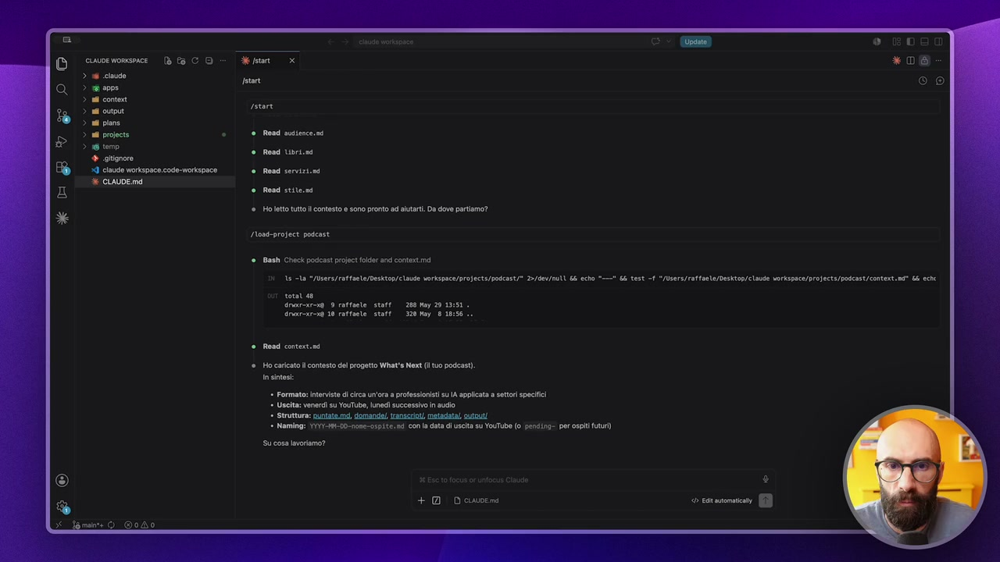

**Testo a schermo (OCR):** DECO del start ssvore Rond audience. nd Rond brina Read servizi. Rondi sitema Holetto tutto contesto e sono pronto ad altari. Da dove partiamo? Ione-project podcast è Bissh Check podcast projet folder and contstmd 15 a “/Wners/raffanle/Desktep/ claude vorkupace/profects/podcst/* 2>/0ev/nulL E echo "—" 4 test */Usera/raffaele/Desktop/claude vorkspace/projects/podcast/contest.m* Ga sche noraria 9 ratfate. start GRatrotro@ 10 Fatfaete state 320 n0y 816 Ho caricato contesto del progetto What's Next (Ito podcast). insintosi * Formato: ntrvisto di ica un'ora a professionisti su IA appicata settori specifici “ Uselta: venerdì su YouTube, unodl successivo In audio * Struttura: qunate.mo. domanda; ransrit, metadata], tout Naming: YYY(-H}H-00-noee-otpite,nd con a tal uscita su YouTuba (0 pending= per ospiti futuri) ‘Su cosa lavoriamo?

> E infine vediamo come questa cosa la faccio io. Uso l'approccio, diciamo quello della seconda modalità, quindi diciamo lavorare con un file di pianificazione, ma senza usare la modalità, il plan mode di Cloud Code, che come vi dicevo, lavora molto bene sul codice, è pensato molto per il codice, ma lo trovo un po' clunky sui documenti di altro tipo. Quindi cosa ho fatto? Lavoro con due skill. Anche qua, come vi ho detto in molte lezioni, sono concetti che ho preso un po' dalla documentazione, un po' da Reddit, X, YouTube e così via, e poi li ho personalizzati, li ho fatti miei. Quindi anche queste due skill, che vi regalerò e che vi metto nel corso che potete scaricare, pigliatele come dei punti di partenza. Se non vi piace, se è troppo macchinoso, se a voi serve un altro pezzo, modificatele. Allora, apriamoci un attimo le skill. Io ho questa skill che si chiama Create Plan, ve la faccio vedere, che è una skill che crea proprio dei piani. Quindi diciamo, ci sono le istruzioni su come creare il piano, c'è la fase di ricerca,

## [00:01:00] Schermata 1 _(periodic)_

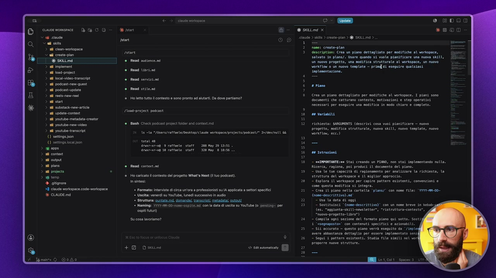

**Testo a schermo (OCR):** 6 cioudo el sito > 1 clean-workspace > ai creato-pian 7 © sktimd 24 imploment n Joad-prject n local vidoo.transript nd posicast-nem-guest nd podcast.upsate 18 roois-nonrroei adi cn > il substack:new-artle > al update-content > al youtube-metadata-creator > deco nd yostube-new-vdo ni youtube transcript () settigsson () settingeocalson 22000 ni content ni cupa ni piane ni projects 16 ter + alignore I claude workspace code-morkspace è CLAUDE md claude voriapace E) (ORC) rotore Roma nen. è Resd Ubri.ni è Read servizioni è Rena stite.ni Ho ftto tutto l contesto e sono pronto ad aiutarti. Da dove partiamo? Inond-project podcast ‘* Bash Check podcast project odor and contxtimd 18 la "/bsers/ratfanle/Desttop/claue vorkspace/projects/poscst/e 2>/0ev/mll Li con Anac-acona 10 raffaele start 206 10) 20 1051. 320 pay 818556 1. Read contert.ni Ho caricato contesto del progetto What'a Next (tuo podcast). ta sintesi * Formato: intriso di ica un'ora a professionisti su IA appicata a settori specifici “Uscita: venerdì su YouTube, lunedì successivo in audio * Struttura: qunate mo domandi, ranscrit, mstadatlscutt * Naming: YYYY--00-nose-0spi{e.nd con a data dust su YouTube (0 pending per ospiti futuri ‘Su cosa lavoriamo? o +0 Ds resi e. a @ skira x claudio > ks > crete-pian > @ SKILL md > 1 nane: creste-plan description: Crea un piano dettagliato per modifiche al voripace, salvato in plans/. Usare quando si vole pianificare una nuova skilU, un nuovo progetto, una modifica strutturale al vorkspace, un nuovo vorkflow 0 un nuovo tesplate — primfdi eseguire qualsiasi. implementazione. 4 inno Crea un piano dettagliato per modifiche al vorkspace, 1 piani sono documenti che catturano contesto, motivazioni e step operativi necessari per eseguire una modifica in nodo chiara € cospleto: de variabiti richiesto: SARGIMENTS (descrivi cosa vuoi pianificare — nuovo progetto, modifica strutturate, nuova skIUÙ, nuovo template, nuovo porktlow, ecc.) 06 rstruzioni — seIRPORTANTE:s Stai creando un PIMIO, non stai iaplesentando null Ricerca, ragiona, poi produci. il documento del piano. — Usa le tue capacità di ragionasento per analizzare la richiesta, la struttura del vorispace e il miglior approccio. — Esplora il vorispace per capire pattem esistenti, convenzioni e cone questa modifica si integra. — Crea il piano nella cartella ‘pians/* con nose file: ‘-et-00- {nome-descritt.ivo).nd' — Usa la data di oggi — Sostituisci “{none-descrittivo}* con un nose breve in kebab, (es. "aggiunta-skilli-newsletter", “ristruttura-contesto” *nuovo-progetto-\ibro") - Compila ogni sezione del formato piano qui sotto. sosti 1 ><segoaposto»' con contenuti specifici e azionati. - Sii accurato - questo piano verrà eseguito da ‘/iapies avere abbastanza dettaglio per essere iapleentoto senz — Segui 1 pattern esistenti. Studia file sinili nel vorl proporre nuove strutture.

> c'è il formato del piano che voglio, a cosa serve il piano, perché è utile, lo stato attuale. Quindi mi deve fare ad esempio una fotografia di, sto per fare questa cosa, com'è il workspace prima di questa cosa che faremo, com'è il workspace dopo questa modifica che faremo. Questa per me è una cosa importante, per voi potrebbe non essere utile, per come sono abituato a lavorare io la trovo importante, soprattutto se devo fare modifica al workspace, quindi devo creare delle skill e così via. Mi dice tutti i file che andrò a creare, tutti i file che andrò a modificare. Vedete, quindi voglio proprio un riepilogo. Perfetto, tu stai partendo, lavorerai per mezz'ora, ma fra mezz'ora io non voglio sorprese, quindi quando apro Cloud Code cosa troverò di nuovo? Modificato, cancellato, no, creato e così via. I motivi per cui vengono fatte certe scelte, quindi perché ha preso delle decisioni, e poi gli step operativi, step 1, step 2, step 3 e così via, che sarà quello che a me importa, che Cloud dovrà andare a eseguire.

## [00:02:00] Schermata 2 _(periodic)_

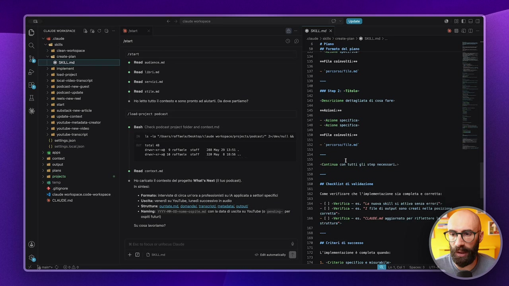

**Testo a schermo (OCR):** Vs caudo <a sito > 1 clean-workspace creto-pian deco ni impioment > al foad-project > i oca-vidoo-transcrpt > adi podcast-ne-quest > al podcast-update > al reos-naw-roei > ni star > ul subotock-new-rtile > al update-contert > all youtube-metadata-creator > nl youtube-new-veo > nl youtube transit. 1) sottigsjson () settingeJocalson Cai ni content ni cupa ni pins ni projects 6 ten 4 glignore I claude workspace code-workspace è CIAUDE md cine vorispace CI tari ssvane è Road sudience.ni è Road tibrs.na è Rod servizioni è Read stite.ni Ho ltto tutto conosto e sono pronto ad autart. Da dove partomo? Inoad-project podcast ‘® Bash Check podcast project odor and contextimd 18 2a *Mbers/raffanle/Desttop/claude vorkspace/projects/podcast/* 2>/0ev/eult Lt vos Anacoarona 10 raffaele start 206 10) 20 1951. 320 May 8 18:56: Read contert.ni Ho caricato contesto del progetto What's Next (tuo podcast). ta sintesi: * Formato: intriso di ita un'ora a professionisti su A appicata settori specifici “ Uscita: venerdì su YouTube, lunedì successo in audio * Struttura: quntate.mo, iomnand, ransrit metadata) utt! Naming: YYY}-t-00-h0ee-ospi {c.d conta data di usita su YouTube (0 pending= per osp fui ‘SU cosa lavoriamo? e. @ skttmd x cauda) ls > crene-pian > @ SKILL md > 6 15 ne 19 1a iu 146 ne 1 150 182 15 186 ss 199 16 166 168 166 4 Piano #4 Formato del piano serie cosnvotti:e — ‘percorso/fite.no ess Step 2: citato» «Descrizione dettogliata di cosa fore» svazioni:se — Azione specifico» — “Azione specitica» merita colnvotti:e — o percorso/file.ns “Continua con tutti gli step necessari.» de checklist di validazione Cone verificare che l'inplesentazione sia completa e corretti - {1 SVerifica — es. "La nuova skill si attiva senza errori 1 {1 SVersfica = es "I file di output sono creati ella posizio corretta» — {1 SVeritica — es. "CLALDE.nd aggiornato per riflettere s0 criteri di succasso L'inplenentazione è completa quando: 1. «Criterio specifico e misurabile»

> Vi ricordate quando nella, diciamo, lezione introduttiva teorica di questo modulo vi ho detto usare questo approccio permette di risparmiare tempo, risparmiare token, fare in modo che Cloud si sbagli di meno, fare in modo che abbiamo fatto un accordo su quello che deve fare? Sono questi step qua, ok? E poi alla fine ci sarà anche una verifica con dei criteri di successo, quindi è andato tutto a buon fine, se è successo questo, questo e quest'altro. Questa skill poi dopo è quella che mi crea il piano, la vediamo subito in azione, non vi preoccupate, e poi dopo ho una seconda skill che si chiama implementa, che è una skill che semplicemente va a prendere un piano e lo implementa, però questa la vediamo dopo. Partiamo prima dalla skill create plan, tutte e due ve le lascio gratuite nelle risorse extra che potete scaricare, ma mi raccomando modificatele se non vi piacciono, se sono troppo complesse o se le volete più complesse, come tutto quello che ho fatto dentro questo corso.

## [00:03:00] Schermata 3 _(periodic)_

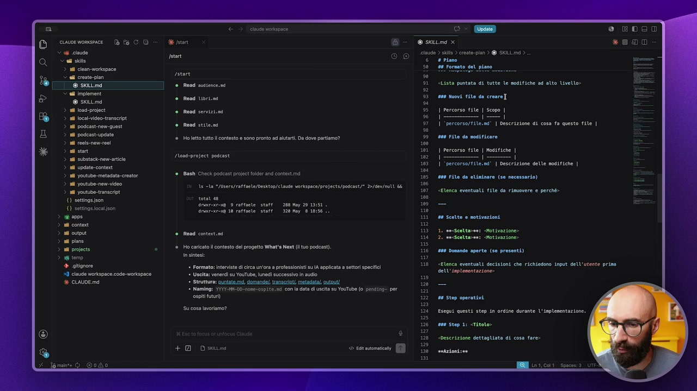

**Testo a schermo (OCR):** 2 06 cite Vem ue > n clen-woriopace crete pian ei impieren © ska 14 os prc n ocio rms iniziai si poscestupsste ni ene ni son i ts eat 14 upste-conr 24 youtube metsat-crator 8 yostade-pe io n youtube ranscro 10 sti {1 setngasocaison n si cont si cun ni piano 14 prec 56 tmp + giionore 14 cute morapace code orspoco % CUAUDE ma deco dn tan rotore ° Rand sen. ni è di tibet «Red servizi è Read sten ‘®. HoJetto tutto l contesto e sono pronto ad autrt. Da dove partiamo? Itosd-project podcast ® Bash Check podcast project odor and contstimd 18 la “/isers/ratfacte/Desttop/claue vorkspace/projects/podcast/* 2>/0ev/mlt tt vo do Anacoicona 10 raffaele start 208 10) 20 10151. 320 May 8 18: Road context.ni Ho caricato contesto del progetto What's Next (to podcast). to sintesi: * Formato: intriso di ica un'ora a professionisti su A appicata settori specifici “ Uscita: venerdì su YouTube, lunedì successo in audio * Struttura: puntate mo domnandi/, ransrict, metadata/ utt * Naming: YYYY-t-00-none-orp{{e.n4 Conta data dl uscita su YouTube (0 pending: per osp futuri) ‘Su cosa lavoriamo? e. e» DETTSE claude) ks > creste-pian > @ SKILL md > 6 # Piano » 91 «Lista puntata di tutte le modifiche ad alto Uvello» » 93. es@ Nuovi file da creare] 95] Percorso file | Scopo | pra | ‘percorso/file.ad' | Descrizione di cosa questo tie | ore ite da modificare | Percorso gie | nosttiche | È Sereno iii ni | peserizioe dette siti 1 ooo Five do eliminare (so necessario) itonca eventuali ile da rimovere e perché: 08 cette è notivazioni 1, secscnttarani «totivazione: 2. Messcettasse: cotivazione: 8 donande aperto (se presenti) «Elenca eventuali decisioni che richiedono input dell'utente prima dell'inplementazione» 8 Stop operativi. Esegui questi step in ordine durante l'inplementazione. aaa Step di «Titolo “descrizione dettagliata di cosa fare» serzioni:ee

> Quindi cosa faccio qua? Lancio la skill e quindi gli dico create plan, vedete, vi ricordate, le skill si lanciano con slash e il nome della skill, oppure potete scrivere creami un piano, perché lui lo capisce, lo capisce perché sta scritto qua nella descrizione, ok? Se queste cose non ve le ricordate andate a rivedere il modulo tutto dedicato alle skill. In quel modulo vi ricordate, faccio vedere la differenza tra le skill di sistema e le skill invece un po' più operative. Questa è una skill di sistema, cioè è una skill che serve a noi per lavorare dietro le quinte. E cosa fa? Tutti i piani me li servirà in questa cartella plans, ok? Infatti qua c'è una cartella che si chiama plans dove dentro vengono salvati i piani. Quindi qua gli dico creami un piano e cosa gli do dopo che ho scritto creami un piano? Gli dico quello che mi serve, cioè aspettate che chiudo qua così abbiamo più spazio. Gli metto il prompt, cioè quello che normalmente avremmo chiamato prompt, la richiesta. Quindi quella che ho copiato e incollato anche in precedenza, vi ricordate?

## [00:04:00] Schermata 4 _(periodic)_

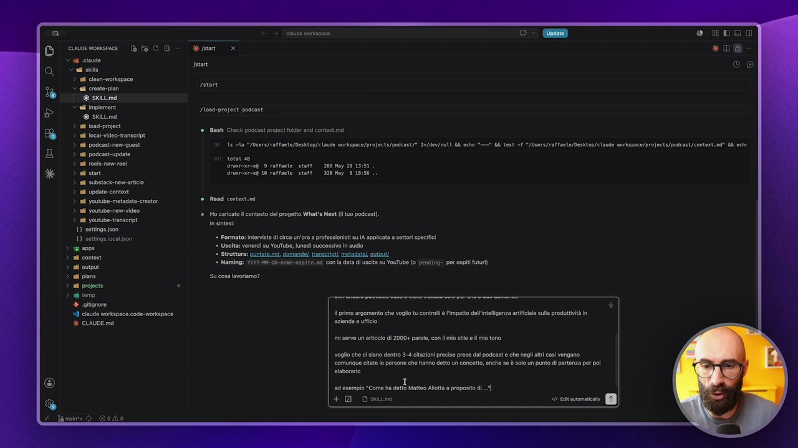

**Testo a schermo (OCR):** nude vortapace ® cuvoe womseice (fa C 6 cioude < all sio n can workepace > ed crato-pian © skira < i impioment Inond-project podcast @ skiuma > al oad-prooct > ul oca-video-transcrpt > al podcastne-quest 15 la */bera/raffaele/Desktop/ claude vorkspace/prajecta/podcst/* 2>/0ev/Nll LE echo "—" 6 test 9 */Users/raffoele/Desktop/claude vorkspace/projects/padcast/contert.no* 6 cche > al podcast-update ITA > al rees-now-roei dcr 9 raffoele start 208 Kay 29/151. > all son narearost 10 raffaele Starr 328 May 8 18:56 > al substack-nev-artilo > al update-contt > ul youtube-metadata-creator Reod context.ni > ml youtube-new-vieo > sl youtube-transerit. (0 settige on () settingasoca son Formato: interviste di ica un'ora a professionisti su appicata a settori specifici pa Uselta: venerdì su YouTube, lunedì successivo In audio ni conto * Struttura: quntate mo donand/ ransrit, metadata cutout. siti * Naming: )}1-00-fame-ospite;na con a dal uscita su YouTubo (0 pending per ospiti futuri) ni pins SU cosa lavoriomo? ni projects temp ® satigrore 39 claude Workspace codo-morkspace % primo argomento che voglio tu controll è lmpatt dellitligenza artificiale sua produttività in % CUAUDE md azienda e ufficio è Gissh Check podcast projet folder and contet.md Ho caricato contesto del progetto What's Next (to podcast) insito: mi serve un articolo di 2000+ parole, con mio sile elmi tono voglio che c siano dentro 3-4 citazioni reciso prese dal podeast e che negli alri casi vengano. comunaue citato le persone che hanno detto un concetto, anche se è solo un punto di partenza per poi ataboraro esempio "ome ha dt ato ot ros i. +0 Our IESSTÒ)

> Quindi gli dico ho questa esigenza, ho un podcast, non ve la leggo tutto, ma è identico a quello che ho messo nella lezione precedente, solo che è seguito da slash create plan, perché ho chiamato questa skill. Adesso quando do invio, lui non farà, non eseguirà il prompt, non eseguirà la richiesta che gli ho fatto, ma siccome davanti c'è create plan e me la riapro, la teniamo qua, quello che fa andrà a creare un piano dettagliato. Quindi prende la richiesta, la richiesta, vedete nella richiesta c'è scritto cosa ci scrivi tu dopo create plan? Quello che vuoi fare, quindi quello che vuoi modificare. Poi gli dico nelle istruzioni, vedete, stai creando un piano, non stai implementando nulla, ricerca, ragiona, poi produce il documento del piano, usa le tue capacità di ragionamento, esplora il workspace, creami il piano nella cartella plan e così via. Anche alla fase di ricerca gli dico vai a guardare dentro questo cartella, se ti serve una skill chiama una skill, se c'è una cosa che devi capire, cerca di capire come sono collegati i file, vabbè qua lo autorizzo a procedere

## [00:05:00] Schermata 5 _(periodic)_

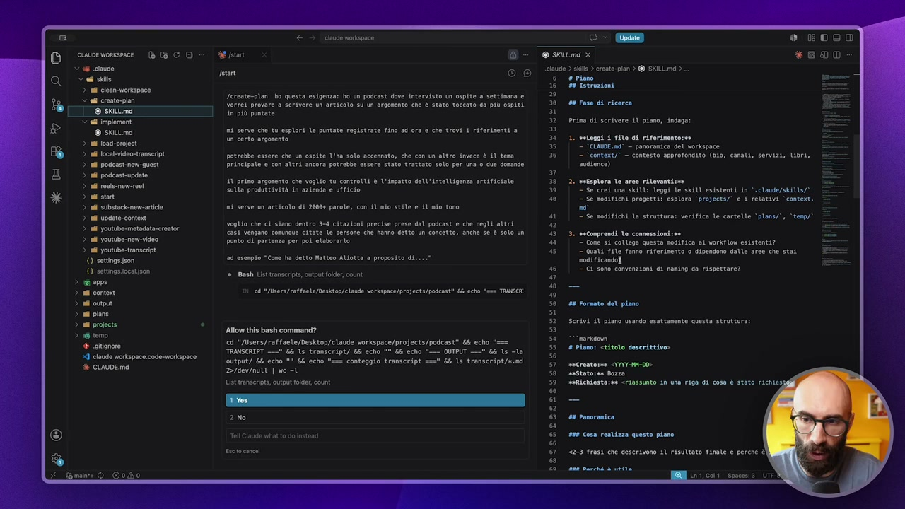

**Testo a schermo (OCR):** cous mospace e. BOO @- esumx © claude) ls > crene-pian > @ SKILL md > 6 e Piano 16 Se Istruzioni DO Serante-plon ho questa esigenza: ho un podcast dove intervisto vo cspite a settimana e Vorrei provare a Scrivere un articolo su un argosento che È stato toccato do più ospiti e Fase di ricerca in più puntate Prima di scrivere {1 piano, indoga: nd serve che tu esplori le puntate registrate Fino ad ora e che trovi 1 riferimenti a un certo argonento 1. seleggi i file di riferimento; " *CLAUDE.ed° — panoranica del vorkspace potrebbe essere che un ospite l'ha solo accennato, che con un altro invece è il tema — ‘context/” — contesto approfondito (bio, canali, servizi, Ubri, Princspale e con SItri ancora potrebbe essare stato trattato solo per una 0 due domande audience) 11 primo argosento che voglio tu controlli è l'inpatto dell'intelligenza artificiale 2. sefsplora le area rilevanti:s Sulla prodottività in azienda e ufficio Tse crei una SKILL: leggi le SKILL esistenti in *.claude/sk1Us/ — Se nogifichi progetti: esplora ‘projects/* e i relativi ‘context. ni serve un articolo di 20004 parole, con AU nio stile e AU nio toro ni — Se moglfichi la struttura: verifica le cartelle ‘plons/*, ‘temp/ voglio che ci siano dentro 3-4 Citazioni precise prese dal podcast e che negli altri €aS1 vengono comunque citate le persone che hanno detto un concetto, anche se è soto un 3. secomprendi le comessioni:se punto di partenza per poi elaborario " Cone si collega questa modifica al vorkflox esistenti? - Quali file fanno riferimento o dipendono dalle aree che stai n esempio "Cone ha detto Matteo ALtotta a proposito di. iti © Ci sono convenzioni di noning da rispettare? () settngasccaison nooo ni conte Or atte Desa orAspca/rojets/pascst® i cha ma TIMOR ni ona #6 tornato det piano nd piano pri Allow this bash command? Re tene. 5 7 a 2 rnarkson A cd */Users/raffaele/Desktop/claude workspace/projects/podcast" 6& echo rt ce ‘TRANSCRIPT ===" 6& le transcript/ 66 echo "" 56 echo "=== OUTPUT ==" 6& le cla nio iii) output/ 66 echo "" && echo "== conteggio transcript ==" 66 ls transcript/*.nd ea AEREO 2rdev/nutt | we -L Sri List transcrps,cutut Folder, count sviichiestasse «riassunto in una riga di cosa è stato richiesi 20 è Blast List ransripis, output folder count Scrivi il piano usando esattamente questa struttur Est cont 23 frasi che descrivono SU risultato finale e perché al

> proprio perché deve fare questa lettura. E adesso lui vedete la prima cosa che sta facendo, va a vedere la cartella dei transcript, che è quello che abbiamo visto anche nell'esempio 2 e nell'esempio 1, quindi concettualmente questi tre approcci sono solo tre modi di usare la tecnica, quella che vi ho mostrato prima, quindi esplora, pianifica e segui, solo che lo facciamo in tre modi diversi e ripeto, voi usate il modo che preferite, questo è quello che uso io e vi regalo anche le mie skill supervolentieri, perché abbiamo detto che le skill è del testo, non è niente di particolarmente wow, e questo testo non me lo sono inventato io, sono partito sempre dal lavoro di qualcun altro. Mi dice, ci sono 36 script, devo fare un piano di ricognizione, devo capire come sono gli script, eccetera eccetera, così il piano sarà basato sul materiale reale. Lancio la scansione in parallelo, quindi qua sappiamo che gli agenti stanno partendo per leggere questi script,

## [00:06:00] Schermata 6 _(periodic)_

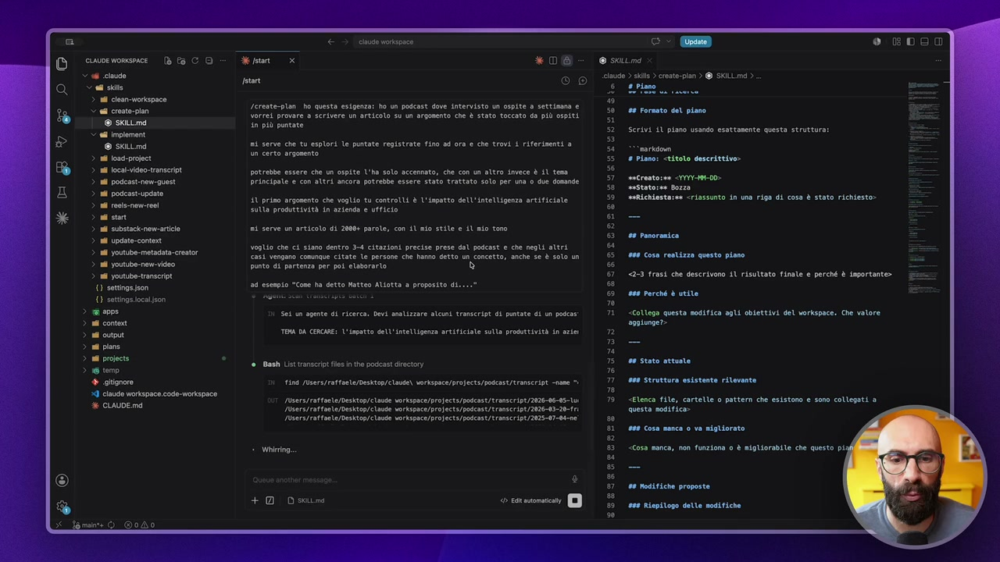

**Testo a schermo (OCR):** x 6 cile cdl sito > 10 clean-workspace < ei creato-pian © skira — ed imploment @ skiuma n Joad-prject i Jocat video transit i podast-ne-quest i podcast-opdate nl reois-nowro > adi sun > al substock-nev-artilo > sl update-contet > nl youtube-metadata-crestor deco n yostube-nen-vieo na youtube. transit () settige son {1 settingsioca fon sso ni conto ni cupa ni pins ai projects temp + giignore 39 laude Workspace codo-morkspaco 6 CLAUDE md 2 psn start Seraote-plon ho questa esigenza: ho un padcast dove intervisto un ospite a settimana e Vorrei provare a Scrivere un articolo su un argomento che È stato toccato do più ospiti dn più puntate nd serve che tu esplori le puntate registrate Fino ad ora e che trovi i riferimenti a un certo argonento potrebbe essere che un ospite l'ha solo accennato; che con un altro invece è 11 tema Prinespsle e con SItri ancora potrebbe essere stato trattato solo per una 0 due domande 4 primo argosento che voglio tu controlli è l'impatto dell'intelligenza artificiale Sulla produttività in azienda e ufficio ni serve un articolo di 20084 parole, con il aio stile e il aio tono voglio che ci siano dentro 3-4 Citazioni precise prese dal podcast e che negli altri <aSi vengano comunaue citate le persone che hanno detto un concetto, anche se è soto un punto di partenza per poi elaborario 83 esenpio "Cose ha detto Matteo Altotta a proposito di. Sei un agente di ricerca. Devi anolizare alcuni transeript di pontate di un pocas TEMA DA CERCARE: l'impatto dll'intelligenza artificiale sulla produttività in zie; è ins List ranecript les in the podcast directory Lina JUsers/raftaele/Desktop/ claude) vorkspaca/orojects/poscast/transeript «nas Pasers/rattaele/Desktop/claude voripace/pro)ects/podcast/transcript/2026-06-05-1u ‘isers/raffaele/Desktop/ claude vorkspace/projects/podcast/transcript/2026-09-20-1r1 Iasers/rattaele/besktop/ claude vorkspace/oro)ects/pogcast/transcript/2825-07-04-ne Wiiring e. e» @ siero einudo ) sis > crente-pian > @ SKILL md > 6 so s s% sn so @ @ 6 CI n 16 n si a ® 3 Piano #8 Formato del piano Scrivi 1L piano Usando esattamente questa struttur mario 4 Piano: ctitoto descrittivo» secrentozee <VYTI-AM-00> aestatosee tozzo sviichiesta;se «riassunto in una riga di cosa è stato richiesto» 10 ravoranica asa cosa rentizza questo piano <2-3 frasi che descrivono il risultato finate e perché è importante» au perché è veite «Collega questa modifica agli obiettivi del vorkspace. Che valore aggiunge? ne Stato attuate ata Struttura esistente rilevante Elenca file, cartelle o pattern che esistono e sono collegati a questo modifico» te Cosa manca 0 va migliorato -Cosa manca, non funziona 0 è nigliorabile che questo pi na noditiche proposte ses Riepilogo delle modifiche

> questo è il momento nel quale io metto pausa, perché ci metterò un pochino a leggere tutti gli script e vi faccio vedere direttamente quello che succede dopo. Vedete, allo stesso modo come è successo nei due casi precedenti, anche qui a un certo punto mi fa delle domande, per esempio mi dice qual è l'angolo che vuoi portare, vi ricordate? Questo ci è successo anche nelle due lezioni precedenti, il paradosso del tempo, da esecutore a manager, il freno e la cultura, diciamo che anche qui voglio andare sul paradosso, ripeto, sono risposte che do così un po' random, giusto per farvi vedere che il flusso va avanti, e ovviamente adesso metto pausa e vi faccio vedere quando lui ha pronto il piano, quindi ha finito di elaborarlo. Perfetto, ha finito l'elaborazione, ci dice che il piano è pronto, mi dice, ho esplorato i 36 transcript, ho mappato la rilevanza del tema, ti ho fatto un piano, il piano ce l'abbiamo nella cartella plans, che vedete vuota perché i piani li cancello dopo un po', decidete voi se volete tenerveli o meno, questa è una scelta molto personale, anzi dopo vi faccio vedere una cosa che si può fare con i piani. Quindi questo adesso ce l'abbiamo il piano, mi dice cosa c'è, quindi cosa copre,

## [00:07:00] Schermata 7 _(periodic)_

**Testo a schermo (OCR):** V 6 ciau Cal sto n cean-workspace ed creato-pin DESES > el imploment @ skiuma n 1026: projet di Jocalvidoo transit nd poscast-nen-quest nd podcast.update nd oots-now-ro! i sun adi substack-nev-atelo nd update-content nd youtube-metadata-crentor n yostube-nen-vidoo na youtube-transerpt () sottige son () settingaiocalison deco > 16 temo + gitonore 9 claude workspace code-morkspace CLALDE ma cine rkspace 2 psn E) Serente-plon ho questa esigenza: ho un padcast dove intervisto un ospite a settimana e Vorrei provare a Scrivere un articolo su un argomento che è stato toccato do più ospiti in più puntate nt serve che tu esplori le puntate registrate Fino ad ora e che trovi 1 riferimenti a un certo argonento potrebbe essere che un ospite l'ha solo accennato, che con un altro invece è 11 tema Prinespale e con SItri ancora potrebbe essare stato trattato solo per una 0 due domande 4% primo argomento che voglio tu contratti è l'impatto dell'intelligenz Sulla produttività in azienda e ufficio artsstctate ni serve un articolo di 26004 parole, con il aio stile e il aio tono voglio che ci siano dentro 3-4 Citazioni precise prese dal podcast e che negli attri Casi vengono comunque citate le persone che fanno detto un Concetto, anche se è soto un punto di partenza per poi etaborario nd esempio "Cose ha detto Matteo Aliotta a proposito di. (Cosa copre piano (2026-06-04 -aticoo-cross- podcast. produit md) * Angolo scelto: Il paradosso del tempo iberato" (FA non a lavorare meno, i a lavorare diversamente punto non la oloià è cosa i dl tempo ch recuperi, Mappa diilevanza completa: 18 puntate CENTRALI, 8 SECONDARI, 7 ACCENNATE, 3 ASSENTI, in tabella, + A tazioni testuali precise già individuato con la e timestam (Fori, Cavalera, Bisogno, Gluldor) iù una sta di spit da citare per nome (Alitt, Scarano, Colangel, Da Concin, Brancae, Panucci, Esposito, erftt, Savastano, Colamedi, Carrada, Triglione, Segato, Pagina) * Struttura dell'articolo in 6 becchi, regole di ste (ncusol divieto di ratti come incio), outputin una nuova carta sutput/articoli/ Due domande aperte (nn bloccanti, ho messo cel default: 4. Canale di destinazione: assumo l big tano. 2. Unk ale puntate dentro l'articolo: di efauit metto (cross-prome), ma posso togleri. + DI DI 20200008 ricco ‘2026-06-04-orticoo-cross-podcast-produrtvitaia.md U X piana > 1 e. DEDE *BAVO 2026-06-04 -rolo-<ros-podcat-prduttvita-ia md > = Pino: Articolo cross-podeast si # Pinno: Articolo cress-podcast sul paradosso del tenpo (TA e produttività in azionda) sscrentorse 2026-06-04 Sestatoree Bozza malchiestarse Scrivere un articolo di 2009 parole, nello stile di Raffaele, che attraversi le puntate di What's Next per raccontare L'impatto del 'IA sulla produttività in azienda e in ufficio, con 3-4 citazioni testuali precise dal podcast e citazioni per nose depli altri. ospiti che hanno toccato il tesa. e ranoranica 008 Cosa restizza questo piaro Produce un articolo lungo (20984 parole) per il blog italiano, costruito a partire dalle voci degli ospiti del podcast What's Next. L'articolo non riassuse le puntate: prende un tesa trasversale (l'impatto del TA sulla produttività nel lavoro d'ufficio e in azienda) € lo sviluppa intorno a una tesi precisa, intrecciando estazioni testuali e rimandi per nose agli ospiti. L'angolo portante scelto è se1l paradosso dell tenpo Uberato"ss: LIA promette di farci risparaiare tenpo, ma il vero tena non È la velocità, è cosa facciamo del tenpo che liberiamo, TU rischio nascosto è che quel tempo non lo recuperiano affatto, lo riepiano di altro voro. att verché è utite — Trasforma un asset già prodotto (36 ore di interviste con esperti) dn un contenuto nuovo per it blog, ad atto valore e difficile da replicare per altri. — Dd visibILItÀ e cross-pronozione alle puntate del podcast ospite citato è un richiamo alla sua intervista). — Inaugura un formato ripetibile (“51 prino argosento' i ne seguiranno altri): articoli tenatici che attraversano) det podcast. — Colpisce dritto nel target del blog (imprenditori, nol professionisti che vogliono capire come l'IA cambia il

> ma soprattutto, vedete cosa è importante, mi dice che ci sono due domande aperte, non bloccanti, quindi ho messo io delle risposte default, il canale di destinazione Assumo il blog in italiano, questo ce l'ha successo pure nel primo caso, il link alle puntate, cioè vuoi mettere dei link oppure no? Quindi se non vuoi i link li possiamo togliere. Vabbè qua ci dice ovviamente ci sono delle parole storpiate e così via, quindi va ripulito un pochino prima di finire nell'articolo. E poi conclude dicendo, per eseguire lancia questo comando, slash implement e il piano, ok? Questo ovviamente lo fa perché ho dentro la skill, io ho detto che deve sempre concludere in questo modo. Quindi deve sempre ricordare all'utente di eseguire slash implement e poi il piano che è stato appena creato. Questa è una cosa che trovo molto comoda, perché così posso separare le due fasi, posso prendermi pure del tempo, posso passare pure dei giorni tra quando creo un piano e quando lo implemento.

## [00:08:00] Schermata 8 _(periodic)_

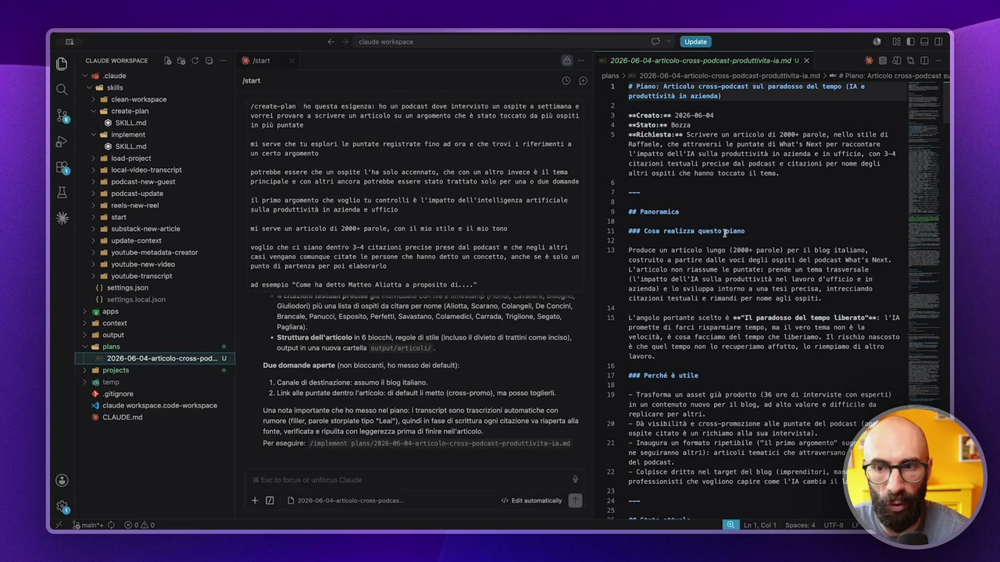

**Testo a schermo (OCR):** ce womsece D f CO V agi cause Cal sito > il clean-workspace > ai creato-pian DESES > ed imploment @ skiuma n 10ad-prolct i Jcal video transit al podcast-ne-quest > all poscast-update nd ocis-now-reo si sun i substaienencarticio nd update-content nd youtube: metadata-creator ni yostube-new-vieo nd youtube transerpt 1) settigeJon {) settingasocafson > 16 temp + glignore 39 caude verkspace code-workspace % CALDE ma nude okapnce Lereste-plon ho questa esigenza: ho un padcast dove intervisto un ospite a settimana e Vorres provare ® serivere un articolo su un argomento che È stato toccato do più ospiti in più puntate ni nerve che tu esplori le puntate registrate fino ad ora e che trovi i riferimenti a in certo argonento potrebbe essere che un ospite l'ha solo accennato, che con un altro invece è il tema Brinespale e con Sltri ancora potrebbe essere stato trattato solo per una 0 due domande i prio argosento che voglio tu controlli è l'inpatto dell'intelligenza artificiale sulla prodottività in azienda e ufficio ni serve un articolo di 20684 parole, con il aio stile e il nio tono voglio che ci siano dentro 3-4 Citazioni precise prese dal podeast e che negli altri. €aSi vengano comundue citate le persone che hanno detto un concetto, anche se è soto un punto di partenza per poi elaborarlo ad esempio "Cose ha detto Matteo Aliotta a proposito di. Glu) iù una sta di spit da citare per nome (Altt, Scarano, Colangel, De Concin, Brancale, Panucci, Esposito, Perftt, Savastano, Colamedi, Carra, Trigione,Segato, Pagliara * Struttura dell'articolo in 6 becchi, regole di tl (inciso l divieto di ratti come inciso), autput in una nuova cartll autput/articoti/ Due domande aperte (non bloccanti, ho messo del detau): 4. Canale di destinazione: assumo l big alano. 2. ok alle puntato dentro l'ariol: di defait metto (cross- promo), ma posso togli. Una nota Important che ho messo nel piano ransrit sono vascrizoni automatiche con rumore file, parole strpite ipo "Lea quindi i fase di ertura ogni citazione va riaperta alla fonte, verificata e ripulita con leggarezza prima di fine nell'articolo. Per esegui: /iaplanent plans/2826-06-04-art cotoxcross-podenst-prodit evitata; n n ses ‘2026:06-04-orticoo-cross-podcast-produrtvita-a.md U X piana > 1 e DEDGEO *8aN0 2026-06-04-riol-<ros-podcat-prduttvit-ia md > = Pino: Artico cross-podeast # Fiano: Articolo cress-podcast sul paradosso dell tenpo (TA e produttività in azienda) mocrento:se 2026-06-04 sestatoree Bozza sorichiestarea Scrivere un articolo di 20004 parole, nello stite di Raffaele, che attraversi le puntate di What's Mext per raccontare L'impatto del'IA sulla produttività in azienda e in ufficio, con 3-4 citazioni testuali precise dal podcast e citazioni per nose depli. atri ospiti che hanno toccato il tera. 0 panoramica att Cosa restizza questo piaso Produce un articolo lungo (20084 parole) per il blog italiano, costruito a partire dalle voci degli ospiti del podcast What's Next. L'articolo non riassuse le puntate: prende un tena trasversale (l'impatto del TA sulla produttività nel lavoro d'ufficio e in aziendo) € lo sviluppa intorno a una tesi precisa, intrecciando eltazioni testuali e rimandi per nose agli ospiti: L'angolo portante scelto è se"Tl paradosso del tenpo Uberato"ss: LIA prosette di farci risparmiare tespo, ma il vero tena non è la velocità, è cosa facciamo del tespo che liberiamo. IU rischio nascosto è che quel tenpo non lo recuperiano affatto, lo rieapiaso di altro voro. ost perché è utite — trasforma un asset già prodotto (36 ore di interviste con esperti) in un contenuto nuovo per it blog, ad atto valore e difficile da replicare per altri. — DÒ visibilità e crose-prosozione alle puntate del podcast ospite citato è un richiano alla sua intervista). — Inaugura un formato ripetibile ("51 primo argosento' i ne seguiranno altri): articoli tenatici che attraversano) det podcast. — Colpisce dritto nel target del blog (imprenditori, nol professionisti che vogliono capire come l'IA cambia il

> E il piano alla fine è un file di testo, sapete no? È un file md, ce lo possiamo guardare così, se avete paura, ma ormai non dovreste avere paura, ce lo guardiamo come sorgente. Quindi cosa fa questo piano? Produce un articolo di almeno 2000 parole per un blog in italiano e così via. L'angolo scelto è il paradosso del tempo, perché è utile, perché trasforma un asset in un altro asset, quindi qua è content no? L'utilizzo del contenuto che a me piace tantissimo se mi seguite da tempo, dà visibilità alle puntate, inaugura un formato ripetibile, questo è un aspetto non da poco no? Io questo è un esempio che sto facendo per voi, ma potrebbe diventare una cosa che periodicamente faccio, e quindi periodicamente scelgo un argomento trattato nel podcast e ci faccio un approfondimento. Poi struttura esistente rilevante, quindi questo è lo stato attuale, vi ricordate? Deve farmi una fotografia, deve andare a fare la ricognizione, questa guardiamola in forma di tabella che si legge meglio, quindi mi dice l'ospite Giovanni Cavaliere ha detto questo, l'ospite Jacopo Perfetto ha detto questo e così via.

## [00:09:00] Schermata 9 _(periodic)_

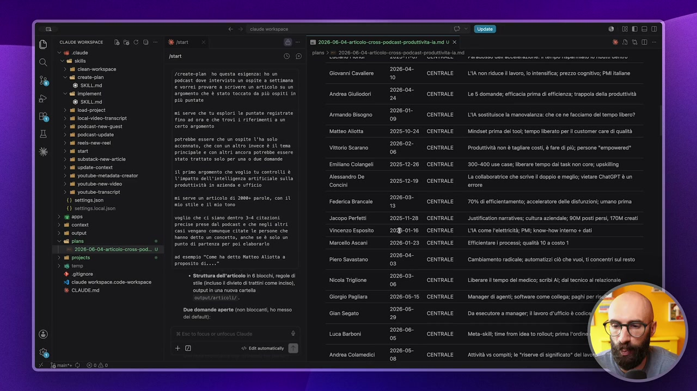

**Testo a schermo (OCR):** V sg cuce Sal site n can workepace © ei creto-pian @ skuumd > ed imploment @ sktuma nd 10ad-prolct n ocatvdeo.transcot nd podcast-nen-quost nd podcast.update nd recis-now-ro ni sun ei substai-new-aricie nd update-content ni youtube metadata-creator n yostube-new-viteo n yostube transerpt 1) settingeson () settingasocaison 2 0000 ni content ni ovipi i pane . ‘2028-06-08 aricole:cross: podi. ni projects . ter + aitgnore 29 claude workspace code-morkspace % CIALDE md deco nude worispace (o) O) Sereate-plon ho questa estgenza: ho un podcast dove intervisto un ospite 2 settimana @ vorrei provare a scrivere un articolo su un argosento che È stato toccato da più ospiti in più puntate nd serve che tu esplori le puntate registrate tino nd ora e che trovi 1 riferimenti a un certo argonento potrebbe essere che un ospite L'ha solo accennato, che con un altro invece è (ì ten prinelpete e con stri ancora potrebbe essere stato trattato solo per una 0 due dosande 10 primo argosento che voglio tu controlli è l'impatto dell'intettigenza artificiale sulla produttività in zienda e ufficio ni serve un articolo di 20004 parole, con il nto Sile e SU mio toro voglio che ci siano dentro 34 citazioni precise prese dal podcast e che negli altri €251 vengano comunque citate le persone che ‘ino detto un concetto, anche se è solo un punto di partenza per poi elaborano. nd esempio “Cose ha detto Matteo AUtotta a Proposito di..." * Struttura dell'articolo in 6 bocchi, regole dî tl (nol ivo di ratti come Icio), output in una nuova carta output/oreieoti/ Due domande aperte (nn bloccanti, ho messo coi default; plans > 2026-06-04-aticoo-cross-podca Giovanni Cavaliere ‘Aridrea Giuiodori ‘Armando Bisogno Matteo Aitta Vittorio Scarano. Emilano Colangeli Alessandro De Concini Federica Brancale Jacopo Perfetti Vincenzo Esposito Marcello scan Piero Savastano. Nicola Triglione Giorgio Paglara Gian Segato Luca Barboni Anidroa Colamediei 2026-08- 10 2026-0 2 2026-07 0 2025-10-24 2026-02. 06 2028-12-26 2028-12-19 2026-08- 1 2028-11-28 20-01-46 2026-01-23 2026-08- 0% 2026-08- 06 2026-05-15 2026-08 CI 2026-06- 0 2026-08= 08 E EI 2026-06-04-anticlo-cros- podcast produttiva ia md U x CENTRALE CENTRALE CENTRALE CENTRALE CENTRALE CENTRALE CENTRALE CENTRALE CENTRALE CENTRALE CENTRALE CENTRALE CENTRALE CENTRALE CENTRALE CENTRALE 0 EDO * 080 LA non riduce lavoro, o intensifica; prezzo cognitivo; PMI allne Le 5 domande; eficacia prima di lficionza; trappola della produttività LA sostituisce la manovalanza: che ce ne facciamo del tempo libero? Mindiet prima dei to}; tempo liberato per customer cae di qualità Produttività non è tagliare costi, è fre di più; persone “empowered* ‘300-400 use case liberare tempo dal task non core; upsiling La collaboratrice che scrive il doppio e meglio; vietare ChatGPT è un ‘70% di efficintamento; acceleratore dell disfunzioni; umano prima @Justification narratives; cultura aziendale; 90M posti persi, 70M creati LA come l'elettricità; PI; know-how interno + dati Efficientare | processi qualità 10 a costo 1 Cambiamento radical; automatizi cò che vuoi, ti concentri sul resto Liberare i tempo del medico; scribi Al; dl tecnico al relazionale Manager di agent; software come collega; paghi pr rs Da esecutore a manager; lavoro d'utficio è codici

> E poi mi dice queste sono le modifiche che ti propongo, io gli ho detto che volevo capire tutti i file che venivano cancellati, file che venivano modificati, file che venivano creati, poi mi dice non ti preoccupare non modifico niente e non elimino niente, però se a volte andate a creare delle skill o fate delle modifiche al workspace, anche queste liste sono fondamentali. Ma creerò un nuovo file, quindi questo è il nuovo file che creerà. Scelte e motivazioni, domande aperte, step operativi, questo è quello che ci interessa a noi, questa è la parte più importante. Quando nella prima lezione di questo modulo vi dicevo risparmiate tempo perché fate un accordo con Claude e Claude riesce ad essere molto preciso perché segue gli step, questi sono quelli che dovete controllare. Cioè se qua dentro c'è una cazzata è il momento di intervenire, se qua dentro una cosa è fatta in maniera troppo superficiale oppure se è fatta inutilmente complessa la potete semplificare oppure se manca proprio uno step. Vediamo quali sono gli step che ci propone. Creerò una cartella articoli, per esempio questa cosa noi non la vogliamo, gli dico di non crearla e di salvarmi tutto dentro la cartella output.

## [00:10:00] Schermata 10 _(periodic)_

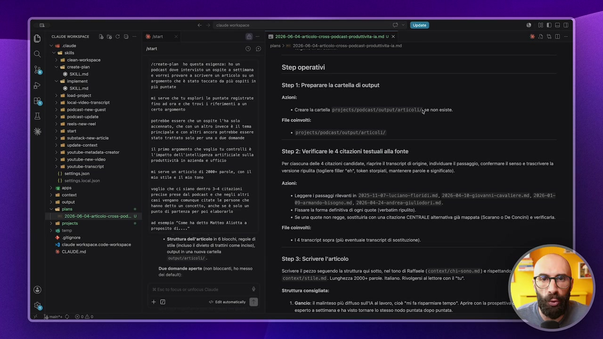

**Testo a schermo (OCR):** ciwvemomece D & CO Vs cause adi sto > 1 clean-workspace < ai creato-pian @ sctund > ed imploment @ skiuma n 10ad-prolct nd Vocal video transit n podcast-nen-quost nd podcast.update ni oois-newroo i sun adi substoclnev-artlo nd update-content nd youtube-metadata-creator n yostube-new-vidoo n yostube transeript 1) ‘settings json () settingasocafson sons ni content ni opa i piane n projects 16 ter + glignore 39 claude workspace code-morkspace % CIAUDE md start rerente-plan ho questa estgenz podcast dove intervisto un @ vorrei provare a scrivere argonento che è stato tocco più puntate ‘da più ospiti in ni serve che tu esplori le puntate registrate tino ad ora e che trovi i riferimenti a un certo argomento potrebbe essere che un ospite l'ha soto accennato, che con un altro invece è {l ten prinespate e con altri ancora potrebbe essere stato trattato solo per una © due doeande 10 primo argosento che voglio tu controlli è L'impatto dell'IntetLigenza artificiale sulla produttività in azienda e ufficio ni serve un articolo di 20004 parole, con il nio ste e SÌ mo toro voglio che ci siano dentro 3-4 citazioni precise prese dal podcast e che negli altri casi vengano comunque citate le persone che ‘anno detto un concetto, anche se È soto un punto di partenza per poi elaborarlo eseapio “Cose ha detto Matteo Altotta a Proposito dic..." * Struttura dell'articolo in 8 occhi, regole di tl (uso livio di ratti come Icio), output in una nuova cartela output/arelcoti/ ue domande aperte (nn bloccanti, ho messo coi dfaut re 2026-06-04 -articolo-cross- podcast produttvitaia md U X pians > = 2026-06-04-aticolo-cross-padeast-produtivta-a md Step operativi Step 1: Preparare la cartella di output Azioni * Creare la cartella projects/podcast/outpuit/articoti/)se non esisto. File coinvolti: » Drojects/padcast/autput/articoli/ Step 2: Verificare le 4 citazioni testuali alla fonte Per ciascuna dell 4 citazioni candidate versione ripulita (togliere file riapre ranscrpt di rigne, individuare il passaggio, confermare senso e trascrivere la token storpisti mantenere parole sigificat) Azioni: = Loggere | passaggi rlevantin 2025311-07=1U21an0=FOFAdi nd, 2026-04-19-gioVaniicavaliere. mi, 2026-01 89-armando-bisogno: nd, 2026-04-24-andrea-giuiodori.nd. ‘ Fissare la forma definitiva i ogni quote (verbatim ripulito). + Se una quote non regge, sostiuria con una citazione CENTRALE alternativa già mappata (Scarano 0 De Concin) a verificaia Filo coinvolti: = 1 transcript sopra (pù eventual transcript di sostituzione) Step 3: Scrivere l'articolo ‘Serivore il pezzo seguendo la struttura qui sotto, el tono di Raffaele (Context/chi=s0n0: md) e rispettando <ontext/stile.nd. Lunghezza 2000+ parole. Italiano. Rivolgersi l lettore con Il "tu". Struttura consigliata: 1. Ganclo: il malinteso più diffuso ulA al lavoro, cioè mi a rsparmiae tempo". Apie con la prospettive esperto a settimana e ha visto tomare lo stesso nodo puntata dopo puntata.

> Poi verificherò le quattro citazioni alla fonte, siccome ha detto che vuole citare Floridi, Cavaliere, Bisogno e Giulio Dori, deve andare a prendere quella citazione. I file coinvolti sono questi quattro, poi step 3 scriverò l'articolo, vedete qua c'è la struttura, quindi se non ci piace la struttura è qua che la modifichiamo. E soprattutto questa la possiamo riutilizzare, perciò dico è comodo avere il piano perché questa cosa la riutilizziamo per altri n articoli. Nel vostro caso non immaginate l'articolo ma immaginate quello che serve a voi. Regole di scrittura da rispettare, quindi se ci sono cose le rispettiamo altrimenti le modifichiamo. I file coinvolti, quindi andare a leggere i miei file di contesto, il chi sono, lo stile e così via. E poi farà un controllo finale, perché deve verificare che il conteggio di parole sia 2000, che ci sono le citazioni, che l'ospite sia stato citato correttamente e che diciamo ci sia il file salvato. E vedete poi fa anche la checklist di validazione.

## [00:11:00] Schermata 11 _(periodic)_

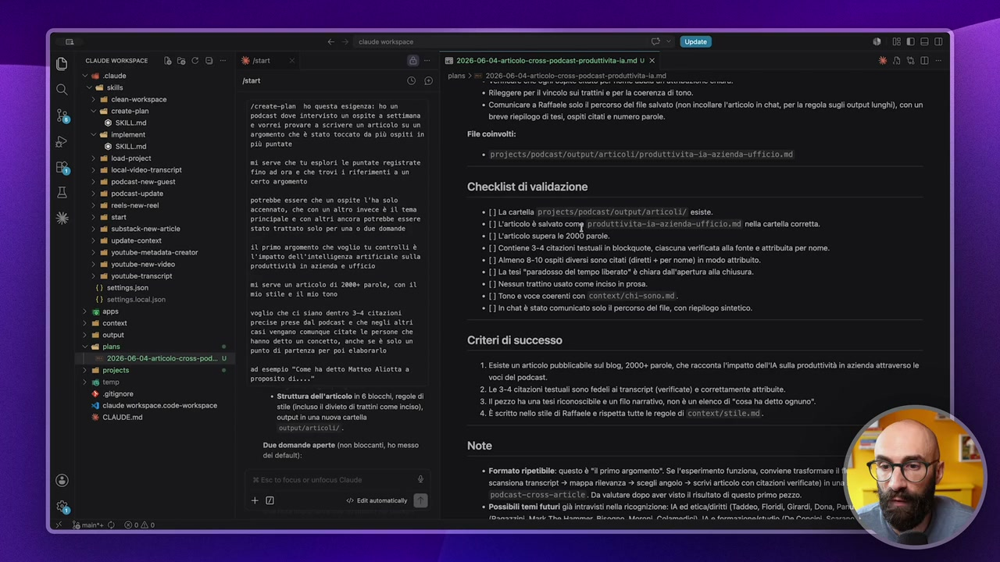

**Testo a schermo (OCR):** cuwoemomsece CO Vf ciato adi sto > 1 clean-workspace > ed creto-plan @ sciund > el imploment @ skiuma 18 10ad-project i Vocal video transit ni podcast-nen-quost nd podcast.update nd ocis-nowroo i sun i substacienewcarticie nd update-content nd youtube metadata crentor n yostube-nen-vitoo nd youtube-transeript () settigeJon {) settingasoca son 2 psn tar cn vortapnce (O) (Cio) Lereste-plon ho questa esigenza: ho un podcast dove intervisto un ospite a settimana @ vorrei provare @ scrivere un articolo su un Srgosento che è stato toccato da più ospiti in più puntate nd serve che tu esplori le puntate registrate ino ad ora e che trovi 1 riferimenti a un certo argonento potrebbe essere che un ospite l'ha soto Sccenmato, che con un altro invece è {l ten principale e con altri ancora potrebbe essere stato trattato solo per una 0 due dosande 10 primo argosento che voglio tu contrelli è L'impatto dell'IntelLigenza artificiale sulla produttività in azienda e ufficio ni serve un articolo di 20604 parole, con il nio ELE e SU mio teso voglio che ci siano dentro 34 citazioni precise prese dal podcast e che negli altri casi vengano comunque citate le persone che hanno detto un concetto, anche se è solo un punto di partenza per poi elaborarlo, nd eseapio “Cose ha detto Matteo AUtotta a proposito di. * Struttura dell'articolo in 6 occhi, regole di tl (nlso livio di ratti come Icio), output n una nuova cartella outpinzaretcoti/ Due domande aperte (nn bloccanti, ho messo dol dtaut; n se" Si ° ROog EI 2028-06-04-aticlo-cros- podcast produttvtaia.md U X * 080 plans > #1 2026-08.04-aricolo-cross-podcast-pradutiva-a md ‘ Rileggere perl vincolo su rattn e per la coerenza i tono. ‘» Comunicare a Raffaele solo percorso del le salvato (non incollare l'articolo in chat, per a regola sugli output lunghi), con un breve riepiogo di tesi, spit citati numero parole. File coinvolti: — DrOECtE/AdENSE/ GELATO LI/prOdUTELvita aa end 10: Checklist di validazione * {] La carta proj&cts/podcast/output/artieoli/ esiste. {articolo è salato comp produittivita-{a-azienda-Uff{ci0;md nell catlla coretta. ‘ [] articolo supera le 2000 parole. ‘» [] Contiene 3-4 citazioni testuali in blockquote, ciscuna verificata all fote e attribuita per nome. » [] Almeno 8-10 ospiti diversi sono citt diretti + per nome) in modo attribuito. [] La tesì "paradosso del tempo liberato” è chiara dall'apertura ala chiusura » [] Nessun trattino usato come inciso in prosa. + [] Tono e voce coerenti con context/chi-sono:nd. » [n chat è stato comunicato solo ll percorso del file, con riepilogo sintetico. Criteri di successo 1. Esiste un articolo pubblcable su blog, 2000+ parole, che racconta l'impatto dell'A sulla produttività in azienda attraverso e voci del podcast 2. Le -4 citazioni testuali sono fedeli ranscrpt (verificate) e corettamente attribuite. 3. Il pezzo ha una tesi riconoscibile 0 un fil narrativo, non è un elenco d "cosa ha detto ognuno”. 4. È srtto nel stile di Raffaele e rispetta tutte e regole i context/stile.nd. Note = Formato ripetibile: questo è ll primo argomento*.e l'esperimento funziona, conviene trasformare scansiona transeript + mappa rilevanza > scegli angolo > scrivi articolo con citazioni verificate) in un podcast-cross=article. Da valutare dopo aver visto listato di questo primo pezzo. ‘ Possibili temi futuri gi ntraviti ella ricognizione A ed etia/ciriti (Taddeo, Ford, Girard, Dona, Pa

> Questo è il pezzo finale fondamentale per me. Perciò è bello lavorare così, con questa tecnica di esplora, esegui, esplora, pianifica, esegui, perché poi abbiamo la checklist di validazione. Quindi fa ok questo l'ho fatto, questo l'ho fatto, questo l'ho fatto, questo l'ho fatto, in modo tale che si può vedere se ha lavorato bene, se è quello che mi ha promesso. Poi criteri di successo, note, l'argomento eccetera eccetera. Ah, in questo caso diciamo io ve lo faccio vedere, mentre nel secondo mi son fermato, qua invece lo facciamo. Quindi prendo questo, lo copio proprio, vedete? Copio, incollo qua sotto, quindi non vi preoccupate, non vi spaventate, non stiamo usando il terminale, non sono comandi difficili, no. Siamo semplicemente dando il via alla skill implement e gli stiamo dando l'indirizzo del piano che deve implementare. Adesso ci vediamo, il piano è quello che vi ho fatto vedere. La skill implement cosa fa? Queste skill potete anche non leggervele, ok? Se non volete andare così in dettaglio.

## [00:12:00] Schermata 12 _(periodic)_

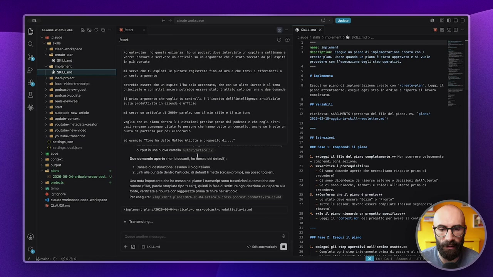

**Testo a schermo (OCR):** V 66 cinte < agi sito > il clean-workspace © adi croato-plan @ sctumd deco 18 10ad-projeci n ocat doo. transit A podicast-new-guest nd poscast.upgate ni eois-now-ro > adi sun > al substak:nev-articlo > all update-contert > nl youtube-metadata-creator > al youtube-new-vieo > n youtube-transeit. 0) settings sson {1 settingsioca son Cai ni conto ni ovipi i pan . 2026-08-04 -atiolo-cross-pod.. U ni projects S ter + glignore 9 claude workspace code-morkspace % CIALDE md cnuse vorkspace 2 psn ta Sereste-plan ho questa esigenza: ho un padcast dove Intervisto un ospite a settimana e vorrei provare a scrivere un articolo su un argomento che è stato toccato do più ospiti in più puntate ni serve che tu esplori le puntate registrate fino ad ora e che trovi i riferinenti a un certo argonento potrebbe essere che un ospite L'ha solo accennato, che con un altro invece è 11 teso Prinetpale e con SItri ancora potrebbe essere stato trattato solo per una 0 due domande 11 primo argosento che voglio tu controlli è l'impatto dell'intelligenz Sulla prodottività in azienda e ufficio artsrictate ii er un articolo di 20006 parole, con SU so site e LU no tono volo ch ci sian dentro 3-4 citazioni precise prese al pogast e che ep atri ASS vengono cominue citate e persone che ha certo un concetto, anne se è sol un Sento d partenza per pos elaorato. n semo "Come ha detto ptteo Aiott » proposito al. Sic io ene SI uo domande aperte no biccant n esso ei ee: 4. Cana di destinazione: assumo l big tano. 2. Un all puntato dentro laticoo i deful i metto (cross-promo), ma posso togli Una nota Importante che ho messo nel piano: transit sono trascrizioni automatiehe con tumore (filr, parole strpiate ipo "Lea" quindi in fase i critura ogni citazione va riaperta ala fonte, verificata ripulita con leggerezza prima i finire nell'articolo. Per esegui: /inplenent plans/2026-06-0i-articolo-cross-podcast-pradittivita- ta. /inplenent plans/2026-96-06-articolo-cross-podcast-produttivita-ia.nd + Tranamutin. +9 Dein e- a @ skttmd x lugo) sile > implement > @ SKILL md > 1 nane: inplesent description: Esegue un piano di iaplesentazione creato con / create-plan. Usare quando un piano è stato approvato e si vuole procedere con l'esecuzione degli step operativi. 3 taplenenta Esegui un piano di inplesentazione creato con ‘/create-plan'. Leggi il piano attentamente, esegui ogni step in ordine e riporta il lavoro completato. de variabili richiesta: SARGINENTS (percorso del file del piano, es. ‘plans/ 2026-02-18-aggiunta-killnegsletter.nd) 0 rstrazioni ate Fase 1: Conprendi il piano 1, seleggi il file del piano completamente. es Mon scorrere velocemente — comprendi. ogni sezione. 2. seferifica i prerequisiti;sa — Ci sono doande aperte che necessitano risposte prima di procedere? — Ci sono dipendenze da risorse esterne 0 decisioni dell'utente? — Se ci sono blocchi, fermati e chiedi all'utente prina di procedere. 3. secontersa che il piano è pronto: — Tutte le sezioni devono essere compila rimasto) 1, rese Al piano riguarda un progetto spaciticors — Leggi IL ‘context.nd’ del progetto per avere 1l cont ass Faso 2: Esegui il piano 1. seSegui gli stop operativi nell'ordine esatto.ee

> Io ve le regalo, voi le pigliate e le utilizzate e basta. Esegue un piano di implementazione creato con la skill create plan. Usare quando un piano è stato approvato e si vuole procedere con l'esecuzione degli step operativi. Quindi cosa mi dice? Comprendi il piano, quindi cosa farà questa skill? Legge il piano, non scorrere velocemente ma leggerlo bene. Verifica che ci sono i prerequisiti, cioè se ci sono delle domande aperte nel piano e queste domande sono bloccanti, non deve procedere. Se ci sono blocchi, fermati e chiedi all'utente prima di procedere. Capite perché vi sto dicendo Claude ce l'ha ma io ho preferito farmi la mia? Perché nella mia ci ho messo proprio dei controlli precisi, delle cose che volevo visualizzare. Fatelo pure voi. Questo è il bello di avere un sistema agentico, che ve lo costruite sulle vostre esigenze, su misura per voi. Conferma che il piano è pronto. Il piano, diciamo, c'ha degli stati, no? Bozza o pronto. Vabbè, se serve si legge il contesto, poi esegue il piano. Quindi vai dentro, pigliati i singoli step che hai fatto.

## [00:13:00] Schermata 13 _(periodic)_

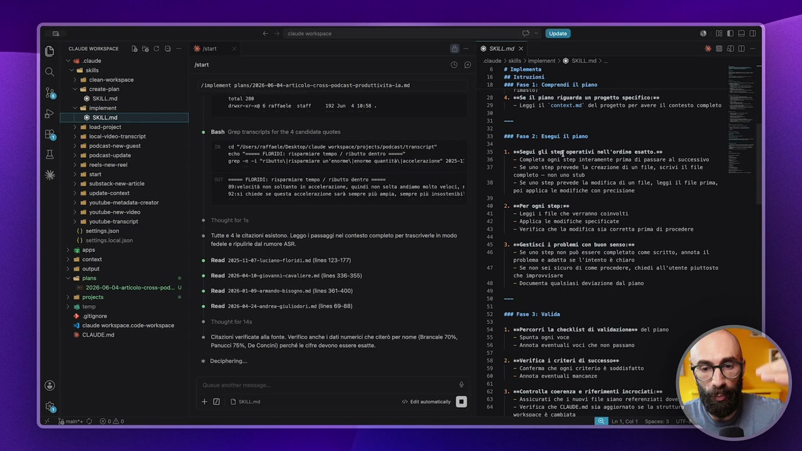

**Testo a schermo (OCR):** iv orsonce e. DEDE cuwoewonsmce DCO = der DETTORI *800 < 66 cio > ade) ate > Implement > @ SKILL md > bea fr 6 # Trplesenta gra 1669 Istruzioni rta Linplenent plans/2026-06-00-articolo-cross-podcast-produetivita-ta.mi 10900 Fase 1: Coeprendi i pio @ sctumd rota 200 20° 4. suse ÎM piano riguarda un progetto specifico - igiene intr-xra 6 raffaele. staff 192 20m 4 10:58. 29. 1° — Leggi SM ‘context.na' del progetto per avere il contesto completo TX —— 5 a 18 10ad-projeci Rene A 3 a a e Bish Grep ransrite for the 4 candidate quotes È ara a > ul podcast-nen-quost cd "/Users/attaetesnesktop/ classe vorisprce/projeets/poscast/transeript* 5) > all podcast-update e<h0 Senna FLORIDI: risparmiare tengo / ributto dentro mes 35° 1, esegui gli stegroperativi nell'ordine esatto.se rep <a i “ibutto\risporatare un'enorme) enorme quantti\ accelerazione" 2025-1: -—35 | - Completa ogni step interanente prina di passare al successivo Fei 37 || - Se uno step prevede la creazione di un file, scrivi il file si sun completo — non uno stub n cina Sr ASI: isortore emo / ibnto ctr mne ia | 20 ino teo pretese la mogifica di un file, lego 1 fite prim, d) is n poi applica le modifiche con precisione nd update-content S2i5I Chiese se questa accelerazione sarà sempre più nia, sempre più insostenbi! |, 8 youtube. nem video #11” Leggi 4 rite che verranno cosnvotei nd youtube ranscipt Tnough ora #2 |" Applica le nogitiche specificate 1) sotingejson || l Verifica che la mogifica sia corretta prin di procedere Tute 4 le citazioni esistono. Leggo assaggi el contesto completo per trascrivere in modo “ ocolo o ripulo dl rumore AS. #53. sucestisci 4 problemi con Buon sensosse n 461° 2 Se uno step non può essere completato come scritto, onota il sd conte Rond 2825-11-97-luciano-f lord (ins 123-177) problema e adatta se l'intento è chiaro si cupa "Se non sei sicuro di cone procedere, chiedi all'utente piuttosto A Rond 2016-06-10-g10vaas-cava ere. ins 336-355) che improvvisare Lic bocunenta qualsiasi deviazione dal piano > nl youtube-metadata-crestor 402, meter ogni stepise {1 settings ioca fon aa Reed 2025-01-00-0mando-bisogn.s6 (Ines 361-400) ni projects e ss # terp Read 2026-04-24-ndren-giulri.nd (nes 69-88) + giigrore ro Faso 3: Valida 29 claude Workspace code: morkspoce 1. setercorri la checklist di validazionene del piano % CIAUDE md Citazioni verificate all fonte. Veriico anch dati numerici che citrò per nome (Brancale 70%, — Spunta ogni voce Panucci 75%, De Conc!) erché l ciro devono oscao ostt. Annota eventuali voci che non passano Deciphering.. . anderifica 4 criteri di successone - Conferma che ogni criterio è soddisfatto — Annota eventual! sancanze . «nControlla coerenza @ riferimenti Ancrociati:sa "Assicurati che £ nuovi file siano referenziati dovi — Verifica che CLAIDE.ed sia aggiornato ce la struttu vorksonce è coniata

> Vi ricordate? Abbiamo detto Claude è molto più preciso, fa meno errori perché così fa step 1, step 2, step 3 e così via. Gestisci i piani con buon senso. Diciamo, qua ovviamente io ho detto semplicemente se c'è qualcosa che fai di diverso me lo devi dire alla fine. Se non sei sicuro come procedere me lo devi chiedere. Se uno step non può essere fatto come scritto perché magari ho approvato una cosa ma quella cosa è non fattibile tecnicamente, lo devo considerare e così via. E poi alla fine deve validare. Quando ha finito mi deve scrivere il file, lo deve spostare da Bozza a implementato e così via. E poi mi fa un piccolo report di quello che è successo alla fine. Questa è come funziona la skill. Quindi adesso appena ho finito di eseguire il piano, vi faccio vedere il report finale che mi ha fatto. Ecco qua, ha quasi finito. Vi faccio vedere cosa sta facendo. Prima ha verificato le fonti, poi ha iniziato a scrivere l'articolo. Finito l'articolo ha fatto lo step 4,

## [00:14:00] Schermata 14 _(periodic)_

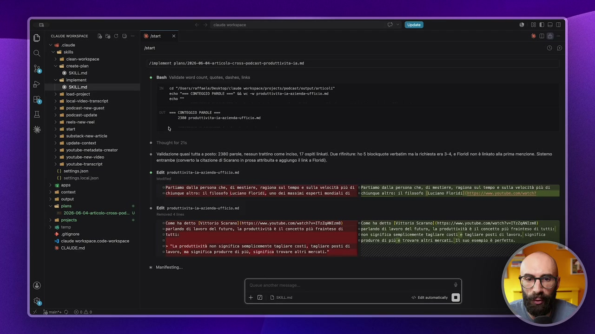

**Testo a schermo (OCR):** cause vorispnce ciaune worxspace - ® CO de pstant 2 06 cine SG ski ir > n clen-woropoce ai crsto-pon pete x ed inpiemen © skitmd cd trarattonte/msttop/elavo voripecaloroect/poscatioptiarticti 3 a inci Sin SEL COGI PE ct Li e protetto taria > n local-video-transcript. irta) > ad podcast quest > nd poscestupsite > ad resero > ast è > n subetocienemariclo > ad upate-cntnt rouge > ad youtube metcata-crato > ad youtube nonsideo > sd yetube anco Linplenent plans/2026-06-00-articol0-cross-podcast-produetivita-ia. ni Bash Valcinto word count, quots, dashes,inks nen CONTEGGIO PAROLE nen Validazione quasi tutta posto: 2380 parole, nessun tato come inciso, 17 osp kat. Due inte: ho 6 blockauote verbatim ma a richiesta era 3-4, Ford non è Iinkao alle prima menzione Sistemo, entrambe (conveto la citazione di Scarano prosa attribuita e aggiungo link a Fori. 0) setting icon it produttivita-ia-aziendo-ufficio,ni {1 settogsioca fon asi Di oPareiano dalla persona che, di mestiere, ragione sul teso CÒ LPP HOLL BEFEO E) SRL Pagana GU despo è SULLA Velsaa più n cone “ ehlunase altro: sl filosofo Luciano Florici, uno del massini esperti mondiali di “chiunase attrot IL filosofo [Luciano Florio! ni cupa crm o i produttivita-iaaz iena 2026-06-04 arcoo-cros-pod.. U lr i ‘com/vatchtVsIT2ZGAN i) Co a detto [Vittorio Scarano] ts: //ia Vate: contenta ITzZAANIi8) ten caneetto “parlando di lavoro del futuro, la prodott vità è ÎL concetto più frainteso di tuttii] + gitigrore eNon significa senplicosente tagliare costil@ tagliare posti di lavoro, | significa 29 claude workspace.code-workspaco »produrre di più/@ trovare altri nercati.iIÙ suo esempio è perfetto. x cLAUDE md + Dein

> quindi ha fatto il controllo finale, il conteggio delle parole e così via. Ha detto che è quasi tutto a posto, ci sono 2380 parole e questo è come gli avevo chiesto io. 17 Ospiti linkati, deve fare due rifiniture perché ha messo 5 citazioni ma io gli avevo detto 3 o 4 e poi mancava il link. Quindi cosa fa? Sistema entrambe, quindi la citazione di Scarano la trasforma in prosa e aggiunge il link a Floridi che mancava. Capite che significa avere un piano? Perché nel piano c'era anche la parte di validazione e lui andando a validare dice ah ok ho fatto questo piccolo errore, niente di grave, invece di 4 citazioni me ne ha messo 5, però l'ha capito e l'ha aggiustato. Ecco perché è fondamentale avere un piano. E poi vi dice ok perfetto tutto a posto, ora aggiornano lo stato del piano, il piano non è più in bozza ma se andiamo sopra me lo dà come stato implementato. E adesso quindi dovremo avere anche il nostro articolo. Vediamolo, eccolo qua.

## [00:15:00] Schermata 15 _(periodic)_

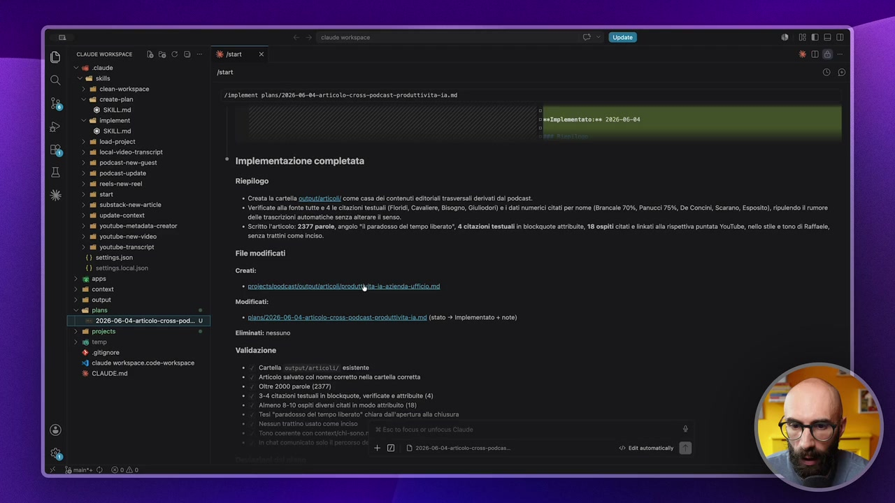

**Testo a schermo (OCR):** cuuenomence Dt CO 2 06 cauto cai sito > a clen-monspoce < ei crosta © sat fmplemant © satin > a lad: proci > al oca ioranscrit > nl poscst e uest > al poscastupdeto > 11 roei-nenroel > af son > al substaci nemici > a update > ad youtube: metadata centor > a utsbe.nemo > a youtube ranscrpi (1 settings ;son (I settngasocaison a > ll ont inuse vorispnce 0 8DOT 2 pon * 06 start (N00) Linplenent plans/2026-96-00-articolo-cross-podcast-produttivitta. ni * Implementazione completata Riepilogo Creta la arte aututlricoli come casa dsl contenuti cio rasversli erivati al podcast. * Verificato al fonte tuto 04 le citazioni testuali (Fri, Cavaler, Bisogno, Giulodr) o ati numerici citati per nome (Brancale 70%, Panucci 75%, De Conc, Scarano, Esposito) ripulendo l rumore el trascrizioni automatiche senza alterare i senso. * Scritto l'articolo: 2377 parole, angolo *l paradosso del tempo berto", 4 citazioni testuali n blockauote attribuite, 18 ospiti citati nat lla rispettiva puntata YouTube, neo st e ton di Raffale, senza tratti coma inciso. File modificati Cartola siput/articoLi/ esistente Articoo sabato coi nome corretto nella cartella coretta ‘Oltre 2000 parole (237) 3-4 cazioni testuali in bockuote, verificate e tributo (4) ‘Almeno 8-10 osp ieri cati i modo atribuo (18) Tesi paradosso dl tempo liberato" chiara all'apertura ala chiusura Nessun trstino usato come inciso + DI D20200006arcoc

> Questo è il nostro bell'articolo. Eccolo qua. Qua ci sono pure i link. Vedete, se passo sopra questi link puntano alle puntate YouTube delle persone citate. E sta seguendo proprio la struttura che ho detto io. Emiliano Colangeli che ha guidato l'adozione dell'IA dentro un'azienda e così via. Qua ha messo le citazioni esattamente come le volevo io, eccetera. E poi abbiamo anche il recap finale. Vi ricordate che facevo il recap finale? Ecco il riepilogo. Ecco i file che ti ho modificato. Ho creato questo, ho modificato questo, non ne ho eliminato nessuno. Ecco la validazione, quindi proprio la checklist con le spunte. Perfetto. E poi dice il piano ora è stato implementato. Abbiamo finito. Signori, quando imparate a padroneggiare questa cosa, il vostro modo di utilizzare Cloud Code cambierà completamente. E avete appena capito perché è fondamentale. Perché c'è questa roba qua. Perché c'è tutta quella parte di piano. Perché il piano è un file che adesso possiamo riutilizzare e così via. Non la sottovalutate. All'inizio vi verrà da dire, sì vabbè ma perdo tempo a fare il piano.

## [00:16:00] Schermata 16 _(periodic)_

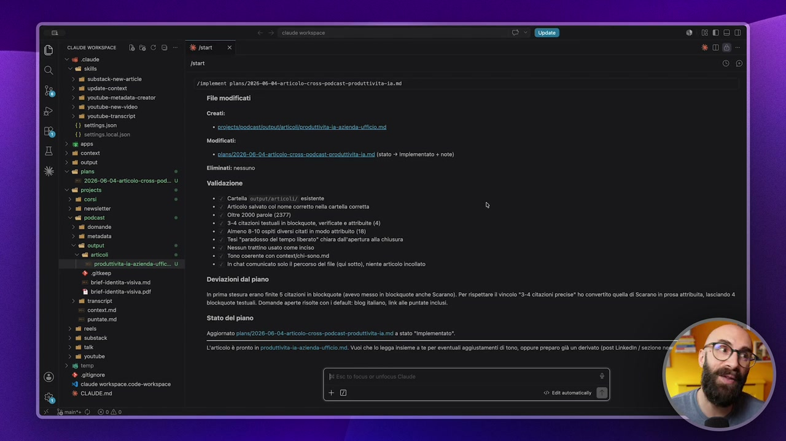

**Testo a schermo (OCR):** cina voriapace 0 8000 cine womsece bf CO *D6 V 06 cloud < agi site > al substacicnem arie > adi update-contest > al youtubo-metadata«creator File modificati (N00) Linplenent plans/2026-06-00-articolo-cross-podcast-produttivita-ia. n pra i youtube-transcript. sno {I sttng/son * actor ande od (I etingtioci ion arene > a content > af ut Satie 2026-00-04 atei. po ess <tr reo le ZA LEO stento ae cao vato ca home comi nl crt cometa u tv 2000 pre (577 Le 3-4 citazioni testuali in blockquote, verificate e attribuite (4) Ameno 8-10 api ieri uti odo sto (1) Te prndono dle tro” cli d'area civ Ne tino uso come belo Modificati: > al domande > al metadata ad output <a arco Tono coseno con conenvehi.sono mel > prot azien ih hot comunicato solo percorso delle (qu to) ente aicoonclato + gio San Deviazioni dal piano Mi britidentta visiva pat in prima stesura erano finte 5 citazioni in Biockguote (avevo messo In blockquote anche Scarano). Per rispettare l vincolo * > nd ransenipt Blockauote testuali. Domande apert sota con fait blog ialano In all puntate inclusi x: contestmd puntate ma Stato del piano 3 nd resi > al sota > mus Lario è pronto n procura: zienda ufficio md. Vul ch o legga Inler a oper eventuali aglustamenti di tono, appure preparo già un derhato (post Linkin / sezione ne > 1 youtube ‘Aggiornato pians/2026.06-04-articlo-crss-podcast-procuttvitaiaimd a siao implementato’.

> È vero che perdi un po' di tempo. Non è vero, lo stai investendo. Dopo ti ritorna in meno errori, meno token consumati, vai più veloce. Cose che puoi ripetere più volte. Quindi buona sperimentazione. E anzi, anzi, vi voglio far vedere una chicca. Perché questo modulo doveva finire qua. Ma vi voglio far vedere una chicca aggiuntiva. Ve la faccio vedere nella prossima lezione. Andate avanti.
