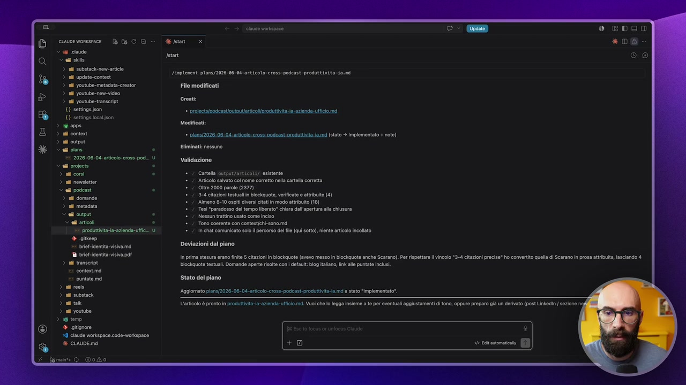
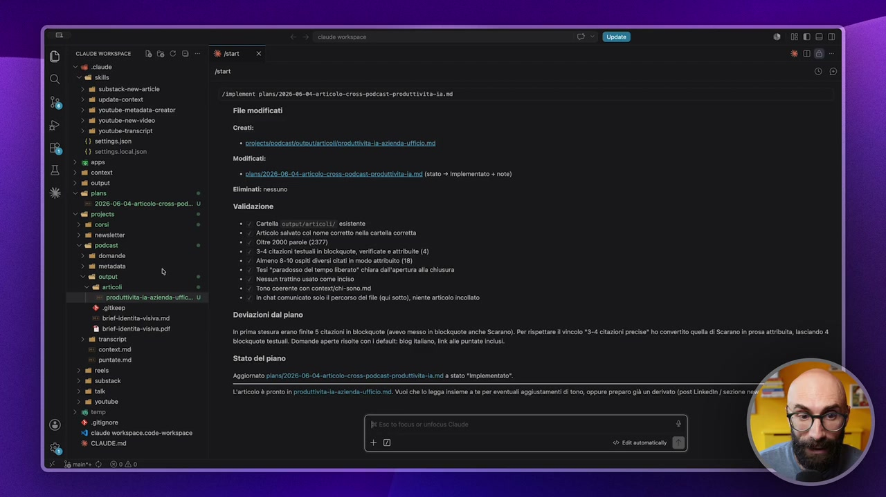
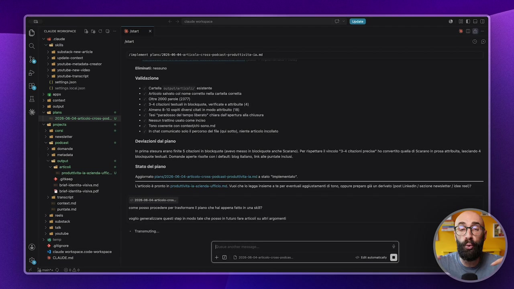
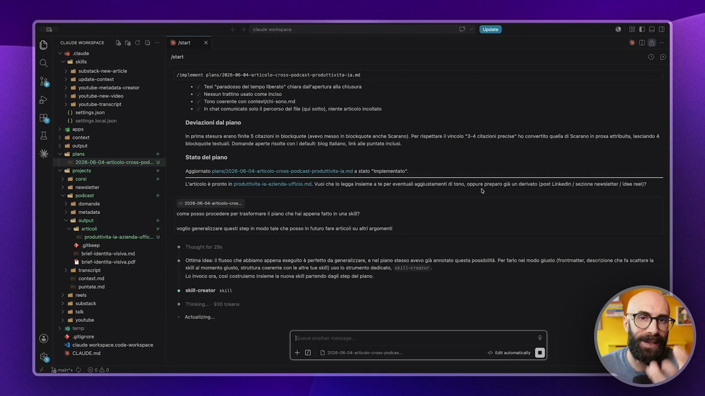
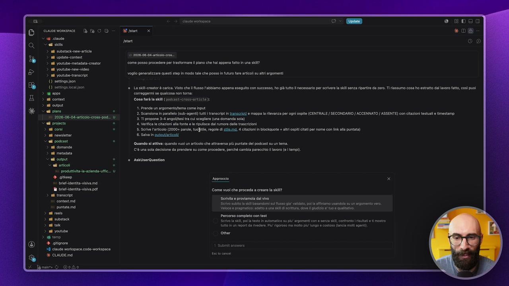
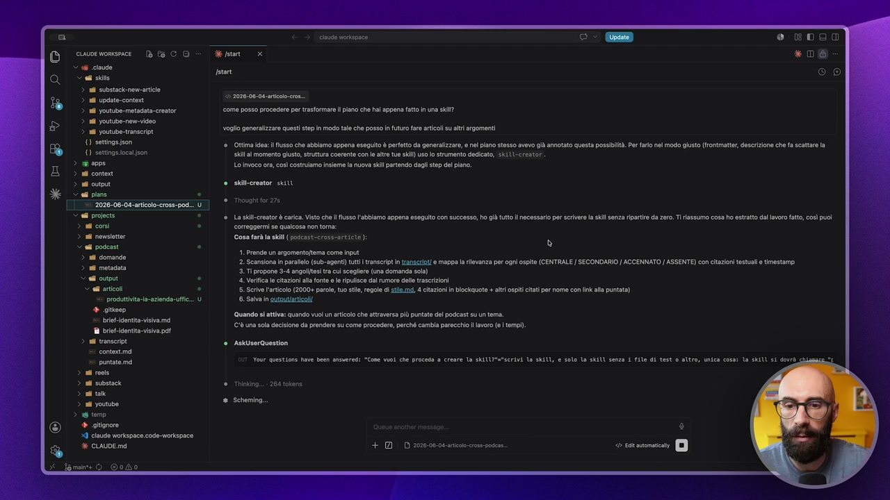
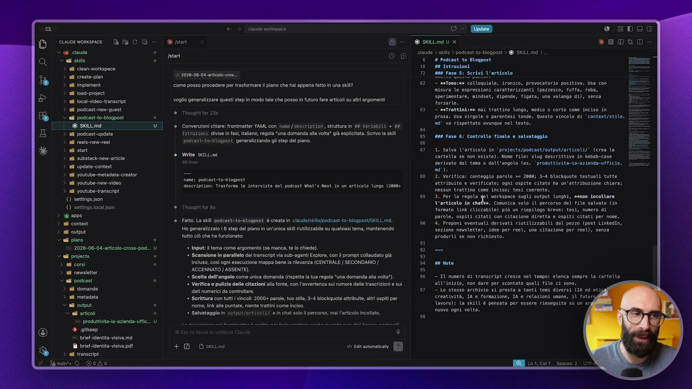
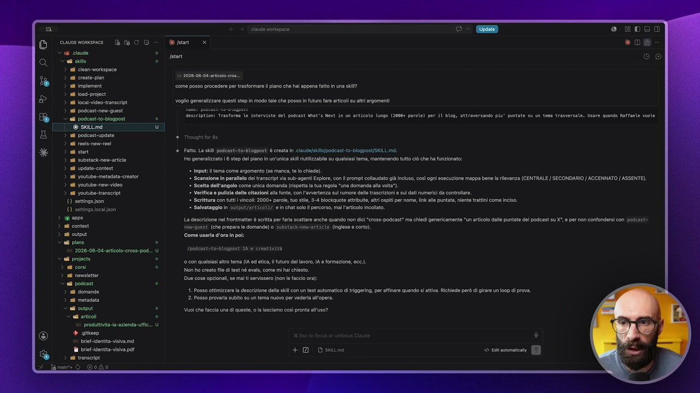

# Creare una skill da un piano

> Documento generato automaticamente: trascrizione e screenshot sincronizzati del video-corso.

## [00:00:00] Schermata 0 _(start)_

**Testo a schermo (OCR):** cine workignce ciuune worxseace - ® & CO è pstant i Sala Fei ace (et rie motti e lana () sttngajson - restsloodcastotouinticoorocunt-a-aienda= fico md 35 HE osi e rari iii ta (=D oa 2 Gi oto e Om sd e e) cea CAME SNSAE, Tesi “paradosso del tempo liberato” chiara dall'apertura alla chiusura di sera i. aa e e ice a brilAdentita-visiva md Deviazioni dal piano in prima stesura eran finite 5 citazioni in lockguote (avevo messo In blockquote anche Scarano). Per rispettare l vincolo "3-4 citazioni precise" ho comverino quell di Scarano n prosa attribuita lasclando 4 Blockguote testuali Domande aperte risota con fait bog iano In alle puntate nu tar Linplenent plans/2026-06-08-articol0-cross-podcast-produetivita-ia. nd Crest: Modificati: Stato del piano Aggiornato pans/2028.06-04-articlo-cros-podcast:pocuttiviaia md a stato “Implementat' L'articolo è pronto in prodittvia-la-azienda-ulficio id. Vo cha lo legga insieme a te er venti aggiustamenti i ton, oppure preparo già un derivato (post Linkdin/ sezione 8 a]

> Voglio aggiungere questa piccola chicca extra. Quando avete fatto qualcosa utilizzando questa modalità, quindi esplora, pianifica e segui, se vi accorgete che quella cosa è un task che tornerà spesso in futuro, qual è la cosa che potete fare? Vi lascio un secondo per pensarci. Potete trasformarla in una skill. Avete visto nel modulo delle skill che è una delle componenti principali di Cloud Code ed è quello che fa la differenza tra saper utilizzare bene questi sistemi agentici e continuare a usarli come se fossero una chat. Questo adesso era un esempio di quello che ho fatto in questo modulo, ma se io avessi veramente l'esigenza di periodicamente fare gli articoli per il mio blog estratti dal mio podcast, potrei dire aspetta un attimo, ma questa cosa che ho appena fatto su un argomento specifico, adesso la trasformo in una skill. Ed è molto facile farlo quando abbiamo un file di piano.

## [00:01:00] Schermata 1 _(periodic)_

**Testo a schermo (OCR):** cause voapace 0 EDO cuwewonsece I 26 CO defsan *06 x 6 ciude cl sito > al substaknew-articie > adi update-content > al youtube. metadata-creator File modificati form 9 ingement plana /2026-06-0-rticoto-<ross-podcastrodttivita-in.6 nd youtube-new-video nd youtube. transit ( settogsJson {) settogsiocaison Carte utsut/articots/ esistente Artico salato col nome corretto nella cartella corretta Oltre 2000 parole (2377) 3-4 citazioni esta in blockquote, verificate e attribuito (4) ‘Almeno 8-10 ospiti eri citati in modo attributo (18) Tes paradosso del tempo liberato" chiara dall'apertura al chiusura Nossun trattino usato come inciso Tono coerente con contextchi-sono.md in chat comunicato solo percorso del file (qui sotto), nente articolo Incollto Deviazioni dal piano in prima stesura erano finto 5 citazioni in Biockguote (avevo messo In biockauote anche Scarano), Per rispettare l vincolo Blockguote testuali. Domande aperte sota con defait: blog Italano, In all puntat nc Stato del piano ‘Aggiomato plans/2026.06-04-artcolo-cross-padcast-poduttvitaia ma stato implementato’. Lato è pronto in produttività a-azienda-iicio im. Vol cha o legga inslem a e per evontai aggiustamenti i ton; opp prepara già un derivato (past Linkin] sezione n

> Perché cosa diciamo a Cloud? Semplicemente di prendere questa roba qua, quindi questa knowledge, questo insieme di conoscenza, di step, di analisi e così via, e trasformarlo in una skill. Come lo facciamo? È semplicissimo, perché ovviamente lo fa Cloud. Gli dico questo. Come posso procedere per trasformare il piano che hai appena fatto in una skill? Gli dico questo. Voglio generalizzare questi step in modo tale che posso in futuro fare articoli su altri argomenti. Capite? Quindi la struttura rimane la stessa. Io ti do un argomento, e non è più la produttività, ma può essere l'IA nella scuola, oppure può essere un'altra cosa, e tu usi questo stesso approccio però per fare una skill.

## [00:02:00] Schermata 2 _(periodic)_

**Testo a schermo (OCR):** cause vorispnce cuwemomsece 6 CO Vf cite cai sie n substaci-nencarticie n update-contet ) Vinit inistero poterti ir a Eliminati: nessuno. nd youtube transeript ezine () settogsJson () settingssocaison Carta output/articot4/ esistnto > aio Articolo salvato col nome corretto nella cartella coretta aa Ottre 2000 parole (2377) sas 3-4 cazioni esta in bockauote, verificate e attribute (4) aos ‘Almeno 8-10 osp eri cia modo attributo (18) ‘Tosi ‘paradosso del tempo liberto" chiara dall'apertura alla chiusura Ri 200:06 Sire Nessun trattino usato come inciso. Sed proicia Tono coerente con contxtchi-sono.md > adi coni in chat comunicato slo percorso del ile (qui sotto), nente articolo incollato > all getto © el podcast Deviazioni dal piano quae n prima stasua erano finte 5 citazioni in iockauote (avevo messo ln biockuote anche Scarano). Per ispettrl vincolo "3-4 citazioni precisa" ho comertto quell di Scarano n prosa atriuita, asclando 4 > al metadata Blockauote testuali. Domande aperte risolte con default: log alano, Ink alle puntate inc. < adi output < el artico Stato del piano x. produntvita a-azienda-utfi 4 gite Brent visiva me L'articolo è pronto ln proditivita-la-azienda-ufiio md. Vuol che lo legga insieme a te por eventuali aggiustamenti i ton, oppure preparo già un drivato (post Linkedin/ sezione newsletter o rob)? M britidentta visa pal > si ransenipt & = x contestimd Sa puntate.ma come posso procedere per trasformare Il piano che hal appena fatto in una ski? ‘Aggiornato pians/2026.06-04-artclo:cros-podkast-produttvità-ia md a siao implementato’. 3 i reeis > al substack > atto > all youtube voglio generalizzare quest step la modo ale che posso in futuro ar rtl su altr argomenti ie + DID 2026-0006 ct pod

> Adesso chiediamo a Cloud di farci aiutare. Io lo so come si fa, però vi faccio vedere che lo chiedo sempre a Cloud, perché è il modo migliore con cui procedere. Ogni volta che mi arrivano domande, Raph, ma io vorrei fare una skill per fare questa cosa, come lo posso fare? Io dico sempre, ma non lo devi chiedere a me, lo devi chiedere a Cloud, perché Cloud Code sa tecnicamente quali sono i passaggi per farlo, quali sono le informazioni che gli servono, gli eventuali file di contesto, struttura del workspace, e così via. Allora gli dice, lo facciamo con la skill creator ovviamente, lo invoco ora, così costruiamo insieme una nuova skill partendo dagli step del piano. Quindi adesso lui chiama la skill creator che mi farà creare una skill su questa cosa e si appoggia sul fatto che c'è già un piano con dentro tutti i passaggi da fare. Quindi vediamo cosa ci chiede adesso questa skill creator. Probabilmente l'aspetto principale sarà quello di astrazione, ok?

## [00:03:00] Schermata 3 _(periodic)_

**Testo a schermo (OCR):** cina vorispnce cvve womseace DCO < 66 cite <a sio > al substacknewarticie > adi update-contest > nl youtube-metadata-crestor + / Tesi ‘paradosso del tempo liberato” chiara dall'apertura all chiusura Linplenent plans/2026-06-00-articolo-cross-podcast-produetivita-ta.ni A 1.1. Noe tti uso core cio aa SI eee (1 stiano 0h usato, " () settingsiocaison Deviazioni dal piano. > aan > adi contea > nl output < el pins Stato del piano 2026-06-08 aricole:cross: pod. Ced propcis Aagionato pans/2026.06-04-atclo-eros-podcast-produttiviaiamé a stato “implementato”. > all cons > all esettr ved podcast > al domande 10 2020-00.0k rio cron. come posso procedere per trasformare piano che hal appena fatto in una ski? n prima stesura erano finte 5 citazioni n blockguote (avevo messo in blockquote anche Scarano), Per rispettare l vincolo "3-4 citazioni precise” ho convertito quela di Scarano in prosa atri lasciando 4 Bloekquoto testuali. Domande apert risolte con dfauit: blog italno, Ink alle puntato intus L'articolo è pronto ln prodiiviaia-azienda-utfik md. Vuol he lo legga insiemi a te por eventuali aggiustamenti ion, oppure propo già un derivato (post Linked] szione newslettr ka oo)? voglio generalizzare quest step in modo ale che posso in futuro far articolati argomenti COCO OI ICI ski al momento giusto, strutura coerente co e altre tu ski) solo strumento dedicato, skillereator Lo ivoco or, cos costruiamo Insieme la nuova kl partendo dagli sep cel piano. M brit-identta visiva pat > sd ransenpt contenti puntateima > ai reeis > all substack Tundo. 930 tok > alt > all youtube > ag temo + alignore Ù I claude Workspace code-morkspace % CALDE md + DID 20060608 arcore pd sicrestor sit Actualzino NIEMICIYA

> Quindi invece di lavorare su un argomento, che in questo caso era l'argomento della produttività, lavorerà su un argomento X, ok? Io lancio questa nuova skill, gli do l'argomento e lo faccio. Qua metto un attimo in pausa. Ah no, ecco qua, sta dicendo la skill è carica, visto che il flusso abbiamo creato, ho già tutto il necessario per scrivere la skill senza partire da zero. Così puoi procedere e correggermi se qualcosa non torna. Allora, prendo un argomento. Allora, cosa farà questa skill? Innanzitutto lui l'ha chiamata podcast cross article. Non mi piace, io gli dirò che la chiamiamo podcast to blog post, ok? Quindi mi dice, prende un tema come input, scansiona in parallelo con i subagenti i transcript e li divide in argomento centrale, secondario, accennato, assente. Ti propone 3-4 angoli tesi, verifica le citazioni alla fonte, scrive l'articolo, lo salvi in output. Perfetto, esattamente quello che vogliamo.

## [00:04:00] Schermata 4 _(periodic)_

**Testo a schermo (OCR):** nd update-contest. nd youtube metadata-creator n yostubo-new-vieo nd youtube-transeript () settgsjson () settingssocalison ion ni content ni output > ef pins ‘2026-06-04 articles: pod. Sed propcis > all coni > all ewsottr 3 ad podcast > al domande > al metadata ad cupa Sal articoli produttit-ia-azionda-uii. 4 gite Brent visiva md M briotidentia visiva pat > nd ransenit si contest puntato,ma > i roeis > ul subetack > alto > all youtube 3 ag temo 4 alignore 19 claude Workspace code-workspace claude vortipnce ® ROOT * 0% come posso procedere per trasformare il piano che hal appena fatto in una sl? voglio generalizzare quest step ia modo ale che posso In futuro far articoli su atti argomenti La skl-cretor è carica. Visto chel flusso l'abbiamo appena eseguito con successo, ho gl tutto l necessario per scrivere la sl senza riparte da zero. TI isso cosa ho estratto dal avoro fatto, cosi puoi correggermi se qualcosa non tom: Cosa farà la kil (podcast=crossarticie) 1. Prende un argomento/tema come Input 2. Scansona i paralelo(sub-agent) tutt ranscrpt in tansii/ e mappa la rilevanza per ogni ospite (CENTRALE / SECONDARIO / ACCENNATO / ASSENTE) con citazioni testuali timestamp 3. TI propone 3-4 angolitesi tra ul scegliere (una domanda sol) ‘a. Verifica o citazioni alla fono e ripulisce da rumore dell trascrizioni ‘5. Serve laticoo (2000: parol, tuo, regole di sil md, 4 citazioni i blockquote + altri ospiti iai per nome con ink ala puntata) 8. Salva in otutlricoli Quando al attiva: quando vuol un articolo che attraversa più puntato dl podcast su un tema. C'è una sola decision da prondre su come procedere, perché cambia parecchi avaro (0 emi. AskUserquestion Approccio Come vuoi che proceda a creare la si? Scrivia proviamo dl vivo Scr subito la ll basandomi sl fuso i val, pla atfnamo usandla su un argomento vo. Veloco o pragmatici atto 3 un dl dicitura, dre gudizio '1uo e qualtato Percorso completo con test. Selo La sil, pl la est i automatico su pu argomenti on 0 senza sl controto istat ti mostro tuto nun report a vedere, i rigoroso ma molto pu' lungo e costosa (nia mot agent other

> Adesso divento una skill. Mi dice scrivila e proviamola dal vivo, percorso completo col test. Faccio, gli do altro come risposta e gli dico scrivi la skill e solo la skill, senza i file di test o altro. Vi ricordate perché altrimenti si mette a finire i file di test, cioè è una roba che non finisce più. Io la salto quella roba perché secondo me in cose molto semplici non serve. Unica cosa, la skill si dovrà chiamare, come abbiamo detto, invece di podcast cross articolo facciamo podcast to blog post e faccio submit answer. E adesso lui mi scriverà la skill basandosi su tutta la conoscenza che abbiamo accumulato dentro questo file di piano. Prende questa roba qua, la astrae, la generalizza e la rende una skill. In modo tale che io tra un mese posso invocare la skill che si chiamerà podcast to blog post

## [00:05:00] Schermata 5 _(periodic)_

**Testo a schermo (OCR):** cine vortapnze cisuoe workseace = [è tè CO Valse Vedi > at ntnacicone ace > n update-context. ia > nd yet metadata-crstor Crm pes procadre per esormare ino che tal oca fatto ina sN? > sf yet neniceo > ali vote teorie LI sotto son CO ENI ) settings.ocal.ison siii al momento giusto, struttura coerente con le altre tue ski) uso lo strumento dedicato, skili-creator vene Lo io o, os costo ile a uo ii pt gd sp del ino > ad contr cai atitcretor seit < ei pins voglio generalizzare questi step la modo tal che posso in futuro far rtl sù atri argomenti La skl-cretor è carica. Visto cha fusso l'abbiamo appena eseguito co successa, ho gl tutto necessario per scrivere la kl senza riparte da zero. I riasiumo cosa ho estratto dal lavoro fatt, così puoi correggermi se qualcosa non tom: Cosa farà la il (podcast-crosc-article) S 1. Prende un rgomentoftema come input 2. Scansiona n parallelo (sub-agent) ut transit in canssra/ è mappa la rilevanza per ogni ospite (CENTRALE | SECONDARIO / ACCENNATO / ASSENTE) con citazioni testuali timestamp 3. Ti propone 2-4 angolitesi tra cu scegliere (una domanda soa) ‘4 Verifica e citazioni ala fonte el ripulisce dal umore dell trascrizioni ‘5. Serv 'aicoo (2000+ parole, to tl, regole di tl nd, 4 iazoni i bockauote + lt ospiti lati per nome con ink alla puntata) 6. Salva in aututlricl Quando i ativa: quando vuo un articolo che attraversa più punta del podcast su un tema. C'è una ola decisione da prendero su come proceder, perché cambia parecchi lavoro (e | em). Askserquestion Vour questions have been snoweredi "Come voi che proceda a creare la sill"a"scrivi la SK{U, e solo la seIUL senza 4 File di test 0 aitro, unica coss? la dA si dovrà gl Thinking. 284 token Scheming: + DID 2060006 arco cr pol

> e gli dico, autorizziamolo a fare le varie letture che deve fare, fammi un articolo su questo argomento. Qua metto pausa perché ovviamente ci metterà qualche minuto per creare la skill e ve la faccio vedere qualche finita. Ed ecco qua, Cloud Code ha finito, mi dice fatto, la skill podcast to blog post è creata. Eccola qui, ce la apriamo al volo. Vi ricordate la description a cosa serve, no? È il modo con il quale lui invoca la skill. Quindi trasforma le interviste del podcast in un articolo lungo per il blog e così via. Qua spiega cosa succede, quali sono le fasi, quindi carica il contesto, scansiona tutti i transcript, scegli l'angolo, fai scegliere l'angolo all'utente, verifica e pulisci le citazioni, scrivi l'articolo, fai il controllo finale, tutto quello che c'era dentro il plan che avevamo creato. Raga, sta cosa è spettacolare, avete capito la potenza di quello che abbiamo appena fatto? Ed ecco perché questa cosa ve la potevo mettere solo a questo punto del corso,

## [00:06:00] Schermata 6 _(periodic)_

**Testo a schermo (OCR):** civoewonsece Dt CO V 06 claude Cl vio > il clean-workspace > al creato plan > all imploment > ad ood-projpct > al oca-video-transcrpt > il podcastnme-quost > all odiast.to-blogpost DES) nd poscast.update nl ecis-nowro si sun adi substock novanta i update-contet n youtube-metadata-crestor n yostube-new-vieo nd youtube-transcript () settigajson {) settingasoca son > gianna > al conto > nd output Sed plans ‘2028-06-04-articlo-cross- podi. © el projects > all cons > al emette > ed podcast > ali domande > al metadata > ed output Sal antcoli produttivt-ia-azionda-ui. o) + gittaeo entita visiva me a trenta vivo > ra rarseroe min 0 odo cino vrkipnce (o) (Oo) come posso procedere per rastomare l piano che hal appena fatto in una sl? voglio generalizzare questi step In modo al che posso in futuro far articoli su altri argomenti Convenzioni char: frontmatter YAML con nane / descriptio stutura in #8 Variabili + #8 Tstrozioni. dis in fsi, alano, regola "una domanca all volt" già espletata Scrivo la ii podcast-to-blogpast: generalizzando gl step dl piano. Write Sc ame: podcast-t-blogpost: description Traforo le interviste del podcast What's Next {n un articoto lungo (20084 Towght for 85 Fatto, La si podcastito-Slogpast: è creata inclaudelsilz/podcast-to-bogpostSKLL md. Ho generalizato 6 step del pino In un'unica sl iutlzzatile su qualsiasi tema, mantenendo tutto ciò che ha funzionato: * Input: tema come argomento (e manca, to chiede) * Scansione n parallelo de ranscrp ia sub-agenti Explore, co l prompt colato già Incluso, col ogni esecuzione mappa bene a revanza (CENTRALE / SECONDARIO / ‘ACCENNATO [ ASSENTE) * Scetta dell'angolo come unica domanda (sett a ta regola “una domanda all volta * Verifica e pulizia dello citazioni al fonte, co l'avvertnza sui rumore dll trascrizioni © sui dati numerici da convolare. * Srittura con ttt vincoli 2000+ parole, to ste, 3-4 blockquote attributo, altri ospt per me, ink all puntate, niente tratn come inciso « Salvataggio in output/articoli/ e n cha solo percorso, mal l'articolo incollato. ce» DESTSTE claude) ss > podastto-blogpost > @ SKILL md > n a 4 Podcast to Blogpost. #6 istruzioni. re Fase 5: Scrivi L'articolo 0 EDO *a000 7 estono:se colloquiale, ironico, provocatorio positivo. Usa con misura le espressioni caratterizzanti (pazzesco, fuffa, roba, sperientare, mindset, dipende, figata, una valanga di), senza forzarte. - sstrattini:ee nai trattino lungo, sedio 0 corto cone inciso in E prosa. Usa virgole 0 parentesi tonde, Questo vincolo di ‘context/stite. nd va rispettato ovunque nel testo. ‘ra Faso 6: Controllo finale e salvataggio 1. Salva l'articolo in ‘profects/podcast/output/articoti/? (crea la cartella se non esiste). None file: slug descrittivo in kebabrcase derivato dal tema 0 dall'angolo (es. ‘produttivita-ia-azienda-uftici ni). 2. Verifica: conteggio parole >= 2000; 3-4 blockquote testuali tutte attribuite e verificate; ogni ospite citato ha un'attribuzione chiara; nessun trattino cose inciso; test coerente. 3. Per la regola gel vorkspace sugli output lunghi, cenon incollare l'articoto in chalee. Comunica solo il percorso del file salvato (in formato Link eliccabile) più un riepilogo breve: tesi, nusero di parole, ospiti citati con citazione diretta e ospiti citati per nose. 5. Proponi eventuali derivati. riutilizzabili dal pezzo (post Linked, sezione newsletter, idee per reel, una citazione per reel), senza produrit se non richiesto. - TU usero di transeript cresce nel tenpo: elenca sempre la cartella all'inizio, non dare per scontato quali file ci sono. ‘a tanti teni diversi (IA ed eti creatività, TA © formazione, A e relazioni usane, il futurg tavoro): la SKIUI. è pensata per essere rieseguita su un avg — Lo stesso archivio si presti nuovo ogni volta.

> perché ora che avevate già studiato le skill e avete studiato il merdo di pianificazione, unendo le due cose potete fare questa roba potentissima, che tra l'altro non fa vedere mai nessuno e che invece lo trovo estremamente utile. Qua ci fa anche un piccolo riepilogo finale, ci dice ho generalizzato i sei step, ho mantenuto quello che ha funzionato, tu gli dai in input l'argomento centrale, faccio partire i sub-agent per analizzare le interviste, ti faccio scegliere l'angolo, pulisco le pulizie, scrivo il file, salvo e alla fine ti do l'output finale. E' spettacolare, adesso qua mi dici se la vogliamo subito provare, ma non ce n'è bisogno perché tanto avete capito a cosa serve. Ora questa roba la potete fare pure voi e vi create delle skill potentissime su dei casi reali, quindi fate il contrario no? Fate prima una cosa, la portate a compimento e da quello che avete appena fatto di Techload o comunque tutto quello che abbiamo appena fatto, adesso me lo trasformi in una skill.

## [00:07:00] Schermata 7 _(periodic)_

**Testo a schermo (OCR):** cuwvewomece Dt CD 66 ciude also > n cean-workspace nd creation nd inpioment n 1006: prgjct 8 local video transit a podcastnen-quest x al podcast-to-blogpost =» ni esere ni son n ssi eee 24 pistoni 24 vette metadata-crstor i osterie n ostie tanti 10 st son > anne > all conto > all output Sed plans 2026-06-08-articolo-cross-pod. > el projects n coni a pevsittor ed poscast > sl domando > al metadata < dl outpui Sal aricoli produttit-ia-azionda-ufe. + gittaep etintt- visiva md M drietidentia visiva pd 0 RDOo * 06 9) 10 2026-00-0k resine. come posso procedere per trasformare Il pano che hal appena fatto in una sl? voglio generalizzare quest step in modo tale che posso in futuro far rticl suit argomenti destriptioni Trastorna le interviste del podcast Mhr's Next in un articolo lungo (2068. parole) per il blog, attraversano piu" puntate su un tesa trasversale, Usare quando Raffaele vuote Thought or 6 Fatto. La sl podeastt5-5l6gpest: è creata In caudofsll/podcast-t-biogpost/SKILL me. Ho generalizzato 6 step del pino in un'unica sil uizzabio su qulsai tema, mantenendo tutto ciò che ha funzionato: “ Input: tema come argomento (se manca, to chiede) * Scansione n parallelo de transcrp ia sub-agenti Explore, con l prompt collaudato là inciso, così ogni esecuzione mappa bene a rieanza (CENTRALE / SECONDARIO / ACCENNATO / ASSENTE) * Skelta dell'angolo come unica domanda (spetta ta regola “una domanda ala volta". * Verifica e pulizi dello citazioni all fonte, co l'avertnza sui rumore dll taserizioni 0 sui dati numerici da contolare. + Serittur con tutt vincoli 2000+ parole, to stile, 3-4 blockquote attribuita, altri spit per nome, in lle puntate, nente tratti come inciso. * Salvataggio in outbut/erticol/ e In chat slo percorso, mal lancol incolto. La descrizione nel frontmatter è scritta per fara scattare anche quando non dll "cross-podcast* ma chedi genericamente "un articolo dalle puntate del past su nevcuest. (Che propar e domande) 0 substack-newcart.le (nglsa e corto). ome usarla d'ora in pol: Ipacicaststo-blogpost TA e crentivieà ‘© on quasi ltro tema (A ed tia l futuro del lavoro, A 0 formazione, ecc). Non o creato file di tst né evals, come mi hai chiesto. (ue cose opzioni, se mlt servissero (non a faccio ora: 1. Posso ottimizzare a descrizione dell sk con un test automatico i trggering, per affinare quando si ttva. Richiede però di girare un op di prova. 2. Posso provara subito su tema nuovo per vederla all'opera. Vuoi che faccia un di queste, 0 lasciamo così pronta all'uso? +2 Ds

> Sta roba è devastante, imparate a padroneggiarla.
