# Come generare store e primo extra mensile

> Documento generato automaticamente: trascrizione e screenshot sincronizzati del video-corso.

## [00:00:00] Schermata 0 _(start)_

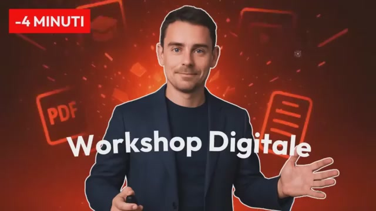

**Testo a schermo (OCR):** -4 MINUTI

> Sottotitoli e revisione a cura di QTSS Sottotitoli e revisione a cura di QTSS

## [00:01:00] Schermata 1 _(periodic)_

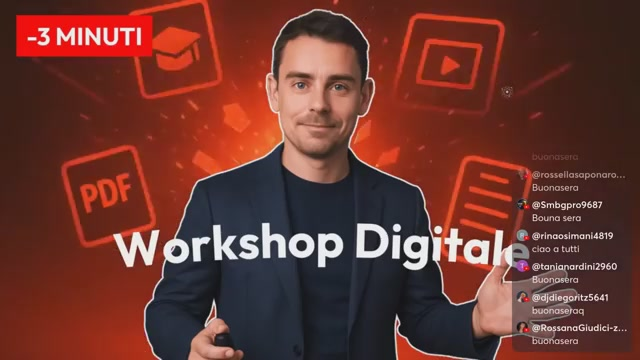

**Testo a schermo (OCR):** -3 MINUTI

> Sottotitoli e revisione a cura di QTSS Sottotitoli e revisione a cura di QTSS

## [00:02:00] Schermata 2 _(periodic)_

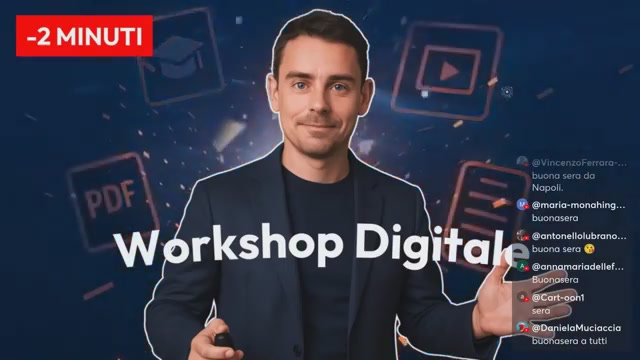

> Sottotitoli e revisione a cura di QTSS Sottotitoli e revisione a cura di QTSS

## [00:03:00] Schermata 3 _(periodic)_

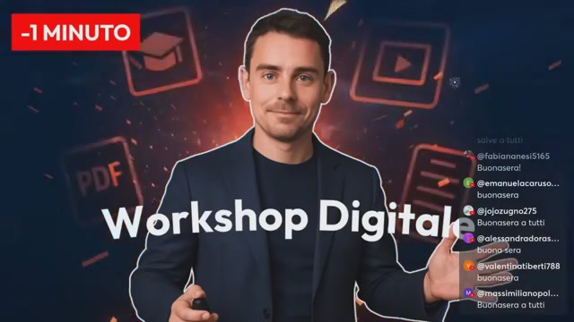

> Sottotitoli e revisione a cura di QTSS Sottotitoli e revisione a cura di QTSS Sottotitoli e revisione a cura di QTSS Sottotitoli e revisione a cura di QTSS Sottotitoli e revisione a cura di QTSS Sottotitoli e revisione a cura di QTSS Sottotitoli e revisione a cura di QTSS Sottotitoli e revisione a cura di QTSS Sottotitoli e revisione a cura di QTSS Sottotitoli e revisione a cura di QTSS Rische ochi questo sanno

## [00:04:00] Schermata 4 _(periodic)_

**Testo a schermo (OCR):** DL. ® agobricutlarcee. Buono sero 0 tutti @ @rosannavitale 00 a tutt ® @AngelloGonnella Buonasera atutti @ @marelincagestino Buonasera È @alessiobalanos457 Buon sera MÈ orrancescoGrazia. buono sera

> sentite niente sembra niente Faccio Canon una cosa pazzesca avete visto ragazzi le prime due live nel frattempo che aspettiamo che si colleghino tutti bonsoir tout le monde anche a te Gabriella buongiorno a tutti ragazzi bentornati in workshop digitale terza live ragazzi di workshop digitale ma quanta roba avete imparato ora voi ditemi scrivetemi nei commenti ragazzi quanta roba avete imparato ditemelo per favore e soprattutto avete capito ragazzi finalmente come l'intelligenza artificiale ci può svoltare la vita in modo serio etico e professionale ragazzi sono stati tre giorni davvero spettacolari perché abbiamo praticamente rivelato come partire con il business dei prodotti digitali partendo da zero like numero uno ve la ricordate abbiamo imparato tantissime cose siamo partiti dal metodo della stanza segreta

## [00:05:00] Schermata 5 _(periodic)_

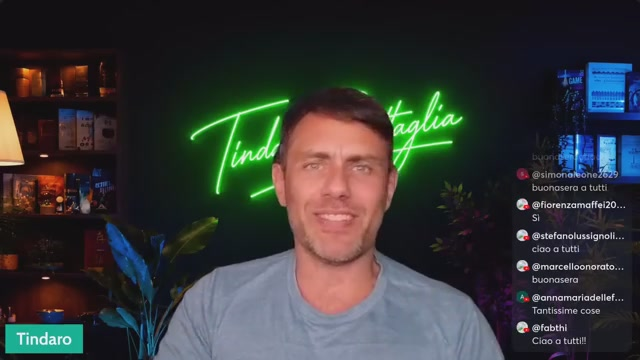

> per cercare nicchie di mercato profittevoli per i nostri prodotti digitali vi ho regalato come primo bonus il prompt che ho utilizzato per fare analisi di mercato e per trovare appunto nicchie di mercato profittevoli con appunto l'intelligenza artificiale c'è stato il workbook della prima giornata ieri ragazzi un'altra giornatona ragazzi siete stati presenti siete stati tutti in focus in tutte e due le live vero? Ieri è stata un'altra giornatona perché nella seconda giornata di workshop digitale abbiamo visto come è possibile creare un prodotto digitale spettacolare grazie all'intelligenza artificiale siamo andati oltre abbiamo visto come realizzare la copertina abbiamo parlato delle nuove innovazioni di CioGPT con CioGPT Work abbiamo visto come si è possibile creare degli storybook direttamente con Gemini con la nuova Gem che è praticamente una roba fuori di testa abbiamo visto anche alcune app vi ho fatto giro a pagare tra le app che ha realizzato il sottoscritto per la sua azienda

## [00:06:00] Schermata 6 _(periodic)_

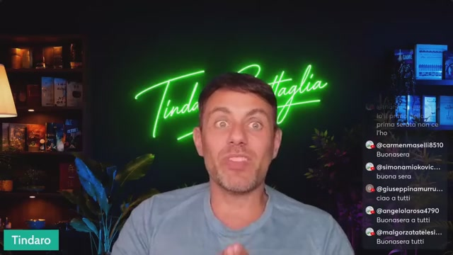

> dimostrandovi ragazzi come i prodotti digitali servono e servono soprattutto nell'istante in cui iniziate a rodare avete bisogno magari di velocizzare quelli che sono i processi aziendali app che ho realizzato io app per realizzare la landing page app per realizzare mockup insomma ragazzi davvero tanta roba che a me serve ovviamente in azienda per velocizzare i vari team ma che voi potreste realizzare comodamente da casa con l'intelligenza artificiale che potreste rivendere o che potreste vendere in abbonamento quindi abbiamo parlato di app vendute direttamente con il codice andiamo a vendere app direttamente per le aziende o magari vendiamo l'abbonamento per utilizzare l'app quindi utilizziamo un cosiddetto software as a service creiamo un software as a service e lo realizziamo ragazzi è tutto con l'intelligenza artificiale senza esperienza senza conoscere una riga di codice praticamente a costo zero ma che cosa volete di più ragazzi cioè è una cosa spettacolare e non è finita qui perché nel frattempo che aspettiamo sia in 231 in questo momento

## [00:07:00] Schermata 7 _(periodic)_

> oggi parliamo completiamo il tassello mettiamo l'ultimo tassello del puzzle di questo bellissimo puzzle che abbiamo visto in questa tre giorni di workshop digitale e parliamo di store come si crea lo store vedremo alcuni esempi di prodotti digitali vedremo alcuni esempi di store vi mostrerò con quale tool si realizza lo store e guarda caso tool che potete iniziare a utilizzare praticamente a costo zero poi parleremo anche di come generare clienti e anche in questo caso ragazzi il prof vi regala la sua strategia che utilizza per generare clienti in organico a costo zero quindi ragazzi ditemi cosa volete di più e poi e poi non è finita qui perché oggi ci sarà un'altra sorpresina ma non vi spoilerò nulla perché vi lascio un attimino col fiato sospeso perché alla fine di questo workshop ci sarà la ciliegina sulla torta va bene va bene ragazzi vedo che siete in 251 in questo momento quindi direi che possiamo anche iniziare facciamo un rapido check nel frattempo che mi umetto le labbra per capire se l'audio è ok

## [00:08:00] Schermata 8 _(periodic)_

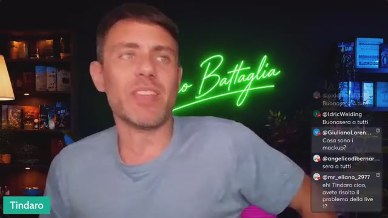

**Testo a schermo (OCR):** La @iriWelding Buonasera o tutti ® eGiulianoLoren... ® Coso sono | mochup? @ Gangelicodibemnar. sera o tutti @ @mr_eiono2977 © ehi Tindoro cao. veto rcoto pelo calo me î

> ecco qualcuno mi diceva che aveva avuto qualche problemino sulla live 1 ragazzi sulla live 1 io ho provato da mac ho provato da windows ho provato da iphone si sente tutto perfettamente sono andato anche all'interno di AI studio o su youtube e c'è bellissimo tutto l'audio con l'onda sonora quindi ragazzi se avete qualche problema con l'audio vi invito a utilizzare un altro browser o magari utilizzare un altro smartphone un altro pc non lo so perché a me funziona benissimo a tutti i miei collaboratori funziona benissimo anche i miei studenti che sono già studenti dei percorsi approfonditi ma ne parleremo anche oggi hanno riguardato un attimino la live ragazzi è andata perfettamente quindi audio e video ok nel frattempo Lucrezia Grazia mi dà il feedback sull'audio ok sì sì ragazzi mi piace creare la suspense assolutamente ok si sente benissimo ripeto si sente tutto ok confermo non si sentiva la prima live ragazzi andate a utilizzare un'altra applicazione non lo so perché a noi si sente tutto perfettamente

## [00:09:00] Schermata 9 _(periodic)_

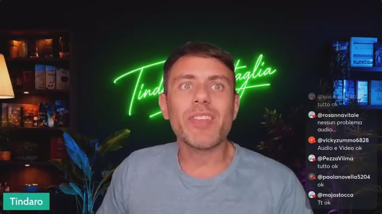

> se io in questo momento vado ad aprire la prima live si sente tutto benissimo allora ragazzi direi di cominciare

## [00:09:08] Schermata 10 _(scene)_

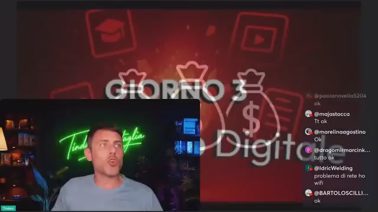

> perché abbiamo davvero tanta roba di cui parlare quindi cortesemente chiudiamo i commenti a schermo ragazzi e partiamo ufficialmente con la terza giornata di workshop digitale però però però ragazzi prima di iniziare

## [00:09:21] Schermata 11 _(scene)_

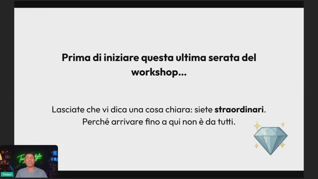

**Testo a schermo (OCR):** Prima di iniziare questa ultima serata del workshop. Lasciate che vi dica una cosa chiara: siete straordinari. Perché arrivare fino a qui non è da tutti.

> lasciate che vi dico una cosa ragazzi siete stati straordinari siete in duecentosettantuno in questo momento siete stati straordinari ma perché siete stati straordinari ragazzi perché non è da tutti arrivare qui voi vi rendete conto del percorso che avete fatto vi rendete conto del percorso ragazzi allora molto probabilmente mi avrete conosciuto attraverso una sponsorizzata di facebook sponsorizzata di facebook in cui c'erano i soliti cretini che dicevano test e corno di tutto è una truffa è tutta una truffa l'intelligenza artificiale è una truffa tinder o battaglia chissà cosa sei mi avevano dipinto come un mostro voi invece avete avuto il coraggio e l'ardire e il focus per guardarvi il percorso sui prodotti digitali accedere direttamente a questo workshop studiare che è la cosa ragazzi più importante molti mi dicono ma se è così facile perché non lo fanno tutti e diventiamo tutti milionari ragazzi perché non è facile vedete in questo workshop abbiamo invitato circa settemila persone quante persone hanno fatto accesso alla fine della terza live

## [00:10:21] Schermata 12 _(periodic)_

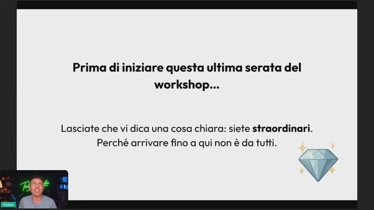

**Testo a schermo (OCR):** Prima di iniziare questa ultima serata del workshop. Lasciate che vi dica una cosa chiara: siete straordinari. Perché arrivare fino a qui non è da tutti.

> 272 quindi ragazzi è facile sì è semplice ma perché non lo fanno tutti perché ragazzi non lo fanno tutti perché c'è chi ha oggi andrà al mare c'è chi andrà a ballare e poi l'indomani era la stessa vita squalida di prima perché ragazzi perché la maggior parte delle persone non ha focus di mantenere la barra dritta e questa è la differenza ragazzi che rende una persona vincente la differenza come dico sempre tra il corridore della domenica e il corridore olimpionico che ha successo e viene riempito di medaglie sta nel fatto che mentre il corridore della domenica quando piove si sta a casa e si beve un tè caldo l'olimpionico ragazzi corre con la pioggia con la neve perché ha nella testa il focus di ottenere un risultato e voi ragazzi che siete qui in 276 in questo momento avete il grande pregio di avere focus e costanza se siete rimasti qui fino a stasera avete avuto la costanza avete mantenuto il focus e questi ragazzi questi sono le uniche due armi

## [00:11:21] Schermata 13 _(periodic)_

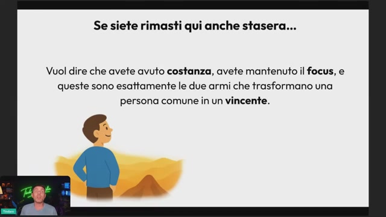

**Testo a schermo (OCR):** Se siete rimasti qui anche stasera... Vuol dire che avete avuto costanza, avete mantenuto il focus, e queste sono esattamente le due armi che trasformano una persona comune in un vincente.

> che trasformano ricordatevelo sempre una persona comune in un vincente focus e costanza ecco perché vi chiedo ragazzi alzate facciamo questo esercizio alzate le vostre mani anche virtuali a schermo e battetele forte ragazzi fatevi un applauso scrivete il vostro applauso nella chat anzi apriamo la chat direttamente a schermo ragazzi fatevi un applauso come non lo avete mai fatto prima ragazzi perché questo applauso ve lo siete meritati siete arrivati fin qui avete avuto focus avete avuto costanza e ripeto focus e costanza sono gli elementi che rendono una persona assolutamente vincente ragazzi davvero davvero complimenti complimenti ragazzi complimenti ragazzi

## [00:12:21] Schermata 14 _(periodic)_

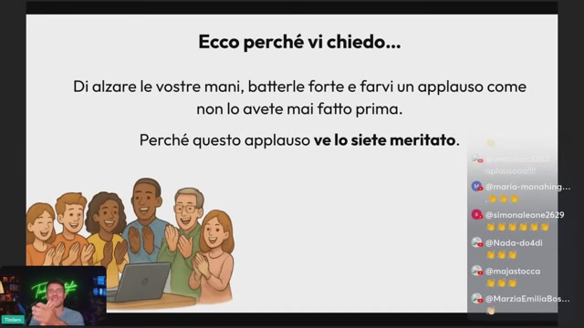

**Testo a schermo (OCR):** Ecco perché vi chiedo... Di alzare le vostre mani, batterle forte e farvi un applauso come non lo avete mai fatto prima. Perché questo applauso ve lo siete meritato.

> complimentissimi bene dai abbiamo anche parlato di questo direi di andare adesso al succo di oggi vediamo di che cosa parleremo oggi ragazzi di che cosa parliamo bene oggi vedremo esempi c'è davvero tanta roba oggi ragazzi quindi attenzione seguitemi come sempre siete stati bravissimi fino ad ora continuate a seguirmi e vi ricordo ovviamente di prendere gli appunti perché anche oggi alla fine di questa live ci sarà una sessione di domande e risposte direttamente con il sottoscritto l'ultima sessione di domande e risposte prima di rivelarvi la sorpresina allora di che cosa parleremo oggi ragazzi vedremo esempi di store digitali che macinano decine di migliaia di euro ogni singolo mese vi mostrerò tutto vi mostrerò store vi mostrerò prodotti digitali vi mostrerò le pagine di vendita vi spiegherò perché funziona vi spiegherò tutto poi vi mostrerò la formula magica del profitto digitale quindi qual è quella formula che ci permette di fare profitti con i prodotti digitali vi mostrerò il tassello del puzzle

## [00:13:21] Schermata 15 _(periodic)_

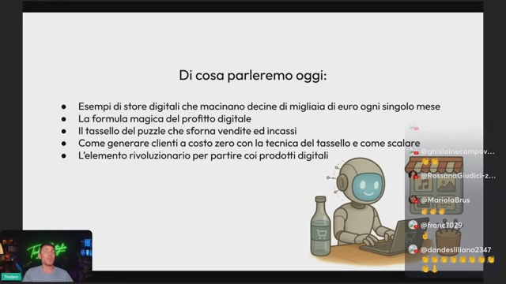

**Testo a schermo (OCR):** Di cosa parleremo oggi: Esempi di store digitali che macinano decine di migliaia di euro ogni singolo mese La formula magica del profitto digitale lltassello del puzzle che sforna vendite ed incassi Come generare clienti a costo zero con la tecnica del tassello e come scalare L'elemento rivoluzionario per partire coi prodotti digitali

> che ci permette di sfornare vendite e incassi a comando vi spiegherò come generare clienti a costo zero con la tecnica del tassello che è una tecnica che ha inventato il prof dopo aver analizzato per anni i social network vi rivelo anche questa cosa gratis e poi vi mostrerò l'elemento rivoluzionario per partire con i prodotti digitali ragazzi ancora un'altra cosa prima di iniziare vi faccio tutte queste premesse perché magari qualcuno sta iniziando ora a seguirsi le live staccate tutte le notifiche utilizzate un piccolo foglio di carta e penna per prendere appunti punto numero due isolatevi in una stanza senza persone o device che possano interrompere la vostra concentrazione se possibile mettete gli auricolari per seguirmi meglio e vi ricordo ancora una cosa estremamente importante che queste live non resteranno a lungo visibili oggi ragazzi è l'ultima live di workshop digitale dopodichè queste live resteranno attive ancora per qualche settimana per qualche giorno due tre giorni dopodichè scompariranno dal mio canale youtube ovviamente non scompariranno i miei video

## [00:14:21] Schermata 16 _(periodic)_

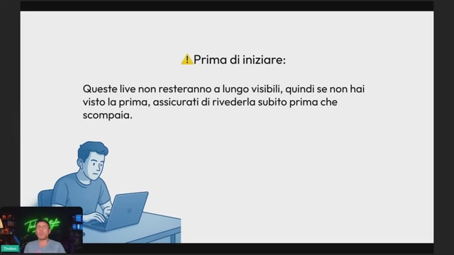

**Testo a schermo (OCR):** 4 Prima di iniziare: Queste live non resteranno a lungo visibili, quindi se non hai visto la prima, assicurati di rivederla subito prima che scompoia.

> anzi mentre ci siamo vi invito fate una bellissima cosa cliccate sul pulsante iscriviti e iscrivetevi subito sul canale youtube per non perdere tutti gli altri video che io realizzerò ma vi ricordo che queste live non resteranno a lungo visibili quindi se non avete visto la prima se non avete visto la seconda se vi perderete questa ragazzi assicuratevi di vederle perché pesano e quindi assicuratevi di vederle subito prima che scomparano bene bonus di oggi alla fine di questa lezione avrete la possibilità di accedere a qualcosa di unico unico nel panorama europeo dei prodotti digitali ma solo Ora, prima di passare nel vivo, ragazzi, apriamo un attimo i commenti e voglio che

## [00:15:01] Schermata 17 _(scene)_

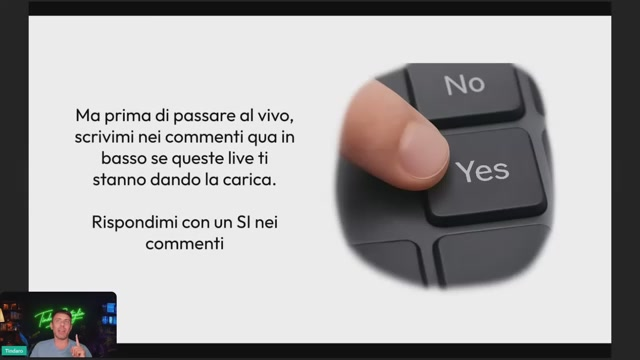

**Testo a schermo (OCR):** Ma prima di passare al vivo, scrivimi nei commenti qua in basso se queste live ti stanno dando la carica. Rispondimi con un SI nei commenti

> se restano attivi e se se se se se se se se se mi diciate se queste live vi stanno dando la carica, se vi stanno dando la carica, se state scoprendo roba nuova, se vi ho anche instillato il germe della curiosità nei confronti di questo eccezionale business che ormai porto davanti dal 2017, 2018, non me lo ricordo neanche più. Ragazzi, rispondetemi con un sì nei commenti. Queste live, ragazzi, vi stanno dando la carica, vi stanno piacendo. Avete capito la praticità di quello che vi sto spiegando? No, perché nella prima live c'era qualcuno che diceva eh, ma questi workshop saranno, questo workshop sarà come quello di tanti altri formatori che non spiegano nulla. No, ragazzi, qui vi avevo detto che vi avrei spiegato praticamente come stenderle in base al vostro business digitale e ho mantenuto la promessa. Siamo partiti dall'analisi di questo. Siamo arrivati alla realizzazione del prodotto digitale con la mia tecnica su Amazon e oggi vedremo come realizzare lo store, vedremo esempi di prodotti digitali, come generare

## [00:16:01] Schermata 18 _(periodic)_

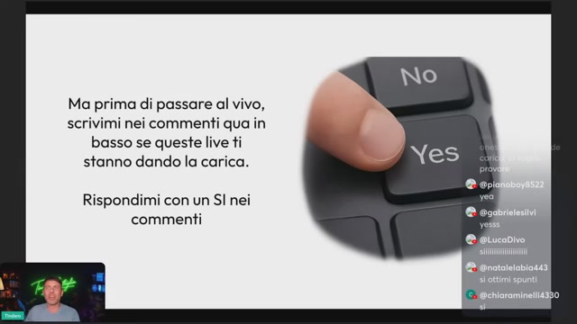

**Testo a schermo (OCR):** Ma prima di passare al vivo, scrivimi nei commenti qua in basso se queste live ti stanno dando la carica. Rispondimi con un SI nei commenti

> i clienti. Ragazzi, davvero tanta, tanta, tanta, tanta, ma quante volte ho detto tanta? Lo ridico ancora, tanta, tanta, tanta roba, ok? Allora ragazzi, siamo in 300 in questo momento, quindi direi che è il momento giusto per iniziare. Allora, abbiamo visto nelle

## [00:16:12] Schermata 19 _(scene)_

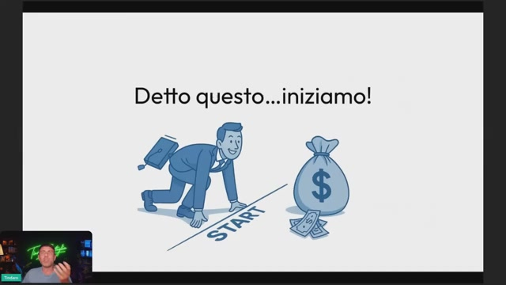

**Testo a schermo (OCR):** Detto questo...iniziamo!

> precedenti live come il business dei prodotti digitali sia quello attualmente più snello e veloce e abbiamo visto anche come l'intelligenza artificiale oggi ci permette di trovare nicchie di mercato profittevoli in pochi istanti per poi realizzare prodotti digitali formidabili in pochi minuti. L'abbiamo visto questo nella live numero uno. Abbiamo visto anche la live numero due, in realtà, come si crea il prodotto digitale. Abbiamo infine compreso come vendere i nostri prodotti digitali e la strategia da seguire per aumentare i margini. In realtà l'abbiamo visto alla fine della live di ieri. Abbiamo visto che la struttura migliore per partire con i prodotti digitali non è il classico Store, non è il classico Shopify con il prodottino da 49 euro, ma è la struttura che segue Ikea, è la struttura che segue Autogrill, è la struttura che abbiamo denominato struttura funnel. Quel percorso vincolato all'interno del quale iniziamo a intraprendere la nostra attività da businessman, quindi

## [00:17:12] Schermata 20 _(periodic)_

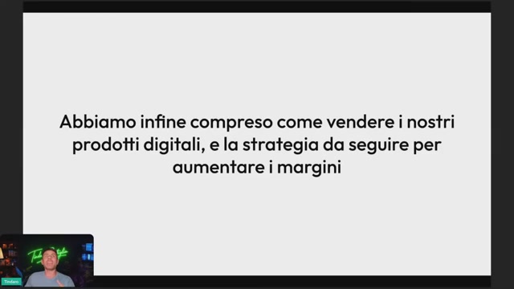

**Testo a schermo (OCR):** Abbiamo infine compreso come vendere i nostri prodotti digitali, e la strategia da seguire per aumentare i margini

> iniziamo a vendere i nostri prodotti digitali. Ora vediamo un attimino alcuni esempi di store di prodotti digitali e vediamo di capire come funzionano. Allora partiamo da questo store

## [00:17:30] Schermata 21 _(scene)_

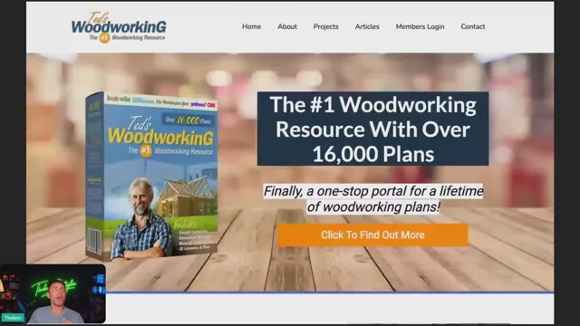

**Testo a schermo (OCR):** The #1 Woodworking Resource With Over 16,000 Plans Finally, a one-stop portal for a lifetime. ‘of woodworking plans

> di prodotti digitali. Riuscite a vederlo in questo momento ragazzi? Questo è uno store che vende come prodotto digitale 16.000 Piani per realizzare progetti in realtà, per realizzare strutture in legno. Ora lo traduciamo ragazzi con Google, ma ovviamente ci potrebbe essere qualche strafalcione, non vi preoccupate perché questo è, ragazzi, la risorsa numero uno per la lavorazione del legno con oltre 16.000 Progetti. Prodotto digitale in inglese che viene venduto perlopiù in Canada, dove ragazzi praticamente le risorse di legno sono infinite. In Canada sono solidi fare questi lavoretti di bricolage e quant'altro, si dilettano con il legno, per cui perché non realizzare un prodotto di questo tipo? BAM,

## [00:18:30] Schermata 22 _(periodic)_

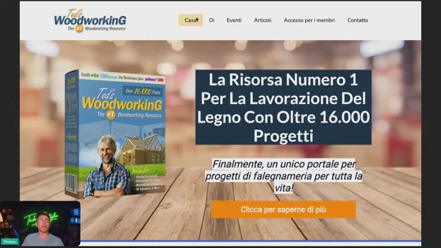

**Testo a schermo (OCR):** Wé6tworkinG Ù Cri Prini Ace menti Cono La Risorsa Numero 1 Per La Lavorazione Del Legno Con Oltre 16.000 Progetti Cd Finalmente, un unico portale perì ‘progetti di falegnameria per tutta la Î Nvitali \ IR) (9)

> questo prodotto ragazzi gira da una marea, da un'infinità di tempo, segno del fatto che è un prodotto estremamente profittevole. Vediamo di che cosa parla. Prendere la lavorazione

## [00:18:37] Schermata 23 _(scene)_

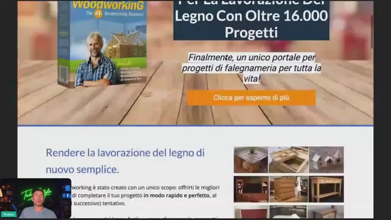

**Testo a schermo (OCR):** Legno Con Oltre 16.000 Progetti Finalmente, un unico portale peri ‘progetti di falegnameria per tutta la vitali N Rendere la lavorazione del legno di nuovo semplice. }oring è sato reso comun nia scopo: tft le mgiori st completare to progetto ln modo rapido e perfetto,

> del legno di nuovo semplice. TedWoods Working è stato creato con un unico scopo, offrirti

## [00:18:41] Schermata 24 _(scene)_

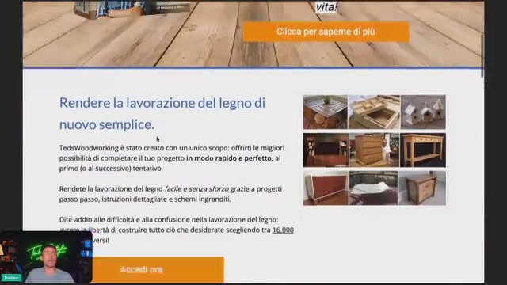

**Testo a schermo (OCR):** Rendere la lavorazione del legno di nuovo semplice. Rendere la lavorazione del egno fc e senza sforzo grazie a proget passo passo struioni dettate e schemi inrancii ite ac alle ifficotà e al confusione nel Lavorazione del legno BB ile puro

> le migliori possibilità di completare il tuo progetto in modo rapido e perfetto al primo o successivo tentativo. Quindi abbiamo 16.000 Tipologie diverse di progetti, piani

## [00:18:51] Schermata 25 _(scene)_

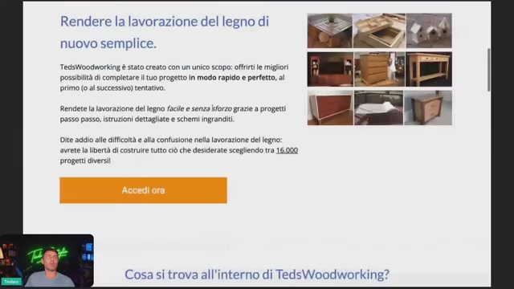

**Testo a schermo (OCR):** Rendere la lavorazione del legno di nuovo semplice. rtmo (0 al successivo) tentato. Rendete i lavorazione delegno face e senza orzo grazie a progetti passo passo sruzionidettgite e schemi imgranciti te ac alle ict ll contusione nella lavorazione del legno: avrete a età di ostruire tuta cò che desiderate scegiendo tra 16.000 proget divers Cosa si trova all'interno di TedsWoodworking?

> mensili a vita, ogni mese potrai scaricare nuovi progetti, tutorial e lezioni di falegnameria, 150 video lezioni premium, quindi anche un videocorso. Abbiamo qui un esempio dei progetti, guardate che la grafica ragazzi di questa pagina di vendita dello store non è che sia proprio eccezionale, però non è bello quello che è bello, dico sempre, è bello quello che converte, cioè quello che fa fare soldi e questo store funziona molto bene anche se non ha una grafica eccezionale. È un po' diciamo un parodosso visto che soprattutto ai giorni d'oggi ragazzi volete avere successo, questo ve lo ripeto, con i prodotti digitali dovete realizzare delle grafiche spettacolari e per quanto riguarda il vostro prodotto digitale e per quanto riguarda lo store, ma questo funziona per cui chi siamo noi per dire che

## [00:19:41] Schermata 26 _(scene)_

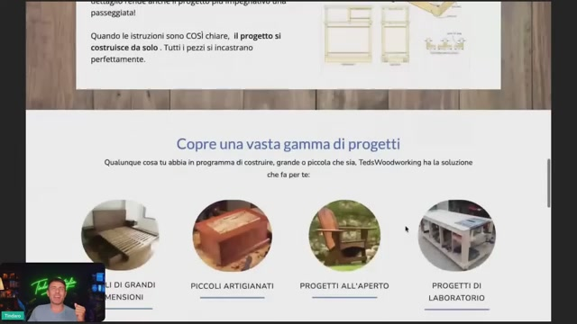

**Testo a schermo (OCR):** passeggiata! ‘Quando le struzioni sona COSÌ hire ll rogetto si costrulse da solo. Tue | pezzi incasrano perfettamente. Copre una vasta gamma di progetti Quale os tu abba programma cosi grane pica che si Teena h La uo tà PICCOLI ARTIGIANATI | | PROGETTI ALL'APERTO proGETTI DI

> la grafica non ci piace, la grafica ci piace perché funziona. Quindi ci dice che copre una vasta gamma di progetti, mobili di grandi dimensioni, piccoli, artigianali, progetti

## [00:19:47] Schermata 27 _(scene)_

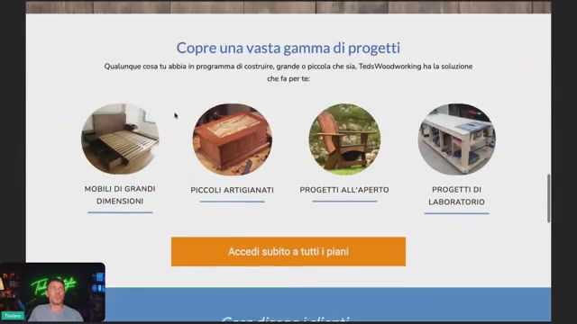

> di laboratorio. Qui abbiamo una sezione sulle riprova sociale, quindi su chi ha già acquistato il prodotto, questa è una parte importantissima che dovete sempre inserire all'interno del vostro

## [00:19:58] Schermata 28 _(scene)_

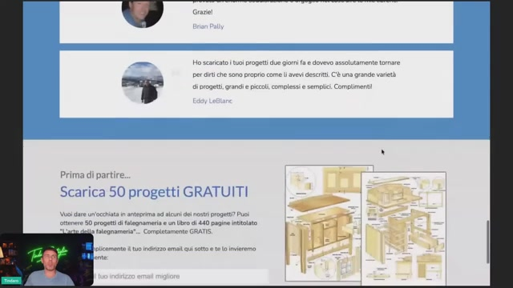

> store e abbiamo la possibilità di scaricare 50 progetti gratuiti. Perché ragazzi? Perché se non siamo pronti ancora ad acquistare, beh molto semplicemente inseriamo la nostra email, chi sta dietro questa pagina e vi faccio notare che nessuno sta riuscendo a comprendere chi si celi dietro questa pagina, quindi siamo di fronte a un business totalmente faceless, senza bisogno di metterci il volto. Che succede? Che noi diamo l'email per accedere a questi 50 progetti, chi sta conducendo questo business digitale essenzialmente riceve la mail e poi attraverso delle automazioni inizia ad inviare delle mail alle persone che hanno chiesto di lasciare il proprio contatto per fare delle sequenze appunto di conversione. Quindi inizialmente vanno a parlare dei benefici del prodotto e attraverso le mail le persone acquistano. Quindi questo è il primo prodotto e devo dire che è molto molto simpatico. Andiamo invece a quest'altro store. Guardate questo

## [00:20:56] Schermata 29 _(scene)_

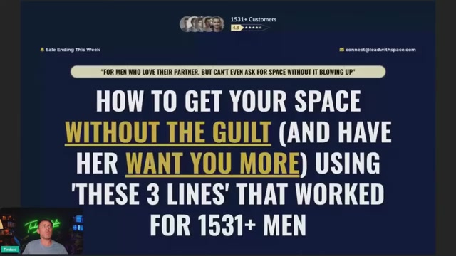

**Testo a schermo (OCR):** ao sc HOW TO GET YOUR SPACE WITHOUT THE GUILT (AND HAVE HER WANT YOU MORE) USING ‘THESE 3 LINES' THAT WORKED ag A FOR 1531+ MEN

> ragazzi. Qui abbiamo la maestria nella realizzazione dello store. Perché? Perché qui abbiamo una cosiddetta pre-headline, quindi abbiamo un titolo sopra il titolo. Questo qui, anche in questo caso con i potenti mezzi della mia azienda traduciamo il tutto, non la selezione, ma voglio tradurre tutto in italiano. Perfetto. Allora,

## [00:21:32] Schermata 30 _(scene)_

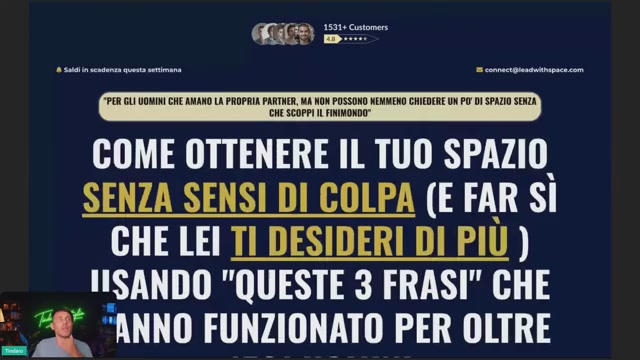

**Testo a schermo (OCR):** COME OTTENERE IL TUO SPAZIO. SENZA SENSI DI COLPA (E FAR sì CHE LEI TI DESIDERI DI PIÙ ) - IISANDO "QUESTE 3 FRASI" CHE n “ANNO FUNZIONATO PER OLTRE

> guardate qui ragazzi. Abbiamo un pretitolo, che è quello giallo, quindi per gli uomini chiamano una prima partner ma non possono nemmeno chiedere un po' di spazio senza che scoppi il finimondo. Maschietti, maschietti, quante persone hanno un problema del genere? Questo ragazzi è un problema molto molto sentito, soprattutto in metropoli come UK eccetera eccetera. Quindi Londra eccetera eccetera. Quindi risolviamo in questo caso il problema di uomini che stanno con una compagna o sono sposati e non hanno più quello spazio che avevano una volta, quando magari erano più liberi. Guardate ragazzi il titolo, che è un titolo che non ci dice che prodotto digitale stiamo realizzando. Ecco mi è partita la telecamera nel frattempo con l'intelligenza artificiale. Vediamo se riesco a eliminarla, perché poi a farla partire ci riesco, ma poi quando si tratta di bloccarla non ci riesco più. Vabbè ragazzi, non ci riesco. Vi

## [00:22:32] Schermata 31 _(periodic)_

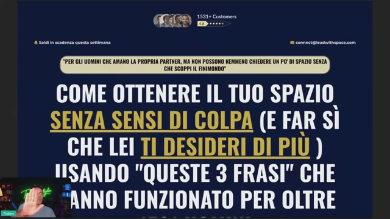

**Testo a schermo (OCR):** COME OTTENERE IL TUO SPAZIO. SENZA SENSI DI COLPA (E FAR sì CHE LEI TI DESIDERI DI PIÙ ) - IISANDO "QUESTE 3 FRASI" CHE sw 4 “ANNO FUNZIONATO PER OLTRE

> faccio notare che il titolo ragazzi è un titolo che non mostra il prodotto digitale che stiamo realizzando. Cioè non ci sta dicendo questo ebook o questo videocorso. Noi fino ad ora non sappiamo nulla nel titolo di che cosa acquisteremo. Perché? Perché questo è un titolo fatto benissimo ragazzi, va a risolvere un problema, il problema di mercato di questo target. In questo caso ci dice che cosa? Ci dice come ottenere il tuo spazio senza sensi di colpa e far sì che lei ti desideri pure di più. Quindi ragazzi doppio vantaggio, non solo di ottenere lo spazio ma far sì che anche lei desideri di più. Usando queste tre frasi che hanno funzionato per oltre 1531 uomini. Ragazzi chapeau! Ma voi vi rendete conto del gran titolo che è stato realizzato in questa line in pay. Ragazzi davvero qualcosa di assolutamente fenomenale. Ok? Quindi fino a qui non abbiamo neanche idea di cosa acquistiamo ma ha attirato l'attenzione se noi abbiamo il nostro problema. E vi ricordo che il titolo deve attirare l'attenzione. Andiamo avanti. Unisciti a oltre

## [00:23:32] Schermata 32 _(periodic)_

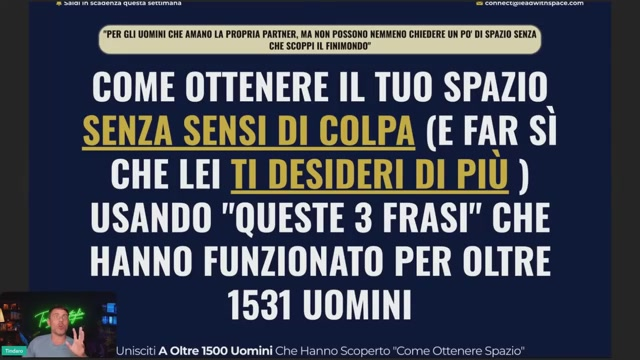

**Testo a schermo (OCR):** COME OTTENERE IL TUO SPAZIO. SENZA SENSI DI COLPA (E FAR sì CHE LEI TI DESIDERI DI PIÙ ) USANDO "QUESTE 3 FRASI" CHE HANNO FUNZIONATO PER OLTRE : 1531 UOMINI cali Unisciti A Oltre 1500 Uomini Che Hanno Scoperto "Come Ottenere Spazio”

## [00:23:35] Schermata 33 _(scene)_

**Testo a schermo (OCR):** SENZA SENSI DI COLPA (E FAR sì CHE LEI TI DESIDERI DI PIÙ ) USANDO "QUESTE 3 FRASI" CHE HANNO FUNZIONATO PER OLTRE 1531 UOMINI Wi (I —————————@—@’@@"emeIG Minc2n0 solo pochi giorni ACTUALLY pa Gi

> 1500 uomini che hanno scoperto come ottenere spazio rendendolo più attraente senza sensi di colpa, senza drammi, senza litigi, solo libertà e rispetto. Abbiamo un prodotto digitale. Vedete

## [00:23:44] Schermata 34 _(scene)_

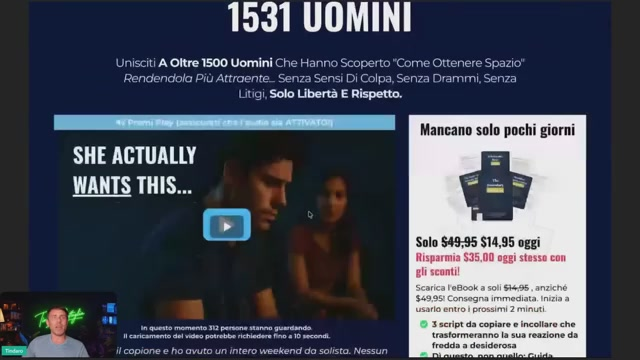

**Testo a schermo (OCR):** 1931 UOMINI Unisciti A Oltre 1500 Uomini Che Hanno Scoperto "Come Ottenere Spazio' ‘Rendendola Più Attraente_ Senza Sensi Di Colpa, Senza Drammi, Senza Litigi, Solo Libertà E Rispetto. Mancano solo pochi giorni SHE ACTUALLY « WANTS THIS.... vi È & Solo 649,95 $14,95 oggi

> questo è il mocap ragazzi. Vedete? Questo dove c'è scritto mancano solo pochi giorni. In basso abbiamo una raffigurazione di tutti i prodotti che possiamo acquistare. Questo è il cosiddetto mocap. Cioè una grafica che possiamo realizzare anche con l'intelligenza artificiale che mostra un po' quello che è il valore che avremo acquistando il prodotto. Solo 14 dollari 95

## [00:24:08] Schermata 35 _(scene)_

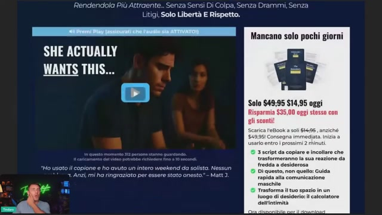

**Testo a schermo (OCR):** Rendendol ‘Senza Sensi Di Colpa, Senza Drammi, Senza Solo Libertà E Rispetto. E 244 Premi By asili ché ru hi ATTIVATO Mancano solo pochi giorni SHE ACTUALLY è WANTS THIS... ri db Solo $49:95 $14,95 oggi

> oggi risparmi 35. Ecco qua iniziamo a capire che si tratta di un ebook. Vedete? Scarica l'ebook a soli 14 e 95 anziché 49 e 95 consegna immediata. Inizia a usarlo entro i prossimi due minuti. Ok? Anche qui abbiamo il pulsante che ci porta a checkout. Abbiamo tutta questa parte che è

## [00:24:23] Schermata 36 _(scene)_

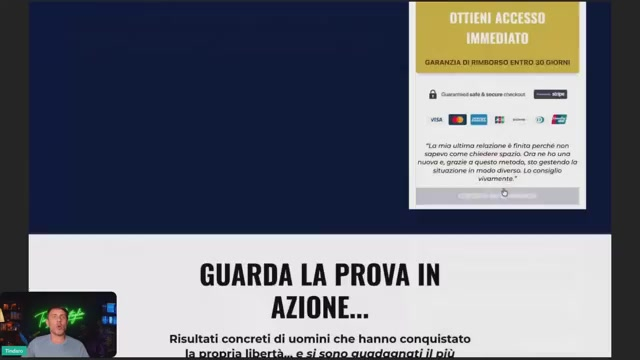

**Testo a schermo (OCR):** OTTIENI ACCESSO IMMEDIATO

> stata realizzata con l'intelligenza artificiale. Qui abbiamo la riprova sociale con persone che

## [00:24:28] Schermata 37 _(scene)_

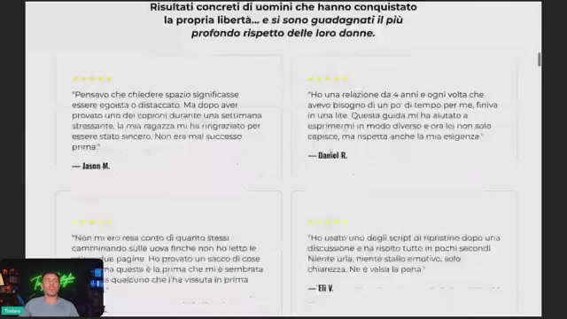

**Testo a schermo (OCR):** suitati concreti di uomini che hanno conqi la propria libertà...e si sono guadagnati il più profondo rispetto delle loro donne.

> hanno lasciato le proprie recensioni. Tutta questa parte ragazzi anche qui qualcuno mi ha detto sì

## [00:24:32] Schermata 38 _(scene)_

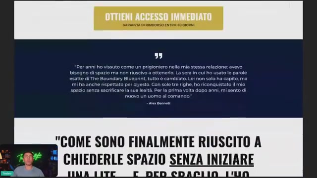

**Testo a schermo (OCR):** DTTIENI ACCESSO IMMEDIATO a COME SONO FINALMENTE RIUSCITO A di CHIEDERLE SPAZIO SENZA INIZIARE

> non sono bravo a scrivere. Soprattutto non sono bravo a scrivere in italiano. Non sono bravo a scrivere in inglese. Non sono bravo a scrivere in aramaico. In quello che volete voi. Come cacchio faccio a crearmi questa scritta del mio store? Bene ragazzi non ci non avrete nessun problema perché ragazzi tendenzialmente ci pensa alla stesura del tutto l'intelligenza artificiale.

## [00:25:03] Schermata 39 _(scene)_

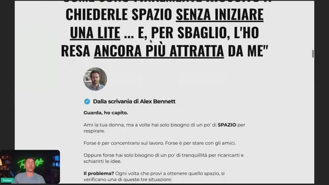

**Testo a schermo (OCR):** CHIEDERLE SPAZIO SENZA INIZIARE UNA LITE ... E, PER SBAGLIO, L'HO RESA ANCORA PIÙ ATTRATTA DA ME"

> Poi abbiamo qui una persona ragazzi questo è il pen name Alex Bennett. In realtà c'è c'è praticamente qualcuno dietro ma non sappiamo chi ci sia e abbiamo un pen name. Quindi una persona fittizia dalla scrivania di Alex Bennett. Ti dice tutto quello che il problema. Vedete nel frattempo relazione e qui abbiamo la strategia precisa per far sì che lei ti rispetti e che rispetti i tuoi limiti invece di combatterli. Tutta questa parte è stata realizzata anche con l'intelligenza artificiale. Una volta che noi abbiamo creato la nostra offerta quindi il

## [00:25:33] Schermata 40 _(scene)_

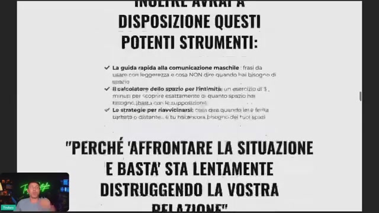

**Testo a schermo (OCR):** DISPOSIZIONE QUESTI POTENTI STRUMENTI: "PERCHÉ ‘AFFRONTARE LA SITUAZIONE E BASTA STA LENTAMENTE DISTRUGGENDO LA VOSTRA

> prodotto iniziale. Vi ricordo che abbiamo parlato di prodotto di frontend, abbiamo parlato di appsell, abbiamo parlato di order bump nella fine della seconda live. Se non avete visto ragazzi la seconda live e soprattutto se non avete avuto il bonus andatevi a guardare la seconda live perché altrimenti vi perdete tanta tanta roba. Ecco qui abbiamo tutta la parte in cui si parla

## [00:25:54] Schermata 41 _(scene)_

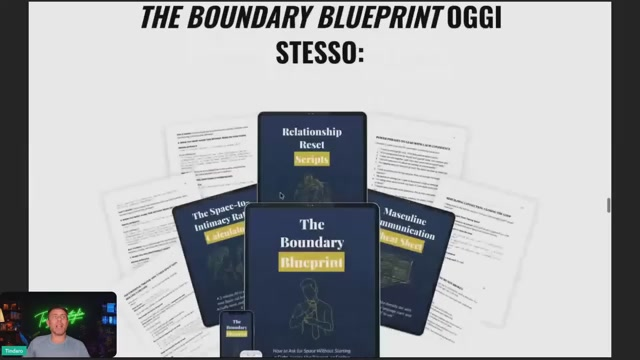

**Testo a schermo (OCR):** THE BOUNDARY BLUEPRINTOGGI STESSO:

> dei prodotti. Quindi soluzione, questo è il mocap, il boundary blueprint, questo è il nome del prodotto, fornisce gli strumenti esatti. Qui ragazzi c'è qualche errore ma non è un errore della lending, cioè non è un errore dello store di chi ha scritto appunto questa pagina ma è un errore di traduzione visto che stiamo traducendo questa lending con google traduttore. Ok quindi che cosa acquisteremo? Sette sceneggiatori potenti, il framework di dominio in tre fasi, tattiche di comunicazione autoritarie, vediamo un po' ancora strumenti per la definizione dei compiti istantanei, inoltre ricevi tre bonus. Di ricordare ragazzi quello che vi ho detto alla

## [00:26:33] Schermata 42 _(scene)_

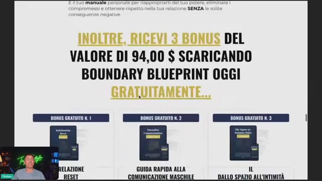

**Testo a schermo (OCR):** DEL VALORE DI 94,00 $ SCARICANDO BOUNDARY BLUEPRINT OGGI

> fine della live di ieri, andiamo a inserire all'interno della nostra offerta quando vediamo il prodotto anche dei bonus che hanno lo scopo di ingolosire l'utente, di renderlo ancora più come dire goloso della nostra offerta e convincerlo ad acquistare. Qui cosa abbiamo?

## [00:26:51] Schermata 43 _(scene)_

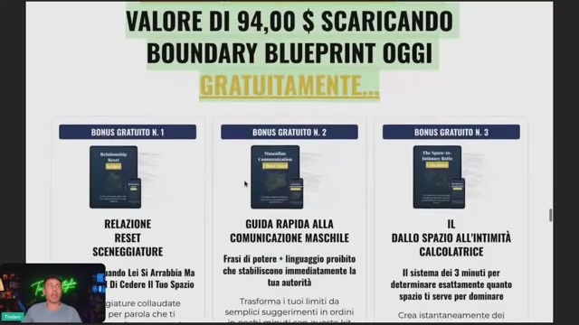

**Testo a schermo (OCR):** VALORE DI 94,00 $ SCARICANDO BOUNDARY BLUEPRINT OGGI RELAZIONE GUIDA RAPIDA ALLA RESET COMUNICAZIONE MASCHILE DALLO pe ALL'INTIMITÀ SCENEGGIATURE Ted a pisa: Ramas pont CALCOLATRICE ano Lira sistema ei 3 minuti per re esattamente quanto servo per doi

> Bonus numero uno, relazione, reset, sceneggiature. Cosa dire quando lei si arrabbia ma tu ti rifiuti c'è del tuo spazio. Bonus numero due, guida rapica alla comunicazione maschile. Bonus numero tre, quindi la calcolatrice che ti dice un foglio di calcolo che ti dica quanto spazio ti serve per

## [00:27:15] Schermata 44 _(scene)_

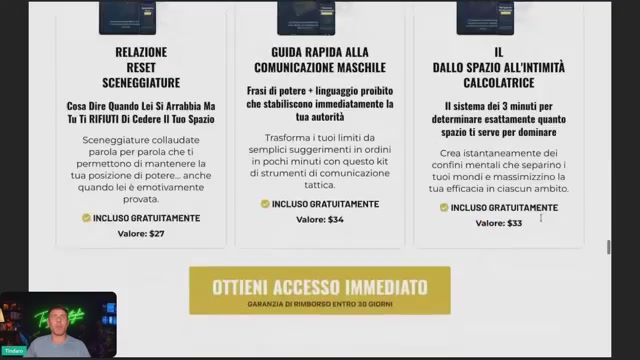

**Testo a schermo (OCR):** RELAZIONE RESET SCENEGGIATURE Cosa Dire Quando Le Si Arrbbia Ma a TI RIFIUTI DI Cedere Tu Spazio neggiature collaudato parola per parola che ti permettono di mantenere la È INCLUSO GRATUITAMENTE Valore: $27 GUIDA RAPIDA ALLA COMUNICAZIONE MASCHILE rasi i potere linguaggio proibito che stabiliscono immediatamente la tun autorità sagerment n ordini © INCLUSO RATUTAMENTE Valore: 36 IL DALLO SPAZIO ALL'INTIMITÀ CALCOLATRICE I sistema dei 3 minuti per determinare esattamente qua spazio i servo per dominare INCLUSO GRATUITAMENTE: OTTIENI ACCESSO IMMEDIATO

> poter dominare la tua lei. In questo caso come vedete lo store ci dice che il tutta senza rischi grazie a nostra garanzia di rimborso al 100% entro 30 giorni. La garanzia ragazzi è un altro elemento che dobbiamo utilizzare perché ci permette di invertire l'onere del rischio. Quindi in questo caso vendendo un prodotto a basso prezzo, nell'istante in cui l'utente già è a basso prezzo quindi le sue difese sono abbastate perché è convinto ad acquistare, se abbiamo trovato il target giusto e fatto leva sul suo problema principale, nell'istante in cui gli diamo anche la garanzia di 30 giorni l'utente acquista. Ok qui abbiamo tutta la parte sempre di problematiche,

## [00:27:48] Schermata 45 _(scene)_

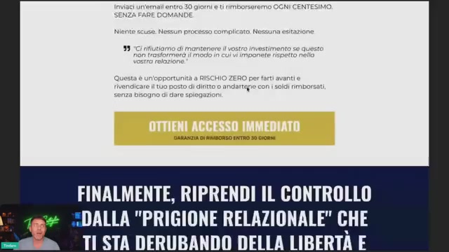

**Testo a schermo (OCR):** FINALMENTE, RIPRENDI IL CONTROLLO “DALLA "PRIGIONE RELAZIONALE" CHE TI STA DERUBANDO DELLA LIBERTA E

## [00:27:52] Schermata 46 _(scene)_

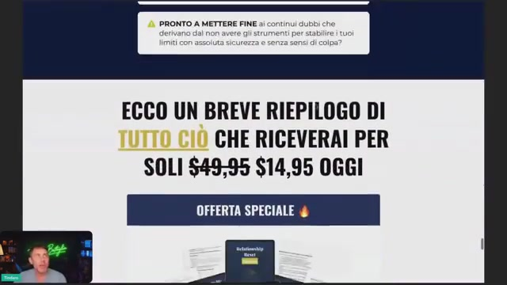

**Testo a schermo (OCR):** ECCO UN BREVE RIEPILOGO DI CHE RICEVERAI PER SOLI $49,95 $14,95 OGGI OFFERTA SPECIALE &

> ecco un riepilogo di quello che si acquista con questo prodotto digitale e poi ragazzi altra sezione quella delle domande frequenti. Vi consiglio di inserirla sempre perché magari

## [00:28:00] Schermata 47 _(scene)_

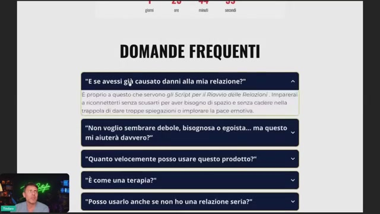

**Testo a schermo (OCR):** DOMANDE FREQUENTI E se avessi già causato danni alla mia relazione?” “Non voglio sembrare debole, bisognosa o egoista... ma questo mi aluterà davvero?” “Quanto velocemente posso usare questo prodotto?"

> qualcuno, qualche cliente a qualche domanda non trova risposta nella pagina di vendita e quindi

## [00:28:08] Schermata 48 _(scene)_

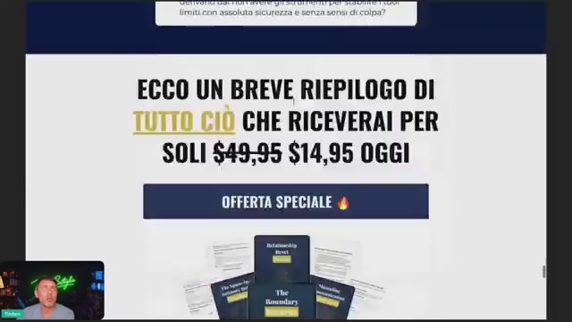

**Testo a schermo (OCR):** ECCO UN BREVE RIEPILOGO DI CHE RICEVERAI PER SOLI $49;95 $14,95 OGGI OFFERTA SPECIALE @

> non acquista, se magari non avete un pop-up con il quale si possono fare domande, lui non acquista.

## [00:28:17] Schermata 49 _(scene)_

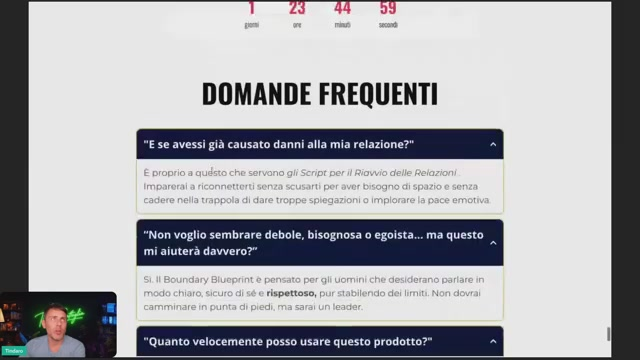

**Testo a schermo (OCR):** DOMANDE FREQUENTI ‘Non voglio sembrare debole, bisognosa o egoista... ma questo _ mi aiuterà davvero?”

> Allora andate a inserire tutte le vostre domande. Che tipologia di domande frequenti inseriamo? Allora il mio consiglio è questo, è un consiglio molto pratico. Insegnatevelo perché vi servirà. Partiamo da una lista di domande frequenti che possiamo generare con l'intelligenza artificiale, poi man mano che gli utenti acquistano il nostro prodotto possiamo mandare dell'email per chiedere se hanno avuto problemi durante l'acquisto, se c'era qualcosa che non avevano trovato nello store e man mano che riceviamo i feedback andiamo ad inserire ulteriori domande risposte all'interno dello store. Segnatevi ragazzi questa chicca perché è una chicca interessantissima e man mano che andrete ad inserire sempre più domande e risposte alle domande ovviamente quello che succede è che lo store converte quindi genera sempre più profitto. Stiamo fino a qua ragazzi? Mi state ascoltando? Siamo in 337 in questo momento. Ok ok ok ok allora segnatevi tutte le vostre domande perché alla fine ci sarà una sessione di Q&A, quindi una sessione live con me all'interno della quale

## [00:29:17] Schermata 50 _(periodic)_

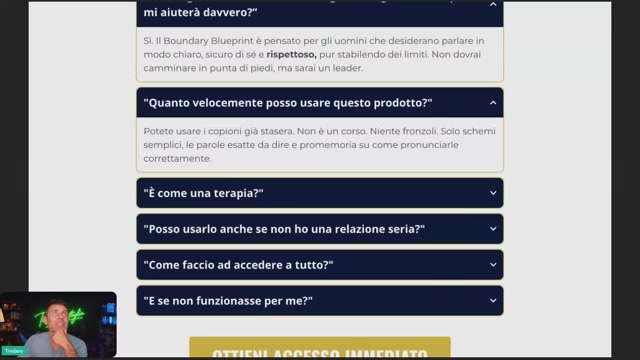

**Testo a schermo (OCR):** mi aiuterà davvero?” “Quanto velocemente posso usare questo prodotto?* n

> risponderò a tutte le vostre domande. Andiamo a vedere questo ragazzi che è bellissimo, un prodotto digitale per i fuffa guru. Ora vi mostro pure questo. Guardate che bello ragazzi,

## [00:29:25] Schermata 51 _(scene)_

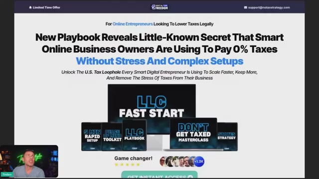

**Testo a schermo (OCR):** for Looking To Lower Tres Legal New Playbook Reveals Little-Known Secret That Smart Online Business Owners Are Using To Pay 0% Taxes @Uioek The LS. Tax Loophole Every Smrt Dig Eirepreneu ls Using To Scol Foster, Keep Mor, “A Remove The Stress Of Tax From Trek Business C) FAST START

> questo è per tutti i fuffa guru che si fanno una settimana a Dubai, si fanno il reportage fotografico, fanno finta di stare a Dubai, magari si fanno una società all'estero per fare esterovestizione e poi magari tornano a Milano o tornano in Italia, ho detto Milano, mi avrei scappato. Tornano in Italia e essenzialmente fanno esterovestizione facendo vedere i loro reel a Dubai eccetera eccetera. Bene mi sono spogato, lasciate che mi spogassi perché pagando io un botto di tassi In Italia, vedere certe cose soprattutto in... Vi invito anche a guardarlo se state su Facebook o su YouTube, molto spesso ci sono i vari guru e guretti che vi dicono che hanno la soluzione ai vostri problemi, scorrete in basso e andate a guardare quale è l'azienda. 49% Dei casi stilizi stanno in Italia e hanno la LLC in Delaware, la società FZE a Dubai. Chissà come mai, chissà come mai. Vabbè, comunque, leviamoci questo sassolino dalla scarpa e andiamo avanti. Che cosa tratta questo prodotto digitale?

## [00:30:25] Schermata 52 _(periodic)_

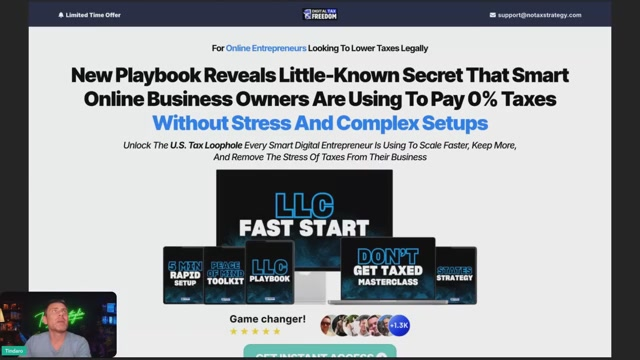

**Testo a schermo (OCR):** ti Looking To Lower Tases Legal New Playbook Reveals Little-Known Secret That Smart Online Business Owners Are Using To Pay 0% Taxes Unioek Tre LS. Tax Lagphole Every Smot Diga Entrepreneu Is Using To Scol Fast Keep Mot, ‘Ad Remove The Stress Of Texes From net Business C) FAST START

> Allora, for, lo leggiamo dal inizio, for online entrepreneurs looking for lower taxes legally, cioè per imprenditori online che cercano di abbassare le tasse legalmente. Allora, che cosa dice? Tradotto per i non anglofoni, diciamo, allora, per gli imprenditori online che desiderano ridurre le tasse in modo legale, vedete, un nuovo manuale, quindi questo titolo già ci spiega cosa acquisteremo, quindi è un playbook, un manuale,

## [00:31:05] Schermata 53 _(scene)_

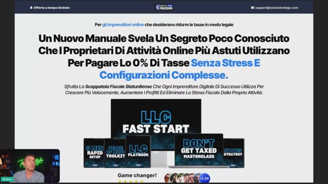

**Testo a schermo (OCR):** per che edera ur le tasse modo legale Un Nuovo Manuale Svela Un Segreto Poco Conosciuto ChelProprietari Di Attività Online Più Astuti Utilizzano PerPagare Lo 0% Di Tasse Sf Lo Scappotol cale Statunitense Che Ogni imprenditore Dita DI Successo Utizza Per Crescere Più Velocemente, Aumentre Prof E Elminore Lo Sress Fisco Do Propro At (CI FAST START

> svela un segreto poco conosciuto che le proprietà di attività online più astuti utilizzano per pagare lo 0% di tasse senza stress e configurazioni complesse. Qui in basso sfrutta la scappatoria fiscale statunitense che ogni imprenditore digitale successo utilizza per crescere più velocemente, aumentare i profitti e eliminare lo stress fiscale dalla propria attività.

## [00:31:40] Schermata 54 _(scene)_

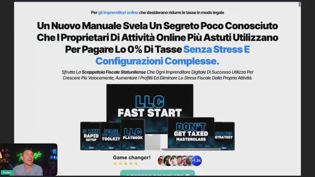

**Testo a schermo (OCR):** por ce idea ro z modo ge Un Nuovo Manuale Svela Un Segreto Poco Conosciuto ChelProprietari Di Attività Online Più Astuti Utilizzano Per Pagare Lo 0% Di Tasse Sf Lo Scappatol Fiscale Statunitense Che Ogni mprendiore Digi DI Successo tizza Per Crescere Più Velocemente, Aumentre Profit Ed Elmore Lo Stress Fiscale Doo Proprio Ati.

> Bene, qui abbiamo l'accesso immediato, il costo è di solo 47 dollari, qui abbiamo tutta una parte, anche in questo caso, di scrittura che è stata realizzata con l'intelligenza attiviciale, ma anche la grafica, ragazzi, poi vi mostrerò come si realizza con l'intelligenza attiviciale perché vi mostrerò tenenzialmente tutto, come funziona, come realizzano queste pagine, qui ci spiega quali sono le soluzioni che risolve questo prodotto digitale,

## [00:31:58] Schermata 55 _(scene)_

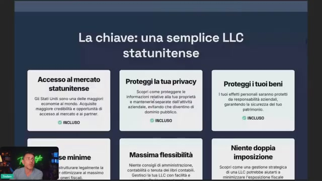

**Testo a schermo (OCR):** La chiave: una semplice LLC statunitense Accesso al mercato Proteggi la tua privacy Proteggi tuoi beni

## [00:32:03] Schermata 56 _(scene)_

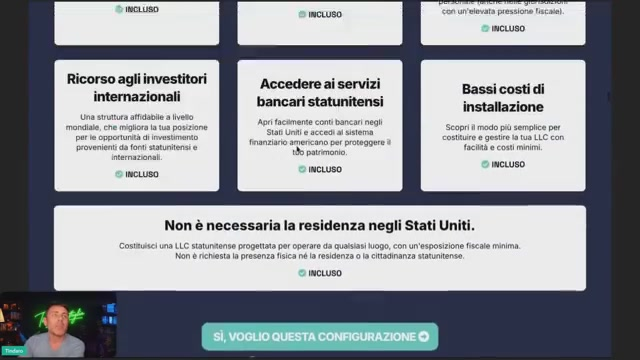

**Testo a schermo (OCR):** mciuso: Ricorso agli investitori Accedere ai servizi internazionali bancari statunitensi Bassi costi di installazione

> qui abbiamo tutta una parte di agitazione del problema, nella strategia senza tasse scoprirai il decodificatore del codice tributario degli Stati Uniti, la strategia di costituzione societaria, ma penso un po', il progetto approva gli audit, il metodo di ottimizzazione delle spese, il sistema di configurazione da 5 minuti, l'approccio vantaggio fiscale internazionale, la guida protezione del fatturato, tecniche di dichiarazione senza stress, il kit tranquillità assoluta, il manuale per le LLC.

## [00:32:33] Schermata 57 _(scene)_

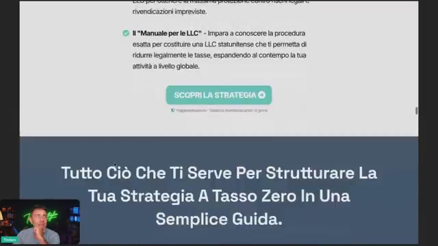

**Testo a schermo (OCR):** ii Ti rivendicazioni impreviste. "Manuale perle LLC" - impara a conoscere a proceciura esatta per costituire una LLC statunitense cheti permetta di iure legalmente le tasse, espandendo a contempo la tua ativtà a velo globale. Tutto Ciò Che Ti Serve Per Strutturare La Tua Strategia A Tasso Zero In Una Semplice Guida.

> Tutto ciò che ti serve per strutturare la strategia a tasso zero in un'unica, semplice guida. Questa non è la solita guida alle scappatoie, questo approccio si basa sulla struttura legale, semplificata, che se applicata correttamente, aiuta ad oltre 600 imprenditori digitali a ridurre o eliminare il carico fiscale.

## [00:32:46] Schermata 58 _(scene)_

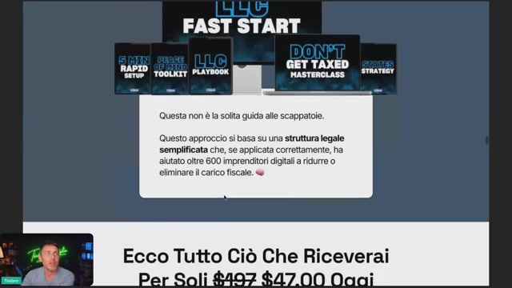

**Testo a schermo (OCR):** FAST START RS GET TAXED MaSTEROLASS cappatole. ja su una struttura legale jpplicata correttamente, ha Ecco Tutto Ciò Che Riceverai nai Î = 47000 ti

> Qui ci dice quanto costa e guardate un po', ragazzi, qui ricorre la strategia che vi ho spiegato nella live. Numero due, bonus, bonus e ancora bonus. 47 Dollari per il prodotto. Abbiamo, vediamo un po', quindi il manuale per le LLC, questo è il prodotto, vi ricordate come si chiama? Dai, facciamo un po' di interrogazione, ragazzi, come si chiama il prodotto iniziale che si vende? L'abbiamo visto nella live di ieri, che è questo in questo caso, ragazzi, il manuale della LLC. Come si chiama?

## [00:32:52] Schermata 59 _(scene)_

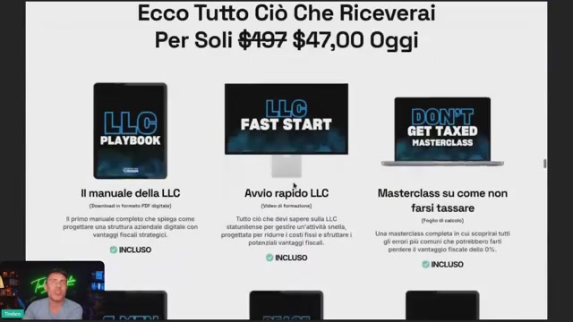

**Testo a schermo (OCR):** Ecco Tutto Ciò Che Riceverai Per Soli $497 $47,00 Oggi Il manuale della LO Avvio rapido Le Masterclass su come non farsi tassare

## [00:33:01] Schermata 60 _(scene)_

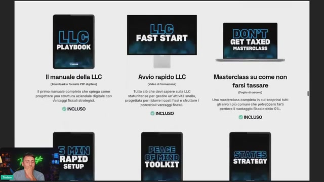

**Testo a schermo (OCR):** ll manuale della LLC Avvio rapido LLC Masterclass su come non i a i farsi tassare TOOLKIT

> Come si chiama, ragazzi, il prodotto iniziale che vendiamo? Forza, forza, nel funnel. L'abbiamo visto nella live numero due, se restate attenti. Bravissimi, brava Ale, brava Paola. Prodotto di front-end, bravissimi, vedo che mi seguite ed è una soddisfazione incredibile vedere che mi rispondete perché significa che spiego abbastanza bene. Dai, grazie, grazie, grazie, ragazzi. Allora, manuale della LLC, questo è il prodotto di front-end, quello che mostriamo all'inizio e che ingolosisce l'utente. Ma non solo questo, perché abbiamo dei bonus. Avvio rapido della LLC, tutto ciò che devi sapere sulla LLC, quindi questo è un video. Masterclass su come non farsi tassare, una masterclass completa in cui scoprirai tutti gli errori più comuni che potrebbero farti perdere il vantaggio fiscale dello 0%.

## [00:34:01] Schermata 61 _(periodic)_

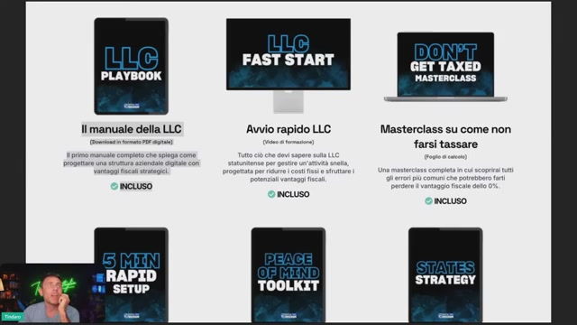

**Testo a schermo (OCR):** ll manuale della LLC Avvio rapido LLC TOOLKIT GET TAXED MASTERCLASS Masterclass su come non farsi tassare STRATEGY

## [00:34:06] Schermata 62 _(scene)_

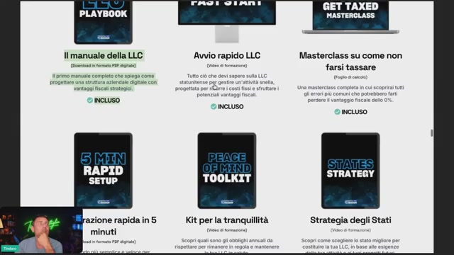

**Testo a schermo (OCR):** ll manuale della LLC Avvio rapido LLC Masterclass su come non lena Sesto farsi tassare Strategia degli Stati

> Configurazione rapida in 5 minuti, kit per la tranquillità, strategia degli Stati Uniti. Ragazzi, davvero tanta, tanta roba. Tutto questo infatti vi dice per soli 47 dollari. E come non si fa a comprare tutto questo per soli 47 dollari? Prezzo basso, problema agitato, come pagare 0% di tasse in modo del tutto legale. Ragazzi, la vendita direi che è quasi automatica. Infatti anche questo store gira da moltissimo tempo, vi ho dato già qualche nicchia di mercato che potete iniziare a odorare per creare il vostro prodotto digitale. Allora, qui ci spiega perché gli Stati Uniti sono nel paradiso fiscale. Qui abbiamo, come vedete, anche in questo caso, ragazzi, riprova sociale, persone che hanno già acquistato questo prodotto. Anche in questo caso vi faccio notare una cosa. Non si sa chi c'è dietro. Ragazzi, c'è un volto, c'è qualcuno che sta parlando del prodotto digitale, lo sta spiegando, qualche personal brand. No, ragazzi, non c'è assolutamente nessuno. È un brand faceless, totalmente no face.

## [00:34:38] Schermata 63 _(scene)_

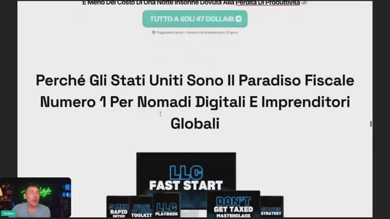

**Testo a schermo (OCR):** Perché Gli Stati Uniti Sono Il Paradiso Fiscale Numero 1 Per Nomadi Digitali E Imprenditori Globali [ FAST START

## [00:34:43] Schermata 64 _(scene)_

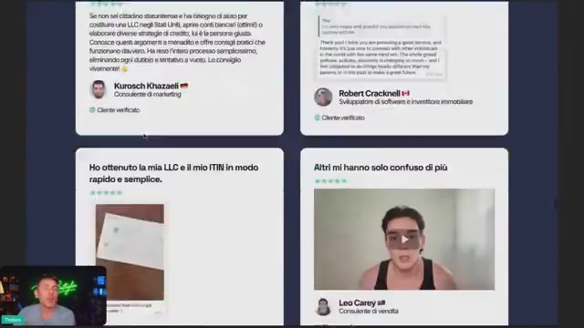

**Testo a schermo (OCR):** © rurosenictrazzetm Ho ottenuto a mia LLC e im IN modo Altri mi hanno solo confuso di più rapido e semplice.

## [00:34:48] Schermata 65 _(scene)_

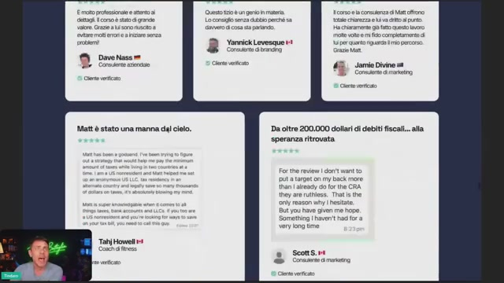

**Testo a schermo (OCR):** © ponte Matt è stato una manna dal ciao. dt AR; dario vino sa Da oltre 200.000 dollari i debiti fiscali. speranza ritrovata è sens

## [00:34:55] Schermata 66 _(scene)_

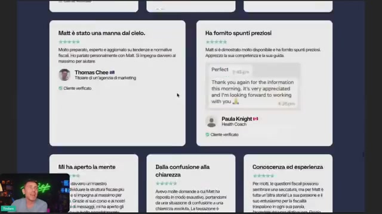

**Testo a schermo (OCR):** Mtttà stato una manna dal leo. Ha fomito spunti preziosi Thomas Choe si Conoscenza ed esperienza

## [00:35:02] Schermata 67 _(scene)_

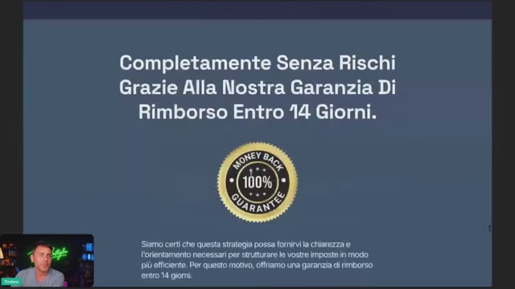

**Testo a schermo (OCR):** Completamente Senza Rischi Grazie Alla Mostra Garanzia Di Rimborso Entro 14 Giorni. Simo centi che questa strategia possa omivi la chiarezza e l'orentamento necessari per struttrare e vostre imposte m modo più lfcente. Per questo moto; ofiamo una garanzia di rmborso entro 14 gioni

> Abbiamo una garanzia di rimborso entro 14 giorni, siamo certi, e questa strategia possa fornirvi la chiarezza e l'orientamento necessari per strutturare i vostri imposti in modo più che efficiente.

## [00:35:16] Schermata 68 _(scene)_

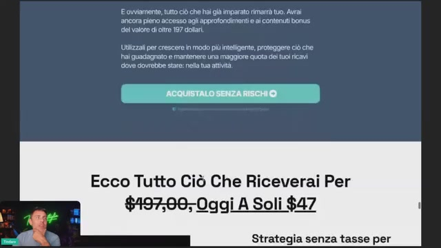

**Testo a schermo (OCR):** ACQUISTALO SENZA RISCHI © Ecco Tutto Ciò Che Riceverai Per $197,00;Oggi A Soli $47 Strategia senza tasse per

> Ok, qui abbiamo il recap. È ottimo fare un recap di questo tipo, in modo tale che chi è arrivato alla fine, ragazzi, della pagina molto probabilmente è molto interessato, quindi si fa un recap per ingolosire l'utente. E poi abbiamo una sezione, anche in questo caso vi ricordate, di domande frequenti. Domande frequenti che hanno lo scopo di eliminare quelle che possono essere le obiezioni che allontanano l'utente dall'acquisto del prodotto.

## [00:35:20] Schermata 69 _(scene)_

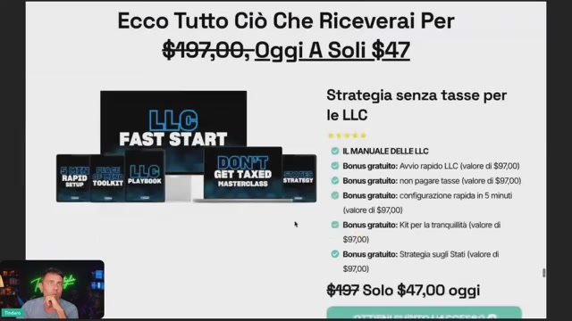

**Testo a schermo (OCR):** Ecco Tutto Ciò Che Riceverai Per $197,99- Oggi A Soli $47 Strategia senza tasse per le LLC ILMANUALE DELLE LC Bonus gratuito: Avi rapido LL (valore di 50700) Bor gratito: n pagare tasse (oe ci 9700) Bonus grato: coniquazne rat 5 mr (noe 9700) Lo FAST START \ Bonus gratuito: Kt per a onu (ire 59700) Bonus gratuito: Stat sui Su valore di s0100) $497 Solo $47,00 oggi

## [00:35:28] Schermata 70 _(scene)_

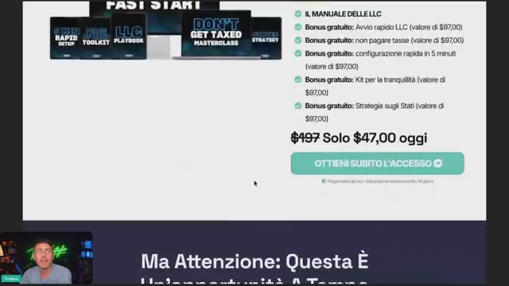

**Testo a schermo (OCR):** ILMANUALE DELLE LE Bou orto: i rapido LLC (valore di 58700) Bonus gratuito: non pagare tasse (lore 159700) Bonus gratuto: coniquazione rapita mr (air 19700] Bonus gratuto: Kt pra anquità valore di 59700) Bonus gratuito: Sratega sui Si valore di 59700) $497 Solo $47,00 oggi : Questa È PRISON

> Ci siamo, ragazzi, fin qui? Mi state seguendo? State capendo tutto? Sono abbastanza chiaro? Sto parlando troppo veloce? Sto parlando con termini troppo tecnici? No, ragazzi, mi sembra che fino ad ora è tutto molto semplice, non trovate? Benissimo. Ora, qualcuno mi ha detto, qualcuno mi ha detto, mi ha detto Tinder, ma io in questo WhatsApp sono capitato perché ho visto la tua sponsorizzata, sono un consulente, sono un formatore, ho visto che questa strategia si può utilizzare per brand no face, ma mi piacerebbe creare un mio brand, perché ho una determinata expertise, ragazzi, ho tantissimi studenti che orbitano il settore della formazione e vogliono creare il loro personal brand.

## [00:36:28] Schermata 71 _(periodic)_

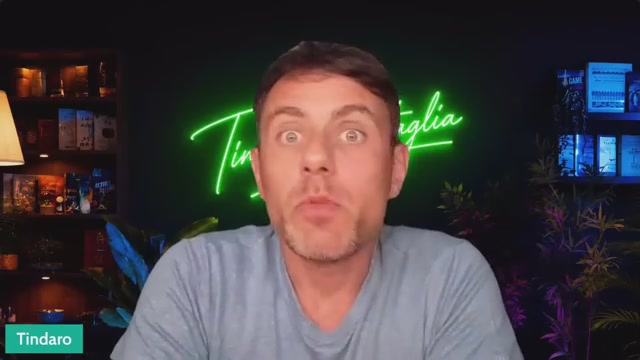

> Io non sono interessato a un, come dire, un brand no face, quindi sono interessato a metterci la faccia perché sono un formatore e mi piacerebbe capire se è possibile applicare questa strategia per il mio percorso di formazione, per il mio percorso di coaching, ci sono tantissimi coach che mi seguono, tantissimi formatori, tantissime persone che fanno info marketing, ragazzi, che vendono informazioni sia online che offline. Bene, vi mostro un esempio di come applicare la strategia che vi sto spiegando per il vostro personal brand, quindi se c'è qualche, siete in 330 in questo momento, sarà sicuramente, anzi, ragazzi, ditemi se c'è qualche formatore, apriamo un attimo i commenti, ragazzi, se c'è qualche formatore, qualcuno che fa info marketing, qualche consulente, qualche coach, qualche imprenditore digitale che vende formazione nei più svariati ambiti, ragazzi, fatemelo sapere perché ora vi mostro

## [00:37:28] Schermata 72 _(periodic)_

**Testo a schermo (OCR):** | I) Ma sembra solo 0 me che su questi duo sii 0 non comprerei mai rente proprio do ‘ome sono fotti & @ otovthi tutto molto choro © egiuseppinomur... molto chiaro ed @ Gobsolutindigo

> come è possibile applicare la stessa esatta strategia che fino ad ora vi ho spiegato per creare un brand faceless in modo totalmente incentrato su quello che è il vostro brand e questa è una chicca molto interessante. Allora, Davide ST, consulente e formatore, eccomi, ciao alle 4chat, formatrice, ciao Michela, formazione offline, beh, del resto è i coaching experience, psicologo e coach, ciao Claudia, come va, tutto ok? Nutrizionista, abbiamo un'altra consulente, insomma, ragazzi, devo dire che c'è qualche coach, qualche formatore che mi sta seguendo in questo momento, bene, ragazzi, ora vi spiego, anzi, vi mostro un esempio di come applicare questa strategia che vi ho spiegato fin ad ora, come vedete, totalmente faceless, perché non c'è nessuno dietro, non si vede nulla dietro se non magari un pen name, come applicarla alla vostra attività di coach, consulente e formatori, perché, ripeto, la strategia che vi spiego va benissimo, potete utilizzarla per generare profitto anche con la vostra attività.

## [00:38:28] Schermata 73 _(periodic)_

**Testo a schermo (OCR):** @ @pianoboy8522 Nutrizionista GrgidioAiessandro... ta Gilorioposin60S 0 e mio marito che è docente madrelingua frestonca di Inglese mentre i li seguo “orsi slfstud @notalelobio443 consulente politico

> Quindi si parte da un prodotto di front end che ha un basso prezzo, per poi andare a far scalare la scala del valore con successivi prodotti, una volta che l'utente acquista il primo prodotto, bene, questi prodotti hanno un prezzo sempre maggiore. In questo modo noi cosa facciamo? Punto numero uno, andiamo a recuperare le spese del traffico, quindi se noi, per esempio, mettiamo dei prodotti e mediamente gli utenti del vostro personal brand acquistano prodotti per circa 60 dollari, se noi generiamo una vendita con 30 dollari, non solo stiamo recuperando le spese del traffico, ma stiamo anche guadagnando 30 dollari. Quindi è tutto grasso che cola, acquisiamo clienti e poi possiamo vendere offerte in back end da 1.000, 2.000, 5.000, 10.000, 15.000 Dollari, scusate che ho ragione in dollari perché è basico anche molto spesso nel mercato americano, ma 5, 10, 15.000 Euro le possiamo vendere attraverso questa strategia, quindi generiamo clienti, molto spesso li generiamo a costo zero, molto spesso li generiamo anche guadagnandoci qualcosa per poi andare a vendere la nostra attività da formatori. Vi mostro subito un esempio, guardate sempre questo ragazzi, quindi stacchiamo un attimino per favore i commenti, allora guardiamo qui, qui abbiamo how to quietly outsell your competition in 2026, quindi andiamo a tradurre anche in questo caso la nostra pagina.

## [00:39:28] Schermata 74 _(periodic)_

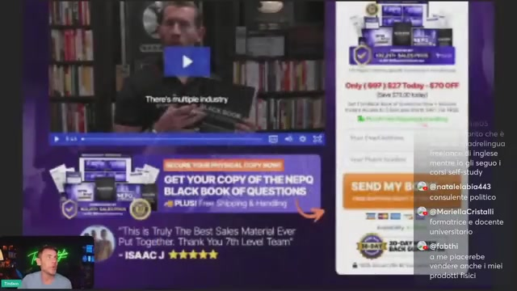

**Testo a schermo (OCR):** pia Béox

## [00:39:34] Schermata 75 _(scene)_

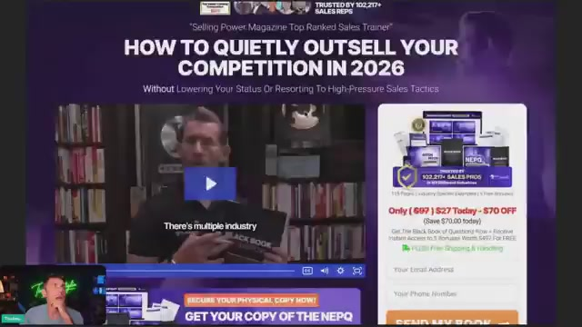

**Testo a schermo (OCR):** HOW TO QUIETLY OUTSELL YOUR c TITIO! 2026 sure Sales TacheR

> Come vedete ragazzi la struttura è esattamente identica a quella che abbiamo visto nelle altre lending, ok? Quindi miglior formatore di vendita secondo la rivista Selling Power, questa è un'offerta esclusiva per, come dire, è un'offerta esclusiva per gli americani. Quindi come superare silenziosamente la concorrenza nel 2026 senza abbassare il tuo status o ricorrere a tecniche di vendita aggressiva. Abbiamo un prodotto che costa 27 dollari solo per oggi, 70 dollari di sconto, qui possiamo inserire il nostro indirizzo di posto elettronico, il numero di telefono e in questo caso lui invia anche la copia cartacea ma fino a qualche tempo fa inviava solamente il prodotto digitale.

## [00:40:16] Schermata 76 _(scene)_

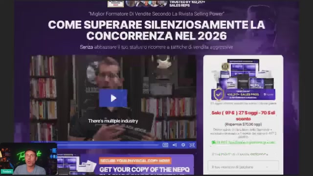

**Testo a schermo (OCR):** ii 7 COME SUPERARE SILENZIOSAMENTELA CONCORRENZA NEL 2026

## [00:40:20] Schermata 77 _(scene)_

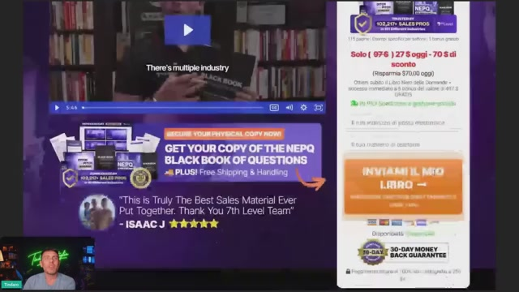

**Testo a schermo (OCR):** Solo( 076 )27Soggi-7054ì dl : Qua GET YOUR COPY OFTHENEPQ — BLACKBOOKOF QUESTIONS. 2 PLUSI Froe Shipping è Handling — di i is Truly The Bi Put Together. Tha ISAAC I Anni

## [00:40:25] Schermata 78 _(scene)_

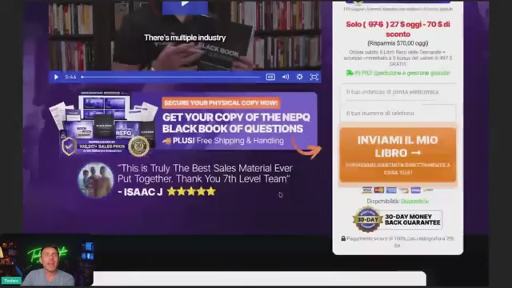

**Testo a schermo (OCR):** Soio(1976)27oggi-7054 There mute noustry sconto vere —Qqaos “Sec VOLE PNTRENI COPY O LD GET YOUR COPY OF THENEPQ "— iBaf_- BLACKBOOK.OF QUESTIONS n @ ea This is Truly The Best Sales Material Ever Put Together. Thank You 7ih Level Tear NET ISAAC Arne

> Vi faccio notare come la pagina di vendita, quindi la pagina dello store, è fatta molto molto bene. Vedete qui che cosa contiene il libro nero delle domande NEPQ, quindi qui abbiamo subito riprova sociale, una ripartizione del libro, qui vi mostra qualche esempio del libro che acquisterete, qui abbiamo il 30 day money back guarantee, quindi garanzia di 30 giorni.

## [00:40:30] Schermata 79 _(scene)_

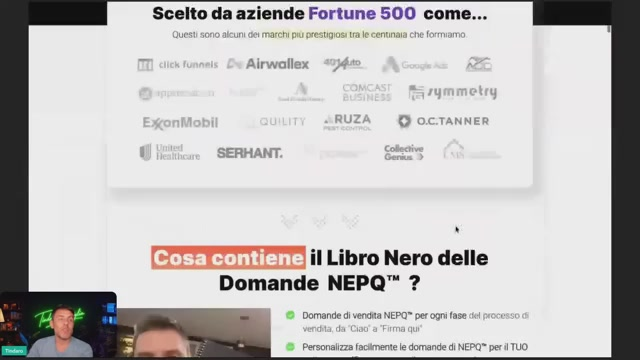

**Testo a schermo (OCR):** Scelto da aziende Fortune 500 come... (TETTO il Libro Nero delle Domande NEPQ" ? ©. Domande di vendita NEPO per ogni fase © Pero

## [00:40:43] Schermata 80 _(scene)_

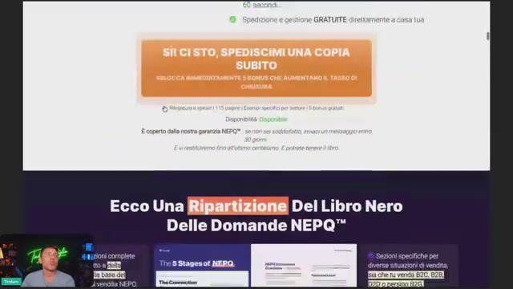

**Testo a schermo (OCR):** GRATUTE Ecco Una RIBARfizione Del Libro Nero Delle Domande NEPQ”" sere \==|

## [00:40:50] Schermata 81 _(scene)_

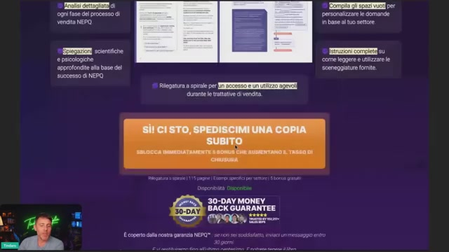

**Testo a schermo (OCR):** STUFI personsizzare e domande — WEIESENIZT scerntcne. MM tr:2100 compie ini no tema n a sera Rilegatura n sonale pe MERE ara son PE > en

## [00:40:59] Schermata 82 _(scene)_

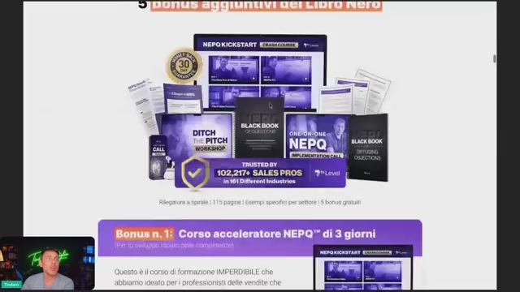

> Quello che acquisterete anche in questo caso, vedete ragazzi qui abbiamo il mockup, ed è un mockup fatto con una grafica davvero eccezionale. E qui ora ovviamente ragazzi i bonus, anche in questo caso i bonus vanno a ingolosire l'utente, quindi corso acceleratore NEPQ di 3 giorni.

## [00:41:06] Schermata 83 _(scene)_

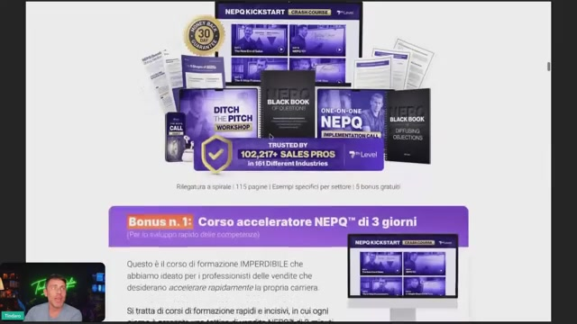

> Poi bonus numero 2, chiamata personalizzata per l'implementazione del metodo NEPQ. Vi ricordate quando nella live numero 2 vi ho detto che il nostro prodotto deve essere unico, deve essere differente rispetto agli altri prodotti? Bene, uno dei metodi che si utilizza, uno dei segreti, uno dei trucchi, una delle strategie di rivelo anche questa che si utilizza per rendere il proprio prodotto digitale unico è quello di assegnare un nome al metodo che si utilizza. In questo caso chi sta vendendo questo prodotto, che è una persona che ci mette la faccia, ha creato questo metodo che si chiama NEPQ. Vedete che anche qui c'è TM, trademark, quindi sarà un marchio registrato, spero che sia un marchio registrato se l'ha scritto. Selling Power Magazine. Ok, già sto classificato alle prime tre aziende, nell'implementazione del metodo NEPQ e poi abbiamo altri bonus. Vedete il workshop NEPQ, il libro Nero NEPQ per evitare tutte le obiezioni sulla vendita. Insomma ragazzi, questo è un venditore che spiega come vendere.

## [00:42:01] Schermata 84 _(scene)_

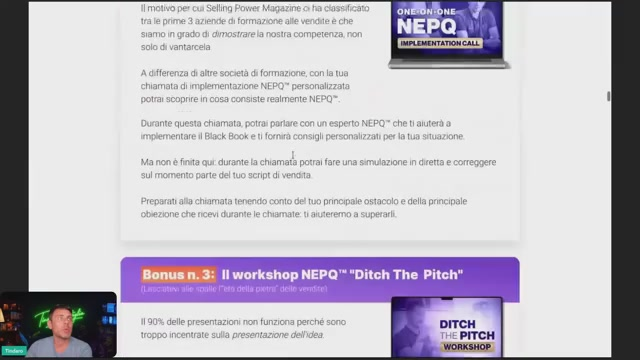

## [00:42:07] Schermata 85 _(scene)_

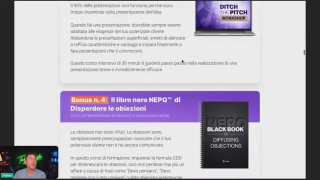

**Testo a schermo (OCR):** DITCH PITCH

## [00:42:11] Schermata 86 _(scene)_

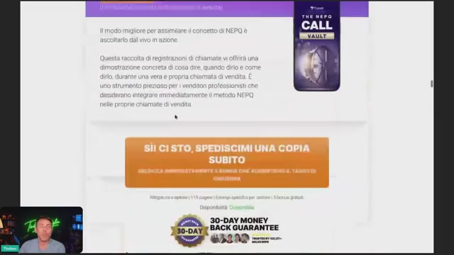

**Testo a schermo (OCR):** 20-DAY MONEY. ‘BACK GUARANTEE #3200 =

> In questo caso ovviamente ragazzi dà un prodotto che costa pochissimo, ma lo scopo non è vendere questo prodotto, lo scopo magari sarà vendere consulenze o vendere percorsi a più alto prezzo. In questo caso, nell'istante in cui l'utente va ad acquistare questo prodotto, lui va a recuperare le spese del traffico. Che significa le spese del traffico ragazzi? Significa che nell'istante in cui il vostro business gira, se volete scalare, cioè volete guadagnare ancora di più, dovete fare delle campagne pubblicitarie.

## [00:42:27] Schermata 87 _(scene)_

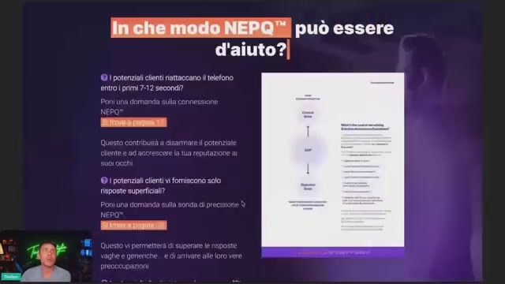

**Testo a schermo (OCR):** InichamadoiNEPOEI può essere d'aiuto?|

> Nell'istante in cui spendete dei soldi su Facebook, ma lo vedremo nel seguito di questa trattazione, quello che succede ragazzi è molto semplice. Noi andiamo a spendere su Facebook e dobbiamo vedere quanto spendiamo per una vendita. Se noi ad esempio vendiamo questi prodotti e mediamente tutti questi prodotti vengono acquistati a un prezzo di 50 euro e noi per generare una vendita su Facebook spendiamo 50 euro, in teoria non stiamo né guadagnando né perdendo. Adesso abbiamo acquisito un cliente, quindi una persona che ha dimostrato di spendere. A questo cliente poi possiamo vendere ulteriori prodotti e se siamo dei coach, consulenti o informatori possiamo vendere dei programmi da 2, 3, 5 mila euro, 10 mila euro, 15 mila euro in funzione di quello che è il vostro settore. Vedete questo? Poi abbiamo tutta la riprova sociale e questo è un esempio di persone che utilizzano la stessa strategia che vi spiego per il loro personal brand.

## [00:43:25] Schermata 88 _(scene)_

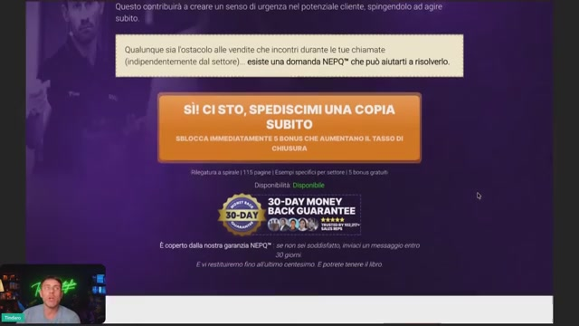

**Testo a schermo (OCR):** Questo cgniribuirà a crei gendolo ad agire SÌ! CISTO, SPEDISCIMI UNA COPIA SUBITO 30-DAY MONEY BACK GUARANTEE

## [00:43:29] Schermata 89 _(scene)_

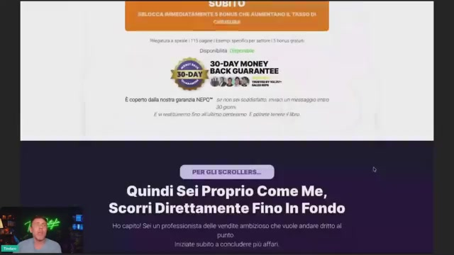

**Testo a schermo (OCR):** sent ar Quindi Sei Proprio Come Me, Scorri Direttamente Fino In Fondo su x 1 vi e vue andar

## [00:43:33] Schermata 90 _(scene)_

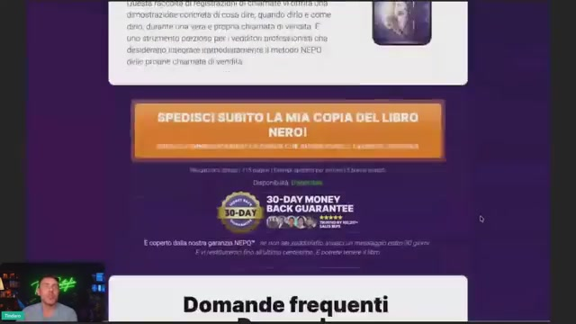

**Testo a schermo (OCR):** SPEDISCI SUBITO LA MIA COPIA DEL LIBRO NERO! a ” 3 Domande frequen

> Altri esempi ragazzi, anche in questo caso pagina di vendita fatta molto molto bene. Per allenatori che desiderano crescere rapidamente, in questo caso si sta parlando di coach che operano nel settore del fitness.

## [00:43:38] Schermata 91 _(scene)_

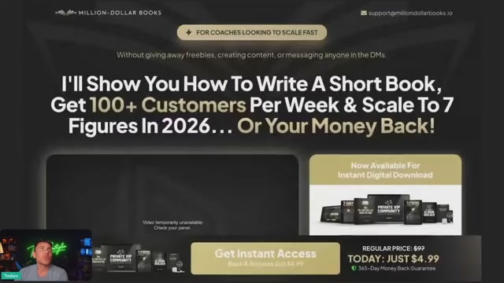

**Testo a schermo (OCR):** l'IlShow YouHow To Write A Short Book, Get 100+ Customers Per Week & Scale To 7 Figures In 2026... Or Your Money Back! RECULARPRICE 659 TODAY: JUST $4.99

> Persone che operano come consulenti nell'ambito della scrittura di libri. Ti mostrerò come scrivere un libro breve, ottenere oltre 100 clienti a settimana e raggiungere un fatturato a 7 cifre. Entro il 2026 sarà rimborsato il prodotto digitale a solo 4 dollari e 99 euro. Perché questo prezzo così basso? Perché alla persona che sta curando questo personal brand non interessa fare soldi con la vendita di questo prodotto. Quindi sta utilizzando la stessa strategia ma per scopi diversi. Interessa fare soldi con i programmi formativi che vende. Quindi abbiamo un prodotto da 4 e 99 e poi successivamente una volta che l'utente acquista e lui recupera le spese del traffico tendenzialmente inizia a vendere programmi ad alto costo.

## [00:44:38] Schermata 92 _(periodic)_

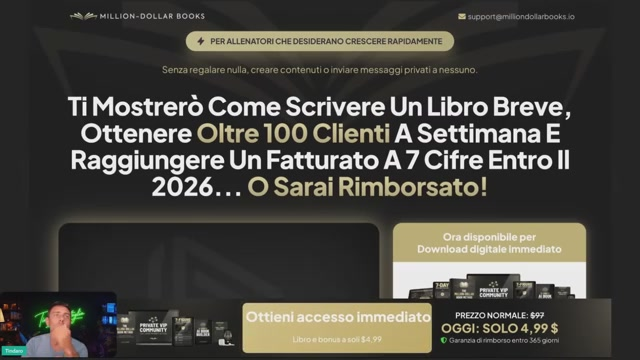

**Testo a schermo (OCR):** Ti Mostrerò Come Scrivere Un Libro Breve, Ottenere Oltre 100 Clienti A Settimana E Raggiungere Un Fatturato A 7 Cifre Entro Il 2026... O Sarai Rimborsato! NORMALE: 653 SOLO 4,99$

## [00:44:46] Schermata 93 _(scene)_

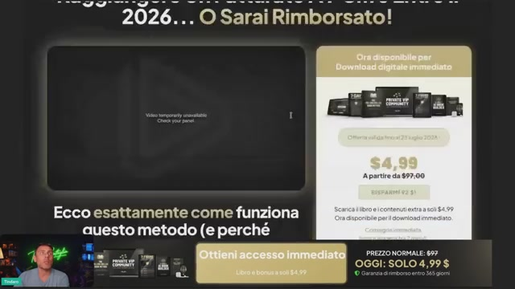

**Testo a schermo (OCR):** Ecco esattamente come funziona auesto metodo (e perché PREZZO NORMALE: 653 OGGI: SOLO 4,99$

> In questo caso abbiamo tutta la parte sulla destra di video, riprova sociale eccetera eccetera. Il metodo del libro da un milione di dollari è una scorciatoia. Poi abbiamo la parte di mocap sulla destra. 4 Dollari e 99 euro.

## [00:44:51] Schermata 94 _(scene)_

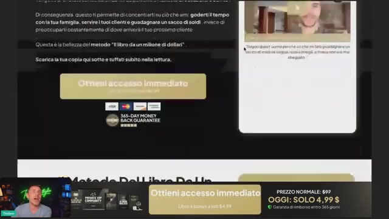

**Testo a schermo (OCR):** bre: godertitampo ve guadagnare un acco soi muco PEZZONoRIALE: (09 (3 MINI 066::50104,998 2 ne

> Per tutto questo, ben di Dio, vedete ragazzi come la grafica è fatta bene. Importantissimo. Abbiate una grafica che è fatta bene, altrimenti avrete problemi nella vendita. E anche questo è un esempio di come applicare il metodo se siete dei coach, consulenti, formatori

## [00:45:12] Schermata 95 _(scene)_

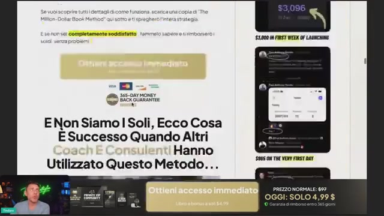

**Testo a schermo (OCR):** LS (=) ENon Siamo Soli, Ecco Cosa E Successo Quando Altri Hanno Utilizzato Questo Metodo... PREZZO NORMALE: 653 OGGI: SOLO 4,99 $

## [00:45:17] Schermata 96 _(scene)_

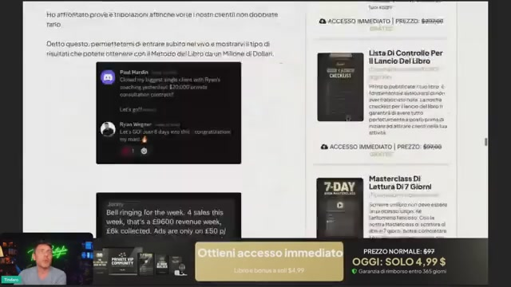

**Testo a schermo (OCR):** A 120: control per fitancio DelLibro Masterciase DI z0aY Rete PREZZO NORMALE: 693 OGGI: SOLO 4,99 $

> e volete crearvi il vostro personal brand, magari a costo zero.

## [00:45:21] Schermata 97 _(scene)_

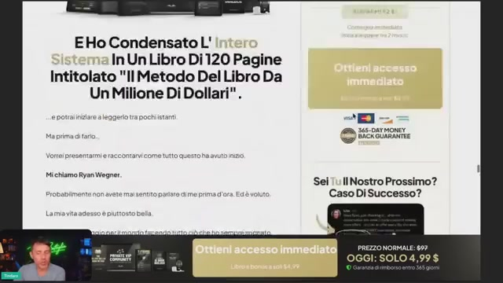

**Testo a schermo (OCR):** EHo Condensato L' InUnLibro Di 120 Pagine Intitolato "Il Metodo Del Libro Da Un Milione Di Dollari". llNostro Prossimo? Caso Di Successo? PREZZO NORMALE: 653 OGGI: SOLO 4,99 $

> Quindi senza spendere per forza in campagna pubblicitaria e fare lead generation, perché un coach formatore che già utilizza Facebook Ads saprà, conoscerà questi termini e magari deve, diciamo, spendere su Facebook sperando che poi trasforma le persone in clienti.

## [00:45:35] Schermata 98 _(scene)_

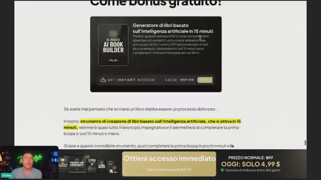

**Testo a schermo (OCR):** vatore libri bas tllgenza articiale in 1S minuti Ai Baox BUILDER svumento creazione dl oi bansto ul'teligerza artici, che latini 15 PREZZO NORMALE: 653 OGGI: SOLO 4,99 $

> Ecco, con questo metodo voi recuperate le spese del traffico

## [00:45:39] Schermata 99 _(scene)_

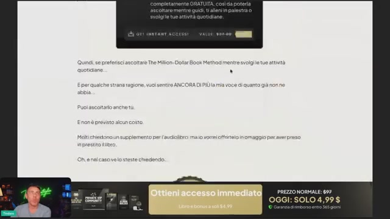

**Testo a schermo (OCR):** sormaLe 897 OGGI: SOLO 4,99$

> e contestualmente avete già dei clienti pronti a spendere da voi. Ma vi faccio notare come la grafica deve essere curata. Vedete questo store estremamente curato.

## [00:45:49] Schermata 100 _(scene)_

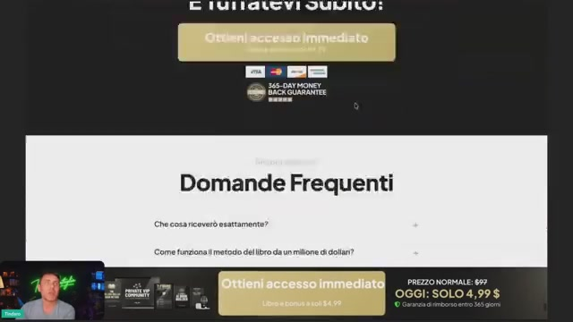

**Testo a schermo (OCR):** LC TUILALEVI SULILU: Domande Frequenti PREZZO NORMALE: 653 OGGI: SOLO 4,99 $

> Abbiamo la sezione con il prodotto di front end. Abbiamo tutti i bonus che vengono calcolati. Il valore di ciascun bonus che viene regalato. Spiegazione di che cosa fa il bonus. Insomma, ragazzi, dobbiamo ovviamente avere uno store che è fatto bene nel 2026.

## [00:46:05] Schermata 101 _(scene)_

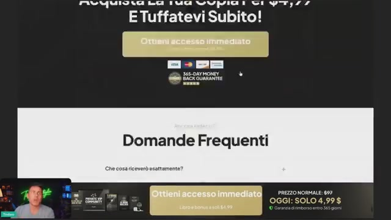

**Testo a schermo (OCR):** fionio Lobo sio e E Tuffatevi Subito! Domande Frequenti rex È Gnortonmasat © | OGGI: SOLO 4,99 $

> Soprattutto dobbiamo avere uno store che è fatto bene. Che cosa riceverò esattamente? Allora, vediamo un attimo che cosa riceverà l'utente esattamente. Abbiamo una serie di domande frequenti. Vediamo un po', riceverà un libro di 120 pagine. Come funziona il metodo del libro da un milione di dollari. A chi è destinato questo libro, eccetera, eccetera, eccetera. Cliccando qui si ottiene l'accesso immediato.

## [00:46:30] Schermata 102 _(scene)_

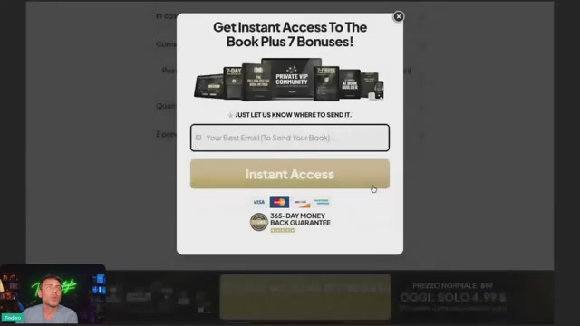

**Testo a schermo (OCR):** Getinstant Access To The Book Plus 7 Bonuses!

> Ci clicchiamo, inseriamo l'email, ragazzi, e si va direttamente a checkout. Ok, ci siamo. Tutta questa grafica è stata creata con l'intelligenza artificiale,

## [00:46:38] Schermata 103 _(scene)_

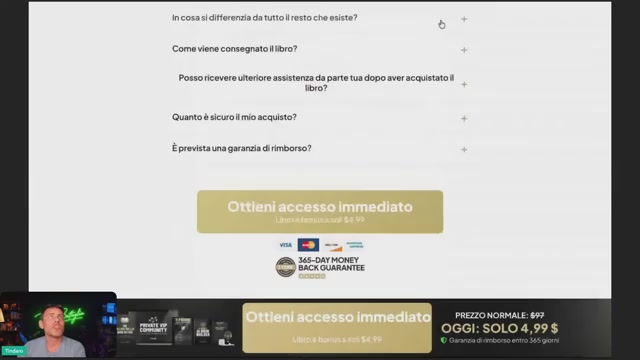

**Testo a schermo (OCR):** © OGGI: SOLO 4,99 $

> attraverso dei prompt analoghi a quello che vi ho mostrato in precedenza. Ma ora, ragazzi, vediamo un attimo come si creano queste cose. Soprattutto, ma Tinder è una cosa che mi hanno chiesto in tantissimi la volta scorsa. Quello che mi hanno chiesto era la seguente cosa. Tinder, ma io con che cosa creo questo store? Perché, ok, ho capito che si deve creare lo store, ho capito che si deve creare la struttura a funnel, ma come vado a creare lo store? Bene, lo possiamo creare con un software molto semplice che ci permette di creare uno store, di creare il funnel, di poter spedire email, di poter creare aree corsi, di poter inserire i nostri prodotti digitali e venderli. Questo store, questo sistema che ci permette di creare il store, definiamolo meglio, si chiama, ragazzi, System I.O. Ora vi mostro l'interno di System I.O.

## [00:47:36] Schermata 104 _(scene)_

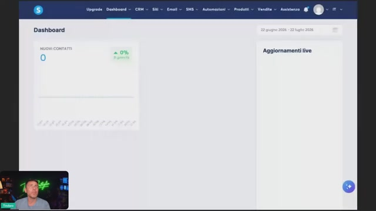

**Testo a schermo (OCR):** Dashboard Aggiornamenti live

> Eccolo qui, vedete. Questo è una dashboard di esempio, vedete? Questo è System I.O., Ragazzi, è molto molto semplice da utilizzarsi. Semplicissimo, ragazzi. Guardate qui, abbiamo tutta una serie di opzioni. Abbiamo la possibilità di gestire i nostri contatti, abbiamo la possibilità di creare, vedete qui, funnel di vendita, abbiamo la possibilità di inviare email, di inviare sms, questa è una delle ultime novità di System I.O. Possiamo creare delle automazioni, quindi ad esempio se l'utente acquista il prodotto X, allora attraverso questa automazione io gli invio una mail dicendo che ha acquistato il prodotto X, per te che hai acquistato il prodotto X oggi, c'è uno sconto del 30% sul prodotto Y. Questa è una strategia che di solito si applica. Ma con System I.O. Possiamo vendere prodotti di qualsiasi tipo. Possiamo vendere prodotti fisici, quindi anche uno store è un sistema per creare un store ottimo se vendiamo prodotti fisici. Possiamo creare coupon, uno sconto. Possiamo creare corsi, quindi aree corsi. Possiamo creare community, possiamo inserire file.

## [00:48:36] Schermata 105 _(periodic)_

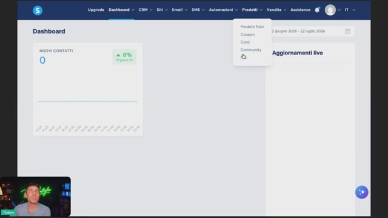

**Testo a schermo (OCR):** Aggiornamenti ive

> Qui abbiamo tutta una sezione di ordini, transazioni, abbonamenti, fatture, programma di fatturazione. Insomma ragazzi è tutto in uno, è la cosa più bella per rullo di tamburi. Purtroppo non gli effetti speciali per audio per il rullo di tamburi, però cosa bellissima ragazzi, partite registrandovi gratis. Quindi vi registrate gratis, avete l'accesso al System I.O., Iniziate a fare le prime vendite. Quando iniziate a fare le prime vendite, potete passare alla sezione di abbonamento. Ragazzi tra l'altro i prezzi sono di circa, non mi ricordo, circa 20 euro al mese, 17 euro al mese, una roba ragazzi infima in termini di prezzo. Quindi se volete partire col business dei prodotti digitali e volete esagerare, volete spendere, bene, spenderete circa 20 euro per CGPT al mese e 20 euro per lo store. Quindi spenderete 40 euro ragazzi per avviare un'attività di impresa online. Sfido chiunque a dirmi un business digitale che permette di partire con un prezzo inferiore. Quindi davvero ragazzi, poca poca roba.

## [00:49:36] Schermata 106 _(periodic)_

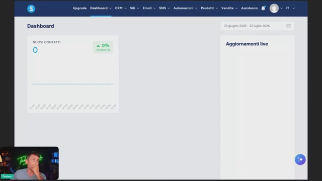

**Testo a schermo (OCR):** Aggiornamenti lve

> Ma vediamo come si crea il funnel. Anche in questo caso ragazzi è tutto molto semplice. Quindi qui siamo nella dashboard, ci riechiamo in siti, funnel di vendita. Quindi io qua ho già creato un mio funnel, ma lo ricreiamo. Quindi clicchiamo qui su crea. Qui come vedete, essenzialmente già System.Io vi dà un suo sottodominio. In questo caso è questo, adenaplus.System.Io. Ma voi potrete anche comprare un dominio, ragazzi, un dominio costa altri 20 euro l'anno. Quindi stiamo parlando di 40 euro al mese, 20 euro l'anno sono 2 euro al mese, quindi 42 euro ragazzi, 42 euro per partire con un business. Al confronto ragazzi immaginatevi che significa partire, l'inferno di partire con un business fisico. Aprire un bar per esempio che è la cosa che va più di moda. Solo per aprire un bar significa 100-200 mila euro per il mutuo affitto del locale,

## [00:50:36] Schermata 107 _(periodic)_

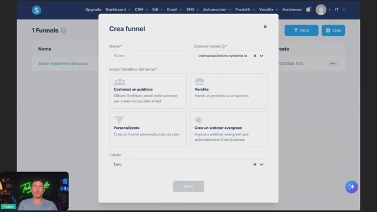

> centinaia di miliardi di euro per il leasing, andare nella banca, chiedere soldi, poi non ve li dà, poi partite, ragazzi, vi siete indebitati per centinaia di miliardi di euro con banca, fornitore, eccetera, e poi alla fine vendete 3 caffè. Ecco, capite come il business digitale, soprattutto il business dei prodotti digitali, vi permette di minimizzare il rischio notevolmente in termini di investimento, perché qui partite con circa 40 euro. Ragazzi, volete partire con le ads? Ok, spendete altri 5 euro, quindi partirete con 5 euro al giorno, in una settimana vedete se è generata le prime vendite, quindi in totale, se volete fare un test, partirete con circa 70 euro in un mese. Ragazzi, stiamo parlando praticamente del nulla, stiamo parlando del nulla. 70 Euro è una pizza per due il sabato sera. Sfido chiunque, ripeto, a indicarmi un business che vi permette di partire con me. Spoiler, non esiste. Allora, qui diamo un nome al vostro funnel, per esempio potrebbe essere addominali, vi ricordate?

## [00:51:36] Schermata 108 _(periodic)_

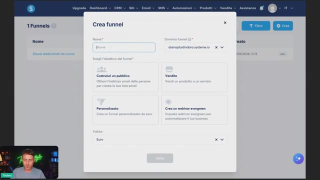

> Come si chiamava il prodotto che abbiamo creato ieri? Vi ricordate ragazzi? Purtroppo sono nella soglia dei 40, quindi ogni tanto mi perdo qualche cosa. Vabbè ragazzi, chiamiamolo addominali da riprenditore, dai. Ok? A questo punto indichiamo che cosa vogliamo fare. Possiamo costruirci un nostro pubblico, quindi fare l'e-generation. Ragazzi, il programma si chiama system.Io. Ok, anzi facciamo una cosa, aspettate. Ora vi invio. Ora vi invio, spero che sia questo il link. Vi invio, vi stavo dicendo il link, così potete praticamente, vediamo se è questo, potete registrarvi gratis.

## [00:52:36] Schermata 109 _(periodic)_

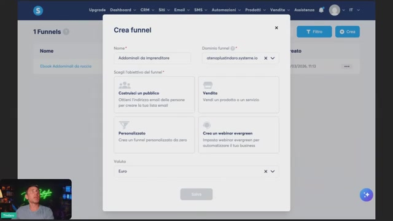

**Testo a schermo (OCR):** Crea funnel

> Eccolo qua, ve lo invio direttamente qui su YouTube. Eccolo qua. Se voi andate qui, vi potete registrare, eh sì, sixpackabs, hai ragione user, grazie, grazie mille. Vabbè ormai l'ho chiamato addominali da riprenditore, ok? Però ci siamo capiti. Quindi diamo un nome al nostro funnel, qui avete il link ragazzatinderobattaglia.Com slash go slash system.Io, vi registrate, è gratis. Iniziate a giochicchiare con questo strumento, magari mi seguite, ma per ora non lo fate. Segnatevi solamente il link, poi magari quando riguardate la live siamo al minuto 53, quindi ricordatevi che al minuto 53 c'è questo link, lo potrete riprendere e riguardarlo. Ok? Perfetto. Ok, allora vediamo come si crea il funnel. Quindi qui selezioniamo vendita, selezioniamo la valuta, quindi se stiamo lavorando in America utilizzeremo qua dollari, se siamo in Egitto utilizzeremo la sterlina egiziana, tra l'altro

## [00:53:36] Schermata 110 _(periodic)_

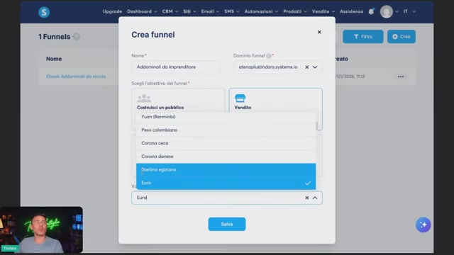

> non sapevo che in Egitto utilizzassero la sterlina, ma tant'è. Vabbè supponiamo di lavorare in Europa, quindi utilizziamo euro, ok? Quindi clicchiamo su salva, mi crea il funnel. Ci clicco, e come vedete il funnel è già composto da un checkout e una pagina di ringraziamento. La pagina di ringraziamento è quella che vedono gli utenti dopo che acquistano il prodotto. Ok? Creiamo la nostra pagina di vendita, quindi qui clicco su Gengi Step, do un nome. Per esempio, addominali da imprenditore. Pagina di vendita. Ok? Selezioniamo il tipo di pagina, ovviamente sarà una pagina di vendita. E qui possiamo scegliere un modello o iniziare da zero. Vi mostro entrambi i modi. Se scegliamo un modello, come vedete, System.Io ci mette a disposizione già dei template prefatti. Ok? Ce ne sono davvero tantissimi.

## [00:54:36] Schermata 111 _(periodic)_

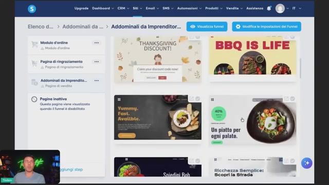

**Testo a schermo (OCR):** Addominali da Imprenditor. rasati BBQ/S LIFE Un piatto per ‘ogni palato. = ©

## [00:54:36] Schermata 112 _(scene)_

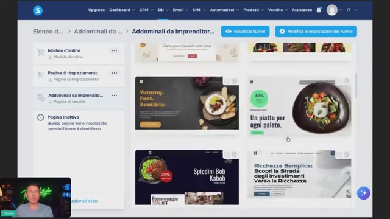

**Testo a schermo (OCR):** Uppe Ditni > COM > il > tm - > Atomni > ftt» Vetta > Ante BÈ @- 1 Elenco d... > Addominali da... > Addominali da imprenditor. Spiedini Bb n Kabob

> Periodicamente ne inseriscono di nuovi. Ok? Possiamo scegliere un qualsiasi template e poi lo possiamo modificare. Anche in questo caso modificare, ragazzi, un template è estremamente semplice.

## [00:54:47] Schermata 113 _(scene)_

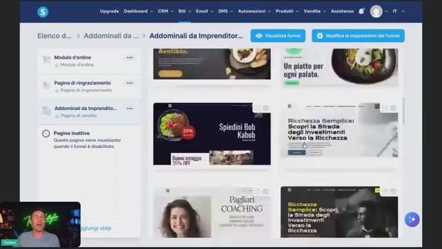

**Testo a schermo (OCR):** Adiominali da Imprenditr. ee” MITI, ogni palato

> Quindi come si modifica il template? Beh, io seleziono ad esempio questo perché mi piace. Ok? A questo punto la mia pagina di vendita che clicco e sposto in alto. Ricordatevi che prima ci deve essere pagina di vendita, poi ci deve essere checkout e poi pagina di ringraziamento. Ok? A questo punto io clicco su modifica pagina. Questo, ragazzi, che vedete qui, questo Athena Plus, Tinder, lo System.Io, slash, 2920FFB5, che possiamo cambiare. Io potrei chiamarla Fardominali da imprenditore. Questo, ragazzi, è la URL che dovrete inserire. Questa è la URL iniziale che dovrete mostrare al vostro pubblico. Ok? Ci siamo. Molto, molto semplice. Potete inserire come URL su Instagram, TikTok e quant'altro. Allora, una volta fatto questo clicco su modifica pagina, mi si apre, ragazzi, un editor molto semplice, del tutto identico,

## [00:55:47] Schermata 114 _(periodic)_

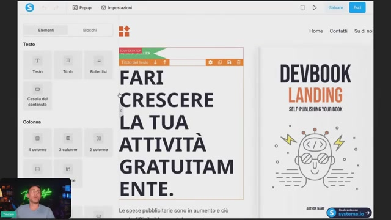

**Testo a schermo (OCR):** Essa “ FARI ‘CRESCERE LA TUA .L. ATTIVITÀ GRATUITAM ENTE. DEVBOOK LANDING uv va ODE

> e se così lo vedete meglio, del tutto identico, ragazzi, ai più blasonati editor di CDWeb. Non dobbiamo essere programmatori, non dobbiamo saperne nulla di codice. Tutto quello che dobbiamo fare è modificare queste parti andando a inserire il nostro testo che magari abbiamo generato con la nostra intelligenza artificiale. Quindi qui faccio doppio clic e qui inserisco. Scopri come ottenere addominali da sogno anche quando viaggi per lavoro e non hai tempo. Vedete? In questo caso, in un secondo, ho modificato questa parte. E se voglio modificare questo perché magari ho creato il mio template di ebook, ragazzi, è molto molto semplice. In questo caso clicco qui e vado a modificare caricando la mia immagine. O, per esempio, andiamo avanti. Ok, questo è il pulsante che ci manda a checkout. Beh, voglio modificare il colore.

## [00:56:47] Schermata 115 _(periodic)_

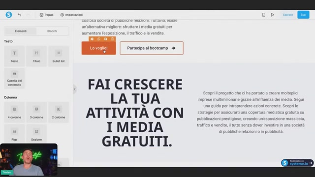

**Testo a schermo (OCR):** FAI CRESCERE LA TUA ATTIVITÀ CON I MEDIA GRATUITI.

> Allora clicco sulla rotellina, qui sulla sinistra mi appaiono tutte le opzioni di questo pulsante, anziché lo voglio, scrivo ad esempio dammelo ora e cambio il colore in verde. Vedete, ragazzi, è molto semplice. E una cosa anche interessante di questo software è che io posso vedere come si vedrà la mia pagina anche da mobile. Quindi faccio clic qua in alto e come vedete ottengo una pagina che è già perfettamente pronta sia per dispositivi PC, quindi sia per chi guarda questa pagina da computer, sia per chi la guarda da telefonino. Vedete, ragazzi? Fatta in pochissimi secondi. Poi, ovviamente, possiamo modificare queste parti, possiamo cambiare e scrivere quello che vogliamo. Possiamo, ragazzi, fare praticamente tutto. Possiamo spostare trascinando con queste maniglie parti del testo, ma è un editor davvero, davvero potente. Una volta che abbiamo creato quello che ci interessa, clicchiamo su salva e da qui possiamo vedere la nostra pagina di vendita.

## [00:57:47] Schermata 116 _(periodic)_

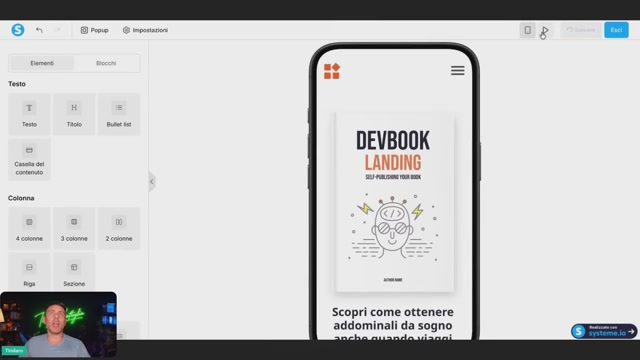

**Testo a schermo (OCR):** DEVBOOK LANONG Scopri come ottenere addominali da sogno

> Ok? Tutto molto semplice. Ora vi mostro come si realizza con l'intelligenza artificiale. Ragazzi, guardate che figata. Ho istruito la mia intelligenza artificiale per creare già il codice della mia pagina di vendita definitiva. Ok? E guardate quello che succede. Ora incollerò il codice, quindi cancelliamo questa pagina che abbiamo creato, che non ci interessa,

## [00:58:12] Schermata 117 _(scene)_

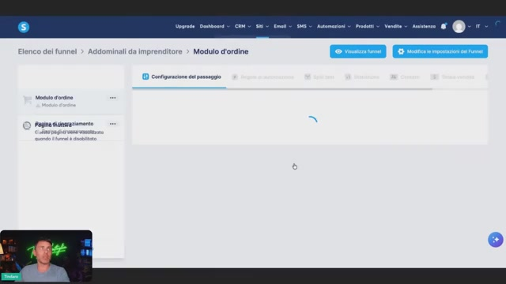

> e ricreiamo la pagina di vendita con l'intelligenza artificiale. Ok? Quindi qui inserisco addominali da imprenditore. Lo chiamiamo la landing page, ok? In inglese, pagina di atterraggio. Qui seleziono pagina di vendita. Qui questa volta seleziono iniziare da zero. Clicco su salva. A questo punto clicco su modifica pagina. Vado qui in basso. Vedete, ci sono tanti blocchi che posso trascinare. Posso inserire video, posso inserire immagini. Io qui inserirò l'ultimo blocco. Questo si chiama row html. Lo trascino qui. E ora ragazzi, prende forma la magia. Perché l'intelligenza artificiale mi ha fornito il codice. Clicco su questo row. Modifico il codice.

## [00:58:58] Schermata 118 _(scene)_

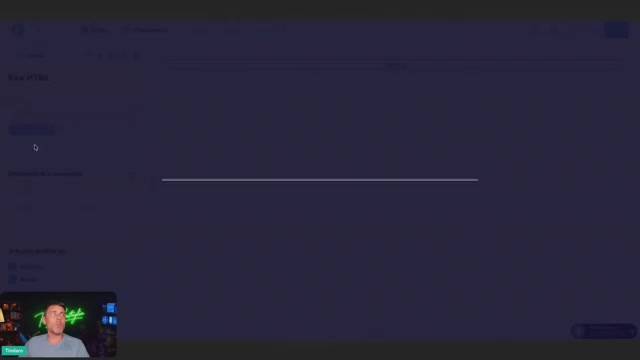

> Quindi qui mi dà già un codice, ad esempio, che io cancello. Ragazzi, inserisco il codice che mi ha dato l'intelligenza artificiale. Non devo essere un programmatore, non me ne frega nulla di tutto questo. Ragazzi, siete pronti per vedere come creare una pagina di vendita in pochi secondi? Volete vedere? Ve lo mostro ragazzi. Siete pronti per restare con la mascella a terra? Guardate che roba che mi ha combinato l'intelligenza artificiale. Semplicemente, semplicemente. Dandole delle istruzioni e dei prompt, ovviamente, corretti. 3, 2, 1.

## [00:59:55] Schermata 119 _(scene)_

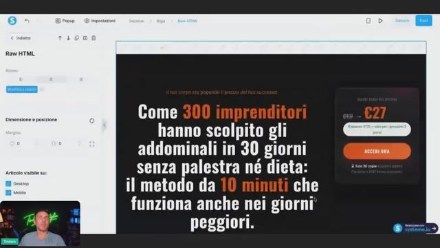

**Testo a schermo (OCR):** Come hanno scolpito gli [center] addominali in 30 giorni pe senza palestra né dieta: T== il metodo da che funziona anche nei giorni peggiori.

> Ragazzi, guardate che roba. Ora facciamo una cosa a salvo. E vi mostro direttamente come si vede.

## [01:00:03] Schermata 120 _(scene)_

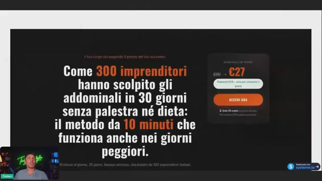

**Testo a schermo (OCR):** Come 300 imprenditori €27 hanno scolpito gli [ma] addominali in 30 giorni Corni DI senza palestra né dieta: pas il metodo da 10 minuti che funziona anche nei giorni x PI peggiori.

> Guardate qui, ragazzi. Guardate che roba. Come 300 imprenditori hanno scolpito gli addominali in 30 giorni senza palestra o dieta. Il meno di 10 minuti che funziona anche nei giorni peggiori.

## [01:00:22] Schermata 121 _(scene)_

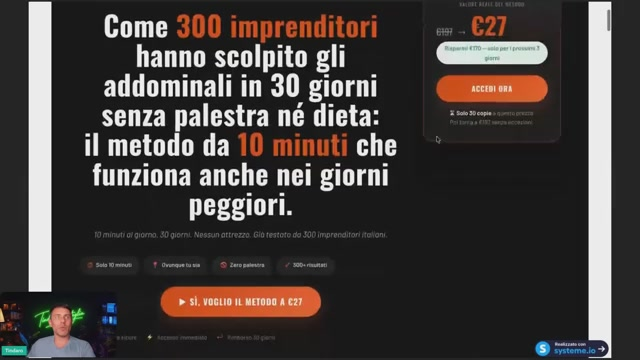

**Testo a schermo (OCR):** Come 300 imprenditori (22) hanno scolpito gli addominali in 30 giorni O) senza palestra né dieta: 3 il metodo da 10 minuti che funziona anche nei giorni peggiori.

> Guardate qui, ragazzi. Guardate che grafica. Cioè, è da smascellare, ragazzi. Questa è tutta la grafica. Ora ve la mostrerò. Che è stata realizzata in pochissimi secondi con l'intelligenza artificiale. Ragazzi, guardate che grafica che ci ha creato tutto il testo.

## [01:00:37] Schermata 122 _(scene)_

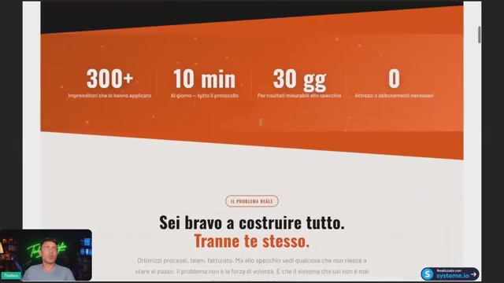

**Testo a schermo (OCR):** Sei bravo a costruire tutto.

> Tutte le animazioni qui. Tutte le parti qua in basso sono tutte state create con l'intelligenza artificiale. Ho semplicemente chiesto all'intelligenza artificiale, ovviamente attraverso il giusto prompt.

## [01:00:45] Schermata 123 _(scene)_

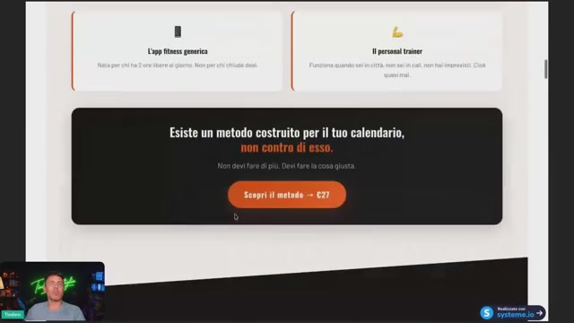

**Testo a schermo (OCR):** Esiste un metodo costruito per il tuo calendario, non contra di esso,

> Quindi ho dato un prompt all'intelligenza artificiale. Ho spiegato il mio prodotto che cosa tratta. Ho dato i colori del mio brand. Gli ho detto, ok, questo è il prodotto.

## [01:00:56] Schermata 124 _(scene)_

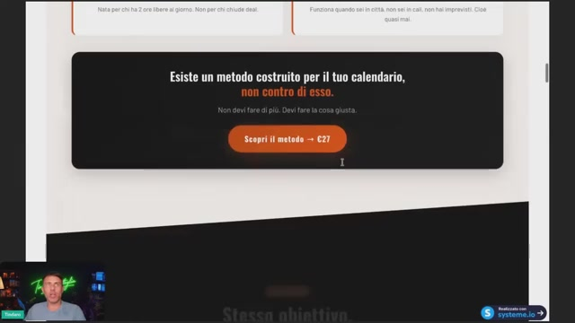

**Testo a schermo (OCR):** Esiste un metodo costruito per il tuo calendario,

> Questa è la persona.

## [01:01:01] Schermata 125 _(scene)_

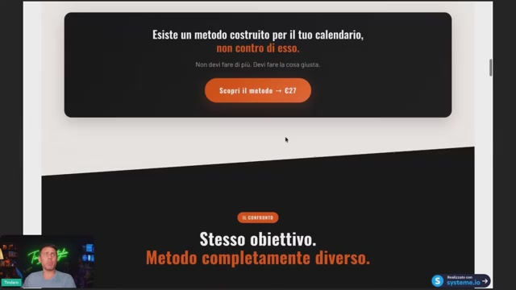

**Testo a schermo (OCR):** Esiste un metodo costruito per il tuo calendario, capi l matud = €27 Stesso obiettivo.

> Realizzami la pagina di vendita. Mi ha creato il codice. L'ho incollato sul sistema I.O., Vedete? E ho creato, ragazzi, una cosa da smascellare. Guardate che spettacolo questa landing. E ragazzi, sfido chiunque in questo caso a dirmi che stiamo facendo qualcosa di difficile. Ragazzi, abbiamo creato una pagina. Tra l'altro l'intelligenza artificiale mi ha eletto a fitness coach per imprenditori e fondatore del metodo Roccia dal 2016. Che figata, eh? Tutto questo è stato creato in pochissimi secondi con l'intelligenza artificiale.

## [01:01:34] Schermata 126 _(scene)_

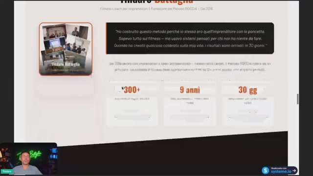

> Guardate qui, mi ha messo anche la foto. Guardate che figata. Vedete? Tutta questa pagina è stata creata in pochi secondi grazie all'intelligenza artificiale. Qui abbiamo tutta la sezione. Quanto costa. Sezione di domande e risposte.

## [01:01:48] Schermata 127 _(scene)_

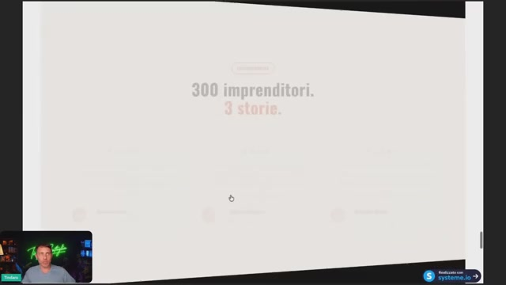

> Sezione di riprova sociale. Domande frequenti. Ragazzi, guardate che grafica. Tutto fatto in pochissimi secondi. Wow. Wow. Wow. Ragazzi, vi rendete che roba? Vi rendete conto della roba che vi ho mostrato? Ragazzi, è una roba incredibile. Dettate un po'. Vedo che ho la telecamera che continua a mostrarmi. C'è qualche cosa che non so. Ragazzi, c'è qualche cosa che attiva l'intelligenza artificiale nella mia fotocamera, ma è così. Quindi mi continuo a seguire. Ragazzi, vi rendete conto della roba che oggi si può fare con l'intelligenza artificiale? In pochi secondi abbiamo creato un funnel pronto per vendere il nostro prodotto digitale. Ragazzi, roba da smascellare. Ditemi voi, ragazzi, se non è roba da smascellare in modo prepotente. Finalmente spiegazioni chiare e pratiche con software accessibile. Ecco, vedi Katiusa? Ci siamo?

## [01:02:48] Schermata 128 _(periodic)_

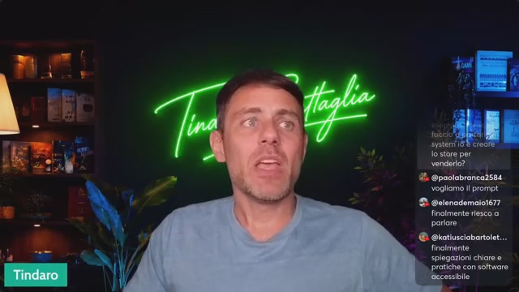

**Testo a schermo (OCR):** vogliamo il prompt © @elenademai01677 finolmente riesco 0 periore ‘® Grotiusciabortolet... finalmente spiegazioni chiare e pratiche con sofiwore Î occessibie

> Bene ragazzi, dobbiamo andare avanti perché non è finita qui. Devo parlarvi adesso di un'altra roba. Devo parlarvi dell'ultimo tassello che ci resta. Infatti anche lo store migliore, che abbiamo visto, porta a zero profitto se non viene visitato da persone che cercano il nostro prodotto. E allora dobbiamo conoscere la formula magica per portare profitti digitali. Qual è la formula magica per portare profitti digitali al nostro store? Offerta più funnel più traffico uguale soldi. L'offerta è costituita dal prodotto che noi vendiamo. Il funnel è quello che vi ho mostrato oggi. Il traffico lo dobbiamo vedere. Perché abbiamo già parlato, come vi dicevo, di offerte funnel nelle scorse live. Se non avete visto, ragazzi, le scorse live, vi invito caldamente a guardarle perché valgono tanto oro quanto pesa. Oggi parliamo di traffico, cioè come generare i primi clienti. Ora, immagina per un istante il tuo store di prodotti digitali come un negozio fisico.

## [01:03:48] Schermata 129 _(periodic)_

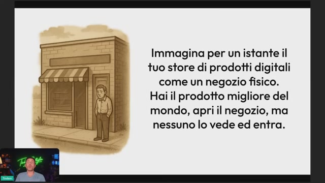

**Testo a schermo (OCR):** Immagina per un istante il tuo store di prodotti digitali come un negozio fisico. Hai il prodotto migliore del mondo, apri il negozio, ma nessuno lo vede ed entra.

> Hai il prodotto migliore del mondo, apri il negozio, ma nessuno lo vede entra. Ora voglio che tu mi scrivi qua in basso nei commenti.

## [01:03:53] Schermata 130 _(scene)_

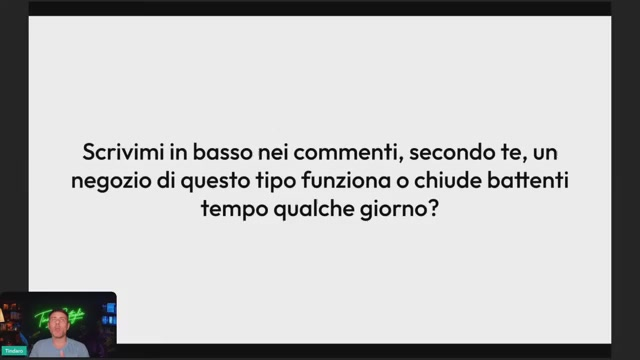

**Testo a schermo (OCR):** Scrivimi in basso nei commenti, secondo te, un negozio di questo tipo funziona o chiude battenti tempo qualche giorno?

> Secondo te, uno store di questo tipo funziona o chiude i battenti dopo qualche giorno? Quindi, ve lo ripeto, immagina per un istante il tuo store di prodotti digitali come un negozio fisico. Hai il prodotto migliore del mondo, apri il negozio, ma nessuno lo vede e nessuno entra. Secondo voi, un negozio di questo tipo funziona o chiude i battenti dopo qualche giorno? Vediamo un po' che mi scrivete. Adesso c'è qualcuno che mi dice dipende, ragazzi. Sì, ragazzi, qui non c'è dipende. Ovviamente chiude. Ovviamente chiude, è giusto quello che sta dicendo. Ovviamente chiude. Perché noi possiamo avere, ragazzi, l'Apple Store micidiale con il palazzo a cubo di cristallo, ma non lo visi da nessuno. Ragazzi, chiudiamo. Qui non c'è un dipende, ragazzi. Qui chiudiamo per forza.

## [01:04:53] Schermata 131 _(periodic)_

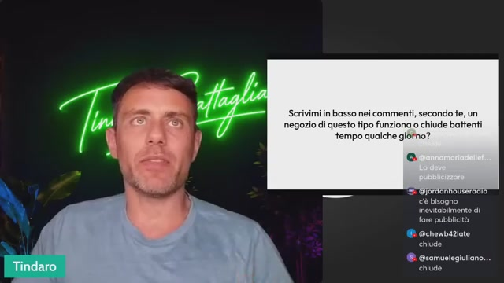

**Testo a schermo (OCR):** Scrivimiin basso nei commenti, secondo te, un negozio di questo tipo funziona 0 chiude battenti tempo qualche gioîno? cè bisogno inevitabilmente di fore pubblicità ® @samuetegiuliano. chiude

> Per forza è terzi un non double. O restiamo aperti e generiamo clienti, oppure chiudiamo. Eppure parliamo di un negozio che ha prodotti eccezionali, con un design all'ultimo grido. Vi ricordate quello che vi ho detto all'inizio? Qual è il problema? La differenza la fa avere persone che entrino nel tuo negozio, che si guardino intorno e che alla fine comprino. Ok? Ora, per portare traffico al nostro store, sfruttiamo due tecniche ben precise. Oggi te le insegnerò entrambi, poi tu potrai decidere se utilizzarne una o entrambe. Ok? Allora, abbiamo due tipi di traffico quando dobbiamo generare clienti per il nostro store. Traffico a pagamento e traffico gratuito, che si chiama anche traffico organico. Ora, segnati questa regola perché ti permetterà di partire nel migliore dei modi con i prodotti digitali.

## [01:05:53] Schermata 132 _(periodic)_

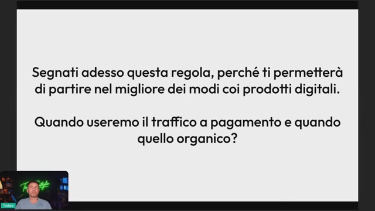

**Testo a schermo (OCR):** Segnati adesso questa regola, perché ti permetterà di partire nel migliore dei modi coi prodotti digitali. Quando useremo il traffico a pagamento e quando quello organico?

> Quando si usa il traffico a pagamento e quando quello organico? Me l'avete chiesto in migliaia, ragazzi. Tinder, ma quando utilizziamo quello organico, quando utilizziamo quello a pagamento? Bene, ora ve lo spiega il prof, non vi preoccupate. Sfrutteremo il traffico organico nella fase iniziale del nostro business, o se abbiamo poco budget e molto tempo a disposizione. Sfrutteremo invece il traffico a pagamento quando abbiamo già un buon flusso di vendite dal traffico organico e vogliamo aumentare le vendite. Il traffico organico, infatti, sebbene sia gratuito, ragazzi, richiede impegno e quindi tempo da dedicarci. Mentre invece le campagne pubblicitarie richiedono minimo tempo. Quindi, se vogliamo aumentare le vendite, dobbiamo sfruttare il traffico a pagamento e quindi tempo da dedicarci. Mentre invece le campagne pubblicitarie richiedono minimo tempo a sono a pagamento. Quindi, abbiamo questa ambivalenza. Inoltre, è totalmente imprevedibile, quindi non possiamo mai sapere quanto traffico organico entra nel nostro store. Il traffico a pagamento, invece, ci permette di analizzare ogni dato, capire che cosa funziona

## [01:06:53] Schermata 133 _(periodic)_

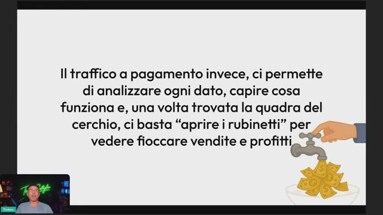

**Testo a schermo (OCR):** Il traffico a pagamento invece, ci permette di analizzare ogni dato, capire cosa funziona e, una volta trovata la quadra del cerchio, ci basta “aprire i rubinetti” per vedere fioccare vendite e profitti È

> e una volta trovata la quadra del nostro funnel, ci basta aprire i rubinetti per vedere, fioccare, vendite e profitti. Finiamo fin qui? Hola! Ditemi la vostra nei commenti. Con che cosa inizierete il vostro business di prodotti digitali alla fine di questo workshop? Scrivetemi organico, se inizierete con il traffico organico. Scrivetemi pagamento, se inizierete il traffico a pagamento. Quindi, fatemi sapere, ragazzi, con che cosa inizierete alla fine di questo workshop con il vostro business di prodotti digitali? Organico o pagamento? Organico di persona. Organico. Testare il prodotto con il traffico organico. AMV2 di Giuseppe, ottima scelta.

## [01:07:53] Schermata 134 _(periodic)_

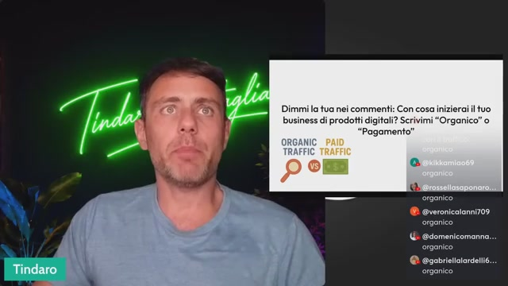

**Testo a schermo (OCR):** @veronicolanni709 organico È @domenicomanne... organico © @gobrielciardetié organico

> Ok, organico, organico. Organico un pochino a pagamento, ci sta. A pagamento. Sì, ragazzi, partiamo con circa 5 euro al giorno col traffico a pagamento e quindi poca roba anche in questo caso. Ok, quindi diciamo che siete abbastanza orientati. Allora, spieghiamo un attimino la strategia di traffico organico. Quindi, traffico organico, come vendere i tuoi prodotti digitali a costo zero generando migliaia di euro. Allora, esistono vari mezzi che ci permettono di ottenere traffico organico. Noi sfruttiamo quello più veloce d'assoluto, TikTok, ok? TikTok, ragazzi, è la piattaforma definitiva per vendere i vostri prodotti digitali in organico perché potete pubblicare un TikTok e generare migliaia di vendite andando virale in pochissimi minuti. Ma faccio un esempio, Tinder.

## [01:08:46] Schermata 135 _(scene)_

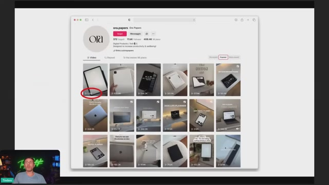

**Testo a schermo (OCR):** OcECEE melalo SIMS,

> Questo è un esempio di store su TikTok che macina profitti con prodotti digitali. Lo store si chiama Ora Papers. È uno store, tra l'altro, faceless. Vedete, ragazzi, che non conosce nessuno che ci sia dietro. Ragazzi, guardate un po' i TikTok. 1.2 Milioni di visualizzazioni, 925 mila visualizzazioni, 566 mila visualizzazioni. Una marea di visualizzazioni, ragazzi, con uno store che ha circa 17 mila follower. Quindi, poca poca roba. Andiamo a vedere che cosa sta guadagnando Ora Papers, giusto per capirci.

## [01:09:23] Schermata 136 _(scene)_

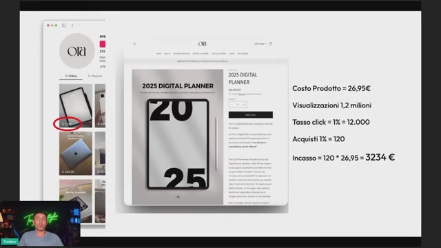

**Testo a schermo (OCR):** 2025 DIGITAL PLANNER Costo Prodotto =26,95€ Visualizzazioni ,2 milioni Toso clek=74=12.000 Acquisti 4 =120 Incasso=120* 26,95=3234 €

> Allora, vende un digital planner, quindi un pianificatore digitale, che ha un costo di 26,95. Ora, guardiamo, ragazzi, il primo TikTok. Il primo TikTok ha fatto 1.2 Milioni di visualizzazioni. Quindi, quel TikTok che, ragazzi, tra l'altro è stato fatto in maniera molto semplice. Cioè, il tizio ha aperto il telefonino, ha avviato il video e ha fatto vedere sul suo iPad come funzionava questo pianificatore digitale. Non dovete essere neanche dei geni del marketing, non dovete essere neanche Steven Spielberg, ok? Quindi, abbiamo 1.2 Milioni di visualizzazioni. Supponiamo che di queste 1.2 Milioni di persone, solamente l'1% abbia aperto il link. Quindi abbiamo circa 12 mila visite al sito, solo da questo TikTok, perché è l'1%. Supponiamo che di queste 12 mila persone abbia acquistato solamente l'1%, quindi solamente una persona su cento, ragazzi, mi sto tenendo basso. Quindi, da questo TikTok abbiamo avuto 1.2 Milioni di visualizzazioni. L'1% ha cliccato e quindi abbiamo 12 mila visite sul sito.

## [01:10:23] Schermata 137 _(periodic)_

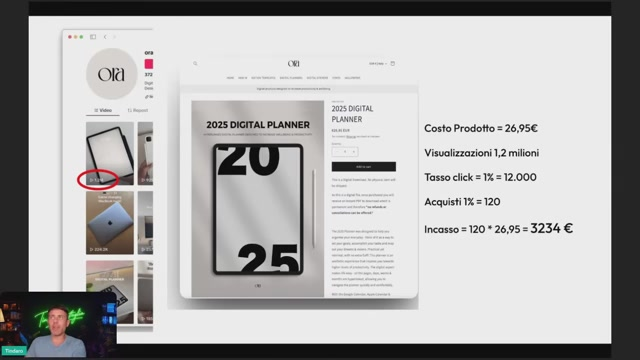

**Testo a schermo (OCR):** Costo Prodotto = 26,95€ Visualizzazioni 1.2 milioni Toso clek=1%=12.000 Acquisti =120 Incosso=120* 26,95=3234 €

> E poi, ragazzi, l'1% ha acquistato. Quindi abbiamo 120 acquisti. Ora, se noi andiamo a moltiplicare 120 per il costo del prodotto, 120 per 26,95, ragazzi, allora il nostro tanto agognato extra, pensate, 3.234 Euro generati con un singolo TikTok. Ora, moltiplicate i profitti, che vi ho fatto vedere, quindi fate lo stesso calcoletto come esercizio voi, per le visualizzazioni dei TikTok che, ripeto, sono stati realizzati in modo semplicissimo, perché basta solo utilizzare la fotocamera o uno smartphone, e avrete idea del potenziale di questo business. E il tutto senza spendere un centesimo, senza metterci la faccia, senza campagne di advertising, e sfruttando unicamente la forza del brand. E non si sa chi c'è dietro questo ora a papers, ragazzi. E' chiaro?

## [01:11:18] Schermata 138 _(scene)_

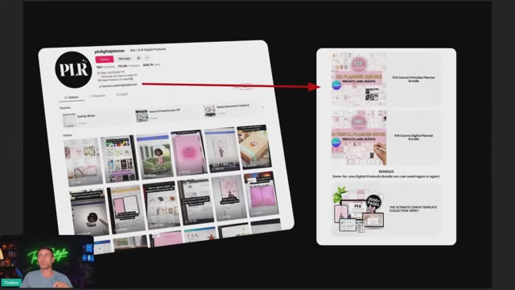

> Altro esempio. Questo è un altro store su TikTok, è un profilo TikTok, si chiama PLA Digital Planner. Vende dei template per fare mockup. Ok? Anche in questo caso, ragazzi, abbiamo 1.3 Milioni, 1.2 Milioni, eccetera, eccetera. Ragazzi, TikTok è gratis. Potete applicare la stessa strategia su Instagram, quindi non mi dite, quindi tocca avere anche TikTok. Perché, ragazzi, per fare questo business, considera avere un cazzo. Dovete avere CiaGPT, che costa, se volete utilizzare il Pro, 20 dollari al mese, che sono un cazzo. Poi dovete avere System.Io, che costa un cazzo, perché iniziate gratis. E poi dovete perfino avere TikTok, che è gratuito. Quindi pensate un po', ragazzi, quanta roba difficile che dovete avere per iniziare con questo business. Dai. Siamo seri. Ma a questo punto mi vorreste dire, come si realizza un TikTok in modo che vada virale?

## [01:12:09] Schermata 139 _(scene)_

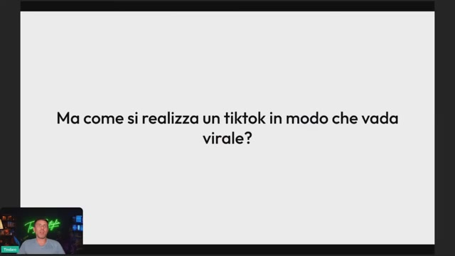

**Testo a schermo (OCR):** Ma come si realizza un tiktok in modo che vada virale?

> Sì, Tinder è tutto bellissimo, ma quelli facevano 1.2 Milioni di visualizzazioni. Ma come fai a fare tutte quelle visualizzazioni? Allora ve lo spiega il prof, ragazzi, non vi preoccupate. Non vi preoccupate. Si realizza attraverso una tecnica molto semplice, ma che comunque richiede tempo, che io ho chiamato tecnica del tassello. Allora, per farlo, pensiamo al video che realizziamo su TikTok, su Instagram, quello che volete voi, composto da tre tasselli ben distinti. La parte iniziale, che si chiama hook. La parte centrale, che è il corpo. La parte finale, che è la chiamata all'azione, call to action. Cioè invito ad acquistare qualche cosa. Quindi, l'hook attira l'attenzione. Il corpo convince che il nostro prodotto digitale è la soluzione migliore per la necessità del tizio. La CTA dice, ok, se lo vuoi acquistare, vai sul link. Invio e acquisto. Ok? Una volta diviso questo TikTok in tre parti, testiamo questi tre tasselli andando a cambiare per esempio il hook e lasciando il corpo e la CTA uguali, in modo da capire che cosa

## [01:13:09] Schermata 140 _(periodic)_

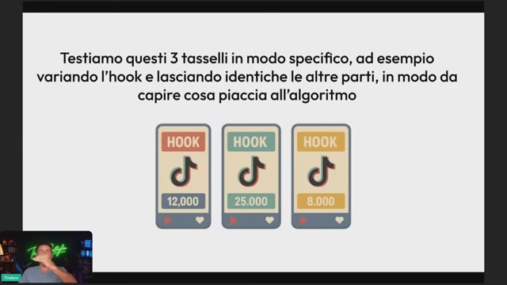

**Testo a schermo (OCR):** Testiamo questi 3 tasselli in modo specifico, ad esempio variando l’hook e lasciando identiche le altre parti, in modo da capire cosa piaccia all’algoritmo | Hook | DO o) lo

> piace all'algoritmo. Ok?

## [01:13:14] Schermata 141 _(scene)_

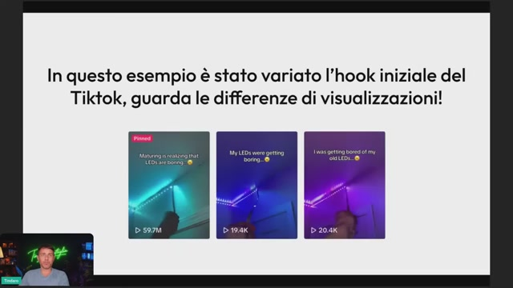

**Testo a schermo (OCR):** In questo esempio è stato variato l’hook iniziale del Tiktok, guarda le differenze di visualizzazioni!

> Vi faccio un esempio. In questo esempio è stato variato il hook iniziale di TikTok. Guardate, partiamo da quella a destra. I was getting bored of my old LEDs. Mi stavo annoiando dei miei vecchi LEDs. 20.400 Visualizzazioni. Poi che cosa ha fatto? Ha cambiato l'anteprima del TikTok, quindi anziché avere il LED, sempre la mano che sta staccando i LED, anziché avere il LED viola, l'ha trasformato in LED blu. 19.400 Visualizzazioni. Poi che cosa ha fatto? Ha cambiato il LED in verde e ha cambiato anche il testo. Measuring is realizing that LEDs are boring. Maturare significa realizzare che i LEDs sono noiosi. Bam! 59 Milioni di visualizzazioni. Ovviamente poi l'ha messo in evidenza. Guardate come funziona, ragazzi, la tecnica del tassello. In questo caso stesso identico TikTok. Stesso identico TikTok che è stato inserito tre volte. Ma il link in bio su TikTok? Io già lo so perché non lo chiederete. Non si può mettere se non avete mille followers. Benissimo, ragazzi.

## [01:14:14] Schermata 142 _(periodic)_

**Testo a schermo (OCR):** In questo esempio è stato variato l’hook iniziale del Tiktok, guarda le differenze di visualizzazioni!

> Utilizzate Instagram. La strategia è perfettamente identica. Oppure, ragazzi, visto che non pagate un cazzo, visto che state facendo una strategia in organico e la strategia in organico vi permette di non spendere soldi nelle campagne, il riscontro, d'altra parte la medaglia, è che ci vuole più tempo. Ragazzi, come si fa ad avere mille followers? Tempo! Create TikTok fin quando raggiungete mille followers. Oppure utilizzate Instagram che vi permette di avere già il link in bio. Ci siamo ragazzi fino a qui? Mi sembra abbastanza semplice.

## [01:14:48] Schermata 143 _(scene)_

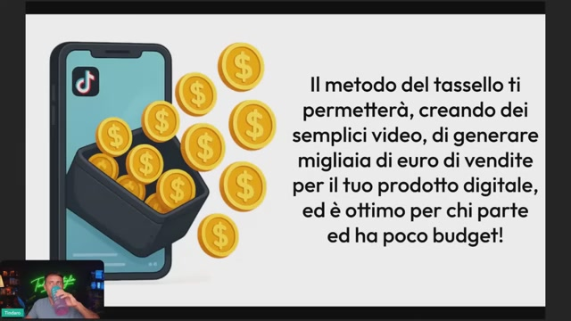

**Testo a schermo (OCR):** Il metodo del tassello ti permetterà, creando dei semplici video, di generare migliaia di euro di vendite per il tuo prodotto digitale, ed è ottimo per chi parte ed ha poco budget!

> Il metodo del tassello vi permetterà, creando dei semplici video, di generare migliaia e migliaia di euro di vendite. Per il vostro prodotto digitale, ovviamente. Ed è ottimo per chi parte a poco budget. Per quanto riguarda invece il traffico a pagamento,

## [01:15:04] Schermata 144 _(scene)_

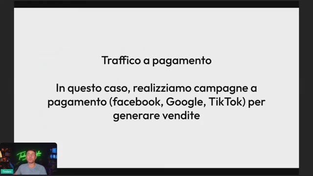

**Testo a schermo (OCR):** Traffico a pagamento In questo caso, realizziamo campagne a pagamento (facebook, Google, TikTok) per generare vendite

> in questo caso realizziamo delle campagne pagando Facebook, pagando Google, pagando TikTok, con soli 5 euro al giorno, o una strategia che vi permette di partire con un solo 5 euro. E in questo modo possiamo realmente scalare il business.

## [01:15:17] Schermata 145 _(scene)_

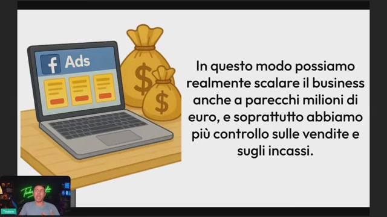

**Testo a schermo (OCR):** In questo modo possiamo i realmente scalare il business anche a parecchi milioni di euro, e soprattutto abbiamo più controllo sulle vendite e sugli incassi.

> Anche a parecchi milioni di euro la mia azienda spende centinaia di miliardi di euro ogni singolo mese su Facebook e guadagna milioni di euro. Ok? Come si raggiungono queste cifre? Ragazzi, facendo campagne pubblicitarie. Magari iniziate in organo, iniziate con poco budget, e poi appena vedete che inizia a vendere, andate a scalare. Quindi aumentare la spesa.

## [01:15:41] Schermata 146 _(scene)_

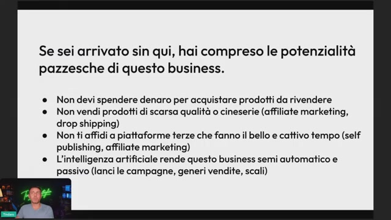

**Testo a schermo (OCR):** Se sei arrivato sin qui, hai compreso le potenzialità pazzesche di questo business. Non devi spendere denaro per acquistare prodotti da rivendere Non vendi prodotti di scarsa qualità o cineserie (affiliate marketing, drop shipping) Non ti affidi a piattaforme terze che fanno il bello e cattivo tempo (self publishing, affiliate marketing) L'intelligenza artificiale rende questo business semi automatico e passivo (lanci le campagne, generi vendite, scali)

> Ora, se sei arrivato fin qui, hai compreso le potenzialità pazzesche di questo business. Perché, ragazzi, non dovete spendere denaro per acquistare prodotti da rivendere. Non vendete prodotti di scarsa qualità o cimeserie, come nella fillet marketing, come nel drop shipping. Non vi affidate a piattaforme terze che fanno il bello e il cattivo tempo, come il self-publishing, la fillet marketing. E soprattutto l'intelligenza attiviziale rende questo business semi-automatico e passivo. Perché una volta che iniziate, lanciate le campagne, generate vendite e scalate. E generate sempre più vendite. Ora ti rivelerò l'ultimo tassello del puzzle che ti permetterà finalmente di fare la differenza e crearti un business realmente profittevole. Però, prima di rivelarti tutto, voglio che mi diciate, vi rendate conto dell'enorme opportunità che vi sto presentando? Se avete capito, ragazzi, l'enorme rivoluzione, e dovete averla capita, visto che abbiamo fatto una workshop di tre giorni in cui vi ho dimostrato, ragazzi, punto per punto,

## [01:16:41] Schermata 147 _(periodic)_

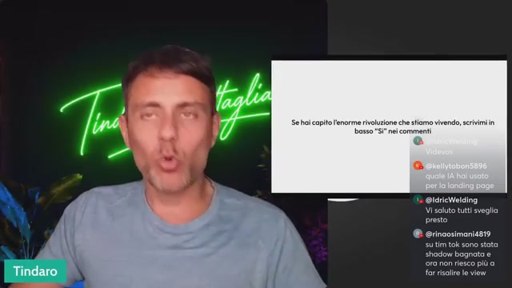

> come l'intelligenza artificiale oggi ci permetta di crearci un business praticamente semi-automatico e passivo ed estremamente profittevole a costi irrisori, ragazzi. Se vi rendete conto, se avete capito l'enorme rivoluzione che stiamo vivendo, ragazzi, spaccate questo chat di commenti con Sì. Fatemi capire, ragazzi, che il tempo che stiamo passando vi ha fatto capire l'enorme potenzialità di questo business. E si è entusiasmante, Eren, assolutamente. Eh sì, ragazzi. Questo è il futuro. E vi ricordo che siamo ancora all'inizio, ragazzi. Quindi, chi prima inizia, ve ne alloggia. Perché in questo momento c'è una competizione assolutamente, praticamente nulla. Ora, se hai capito l'enorme rivoluzione che stiamo vivendo, oggi voglio darti un'enorme opportunità. L'opportunità di sfruttare le migliori tecnologie esistenti per creare il tuo business di prodotti digitali 2.0.

## [01:17:38] Schermata 148 _(scene)_

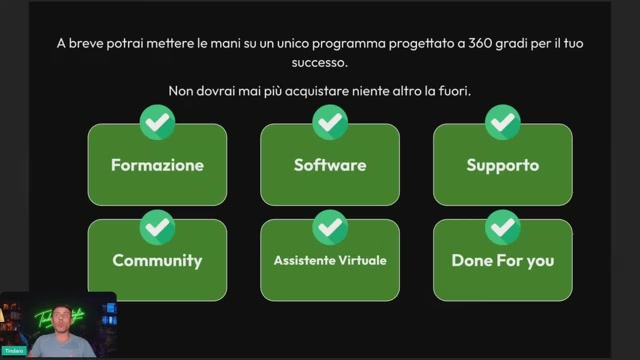

**Testo a schermo (OCR):** A breve potrai mettere le mani su un unico programma progettato a 360 gradi per il tuo successo. Non dovrai mai più acquistare niente altro la fuori. Formazione Software Supporto Community Assistente Virtuale Done For you

> A breve, potrai mettere le mani su un unico programma progettato a 360 gradi per il tuo successo. Non dovrete mai, ragazzi, questa è la mia promessa, mai più acquistare niente altro là fuori. Perché a breve avrete formazione, software, supporto, community, assistente virtuale, done for you.

## [01:17:59] Schermata 149 _(scene)_

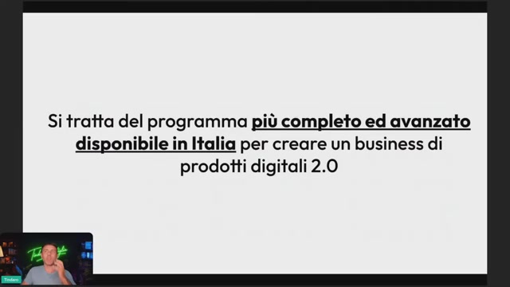

**Testo a schermo (OCR):** Si tratta del programma più completo ed avanzato disponibile in ltalia per creare un business di prodotti digitali 2.0

> Ora vi mostrerò il programma più completo e avanzato disponibile in Italia per crearsi un business di prodotti digitali 2.0. È da oggi l'unico che vi permette di crearvi un business di prodotti digitali 2.0. Sto parlando, ragazzi, di lui, del percorso per eccellenza che ha sfornato centinaia di casi di successo con i prodotti digitali e che annovera migliaia di studenti che ogni singolo giorno lavorano e generano profitti con i prodotti digitali. Vi sto parlando, ragazzi, di Digibook.

## [01:18:31] Schermata 150 _(scene)_

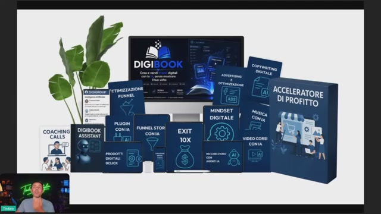

**Testo a schermo (OCR):** ACCELERATORE | DI PROFITTO n rmestO ext Didoox | Coma. meet 10x

> Che cos'è Digibook, ragazzi? Digibook è l'unico percorso di riferimento in Italia, non esiste niente altro così aggiornato e con un supporto come quello che vi mostrerò, per creare un business di prodotti digitali 2.0 In modo automatizzato senza mostrare il vostro volto. È un percorso ingegnerizzato, è il proprio caso di dirlo, che sono un ingegnere, per massimizzare il vostro successo con i prodotti digitali basandosi su tre step ben precisi che chiunque, e l'abbiamo visto in questo workshop, può seguire anche senza nessuna esperienza pregressa. Quali sono questi tre pilastri di mercato, ragazzi, che abbiamo visti?

## [01:19:06] Schermata 151 _(scene)_

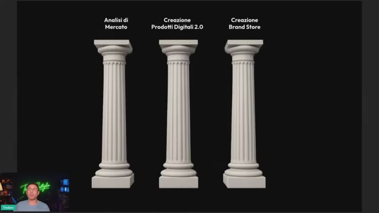

**Testo a schermo (OCR):** noti prode Digiai2o siondsiore Ill

> Analisi di mercato, creazione dei prodotti digitali 2.0, Creazione del brand store.

## [01:19:12] Schermata 152 _(scene)_

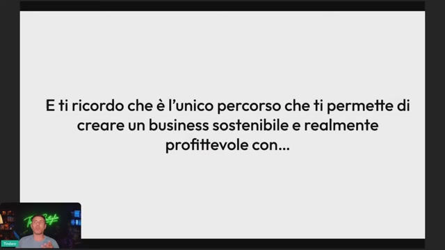

**Testo a schermo (OCR):** E ti ricordo che è l’unico percorso che ti permette di creare un business sostenibile e realmente profittevole con...

> E ti ricordo che è l'unico percorso che ti permette di creare un business sostenibile nel tempo e realmente profittevole con nessuna esperienza richiesta, in soli 120 minuti al giorno, ha una scalabilità, la possibilità di guadagnare è praticamente infinita, perché potete vendere in tutto il mondo, zero budget per creare il prodotto, ragazzi, se volete utilizzare, ok, siamo precisi, 20 euro al mese se volete creare il vostro prodotto, centinaia e migliaia di prodotti attraverso GPT, se utilizzate GPT a pagamento, altrimenti partite con la versione free. Zero budget per creare lo store, lo abbiamo visto in questa live con Sistema.Io. E il tutto, ragazzi, senza vendere cineserie, senza vendere schifezze, senza pagine vendite a fake, senza quei trucchi che vedete, roba black, drop shipping, prendo i soldi, non spedisco. No, ragazzi, qui si sta parlando di un business serio con prodotti di altissima qualità e sostenibile nel tempo, senza spedizioni, non dovete avere spedizioni, non dovete avere dogana, non dovete avere magazzino. Quindi, se sei rimasto qui fino alla fine, eccoti la sorpresa di stasera, quindi le sorprese.

## [01:20:12] Schermata 153 _(periodic)_

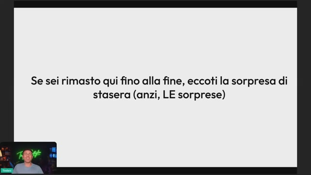

**Testo a schermo (OCR):** Se sei rimasto qui fino alla fine, eccoti la sorpresa di stasera (anzi, LE sorprese)

> Sorpresa numero uno. Con Digibook andiamo oltre la semplice intelligenza artificiale. Digibook diventa il primo percorso in Italia a spiegarti come creare un business di prodotti digitali grazie alla tecnologia più avanzata ad oggi esistente, gli agenti AI. Digibook, infatti, ti permetterà di realizzare prodotti digitali di altissimo valore, di eccezionale livello grafico, senza alcuna esperienza e in pochi minuti. Ti basterà solamente conoscere i prompt che io stesso ho realizzato e vi fornirò l'agente AI che farà tutto al posto vostro creandovi un prodotto digitale 2.0 Pronto da vendere. Non solo questo, ragazzi, anche ricerca di mercato.

## [01:20:55] Schermata 154 _(scene)_

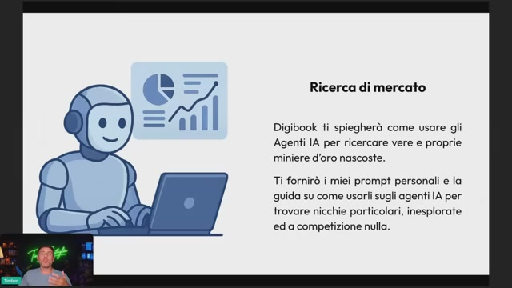

**Testo a schermo (OCR):** Ricerca di mercato Digibook ti spiegherà come usare gli Agenti IA per ricercare vere e proprie miniere d'oro nascoste. Ti fornirà i miei prompt personali e la guida su come usarli sugli agenti |A per trovare nicchie particolari, inesplorate eda competizione nulla.

> Ok, parliamo della ricerca di mercato. Digibook vi permetterà di utilizzare gli agenti AI per ricercare vere e proprie miniere d'oro nascoste. Vi fornirò i miei prompt personali, vi fornirò la guida su come utilizzare gli agenti AI per trovare nicchie particolari, inesplorate e a competizione nulla. Vi spiegherò come generare prodotti digitali 2.0 Senza utilizzare altri software, senza perdere tempo nel sistemarli. Utilizzerete, così come avete visto in questo workshop, solamente tutti i miei prompt completi, copia e incolla e in pochi minuti, ragazzi, avrete il prodotto digitale pronto da vendere. Questo è un esempio, si chiama WhatsApp Seduction Secrets.

## [01:21:31] Schermata 155 _(scene)_

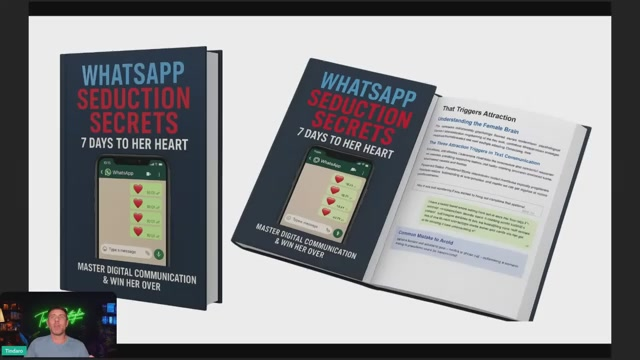

**Testo a schermo (OCR):** SEDUCTION SECRETS 7DAYS TO HER HEART

> È un insieme, è un e-book che spiega come riconquistare attraverso i messaggi WhatsApp. Quindi siamo nel settore, nel mercato dell'amore, ok? Degli incontri. Guardate, ragazzi, la grafica spettacolare di questo e-book. Spettacolare, ragazzi. Tutto questo lo realizzate con gli agenti AI, con gli agenti che vi spiegheranno in Digibook.

## [01:21:52] Schermata 156 _(scene)_

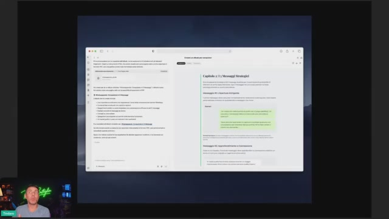

> Ok, guardate che grafica spettacolare. Ma non solo questo, ragazzi. Con Digibook imparerete come creare software con gli agenti AI. Ve li ho mostrati alcuni dietro le quinte della mia azienda quando vi ho mostrato ieri. Nella live vi ho mostrato tutti i software che io realizzo. Bene, con Digibook potrete realizzare cose del genere. Potrete creare plugin, potrete creare web app e vi spiegherò come renderli disponibili subito post acquisto. E il tutto senza dover essere programmatori, senza conoscere una riga di codice, senza dover gestire database, senza dover conoscere nulla di programmazione. Vi spiegherò come fare tutto quanto con l'intelligenza artificiale.

## [01:22:27] Schermata 157 _(scene)_

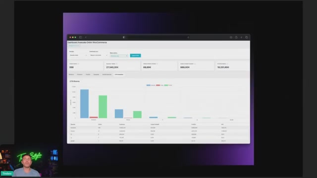

> Questo è un esempio di software. Tra l'altro, oltre a quelli che vi ho mostrato nel dietro le quinte della mia azienda che ho fatto ieri, questo è un esempio di software per il mio e-commerce. Mi serviva un software che mi dicesse dove derivavano le vendite. Bene, conoscenze che ho con Digibook, le ho sfruttate, ho creato il mio software e ora lo gestisco. Molto, molto semplice. Ho risolto un problema della mia azienda, ragazzi. E questo software lo posso rendere.

## [01:22:50] Schermata 158 _(scene)_

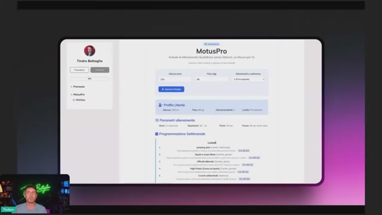

**Testo a schermo (OCR):** MotusPro

> Questo è un altro esempio, ragazzi, di software che si chiama Otus Pro che vendevo con System.Io nell'istante in cui le persone acquistavano un e-book sulla forma fisica. Quindi vendevo un e-book sulla forma fisica quando lo acquistavano, vendevo come upsell un ulteriore prodotto che era questa web app che ho realizzato e che poi sta dentro System.Io. Quindi, nell'istante in cui l'utente acquistava, gli si sbloccava l'app. Vedete? Questa è un'applicazione che si chiama Otus Pro, poi è andata a definire l'altezza, il peso, il numero di allenamenti a settimana e lui gli crea in automatico la scheda. Ficata, ragazzi, no? Una ficata pazzesca. Tutto questo è stato realizzato in pochissimi secondi grazie all'intelligenza artificiale.

## [01:23:24] Schermata 159 _(scene)_

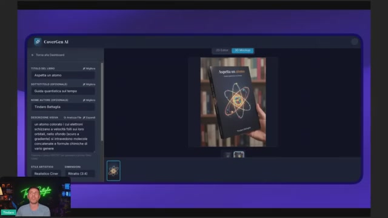

> Oggi ne hai! Ve lo ricordate, ragazzi? Ve l'ho mostrato ieri come realizzare delle spettacolari copertine, mock-up di libri, mock-up 3D direttamente con l'intelligenza artificiale. Tutto questo, ragazzi, imparerete a farlo e soprattutto, cosa più interessante, a vendere questi prodotti

## [01:23:41] Schermata 160 _(scene)_

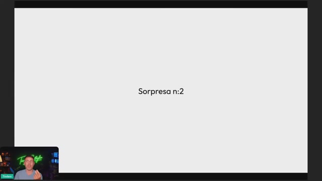

**Testo a schermo (OCR):** Sorpresa n:2

> grazie a Digibook. Sorpresa numero 2. Per anni ho pensato come fosse possibile dare il maggior supporto possibile ai miei studenti. È vero, sono sempre presente. È vero, ragazzi. Rispondo nei gruppi, facciamo live ogni singola settimana a breve vi mostro tutto. Però, ragazzi, ci ho pensato a lungo. Com'è possibile fornire ancora più supporto dato direttamente dalle mie conoscenze H24? Cioè, se voi siete alle 2 del mattino a lavorare su un prodotto digitale, avete un dubbio? E volete una risposta istantanea. Come si fa questa cosa? Beh, ragazzi, dopo averci pensato a lungo,

## [01:24:15] Schermata 161 _(scene)_

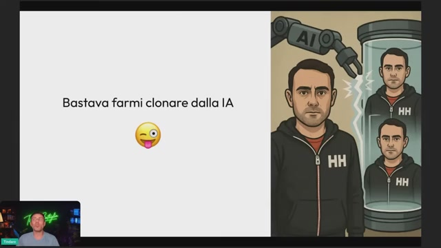

**Testo a schermo (OCR):** Bastava farmi clonare dalla IA

> ho trovato la soluzione. Bastava farmi clonare dall'intelligenza artificiale.

## [01:24:20] Schermata 162 _(scene)_

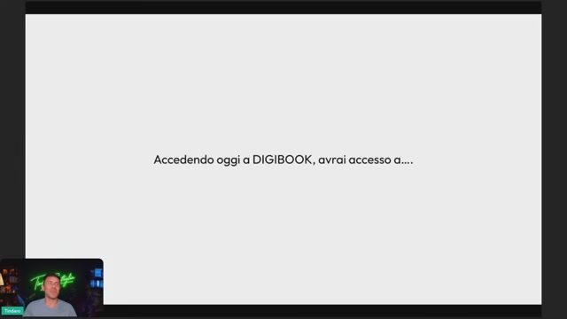

**Testo a schermo (OCR):** Accedendo oggi a DIGIBOOK, avrai accesso a....

> Infatti, accedendo oggi a Digibook, avrete accesso anche a Digibook Assistant. Che cos'è, ragazzi, Digibook Assistant?

## [01:24:26] Schermata 163 _(scene)_

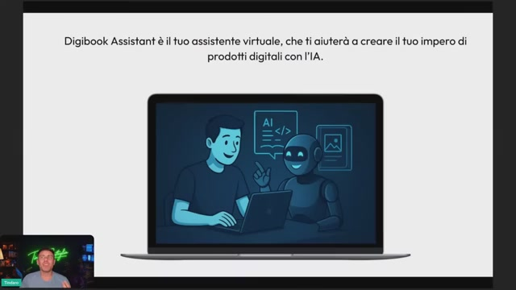

**Testo a schermo (OCR):** Digibook Assistant è il tuo assistente virtuale, che ti aiuterà a creare il tuo impero di prodotti digitali con l'A.

> È il tuo assistente virtuale che ti aiuterà a creare il tuo impero di prodotti digitali con l'IA.

## [01:24:31] Schermata 164 _(scene)_

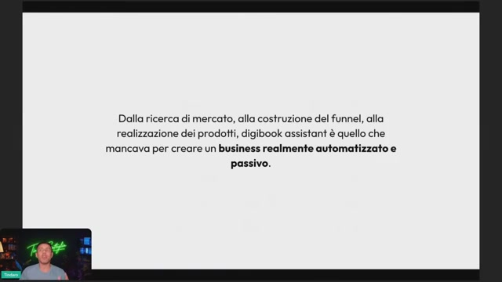

**Testo a schermo (OCR):** Dalla ricerca di mercato, alla costruzione del funnel, alla realizzazione dei prodotti, digibook assistant è quello che mancava per creare un business realmente automatizzato e passivo.

> Dalla ricerca di mercato, alla costruzione del funnel, alla realizzazione di prodotti, Digibook Assistant è quello che mancava e che oggi finalmente c'è per creare un business realmente automatizzato e passivo. Volete vedere, ragazzi, come funziona Digibook Assistant? Scrivetemi bomba nei commenti e vi mostro subito come funziona questo spettacolare intelligenza artificiale creata appositamente che contiene tutte le informazioni di Digibook pronte a portata di mano per realizzare il vostro prodotto digitale, il vostro business di prodotti digitali. Scrivetemi bomba, ragazzi, e ve lo mostro subito. Allora, allora... Andiamo a Digibook Assistant, ragazzi, dai.

## [01:25:21] Schermata 165 _(scene)_

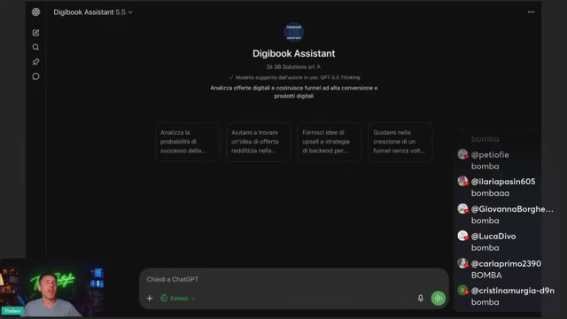

**Testo a schermo (OCR):** Diibok Assistant 55 > Digibook Assistant. ® e a DI o È dpetiofie È @corlaprimo2390 cea cont BOMBA iti Esss ce Se

> Allora, questo è Digibook Assistant. Lo vedete? Aspettate che aumento un po' perché poi qualcuno mi dice che non si vede. Questo, ragazzi, è il mio... Questo, ragazzi, è un'intelligenza artificiale, un GPT personalizzato che è stato istruito con tutte le informazioni di Digibook. Quindi, guardate, gli dico, ad esempio, Pornissimi, due nicchie di mercato, quindi, ragazzi, prompt molto generici, ok? Digibook Assistant funziona sul prompt estremamente generico. Non avete bisogno di prompt complessi. Pornissimi due nicchie di mercato profittevoli nel 2026 per i miei prodotti digitali nel campo del made money online, nel campo dei soldi. Ok? Andiamo a questo prompt. Vedete, ragazzi, un prompt semplice. Non sto dando chissà cosa. Vedete che GPT, quindi Digibook Assistant, ricerca all'interno, vedete qui, ragazzi? Ricerca all'interno, intanto, della sua documentazione

## [01:26:21] Schermata 166 _(periodic)_

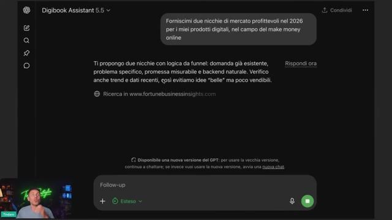

**Testo a schermo (OCR):** 0% 06 @ Digibook Assistant 55 > di Condividi Formiscimi due nicchie di mercato proitevoli nl 2026. peri miei prodotti digita, nel campo del mate money nine Ti ropongo due richie con logica da fun: domanda gi esistente, |’ Risponsi oa problema specifico, promessa misurabile 0 backend naturale. Vrfico anche trend e dati recenti, gps evitiamo idee “bal” ma poco vendi ® Ricerca inn fortunebusinessinsio

> interna. Digibook Assistant ha già accesso a tutte le informazioni di Digibook, a tutta la mia esperienza, è tutta condensata all'interno di questa intelligenza artificiale. Non solo, va a ricercare anche nei siti web, che conosce perché ha tutta una sua struttura interna, ed ecco qui. Due nicchie make money online che vedo molto più forti nel 2026 rispetto ai classici venditemplate Kamba Notion. Allora, AI automation freelancer per microbusiness. Nicchia, insegnare a principanti freelancer a vendere microautomazioni AI a PMI. Esempio di posizionamento solo frontend, come guadagnare i tuoi primi 500-1500 euro al mese vendendo semplici automazioni AI a studi professionali, agenzie e attività locali, anche senza saper programmare. Perché profitevo nel 2006 e la domanda alla tazienda è molto forte. Ragazzi, wow, vi rendete conto che ci ha trovato in pochissimi secondi? Guardate la specificità. Angolo vincente. Non venderei in parallel AI, venderei il sistema per trovare attività locali che stanno perdendo tempo in attività

## [01:27:21] Schermata 167 _(periodic)_

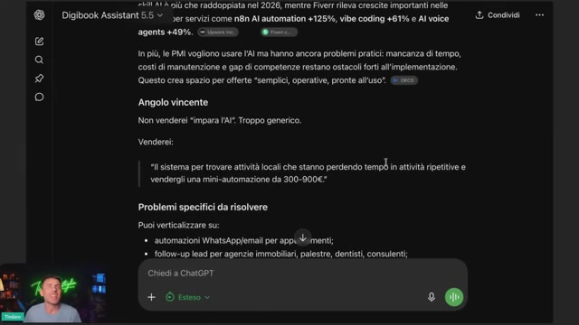

**Testo a schermo (OCR):** e e CI E) ) SISI PAZII CIO VRCIGRDROTE DI 3019, ENBOINE FIVOTE TRGVA GIRRORO HUportanti 1006. Digibook Assistant 5.5 + er servizi come n@n AI automation +125%, vibe coding +61% e Al voice -—ΰ Condvai agente vdo. CORR E n più, o PMI vogliono usare ma hanno ancora problemi pratici: mancanza di tempo, costi di manutenzione e gap di competenze restano ostacl for allimpiemantaione Questo crea spazio per feta “semplei, operative, prot Angolo vincente Non venderei “impara A Troppo generico Vendere: “1 sistema per trovare attivit cali che stanno perdendo temp in attività iettive e vendergli un mir-automazone da 300-900€" Problemi specifici da risolvere Puoi voticalzzare su: automazioni WhatsApp/omal per appi lime = folon-up lead per agenzie immobiliari, palestre, dentisti, consulenti Chigi a ChatGPT + ius i)

> ripetitive. Guardate ragazzi anche il copy che sta utilizzando che è spettacolare. E vendete una mini-automazione a 300-900 euro. Problemi specifici che risolve. Il funnel consigliato. Ragazzi, vi da pure il funnel. Pazzesco. Frontend a 27-47 euro. Vi dice anche il prezzo. Il mini-corso che dovete realizzare. L'order bump a checkout. I vari sell. Il meccanismo unico. Vi ricordate quello che vi ho detto? Il prodotto deve essere differenziante, deve avere un metodo suo. Ecco, Digibook Assistant lo sa perché ha al suo interno tutte le conoscenze aggiornate di Digibook. Siamo ragazzi al decimo aggiornamento che ho distribuito in modo del tutto gratuito del percorso ai miei studenti. Tutti gli aggiornamenti sono gratuiti. Valutazione della domanda. Domanda, urgenza, concorrenza. Nicchia numero 2. Hai content repurposing per creator, coach e piccoli brand? Come guadagnare 30-100 euro al giorno trasformando video lunghi di coach, creator e aziende in contenuti brevi e ponti da pubblicare? Perché è profittevole?

## [01:28:21] Schermata 168 _(periodic)_

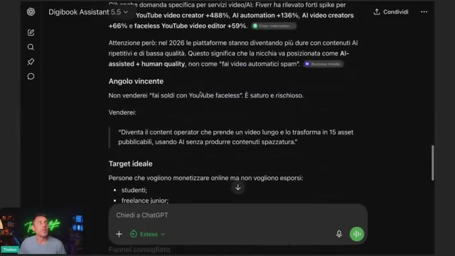

**Testo a schermo (OCR):** e e a 2 e) Sane Soleanide Rpacilica par servizi visiaotak river ha rilevato fort pila per. Digibook Assistant 5.5 ©. YouTube video creator +488%, Al automation +136%, AI video creatore È Cent +06%4 0 faceless Youtube video editor 450%. ili Attenzione per: el 2026 le piattaforme stanno diventando più dre con contenuti AI ipettivi edi bassa qualtà. Quest igifica che a nichi va posizionata come A- assisted + human quality, non como “ai video automati spam. Angolo vincente Non venderi “i soldi cn Youube faces" È saturo e rischioso. “Diventa l content operator che prende un video lungo e lo trasforma n 15 asset! pubblica, usando Al conza produrre contenuti spazzatura” Target ideale Persone che vogliono monenizzare nino ma non vogliono esporsi + student È freelance junior; Chiedi a ChtPT + © tano» ‘0®

> L'angolo vincente? Il target ideale? Il frontend? Guida mini-corso? Order bump? Ok, diciamo per esempio, mi piace la nicchia di mercato numero 2. Calcolami una spesa giornaliera in campagne pubblicitarie pubblicitarie di 5 euro a quanto devo e con il prodotto di frontend a 19 euro? Se ho un costo della mia pubblicità di 10 euro, come andare a guadagnare 20 euro per ogni vendita? In questo caso anche

## [01:29:21] Schermata 169 _(periodic)_

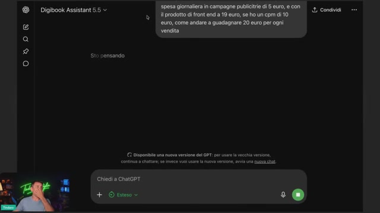

**Testo a schermo (OCR):** 2 ‘spesa giomaliera in campagne publiire d 5 UT, € CON 1, Condui @ | Digibook Assstant55 u [[lrodotoiiint nda corea honenmanio i © è 1, come ande uadbgar 20 co per gn esi a ? Sto pensando ) Ghigi ChatGPT + © tano» +0

> Gbook Assistant ci pensa al suo interno delle tabelle, al suo interno delle automazioni che ho creato io stesso e vi dice, vedete qui, calcolando i guadagni per vendita, vedete? Vedete qui ragazzi? Si fa tutto il ragionamento suo, poi non dovete sapere nulla, ovviamente ragazzi vi potete studiare il percorso ma non avete bisogno, cioè, ve lo dovete studiare perché ragazzi è sempre bene avere informazioni però con Gbook Assistant dovete dare il tutto quanto. Calcolo base CPM 10, prezzo di frontend del prodotto a 19 euro, allora dovete per guadagnare 20 euro per vendita vi serve ok, dice che 20 euro per ogni vendita in questo caso è impossibile, quindi il frontend Il profitto vero deve venire da Bump e Appsell. E vi dice lo scenario realistico. Vedete, supponiamo una campagna decente, con una vendita ogni cinque giorni, vi dice che il tuo funnel deve portare il valore medio di ordine a 19,45. Ok? Già vi sta dicendo che con una strategia così, che io non sapevo perché l'ho buttata ad Mussum, in maniera totalmente casuale,

## [01:30:21] Schermata 170 _(periodic)_

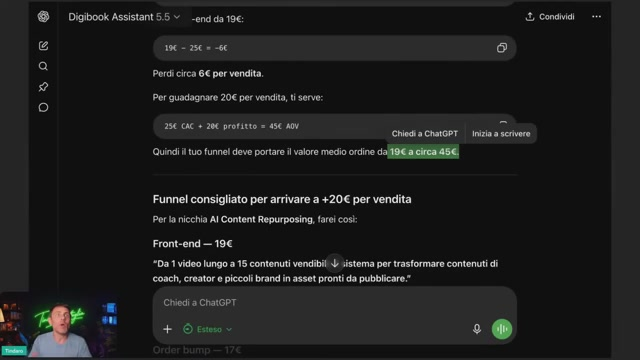

**Testo a schermo (OCR):** @ Digibook Assistant 55% «endda19e di Condivai @ ie - se = € È) a Perdi ica € per vendita. CI 3 Per guadagnare 20€ per vendita, i see: Ghigi ChtGOT inizi server. Quicituo tunnel deve porae valore mac ordine cf Funnel consigliato per arrivare a +20€ per vendita Peria nicchia AI Content Repurposing, fari così: Front-end — 19€ ‘031 video lungo a 15 contenuti vndibil istema per trastormare contenuti di ‘coach, creator picoli brand n sset pronti a pubblicare Chiedi ChtGPT + © tano» 0®

> vi sta già dicendo che è impossibile andare in profitto. Vi sta dicendo alt, ok? Con questa strategia, con soli 19 euro per vendita, non puoi andare avanti. Devi portare lo scontrino medio, cioè quanto l'utente spende nel tuo store, a 45 euro. Cioè vi rendete conto, ragazzi, della marea di informazioni che vi sta dando. Sta predicendo quello che dovete fare, come lo dovete fare, che prezzo dovete avere. Ovviamente gli potete dire anche la strategia da utilizzare e lui ve la dirà per andare in profitto con le campagne pubblicitarie. Ragazzi, wow. Semplicemente wow. Non esiste nulla di simile attualmente per quanto riguarda la vendita di prodotti digitali. Ragazzi, Digibook Assistant è il salto evolutivo che mancava.

## [01:30:59] Schermata 171 _(scene)_

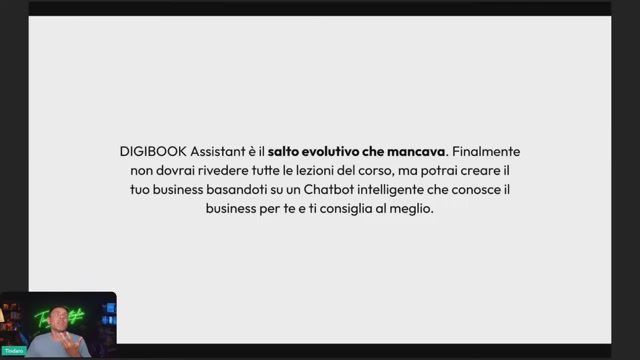

**Testo a schermo (OCR):** DIGIBOOK Assistant è il salto evolutivo che mancava. Finalmente non dovrai rivedere tutte le lezioni del corso, ma potrai creare il tuo business basandoti su un Chatbot intelligente che conosce il business per te e ti consiglia al meglio.

> Finalmente non dovrete vedere tutte le lezioni del corso. Io vi invito a guardare perché comunque sono interessantissime. Però potrete creare il vostro business basandovi su un chatbot intelligente che conosce il business per voi e vi consiglia al meglio. Sorpresa numero tre. In Digibook vi spiegherò la stessa esatta strategia che utilizzo per creare campagne pubblicitarie su Facebook, lanciarle con soli 5 euro al giorno. Quindi, ragazzi, non esiste l'obiezione schema di fare campagne pubblicitarie che sa quanto costano, ragazzi, 5 euro. 5 Euro ce le hanno tutti. Iniziare a ottenere vendite. Ora, uno dei problemi principali di chi si approccia alle Facebook Ads è appunto la parte creativa. Ma che immagini devo realizzare per le mie campagne pubblicitarie se non sono bravo a realizzarle e se non so utilizzare gli strumenti di fotoritocco? Proprio per questo, accedendo a Digibook, durante questo lancio avrete a vostra disposizione sempre e comunque un altro agente oltre al Digibook Assistant appositamente progettato al sottoscritto

## [01:31:59] Schermata 172 _(periodic)_

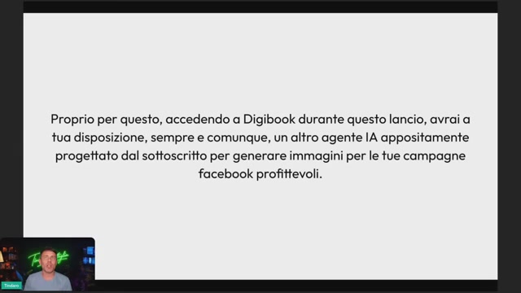

**Testo a schermo (OCR):** Proprio per questo, accedendo a Digibook durante questo lancio, avrai a tua disposizione, sempre e comunque, un altro agente IA appositamente progettato dal sottoscritto per generare immagini per le tue campagne facebook profittevoli.

> per generare immagini per le vostre campagne Facebook profittevoli.

## [01:32:03] Schermata 173 _(scene)_

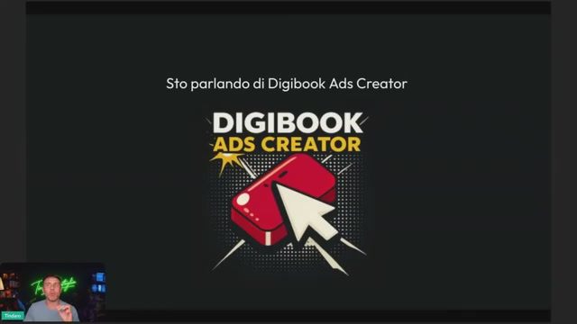

**Testo a schermo (OCR):** Sto parlando di Digibook Ads Creator DIGIBOOK ‘ADS CREATOR

> Sto parlando di Digibook Ads Creator. Che cos'è? È un altro agente AI, come Digibook Assistant, ma è stato progettato appositamente per creare delle ads, quindi delle immagini per le vostre campagne pubblicitarie vincenti. E utilizzarlo, ragazzi, è semplicissimo. Voi gli dovrete dire solamente che prodotto volete vendere, gli date magari la vostra pagina di vendita e lui vi crea già le immagini pronte per le vostre campagne pubblicitarie. Spettacolare! Non esiste nulla di simile in Europa. Sorpresa numero 4. Abbiamo capito che questo business è il più semplice da quale partire. Tuttavia, ragazzi, richiede un minimo di impegno, soprattutto per la parte grafica. L'abbiamo ripetuto più volte. La parte della landing, la parte dello store, la parte del prodotto. Ora, immaginate di accelerare il vostro business realizzando solamente il prodotto digitale insieme a noi ed avendo già il vostro store pronto, il vostro funnel pienamente operativo. Ho deciso di creare, quindi, qualcosa

## [01:33:03] Schermata 174 _(periodic)_

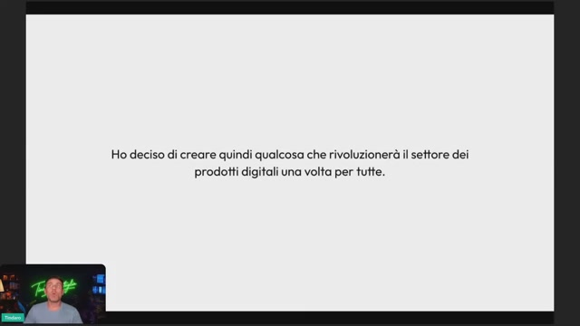

**Testo a schermo (OCR):** Ho deciso di creare quindi qualcosa che rivoluzionerà il settore dei prodotti digitali una volta per tutte.

> che rivoluzionerà il settore dei prodotti digitali, oltre per tutte. L'ho chiamato Acceleratore di Profitto. Che cos'è l'Acceleratore di Profitto? Ragazzi, voi dovete sapere che tra le mie innumerevoli aziende esiste anche la parte di agency. Ho un agency che stiamo architizzando

## [01:33:17] Schermata 175 _(scene)_

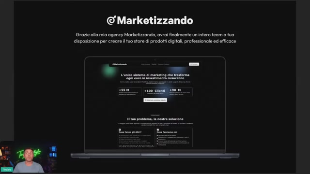

**Testo a schermo (OCR):** © Marketizzando Grazie alla mi ageney Merketizzando, evraiAncimente un intero feom o tuo disposizione per creare. uo stre di prodotti ii professionale ed efficace

> e finalmente, grazie alla mia agency, avrete a disposizione un intero team altamente professionale a vostra disposizione per creare il vostro store spettacolare di prodotti digitali professionali ed efficaci.

## [01:33:34] Schermata 176 _(scene)_

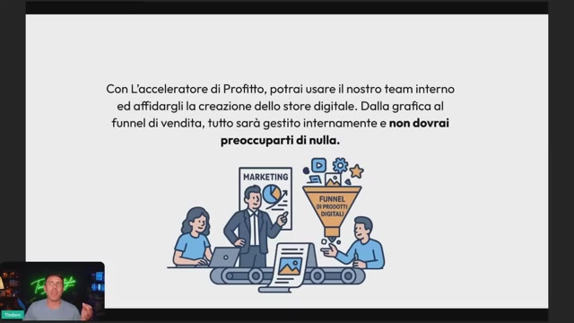

**Testo a schermo (OCR):** Con acceleratore di Profito, potrai usare il nostro team interno ed affidargli la creazione dello store digitale. Dalla grafica al fune! di vendita, tutto sarà gestito internomente e non dovrai

> Con l'Acceleratore di Profitto, come vi dicevo, potete utilizzare il mio team interno e affidarvi la creazione dello store digitale. Dalla grafica al funnel di vendita, tutto viene gestito internamente al mio team. Voi non dovete preoccuparvi di nulla. Voi dovete solamente creare i prodotti digitali con le nostre consulenze e con la formazione che vi do io e lanciare il vostro store che realizziamo noi con le nostre consulenze. Ragazzi, l'era di Dan For You, Truffaldini, termina oggi con questo servizio altamente professionale offerto in esclusiva dalla mia azienda. Ragazzi, azienda italiana, non l'azienda in inculonia con cui vi fottevano e poi scomparivano. Stiamo parlando, ragazzi, di un'azienda che opera nel settore da oltre 10 anni. La mia. E il sottoscritto ci mette la faccia da oltre 10 anni. Sempre la stessa, ragazzi. Tra l'altro non ho neanche fatto lifting, quindi si vedono tutti i 45.

## [01:34:23] Schermata 177 _(scene)_

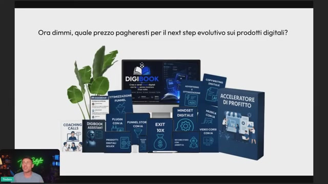

**Testo a schermo (OCR):** Ora dimmi, quale prezzo pagheresti per il next step evolutivo sui prodotti digitali? DIGISOON

> Allora, ora ditemi un attimo. Quale prezzo paghereste per il next step evolutivo sui prodotti digitali? Quanto paghereste per tutta questa roba, ragazzi?

## [01:34:32] Schermata 178 _(scene)_

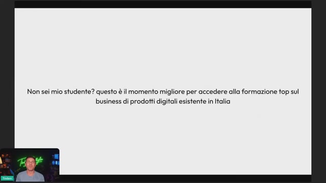

**Testo a schermo (OCR):** Non sei mio studente? questo è il momento migliore per accedere alla formazione top sul business di prodotti digitali esistente in Italia

> Non siete più studenti? Bene, ragazzi, questo è il momento migliore per accedere alla formazione top sul business di prodotti digitali esistenti in Italia.

## [01:34:41] Schermata 179 _(scene)_

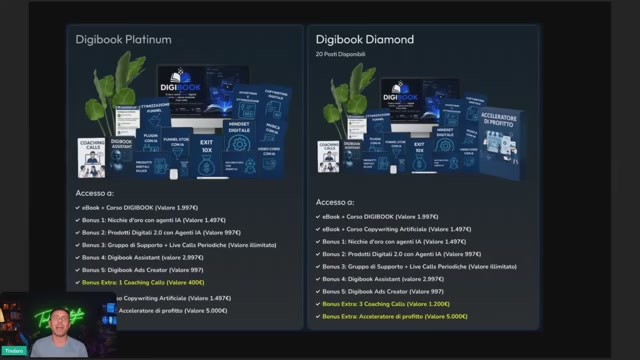

> Esistono due pacchetti che ora vi mostro. Anzi, facciamo scomparire per fuori anche un attimo il mio viso. Ok? Abbiamo due pacchetti, ragazzi. Il pacchetto Platinum e il pacchetto Diamond. Partiamo dal pacchetto Platinum. Vediamo un attimino in che cosa consiste. Allora, con Digibook Platinum avrete accesso all'ebook più il corso Digibook, valore 1.997 Euro. Tutti gli aggiornamenti. Siamo al decimo aggiornamento. Tra l'altro, ora vi mostrerò anche l'interno della nostra community in cui sto per sfornare l'undicesimo aggiornamento. Avrete accesso alle nicchie d'oro con gli agenti AI. Prodotti digitali 2.0 Con gli agenti AI. Gruppo di supporto più live call periodiche. Quindi ogni settimana il mio coach entra in call con voi e risolve i vostri problemi direttamente all'interno della community. Digibook Assistant. Quindi quello che vi ho mostrato prima. Il chatbot intelligente che vi permette di avere risposte immediate. Ovviamente all'interno del gruppo di supporto, ragazzi, rispondo pure io. Ora vi farò vedere il gruppo di supporto all'interno perché, ragazzi, a differenza di altri formatori

## [01:35:41] Schermata 180 _(periodic)_

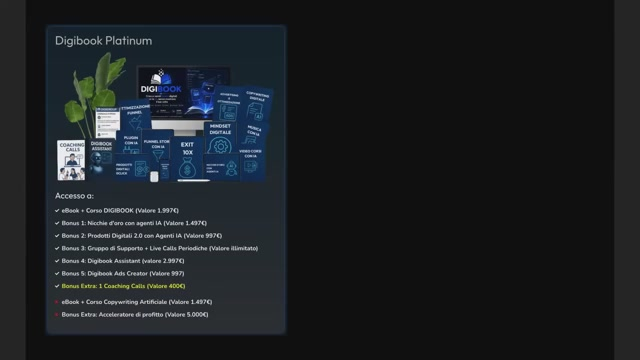

> qui vi mostro tutto in maniera totalmente trasparente comprese anche i risultati dei miei studenti e brevemente li mostro. Digibook Ads Creator. In più vi do una coaching call con il mio coach. Ok? Tutto questo, ragazzi, ha un valore di 7685 euro. Ma non vi preoccupate. Per soli cinque giorni, a partire da oggi, non l'acquisterete a 7.000. Non l'acquisterete a 5.000, Ragazzi. E non l'acquisterete neanche a 3.000 Euro. Ragazzi, solo per cinque giorni, vi portate a casa tutto questo ben di Dio a soli 1.997 Euro rateizzabili. Quindi voi partite con circa 70-80 euro. Vi si sblocca tutto questo ben di Dio e partite. È fuori di testa. Non esiste nessuno che può farvi un'offerta del genere. Sfido chiunque. Se vi fanno un'offerta del genere, io ve lo regalo, ragazzi.

## [01:36:41] Schermata 181 _(periodic)_

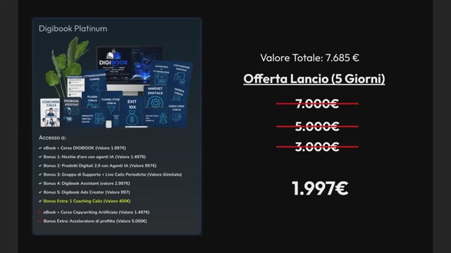

**Testo a schermo (OCR):** Digibook Platinum Î ay Valore Totale: 7.685 € Offerta Lancio (5 Giorni) —7000€ — 5.000€ — —B.000€ — 1.997€

> Non esiste nessuno che vi può fare un'offerta del genere. Partite, rateizzate, 1.80 Euro e partite subito. Vediamo l'offerta Diamond. Con questa avrete accesso sempre al percorso Digibook del valore di 1.997 Euro. Avrete accesso anche a un ulteriore percorso, un'operating artificiale che vi spiega esattamente come creare l'offerta con l'intelligenza artificiale, come creare le pagine di vendita con l'intelligenza artificiale, come creare i mail con l'intelligenza artificiale, come creare le campagne pubblicitare con l'intelligenza artificiale. Folle! Questo è un percorso, ragazzi, folle. Ve lo posso assicurare. Avrete accesso alle nicchie d'oro con gli agenti AI, prodotti digitali 2.0 Con gli agenti AI, gruppo di supporto, anche in questo caso, più live call periodiche ogni settimana. Entrate in live, c'è il mio coach. Fate le vostre domande, ottenete le vostre risposte. Avete un problema? Avete Digibook Assistant? Avete un altro problema? Scrivete nel gruppo, vi rispondo io. A breve vi mostrerò tutto dall'interno. Digibook Assistant, Ads Creator, tre coaching call con il mio coach e come bonus extra, ragazzi, acceleratore di profitto.

## [01:37:41] Schermata 182 _(periodic)_

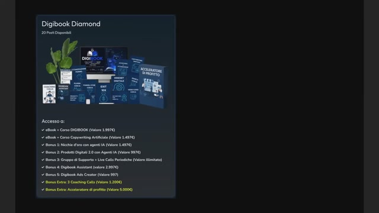

**Testo a schermo (OCR):** Digibook Diamond

> Il funnel ve lo creiamo noi. Un funnel altamente professionale. Ragazzi, questo ha un valore di 15.979 Euro. Perché, ragazzi, vi assicuro che merita. Però, per cinque giorni, non lo pagherete. Io mi sto vergognando di quello che vi proporrò, ve lo giuro, ma è una cosa scandalosa. Non pagherete 10.000 Euro. Non pagherete 5.000 Euro. Ragazzi, per cinque giorni a partire da oggi, vi portate a casa tutto questo benedio, più la realizzazione del funnel. Andate a chiedere a una qualsiasi agency di realizzare un sito web non meno di 4.000 Euro. Vi chiedono solo il sito web. Qui vi portate a casa tutto questo benedio, a soli 2.997 Euro. Meno del costo che spendereste per acquistare un funnel esterno. E in più avete il digibook, avete tutti gli aggiornamenti, avrete tre coaching call one to one con il mio coach, avrete accesso alla community supporto, avrete accesso alle coach che si fanno ogni singola settimana.

## [01:38:41] Schermata 183 _(periodic)_

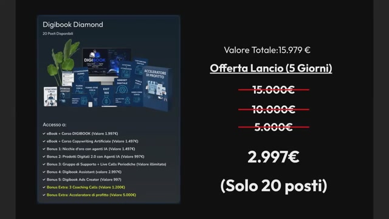

**Testo a schermo (OCR):** Digibook Diamond ' od è Valore Totale:15.979 € A; Offerta Lancio (5 Giorni) —A5.000€— — 10.000€ —_ 5.000€ — 2.997€ (Solo 20 posti)

> Tutti, ragazzi, percorsi. Questo sono 20 posti perché ovviamente non possiamo creare funnel a dismisura. Ovviamente il mio team deve creare funnel eccellenti, quindi possiamo avere solamente 20 posti per realizzare funnel con la nostra qualità.

## [01:38:58] Schermata 184 _(scene)_

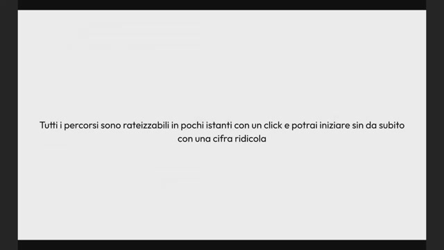

**Testo a schermo (OCR):** Tutti i percorsi sono rateizzabili in pochi istanti con un click e potrai iniziare sin da subito con una cifra ridicola

> Ragazzi, non mi dite che sono troppi soldi, perché a parte essere una stronzata di prezzo, perché è una stronzata di prezzo per tutto quello che vi portate a casa, ragazzi. Tutti i percorsi sono rateizzabili. In pochi clic, con un clic iniziate sin da subito con una cifra ridicola. Partite con 70-80 euro di rateizzazione, ragazzi, e partite subito. Vi si apre il percorso, vi si apre il gruppo, vi si aprono le coaching call. Tra l'altro avete accesso anche a tutte le altre consulenze. Vi faccio vedere un attimino, ragazzi, l'interno del nostro gruppo privato, perché effettivamente merita. Questo ad esempio, ragazzi, ecco qui,

## [01:39:30] Schermata 185 _(scene)_

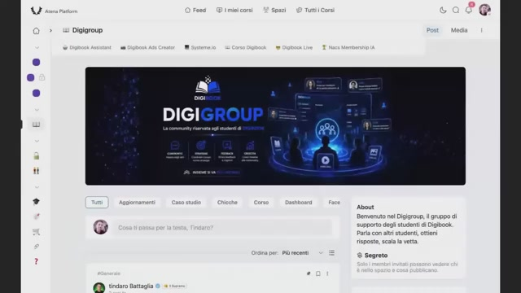

**Testo a schermo (OCR):** Po

> spostiamoci un attimo, questo è l'interno della community support, ragazzi. Guardate qui, guardate che roba.

## [01:39:36] Schermata 186 _(scene)_

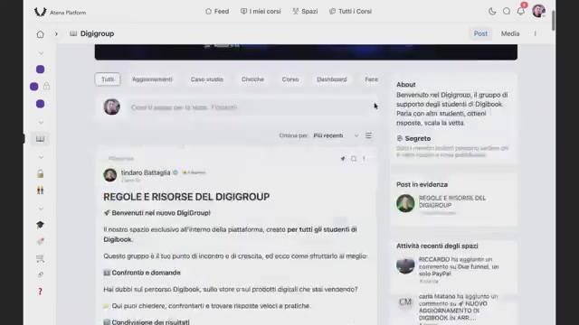

**Testo a schermo (OCR):** (è)

> Qui ovviamente sono io, ragazzi, rispondo a tutte le vostre domande.

## [01:39:41] Schermata 187 _(scene)_

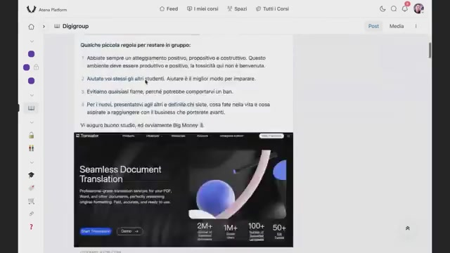

**Testo a schermo (OCR):** ‘Seamless Document Translation mn IM 2@

> Ok. Questo è il nuovo aggiornamento, ragazzi. 11 Ore fa, vedete? Nuovo aggiornamento di Digibook in arrivo, in cui spiego come sfruttare le nuove funzionalità di CGPT per creare, tra le altre cose, anche del libri low content. Guardate un attimino, questo sarà, farà parte dell'ultimo aggiornamento, che, ripeto, distribuisco in maniera del tutto gratuita. Tutti gli aggiornamenti, siamo all'undicesimo aggiornamento, in modo del tutto gratuito. Guardate qui, ragazzi, questo è un esempio

## [01:40:11] Schermata 188 _(scene)_

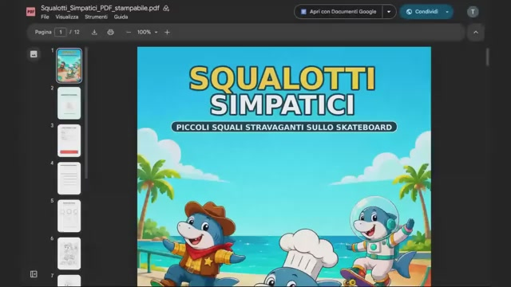

**Testo a schermo (OCR):** reRonRD ) SQUALO capienti Ha

> di cosa ci permette di fare il nuovo aggiornamento di Digibook per quanto riguarda, ad esempio, la realizzazione di low content da colorare. Questo, ragazzi, è stato creato in 12 minuti, o 16, ora non ricordo, dall'intelligenza artificiale. Ovviamente dovete conoscere i prodotti giusti, derivano i prodotti giusti all'interno del percorso. Sarà un aggiornamento top, avrete tutti pronti per creare roba del genere e venderla con il vostro store di prodotti digitali. Questo è particolarmente interessante se siete nella nicchia kids, nella nicchia mamme, eccetera, eccetera.

## [01:40:44] Schermata 189 _(scene)_

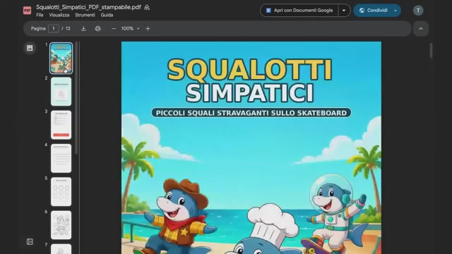

**Testo a schermo (OCR):** b; SQUALO MRI MRATICI

> Ok? Ragazzi, guardate che spettacolo.

## [01:40:49] Schermata 190 _(scene)_

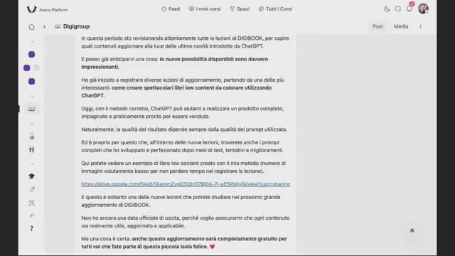

**Testo a schermo (OCR):** + Digieroup E oto ice cs: lov pom 2@

> Ma non solo questo, ragazzi, andiamo a vedere un attimino. Dashboard, via! Dashboard. Elena, da Master Group, ho appena lanciato un nuovo funnel sempre nella mia nicchia, questa volta ho intercettato un nuovo problema, vendo in Norvegia. Elena è molto brava a vendere in Norvegia. Lanciato oggi, risultati sballottitivi, 400 euro di netto. Ragazzi, andiamo avanti. Prima vendita di massimo 39.000. Chiudo con 40 cap e passa. Salve, gente del posto orgoglioso. Dashboard, siamo sui 39.000 Euro e passa. Penso proprio che supererò i 40 questo mese. 12.080. 1.056, Sempre di Elena, che è partita con un altro funnel. Ok? Ovviamente se ci sono domande qui, rispondo direttamente alle vostre domande. Qui ci sono anche gli altri studenti che vanno a rispondere alle vostre domande.

## [01:41:32] Schermata 191 _(scene)_

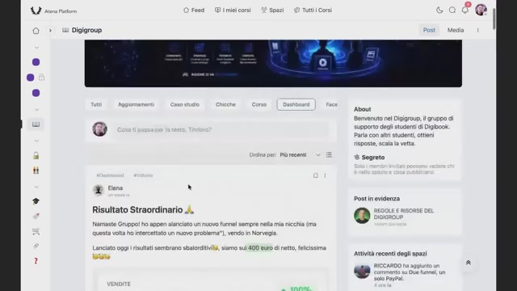

**Testo a schermo (OCR):** ® Risultato Straordinario 4. sento

> Andiamo a guardare un po' Casi Studio, perché man mano che trovo prodotti digitali in rete, e vi mostro esempi di prodotti digitali che funzionano, perché funzionano, come funzionano. Vedete i prezzi dei prodotti digitali,

## [01:41:46] Schermata 192 _(scene)_

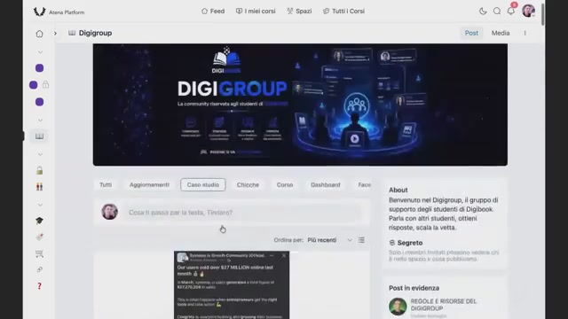

> le nicchie più profittevoli, tutto è svelato all'interno del gruppo. Vediamo un po'.

## [01:41:51] Schermata 193 _(scene)_

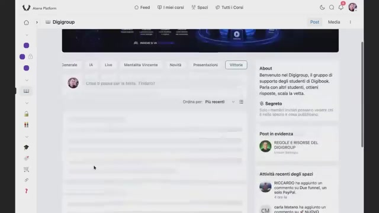

> Andiamo alla sezione vittoria. Prima vendita per Claudia. Primo ebook nato. 198 Dollari. Nuovo funnel, prima vendita. E da pochi giorni sono ripartito un nuovo funnel. Oggi è la luce del quarto giorno, è arrivato il primo ordine. Ragazzi, quarto giorno significa 20 euro di spesa, 198 dollari incassati con un funnel. Risultato straordinario sempre di Elena. Prima vendita di Pier Davide. I primi 27 dollari non si scordano mai. Prima vendita di Angelo. Prima vendita di Andrea. Qui ovviamente abbiamo una domanda, e ovviamente c'è il sottoscritto che risponde. Andiamo avanti. Prima vendita di Max. 958 Dollari. Vendite. Volevo condividere con voi i miei successi. La prima vendita l'ho avuta il 12 di maggio. Sono felice dei risultati che sto ottenendo. Il mio primo ebook venduto. Insomma, ragazzi. Davvero tanta roba. E non solo questo. Perché andrete a fare il live col Coach. Le live sono tutte registrate. Ragazzi, guardate qui. Tutte le live sono registrate. Le potrete riguardare ovviamente quando vorrete. Andiamo a vedere qualche live.

## [01:42:51] Schermata 194 _(periodic)_

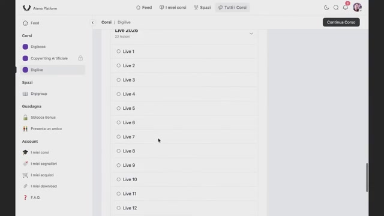

**Testo a schermo (OCR):** ° S ° n ne

> Per esempio la live che sono state fatte nel 2026. Vedete, c'è il Coach. Vi dà tutte le informazioni che vi servono. Questa è una sezione di analisi delle campagne, del prodotto digitale. Vi dice cosa funziona, cosa non funziona. Ragazzi, a questo prezzo non troverete assolutamente nulla. È tanta, tanta, tanta roba. Questo è il percorso di Digibook. Ve lo mostro molto velocemente.

## [01:43:12] Schermata 195 _(scene)_

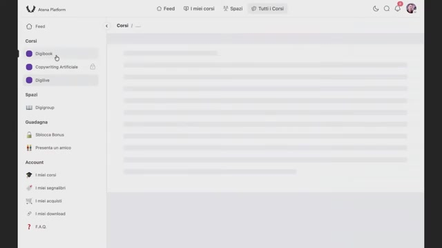

> Ragazzi, guardate qui. Tutta la sezione di Mindset. Tutta la sezione per costruire il vostro brand di prodotti digitali a vendita. Tutta la sezione di dove produrre. Questi sono gli aggiornamenti del percorso che troverete come lezioni aggiornate. Creazione di videocorsi con l'IA. Creazione di software con l'IA. Creazione di prodotti digitali. Cosa fare prima di aprire lo store. Tutti gli errori da evitare. Come creare lo store su Shopify. Tutto lo store su System.Io. A breve avrete anche degli aggiornamenti in tal senso. Creazione istantanea della landing con l'AI. Copyright in digitale. La parte, la strategia completa. Guardate solamente questa lezione di un'ora e due minuti per vendere prodotti digitali in organico. Sezione di campagna pubblicitaria. È tutto spiegato passo passo. Ragazzi, non esiste niente di simile con in più. Tutti gli aggiornamenti gratuiti. Gruppo di supporto. Ragazzi, assolutamente non esiste niente di simile.

## [01:44:04] Schermata 196 _(scene)_

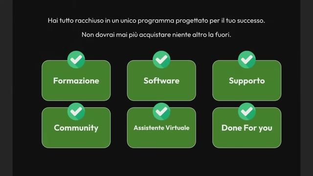

**Testo a schermo (OCR):** Hai tutto racchiuso in un unico programma progettato per il tuo successo. Non dovrai mai più acquistare niente altro la fuori. Formazione Software Supporto Community Assistente Virtuale Done For you

> Avete tutto racchiuso in un unico programma progettato per il vostro successo. Non dovrete mai più acquistare niente altro là fuori.

## [01:44:13] Schermata 197 _(scene)_

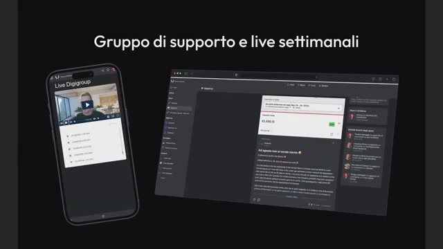

**Testo a schermo (OCR):** Gruppo di supporto e live settimanali

> Gruppo di supporto, live settimanali. Ovviamente vi ho già mostrato qualche risultato. Ve ne mostro l'alto di Digibook.

## [01:44:17] Schermata 198 _(scene)_

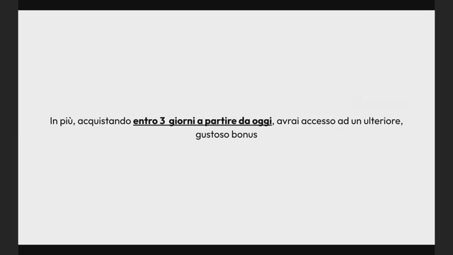

**Testo a schermo (OCR):** In più, acquistando entro 3 giorni a partire da oggi, avrai accesso ad un ulteriore, gustoso bonus

> E in più ragazzi, acquistando entro tre giorni, a partire da oggi, avrete accesso a un altro gustoso bonus. Sto parlando di tre mesi della mia membership che si chiama NUX. A soli un euro. NUX che cos'è ragazzi?

## [01:44:31] Schermata 199 _(scene)_

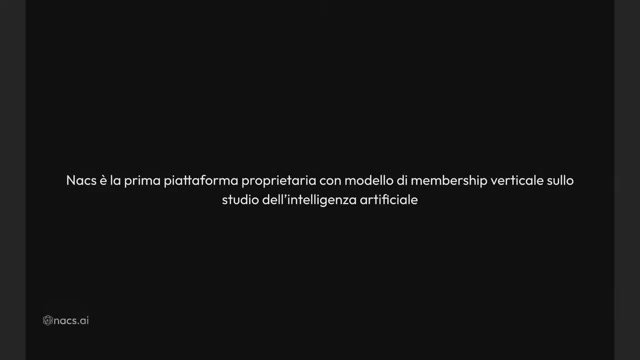

**Testo a schermo (OCR):** Nacs è la prima piattaforma proprietaria con modello di membership verticale sullo studio dell'intelligenza artificiale

> È la prima piattaforma che vi permette di studiare l'intelligenza artificiale. Ci sono altri percorsi. Ci sono spazi di discussione. NUX non è una semplice membership. È un movimento di innovatori sull'intelligenza artificiale. C'è un sistema di affiliazione. Potrete rivendere anche l'accesso alla membership per guadagnarci.

## [01:44:51] Schermata 200 _(scene)_

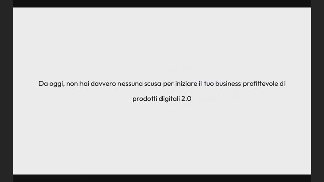

**Testo a schermo (OCR):** Da oggi, non hai davvero nessuna scusa per iniziare il tuo business profittevole di prodotti digitali 2.0

> Ragazzi, da oggi non avete nessuna scusa per iniziare il vostro business di prodotti. Digitale 2.0. Oggi, ragazzi, il business, ragazzi, praticamente, come dire, oggi, ragazzi, il business prende e diventa un qualcosa di assolutamente spettacolare. Ragazzi, diventa qualcosa di assolutamente spettacolare. Oggi il business dei prodotti digitali, ragazzi, si proietta nel futuro. Oggi, ragazzi, vecchi business online diventano in passato. Quello che vi ho presentato è il futuro dei business online. Ora, lasciatemi concludere con qualcosa che deriva dalla mia esperienza, ragazzi, perché la vita è una sola. Ho imparato che la risorsa più preziosa che non tornerà mai a noi è il tempo. Il tempo da trascorrere con persone che amate è la cosa più importante in assoluto. È la mission della mia formazione proprio questa. Come detto, ragazzi, all'inizio di questo workshop, sarò sempre onesto con

## [01:45:51] Schermata 201 _(periodic)_

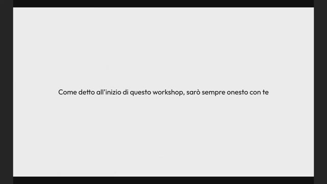

**Testo a schermo (OCR):** Come detto all'inizio di questo workshop, sarò sempre onesto con te

> voi. Non vi prometto che diverrete milionari con questo business, perché non posso garantirvelo ma vi prometto di darvi tutti gli strumenti, come l'avete visto, il supporto e la formazione necessarie per avere quella tranquillità economica che vi permetta di avere più tempo possibile da trascorrere con chi amate. Qui oggi, ragazzi, avrete di fronte due scelte

## [01:46:14] Schermata 202 _(scene)_

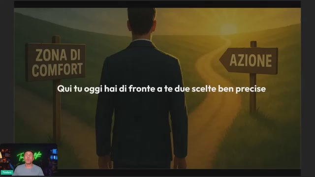

**Testo a schermo (OCR):** Qui tu oggi hai di fronte a te due scelte ben precise

> ben precise. Potete avere paura di cambiare tutto, dire che 40 euro al mese, ragazzi, 40 euro al mese sono troppi. La rata da 80 euro al mese è troppo, quindi spenderete quanto per iniziare il business? 80, 120, 160 Euro per acquistare il cgpt, per fare la vostra campagna? Spenderete 120 euro, ragazzi. Potete dire che 120 euro sono troppi, salvo poi mangiarveli in pizzeria, perché tutti quanti sappiamo come funziona, ragazzi. Vi create una serie di tip mentali e scuse per non iniziare. Però potete avere paura di cambiare tutto, tirare un calcio nel culo a ciò che non vale la vostra vita e restare esattamente come siete. Domani vi sveglierete con gli stessi esatti problemi e nella vostra vita nulla cambierà. Mai. Il tempo sarà passato, sarete diventati vecchi e pieni di rimpianti. Oppure, oppure, potrete decidere di dire no a paure, sofferenze e a ciò che non vale la vostra vita e scegliere di cambiare, diventando ciò che aspirate a essere, soprattutto raggiungere gli obiettivi che oggi stesso desiderate raggiungere. La scelta, ragazzi,

## [01:47:14] Schermata 203 _(periodic)_

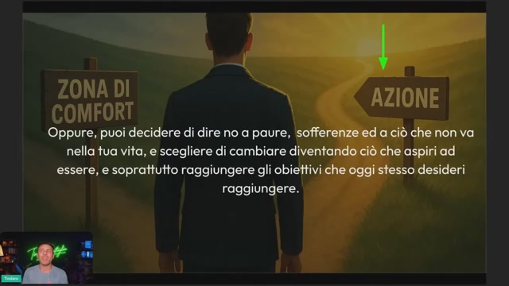

**Testo a schermo (OCR):** ZONA DI COMFORT Oppure, puoi decidere di dire no a paure, 1; csguagereii "UD raggiungere. | A

> è soltanto vostra. Io quello che vi dico è che è ora di prendervi il successo che

## [01:47:19] Schermata 204 _(scene)_

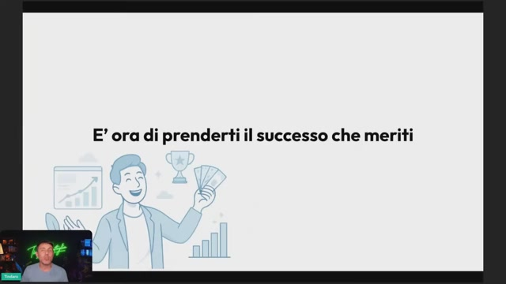

**Testo a schermo (OCR):** E’ ora di prenderti il successo che meriti

> è meritato. E il successo, ragazzi, sta a un solo prodotto digitale di distanza, da te. Ora, a breve vi dirò come accedere al Digibook, ma vi ricordo che solo i più veloci potranno accedere al Dynon delimitato a venti posti. Chi siete? Siete pronti? Ecco come

## [01:47:41] Schermata 205 _(scene)_

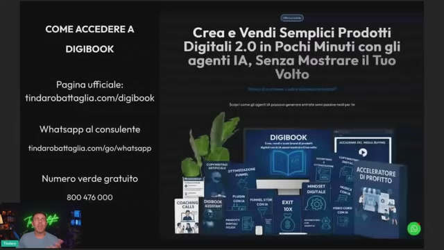

**Testo a schermo (OCR):** COME ACCEDERE A DIGIBOOK Pagina ufficiale: ‘tindarobattaglia.com/digibook Whatsapp al consulente tindarabattaglia.com/go/whatsapp Numero verde gratuito 800 476.000 ici Prodotti Pochi Minuti con gli agenti IA, Senza Mostrare il Tuo Volto

> accedere al Digibook. Potrete andare nella pagina ufficiale, www.Tinderlabattaglia.Com oppure potete contattare, questa ragazzi è la cosa che vi consiglio di fare, contattate subito il vostro consulente su WhatsApp e chiedetegli di fissare una consulenza per parlare di tutta questa gran roba cui avrete accesso per soli cinque giorni. Oppure chiamate il numero verde gratuito 800 476 000. Tra l'altro se andate su Digibook, questa è la schermata che avete di Digibook, qua in basso avete un bellissimo pallino WhatsApp. Se ci cliccate potrete accedere alla pagina dei consulenti. Vedete qui ci sono tutti i consulenti della

## [01:48:24] Schermata 206 _(scene)_

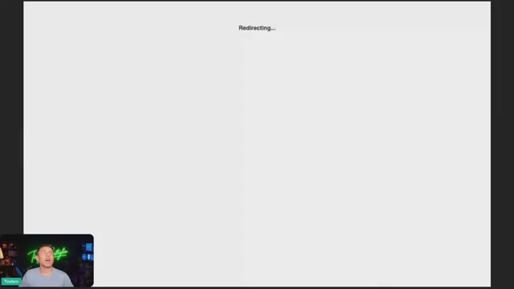

> mia azienda. Se per caso vi siete scordati il WhatsApp del consulente, qualcuno ieri mi ha detto mia figlia mi ha cancellato il messaggio del consulente, ecco ragazzi, qua avete tutta la pagina con i consulenti. Selezionate il consulente che vi piace di più, che vi incuriosisce di più, che vi sta più simpatico o se già avete un consulente cliccate sul pulsante. Ragazzi scrivete ora subito su WhatsApp e chiedete di fissare una call. Ragazzi ripeto stiamo parlando dei consulenti migliori esistenti, non sono i classici Wall Street. Il loro scopo è quello di darvi tutte le risposte alle vostre domande e permettervi di capire nella migliore delle possibilità come e in che modo questo percorso può farlo. Adesso ragazzi passiamo alla sezione di domande e risposte. Lasciatemi modificare un attimo questa schermata.

## [01:49:20] Schermata 207 _(scene)_

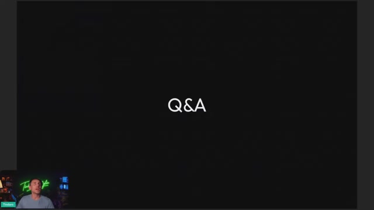

> Fatemi vedere pure un'altra cosa perché mi sa che per sbaglio tra i vari cretini che infestavano perché c'erano due o tre che infestavano la chat. Ho bannato pure il povero Giuseppe Strazulla. Strazulla c'è lei? L'ho bannata? No, non dovrei averti bannato. In ogni caso ragazzi avete pure un commento che è stato creato in questo momento. Vediamo se riesco a vedere il commento. Sì avete un commento che è stato bloccato in questo momento nella chat per andare direttamente su digibook. Lasciatemi vedere se il buon Strazulla è ancora con noi o se l'ho bloccato. Mi perdoni, mio dottor Strazulla, se l'ho bloccata. Fatemi andare in community. Tra l'altro non mi ricordo neanche dove sono quelli bloccati. Ah, moderazione

## [01:50:20] Schermata 208 _(periodic)_

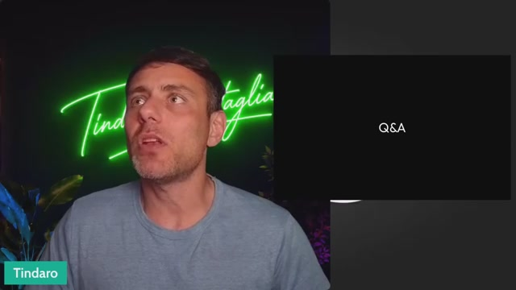

> alle community. Ok, gestione utenti. Ecco i bloccati. Strazulla mi sa che l'ho bloccata. Mi spiace, ma questa è la vita. Poi vedrò come sbloccarla in futuro. Allora dai ragazzi, andiamo alla sessione di domande e risposte. Ok, l'ho sbloccata Strazulla, mi perdoni, ma tra i vari cretini. Allora vediamo un po' di risponde alle vostre domande. Con 5 euro si è poca visibilità sulle varie piattaforme. Per raggiungere un pubblico mirato secondo me sono 20 euro. Alessandra, no, scusami, tu vuoi saperne più di me che spendo milioni e milioni di euro in pubblicità? Il tuo secondo me è sbagliato. Puoi avere un'ottima visibilità, se conosci la strategia per vendere con campagne pubblicitarie su Facebook, anche con soli 5 euro e iniziare a generare vendite. Ti ho mostrato direttamente dal gruppo studenti come le persone generano vendite anche con 5 euro di campagne pubblicitarie al giorno,

## [01:51:20] Schermata 209 _(periodic)_

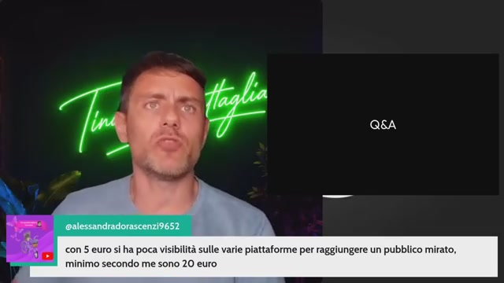

**Testo a schermo (OCR):** conS euro si ha poca visibilità sulle varie piattaforme per raggiungere un pubblico mirato, minimo secondo me sono 20 euro

> quindi è fattibile, devi conoscere ovviamente la strategia. Allora, sì sì ragazzi, non è un prezzo super omesto, è una truffa ai miei danni, perché tutta questa roba ragazzi ve la vendono le persone a 5-6 mila euro. Da aggiungere 20 euro di qua, 20 euro di là, più le rate, Valentina, è un'attività imprenditoriale, quindi se tu pensi che 20 euro di qua più 20 euro di là, che sono 40 euro, più la rate da 80 euro, quindi 120 euro se la sai, il mio consiglio è quello di non iniziare mai un'attività imprenditoriale, quindi continua a lavorare, spera di mettere in banca quei 2-3 euro che ti servono, salvo poi se c'è qualche problema, qualche necessità, spendi tutto quanto e la vita continuerà in questo modo. Ragazzi, purtroppo un'attività imprenditoriale dovete decidere o iniziare o non iniziare, tutto il resto sono scuse che vi fate ragazzi, è questo. Se dovessi spendere 3 mila euro, in quanto tempo recupero i soldi investiti e inizio a guadagnare? Paola, mi chiamo Dio? Non sono il buon Dio, perché non posso dirti in quanto tempo lo fa. Io ragazzi capisco che siete abituati a, sì, capisco che siete abituati a, scusatemi un attimo,

## [01:52:20] Schermata 210 _(periodic)_

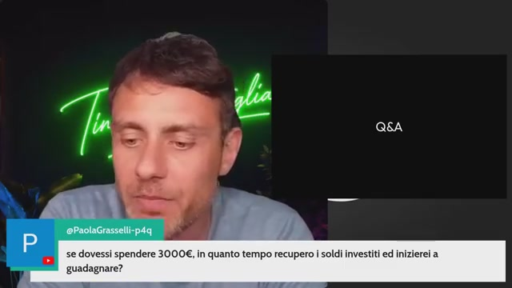

**Testo a schermo (OCR):** se dovessi spendere 3000€, in quanto tempo recupero i soldi investiti ed inizierei a guadagnare?

> capisco che siete abituati a parlare con i fuffa guru che vi promettono che in un mese rientrerete all'investimento. Ragazzi, non si può dare un tempo. Mediamente, ragazzi, entra nel programma, in un paio di mesi inizia a generare vendite, inizia a generare profitti, però non ti posso garantire che inizierai a generare vendite e profitti in un mese, perché altrimenti sarai un disonesto intellettualmente. Altra cosa, ragazzi, non iniziate con 40 euro al mese di rate. La minima rata è di 70 euro, ma mi pare che avrebbero detto, abbiamo detto 80 euro, no, in realtà potete iniziare con 70 euro, più e 40, 60 euro per i software. Quindi ragazzi, davvero poca roba, business block tutto il programma e iniziate tranquillamente, ma come mi fanno notare dalla regia, si inizia con circa 70, 80 euro di rata. Allora, vi appoggiate a finanziare o gestire le rate internamente? Ci appoggiamo a finanziare.

## [01:53:20] Schermata 211 _(periodic)_

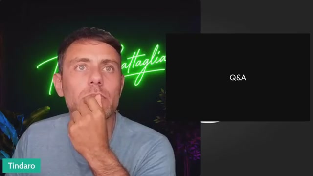

> Martina, la mia azienda è da oltre dieci anni nel settore, quindi gode di una traste, una credibilità assurda da parte di tantissimi istituti finanziari, quindi avrai accesso alla possibilità di ottenere diversi finanziamenti in funzione di quelle che sono le tue necessità e accedere direttamente al percorso. Parti con la rata, 70, 80 euro, distrutti il percorso, entri nelle cocce, inizi a produrre, inizi a vendere. Molto semplice. Date le garanzie soddisfatte o rimborsate? No, non posso darti una garanzia perché è molto semplice, Vicky. Io, ripeto, capisco che siete abituati con i guru dubaini che vi dicono che ti garantisco 10.000 Euro in un mese e poi si fottono i vostri soldi e poi scompaiono, ma non sono quel tipo, ragazzi, anche perché ho un'etica professionale, quindi non vi dirò mai che c'è una garantia soddisfatte o rimborsate. Perché? Vi spiego subito il perché. Supponiamo che io ti dia la garanzia soddisfatte o rimborsato, tu accedi al percorso, ti rompi i coglioni, studi le prime due lezioni e dopo vuoi il rimborso. Magari ti studi il percorso, quindi hai accesso a tutte le mie

## [01:54:20] Schermata 212 _(periodic)_

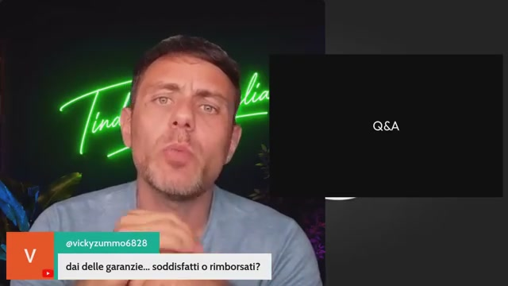

> informazioni, non inizi perché ti rompi i coglioni e poi vuoi il rimborso. Ma io le informazioni te le ho date. E questo soddisfatte o rimborsati da che cosa dipende? Dipende dal fatto che tu non ti sei applicato. Quindi capirete, ragazzi, che è questo il settore, questo è il modo in cui si deve iniziare. Soddisfatte o rimborsate, ragazzi? Prima hanno quelli che stanno a dubba e poi vi bloccano. E questa è la realtà. Ci siamo, ragazzi? Riccardo tra i consulenti non c'è perché il sales coach, quindi sovraintende tutti i consulenti. Appena ho risolto l'investo con te sicuramente ora non posso. Paola, mi ricordi quel tizio che mi diceva che avrebbe iniziato subito, entro un mese, appena avrebbe iniziato a raccimolare i primi 80 euro? Spoiler, non inizio mai. E lo risentì l'anno dopo e mi disse che ancora non aveva iniziato ma che la sua vita era terribile. Ragazzi, siete

## [01:55:20] Schermata 213 _(periodic)_

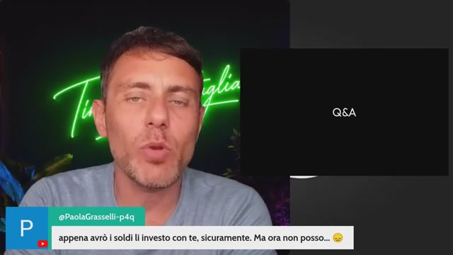

**Testo a schermo (OCR):** appena avrò i soldi liinvesto con te, sicuramente. Ma ora non pi

> liberi di fare come volete, ovviamente. Se per voi 80 euro sono una cifra, e lo capisco, non iniziate. Ma il consiglio che vi do, ragazzi, è di non iniziare mai un'attività imprenditoriale. Cercate di trovare la quadra con la vostra attività, sperando che un domani succeda qualche cosa di miracoloso. Ragazzi, spoiler, non succede nulla perché siete voi stessi gli artefici della vostra vita. È molto semplice. Luigi, consulente, top e molto paziente. Ho tormentato con le domande e mi ha sempre risposto fortesemente. Ragazzi, ecco se i miei sono i migliori consulenti. Molti di noi in pizzeria non ci possono andare. Valentina, intanto parla per te perché non è vero. Perché la maggior parte dei miei studenti in pizzeria ci va e si gode anche i suoi profitti. Ma seconda cosa, ripeto, Valentina, se in pizzeria non ci puoi andare perché per te 40 euro sono assai, non iniziare un'attività imprenditoriale. Non voglio persone che pensino che per loro 80 euro sono molti e fanno il

## [01:56:20] Schermata 214 _(periodic)_

**Testo a schermo (OCR):** on ci possono andare Molti di noi in pizzeria no

> salto della vita. Valentina, ti rivelerò una verità. Nella vita o ci si getta per cambiare vita, oppure si resta sempre come si è. Ma se per te 80 euro sono assai e lo capisco, non iniziare. Io voglio avere persone estremamente consapevoli del fatto che vogliono cambiare la loro vita. Non voglio persone che mi dicono, sai, 70 euro, 50 euro, 5 euro, 2 euro. No ragazzi, quel tipo di persone non fanno il caso mio. Dovete essere persone, come vi ho detto, coscienti, con costanza, con focus e hanno voglia di cambiare la loro vita. Se per te 80 euro sono assai, non iniziare. E ti do altro consiglio, è tutto gratis. Non iniziare mai con nessuno. Perché poi, io so già come finisce, per te 80 euro sono assai, poi c'è qualcuno su Telegram che ti invita a accedere ai suoi segnali gratuiti, non ti mende il corso, salvo poi fotterti facendo di registrare quel blogger che stai in inculonia e guadagnando dalle tue perdite. Ragazzi, funziona sempre così. Ormai ho fatto consulenza a milioni di italiani, quindi vi posso dire che funziona così. Se per te 80

## [01:57:20] Schermata 215 _(periodic)_

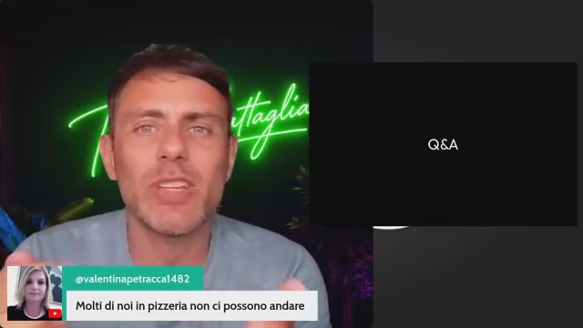

**Testo a schermo (OCR):** n i Molti di nol in pizzeria non ci QEA

> euro sono assai, non lo fare, ma consiglio non fare neanche nient'altro. Se per esempio abbiamo creato un ebook con CGPT, come facciamo a inserirlo in System.Io per procedere alla creazione del nostro store? Fammi capire un attimo la domanda. Allora, è molto semplice, te lo faccio vedere subito. Allora, vai qui, aspetta che ti mostro tutta la schermata. Da System.Io, c'è la possibilità di caricare dei file. A questo punto carico il

## [01:57:55] Schermata 216 _(scene)_

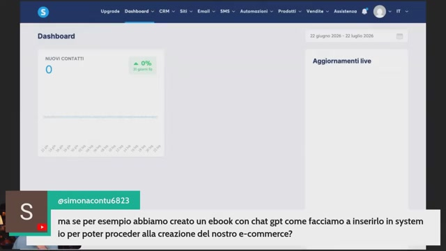

**Testo a schermo (OCR):** Aggiornamenti live @simonacontu6823 ma se per esempio abbiamo creato un ebook con chat gpt come facciamo a inserirlo in system io per poter proceder alla creazione del nostro e-commerce?

> mio file da qua e lo inserisco qua. Lui mi darà poi anche un link nei dettagli file e do questo via e-mail quando acquista. Molto molto semplice, glielo mando come automazione.

## [01:58:16] Schermata 217 _(scene)_

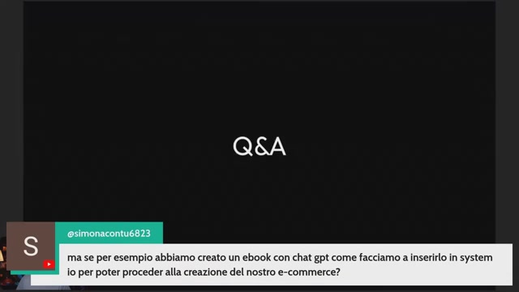

**Testo a schermo (OCR):** QSA ma se per esempio abbiamo creato un ebook con chat gpt come facciamo a inserirlo in system lo per poter proceder alla creazione del nostro e-commerce?

> Tino, la domanda ce l'hai detto in questa sera, ci avresti spiegato anche come collegare i metodi di pagamento al nostro store, però non ho visto nulla a riguardo. Hai ragione, mea culpa, te lo mostro subito. Andiamo sempre su System. Ragazzi, System.Io è la piattaforma più semplice che esista.

## [01:58:34] Schermata 218 _(scene)_

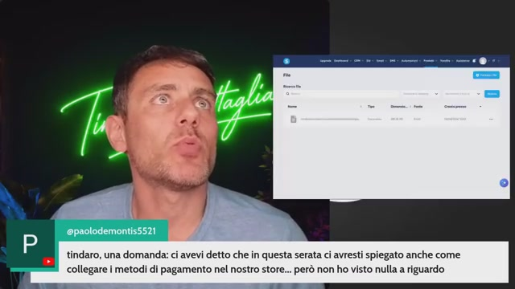

**Testo a schermo (OCR):** tindaro, una domanda: ci avevi detto che in questa serata ci avresti spiegato anche come collegare i metodi di pagamento nel nostro store... però non ho visto nulla a riguardo

> Andiamo su System e da System, molto semplicemente andiamo qua, Impostazioni, Sistemi di pagamento e da qui possiamo collegare. Vedi, clicchiamo su Collega, colleghiamo Stripe o colleghiamo PayPal. Ci sarà un, come dire, ci sarà un wizard molto veloce che ti permetterà di collegare tutto quello che devi fare. Diciamo che System.Io è molto intuitivo, devi seguire i passi e colleghi PayPal. Io ti consiglio PayPal e Stripe e puoi iniziare a vendere sia con carta che con PayPal. Ci siamo, Paolo? Ragazzi, vale la pena Tino,

## [01:59:12] Schermata 219 _(scene)_

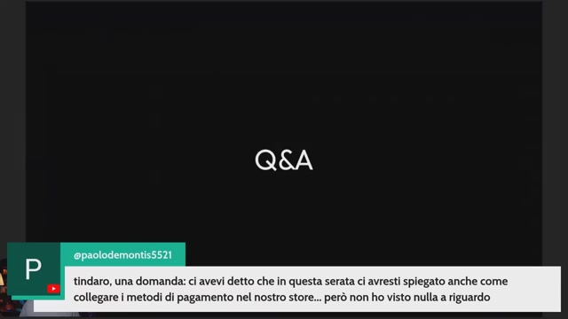

**Testo a schermo (OCR):** QSA tindaro, una domanda: ci avevi detto che in questa serata ci avresti spiegato anche come collegare i metodi di pagamento nel nostro store... però non ho visto nulla a riguardo

> l'unica persona onesta che aiuta realmente a cambiarti la vita. Grazie mille, Lucrezia. Sì, ragazzi, rischio di impresa relativo. Cosa rischi? Rischi i 20 euro di Shell GPT e i 20 euro di System.Io se vuoi partire con una Sistema.Io a pagamento. Ragazzi, ripeto, se per voi 40 euro, non lo sto dicendo per te Germano perché penso che tu abbia capito, ma se per voi ragazzi 40 euro sono un investimento proibitivo, restate con la vostra vita e non fate nulla. Tra l'altro, ragazzi, se parlate con i consulenti, sono loro che non vi prendono. Cioè, il mio percorso non è per tutti, è per persone che vogliono realmente cambiare la loro vita senza supercazzole. Se per voi 40 euro sono assai, se avete paura... Sottotitoli e revisione a cura di QTSS

## [02:00:12] Schermata 220 _(periodic)_

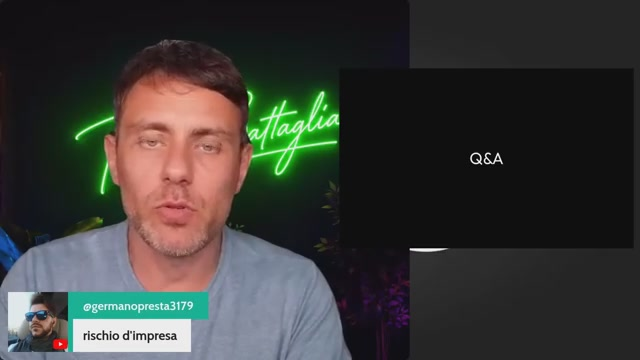

> Sottotitoli e revisione a cura di QTSS Sottotitoli e revisione a cura di QTSS

## [02:01:12] Schermata 221 _(periodic)_

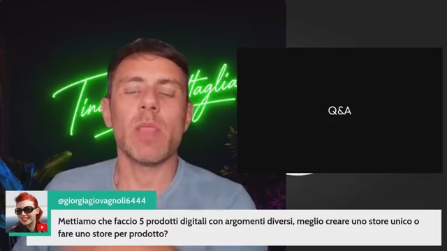

**Testo a schermo (OCR):** Mettiamo che faccio 5 prodotti digitali con argomenti diversi, meglio creare uno store unico o fare uno store per prodotto?

> Sottotitoli e revisione a cura di QTSS Sottotitoli e revisione a cura di QTSS

## [02:02:12] Schermata 222 _(periodic)_

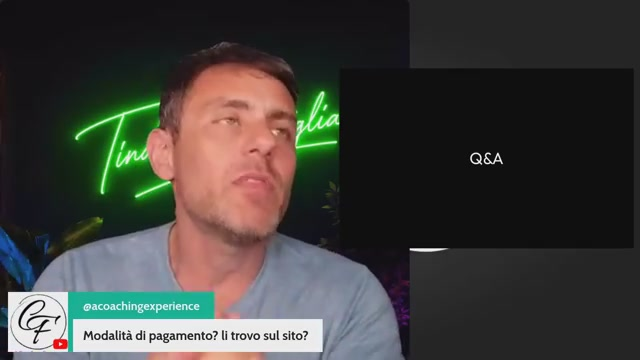

> Sottotitoli e revisione a cura di QTSS Sottotitoli e revisione a cura di QTSS

## [02:03:12] Schermata 223 _(periodic)_

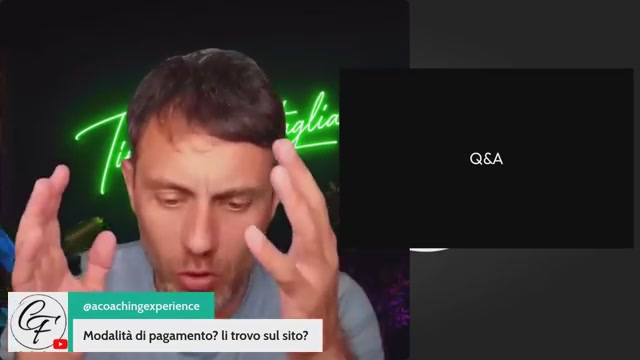

**Testo a schermo (OCR):** + Modalità di pagamento? li trovo sul sito? QEA

> Sottotitoli e revisione a cura di QTSS Sottotitoli e revisione a cura di QTSS Sottotitoli e revisione a cura di QTSS Sottotitoli e revisione a cura di QTSS Sottotitoli e revisione a cura di QTSS

## [02:04:12] Schermata 224 _(periodic)_

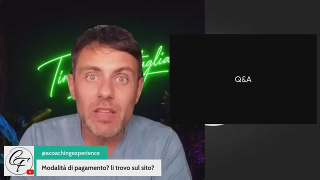

**Testo a schermo (OCR):** Modalità di pagamento? li trovo sul sito? Q&A

> Sottotitoli e revisione a cura di QTSS Sottotitoli e revisione a cura di QTSS

## [02:05:12] Schermata 225 _(periodic)_

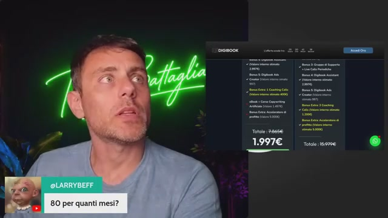

> Sottotitoli e revisione a cura di QTSS Sottotitoli e revisione a cura di QTSS

## [02:06:12] Schermata 226 _(periodic)_

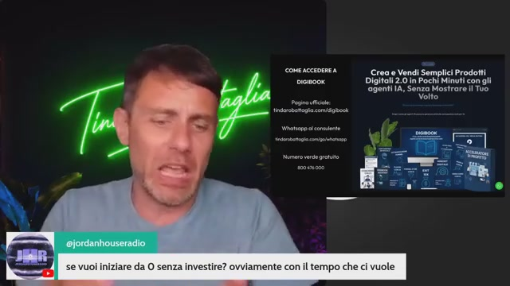

**Testo a schermo (OCR):** SGUEASCIOOA i Semplici Prodotti penali voi tr]

> Sottotitoli e revisione a cura di QTSS Sottotitoli e revisione a cura di QTSS Sottotitoli e revisione a cura di QTSS Sottotitoli e revisione a cura di QTSS Sottotitoli e revisione a cura di QTSS Sottotitoli e revisione a cura di QTSS Sottotitoli e revisione a cura di QTSS Sottotitoli e revisione a cura di QTSS

## [02:07:12] Schermata 227 _(periodic)_

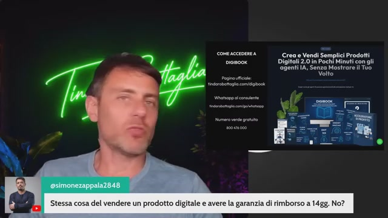

**Testo a schermo (OCR):** emoor DIGI 2 Pochi inci coli ‘agent, Senza Mostrare ivo Volto Stessa cosa del vendere un prodotto digitale e avere la garanzia di rimborso a 14gg. No?

> Sottotitoli e revisione a cura di QTSS Sottotitoli e revisione a cura di QTSS Sottotitoli e revisione a cura di QTSS

## [02:08:12] Schermata 228 _(periodic)_

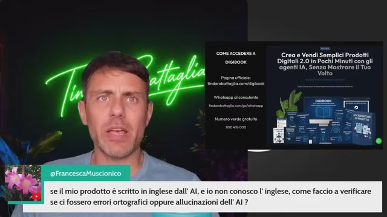

**Testo a schermo (OCR):** comescceveRtA (Crea 0 Vendi Semplici Prodotti pemoor Digitali 2.0 in Pochi Minufi con gli ‘agenti A, Senza Mostrare i To Volto il mio prodotto è scritto in inglese dall'A, e io non conosco l'inglese, come faccio a verificare se cl fossero errori ortografici oppure allucinazioni dell' Al ?

> Sottotitoli e revisione a cura di QTSS Sottotitoli e revisione a cura di QTSS

## [02:09:12] Schermata 229 _(periodic)_

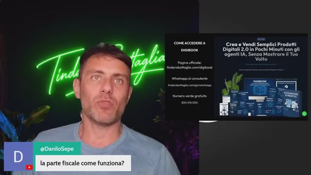

**Testo a schermo (OCR):** Crea e Vendi Semplici Prodotti Digitali 2.0 in Pochi Minufi con gli ‘genti, Senza Mostrare i Tuo Volto

> Sottotitoli e revisione a cura di QTSS Sottotitoli e revisione a cura di QTSS

## [02:10:12] Schermata 230 _(periodic)_

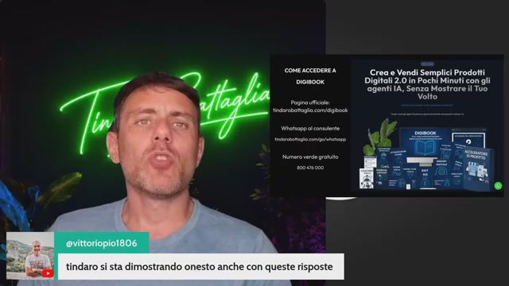

**Testo a schermo (OCR):** pogreuie prio ong to anche con queste risposte

> Sottotitoli e revisione a cura di QTSS Sottotitoli e revisione a cura di QTSS

## [02:11:12] Schermata 231 _(periodic)_

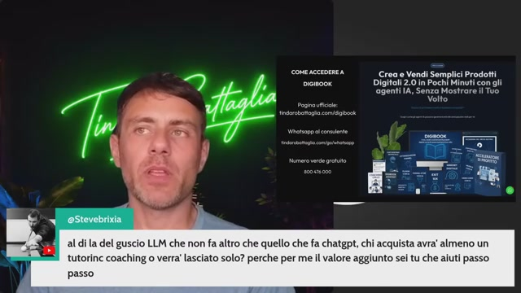

**Testo a schermo (OCR):** come scceveneA Creo ® Vendi Semplici Prodotti eco Digitali 2.0 in Pochi Minufi con gli ‘agent A, Senza Mostrare ilo Volto aiar a _ Ta: _—. [sc Te - al di la del guscio LLM che non fa altro che quello che fa chatgpt, chi acquista avra' almeno un tutorinc coaching o verra' lasciato solo? perche per me il valore aggiunto sei tu che aiuti passo passo

> Sottotitoli e revisione a cura di QTSS Sottotitoli e revisione a cura di QTSS

## [02:12:12] Schermata 232 _(periodic)_

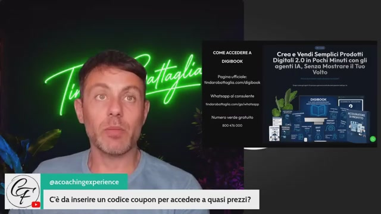

**Testo a schermo (OCR):** C'è da inserire un codice coupon per accedere a quasi prezzi?

> Sottotitoli e revisione a cura di QTSS Sottotitoli e revisione a cura di QTSS

## [02:13:12] Schermata 233 _(periodic)_

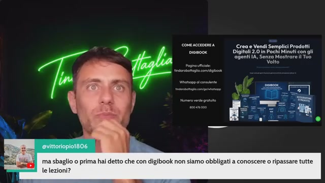

**Testo a schermo (OCR):** (Creo 0 Vendi Semplici Prodotti ‘emoor Digitali 2.0 in Pochi Minufi con gli ‘agent A, Senza Mostrare i Tuo Volto ma sbaglio 0 prima hai detto che con digibook non siamo obbligati a conoscere o ripassare tutte te lezioni?

> Sottotitoli e revisione a cura di QTSS Sottotitoli e revisione a cura di QTSS

## [02:14:12] Schermata 234 _(periodic)_

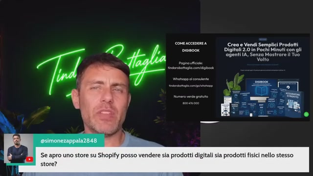

**Testo a schermo (OCR):** comescceveneA (Crea 0 Vendi Semplici Prodotti ‘nemoor Digitali 2.0 in Pochi Minuti con gli ‘agent A, Senza Mostrare i Tuo Valto

> Sottotitoli e revisione a cura di QTSS Sottotitoli e revisione a cura di QTSS Sì, assolutamente ragazzi. Fatevi seguire a un commercialista oppure prenotate una consulenza con il nostro, che è esperto di questa materia. Grazie a te Kelly. Grazie tanto. Grazie mille Irene.

## [02:15:12] Schermata 235 _(periodic)_

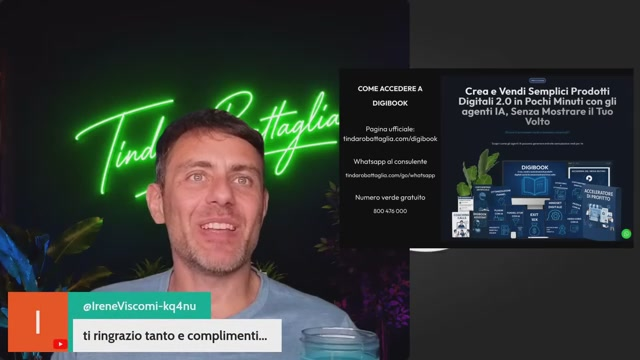

**Testo a schermo (OCR):** Prodotti DESIO Oto Puch Mini ct li ‘agenti A, Senza Mostrare To Volto 7 +. "R

> Se volessi fare mini-apps al posto di ebook, è possibile un digibook? Assolutamente sì. Assolutamente sì. Grazie, sarà un'esperienza positiva. Comprate il prodotto e provatelo e per le dritte regalate il live. Grazie. Grazie a te Federico. Gentilissimo. Sì, ho già aspettato Giuseppe. Sto aspettando la risposta. Nel frattempo posso staccare un altro regalobomba tipo ieri sera? No. Potete mettere anche il commercialista sul Diamond, ragazzi. È troppa roba, volete? Perché poi ci vado sotto. Tenete in considerazione che voi accedete a un prezzo fisso, ma avete le live periodiche. Il coach lo paga ogni mese. E voi fate un acquisto, una tantum, ragazzi. Con il consulente posso parlare anche del sistema fiscale? Sistema di fiscalità relativa alla tua parte deriva? No. Come istruttore di pagamenti e pacchetti?

## [02:16:12] Schermata 236 _(periodic)_

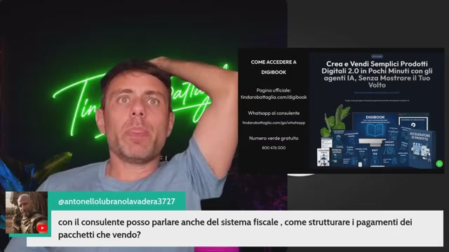

**Testo a schermo (OCR):** di coscacconnea Crea 0 Vendi Semplici Prodotti mons Digitali 2.0 in Pochi Minuti con gli | ‘agenti I, Senza Mostrare il Tuo Volto conil consulente posso parlare anche del sistema fiscale , come strutturare i pagamenti dei pacchetti che vendo?

> Sì. Quale prompt posso usare per farmi fornire l'HTML per la creazione dell'ending page di Mario Sistema IO? È spiegato nella parte finale di Digibook. Esistono pacchetti consulenti e comprare il plugin ma vorrei qualche consulenza in più. Assolutamente sì, Paola. Contatta il tuo consulente che ti darà tutte le informazioni che ti servono per i pacchetti. Questa, ragazzi, scusate, scusami Paola, non ti offendere, ma prendo il tuo esempio. Questo è l'esempio di come ci si preclude qualche cosa per paure inutili. Leggiamo. Allora, se devo aprire partita IVA, meglio di no. Basta già mio marito con le tasse a sud vagare. Punto numero uno, se tuo marito ha partita IVA può aggiungere un codice nel codice Teco e iniziare con i prodotti digitali. E punto numero due, lui paga tasse e magari non arriva a fine mese perché guadagna poco. Ma se tu inizia a generare profitti con i prodotti digitali a spesa zero del costo prodotto, i margini sono alti. Paola, cioè, è un ragionamento logico, capisci?

## [02:17:12] Schermata 237 _(periodic)_

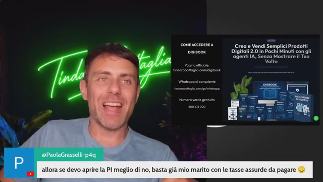

**Testo a schermo (OCR):** ‘agenti A, Senza Mostrare Tuo Volto lio di no, basta già mio marito con le tasse assurde da pagare

> È ovvio che se il costo prodotto è basso, se riesce a effettuare vendite, i margini sono alti. Quindi, se anche paghi tante tasse, comunque guadagni. Ragazzi, se per voi il problema sono le tasse e non quanto riuscite a guadagnare, avete un problema di forza. Non avete una mentalità imprenditoriale. Lasciatelo dire, scusami. Io avevo già acquistato tutto qualche mese fa in un'unica soluzione, ma non ho potuto cominciare a studiare il corso. Volevo sapere se ho diritto ai nuovi aggiornamenti, se sì, dove li trovo? Giuseppe, assolutamente sì. Avrai diritto ai nuovi aggiornamenti se vai nel gruppo, nel Digi Group, che è il gruppo studenti, vedrai che ho fatto un post al riguardo. Sto preparando i nuovi aggiornamenti di Digibook. Quando saranno disponibili, tu apri il percorso e te li ritrovi già pronti, disponibili, con un pallino, con la scritta nuova lezione. Gli aggiornamenti sono sempre graduti, ragazzi.

## [02:18:12] Schermata 238 _(periodic)_

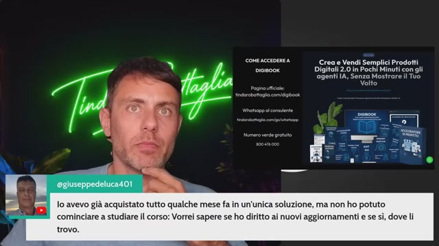

**Testo a schermo (OCR):** coreaccanenea Crea e Vendi Semplici Prodotti vcomooe Digital 2.0 in Pochi Min lo avevo già acquistato tutto qualche mese fa in un'unica soluzione, ma non ho potuto cominciare a studiare il corso: Vorrei sapere se ho diritto ai nuovi aggiornamenti e se sì, dove li trovo.

> Assolutamente sì. Corretto. Assolutamente sì. Corretto. In Italia spero che le imposte, non è che sono da pagare se si apre una partita, io anche le attività occasionali sono soggette a imposte. È normale. Grazie a te, Salvatore. Buona continuazione, Linda. Lasciati così, sei una bella persona. Fa un piacere seguirti. Grazie a te, Jordan. Buona fortuna nella vita. Per una piattaforma che utilizzi per Digibook, quando utilizza il suo utilizzo con il prezzo pagato, Digibook non è una piattaforma, Digibook è un percorso. Forse intendi Digibook Assistant. Che dire, grazie, ho già preso appuntamento, penso che riuscirò a raggiungere quello che sto sognando ormai dieci anni. Grandissimo, grandissimo. Luca. Complimenti per la tua correttezza professionale e competenza, te lo dico con ammirazione dei miei 40 anni di insegnamento. Grazie mille, Bartolo, grazie.

## [02:19:12] Schermata 239 _(periodic)_

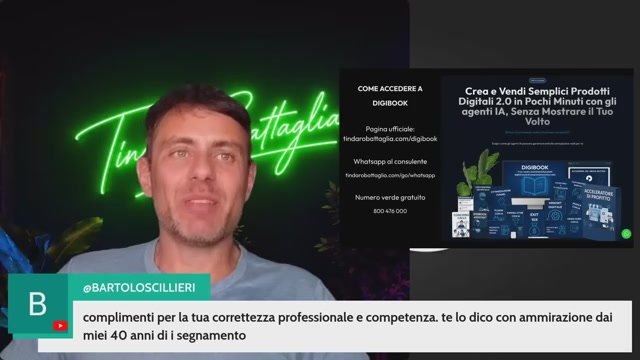

**Testo a schermo (OCR):** come sceveta Crea 0 Vendi Semplici Prodotti ‘nemsoor Digitoli 2.0 in Pochi Minuti con gli ‘agenti A, Senza Mostrare Tuo Volto complimenti per la tua correttezza professionale e com miei 40 anni di i segnamento

> Questo è uno dei complimenti migliori che mi possiate fare, perché, ripeto, in dieci anni di onorata carriera ci metto sempre la faccia e voglio camminare tra le persone. Nessuno può dirmi che ho detto un qualcosa che non devo dire, perché voglio sempre essere trasparente con le persone alle quali faccio formazione o le persone che vogliono accedere alla mia formazione. Questa è una caratteristica che mi contraddistingue ormai da dieci anni, ragazzi, da quando avevo la barbetta rossa. Cercherò comunque di dare l'Aipo, andiamo in ospedale. Mi dispiace, Paola, mi dispiace tantissimo. Sono un po' preso, purtroppo. Grazie comunque, quando sarà pronta, sarai tu sicuramente. Grazie comunque. Ma figurati. Complete comunque l'intro, perché l'elasticità mentale è folle. Sì, ragazzi, sono anche leggermente sperga. Una domanda che non c'entra con l'ospedale. Il coach si può cambiare? Assolutamente sì, Lucrezia. Assolutamente sì. Grazie, ho già preso appuntamento. Ottimo. Allora, ragazzi, prendete appuntamento. Prendete appuntamento.

## [02:20:12] Schermata 240 _(periodic)_

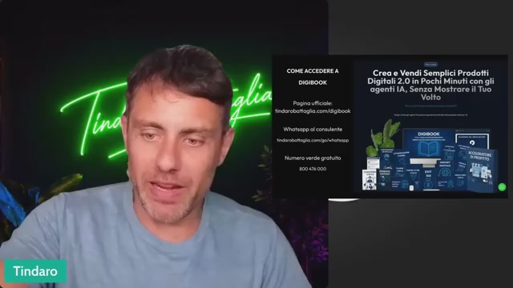

**Testo a schermo (OCR):** Crea e Vendi Semplici Prodotti Digitali 2.0 in Pochi Minufi con gli ‘agent A, Senza Mostrare il Tuo Volto

> Ok. Mi dice Riccardo che altri 20 appuntamenti sono stati presi. Ragazzi, prendete appuntamento con il vostro consulente. L'appuntamento è del tutto gratuito. Chiaritevi le idee. Fategli tutte le domande che volete. Stalkerizzatevi. I miei consulenti hanno lo scopo di rispondere a tutte le vostre domande. Signor Gioni, in questi giorni mi sentivo come consulente. Per ora, grazie mille per tutti gli spunti che mi hai donato. Grazie. Grazie a te mille, Simone. Esatto. Esatto. Esatto. Esattamente, Giuseppe. Esattamente. Ragazzi, grazie di tutto. Ripeto, contattate il vostro consulente. È un percorso che vi può svoltare la vita. È un percorso in cui ho dato il massimo. Ho dato il 100% di me stesso. Tutta la mia formazione, tutta la mia esperienza. Consulenze, supporto. Ragazzi, è un pacchetto all-in-one. Quando vi ho detto che non avrete mai più acquistato nulla del genere, vi riferisco proprio a questo. Ragazzi, accedete a Digibook.

## [02:21:12] Schermata 241 _(periodic)_

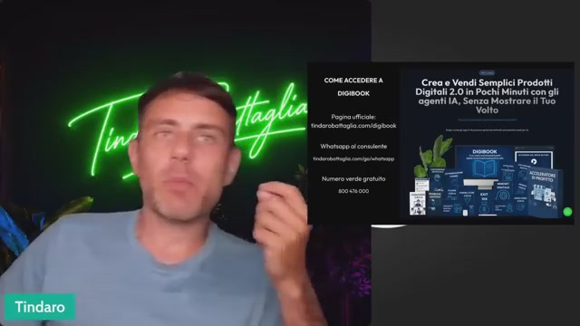

**Testo a schermo (OCR):** i

> Non dovrete mai più acquistare nulla del genere perché avrete un pacchetto ingegnerizzato per il vostro successo con i prodotti digitali. Non esiste nulla di simile, ragazzi. C'è chi vi dà il pacchetto e poi vi butta fuori. C'è chi vi va... Per esempio, questo mi fa piacere. Vedete? Andrea, in questi tre giorni workshop ho già creato un PDF e oggi è arrivata la prima vendita. Grazie, Tinder. Avanti tutta. Grandissimo, Andrea. Questa è una cosa che mi fa estremo piacere. Vedere che già solamente con le mie informazioni gratuite riuscite ad andare avanti, fare azione e iniziare è una cosa che mi dà estrema soddisfazione. Quindi ti dico tripli complimenti per quello che hai fatto. Complimenti davvero. Grazie e complimenti a te come persona. Grazie a te. Too before too late. Too w before too late. Ci siamo? Quindi. Grandissimo che riusci. Io per esempio, Grandissimo che riusci. Io ho preso appuntamento. Ottimo, ragazzi. Ottimo. Vi ricordo la pagina ufficiale. Tinderbattaglia.Com slash Digibook.

## [02:22:12] Schermata 242 _(periodic)_

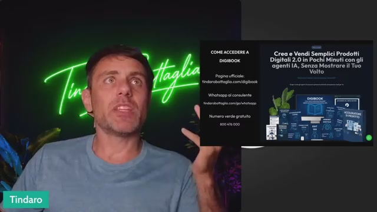

**Testo a schermo (OCR):** Cope Vendi fetus rss OT pinna De retro È

> Entrate qua dentro, ragazzi. Iniziate a giochicchiare con la pagina. Accedete alla parte di mockup. Vedete un attimino in che cosa consiste. La parte di NUX Ultimate. Che cosa otterrete con Digibook. In che cosa consiste. Il metodo Digibook come funziona. Tutta la parte di piattaforma. Tutti i bonus esclusivi. Cui avrete accesso. Ragazzi, ripeto. Non esiste nulla di simile. Non esiste nulla di simile. Non esiste nulla di simile in Europa. È l'ecosistema di formazione sui prodotti digitali più avanzato esistente in Europa.

## [02:22:57] Schermata 243 _(scene)_

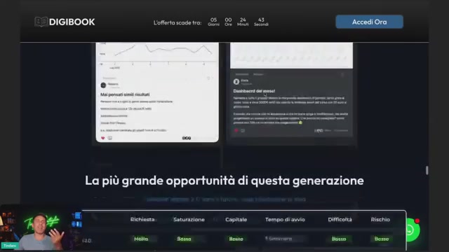

**Testo a schermo (OCR):** DIGIBOOK otro coder La più grande opportunità di questa generazione

> Ci metto la mano sul fuoco. Per cui, ragazzi. Non andate qua a meno che non vogliate acquistare direttamente senza rateizzazione. In quel caso, scegliete il pacchetto che vi serve di più. Ricordatevi che questo è a 20 posti. Dopo 20 posti, ragazzi, andranno direttamente i consulenti a dirvi che non potrete più accedere al Diamond. Se volete acquistare direttamente, cliccate direttamente un pulsante. Vi si apre. Prendiamo per esempio il Diamond. Vi si apre direttamente la pagina di checkout.

## [02:23:34] Schermata 244 _(scene)_

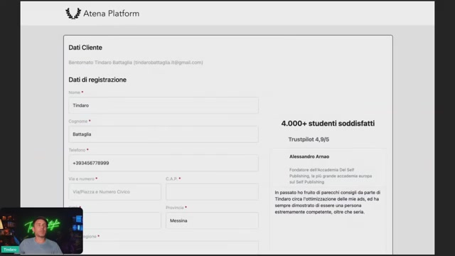

**Testo a schermo (OCR):** 1,2 Atena Platiorm Dati lente Dati registrazione .000+ studenti soddisfatti

> Qua avrete la possibilità di rateizzare direttamente con diversi istituti. ScalaPay, Elite. Abbiamo anche altre finanziarie che vi daranno i consulenti. Se invece volete acquistare direttamente con carta, PayPal, Larna, selezionate uno di questi metodi di pagamento, per esempio PayPal. Pagate. Accedete subito. Molto, molto semplice, ragazzi.

## [02:24:02] Schermata 245 _(scene)_

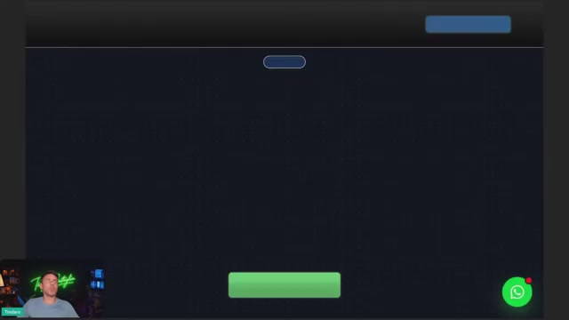

> Grazie, Giuseppina. Gentilissima. Vediamo un po', vediamo un po'. Qualche altra domanda. Stiamo ancora un po' insieme, ragazzi.

## [02:24:14] Schermata 246 _(scene)_

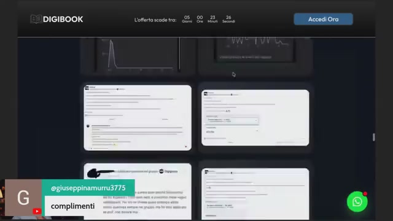

**Testo a schermo (OCR):** DIGIBOOK votrorcosetro: i, 802, Li, Accedi Ora @giuseppinamurru3775 complimenti

> Stiamo ancora un po' insieme. Prima che finisca questo workshop. Grazie, ho già acquistato il corso Diamond Coinsia a studiare perché ho qualche problema con mia mamma. Paola, fai, non ti preoccupare. Noi siamo sempre a tua disposizione. Complimenti di Indaro. Grazie per lo straordinario lavoro che hai fatto. Grazie mille a te, Giuseppina. Grazie per tutte le informazioni che hai condiviso con noi. Ho imparato una mare di cose, ho seguito i corsi per curiosità, ma sinceramente il lavoro che non fa per me, grazie di nuovo. Va benissimo, Giuseppina. L'importante è che tu ti renda conto che un'opportunità che puoi fare, non puoi fare per te. Assolutamente. Grazie di tutto, Indaro. A me vorrei capire alcune dinamiche per i miei clienti, oltre che per un mio progetto di forza per il resto. Ragazzi, buona vita. Non abbiate paura per la partita, io. Assolutamente, assolutamente. Però, fissa la consulenza con il consulente. Io ho già terminato uno storybook per mio nipote, quasi terminato un ebook. Grandissima, Tania. Complimenti per la terza data, le spiegazioni erano molto chiare. Mi hai aperto un mondo che non conoscevo. Sei una persona valida. Grazie, Francesca.

## [02:25:14] Schermata 247 _(periodic)_

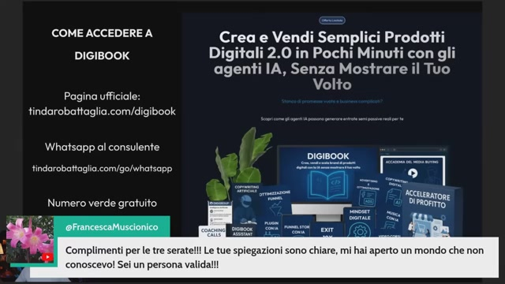

**Testo a schermo (OCR):** COME ACCEDERE A DIGIBOOK Pagina ufficiale: tindarobattaglia.comY/digibook ‘Whatsapp al consulente tindarobattaglia.com/go/whatsapp Numero verde gratuito Crea e Vendi Semplici Prodotti Digitali 2.0 in Pochi Minuti con gli agenti IA, Senza Mostrare il Tuo Volto Complimenti perle tre seratell! Le tue spiegazioni sono chiare, mi hai aperto un mondo che non conoscevo! Sei un persona validaili

> Sì, sono Roberto, il consulente di Tinder. Clicca sul link che Tinder ha lasciato fissato. Ragazzi, c'è anche un link fissato nella chat. Allora, se vuoi cambiare consulente chiara, puoi farlo in due modi. Ora te lo mostro. Allora. Primo modo, vedi? Vai qua. C'è il commento sotto il bloccato in basso, se stai utilizzando un iPhone. Ci clicchi. Vedi? E da qua clicchi sul link e accedi direttamente all'ebook, che è questa pagina. Da questa pagina. Come vedi, in basso sulla destra c'è un pallino di WhatsApp. Qua, vedi? Ci clicchi. Questa parte qua. Aspettate che c'è Refresh. Ci clicchi e accedi direttamente ai consulenti.

## [02:26:14] Schermata 248 _(periodic)_

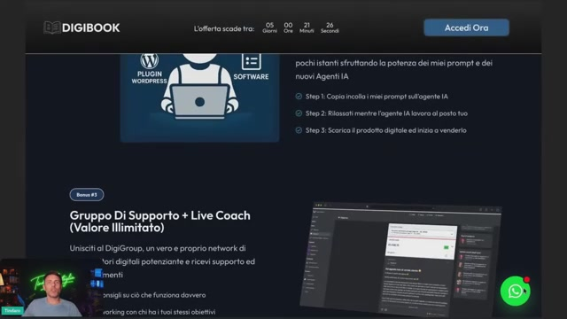

**Testo a schermo (OCR):** DIGIBOOK e DE LE fee) pochi stent frufondo i poten e mie prompt ed Era == Z0b ED Graie pioli Crati (Valore Illimitato)

> Va bene? Molto, molto semplice. Eccolo qua. Ci clicco. E accetto la pagina dei consulenti.

## [02:26:26] Schermata 249 _(scene)_

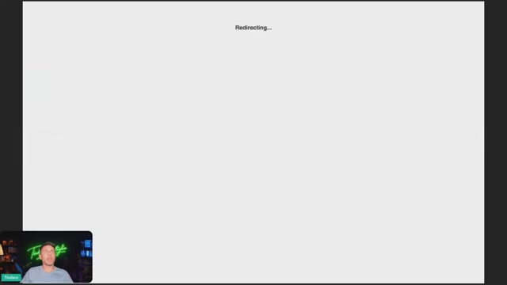

> Da qui ne scelgo uno qualsiasi. Per esempio, il grandissimo Giuseppe. Clicco scrivi su WhatsApp.

## [02:26:37] Schermata 250 _(scene)_

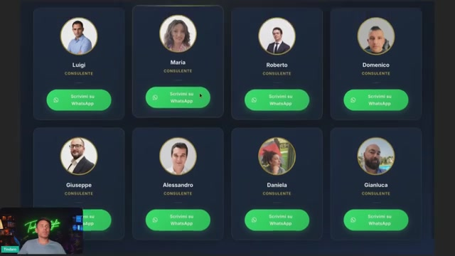

**Testo a schermo (OCR):** Gi) eil CHI (Jil

> E ci parli. Molto, molto semplice. Ok, ragazzi? Ma il mio consiglio resta sempre quello, ragazzi, di parlare con il consulente

## [02:26:44] Schermata 251 _(scene)_

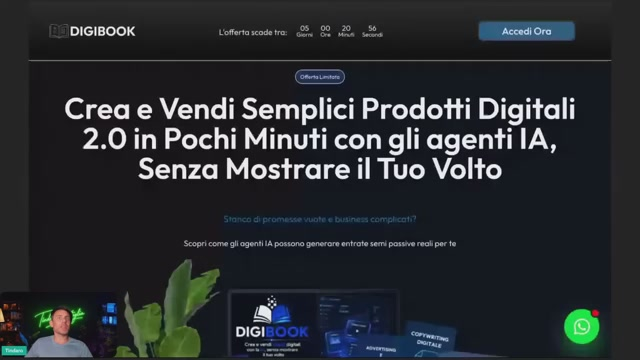

**Testo a schermo (OCR):** DIGIBOOK Loteriarodetre «lt, Crea e Vendi Semplici Prodotti Digitali 2.0 in Pochi Minuti con gli agenti IA, Senza Mostrare il Tuo Volto Scopricomegliogenti ponano genere ento sem pone rai pre i gr 14 nf ca

> e di dare tutte le informazioni che vi servono. Ottimo, Riccardo. Ottima scelta. Tina, scusa, ma non ho capito la cosa sugli store. Se ho capito bene l'offerta, noi andiamo a creare il prodotto digitale e quale andrà messo nel vostro store? E qui la domanda è fa differenza la posizione del prodotto su uno store piuttosto che su un altro? No. Non lo inserisci nel nostro store. Lo crei all'interno del tuo store. Vedi, questa è una piattaforma

## [02:27:14] Schermata 252 _(scene)_

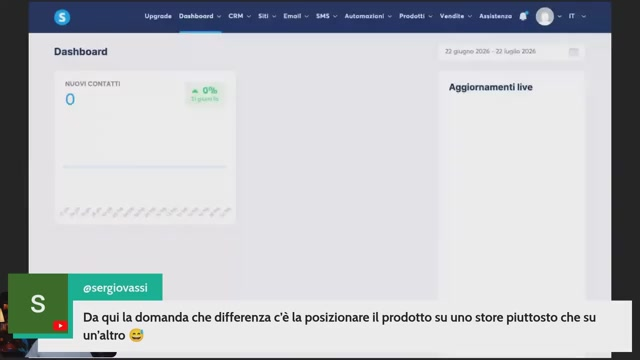

**Testo a schermo (OCR):** Aggiornamenti ive Da qui la domanda che differenza c'è la posizionare il prodotto su uno store piuttosto che su un'altro &

> che si chiama System I.O. Da qui ti crei i tuoi funnel. Per esempio questo, vedi? Ti crei il tuo funnel. Un'oltre ti sei creato il tuo funnel. Per esempio prendiamo questo.

## [02:27:28] Schermata 253 _(scene)_

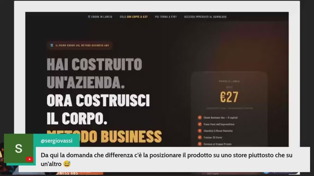

**Testo a schermo (OCR):** HAI COSTRUITO UN'AZIENDA. ORA COSTRUISCI IL CORPO. Da qui la domanda che differenza cè la posizionare il prodotto su uno store piuttosto che su un'altro &

> Vedi? Un'oltre le persone acquistano da te, tu incassi direttamente. Molto molto semplice, ok? Quindi non lo posizioni nel mio store. Va bene? Non lo posizioni nel mio store. Quale pronto posso utilizzare per la creazione dell'HTML da fornire?

## [02:27:50] Schermata 254 _(scene)_

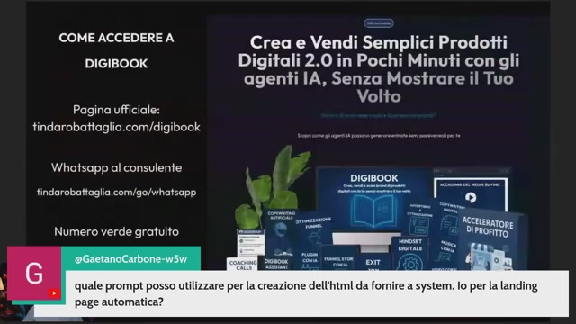

**Testo a schermo (OCR):** A Crea e Vendi Semplici Prodotti DIGIBOOK Digitali 2.0 in Pochi Minuti con gli agenti IA, Senza Mostrare il Tuo Volto Pagina ufficiale findarobattaglia.com/digibook Whatsapp al consulente tindarabattaglia.com/go/whatsapp Numero verde gratuito quale prompt posso utilizzare per la creazione dell'html da fornire a system. lo per la landing EMISE page automatica?

> Sì, lo trovi nella sezione di aggiornamento di Digibook. Trovi tutto questo, ok? Ma figurati, di nulla. Ok ragazzi, due ore e ventotto di live. Facciamo gli ultimi due minuti. Se avete domande, ragazzi, sto alcherizzando di domande. Quello che vi devo dire, ovviamente, è di contattare il vostro consulente. Se non avete un consulente, regatevi sulla pagina di Digibook. C'è un link nella chat in basso. Ok? C'è un link nella chat in basso. Vi collegate e chiedete di parlare con un consulente. Molto molto semplice. Però, se dovete realizzare, contattate il consulente. Se non dovete realizzare, volete pagare con carta o volete pagare con un bonifico, contattate il consulente. Se volete pagare con carta o con Paypal, tranquillamente, fatelo direttamente e avrete accesso automaticamente al percorso. Avrete accesso automaticamente alla creazione del funnel se scegliete il Diamond. Avrete accesso automaticamente al gruppo di supporto. Ovviamente ci sono tutte le automazioni

## [02:28:50] Schermata 255 _(periodic)_

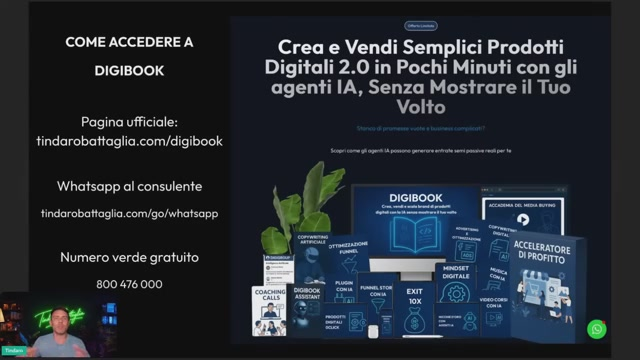

**Testo a schermo (OCR):** COME ACCEDERE A DIGIBOOK Pagina ufficiale: ‘tindarobattaglia.com/digibook Whatsapp al consulente tindarobattaglia.com/go/whatsapp Numero verde gratuito 800476000 = Crea e Vendi Semplici Prodotti Digitali 2.0 in Pochi Minuti con gli agenti IA, Senza Mostrare il Tuo Volto

> che vi permettono di accedere in tutte scioltezze e comodità a tutto questo ben di Dio. Se invece volete realizzare, ragazzi, contattate il consulente, fissate una colla, gli fate tutte le domande che volete e sono a vostra disposizione, ovviamente, per rispondere a tutte le vostre domande. Ci siamo? Allora, ultima domanda. Che tipi di prodotti igienici possono creare oltre l'ebook? In realtà te l'ho già mostrato quando ti ho parlato del corso. Ti ho mostrato anche la lezione del corso. Puoi creare ebook, checklist, tracker, workbook, template. Puoi creare plug-in. Puoi creare software interi. Puoi creare di tutto. Grazie mille, Linda. L'avere tanta curiosità nella vita è una cosa bellissima. Complimenti per il tuo lavoro. Grazie mille, Sasa. Lo apprezzo davvero. Ultime domande, ragazzi. Siamo in 120 in questo momento. Fatemi la vostra domanda. Sono a vostra disposizione ancora per qualche minuto. Dopodiché...

## [02:29:50] Schermata 256 _(periodic)_

**Testo a schermo (OCR):** «® ELLIS) Crea e Vendi Semplici Prodotti DIGIBOOK Digitali 2.0 in Pochi Minuti con gli agenti IA, Senza Mostrare il Tuo Volto Pagina ufficiale: ‘tindarobattaglia.com/digibook Whatsapp al consulente tindarobattaglia.com/go/whatsapp Numero verde gratuito 800 476.000 pd = °° fi ‘e

> Come rispondereste a chi dice che prodotti igienici... Va bene ragazzi, contattate il vostro consulente, anche perché già i primi tre giorni di consulenze se ne sono andate, chiedetegli tutte le informazioni che vi servono, prenotate l'appuntamento, ragazzi è gratuito, stoccherizzate le domande. Grazie per essere stati qui con me in questo workshop digitale, ovviamente spero di rivedervi all'interno del gruppo, all'interno del percorso. È stato bellissimo ragazzi, grazie per aver partecipato al workshop, ovviamente

## [02:30:50] Schermata 257 _(periodic)_

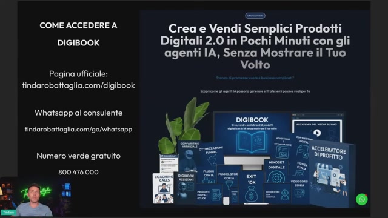

**Testo a schermo (OCR):** COME ACCEDERE A DIGIBOOK Pagina ufficiale: tindarobattaglia.com/digibook Whatsapp al consulente tindarobattaglia.com/go/whatsapp Numero verde gratuito 800 476.000 Digitali Crea e Vendi Samp Prodotti ..0 in Pochi Minuti con gli agenti IA, Senza Mostrare il Tuo OLO

> restate iscritti al canale YouTube e noi ci vediamo prossimamente o nel gruppo o nel canale YouTube, io spero nel gruppo. Grazie a tutti ragazzi, ciao!
