# Business fisico o digitale? la risposta che non ti aspetti

> Documento generato automaticamente: trascrizione e screenshot sincronizzati del video-corso.

## [00:00:00] Schermata 0 _(start)_

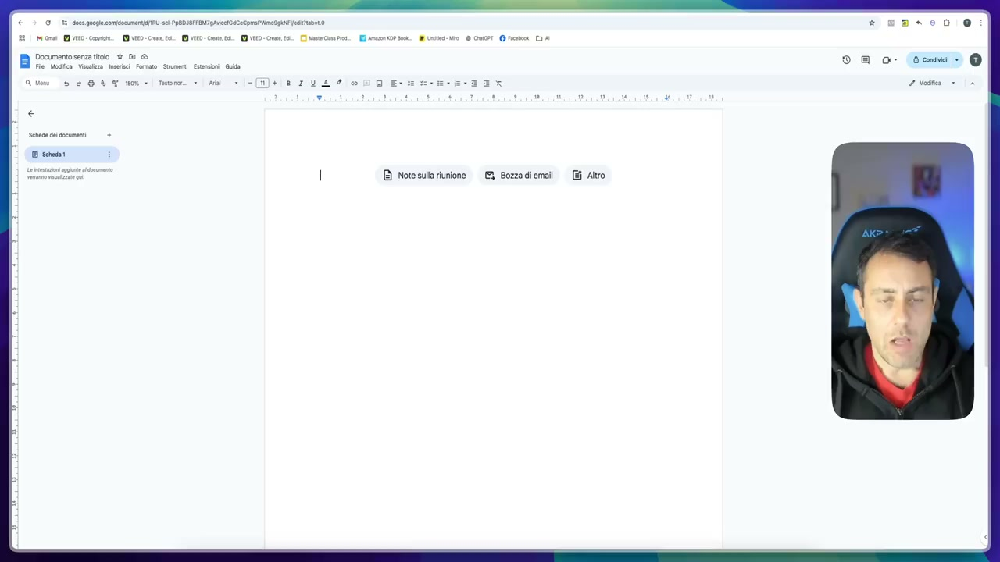

**Testo a schermo (OCR):** € > OO t3 Gori greco PESO Bpm E (bons E vio. cpr Eito cv ta oct. ID: fe Cn Documento senza tito # © © Q res Se GAY one enon > i (I è CES cazz E Notesulla riunione 3 Bozzadiemail [ij Altro

> La prima cosa che dobbiamo capire e che dobbiamo capire bene prima di iniziare a fare business, che in realtà non solo business di prodotti digitali, ma per fare business online, è scolpirci nella testa il concetto di business online. Partiamo da questo concetto che, ripeto, per certi versi può sembrare semplice ma che in realtà non lo è. Perché non lo è? Perché la maggior parte delle persone, un po' più grande in modo da farvi leggere meglio quello che scrivo, la maggior parte delle persone associa il concetto di fare business online al concetto di truffa barra cerca di un lavoro serio. Cerchiamo di sfatare un attimino questo mito perché purtroppo l'ignoranza soprattutto in Italia per quanto concerne le attività imprenditoriali online è dilagante. Nel senso che le persone associano il concetto di fare business online, vedremo bene che cosa significa fare business

## [00:01:00] Schermata 1 _(periodic)_

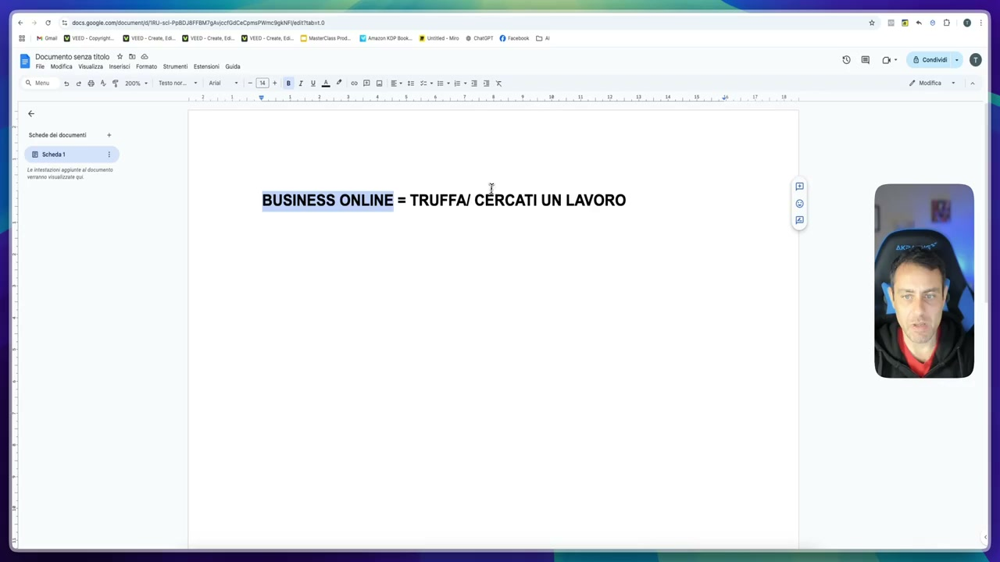

**Testo a schermo (OCR):** 6 3 Qta Goccia GODITI td 230 acne EIUito- cioe. MB vito-c is (I tO. Gne 6 DIVISO. f6 ni i Gist ico 0 OT (rta DIA Documento senza tito È © © @ Meno e DA 200] Tenonene - | PE è BUSINESS ONLINE = TRUFFA/ cERCATI UN LAVORO

> online, con automaticamente il concetto di truffa cercati un lavoro, possibilmente lavoro serio, perché fare business non è lavoro serio, fare business online in realtà non è lavoro serio. Perché questo? Perché la maggior parte delle persone viene stalkerizzata molto spesso da pubblicità di fuffa guru che vi propongono il rimedio miracoloso per diventare ricchi. Questo significa potenzialmente i classici down for you truffa in cui il fuffa guru di turno fa tutto per voi, voi non dovete assolutamente fare nulla, senza fare nulla voi gli date 5000 euro e in automatico inizieranno a fioccare i bonifici dal mese successivo, salvo poi bloccarvi e non avrete possibilità di rivalervi sul fuffa guru di turno, perché la maggior parte di questi tizi sta a Dubai, per cui andare a recapitare una raccomandata Dubai è al quanto difficile, perché il postino potrebbe non azzeccare la buca del deserto in cui si trova la società dell'emiratino di turno, oppure vi fate

## [00:02:00] Schermata 2 _(periodic)_

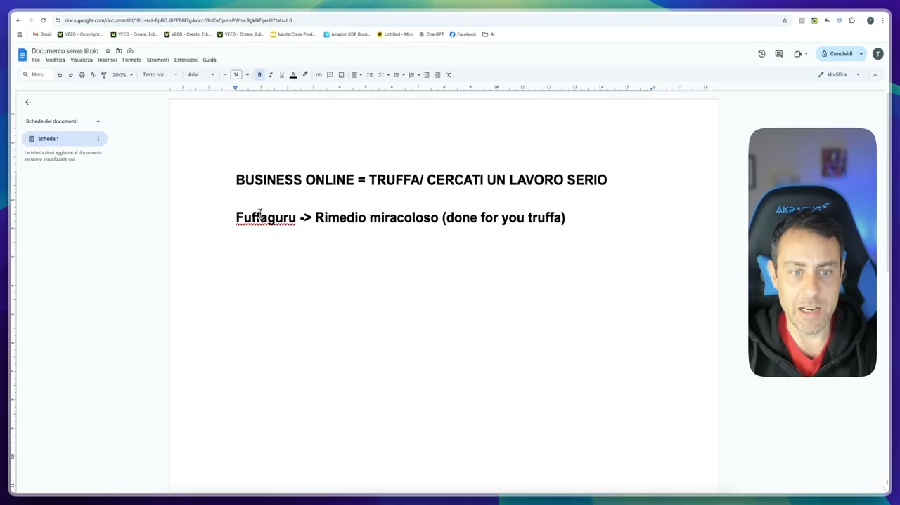

**Testo a schermo (OCR):** Documento senza tito # © © Que de GA 9 200-) femore - i <A G DI som BUSINESS ONLINE = TRUFFA/ CERCATI UN LAVORO SERIO Fuffaguru -> Rimedio miracoloso (done for you truffa)

> scammare da improbabili bot di trading, barra segnali di trading, barra tutto quello che ha a che fare col trading. Questo purtroppo ragazzi perché io ho condotto una battaglia nel corso degli anni spietata sul cercare di far capire alle persone nei miei contenuti di marketing, nei miei contenuti educativi, sul mio canale youtube, nel cercare di far capire alle persone che tendenzialmente, lo riscrivo qui ragazzi in modo che sia la palissiano, il trading lo scrivo anche alle tre maiuscole, non è un business, ok? Purtroppo però, dico purtroppo perché ho fatto una battaglia serrata su questa cosa ma non sono mai riuscito a farlo entrare nella testa delle persone, lo sottolineo ragazzi voi che state guardando questo video cortesemente mettetevelo nella testa, scolpitevelo, il trading non è un business e purtroppo la

## [00:03:00] Schermata 3 _(periodic)_

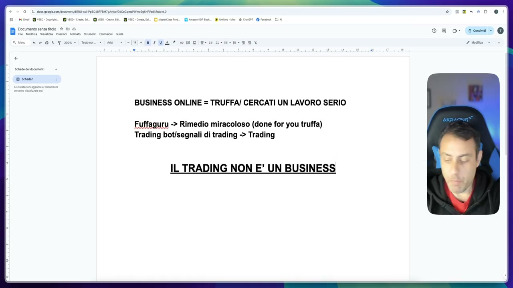

**Testo a schermo (OCR):** Documento senza tito ®© © Que se 8A 90 è BUSINESS ONLINE = TRUFFA/ CERCATI UN LAVORO SERIO Fuffaguru -> Rimedio miracoloso (done for you truffa) Trading bot/segnali di trading -> Trading IL TRADING NON E’ UN BUSINESS

> parola trading è l'analogo del calcio quando si parla di sport per l'Italia, cioè le persone in Italia quando pensano a un business pensano al trading, la realtà delle cose è totalmente diversa ragazzi, il trading non è un business, il trading è un gioco a somma zero, che significa gioco a somma zero? Significa che mentre un business e ora ti darò l'accezione di business, la definizione di business, capiremo meglio perché business online non significa truffa ma anzi una tira imprenditoriale online è una cosa che tendenzialmente sanno fare in pochissimi hanno una propensione all'investimento, al rischio imprenditoriale, tutta una serie di concetti che in questo video non voglio approfondire perché altrimenti il video durerebbe anni e anni, ma tendenzialmente il trading è un gioco a somma zero, che significa un gioco a somma zero? Significa che mentre da una parte io sto guadagnando, dall'altro lato del mondo ragazzi c'è uno, ci sono uno o più persone che stanno perdendo in modo tale che la somma del valore dell'azione di trading che sto compiendo sia pari a zero. Mi spiego un esempio, io

## [00:04:00] Schermata 4 _(periodic)_

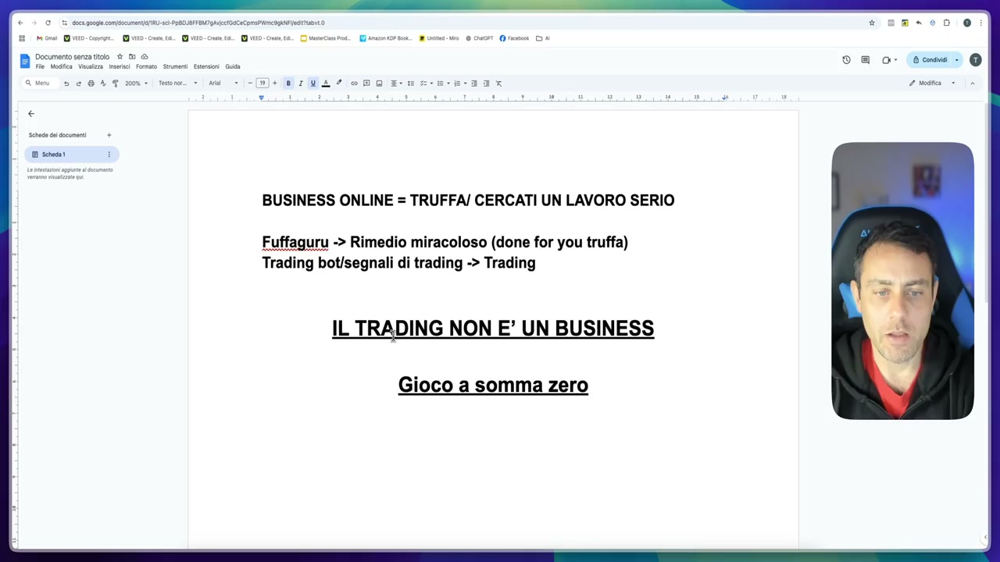

**Testo a schermo (OCR):** CESSI BUSINESS ONLINE = TRUFFA/ CERCATI UN LAVORO SERIO Fuffaguru -> Rimedio miracoloso (done for you truffa) Trading bot/segnali di trading -> Trading IL TRADING NON E’ UN BUSINESS Gioco a somma zero

> compro dollari, compro 200 dollari ok, compro 200 dollari, ragazzi dico una stronzata perché ripeto il trading lo odio, non è una cosa che fa per me, compro 200 dollari a 300 euro ok, poi il dollaro sale, vendo 200 dollari e li vendo a 500 euro ok, vedete io tendenzialmente ho guadagnato 200 euro da questa azione di trading, anche se in realtà poi sono le plus valenze tassate, insomma non voglio non voglio entrare nello specifico, ma poniamo il caso della diciamo della poniamo il caso della situazione ideale in cui io non spendo soldi in tasse eccetera eccetera, quindi ho guadagnato 200 euro, in realtà non ho guadagnato 200 euro ragazzi perché in questo gioco c'è qualcun altro che ci sta perdendo 200

## [00:05:00] Schermata 5 _(periodic)_

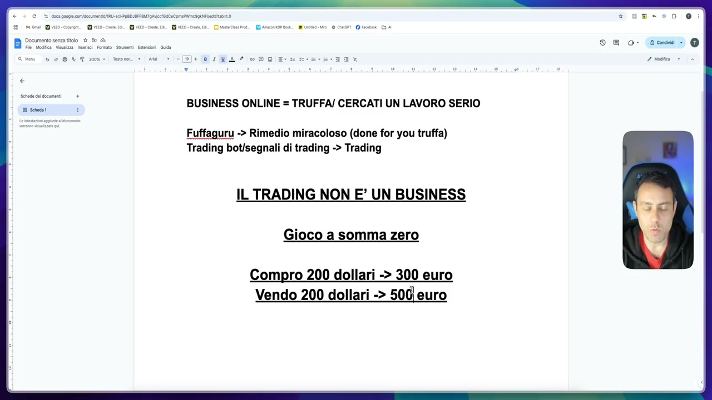

**Testo a schermo (OCR):** Documento enza tito ®© © Que seA Ta è BUSINESS ONLINE = TRUFFA/ CERCATI UN LAVORO SERIO Fuffaguru -> Rimedio miracoloso (done for you truffa) Trading bot/segnali di trading -> Trading IL TRADING NON E’ UN BUSINESS Gioco a somma zero Compro 200 dollari -> 300 euro Vendo 200 dollari -> 500, euro

> euro, nel business non c'è un gioco a somma zero, nel business c'è una produzione di valore in cambio di denaro ok, cioè nell'attività imprenditoriale io investo tempo o denaro o entrambi ok, per produrre valore per il mercato e il mercato mi ricompensa con del denaro, quindi se da un lato io guadagno in un business online, dall'altro lato c'è una persona che è disposta a pagarmi ma che è disposta a pagarmi perché il valore che riceve è superiore alla cifra che è disposta a spendere ok, quindi questo deve essere ben chiaro, nel trading invece tutto questo non c'è, se io compro 200 dollari a 300 euro e vendo 200 dollari a 500 euro dall'altra parte del mondo ci sono uno o più persone che stanno perdendo 200 euro, ragazzi il trading è un gioco a somma zero, quindi il trading non è un business perché il business è un qualcosa che produce valore per il mercato, ora tutti questi concetti vi saranno più chiari

## [00:06:00] Schermata 6 _(periodic)_

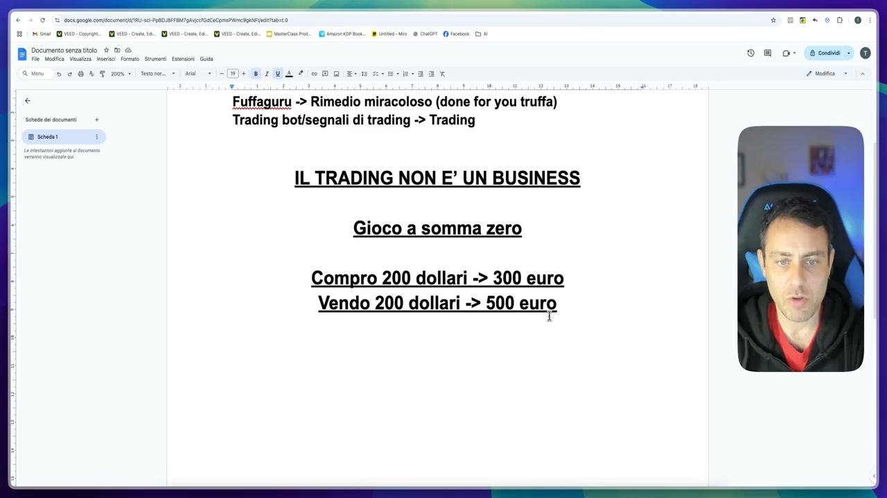

**Testo a schermo (OCR):** +44 Dole ì Fuffaguru -> Rimedio miracoloso (done for you truffa) Trading bot/segnali di trading -> Trading IL TRADING NON E’ UN BUSINESS Gioco a somma zero Compro 200 dollari -> 300 euro Vendo 200 dollari -> 500 euro

> ok, quindi questo deve essere assolutamente chiaro, perché ho fatto questa parentesi ragazzi, perché la maggior parte delle persone purtroppo ripeto in italia si fa truffare dai classici metodini del trading, bot automatici, segnali di copy trading, perché? Perché diciamocela tutta ragazzi, la maggior parte delle persone non vuole fare un cazzo, quindi cerca sempre il rimedio miracoloso per cercare di stornare il lunario, farsi quella seconda entrata senza fare nulla, ragazzi vi do una notizia, è difficilissimo se non impossibile crearsi una seconda entrata o fare decine se non centinaia di migliaia di euro, milioni senza lavorare, ok? Il business online ragazzi è un'attività come un'altra, è un'attività imprenditoriale, ma l'attività imprenditoriale presuppone che c'è un imprenditore che lavora per produrre valore per il mercato, poi magari nella fase più diciamo più fina del termine, permettetemi appunto questa questa parola, tendenzialmente l'imprenditore delega gran parte della sua attività imprenditoriale, ma comunque resta la

## [00:07:00] Schermata 7 _(periodic)_

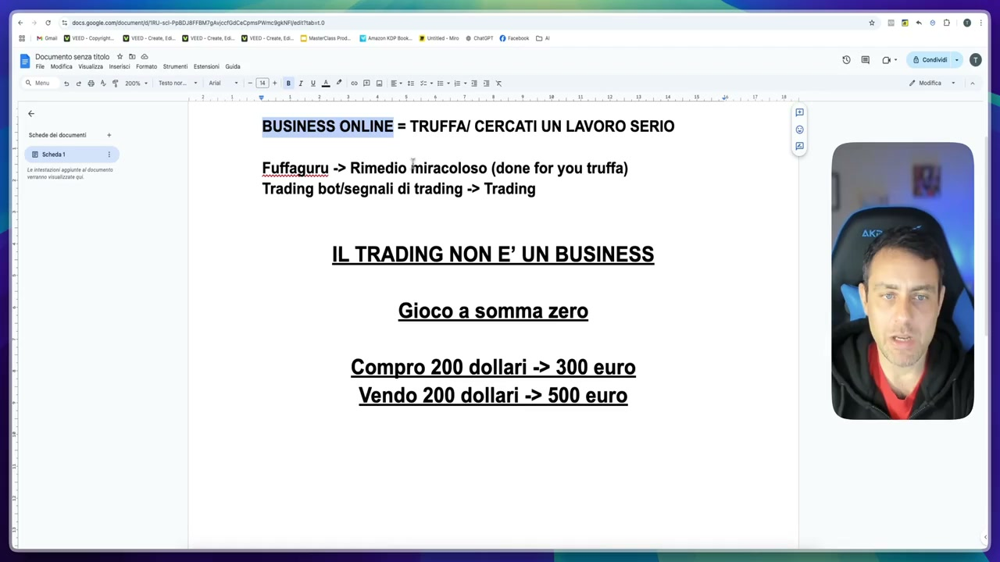

**Testo a schermo (OCR):** Documento senza titolo ®© © ques se A Tm È BUSINESS ONLINE = TRUFFA/ CERCATI UN LAVORO SERIO Fuffaguru -> Rimedio miracoloso (done for you truffa) Trading bot/segnali di trading -> Trading IL TRADING NON E’ UN BUSINESS Gioco a somma zero Compro 200 dollari -> 300 euro Vendo 200 dollari -> 500 euro

> mente il deus ex machina che lavora all'interno della sua attività imprenditoriale, ma nella fase iniziale ragazzi quando voi volete crearvi un'attività imprenditoriale online, voi lavorate e lavorate per produrre valore per il mercato, ok? Vi farete le facebook ads, vi farete il vostro prodotto digitale magari con l'intelligenza artificiale per agevolare, per velocizzare il tutto, ma comunque dovrete lavorare, quindi questo è, ok? Un'attività imprenditoriale presuppone del lavoro di fondo per produrre valore per il mercato, mentre il trading non è, come vi stavo dicendo, sfruttando il fatto che il trading è l'analogo del calcio per quanto riguarda gli sport che gli italiani conoscono, nel corso del tempo la grandissima stragrande maggior parte degli italiani è stata scammata da botte di trading, segnali di trading, non so se vi è mai arrivata la telefonata del compra azioni amazon trading, no? Perché cosa fanno i truffatori? Non fanno altro che unire un brand conosciutissimo come amazon con l'analogo dello sport nazionale per gli italiani che è il trading, ok? Quindi

## [00:08:00] Schermata 8 _(periodic)_

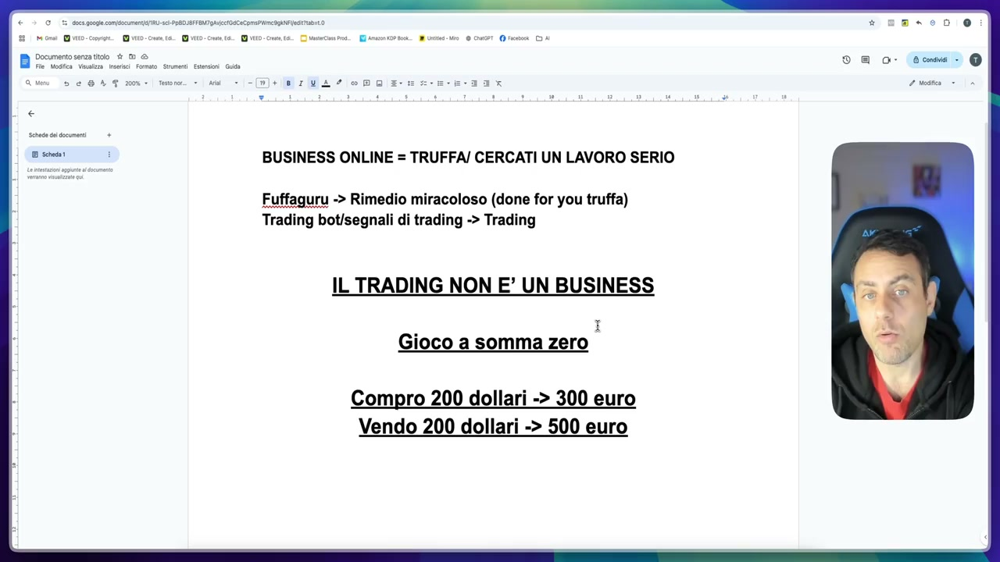

**Testo a schermo (OCR):** BUSINESS ONLINE = TRUFFA/ CERCATI UN LAVORO SERIO Fuffaguru -> Rimedio miracoloso (done for you truffa) Trading bot/segnali di trading -> Trading IL TRADING NON E’ UN BUSINESS I Gioco a somma zero Compro 200 dollari -> 300 euro Vendo 200 dollari -> 500 euro

> cosa fanno? Amazon trading, uniscono queste due parole in modo tale da avere più fiducia possibile e poi truffare le persone, trucchetti di psicologia che poi vengono applicati dai truffatori appunto purtroppo per distruggere un mercato che è un mercato quello del make money online che tendenzialmente è molto florido e se fosse condotto in una certa maniera da formatori che sanno quello che dicono e che applicano ciò che dicono ogni giorno tendenzialmente non avremmo tutti questi problemi, ok? Io non starei qui a spiegarvi queste cose ma tant'è, quindi per le persone business online o quale truffa? Cerca di un lavoro serio perché le persone ormai sono state truffate da tutta questa serie di giochetti per cui considerano un business online una truffa, la realtà delle cose ragazzi come vi dicevo è ben diversa, nel senso che un'attività imprenditoriale, un business online non è altro che una attività imprenditoriale, ora se voi andate al bar e vi prendete un caffè non penso che voi

## [00:09:00] Schermata 9 _(periodic)_

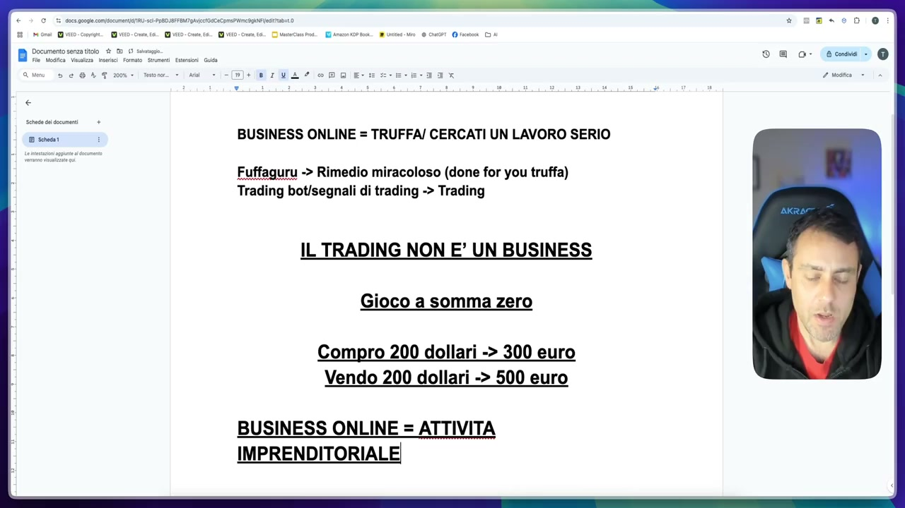

**Testo a schermo (OCR):** BUSINESS ONLINE = TRUFFA/ CERCATI UN LAVORO SERIO Fuffaguru -> Rimedio miracoloso (done for you truffa) Trading bot/segnali di trading -> Trading IL TRADING NON E’ UN BUSINESS Gioco a somma zero Compro 200 dollari -> 300 euro Vendo 200 dollari -> 500 euro BUSINESS ONLINE = ATTIVITA IMPRENDITORIALE

> direte al proprietario del bar che sta truffando le persone a meno che il caffè non ve lo passi 10 euro, ma ragazzi alzo le braccia, ma difficilmente andrete a dire al proprietario del bar, al gestore del bar che sta truffando le persone, se andate a comprarvi un vestito difficilmente direte al proprietario del negozio di articoli di vestiario che sta truffando le persone, purtroppo in italia si associa il concetto di online e di business online al concetto di truffa, ragazzi il business online non è altro che un'attività, attività imprenditoriale che udito dite non viene condotta secondo i criteri della fisicità cioè non c'è un negozio fisico ma viene condotta online, viene condotta nel web, ok? Quindi tra un'attività imprenditoriale normale e un'attività imprenditoriale online ragazzi non c'è assolutamente differenza, un business

## [00:10:00] Schermata 10 _(periodic)_

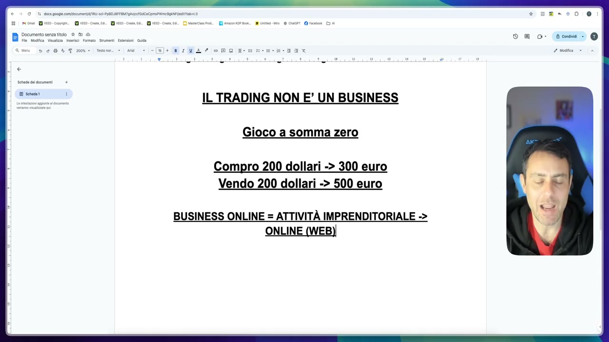

**Testo a schermo (OCR):** IL TRADING NON E’ UN BUSINESS Gioco a somma zero Compro 200 dollari -> 300 euro Vendo 200 dollari -> 500 euro BUSINESS ONLINE = ATTIVITÀ IMPRENDITORIALE -> ONLINE (WEB)

> online non è altro che un'attività imprenditoriale che viene condotta sul web, ovviamente ci sono dei grossi vantaggi nel condurre un'attività imprenditoriale online piuttosto che sul web, per esempio, quali sono i vantaggi? Ok, andiamo a ridurre un attimo altrimenti non mi bastano 18 pagine di word per spiegarvi quello che vi devo spiegare, quali sono i vantaggi di un'attività imprenditoriale online? Beh, ad esempio, meno budget richiesto ragazzi provate ad aprirvi un bar e vedrete quanto il budget che è richiesto per aprirsi un'attività imprenditoriale tra l'altro fallimentare qual è quella del bar che ad oggi ha visto una saturazione di mercato fortissima e tra l'altro a causa delle norme budget richiesto a fronte del rischio imprenditoriale di non vendere nulla sta sempre più causando una moria di questa tipologia di attività. Per aprirvi un bar ragazzi dovete intanto fare un mutuo per comprarvi il locale o se non comprate il locale affittate il locale

## [00:11:00] Schermata 11 _(periodic)_

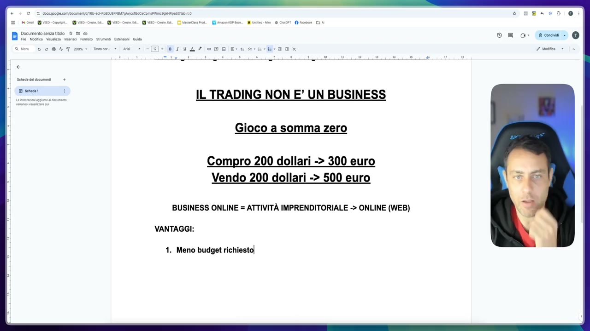

**Testo a schermo (OCR):** IL TRADING NON E’ UN BUSINESS Gioco a somma zero Compro 200 dollari -> 300 euro Vendo 200 dollari -> 500 euro BUSINESS ONLINE = ATTIVITÀ IMPRENDITORIALE -> ONLINE (WEB) VANTAGGI: 1. Meno budget richiesto]

> ma questo implica che dovete spendere del denaro mese per mese dovete pagare l'ingegnere, sappiamo che gli ingegneri non si pagano, devo stare ingegnere per 12 anni e difficilmente si pagano gli ingegneri però scherzi a parte dovete pagare comunque il tecnico che vi rediga la scila, che vi rediga tutto l'insieme di pratiche che sono finalizzate ad aprirvi la vostra attività, dovete pagare l'impresa per la ristrutturazione, dovete pagare i fornitori, dovete fare il leasing dei macchinari e dopo aver speso centinaia di migliaia di euro che magari avete chiesto in prestito ad una banca alla fine del mese voi avete venduto quattro caffè. L'attività imprenditoriale online il business online vi permette di partire con pochissimo budget perché ragazzi non siamo nel 1900 non siamo all'epoca del post romanticismo ragazzi siamo nel 2025, questo significa che oggi possiamo avviare un'attività imprenditoriale sfruttando i mezzi che il web ci mette a disposizione. Quali mezzi

## [00:12:00] Schermata 12 _(periodic)_

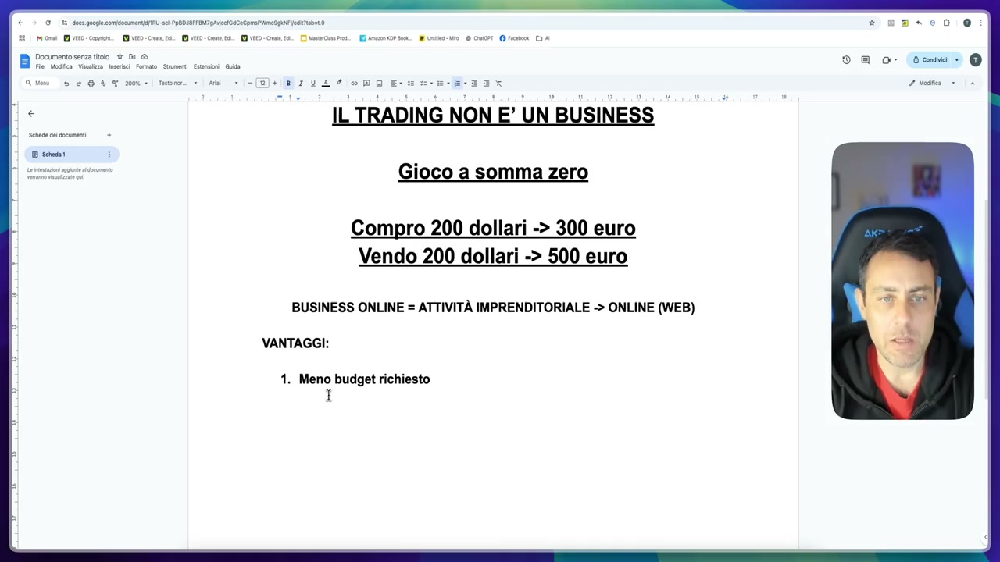

**Testo a schermo (OCR):** a+ VA opens IL TRADING NON E’ UN BUSINESS Gioco a somma zero Compro 200 dollari -> 300 euro Vendo 200 dollari -> 500 euro BUSINESS ONLINE = ATTIVITÀ IMPRENDITORIALE -> ONLINE (WEB) VANTAGGI: 1. Meno budget richiesto I

> ci mette il web a disposizione? La possibilità di crearci pagine di vendita la possibilità di crearci e-commerce praticamente a costo zero, la possibilità di crearci prodotti da vendere a un mercato di riferimento praticamente a costo zero, questa cosa è meno fattibile per i prodotti fisici e molto più fattibile per i prodotti digitali, lo vedremo nel corso di questo corso scusate il gioco di parole, ma tant'è ci mette a disposizione la possibilità di pagare il traffico per appunto portare clienti direttamente all'interno del nostro store, all'interno del nostro funnel di vendita, all'interno del nostro e-commerce, ok? Tutta roba ragazzi che con un'attività imprenditoriale fisica soprattutto alla vecchia maniera, cosa intendo con vecchia maniera? Inizialmente intendo il gestore del locale che si apre il bar e poi fischietta tamburellando le mani sul banco del locale aspettando che le persone guardino la vetrina dentro per prendersi il caffè, ok? Ripeto ragazzi sono cose che per me

## [00:13:00] Schermata 13 _(periodic)_

**Testo a schermo (OCR):** 2 epoens-a-eaax IL TRADING NON E’ UN BUSINESS oc imma zer Compro 200 dollari -> 300 euro Vendo 200 dollari -> 500 euro BUSINESS ONLINE = ATTIVITÀ IMPRENDITORIALE -> ONLINE (WEB) VANTAGGI: ‘1. Meno budget richiesto I

> sono ovvie ma che non sono tanto ovvie per la maggior parte degli italiani che ancora è legata a una vecchia logica di attività imprenditoriale a conduzione familiare per cui si aprono le attività spendendo 200-300 mila euro poi alla fine vendono due caffè o una pizza perché non sanno fare marketing e soprattutto non conoscono la potenza dell'online e vanno a sfogare la loro rabbia nelle sponsorizzate di chi invece ha capito che fare business online oggi ha dei vantaggi evidenti, tra tutti quelli di sprecare meno di investire in realtà meno budget rispetto all'attività fisica e vanno a sfogare la loro rabbia nei commenti sotto le sponsorizzate, ok? Quindi primo vantaggio meno budget richiesto, secondo vantaggio possibilità di condurlo ovunque ragazzi mentre il bar poi ve lo aprite e dovete essere sempre presenti nel bar poi ovviamente ci sono le eccezioni ragazzi delegate a una persona che si occupa di fare caffè di

## [00:14:00] Schermata 14 _(periodic)_

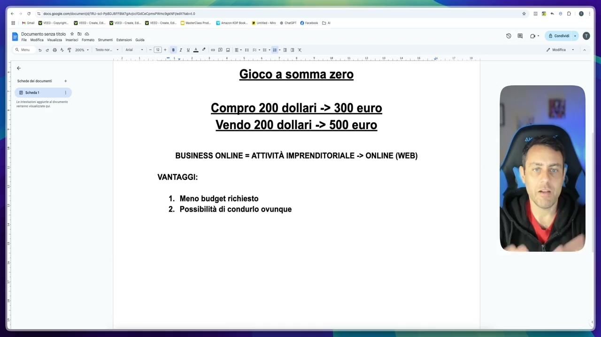

**Testo a schermo (OCR):** Documento senza tito # © © Quae 3 e BAT 20065) Teo > è Gioco a somma zero Compro 200 dollari -> 300 euro Vendo 200 dollari -> 500 euro BUSINESS ONLINE = ATTIVITÀ IMPRENDITORIALE -> ONLINE (WEB) VANTAGGI: 1. Meno budget richiesto 2. Possibilità di condurlo ovunque

> gestire cameriere eccetera eccetera ma questo non vale per la maggior parte le persone che aprono attività imprenditoriale con sede fisica con un business online voi ragazzi potete condurlo ovunque tutto quello che vi serve è un pc e una connessione a internet, si tinder ho sentito queste cose a internet ho sentito queste cose milioni di volte me l'hanno fatte vedere su facebook le ho viste su youtube però ragazzi questo è e se non capite che queste cose sono reali se non capite che queste cose funzionano voi non cambierete mai la vostra vita lo scopo di questo percorso è appunto quello di mostrarvi le potenzialità del business digitale delle attività imprenditoriali online soprattutto di farvi capire come creare un business basato su prodotti digitali che adogia il business che ha più vantaggi possibili tra i vari business online che sono attualmente esistenti ok quindi possibilità di condurlo ovunque io il mio pc o la mia connessione a internet o il mio smartphone

## [00:15:00] Schermata 15 _(periodic)_

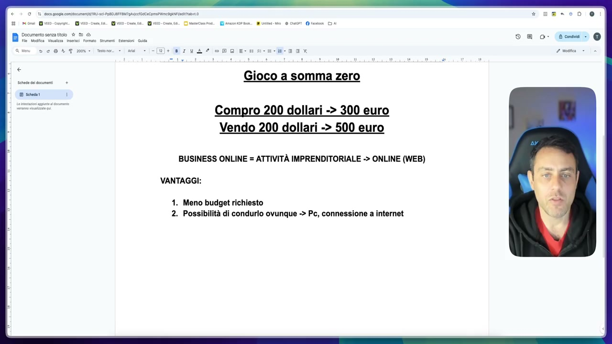

**Testo a schermo (OCR):** Documento senza tito ®© © Quei se A 9 20 n Gioco a somma zero Compro 200 dollari -> 300 euro Vendo 200 dollari -> 500 euro BUSINESS ONLINE = ATTIVITÀ IMPRENDITORIALE -> ONLINE (WEB) VANTAGGI: 1. Meno budget richiesto 2. Possibilità di condurlo ovunque -> Pc, connessione a internet

> Sono in Italia, posso farlo in Italia. Decido di farmi una vacanza, me ne vado a Dubai, me lo posso fare a Dubai. Me ne vado a Montecarlo, perché sono in vacanza con la mia famiglia, perché il business va bene, faccio i miei 300-400 mila euro l'anno e lo posso fare a Monaco, lo posso fare in Patagonia, lo posso fare ovunque, ragazzi. Questo è uno dei grossissimi vantaggi delle attività imprenditoriali online. Non sono fisicamente legato a un luogo, non devo timbrare tesserino, non devo aprire la sala cinesca, mettetela come volete voi, ma è un grossissimo vantaggio. Poi abbiamo visto che meno budget richiesto, possibilità di condurlo ovunque, possibilità di scalarlo ovunque. Che significa possibilità di scalarlo ovunque? Significa che mentre il mio negozio di vestiario, ragazzi faccio l'esempio con un negozio di vestiti perché altrimenti i proprietari dei bar si incazzano con me, ma mentre in un negozio di vestiti io non posso scalare la mia attività fisica se non aprendo altre sedi, il che mi comporta un esborso di centinaia di migliaia di euro e il che va a cozzare con la prima regola, con il primo vantaggio dell'attività imprenditoriale online.

## [00:16:00] Schermata 16 _(periodic)_

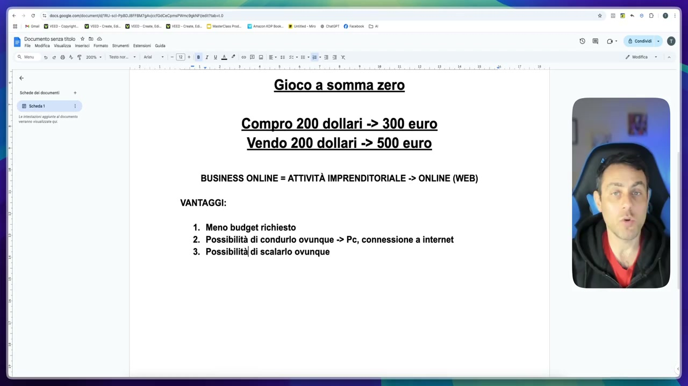

**Testo a schermo (OCR):** 21 Hom ou Documento senza tito # © © Qin de DAG 2006 - | Tesori > rs (TUA nia n Gioco a somma zero Compro 200 dollari -> 300 euro Vendo 200 dollari -> 500 euro BUSINESS ONLINE = ATTIVITÀ IMPRENDITORIALE -> ONLINE (WEB) VANTAGGI: 1. Meno budget richiesto 2. Possibilità di condurlo ovunque -> Pc, connessione a internet 3. Possibilità] di scalarlo ovunque

> Non posso scalarlo più di tanto perché la sede fisica è quella, la metratura è quella, il numero di clienti che possono accedere è quello e poi non ho possibilità di programmare il numero di clienti che arrivano nel mio punto vendita a meno di fare azioni di marketing eclatanti che purtroppo la maggior parte delle persone non sa neanche che esistano, motivo per cui si aprono il classico negozietto e poi falliscono dopo un paio di mesi e danno la colpa ad Amazon che non funziona. Su questa cosa ragazzi dovete farci un corso perché, vabbè lasciamo stare queste cose ma ripeto, ho visto cose di imprenditori che lavorano offline che voi neanche immaginate, ho visto nelle mie migliaia di ore di consulenza che ho fatto anche a questa tipologia di persone che sono convinte che la colpa stia altrove quando in realtà la colpa sta nell'imprenditore stesso che non sa che cosa sia, quale sia il concetto di impresa, che cosa sia un concetto di impresa, l'attività, che quale sia il concetto di rischio imprenditoriale e tutta una serie di cose che gli imprenditori soprattutto nostrali non hanno la minima idea che esistano.

## [00:17:00] Schermata 17 _(periodic)_

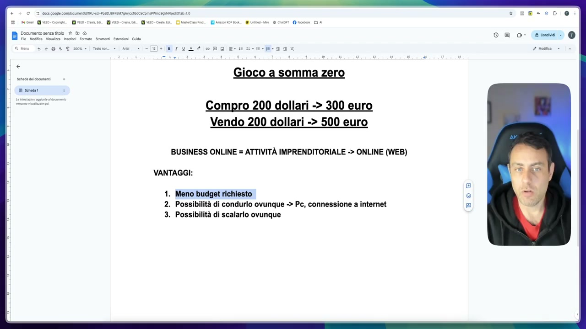

**Testo a schermo (OCR):** Documento senza tito ®© © Que se AT css ce A e n Gioco a somma zero Compro 200 dollari -> 300 euro Vendo 200 dollari -> 500 euro BUSINESS ONLINE = ATTIVITÀ IMPRENDITORIALE -> ONLINE (WEB) VANTAGGI: 1. Meno budget richiesto 2. Possibilità di condurlo ovunque -> Pc, connessione a internet 3. Possibilità di scalarlo ovunque

> Quindi come vi stavo dicendo mentre l'attività offline non c'è possibilità di scalarla, il classico negozietto fisico, e poi non ho la possibilità di condurre a piacimento traffico sulla mia offerta, iniziamo a parlare un po' più nel gergo del business online, con un'attività imprenditoriale online io posso fare questo agevolmente perché tendenzialmente quello che faccio è andare a pagare il trattico, lo porto sulla mia pagina di vendita e ovviamente ho dei soldi, ovviamente ho delle conversioni, cioè ho delle vendite e più ovviamente spendo in traffico, più ovviamente porto traffico sul mio store, sulla mia pagina di vendita, più ovviamente genero guadagni. Capirete bene che questo meccanismo è un meccanismo che è scientifico, cioè mentre nel negozio io non so quante persone entrano e tendenzialmente ho il rischio di avere due persone che mi comprano il taller da 5 euro e dopo aver speso 300.000 Euro in mutuo nel mio negozio di vestiti ho avuto a fine mese un incasso di 10 euro,

## [00:18:00] Schermata 18 _(periodic)_

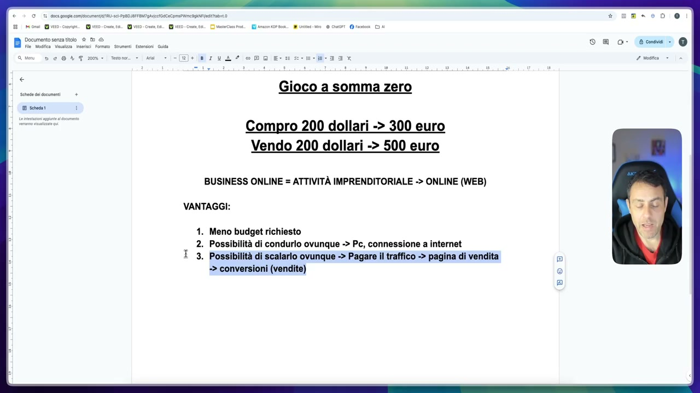

**Testo a schermo (OCR):** Documento senza tito ®© © Qu se BAT 20085 Toson > i (E 2 opolene-seaax È Gioco a somma zero Compro 200 dollari -> 300 euro Vendo 200 dollari -> 500 euro BUSINESS ONLINE = ATTIVITÀ IMPRENDITORIALE -> ONLINE (WEB) VANTAGGI: 1. Meno budget richiesto 2. Possibilità di condurlo ovunque -> Pc, connessione a internet 1 3. Possibilità di scalarlo ‘ovunque -> Pagare il traffico -> pagina di vendita +> conversioni (vendite)

> con un'attività imprenditoriale online io tendenzialmente ho dei dati che con un'attività fisica non ho, quindi spendo poco budget per crearmi il mio business, ho la possibilità di condurlo ovunque e soprattutto ho dati, e ragazzi i dati, cioè avere dati da analizzare in un'attività imprenditoriale sia online sia offline è essenziale per capire in che direzione stanno andando le mie finanze, la maggior parte degli imprenditori non ha contezza di quelli che sono i propri numeri e poi fallisce, e questo soprattutto nelle attività fisiche è eclatante. In un'attività imprenditoriale io invece ho dei dati, quindi riesco a capire quante persone vanno sulla mia pagina di vendita, quante persone arrivano sul mio checkout, se il numero di persone che arrivano al mio checkout è basso significa che la pagina di vendita non sta funzionando bene e quindi devo migliorare la pagina di vendita, cioè ragazzi ho dei dati che mi permettono di capire che cosa sta funzionando, che cosa non sta funzionando e come sistemare quello che evidentemente o eventualmente non sta funzionando.

## [00:19:00] Schermata 19 _(periodic)_

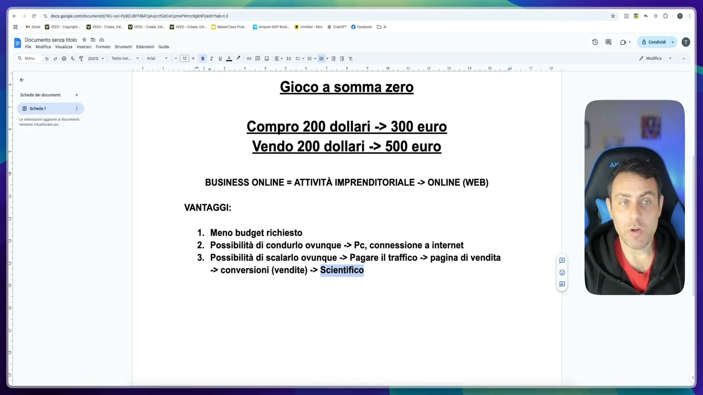

**Testo a schermo (OCR):** Documento senza titolo ®© & die pe SAT «00 <(-(A]e VA OE È Gioco a somma zero Compro 200 dollari -> 300 euro Vendo 200 dollari -> 500 euro BUSINESS ONLINE = ATTIVITÀ IMPRENDITORIALE -> ONLINE (WEB) VANTAGGI: 1. Meno budget richiesto 2. Possibilità di condurlo ovunque -> Pc, connessione a internet 3. Possibilità di scalarlo ovunque -> Pagare il traffico -> pagina di vendita => conversioni (vendite) -> Scientifico

> Poi ragazzi tra l'avere dei dati e saper analizzare i dati passa una differenza abbissale, cioè passa tutto questo mondo, però ripeto abbiamo questi dati che ci permettono di capire che cosa sta funzionando e che cosa non sta funzionando. Nelle attività invece fisiche tendenzialmente gli imprenditori non hanno la minima idea di cosa stanno facendo anche perché la mola di dati che hanno è bassa, molto spesso non acquisiscono neanche dati dai clienti, ci sono persone come il sottoscritto che entrano e lasciano migliaia di euro in capi di vestiario e non vengono neanche degnati di attenzione da parte della commessa e non hanno neanche la bontà gli imprenditori che gestiscono i locali di chiedere ad esempio il numero di telefono per fare azioni di remarketing, sms marketing.

## [00:20:00] Schermata 20 _(periodic)_

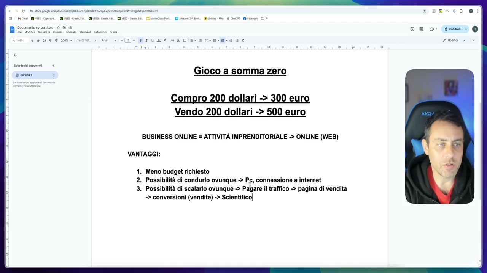

**Testo a schermo (OCR):** Gioco a somma zero Compro 200 dollari -> 300 euro Vendo 200 dollari -> 500 euro BUSINESS ONLINE = ATTIVITÀ IMPRENDITORIALE -> ONLINE (WEB) VANTAGGI: 1. Meno budget richiesto 2. Possibilità di condurlo ovunque -> Pe, connessione a internet 3. Possibilità di scalarlo ovunque -> por il traffico > pagina di vendita -> conversioni (vendite) -> Scientifico]

> Tutte queste cose assolutamente non esistono e quindi hanno una mola di dati che è assolutamente insufficiente per capire in che direzione sta andando il loro business. Non avere dati significa avere una nave in tempesta e non capire in che direzione è il nord, giusto per fare un paragone con le attività marittime. Queste sono tutte una serie di vantaggi che le attività imprenditoriali online hanno rispetto alle attività fisiche ma ripeto ragazzi business online non è una truffa, è un'attività imprenditoriale quindi un'attività di impresa a tutti gli effetti. Ora parliamo un attimo di investimenti o di attività imprenditoriale online, quindi parliamo di cose da investire in un business. Allora abbiamo detto che un business è un'attività imprenditoriale e che cos'è in realtà l'attività imprenditoriale?

## [00:21:00] Schermata 21 _(periodic)_

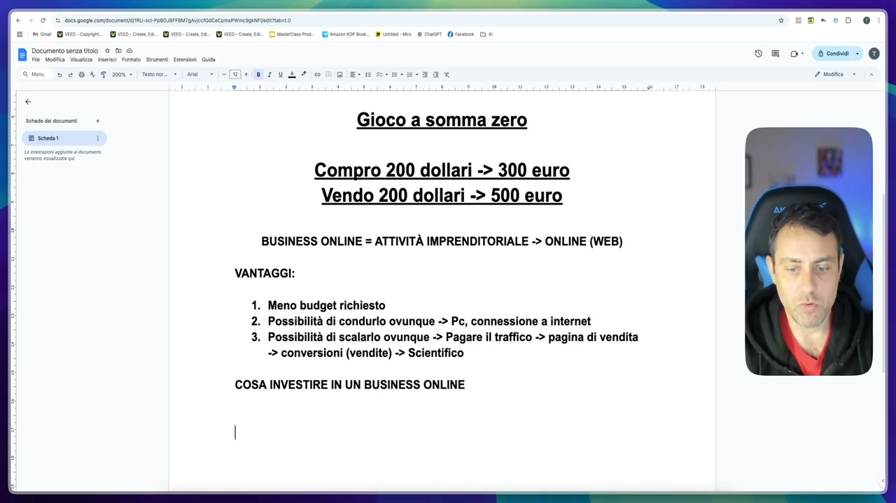

**Testo a schermo (OCR):** Gioco a somma zero Compro 200 dollari -> 300 euro Vendo 200 dollari -> 500 euro BUSINESS ONLINE = ATTIVITÀ IMPRENDITORIALE -> ONLINE (WEB) VANTAGGI: 1. Meno budget richiesto 2. Possibilità di condurlo ovunque -> Pc, connessione a internet 3. Possibilità di scalarlo ovunque -> Pagare il traffico -> pagina di vendita +> conversioni (vendite) -> Scientifico COSA INVESTIRE IN UN BUSINESS ONLINE

> Un'attività imprenditoriale non è altro che offrire a un mercato di riferimento prodotti e servizi che il mercato vuole. Quindi da un lato abbiamo una domanda di mercato cioè abbiamo un gruppo di persone che manifestano un problema, dall'altro lato abbiamo l'offerta che significa prodotti fisici, prodotti digitali, servizi che risolvono il problema. Quindi business online offrire ad un mercato ovviamente in questo caso visto che parliamo di online il mercato sta sul web di riferimento prodotti o servizi che il mercato vuole.

## [00:22:00] Schermata 22 _(periodic)_

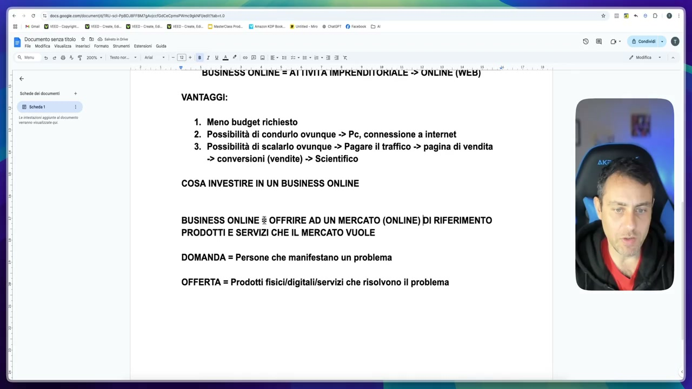

**Testo a schermo (OCR):** Documento senza tolo dt to © ssmenie de GA Timo) tono © A È DESSÌ -+ ivi Ad sar 2 ria ‘BUSINESS ONLINE = AI TIVITA IMPRENDITURIALE ‘> UNLINE (WEB) VANTAGGI: 1. Meno budget richiesto 2. Possibilità di condurlo ovunque -> Pc, connessione a internet 3. Possibilità di scalarlo ovunque -> Pagare il traffico -> pagina di vendita «> conversioni (vendite) -> Scientifico COSA INVESTIRE IN UN BUSINESS ONLINE BUSINESS ONLINE & OFFRIRE AD UN MERCATO (ONLINE) DI RIFERIMENTO PRODOTTI E SERVIZI CHE IL MERCATO VUOLE DOMANDA = Persone che manifestano un problema OFFERTA = Prodotti fisici/digitali/servizi che risolvono il problema

> Quindi da un lato abbiamo una domanda, persone che manifestano un problema, dall'altro lato abbiamo un'offerta cioè l'imprenditore che crea prodotti fisici, prodotti digitali, servizi che risolvono quel problema e quando la domanda incontra l'offerta allora nasce il mercato. Molto molto semplice quindi che cos'è un mercato non è altro che un luogo fisico o virtuale nel nostro caso sarà virtuale all'interno del quale la domanda e l'offerta di mercato si incontrano. Quindi quando sentirete la prossima volta il vostro amico o il tizio sul gruppo che dice che business online significa truffa barra persone che non vogliono cercarsi un lavoro serio, ragazzi cercate di avere chiari questi concetti e non fatevi deviare dalle persone che tendenzialmente falliscono perché la maggior parte delle persone non capendo un cazzo di queste cose alla fine porta la loro vita al naufragio e poi in colpa agli altri del fatto che la loro vita non funziona.

## [00:23:00] Schermata 23 _(periodic)_

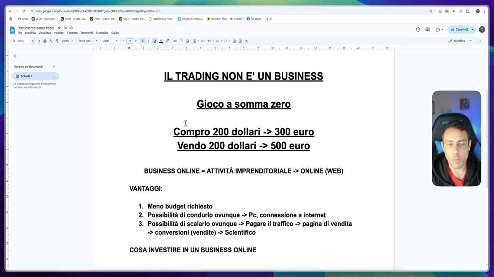

**Testo a schermo (OCR):** IL TRADING NON E’ UN BUSINESS Gioco a somma zero I Compro 200 dollari -> 300 euro Vendo 200 dollari -> 500 euro BUSINESS ONLINE = ATTIVITÀ IMPRENDITORIALE -> ONLINE (WEB) VANTAGGI: 1. Meno budget richiesto 2. Possibilità di condurlo ovunque -> Pc, connessione a internet 3. Possibilità di scalarlo ovunque -> Pagare il traffico -> pagina di vendita > conversioni (vendite) -> Scientifico COSA INVESTIRE IN UN BUSINESS ONLINE

> Quando la realtà delle cose è evidente le persone non hanno cultura, le persone hanno cultura in questo genere di settore e non avendo cultura in questo genere di settore non fanno altro che spararla più grossa possibile salvo poi avere una vita che non funziona, una vita fallimentare, avere un stipendio da 500 euro al mese e vivere a casa della mamma sperando di arrivare a fine mese di mettere in banca quei 30-40 euro di risparmio. Lo scopo di questo corso è quello di farvi uscire da questa ruota del criceto e far sì che voi possiate risparmiare il vostro conto in banca grazie al vostro business online migliaia e migliaia di euro per avere un conto florido in salute che è quello che alla fine interessa agli imprenditori che fanno tutto questo casino, subiscono una marea di diffamazioni online per avere uno stipendio, staccarsi dei dividendi, avere i compensi amministratore, quello che volete voi, comunque avere un conto in banca che sia più alto, più alto possibile. Ok? Quindi domanda, offerta, mercato. Come facciamo? Allora intanto abbiamo visto che un elemento essenziale per far nascere il mercato è che vi sia un problema, quindi bisogna essere un gruppo di persone che manifestano un problema. Ad esempio io ho la necessità, problema di registrare un video, allora da qui nasce l'offerta di mercato. Qual è l'offerta di mercato? Vendita di webcam come quella dalla quale

## [00:24:00] Schermata 24 _(periodic)_

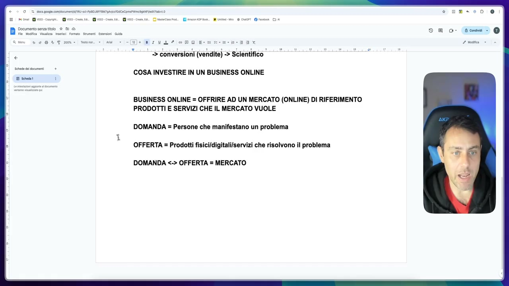

**Testo a schermo (OCR):** Documento enza tito ®© © Quei de BAT 200 Tonon > rl " CRETE RI 2 ria | 5 conversioni (vendite) -> Scientifico € COSA INVESTIRE IN UN BUSINESS ONLINE DI soma BUSINESS ONLINE = OFFRIRE AD UN MERCATO (ONLINE) DI RIFERIMENTO PRODOTTI E SERVIZI CHE IL MERCATO VUOLE DOMANDA = Persone che manifestano un problema OFFERTA = Prodotti fisici/digitali/servizi che risolvono il problema DOMANDA <-> OFFERTA = MERCATO

> sto registrando in questo momento, il mouse, il microfono e quindi nascono tutto l'insieme di prodotti, in questo caso prodotti fisici, che hanno lo scopo di risolvere un determinato problema, un target di persone. Ok? Ma come deve essere questo problema? Cioè quando noi andiamo a creare prodotti digitali, perché alla fine ragazzi tutto questo papello di roba noi creeremo prodotti digitali che andranno a risolvere problemi alle persone, quindi produrremo dei prodotti digitali di valore che avranno lo scopo di risolvere problemi nella vita delle persone, dobbiamo capire a quale target di persone rivolgerci e soprattutto che tipologia di problema

## [00:25:00] Schermata 25 _(periodic)_

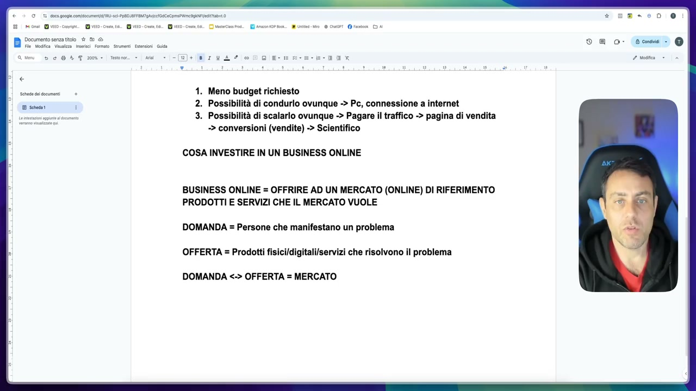

**Testo a schermo (OCR):** NPAPI CAINO Documento enza tito ®© © er Tan sorootia. micio OT (resa DU . Meno budget richiesto . Possibilità di condurlo ovunque -> Pc, connessione a internet . Possibilità di scalarlo ovunque -> Pagare il traffico -> pagina di vendita -> conversioni (vendite) -> Scientifico COSA INVESTIRE IN UN BUSINESS ONLINE BUSINESS ONLINE = OFFRIRE AD UN MERCATO (ONLINE) DI RIFERIMENTO PRODOTTI E SERVIZI CHE IL MERCATO VUOLE DOMANDA = Persone che manifestano un problema OFFERTA = Prodotti fisici/digitali/servizi che risolvono il problema DOMANDA <-> OFFERTA = MERCATO 2 dia

> andare ad affrontare, perché ragazzi esistono all'interno della vita delle persone tipologie di problemi più o meno sentiti. Allora parliamo un attimo del problema. Come deve essere? Ci sono alcune caratteristiche che sono essenziali e senza le quali io vi consiglio di non andare a creare prodotti digitali per un mercato di riferimento. Prima cosa il problema ad essere urgente. Ragazzi l'urgenza è quello che fa sì che le persone vi paghino il prima possibile. Se il problema è urgente pagano il prima possibile. E poi ragazzi non volete spendere migliaia di euro in ads per poi avere un ritorno sull'investimento dopo 5-6 mesi. Voi potete spendere in ads per avere un ritorno sull'investimento che magari sia istantaneo. Cioè io spendo 100 euro in ads, in campagne pubblicitarie oggi e oggi stesso ho 300 euro di incasso. Non voglio spendere 100 euro oggi e vedere il frutto della mia azione di marketing tra due mesi. Perché magari

## [00:26:00] Schermata 26 _(periodic)_

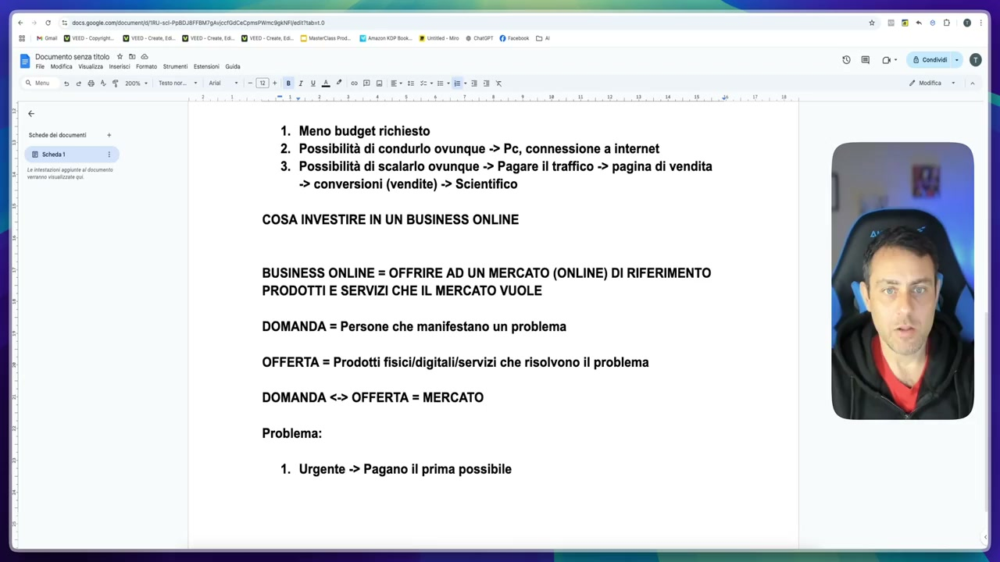

**Testo a schermo (OCR):** GO vitd-cmin ta. E vece to. [DvD Gum te. Ci mcini pi i anne di e © CPT. rs CA Documento senza tito #1 © © Qi de DA 2001] Tenno > e . Meno budget richiesto lità di condurlo ovunque -> Pc, connessione a internet . Possibilità di scalarlo ovunque -> Pagare il traffico -> pagina di vendita +> conversioni (vendite) -> Scientifico COSA INVESTIRE IN UN BUSINESS ONLINE BUSINESS ONLINE = OFFRIRE AD UN MERCATO (ONLINE) DI RIFERIMENTO PRODOTTI E SERVIZI CHE IL MERCATO VUOLE DOMANDA = Persone che manifestano un problema OFFERTA = Prodotti fisici/digitali/servizi che risolvono il problema DOMANDA <-> OFFERTA = MERCATO Problema: 1. Urgente -> Pagano il prima possibile 2 dia

> tra due mesi sono fallito. Perché non ho un flusso di cassa che mi permette di spendere nelle mie campagne pubblicitarie. Perché non ho un flusso di cassa che mi permette di continuare a pagare il mio CRM, il mio sistema di mail marketing, quello che volete voi. La prima regola è quella che si deve incassare quanto più possibile il prima possibile. Quindi se il problema è urgente le persone pagano il prima possibile. Perché pagano il prima possibile? Perché ragazzi le persone che hanno un problema urgente sono disposte a pagare il prima possibile per eliminare più velocemente possibile quel problema. Se il problema non è urgente allora vi sconsiglio di creare prodotti digitali che richiedano che siano inerenti appunto un mercato di persone che non hanno un problema che sia urgente. Seconda cosa. Quando si parla di un problema le persone devono essere coscienti del problema. E finta non mi vuol dire che le persone non sono coscienti del problema. Ragazzi le persone non sono coscienti di

## [00:27:00] Schermata 27 _(periodic)_

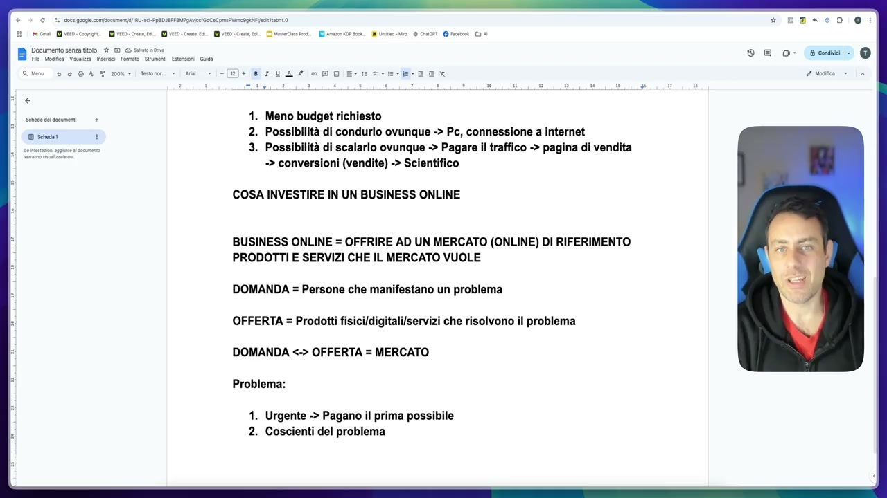

**Testo a schermo (OCR):** Documento senza titolo ®© © quer se 849 0 Rie i. Meno budget richiesto . Possibilità di condurlo ovunque -> Pc, connessione a internet . Possibilità di scalarlo ovunque -> Pagare il traffico -> pagina di vendita «> conversioni (vendite) -> Scientifico COSA INVESTIRE IN UN BUSINESS ONLINE BUSINESS ONLINE = OFFRIRE AD UN MERCATO (ONLINE) DI RIFERIMENTO PRODOTTI E SERVIZI CHE IL MERCATO VUOLE DOMANDA = Persone che manifestano un problema OFFERTA = Prodotti fisici/digitali/servizi che risolvono il problema DOMANDA <-> OFFERTA = MERCATO Problema: 1. Urgente -> Pagano il prima possibile 2. Coscienti del problema

> nulla. Ci sono vari stadi di conoscenza del problema, della soluzione. Magari mi ripropongo anche di farvi una lezione appunto su questa cosa all'interno di questo corso. Me la penso. Ma sono diversi stati di consapevolezza. Anzi la facciamo subito e vi mostro quello che voglio dirvi. La facciamo con Miro che è un'applicazione che mi permette di disegnare. Vedete qui quanti disegnini ho fatto nella mia vita, nella mia carriera di

## [00:27:31] Schermata 28 _(scene)_

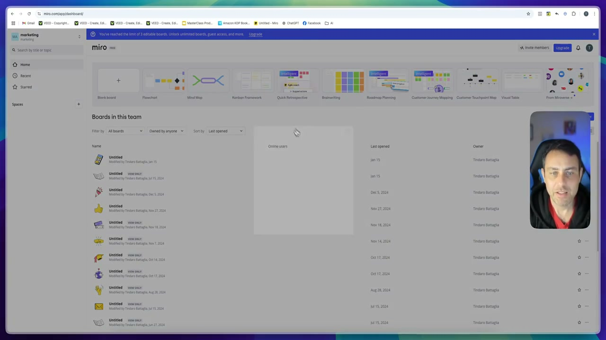

**Testo a schermo (OCR):** mon i mortating 2 sbirri 0 rome @ ceceno E sur sp Boards in this team sit Albo = © omedbyome © sont; 9 w » è e Doll” e 03 a) [=] N

> formatore. Allora che cosa voglio dire con consapevolezza del problema? Quando noi andiamo ad approcciarci a un mercato di riferimento dobbiamo partire dal presupposto che ci approcciamo a una struttura di questo tipo. Quindi è una struttura a piramide a più strati. Questa piramide nel termine, nel gergo tecnico viene chiamata piramide di Maslow. Andatevela a cercare su google e vi si aprirà un mondo. Che significa? Che cos'è questa piramide di Maslow? La piramide di Maslow non fa altro che andare a intercettare diversi segmenti di mercato sulla base di quella che è la consapevolezza. Perché ovviamente persone che già sanno di avere un problema nella loro vita, persone che già sanno di avere un problema nella loro vita saranno più consapevoli del fatto che esista una

## [00:28:31] Schermata 29 _(periodic)_

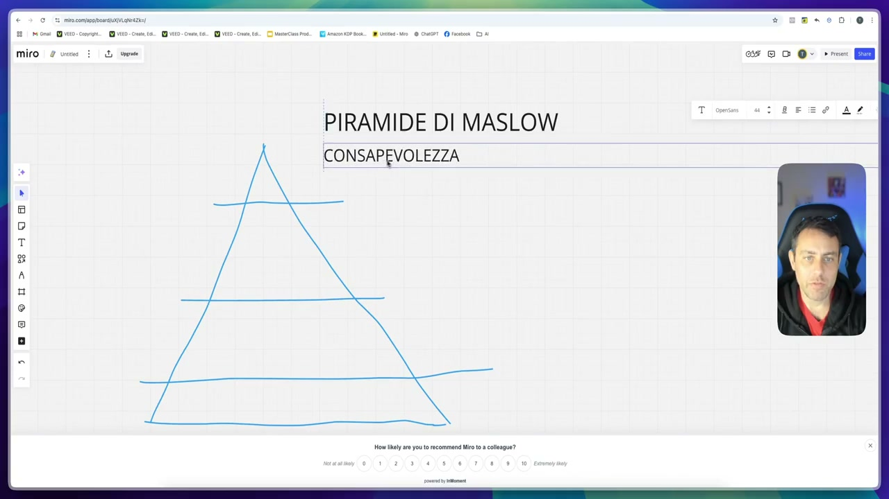

**Testo a schermo (OCR):** PIRAMIDE DI MASLOW CONSAPEVOLEZZA » [e] (e) T A n ® ® n

> soluzione che magari questa soluzione può essere costituita dal vostro problema. Perché ho fatto questa piramide? Perché alla base della piramide, come vedete, alla base della piramide abbiamo un'area, vabbè ragazzi io qui ho fatto un disegno che è assurdamente osceno ma capiamoci, alla base della piramide ho molte più persone. Alla base della piramide ho persone che non sono consapevoli, consapevoli del problema, cioè non hanno idea che nella loro vita esiste un problema. In questo caso la nostra azione di marketing durerà di più perché dobbiamo renderli consapevoli del fatto che hanno un problema, del fatto che esiste una soluzione e poi successivamente proporre il nostro prodotto come soluzione unica e differenziante. Che significa questo? Significa che mentre in questo caso andiamo a intercettare un target che è più grande, quindi colpiamo una massa critica di persone che è più

## [00:29:31] Schermata 30 _(periodic)_

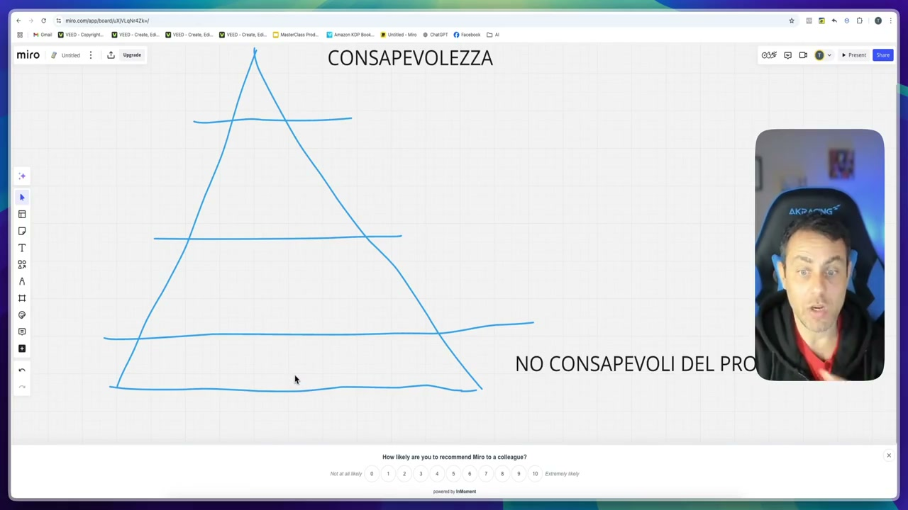

**Testo a schermo (OCR):** CONSAPEVOLEZZA » [e] lr) T A n ® ® n

> ampia, dall'altro lato ci stiamo molto più tempo per vendere i nostri prodotti perché dobbiamo agire con una fase educativa che è maggiore, perché le persone non sono consapevoli di avere un problema. Dall'altro lato abbiamo un target di persone che è più piccolo, ripeto, non guardate ragazzi questa oscenità di... Vediamo se riesco a farlo meglio, scusate sono ossessivo compulsivo nelle mie cose, ma da buon asperger preferisco fare le cose nel modo migliore possibile. Noi abbiamo diversi livelli di consapevolezza. Qui abbiamo le persone che sono non consapevoli di avere un problema. Qui abbiamo le persone che sono consapevoli del problema, ma non sono consapevoli che esiste una soluzione al loro problema. Quindi qui, consapevoli problema, non consapevoli soluzione. E vi faccio un

## [00:30:31] Schermata 31 _(periodic)_

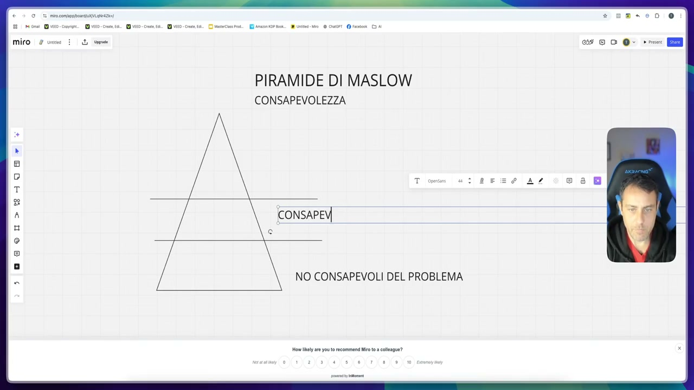

**Testo a schermo (OCR):** PIRAMIDE DI MASLOW CONSAPEVOLEZZA (CONSAPEM e NO CONSAPEVOLI DEL PROBLEMA How ely ar 00 1 recommend rt colngue?

> esempio. Per esempio, per quanto riguarda i prodotti digitali, noi potremmo crearci un prodotto digitale che è per esempio un ebook che spiega alle persone come crearsi un'attività imprenditoriale online. Ci sono persone che non sono consapevoli del problema. Il problema qual è ragazzi? Il problema non è come crearsi attività imprenditoriale. Noi dobbiamo andare a scavare all'interno del nostro target di mercato per capire quale sia il reale problema. Il reale problema di chi vuole crearsi un'attività imprenditoriale online come voi, è di avere più tempo libero a disposizione e avere più soldi per potersi passare un ospizio. Se siete i classici opportunity seekers e vi volete comprare la Lambo perché la vedete nei reel dei fuffacure e quindi siete convinti che lo scopo finale dell'attività imprenditoriale, del fare

## [00:31:31] Schermata 32 _(periodic)_

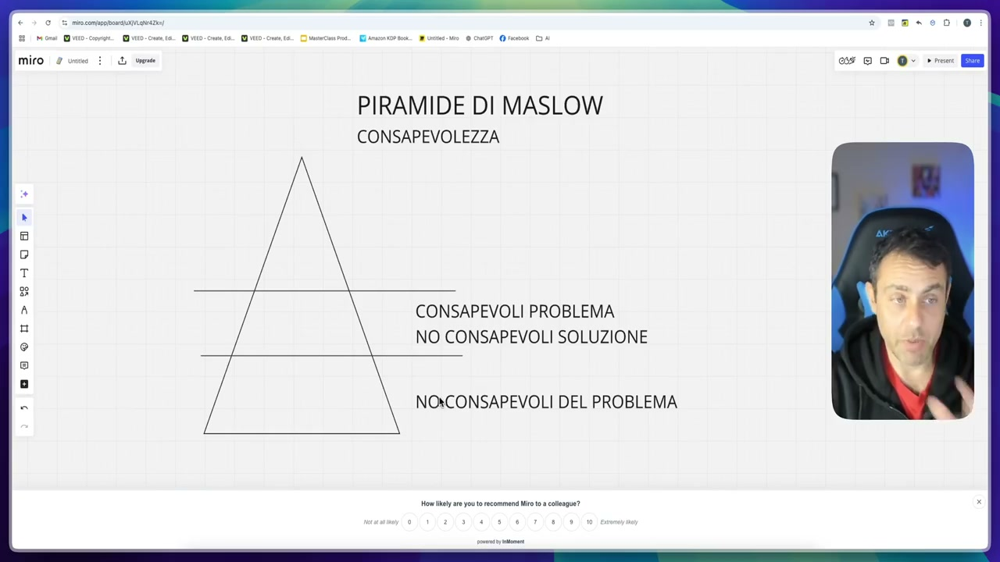

**Testo a schermo (OCR):** PIRAMIDE DI MASLOW CONSAPEVOLEZZA CONSAPEVOLI PROBLEMA NO CONSAPEVOLI SOLUZIONE » te] o T A n ® ® n NOxCONSAPEVOLI DEL PROBLEMA

> milioni, sia quello di comprare una Lambo, ripeto, nessuna, non voglio giudicare nessuno, ma per esempio per me non è questo lo scopo. Lo scopo è poter avere una sicurezza economica che mi permette in caso di necessità di poter sostenere le spese in maniera più tranquilla, di potermi fare qualche vacanza in suite, io ormai viaggio solamente in suite, la 5 stelle, e di potermi passare delle vacanze che siano top. Per esempio per me una macchina non è l'oggetto del desiderio, ma capisco, ci possono essere persone che hanno questo scopo ok? Però ci sono persone che non sono consapevoli del fatto che la loro vita ha il problema che per esempio non hanno tempo, ok? Cioè le persone sono convinte che 1.500 Euro, 1.300 Euro sia il massimo a cui possono aspirare. Non sono neanche lontanamente convinte del fatto che esistano tutte queste cose che vi sto spiegando che permettono loro di fare migliaia di euro, decine di migliaia di euro. Per cui il loro livello esistenziale è questo, non sono consapevoli del fatto che esistono modi per fare migliaia di euro. Magari non ho neanche questo problema perché nella mia vita il fare

## [00:32:31] Schermata 33 _(periodic)_

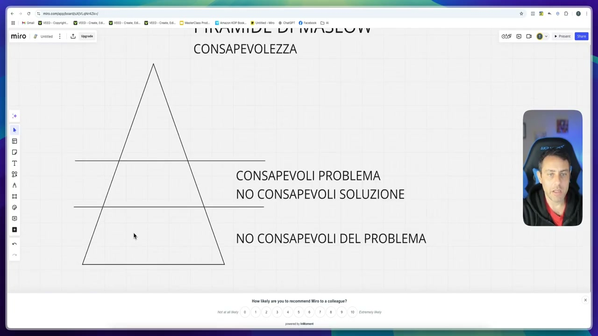

**Testo a schermo (OCR):** PIINVIVIIL/ZI LI INIIMILVU VV CONSAPEVOLEZZA CONSAPEVOLI PROBLEMA NO CONSAPEVOLI SOLUZIONE » ie] (e) T A n ® ® n NO CONSAPEVOLI DEL PROBLEMA

> 1.500 Euro è il goal massimo, quindi non sono consapevoli del problema. Allora dobbiamo rendere edotte queste persone del fatto che esistono dei metodi, esistono le attività imprenditoriali che permettono loro di fare più soldi. Perché? Per avere più tempo libero, per poter passarsi negli spizi con la propria famiglia senza dover essere costretti a timbrare il tesserino eccetera eccetera. Poi ci sono le persone che sono consapevoli del problema, cioè persone che capiscono che magari avere 1.500 Euro di stipendio con spese di 1.450 Euro e mettere in banca ogni mese, quando vabbè non hanno imprevisti, 50 euro non è proprio il massimo della vita, ok? Allora sono consapevoli del fatto che esiste un problema ma non sono consapevoli della soluzione. Con queste persone agiamo diversamente, la nostra comunicazione di marketing, il nostro prodotto digitale sarà finalizzata a ingrandire il problema, far capire che questo problema è forte ed è urgente per poi mostrare la soluzione. Soluzione attività imprenditoriale online, ok? Abbiamo poi persone che sono

## [00:33:31] Schermata 34 _(periodic)_

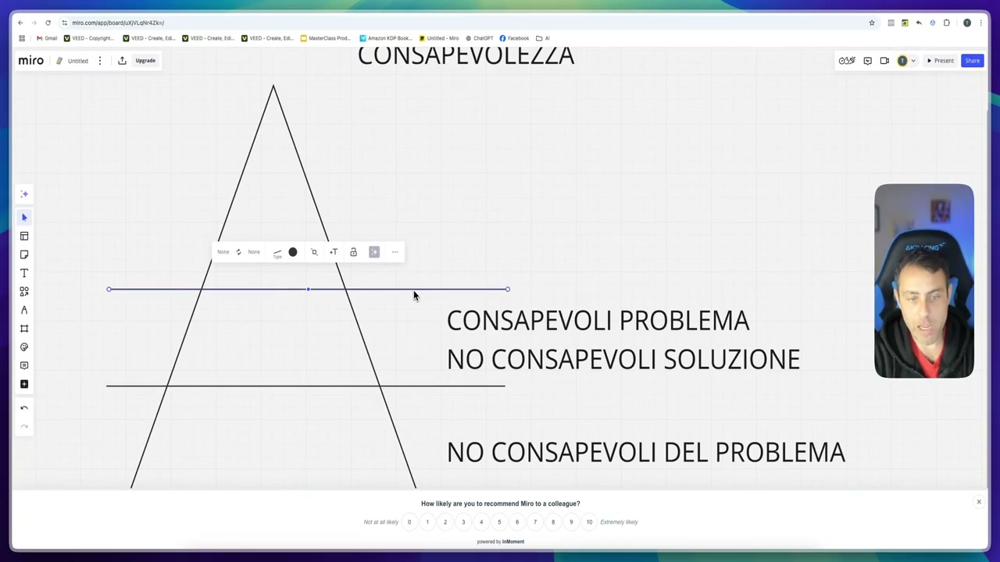

**Testo a schermo (OCR):** — CONSAPEVOLEZZA CONSAPEVOLI PROBLEMA NO CONSAPEVOLI SOLUZIONE » te] (7) Tr: A n ® ® n NO CONSAPEVOLI DEL PROBLEMA

> consapevoli del problema e consapevoli della soluzione, cioè sanno che avere 1.500 Euro di stipendio con 1.450 Euro di spese al mese e incassare 50 euro nel proprio conto in banca quando va bene non è proprio il massimo della vita, sanno che esiste una soluzione, magari data da un'attività imprenditoriale online, offline eccetera eccetera, sono molto confusi, allora in questo caso noi dobbiamo far capire che esiste una soluzione, la nostra soluzione in questo caso qual è? Business di prodotti digitali, che è la nostra soluzione unica e differente dalle altre. Quando vi ho parlato ad esempio del fatto che il trading non è un business ragazzi, non vi ho parlato di questo così a caso, ho parlato di questo per farvi capire l'elemento differenziante che è un'attività imprenditoriale rispetto a attività che non lo sono, perché? Perché magari voi siete consapevoli del problema, anche voi che mi state seguendo, siete consapevoli

## [00:34:31] Schermata 35 _(periodic)_

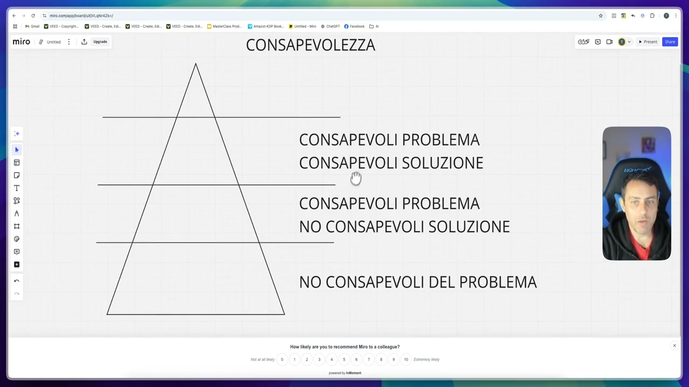

**Testo a schermo (OCR):** CONSAPEVOLEZZA CONSAPEVOLI PROBLEMA CONSAPEVOLI SOLUZIONE () CONSAPEVOLI PROBLEMA NO CONSAPEVOLI SOLUZIONE » te] (e) ® A n ® ® n NO CONSAPEVOLI DEL PROBLEMA

> della soluzione, ma ancora oggi siete convinti che il trading sia una soluzione per esempio, giusto? Perché sia un business ok? Quindi è il mio ruolo di formatore e marketer farvi capire che esiste una soluzione che è quella dei prodotti digitali che è unica e differenziante, sono poi persone che sono consapevoli della soluzione, consapevoli del problema e consapevoli del vostro prodotto e allora in questo caso, spostiamo un attimo questo, in questo caso noi agiamo diversamente facendo leva su quelle che sono i vantaggi del prodotto, su sconti che possiamo avere sul prodotto, su offerte particolari del nostro prodotto, quindi come vedete ragazzi in funzione di quella che è la consapevolezza del mercato noi agiamo con strategie di marketing che sono diverse, vi faccio notare che anche in questo caso abbiamo la maggior parte delle persone che costituiscono il nostro mercato, quindi abbiamo tantissime persone, la maggior parte delle persone ragazzi non sono consapevoli, io

## [00:35:31] Schermata 36 _(periodic)_

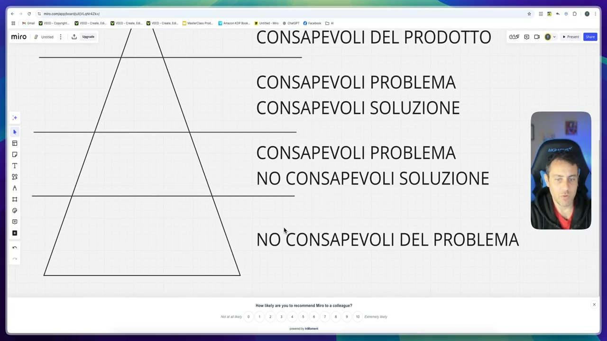

**Testo a schermo (OCR):** è pm 000 “CONSAPEVOLI DEL PRODOTTO ===» ma CONSAPEVOLI PROBLEMA CONSAPEVOLI SOLUZIONE CONSAPEVOLI PROBLEMA NO CONSAPEVOLI SOLUZIONE NO CONSAPEVOLI DEL PROBLEMA

> aumenterei anche questa piramide inserendo qui il gradino non consapevoli di esistere, perché la maggior parte delle persone non è neanche consapevole del fatto che esiste, ma questi sono pensieri miei, quindi qua mettiamo le persone che non sono consapevoli del problema, la maggior parte delle persone di mercato, man mano che ci avviciniamo a livelli di consapevolezza maggiori abbiamo persone che convertono maggiormente, ma il target di mercato si riduce, ok? Questo è giusto per parlarvi del fatto della coscienza del problema quindi il problema deve essere urgente, le persone devono essere coscienti del problema e poi è un problema che possiamo risolvere e qua ragazzi permettetemi di aprire una parentesi, quante persone vendono prodotti che sono delle assolute truffe perché non risolvono un problema un mercato di riferimento, ok? Noi dobbiamo creare prodotti digitali che possono risolvere problemi alle persone, ad oggi si possono creare prodotti digitali con l'intelligenza artificiale che ci permettono di risolvere problemi alle persone, quindi questo è quello che dovete sapere per quanto riguarda

## [00:36:31] Schermata 37 _(periodic)_

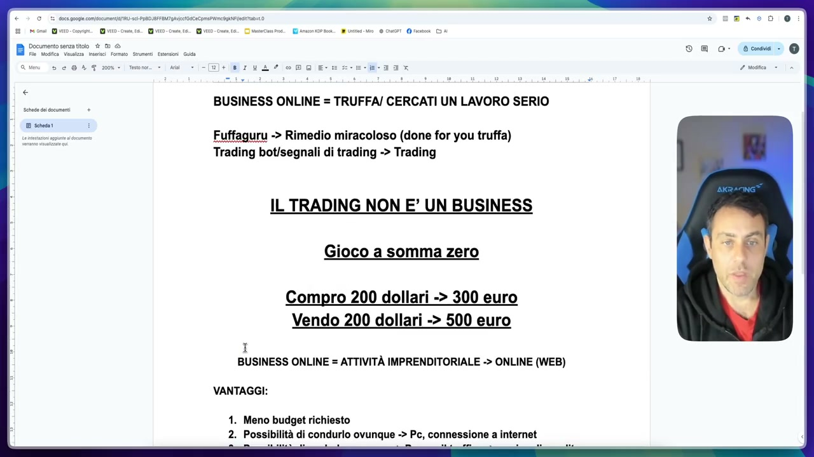

**Testo a schermo (OCR):** n Hos Qu Documento senz tolo Que se BA 90 + Tr EA 2090 s-b-nax è BUSINESS ONLINE = TRUFFA/ CERCATI UN LAVORO SERIO Fuffaguru -> Rimedio miracoloso (done for you truffa) Trading bot/segnali di trading -> Trading IL TRADING NON E’ UN BUSINESS Gioco a somma zero Compro 200 dollari -> 300 euro Vendo 200 dollari -> 500 euro I BUSINESS ONLINE = ATTIVITÀ IMPRENDITORIALE -> ONLINE (WEB) VANTAGGI: 1. Meno budget richiesto 2. Possibilità di condurlo ovunque -> Pc, connessione a internet

> business online, questo è quello che dovete sapere per quanto riguarda mercato, ricerca di mercato e determinazione del problema
