# Come vendere con successo i prodotti digitali

> Documento generato automaticamente: trascrizione e screenshot sincronizzati del video-corso.

## [00:00:00] Schermata 0 _(start)_

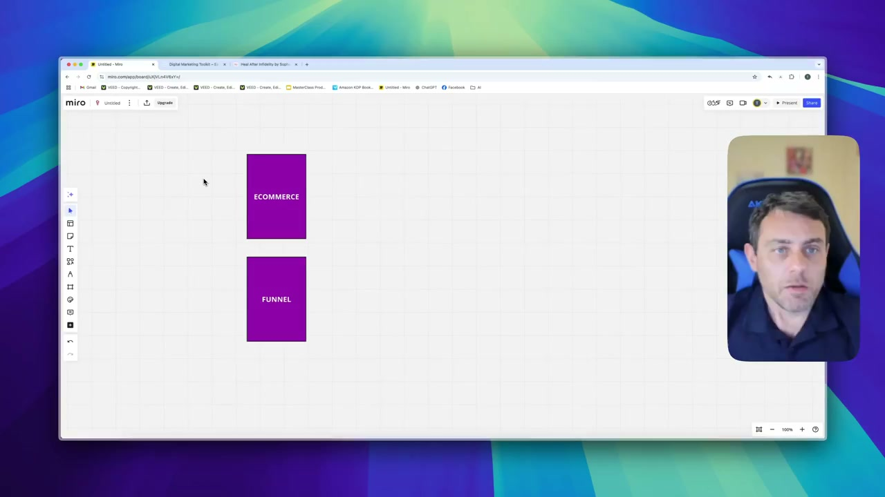

**Testo a schermo (OCR):** ECOMMERCE FUNNEL

> Bene ragazzi, bentornati in questo corso gratuito sui prodotti digitali. In questa lezione vorrei parlarvi della strategia che noi utilizzeremo per vendere prodotti digitali. Allora, quali sono le strategie che si attuano tendenzialmente quando si vendono prodotti digitali? Qual è la strategia che applica il 99% dei formatori che vi spiegano come si guadagnano milioni vendendo prodotti digitali? E quale è la strategia che, ripeto a mio giudizio, è la strategia migliore per vendere prodotti digitali, ovvero per avere margini più alti possibili? Allora, quando vendiamo prodotti digitali abbiamo due possibilità. La classica vendita tramite e-commerce. Questo significa che noi ci andiamo a creare l'e-commerce, lo Shopify di turno, ad esempio anche l'Wordpress più Wcommerce. Insomma ragazzi, abbiamo un e-commerce con una sezione shop, un negozio. Ora ve lo mostro subito, anzi facciamo un esempio. Questo è uno shop classico realizzato su Shopify all'interno del quale ci sono ovviamente qui abbiamo la sezione dello shop. Questa in realtà è una categoria, una sezione delle collezioni. All'interno di questa sezione abbiamo tutto

## [00:01:00] Schermata 1 _(periodic)_

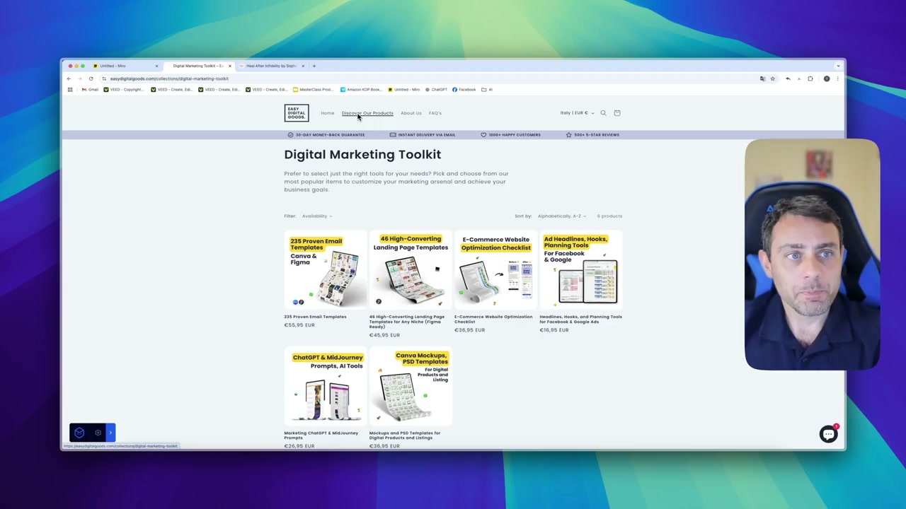

**Testo a schermo (OCR):** Digital Marketing Toolkit 225 proven mali AGNigh=Converting | t-CommercoWabsito_ Ad Headlines Hook fempiotes Landing Poge Tempiates | Opilmisaton Cheekist — 'Monningooie

> l'insieme di prodotti che sono stati creati appunto dal proprietario dello shop e abbiamo la possibilità di curiosare all'interno dello shop. Questo non è un bene, vi spiegherò a breve il perché. Curiosare all'interno dello shop, quindi andare a cliccare ad esempio sull'about us, questo è uno shop che appunto pare anonimo, non ha azienda, non ha nulla, o perlomeno qua è scritto un'azienda ma poi nella privacy policy non è scritto nulla, sono cose un po' borderline. Andiamo nella sezione collection di nuovo, quindi come vi stavo dicendo, torniamo seri per un attimo, qui abbiamo diversi prodotti digitali, ad esempio 235 template di mail che sono vendute a 55 euro nel 95, 46 template di landing page ad alto tasso di conversione, nonostante quello che dice il tizio l'e-commerce, e-commerce website optimization checklist, quindi insieme di checklist che sono vendute a 36 euro, headline, hook, marketing, cgpt, meet journey prompts eccetera eccetera eccetera.

## [00:02:00] Schermata 2 _(periodic)_

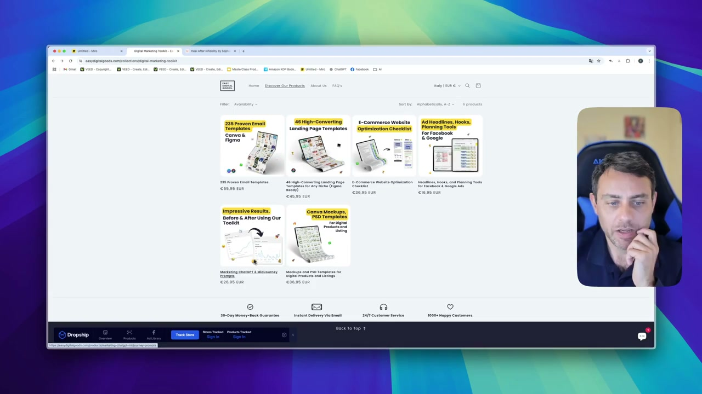

> Quindi in questa strategia di vendita di prodotti digitali cosa succede? Succede che, ve lo mostro qui sulla nostra bellissima lavagnetta di Miro, noi partiamo con del traffico, traffico ragazzi che può essere ad esempio facebook ads, fatemi diminuire un po' le dimensioni di queste scritte altrimenti non ci ritroviamo, può essere facebook ads, può essere tiktok ads, può essere google ads, queste sono tutte le fonti di traffico a pagamento che solitamente si utilizzano, questi tra ovviamente tra le fonti di traffico a pagamento, quindi paid advertising, o abbiamo anche possibilità di inviare traffico in organico. Organico che cosa significa? Tendenzialmente sfruttiamo ad esempio tiktok, perdiamo tempo per fare tiktok e poi rimandiamo al nostro link sul profilo tiktok, o ad esempio instagram, realizziamo

## [00:03:00] Schermata 3 _(periodic)_

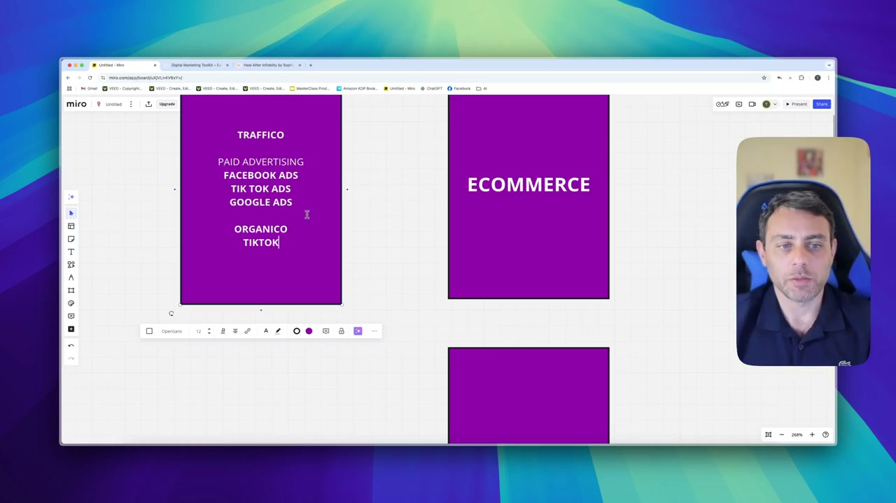

**Testo a schermo (OCR):** TRAFFICO PAID ADVERTISING FACEBOOK ADS TIKTOK ADS ECOMMERCE GOOGLE ADS ORGANICO TIKTOK

> reel, realizziamo story che rimandano poi al nostro link in bio, o ad esempio youtube, realizziamo video e mettiamo il link in descrizione, ok? Lasciamo così giusto per farvi capire come funziona la cosa, quindi realizziamo video su youtube, possono essere video lunghi, educativi, o possono essere ad esempio degli shorts che sono nato con dei reel dei tiktok, quindi video brevi detti al punto che rimandano poi al prodotto che vendiamo. Quindi partiamo da una fonte di traffico, mandiamo traffico sul nostro ecommerce, quello che avviene è che abbiamo le nostre campagne facebook ads, tiktok ads, google ads, perdiamo tempo perché non vogliamo investire del budget e creiamo i nostri tiktok sperando che vadano virali, instagram, reel, story, eccetera

## [00:04:00] Schermata 4 _(periodic)_

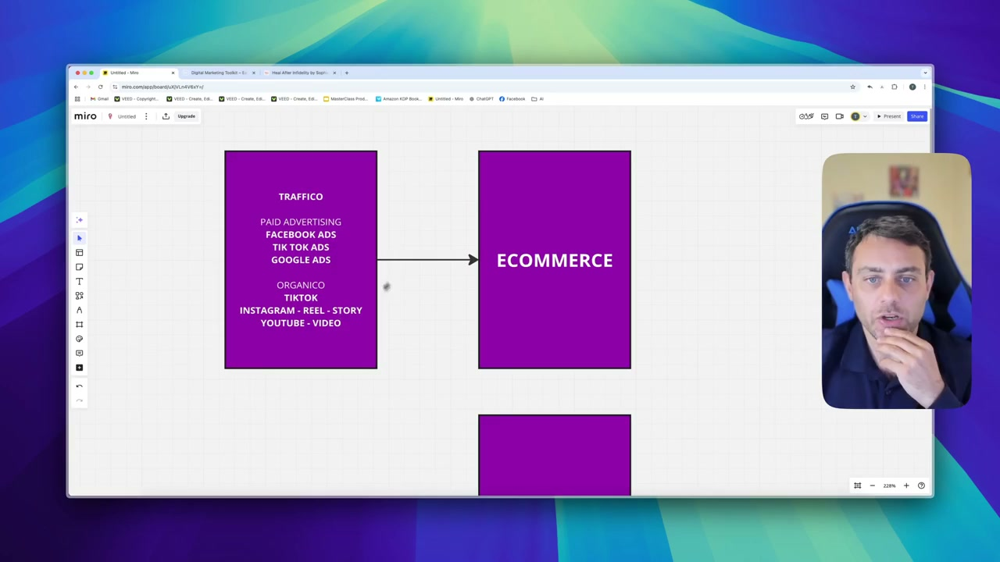

**Testo a schermo (OCR):** TRAFFICO PAID ADVERTI FACEBOOK ADS TIKTOK ADS GOOGLE ADS GANICO TIKTOK INSTAGRAM - REEL - STORY YOUTUBE - VIDEO ECOMMERCE

> eccetera, rimandiamo il tutto al nostro ecommerce e che cosa succede? Succede che la persona che va all'interno dell'ecommerce o si guarda lo shop, quindi rimandiamo alla home page, al negozio, a quello che volete voi e quindi ad esempio abbiamo una persona che è interessata ai template di mail, clicca qui, si guarda la descrizione di questo prodotto, se vuole lo acquista, va sul checkout, quindi abbiamo la navigazione dell'ecommerce,

## [00:04:25] Schermata 5 _(scene)_

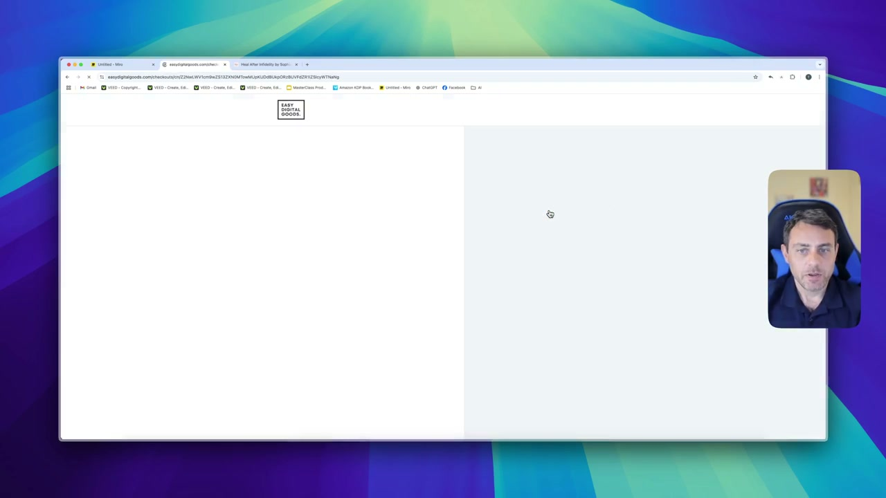

> selezione prodotto, quindi scheda prodotto per esempio e poi abbiamo checkout e poi abbiamo, si acquista, un ulteriore step che è la thank you page, pagina di ringraziamento, ok? Questi sono gli insiemi di passi che tendenzialmente un utente compie quando, aspettate ma sono da buon asperger, preferisco avere sempre tutte le cose totalmente in ordine, non so perché questo non me lo prende e mi sta creando già dei tic nervosi, va bene facciamolo così, giusto per amore di informazione, ah non lo prende perché qui devo mettere, qua lo mette vicino, ah perché mette vicino questo con questo, quindi ok, va bene ci siamo, quindi questi sono gli insiemi di step che si hanno nell'istante in cui

## [00:05:25] Schermata 6 _(periodic)_

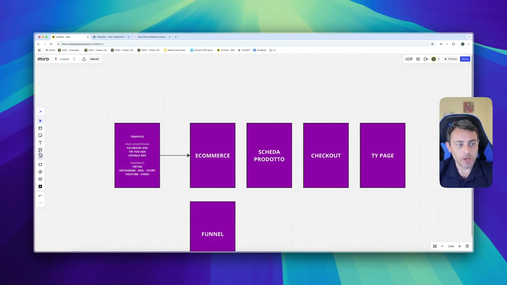

**Testo a schermo (OCR):** ECOMMERCE FUNNEL SCHEDA PRODOTTO CHECKOUT TY PAGE

> praticamente vogliamo sfruttare la strategia di vendita tramite ecommerce, ok? Vendita tramite ecommerce, abbiamo fonte di traffico, l'utente che va nell'ecommerce o nella scheda prodotto, molte si salta questo step, arriva al checkout alla thank you page, come vi stavo dicendo questa tipologia di funnel, perché in realtà anche questo è un funnel, ma ora ti spiegherò qual è la tipologia di funnel che io prediligo quando vendo prodotti digitali, è una strategia che non mi fa impazzire, perché? Perché l'utente potrebbe arrivare nel nostro shop, potrebbe trovare

## [00:06:04] Schermata 7 _(scene)_

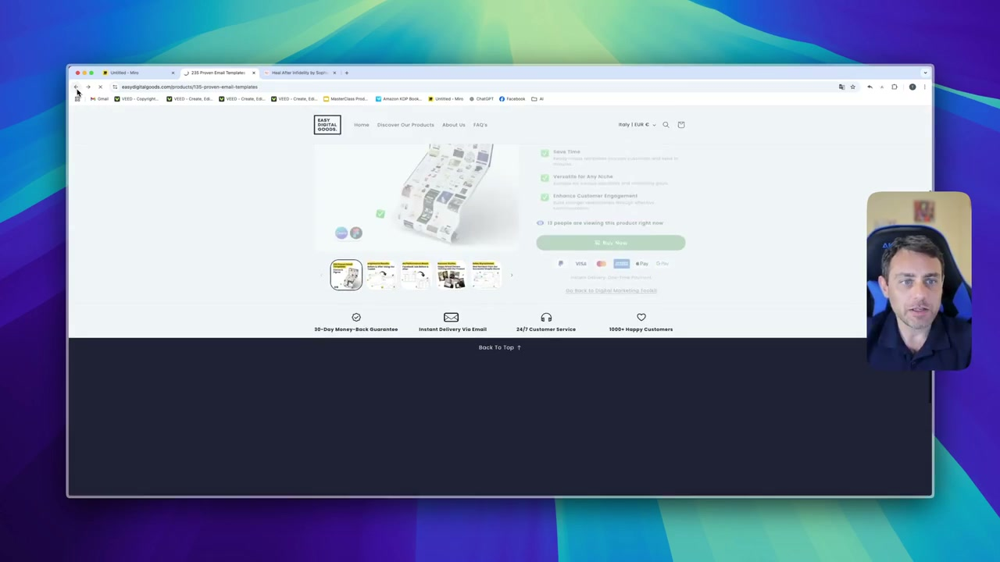

> quello a cui è interessato, ma si potrebbe far distrarre da qualche altra cosa, ad esempio potrebbe cliccare su shipping policy, modalità di spedizione, e poi magari è al semaforo, scatta il

## [00:06:15] Schermata 8 _(scene)_

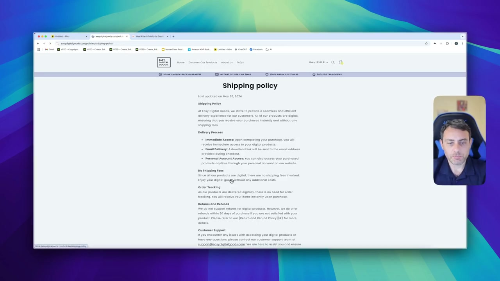

**Testo a schermo (OCR):** Shipping policy

> semaforo e perdiamo la conversione, perché l'utente lascia il suo smartphone e mette in moto, ok? O ad esempio potrebbe guardare questa cosa che gli interessa, ma acquistare solo questa cosa e

## [00:06:28] Schermata 9 _(scene)_

> quindi ci perdiamo parte dell'incasso, o magari si sta guardando questa cosa e va indietro perché

## [00:06:40] Schermata 10 _(scene)_

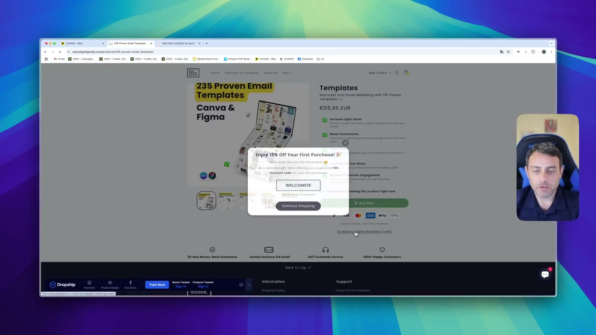

**Testo a schermo (OCR):** * o. magie» Q/& Templates | CINA E ‘©55,95 EUR

> aveva visto un'altra cosa, ora arriva qui e non capisce più quello che sta succedendo ed esce, quindi come vedete c'è tutta una serie di cose che in questa strategia non mi soddisfano, non mi piacciono, quindi questa strategia non la utilizzo quasi mai se non rare volte per vendita

## [00:06:57] Schermata 11 _(scene)_

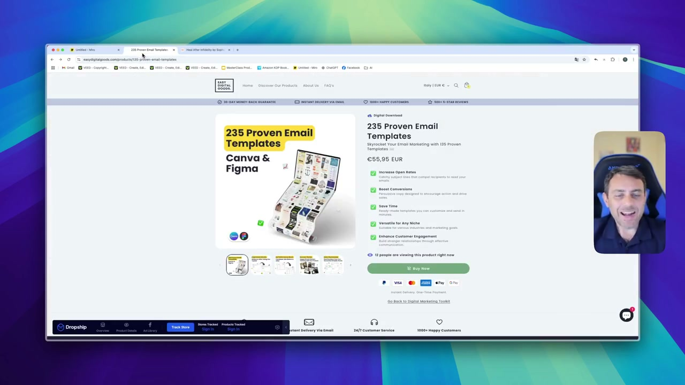

**Testo a schermo (OCR):** 235 Proven Email Templates 235 Proven Email Templates Canva & È ©55,95 EUR Figma o

> di prodotti PLR, quindi prodotti che si possono acquistare e poi rivendere, abbiamo i diritti di rivendita e solitamente anche questi io li vendo attraverso questa struttura di funnel, ma a volte testo anche questa, per questa tipologia di prodotti diciamo che potrebbe andare bene, ok? Per la stragrande maggioranza dei casi, quando invece realizziamo dei prodotti che vendiamo con l'intelligenza artificiale, la strategia che utilizzo è una strategia di funnel classica, che significa strategia di funnel classica? Significa che parto da, ora ve lo mostro, parto da una fonte di traffico, quindi parto da questa fonte di traffico, rimando l'utente su quella che è una pagina di vendita, la cosiddetta landing page, l'utente che va sulla landing page poi arriva a checkout, quando arriva a checkout ed acquista qualcosa, guardate che metto sempre ordine, ok? Quando arriva a checkout e acquista qualcosa, a questo punto l'utente ha un'altra

## [00:07:57] Schermata 12 _(periodic)_

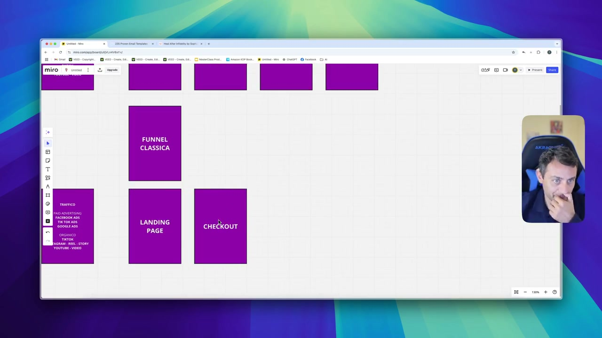

**Testo a schermo (OCR):** FUNNEL CLASSICA LANDING PAGE CHECKOUT

> possibilità, cioè ha il cosiddetto upsell, crosssell, cioè la possibilità di acquistare ulteriori prodotti che noi abbiamo deciso di far acquistare all'utente, ok? Quindi questa è la strategia che io solitamente prediligo per la vendita di prodotti digitali e perché prediligo questa strategia? Ancora non è finita ragazzi, se l'utente acquista questo prodotto, allora possiamo vendere ulteriori prodotti, quindi questo è l'appsell 1, ragazzi upsell significa vendere più quantità dello stesso prodotto, crosssell significa vendere dei prodotti complementari, classico esempio di prodotto complementare il mulinello se un utente compra una canna da pesca, giusto per intenderci, ok? Bene, come vi stavo dicendo poi l'utente potrà acquistare un upsell, un secondo upsell, un secondo crosssell e se per esempio non acquista quindi questo, se acquista,

## [00:08:57] Schermata 13 _(periodic)_

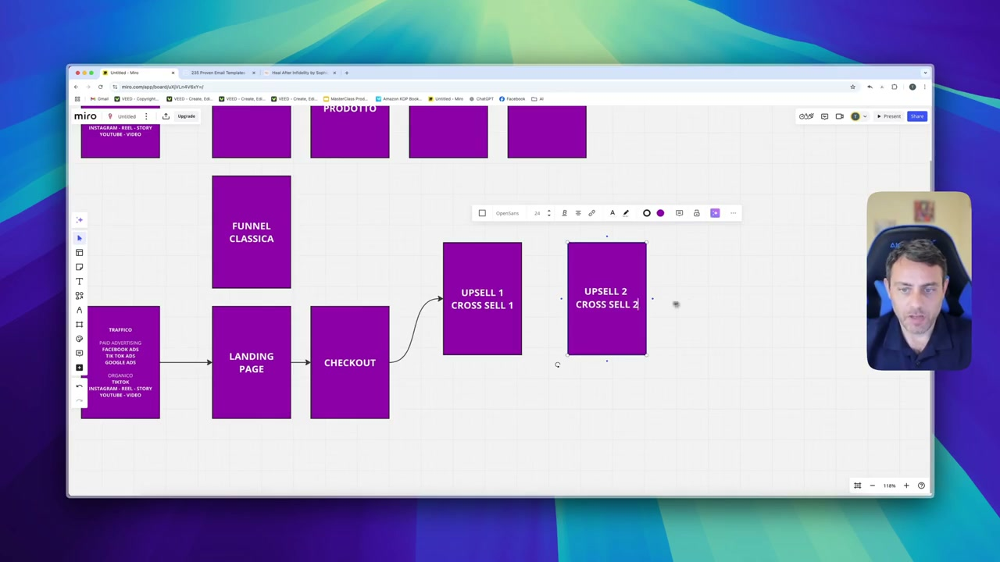

**Testo a schermo (OCR):** FUNNEL CLASSICA UPSELLI fi ves? CROSS SELL 1 CROSS SELL A LANDING DAGE CHECKOUT

> si acquista, se invece non acquista possiamo dal primo upsell vendergli un prodotto che ha meno valore, perché? Perché se non ha acquistato questo molto probabilmente il problema sta nel fatto che il prezzo secondo lui è troppo alto, quindi andiamo a vendergli un downsell, quindi un prodotto che costa meno, ok? Che è sempre un crosssell, lo chiamiamo in questo caso downsell, ok ragazzi? Quindi questo se non acquista, a questo punto se lui dovesse acquistare questo possiamo o rimandarlo alla pagina di ringraziamento, vi ricordate? Pagina di ringraziamento che in realtà avevamo già disegnato qua, quindi lo possiamo rimandare qui e stessa cosa se acquista il secondo upsell, ok? Ovviamente non c'è un limite al numero di upsell o downsell che possiamo fare, questa strategia di

## [00:09:57] Schermata 14 _(periodic)_

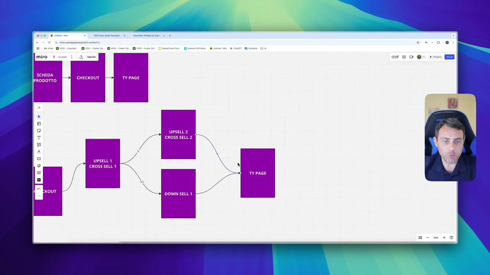

**Testo a schermo (OCR):** SCHEDA PRODOTTO UPSELL2 CROSS SELL 2 UPSELLI CROSS SELL 1 DOWN SELLI

> funnel più la rendiamo, tra virgolette, complessa, quindi più andiamo ad aggiungere prodotti, più può risultare il gioco di parole profittevole, ok? Quindi questa strategia mi soddisfa, perché? Perché vedete, a differenza della strategia di commerce dove l'utente può jokerellare, può entrare in diverse pagine che non c'entrano nulla con quello che è il nostro scopo, però convertire l'utente, in questa strategia di funnel l'utente può seguire un rigido percorso, cioè quando l'utente dal facebook ads, dal tiktok, dal reel, arriva alla landing page, non può fare altro che andare al checkout o lasciare, e questa strategia è una strategia estremamente rigorosa, perché è una strategia che mi piace, perché è matematica, ci permette di analizzare i dati e capire punto per punto nel nostro funnel che cosa sta funzionando, invece che cosa non sta funzionando, ok? In questa strategia invece abbiamo caos, perché non sappiamo quello che succede, ovvero potremmo tracciare

## [00:10:57] Schermata 15 _(periodic)_

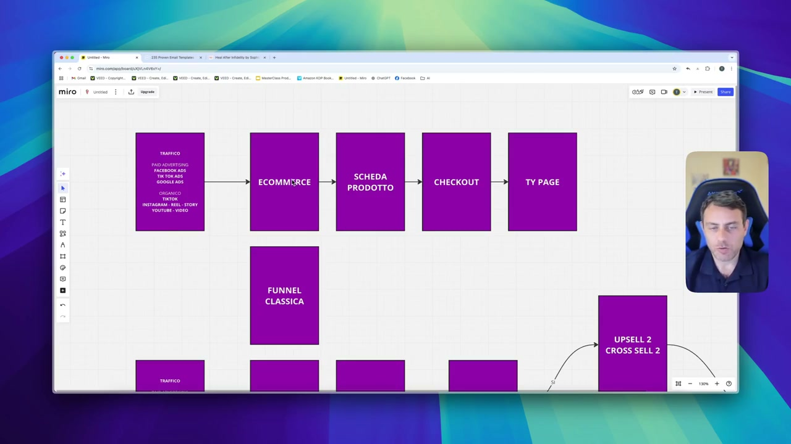

**Testo a schermo (OCR):** E SCHEDA ECOMMERCE Ticnono CHECKOUT iP FUNNEL CLASSICA UPSELL 2 CROSS SELL 2

> quello che succede, ma non abbiamo un rigoroso metodo per capire quale step di questa procedura non sta funzionando, ok? Ragazzi, questo è estremamente estremamente importante, perché quello che facciamo è andare a crearci una struttura di questo tipo, e ovviamente la testiamo, e poi durante la fase di test andiamo a raddrizzare il tiro per capire che cosa non sta funzionando e sistemare quello che non sta funzionando. Uno degli errori principali che fanno tantissimi studenti dei percorsi a pagamento, dei percorsi di consulenza, sta nel provare una strategia di questo tipo, vedere che non funziona e lasciare o cambiare prodotto o dire che il business dei prodotti generali non funziona. No, ragazzi, la fase di test si chiama così perché è appunto un test, e durante la fase di test noi è normale che non abbiamo guadagno, ok? Noi è normale che non abbiamo un ritorno sull'investimento. Il ritorno sull'investimento lo abbiamo nell'istante in cui ogni step del nostro funnel, partendo dal traffico e arrivando fino a questo punto qua, sono totalmente ottimizzati. Quindi noi avremo una fase di test durante la quale andiamo a controllare il funnel, andiamo a

## [00:11:57] Schermata 16 _(periodic)_

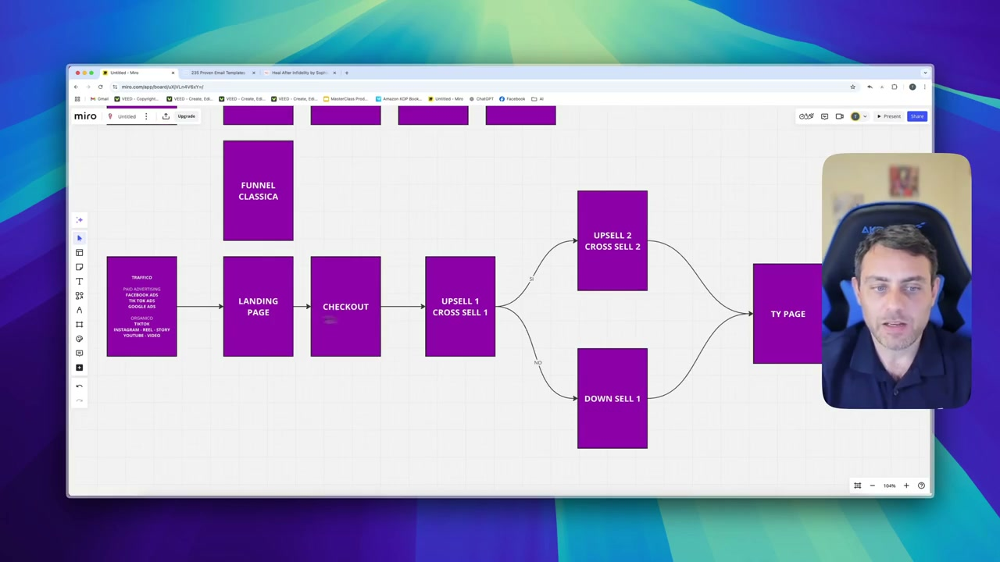

**Testo a schermo (OCR):** FUNNEL CLASSICA UPSELL2 CROSS SELL 2 UPSELLA CROSS SELL 1 TY PAGE

> controllare i vari passaggi e poi abbiamo una fase di scaling in cui abbiamo ottimizzato gergo tecnico il nostro funnel, abbiamo visto che funziona tutto, abbiamo un ritorno sull'investimento e poi successivamente iniziamo a fare profitto e andiamo a scalare la nostra fonte di traffico. Scalare la nostra fonte di traffico significa spendere più traffico qui per avere maggiore profitto qui. Questo è un esempio di strategia di funnel, vedete? In questo caso mandiamo traffico su questo prodotto

## [00:12:20] Schermata 17 _(scene)_

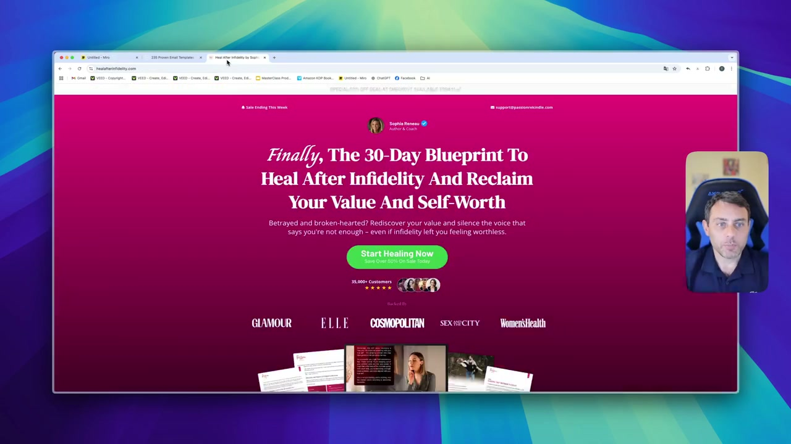

**Testo a schermo (OCR):** fe Finally, The 30-Day Blueprint To Heal After Infidelity And Reclaim Your Value And Self-Worth ATM

> che è un insieme di ebook, che ha lo scopo di curare tutte le donne che praticamente hanno subito un tradimento da parte del proprio uomo, quindi come riprendersi da un tradimento. Come potete notare intanto la landing page è fatta molto molto meglio rispetto a

## [00:12:46] Schermata 18 _(scene)_

**Testo a schermo (OCR):** 235 Proven Email Templates Canva & 235 Proven Email Templates ©55,95 EUR

> una classica scheda prodotto di Shopify, quindi il tasso di conversione è notevolmente

## [00:12:51] Schermata 19 _(scene)_

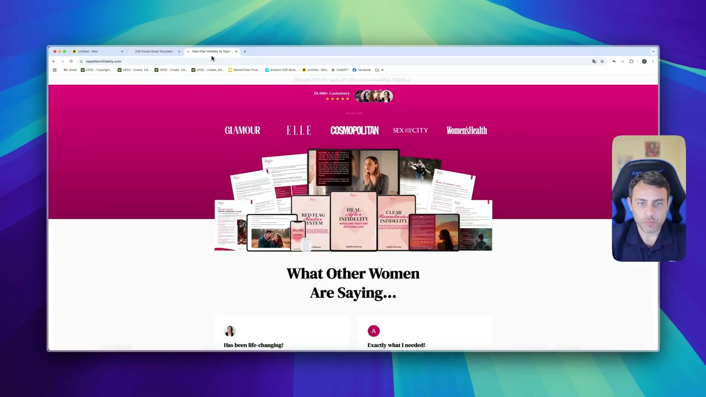

**Testo a schermo (OCR):** What Other Women Are Saying... Exactly what I needed!

> maggiore. Vedete che la grafica è molto più curata e ovviamente un'altra cosa che vi faccio notare è che l'utente che sta all'interno di questa pagina può o proseguire, quindi andare a checkout, o lasciare. Come vedete non ho nessun'altra possibilità. Qui ho ovviamente la privacy, i termini di condizione eccetera eccetera che sono essenziali, sono tra l'altro previsti per legge, ma non ho altro, quindi non posso uscire, non posso andare in un page, non posso fare nulla, non posso fare assolutamente nulla. Posso solamente cliccare il cta default to action, i pulsanti, e andare

## [00:13:28] Schermata 20 _(scene)_

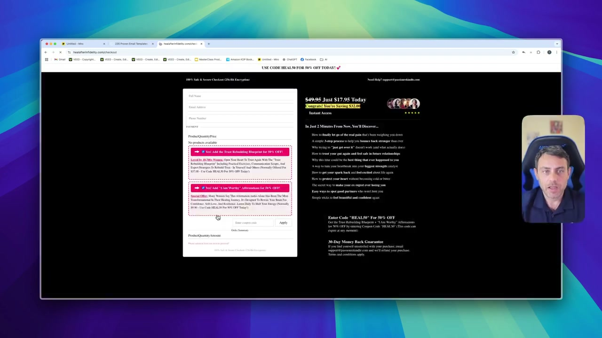

> direttamente al checkout per acquistare il prodotto. In questo checkout come vedete abbiamo ulteriori prodotti che hanno lo scopo di aumentare la transazione, quindi mentre normalmente tornando

## [00:13:41] Schermata 21 _(scene)_

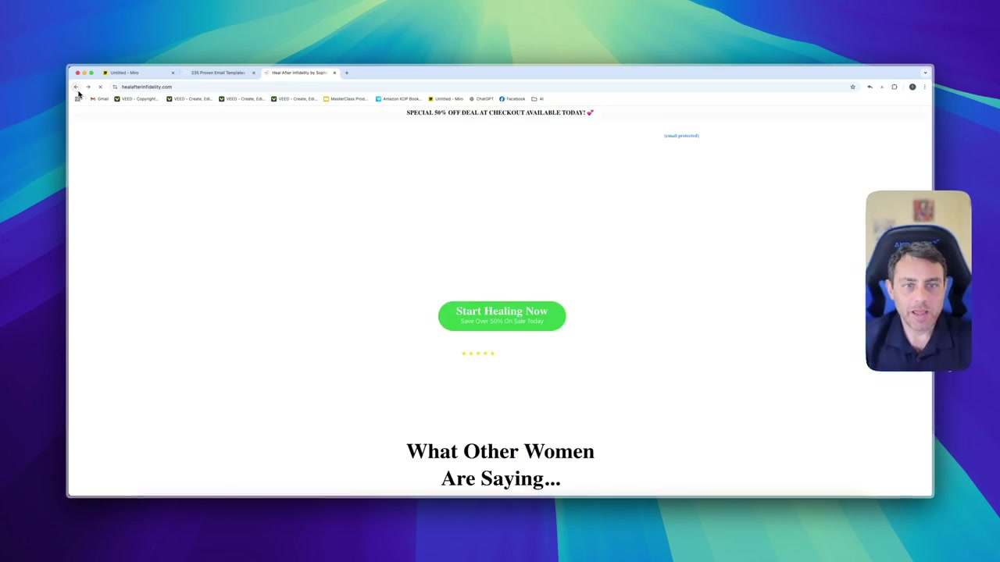

**Testo a schermo (OCR):** What Other Women Are Saying...

> indietro, io qui acquisterei questo prodotto a 17,95$, quindi è un prezzo abbastanza basso, quindi se io non inserissi altri prodotti io dovrei spendere e stare sotto le mie fonti di traffico i 17,95$ per andare a ritorno sull'investimento positivo. Se ovviamente fate traffico organico non avete questa problematica, ma il vostro problema sta nel fatto che dovete impiegare molto tempo per generare traffico o comunque dovete impiegare molto tempo per creare dei contenuti che poi magari vanno virale e generano traffico in poco tempo. Ok ragazzi siamo capiti e se non avessi

## [00:14:22] Schermata 22 _(scene)_

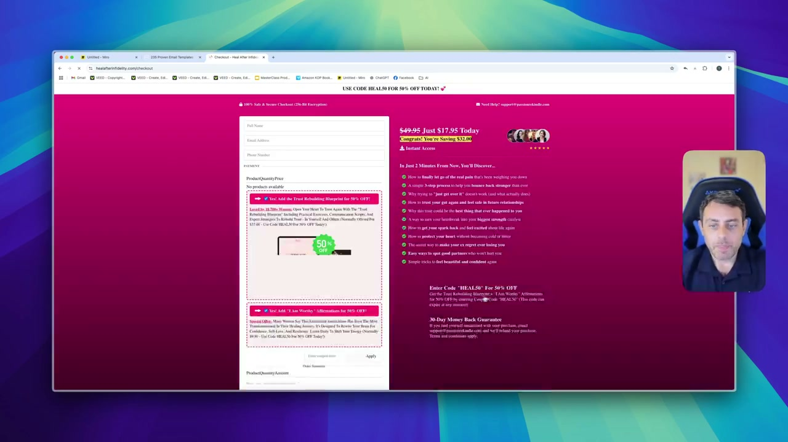

**Testo a schermo (OCR):** st 517.95 Today

> queste offerte non avrei la possibilità di incrementare lo scontrino. Vedete che in questo caso sono offerte già preselezionate, cosa che normalmente non si fa. Qui abbiamo un 37€, tra l'altro il prezzo iniziale è sbagliato, qua dice 17,95$ e qua 37$, ma va bene così, è giusto per capirci e come vedete qui man mano che io aggiungo il mio summary, quindi il mio order summary, cioè il riassunto di quanto vado a spendere, va a incrementarsi fino a 83,95$, quindi partendo dai 17,95$ in teoria Io arrivo a 83,95. Questa particolare tipologia strategia di marketing a checkout prevede quelli che sono i cosiddetti order bump. Order bump sono

## [00:15:08] Schermata 23 _(scene)_

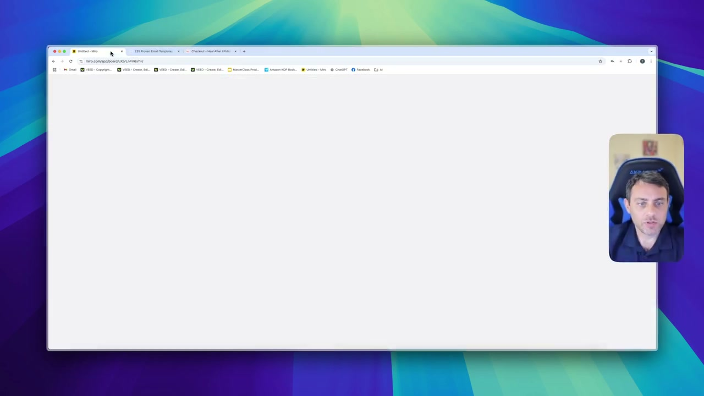

> gli innalzamenti di prezzo dati dal fatto che a checkout io inserisco dei prodotti aggiuntivi e come vedete sul classico shopify di turno questa

## [00:15:22] Schermata 24 _(scene)_

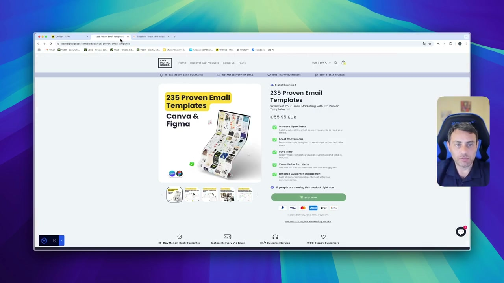

**Testo a schermo (OCR):** 235 Proven Email Templates Canva & 235 Proven Email Templates ©55,95 EUR

> cosa non si può fare. Se io acquisto questo prodotto, io qua ne ho messi due ma ci capiamo, se io acquisto questo prodotto non ho la possibilità di inserire order bump nel mio shopify di turno o comunque la cosa è molto più complessa. Quindi questa strategia di funnel è la strategia che noi

## [00:15:41] Schermata 25 _(scene)_

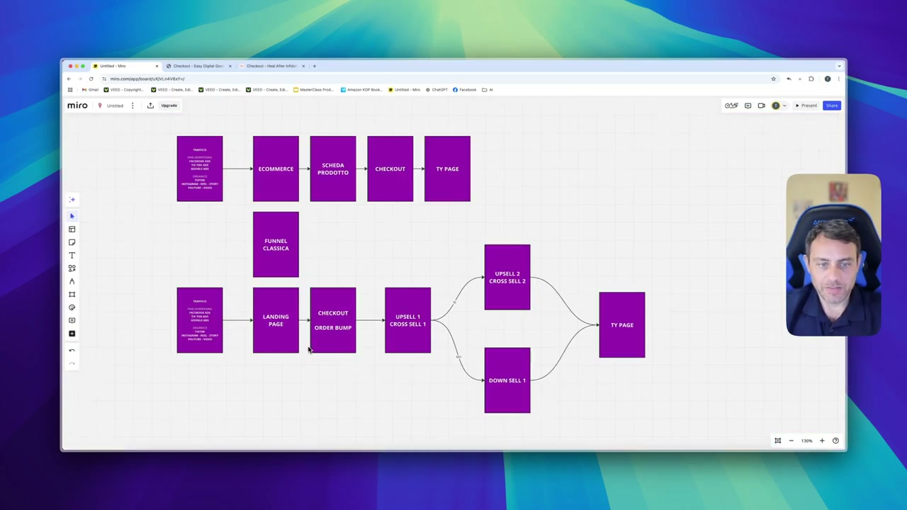

> applichiamo, perlomeno io applico e che applicano i miei studenti, è della strategia che si presta quando vendiamo prodotti di natura digitale, si presta a maggior profitto nel distante in cui la mettiamo in pratica, la testiamo e la scegliamo. Quindi questo per quanto riguarda il funnel utilizzate perlopiù questo perché vi troverete sempre bene e avrete profitti più alti almeno per quella che è la mia esperienza.
