# Framework di creazione di prodotti digitali

> Documento generato automaticamente: trascrizione e screenshot sincronizzati del video-corso.

## [00:00:00] Schermata 0 _(start)_

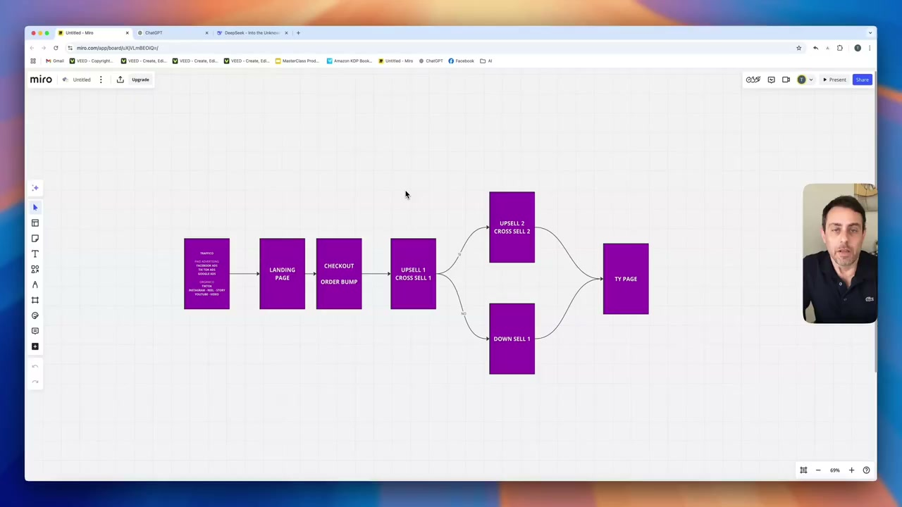

**Testo a schermo (OCR):** Even: ta. Piotta. Ciconio amami Miti © 007 ric DA

> Bentornati nuovamente all'interno di questo corso gratuito sui prodotti digitali. In questa lezione iniziamo a mettere un po' più in pratica i concetti che abbiamo visto nelle precedenti lezioni e iniziamo a creare la nostra struttura di prodotti digitali. Quindi andremo a creare i prodotti digitali veri e propri che andremo a vendere all'interno del nostro funnel. Nella scorsa lezione ti avevo parlato della struttura che solitamente io utilizzo quando creo e vendo prodotti digitali. La struttura che utilizzo di solito è questa. Più o meno complessa, ragazzi, ci siamo capiti, è questa la struttura che si utilizza, una struttura a funnel. Tendenzialmente consta di una landing page con un prodotto iniziale di front-end, chiamato anche prodotto di front-end, il prodotto che vendiamo all'inizio. Al checkout solitamente si inseriscono uno o più prodotti digitali che hanno lo scopo di aumentare lo scontrino medio dell'utente che c'è all'interno della nostra struttura di funnel stessa. Poi abbiamo degli upsell, dei crosssell, abbiamo dei downsell e poi

## [00:01:00] Schermata 1 _(periodic)_

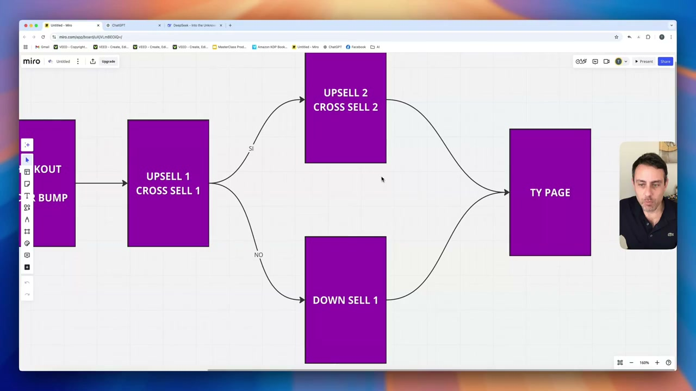

**Testo a schermo (OCR):** UPSELL 2 CROSS SELL 2 UPSELL 1 CROSS SELL 1 DOWN SELL 1 TY PAGE

> infine abbiamo la pagina di ringraziamento. All'interno di questo corso noi, per brevità di cose, ci occuperemo tendenzialmente del prodotto di front-end che si ritrova all'interno della pagina di vendita e successivamente all'interno del checkout ci occuperemo dell'order bump. Quindi andremo a creare tendenzialmente due prodotti digitali ma, ragazzi, la struttura che poi si utilizza è quasi sempre la stessa. Quello che cambia tendenzialmente è la selezione dei prodotti digitali di upsell o di crosssell attraverso l'utilizzo di intelligenza artificiale, quindi attraverso l'utilizzo di prompt più specifici. Io qui, ovviamente per brevità di cose, vi mostrerò alcuni prompt di esempio che andremo a realizzare live, giusto per farvi capire anche come si utilizza l'intelligenza artificiale, anzi le intelligenze artificiali, visto che ad oggi possiamo praticamente sfruttare una miriade di intelligenze artificiali, molte delle quali gratuite. Ora te ne mostro qualcuna che ultimamente sta spopolando e che ha fatto grosso scalpore a causa

## [00:02:00] Schermata 2 _(periodic)_

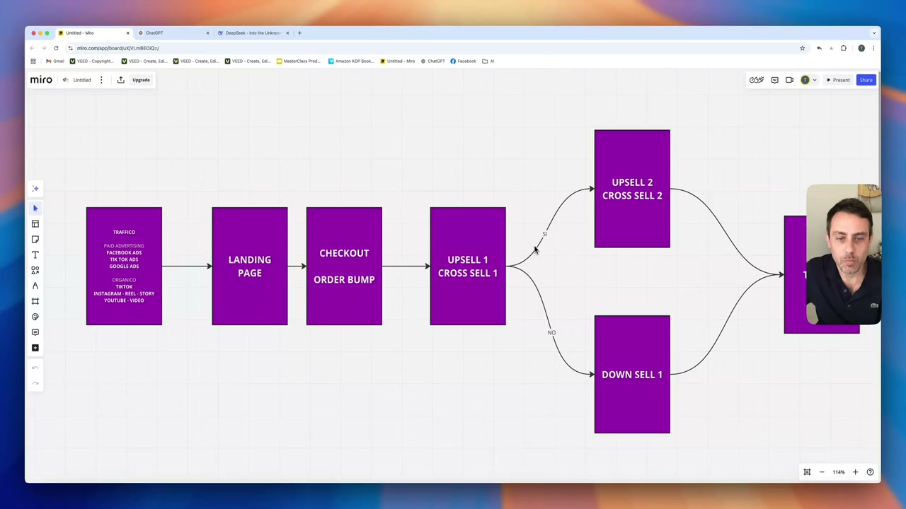

**Testo a schermo (OCR):** x te] te) di A n ® ® n ino: LANDING ECO PAGE ORDER BUMP © @- i E UPSELL2 CROSS SELL 2 UPSELL1 CROSS SELL 1 DOWN SELL 1 M- +0

> del fatto che una struttura di intelligenza artificiale è totalmente open source, quindi si può utilizzare praticamente gratis e tutto il codice sorgente, la matrice dei pesi e quant'altro, tutti i tecnicismi ovviamente non te li voglio dire, non voglio entrare nello specifico perché ti annoierebbero ma è una grossa rivoluzione e appunto è costituita da questa intelligenza artificiale nuova che si chiama DeepSeek. Quindi come abbiamo detto noi creeremo il prodotto di frontend con l'intelligenza artificiale e poi creeremo il prodotto di order bump, quindi il prodotto che l'utente avrà la possibilità di inserire ulteriormente checkout per acquistare un ulteriore prodotto complementare al primo e per permetterci di aumentare la transazione per singolo scontrino. Allora che cosa si fa quando si crea un prodotto digitale? In realtà che cosa si fa quando si deve vendere un prodotto e creare un prodotto? La prima cosa che si fa è l'analisi dei problemi di mercato, ne abbiamo già

## [00:03:00] Schermata 3 _(periodic)_

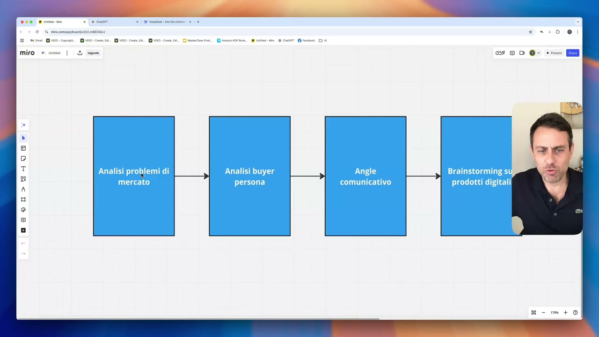

**Testo a schermo (OCR):** vo: com. ve È pc rai Mc © 007 rio DA

> discusso quando in realtà abbiamo visto appunto la parte sull'analisi di mercato se non l'hai vista ti rimando alla parte di questo corso appunto relativa all'analisi dei problemi di mercato che abbiamo fatto in diversi modi successivamente andiamo a definire quella che è l'analisi della buyer persona quindi il modello classico il modello tipo di persona che dovrebbe acquistare il nostro prodotto che manifesta determinati problemi che sono relativi all'analisi di mercato che abbiamo fatto poi andremo a definire un angle comunicativo quindi tendenzialmente andremo a capire in che modo vendere il nostro prodotto digitale, quali parole andare a scrivere, quale comunicazione ecco portare all'interno dei nostri materiali di marketing per vendere i prodotti digitali e successivamente andiamo a fare il brainstorming sui prodotti digitali quindi vediamo alla fine di questa lezione che cosa tendenzialmente dobbiamo creare ora partiamo dalla prima parte analisi dei problemi di mercato e come ti dicevo utilizzeremo l'intelligenza artificiale in questo caso per fare analisi di mercato

## [00:04:00] Schermata 4 _(periodic)_

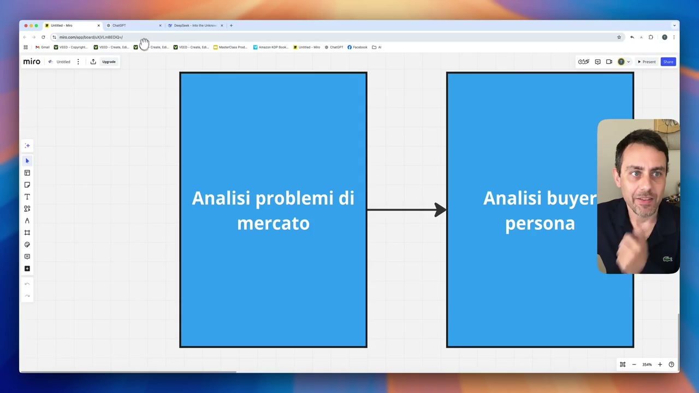

**Testo a schermo (OCR):** MIro © ue i di me ta] ie) di A n ® ® n

> possiamo utilizzarne due ragazzi possiamo utilizzare il cia gpt io qui ho

## [00:04:01] Schermata 5 _(scene)_

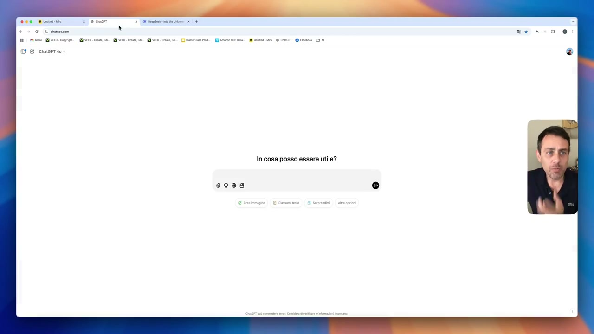

**Testo a schermo (OCR):** bi on EI vito -coni. tiv: cuen ta vo. cun (vito ta sti faremmiconi son 00 Gra DA € chrcerso In cosa posso essere utile?

> la versione a pagamento vedete qui attualmente la versione a pagamento cia gpt 4 o oppure come vi dicevo possiamo utilizzare di psic che è un'intelligenza artificiale totalmente gratuita tra l'altro vedete praticamente quasi un clone di cia gpt con il vantaggio ulteriore dell'essere open source quindi tutto il sorgente che costituisce questa intelligenza artificiale i paper scientifici la matrice dei pesi le reti neuronali che tendenzialmente regolano questa intelligenza artificiale tutto il data set di istruzioni è totalmente open source noi utilizziamo qui cia gpt ma facciamo anche un raffronto con di psic per capire come funzionano tendenzialmente entrambe le intelligenze artificiali visto che è nata da poco all'atto almeno della registrazione di questo video vedremo quali risposte danno e quali sono le risposte che ci convincono di più quindi come prima cosa andiamo a fare un'analisi dei problemi

## [00:04:54] Schermata 6 _(scene)_

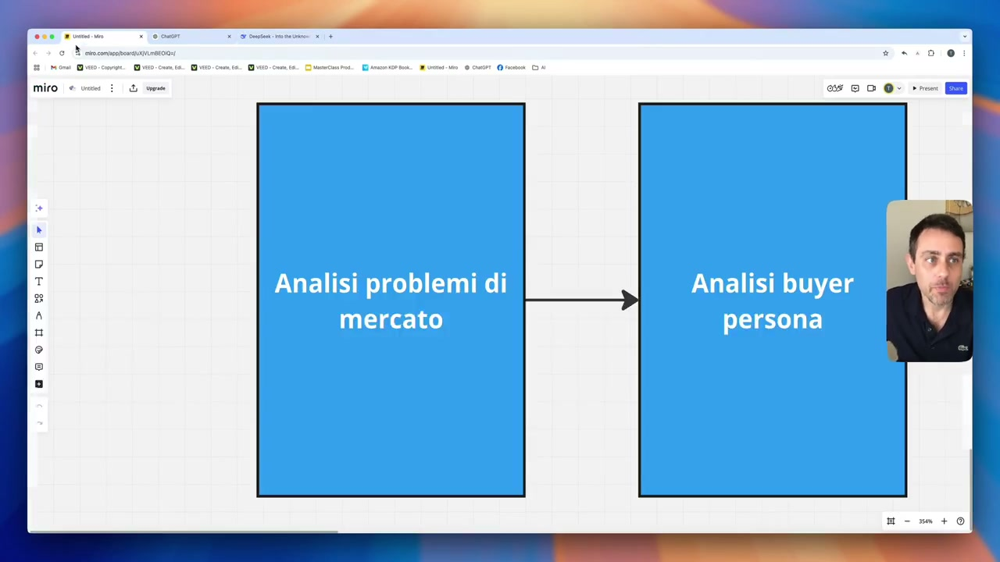

**Testo a schermo (OCR):** È cimconieatescio ve 33 bona EOio coni. tiv: crn ta vo. cun ia (vita stipite n. nima DA MICO © ves io di ve ta] ie) TR A n ® ® n

> di mercato come si utilizza l'intelligenza artificiale la prima cosa che dobbiamo dire è l'obiettivo che vogliamo raggiungere quindi voglio creare dei prodotti digitali diamo anche un esempio della tipologia di prodotti digitali che creiamo ad esempio ebook videocorsi checklist da vendere online quindi questo è il nostro scopo ora diciamo che cosa vogliamo fare analizza il mercato e possiamo anche geolocalizzarlo ad esempio mercato di usa e proponimi tre nicchie di mercato profittevoli che manifestano un problema urgente e fortemente specifico ricordate il problema più specifico più urgente più le persone sono disposte a pagarci velocemente specifico quindi analizza il mercato usa e proponimi tre nicchie di mercato profittevoli che manifestano un

## [00:05:54] Schermata 7 _(periodic)_

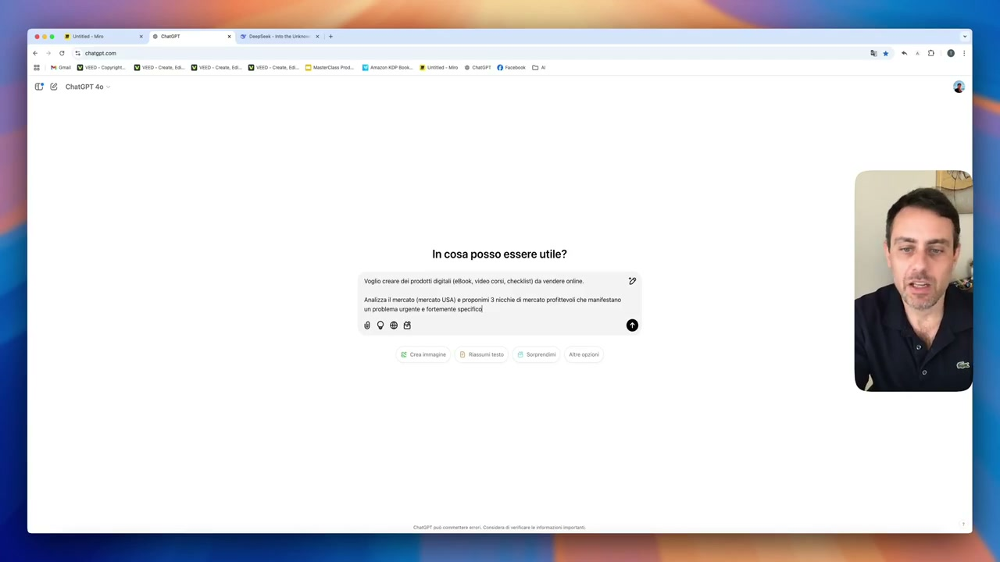

**Testo a schermo (OCR):** 33 Mona EI voci Mitiv:cn ta (vio. cun ia. Mvato-cim ta. Cresci. iamniton ion cOn ra DA © € cricerso In cosa posso essere utile? og cere preti gi (ok io cn ceci) a ener one Ana ero (rato USA proponi nce i mercato ol che mante nel gene oremete speci 0908 (*)

> problema urgente specifico che posso risolvere attraverso prodotti digitali come quelli che ti ho descritto e che ho intenzione di creare al 100% con la IA ok quindi diamo un prompt molto ragazzi molto molto semplice ovviamente i prompt più specifici sono quelli che forniscono i miei percorsi a pagamento ma già questo ci permette di capire in che modo noi possiamo praticamente a costo zero creare dei prodotti digitali analizzando il mercato attraverso ovviamente l'intelligenza artificiale quindi diamo questo prompt sia su CGPT che su DeepSeek vediamo che che cosa ci danno queste due intelligenze artificiali qui ci dice ok creare prodotti digitali come ebook videocorsi e checklist utilizzando l'intelligenza artificiale è un'ottima strategia per risolvere ok per risolvere problemi specifici ecco tre nicchie urgenti per approfondire ulteriormente puoi

## [00:06:54] Schermata 8 _(periodic)_

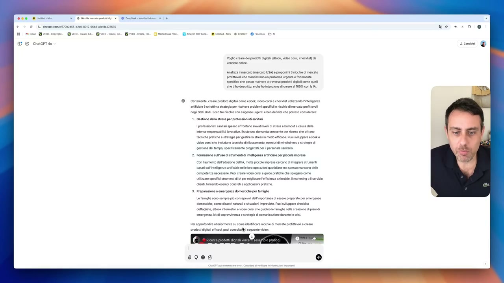

**Testo a schermo (OCR):** GP 35 crm 2 n & € cicerso Mlarinnitonzi. ioni @ 00M Qi DA Voir de prodotti ec. do o, che da Ansia i mero (eresto USA) proponi S ice i mercato rotti che mesto un proina gente e Tormento esito che osso soli tro poso diga come au © Cortonerte, cre prot cip come Bos, vo ori cheat uizzndo ligenza tte è lima sale per ace cimici ict direste gi Stunt Ecco e ice on esigenze gni e Bn cente che potest corsie. ns responsa cite Esiste a doman escort per isa te lano neh rh e Satgi el estro rss n ms ce Pu Scopre eco e io cr che latch las, esercizi ichunee e ste i Formazione Suso i strumenti iintliganza ati per pece prese Conan delazione el ma pic morse cacao dltegae sten sa sntaigenza arte ab ao oerzini quote ma peso mancano dle amet cosa. Pu mr ob os quo peo che sigaro come zar soci snoeni i po mig in sini marg size lenti fomndo esempi conci e apicazioi race. Preparazione» emergenze domestic per tamil Lo fig ono sem pù corse l'import screen Gomes come iti ai o szinimpreit. Puc svizgecchi tag, Bo inerme o cos he guisa lea nel crszine i pari di emergenza, i soronivena e state di comieazne cinte la rs Per apro uterormente sù com entre ce i mero peo ecs dat ira. poi conati veguente deo

> consultare il seguente video e qui ci da un esempio di un video youtube questa è una novità ok quindi gestione dello stress per professionisti sanitari formazione sull'uso di strumenti intelligenza artificiale per piccole imprese preparazione a emergenze domestiche per famiglie ok allora andiamo ad affinare questo prompt dicendo dimmi solamente le nicchie non mi dare ulteriori info come video youtube ok quindi per par condicio modifichiamo questo prompt in questo modo per par condicio modifichiamo il prompt anche su DeepSeek in modo da metterli entrambi in condizione di avere lo stesso prompt allora gestione dello stress per professionisti sanitari i professionisti del settore sanitario spesso affrontano elevati livelli di stress e burnout prodotti digitali come ebook videocorsi e checklist focalizzati su tecniche di gestione dello stress

## [00:07:54] Schermata 9 _(periodic)_

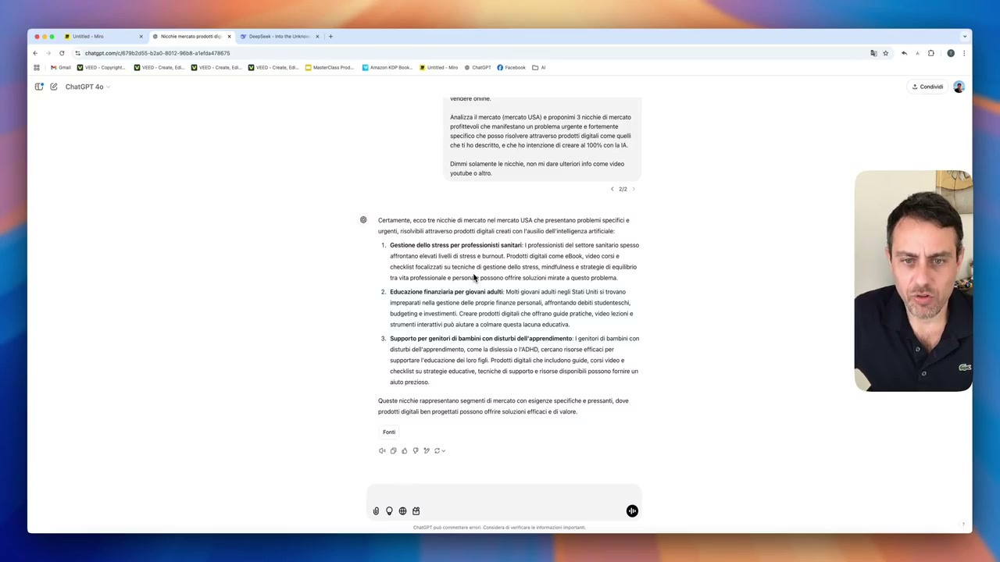

**Testo a schermo (OCR):** GP 33 etnia 220 02 en diona EIvto-coii. Miti: comn ta vo. cuni Mato ta Catino ni. nio 9 000 rea DA © € crucerso Anaza i mero (erat USA) propoini ica i mercato otel che masi un rtl gene e ortemate “pediico che oto alire trverso podi diga come qu @ Cornet, ecco re ict i mesto nl mercato USA che presentano prote specie gent, rito prot ga resti co aio delega ail: 1. Gente dello stress per potest sanita | poessonisi else santa sesso atrata ele eli ci ess e uno. Pot gia comes doc e etc calza s enche digestne dla ss maluness estate i quid A tasse person poscro tte Soup me questo prode uczion nnzara per govni uti o ian peg Sta nti roiano Baget imestivent Cres prodot dti che tran quo rate vo leoni stent era uò siae oa questa cu data Supparto per ita bambini con stud sppendimento | tori bam con Si l'agenda, come ale ADHD, crea as ici per spartire Psucazin el ig. radiali ch inciso gus coni viso e crt 1 srtge cati cche i supporto e ian capond posoo Ire un “vec crea ssd io cosa such e rta 00, Gost tak ben proget possono ali senile i vee

> mindfulness e strategia di equilibrio tra vita professionale e personale possono offrire soluzioni mirate a questo problema educazione finanziaria quindi gestione dello stress per professionisti sanitari è un'ottima nicchia di mercato perché devo dire che medici e infermiere stanno a contatto comunque con realtà che sono abbastanza pesanti giorno dopo giorno tendenzialmente aumentano i loro livelli di stress e quindi andare a creare un ebook che non è il classico ebook su come gestire lo stress ma è l'ebook su come gestire lo stress per il medico che trascorre 24 ore su 24 in corsia vedere come una specificità del problema ci permette di addentrarci all'interno di una nicchia molto specifica e quindi rendere il prodotto molto esclusivo educazione finanziaria per giovani adulti molti giovani adulti negli stati uniti si trovano impreparati nella gestione delle finanze personali affrontando debiti studenteschi budgeting investimenti creare prodotti digitali che offrono guide pratiche video lezioni strumenti interattivi può aiutare a colmare questa lacuna educativa e supporto per genitori bambini con disturbi dell'apprendimento che negli stati uniti in questo momento stanno spopolando queste nicchie rappresentano segmenti di mercato con esigenze specifiche e

## [00:08:54] Schermata 10 _(periodic)_

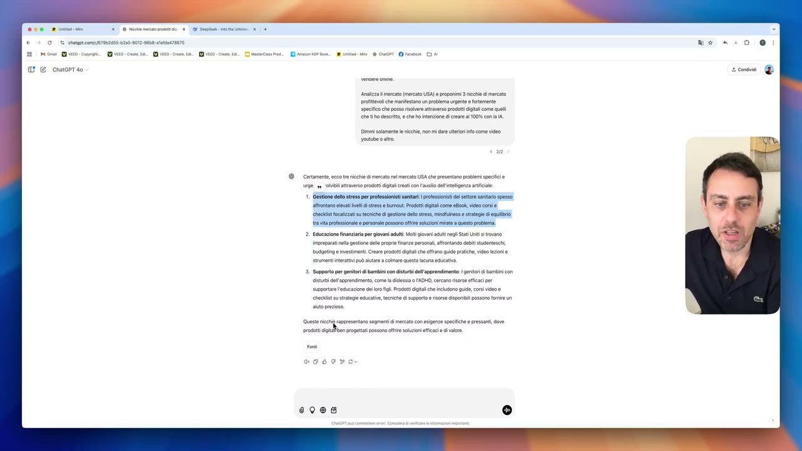

**Testo a schermo (OCR):** DELETE x ecm ecm ensee x [87 Bin ee | 6 > © 55 eten 82ISE AZ: 0 HI bio Eito .coni. tiv: cun ta vio: cun ia Mic ta scitni. Miarenmito ni. nin 00 ra DA E € ciucerso Ansia mesto (resto USA proponi Sci meo rotti maestose gente e fortemente “weo che osso role stiro pos ili come ue het ho deserta cha o tenzone rare | 009 on vostbe oto @ Cornet, cc e ict i mesto nl mercato USA he presentano prote speci 109. ‘li arno pot ga rst con ao delega ica: * Gestone dello stress per protesi santa | oessoniai lst satiro sesso tatoo la Ii i stess e bau Pasti gii cone Boi docs e ecs sz eenche i gestae el sires mgtunss ae ultra a tasso persons possono lle surni mite custa. uezion nnzara er govni ut: o ian peg Sta nti rrano inprpaai ela essre dele core finanze eran affotango cb stugeneshi. Baggtng esimnti rese piso gi che fran qu patch, vo ioni stent rari uò Sao oa questa aci data Supparto per eta bamb con stud ppendiment | torba con SI el'pgensiemano, como i ale PAD cnc o ti pr spartire sua el ig. radiali ch incudono gus coni viso e ect stage ducati, cried supporto irc dspnl possono fre n Sena e n oo wc gros prop possono le sui sie ire

> pressanti dove prodotti digitali ben progettati possono offrire soluzioni efficaci di valore qui abbiamo tra l'altro la fonte che possiamo consultare per capire in che modo l'intelligenza artificiale ha elaborato questa risposta bene di psico è molto più stringente ma ripeto è nata da pochissimo quindi abbiamo salute mentale gestione lo stesso per professionisti remote workers quindi persone che lavorano in remoto finanze personali investimenti per millennial secondo debiti studenteschi transizione professionale upskilling per over 40 in settore obsoleto devo dire che più o meno le nicchie di mercato sono quasi le stesse qui abbiamo gestione lo stress per professionisti sanitari salute mentale gestione lo stress per professionisti remote work quindi non dobbiamo far altro che andare a selezionare un qualsiasi prodotto un qualsiasi una qualsiasi nicchia di mercato che tendenzialmente faccia il caso nostro quindi in questo caso ragazzi utilizziamo questo gestione lo stress per professionisti sanitari che mi

## [00:09:54] Schermata 11 _(periodic)_

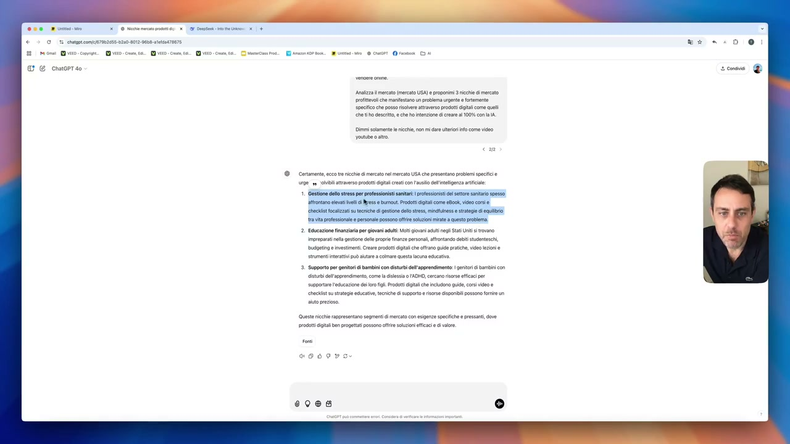

**Testo a schermo (OCR):** Tali x 0 creme tto GP 35 cremano 02 n dio EI vito :coi. io: cn ta. Mv. cun ia (Mv. rencini. laremco ni in iim O0 Qra DA E € ccerso Ansia mero (meresto USA proponi rici mercato otite che mattino un prote gene e otemate Soi he posso soia prodot gi come ue het ho deserta, ch o ezine rese 1 00 coni pete val. i @ - Cortamente, ecco e che i mesto nl mercato USA he presentano prote speci 09. “ciato pot gt resti co ao del'aegeza aria: *. estone dello stress per protesti sanitari | esso else senta sesso ttatana ei ii resse bum. Prati gi come eo io cone hei cazz s tenete i estone do svss.muness estate i quibre A tate persone possono fre suoni me questo ode ucazion nnzara er govni ult: o ian i peg Sta nti ovano morgana eine ele ere nz persa afrotano cb stucentet, Baggtng esimnt rare pon gi che fano ud patch, do ioni stent rari uò siae olor questa aci dt Supparto per guitar bambini con stube sppendiment | oto bam co SI el'pgrendmato, coo la iales PADAD, cercano ici per porte cucazion el ig. Podat iialch inchjno gd cn io e chit stai sat ich i supporto e cre ioni possono ci un be presen sani co cerca spice è reni dv Gost ia ben progetti posano lire selen feci i vee

> sembra abbastanza interessante come nicchia quindi passiamo allo step numero

## [00:09:58] Schermata 12 _(scene)_

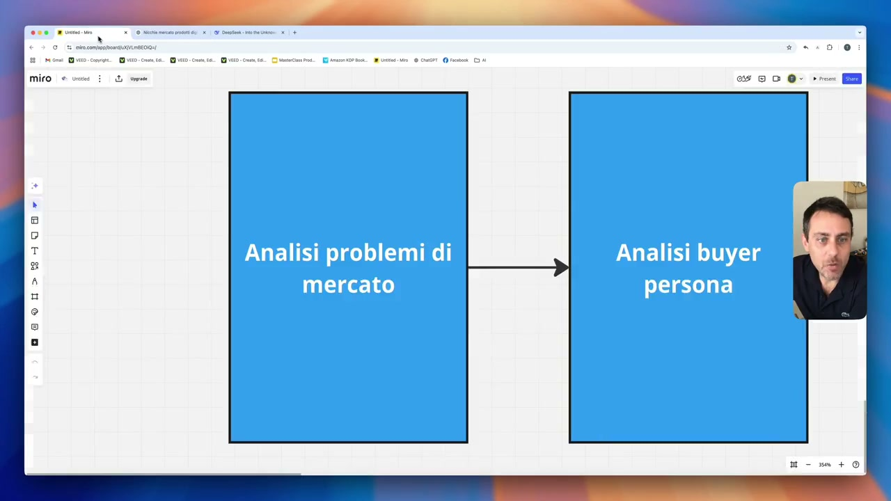

**Testo a schermo (OCR):** 008 puis uo= x HO boma Euo:conni Mtio:cun ta. (vio. cu ia. Mitto-cu a. n ario Mt © DOT ri DA MICO © usi io i ne te] te) T A n © ® n

> 2 una volta analizzati i problemi di mercato andiamo a fare l'analisi della buyer persona quindi il modello tipo di persona che dovrebbe acquistare il nostro prodotto digitale in questo caso è

## [00:10:09] Schermata 13 _(scene)_

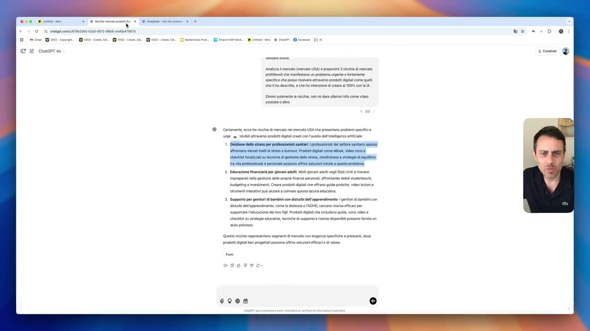

**Testo a schermo (OCR):** 9233 cremano 20 2 e bioni I ito:coi. Mio: cn ta vio: cuni (Qt sometimes Mimi On Gra DA © € cincerso Ansia mero Imeresto USA open Snc i mecto rtterobere mates roiena gente e forerene Soia he posso ore avaro pd gi come el pete pat. i @ _ Cortinete ecco te ich i mesto nl mercato USA che presentano poteri soci 1. “rito poi gt reti co Faso el'aegenza cale: ‘Gente dello stess per protesi santa | esso el sete star sesso tata ai i ess e bos Posti gii como Boi voce ci cozza tenete di estone do svss, mnluness estate i uibre a vate e persone ossro tre sro me è questo pedena ueazion innzara per giovani ui o gang St nti rino @Mnorpaa ea esire de core (naz persa afrontanso cb stugeneshi agg esivnt rese pio dpi che fran ue pratche, o zioni e ment orti può Bia oo qusta aci data Supparto per get bambini con sud sppendimento | er bam con stub aerensmnt, como lio ADHO, cora ric ai per spartire scan el i. rosata ch imcasono gdo coni vile ct stage sci, cncho i upprto sorso poni possoo fre ita renano iii al o spa pui pet o Gratta ben progetti poso ale seni tici ivo

> abbastanza definito perché poi abbiamo gestione lo stress per professionisti sanitari ma continuiamo andiamo avanti e chiediamo alle intelligenze artificiali di delineami ora la buyer persona classica intanto diciamo che nicchia abbiamo scelto ok ho scelto la nicchia numero 1 delineami ora la buyer persona classica qui ragazzi io lascio degli spazi perché sono un fissato con il copy ma voi potreste anche scrivere tutto attaccato l'intelligenza artificiale ovviamente capirebbe perfettamente quello che il contesto ma io solitamente anche per avere un po di ordine all'interno dei prompt che creo lascio qualche spazio quindi diciamo ok ho scelto la nicchia numero 1 e l'intelligenza artificiale riesce a risalire allo storico della chat e sa che parliamo della gestione lo stress per professionisti sanitari delineami ora la buyer persona classica che con più probabilità acquisterà il mio prodotto digitale nel minore tempo possibile in modo da comprendere anche

## [00:11:09] Schermata 14 _(periodic)_

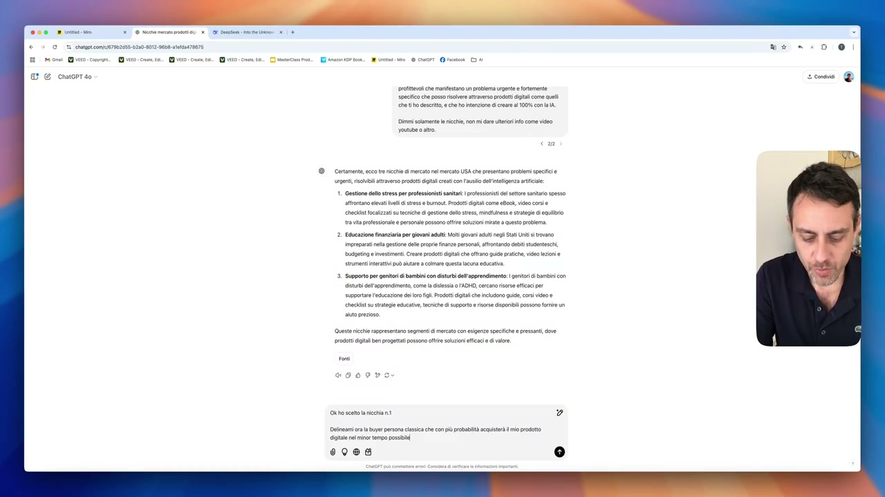

**Testo a schermo (OCR):** € > 05 cinte 220 TE RIO mcr Brio: covi. @vero-cui ta I vio:cnm ra. (io: c ta. Mitrcani Poi. Mimmo Menia © 001 rea DA © € ciucerso sente che manifesto bea epr ormone “edo che osso rile treno ps ii come uti OO Cortei ecco tiche i msi nm USA che een problemi pci get, oto poi gal cistica dl'aebgenza rs: ttatano esa Ii stess Bou Posti gia come eci vo cone sezione innzara er giovani ut: oi gian aut peg Sta ati rovano encrpaai aa espne dele pere (nnze persa lrontanso deb tunes. Baggio mesiment Cr id gii che lano ue rate, o eroi e tuoni trai può siae colare questa cun dt Supparto pe ritor bambini con sure ppendimente | eo bam co stub df'asprenimnt, cao ssa 0TADHD, cora risorsa pr partire cucine el gl. redatta inchdono gus coni vo e choc ssaa a tcnche di upon cre dispanib possno fmi un Questo ice merano agonia on sn niche pressanti dv sata ben progetti ooo ir sezioni stese i vare Dein aa ber persona casa che co pù rbabit scqueteò o petto cile ne minato posa 0906

> l'angle comunicativo che dovrò utilizzare ok anche in questo caso un pronto molto molto semplice qui abbiamo salute mentale gestione lo stress per professionisti remote worker andiamo a modificare la nicchia e scriviamo la stessa nicchia che abbiamo avuto in cgpt e modifichiamo un po il prompt per dire ok ho scelto la seguente nicchia ok ripeto stiamo facendo un paragone ragazzi non per forza dovete utilizzare le intelligenze artificiali ma qui visto che sei in fase di sperimentazione andiamo ad utilizzarle entrambi ok poi voi utilizzerete quella che ritenete più opportuna non dovete fare questo doppio lavoro quindi ho scelto la seguente nicchia gestione lo stress del classica clicchiamo qui clicchiamo qui vediamo cgpt che cosa ci da ecco la buyer persona ideale del tuo prodotto digitale buyer persona dottoressa emily carter 38 anni infermiera ospedaliera stremata profilo demografico 30 40 anni

## [00:12:09] Schermata 15 _(periodic)_

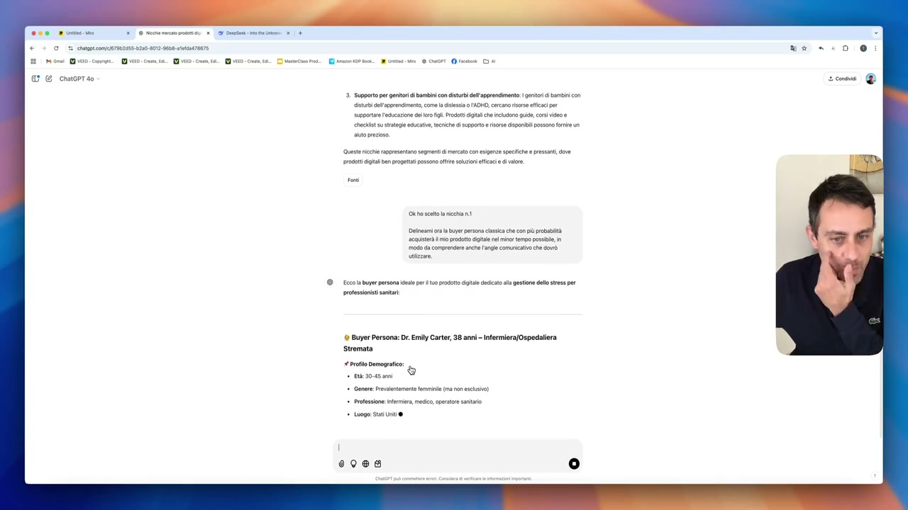

**Testo a schermo (OCR):** = ===" GP 35 crm 220 02 di on EI tc. Diotti vo: cut. Qt. sti mete n iso @ cO Qra DA E € crcerso 3. Supporto er ene i bambini con subì dl'apgrendimanto | eni babi on studi aegrandimnt, oo ssa 0 OH, cora risor acc pr suor sua el gl rat ig ch incidono qua coni vio e chit su srt cat cche supporto ir ont possono fre un Queste ce torero saponi meet on esqenze sich e pesto, dre rosati ta ben proget paranoie solurni lese gi ve Giro sco ace Dina a bor persona casa che co pù roabità acstaà mo prodot dig el mir engo posse, modo d comprarne ng commiato ch rà cala bue person ie per to prodot gie desto aa estone deo stess per potessi santa © Buyer Persona: r. Emily Carter, 38 anni = Infermiera/Ospedaliera Stromata picrrg “Genere Breaenteente eine (o on esco) “Professione nem msc. ere santo I 0906

> vedere queste ragazze le informazioni interessanti perché mentre un tempo avremmo dovuto spulciare sui gruppi facebook avremmo dovuto utilizzare strumenti che costano migliaia e migliaia di euro invece in questo modo in modo totalmente gratuito riusciamo a fare un'analisi di mercato e riusciamo ad analizzare e ad estrarre la buyer persona in maniera specifica senza dover per forza utilizzare strumenti che costano migliaia di euro come vi dicevo da questo punto di vista l'introduzione dell'intelligenza artificiale in accoppiata a quello che il business di prodotti digitali è un mix alchemico esplosivo perché ci permette praticamente a costo zero o quasi di mettere in piedi un business e iniziare a generare profitti totalmente online 100% con tutti i vantaggi che abbiamo visto per quanto concerne appunto il business di prodotti digitali quindi qui abbiamo un profilo demografico età 30 45 anni ottimo queste sono informazioni che possiamo inserire ad esempio anche le nostre campagne pubblicitarie potrebbe essere informazioni che inseriamo le nostre facebook ads ad esempio ok genere prevalentemente femminile ma non

## [00:13:09] Schermata 16 _(periodic)_

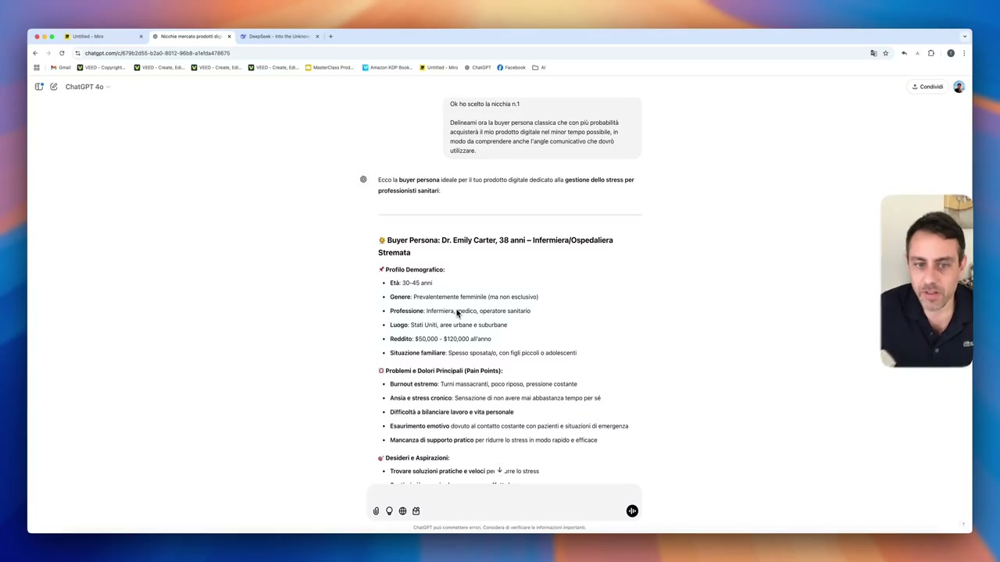

**Testo a schermo (OCR):** € > 035 cinmprcmianzea20 020 E bona Evo :consi. Mtv: cun ta (vio. cun ia. vito. ta sevotininni. Mlmmitoni. in sim 00M rea DA © € chucerso Dainese pron casa che co pù prat caste i mo grado gs nd rr ergo posse “oo o comprendere anche ang coma che dr co aber persna ese er tuo prada gie esso la gstione dio stress per protezioni santi © Buyer Persona: D. Emily Carter, 38 anni = Infermiera/Ospedaliera Stremata 4 Profo Demografico: + 0620450 Genere: raletemene eine (o on esco] * Proteine: nerina pesca osso anzio Lungo: Sti ti re urto estar Rodio: 50000 - 120000 armo Stazione fire. Sesso sposto co fi pesto esce Problemi Dir rinipali (al pins: Ans stress cronico Sensazone dn avere n busta po per sè Diiotà blaniare avro e vt persone Esaurimento motivo doi conio cstante cen paziente stazioni ergenza Mancanza di support paco per idolo rss i modo aio lisce Desire Asprzioni rv soluzioni pai voip mosse 0906

> esclusivo professione infermiera medico operatore sanitario luogo stati uniti aree urbane suburbane reddito 50 mila dollari 120 mila dollari l'anno quindi un buon reddito situazione familiare spesso sposata con figli piccoli o adolescenti problemi e dolori principali pain point cioè i punti su cui battere che manifestano il problema che vogliamo risolvere con il nostro prodotto digitale burnout estremo quindi turni massacranti poco riposo pressione costante ansia e stress cronico quindi sensazioni non avere mai abbastanza tempo per sé difficoltà a bilanciare lavoro e vita personale esaurimento emotivo dovuto al contatto costante con paziente situazione emergenza così come dicevo all'inizio di questa nostra piccola discussione mancanza di supporto pratico per ridurre lo stress in modo pratico ed efficace desideri aspirazioni trovare soluzioni pratiche veloci per ridurre lo stress sentirsi più energica e meno sovraffatta migliorare il sonno e la concentrazione tornare ad amare il proprio lavoro senza sentirsi esaurita avere strategie concrete per gestire meglio il tempo e soluzioni dove cerca soluzioni google o

## [00:14:09] Schermata 17 _(periodic)_

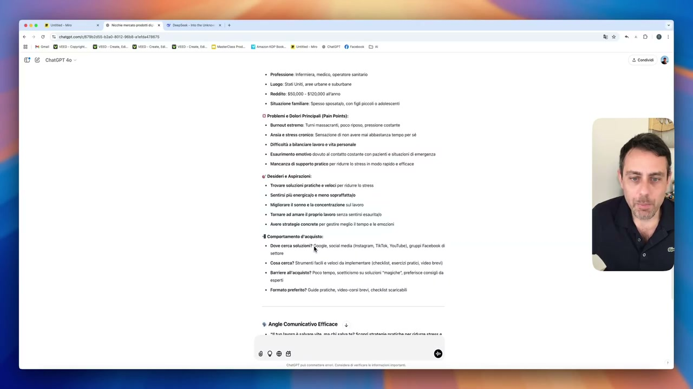

**Testo a schermo (OCR):** GP 35 cremisi 02 rn di oi EI tdci. io: cn ti vo: cont Mv ii. franco ns inse 000 ra DA © € cracerso Professione nem msc. oe santo Rodio: 50000 - 120000 anno Stazione flare Seo sposato co fa colo asceti 3 roblmi o Dolririncipali (Pal pins: Bumowt stremo Ta mast poco sa rosse corto Aia stress rnico Sensazioni o vor ml bbstnz tempo per tico bn oro ita personale fg eno la cncnrzione ivo omar dae prora eo netiso vere tg oct pr ste meg temo le emi - comportamento cit: ove cera aio? og sl med ig, TATO O, ru Fc settore i ona et Sten tace ici gen (i me pci n Bi at? Poco tp ici ln aghe ic conii “Formato prefer? uo et, sco csi ssi

> social media gruppi facebook di settore come vedete analisi di mercato sui classici gruppi facebook cosa cerca strumenti facili e veloci da implementare checklist esercizi pratici o video brevi barriere l'acquisto poco tempo scetticismo su soluzioni magiche preferisce consigli da esperti formato preferito guide pratiche video corsi brevi checklist scaricabili facciamo dare come dice brevi perché appunto il tempo che hanno a disposizione che ha a disposizione questa persona è tendenzialmente poco engol comunicativo efficace il tuo lavoro salvare vite ma chi salva te bellissimo scopri strategie pratiche per ridurre lo stress e il burnout in meno di 10 minuti al giorno smetti di portarti lo stress dell'ospedale a casa tecniche rapide per ricaricare la mente e corpo senza perdere tempo sei esausta dopo il turno usa questo semplice metodo per rilassarti e migliorare il tuo sonno l'approccio vincente sarà pratico rapido orientato ai benefici immediati così come dicevo Così come ho sempre ripetuto all'interno di questo corso, dato che il tempo è il loro bene più prezioso. Ma vediamo DeepSeek invece che soluzione ci dà. Quindi nome fittizio Laura.

## [00:15:09] Schermata 18 _(periodic)_

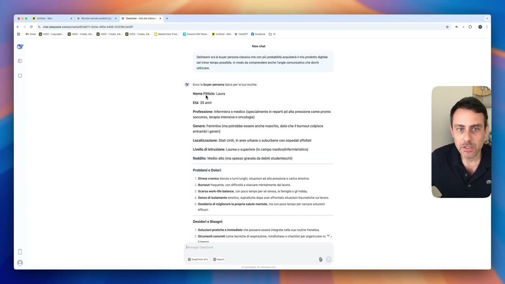

**Testo a schermo (OCR):** Mlaremtonui Miei @ 00M Qin DA sismi a br pron casca che cn pù pobabità cur mo posto ge et in temo psi iO compere ano ang comunico ch o tizi SY Eccola buyer persona ica per ist ich Nome Fitz: Laura Di 2835200 Professione: Infermiera o medico (specisimente in reparti ad alt pressione come pronto soccorso, terapia intensiva o oncologia) Genere: Forni (ma potrebbe esser anche maschio, dato che bumout colpisce entrambi ener) Localizzazione: Stati nti aree ubane o suburbane con ospedali fot Livolo istruzione: Laurea superiore (n campo medicofnfermierisio) Redelto: Medi alto (ma spess gravata da debiti studontesch) Problemi © Dolori: Sten eronco vio fu ghi tazioni da preso 0 cano noto. 2 Bum frequent, on ico tc mertimete olii * Sars mk Balance, poco ego er sè ssaa mia gi BD Senso lamento emotion go ser lotto sunzoni ramtche suine. * ein migrare la prora aut mentale, ma co psc toro per ee sun atteso Desideri Bisogni: Solizoniprtieh immediate che postano essre ge et sa rin note 2 Strumenti concreto teche essa, nine o ccp pui m Y

> Vabbè, per il genere Stati Uniti diciamo che non è proprio il top. Laura, ma va bene lo stesso. E' da 35 anni, quindi siamo sincronizzati, perché qui abbiamo 30-45 anni, qui 35 anni. Professione infermiera o medico, specialmente le parti ad alta pressione pronto soccorso come terapia intensiva, oncologia o pronto soccorso. Questo mi piace, un'ottima idea. Perché, ragazzi, è un'ottima idea? Perché possiamo andare poi a specializzare i nostri materiali di marketing, la nostra landing page, il nostro checkout, facendo specifico riferimento a questa determinata professione. Lavori nelle parti di terapia intensiva e non hai più tempo per te stessa? Questo potrebbe essere un'ottima headline per la nostra landing page. Genere donna, ma potrebbe anche essere maschio, dato che il burnout colpisce entrambi i generi. Stati Uniti, in area urbana o suburbana con ospedale affollati. Livello di istruzione laurea o superiore. Reddito medio-alto, ma spesso gravata da debiti studenteschi. Problemi o dolori. Stress cronico dovuto a turni lunghi. Situazione ad alta pressione e carico emotivo. Burnout frequente. Scarsa work-life balance, cioè bilanciamento tra vita privata e vita lavorativa,

## [00:16:09] Schermata 19 _(periodic)_

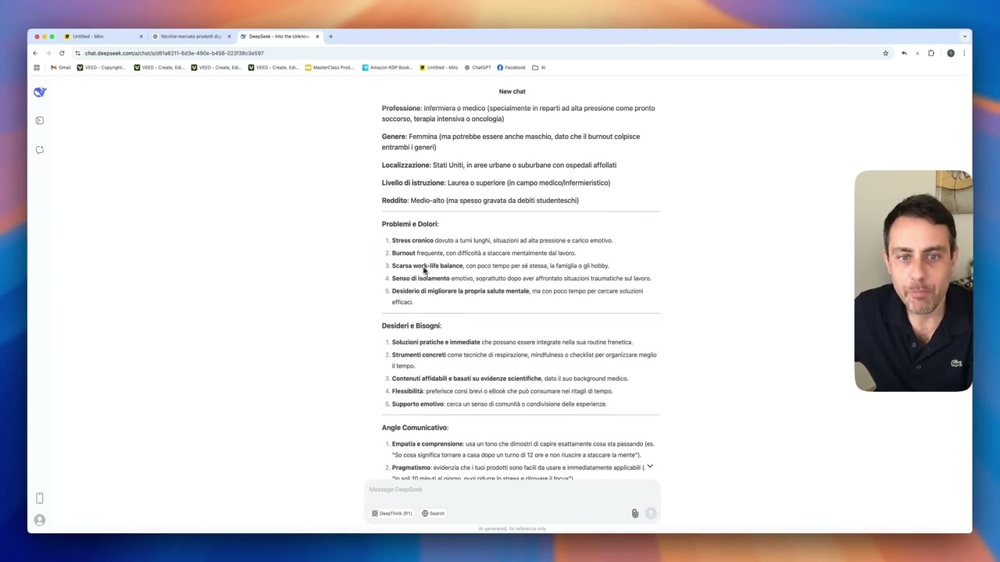

**Testo a schermo (OCR):** x rs To nN Mlarinmto ni. ini ON Qi DA Professione: Infermiera o medico (spociimente n reparti ad ta prossione come pronto soccorso, eapia intensiva 0 oncologia) Genere: Femmina (ma potrebbe essere anche maschio, dato che lbumout colpisce entrambi oneri) Localizzazione: tati nti. in reo urban o suburbane con ospedali tati Uve istruzione: Laure superiore (n campo medicofnfermierisio) Redelito: Madio-lto (ma spesso gravata d db studenteschi) Problemi e Dolori: Sten cronico dovuto un gh sazio da pressione e caco noto. 2 Bum frequent, oo fico staccare mentite ei. 3. Serna moi Balance, cn poco po pr 6 stess mila h8B 4 Senso tb, optato op or anto tuoni amate slavo * Desidero i igoare a prora auto mentale. ma cn paco teo er ec seu Desideri Bisogni: Solzoni pratiche immediate ha posano sareste ela sa rin eta Strumenti concreti teche i espiazione, ine ocecstper ruizare mese tenga * Contenuti tibi asti su iene slenaliche, o sc bugia mado rest lese coi ri o he pò consu tdi i rp. Supporta moto: rca senso di comun condono dle speranze. Angle comunicativo: mp compren; a tono che dont ica stamane os sa pssndo (e. “50 cosa ignara cado uo 1210 on se asta ameno. 2 Prapmatiemo: nz che tu odo sno ic ur e imesiataent ppc

> con poco tempo per se stessa, la famiglia o gli hobby. Senso di isolamento emotivo, soprattutto dopo aver affrontato situazioni traumatiche sul lavoro. Desiderio di migliorare la propria salute mentale, ma con poco tempo per cercare soluzioni efficaci. Desiderio e bisogni. Soluzioni pratiche immediate. Anche qui vedete il ritorno al concetto di praticità, di velocità, di applicabilità in modo semplice e veloce della soluzione. Strumenti concreti come tecniche di ispirazione, mindfulness o checklist. Contenuto affidabile basato su evidenze scientifiche, dato il suo background medico. Flessibilità. Preferisce corsi brevi o ebook che può consumare nel ritaglio del tempo. Supporto emotivo. Cerco un senso di comunità o di condivisione delle esperienze. Angle comunicativo. Empatia o comprensione. Usa un tono che dimostri di capire esattamente cosa sta passando. Esempio, so cosa significa tornare a casa dopo un turno di 12 ore e non riuscire a staccare la mente. Ottimo. Pragmatismo. Evidenze che i due prodotti sono facili da usare e immediatamente applicabili. Esempio, in soli 10 minuti al giorno puoi ridurre lo stress e ritrovare il focus.

## [00:17:09] Schermata 20 _(periodic)_

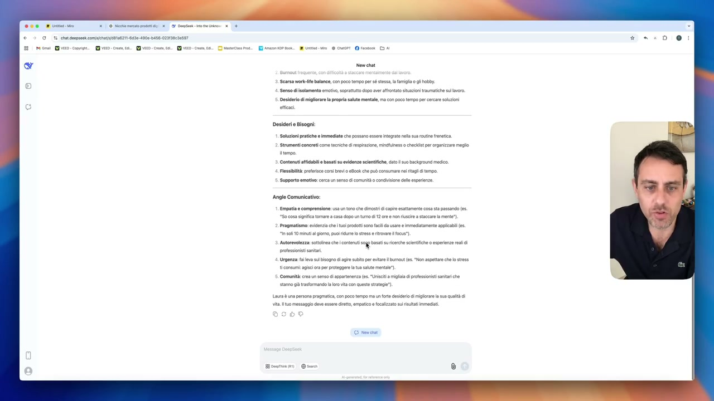

**Testo a schermo (OCR):** Mlarinmtonii. Aim ON reina DA 2 Serna ore balance, co poco tempo per stess mia gi hbb Senso lisamento ema, soprat go metro turni macha lio ‘Desidero di igoare a prora auto mante, na co paco trp per cr suoni Desideri Bisogni: Soluzioni pratiche immediate che possano sare stage ela sa rin ee © Sirumenti oneri come ten i respszine, instunese chia cer pizze meglio tronco * Contenuti ati e basati sù evidenze sclntiche, dt so Bca eci Fissi: aerse cos brevi o ok che può corse i ai i tera. » Supprto mio cs senso i comu o convinse Angie comunicativo: mp compren: a tano che dio ar stamane os sa pesto (6. “50 cosa signia time a csa dopo uo 120 na uscir a staccare a mene © Pragmatismo. sdnz che iui rodo sno’ è usare mestamente pica 2080 int ge, pci eo ss are fc" © Astor satin» cn crt sp bass i ich cche soc adi poesia sant Urgenze si sogno i ge sb per tr bro e. Nan spa che siro come apici ra pr proteggere tua se mene Comunità rsu seno i potenza le ii gii profes senti che tano romano oo icon quest st aura è un persona pragmatica, poco leo ma un arts i migra sa ut i

> Sottolinea che i contenuti sono basati su ricerche scientifiche o esperienze reali di professionisti sanitari. Ok, quindi empatia anche in questo caso. Urgenza. Feleva sul bisogno di agire subito per evitare il burnout. Non aspettare che lo stress ti consumi. Agisci ora per proteggere la tua salute mentale. Comunità. Crea un senso di appartenenza. Unisci le migliaia di professionisti sanitari che già stanno trasformando la loro vita con queste strategie. Quindi anche da questo punto di vista devo dire che DeepSeek ci sta dando delle informazioni parecchio interessanti.

## [00:17:37] Schermata 21 _(scene)_

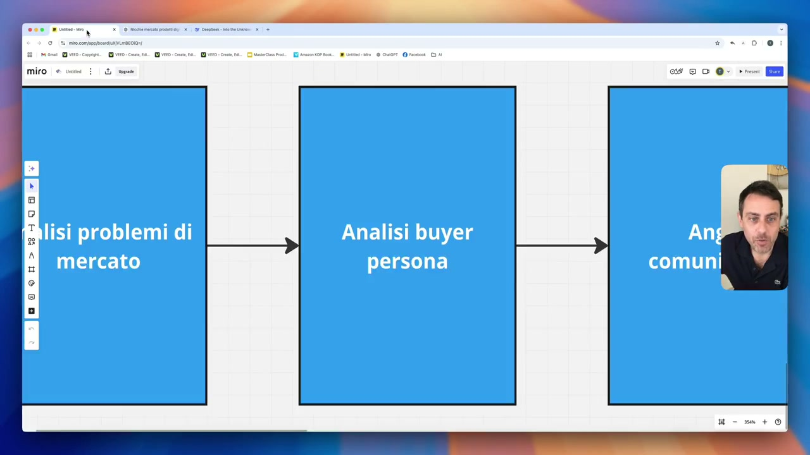

**Testo a schermo (OCR):** te] te) T A n ® ® n

> Quindi abbiamo analizzato il mercato. Abbiamo analizzato la per persona. Abbiamo visto qual è l'angle comunicativo. A questo punto facciamo il brainstorming dei prodotti digitali.

## [00:17:47] Schermata 22 _(scene)_

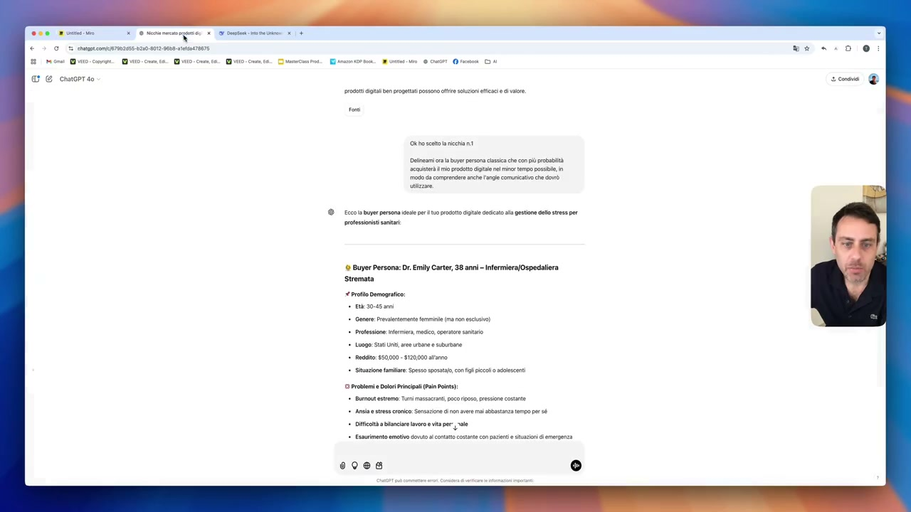

**Testo a schermo (OCR):** GP 35 eran 02 070 bio EI toc io: cren ta vio. conta (Ovest stini. farameiton ion 00 Gra DA ® € ciicerso sai ra ben progeta paso ire souioni fee i ve © esca beer persona iene per io poco ii ia aa gestione do stress per protessonist santa @ Buyer Persona: Dr. Emily Carter, 38 anni — Infermiera/Ospedaliera Stremata ‘Proto Demogr: Gitai Genere Praeneene eine (a non esco) Professione near meio, eo sani Redi: $50000- 120090 ario. Stuzioe flare: Spesso sposta co ia piccolo esca a Probim Dori rincipali (Pain pins: Bumout stremo Tui massoni poco cova pressione costine Asa stress cronico san ino vere ms betana teo pes Dico a blnzire ero tape ale Esaurimento emo dro cotto costante con paz stusoni enerpenza 0066 (]

> Quindi molto semplicemente diamo questo prompt a CiaGPT. Forniscimi ora 10 idee di un prodotto digitale con una bump offer che inserirò a checkout che abbia come scopo velocizzare i risultati del prodotto principale. Quindi fornisce 10 idee di un prodotto principale che soddisfino in maniera semplice e veloce i problemi relativi. Anzi un singolo problema. Quindi un problema specifico. Un singolo problema. Anzi il singolo problema. Il singolo problema più specifico e urgente della buyer persona analizzata.

## [00:18:47] Schermata 23 _(periodic)_

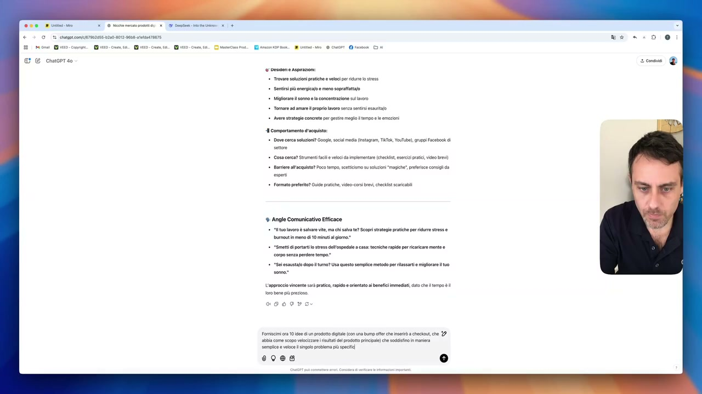

**Testo a schermo (OCR):** GP 33 cranio 20 02 0 n niona EIvto-cori. iti: comn ta (vio. cuni (Mc Citti reno n im O ra DA ® € cicerso © Desire asprazone rv suoni psiche e loci pr sure ossa Senti nego meno sopratatao grane sono 1a concentrazione soa emare a amare propio voro senz senti so Are ste onere per ese meg tempo eos A Comportamento d'acquisto: Dove crea soluzioni? Gg sca media siga, TT, YosTbel, rupi Facebook i CT] Bat acque? Poco tempo ticino su solai ‘mai prlrc anigi speri Fermato port? Gc ah, icon brevi check sca ® Angle Comunicativo Etficace. tv avro salvare vito, mac av te? Scopi srtgi pai er cure stesse Bara eno i YO minuti ona” "Simi porai o stress dl'spdi a cass eniche api per icaicare mento oto senza perdere tempo "Sl sato dopo mo? sa questo seme metodo per rssari migrare tuo sporco icete sapri rapido ento i beelicimmediati to ch po è «00975 eis 100 i prodotto ig (n una Dm ile ce fot aa che ab come Scopo vezzo prince ce sein mera semoice e vence d sp reblema pi speci 09006 (-)

> Ok. Diamo questo prompt anche su DeepSeek. Facciamo partire DeepSeek. Facciamo partire CiaGPT. Vediamo quello che ci dà. Ecco 10 idee di prodotti digitali per risolvere in modo semplice e veloce il problema più urgente della tua buyer persona stress e burnout nei professionisti sanitari. Ogni prodotto include una bump offer che accelera i risultati. Ebook. Stoppa il burnout in 7 giorni. Strategie veloci per operatori sanitari. Cosa offre? Un metodo pratico e scientificamente provato per ridurre il burnout in 7 giorni con tecniche testate applicabili fin da subito. Bump offer. Pacchetto. Audio. Antistress. 10 Minuti per ricaricarti. Minicorso. Il metodo 5-5-5. Riduci lo stress in 5 minuti al giorno. Cosa offre? 3 Tecniche rapide per ridurre lo stress in 5 minuti prima, durante e dopo il turno. Ecco il metodo 5-5-5. Bump offer. Schede stampabili per il metodo 5-5-5. Quindi checklist tascabile da utilizzare ovunque.

## [00:19:47] Schermata 24 _(periodic)_

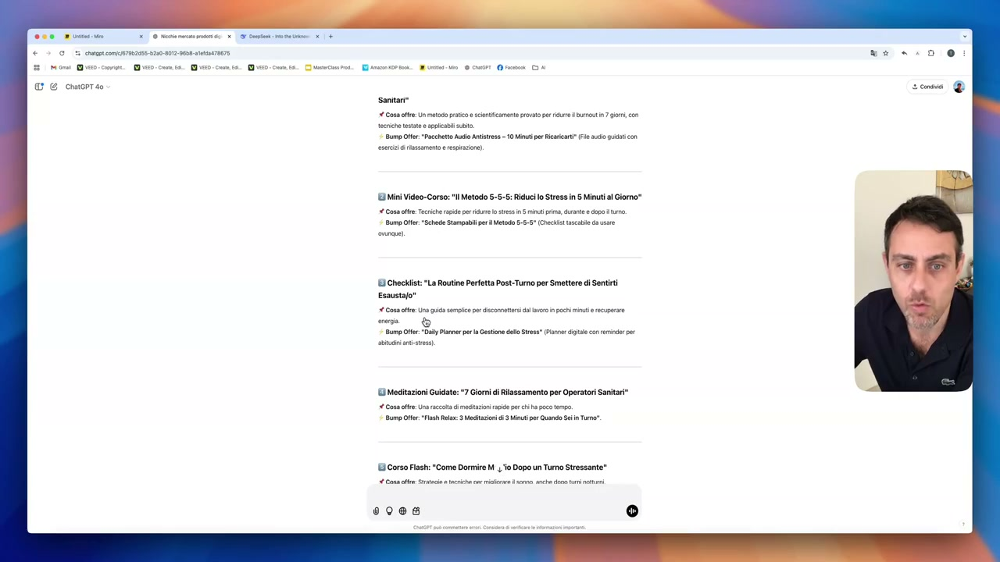

**Testo a schermo (OCR):** GP 35 crm 220 02 0877 E € chucerso Glarona. veni in 9 OM Qin DA Sanitari ‘ Coste: tao rato snteamnte rst peru nin im, co venia estate pg so “ Bmp Of Pacehtto Au Antistress 10 Mu per iaia Fe ao qu con esi risse e resine E Min Video Corso: Il Motodo 5-5-5: Riduci lo Stress 5 Minuti a Giorno" ‘4 Cont: Tren pe perio sive miu pia, ian po Bump O "Sch Stampabli per edo 5.5 (Checa asse arse) I Checklist: "La Routine Perfetta Post-Tumo per Smettere di Sentirti Esaustajo" ‘ Coste Uno qua engice per ice ion pei iui e recpere svga ‘umor: "Dyianer era Gestione dello Ses Fanes con einer pe att anti-vso) fl Megitazioni Guidate: “7 Giorni i Rilassamento per Operatori Sanitari" ‘ Coste: Una eco dimastazoni api phi a poco np > Bump tfr Fa ka: Meitazioni di Meu per Quando Sin Tuo" I Corso Fiash: "Come Dormire M ‘lo Dopo un Tuo Stressante" 0906

> Checklist. La routine perfetta a posto turno per smettere di sentirti esausta. Una guida semplice per disconnettersi dal lavoro in pochi minuti e recuperare energia. Bump offer. Daily planner per la gestione dello stress. Planner digitale con reminder per abitudini antistress. Meditazioni guidate. 7 Giorni di rilassamento per operatori sanitari. Una raccolta di meditazioni rapide per chi ha poco tempo. Flash relax. 3 Meditazioni in 3 minuti per quando sei in turno. Corso flash. Come dormire meglio dopo un turno stressante. Bump offer. Playlist per il sonno profondo. Messaggi antistress. Comunicare senza conflitti sul lavoro. Quindi modelli di risposta per ridurre tensioni con colleghi e pazienti. Minicorso. Come gestire conflitti e pazienti. Difficili senza stressarti. Questa mi piace tanto. Ebook. Cibo antistress. La guida nutrizionale per recuperare energia. Vedete come ci sta proponendo diversi ebook basati su diversi angle comunicativi. Diversi angle attorno al quale andare a risolvere il problema principale. In questo caso è l'angle della nutrizione. Piane alimentari e snack per ridurre lo stress e migliorare la concentrazione.

## [00:20:47] Schermata 25 _(periodic)_

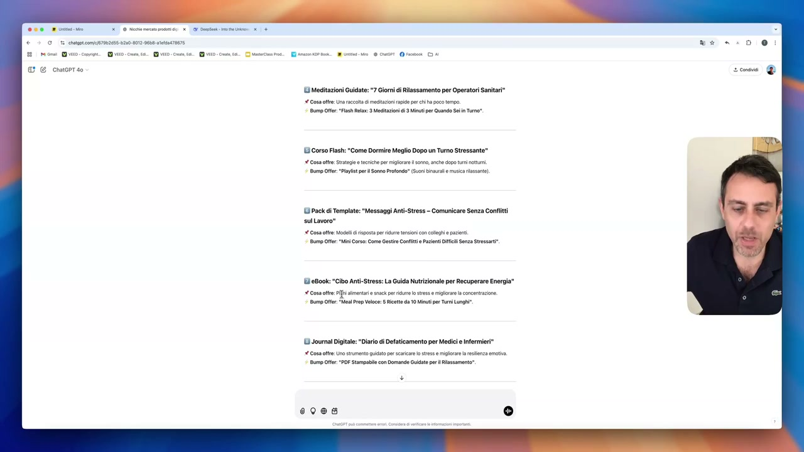

**Testo a schermo (OCR):** ra x cme meammosoeze x 97 Begin peo | GO 5 chicas 0 drone EI to:coi. Bitto: cun ta vio: cuni. vito ta Esci. armonioso 9 000 ra DA E € ccerso {Meditazioni Guidate: “7 Giorni di Rilassamento per Operatori Sanitari" + Costi: Un eco imastazoni ai parchi a poco lego. mp ora ala: Miani di ui per Quando Seli Tue" Corso Fiash: "Come Dormire Meglio Dopo un Tumo Stressante" ‘Cos tir: Sage o teche por mare ono anche go ti ta ump OM Pigs perl Sonno Protone" (oi rsu musica risate UO Pack i Template: “Messaggi Ant-Stress - Comunicare Senza Conflitti ul Lavoro” Cosa tire Moi pasta pr iure tini co ceghe pazii mp OM Corso: Como str Cont Bini ii Senza Stress. eBook: "Cibo Ant-Stress: La Guida Nutrizionale per Recuperare Energia" 1 Cosa li fi menti snack perire o stress e migra concertazione. Sumo Of “al Prop olce$ iot 1 Muti pr Tui Lung, 1 Journal Digitale: "Diari dî Defaticamento per Medici e Infermieri” ‘ Coat: Uno sent ut pr sanre rss e migra reslenz tia Rumo Ot "POF Stampabile cn Domande Cd per iasamento”. 4

> Bump offer. Meal prep veloce. 5 Ricette da 10 minuti per turni lunghi. Diario di defaticamento per medici e infermieri. Audiocorso. Masterclass registrata. Vediamo invece DeepSeek che cosa ci ha fornito. Ebook. 10 Minuti al giorno per ridurre lo stress. Tecniche scientifiche per professionisti sanitari. Questo mi piace. Checklist stampabile con esercizi di respirazione e mindfulness da usare durante le pause. Videocorso breve. Mindfulness per infermieri e medici. Bump offer audio guida con meditazioni guidate. Checklist piano anti-burnout. Bump offer template giornaliero per ottimizzare pause rigeneranti durante i turni. Guida pratica. Guida rapida. Sopravvivere ai turni lunghi. Strategie immediate per ridurre la fatica mentale. Anche questo mi piace. Vedete che qui abbiamo un problema specifico che sono i turni lunghi e come evitare di stressarsi durante i turni lunghi. Workshop online. Audiobook. Bump offer. Template planner. Guida pratica. Eccetera eccetera. Logica delle bump offer. Le bump offer sono low cost o gratuite.

## [00:21:47] Schermata 26 _(periodic)_

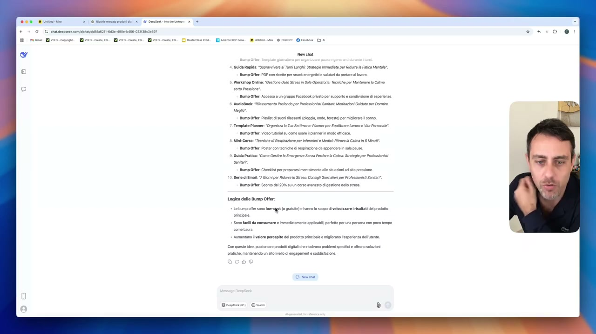

**Testo a schermo (OCR):** ra AO RERINARII > comics [ nion EIvto coi. iv: coen ta vi: cuni vito Crete. Maremoto ni. ion 00 ra DA Guida Rapida: Sogrnvre a TunLungh Stati meda per dure Fa ne Workahp Online: "estinto Ss n Sl pe: Tei er atene Calma Gump Ott cesso un ro cei pito pr spari condivise i escerenze ‘© Adobe Riassmento Pond per Professi Santi Hadiain Guidare per Damve nei Bum tte: Pit suoni asa igg, nd resta pr ig sono. Template lane “Orniz Ta Stan: Ponner or quae Lx e a Persona Bump Ott Vico tra come usare el oso lisce i MC “renne Respzine per Imi e Ms ir Cama Sa ump Ott: ot onere ospizio a apnea pe. a rata: "Come Gost le Emergenza Pardr a Cina Stati pr Professionisti Gump Ott Chest er rep estinte ae situazioni 6 ta pressione 10 Sere i Ea 7 imper iure o Stu: Con omar reso Sant Bump Offer: cato e 20% coso manzo i stor oto tr. Logica delle Bump Oer: Loto tfr on wep gti) hrno sco di velcizzar sua dl roseto * Seno fc da consumare mestamente agis, prete per apra n poco to “Arena È var percepito didnt pine e migrano esparenza diete. onesti pur odo diga ch ricono pmi soi tro sini see. artnen uao ls i engagement e sso

> Le gratuite anche no. Grazie. E hanno lo scopo di velocizzare i risultati del prodotto principale. Sono facili da consumare e immediatamente applicabili. Perfette per una persona con poco tempo come Laura. Aumentano il valore percepito del prodotto principale e migliorano l'esperienza dell'utente. Quindi io farei una cosa. Sceglierei come prodotto principale questo ebook e come bump offer questa checklist. Questa volta DeepSeek mi piace. Mi piace molto. Ok. Quindi. Ok. Ho deciso di creare questi due prodotti digitali. Uno è checklist stampabile. Quindi diamo questo prompt a CellGPT. Diamo questo prompt a DeepSeek. Vediamo cosa ci dice CellGPT. Ottima scelta. Questo è il prodotto perfetto per la tua persona. Quale sarà il tuo prossimo passo? Io vi aiuto con la struttura dell'ebook, la checklist della bump offer, il copy della pagina di vendita, email di lancio eccetera eccetera. Come vedete anche da questo punto di vista l'intelligenza artificiale ci aiuta step by step in tutto il lancio del nostro prodotto principale.

## [00:22:47] Schermata 27 _(periodic)_

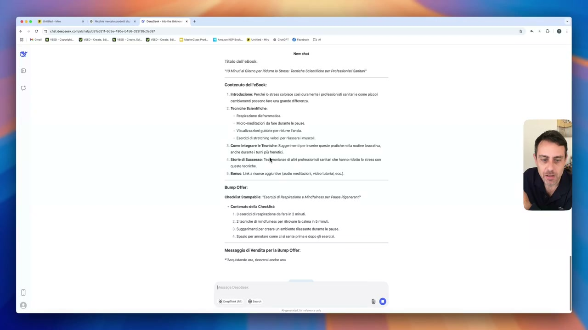

**Testo a schermo (OCR):** Glare ni ini in 9 OM Qin DA Contenuto dll'eBook nozione Pec o ess cosce cai avente potessi santa cone pico ebano le una grano lenza. Vene Selntiche: Resrzne drammatica Eri eten vci pr iste mus * Come integrare Tecniche Skageimnt per ao ose rac al rutena, 4 Star Success: Tesfpoinz i i otessnisti sont che ha ito o ts on queste eine Bone: ve sont uao mastazon, vis as. e). Bumpotter: Check Stampa: Eseciii Resorazone e Minas por Pie genrnr* contenuto dalla Check: © Supponi per se ui ben asa raro pas 1 Spazio eranpote cone is senta pm dopo i ser Messaggio di Vendita pera Bump Offer: nesta aa ever che una

> DeepSeek è già passato alla realizzazione del titolo dell'ebook con il contenuto cioè la outline e la nostra bump offer. Ma questo lo vedremo meglio nella prossima lezione dedicata alla realizzazione dei nostri prodotti digitali veri e propri.
