# Come realizzare prodotti digitali con la IA

> Documento generato automaticamente: trascrizione e screenshot sincronizzati del video-corso.

## [00:00:00] Schermata 0 _(start)_

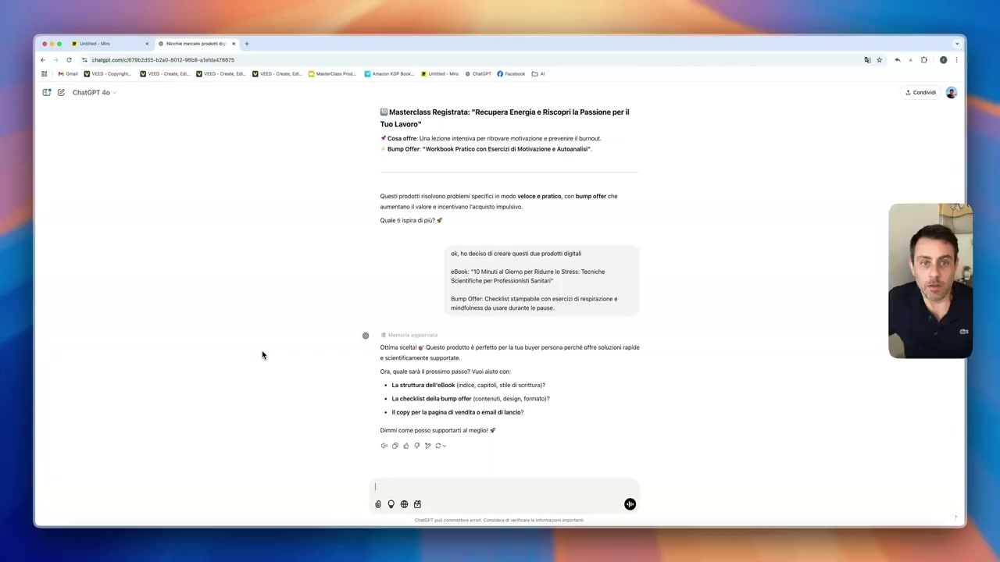

**Testo a schermo (OCR):** 6 + GO 3 eigen 20 0% e 07 O € crcerso Que stà voro poten spesi maso loco pet, co bmp ile Mamerao lr e incerto cato mn. Quae ini o o iso ici qusi pot gli Scanio otessonisi Santa amo Ott: Cc stampabili o seri i esrazon e minha are crt e pe tima sc: Questo raid eteri ua bi psn crche le siii ide e cnticamato apportate. Or ae sn osi paso? aio or + Lato (sc, capi, sl e)? 10 ecs ll bmp tte (contni. esi mao]? + copy perla pagina di vendita ema iaia? mi come poso soptai simegio! «009v0

> Passiamo adesso alla realizzazione del prodotto digitale o dei prodotti digitali veri e propri. In questa lezione ti mostrerò come realizzare l'ebook. La realizzazione di una checklist è abbastanza semplice. Puoi utilizzare programmi come ad esempio Canva.Com che ti permettono di personalizzare quello che è il template, quella che è la grafica della tua checklist. Qui noi utilizzeremo l'intelligenza artificiale per creare il contenuto del nostro ebook. E' una cosa estremamente importante. Dobbiamo avere un ebook che risolva realmente un problema al target di riferimento. Altrimenti, punto numero uno, avrai una marea di rimborsi. Punto numero due, i rimborsi, la marea di rimborsi potrebbero ripercuotersi su quelli che sono i tuoi account PayPal e Stripe e condurti a un ban, a un blocco di queste piattaforme che sarebbe un qualcosa di estremamente dannoso per quanto riguarda la tua attività di business. Perché una volta che ti bannano il PayPal aziendale o meno, poco importa, o lo Stripe non hai più possibilità di vendere online.

## [00:01:00] Schermata 1 _(periodic)_

**Testo a schermo (OCR):** 6 GO 15 cime 00 TT EA DE cricerso Questi voro pt specifi maso foce e pratico, co bmp altere Aumentano ir icatano cato mu. Quae pin cipi oi odio ica usi pori gi Scenic per oessonisi Santa” uo Ott: Ceci stampabi o seri i espiazione e Gta cl 9° Questo said ere peri tu bel pon srché ire sioni de Or quest posi paso? Vai cor + Last dello (nc, ca ste i)? > 10 hci la bum ter contnz, esi mao? + copy perla pagina di vendita mal iano? ni come poso appari meg «909v0

> Quindi quello che dobbiamo fare è realizzare prodotti di estrema qualità. E questo è un altro dei punti di vantaggio rispetto al business di prodotti digitali realizzati con l'intelligenza artificiale rispetto ad esempio al business di drop shipping con cineserie acquistate su Aliexpress, Alibaba e roba del genere. Perché? Perché la maggior parte di quei prodotti ragazzi sono prodotti di scarsissima qualità e nell'istante in cui il cliente riceve il prodotto, sempre nell'ipotesi che lo riceva visto che ragazzi nel drop shipping c'è anche il vecchio detto drop not shipping ma su questo non voglio soffermarmi più di tanto, ma come vi dicevo nell'istante in cui il cliente accede al prodotto vede che il prodotto fa schifo e quindi vi richiede il rimborso immediatamente. Tutto questo con il business di prodotti digitali realizzati con l'intelligenza artificiale non avviene perché avete la possibilità di creare un prodotto di eccezionale qualità. Ora come si crea un prodotto di eccezionale qualità? Beh lo si crea con i prompt corretti.

## [00:02:00] Schermata 2 _(periodic)_

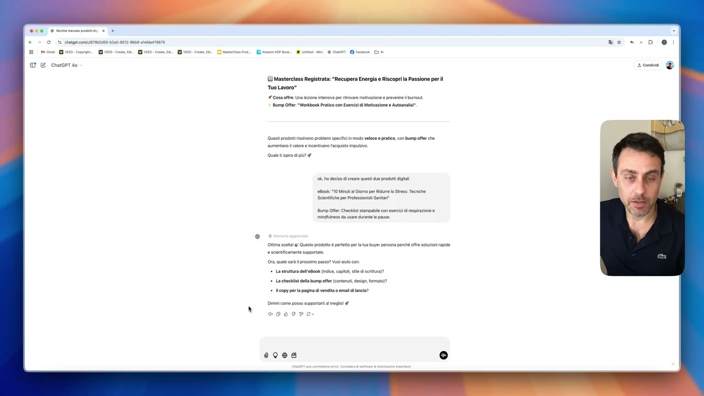

**Testo a schermo (OCR):** 6 è GG 0 7 RIO droni Ivi. vio. cum i voci. Bivona Coca. E) ite tv 0 07 Qi DIA © € craicerso {D mastercias Registrata: “Recupera Energia e Riscopri a Passione perl TuoLavoro* ‘ump Oeste raso co Esercizi Motion Autoanas 0 dio ice use poeti gli Snc per oto Sant uo Ott: Ceci stampabile co seri iene e tima cl Questo said etto peri ta bel paschi solai se + Lat dro (ac, cai sl is)? 10 choc della bum ter (contnu. esi mao? + copy paria pagina li vendita mal iaia? ri come poso opta meio! 4 «909v5

> Ora non vi posso dare per brevità di trattazione i prompt, quelli più specifici, quelli più approfonditi che tra l'altro ritrovate all'interno del mio percorso completo troverete il link qua in basso in descrizione, vedremo di inserirlo. Lo scopo di questo corso è mettervi in condizione di capire e soprattutto di iniziare il business di prodotti digitali. Del resto come dico sempre ragazzi, quello che dovete fare quando guardate un corso non è seguire pedisseguamente quello che il formatore vi dice. Sì è importante comprendere i concetti, ma lo scopo di un corso a mio avviso è quello di darvi la razio di quello che si fa cioè dovete capire il perché si fanno determinate cose. Perché questo? Perché se riuscite a capire come si fanno determinate cose potrete applicarle quando anche tutto questo fra 2, 3, 4, 5, 10 anni sparisse e quindi c'è gpt, cambia interfaccia, termina, c'è gpt, non esiste più ed escono nuove interfacce grafiche, nuovi sistemi di intelligenza artificiale, ma la logica che sta dietro a quello che facciamo

## [00:03:00] Schermata 3 _(periodic)_

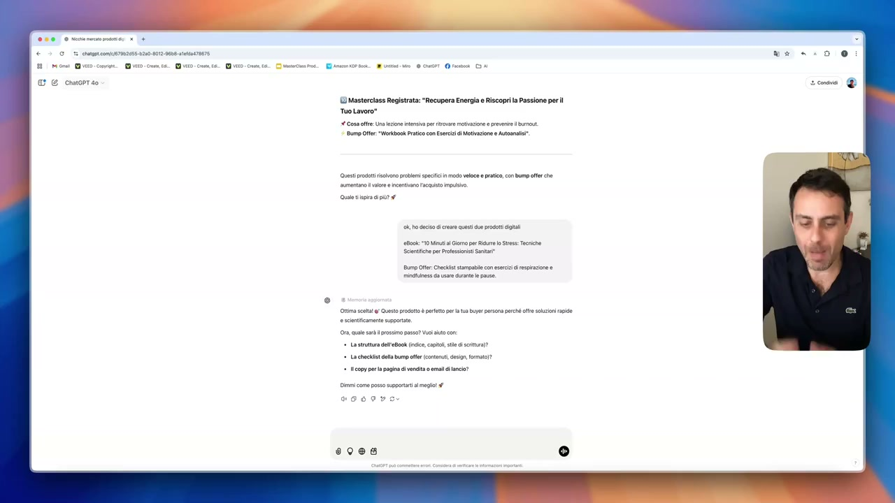

**Testo a schermo (OCR):** 6 GO iii 008 HI droni viso cova. vio. cun i Mito: to Bibo ta Ceci) io tc 01 Qi DIA © E cricorso {! masterciase Registrata: “Recupera Energia e Riscopri a Passione peril Tuo Lavoro ‘umori rato con Eserciidi Motnazion Astana Quest ei avro pt speci mado mloce e ratio, co bmp altere Ameno lr incantano cato mu Quae pini o dio ciare use poti gli Scene per oessonisi Sant uo Ott: Ceci stampabi o sec iene e tima ce 9 Questo said eretto peri tu bel poca cche ire sioni re nta apportate. + 10 choc dla bmp fer (contni, ein mao? + copy perla pagina li vendita ema iano? ri come poso appari meg! e909v0

> se è chiara vi porta a non interrompere il vostro flusso imprenditoriale e quindi vi permette di continuare con il business di prodotti digitali. Voi invece seguite il percorso come un clic a sinistra, poi clic a destra, poi inserisci queste parole. Ragazzi, punto numero uno, non realizzerete mai un'attività imprenditoriale a tutti gli effetti. Punto numero due, per essere imprenditori bisogna sempre avere il cervello acceso e capire il perché di quello che si fa, che la cosa più importante ragazzi non solo in un'attività imprenditoriale, quanto nella vita. Mi permetto di darvi questo consiglio, capite sempre quello che si fa e ragionate sempre sul back-end, su quello che ci sta dietro, le azioni che si compiono. Questo non per forza è un'attività imprenditoriale, ovviamente nel business online perché investire tempo e denaro correrete il rischio se non capite quello che fate di bruciare sia budget che tempo, ma in generale in qualsiasi aspetto della nostra vita. Quindi eravamo rimasti nella scorsa lezione alla creazione dell'ebook 10 minuti al giorno per ridurre lo stress, tecniche scientifiche per professionisti sanitari.

## [00:04:00] Schermata 4 _(periodic)_

**Testo a schermo (OCR):** 6 0% ci 0 RIO pri vio cv. vio. cun i ito: tivo te Cineca. item ic 0 09 ri DIA € cricorso { mastercias Registrata: “Recupera Energia e Riscopria Passione perl TuoLavoro* ‘umor co Esercizi Motion Astana Que dti avro pt specifi maso mioe e pratico, co bmp tte Aumentano lr incantano cato mn Quae eni o 0 dio ciare use poeti gi Cleo fu Ott: Ceci stampabile co esercizi epazione è © Gta ce! 9° Questo said ere peri ta bet poca perché tre slo re Ora ques osivo paso? Vaio cor. + Lat dro (nc, cai sl is)? La tn la bum or cortei des, mata? + copy paria pagina di vendita ema iano? ni come poso appari meg! «909v0

> Come vedete una volta che ho scelto di realizzare questi due prodotti digitali già in realtà l'intelligenza artificiale ci dice ottima scelta, questo prodotto è perfetto per l'adobeye a persona perché offre soluzioni rapide e scientificamente supportate. Ora quale sarà il tuo prossimo passo? Con l'aiuto della struttura dell'ebook, checklist della bump offer, il copy della pagina di vendita, il mail di lancio, come vedete possiamo fare praticamente qualsiasi cosa. Noi gli chiediamo la struttura dell'ebook, creami una struttura suddivisa in capitoli per il mio ebook che tratti il discorso in maniera completa, sviluppi ampiamente il problema e mostri la soluzione più efficace, semplice e veloce alla buyer persona.

## [00:05:00] Schermata 5 _(periodic)_

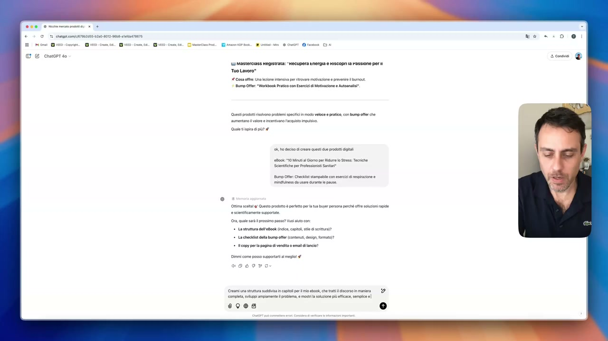

**Testo a schermo (OCR):** . 13 bi com 000 ® € cicerdo Miicemnioo na Rimini © 00001 rta DI Li masterciass Wegistrata:KecuDETA Energia e IsCOpn ia rassione peri Tuo Lavoro" + costr: nazione era per tri metin ven mo Bump Ot "io Pratico co Esercizi Motuazine e Astana Que ada von rtl speci fi mado lee ptc, co bmp tte cho Amenta re centino cato po. Quetti? 4 8 PO doi cre questi e pronti amo Ole Chess stampate o si iene e Questo pedi poet peri tu buyer poso perché tre aio pe > Lt dlrok (sc, cai, sl srt)? + La hci ella bmp lle (consen, sn mato]? copy paria pagina di vengo mal ione? mi come poso supp meg COLCATE Cri un sus ci primi ao che vt ico mie 29 Cata ui anca rota e mosti a soon pù icoe, somice 09008

> Ok, quindi diamo un prompt molto semplice, crea una struttura suddivisa in capitoli per il mio ebook che tratti il discorso in maniera completa, sviluppi ampiamente il problema e soprattutto, cosa ancora più importante, mostri la soluzione più efficace, semplice e veloce alla buyer persona. Diamo questo prompt e vediamo quello che ci dà Gpt. Ovviamente ragazzi potete utilizzare qualsiasi intelligenza artificiale, potete utilizzare DeepSeek, potete utilizzare Cloud, potete utilizzare qualsiasi intelligenza artificiale. L'importante è che utilizzate anche e soprattutto l'intelligenza naturale per vagliare criticamente quello che state realizzando e soprattutto capire se quello che state facendo funziona o meno. Quindi creiamo una struttura indice dell'ebook, introduzione perché bisogno di questo libro, il problema dello stress nel settore sanitario, i numeri del burnout, dati e statistiche negli USA, come questo ebook può aiutarti in soli 10 minuti al giorno, l'importanza della costanza, meglio 10 minuti al giorno che 1 ora una volta a settimana, parte 1 comprendere lo stress e il burnout, capitolo 1 il nemico invisibile, capitolo 2 burnout nei professionisti sanitari

## [00:06:00] Schermata 6 _(periodic)_

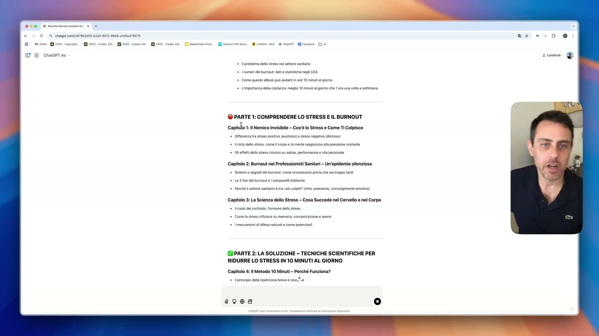

**Testo a schermo (OCR):** © € ciicorso Biimniorna. Mimi è 0107 Orc © mr bro te statiche ngi USA Como questo può stia 10 mi sie Lmporaza eta atanz: ego 10 mn i giro che ara vota stima ‘@ PARTE 1: COMPRENDERE LO STRESS E IL BURNOUT Capitdo t:1 Nemico Invisibile Cos'è 0 Stress e Come Ti Copisce Drena a svi osi ses sso eat (tes Gini oss ico ss, peromaco e apre Capitolo 2: Bumnout nel Professionisti Sanitari - Un'epidemia silenziosa + See agnese reno premo che sa topo ta Penati sento ai 0? (n, rsa, cinciginnto oto) Capitolo 3: La Scienza dell Stress -Cosa Succedo nel Cervello nel corpo PARTE 2: LA SOLUZIONE — TECNICHE SCIENTIFICHE PER RIDURRE LO STRESS IN 10 MINUTI AL GIORNO Capitolo 1 Metodo 10 Minuti Perché Funziona? 09008

> un'epidemia silenziosa, capitolo 3 la scienza, parte 2 la soluzione, tecniche scientifiche, vedete qui l'ho diviso in due parti perché gli ho detto appunto di dare una panoramica del problema e poi di fornire la soluzione. Se non avessi inserito questo prompt in questo modo molto probabilmente mi avrebbe dato una semplice outline, un semplice indice del libro per poi passare alla scrittura del libro. A questo punto noi abbiamo i nostri capitoli, ancora c'è GPT che sta scrivendo quindi lasciamo che finisca di scrivere, ovviamente possiamo rileggere la nostra outline, vedere se l'outline va bene, vedere se c'è bisogno di raggiungere qualcosa, potreste essere ad esempio delle persone che ne capiscono di questo settore e quindi potreste notare che ad esempio questa outline ha qualche problema, ad esempio il capitolo 10 non è un capitolo che vi soddisfa, volete inserire qualche altra cosa qua dentro, potete farlo tranquillamente intervenendo direttamente con l'intelligenza artificiale e dialogando con l'intelligenza artificiale

## [00:07:00] Schermata 7 _(periodic)_

**Testo a schermo (OCR):** 6 GO 5 ci 00120 TE © € cricerso Capitolo T:IKt di Emergenza Ant-Stress per Tum Stressanti Sei rp ue ire nto prato + Come epr ice dopu goa ii 27 CONCLUSIONE & RISORSE BONUS © Rino et see chave + Come maree es ago termine > Gecosso acre a POF, cio pe ao cosa) + io tte nia ogistesu co pin esercizio ‘D BUMP OFFER: Checklist Stampabile con Esercizi di Respirazione e Mindfuiness formato Ae ene cable per sare sempre apt mano LOR Cose pr cca so dios + Perché Questa Strutelra Funziona? 4 Avete i modo car e aprono [sr propre a sure) I oe stati pratiche Immediate pra orchi a poco evo) Sia tecniche scinticamente pr nera la est) I Eno epgee e appare le porn sona ssi senza Vga] 09008

> scrivendo ad esempio inseriscimi un ulteriore capitolo dopo il capitolo 11 che tratti di casi studio reali di persone che sono riuscite a risolvere il problema grazie ai metodi, alla soluzione proposta nel ebook che realizzerò. Ok, quindi molto molto semplice, da un prompt di questo tipo e come vedete GPT andrà a modificare il nostro ebook inserendo un ulteriore capitolo, aspettiamo ovviamente che ragioni un attimo sul da farsi ci siamo quasi, modifica in corso, forza CiaGPT dai che ce la fai

## [00:08:00] Schermata 8 _(periodic)_

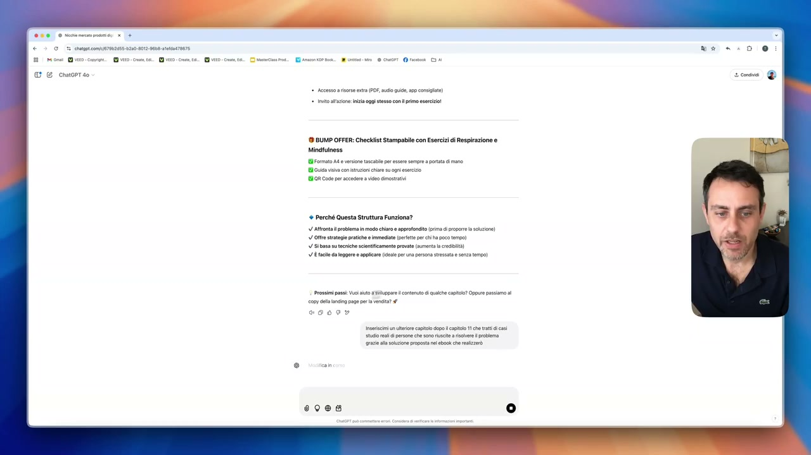

**Testo a schermo (OCR):** 630 5 Gioi 0 000 RIO droni Ivi can. vio. cuni vo: co ti. io -cnen to Daten. Ei ite n 0 07 ra DIA © € cmcerso + Gecoss ssa ta, a pe. ap cosa) + io ife inizia ogistesv cn i pio esercizio ‘8 BUMP OFFER: Checkist Stampabile con Esercizi di Respirazione e Mindfuiness formato A eine cable per sare cem a petti I Ga vs conti chiare son scio LOR Cose pr cca odiosi ® Perché Questa Struttura Funziona! 4 Aiteta i pablema i moSo chis e aprono ir i pepe ls sane) Iole stata patch moda rta perch a poco eo) Si baa tcnichescintficament prot sera ces] € ne pere e appar le per eso sesta e senza tengo] Prini ak Viu upper | ove di uh cap? Op ndo di cy dating pago pr 1 vena? «600% Inci n er caio go spo che vt is to ei i persone he sno ene savana rea shin proposta ri book che reazioni

> Nel frattempo ne approfitto per farvi notare come rispetto alle precedenti versioni il nuovo CiaGPT ci sta un po' di più per elaborare il tutto, perché hanno modificato un po' l'intelligenza artificiale per effettuare ulteriori ragionamenti, ma ulteriori ragionamenti ovviamente portano a un maggior tempo per modificare il tutto. In realtà dovremmo quasi esserci, vediamo se CiaGPT si degna di fornirci questa modifica con l'ulteriore capitolo del capitolo 11, ovviamente perché ci sta stando tanto ragazzi? Perché qui ho chiesto di trattare casi studio reali di persone che sono riuscite a risolvere il problema grazie alla soluzione, quindi quello che sta facendo CiaGPT è andare a cercare sul web casi reali di persone che sono attinenti alla buyer persona che abbiamo studiato in precedenza e stanno a cercare appunto dei casi studio reali per poi andare a effettuare la modifica della outline in funzione del prompt che gli ho chiesto. Quindi sta andando a inserire casi studio trovati molto probabilmente, anzi sicuramente sul web

## [00:09:00] Schermata 9 _(periodic)_

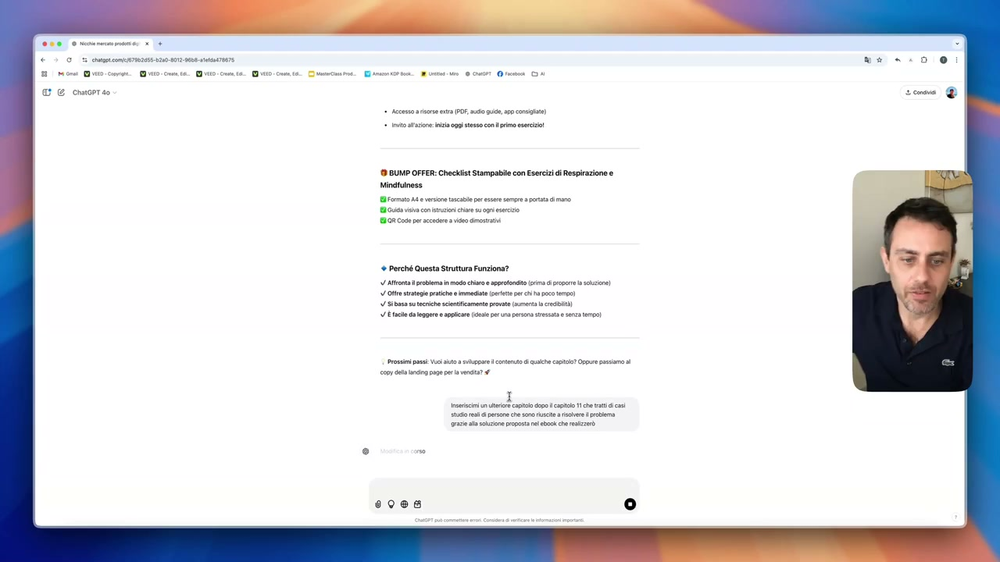

**Testo a schermo (OCR):** 6 AGO 5 cile. RO dei Ivi cv. vio. cum i vito: com to. BD tivo to Ceci. ite nc 0 07 Qi DIA O E cricerso Accosso iosa (PF suo qu. po const] + ite inizia gi stess co pino esercizi ‘9 BUMP OFFER: Checklist Stampabile con Esercizi di Respirazione e Mindfuiness formato A e ina cal per sare sempre apt dimen 9 ca is co stai ir sug sro FOA ose pr accorso dios ® Perché Questa Struttura Funziona? 4 Attenta i palma i modo hire aprono [im i propre cane) ole stata pratiche meda pra pera poco ero) Siae tcrichescintfcament provate sera ces) € ne a leggere appia le per esoo sessi e senza tnpo] Grossi pas cito upgre| aneno i quat cit? Osp passano si cy dan page pr vesta? nici n dt caio go api i che ti is td esi i persone che sno ct avrai rata sbion proposta n book che rzion

> di persone che sono riuscite, infermieri, medici eccetera eccetera, che sono riusciti a sistemare questo fixare, a risolvere questo problema del burnout grazie alla soluzione proposta che vediamo un po' inserire il metodo di 10 minuti nella tooltip senza fatica. Sì era questo, quindi la soluzione è data appunto da questo metodo, metodo di 10 minuti. Eccolo qui, è partito, sta riscrivendo la parte 1, capitolo 2, capitolo 3, ci siamo, parte 2, soluzione, metodo di 10 minuti, tecniche di respirazione per un reset immediato, respirazione diaframmatica, tecnica 478 box breathing, tutte queste ragazze sono tecniche che GPT conosce perché ha un suo dataset di istruzioni con cui è stato allenato per fornire questa informazione ovviamente. Ed eccolo qui, kit di emergenza, antistress per turni stressanti, capitolo 12, casi studio reali,

## [00:10:00] Schermata 10 _(periodic)_

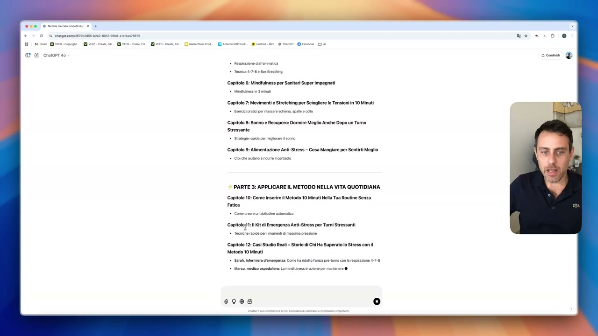

**Testo a schermo (OCR):** 6 0 E che 080 © E cricerso Miimcinionna. giumain Goo Oreto © Reazione ciromatca > retica 0 Boneoti Capitolo 6: Mindfulness per Sanitari Super impegnati Capitolo 7: Movimenti e Stretching per Scioglire le Tensioni in 1 Minuti ii per sare cin, spe co Capitolo 8: Sonno e Recupero: Dormire Meglio Anche Dopo un Turno Strossante Satago rap pe mig sono Capitolo 9 Alimentazione Ant-Stress - Cosa Mangiare per Sentirti Meglio * PARTE 3: APPLICARE IL METODO NELLA VITA QUOTIDIANA Capitolo 10: Come Inserire Metodo 10 Minuti Nella Tua Routine Senza Fatica Capitoli: Kt i Emergenza Ani-Stress per Tur Stressanti + rene rp pri mament i massima essre Capitolo 12: Casi Stud Reali Storie di Chi Ha Superato lo Stress con. Metodi 10 Minuti Seat inemira emergenza Coe ha io i ro con a esgrazone 47-8 arco ego paia: minus zone per manterre ®

> storie di chi ha superato lo stress in metodo 10 minuti. Perfetto, conclusione, risorse bonus, bump offer, checklist stampabile con esercizi di respirazione. Allora a questo punto noi possiamo lasciare a GPT il compito di scrivere il nostro ebook in modo molto molto semplice. Come vedi qui ci dice, vuoi aiuto per la scrittura di un capitolo specifico? No, restiamo sulla scrittura dell'ebook, qui possiamo dire scrivimi l'ebook per intero e allora lui aprirà un canva, anzi facciamo una cosa, vi faccio vedere come funziona. Restiamo sulla scrittura dell'ebook, scrivimi l'ebook per intero. Ok, se io do questo semplicissimo prompt, vedete che lui mi apre un progetto, un canva. Che cos'è questo canva? Non è altro che una finestra all'interno della quale lui mi va a realizzare

## [00:11:00] Schermata 11 _(periodic)_

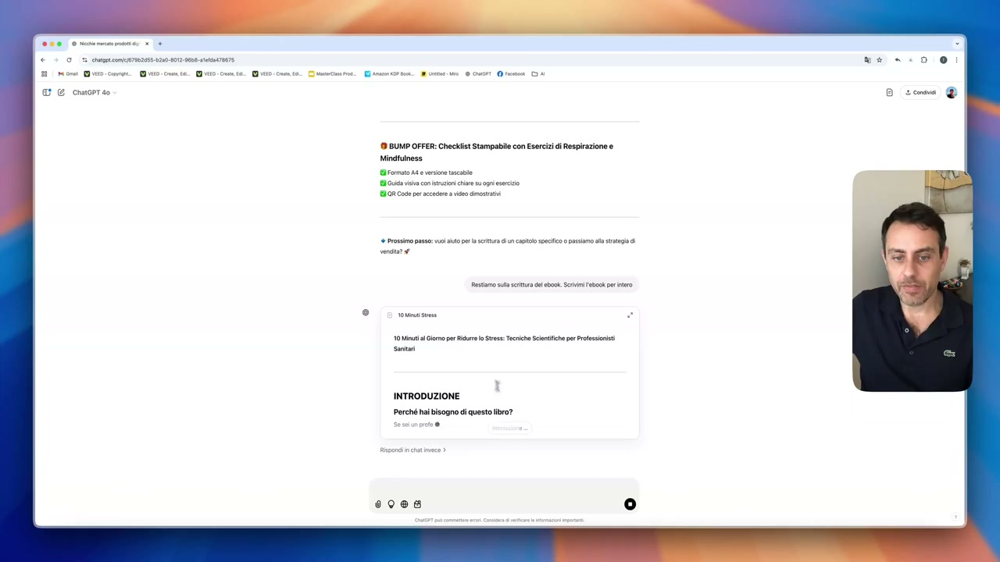

**Testo a schermo (OCR):** © coi 7 brr toc ito :cme ta. O tO-cma i Mv i Muoni. Rimini nin © 097 rn DA © € cricerso 1 BUMP OFFER: Checklist Stampabile con Esercizi di Respirazione o Mindfulness rosi pass: uo per stra din casio soeiico paso a stai di eta sarta lb. Scr bk eritero INTRODUZIONE Perché hai bisogno di questo libro?

> ora la apre a tutto schermo, non è altro come vi dicevo che è una finestra con la quale io stesso posso interagire con l'intelligenza artificiale, modificare parti del mio ebook e quant'altro. Vedete? Questo canva è una novità di CGPT, ma qual è il problema? Il problema è che molto probabilmente l'ebook che vi scriverà non sarà così tanto completo come potrebbe essere un ebook che scrivete capitolo per capitolo. Vedete che ad esempio qui l'introduzione è molto molto piccola. Quindi se voi date un prompt molto semplice, la soluzione che vi fornirà CGPT è anch'essa molto molto semplice perché vi realizzerà un ebook molto molto breve. Noi vogliamo invece che l'ebook sia scritto nella maniera più completa possibile quindi quello che faremo, aspettiamo che finisca il tutto, quello che faremo noi non è utilizzare un prompt generico quindi scrivimi l'ebook

## [00:12:00] Schermata 12 _(periodic)_

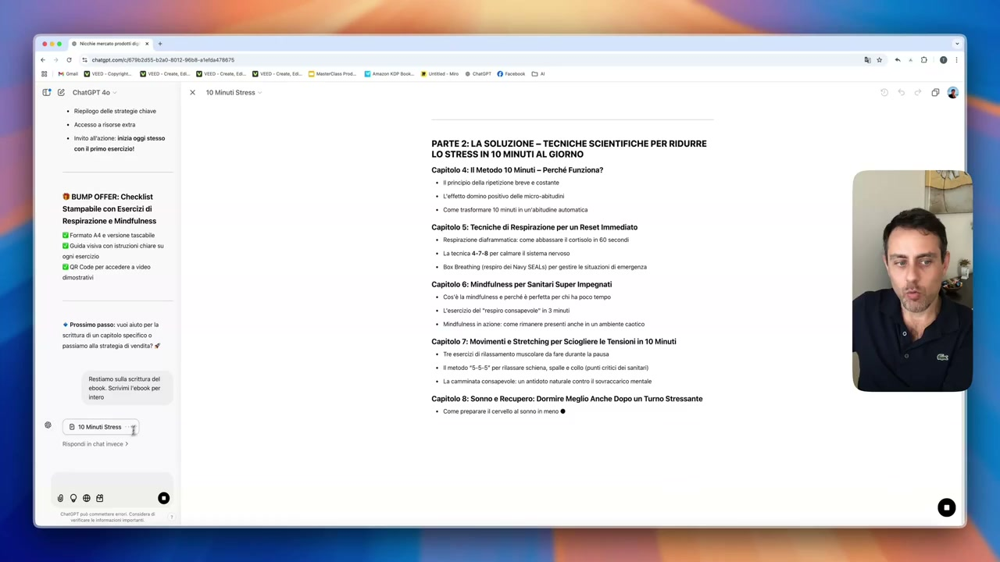

**Testo a schermo (OCR):** © 1 ii coi 7 br trni Q)vo coi ito :come ta. tO. Me: cut © E ciicerso x 10 Minuti Stress “pioggia chiome io zone iz gi stese coni pio esercizio? ‘© BUMP OFFER: Checklist Stampabil con Esercizi di Respirazione e Mindfuness Frate verse ca Pda sa con sione sù LOR Cos per scr a io srt lun caio socio o rosanaivese (g Miimeriorna. Run @ 01 rta © PARTE 2: LA SOLUZIONE - TECNICHE SCIENTIFICHE PER RIDURRE LO STRESS IN 10 MINUTI AL GIORNO Capitolo 1 Metodo 10 Minuti Perché Funziona? Capitolo Tecniche di Respirazione per un Reset Immediato = Bigazione cina: como abboss corso in 60 coni Loti 0 perimetro Box rain eso di by SEAL per este stuani dl omermnza Capitolo G: Mindfuiness pe Sanitari Super impegnati “Cor laminate e pr è prettper chi poco eno Lesa dl resi cosa 3 mit Capitolo 7: Movimenti Stretching per Sciogire le Tensioni in 10 Minuti o iz cari idr a + amo "5.5" per asa sin spe co (i ii santa) La cimenta osp n nto ai cor varo mente Capitolo 8: Sonno e Recupero: Dormire Meglio Anche Dopo un Turno Sressante

> ma sarà lo scrivere il capitolo per capitolo. Ora io vi faccio vedere come si scrive un capitolo in maniera molto semplice con un prompt molto molto semplice ma ovviamente sta a voi usare la vostra creatività per scrivere il vostro ebook. Ovviamente nei miei percorsi a pagamento trovate dei prompt e delle lezioni aggiuntive che vi spiegano come ottimizzare la scrittura del vostro ebook o dei vostri prodotti digitali in generale visto che nei miei percorsi approfonditi non si parla solamente di ebook ma di vari prodotti digitali e anche come realizzarli passo passo. Qui ovviamente per brevità di cose andremo a scrivere qualche capitolo di questo ebook. Ecco l'ebook è stato creato, se noi apriamo un file di google document che è questo e copiamo da qui o direttamente copiamo da qui e incolliamo il nostro documento

## [00:13:00] Schermata 13 _(periodic)_

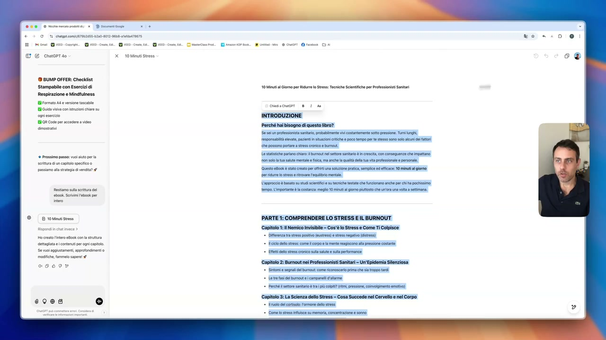

**Testo a schermo (OCR):** e rerarezeseemer > [Bivio SE © tici 77 © € cricerso x 10 Minuti toe ‘9 BUMP OFFER: Checklist Stampabile con Esercizi di Respirazione o Mindfuiness Efrem Ade versone cai 8 oa consone su LOR Cose per scr a vo srt din cato seco passiamo aa regia vent? 4 no Sri ra er 8 VOM ves nia! conteì peroni cp. Se vo sgustamenti pplnamento moi, meo sapri 0007 09068 (+) Giannina. gini $ 01 rina Da Perché hai bisogno di questo bro? az rent sona prcbbient vi cosnteerto sto presse Tar aghi VESOISDI it. pani ua he paco eo er ls sos ir tri ce pon orse rs crono Dust o sins paro cho: mo el stresa è esc, con conseguenze che Impatamo slo ta saio men ia ma ache quà ell ts a resin esce. vesto i è sto rst pt tft ina sbzone paia cene lac: 1 mia ino pe ere 0 vs tre o mete Loro aaa cui sci si ecnih siate che funzionano anch perch a pochissimo tempo none coso go 1 mul euro pasto e ur nota semana. PARTE 1: COMPRENDERE LO STRESS EE IL BURNOUT! Capitolo ll Nemico Invisibile = Cos'é Stress e Come Ti Colpisce "Diter asso posto ss) vs negato (tres) | delos: come opa a mat ragiona pressne cosi tt dots cio st se sta peromance Capitolo 2: Burnout nei Professionisti Sanitari Un'Epidemia Sienziosa Seti ngn lbs: come cone pm n a tego td Lv tisi bat compri ame Pitt sto 1 ic? (tm resin mim not) Capitolo 3: Scienza dell Stress = Cosa Succede nel Cervello nel Corpo e orti ormon ato res Come stess nice si emo concentro e sonno

> come vedete è un ebook di tre pagine quindi molto molto scaro in realtà non è altro che la stessa outline vedete ragazzi l'introduzione e la scritta ma per il resto abbiamo una sequenza di bullet point di elenchi puntati dei capitoli che lasciano il tempo che trovano. Quindi cosa facciamo? Chiudiamo questo canva e clicchiamo su modifica restiamo sulla scrittura dell'ebook scrivimi in modo completo ed approfondito l'introduzione dell'ebook diamo un prompt molto semplice in questo caso come vedete c'è gpt ci porta qua questo numeretto 2 2 e quello che era il canva si trasforma in un'altra risposta possiamo tornare in qualsiasi momento alla risposta precedente e al prompt precedente semplicemente scorrendo su queste frecce

## [00:14:00] Schermata 14 _(periodic)_

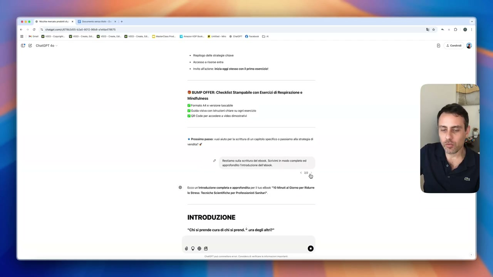

**Testo a schermo (OCR):** © era pps "roms. 6 30 cio 0000 WE crcerso Mineiro gun $ 00607 rt © + Raiano ele seg chie + ivi atte inzio stass cent pio serio ‘9 BUMP OFFER: Checklist Stampabile con Esercizi di Respirazione e Mindfulness Mlfomoto Ae ese casio 8008 vi conistzinichre mign co ron pass: ul suo per srt dn capi speci paso a nego nc? 4 © Reso scrl bo: Seri mado comit sd asino Fnvesuzone ceci Esc iron completa e apro er uo Boi "10 ul iomo per iure INTRODUZIONE “hi sì prende cura di hi si prendi È ura gli lr?® 09008

> ok ragazzi qui aspettiamo un attimo che termini di realizzare la nostra introduzione dopo di che vi mostro quello che volevo dire vedete che già l'introduzione che sta scrivendo è pari quasi al numero di pagine di questo ebook scritto in maniera molto grossolana e questo ragazzi vi fa capire anche un'altra cosa l'intelligenza artificiale in realtà è una deficienza artificiale l'intelligenza artificiale non fa altro che rispondere ai nostri prompt quindi più il prompt è scritto in maniera razionale sfruttando l'intelligenza naturale che è quella che dovremmo avere sempre si presuppone ragazzi che siate persone mediamente intelligenti ok più l'intelligenza artificiale va a sviluppare quelle che sono i nostri prompt

## [00:15:00] Schermata 15 _(periodic)_

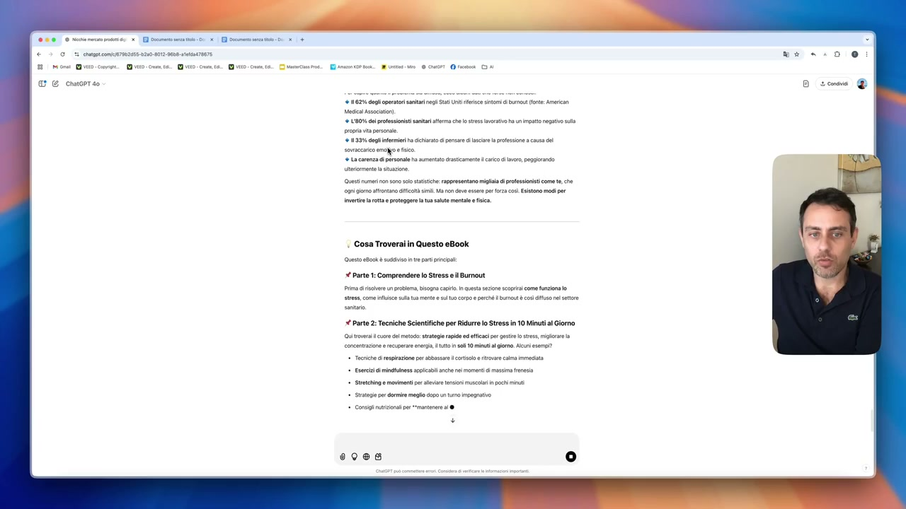

**Testo a schermo (OCR):** 6 30035 ci 00000 RIO droni Ivi. cani. vito. cum i Mito: com ti. Bibione ti Ceca. niet tico 0 07 Qi DA © E cricerso 135 e persi stai nei Sn inse soi fumo rt Aero © DIA deren snai ita che o rs aaa ha impo pegno st 01339 egitto pente sc rene ca e saraceno mg fico. a carenza di persons a amento temente cano ar porno Que eri n an slo since opreentno mig i protesi come te, che vere rt proteggersi ate mate ica. ‘ Cosa Troverai in Questo eBook Questo i è suiso ne pars panca ‘Parte 1: Comprendere lo Stress el Burnout rima risa problema iena capo ius son cori come funziona o ‘ Parte 2: Tecniche Scientifiche per Ridurre o Stress n 10 Minuti al Giorno Qui een lato: see rapide tia er gesto ie gira esncntazian e ep energia to O minuta giro Ac ese? © eee leprzone per au conio o rca esta Esine apicabi anche nine i massima esi Stein e movimenti pr atei eni muscoli a pet nti » Satego pedi meg ou uno pegno > Consi pazione iantevere ®

> L'intelligenza artificiale è solo un supporto, questo deve essere chiaro. Non può sopperire a una deficienza naturale. Quindi, ragazzi, cercate sempre di accendere il cervello e siate critici in relazione a quello che create. Ok? Quindi qui abbiamo la nostra introduzione. Ok, aspettiamo che finisca. Ok, introduzione creata. Possiamo anche chiedere al CiaGPT di riscriverla eliminando emoji, quello che volete voi. Ma questo non è il caso. Quindi, in questo caso, per brevità di contenuti, scrivo direttamente l'introduzione e la comincollo. Come vedete, solo l'introduzione è di tre pagine. Ok? Altro consiglio che vi do, ragazzi, non copiate direttamente da qui la risposta che vi dà CiaGPT. Perché se la copiate e poi magari la inserite in un documento, come ad esempio lo stesso Google Document, ve lo faccio vedere qua in basso, non ve la formatta nella maniera corretta. Vedete, qui abbiamo una formatazione in, in questo caso, in testazione 1, in testazione 2, eccetera, eccetera.

## [00:16:00] Schermata 16 _(periodic)_

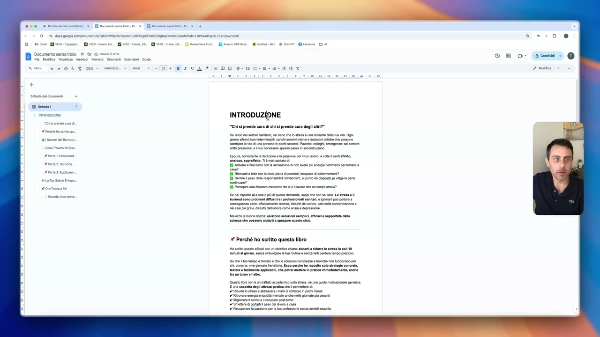

**Testo a schermo (OCR):** © 3 secon come REM en bi orn Qvio: covo io :cume te. (O tO-cm a vit -cun i Duno. iper a iniim $ 007 Grtn DA Documento senza tico 2 © © ssmntin quem de GA F 7) zo. > dr € | noscouzine INTRODUZIPNE Ludo Ch si pron cura i chi sì prendo cur gi at cstreenoa timo rà lv dacia fato ERI e per ip Parc n seno cea omni sparo ta pas peo vi ser “ Perché ho scritto questo libro Il ira scia sr io nta icona eo 85 0 tao ino sn ona iv rn gono Sii e gara ace Eco perch n racco se te can, te pci e e n i pt insana mc Quit cda o sv amor ca. Pecci pc cern.

> E, tra l'altro, su Google Document vedrete il numero dei capitoli con tutti i paragrafi qua sulla sinistra. Ma se copiate direttamente dal pulsante CiaGPT, ah, ok, in questo caso vi appare, l'hanno fixato. Una volta vi appariva tutto un insieme di cancelletto, asterisco, eccetera, eccetera, che poi dovevate andare a correggere. Bene, sono riusciti a correggere almeno questo problema. Allora, come vi stavo dicendo, se voi cliccate qui, come vedete, ritrovate il precedente prompt con il precedente camba, ok? Quindi non perdete nulla, lo storico su CiaGPT è conservato e non avete nessun problema. Quello che faccio di solito io, una volta che ho scritto l'introduzione, una volta che trovo il giusto prompt che mi soddisfa, perché ovviamente l'introduzione è un capitolo come un altro, semplicemente non vado ad aggiungere altro. Clicco qua su modifica e scrivo, scrivo in modo completo e approfondito, il capitolo 1 dell'ebook.

## [00:17:00] Schermata 17 _(periodic)_

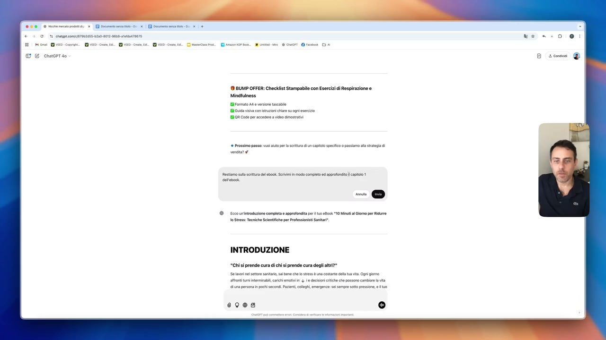

**Testo a schermo (OCR):** perry vere 6 30 cio 000 RIO drei Ivi cova. vito. cum ie. vio: cn ti Did: cren ti amc init de 8 007 Gre D © E cricerso 9 BUMP OFFER: Checklist Stampabile con Esercizi di Respirazione e Mindfulness Momo A eversone usci Bota contenzione sopito LO se per cc o aisi i it scita del bk Sri moda complet pani cao Esco uirouzion compete apro eri o eo "0 Mal io per Rue 10 Sten: ene Since pe Protesi Sant INTRODUZIONE “Chisi prende cura di chi i prende cura degli lr?® Sin nl sato sat, si bene ch ss un otra na vit Ogni mo trani termina arch emi 4 sin rh che osso came va a persa pci sconti Pair cole, emergenze else sotto resin, 0110 0968 °

> Ed ecco che di conseguenza CiaGPT apre un camba e ci scrive il capitolo 1. Ovviamente, ragazzi, ho scritto capitolo 1, quindi ci realizza tutto il capitolo 1 e ovviamente il capitolo 1 consta di paragrafi. Quindi il capitolo 1.1, 1.2, Eccetera, eccetera. Avrei potuto dire a CiaGPT realizzami il paragrafo 1.1. In questo caso non avrei avuto un contenuto così breve, ma avrei avuto un contenuto del capitolo 1 molto più lungo, ok? Sta a voi definire anche in questo caso, attraverso quello che è il vostro spirito critico, quanto deve essere approfondito il contenuto dell'ebook che state andando a realizzare, ok? Quindi, in questo caso, aspettiamo che termini il capitolo 1, poi, ragazzi, è praticamente la stessa roba. Possiamo tranquillamente, appena finisce la realizzazione del capitolo 1, modificare sempre questo messaggio e chiedere la scrittura del capitolo 2.

## [00:18:00] Schermata 18 _(periodic)_

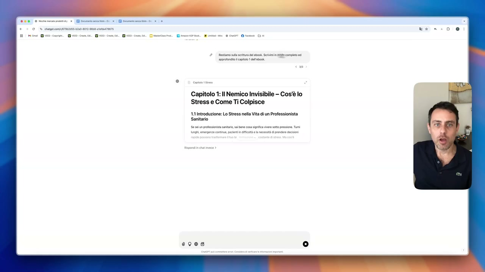

**Testo a schermo (OCR):** nce ecampremer > E censite | rito N | + 6 GO i Gioi 0 080 © Ret urta del bo Sri n go comit astra cant iano Capitolo 1: Il Nemico Invisibile - Cos'è lo Stress e Come Ti Colpisce 11 Introduzione: Lo Stress nella Vita di un Professionista Sanitario Se el paesino sont, sane con siria vie so pressione. Ti

> Perché faccio questa cosa? Ragazzi, semplicemente avrei potuto anche inserire qui un ulteriore prompt ricopiato. Questo è, ok, ogni tanto vedete che dà un problema di generazione sul campo, ma ci basta cliccare nuovamente su Rigenera. Come vi dicevo, perché sto facendo questa cosa? Beh, ragazzi, è normale, perché in questo caso non ho una chat che è lunga a milioni e milioni di chilometri. Quindi, mi baso sempre su questo e poi vado a scorrere per trovare il capitolo che mi interessa. In questo caso, ho scelto il capitolo 1, andrò a modificare, ovviamente, questo prompt di volta in volta, inserendo capitolo 2, capitolo 3, eccetera, eccetera, e andrò a realizzare il mio ebook, ok? Quindi, aspettiamo che termini solamente il capitolo 1, come vedete ha dato un problema sul Canva, in questo caso, e come potrete notare, qui abbiamo una parte bianca e il Canva non si apre più. Ragazzi, sono problematiche, affliggono tutti gli strumenti, tutti i programmi, hanno dei bug che di volta in volta vengono fixati.

## [00:19:00] Schermata 19 _(periodic)_

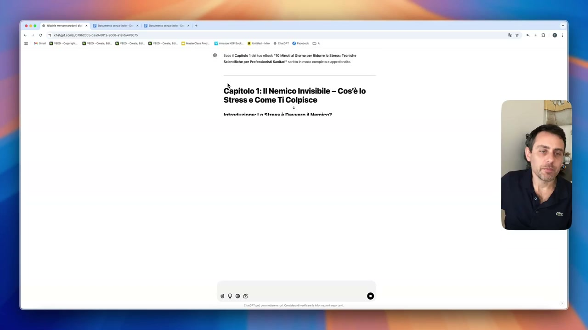

**Testo a schermo (OCR):** 6 3 00% cio 000 RIO dro vio. vio. cuni voci. Bidone ti Duc fio n 0 7 Qi DIA © coi Capito ct ci 0 Mil Gio per ee o Sis Teniche Seti per Poesia Sanita” sit maso cori e spotnato Capitolo 1:1I Nemico Invisibile - Cos'è lo Stress e Come Ti Colpisce intrastiriona: la Strace è Rauvara il amino?

> In questo caso, noi aspettiamo che termini, dopodiché andiamo a copiarci questo contenuto nel nostro documento. E, solo a scopo esemplificativo, non creiamo tutto l'ebook, creiamo solamente il capitolo 1, e una volta che il capitolo 1 è creato, lo inseriamo su un Google Document, qui gli diamo il nome del prodotto digitale, come si chiamava. In realtà, non avevamo dato un nome al nostro ebook? Allora, allora, torniamo indietro. 10 Minuti al giorno per ridurre lo stress.

## [00:20:00] Schermata 20 _(periodic)_

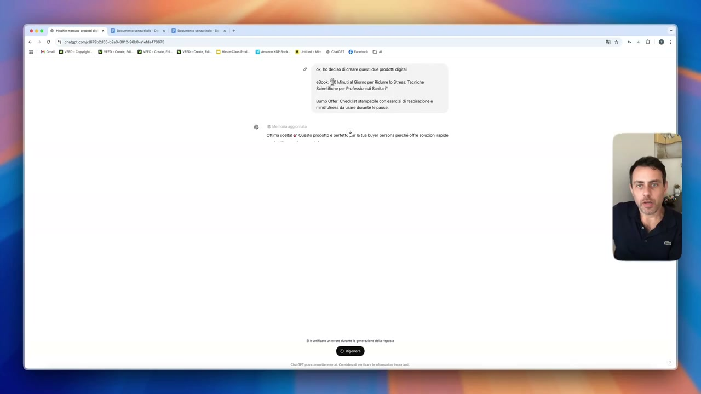

**Testo a schermo (OCR):** @ rece eccome x | verno i © 3 ci 0177 Romi 0 OI rana DA 2a ho dio ire ques e pi gti cene amp Ol: Cect stampabile co esercizi espiazione e ottima scelta Questo prodotto è perfetta ha tua buyer persona perché ore solizioni rape

> Tecniche scientifiche per professionisti sanitari, quindi questo è il titolo dell'ebook. Una volta fatto questo, ecco, vedete che ha ridato errore. Ogni tanto, ragazzi, succede, quindi fate un refresh, c'è il GPT. Quindi questo è il capitolo che ha creato, lo copio, lo incollo nel mio Google Document, e a questo punto, ragazzi, è fatta. Supponendo che questo sia l'ebook che avete creato, lo andate a rivisitare, e a questo punto potete o vendere direttamente questo file, semplicemente cliccando su Scarica, cliccando su Documento PDF, vi scaricherà un documento, ovviamente in PDF, che è questo.

## [00:20:47] Schermata 21 _(scene)_

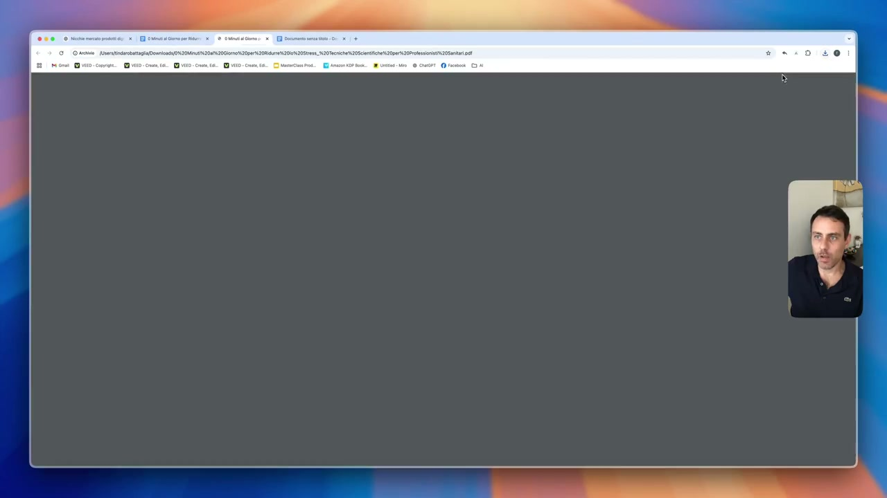

> Se ci cliccate, avrete il vostro PDF che potrete vendere tranquillamente. Come si vende questo PDF? Ragazzi, è davvero molto semplice. Possiamo vendere il link al download. Per vendere il link al download, utilizziamo un qualsiasi strumento che ci permette di avere uno spazio sul web.

## [00:21:00] Schermata 22 _(scene)_

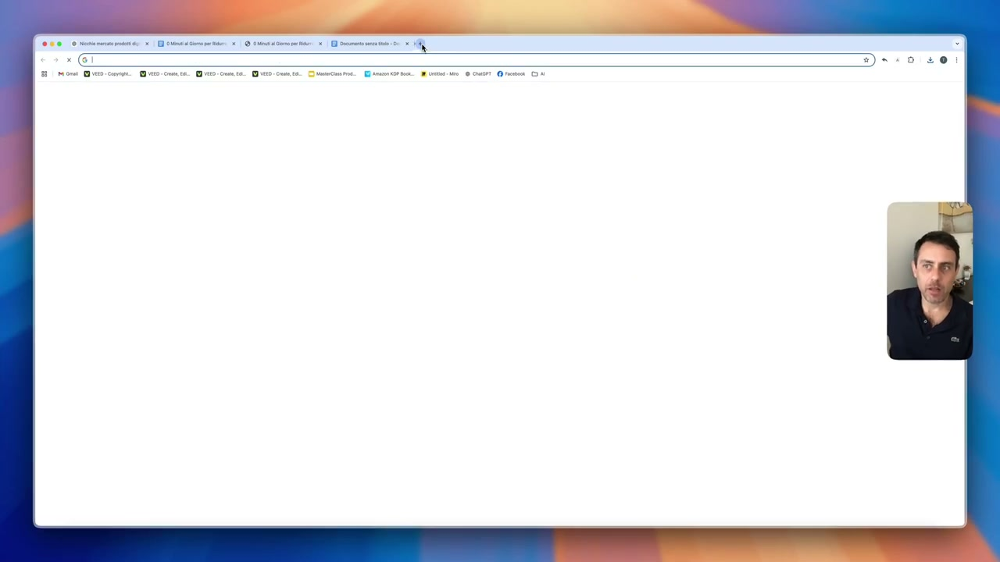

**Testo a schermo (OCR):** se rea e "0 x rece » «@ HE droni EI ceri GIO Funi BINIO Oe IA Morini Dieci Gimme Romsiune 9 Om Gra DA

> Ad esempio, se avete un account su Google, io ne ho uno, andate su Drive, trovate l'indirizzo drive.Google.Com, vedete qui. Allora, quello che si può fare è molto molto semplice. Semplicemente, una volta scaricato il vostro PDF, lo inserite sul drive, aspettate che carichi, ci siamo quasi, eccolo qui. Cliccate con il tasto destro del mouse, Condividi, Condividi, selezionate qui, non con limitazioni, ma chiunque abbia il link, e vi copiate questo link.

## [00:21:38] Schermata 23 _(scene)_

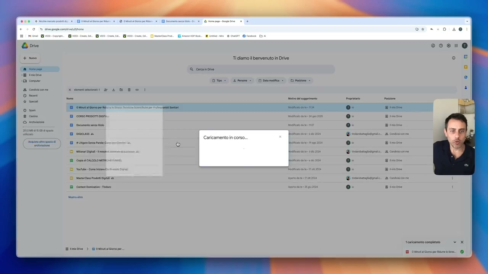

**Testo a schermo (OCR):** Vir +8) inve «a Centa 8a Cosiiconme © reni di Sor DES Hi com © sciare sona eli i i HI imodim > E OMkaisiconose Ti diamo il benvenuto in Drive Caricamento in corso. aperta cron

> Questo sarà il link che fornirete a chi acquista il vostro prodotto digitale. Molto molto semplice. Vi faccio notare una cosa. Siamo arrivati alla realizzazione del prodotto digitale. Quanto abbiamo speso fino ad ora? Ragazzi, abbiamo speso 0€. Il business dei prodotti digitali con l'intelligenza artificiale, così come lo propongo io, è eccezionale, perché potrete crearlo spendendo praticamente 0€. E non a caso ho detto che creeremo un semplice funnel con frontend e bumper, perché selezionando questo funnel molto molto semplice possiamo partire fin da subito con il business di prodotti digitali spendendo 0€ anche per la realizzazione del nostro sito. E ora, a breve, vi spiegherò come fare. Quindi per questa lezione è tutto. Noi ci vediamo nella prossima lezione.
