# Creazione dello store digitale

> Documento generato automaticamente: trascrizione e screenshot sincronizzati del video-corso.

## [00:00:00] Schermata 0 _(start)_

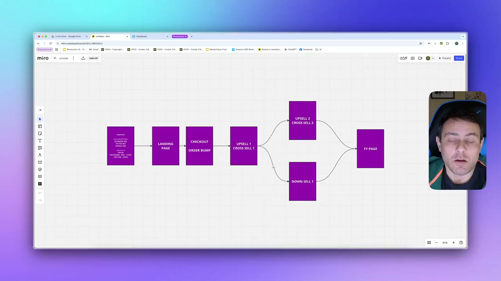

**Testo a schermo (OCR):** vesez oss sELL2 Lanome. SAI vesetLI PAGE ae cROSSSELLA C) o T E) A n ® ® C)

> Quando abbiamo parlato di vendere prodotti digitali abbiamo mostrato un grafico di questo tipo e abbiamo detto che la strategia migliore che almeno io suggerisco quando dobbiamo vendere prodotti di natura digitale è appunto questa, quindi la strategia basata sulla vendita a funnel. Abbiamo visto anche in cosa consiste, quindi consiste nel creare una pagina di vendita che si può tranquillamente anche creare con l'intelligenza artificiale, nel creare un checkout e nell'inserire un prodotto a checkout per aumentare lo scontrino per singola transazione che abbiamo all'interno del nostro funnel, così nell'istante in cui l'utente acquista avrà la possibilità di acquistare un ulteriore prodotto digitale e di conseguenza ovviamente noi avremo un maggiore incasso. Avremo poi degli upsell, quindi dei prodotti aggiuntivi con un prezzo maggiore che andiamo ad inserire all'interno della nostra strategia di funnel. Abbiamo ulteriori upsell, abbiamo dei downsell, cioè dei prodotti che l'utente può acquistare nell'istante in cui non acquista il prodotto principale per tutta una serie di motivi, perché magari per lui il prodotto di

## [00:01:00] Schermata 1 _(periodic)_

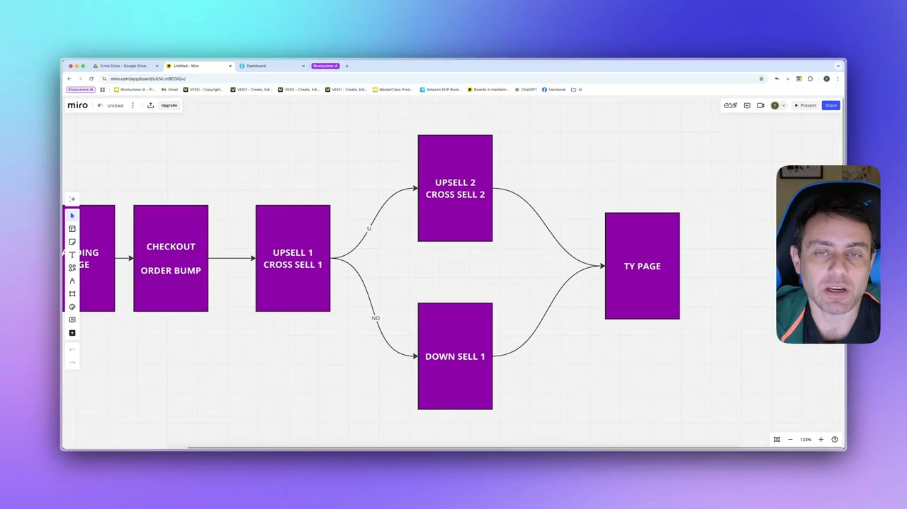

**Testo a schermo (OCR):** UPSELL 2 CROSS SELL 2 CHECKOUT UPSELL1 CROSS SELL 1 ORDER BUMP DOWN SELL1

> upsell costa troppo o perché magari non matcha con quelli che sono i suoi interessi e successivamente abbiamo la pagina di vendita. Ma fino ad ora abbiamo parlato della teoria, cioè come si vende un prodotto digitale attraverso una struttura funnel, ma addentriamoci adesso all'interno della pratica, quindi vediamo qual è il metodo che io utilizzo per creare funnel di questo tipo dal punto di vista pratico. Dal punto di vista pratico io utilizzo uno strumento che è uno strumento che ci permette di iniziare con la vendita di prodotti digitali a costo zero. Vi ripeto ragazzi, questo è il grandissimo vantaggio del fare business di prodotti digitali. Possiamo creare il prodotto digitale a costo zero con l'intelligenza artificiale. Abbiamo visto in questo corso come fare, almeno le basi su come fare, e poi abbiamo visto, o perlomeno vedremo a breve, come si può creare un sistema di funnel totalmente a costo zero. La soluzione che vi consiglio la possiamo ritrovare andando su questo link che è tindaro-battaglia.Com go-system.Io. Vi lascerò sempre il link qua in

## [00:02:00] Schermata 2 _(periodic)_

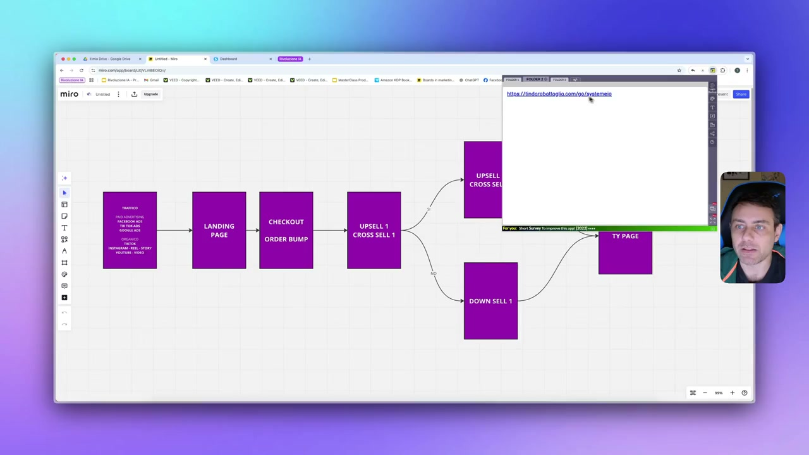

**Testo a schermo (OCR):** | miro e vue 5/2 0 LANDING Fi uPseLLI PAGE ARIA CROSSSELLI C) o T E) A n ® ® n DOWN SELL 1

> basso in descrizione, quindi non vi preoccupate, avrete tutti i link che vi servono, ma comunque potrete vederlo fin da subito, potrete digitare questa url nella barra degli indirizzi e arriverete al sistema di funnel gratuito tindaro-battaglia.Com go-system.Io. Ora ci clicchiamo e arriviamo all'interno dello strumento che io utilizzo quando di solito vendo prodotti digitali. Sistema.Io è un sistema che ci permette di creare siti web, ci permette di fare email marketing, ci permette di acquisire clienti, quindi un sistema crm. È un sistema totalmente completo ed è un sistema che ci permette, come vi dicevo, di iniziare praticamente a costo zero, quindi possiamo creare funnel di vendita, possiamo inviare email marketing, possiamo costruire siti web, possiamo anche creare un sistema di affiliazione interno, possiamo creare corsi online, quindi ulteriori prodotti digitali che possiamo affiancare al prodotto digitale di front-end, quindi il prodotto digitale che vendiamo

## [00:03:00] Schermata 3 _(periodic)_

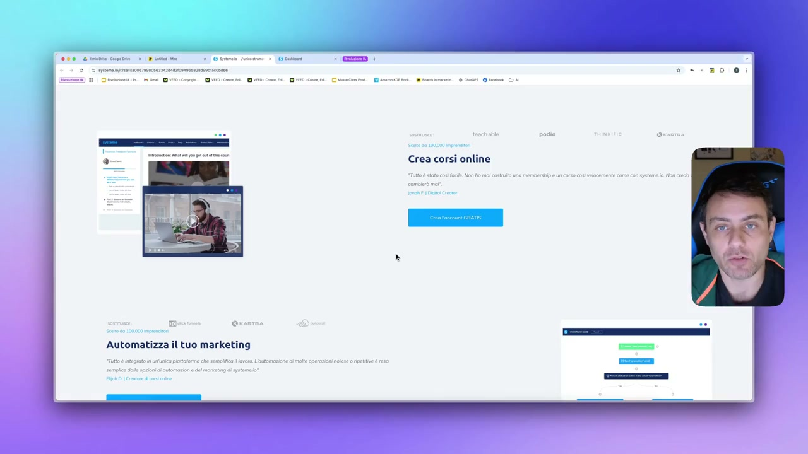

**Testo a schermo (OCR):** Crea corsi online Automatizza il tuo marketing

> inizialmente, e poi abbiamo delle automazioni di marketing. Perché dicevo che possiamo iniziare a costo zero? Perché se andiamo a guardare qui nella sezione prezzi vedremo che il piano iniziale prevede a 0 euro al mese ben 2000 contatti, invio di mail illimitate, funnel di vendita 3, 15 step del funnel di vendita, possiamo creare anche un blog, abbiamo possibilità di creare infiniti post all'interno del blog, un corso, possiamo avere studenti illimitati, possiamo anche creare una community, quindi possiamo ad esempio vendere all'interno del nostro funnel l'accesso mensile alla nostra community, che possiamo creare in modo totalmente semplice e veloce attraverso il sistema io, possiamo avere infiniti membri della community, spazio di archiviazione dei file illimitato, abbiamo una regola di automazione e poi l'integrazione se vogliamo con google sheet, quindi google fogli di lavoro, fogli di lavoro google, tag 1, campagna mail 1, insomma possiamo praticamente iniziare a costo zero. Tra

## [00:04:00] Schermata 4 _(periodic)_

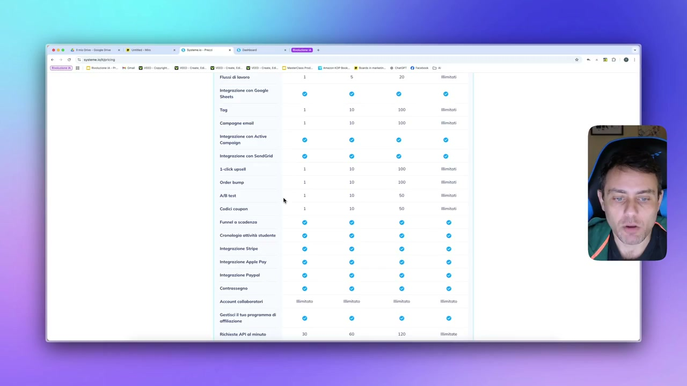

**Testo a schermo (OCR):** Integrazione Apple Poy Integrzine Pep

> l'altro nell'istante in cui iniziamo a fare flusso di cassa possiamo scegliere la soluzione startup a 27 euro al mese, che è quella che maggiormente si utilizza, che prevede 5.000 Contatti, email ovviamente sempre limitate, 10 funnel di vendita, ma la cosa che più ci interessa è il numero di tag, numero di tag perché con ogni tag noi andiamo a vendere un prodotto digitale a parte diciamo l'order bump che ora vi spiegherò all'interno di questa lezione. Quindi così possiamo praticamente iniziare a costo zero, quindi ci creiamo un account, io l'ho già creato, siamo all'interno della dashboard principale di sistema Yoki, come vedete è un dashboard molto semplice, qui sulla sinistra abbiamo i nuovi contatti, qui sulla destra abbiamo gli aggiornamenti live, quindi le vendite, persone che si iscrivono a checkout e quant'altro, mentre da questa parte, quindi andando sul sito web e cliccando su funnel di vendita, abbiamo la possibilità di crearci un nostro funnel di vendita vero e proprio. Ora io ne ho creato uno molto molto

## [00:05:00] Schermata 5 _(periodic)_

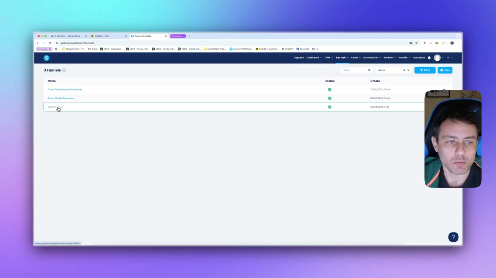

**Testo a schermo (OCR):** aFunnele

> semplice che tra l'altro è quello che ho utilizzato, un ebook funnel, come vedete se io clicco qua su ebook funnel mi si apre appunto tutto l'insieme di pagine, ricordate andiamo a vedere, qui ovviamente lo avevamo in orizzontale, qui lo abbiamo in verticale, ma poco cambia ragazzi, qui abbiamo una landing page che è questa pagina, pagina di vendita, poi abbiamo un modulo checkout che è questo modulo checkout, abbiamo un upsell e basta. Ok quindi mi sono fermato in questa sezione solamente a questa parte del funnel e poi abbiamo la pagina di ringraziamento che in questo caso non ho creato ma che possiamo creare praticamente in pochi secondi, poi abbiamo una privacy policy, una cookie policy e poi i termini e condizioni. Se andiamo all'interno della pagina di vendita e clicchiamo su modifica pagina, questo ovviamente è il link della mia pagina di vendita che posso utilizzare per ad esempio creare delle campagne su facebook e andare a pubblicizzare il mio prodotto, generare traffico sul mio funnel e se clicco su modifica pagina ci apre un editor, vedete che l'apertura, la

## [00:06:00] Schermata 6 _(periodic)_

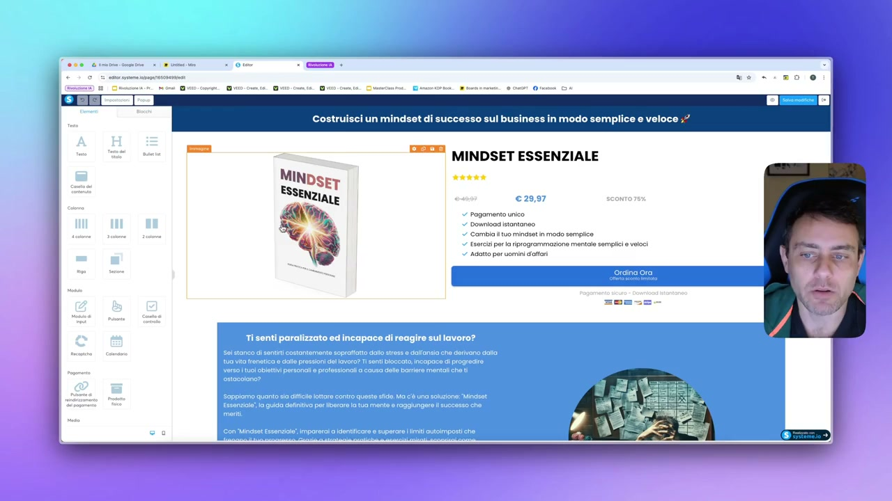

**Testo a schermo (OCR):** ‘un mindset di successo sul bi ss in modo semplice e veloce ;7 FSE IMINDSET ESSENZIALE MiNDg; sa ESSENZE 02997 < Pogamento unico Downicodistantoneo sii Cambia tuo mindeatin modo semplice sori pera programmazione mental sempe veloci adito per uomini otti

> chiusura, tutti i passaggi sono praticamente istantanei perché ovviamente sistema.Io non è una piattaforma al pari ad esempio di altre piattaforme come wordpress che richiedono che voi abbiate un server, che voi abbiate un sistema di hosting, che dobbiate mantenere il codice, le performance, no ovviamente sistema.Io è anch'esso un prodotto digitale ed è un prodotto digitale tipo sas, quindi un prodotto digitale tipo software as a service praticamente nel istante in cui ci creiamo un account lui va a clonare un'installazione di sistema.Io per il nostro, per la nostra azienda, per quelle che sono ovviamente le nostre necessità e come vedete l'apertura, la chiusura sono praticamente istantanei e un altro dei vantaggi di utilizzare sistema.Io è che non dobbiamo occuparci di tutti i tecnicismi di cui dovremmo occuparci se avessimo un sito web che ad esempio è stato creato in wordpress quindi a mio giudizio sistema.Io proprio per il fatto che è un sistema molto economico possiamo partire a costo zero e per il fatto che è un sistema che non prevede manutenzione, un sistema molto semplice nelle sue dinamiche è il sistema che io consiglio sempre di

## [00:07:00] Schermata 7 _(periodic)_

**Testo a schermo (OCR):** mes ‘ MINDSET ESSENZIALE Minpser PITTTI €29,97 < Pogomento unico Di Cambia tuo mindeatin modo semplice sori pera riprogrammazione manto sempii e veloci adito per vomini otti

> utilizzare nell'istante in cui ci approcciamo in realtà non tanto a un business di prodotti digitali, si possiamo utilizzarlo ovviamente per crearci appunto il nostro fan di prodotti digitali ma se andiamo qui potete vedere che sul sistema.Io possiamo vendere in realtà anche prodotti fisici, possiamo vendere corsi, community, possiamo inserire file, possiamo praticamente fare qualsiasi cosa quindi non solo per vendere prodotti digitali ma anche per vendere qualsiasi tipologia di prodotto. Detto questo clicchiamo su modifica pagina e come vedete accediamo all'editor di sistema.Io che ci permette di andare a creare materialmente senza conoscere una sola riga di codice quella che è la nostra pagina di vendita. Come vedete qui sulla sinistra abbiamo dei blocchi che ricordano soluzioni molto più blasonate diciamo così come ad esempio Elementor se bazicate con Wordpress sicuramente conoscerete questo famosissimo builder di appunto Wordpress che ci permette di costruire pagine di vendita in pochi clic e qui abbiamo la stessa cosa ma abbiamo la stessa cosa molto più semplificata.

## [00:08:00] Schermata 8 _(periodic)_

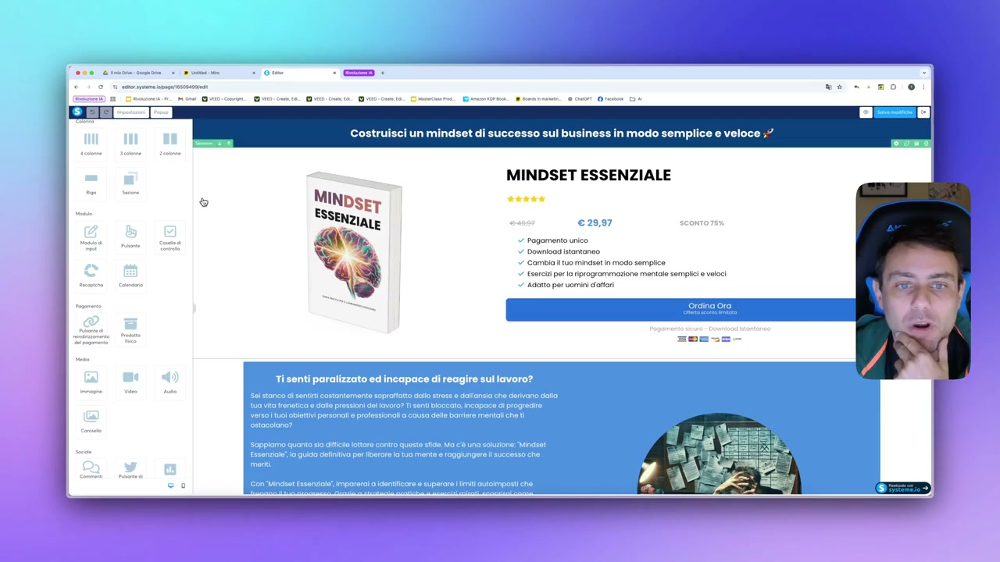

**Testo a schermo (OCR):** successo sul business inmodo semplice e veloce MINDSET ESSENZIALE VITTI < Pogomento unico Cambia i tuo mindsetin modo sé Esercizi perla programmazione | Aditto per vomini otti

> Sulla sinistra abbiamo un insieme di blocchi che possiamo praticamente inserire all'interno della nostra pagina semplicemente andando a trascinare ora io ne trascino uno giusto per farvi vedere come funziona e vedrete che non appena io lo trascino qui ho il mio blocco pronto e facendo doppio clic posso ovviamente inserire un testo esempio posso ovviamente agire all'interno del mio testo posso inserirlo come un testo selezionandolo di tipo h2 h3 h1 posso anche variare il colore del mio testo ovviamente devo prima selezionarlo come vedete posso fare praticamente qualsiasi cosa la posso fare in modo molto semplice e veloce qui lo rendo ineretto lo rendo incorsivo da qui possiamo agire sulla dimensione del font del testo possiamo cambiare il tipo di font per adattarlo meglio a quello che può essere la grafica della nostra pagina possiamo cambiare esempio anche lo sfondo se lo desideriamo del nostro testo e abbiamo

## [00:09:00] Schermata 9 _(periodic)_

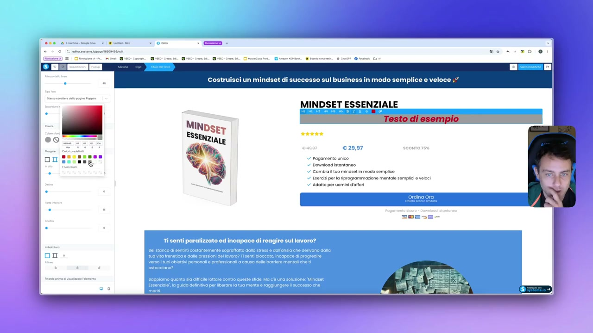

**Testo a schermo (OCR):** Minpser NZIALE semplice e veloce MINDSET ESSENZIALE | \-\ Testodiesempio ||/{/{ ___ ria 29,97 Rogomento unico Cambia tuo minds in modo semplice V Eserii per la riprogrammaziono mantalo sempii e volo Aditt per uomini tti

> tutta una serie di personalizzazioni che possiamo tranquillamente modificare nella porzione a sinistra del nostro schermo quindi all'istante in cui noi andiamo a selezionare come vedete uno dei blocchi questo ad esempio un blocco di tipo immagine ci siamo tutta una serie di proprietà sulla sinistra che possiamo modificare agevolmente possiamo cambiare allineamento possiamo cambiare dimensione dell'immagine e ovviamente questi blocchi queste proprietà scusate variano in funzione della tipologia di blocco che noi andiamo a selezionare possiamo anche eliminare un blocco o copiarlo salvarlo come template in questo caso a me non interessa quindi clicco qua e lo elimino è un editor molto molto semplice nel senso che noi possiamo tranquillamente spostare come vedete i nostri blocchi lungo la nostra pagina di vendita in qualsiasi momento andare a modificare la pagina di vendita così come desideriamo vi faccio notare che tutta questa parte di scrittura è stata realizzata attraverso l'utilizzo dell'intelligenza artificiale quindi anche in questo caso l'intelligenza artificiale c'è venuta in soccorso e ci ha permesso di realizzare una pagina di vendita in pochi semplici

## [00:10:00] Schermata 10 _(periodic)_

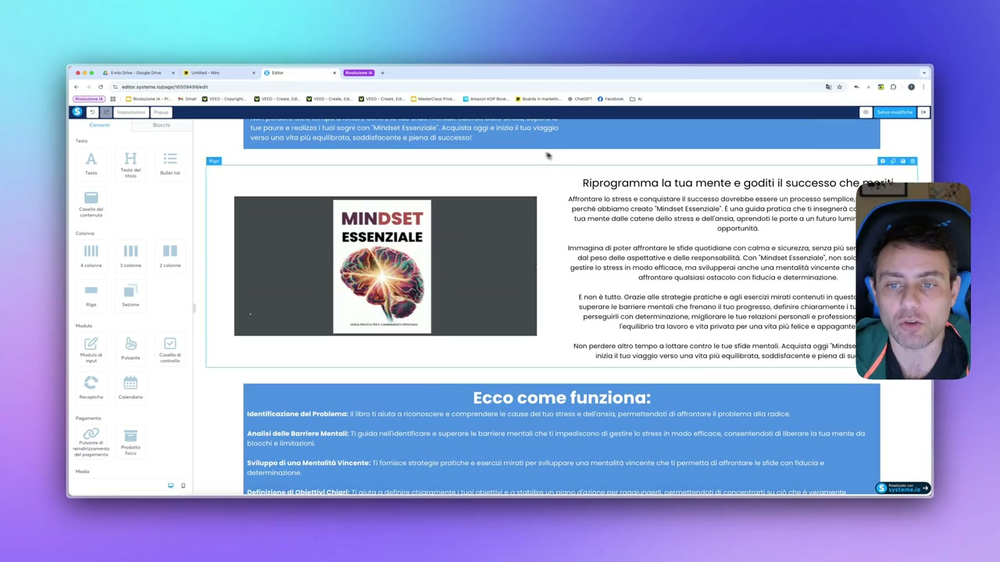

**Testo a schermo (OCR):** MINDSET ESSENZIALE Riprogramma la tua mente e godi Affrontore lo stress e conquistare successo dovrebbe esser un processo semplice porch abbiamo creato Minsat senzile È una quia pratica che tlinsogner iu mente dillo catene dello stress e dell'ansia, prendete porto 0 un futuro lumi opportunità Immagina di poor afrontre i tie quotidiano con alma e sicurezza enza più so col poso cell aspettative e del responssbità. Con Mindsot Essanzicle, non so gestio o stress n modo efficace, ma vluppera! anche una mentoltà vincente che] Enonè tuto Grazie all strtegio pratico agli esercizi mirati contenuti in quest ‘Superor e barioro mentali che renano uo progresso, defini etaramento i perseguiri con detorminazione, migliorare le te relazioni parsonali e proession Foquiibrio tr lavoro e vita privota per una ita più felice e appogante Non perdere tro tempo a lotto contro le tu sido menti Acquista oggi Mind Ina li tuo viaggio verso una via più equlrata sodcistocanta e piena di su

> istanti e soprattutto ci ha permesso di farlo a costo zero quando vi dicevo che il business di prodotti digitali il business più conveniente più snello delle sue dinamiche vi permette di partire con meno budget possibile intendevo proprio questo come vedete stiamo creando un sistema di vendita totalmente a costo zero una volta creata la nostra pagina qui abbiamo dei pulsanti che ci rimandano al checkout quindi andiamo a vedere il nostro checkout il checkout in questo caso è questo ma possiamo ragazzi andare a

## [00:10:28] Schermata 11 _(scene)_

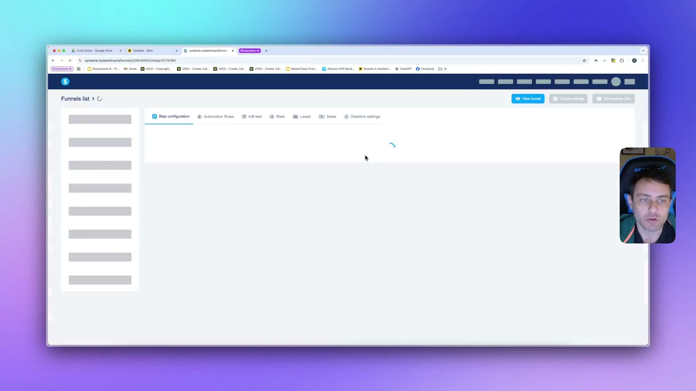

**Testo a schermo (OCR):** Funnels ist > © ssrortoni

> creare anche template possiamo sfruttare dei template per qualsiasi step del nostro funnel quindi se io qui inserisco uno step e lo chiamo ad esempio checkout test ok e scelgo come tipo di checkout come tipo di pagina vedete qui abbiamo un modulo d'ordine che è questo e clicco qui come vedete ci si apre

## [00:10:53] Schermata 12 _(scene)_

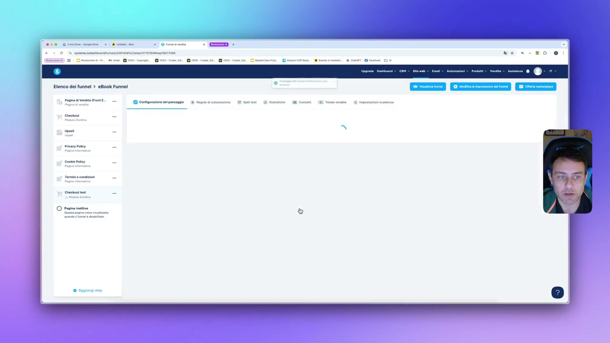

**Testo a schermo (OCR):** Elenco dei

> tutta una serie di template che possiamo scegliere per andare a creare un checkout così come una pagina di vendita così come una pagina di upsell o quant'altro in modo molto semplice e veloce quindi anche se non siamo dei grafici esperti se non siamo bravissimi nella grafica se non abbiamo mai creato una pagina di vendita un checkout molto semplicemente creiamo la nostra pagina qui all'interno dello step del nostro funnel così come ho mostrato in questo momento e poi ci si apre tutta una serie di template che possiamo selezionare con un semplice clic e importare all'interno la nostra pagina quindi se ad esempio io vedo questo, clicchiamo su anteprima per vedere come si vede questo checkout questo non mi piace tantissimo, vediamo questo, se ad esempio mi piacesse questo

## [00:11:40] Schermata 13 _(scene)_

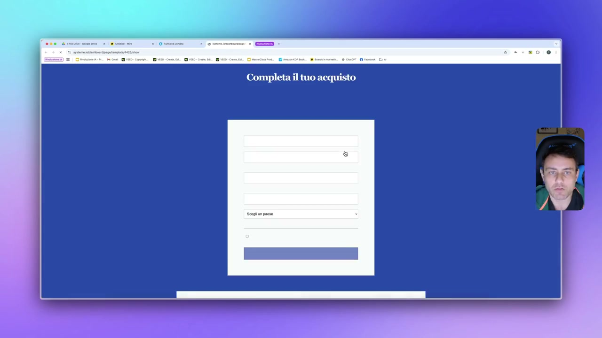

**Testo a schermo (OCR):** Completa il tuo acquisto

> modello non devo far altro che cliccare qui su seleziona e sistema.Io lo importa in un istante quindi se io clicco su modifica pagina vedrete che qui ho il mio

## [00:11:51] Schermata 14 _(scene)_

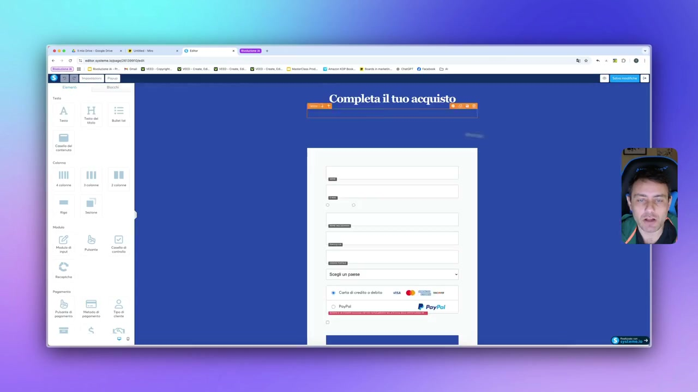

**Testo a schermo (OCR):** i Completa iltuo acquisto =

> checkout pronto e ovviamente ho la possibilità di cambiare qualsiasi cosa del mio checkout quindi se ad esempio io non voglio questo camp azienda semplicemente lo cancello perché non mi interessa partita IVA stessa cosa cap non mi interessa e in pochi semplici istanti ho creato praticamente un checkout a costo zero qui posso inserire anche del copy posso inserire delle testimonianze e posso inserire ovviamente un menù con tutti i vari link che mi ritroverò nella parte in basso del footer quindi del piedipagina del mio checkout quindi come vedete molto molto semplice salvo le modifiche esco e ho pronto il mio checkout come inseriamo il prodotto digitale all'interno del nostro checkout visto che non appena l'utente acquista ovviamente deve poter fruire del prodotto digitale intanto abbiamo la possibilità cliccando qui su impostazioni e recandoci qui su sezione sistemi di pagamento abbiamo la possibilità di collegare tantissimi metodi di pagamento ora nel mercato

## [00:12:51] Schermata 15 _(periodic)_

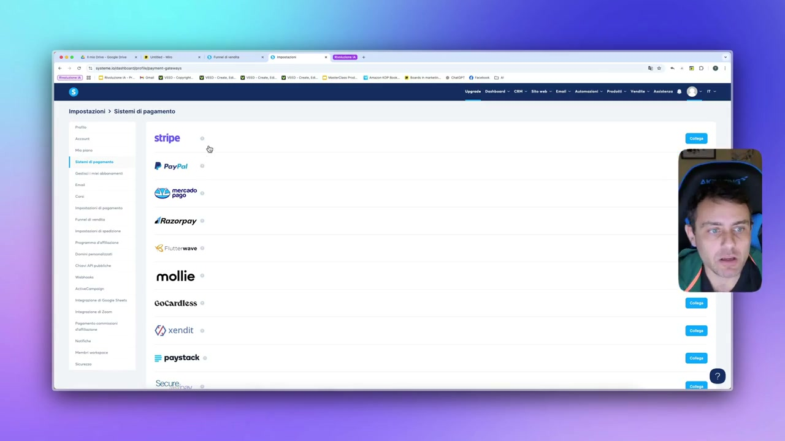

**Testo a schermo (OCR):** Impostazioni > Sistemi di pagamento

> italiano in realtà nella maggior parte dei mercati noi andremo a utilizzare stripe che ci permette di abbinare un sistema di pagamento con carte di credito o carte di debito e utilizzeremo paypal che è il sistema più diffuso quando si tratta di pagare online ok 7 dei prodotti fisici potreste anche optare per il sistema di contanti alla consegna quindi tenenzialmente inserite questo meno di pagamento l'utente acquista il prodotto fisico poi c'è ovviamente il sistema di spedizione il corriere in cassa e spedisce e consegna il prodotto al cliente finale non mi dilungo più di tanto sui su come collegare questi meno di pagamento perché è davvero molto semplice clicchiamo su collega seguiamo le istruzioni e arriviamo direttamente al collegamento del sistema di pagamento scelto con con ovviamente sistema io ok torniamo all'interno nostro panel di vendita beh come si inserisce un prodotto digitale ragazzi è molto molto semplice

## [00:13:51] Schermata 16 _(periodic)_

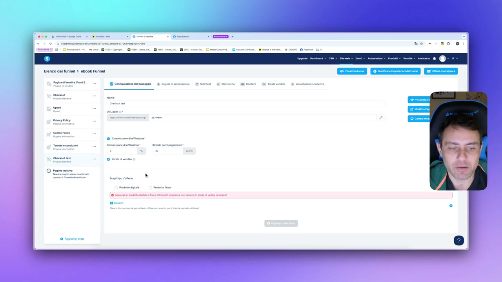

**Testo a schermo (OCR):** Elenco dei funne! > eBook Funnel!

> quindi siamo qui all'interno del checkout qui possiamo dare delle commissioni di affiliazione se lo desideriamo quindi come vi dicevo fornire un link affiliato a persone che venderanno i prodotti per noi e noi in cambio gli diamo delle commissioni sui pagamenti quindi ad esempio io voglio dare il 20% di commissioni e voglio che queste commissioni siano inviate automaticamente all'affiliato dopo 30 giorni tutto quello che devo fare è inserire qui un 20% e qui 30 giorni possiamo inserire anche dei limiti di vendita quindi per inserire un prodotto digitale qui selezioniamo prodotto digitale selezioniamo la tipologia di prodotto digitale se non abbiamo ancora creato il nostro prodotto da qui possiamo anche cancellare i nostri prodotti digitali ma se non ne abbiamo creato uno beh molto semplicemente dobbiamo cliccare qua e diamo un nome al nostro prodotto digitale ora io su google drive ne avevo creato uno che era litigare vediamo un attimo si litigare senza parole corso per genitori quindi io ho il mio bellissimo ebook lo chiamo appunto il nome del prodotto digitale

## [00:14:51] Schermata 17 _(periodic)_

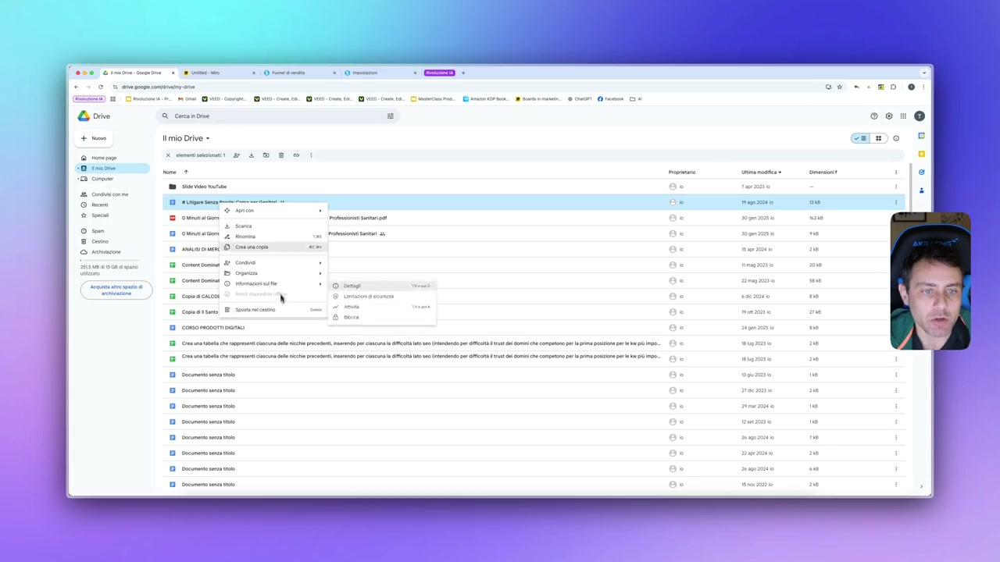

**Testo a schermo (OCR):** teeeegsrr= Boe @ coon ® ttmio Drive » 3 Gemini did GET mn seni © sic asian © Curia (TA

> sarà litigare senza parole A questo punto vado in risorse, seleziono il tipo di risorsa per vendere un prodotto digitale tipo ebook che non sia un corso, un pacchetto di corso, una community, devo selezionare un tag, quindi devo creare un tag andando nella sezione crm tag, vi ricordate che il piano gratuito è limitato a un solo tag quindi qui inserirò, vabbè qui avevo creato il tag per clienti mindset essenziale, utilizzerò questo ma è giusto per capirci ragazzi. Una volta fatto questo seleziono piano tariffario, pagamento, possiamo scegliere il pagamento natantum, un pagamento in abbonamento o un piano di pagamento rateizzato, io qui seleziono il pagamento natantum e il piano di pagamento. Se non l'hai creato puoi crearlo direttamente da qua cliccando su creare uno nuovo e qui selezioniamo il nome, litigare senza parole, nome del

## [00:15:51] Schermata 18 _(periodic)_

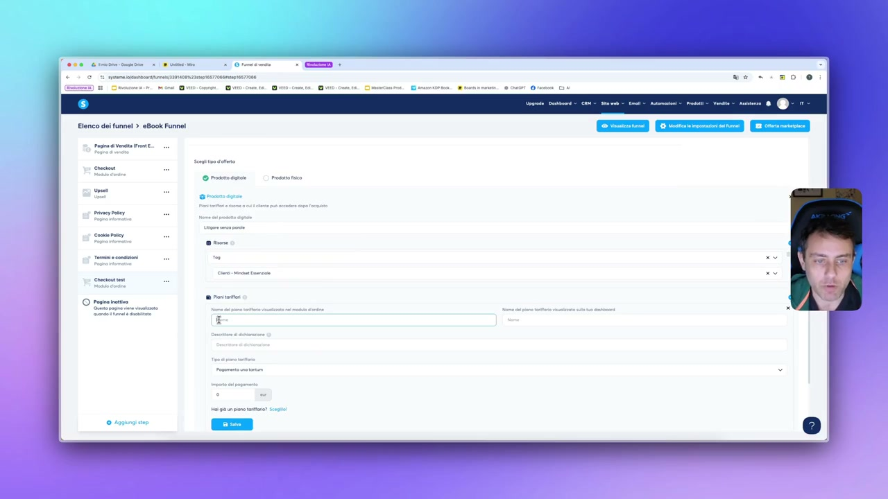

**Testo a schermo (OCR):** Elenco dei funnel > eBook Funnel! © Pri cero

> piano tariffario visualizzato sul lato dashboard, qui lo chiamo sempre litigare senza parole, descrittore di dichiarazione, quindi questa è una breve dichiarazione di quello che acquisterà l'utente, lo chiamiamo sempre litigare senza parole, qui l'importo del pagamento che può essere ad esempio 49 euro, clicco su salva, ho creato il mio checkout impostato col mio prodotto digitale, a questo punto clicco su salva, le modifiche sono state create e a questo punto il mio prodotto digitale è stato inserito al checkout e nell'istante in cui l'utente acquista, ovviamente andrò a sostituire questo checkout con questo checkout visto che in questo funnel ho inserito ovviamente il mio mindset essenziale che era quell'ebook che stavo vendendo, nell'istante in cui l'utente acquista noi molto semplicemente andiamo nella sezione automazioni, diamo un po' flussi di lavoro e abbiamo un flusso post tag che ho creato e quando l'utente riceve il

## [00:16:51] Schermata 19 _(periodic)_

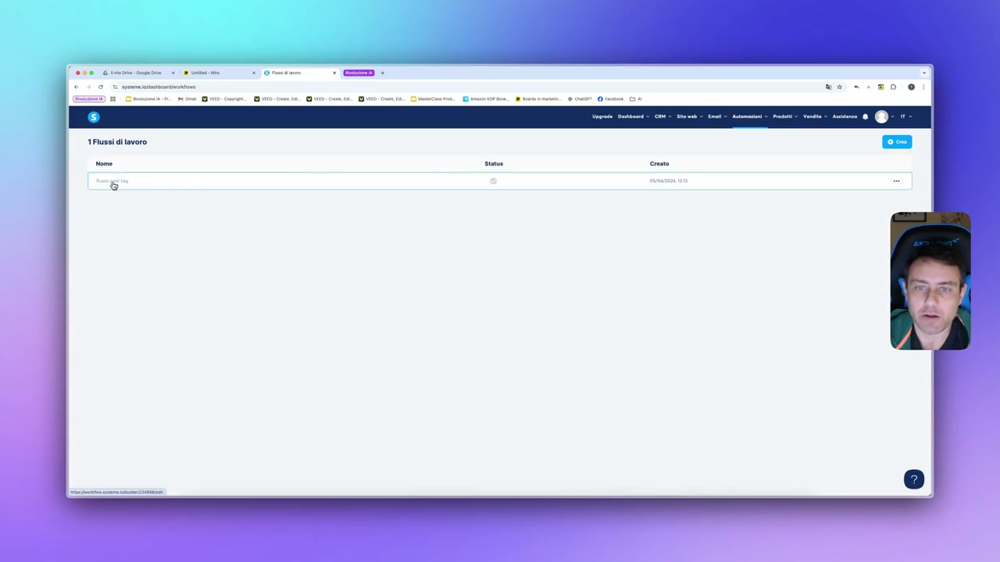

> tag clienti mindset essenziale, tendenzialmente possiamo inviare una mail, quindi azione, selezioniamo un'azione, inviamo una mail, seleziona complimenti per il tuo acquisto oppure possiamo crearne una nuova, chiamiamo complimenti per il tuo acquisto di litigare senza parole, ok, salviamo e modifichiamo le mail e qui molto semplicemente diciamo una cosa del tipo complimenti per il tuo acquisto, scarica il tuo ebook da qui, clicca e scarica ritorniamo sul nostro google drive dove abbiamo inserito il nostro ebook quindi clicchiamo su condividi, copia il tuo link, selezioniamo questa parte di

## [00:17:51] Schermata 20 _(periodic)_

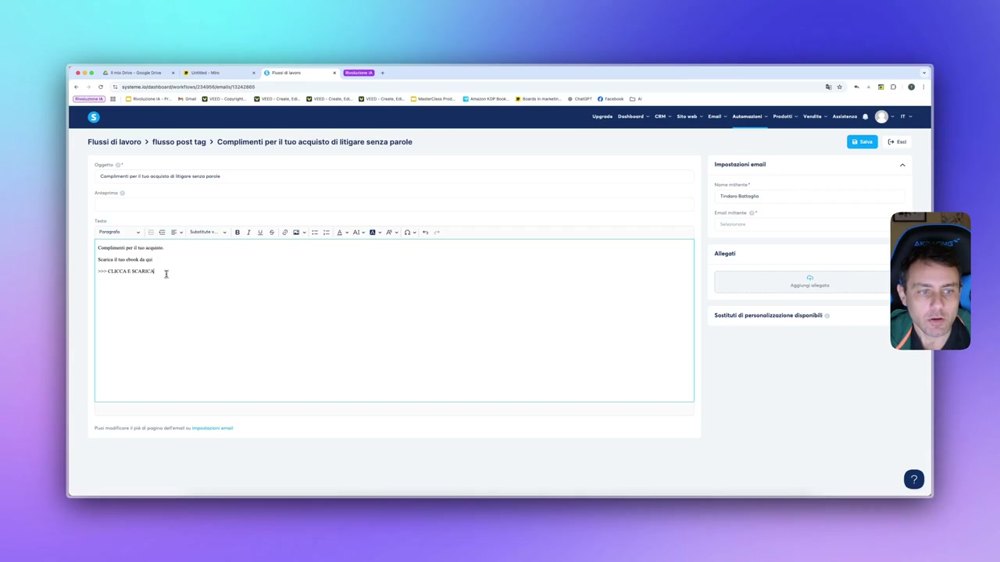

**Testo a schermo (OCR):** 1: Oinmzenoh droni Briosco Bainionn te. Bien:cnn te Bitccnnte. Dinnnrne Flussi lavoro > flusso post tag > Complimenti perl tuo acquisto di Itigare senza parole a-Wr@iao-o Sti di prelazione dpi

> testo, clicchiamo qui su collegamento e inseriamo il link al download su google drive, come vedete è molto semplice, clicchiamo su salva, qui dobbiamo inviare ovviamente dobbiamo partire da un email mittente che qui non ho configurato perché ancora non ho creato un dominio visto che questo è un account di test ma come vedete è molto molto semplice, una volta fatto questo andiamo sempre nella sezione funnel di vendita e non appena l'utente, in questo caso in questo checkout, acquisterà il prodotto, beh in questo caso sarà taggato dal nostro sistema di appunto crm interno a system.Io e partirà una sequenza con la quale potremmo vendere, ovviamente daremo una mail con il link al nostro prodotto digitale ma potremmo vendere ulteriori prodotti digitali e quindi crearci delle sequenze di mail marketing che abbiano lo scopo di vendere ulteriori prodotti digitali che abbiamo creato appositamente per questa nicchia di mercato, quindi come vedete il sistema è molto semplice, vi permette di partire a

## [00:18:51] Schermata 21 _(periodic)_

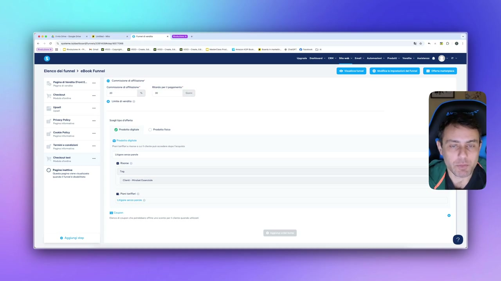

**Testo a schermo (OCR):** Elenco dei funne! > eBook Funnel! @reion moti ic CET:

> costo zero e vi permette di vendere prodotti digitali creandovi un semplicissimo funnel, ripeto a costo zero, che poi possiamo utilizzare attraverso l'invio di traffico, quindi traffico che può essere attraverso campagne di advertising o traffico organico per poter iniziare il nostro business di prodotti digitali.
