# Come vendere online i tuoi prodotti digitali

> Documento generato automaticamente: trascrizione e screenshot sincronizzati del video-corso.

## [00:00:00] Schermata 0 _(start)_

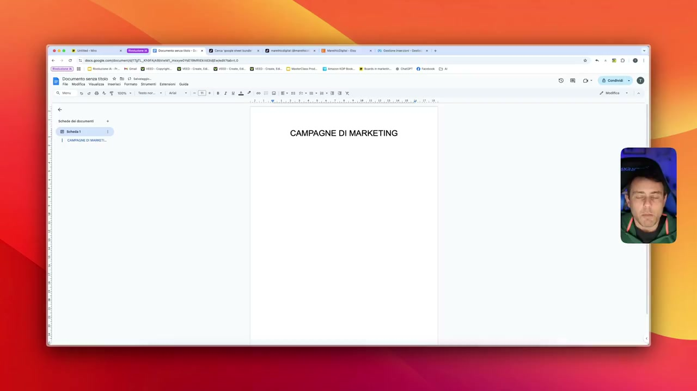

**Testo a schermo (OCR):** na rm n CI Boone + @ oro poseromitete x f) pevecsoncibmenmee # [M seveconte-ir x 100 Coemmeson on» (+ 5 Que de GA Teo) mene CAMPAGNE DI MARKETING

> Siamo passati alla parte finale del nostro corso. Quindi come vendiamo questi benedetti prodotti digitali che abbiamo dapprima realizzato, per i quali poi abbiamo realizzato un funnel? Come portiamo traffico all'interno di questo funnel di vendita? Tendenzialmente lo facciamo attraverso le campagne di marketing. Una piccola premessa prima di iniziare perché voglio essere estremamente chiaro su questo presupposto. Campagna di marketing non significa fare marketing. Lasciate che mi spieghi. Le campagne di marketing che noi facciamo sono tendenzialmente delle campagne che sono finalizzate a portare traffico all'interno del nostro funnel. Quindi noi abbiamo creato il nostro funnel, abbiamo creato i nostri prodotti digitali, ma tendenzialmente se il nostro funnel non lo visita nessuno è come se avessimo un biglietto da visita che non vuole nessuno. Quindi il nostro scopo è andare a portare persone che sono interessate o potenzialmente interessate al prodotto digitale che vendiamo e far sì che diventino nostri clienti. Ma le campagne di marketing non sono ragazzi il marketing in generale ma ricoprono la punta dell'iceberg di tutto

## [00:01:00] Schermata 1 _(periodic)_

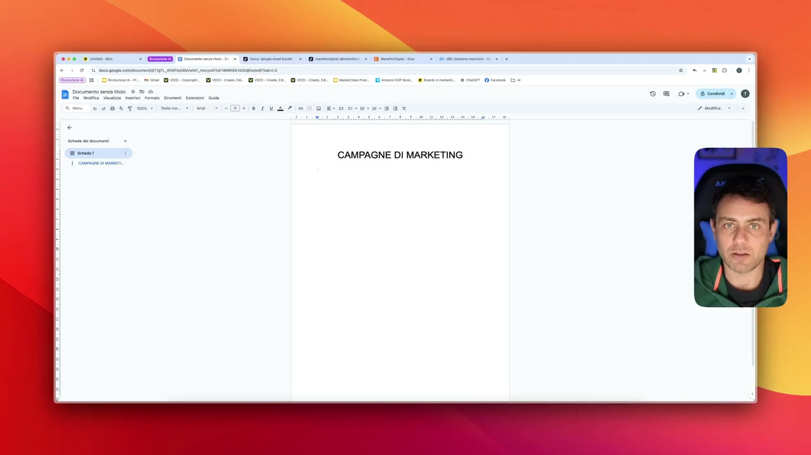

**Testo a schermo (OCR):** quer de 84 9 1- CAMPAGNE DI MARKETING

> quella che è la strategia di marketing che è molto più approfondita e che abbiamo visto all'interno di questo corso che comunque ci permette di crearci il nostro ecosistema di marketing complessivo, ci permette tendenzialmente di crearci il nostro business. Quindi noi analizzeremo le campagne di marketing e vedremo in particolar modo come portare traffico all'interno della nostra offerta, ma partita sempre da questo presupposto. Quindi il marketing è la strategia che sta dietro tutta la realizzazione del nostro business e della nostra attività di comunicazione e pubblicizzazione del prodotto servizio che vendiamo. Ora quando si parla di campagne di marketing parliamo tendenzialmente di portare traffico alle nostre offerte. Aspettate che aumento le dimensioni del testo così non perdete la vista e diventate ciechi. Ok quindi portare traffico alle nostre offerte. Quando parliamo di realizzare delle campagne di marketing faremo

## [00:02:00] Schermata 2 _(periodic)_

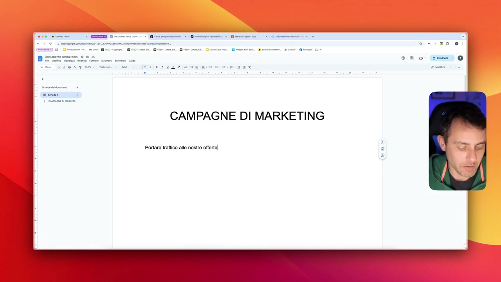

**Testo a schermo (OCR):** CAMPAGNE DI MARKETING Portare traffico alle nostre offerte!

> riferimento a questo portare traffico alle nostre offerte. Come possiamo portare del traffico alle nostre offerte? Possiamo farlo in due modi. Abbiamo traffico organico, quindi tendenzialmente ragazzi tra virgolette traffico gratuito, ma è un traffico non prevedibile. Perché gratuito? Perché non investiamo il nostro denaro per portare traffico all'interno del nostro funnel di vendita, ma investiamo il nostro tempo. Sapete benissimo che per un imprenditore, noi siamo degli imprenditori che hanno un business digitale, per un imprenditore tempo e denaro sono la stessa cosa a meno di una costante. Quindi per me gratis significa non impiegare nel tempo e nel denaro. Ma capisco bene che se siete agli inizi, se volete iniziare, capirete meglio la parola gratuito come non investire del denaro.

## [00:03:00] Schermata 3 _(periodic)_

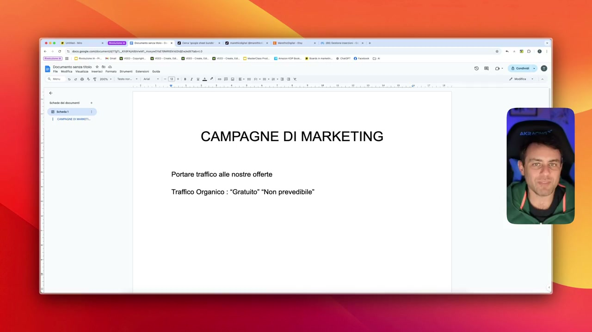

**Testo a schermo (OCR):** CAMPAGNE DI MARKETING Portare traffico alle nostre offerte Traffico Organico : “Gratuito” “Non prevedibile”

> Diciamolo così. La realtà delle cose è che il traffico organico va bene una fase iniziale in cui magari non volete spendere del budget, ma sul lungo periodo quello che voi dovrete realizzare sono le campagne di advertising, cioè dovrete spendere del denaro per far sì che il vostro business cammini da solo. Il traffico organico va bene, è una tipologia di traffico abbiamo detto che tra virgolette è gratuita, nel senso che non dobbiamo investire del denaro, ma dobbiamo investire il nostro tempo per la realizzazione di materiali, per lo più materiali video che poi andiamo a condividere, soprattutto su tiktok che è uno dei social network che permette maggiore viralità e quindi permette di ottenere più traffico in meno tempo possibile, ma è una tipologia di traffico come vi dicevo non prevedibile, nel senso che noi possiamo creare il tiktok migliore del mondo, almeno secondo i nostri gusti, poi postarlo all'interno del nostro profilo e vedere che tendenzialmente lo visitano poche persone. Quindi partite sempre da questo presupposto. Quando noi andiamo a creare

## [00:04:00] Schermata 4 _(periodic)_

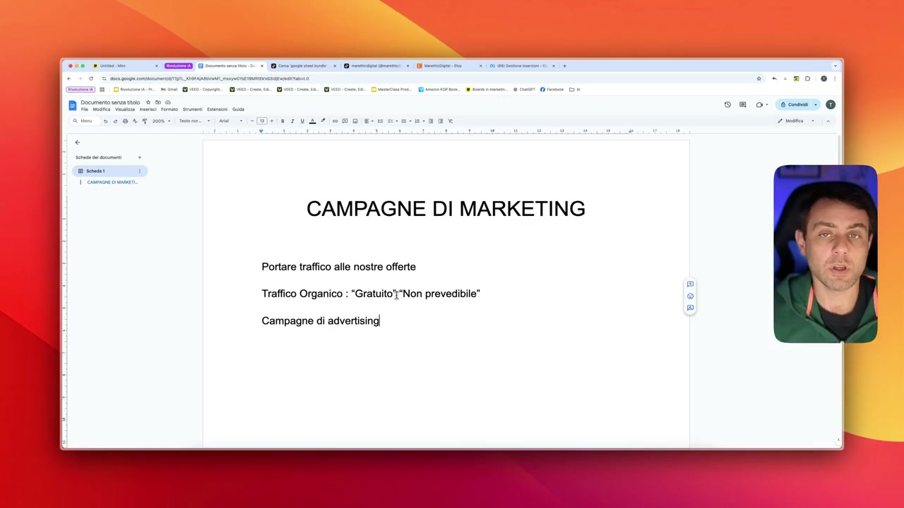

**Testo a schermo (OCR):** CAMPAGNE DI MARKETING Portare traffico alle nostre offerte Traffico Organico : “Gratuito'“Non prevedibile” Campagne di advertising]

> un business, dobbiamo creare un business che sia più sostenibile possibile a lungo periodo e che comunque ci dia una prevedibilità dei dati, proprio perché avere una prevedibilità dei dati ci permette di avere una prevedibilità degli incassi e quindi di pianificare al meglio il nostro flusso di cassa per gestire azioni di marketing successive o perché no per crearci un altro branch di altri business che vogliamo portare avanti. Quindi nella parte iniziale, vi consiglio parte iniziale, traffico organico ok. Nella parte, diciamo così, quando il business è ruotato, allora sfruttiamo le campagne di advertising. Campagne di advertising che in cambio di denaro ci danno traffico e traffico estremamente in target. Quindi se non volete investire del denaro partite con le strategie di traffico organico. Se invece volete partire subito, volete aprire i rubinetti del traffico, allora vi consiglio le campagne di advertising. In particolar modo vi consiglio le campagne di facebook advertising perché ad oggi facebook, volente o non volente, è il

## [00:05:00] Schermata 5 _(periodic)_

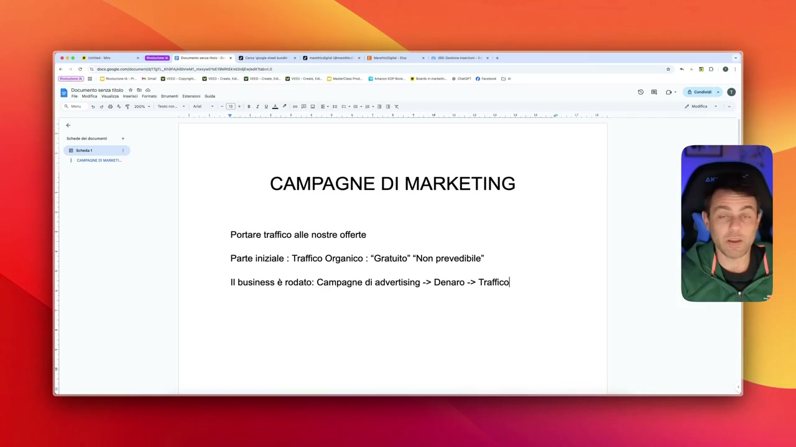

**Testo a schermo (OCR):** CAMPAGNE DI MARKETING Portare traffico alle nostre offerte Parte iniziale : Traffico Organico : “Gratuito” “Non prevedibile” ll business è rodato: Campagne di advertising -> Denaro -> Traffico]

> social network che veicola traffico di miglior qualità ok. Allora quando si parla di traffico organico, tendenzialmente come vi ho detto, si parla di creare traffico su tiktok. Quindi cosa facciamo? Creiamo il profilo del brand digitale, quindi del nostro prodotto digitale ok. Arriviamo a un k fan, arrivati a mille fan inseriamo il link al nostro funnel nell'appio di tiktok ok. Quindi questo è quello che facciamo. Una volta arrivati a mille fan inseriamo il link all'interno del nostro bio, della nostra bio di tiktok e veicoliamo traffico attraverso tiktok tra virgolette virali. In realtà non

## [00:06:00] Schermata 6 _(periodic)_

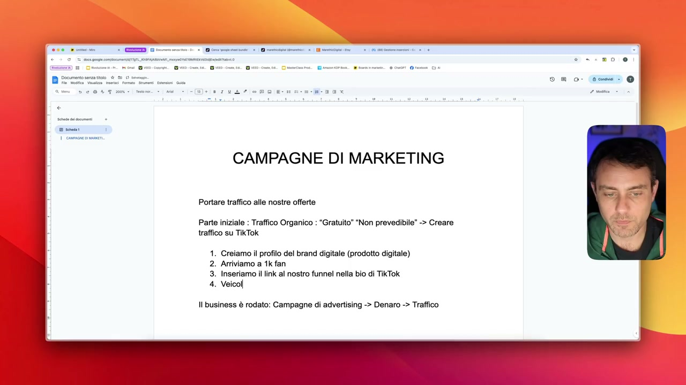

**Testo a schermo (OCR):** CAMPAGNE DI MARKETING Portare traffico alle nostre offerte Parte iniziale : Traffico Organico : “Gratuito” “Non prevedibile” -> Creare traffico su TikTok 1. Creiamo il profilo del brand digitale (prodotto digitale) 2. Arriviamo a 1k fan 3. Inseriamo i link al nostro funnel nella bio di TikTok 4. Veicol ll business è rodato: Campagne di advertising -> Denaro -> Traffico

> abbiamo bisogno di tantissimo traffico perché se abbiamo un traffico in target tendenzialmente questo è. Riusciamo a fare anche ottime conversioni con poco traffico. Vi faccio vedere questo è tiktok ovviamente, un profilo che ho

## [00:06:18] Schermata 7 _(scene)_

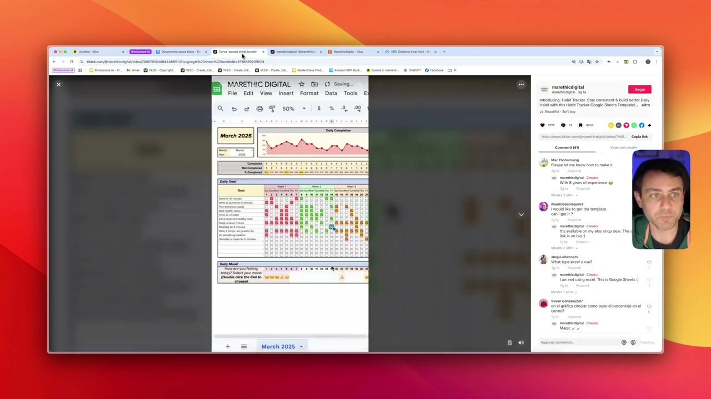

**Testo a schermo (OCR):** MARETHIC DIGITAL 3 BD (5 sevino File Edit View Insert Format Data Tools. Ei

> aperto così giusto per farvi vedere come funziona il tutto. Ho cercato google cheat bundle e ho trovato tutta una serie di tiktok che come vedete hanno anche abbastanza visualizzazioni. Guardate questo 67.700 Visualizzazioni vediamo un po 3522, ottimo. Questi non sono andati virali 3819 ok 3823 quindi siamo di fronte a una nicchia di mercato che vende prodotti digitali di tipo google cheat quindi fogli di lavoro per google vediamo un attimino questo che ha avuto 67.700 Clicchiamo e come vedete quello

## [00:07:03] Schermata 8 _(scene)_

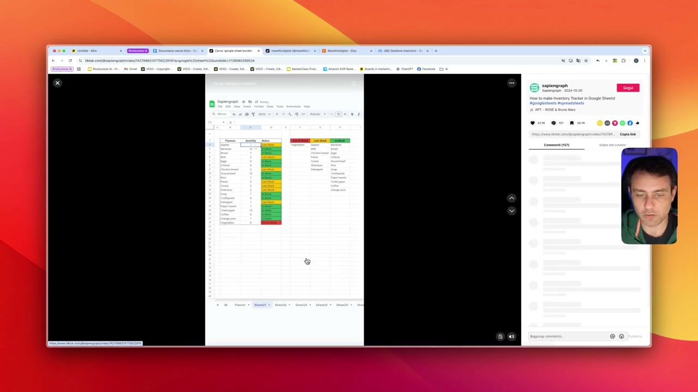

> che si fa ragazzi è molto molto semplice quindi la maggior parte delle persone pensa che per creare il tiktok della vita si debba avere un montaggio divino si debba avere una camera che non finisce mai no quello che ha prodotto la viralità su questo tiktok è molto molto semplice siamo di fronte a un pezzo di display che viene registrato sul quale c'è un foglio tiktok e che mostra come fare un inventario su google cheat molto molto semplice vedete com'è avuto 67.700 Visualizzazioni oltre 157 commenti e 50.000 Salvataggi molto molto semplice perché perché ha creato qualcosa che è di valore in questo caso ha creato un micro tutorial su tiktok quindi quando noi dobbiamo agire su tiktok la prima cosa che vi consiglio di fare è di creare dei tiktok che siano di valore cioè creare delle guide creare dei tutorial degli how to che possono essere delle guide molto molto semplici vedete in questo caso non ha fatto nulla di particolare ha registrato il suo video non ha neanche registrato dal telefono

## [00:08:03] Schermata 9 _(periodic)_

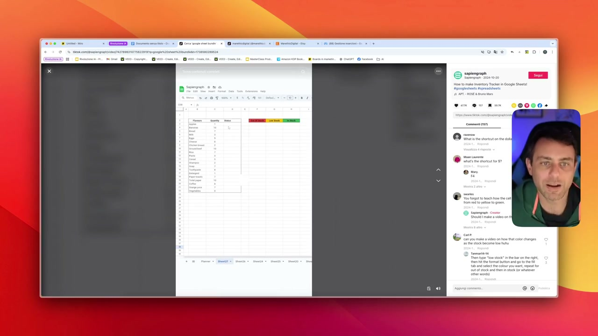

**Testo a schermo (OCR):** S) saperi

> registrato proprio una parte del video del suo computer e ha spiegato in pochi secondi come si crea un inventario su google cheat ovviamente non vi aspettate che tutti i vostri tutorial abbiano viralità e che diventino che esplodano di traffico ci saranno alcuni che ovviamente causa algoritmo avranno ottimo traffico ce ne saranno altri che avranno un traffico molto molto basso ma quello che vi premia sul lungo periodo per quanto riguarda la generazione di traffico organico è la costanza cioè il postare contenuti in maniera costante all'inizio con il vostro profilo nuovo dove dare un boost alla parte di contenutistica e il mio consiglio è quello di creare almeno tra i 2 e i 5 contenuti di questo tipo al giorno ok potete iniziare con due contenuti al giorno con tre contenuti al giorno l'ideale sarebbe 4 5 contenuti al giorno nei vari periodi della giornata che inizino a scaldare l'algoritmo di tiktok che vi producano traffico una volta che siete arrivati a mille fan tiktok vi dà la possibilità di abilitare il link in bio che è

## [00:09:03] Schermata 10 _(periodic)_

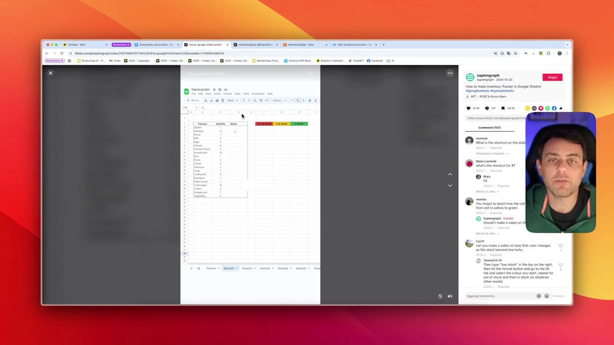

> estremamente importante perché ci permette di portare persone fuori dalla piattaforma di tiktok senza spendere ovviamente in advertising e di far sì che le persone possano visitare il nostro funnel e acquistare quindi parte iniziale iniziamo a creare torniamo sul nostro documento quindi creiamo il

## [00:09:22] Schermata 11 _(scene)_

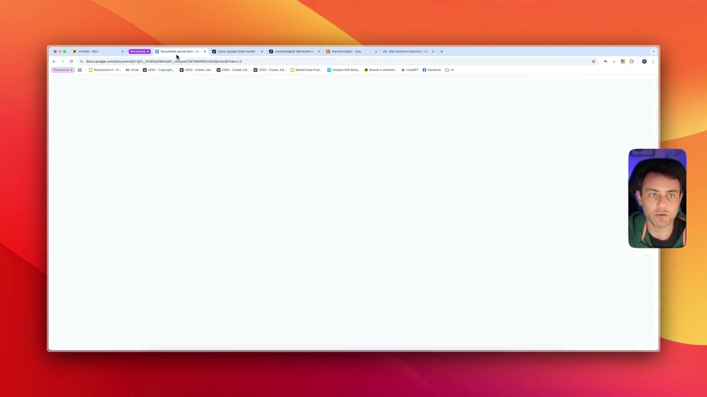

> profilo del brand digitale arriviamo a un kfan quindi creando tiktok di valore possono essere guide possono essere how to possono essere tutorial di vario tipo ok e aspettiamo di arrivare a mille fanno una volta che arriviamo le fan tiktok ci abiliterà il link al nostro funnel ci abiliterà il link in bio possibilità di inserire un link esterno a tiktok stesso inseriamo il link al nostro funnel e iniziamo a veicolare traffico attraverso tiktok virali quindi continuiamo a generare guide tutorial how to che magari mostrano il nostro prodotto se stiamo parlando di ebook ad esempio potremmo mostrare l'ebook all'interno del nostro ipad ci sono tantissimi tiktok che sono virali che mostrano degli ipad in cui si scorre un ebook per esempio quindi vedete ragazzi le cose sono molto molto semplici quello che premia quando si parla di traffico organico è essenzialmente la costanza cioè dovete essere costanti come vi dicevo inizialmente vi consiglio di creare 3

## [00:10:22] Schermata 12 _(periodic)_

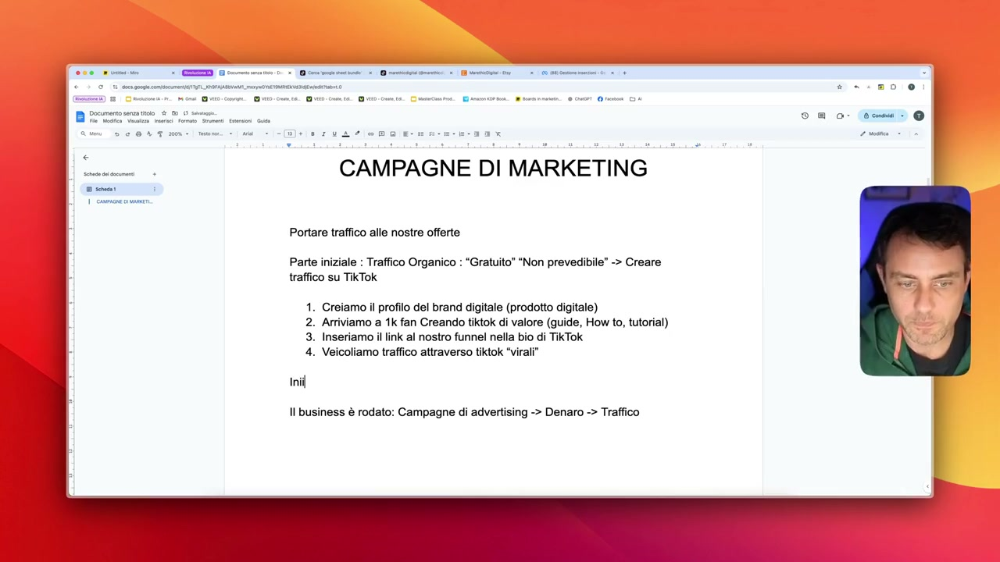

**Testo a schermo (OCR):** cem s Que 3 e BAT 00) i FESSO; CAMPAGNE DI MARKETING Portare traffico alle nostre offerte Parte iniziale : Traffico Organico : “Gratuito” “Non prevedibile” -> Creare traffico su TikTok 1. Creiamo il profilo del brand digitale (prodotto digitale) 2. Arriviamo a 1k fan Creando tiktok di valore (guide, How to, tutorial) 3. Inseriamo i link al nostro funnel nella bio di TikTok 4. Veicoliamo traffico attraverso tiktok “virali” Inil ll business è rodato: Campagne di advertising -> Denaro -> Traffico

> 5 tiktok al giorno ok arrivati a 1000 fan un k fan realizziamo 3 tiktok al giorno non entro nella diciamo nella strategia di produzione tiktok perché se no non basterebbe un corso di 40 ore o dei percorsi appositi come esempio digibook che vi spiega come generare traffico organico attraverso tiktok oltre che come creare un vostro brand in maniera approfondita di prodotti digitali questo ovviamente è un corso base ma vi serve giusto per avere le basi le fondamenta sul business dei prodotti digitali iniziare magari a generare i vostri primi guadagni per poi andare a reinvestire e crearvi ulteriori business o perché no accedere alla mia formazione più approfondita e avere ulteriori contenuti che vi permettono di capire eventuali dinamiche che con questo corso non avete capito e perché no di approfondirle e fare sempre più profitto attraverso il business dei prodotti

## [00:11:22] Schermata 13 _(periodic)_

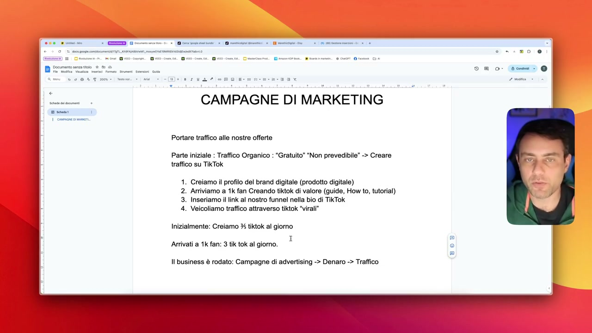

**Testo a schermo (OCR):** Qu SEAT reni) mi CAMPAGNE DI MARKETING Portare traffico alle nostre offerte Parte iniziale : Traffico Organico : “Gratuito” “Non prevedibile” -> Creare traffico su TikTok 1. Creiamo il profilo del brand digitale (prodotto digitale) 2. Arriviamo a 1k fan Creando tiktok di valore (guide, How to, tutorial) 3. Inseriamo i link al nostro funnel nella bio di TikTok 4. Veicoliamo traffico attraverso tiktok “virali” Inizialmente: Creiamo % tiktok al giorno Arrivati a 1k fan: 3 tik tok al giorno. ll business è rodato: Campagne di advertising -> Denaro -> Traffico

> digitali quindi una volta arrivati a mille fan facciamo circa 3 tiktok al giorno capirete bene ragazzi che creare 3-5 tiktok può sembrare una banalità ma all'istante in cui inizierete a crearli vedrete che sprecherete molto molto tempo all'inizio ragazzi il vostro livello di expertise è basso da qui ne consegue che il tempo di produzione sarà elevato dopo che iniziate a farci il callo avrete prodotto almeno un centinaio 100-200 tiktok il vostro livello di expertise come montatori video e come produttori di tiktok diverrà alto e quindi il tempo di produzione diminuisce notevolmente ok quindi questo per quanto

## [00:12:22] Schermata 14 _(periodic)_

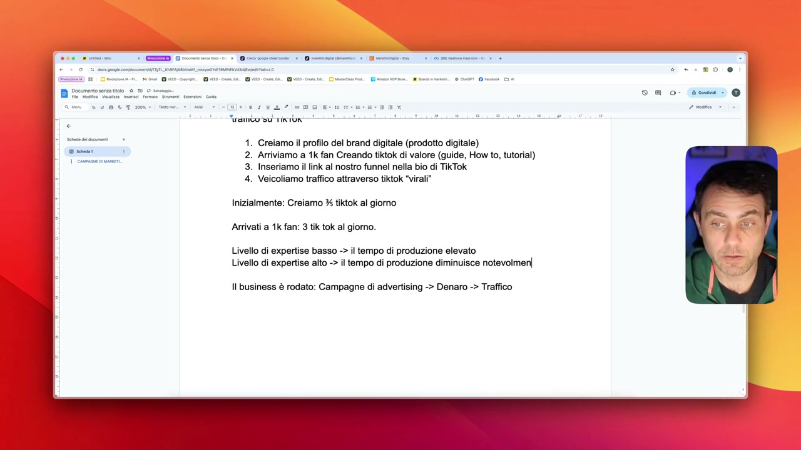

**Testo a schermo (OCR):** “ramo su rinion 1. Creiamo il profilo del brand digitale (prodotto digitale) 2. Arriviamo a 1k fan Creando tiktok di valore (guide, How to, tutorial) 3. Inseriamo i link al nostro funnel nella bio di TikTok 4. Veicoliamo traffico attraverso tiktok “virali” Inizialmente: Creiamo % tiktok al giorno Arrivati a 1k fan: 3 tik tok al giorno. Livello di expertise basso -> il tempo di produzione elevato Livello di expertise alto -> il tempo di produzione diminuisce notevolmen| ll business è rodato: Campagne di advertising -> Denaro -> Traffico

> riguarda tiktok andate a controllare ad esempio su tiktok non lo so vediamo un

## [00:12:26] Schermata 15 _(scene)_

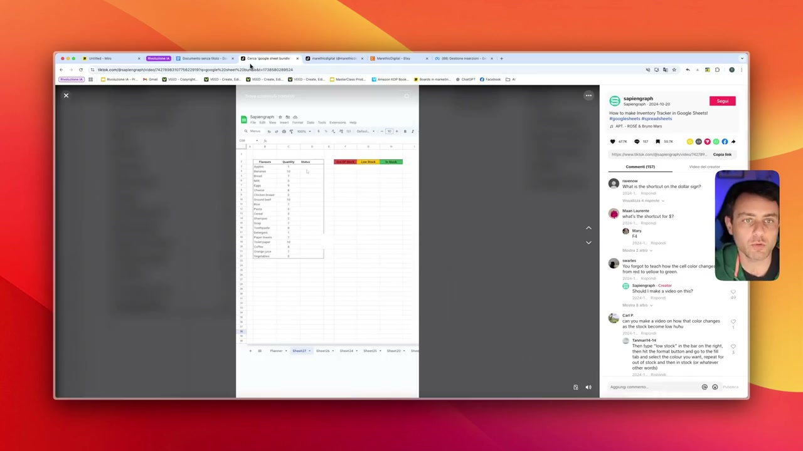

> attimino dalla ricerca come realizzano tiktok nella vostra nicchia di settore vedete qui questo ha dei tiktok che sono andati anche molto molto bene e qui ha il suo link in bio se ci clicchiamo usciamo fuori da tiktok e ci rimanda in un applicant tracker template try our template for free 5 minute growth tools vediamo quello che vende ok vende un tool in free trial quindi sarà un software the service ok e venderà anche qualcosa relativamente ai file excel

## [00:13:05] Schermata 16 _(scene)_

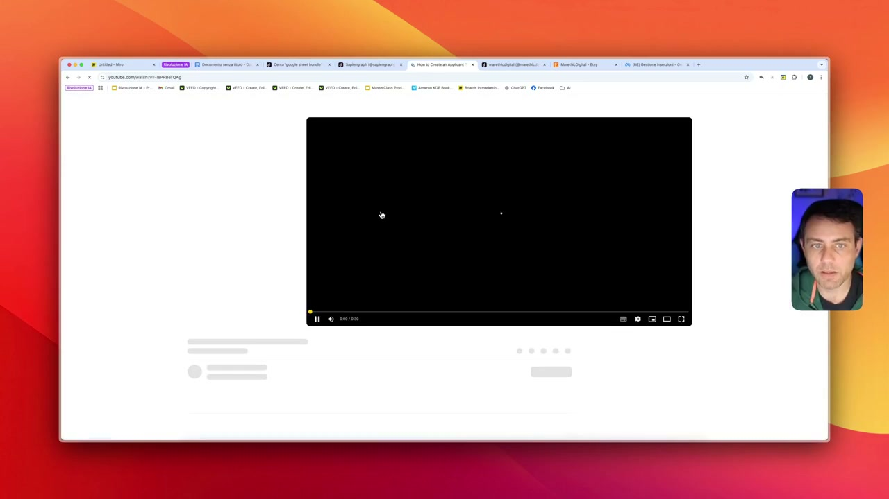

> eccolo qui qui rimanda direttamente al suo al suo canale youtube con possibilità di acquistare il loro template di tracking su google sheet

## [00:13:20] Schermata 17 _(scene)_

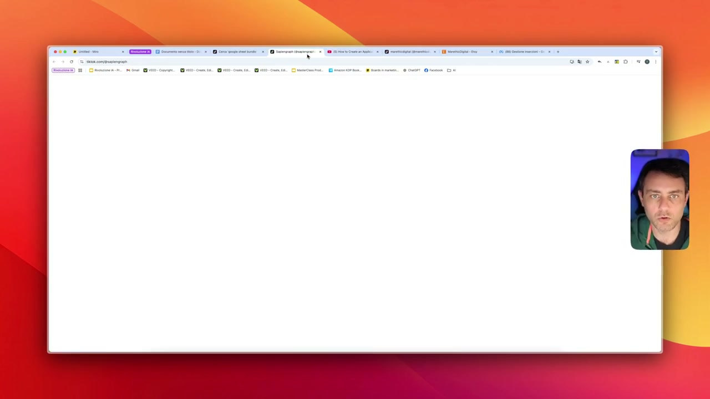

**Testo a schermo (OCR):** _ESsSsTEsZzZ:ZzZzZsI5&Z

> quindi quindi questo tendenzialmente il funnel che utilizzano questo funnel che si utilizza su tiktok andiamo a controllare qualche altra qualche altro

## [00:13:25] Schermata 18 _(scene)_

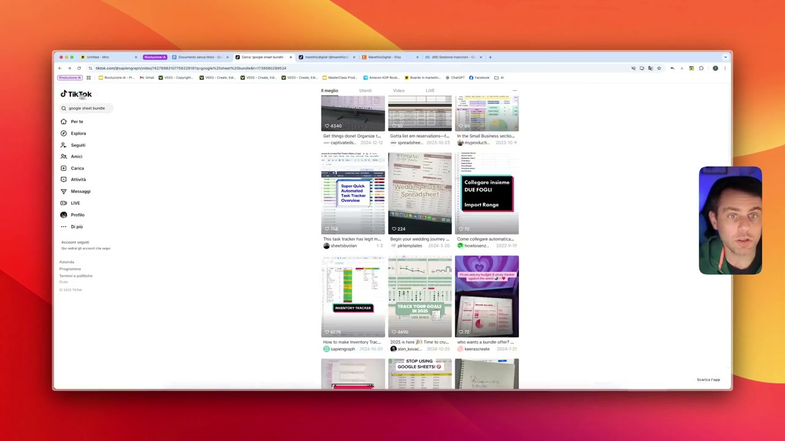

**Testo a schermo (OCR):** foce nce TE TECE45TEE55X5EEZzZ5ZKEZ5KEEx=zzs5 5; lumen Pene Bit :cogi. Bric te. Bus: bumte Brione. Dimecontni. Mannini Mimnrcene $ 0S7 Orme DA CT Von to mae ment 2026 e fio. E

> tiktok questo per esempio la 5779 anche in questo caso siamo di fronte a un

## [00:13:30] Schermata 19 _(scene)_

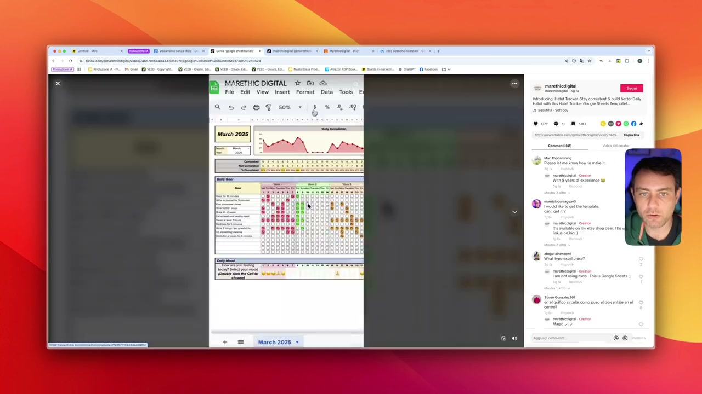

**Testo a schermo (OCR):** MARETHIC DIGITAL è © & File Edit View Insert Format Data To

> display registrato ragazzi non reinventate la ruota se vedete che questa tipologia di tiktok fanno presa sull'audience non create qualcosa di nuovo ma cercate di replicare la struttura di tiktok che stanno funzionando ok in questo caso abbiamo 5779 like 41 commenti 4283 salvataggi e qua parla di un habit tracker quindi un tracciatore un tracciamento per le abitudini ok se clicchiamo qui andiamo direttamente sul profilo vedrete che in questo caso lui

## [00:14:01] Schermata 20 _(scene)_

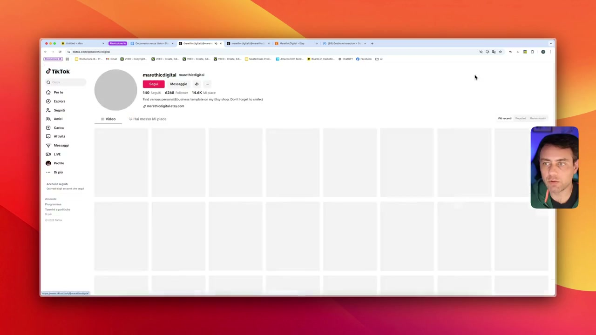

**Testo a schermo (OCR):** foce nomi TT CTETTEZIZEZeEMZeEEEZEtTeEeI 5 CL maretticdigita] maremesoti \ pn - ° MOSOReb 6268 fotone M.6K 1 pace Felsalaepa iaia ni tion)

> rimanda fuori al suo store store che in questo caso non è suo ma è uno store di prodotti digitali all'interno di una piattaforma esterna vi ho già detto all'interno di questo corso cosa ne penso sulle piattaforme esterne soprattutto nella parte iniziale vostro business e come vedete non fa altro che vendere dei google sheet prodotti digitali all'interno della piattaforma etsy come li vende attraverso la generazione di traffico organico quindi crea dei tiktok molto molto semplicemente sono delle

## [00:14:30] Schermata 21 _(scene)_

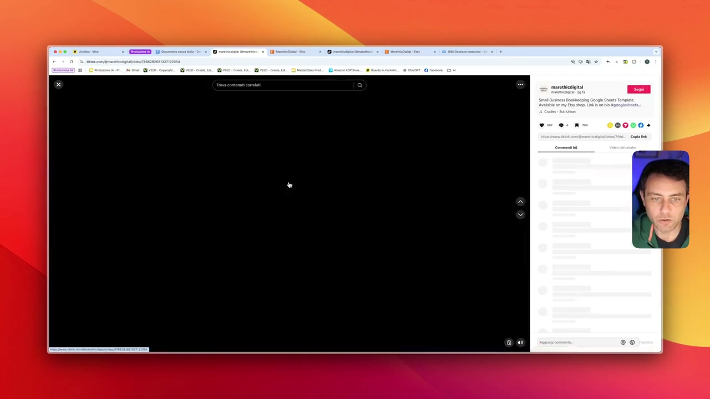

> registrazioni dei video che mostrano tendenzialmente che cosa si può fare con questi google sheet e li mette online molto molto semplice ok quindi questo

## [00:14:40] Schermata 22 _(scene)_

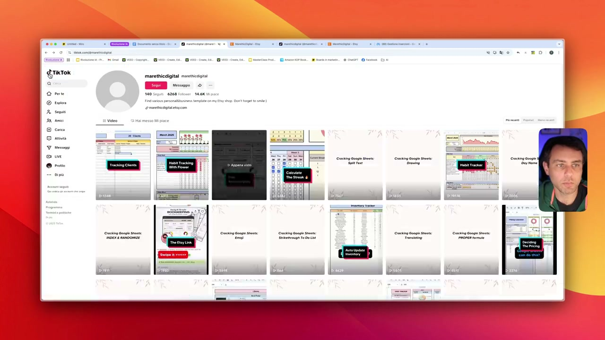

> per quanto riguarda la parte di traffico organico per quanto riguarda invece la parte traffico a pagamento ragazzi dovete utilizzare le facebook ads facebook ads che vi permettono ad oggi sono semplificate tantissimo e vi permettono la creazione una campagna anche molto profittevole davvero in pochissimo tempo questo è l'account di gestione Come vedete è suddiviso in campagne, gruppi di inserzioni e inserzioni. Quello che facciamo noi, almeno in questo corso, che vi dà i rudimenti su come partire per la generazione di campagne a traffico, è appunto quello di creare delle campagne di vendita. Quindi ci rechiamo su campagne, clicchiamo su crea, selezioniamo come vedete l'obiettivo

## [00:15:20] Schermata 23 _(scene)_

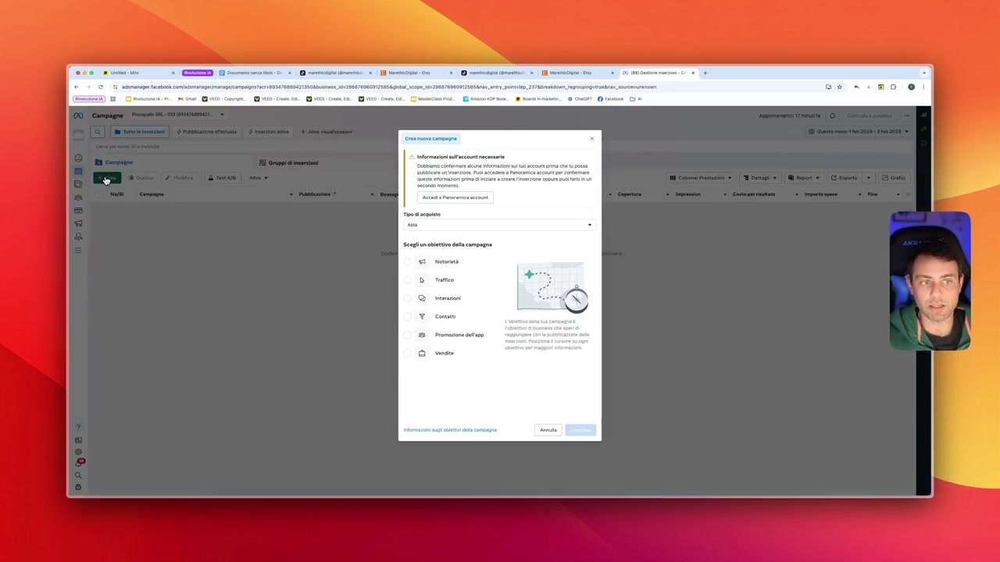

> vendita e quando clicco su continua selezioniamo advantage plus shopping campaign, che tra l'altro è l'opzione predefinita di Facebook, perché Facebook attraverso la sua intelligenza artificiale e possedendo milioni e milioni di dati, ha praticamente permesso di automatizzare il 99% della conduzione e creazione della campagna pubblicitaria su Facebook stesso. Quindi selezioniamo advantage plus shopping campaign, clicchiamo su continua, come vedete è una procedura semplificata e personalizzata.

## [00:15:49] Schermata 24 _(scene)_

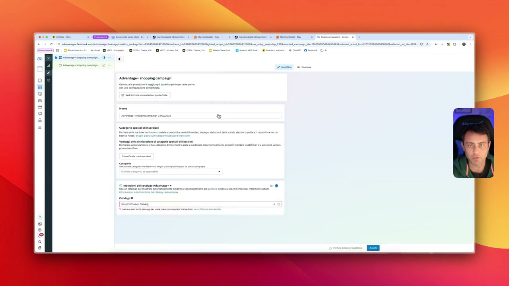

**Testo a schermo (OCR):** ere iii Tt—PT ==eereereEpTeerEnroree pro Eee numi 0 fo Advantage» shopping campa tn Ag e cen RS è "pPATEOHO I

> Qui possiamo dare un nome, ad esempio vendita ebook sul mindset, qui deselezioniamo il catalogo advantage plus perché non ci interessa e qui come vedete già Facebook parte con l'obiettivo di massimizzare il numero di conversioni, cioè generare più vendite a prezzi più bassi possibili. Qui andiamo a selezionare un nostro dataset, una volta si chiamava pixel, se non l'avete creato lo potete creare andando tendenzialmente in gestione eventi e creando un vostro pixel molto semplice e inserendo il codice di tracciamento del pixel all'interno della piattaforma che può essere il sistema io o qualsiasi altro sistema di piattaforma decidiate di utilizzare per vendere il vostro prodotto digitale, in questo caso io inserisco questo, per esempio un pixel a caso, qui selezioniamo come evento di conversione acquisto e selezioniamo il budget giornaliero, che budget utilizzare? Questa è la domanda delle domande. Ragazzi vi consiglio di utilizzare un budget basso per testare la campagna, noi tendenzialmente

## [00:16:49] Schermata 25 _(periodic)_

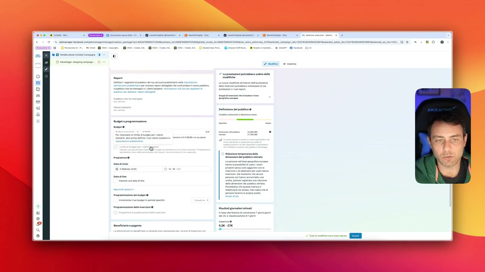

**Testo a schermo (OCR):** ceo rem TtT—e==e®=Teore=E=rTe==: ere poco er n E IT TO Tieni E E O son ©

> abbiamo due fasi che sono, ve lo scrivo qui quando si parla di campagne a pagamento, abbiamo una fase di test durante la quale testiamo creatività, copy e landing page e poi abbiamo una fase di scaling nella quale dopo che abbiamo trovato la quadra, che significa per noi avere ROI, ritorno sull'investimento, aumentiamo il budget ed aumentiamo i profitti. Questa è la struttura, questa è la strategia che noi eseguiamo quando realizziamo campagne a pagamento. La realizzazione della campagna a pagamento è molto molto semplice, partite con un basso budget, 20 euro vanno benissimo, qui selezioniamo il nostro beneficiario, qui ad esempio metterò un beneficiario, la mia azienda e clicchiamo qui su avanti, selezioniamo una pagina, dovete

## [00:17:49] Schermata 26 _(periodic)_

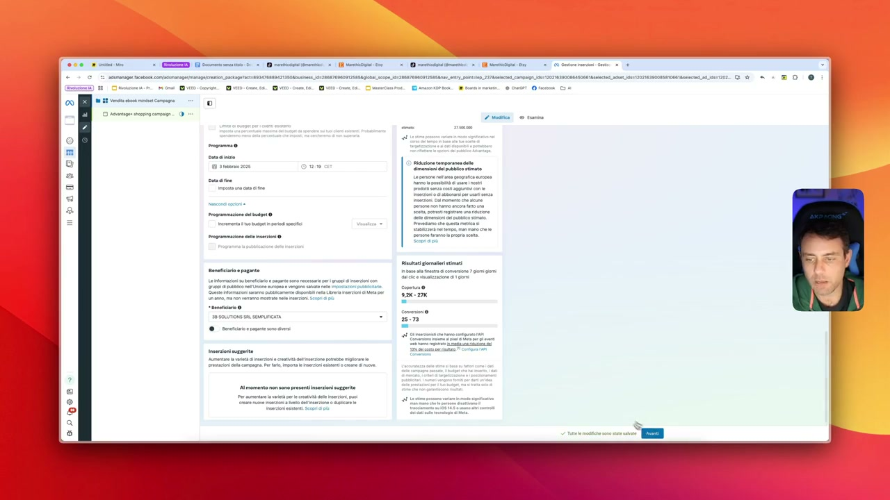

**Testo a schermo (OCR):** cda rino T_T c===_e==sree= Errore reni Ss 4-01 sm E et N TOTAL ST N NNO sr I ron BP Sirio o 8 vtr ssp D "uDADEOHO TI SETT ma en vere men ne ri a TEMERE ar morini sat Ammessi ein eg

> aver creato una pagina su Facebook che rappresenta il vostro brand, qui ne ho creata una di esempio, a questo punto selezioniamo la creazione dell'inserzione, possiamo creare inserzioni di diversi tipi, io qua non ho collegato il profilo Instagram alla mia pagina perché ragazzi questo è un esempio giusto per farvi capire come si crea una campagna. Quello che vi consiglio è di utilizzare il nuovo formato flessibile che vi permette di inserire più creatività all'interno della nostra campagna e far sì che poi sia Facebook a scegliere quali sono le immagini, i copy che convertono di più. Qui abbiamo la sezione contenuto multimediale, selezioniamo alcune immagini di test che ho scaricato dal mio account Canva, selezioniamo ad esempio la 1, aspettiamo che carichi, selezioniamo

## [00:18:40] Schermata 27 _(scene)_

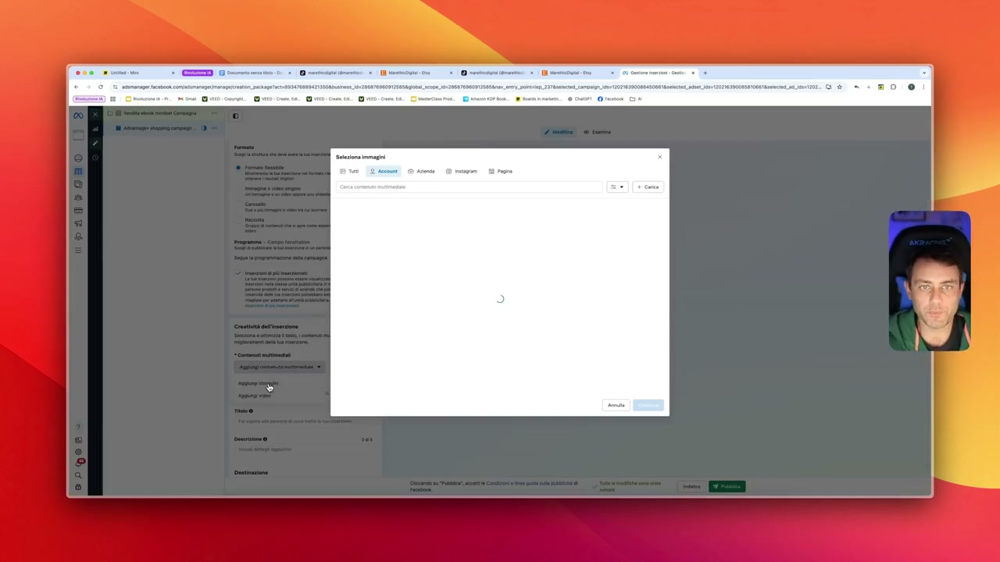

> la 2, selezionerò 3 per brevità e come vedete man mano che le carico con il formato flessibile lui le prende in automatico per la nostra campagna. Click a questo punto su continua, come vedete mi ritrovo le immagini qui, avevo la mia landing

## [00:19:04] Schermata 28 _(scene)_

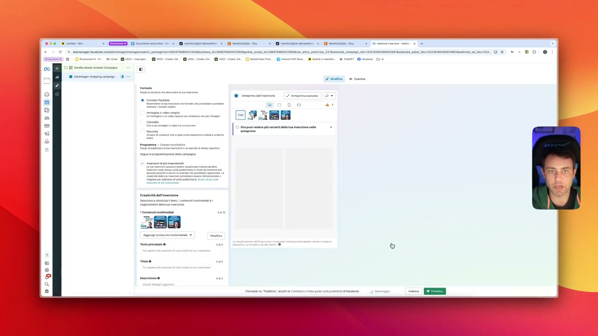

**Testo a schermo (OCR):** o n sima poni D C) ® a a s a a

> page su Sistema.Io, ve lo ricordate, qui inserirò il testo principale, ad esempio acquista subito il nostro ebook e cambia il tuo mindset per sempre, accedi all'offerta lancio e qui mettiamo il link della nostra landing page, HTTPS per esempio mindsetessenziale.Com, ok? Supponendo che sia questa la nostra landing page, lo inseriamo pure qui, qui inseriamo un titolo, ad esempio accedi all'offerta lancio, qui la descrizione potete lasciarla così, non ci sono problemi e come vedete man mano che noi creiamo la nostra inserzione, qui sulla destra abbiamo l'anteprima, se clicchiamo su anteprima avanzata ci mostrerà come si vede le nostre inserzioni generate automaticamente da Facebook sui vari posizionamenti, quindi

## [00:20:04] Schermata 29 _(periodic)_

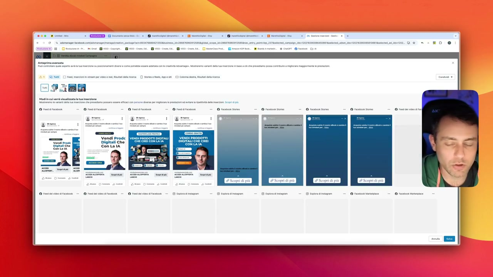

> sulle storie di Facebook, qui siamo sul feed di Facebook da mobile, questo è sempre il feed video, Facebook marketplace perché ovviamente Facebook va a declinare quella che è la nostra campagna sui suoi vari posizionamenti che sono audience network, Instagram se abbiamo collegato la nostra pagina e quant'altro. In questo modo ragazzi noi ci creiamo la nostra prima campagna, vedremo qual è il ritorno sull'investimento della nostra campagna e poi non appena troveremo la quadra e faremo i nostri test e capiremo come migliorare la nostra campagna, tutto questo ovviamente spiegato nel mio percorso più approfondito, inizieremo a scalare, cioè andremo a inserire qui in questa sezione molto banalmente più budget per aumentare il nostro profitto e quindi scalare il nostro business digitale.
