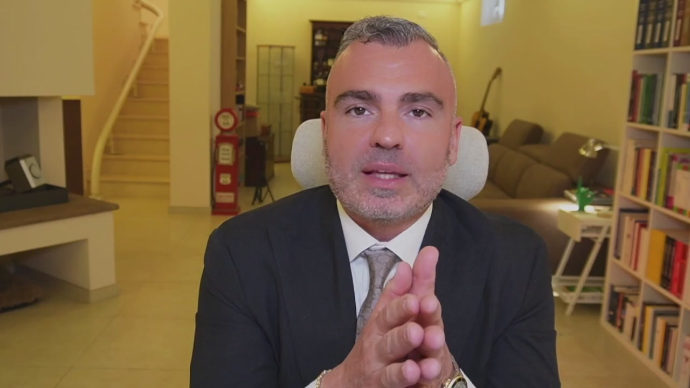
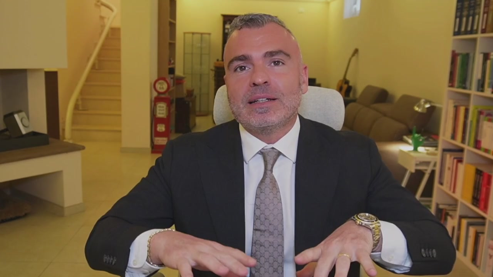
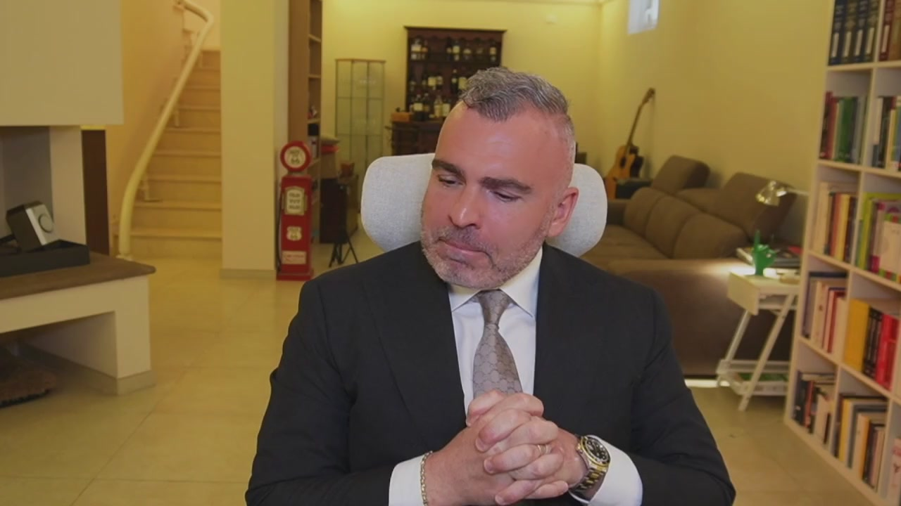
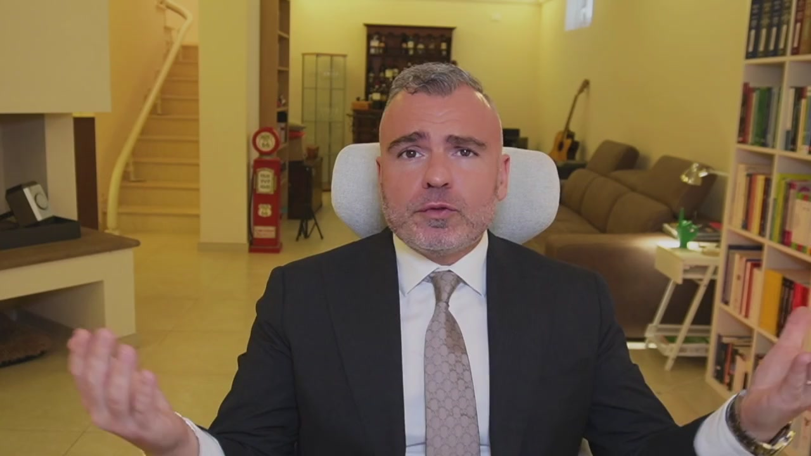
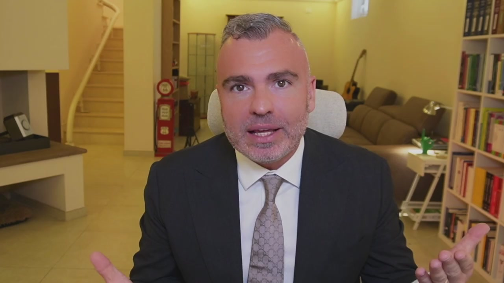
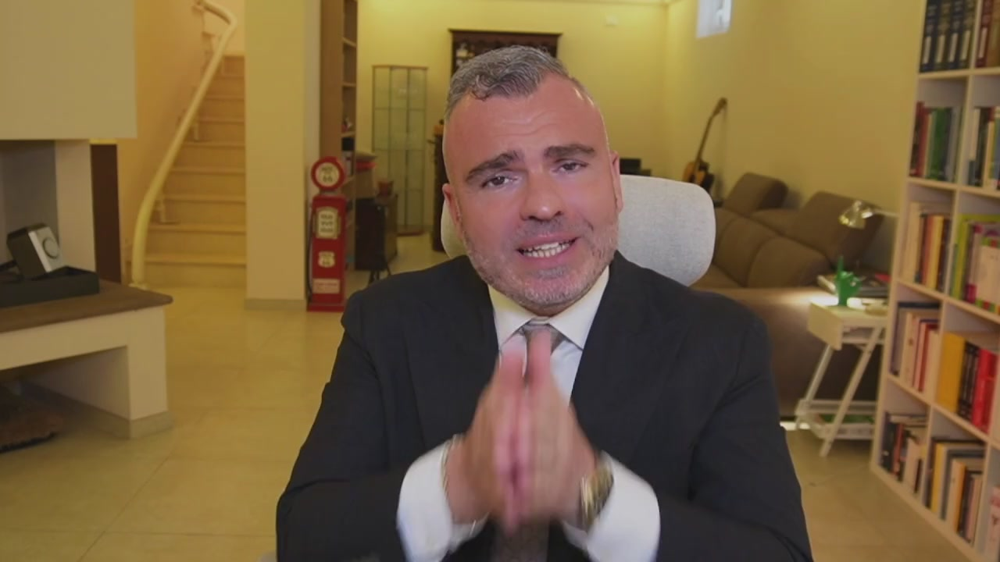
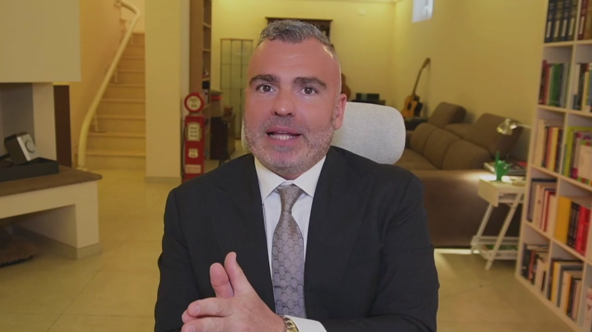
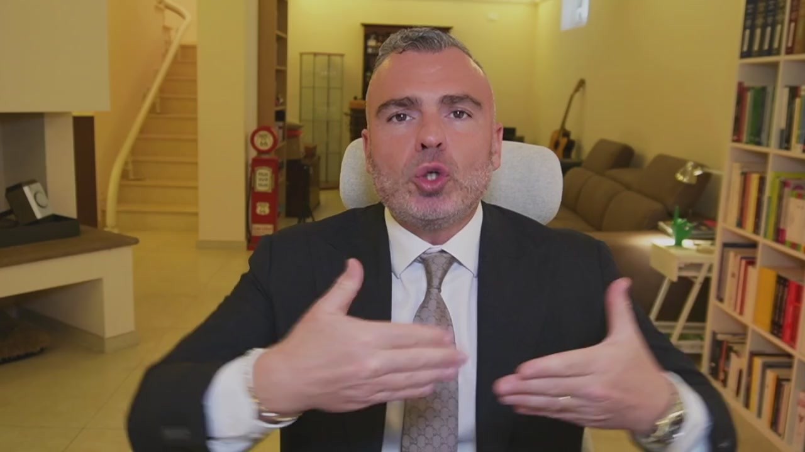
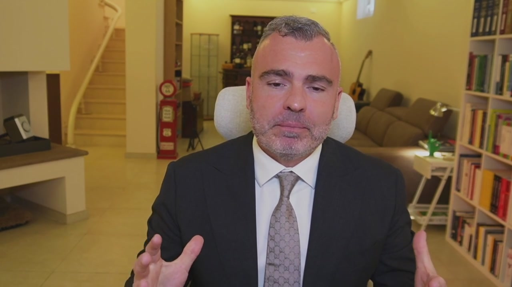

# 1. Perché siamo qui: cosa otterrai, come posso aiutarti, chi sono

> Documento generato automaticamente: trascrizione e screenshot sincronizzati del video-corso.

## [00:00:00] Schermata 0 _(start)_

> Scacco matto al fisco è una partita? È una guerra contro il fisco? Non è né una né l'altra. Primo perché la pianificazione fiscale e l'educazione fiscale non è un gioco. Secondo perché non è conveniente andare in guerra con l'amministrazione finanziaria laddove l'amministrazione finanziaria ha molte più armi a disposizione di noi contribuenti. Allora perché siamo qui? Siamo qui perché nel gioco degli scacchi si vince con una strategia e con ripetizione d'allenamento. Noi siamo qui per un'educazione fiscale e consapevole dell'imprenditore che è vessato da un carico fiscale senza precedenti a livello nazionale e senza

## [00:01:00] Schermata 1 _(periodic)_

> competitor a livello internazionale per quantità pagata e servizi resi pone il contribuente nella condizione tale per cui i primi sette mesi dell'anno lavora sostanzialmente per pagare le imposte. La pressione fiscale supera ampiamente il 50% perché se è vero che l'IRPEF va al 43% noi imprenditori dobbiamo far conto con le imposte societarie, con le imposte dirette e indirette, le sue transazioni, ma non parlo solamente di lì ma parlo anche dei vogli e delle imposte di registro e di una marea di micro imposte e di micro sanzioni costruite dal fisco per fare in modo che come uno fa un piccolo errore subito tanti ti vengono a prendere, che ti vengono a massacrare. Qual è la reazione principale dei

## [00:02:00] Schermata 2 _(periodic)_

> consulenti fiscali e qual è la reazione principale degli imprenditori? Troppi consulenti fiscali sono per ignoranza eccessivamente timorosi e conservatori e quindi passano il loro tempo a dire perché non si possono fare le cose piuttosto che individuare qual è una strada per poter fare le cose, una strada che però va presa nell'ottica di una conoscenza generale del sistema legale e fiscale così che l'imprenditore al corrente dei rischi, dei vantaggi e degli svantaggi possa o meno intraprendere determinate strade. Dall'altra abbiamo l'imprenditore che invece per paura delle conseguenze fiscali vuoi per ignoranza vuoi perché vuole stare tranquillo preferisce non fare pianificazione fiscale, non sfruttare gli strumenti e gli istituti

## [00:03:00] Schermata 3 _(periodic)_

> legali che lo stesso legislatore cioè chi fa le leggi ci mette a disposizione perché non vuole problemi ma quali sono questi problemi allora? I problemi sono che una cattiva pianificazione fiscale o l'insieme di una serie di tecniche prive di una loro complementarità e congruenza generale possono portare a controlli fiscali con l'unico scopo di danneggiarvi non solo nella vostra azienda ma anche nella vostra mente. Quindi che cosa dobbiamo fare noi e come dobbiamo impostare noi il lavoro? Noi dobbiamo avere contezza di quelle che sono le possibilità e le opportunità, le nostre ricette, le nostre regole. Una

## [00:04:00] Schermata 4 _(periodic)_

> volta ottenuta questa consapevolezza dobbiamo capire nel nostro caso specifico quali sono quelle che possono funzionare, quelle che devono essere assolutamente eliminate. Da lì la costruzione di un nostro modus di comportamento nella gestione dell'azienda dal punto di vista amministrativo fiscale e la nostra pianificazione di quegli strumenti di ampio periodo che invece ci consentiranno in un'ottica di orizzonte oltre 12 mesi di ottenere degli importanti vantaggi fiscali da un lato e di protezione patrimoniale dall'altro. Perché senza protezione patrimoniale è inutile fare pianificazione fiscale. Per più motivi che scopriremo insieme

## [00:05:00] Schermata 5 _(periodic)_

> all'interno di questo percorso. Io sono Carlo Alberto Micheli, sono avvocato, sono abilitato anche come commercialista e ho al mio attivo numerose aziende, nello specifico tre aziende operanti. Queste aziende sono tra di loro collegate dal punto di vista dell'offerta ma anche dal punto di vista giuridico e lo vedremo perché negli schemi. Nel corso degli anni, io sono a 20 anni di esperienza imprenditoriale, ho aperto la mia prima partita IVA nel 2004. Tutta la storia la trovate nel mio libro che ha auspico sia stato da voi preso e magari già visto nei suoi primi capitoli. In tutti questi anni io ho sempre dovuto affrontare più aspetti.

## [00:06:00] Schermata 6 _(periodic)_

> Io come anche voi. L'aspetto della configurazione giuridica, di come vado a esercitare quella determinata attività. L'aspetto propriamente economico di creazione del valore all'interno dell'azienda, quindi cosa faccio, come lo faccio, a chi lo faccio e a quanto lo vendo. Classico imprenditoriale. E l'annoso problema delle imposte. Perché se il mio profitto al 60% va nelle casse dello Stato, o lavoro tutto il giorno perché altrimenti non arrivo, oppure devo aumentare i prezzi col problema di andare fuori mercato. Quindi nella nostra configurazione giuridica, nella mia configurazione giuridica, ho nel corso degli anni, in virtù dell'esperienza imprenditoriale e degli studi giuridico-economici, strutturato schemi via via, a seconda

## [00:07:00] Schermata 7 _(periodic)_

> dei progetti, che mi hanno permesso di ottimizzare il carico fiscale, portando la mia imposizione media tutt'ora intorno al 30%, facendo in modo che determinati benefit possano legalmente rientrare sotto l'ombrello societario, cosicché io abbia un tenore di vita meritato, come quello che ogni imprenditore si merita per i sacrifici che mette in campo ogni giorno. Nel corso quindi di questo materiale formativo andremo a vedere nello specifico come posso aiutarti e come configurare tutti gli strumenti all'interno della tua azienda. Codice Micheli è il mio progetto fatto di consulenti fiscali, dove il mio

## [00:08:00] Schermata 8 _(periodic)_

> team si occupa di creare la pianificazione fiscale su misura per la tua azienda. Ti dico sin da ora che puoi candidarti e puoi entrare con la tua azienda all'interno di questo progetto per attuare con il nostro supporto tutte le strategie necessarie per ottimizzare il carico fiscale e avere più soldi nelle tue tasche, dandone meno al fisco. Un percorso quindi su misura al quale anche tu potrai accedere. Entriamo quindi nel vivo di questo corso e partiamo con dei casi studio ben precisi.
