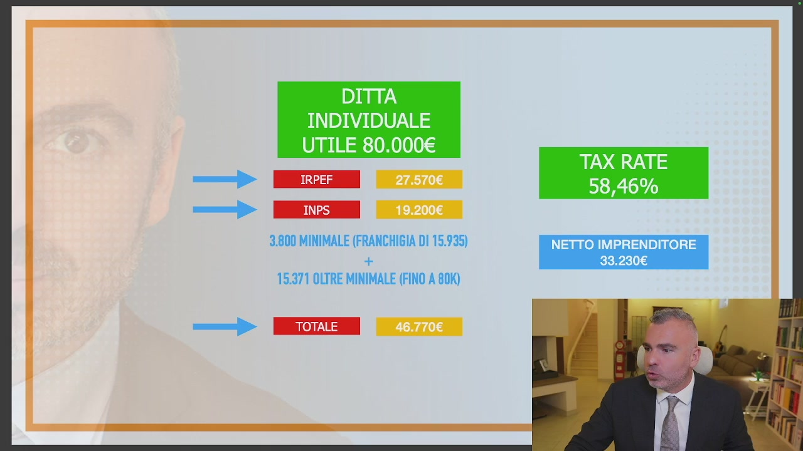
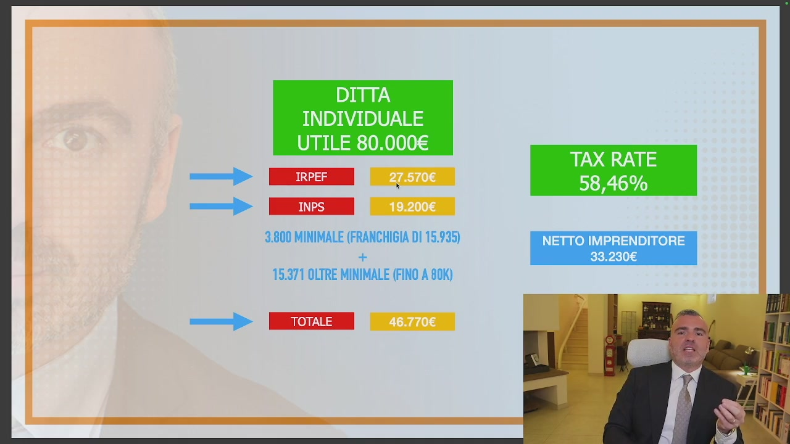
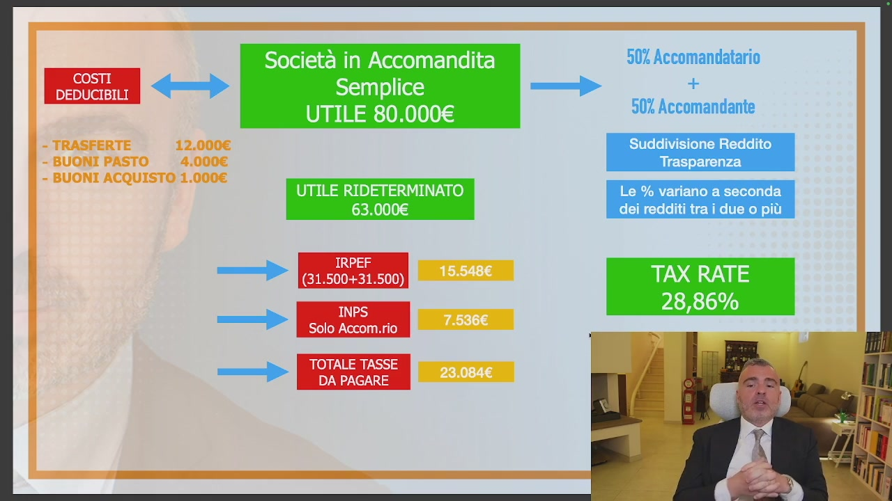
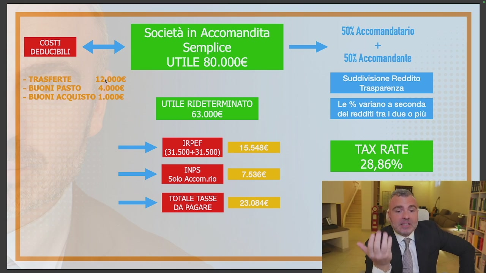
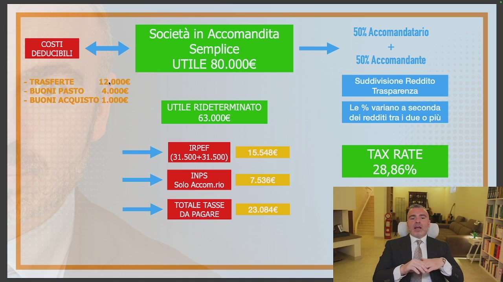
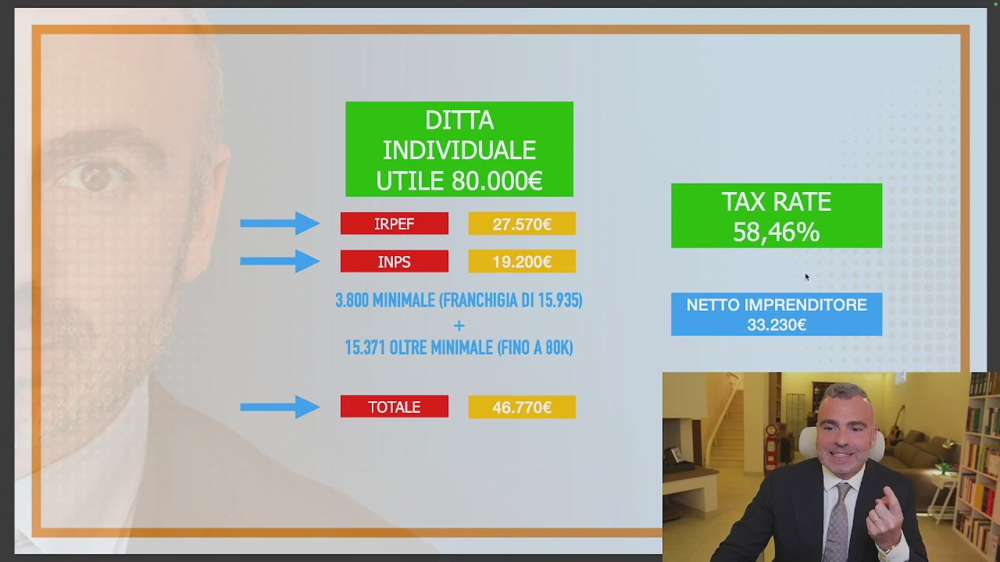
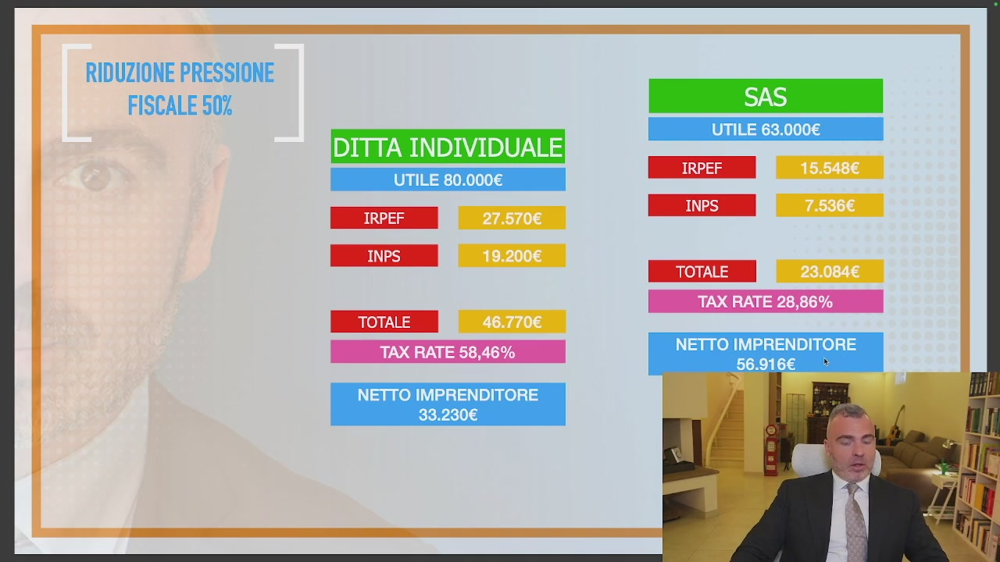
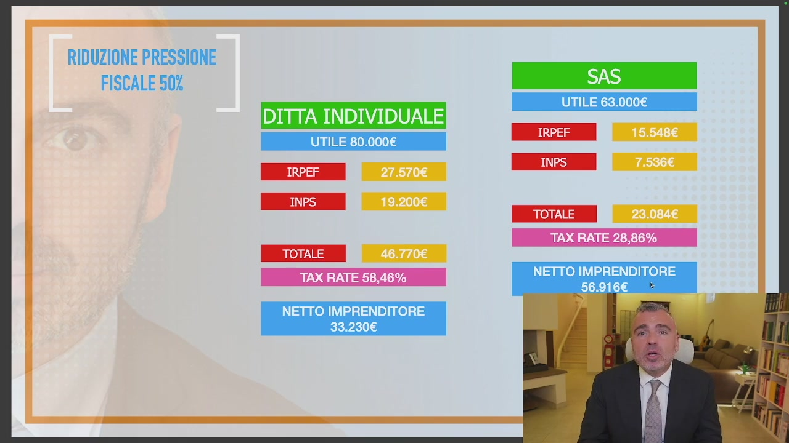

# 2. Caso studio n. 1 - Una trasformazione di successo: agente di commercio da ditta individuale a s.a.s.

> Documento generato automaticamente: trascrizione e screenshot sincronizzati del video-corso.

## [00:00:00] Schermata 0 _(start)_

> In questo caso studio numero uno abbiamo una trasformazione di successo. Abbiamo il passaggio da ditta individuale di un agente di commercio a SaaS. Ho anche l'ausilio di alcune slide per spiegarvi nel dettaglio quali sono i passaggi fondamentali. Ovviamente se c'è qualcosa che uno non ha capito, in consulenza con me o con il mio team o nei programmi codici può lenire tutti i propri dubbi. Vediamo che cosa sta succedendo. Abbiamo una ditta individuale

## [00:00:30] Schermata 1 _(scene)_

**Testo a schermo (OCR):** DITTA INDIVIDUALE UTILE 80.000€ TAX RATE — 58,46% —> 3.800 MINIMALE (FRANCHIGIA DI 15.935) NETTO IMPRENDITORE + 33.230€ 15.371 OLTRE MINIMALE (FINO A 90K) OLE _|

> con un utile di 80.000. Su un utile di 80.000 L'IRPF calcolato è 27.570. Poi l'IRPF, capiamoci bene, ci sono le addizionali regionali e altre situazioni, però all'incirca questo è l'IRPF che andremo a pagare e l'INPS che andremo a pagare formato dal minimale più l'oltre minimale è intorno ai 19.500 Euro. Il totale della pressione fiscale di questa ditta individuale sono 46.770, Il che significa che l'incidenza in posto e contributi, il cosiddetto tax rate, è pari al 58.46%. Quando io scrivo netto imprenditore 33.230 Significa che ho preso sostanzialmente 80.000 Euro, meno la pressione fiscale e contributiva, trovo il netto imprenditore.

## [00:01:30] Schermata 2 _(periodic)_

**Testo a schermo (OCR):** DITTA INDIVIDUALE UTILE 80.000€ TAX RATE I 58,46% ia | 3.800 MINIMALE (FRANCHIGIA DI 15.935) NETTO IMPRENDITORE + 33.230€ 15.371 OLTRE MINIMALE (FINO A 90K) OE |

> Il nostro caro amico imprenditore quanto si fa al mese? 33.230 Diviso 12 si fa 2.770 Euro al mese, peccato che lo Stato si faccia quasi 3.900 Euro, quindi di fronte a 3.900 Euro che si prende lo Stato il nostro amico imprenditore, tu amico imprenditore in ditta individuale ti vai a prendere 3.900 Euro, 2.700 Euro, quindi diciamo che la torta gioca a favore dello Stato come sempre. Allora che cosa abbiamo fatto in questa situazione? Abbiamo fatto subito un SRL? Abbiamo fatto uno schema d'holding? Abbiamo creato castelli con le società semplici? No, in questa situazione noi siamo passati a società in accomandita semplice, abbiamo sfruttato la sua situazione familiare, dove c'era la possibilità del socio accomandante

## [00:02:30] Schermata 3 _(periodic)_

**Testo a schermo (OCR):** Società in Accomandita 50% Accomandatario >> Semplice | + UTILE 80.000€ 50% Accomandante Suddivisione Reddito Trasparenza UTILE RIDETERMINATO Le % variano a seconda 63.000€ dei redditi tra i due o più IRPEF — (31.500+31.500) RATE 9 ; INPS 28,86% Solo Accom.rio —» RS DA PAGARE

> da inserire, la moglie piuttosto che il figlio e altre situazioni e abbiamo creato una società in accomandita semplice. Siamo sempre partiti dal nostro 80.000 Euro di utile, è la nostra base di partenza sulla quale affrontiamo la pianificazione, ma date bene, diminuire l'utile con i costi riducibili, come vedete scritto qui a sinistra, non significa, amici cari, comprare tv, televisioni e fare le spese, perché se voi a fine anno vi accorgete di avere l'utile troppo alto e iniziate a comprare un milione di computer e di monitor, voi sì state creando dei costi riducibili, a parte che dovete spendere sempre sotto 500 euro, altrimenti si va in ammortamento, quindi l'incidenza è pluriennale, ma vi state impoverendo, state impoverendo la vostra azienda, non state trovando vantaggio, se poi di queste cose ne usufruite

## [00:03:30] Schermata 4 _(periodic)_

**Testo a schermo (OCR):** Società in Accomandita Semplice UTILE 80.000€ UTILE RIDETERMINATO 63.000€ ih IRPEF (31.500+31.500) => INPS Solo Accom.rio AMEN TOTALE TASSE DA PAGARE 50% Accomandatario + 50% Accomandante Suddivisione Reddito Trasparenza Le % variano a seconda dei redditi tra i due o più RATE

> ben venga, ma non è questa la strada della pianificazione fiscale, quello che noi dobbiamo andare a impostare è una separazione fra noi e l'azienda e uno spostamento patrimoniale dall'azienda a noi, prima di calcolare le imposte, chiaro? Perché se io ho un'azienda che ho sposto i soldi prima di calcolare le imposte, io ho una base imponibile inferiore perché ho preso ricchezza dall'azienda e me la sono portata a me, esempio molto semplice, costi riducibili abbiamo inserito delle indennità di trasferto, dei buoni passi, dei buoni acquisto, che sono valori di potere d'acquisto che arrivano direttamente nelle vostre tasche e non sono tassate, abbiamo rideterminato l'utile a 63 mila Euro, vedete che è una

## [00:04:30] Schermata 5 _(periodic)_

**Testo a schermo (OCR):** Società in Accomandita 50% Accomandatario >> Semplice —- + UTILE 80.000€ 50% Accomandante Suddivisione Reddito Trasparenza UTILE RIDETERMINATO Le % variano a seconda 63.000€ dei redditi tra i due o più IRPEF —» (31.500+31.500) RATE 28,86% INPS Ù = SS RAME NGI TOTALE TASSE DA PAGARE

> cosa molto semplice, questo non è pianificazione fiscale, se non si fanno neanche queste cose qua siamo messi molto molto male, poi vi diranno che non si può assumere la moglie, poi vi diranno che metterci il figlio non va bene, poi vi diranno un sacco di cose ma non va bene, non si può fare per chi? Perché poi la sostanza è ben diversa, rideterminando l'utile a 63 mila abbiamo abbassato l'IRPEF perché ovviamente dividendo il reddito in due persone gli scaglioni sono più bassi, abbiamo soprattutto ridotto l'INPS perché lo paga solamente il social comandatario, il totale imposti e contributi diventa quindi 23.084 Con un tax rate che scende ampiamente sotto il 30% e mentre prima il netto imprenditore era 33.230 Adesso, ma date bene come il netto imprenditore, mi sposto io, si è passato

## [00:05:30] Schermata 6 _(periodic)_

**Testo a schermo (OCR):** DITTA INDIVIDUALE UTILE 80.000€ TAX RATE 58,46% ih n | x 3.800 MINIMALE (FRANCHIGIA DI 15.935) NETTO IMPRENDITORE È 33.230€ 15.971 OLTRE MINIMALE (FINO A 80K) OE _|

> a 56.916, 56.009 Contro 33.000, Quindi il netto imprenditore è passato da 33.230 A 33.230, Abbiamo una riduzione fiscale molto importante, andiamo a fare un conto finale di che cosa abbiamo costruito, riduzione fiscale del 50%, siamo passati da 46.770 In ditta individuale tra imposizione fiscale e contributiva a 23.084, Un tax rate da 58.5 A 28.8, Un netto imprenditore da 33.056 E 9, ma ragazzi 56.009, Meno 33.000 Fa 23.009 Diviso 12 sono 1.900 Euro in più al mese, in questa situazione con un semplice spostamento giuridico abbiamo

## [00:06:30] Schermata 7 _(periodic)_

**Testo a schermo (OCR):** RIDUZIONE PRESSIONE FISCALE 507 DITTA INDIVIDUALE UTILE 80.000€ SREEE TOTALE UTILE 63.000€ TAX RATE 28,86% TOTALE n NETTO IMPRENDITORE i TAXRATE58/46% | 56.916€ * NETTO IMPRENDITORE 33.230€

> ridotto la pressione fiscale del 50% mettendo in tasca all'imprenditore 1.900 Euro in più al mese, voi capite bene che tra avere in tasca 2.007 Come era prima e averne 2.007 Più 1.009, Fra avere 2.007 In tasca e averne quasi 4.007 Vi cambia la vita con uno spostamento di tipo giuridico e l'implementazione di strumenti base della pianificazione fiscale, strumenti che noi possiamo oltremodo approfondire e strutturare anche con utili superiori per

## [00:07:30] Schermata 8 _(periodic)_

**Testo a schermo (OCR):** RIDUZIONE PRESSIONE FISCALE 50% DITTA INDIVIDUALE UTILE 80.000€ IRPEF TOTALE TAX RATE 58,46% NETTO IMPRENDITORE 33.230€ UTILE 63.000€ IRPEF TOTALE TAX RATE 28,86% NETTO IMPRENDITORE 56.916€

> aggiungere importanti vantaggi, quindi quello che noi dobbiamo costruire insieme è capire se nel tuo caso questo è uno spostamento possibile oppure se questo può essere una singola partizione della tua più complessa situazione giuridica perché magari hai più aziende o all'interno della famiglia collaboratori e possiamo rimodulare questa formula, questo è un semplicissimo esempio di un mondo molto complesso e molto interessante che si struttura all'interno dell'educazione fiscale e della pianificazione fiscale stessa.
