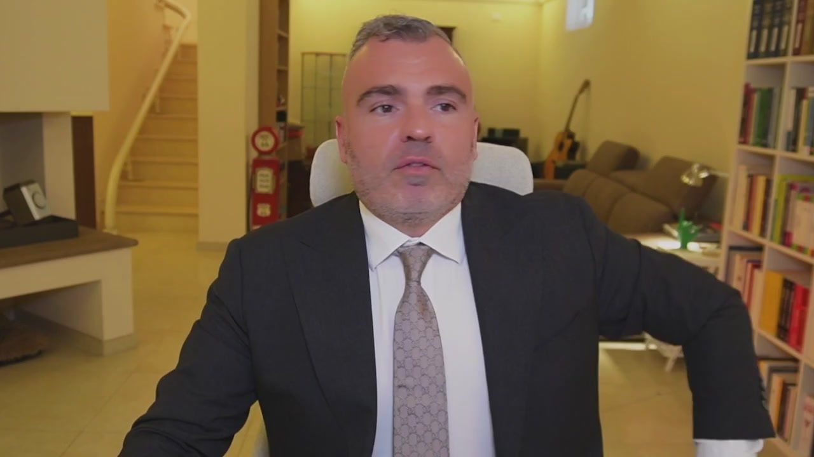
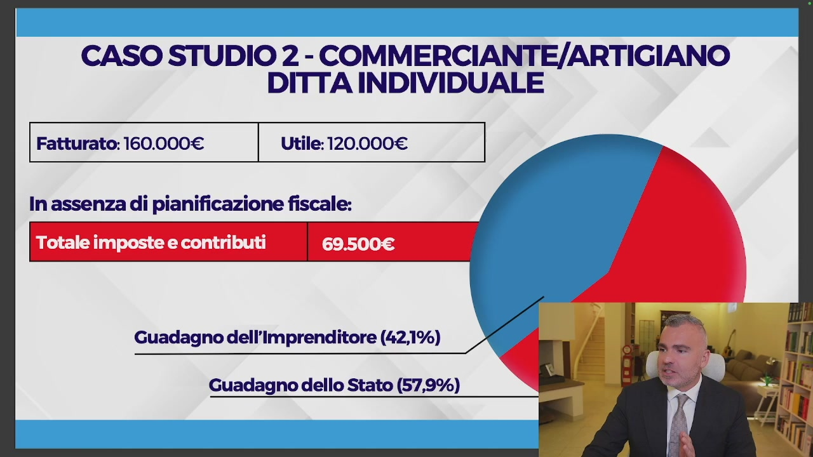
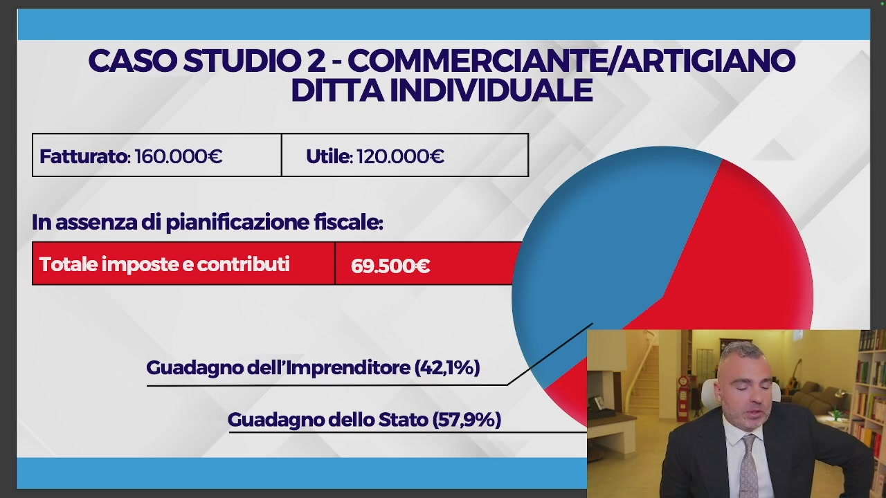
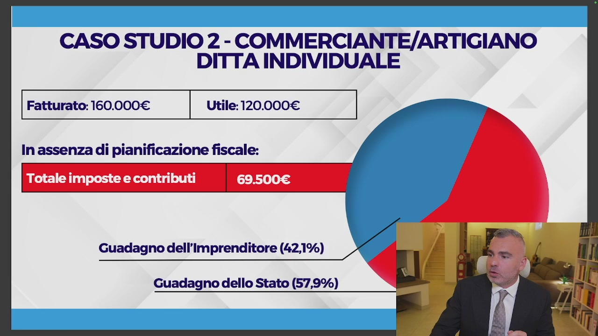
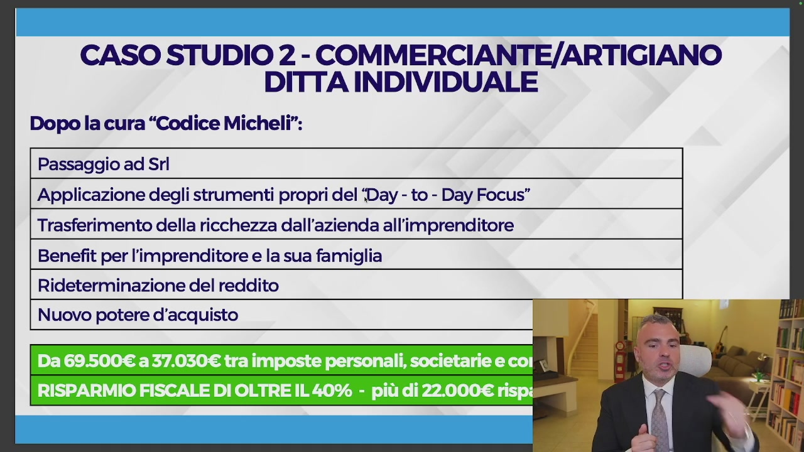
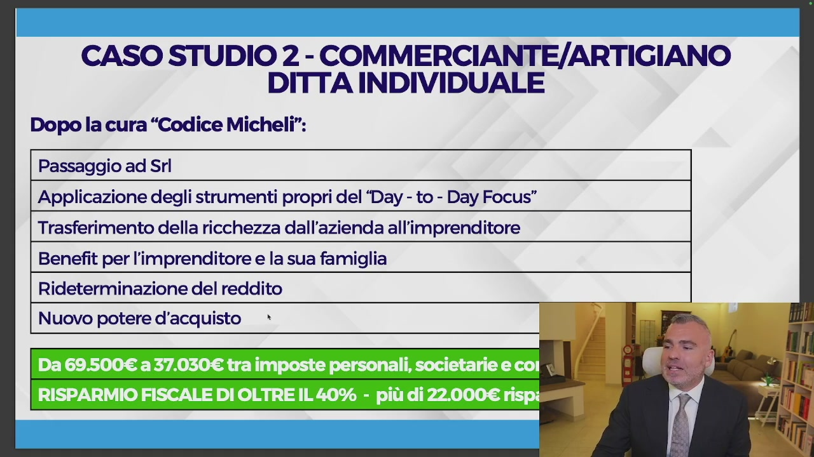
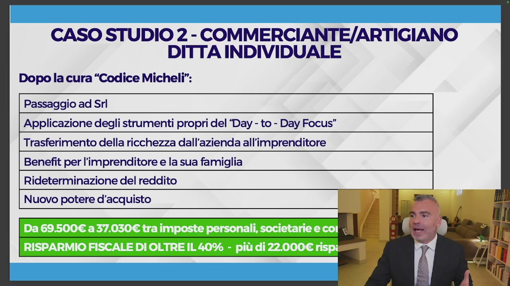

# 3. Caso studio n. 2 - Quando una srl ti cambia la vita: da ditta individuale a srl e da snc a srl

> Documento generato automaticamente: trascrizione e screenshot sincronizzati del video-corso.

## [00:00:00] Schermata 0 _(start)_

**Testo a schermo (OCR):** »;

> Vediamo adesso il passaggio da ditta individuale a SRL e se avanza anche qualche minuto possiamo fare delle osservazioni tra SNC e SRL nelle sue varianti, anche se devo dire che già con il video prossimo dove andremo a vedere le configurazioni in maniera più complessa – proprio andremo a disegnarle insieme – già si vedranno importanti differenze, soprattutto in termini di protezione patrimoniale e responsabilità patrimoniale. Accendiamo quindi le slide anche questa volta.

## [00:00:35] Schermata 1 _(scene)_

**Testo a schermo (OCR):** CASO STUDIO 2 - COMMERCIANTE/ARTIGIANO DITTA INDIVIDUALE Fatturato: 160.000€ Utile: 120.000€ | In assenza di pianificazione fiscale: Totale imposte e contributi Guadagno dell'Imprenditore (42,1%) Guadagno dello Stato (57,9%)

> Il caso studio numero due è un caso che io ho affrontato anche in diversi webinar ma che ora voglio darvelo con più consapevolezza. In questa situazione noi abbiamo un commerciante artigiano, commerciante barriere artigiano fatturato 160 mila utili a 120 mila, quindi un utile più alto rispetto all'esempio precedente. Se voi in ditta individuale avete questi numeri vi ritrovate con un totale di imposti e contributi intorno a 69 mila 500. Vedete il rosso è la fetta che spetta allo Stato, mentre il blu è la fetta che spetta all'imprenditore. Quando lo Stato si prende il 57,9 per cento, l'imprenditore si prende il 42,1 per cento. Ora ditemi voi se si può continuare in questa situazione.

## [00:01:35] Schermata 2 _(periodic)_

**Testo a schermo (OCR):** CASO STUDIO 2 - COMMERCIANTE/ARTIGIANO DITTA INDIVIDUALE Fatturato: 160.000€ Utile: 120.000€ | In assenza di pianificazione fiscale: Totale imposte e contributi Guadagno dell'Imprenditore (42,1%) Guadagno dello Stato (57,9%)

> In tanti vi diranno ma i contributi sono tuoi, sì, ma l'INPS lo devi vedere come soldi

## [00:01:38] Schermata 3 _(scene)_

> messi da parte per la tua previdenza. Io non so veramente come rimanere tranquillo di fronte a questa stronzata megagalattica. E qui mi quieto perché già in diverse occasioni rischio altrimenti di ledere l'onore, il decoro della persona. Perché? In maniera molto semplice, noi siamo in un sistema contributivo, prenderemo la pensione sulla base dell'ammontare dei contributi effettivamente versati, c'è comunque un massimo di contributi oltre il quale non versiamo, se voi impiegate i soldi che risparmiate con me in INPS sui

## [00:02:38] Schermata 4 _(periodic)_

> mercati finanziari, fra vent'anni vi ritrovate milioni di euro, cosa che non avverrà quando voi andate in pensione con l'INPS, l'INPS non vi stacca un assegno da un milione, se voi vi mettete da parte 30 mila euro l'anno per 30 anni, voi ragazzi quando andate in pensione vi prendete il vostro assegno di un milione, oppure lasciateli e prendete le rendite, questo è la realtà, poi basta fare qualsiasi calcolo con i software di calcolo di interesse

## [00:03:15] Schermata 5 _(scene)_

**Testo a schermo (OCR):** CASO STUDIO 2 - COMMERCIANTE/ARTIGIANO DITTA INDIVIDUALE Fatturato: 160.000€ Utile: 120.000€ | In assenza di pianificazione fiscale: Totale imposte e contributi Guadagno dell'Imprenditore (42,1%) Guadagno dello Stato (57,9%)

> composto. Questo è quanto si va a prendere lo Stato rispetto all'imprenditore, 57,9%, cerchiamo di capire che cosa abbiamo fatto, noi con il passaggio ad SRL abbiamo cominciato ad applicare gli strumenti del day to day focus, che li vedremo tutti nel modulo 3 e abbiamo quindi optato per quello che ho detto prima, il trasferimento della ricchezza dall'azienda all'imprenditore, questo è il punto fondamentale, come si calcolano le imposte, le imposte si calcolano ricavi meno costi, ricavi meno costi uguale imponibile, sull'imponibile ci si pagano le imposte, se nei costi noi abbiamo dei valori che possono essere portati all'imprenditore sotto le più varie forme, le vedremo dopo, l'imponibile è inferiore e quindi le imposte calcolate sono inferiori, si ci sono anche le imposte personali, infatti in questa simulazione

## [00:04:15] Schermata 6 _(periodic)_

**Testo a schermo (OCR):** CASO STUDIO 2 - COMMERCIANTE/ARTIGIANO DITTA INDIVIDUALE Dopo la cura “Codice Micheli”: Passaggio ad Srl | Applicazione degli strumenti propri del ‘Day - to - Day Focus” | Trasferimento della ricchezza dall'azienda all'imprenditore Benefit per l'imprenditore e la sua famiglia Rideterminazione del reddito Nuovo potere d'acquisto

> ne tengo di conto, ma a seconda dello strumento che noi utilizziamo queste le possiamo ridurre del 25-30-40%, lo vediamo nel modulo, in questo corso io vi porto alla fine e vi faccio capire, ma davvero, le faccio rimanere con, ma perché non me l'hanno mai detto, Emma il mio commercialista mi dice, Emma il mio consulente mi ha fatto, non venite da me a chiedermi, Emma mi puoi mandare il foglio perché il mio consulente, no, se il tuo consulente non ha la contezza di quello che è il risparmio fiscale e di quelle che sono le tecniche, non è un problema mio, è un problema tuo, quindi benefit per l'imprenditore e la sua famiglia, rideterminazione del reddito, nuovo potere d'acquisto rideterminato, qual è

## [00:05:15] Schermata 7 _(periodic)_

**Testo a schermo (OCR):** CASO STUDIO 2 - COMMERCIANTE/ARTIGIANO DITTA INDIVIDUALE Dopo la cura “Codice Micheli”: | Passaggio ad Srl | | Applicazione degli strumenti propri del ‘Day - to - Day Focus” | Trasferimento della ricchezza dall'azienda all'imprenditore Benefit per l'imprenditore e la sua famiglia | Rideterminazione del reddito | Nuovo potere d'acquisto *

> la differenza tra il potere d'acquisto e il reddito? Molto semplice, il potere d'acquisto sono quanti soldi te hai ogni mese che puoi spendere, il reddito sono quanti soldi che te hai ogni mese che lo Stato può tassare, è diverso. Noi siamo passati in questa simulazione da 69.500 Euro al mese a 37.030 Tra imposte personali, imposte societarie e contributi, un risparmio fiscale di oltre il 40%, 22.000 Euro di imposte risparmiate. Se io risparmio 22.000 Euro di imposte l'anno, questi soldi dove vanno?

## [00:06:01] Schermata 8 _(scene)_

> Nelle mie tasche, questo è il concetto, questo è quello che dobbiamo portare, questi sono i punti sui quali noi insieme dobbiamo andare a lavorare. Quindi vedete come questo passaggio

## [00:06:28] Schermata 9 _(scene)_

**Testo a schermo (OCR):** CASO STUDIO 2 - COMMERCIANTE/ARTIGIANO DITTA INDIVIDUALE Dopo la cura “Codice Micheli”: | Passaggio ad Srl | Applicazione degli strumenti propri del ‘Day - to - Day Focus” Trasferimento della ricchezza dall'azienda all'imprenditore Benefit per l'imprenditore e la sua famiglia | Rideterminazione del reddito | Nuovo potere d'acquisto

> con l'applicazione degli strumenti del date of focus che vediamo, abbiano consentito il trasferimento della ricchezza dall'azienda all'imprenditore attraverso un sistema di benefit sia per l'imprenditore che per la famiglia, che hanno consentito di rideterminare il reddito facendo sì che ci sia un nuovo potere d'acquisto rideterminato per l'imprenditore. Questo risparmio del 40%, 22.000 Euro di imposte, anche qui siamo a 22.000 Euro di imposte diviso 12, sono 1.800 Euro al mese in più nelle tasche dell'imprenditore.
