# 4. Caso studio n. 3 - Il binomio vincente: protezione patrimoniale e pianificazione fiscale per un gruppo di società

> Documento generato automaticamente: trascrizione e screenshot sincronizzati del video-corso.

## [00:00:00] Schermata 0 _(start)_

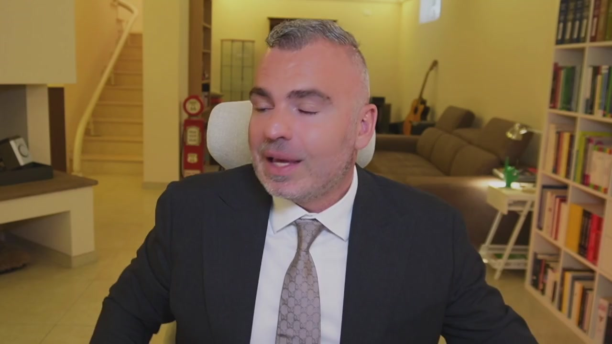

> Il caso studio 3 riguarda quello che noi chiamiamo il binomio vincente, quando andiamo ad unire, oltre alla pianificazione fiscale, la protezione patrimoniale. In questa lezione andiamo anche ad affrontare quello che ho introdotto nella precedente lezione all'inizio, ossia il passaggio eventuale fra una società e un nome collettivo, ovvero una SAS, in società di capitali. Andiamo a vedere insieme quelle che possono essere le strutture. Una struttura elementare è quella caratterizzata da ditta individuale o libero professionista,

## [00:00:36] Schermata 1 _(scene)_

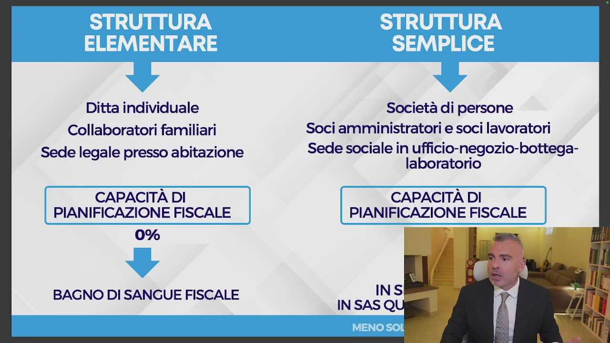

**Testo a schermo (OCR):** Ditta individuale Collaboratori familiari Sede legale presso abitazione CAPACITÀ DI | PIANIFICAZIONE FISCALE 0% BAGNO DI SANGUE FISCALE Società di persone Soci amministratori e soci lavoratori Sede sociale in ufficio-negozio-bottega- laboratorio CAPACITÀ DI PIANIFICAZIONE FISCALE —

> dove la sede legale è presso l'abitazione. Se volete posso anche fare così, almeno si vede meglio tutto. Dove la sede legale è presso l'abitazione. Non è proprio bellissimo, ma ci capiamo. E che si traduce in un vero e proprio bagno di sangue. Un bagno di sangue perché? Perché la capacità di pianificazione fiscale è lo 0%, quindi non ho tecniche e strumenti. Sono una situazione elementare che non è detto che non vada bene questa situazione elementare, ma ovviamente non è ottimizzata dal punto di vista fiscale.

## [00:01:36] Schermata 2 _(periodic)_

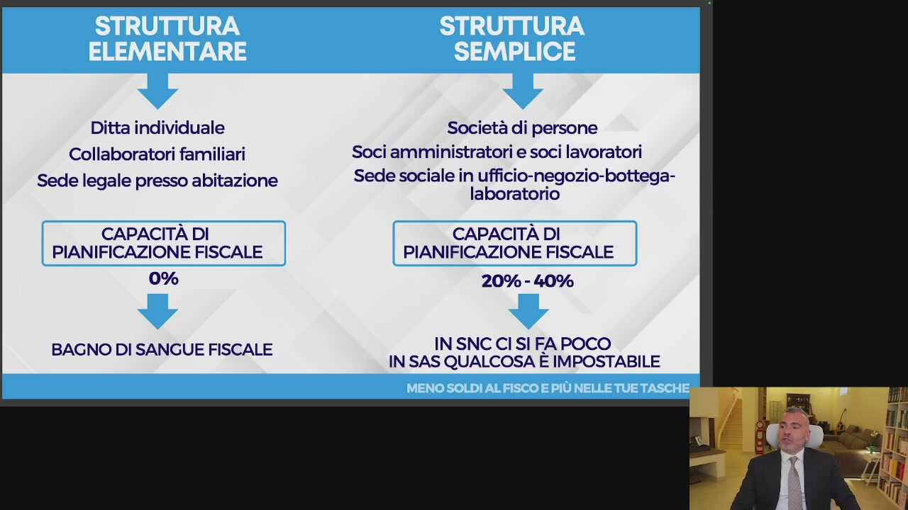

**Testo a schermo (OCR):** Ditta individuale Collaboratori familiari Sede legale presso abitazione CAPACITÀ DI PIANIFICAZIONE FISCALE 0% BAGNO DI SANGUE FISCALE Società di persone Soci amministratori e soci lavoratori Sede sociale in ufficio-negozio-bottega- laboratorio CAPACITÀ DI PIANIFICAZIONE FISCALE 20% - 40% IN SNC CI SI FA POCO IN SAS QUALCOSA E IMPOSTABILE

> Se noi invece ci spostiamo verso una struttura semplice, significa che noi già abbiamo una separazione patrimoniale fra quella che è l'azienda e quella che è la mia figura personale, anche se questo è lenito dalla cosiddetta responsabilità patrimoniale imperfetta. Perché i soci a comandatari nelle Sass e tutti nell'SNC rispondono con il proprio patrimonio sociale per le obbligazioni contratte. In maniera illimitata, quindi con tutti i propri beni presenti e futuri e in maniera solidale. In maniera solidale significa che il creditore può aggredire anche solo uno dei soci e poi eventualmente questo socio potrà rifarsi sugli altri, ma per tutto, non pro quota. Quindi se la società ha un debito di 100, sono due soci e il creditore può prendere anche tutti e 100 da uno.

## [00:02:36] Schermata 3 _(periodic)_

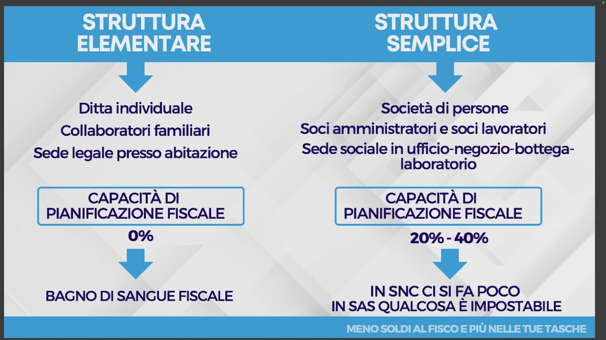

**Testo a schermo (OCR):** Ditta individuale Collaboratori familiari Sede legale presso abitazione CAPACITÀ DI PIANIFICAZIONE FISCALE 0% BAGNO DI SANGUE FISCALE Società di persone Soci amministratori e soci lavoratori Sede sociale in ufficio-negozio-bottega- laboratorio CAPACITÀ DI PIANIFICAZIONE FISCALE 20% - 40% IN SNC CI SI FA POCO IN SAS QUALCOSA E IMPOSTABILE

> E poi l'altro eventualmente si potrà rifare. In SNC si fa poco di pianificazione fiscale, in Sass qualcosa noi già possiamo fare e questa è una struttura semplice. Se noi invece ci orientiamo verso una struttura di capitale, noi abbiamo una società quindi a responsabilità limitata,

## [00:02:59] Schermata 4 _(scene)_

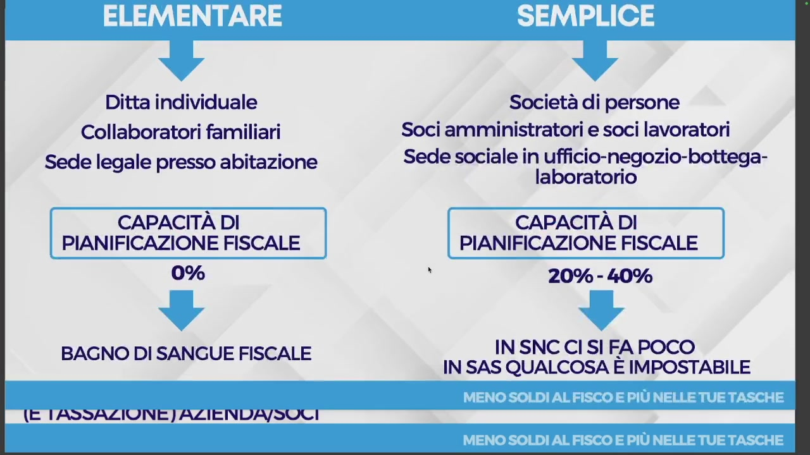

**Testo a schermo (OCR):** Ditta individuale Collaboratori familiari Sede legale presso abitazione CAPACITÀ DI PIANIFICAZIONE FISCALE 0% BAGNO DI SANGUE FISCALE (E TASSAZIONE ]) AZIENDA/SOLI Società di persone Soci amministratori e soci lavoratori Sede sociale in ufficio-negozio-bottega- laboratorio CAPACITÀ DI PIANIFICAZIONE FISCALE î 20% - 40% IN SNC CI SI FA POCO IN SAS QUALCOSA E IMPOSTABILE

> non voglio espormi su quelle che sono le società per azioni eccetera. C'è la presenza del socio amministratore, c'è la presenza del socio lavoratore, c'è sia il socio amministratore che il lavoratore. Possiamo gestire una situazione con più soci, con amministrazione sia congiunta che disgiunta e separazione a seconda della complessità. Possiamo apportare il know-how all'azienda, possiamo quindi creare meccanismi per percepire proventi dall'azienda sotto forma di royalties, che spiegherò nel modulo 3. Quindi non preoccupatevi se al momento ancora qualche informazione vi manca. Non è questo il punto.

## [00:03:59] Schermata 5 _(periodic)_

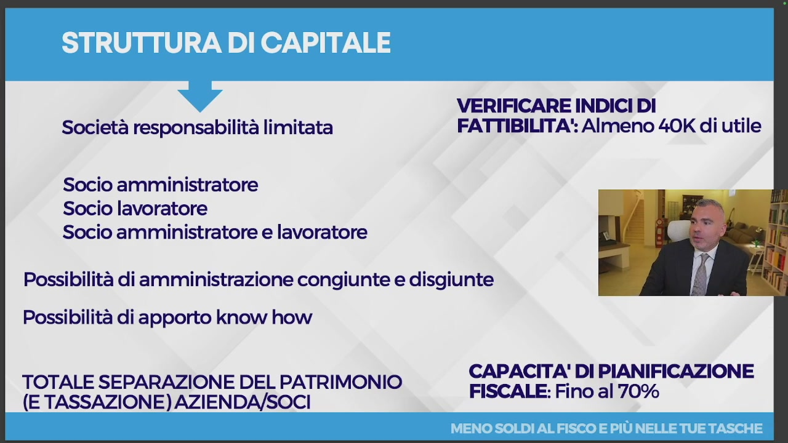

**Testo a schermo (OCR):** VERIFICARE INDICI DI Società responsabilità limitata FATTIBILITA': Almeno 40K di utile Socio amministratore Socio lavoratore Socio amministratore e lavoratore Possibilità di amministrazione congiunte e disgiunte Possibilità di apporto know how CAPACITA' DI PIANIFICAZIONE TOTALE SEPARAZIONE DEL PATRIMONIO TA (E TASSAZIONE) AZIENDA/SOCI FISCALE: Fio 0%

> Che cosa abbiamo quale vantaggio? Abbiamo una totale separazione del patrimonio dall'azienda e soci e una totale separazione anche della tassazione fra l'azienda e soci. Quindi possiamo lavorare in pianificazione sia da una parte che dall'altra. Quale indice di fattibilità? Io direi che già con 40 mila euro di utili è una situazione che possiamo valutare anche per i liberi professionisti, soprattutto, scusate questa cosa della seggiola che sembra che faccia cose particolari, quindi 40 mila euro di utile anche per i liberi professionisti i quali possono avvalersi delle STP. Abbiamo una capacità di pianificazione fiscale fino al 70% della possibilità di utilizzo degli strumenti. Possiamo abbattere il carico fiscale notevolmente fino al 70%. Io parlo fino, poi ovviamente va visto, dipende dalle dimensioni dell'azienda e dalle particolarità dell'azienda.

## [00:04:59] Schermata 6 _(periodic)_

**Testo a schermo (OCR):** VERIFICARE INDICI DI Società responsabilità limitata FATTIBILITA': Almeno 40K di utile Socio amministratore Socio lavoratore Socio amministratore e lavoratore Possibilità di amministrazione congiunte e disgiunte Possibilità di apporto know how CAPACITA' DI PIANIFICAZIONE TOTALE SEPARAZIONE DEL PATRIMONIO TA (E TASSAZIONE) AZIENDA/SOCI FISCALE: Fino al 70%

> Però la struttura di capitale già mi dà questa separazione. Rispetto alla SAS e alla SNC ho il vantaggio della responsabilità patrimoniale limitata per le obbligazioni sociali.

## [00:05:12] Schermata 7 _(scene)_

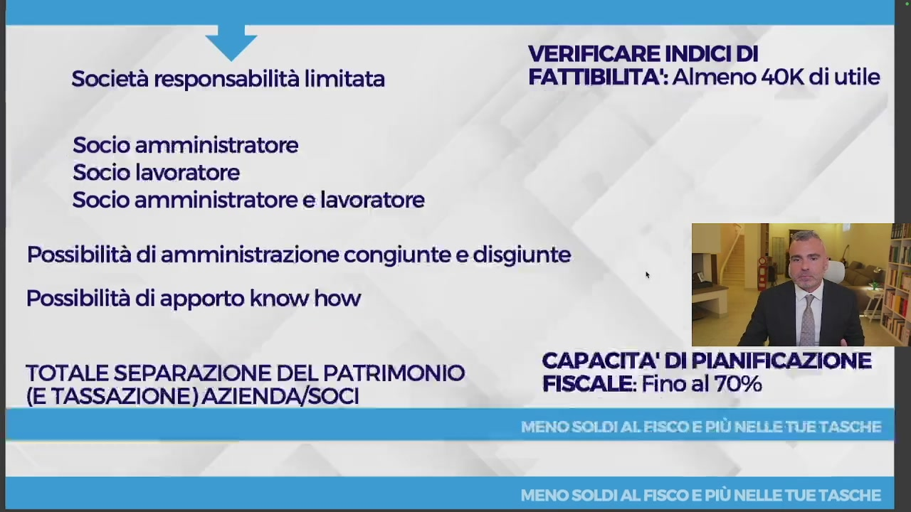

**Testo a schermo (OCR):** VERIFICARE INDICI DI a Società responsabilità limitata FATTIBILITA': Almeno 40K di utile Socio amministratore Socio lavoratore Socio amministratore e lavoratore Possibilità di amministrazione congiunte e disgiunte Possibilità di apporto know how CAPACITA! DI PIANIFICAZIONE TOTALE SEPARAZIONE DEL PATRIMONIO fi: (E TASSAZIONE) AZIENDA/SOCI FISCALE: Fino al 70%

> Possiamo ancora evolvere, andare verso una struttura di capitale ma complessa, con una holding che fa da madre e un'operativa che fa da figlia. Oppure se noi abbiamo già, ad esempio, una società SRL che detiene degli immobili, noi possiamo fare il cosiddetto spin-off operativo andando a separare le attività operative soggette a rischio dal patrimonio immobiliare o mobiliare della nostra azienda. Vedete come la struttura si può aggiustare in funzione delle tue esigenze. Così che cosa otteniamo? Otteniamo sia la protezione patrimoniale sia la possibilità di reinvestimento.

## [00:06:12] Schermata 8 _(periodic)_

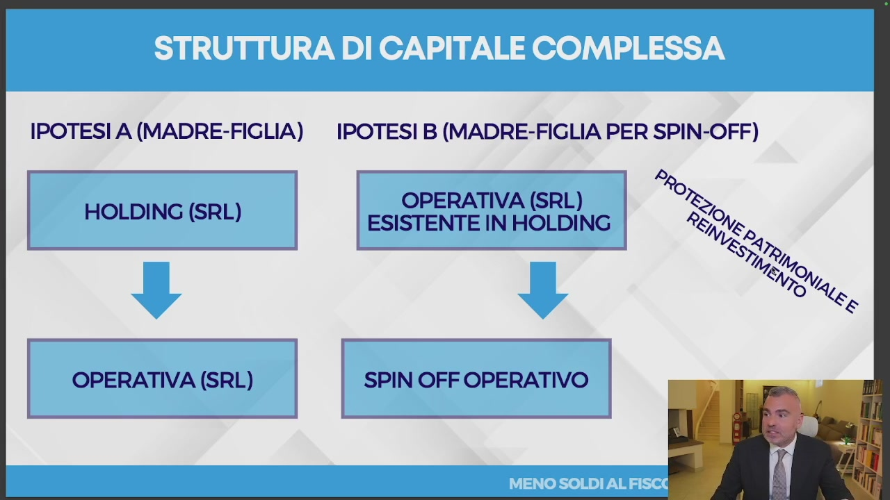

**Testo a schermo (OCR):** IPOTESI A (MADRE-FIGLIA) IPOTESI B (MADRE-FIGLIA PER SPIN-OFF) OPERATIVA LEI HOLDING 1 Hononese) © LEI IN HOLDING OPERATIVA (SRL) SPIN OFF OPERATIVO

> Vedete una struttura di capitale complessa dove una o più persone detengono il capitale, hanno quindi una holding sotto forma di SRL, la madre detiene il capitale di una o più figlie, che può essere un'operativa 1 o un'operativa 2. Ad esempio un'operativa 2 potrebbe essere una società che fa flipping immobiliare, perché una domanda che mi viene spesso chiesta è posso fare compravendita immobiliare con la mia holding? La compravendita immobiliare assorge che l'immobile in questo caso sia un benemerce e quindi acquisto l'immobile per rivendolo, magari lo ristrutturo, c'è il rischio di impresa. Quindi generalmente, dipende dalle dimensioni, andiamo a fare un SRL immobiliare,

## [00:07:12] Schermata 9 _(periodic)_

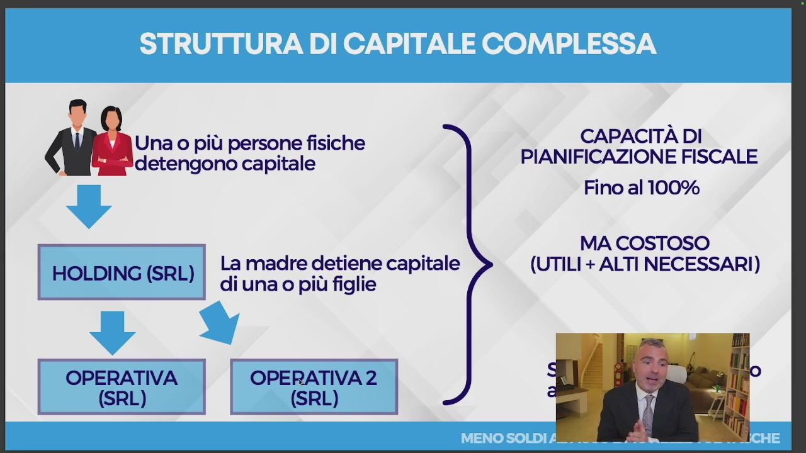

**Testo a schermo (OCR):** Una o più persone fisiche idetengono capitale La madre detiene capitale HOLDING (SRL) di una o più figlie OPERATIVA OPERATIVA 2 (SRL) (SRL) CAPACITÀ DI PIANIFICAZIONE FISCALE Fino al 100% MA COSTOSO (UTILI + ALTI NECESSARI)

> magari figlia della holding, così che l'operativa fa i soldi, distribuisce gli utili all'holding, la quale holding fa i finanziamenti soci all'operativa 2. Abbiamo protezione patrimoniale, reinvestimento. La capacità di pianificazione fiscale è del 100%, non vuol dire che non pago tasse, che risparmio al 100%, vuol dire che posso applicare tutti gli strumenti che l'esitlatore mi dà. Con questo intendo il 100%. È costoso, è necessaria una struttura che produce utili più alti, perché comunque non voglio più abbattere l'utile, ma voglio fare in modo di ottimizzare il prelevo fiscale sulla mia posizione personale, dove risparmio a livello di imposte e poi faccio più utili possibili. So che sugli utili pago all'incirca il 27% di imposte più IRAP. Mando tutti i soldi alla holding, così ho capacità di reinvestimento e separazione patrimoniale. Allora, l'esempio è quello che ho fatto io.

## [00:08:12] Schermata 10 _(periodic)_

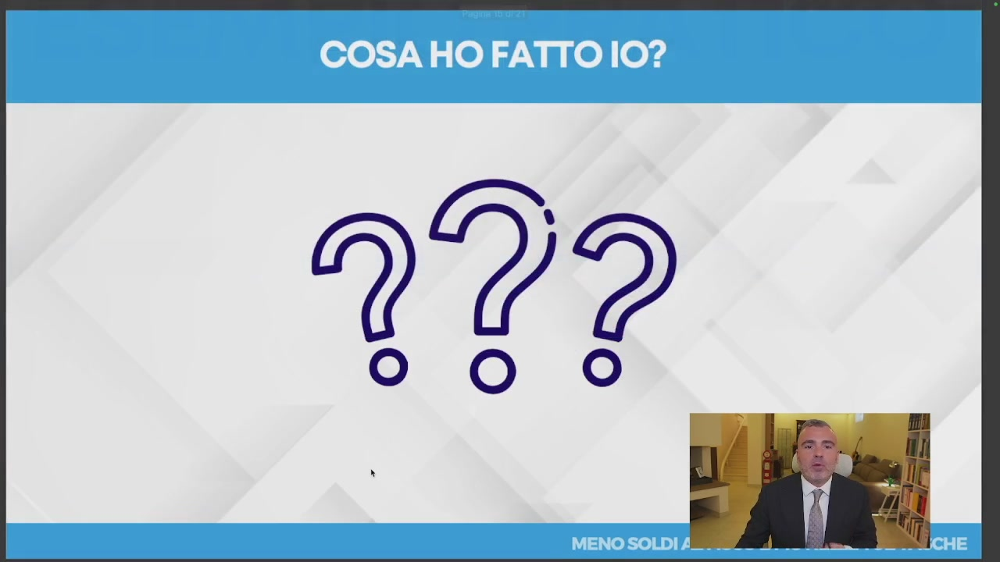

> Io, ad esempio, sono arrivato ad una situazione di protezione patrimoniale e utilizzo del 100%, pur senza una holding pura. Io, ad esempio, ho un'operativa, un'altra operativa e un'altra operativa, dove magari non sono socio, ma ho degli incarichi amministrativi e affari legali. Ora, io mi sono ulteriormente evoluto e nell'ultimo anno ho costruito una situazione ancora diversa,

## [00:08:48] Schermata 11 _(scene)_

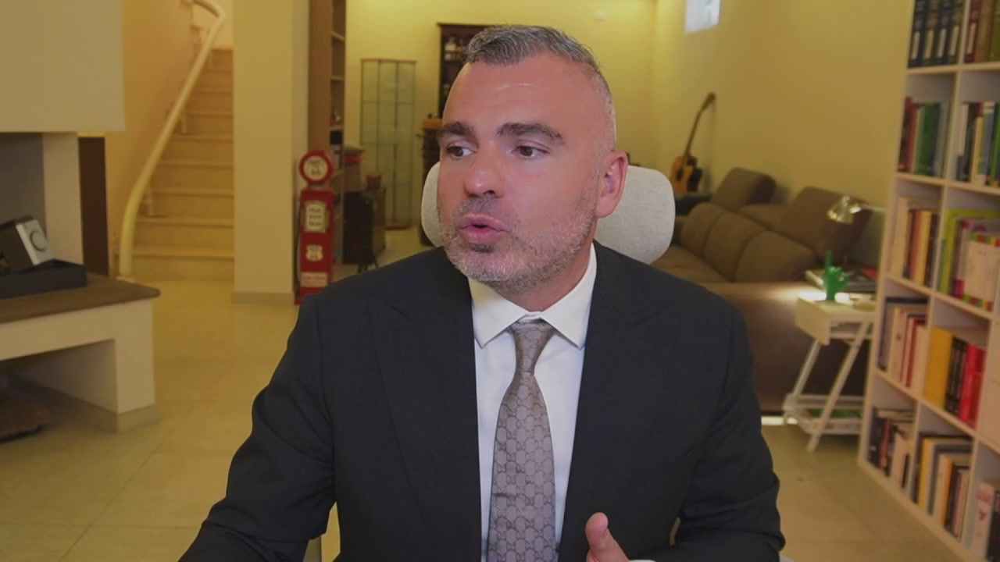

> dove io sono l'unico socio di una società holding mista, la quale ha una società operativa, più ho un'altra società non connessa alla holding, per svariati motivi, che mi porteranno comunque a connetterla nel prossimo periodo breve. Quindi, ecco come noi possiamo strutturare, da una struttura elementare a una struttura di capitale complessa, ottimizzando al massimo quelli che sono i tuoi valori e le tue efficienze. Ed è questo quello che facciamo noi con il team.
