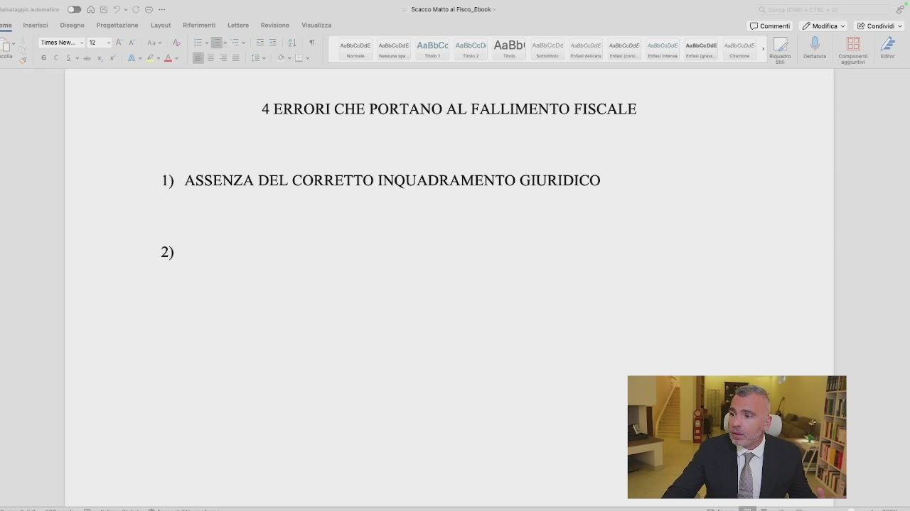
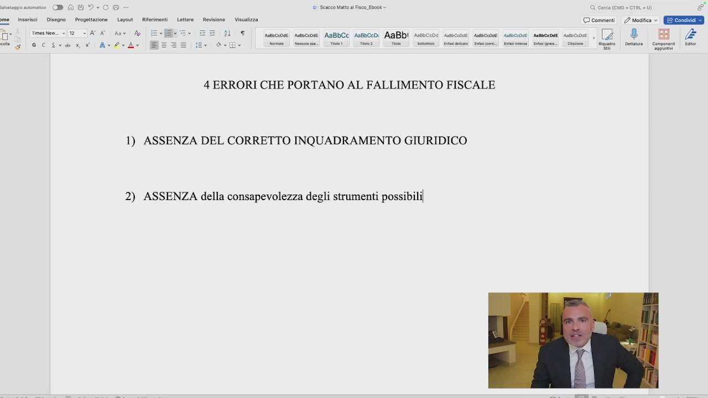
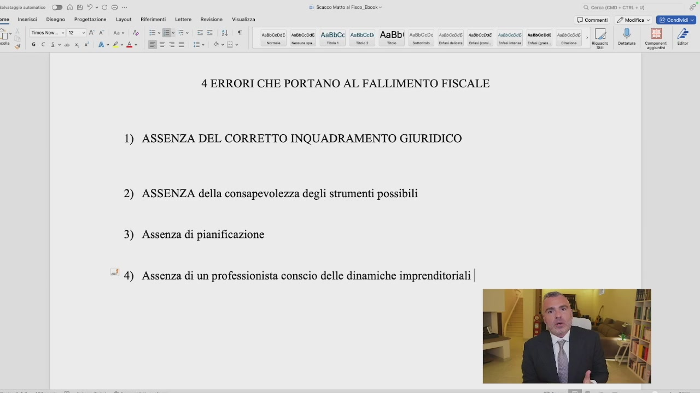
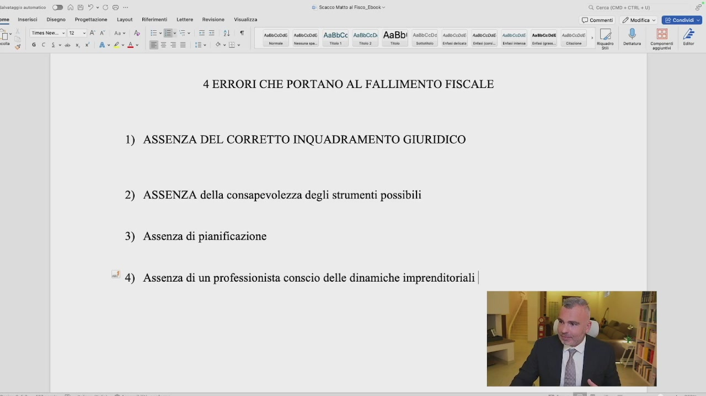

# 1. 4 errori che portano al fallimento fiscale

> Documento generato automaticamente: trascrizione e screenshot sincronizzati del video-corso.

## [00:00:00] Schermata 0 _(start)_

> Sono principalmente quattro i motivi per cui si arriva al cosiddetto fallimento fiscale. Che cos'è il fallimento fiscale? Innanzitutto non sto parlando del fallimento nel termine così brutto e oscuro dell'intervento giudiziale nella vostra azienda. Il fallimento fiscale così come intendiamo nei nostri termini è quando più del 50% dei nostri profitti se ne va in imposte e contributi. Questo è un fallimento fiscale perché noi stiamo perdendo, tu stai perdendo, competitività nei confronti dei tuoi diretti competitor e nei confronti del mercato. Sei costretto a vendere a quel prezzo, non puoi muoverti di lì e il tuo profitto se ne va nelle tasche dello Stato, che sono tasche bucate e ormai lo sappiamo. Quali sono i motivi che mi portano a questo e che ho già venatamente introdotto nel primo modulo e che dirò come risolverlo nel terzo modulo. Il primo, senza ombra di dubbio, tutti hanno

## [00:01:00] Schermata 1 _(periodic)_

## [00:01:08] Schermata 2 _(scene)_

**Testo a schermo (OCR):** Sacco Matto a Fisco. Ebook E © commenti / Modifica » E Condiai + (o) e AaBbCc Asboceni AaBb! 4 ERRORI CHE PORTANO AL FALLIMENTO FISCALE D)

> una caratteristica comune, è l'assenza di un qualcosa. Quando ti mancano questi elementi ecco che si arriva al crack totale. Il primo è l'assenza del corretto inquadramento. Allora eccoci qua, scriviamo assenza del corretto inquadramento giuridico. Abbiamo visto come la SRL non sia la forma migliore necessariamente per fare impresa, ma abbiamo visto come nella maggior parte dei casi per fatturati sopra i 100.000 Euro la ditta individuale sia il peggiore. Quindi l'assenza del corretto inquadramento giuridico, quindi sono correttamente inquadrato, è corretto essere in sasso in questo momento secondo i miei numeri, secondo le mie forze, secondo le mie caratteristiche oggettive e soggettive, oppure no? Ma questo è il punto

## [00:02:08] Schermata 3 _(periodic)_

**Testo a schermo (OCR):** Jon Vataza © comment. 2 esi ©. (Eee ÎL UT. sesso! smcose ABLCC Assbcodi AABDI Assocone sacose seeccose suscose semceoan secco , [4 ® BA ove DAG? me inserisci Disegno | Progettazione Layout if Times hem. «iz > ATA Ant A gd GC Av2eA see | rom! Ta Teo Tie | te | mai fine.) Cimino i. ine |” Riso | on Coen lr 4 ERRORI CHE PORTANO AL FALLIMENTO FISCALE 1) ASSENZA DEL CORRETTO INQUADRAMENTO GIURIDICO © dl îi

> fondamentale. Questa valutazione, no non ti conviene andare in SRL, sì ti conviene essere

## [00:02:14] Schermata 4 _(scene)_

> in sasso eccetera, è basata su una percezione o è basata su una simulazione con dei numeri e con dei dati? E su questo io non transigo perché troppe volte ho avuto dei professionisti che mi hanno detto, il mio consulente mi ha detto che non mi conviene. Caccia i numeri! Caccia i numeri! Dov'è la simulazione con l'applicazione degli strumenti che mi dice che mi conviene o non mi conviene? L'hai fatta? Ce l'abbiamo sotto mano? Abbiamo una scelta ponderata? Le caratteristiche oggettive della tua azienda in termini di fatturato, attività eccetera eccetera, le caratteristiche soggettive sia quanti soldi vuoi, quanti soldi bisogno, chi è che compone la tua società, sono state analizzate? Quando allora abbiamo contezza di tutto e abbiamo valutato

## [00:03:14] Schermata 5 _(periodic)_

> tutti i possibili scenari comprendendoli, allora possiamo dire se siamo correttamente inquadrati o no, altrimenti dobbiamo fare questa valutazione. Secondo, seconda assenza è l'assenza della

## [00:03:27] Schermata 6 _(scene)_

**Testo a schermo (OCR):** Seneca atto al Fisco Ebook nteccose. susscose AaBbCC Aaebceoi AaBbI 4 ERRORI CHE PORTANO AL FALLIMENTO FISCALE 1) ASSENZA DEL CORRETTO INQUADRAMENTO GIURIDICO 2) © commenti 2 Modica » E Condiai

> consapevolezza degli strumenti possibili. Gli strumenti possibili sono gli strumenti possibili a seconda delle tue caratteristiche oggettive e soggettive che sono quelle che ho detto prima. Se io non conosco gli strumenti, ma non di nome ma anche di funzionamento, allora io non posso applicarli. L'imprenditore è colui che impiega dei mezzi e coglie delle opportunità e sa anche individuare e trovare queste opportunità. Se non sa coglierle, anzi se non le conosce non può coglierle. Ragazzi la fortuna esiste fino a un certo punto, ma la fortuna è anche il risultato delle azioni che noi mettiamo in piedi. Quindi se io non conosco gli

## [00:04:27] Schermata 7 _(periodic)_

**Testo a schermo (OCR):** a me inserisci Disegno | Progettazione Layout Ri 15) 3 Sescco Matto al Fisco. Ebook © comment. 2 mesi © GEE Times nem «12 <]AV AO Ane Ao numscose nmceose AaBbCc Andbcodi AABDI Assscco sumccose asseccose suscose semcenas secco , [Z ® BA 2 Ana Art a i Gi si Conai Cino) se alpe e 4 ERRORI CHE PORTANO AL FALLIMENTO FISCALE 1) ASSENZA DEL CORRETTO INQUADRAMENTO GIURIDICO 2) ASSENZA della consapevolezza degli strumenti possibilil

> strumenti possibili e la loro concreta attuazione nei loro limiti e nelle loro possibilità, io non ho possibilità di ottimizzazione fiscale. Un altro errore molto comune che porta al fallimento è l'assenza ovviamente di pianificazione, perché io posso essere inquadrato dal punto di vista giuridico in maniera corretta, posso essere conscio degli strumenti che ho, ma sto navigando a vista, non ho messo in piedi una simulazione prima del calcolo delle imposte. Io non posso arrivare a fine

## [00:05:19] Schermata 8 _(scene)_

> anno e rinvenirmi in quel momento che l'anno dopo pagherò troppe imposte. Io devo pianificare prima le azioni necessarie per fare in modo che la pianificazione fiscale sia effettuata 12 mesi su 12, per non ritrovarmi con le sorprese degli F24 del 30 giugno. Inquadrato giuridicamente, conscio degli strumenti possibili, pianifico e strutturo al meglio quello che devo andare a fare. Solo in questo modo io posso ottenere risultati in termini di pianificazione fiscale. Quarto punto riguarda l'assenza di un professionista conscio. Uno conscio delle dinamiche imprenditoriali

## [00:06:06] Schermata 9 _(scene)_

**Testo a schermo (OCR):** Seco Matt al Fisco Ebok mesto. nuto rmscase AGBbCC Anshceni AABDI sssscco 1 nacea 4 ERRORI CHE PORTANO AL FALLIMENTO FISCALE 1) ASSENZA DEL CORRETTO INQUADRAMENTO GIURIDICO 2) ASSENZA della consapevolezza degli strumenti possibili 3) Assenza di pianificazione 1) 4) © commenti |. / Modifica » E Condividi + (o)

> e non è un'assenza, è la presenza. La presenza di un professionista troppo conservativo. Dal primo punto di vista, perché le dinamiche imprenditoriali? Perché il professionista che ti segue nella costruzione del tuo business tax plan, oggetto e documento che approfondiremo nella prossima lezione, se non è in grado di capire come funziona l'imprenditoria, ci ritroviamo di

## [00:07:06] Schermata 10 _(periodic)_

**Testo a schermo (OCR):** DAG?-CS Scacco alto al Fisco. Ebook. Visa © comment | 2 mesi © EEE inserisci | Disegno — Progettazione Layout. __ Rit time 1 SATA An fo 7 spa qeeee dI1 N A al e fa a e ae ee 4 ERRORI CHE PORTANO AL FALLIMENTO FISCALE 1) ASSENZA DEL CORRETTO INQUADRAMENTO GIURIDICO 2) ASSENZA della consapevolezza degli strumenti possibili 3) Assenza di pianificazione *! 4) Assenza di un professionista conscio delle dinamiche imprenditoriali |

> fronte a un professionista che fa il calcolo delle imposte e va benissimo, purché il calcolo delle imposte lo faccia bene, sono sicuro che il vostro professionista nel 99,9% dei casi il calcolo delle imposte lo fa bene. Poi abbiamo la pianificazione fiscale che è un'altra cosa della quale bisogna discutere apertamente con il proprio consulente, che riguarda invece l'ottimizzazione, sì, dei conti, ma dal punto di vista fiscale. L'assenza di questo è un problema. Troppe volte ci ritroviamo di fronte al professionista che trova le soluzioni per non farti fare le cose, quindi o ha bisogno necessariamente, sempre e comunque, dell'interpello che dica che si possa fare. La legge dal punto di

## [00:08:06] Schermata 11 _(periodic)_

**Testo a schermo (OCR):** Visa © comment. 2 esito © Ere 1 umcon pinco Ance Mico) ADBDI Hoc: carie cacca vecia nese sn, 2 DN 4 ERRORI CHE PORTANO AL FALLIMENTO FISCALE 1) ASSENZA DEL CORRETTO INQUADRAMENTO GIURIDICO 2) ASSENZA della consapevolezza degli strumenti possibili 3) Assenza di pianificazione «' 4) Assenza di un professionista conscio delle dinamiche imprenditoriali |

## [00:08:07] Schermata 12 _(scene)_

> vista civilistico-tributario non ti dice questo lo puoi fare, ti dice quali sono i limiti e gli strumenti utilizzabili. Il se lo puoi fare è frutto di un'interpretazione che l'imprenditore fa nel suo caso specifico. L'interpretazione a volte troppo restrittiva mette a rischio il business. Noi viviamo in un'economia aperta dove gli strumenti non sono più a pannaggio delle sole grandi imprese, dove noi possiamo strutturare sulla base delle nostre caratteristiche quelle che sono le tecniche che portano al risparmio fiscale. L'insieme di questi quattro errori, o a volte anche solo uno di questi, porta al fallimento fiscale.
