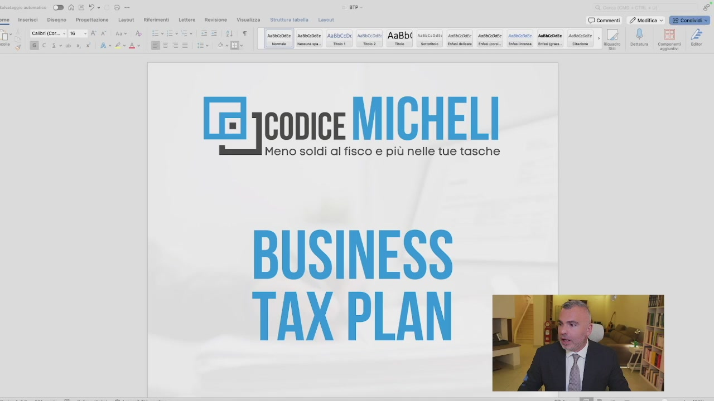
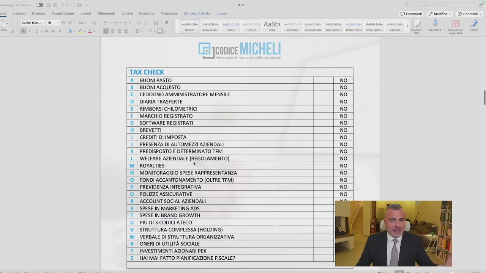
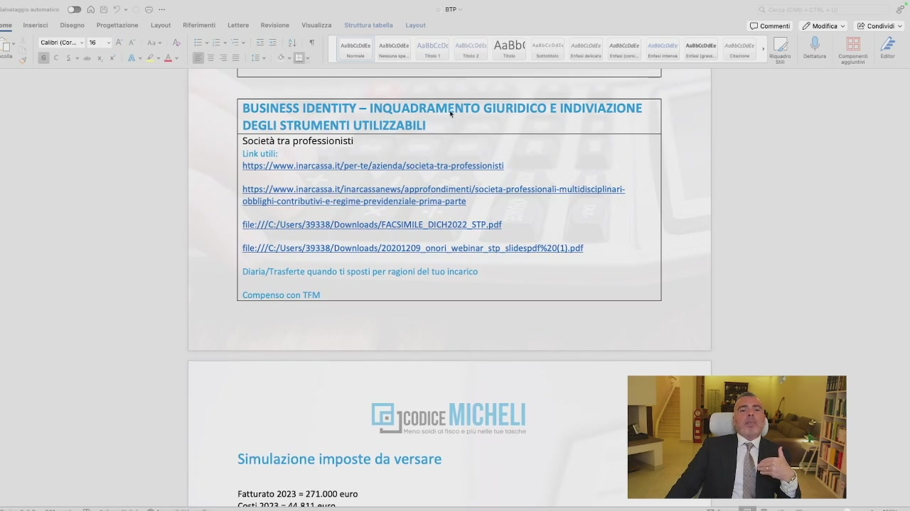
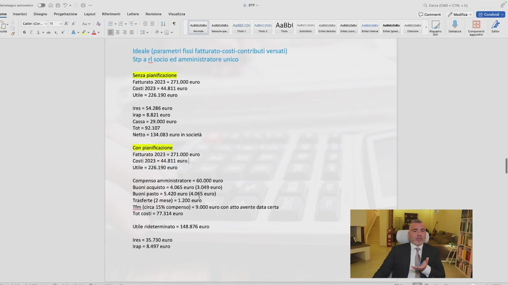
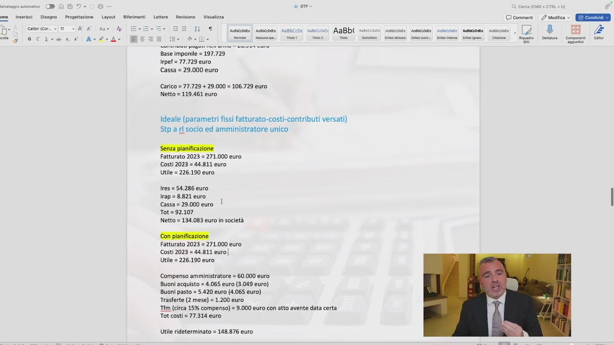
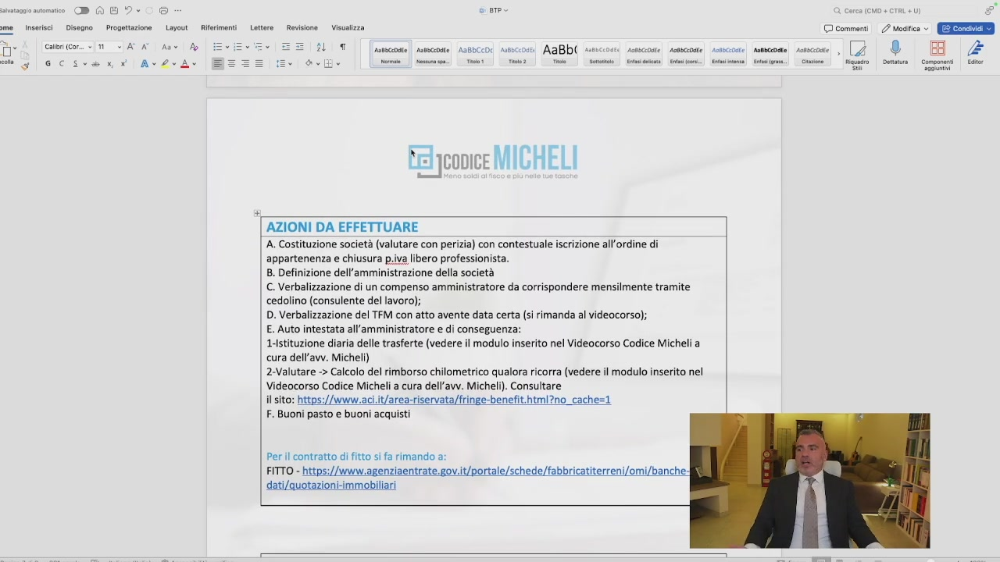
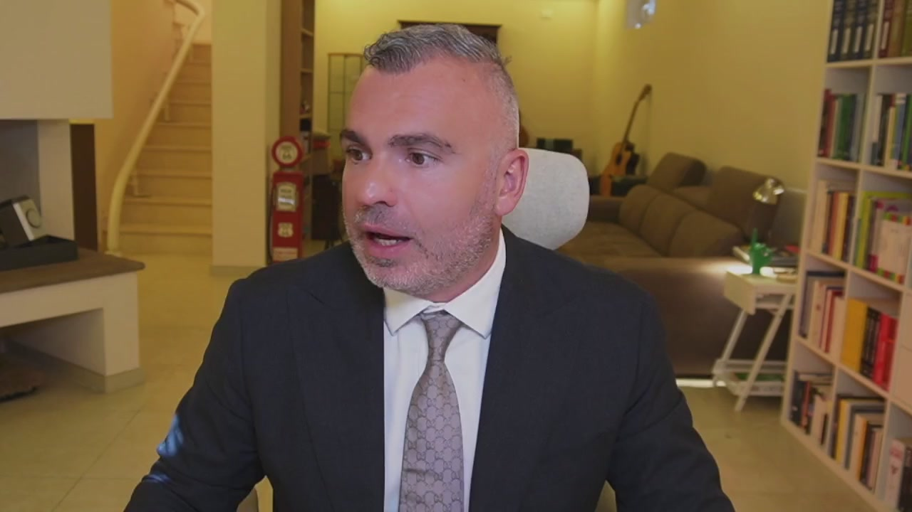
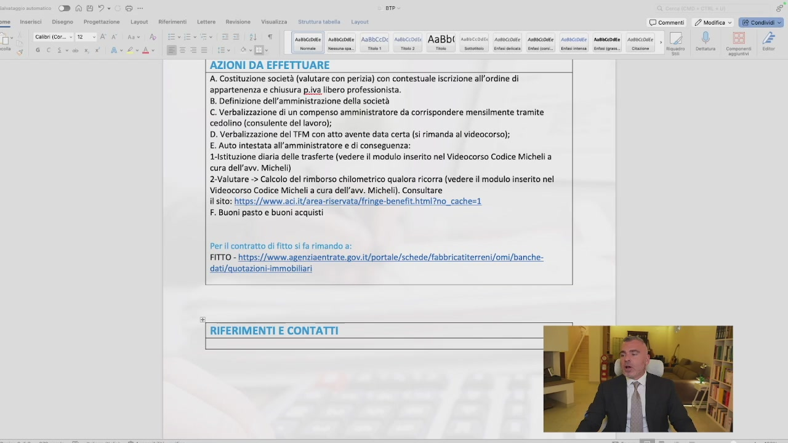
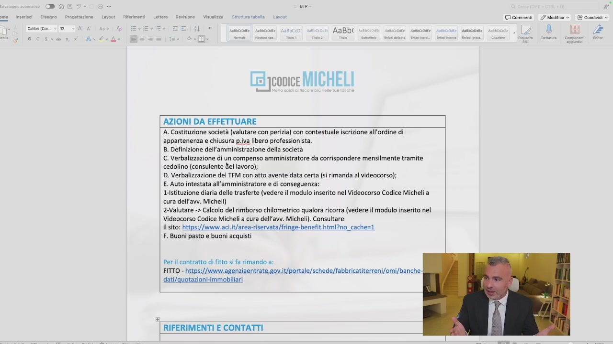
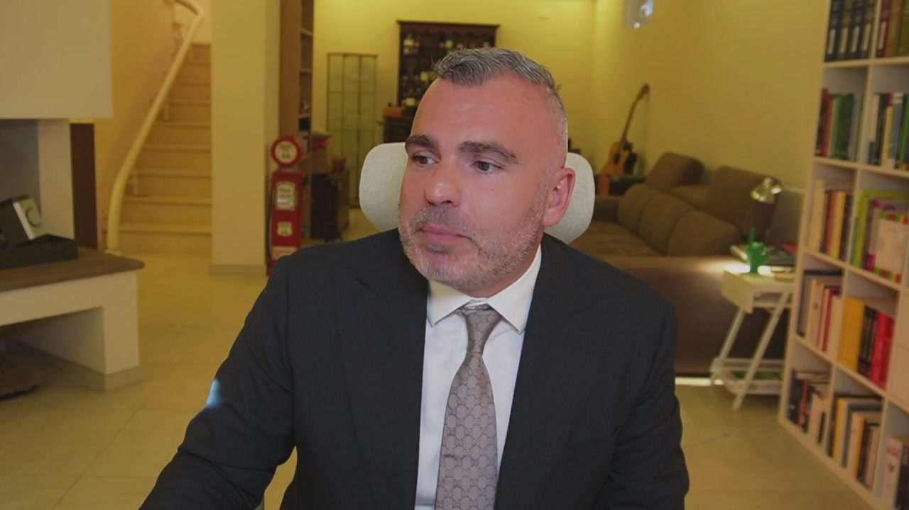

# 2. Business Tax Plan: usalo per pagare meno tasse

> Documento generato automaticamente: trascrizione e screenshot sincronizzati del video-corso.

## [00:00:00] Schermata 0 _(start)_

> È attraverso un documento ben preciso che ho inventato io, che si chiama Business Tax Plan, che andiamo a guidare l'imprenditore nelle sue scelte di pianificazione fiscale, secondo l'importanza che ho detto nelle lezioni precedenti, durante tutto l'anno e negli anni a venire, con importanti risvolti dal punto di vista del risparmio. Come funziona il Business Tax Plan e che cos'è ve lo faccio vedere direttamente a schermo, inquadrandovi un Business Tax Plan.

## [00:00:39] Schermata 1 _(scene)_

**Testo a schermo (OCR):** | sntbccdate|| astacidste AnBbCCOC ammuccose ObCeOAEe! ASMbCeOste- Anbtedte Anne Led pconice MICHELI Meno soldi al fisco e più nelle tue tasche BUSINESS TAX PLAN

> Il Business Tax Plan è un documento composto da due fasi. La prima fase, quella che noi chiamiamo Tax Check, è la fase nel quale si va attraverso un'intervista molto importante, una profilazione molto importante delle caratteristiche oggettive e soggettive dell'azienda, a delineare la situazione attuale. E dalla situazione attuale, dalla consapevolezza della situazione attuale, andiamo a analizzare gli scenari possibili e una volta individuato lo scenario migliore, andiamo a individuare le azioni necessarie per poterlo perseguire nel più breve tempo possibile. Qua c'è una grafica. Ecco che nella lezione tecnica noi andiamo ad analizzare la situazione attuale. Si guarda il fatturato, si guarda il previsionale e le previsioni per gli anni a seguire quando sono possibili. Quindi vediamo che cosa uno fa, che cosa potrebbe fare, che cosa non fa, attraverso anche un questionario che noi, appunto, Tax Check,

## [00:01:39] Schermata 2 _(periodic)_

**Testo a schermo (OCR):** PAL vl | cameritcor. «16 «AA ROS LA Riterimonti Lettore AaBb( Cel jconice MICHELI FONDI ACCANTONAMENTO (OLTRE TFM) PREVIDENZA INTEGRATIVA POLIZZE ASSICURATIVE ACCOUNT SOCIAL AZIENDALI SPESE IN MARKETING ADS SPESE IN BRAND GROWTH PIÙ DI 3 CODICI ATECO STRUTTURA COMPLESSA ING) VERBALE DI STRUTTURA ORGANIZZATIVA ONERI DI UTILITÀ SOCIALE <|x| INVESTIMENTI AZIONARI PEX 2 | HAI MAI FATTO PIANIFICAZIONE FISCALE? TAX CHECK A] BUONI PASTO No ®_| BUONI ACQUISTO No © ] CEDOLINO AMMINISTRATORE MENSILE No [[D_ DIARIA TRASFERTE No E | RIMBORSI CHILOMETRICI No [E MARCHIO REGISTRATO No |[G_] SOFTWARE REGISTRATI No H | BREVETTI No I | CREDITI DI IMPOSTA No )_| PRESENZA DI AUTOMEZZI AZIENDALI No X_] PREDISPOSTO E DETERMINATO TEM, No È | WELFARE AZIENDALE (REGOLAMENTO) No M | ROVALTIES x No N | MONITORAGGIO SPESE RAPPRESENTANZA No O P. Q R s T ÙU [vi w © commenti 2 Mosca © ® condi ©

> che noi riportiamo all'interno, sono due documenti ma li andiamo ad unire, dove si va proprio a fare una lista delle cose che una persona fa o non fa. Guardate questa. No, no, no, no. Su 20 parametri neanche uno è stato fatto. Ma guardate bene che questa è la situazione che si viene a verificare nel 90%, forse anche di più, delle aziende alle quali ci rivolgiamo. Più di 500 imprenditori nell'ultimo anno e mezzo entrati nei nostri programmi individuali e personalizzati di risparmio fiscale hanno questa situazione. Questo è sintomo di due cose. La prima è che possiamo fare un importante risparmio fiscale. La seconda è che c'è molta, molta strada dal punto di vista dell'educazione fiscale che dobbiamo mettere a terra. Analizzata quindi la situazione attuale e capiti quali sono gli strumenti che vengono messi in essere e se vengono messi in esseri, ecco che andiamo a proporre il corretto inquadramento giuridico.

## [00:02:39] Schermata 3 _(periodic)_

**Testo a schermo (OCR):** intorsci | Disegno — Progettazione Layout Riferimenti _ Lett Sa Celbritoor.. «| «AA gecl&|E=-2e 319 || | scae | sce x AaBb( cute rece BUSINESS IDENTITY — INQUADRAMENTO GIURIDICO E INDIVIAZIONE DEGLI STRUMENTI UTILIZZABILI Società tra professionisti Link utili hittps://www.inarcassa.It/per-te/azienda/societa:tra-professionisti https://www.inarcassa.it/inarcassanews/approfondimenti/societa-professionali-multidisciplinari- obblighi-contributivi-e-regime-previdenziale-prima-parte {ile:///C:/Users/39338/Downloads/FACSIMILE_DICH2022_STP.pdf file:///C:/Users/39338/Downloads/20201209 onori. webinar_stp. slidespdf920(1),.pdf Diaria/Trasferte quando ti sposti per ragioni del tuo incarico Compenso con TEM CE jconice MICHELI Simulazione imposte da versare Fatturato 2023 = 271.000 euro Laeti 2022 = AA 8341 sura © commenti / Modifica » E Condividi

> Vi ricordate il primo errore? L'assenza di corretto inquadramento giuridico con anche l'Inc. Qui sono stati messi anche l'Inc. Per far capire, guarda, questo lo puoi fare, questo c'è già scritto, abbiamo la certezza, non preoccuparti, tutto quello che facciamo nell'ambito della legalità, stiamo correttamente utilizzando le innumerevoli migliaia di leggi che ci sono dal punto di vista fiscale e, non so, anche amministrativi. Abbiamo fatto una simulazione delle imposte da avversare sia con la situazione attuale sia con le situazioni ideali. Vedete, attuale, libero professionista, ideale, STP, RL, socioamministratore unico, senza pianificazione fiscale già c'è 15 mila euro di più, 134, 120. Con pianificazione fiscale questo c'è 90 mila euro in più. Ragazzi, dov'è?

## [00:03:39] Schermata 4 _(periodic)_

**Testo a schermo (OCR):** Cab (cor. < col 4 | GC Sx tnsersci | Disegno — Progettazione Lattero | Revisione | Visualizza Ideale (parametri fissi fatturato-costi-contributi versati) Stp a rl socio ed amministratore unico Fatturato 2023 = 271.000 euro Costi 2023 = 44,811 euro Utile = 226.190 euro res = 54.286 euro Irap = 8.821 euro Cassa = 29.000 euro Tot = 92.107 Netto = 134.083 euro in società Fatturato 2023 = 271.000 euro Costi 2023 = 44.811 euro| Utile = 226.190 euro Compenso amministratore = 60.000 euro Buoni acquisto = 4.065 euro (3.049 euro) Buoni pasto = 5.420 euro (4.065 euro) Trasferte (2 mese) = 1.200 euro Tfm (circa 15% compenso) = 9.000 euro con atto avente data certa Tot costi = 77.314 euro Utile rideterminato = 148.876 euro Irap = 8.497 euro vote | asa Anbbccox suescosei AaBP( serccos Fassa ® [ne] Ea &

> Totale costi, diminuisce, utile redeterminato. Adesso c'è un sacco di soldi in più. Allora, quindi, al di là dei numeri che se no scorro veloce e non mi piace, voglio essere preciso. Cerchiamo di capire in che cosa consiste il documento che voi dovete redigere ogni anno. Si va a fotografare, prima fase, la situazione attuale, tax check. Se volete richiedere il tax strike, che è una simulazione che noi facciamo gratuitamente per capire il range dentro il quale possiamo muoverci, potete farlo contattando i link che ci sono e la nostra assistenza, non c'è problema. Quindi noi che cosa facciamo? Analizziamo la situazione attuale. Analizzata la situazione attuale si va a fare la simulazione fiscale della serie. Messo in questa situazione, così come sei ora, queste sono le imposte che andrei a pagare. Se invece iniziamo a modificare la situazione giuridica,

## [00:04:39] Schermata 5 _(periodic)_

**Testo a schermo (OCR):** patente DAG 0 am @ Cerca (CD + CTRL +) g fine — Vacntzz © commenti. 2 mesi © EEE tnsersci | Disegno | Progettazione Layout _ Riferimenti _ Lett Calibri (cor. «im > ATA fav A6 tica | tico Ansbccoi sssceosti AaBb( rrccoani sesso) sesscnaei secon) rosee sesscote , (7 (| ® PE re Va aa ent | nm: mes. | ed mo. | tn ri ii mimo i _ n o | Do | Conco | Base imponile Irpef = 77.729 euro. Cassa = 29.000 euro Carico = 77.729 + 29.000 = 106.729 euro Netto = 119.461 euro Ideale (parametri fissi fatturato-costi-contributi versati) Stp a rl socio ed amministratore unico Fatturato 2023 = 271.000 euro Costi 2023 = 44.811 euro Utile = 226.190 euro Irap = 8.821 euro Cassa = 29.000 euro Tot = 92.107 Netto = 134.083 euro în società Fatturato 2023 = 271.000 euro Costi 2023 = 44.811 euro| Utile = 226.190 euro Ires = 54.286 euro | Compenso amministratore = 60.000 euro Buoni acquisto = 4.065 euro (3.049 euro) Buoni pasto = 5.420 euro (4.065 euro) Trasferte (2 mese) = 1.200 euro Tfim (circa 15% compenso) = 9.000 euro con atto avente data certa Tot costi = 77.314 euro Utile rideterminato = 148.876 euro

> queste sono le imposte che andrei a pagare. Se facciamo la pianificazione fiscale utilizzando gli strumenti correttamente, quelli giusti per te, questo è quell'altro che andremo a pagare. Ecco le simulazioni fiscali. Ora, questo è il risultato, ma dietro ci sono file di cartelle e cartelle che vengono realizzate. Vedete, qua c'è scritto tutto. Simulazione a confronto. Ok? Qui siamo ad un risparmio fiscale di 25.000 Euro. Con un fatturato di 220.000 Euro, questo è il 10% del fatturato risparmiato in imposte. 28.000 Euro di maggiore liquidità in questa situazione. Ok? Poi ci sono altri vari consigli che possono riguardare gli acquisti o meno degli immobili, eccetera. Attenzione che si arriva a quelle che sono invece le azioni da effettuare. Ho visto qual è la situazione da porre in essere.

## [00:05:39] Schermata 6 _(periodic)_

**Testo a schermo (OCR):** pntnio DAD IO am @ Cerca (CD + CTRL +) cme. itareci | Dlsgno - Prgstzone_Layoot | Rilrmand _Lotira | Rione Vecetzza © comment || 2 oso < (EE E] | (onmnica cin AA dae A alal ica aaa rr SRO ben i] unt] Lom] Cio] lano) cio i) (in i |) go | pei cong | fe Feljcoice MICHELI AZIONI DA EFFETTUARE A. Costituzione società (valutare con perizia) con contestuale iscrizione all'ordine di appartenenza e chiusura p.iva libero professionista. 8. Definizione dell’amministrazione della società C. Verbalizzazione di un compenso amministratore da corrispondere mensilmente tramite cedolino (consulente del lavoro); D. Verbalizzazione del TFM con atto avente data certa (sì rimanda al videocorso); E. Auto intestata all'amministratore e di conseguenza: T-Istituzione diaria delle trasferte (vedere il modulo inserito nel Videocorso Codice Micheli a cura dell'avv. Micheli) 2-Valutare -> Calcolo del rimborso chilometrico qualora ricorra (vedere il modulo inserito nel Videocorso Codice Micheli a cura dell'avv. Micheli). Consultare il sito: https://www.aci.it/area-riservata/fringe-benefit.html?no_cache=1 F. Buoni pasto e buoni acquisti Per il contratto di fitto si fa rimando a: FITTO - https:

> Ho visto quali sono gli strumenti che vengono utilizzati o meno.

## [00:05:44] Schermata 7 _(scene)_

> Ho visto quanto pago di imposte.

## [00:05:52] Schermata 8 _(scene)_

**Testo a schermo (OCR):** DAGI0O ste £ uè nea lege Propetazione. Levost_. brani Lt Rovio siva bela Lar © comment 2 esiice © (SRO Ù Cab (cr.. «12 - ATA Rav Ap Selo Ev ESE) MT (micosi sosocoate! Aasbccde sseccosti AaBbl sssciosti sonar! sese! sonore) sso) resse [4 ® | AZIONI DA EFFETTUARE | A. Costituzione società (valutare con perizia) con contestuale iscrizione all'ordine di appartenenza e chiusura p.iva libero professionista. B. Definizione dell'amministrazione della società C. Verbalizzazione di un compenso amministratore da corrispondere mensilmente tramite cedolino (consulente del lavoro); D. Verbalizzazione del TFM con atto avente data certa (si rimanda al videocorso); E. Auto intestata all'amministratore e di conseguenza: Istituzione diaria delle trasferte (vedere il modulo inserito nel Videocorso Codice Micheli a cura dell’avv. Micheli) 2-Valutare -> Calcolo del rimborso chilometrico qualora ricorra (vedere il modulo inserito nel Videocorso Codice Micheli a cura dell'avv. Micheli). Consultare il sito: https:// t/area-riservata/fringe-benefi F. Buoni pasto e buoni acquisti Peril contratto di fitto si fa rimando a: FITTO - https://www.agenziaentrate.gov.it/portale/schede/fabbricatiterreni/omi/banche- dati/quotazioni-immobilliari RIFERIMENTI E CONTATTI

> Ho visto quanto posso pagare di imposte se cambio la struttura giuridica. Ho visto quanto posso pagare di imposte se oltre a cambiare la struttura giuridica vado anche a modificare con la pianificazione fiscale le varie situazioni. Ecco che ho le istruzioni. Le azioni da fare sono le istruzioni che tu o con noi o insieme al tuo professionista puoi mettere in piedi. Proprio c'è scritto A, B, C, D, E. Costituici, società, compenizia, istituzione all'ordine appartenenza, chiusura IVA, definizione dell'amministrazione, verbalizzazione del compenso e TFM, auto-intestata all'amministratore di conseguenza, diadele, trasferteri, imborso chilometrico, inserire welfare. Queste sono proprio le istruzioni. Come quando vai a l'IKEA e ti compri il manualino e ci sono due uomini che si grattano la testa.

## [00:06:52] Schermata 9 _(periodic)_

**Testo a schermo (OCR):** DA . sm COC e NICO EECRiere AaBb( cancoa Cel jconice MICHELI AZIONI DA EFFETTUARE A. Costituzione società (valutare con perizia) con contestuale iscrizione all'ordine di ‘appartenenza e chiusura p.iva libero professionista. B. Definizione dell'amministrazione della società C. Verbalizzazione di un compenso amministratore da corrispondere mensilmente tramite cedolino (consulente &el lavoro); D. Verbalizzazione del TFM con atto avente data certa (si rimanda al videocorso); E. Auto intestata all'amministratore e di conseguenza: ‘Istituzione diaria delle trasferte (vedere il modulo inserito nel Videocorso Codice Micheli a cura dell'avv. Micheli) 2-Valutare -> Calcolo del rimborso chilometrico qualora ricorra (vedere il modulo inserito nel Videocorso Codice Micheli a cura dell'avv. Micheli). Consultare il sito: https://www.aci.it/area-riservata/fringe-benefit.html?no_cache=1 F. Buoni pasto e buoni acquisti Per. contratto di fitto si fa rimando a: I]www.agenziaentrate.gov.it/portale/schede/fabbricatiterreni/omi/banche: dati/quotazioni-immobiliari RIFERIMENTI E CONTATTI © commenti 2 Modifica > ® E ® condividi ©

> Uno, due, tre, quattro, cinque. Ecco le istruzioni da fare nel nostro business tax plan. È lo strumento che ti serve per pagare meno imposte. Costruito come? Sulla base dell'esperienza del professionista che lo ridige Puoi farlo anche da solo? Sì. Te lo consiglio? No. Non te lo consiglio, però puoi farlo anche da solo. Come sulle istruzioni che stai ricevendo da ora fino alla fine del corso. Ovviamente poi ci sono i riferimenti al contatto del professionista del mio team, il dottore commercialista, la dottoressa commercialista, che è stata deputata alla redazione di questo documento. Quindi che cosa consiste fare un business plan di tipo fiscale? Fare un business plan di tipo fiscale consiste nell'avere la piena contezza

## [00:07:45] Schermata 10 _(scene)_

> di quello che io anche nei percorsi formativi di IAL chiamo il punto nave. Dove sono? La mia situazione attuale? Dove mi porta e dove mi porterà dal punto di vista del carico fiscale? Cosa posso fare dal punto di vista della struttura giuridica se posso sia o no modificarla o renderla complessa se sono già in una struttura di capitale? Quali vantaggi potrò avere da questo? E quali vantaggi potrò avere applicando gli strumenti della pianificazione fiscale? Una volta che ho tutti i numeri sotto mano, quali sono allora le azioni da fare per poter arrivare a quell'obiettivo? Ricordatevi che avere gli ingredienti sul tavolo non vuol dire che siamo in grado di fare la torta buona come quella della nonna.
