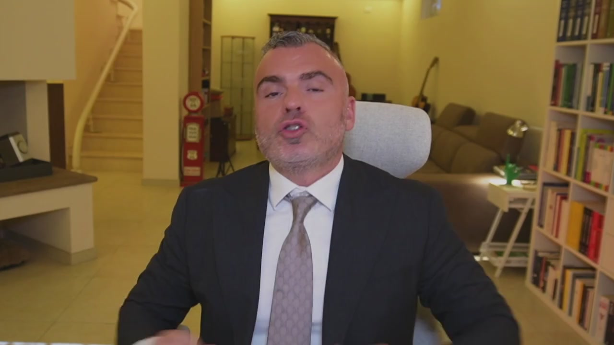
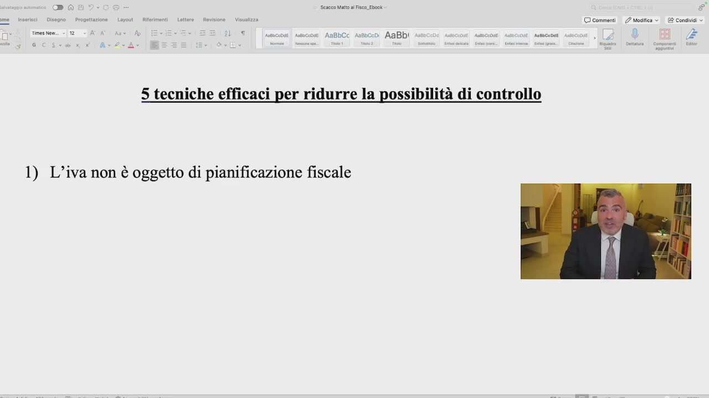
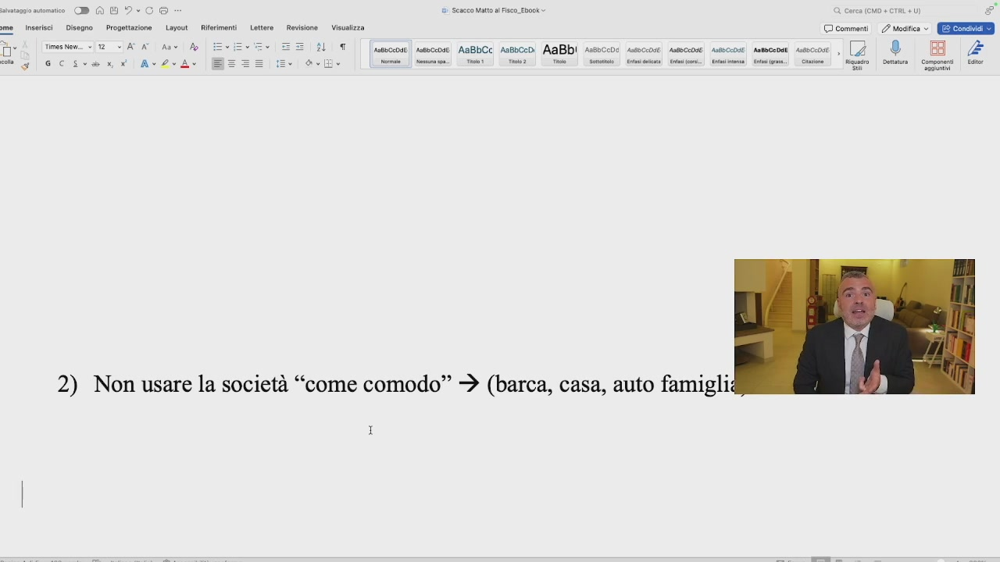
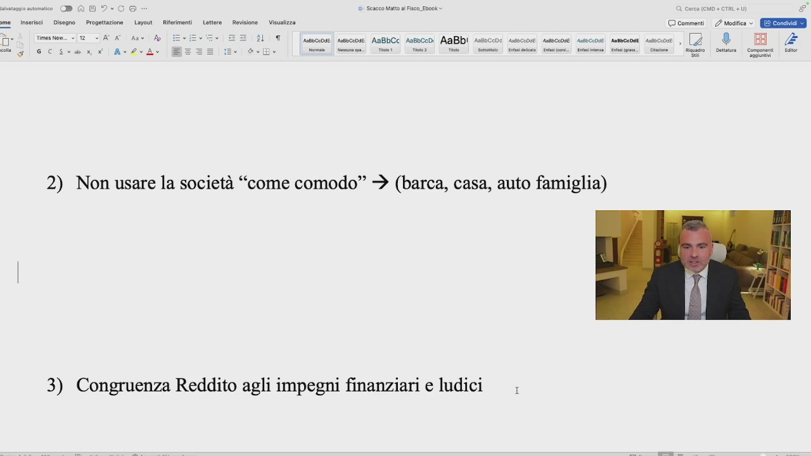
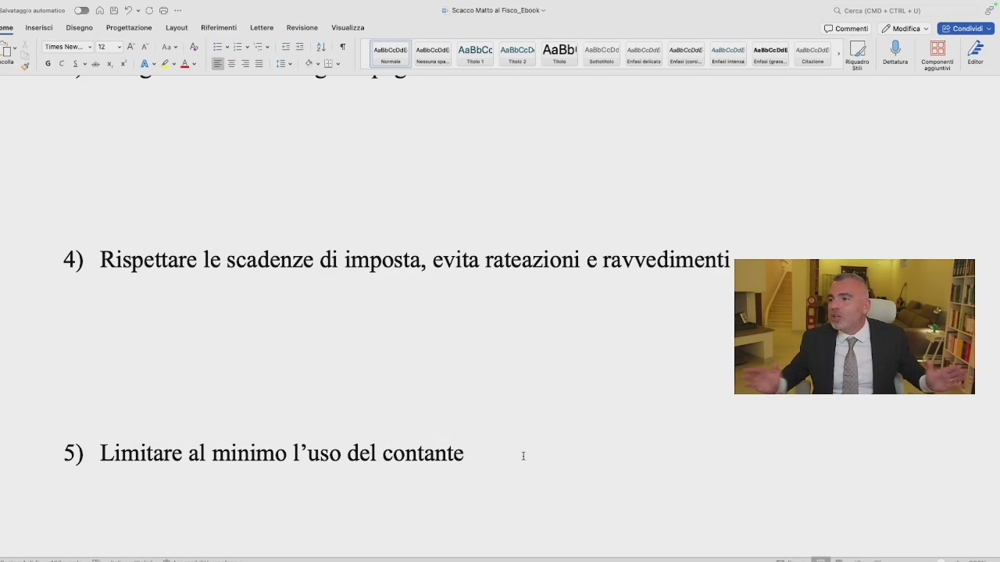

# 4. Come ridurre la possibilità di un controllo fiscale: 5 tecniche efficaci

> Documento generato automaticamente: trascrizione e screenshot sincronizzati del video-corso.

## [00:00:00] Schermata 0 _(start)_

> Sono cinque le tecniche più efficaci per ridurre la possibilità di un controllo fiscale, che io ho selezionato sulla base della conoscenza giuridica, ma anche su base empirica e quindi esperienze apprenditoriali. La prima riguarda l'IVA. L'IVA non è oggetto di pianificazione fiscale. Fare pianificazione

## [00:00:26] Schermata 1 _(scene)_

**Testo a schermo (OCR):** LT |sseccose ssecose AaBbCc Assoc AaBbI XE) ANBOCCOSE. Ante 0:04E Abete 5 tecniche efficaci per ridurre la possibilità di controllo 1) L’iva non è oggetto di pianificazione fiscale

> in termini IVA vuol dire mettere giù idee strane che tendenzialmente coincidono con l'evasione IVA. Uso termini forti perché l'IVA c'è sempre, o da una parte o dall'altra – sto parlando del contesto europeo – ma l'IVA qualcuno la deve pagare. Se si fanno delle azioni volte a non pagare l'IVA, tendenzialmente queste azioni hanno delle conseguenze molto pesanti. L'IVA non sono soldi nostri. L'IVA è una partita di giro. Fa girare i coglioni,

## [00:01:26] Schermata 2 _(periodic)_

**Testo a schermo (OCR):** DT |sseccose soc AaBbCc Asebcei AaBbi Rn 5 tecniche efficaci per ridurre la possibilità di controllo 1) L’iva non è oggetto di pianificazione fiscale

> e ogni mese soprattutto chi opera nel commercio si vede portare via migliaia di euro d'IVA, chi opera nei servizi tanto vale, soprattutto per chi vende a clienti privati, perché se chi vende ad aziende più IVA festa finita, chi vende al privato col prezzo finito già ha un principio di IVA più complesso. Dal punto di vista proprio emotivo, non sono soldi nostri. Conto IVA? Fatevi un conto corrente, girate i soldi, fate quello che vi pare. Non sono soldi tuoi, non sono soldi miei, sono soldi tendenzialmente dello Stato. Il giochino IVA a credito, IVA a debito. Ragazzi, l'IVA non è oggetto di pianificazione. Inoltre, quando l'IVA è un'imposta di stampo comunitario e armonizzata, ossia che le discipline IVA

## [00:02:26] Schermata 3 _(periodic)_

**Testo a schermo (OCR):** seco att al Fisco Ebook Cal Îl T |sseccose soc AaBbCc Asebcei AaBbi n8b CDI ACcDJE! ASCcOSE. Anbcnat 5 tecniche efficaci per ridurre la possibilità di controllo 1) L’iva non è oggetto di pianificazione fiscale

> dei singoli Paesi tengono conto delle discipline IVE a livello europeo centrale, l'Unione Europea stanzia ogni anno milioni e milioni di euro per la lotta all'evasione IVA, il che significa mettersi a fare robe strane, l'IVA attrae controlli. Quindi l'IVA non è oggetto di pianificazione fiscale. Punto numero due, non dovete mai usare la società come una scatola di comodo. Non si compra la barca con la società, non si compra la casa dove abitiamo con la società, non si compra l'auto della famiglia o di un familiare con la società, perché non c'entrano nulla con la società e quindi comodo significa

## [00:03:26] Schermata 4 _(periodic)_

**Testo a schermo (OCR):** hoe Vea © commenti / mesi EEE iL (sussocae| scs AABLCC Assbccdi AABDI Assucone suscose meccose susocaose semcaoan esco , [7 ® BH Cer DADI me inserisci Disegno | Progettazione Layout __ Ri i tesse © 2 SATA Ant Ao gd Scsi Av2eAe ser | mis: mao Tie. Tie | Sete” man Mii] Cammeo. Sei. cine | Riso | Det Coomeni er 2) Non usare la società “come comodo” + (barca, casa, auto famigliz I

> utilizzare veicolo societario per fini estranei alla società, il che porta alla riqualificazione di tutti quei proventi come distribuzione indiretta di utili e quindi un aggravio non solo per le casse della società ma anche per la tua sfera giuridica personale. Io c'ho la barca, io c'ho le auto della famiglia, io ho la casa, non niente di questo è dentro la società. La barca tutti i mesi pago il leasing intestato a Carlo Alberto Micheli, poi ci si collega al terzo punto, e ci pago le imposte per prendermi quei soldi. Infatti punto numero tre su un'altra tecnica per ridurre le possibilità di controllo è quella che il vostro reddito, non sto parlando, badate bene, di potere d'acquisto, che il vostro

## [00:04:26] Schermata 5 _(periodic)_

**Testo a schermo (OCR):** DADI ce Scacco Walto al Fisco. Ebook > Cerca (CD + CTRL +) Letra Roviione- Vinslzza © commenti. esita ©. GEE BT [mescense| ssncose) AsBbCc Aabbcedi A@BDI AsoccdÈ aseccose Amceose suesceosei samcaDati Aso , inserisci | Disegno — Progettazione Layout. Riferime Tmesen «12 SATA Ant Mo gd SCcscanr Av2oAe è 2) Non usare la società “come comodo” + (barca, casa, auto famiglia) I 3) Congruenza Reddito agli impegni finanziari e ludici

> reddito, quell'importo sul quale voi pagate le imposte sia congruente con i vostri impegni finanziari, case, barca, auto, quello che vi pare e ludici, corso di cavallo della bambina piuttosto che sci piuttosto che altra roba. Il vostro reddito sul quale pagate le imposte deve essere capiente per pagare gli impegni finanziari, a parte che però non ve li danno se neanche, i mutui non ve li danno perché i finanziamenti al consumo li danno anche se si va fuori rata reddito se avete un buono storico o un buon reddito. Però il reddito deve essere congruente agli impegni finanziari, agli impegni ludici e al vivere e mangiare. Ludici, ci rientrano l'iscrizione ai corsi ludici e ai viaggi. Congruenza del reddito

## [00:05:26] Schermata 6 _(periodic)_

**Testo a schermo (OCR):** 1) dì Sese Matt al Fisco. Ebook Cerca (CD + CTRL +) Letra Roviione- Vinslzza © commenti. mesi GEIE ALU [uusscsnae| scose AABLCC Aasbccdi AABDI Assncone sasccose seeccose. susscaze suna mesconse , (4 ® sere | mi To Te?! Ti | seem maine Gn Bennet” gno | Dna Tmessen + O SIA A An Mo s\ocsiveuni | Ax4vA- 2) Non usare la società “come comodo” + (barca, casa, auto famiglia) 3) Congruenza Reddito agli impegni finanziari e ludici |;

> agli impegni finanziari. Punto numero quattro, bisogna ricercare, perché a volte capisco che possa essere difficile, anch'io a volte non sono preciso, perché a volte sono anche nervoso, per esempio io odio gli acconti e quindi tendenzialmente non pago mai gli acconti, preferisco pagare l'anno dopo il saldo con gli interessi. Sbaglio, sbaglio, faccio anch'io tanti errori, bisogna rispettare le scadenze d'imposta, bisogna evitare le rate azioni il più possibile, evitare i ravvedimenti il più possibile. Bisogna essere precisi con gli impegni nei confronti del fisco, cosa che è molto più facile se vi faccio risparmiare il 40% d'imposta. Ultimo punto, limitare al minimo l'uso del contante. Ci sono delle attività che possono

## [00:06:26] Schermata 7 _(periodic)_

**Testo a schermo (OCR):** Latte Revbione- Vielzza © comment. 2? esi ©. QEErEtER HLT (sussosnie| scs AABLCC Astbccdi AABDI Assuccoe sacose meeccose ssscaose semcaoan esce , [4 ® BA i] mi (ion) Coma) (soi Cini) ‘nti! (ig) (siti stmigne;| ce” Raro | Denaa Conconi | Et 4) Rispettare le scadenze di imposta, evita rateazioni e ravvedimenti 5) Limitare al minimo l’uso del contante

> farlo più di altre, ci sono delle attività che sono per loro natura, per loro vocazioni più vicine al contante. Più voi limitate l'uso del contante e più incentivate l'uso dei pagamenti elettronici, ormai ci sono convenzioni con gli istituti finanziari che abbassano le commissioni a davvero poco, più limitate l'uso del contante più è difficile che vi facciano un controllo. Se voi siete cash free, e per tante aziende di servizi è abbastanza semplice essere cash free, è molto difficile che vi facciano un controllo e se ve lo fanno è molto difficile che vi contestino qualcosa. Quindi, l'uso del contante da limitare al minimo. Queste sono cinque tecniche. Ovviamente uno mi dice, ma io col contante ci faccio nero, quella roba lì è illegale. Cioè il nero ragazzi è illegale. Non troverete mai da me suggerimenti su come fare nero. Cioè le fatture si fanno, le scontri si fanno, punto, io richiaro tutto. Da questo punto di vista superligi. Poi ognuno è libero di

## [00:07:26] Schermata 8 _(periodic)_

**Testo a schermo (OCR):** a (CMO + © comment. 2? mesi GEE ESE, 4) Rispettare le scadenze di imposta, evita rateazioni e ravvedimenti 5) Limitare al minimo l’uso del contante I

> fare quello che vuole, ma allora non c'è bisogno di pianificazione fiscale se ti stampi 30% di nero. Non siete clienti corretti per me, perché non avete bisogno, vi fate del 30% di nero. Quindi limitando l'uso del contante, rispettando le scadenze, avendo il reddito conglo, gli impegni finanziari e ludici, non usando la società come società di comodo per barca, caos o ato per la vostra famiglia e non andando a individuare, a giocare con l'iva, ecco che le possibilità di ridurre un controllo sono molto alte. Si riduce notevolmente la possibilità di ridurre un controllo di natura fiscale.
