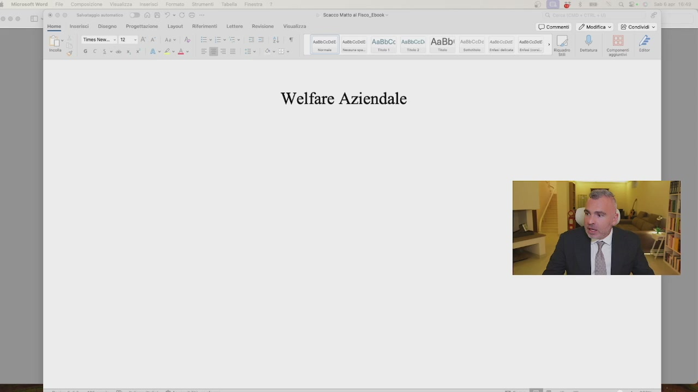
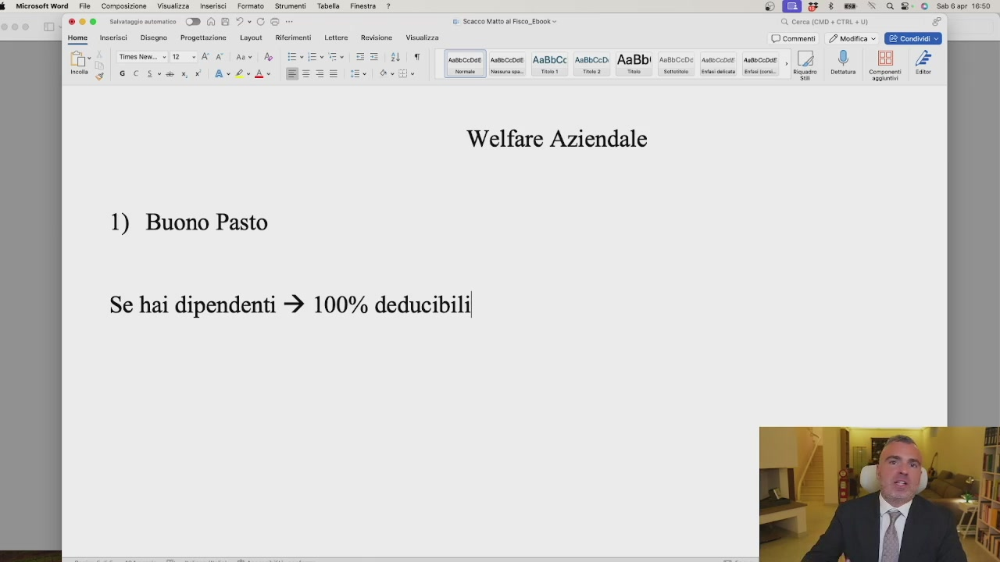
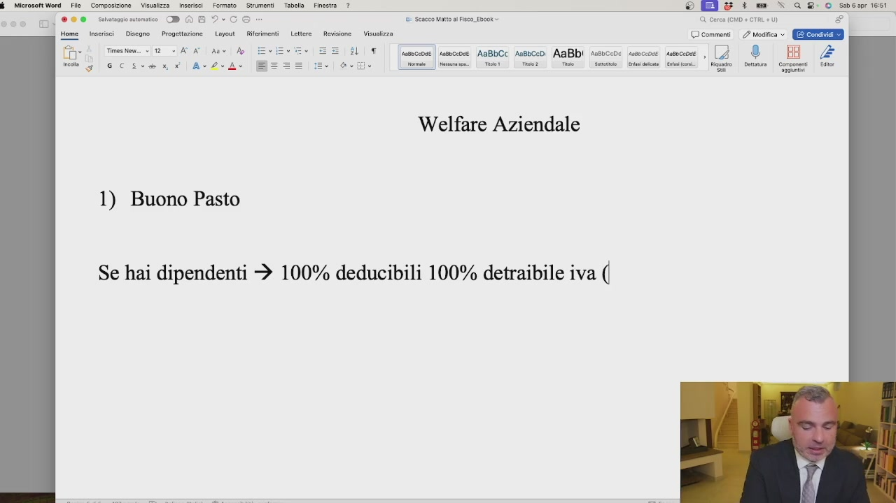
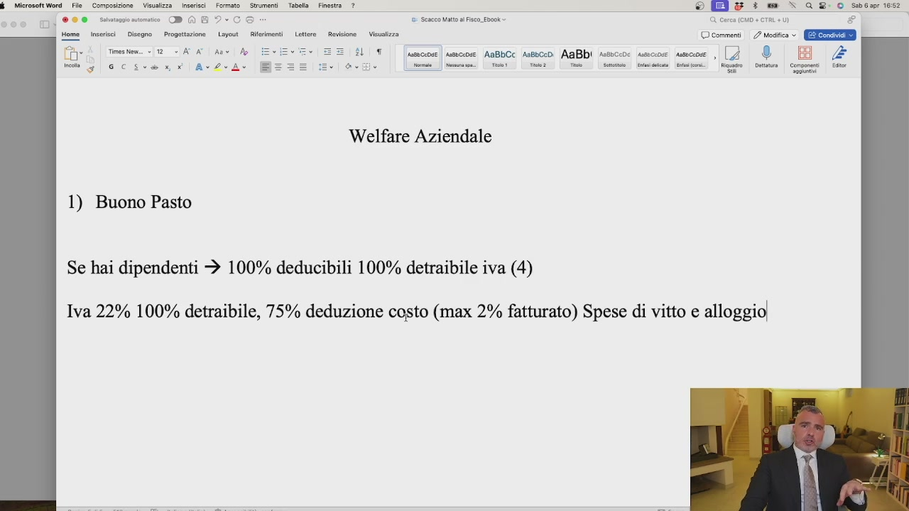
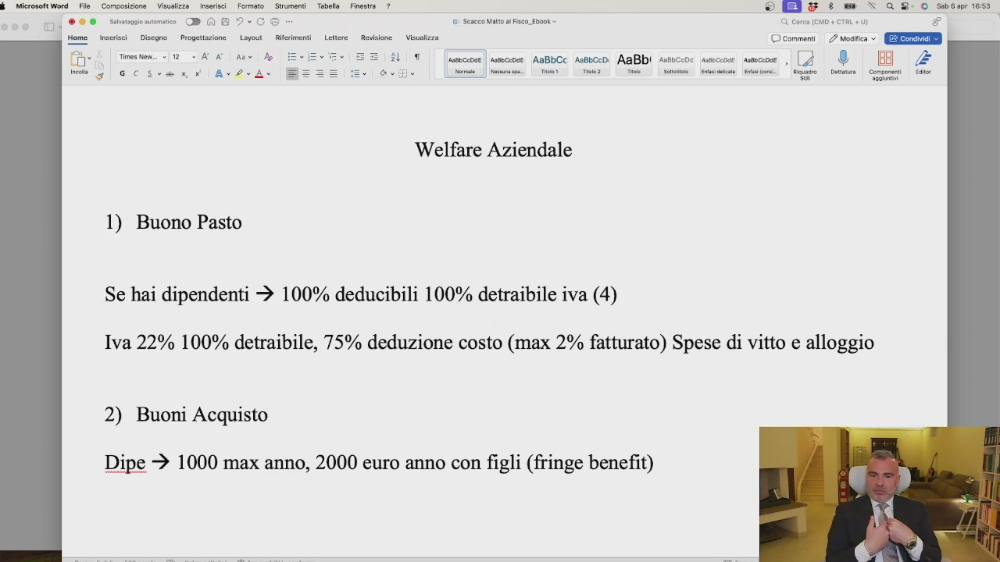
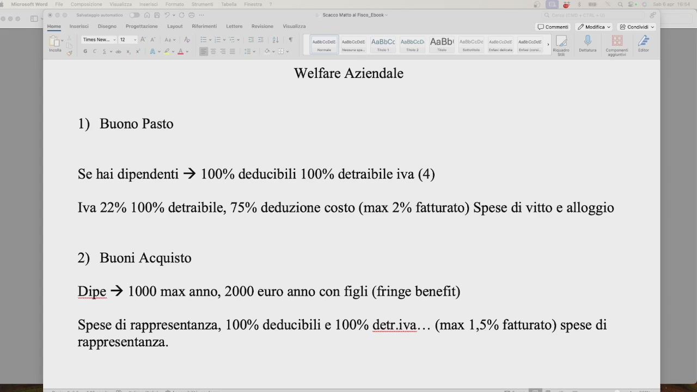
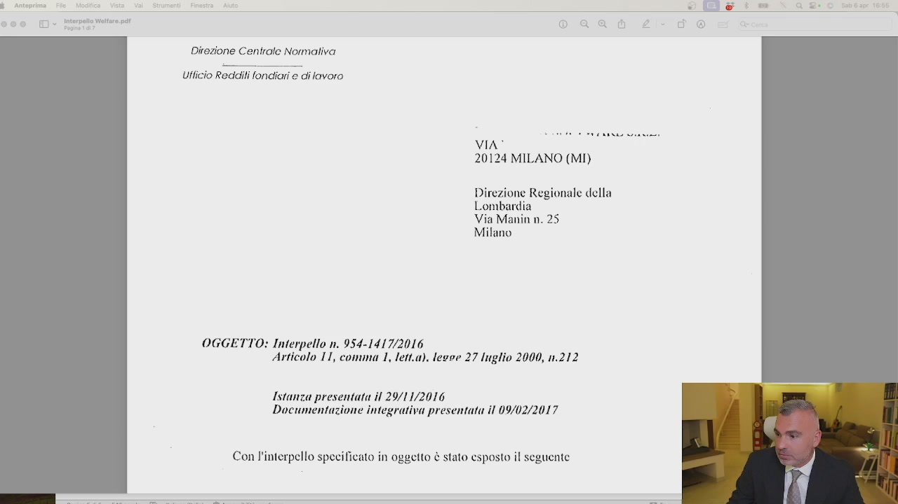
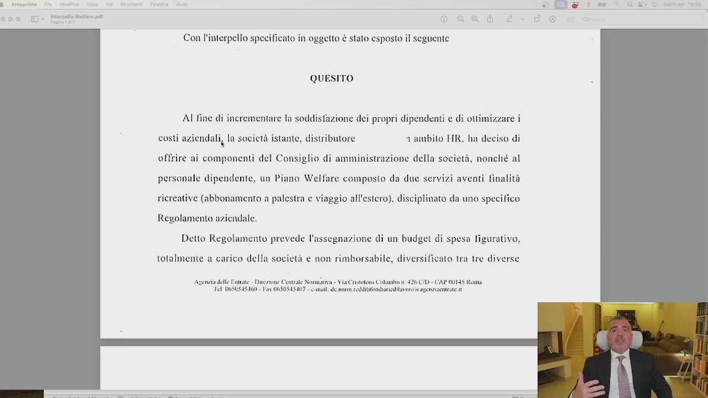
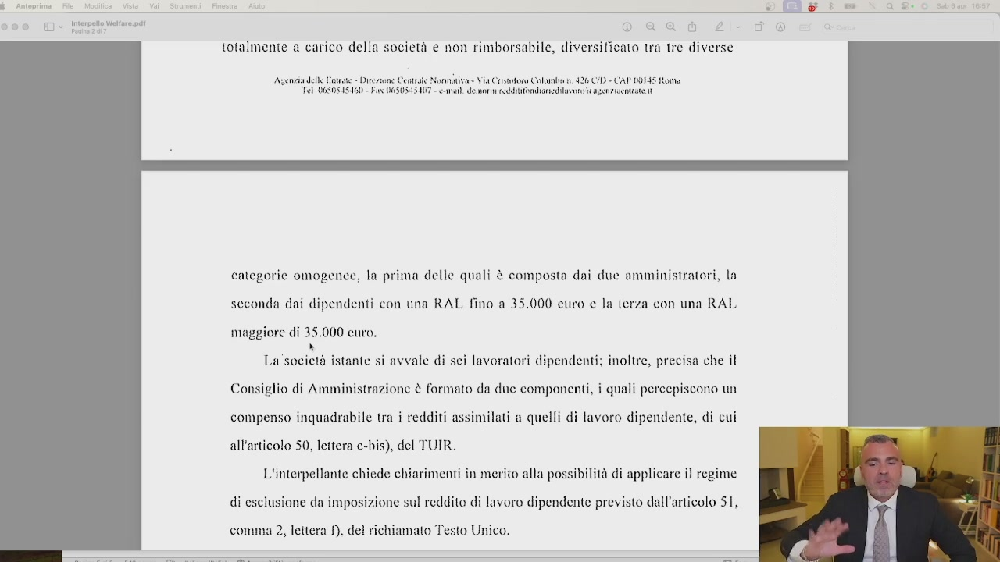
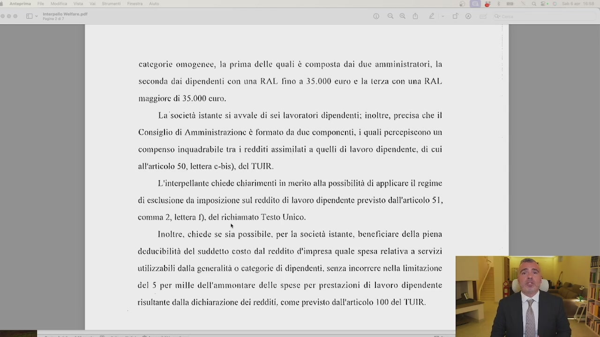

# 1. Aumenta la qualità della vita e abbassa le tasse con il Welfare aziendale

> Documento generato automaticamente: trascrizione e screenshot sincronizzati del video-corso.

## [00:00:00] Schermata 0 _(start)_

> Entriamo nel vivo degli strumenti con 7 strategie che puoi applicare subito all'interno della tua azienda per ridurre e di non poco il carico fiscale. Partiamo dal welfare aziendale nella sua più ampia accezione e nella sua articolazione. A seconda delle dimensioni aziendali è possibile applicare un sistema di benefit via via più complesso. Nella sua forma più elementare e o semplice noi possiamo applicare gli strumenti come i buoni pasto e i buoni acquisto. Nella sua forma più complessa noi possiamo applicare gli strumenti propri del welfare aziendale e ve lo spiegherò in questa lezione con a supporto un importante interpello dell'amministrazione

## [00:01:00] Schermata 1 _(periodic)_

> finanziaria, così che anche i più scettici, i più conservatori e i più ligi al no possano dedicarsi a delle aperture mentali che vi possono portare al risparmio aziendale. Vediamo quindi come funziona, preferisco

## [00:01:16] Schermata 2 _(scene)_

**Testo a schermo (OCR):** © de‘ Scacco alt i Fica Enook E Revisione — Visualizza © commenti. Modifica » E Condividi © secon , [2 ehe Neisde | Dita | ‘i ÈL TT (ueeciose | ssceose AsBbCc suesceo AaBb! Welfare Aziendale

> spostarmi qua, vediamo quindi come funziona ad esempio il buono pasto. Il buono pasto, partiamo da proprio la base, cioè ragazzi se non fate neanche questo siamo messi male, e il buono pasto cliccate, chiedete di noi tramite i nostri forum che ci sono delle specifiche convenzioni. Il buono pasto se erogato ai dipendenti, se erogato in maniera molto semplice, se erogato ai dipendenti 100% deluscibile ai fini delle imposte sul reddito della società e se esentasse per i dipendenti fino a un massimo di 8 euro giornaliere per giornata lavorativa. Quindi il consegnante lavoro vi dirà nel mese di settembre sono stati fatti 25 giorni lavorativi, voi a ottobre li date

## [00:02:16] Schermata 3 _(periodic)_

**Testo a schermo (OCR):** © Erg & : w % QR-O0 sente 6 Seno atti Fico. foci Qi cera cu + CTRL +1) £ | Mr | Tree LA . ALT |uerceode | uasceoce. AaBbCc AnBbCcD AaBb! nsnccoe setsceose sac [7 ® DB È Hr mia] in! i) a sce tin mas” egg Do | Corso hedle S| GC Sem ANQÒA Welfare Aziendale 1) Buono Pasto Se hai dipendenti 3 100% deducibili]

> 25 per 8. Finito, 100% deluscibile, ma è un costo per l'azienda? Sì, ma vi garantisco che aumenta la soddisfazione del dipendente da un lato e potete dare un potere d'acquisto al dipendente che per darlo in contanti vi costerebbe molto di più perché non è caricato, fino a quei limiti che vi ho poc'anzi detto, di contributi. Quindi se voi volete dare 200 euro di potere d'acquisto in più al dipendente, se gli volete dare 200 euro cash vi costa 400 euro, se glielo date con 200 euro di buoni pasto vi costa 200 euro. Ecco che c'è l'irrisparmio per noi, per il dipendente semtassi. 100% Detraibile l'iva al 4%, quindi 100% deluscibile e 100% detraibile l'iva al 4%. Se invece sei dittorale di partita IVA,

## [00:03:16] Schermata 4 _(periodic)_

**Testo a schermo (OCR):** @ + un x Q 8-0 sat 181 1 Seno att Fico. fook= Q cera cu + CTRL +1) G © commeni (2 modifica > GEIE arco | ance AoBbcc ssi AaBb! stive sscoe scor, (3 dB È mae | ia: | user | rsa section Riioto | Detta | Corp io Welfare Aziendale 1) Buono Pasto Se hai dipendenti + 100% deducibili 100% detraibile iva (|

> sei amministratore di società, sei anche di SRL e prendi buoni pasto per te, l'iva al 22%, 100% detraibile, mentre il costo è deducibile al 75% deduzione costo massimo nel limite del 2% del fatturato e rientra nelle spese di vitto e alloggio. Spese di vitto e alloggio, chiaro fino qui? Quindi se è dipendente 100% deluscibile, 100% detraibile l'iva al 4%, se invece è per l'amministratore di società l'iva al 22%, 100% detraibile l'iva, mentre il costo è

## [00:04:16] Schermata 5 _(periodic)_

**Testo a schermo (OCR):** © E è : % QBR-O0 Sosio? E Sencco Matto Fisco. Ebook cerca (CUD + CTRL +1) £ © commeni 2 modica » GSS | arco AaBbc ssico AnBbi scio: sncoe ucoe, (7 0° BO È nici | Pases | met sun uc aio Rigo | Dette | Corpo iii Welfare Aziendale 1) Buono Pasto Se hai dipendenti + 100% deducibili 100% detraibile iva (4) Iva 22% 100% detraibile, 75% deduzione costo (max 2% fatturato) Spese di vitto e alloggio!

> deducibile al 75% nei limiti del massimo del 2% del fatturato che corrisponde alle spese di vitto e alloggio. Punto numero 2, possiamo utilizzare i buoni acquisto. Anche qui noi abbiamo delle convenzioni, altrimenti i buoni acquisto di qualsiasi natura. Se siamo nell'ambito dei dipendenti, dipendenti, allora 1000 euro massimo l'anno senza figli, 2000 euro l'anno con figli per dipendente, 100% deducibili dal costo, 100% detraibile l'iva e rientra nell'ambito dei fringe benefit. Attenzione perché se voi come fringe benefit date l'auto o date altri compensi in natura, questo fa accumulo. Se invece ve le volete utilizzare voi, rientrano nelle cosiddette spese di rappresentanza, sono

## [00:05:16] Schermata 6 _(periodic)_

**Testo a schermo (OCR):** © E & : we “> QQ O sabsaprioss Q cerca (CD CTRL +) £ © commenti | 2? ico > GEIE acc | uc AoBbcc Assi) AaBbi scio: sncoe scor, (3 dB È ste ta ioni.” Rigo Dina Corman ai e Senec atto Fisco. Esook Welfare Aziendale 1) Buono Pasto Se hai dipendenti + 100% deducibili 100% detraibile iva (4) Iva 22% 100% detraibile, 75% deduzione costo (max 2% fatturato) Spese di vitto e alloggio 2) Buoni Acquisto Dipe + 1000 max anno, 2000 euro anno con figli (fringe benefit)

> 100% deducibili e 100% detraibili e finiva, ma abbiamo un massimo dell'1,5% del fatturato e rientrano nelle cosiddette spese di rappresentanza, quindi se avete altre spese di rappresentanza dovete fare il cumulo. Se lo utilizzate come omaggio ai clienti e fornitori, l'importo del buono non può superare le 50 euro. Questi sono strumenti base, il buono è importante perché ti consente, se è multi brand, di poterlo spendere dove volete, anche per costi che non sono né potenzialmente né direttamente inerenti. Che cos'è invece il welfare aziendale? Il welfare aziendale

## [00:06:16] Schermata 7 _(periodic)_

**Testo a schermo (OCR):** Scacco alto i Fisco Ebook esscense AaBbCc Asbbcen AaBbI! set Welfare Aziendale 1) Buono Pasto Se hai dipendenti + 100% deducibili 100% detraibile iva (4) Iva 22% 100% detraibile, 75% deduzione costo (max 2% fatturato) Spese di vitto e alloggio 2) Buoni Acquisto Dipe è 1000 max anno, 2000 euro anno con figli (fringe benefit) Spese di rappresentanza, 100% deducibili e 100% detr.iva... (max 1,5% fatturato) spese di rappresentanza.

## [00:06:17] Schermata 8 _(scene)_

> è un qualcosa di più organico, complesso dal punto di vista giuridico, ma che noi possiamo mettere in piedi e che vi spiegherò attraverso un interpello. Se noi prendiamo l'interpello 954.1417 Del 2016, eccolo qui, si legge

## [00:06:39] Schermata 9 _(scene)_

**Testo a schermo (OCR):** oaad e Direzione Centrale Normativa Ufficio Redditi fondiari e di lavoro VIA” 20124 MILANO (MI) Direzione Regionale della Lombardia Via Manin n. 25 Milano OGGETTO: Interpello n. 954-1417/2016 Articolo II, comma 1, lett.a). legve 27 luglio 2000, n.212 Istanza presentata il 29/11/2016 Documentazione integrativa presentata il 09/02/2017 Con l'interpello specificato in oggetto è stato esposto il seguente

> al fine, e questo ve lo allego al corso, al fine di incrementare la soddisfazione dei propri dipendenti e di ottimizzare i costi aziendali, quindi si capisce subito, voglio incrementare la soddisfazione dei dipendenti, ma anche ottimizzare i costi aziendali, ma fermi lì, ha deciso questa società di offrire ai componenti del consiglio di amministrazione della società, nonché al personale dipendente, un piano welfare composto da due servizi avanti finalità ricreativi, abbonamento a palestre e viaggio all'estero, con uno specifico regolamento aziendale. Quindi abbiamo già visto che per poter implementare il welfare anche agli amministratori di società, abbiamo bisogno di finalità ricreative, uno specifico regolamento aziendale e va dato alla generalità dei dipendenti e alla generalità del consiglio di amministrazione per caratteristiche. Assegnando un budget, si mette un budget

## [00:07:39] Schermata 10 _(periodic)_

**Testo a schermo (OCR):** tea lar pl o aa d Con l'interpello specificato in oggetto è stato esposto il seguente QUESITO AI fine di incrementare la soddisfazione dei propri dipendenti e di ottimiz costi aziendali, la società istante, distributore a ambito HR, ha deciso di offrire ai componenti del Consiglio di amministrazione della società, nonché al personale dipendente, un Piano Welfare composto da due servizi aventi finafità ricreative (abbonamento a palestra e viaggio all'estero), disciplinato da uno specifico Regolamento aziendale. Detto Regolamento prevede l'assegnazione di un budget di spesa figurativo, totalmente a carico della società e non rimborsabile, diversificato tra tre diverse Agenzia delle trae > Dicezsone Ceriale Nonnitiva - Via Cistotora Colorabir hr 426 CAD - CAP 00145 Roma Tit DOSOSISIGO - ay OGSOSASIU7 - ami. do mori ceci fondiaria vore i ascno senato it

> 10, 15, 20 mila euro e è totalmente deducibile dal reddito. Quali sono le caratteristiche? Che deve essere assegnato a categorie omogenee. Detto regolamento prevede l'assegnazione di un budget di spesa figurativo totalmente a carico della società e non rimborsabile, quindi uno lo mette lì, e diversificato da tre categorie omogenee. Le categorie possono essere di vario tipo, in questo caso, e in questo interpello, la categoria scelta è stata quella del reddito annuale lordo. La prima categoria è quella dei due amministratori, la seconda dei dipendenti con un RAL fino a 35, la terza con un RAL maggiore di 35 mila euro. Tre categorie omogenee, gli amministratori, i dipendenti, di due categorie. Viene assegnato un tot di budget. Con l'assegnazione a

## [00:08:39] Schermata 11 _(periodic)_

**Testo a schermo (OCR):** $_ Anteprime fodifica. al Strumenti Fire li & + = xa > iterpeto Wella pt © a è totalmente a carico della società e non rimborsabile, diversificato tra tre diverse Agenzia delle Poirase - Diresnone Centrale Nonnitiva = Via Cqistofora Colombi n 426 C/D - CAP 00145 Rome Fl USOSASAGI - Fax 0 i cedtifondiariodilavore 4 ascno entrate i categorie omogenee, la prima delle quali è composta dai due amministratori, la seconda dai dipendenti con una RAL fino a 35.000 euro e la terza con una RAL maggiore di 35.000 curo. La ur istante si avvale di sei lavoratori dipendenti; inoltre, precisa che il Consiglio di Amministrazione è formato da duc componenti, i quali percepiscono un compenso inquadrabile tra i redditi assimilati a quelli di lavoro dipendente, di cui all'articolo 50, lettera c-bis), del TUIR. L'interpellante chiede chiarimenti în merito alla possibilità di applicare il regime di esclusione da imposizione sul reddito di lavoro dipendente previsto dall'articolo 51, comma 2, lettera 1), del richiamato Testo Unico.

> regolamento, con la finalità ricreativa, non c'è più il limite del 5 per 1000 delle spese e quindi il welfare, si dice a questo punto, è un top e può essere erogato con importi molto più ampi, anche per pagare la scuola privata dei figli, per finalità ricreative, assistenziali ed equazionali, palestra, viaggi, scuole, corsi. Tutti importi che ti danno potere d'acquisto. Questo è il welfare aziendale. Posso spiegarvi il welfare in dieci minuti? Ovviamente per ottenere vantaggi dal welfare dobbiamo, dovete fare una consulenza con gli esperti welfare. Quali sono le caratteristiche? Qual è l'azienda che può rientrare in queste caratteristiche? Un'azienda che ha quantomeno dei dipendenti, che possa istituire delle categorie omogenee, che

## [00:09:39] Schermata 12 _(periodic)_

**Testo a schermo (OCR):** categorie omogenee, la prima delle quali è composta dai due amministratori, la seconda dai dipendenti con una RAL fino a 35.000 euro e la terza con una RAL maggiore di 35.000 curo. La società istante si avvale di sei lavoratori dipendenti; inoltre, precisa che il Consiglio di Amministrazione è formato da due componenti, i quali percepiscono un compenso inquadrabile tra i redditi assimilati a quelli di lavoro dipendente, di cui all'articolo 50, lettera c-bis), del TUIR. L'interpellante chiede chiarimenti in merito alla possibilità di applicare il regime di esclusione da imposizione sul reddito di lavoro dipendente previsto dall'articolo 51, comma 2, lettera f), del richiamato Testo Unico. Inoltre, chiede se a possibile, per la società istante, beneficiare della piena deducibilità del suddetto costo dal reddito d'impresa quale spesa relativa a servizi utilizzabili dalla generalità 0 categorie di dipendenti, senza incorrere nella limitazione del 5 per mille dell'ammontare delle spese per prestazioni di lavoro dipendente risultante dalla dichiarazione dei redditi, come previsto dall'articolo 100 del TUIR.

> eloghi alle categorie omogenee nella loro omogeneità questo servizio. Totalmente deducibile. Sapete quante imposte risparmiate? Se voi buttate giù un piano welfare da 20.000 Euro, risparmiate 6.000 Euro di imposte societarie e guadagnate 20.000 Euro in poteri d'acquisto, da dividere nella categoria, ma in questa categoria c'è anche, ci siete anche voi come amministratore della società.
