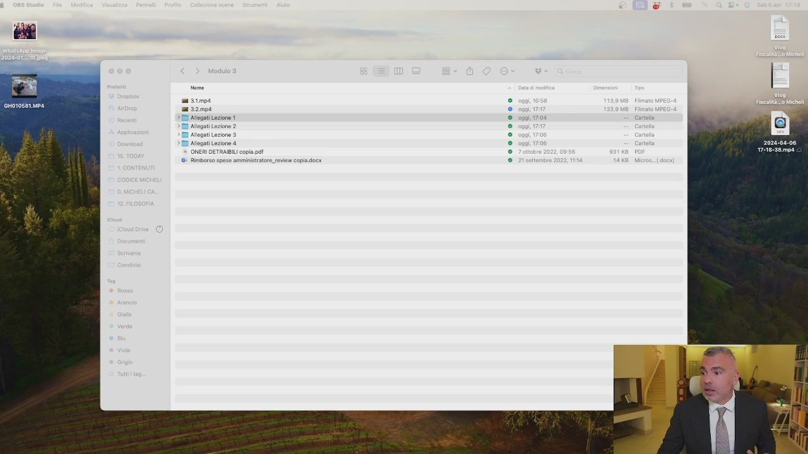
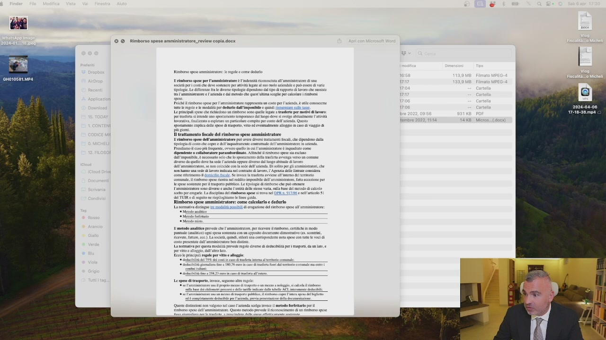
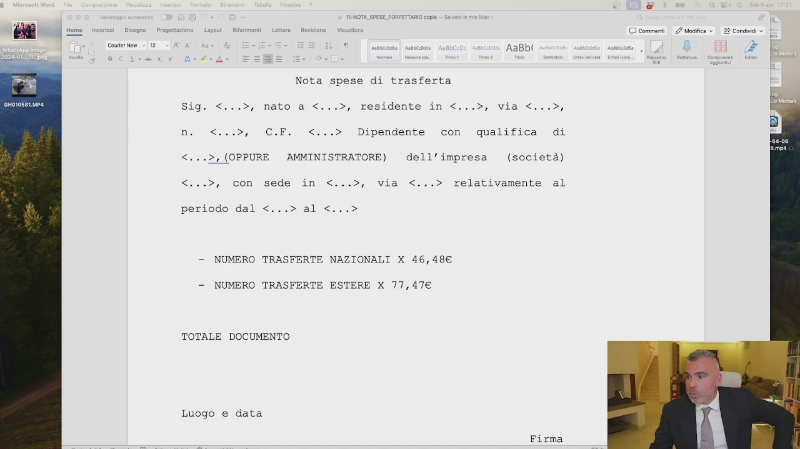
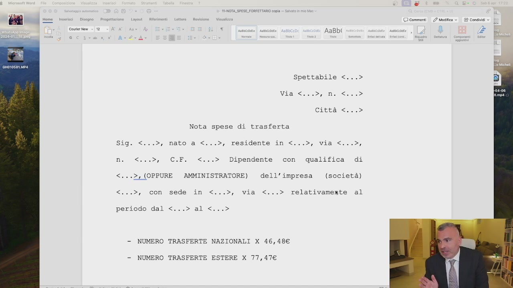

# 3. Trasferte: usale per pagare meno tasse

> Documento generato automaticamente: trascrizione e screenshot sincronizzati del video-corso.

## [00:00:00] Schermata 0 _(start)_

> Quando invece posso utilizzare il rimborso e l'indenità forfettaria? Allora, nella precedente lezione abbiamo visto il rimborso chilometrico. Quello ce l'abbiamo sempre, se l'auto non è aziendale. A questo punto ho anche l'indenità di trasferta. L'indenità di trasferta ce l'ho ogni volta che esco dal comune. Se invece non esco dal comune, uso il rimborso a piedi di lista. Cioè, mi seguite, uso sempre l'indenità chilometrica per ogni spostamento che faccio. Se resto nel comune e sostengo delle spese tra il parcheggio, piuttosto che sono andato al bar e ho fatto altre situazioni, prendo tutti gli scontrini e me li metto in un diario e mi faccio a piedi lista e me lo rimborso. Se invece vado fuori dal comune e non faccio il piedi lista, ma posso avere un rimborso forfettario di 46,48 euro massimo al giorno.

## [00:01:00] Schermata 1 _(periodic)_

> Anche se esco 10 volte dal comune è 1 al giorno. 46,48. E qui trovate negli allegati alla lezione 2.

## [00:01:11] Schermata 2 _(scene)_

> Lo trovate tutti negli allegati alla lezione 2. Quindi, 46,48 ogni volta che io esco dal comune.

## [00:01:24] Schermata 3 _(scene)_

> Vi ho messo anche un piccolo articolo che spiega il tutto, ve lo faccio vedere che è questo qua. C'è scritto la deducibilità, c'è scritto tutto, è un piccolo articolo a mio avviso interessante.

## [00:01:42] Schermata 4 _(scene)_

> Ve lo potete leggere, è fatto bene, l'ho riguardato tutto io. L'ho preso direttamente da Codice Micheli, che è il corso dove si spiega analiticamente tutto, è molto più grande. Quindi questo ci sono tutti i metodi per calcolare. Quello che noi dobbiamo sapere ai nostri fini oggi è questo.

## [00:02:05] Schermata 5 _(scene)_

> Esco dal comune 46,48 euro al giorno per esigenze di natura aziendale. Non rilevo lo spostamento casa nel lavoro. Non esco dal comune, faccio il piedirista. Rimborso chilometrico, lo faccio sempre. Vado all'estero, se vado all'estero non è più 46,48 ma è 77,76, non mi ricordo, 77 qualcosa. C'è scritto qua, 77,47, eccolo qui.

## [00:02:50] Schermata 6 _(scene)_

**Testo a schermo (OCR):** © NOTA_SPESE.FORFETTARIO copia OO commenti 2 Mosca © AaBbl ) Courier New - 12 ‘ Nota spese di trasferta Sig. <...>, nato a <...>, residente in <.. viali, Dipendente con qualifica di <...>, (OPPURE AMMINISTRATORE) dell'impresa (società) <...>, con sede in <...>, via <...> relativamente al periodo dal <...> al <...> - NUMERO TRASFERTE NAZIONALI X 46,48€ -— NUMERO TRASFERTE ESTERE X 77,47€ TOTALE DOCUMENTO Luogo e data Firma

> Trasferte nazionali 46,48, trasferte estere 77,47. Allora per le trasferte io vi consiglio di usare questo, questo modulo qui. Spettabile vostra società, io dell'impresa ho fatto dieci trasferte nazionali, cinque trasferte estere, totale pagare. Ma dove sono scritte? Vi fate un bel diario, vi fate una bella agendina, una agendina, digitale o no, separata, che indica solo i trasferti, dove ci mettete dove siete andati e il motivo per cui ci siete andati. Questa agendina ve la conservate separata dalla vostra agenda, se viene un controllo voi avete le ricevute regolari, più avete la vostra agendina la consegnate. Se non volete fare questa e avete il cedolino amministratore da SRL, così risparmiate la marca da bollo, potete comunicare al consulente del lavoro

## [00:03:50] Schermata 7 _(periodic)_

**Testo a schermo (OCR):** Cd BE Home inserci | Disegno. Progetta syout- Rierimenti Let cri 7 © commenti 2 Modifica © Cousier New = 12 ‘ 5 AaBbi Spettabile <...> Viatcino in: Città <...® Nota spese di trasferta Sig. <...>, nato a <...>, residente in <...>, via <...>, i o a i Dipendente con qualifica di <...2, (OPPURE AMMINISTRATORE) dell’impresa (società) <...>, con sede in <...>, via <...> relativamente al > al< periodo dal < > - NUMERO TRASFERTE NAZIONALI X 46,48€ - NUMERO TRASFERTE ESTERE X 77,47€

> le trasferte nazionali ed estere fatte ogni mese. Tenete comunque l'agenda, quindi se non avete il cedolino mensile, ma io ve lo consiglio, usate questo. Se avete il cedolino potete o usare questo o metterlo all'interno del cedolino. L'importante è che abbiate un'agenda dove ci scrivete dove siete andati. Il rimborso chilometrico si può sommare a questo. Se non uscite dal comune fate rimborso al piedilista. Tutta questa roba è deducibile dalle imposte sul reddito della società e per voi sono soldi non tassati che aumentano il vostro potere d'acquisto. Ragazzi, se non si fa questa roba qua, si va poco lontano.
