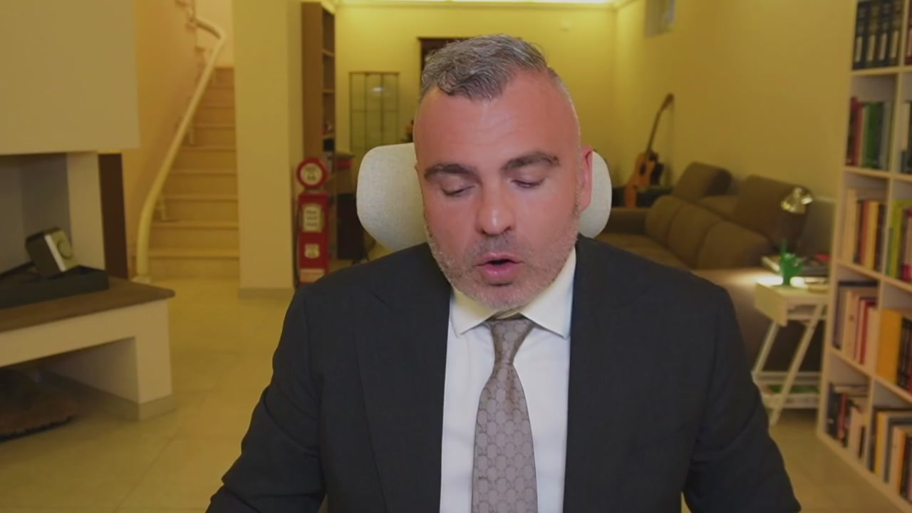
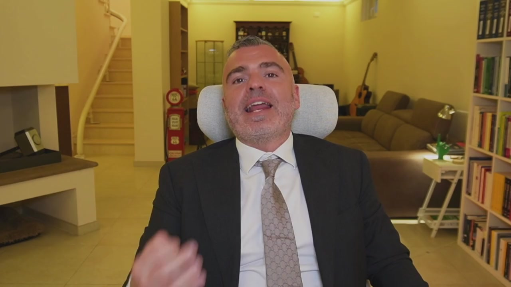
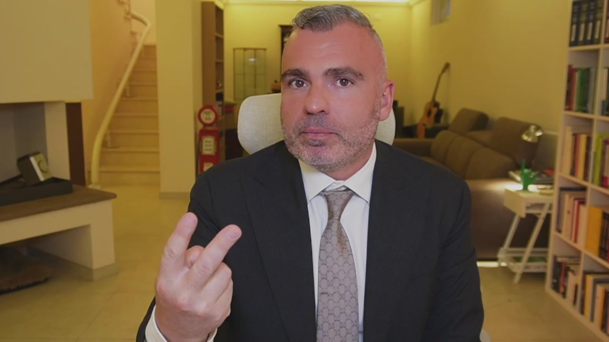
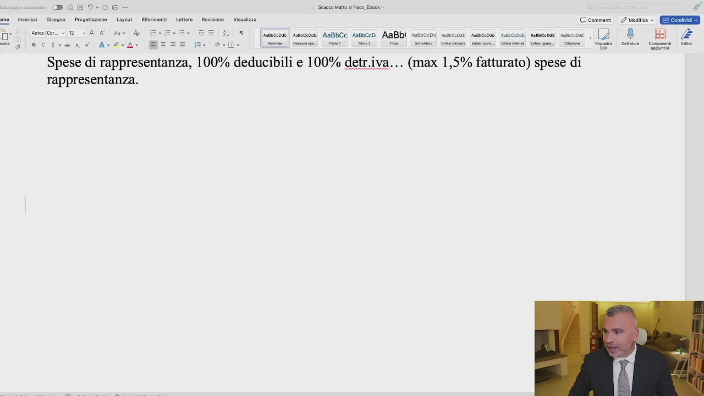
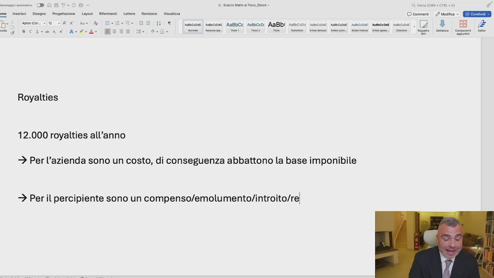
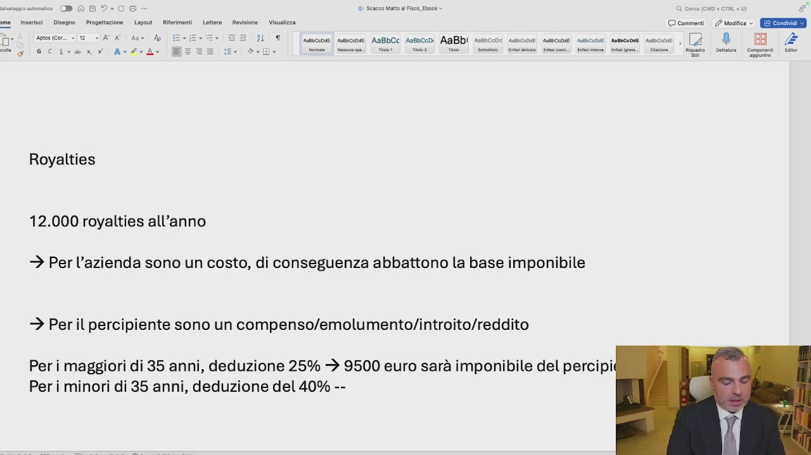
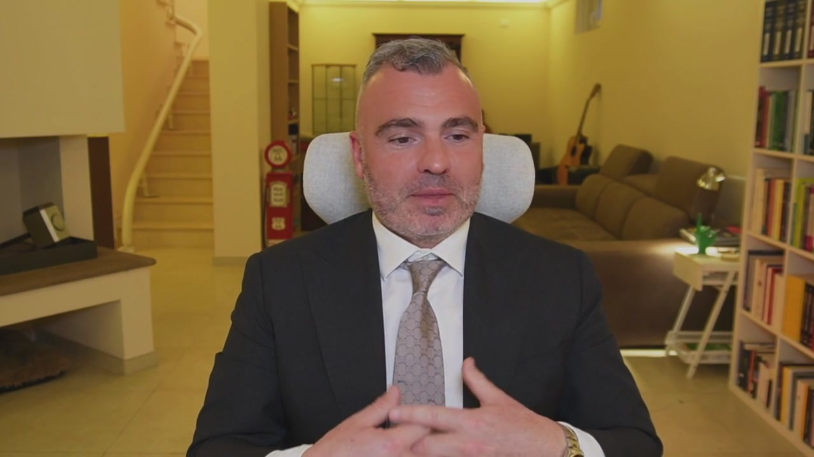
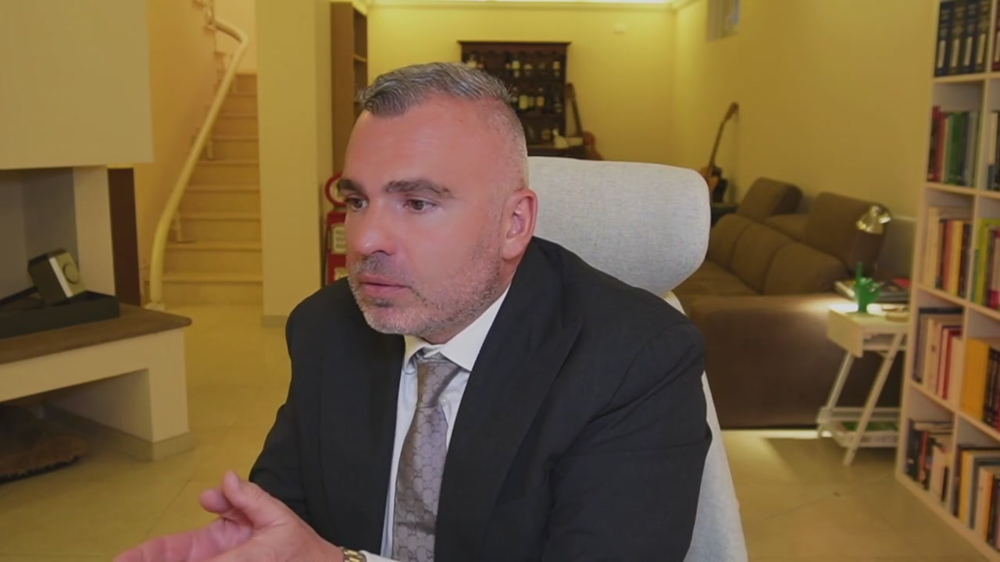

# 4. Marchio e Royalties: meno tasse e più soldi nelle tue tasche

> Documento generato automaticamente: trascrizione e screenshot sincronizzati del video-corso.

## [00:00:00] Schermata 0 _(start)_

> Quando io ho un bene di natura immateriale, come può essere un mio video, un mio libro, la mia creazione dell'ingegno, un prevetto, un marchio, un'opera di natura dematerializzata, suscettibile di avere un valore di natura economica, quindi un marchio, un contenuto la mia immagine, posso dare in utilizzo all'azienda la mia immagine, il mio marchio, la mia creazione affinché questa azienda la sfrutti in maniera economica. L'utilizzazione economica del

## [00:01:00] Schermata 1 _(periodic)_

> bene dematerializzato, immateriale, di mia proprietà, dà a me diritto di percepire un compenso economico. Questo compenso economico prende il nome di royalties. Qual è la caratteristica della royalties? È il vantaggio fiscale per l'azienda e per me. Il vantaggio fiscale per l'azienda è quello di essere questo compenso deducibile dalle imposte e quindi abbatte la base imponibile. Per me, invece, ha un duplice vantaggio. Il primo è che non

## [00:02:00] Schermata 2 _(periodic)_

> è soggetto a previdenza, quindi non ci si pagano i contributi INPS e non ci si pagano i contributi delle casse di appartenenza, purché non si abbia la partita IVA individuale. Dall'altro lato, questo compenso è soggetto ad un'agevolazione fiscale, che significa che se io ho più di 35 anni ho una deduzione fiscale del 25%, se io invece ho meno di 35 anni ho una deduzione fiscale del 40%. Mi spiego ancora meglio. Se io percepisco

## [00:02:55] Schermata 3 _(scene)_

**Testo a schermo (OCR):** ROIO Saeco Matt al Fisco. Ebock ere. iersi Cicero Prioetzone. (Lucut Rimet Letta Reviione _ Velzza © commenti. 2 mesi © GEE tocssam slecicant|AxdrA Spese di rappresentanza, 100% deducibili e 100% detr.iva... (max 1,5% fatturato) spese di rappresentanza. % | [ica] eco AnG:C: sco. AnBbi noci uecoa amcne secon anco sco, 2 _® BI se | ne! et Tie | Ti | Soto | Caio Renn] Sine. Sami. inno | Rigo | enna _ Come | al

> royalties, se siamo nel campo delle royalties, ipotizziamo che dall'azienda stacchiamo 12.000 Euro di royalties all'anno. Si può mettere anche di più o di meno, dipende, perché ci deve essere una valutazione economica che avviene mediante una perizia. Per l'azienda 12.000 Euro l'anno sono un costo, per l'azienda sono un costo, di conseguenza abbattono la base imponibile. Per noi, per il percipiente, sono un compenso, un emolumento, un introito, chiamatelo come volete, un reddito. Questo reddito per i maggiori di 35 anni, deduzione

## [00:03:55] Schermata 4 _(periodic)_

**Testo a schermo (OCR):** tnsersci | Disegno | Progettazione Layout _ Riferimenti 3 °° DA Viratza © comment. 2 esito © Ere : Tesi pi cate |” Ro | pe dots (cor. 2 <A Ant A Ge lsna ie A-ZIA= T [susoceose sseccose. AaBbCC Assbceni AaBbI asssccoì Royalties 12.000 royalties all'anno È Per l'azienda sono un costo, di conseguenza abbattono la base imponibile > Per il percipiente sono un compenso/emolumento/introito/re!

> del 25%, per i minori di 35 al millesimo, deduzione del 40%. Che significa? Che io prendo 12.000 L'ordi, ma le imposte non le pago su 12.000, Le pago su 12.000 Meno il 25%. Quindi 12.000 Per 25 diviso 100 fa 3.000, Vuol dire che le pago su 9.500 Euro, sarà l'imponibile del percipiente, considerando l'imposizione fiscale del 35%, ho già risparmiato 6.700 Euro. Se invece sei sotto i 35 anni, quindi se avete un figlio, registrate il marchio

## [00:04:55] Schermata 5 _(periodic)_

**Testo a schermo (OCR):** musce | Assccose AaBbCc Aosbcedi AaBbi Ass Royalties 12.000 royalties all'anno > Per l'azienda sono un costo, di conseguenza abbattono la base imponibile > Per il percipiente sono un compenso/emolumento/introito/reddito Per i maggiori di 35 anni, deduzione 25% + 9500 euro sarà imponibile del percipi; Peri minori di 35 anni, deduzione del 40% --

> nel nome del figlio per dire, io pago le imposte su 7.200 Euro, sarà la mia base imponibile. Ecco i tre vantaggi, deducibile per l'azienda al 100%, la deduzione del 25% e del 40% per il percipiente hanno la soggettabilità a contributo previdenziale. Ecco come funzionano le royalties. Come si pagano le royalties? Ogni mese, chi ha diritto

## [00:05:36] Schermata 6 _(scene)_

**Testo a schermo (OCR):** | ee

> a ricevere mese, trimestre o annualmente, potete decidere, si fa una classica ricevuta, sia per i maggiori di 35 che per i minori, basta che ci mettete la royalties lorda e vi prepara tutto, compresa la ritenuta da conto che vi versa la società del 20%. È già tutto pronto, basta che facciate questa roba. Tutto pronto ma fatelo. Ok? Il fatto qual è? Che per determinare l'ammontare delle royalties è necessaria una perizia che stimi il valore di quel marchio, di quel bene immateriale. Perizia fatta da chi sa fare queste cose, come ad esempio il mio team, giusto per farmi la giusta pubblicità.

## [00:06:36] Schermata 7 _(periodic)_

> Di fronte quindi alla corretta perizia del revisore, unita ai moduli, con la solita marca da bollo, noi possiamo ottenere questo triplice vantaggio fiscale e contributivo. Chi è? Quanto si può prendere? La cifra minima e prudenziale che si prende dalle royalties ad esempio può essere il 3% del fatturato. Una royalties che aumenta molto più la componente importante. Immaginate chi, come ad esempio me, dà istruttamento economico all'azienda, praticamente tutto il know-how più l'immagine, più il personal brand. In questo caso la royalties sale e si può ottimizzare ancora di più. È necessaria una valutazione economica. Però questo è come si sfruttano. Vi metto tutto in allegato e poi vi raccomando di prendere

## [00:07:36] Schermata 8 _(periodic)_

> una consulenza con i miei esperti per ottenere il massimo da questo vantaggio.
