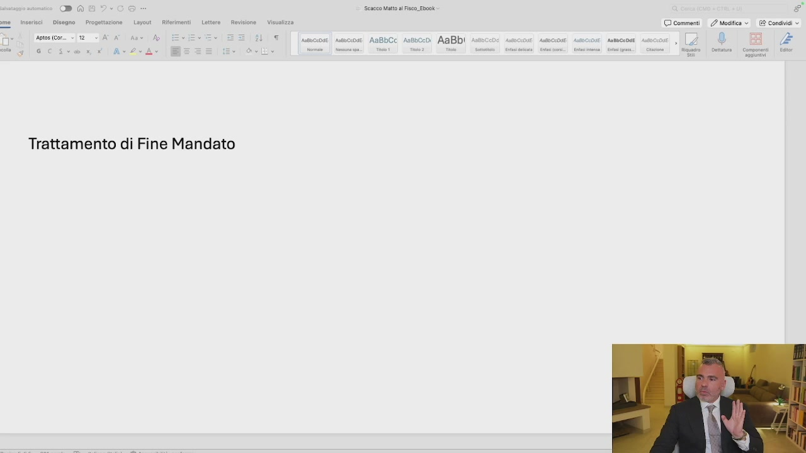
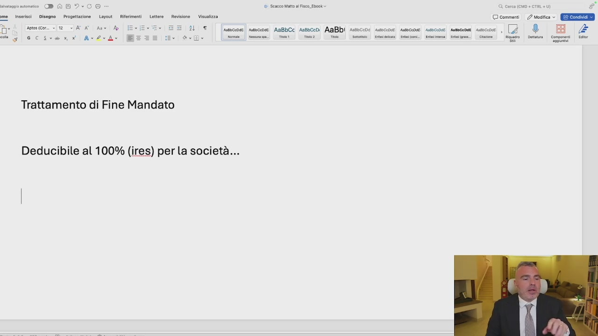
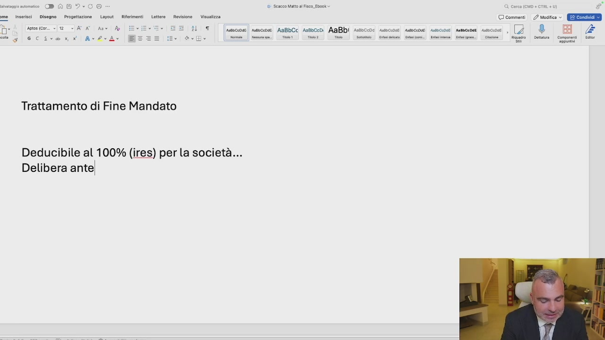
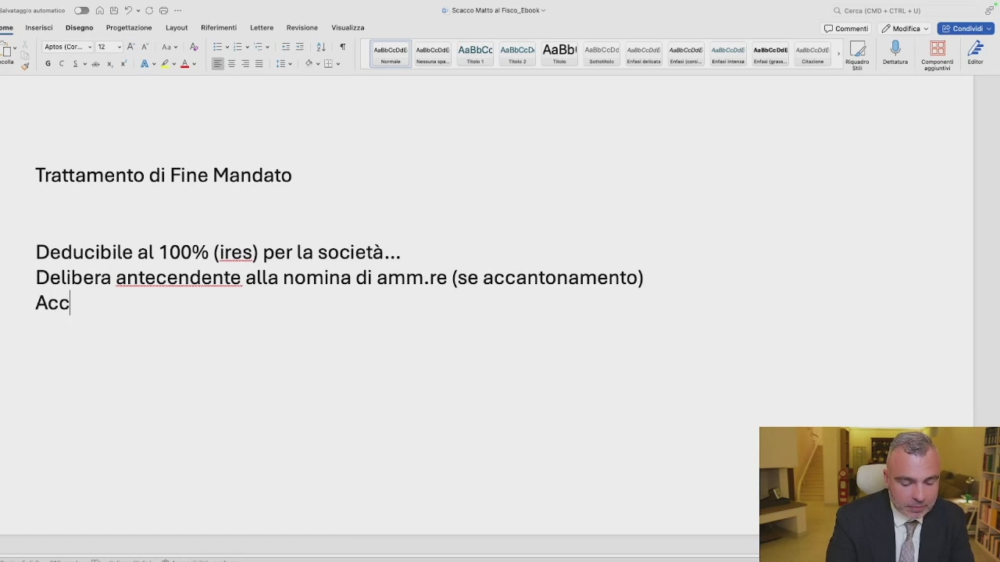
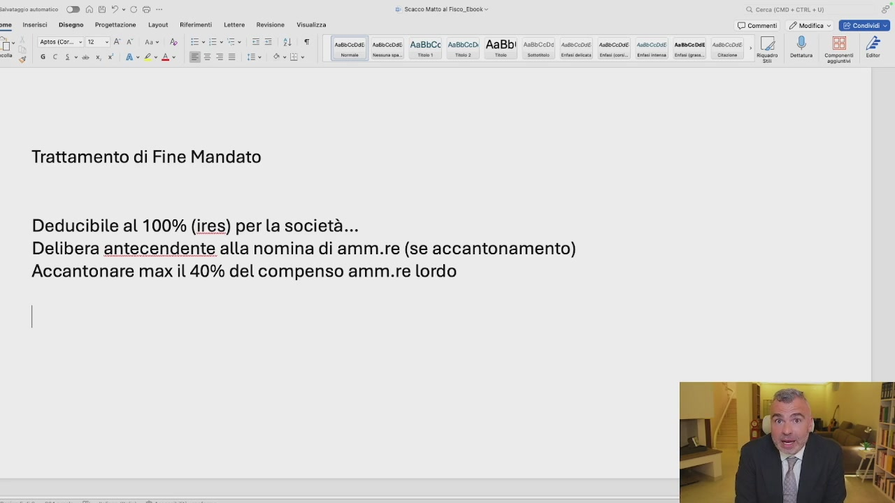
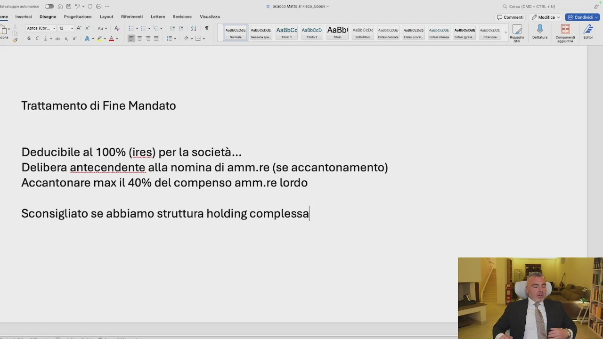

# 5. TFM: un ottimo strumento per abbassare le tasse e creare una pensione per l'amministratore

> Documento generato automaticamente: trascrizione e screenshot sincronizzati del video-corso.

## [00:00:00] Schermata 0 _(start)_

> Si sente parlare spesso di TFM. Il TFM è il trattato di fine mandato. Quindi stiamo parlando delle SRL con amministratore unico, ovvero consiglio di amministrazione. Il trattamento di fine mandato è un parallelo di quello che è il trattamento di fine rapporto per i dipendenti ma non ha, nonostante l'agenzia delle entrate ogni volta ci provi, le stesse caratteristiche. Il trattamento di fine mandato non equivale quindi ad una mensilità all'anno, così come avviene per il fine rapporto dei dipendenti. Il trattamento di fine mandato è a determinazione libera dell'assemblea dei soci. Deve avvenire contestualmente alla nomina di amministratore, deve essere questa nomina depositata con data certa,

## [00:01:00] Schermata 1 _(periodic)_

> basta una PEC, anteriormente quindi all'incarico, a caratteri generali. Ma ci sono le caratteristiche speciali. Qual è il vantaggio fiscale del trattamento di fine mandato? Cerchiamo di stare molto attenti a questo aspetto.

## [00:01:29] Schermata 2 _(scene)_

**Testo a schermo (OCR):** - DAL Seco att al Fisco. Ebook Pal Disegno — Progettazione | Layout © commenti / Modifica » E Condividi sotosicor.. «2 < AAT RI IM Ar? ose AaBbCc Arsoceo AaBbi pesocco Trattamento di Fine Mandato

> Il trattamento di fine mandato è deducibile al 100% ai fini IRES per la società. Il che significa che se io metto giù un trattamento di fine mandato di 30.000 Euro, il mio imponibile sul quale ci pagherò l'IRES scende di 30.000 Euro. Il fatto è che il risparmio fiscale c'è per l'azienda, però allo stesso tempo il trattamento di fine mandato genera un fenomeno che si chiama fenomeno delle imposte differite. Perché l'amministratore non paga niente nel momento in cui accantona a TFM, ma pagherà le imposte, leggermente meno di quelle del compenso amministratore, ma diciamo le stesse,

## [00:02:29] Schermata 3 _(periodic)_

**Testo a schermo (OCR):** e i Sencco Malt al Fisco_Ebook » DAG? ore. insrci | Disse | Preoeitzone Layout Rimor Letta | Reskione _ Vialzza © comment. 2 esito ©. GEE Aotos (Cor. » 12 ATA As A FAL nicepde|| ssnsccode ABBbCC A18b0cDi AABDI AssbCode Asebccdiei ANSHOSOIE. AaBbciDsE. Antbcendi Astscc0e) e 0a! ini nt) Sin] Sini] Sisti Len) a) ee) ia) Si i Trattamento di Fine Mandato Deducibile al 100% (ires) per la società...

> nel momento in cui il TFM lo riscuote. Quindi a che cosa serve il TFM se tanto le imposte ce le pago uguali o me lo posso prendere subito? Serve a lasciare liquidità in azienda, a investire eventualmente la liquidità in azienda nei mercati finanziari e a costruire una pensione per l'amministratore. Poi il TFM è sempre consigliato? A mio avviso ad esempio in uno schema holding non è consigliato il TFM, perché se mi diminuisce l'imponibile, civilisticamente mi diminuisce anche l'utile, quindi ho meno utile da distribuire alla mia società holding e quindi in questo caso potrebbe non convenire. Cerchiamo di capire allora quali sono le caratteristiche. Se è deducibile al 100% della società, delibera antecedente alla nomina di amministratore,

## [00:03:29] Schermata 4 _(periodic)_

**Testo a schermo (OCR):** e i Sencco Malt al Fisco_Ebook » DAD ore. insrici Disse Pregetzone Layout Rimor Letta | Reskione Vialzza © comment. mesi Ere 1 | [uavcene| mesceose AaBbCc AnsbccD) AABDI Assbcoos ssceose! sssccoue sueccose snsecaosi seccose , (7 ® ove se | mis: mao Tie Tie | Sete” Vai Bi] Cimino ii. cine | Rio | ot Conomeni lr Trattamento di Fine Mandato Deducibile al 100% (ires) per la società... Delibera antel

> se è accantonamento, perché se io il TFM lo pago in un'assicurazione, quindi mando i soldi via e ciò l'ha ricevuta, anche se non c'è una delibera precedente, è comunque deducibile. Se invece io questi soldi li lascio in azienda e creo un fondo di accantonamento a TFM, devo avere la delibera corretta. Se l'amministratore è già in carica, si fa una dimissione, una rinomina, gli diamo data certa, trasmettiamo al verbale registro per le imprese e non siamo attaccabili dal punto di vista fiscale. A quanto deve ammontare però questo TFM? Questo TFM deve ammontare ad una cifra che sia congrua rispetto all'apporto che l'amministratore dà e ai volumi di affari. E questa cifra quant'è? Non esiste in realtà questa cifra, è soggettiva. Il mio consiglio è massimo accantonare il 40% del compenso amministratore lordo.

## [00:04:29] Schermata 5 _(periodic)_

**Testo a schermo (OCR):** ® G To) ii Scseco Mato Fisco. Ebook + MO + CTRL +) inserisci Disegno Progettazione Layout | Riferimenti — Lettera | Revisione — Visualizza © commenti | Modifica » EEE CET Ca i oo TT) [uecon| unone AsBbCc sesceo AaBb| ssecco: snco@ seco: seco moon seco , Go® E FGC AdvA Ù ito] nm) Cin] Cometa seno Sean Senio Gimme. Gini: | cine |” Gago | Dr | Gonone il Trattamento di Fine Mandato Deducibile al 100% (ires) per la società... Acc

> Questo è il mio consiglio. Accantonare massimo il 40% del compenso amministratore lordo. Quindi se il nostro amministratore prende 80.000 Euro lordi l'anno, accantonerà massimo a TFM 32.000 Euro. Che vuol dire? Ragazzi, risparmiare 7.700 Euro di imposte subito. Non caricare all'amministratore di troppe imposte che magari lo manderebbero fuori dalle solle del 43%, eccetera. E spostare il fenomeno in positivo dopo. Ma poi quando le pregarai pagherai le imposte, ho capito? Ma blocchi il compenso dei anni prima e cominci a riscuotere il TFM gradualmente. Anche perché se l'amministratore successivamente rinuncia, se è anche socio,

## [00:05:29] Schermata 6 _(periodic)_

**Testo a schermo (OCR):** inserisci | Disegno | Progettazione Layout Riferimenti Lett 3 o DAG? dì Scseco Matt al Fisco Ebook rione Vice © comment | esita © GEIE done (cor. +12 STATA Ann A ÎL UT [sessceose sseccose AaBbCc Aasbcenìi AaBbI assoccoe 2|®* BB £ A COVATRIE Ad Ar se ito] nm) cs m8:] meta:o] (cirio ] o) (mie) essi ito neo (o toto Trattamento di Fine Mandato Deducibile al 100% (ires) per la società... Accantonare max il 40% delcompenso amm.re lordo

> è costretto poi a pagare le imposte. Se invece non è socio, c'è una sopravvenienza attiva per la società. Ci sono varie tecniche da vedere e da approfondire. Che a mio avviso non sono inerente a questa tematica di corso. E' importante qui sapere che il trattamento di fine mandato, aggiungo, è sconsigliato se abbiamo la struttura holding complessa. Perché se abbiamo una struttura complessa di holding è sconsigliato? Perché diminuendo l'utile distribuibile mando meno soldi su. Invece quando io ho l'holding, come avevo accennato prima, il mio compito principale è fare più utili possibili da distribuire alla holding pagando l'1,2. Ragazzi lo spiego nel modulo 4, nel sistema holding, quindi non vi preoccupate.

## [00:06:29] Schermata 7 _(periodic)_

**Testo a schermo (OCR):** o DAG? ì Sescco Mato al Fisco. Ebook. ‘@ cerca (CO + CTRL +) g° Lotte Rockione— Vinsalzza © comment. 2 medica ©. (ERE T) [seco] uncoe AsBbCc resceo AaBb) ssecco: sco secca seco moon seco, Inserisci | Disegno — Progettazione Layout _ Rie Goro (cor. «2 <A Av Ap SCI AZ Trattamento di Fine Mandato Deducibile al 100% (ires) per la società... Accantonare max il 40% delcompenso amm.re lordo Sconsigliato se abbiamo struttura holding complessa]

> Importante strumento da utilizzare.
