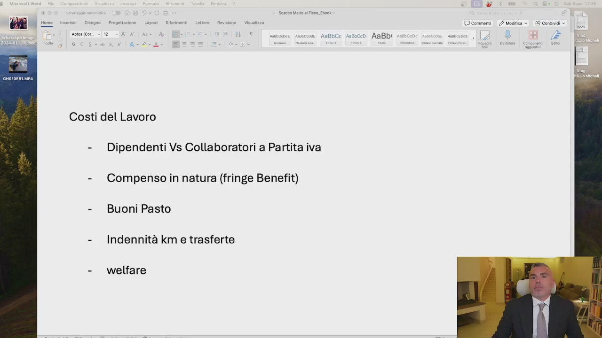
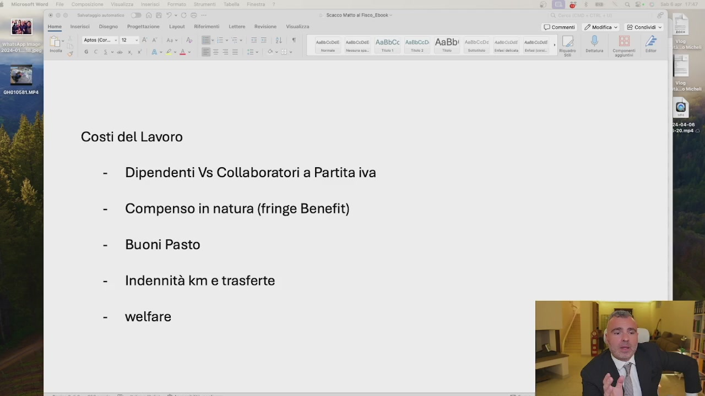
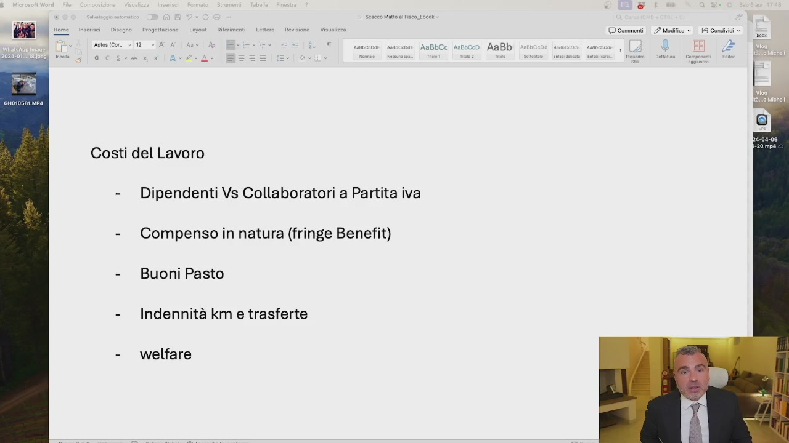

# 6. Come abbassare i costi del lavoro

> Documento generato automaticamente: trascrizione e screenshot sincronizzati del video-corso.

## [00:00:00] Schermata 0 _(start)_

**Testo a schermo (OCR):** enti | 2? Modifica > Condividi © Aso (co > 1 ù ‘ scupie snc AaBbCC Astbccd AaBb! î 3 È Costi del Lavoro - Dipendenti Vs Collaboratori a Partita iva - Compenso in natura (fringe Benefit) - Buoni Pasto - Indennità km e trasferte - welfare

> Vi ricordate quando vi ho detto che non si fa pianificazione fiscale sull'IVA? Bene, non si fa pianificazione fiscale a scapito del corretto inquadramento del personale dipendente. Ma a me conviene di più pagarlo metà fuori busta grazie al cazzo, ma è illegale. E non solo è illegale, ma qualora questo ti fa l'avertenza ti tocca pagarlo due volte, perché quelli fuori busta li hai già dati. Ti tocca ridarle le differenze retributive per le ore effettivamente lavorate. E poi, come spiego bene nel corso di IAL, siamo noi imprenditori a dover avere sempre il coltello da parte del manico, quindi mai possiamo permetterci di essere ricattabili da un personale dipendente, che magari mediocre noi non possiamo andare via sotto lo scuro del ricatto. Quindi se il dipendente ha una

## [00:01:00] Schermata 1 _(periodic)_

**Testo a schermo (OCR):** rose Lou Rifrimenti | Lettere Rsviime - Vis © commenti 2 Mogfica 2 Condinai » Aso icon. > 12 ‘ così navcinse AnBbCc Asboce0 AaBb! | ; e Costi del Lavoro - Dipendenti Vs Collaboratori a Partita iva - Compensoin natura (fringe Benefit) - Buoni Pasto - Indennità km e trasferte - welfare

> certa mansione, ha un certo ruolo, ha un certo orario, quello è il suo inquadramento. Se io posso scegliere collaboratori a partita IVA, e questo è permesso quando il lavoro è a particolare complessità, quando non siamo nell'ambito dell'artigianato e in altre situazioni, allora io scelgo sempre il collaboratore a partita IVA, perché mi costa meno. A meno che non ci sia l'esigenza di quella risorsa a voler essere dipendente e io voglio quella risorsa, allora scelgo il contratto di lavoro dipendente. Ma attenzione, perché il collaboratore a partita IVA, qualora mi faccia avvertenza e ci sia presunzione di subordinazione, vi chiede tutte le differenze retributive, quindi voi non potete mai essere ricattabili. Come posso ridurre le coste del lavoro? Ad esempio utilizzando i fringe benefit,

## [00:02:00] Schermata 2 _(periodic)_

**Testo a schermo (OCR):** Lotito. Revisione | Vis © commenti 2? Mafia © E? Condinai » n i) nas o AaBb Li AaBb! do i Fi Costi del Lavoro - Dipendenti Vs Collaboratori a Partita iva - Compensoin natura (fringe Benefit) - Buoni Pasto - Indennità km e trasferte - welfare

> come compensi natura, come poc'anzi spiegato nella lezione 1, i buoni pastor welfare sempre della lezione 1, le indemnità chilometriche trasferte anche al costo del lavoro. Questo mi consente di dargli più potere d'acquisto, ma tutto questo esula quello che deve essere il corretto inquadramento sul quale non si transige e sul quale dovete confrontarvi sempre con il vostro consulente del lavoro. Se non lo avete fatto, andate dal consulente del

## [00:02:27] Schermata 3 _(scene)_

**Testo a schermo (OCR):** I

> lavoro con il nome di tutti i vostri dipendenti, controllate il corretto inquadramento e verificate che sia tutto alla perfezione, così che non siate ricattabili e se siete ricattabili ora mettetevi in regola ora e così passano due, tre, quattro anni e non può più succedere niente. Mi raccomando, non date soldi fuori busta, non segnate a meno ore, non fate fare gli straordinari non pagati, perché è tutta una rimessa gravissima. Quando posso scegliere collaboratore a partita IVA perché è in carico di particolari difficoltà, orari liberi eccetera, vado su quell'ottica lì, altrimenti non c'è risparmio, non c'è pianificazione fiscale. C'è ottimizzazione del costo del lavoro da confrontarvi con il vostro consulente del lavoro, ci sono degli incentivi Formazione 4.0 E altre situazioni che possono farvi recuperare

## [00:03:27] Schermata 4 _(periodic)_

> dei soldi, non fate le pratiche false. Sulla Formazione 4.0 Si è visto di tutto in Italia, ti facevano le certificazioni con la revisione dell'anno prima dicendo che avevano fatto il corso. Ragazzi, quella roba lì, ogni volta che voi prendete i crediti imposti, c'è il controllo fiscale assicurato, magari non è generale ma è limitato a quella singola però c'è. Quindi state attenti a questa roba, non portatevi rispetturati del lavoro in azienda per caso, non fate questi errori.
