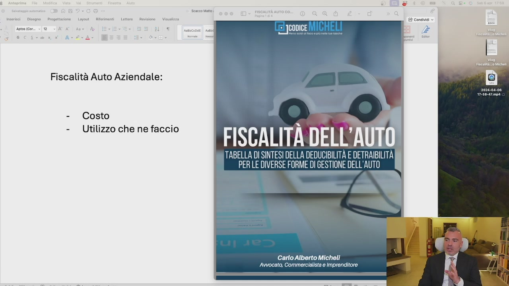
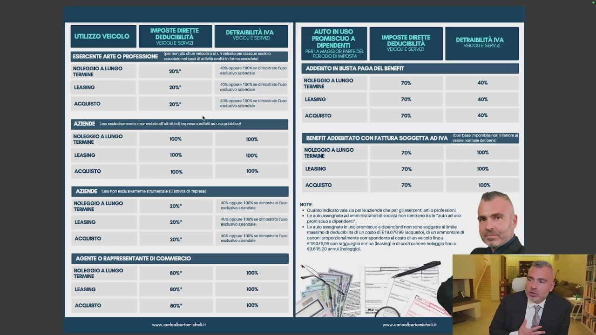
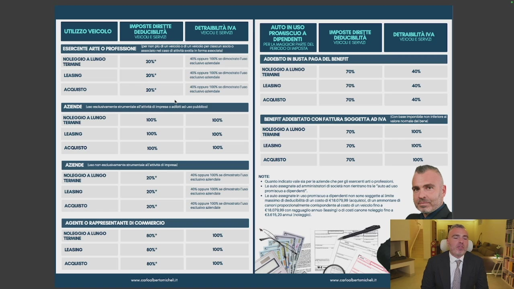
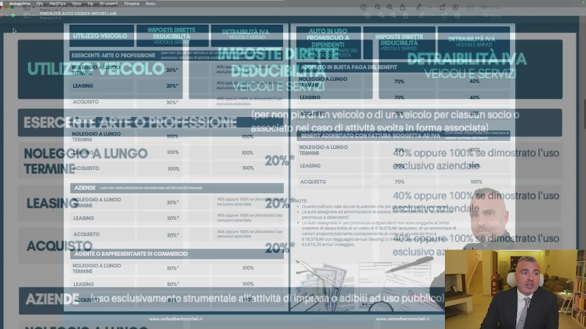
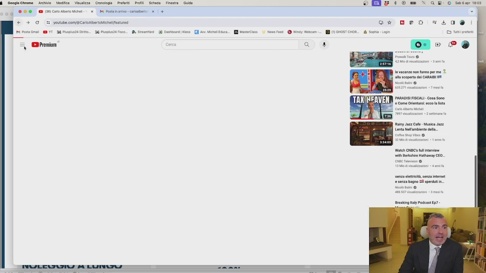

# 7. Auto aziendale: leasing, noleggio o acquisto?

> Documento generato automaticamente: trascrizione e screenshot sincronizzati del video-corso.

## [00:00:00] Schermata 0 _(start)_

> Quando si parla di fiscalità dell'auto aziendale, la domanda che viene sempre in auge è ma è meglio l'acquisto, il noleggio o il leasing? Allora, dobbiamo fare una distinzione. Innanzitutto stiamo parlando di un'auto per l'uso aziendale strettamente inerente come un furgoncino

## [00:00:21] Schermata 1 _(scene)_

**Testo a schermo (OCR):** n= {el JCODICE Fiscalità Auto Aziendale: - Costo - Utilizzo che ne faccio FISCALITÀ DELL'AUTO. TABELLA DI SINTESI DELLA DEDUCIBILITÀ E DETRAIBILITÀ | PERLE DIVERSE FORME DI GESTIONE DELL'AUTO | Carlo Alberto Micheli ‘Avvocato, Commercialista e Imprenditore

> oppure un'auto d'uso promiscuo. Io tratterei in questo video dell'auto d'uso promiscuo perché l'auto ad uso strettamente aziendale come furgoncino, furgone, camion, taxi e altre situazioni è deducibile al 100%, sarebbe da deficienti comprarlo privatamente. Chiaro? Deducibile al 100% tutto nelle sue spese. Nel momento in cui io vado ad acquistare un'auto privata mia, posso usare l'imborso chilometrico ma se io vado a prendere un'auto ad uso promiscuo, la deducibilità, a meno che io non sia una gente di commercio che ha la deducibilità all'80%, negli altri casi, sia che io faccio il leasing, sia che io faccio il noleggio, sia che io faccio l'acquisto,

## [00:01:21] Schermata 2 _(periodic)_

**Testo a schermo (OCR):** NOLEGGIO A LUNGO TERMINE Soir 100% LEASING 100% ACQUISTO 100% NOLEGGIO A LUNGO TERMINE 40% oppure 100% e imograto uco LEASING lui iene 2088 ‘AGENTE O RAPPRESENTANTE DI COMMERCIO NOLEGGIO A LUNGO TERMINE ACQUISTO 20%* LEASING ACQUISTO vor. caroalbertomichelit ‘ADDEBITO IN BUSTA PAGA DEL BENEFIT. NOLEGGIO A LUNGO TERMINE fiele Si LEASING ACQUISTO BENEFIT ADDEBITATO CON FATTURA SOGGETTA AD IVA nonna] NOLEGGIO A LUNGO TERMINE ma: Lesa LEASING 70% 100% ACQUISTO 70% 100% note Quanto Indicato valo sa pero aziende che pe esercenti ato pressioni. 1 Lo auto assegnate ad amministratori società po renirno tale “auto ad uso promiscuo a cipendent”. Lo auto assegnato n uso promiscuo a dipendenti non sono soggetta ite massimo di deducibilità dun costo di €18.07099 (acquisto, di un ammontare di SaronI propozionalmenta conispondantealcsto di un veicolo fino a €1807099 con raggueglio annuo leasing) o di ost canone noleggio ino a ‘€2618:20 ann noleggio

> la deducibilità è praticamente nulla, al 20% con il massimo di 18.079 In 4 anni. Quindi praticamente niente, se sono l'amministratore. Questo limite di 18.079 Non c'è e la deducibilità sale al 70% se lo do al dipendente. Però al dipendente gli diventa un fringe benefit e quindi si somma con gli altri fringe benefit che abbiamo visto prima. Quindi fino a 1.000€. Va bene, poi dopo è tassato. Sicuramente meno, eccetera. Quando è allora che mi conviene l'acquisto con l'azienda? L'acquisto con l'azienda mi conviene se so che quest'auto la terrò molti, molti anni e che costa poco. Così anche se ne scarico poca, va bene.

## [00:02:21] Schermata 3 _(periodic)_

**Testo a schermo (OCR):** NOLEGGIO A LUNGO TERMINE NOLEGGIO A LUNGO TERMINE i 100% LEASING 100% ACQUISTO 100% 100% NOLEGGIO A LUNGO TERMINE = 10% sep 10% e monta aa cene tie coi ‘AGENTE O RAPPRESENTANTE DI COMMERCIO NOLEGGIO A LUNGO TERMINE 2088 80% 100% LEASiNO ACQUISTO wwrn.coroalbertomicheliit ADDEBITO IN BUSTA PAGA DEL BENEFIT NOLEGGIO A LUNGO TERMINE si, LEASING 70% ACQUISTO 70% RENEFIT ADDEBITATO CON FATTURA SOGGETTA ADIVA_ lm mE a "| NoLecciO A LUNGO = TERMINE Ni LEASING 70% 100% ACQUISTO 70% 100% note +. Quanto indicato valo sia pero aziende che per gli esorcenti rt o professioni 1. LO auto assegnato ad amministratori i società pon entrano va le “auto a uso promiscuo a cipendont”. Lo auto assognat n uso promiscuo a dipendenti non sono soggetta ite massimo di doducibiità di un costo di €18.070,09 (acquisto, di un ammontare di €1807999 con ragguaglio annuo leasing) o di ost canone noleggio ino a €2615,20 annui noleggio vai coioalbertomichel.i

> Perché poi non è solo il costo dell'auto, ma anche l'assicurazione, il bollo, la benzina, l'autostrada, tutto al 20%, chiaro? Quando è invece che mi conviene il noleggio a lungo termine? Quando il chilometraggio è medio-basso e ogni tre anni cambio auto. Perché il noleggio a lungo termine ha due componenti, il costo auto e il costo servizi, dove il costo servizi è deducibile al 100%. Quindi tanto vale il noleggio a lungo termine, meno impegni dal punto di vista dell'acconto e meno problemi perché non devo riscattare l'auto come invece avviene nell'easing. Quando è che invece mi conviene l'easing? Quando l'auto è molto costosa e anche se potenzialmente avrei le risorse per poterla acquistare, non mi conviene perché butto giù il cash flow dell'azienda. Quindi se io sono un soggetto che l'auto non la cambio spesso e non voglio un'auto eccessivamente costosa, mi conviene comprarla e farmi il rimborso chilometrico.

## [00:03:21] Schermata 4 _(periodic)_

**Testo a schermo (OCR):** ESERCENTE ARTE O PROFESSIONE _5xC0x rd coso ist NOLEGGIO A LUNGO TERMINE per CEE LEASINO 2088 40 oppure 100% so Simo uso NOLEGGIO A LUNGO TERMINE ACQUISTO 208° 100% 100% LEASING 100% ACQUISTO 100% AZIENDE. (u5ononescustamente strumentale lr di impresa NOLEGGIO A LUNGO “TERMINE LEASING 208° AGENTE O RAPPRESENTANTE DI COMMERCIO NOLEGGIO A LUNGO TERMINE ACQUISTO 20%* 808° 100% wwrn.coroalbertomichel.it ADDEBITO IN BUSTA PAGA DEL BENEFIT NOLEGGIO A LUNGO Jona 70% 40% LEASING 70% ACQUISTO 70% BENEFIT ADDEBITATO CON FATTURA SOGGETTA ADIVA_l mea "o" noLECGIO A LUNGO z “TERMINE ita LEASING 70% 100% ACQUISTO 70% 100% I du note: +. Quanto indicato valo sa pere aziende che per gli esorceti arto professioni 1. LO auto assognato ad amministratori i società pon entrano tv le “auto ad uso promiscuo a cipendent”, Lo auto assognao n uso promiscuo a dipendenti non sono soggetta limite massimo di deducibilità dun costo di €18.07099 (acquisto, di un ammontare di canoni proporionalmenta corispondantealcosto di un veicolo fino a €1807999 con raggueglio annuo leasing) di ost canone noleggio fino a ‘2615:20 annul noleggio Pa vari coioabertomichel.i

> Se non la voglio comprare perché non mi voglio prendere i soldi della società e la tengo tanti anni e mi faccio l'acquisto. Se il prezzo non è tanto alto e il chilometraggio è massimo 20.000 Km l'anno, noleggio a lungo termine e cambio ogni 3 anni. Se invece l'auto è molto costosa, sopra 60.000 Euro, l'easing con riscatto non eccessivamente elevato, quindi non oltre il 25-30%, così non vado ad intaccare il cash flow aziendale. L'auto di lusso generalmente si compra con il leasing, l'auto di lusso non è mai conveniente per l'azienda. Se proprio io voglio un'auto di lusso per togliermi uno sfizio, leasing. Se vuoi togliersi lo sfizio con il cash perché vuoi fare il figo, compra la cash, va benissimo. Ovviamente tutto non deducibile, non è conveniente dal punto di vista del cash flow.

## [00:04:21] Schermata 5 _(periodic)_

**Testo a schermo (OCR):** ESERCENTE ARTE O PROFESSIONE _5xC0x rd coso ist NOLEGGIO A LUNGO TERMINE per CEE LEASINO 2088 40 oppure 100% so Simo uso NOLEGGIO A LUNGO TERMINE ACQUISTO 208° 100% 100% LEASING 100% ACQUISTO 100% AZIENDE. (u5ononescustamente strumentale lr di impresa NOLEGGIO A LUNGO “TERMINE LEASING 208° ‘AGENTE O RAPPRESENTANTE DI COMMERCIO NOLEGGIO A LUNGO TERMINE ACQUISTO 20%* 808° 100% LEASING ACQUISTO wwrw.coroalbertomichel.it ADDEBITO IN BUSTA PAGA DEL BENEFIT NOLEGGIO A LUNGO Jona 70% 40% LEASING 70% ACQUISTO 70% BENEFIT ADDEBITATO CON FATTURA SOGGETTA ADIVA_l mea "o" NOLEGGIO A LUNGO TERMINE Soa Lato LEASING 70% 100% ACQUISTO 70% 100% note: +. Quanto indicato valo sa pere aziende che per gli esorceti arto professioni 1. LO auto assognato ad amministratori i società pon entrano tv le “auto ad uso promiscuo a cipendent”, Lo auto assogna n uso promiscuo a dipendenti non sono soggetta al ite massimo di deducibilità di un conto di €18.07099 [acquisto], di un ammontare di ano pro ‘comspondente al costo di un eicalolino a €1807999 con raggueglio annuo leasing) o i ost canone noleggio fino a ‘261520 annul noleggio

> Poi se il tuo cash flow è talmente alto e ti vuoi comprarla, Urus, comprala. Però non è pianificazione fiscale, sono vizi. Questo è il concetto, vi metto tutto in allegato e ci sono dei video divertenti sul mio canale YouTube che riguardano le auto, ve lo segnalo.

## [00:04:44] Schermata 6 _(scene)_

**Testo a schermo (OCR):** NE ARTE O PROFESSIONI NOLEGGIO A LUNGO vr NOLEG +» È 6 trato l'uso Se dînostrato l'uso se dimo. trato l'uso

> Eccolo qui, la fiscalità delle mie auto tra leasing, acquisto e noleggio. Lo trovate qua su pagare meno tasse le mie auto.

## [00:04:50] Schermata 7 _(scene)_

**Testo a schermo (OCR):** $ Ocogiechrome Archivio Modifica Visualizza Cronologia Preferiti Profili Scheda Finestra OOO 1 CI contenosichel) x BI Posta ine caratbrio: x | + € > E youtube comf&Caricaibe Michelifeatureo 14 Posta Gol YT I Psp Dirt DI Puspisza Fico Premium” rca x Guida A Sireamtari_ Dashboard Kece © Kg & : 0 we >» a 8° 0 saba 1808 a Gt DEO =L0®% i Sophia Login Ve vacanze non fanno per me alla scoperta del CARAIBI Nico tali @ PARADIS FISCALI - Cosa Sono © Come Orientarsi: eco la lista Rainy Jazz Cafe Musica Jazz Lenta Nel'ambiente della cofee Stop Vibes @ Watah CNBC' (ul interven wi Berksire Hathaway CEO.. senza eletticità, senza intenet e senza bagno ES sperduti in. Nico ini @ Breaking italy Podcast ED? -

> Questo è un video carino, ce ne sono diversi sulle auto, vi lo consiglio perché è piacevole e divertente e racconta come io gestisco il mio parco auto che ce n'ho abbastanza.
