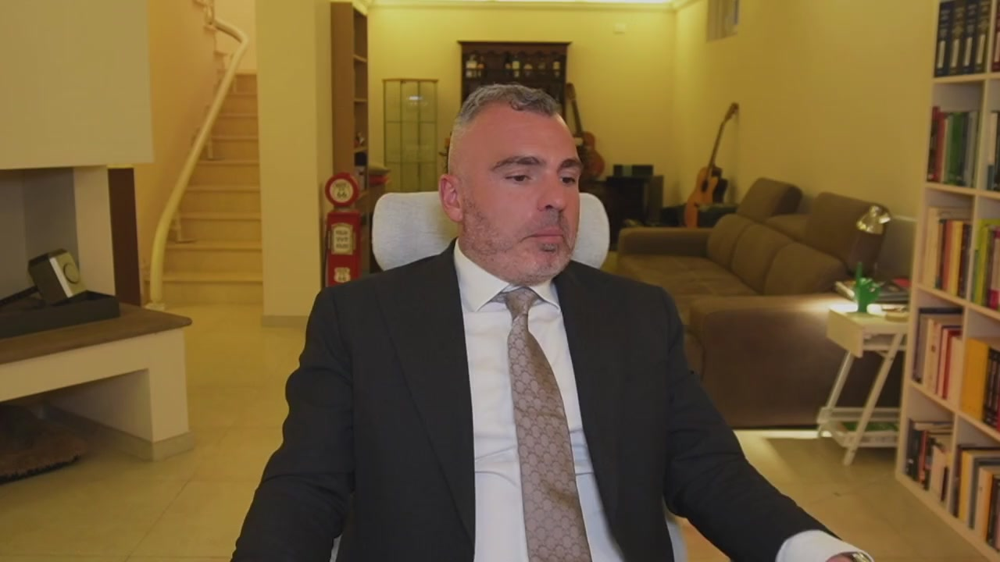
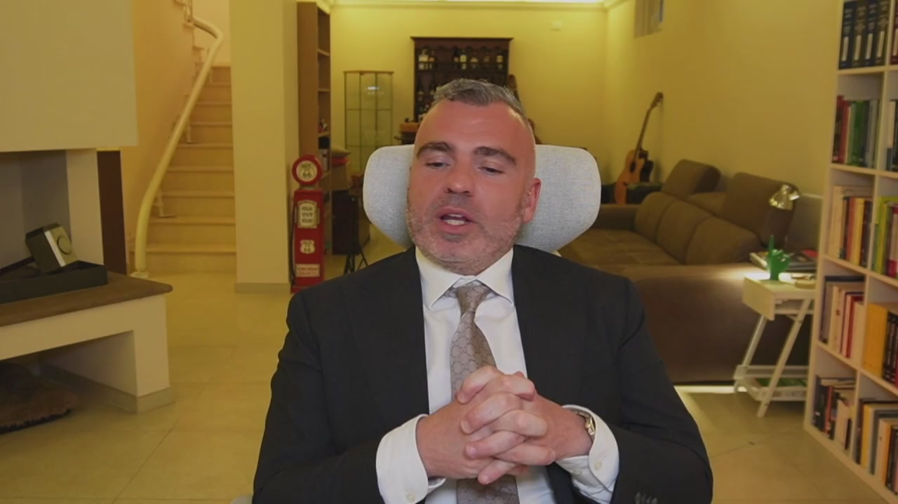
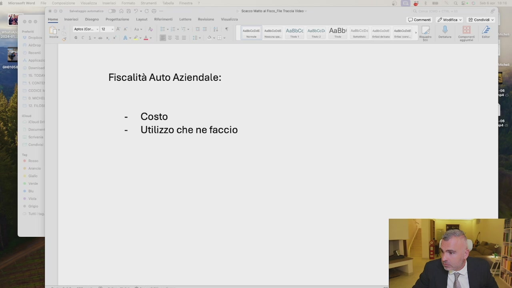
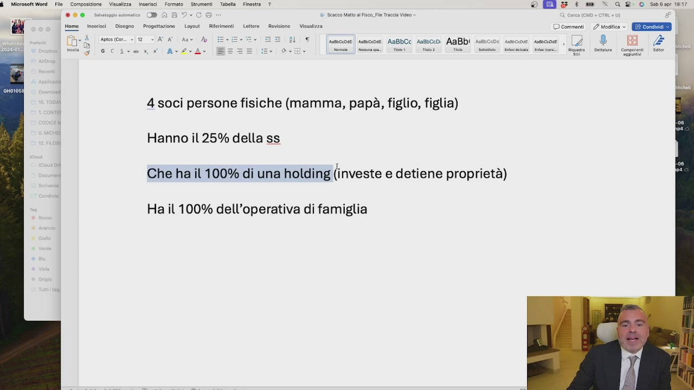
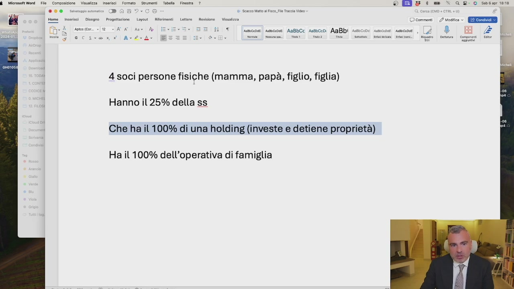

# 2. Società semplice: quando conviene e perché sceglierla

> Documento generato automaticamente: trascrizione e screenshot sincronizzati del video-corso.

## [00:00:00] Schermata 0 _(start)_

> La società semplice è uno strumento che è cresciuto d'importanza negli ultimi 30-40 anni e negli ultimi 10-15 anni è diventato appannaggio anche delle piccole e medie imprese. La società semplice non conviene tanto fiscalmente, perché i redditi che questa società percepisce vengono attribuiti per trasparenza ai soci. Quindi se la società percepisce degli utili, i soci pagano il 26% su questi utili. Se la società semplice percepisce degli affitti, i soci pagano gli imposti sugli affitti e non possono neanche fare le cedole secche. Conviene perché la società semplice non è iscritta al registro delle imprese, non deposita i bilanci e quindi non si sa chi sono i soci e non si sa quanto fattura. Poi l'amministrazione finanziaria lo sa lo stesso. Però non essendoci bilanci depositati al registro

## [00:01:00] Schermata 1 _(periodic)_

**Testo a schermo (OCR):** fr

> delle imprese c'è più segretezza e più anonimato. Il passaggio generazionale è più semplice anche con la società semplice così come anche con la holding in SRL. Un altro vantaggio è che non c'è per le società semplici la disciplina delle società di comodo. Quindi una società semplice è uno strumento utile per possedere ad esempio le case dove i soci della società ci vivono, la barca, le auto dei lusso e le collezioni di orologio. Perché non c'è la disciplina delle società di comodo? Perché non c'è? Perché c'è il reddito per trasparenza, si torna sempre lì. Uno schema societario potrebbe essere due persone fisiche che detengono le quote di una società semplice. Sono partiti i palloncini, questo aggiornamento Apple è devastante. Quindi una società, due soci, magari una famiglia che detiene le quote di una

## [00:02:00] Schermata 2 _(periodic)_

> società semplice, la quale detiene le quote di una holding oppure direttamente di una società operativa, oppure quindi immaginiamoci soci, società semplice, holding più società. Questo può essere uno schema, scriviamolo. Pensiamo a uno schema. Abbiamo quattro soci persone fisiche,

## [00:02:22] Schermata 3 _(scene)_

**Testo a schermo (OCR):** © commenti 2 Moglfica » 2 Cond Apice (Cor. + 12 ‘ cr [a AaBbCc ansbceo AaBbi Fiscalità Auto Aziendale: - Costo - Utilizzo che ne faccio

> mamma, papà, figlio, figlia. Hanno il 25 per cento della società semplice, che ha il 100 per cento di una holding. Questa holding investe e detiene proprietà. Questa società ha il 100 per cento dell'operativa di famiglia. Quindi in questa situazione, questa è quella che fa i soldi, che li manda qua, che magari compra immobili, li mette in proprietà, compra e investe sul mercato

## [00:03:22] Schermata 4 _(periodic)_

**Testo a schermo (OCR):** esvcepse | sesceose AaBbCc An8occd AaBbi sos 4 soci persone fisiche (Mamma, papà, figlio, figlia) Hanno il 25% della ss Che ha il 100% di una holding (investe e detiene proprietà) Ha il 100% dell’operativa di famiglia © Egg & : we “> GR: O sa02e 1817 © commenti 2 Vodice > QRS 9

> azionario, sfrutta le PECs. Quando questa fa tanti soldi, questi soldi vengono distribuiti gli utili alla società semplice e questi quattro pagano il 26 per cento su quello che arriva da qui. Però il veicolo di investimento è responsabilità limitata e il veicolo di produzione soldi è a responsabilità limitata e separato dall'asset di investimento. Questo è uno schema. I soldi arrivano sempre da qui. Se invece i soldi arrivassero da qui, perché mamma e papà hanno soldi e vogliono investire, fanno un finanziamento soci qua, che fa un finanziamento soci qua, che investe. Si restituisce il finanziamento soci gratuitamente, si restituisce il finanziamento soci gratuitamente e qui si produce investimento con finanziamento soci da

## [00:04:22] Schermata 5 _(periodic)_

**Testo a schermo (OCR):** © E & : we “> GR: O sacar ini © commenti 2 Vodice » (EE esvcepse | uesceose AaBbCc An8bccd AaBbi sos 4 soci persone fisiche (mamma, papà, figlio, figlia) Hanno il 25% della ss Che ha il 100% di una holding (investe e detiene proprietà) Ha il 100% dell’operativa di famiglia

> parte di persone fisiche e con la produzione di redditi di qua. Questo è uno schema molto interessante da poter utilizzare. Questo a me piace. Quindi conviene quando, ad esempio qua, ci possiamo mettere la casa di famiglia, magari uno ha la villa di famiglia, barca, auto, collezioni, tutto in quote societarie. Anche il passaggio di famiglia è più semplice. Qui, beni produttivi. Beni produttivi qua. Qua, operatività, lavoro, pianificazione fiscale e attività a rischio. Questa è una struttura molto interessante e un suggerimento che vi do per il vostro caso in società semplice.
