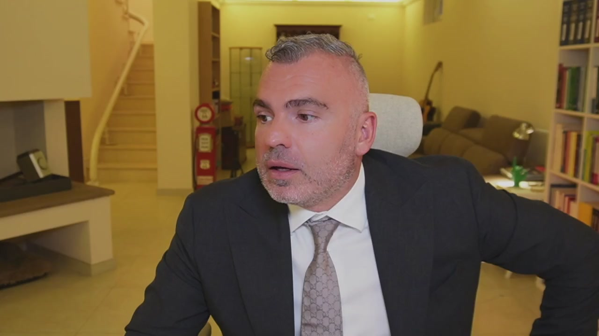
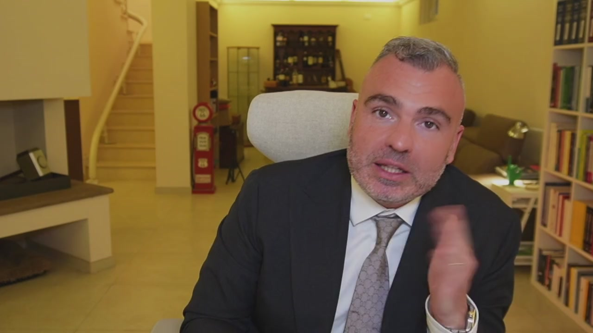
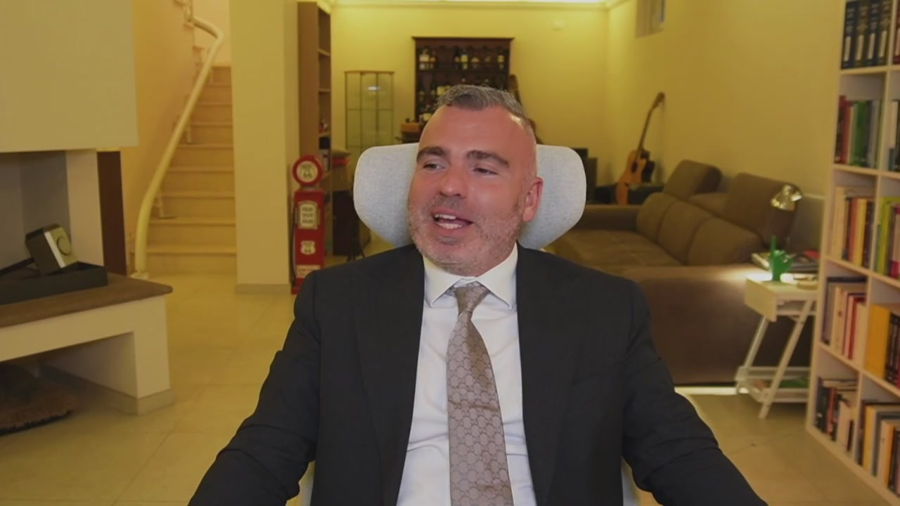
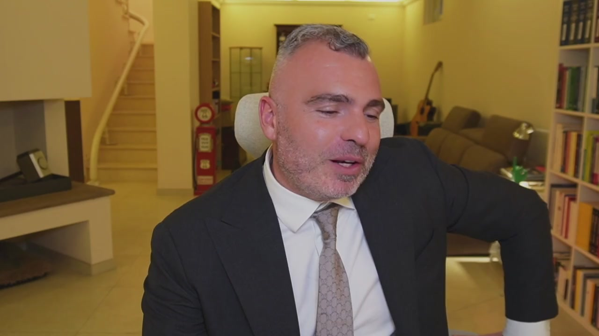
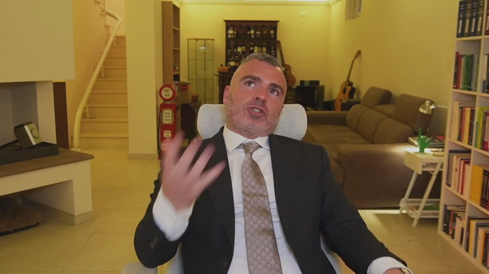
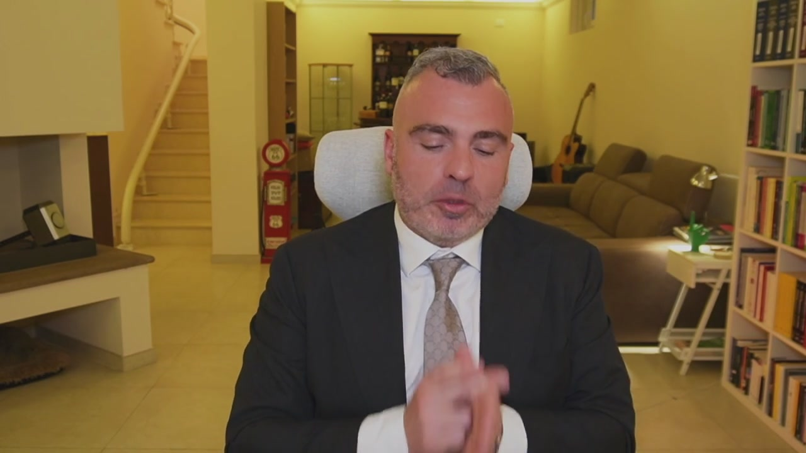

# 3. Trust: il guardiano del tuo patrimonio (limiti, doveri e poteri)

> Documento generato automaticamente: trascrizione e screenshot sincronizzati del video-corso.

## [00:00:00] Schermata 0 _(start)_

> Il trust è uno strumento molto complesso ed è utile per una destinazione, cioè è un patrimonio di destinazione. Gli aspetti operativi del trust possono essere molteplici. Quelli che voglio vedere in questo corso riguardano la pianificazione patrimoniale e la pianificazione successoria. Le finalità di utilizzo del trust possono essere di tre tipi, che siano a servizio dell'imprenditore, a servizio della società oppure a servizio di un socio. Se l'imprenditore utilizza il trust, lo può utilizzare per tre finalità. La prima come strumento di separazione della componente personale e familiare del patrimonio da quella dell'impresa, come una garanzia efficace per il

## [00:01:00] Schermata 1 _(periodic)_

> finanziamento bancario e di singoli progetti o di affari o come uno strumento di realizzo del trapasso generazionale. Se lo utilizza la società può essere uno strumento di garanzia per i prestiti oppure un veicolo per realizzare delle operazioni finanziarie. Se lo utilizza il socio può essere uno strumento per gestire delle partecipazioni sociali, gestisco con un trust le mie partecipazioni in più società, oppure con un strumento per dare solidità o consolidare patti pari sociali. Siamo in un contesto complesso come struttura giuridica. Nel trust ci sono tre figure, un disponente, un beneficiario e uno che gestisce. La prima cosa che dovete pensare quando costituite un trust è che voi vi spossessate dei vostri beni. Il 90% delle persone a cui dico guarda col trust tu ti spossessi dei

## [00:02:00] Schermata 2 _(periodic)_

> tuoi beni, rinunciano al trust. Il trust è uno strumento di natura anglosassone, non è normato nel codice civile italiano, quindi non è come l'SRL, l'SNC e queste cose, non è una società, è un qualcosa di diverso dalla società, proprio perché non è una società, non ha la disciplina delle società di comodo, però è soggetto ad una forte disciplina antiriciclaggio. Quando voi andate dal notaio per confluire un immobile in un trust, sappiate che c'è la segnalazione antiriciclaggio. Devo però dire che se fatto nei tempi, se fatto molto prima che possono insorgere dei problemi di natura patrimoniale, protegge. Cioè i beni nel trust difficili a crederli. Tra l'altro si possono mettere anche un primo beneficiario, un secondo beneficiario, è uno strumento molto interessante e molto

## [00:03:00] Schermata 3 _(periodic)_

> dinamico, è anche difficile da spiegare, e consente ad esempio di non disfare un patrimonio aggregato di singole cose importanti, collezioni, ad esempio dietro di me c'è, non si vede perché dietro il divano, una collezione di chitarre. Se io volessi non dividere questa collezione insieme alla collezione di fumetti e altre cose, potrei creare un trust dove all'interno ci metto un insieme di beni mobili che possono produrre una rendita solamente se venduti unitamente e fare un passaggio generazionale dei beni mobili per evitare la loro disgregazione. Posso mettere all'interno dei trust degli immobili, se ad esempio devo ricevere una rendita o dei problemi, allora faccio in modo che l'immobile

## [00:04:00] Schermata 4 _(periodic)_

> prima della caduta in successione del mio antenato venga messo all'interno di un trust dove c'è un beneficiario, proteggo questo immobile. E' uno strumento che può essere utilizzato accanto o in alternativa ai tradizionali istituti di diritto privato, come ad esempio Patria e Famiglia, Fondo Patrimoniale o le Holding, che sono gli altri strumenti che vediamo in maniera anticipata. Può essere costituito anche per testamento, dal punto di vista dei costi, trasferimento immobiliare costa sempre il 9 per cento, cioè dal punto di vista dei costi sono gli stessi, non è che cambia, è uno strumento diverso per elasticità e forma e contenuto. Mentre la società, il Fondo Patrimoniale e il

## [00:05:00] Schermata 5 _(periodic)_

> Patto di Famiglia è limitato il primo a attività di natura commerciale o di rendita, il Fondo Patrimoniale bisogna essere sposati, il Patto di Famiglia ci deve essere un'azienda, il Trust ha un contenuto elastico e variabile, ecco qual è la sua diversità. Quindi se io devo fare un'operazione per tutelare non un'azienda, non determinate situazioni, non c'è un matrimonio eccetera, posso avvalermi dell'istituto del Trust. Quindi è uno degli istituti che si utilizzano per fare la propria pianificazione patrimoniale successore, dal punto di vista del stretto risparmio fiscale non c'è niente.
